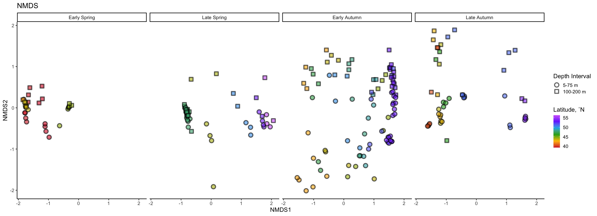
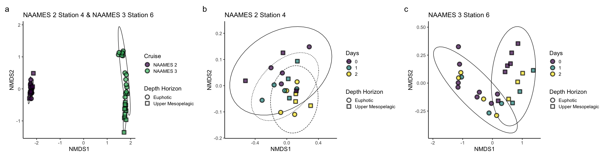

16S
================
Nicholas Baetge
8/13/2020

# Intro

Here, the NAAMES cast 16S sequences processed by Luis Bolanos in the
Giovannoni group are explored

``` r
library(tidyverse) 
library(rmarkdown)
library(knitr)
library(readxl)
library(data.table) 
library(scales)
library(zoo)
library(oce)
library(patchwork)
#rmarkdown tables
library(stargazer)
library(pander)
#stat tests
library(lmtest)
library(lmodel2)
library(rstatix)
library(ggpubr)
#for odv type plots
library(lubridate)
library(reshape2)
library(MBA)
library(mgcv)
#phyloseq
library(phyloseq)

custom_theme <- function() {
  theme_test(base_size = 30) %+replace%
    theme(legend.position = "right",
          legend.spacing.x = unit(0.5,"cm"),
          legend.title = element_text(size = 14),
          legend.text = element_text(size = 14),
          legend.background = element_rect(fill = "transparent",colour = NA),
          legend.key = element_rect(fill = "transparent",colour = NA),
          panel.background = element_rect(fill = "transparent",colour = NA),
          plot.background = element_rect(fill = "transparent",colour = NA)) 
}

custom.colors <- c("AT39" = "#377EB8", "AT34" = "#4DAF4A", "AT38" = "#E41A1C", "AT32" = "#FF7F00", "Temperate" = "#A6CEE3", "Subpolar" = "#377EB8", "Subtropical" = "#FB9A99", "GS/Sargasso" = "#E41A1C", "Early Spring" = "#377EB8", "Late Spring" = "#4DAF4A","Early Autumn" = "#E41A1C", "Summer" = "#E41A1C", "Late Autumn" = "#FF7F00", "Gv2_2019" = "#377EB8", "WOA18_MN" = "#4DAF4A", "WOA18_AN" = "#E41A1C")

levels = c("GS/Sargasso", "Subtropical", "Temperate", "Subpolar",  "AT39-6", "AT34", "AT38", "AT32","South", "North", "Early Spring", "Late Spring","Early Autumn",  "Summer", "Late Autumn", "Gv2_2019", "WOA18_MN", "WOA18_AN","Nov", "Nov sd", "Dec", "Dec sd", "Jan", "Jan sd", "Feb", "Feb sd", "Mar", "Mar sd", "Apr", "Apr sd",  "Cruise", "ARGO", "5-75 m", "100-200 m", "300 m")


bar.colors <- c("100 m" = "white", "CM" = "#4DAF4A",  "PAM" = "#377EB8")

odv.colors <- c("#feb483", "#d31f2a", "#ffc000", "#27ab19", "#0db5e6", "#7139fe", "#d16cfa")
```

# Import Data

``` r
count.tab <- read.table("~/GITHUB/naames_multiday/Input/16s/HetV1OTU.txt", header = T, row.names = 1, check.names = F)

tax.tab <- as.matrix(read.table("~/GITHUB/naames_multiday/Input/16s/HetV1TUtax.txt", header = T, row.names = 1, check.names = F, na.strings = "", sep = "\t"))


ctd <-  readRDS("~/GITHUB/naames_multiday/Input/ctd/deriv_naames_ctd.rds") %>%
              select(Cruise, Station, CampCN,  bin_depth, deriv_o2_umol_l, fl_mg_m3, ave_temp_c, ave_sal_psu) %>% 
              mutate(Cruise = ifelse(Cruise == "AT39", "AT39-6", Cruise)) %>% 
              rename(z = bin_depth,
                     o2 = deriv_o2_umol_l,
                     fl = fl_mg_m3,
                     temp = ave_temp_c,
                     sal = ave_sal_psu) 


npp <- read_rds("~/GITHUB/naames_multiday/Input/Z_resolved_model_NPP.rds") %>% 
  rename(z = depth)

sample.tab <- read_rds("~/GITHUB/naames_multiday/Input/export_ms/processed_bf.2.2020.rds") %>% 
  select(Cruise:CampCN, Target_Z, DNA_ID) %>% 
  drop_na(DNA_ID) %>% 
  rename(z = Target_Z) %>% 
  left_join(., read_rds("~/GITHUB/naames_multiday/Output/processed_data.rds") %>%
              select(Cruise, Station, Date,  CampCN, mld, z,  doc, n, phyc, bc, bcd ) %>% 
              distinct() %>% 
              mutate_at(vars(phyc:bcd), function(x)(x/10^3))) %>% 
  mutate(`Depth Interval` = ifelse(z <= 75, "5-75 m", "100-200 m"),
         `Depth Interval` = ifelse(z == 300, "300 m", `Depth Interval`),
         `Depth Interval` = ifelse(z > 300, "> 300 m", `Depth Interval`)) %>% 
  select(Cruise:z, `Depth Interval`, everything()) %>% 
  left_join(., ctd) %>% 
  left_join(., npp) %>% 
  column_to_rownames(var = "DNA_ID") 
```

# Phyloseq Object

We need to create a phyloseq object that merges all three datasets.
Sometimes this doesn’t work beacuse of the format of the data files.
Make sure all the sample names between the sampleinfo.txt and
seqtab-nochimtaxa.txt are the same

``` r
OTU = otu_table(count.tab, taxa_are_rows = TRUE) 
TAX = tax_table(tax.tab)
SAM = sample_data(sample.tab)
ps = phyloseq(OTU,TAX,SAM) 

sample_data(ps)$`Depth.Interval` <- factor(sample_data(ps)$`Depth.Interval`, levels = levels)
sample_data(ps)$Season <- factor(sample_data(ps)$Season, levels = levels)
```

# Filter sequences

We will filter out Eukaryotes, Archaea, chloroplasts and mitochondria,
because we only intended to amplify bacterial sequences. It’s good to
check you don’t have anything lurking in the taxonomy table.

``` r
sub_ps <- ps %>%
  subset_samples(z %in% c(5, 25, 50, 75, 100, 150, 200, 300)) %>%
  subset_taxa(
    Kingdom == "Bacteria" &
    Family  != "mitochondria" &
    Class   != "Chloroplast"
  )
```

# Sample Summary

As a first analysis, we will look at the distribution of read counts
from our
samples


``` r
# mean, max and min of sample read counts
smin <- min(sample_sums(sub_ps)) #3944
smean <- mean(sample_sums(sub_ps)) #85824.59
smax <- max(sample_sums(sub_ps)) #251468
```

# Stacked Barplots

Let’s make a stacked barplot of Phyla to get a sense of the community
composition in these samples.

Since this is not a quantitative analysis, and since we have more Phyla
in this dataset than we can reasonably distinguish colors, we will prune
out low abundance taxa and only include Phyla that contribute more than
2% of the relative abundance of each sample. Depending on your dataset
and the taxonomic level you are depicting, you can adjust this prune
parameter. In later analyses, we will of course included these taxa, but
for now they will just clutter our plot.

``` r
# melt to long format (for ggploting) 
# prune out phyla below 2% in each sample

sub_ps_phylum <- sub_ps %>%
  tax_glom(taxrank = "Phylum") %>%                     # agglomerate at phylum level
  transform_sample_counts(function(x) {x/sum(x)} ) %>% # Transform to rel. abundance
  psmelt() %>%                                         # Melt to long format
  filter(Abundance > 0.02) %>%                         # Filter out low abundance taxa
  arrange(Phylum)                                      # Sort data frame alphabetically by phylum
```


# Unconstrained Ordination

One of the best exploratory analyses for amplicon data is unconstrained
ordinations. Here we will look at ordinations of our full community
samples. We will rarfy the samples first (scale to the smallest library
size).

## Rarefy

``` r
rarefy_ps = rarefy_even_depth(sub_ps, sample.size = min(sample_sums(sub_ps)), rngseed = 42398403)
```

    ## `set.seed(42398403)` was used to initialize repeatable random subsampling.

    ## Please record this for your records so others can reproduce.

    ## Try `set.seed(42398403); .Random.seed` for the full vector

    ## ...

    ## 3024OTUs were removed because they are no longer 
    ## present in any sample after random subsampling

    ## ...

``` r
sample_data(rarefy_ps)$`Depth.Interval` <- factor(sample_data(rarefy_ps)$`Depth.Interval`, levels = levels)
sample_data(rarefy_ps)$Season <- factor(sample_data(rarefy_ps)$Season, levels = levels)
```

## PCoA

``` r
pcoa <- ordinate(rarefy_ps, method = "PCoA", distance = "bray")
```



## NMDS

Let’s try an NMDS instead. For NMDS plots it’s important to set a seed
since the starting positions of samples in the alogrithm is random.

Important: if you calculate your bray-curtis distance metric “in-line”
it will perform a square root transformation and Wisconsin double
standardization. If you don’t want this, you can calculate your
bray-curtis distance separately

``` r
set.seed(1)

# Ordinate
nmds <- ordinate(rarefy_ps,, method = "NMDS",  distance = "bray") # stress = 0.09
```

    ## Square root transformation
    ## Wisconsin double standardization
    ## Run 0 stress 0.08890296 
    ## Run 1 stress 0.08890297 
    ## ... Procrustes: rmse 1.387239e-05  max resid 0.000144652 
    ## ... Similar to previous best
    ## Run 2 stress 0.09669237 
    ## Run 3 stress 0.09669237 
    ## Run 4 stress 0.08890297 
    ## ... Procrustes: rmse 3.345603e-06  max resid 4.540003e-05 
    ## ... Similar to previous best
    ## Run 5 stress 0.08890296 
    ## ... New best solution
    ## ... Procrustes: rmse 7.903552e-06  max resid 0.0001034218 
    ## ... Similar to previous best
    ## Run 6 stress 0.08890296 
    ## ... New best solution
    ## ... Procrustes: rmse 7.111256e-06  max resid 8.826595e-05 
    ## ... Similar to previous best
    ## Run 7 stress 0.08890296 
    ## ... New best solution
    ## ... Procrustes: rmse 7.51873e-06  max resid 9.856362e-05 
    ## ... Similar to previous best
    ## Run 8 stress 0.08890296 
    ## ... Procrustes: rmse 9.748782e-06  max resid 0.00013415 
    ## ... Similar to previous best
    ## Run 9 stress 0.08890296 
    ## ... Procrustes: rmse 4.587786e-06  max resid 5.384304e-05 
    ## ... Similar to previous best
    ## Run 10 stress 0.09669238 
    ## Run 11 stress 0.08890297 
    ## ... Procrustes: rmse 5.787318e-06  max resid 6.391178e-05 
    ## ... Similar to previous best
    ## Run 12 stress 0.08890297 
    ## ... Procrustes: rmse 4.9495e-06  max resid 6.099517e-05 
    ## ... Similar to previous best
    ## Run 13 stress 0.09669237 
    ## Run 14 stress 0.08890296 
    ## ... Procrustes: rmse 7.215534e-06  max resid 7.574305e-05 
    ## ... Similar to previous best
    ## Run 15 stress 0.08890296 
    ## ... Procrustes: rmse 5.456756e-06  max resid 6.640249e-05 
    ## ... Similar to previous best
    ## Run 16 stress 0.08890296 
    ## ... Procrustes: rmse 9.030003e-06  max resid 0.0001244935 
    ## ... Similar to previous best
    ## Run 17 stress 0.08890296 
    ## ... Procrustes: rmse 7.074506e-06  max resid 9.150535e-05 
    ## ... Similar to previous best
    ## Run 18 stress 0.08890296 
    ## ... New best solution
    ## ... Procrustes: rmse 4.102427e-06  max resid 4.221185e-05 
    ## ... Similar to previous best
    ## Run 19 stress 0.08890296 
    ## ... Procrustes: rmse 6.599265e-06  max resid 7.796936e-05 
    ## ... Similar to previous best
    ## Run 20 stress 0.09669237 
    ## *** Solution reached



NMDS plots attempt to show ordinal distances between samples as
accurately as possible in two dimensions. It is important to report the
stress of these plots, because a high stress value means that the
algorithm had a hard time representing the distances between samples in
2 dimensions. The stress of this plot was good - it was .09 (generally
anything below .2 is considered acceptable). The PCoA for this data was
able to show ~46% variation in just two dimensions, so we may want to
stick with that plot.

# Constrained Ordination

Above we used unconstrained ordinations (PCoA, NMDS) to show
relationships between samples in low dimensions. We can use a
constrained ordination to see how environmental variables are associated
with these changes in community composition. We constrain the ordination
axes to linear combinations of environmental variables. We then plot the
environmental scores onto the ordination

``` r
# Remove data points with missing metadata
ps_not_na <- rarefy_ps %>%
  subset_samples(
    !is.na(mld) &
      !is.na(NPP) & 
      !is.na(doc) &
      !is.na(n) & 
      !is.na(bc) & 
      !is.na(bcd) & 
      !is.na(o2) & 
      !is.na(fl) & 
      !is.na(sal)
  )

bray <- phyloseq::distance(ps_not_na, method = "bray")

# CAP ordinate
cap_ord <- ordinate(ps_not_na, method = "CAP", distance = bray, formula = ~ mld + doc + n  + bcd + o2 + fl + sal + bc + z + Latitude + NPP
)
```


Do a permutational ANOVA on constrained axes used in ordination

``` r
anova(cap_ord)
```

    ## Permutation test for capscale under reduced model
    ## Permutation: free
    ## Number of permutations: 999
    ## 
    ## Model: capscale(formula = distance ~ mld + doc + n + bcd + o2 + fl + sal + bc + z + Latitude + NPP, data = data)
    ##           Df SumOfSqs      F Pr(>F)    
    ## Model     11   23.673 15.988  0.001 ***
    ## Residual 150   20.191                  
    ## ---
    ## Signif. codes:  0 '***' 0.001 '**' 0.01 '*' 0.05 '.' 0.1 ' ' 1

# Alpha Diversity

Estimating alpha diversity of microbial communities is
[problematic](https://www.ncbi.nlm.nih.gov/pmc/articles/PMC93182/) no
matter what you do. We will use the rarefied library, which retains
estimates of the species abundance of the real population while
standardizing sampling effort.

``` r
# Initialize matrices to store richness and evenness estimates
nsamp = nsamples(rarefy_ps)
trials = 100

richness <- matrix(nrow = nsamp, ncol = trials)
row.names(richness) <- sample_names(rarefy_ps)

evenness <- matrix(nrow = nsamp, ncol = trials)
row.names(evenness) <- sample_names(rarefy_ps)

# It is always important to set a seed when you subsample so your result is replicable 
set.seed(3)

for (i in 1:100) {
  # Subsample
  r <- rarefy_ps
  
  # Calculate richness
  rich <- as.numeric(as.matrix(estimate_richness(r, measures = "Observed")))
  richness[ ,i] <- rich
  
  # Calculate evenness
  even <- as.numeric(as.matrix(estimate_richness(r, measures = "InvSimpson")))
  evenness[ ,i] <- even
}
```

Let’s calculate the mean and standard deviation per sample for observed
richness and inverse simpson’s index and store those values in a
dataframe.

``` r
# Create a new dataframe to hold the means and standard deviations of richness estimates
DNA_ID <- row.names(richness)
mean <- apply(richness, 1, mean)
sd <- apply(richness, 1, sd)
measure <- rep("Richness", nsamp)
rich_stats <- data.frame(DNA_ID, mean, sd, measure)

# Create a new dataframe to hold the means and standard deviations of evenness estimates
DNA_ID <- row.names(evenness)
mean <- apply(evenness, 1, mean)
sd <- apply(evenness, 1, sd)
measure <- rep("Inverse Simpson", nsamp)
even_stats <- data.frame(DNA_ID, mean, sd, measure)
```

Now we will combine our estimates for richness and evenness into one
dataframe

``` r
alpha <- rbind(rich_stats, even_stats)
```

Let’s add the sample metadata into this
dataframe

``` r
alphadiv <- left_join(alpha, sample.tab %>% rownames_to_column(., var = "DNA_ID")) %>% 
  arrange(CampCN, z)
```

    ## Joining, by = "DNA_ID"

``` r
alphadiv$Season <- factor(alphadiv$Season, levels = levels)
alphadiv$`Depth Interval` <- factor(alphadiv$`Depth Interval`, levels = levels)
```


# Custom Table

phyloseq objects can sometimes be hard to handle when you have a
particular plot in mind that you want to make. to make it easier for us:
we’ll extract the relative abundance data from the object and merge them
with the taxa and sample info data as a new dataframe

## Generate relative abundances

Our data currently shows the relative proportion of different sequences
to the total number of gene copies recovered, so we’ll normalize the
gene copy number

``` r
ps_std <- transform_sample_counts(sub_ps, function(x) x/sum(x))
#extract the relative abundance table and coerce into dataframe
ps_std.tab <- as(otu_table(ps_std), "matrix")
ps_std.df = as.data.frame(ps_std.tab) 
```

## Table with Rel Abund, Taxa, Sample Info

Create a new table that combines relative abundances with the taxa table

``` r
#first coerce the taxa table into a data frame
tax.df = as.data.frame(tax.tab) 
#then combine the data frames
custom.tab <- tax.df %>% 
  rownames_to_column(., var = "asv") %>% 
  left_join(., ps_std.df %>% rownames_to_column(., var = "asv")) %>% 
  #create a new index of that combines the  class, order, family, and genus values
  mutate(cofg = paste(Class, "_", Order,"_", Family, "_", Genus )) %>% 
  select(-c(asv:Genus)) %>% 
  select(cofg:everything()) 
```

    ## Joining, by = "asv"

    ## Warning in x:y: numerical expression has 247 elements: only the first used

``` r
#save the row names and then make them into the column names
colnames <- custom.tab[,1]

#transpose the dataframe so we can merge with the sample info table
t_custom.tab <-  as.data.frame(t(custom.tab[,-1]))
colnames(t_custom.tab) <- colnames

#merge
sweet.tab <- t_custom.tab %>% 
  rownames_to_column(., var = "sample") %>% 
  left_join(., sample.tab %>% rownames_to_column(., var = "sample")) %>% 
  select(sample, Cruise:bcd, everything()) %>% 
  arrange(CampCN, z)
```

    ## Warning: The `.data` argument of `add_column()` must have unique names as of tibble 3.0.0.
    ## Use `.name_repair = "minimal"`.
    ## This warning is displayed once every 8 hours.
    ## Call `lifecycle::last_warnings()` to see where this warning was generated.

    ## Joining, by = "sample"

## Save

``` r
saveRDS(sweet.tab, "~/GITHUB/naames_multiday/Output/Custom_ASV_Table.rds")
```
