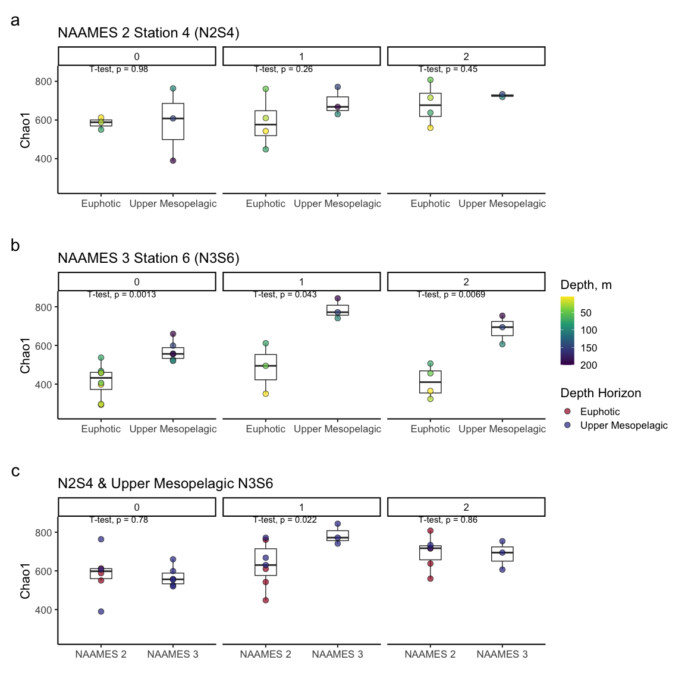
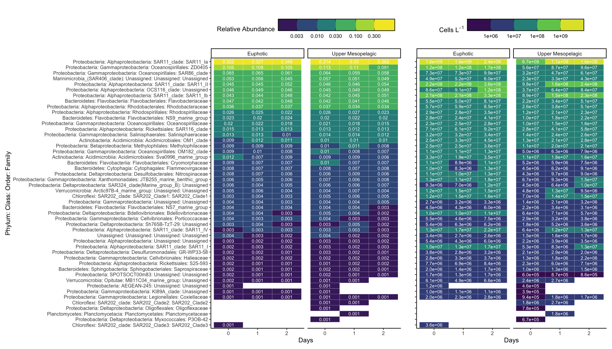

16S
================
Nicholas Baetge
8/13/2020

# Intro

Here, the NAAMES cast 16S sequences processed by Luis Bolanos in the
Giovannoni group are explored

``` r
library(tidyverse) 
library(rmarkdown)
library(patchwork)
library(lubridate)
library(phyloseq)
library(RColorBrewer)
library(ggpubr)
library(viridis)
```

``` r
custom.colors <- c("AT39" = "#377EB8", "AT34" = "#4DAF4A", "AT38" = "#E41A1C", "AT32" = "#FF7F00", "NAAMES 4" = "#377EB8", "NAAMES 2" = "#4DAF4A", "NAAMES 3" = "#E41A1C", "NAAMES 1" = "#FF7F00", "Temperate" = "#A6CEE3", "Subpolar" = "#377EB8", "Subtropical" = "#FB9A99", "GS/Sargasso" = "#E41A1C", "Early Spring" = "#377EB8", "Late Spring" = "#4DAF4A","Early Autumn" = "#E41A1C", "Late Autumn" = "#FF7F00",  "0-75 m" = "#A50026", "75-200 m" = "#313695", "Euphotic" = "#A50026", "Upper Mesopelagic" = "#313695", "Mesopelagic" = "#d16cfa")

levels = c("GS/Sargasso", "Subtropical", "Temperate", "Subpolar",  "AT39-6", "AT34", "AT38", "AT32","South", "North", "Early Spring", "Late Spring","Early Autumn",  "Late Autumn", "5-75 m", "100-200 m", "300 m", "Euphotic", "Upper Mesopelagic")

#odv.colors <- c("#feb483", "#d31f2a", "#ffc000", "#27ab19", "#0db5e6", "#7139fe", "#d16cfa")
odv.colors <- c( "#d31f2a", "#ffc000", "#27ab19", "#0db5e6", "#7139fe", "#d16cfa")

matlab.colors <- c("#A50026", "#D73027", "#F46D43", "#FDAE61", "#FEE090", "#FFFFBF", "#E0F3F8", "#ABD9E9", "#74ADD1", "#4575B4", "#313695")
matlab.colors2 <- c("#A50026", "#D73027", "#F46D43", "#FDAE61",  "#ABD9E9", "#74ADD1", "#4575B4", "#313695")
```

# Import Data

``` r
count.tab <- read.table("~/GITHUB/naames_multiday/Input/16s/HetV1OTU.txt", header = T, row.names = 1, check.names = F)

tax.tab <- as.matrix(read.table("~/GITHUB/naames_multiday/Input/16s/HetV1TUtax.txt", header = T, row.names = 1, check.names = F, na.strings = "", sep = "\t"))


ctd <-  readRDS("~/GITHUB/naames_multiday/Input/ctd_data.rds") %>%
  select(Cruise, Station, CampCN,  z, deriv_o2_umol_l, aou_c, fl_mg_m3, ave_temp_c, ave_sal_psu, ave_dens_kg_m3, beamT_perc ) %>%
  mutate(Cruise = ifelse(Cruise == "AT39", "AT39-6", Cruise)) %>%
  rename(o2 = deriv_o2_umol_l,
         aou_c = aou_c,
         fl = fl_mg_m3,
         temp = ave_temp_c,
         sal = ave_sal_psu,
         dens = ave_dens_kg_m3,
         beamt = beamT_perc) %>% 
  mutate_at(vars(Station), as.character) %>% 
  mutate(Station = ifelse(Cruise == "AT38" & Station == 0, "1A", Station)) 
  


npp <- read_rds("~/GITHUB/naames_multiday/Input/npp_data.rds")

sample.tab <- read_rds("~/GITHUB/naames_multiday/Input/master/processed_bf.8.2020.rds") %>% 
  select(Cruise:CampCN, Target_Z, DNA_ID) %>% 
  drop_na(DNA_ID) %>% 
  rename(z = Target_Z) %>% 
  left_join(., read_rds("~/GITHUB/naames_multiday/Output/processed_data.rds") %>%
              select(Cruise, Station, Date,  CampCN, mld, ez, z, ba, doc, tdaa, n, phyc, bcd ) %>% 
              distinct() %>% 
              mutate_at(vars(Station), as.character) %>% 
              mutate(Station = ifelse(Cruise == "AT38" & Station == 0, "1A", Station)) %>% 
              mutate_at(vars(phyc:bcd), function(x)(x/10^3))) %>% 
  mutate(z_interv = ifelse(z <= ez, "Euphotic", NA),
         z_interv = ifelse(z > ez & z <= 200 , "Upper Mesopelagic", z_interv),
         z_interv = ifelse(z == 300, "300 m", z_interv),
         
         z_interv = ifelse(is.na(z_interv) & z <= 75, "0-75 m", z_interv),
         z_interv = ifelse(is.na(z_interv) & z > 75 & z <= 200 , "75-200 m", z_interv)
         ) %>% 
  select(Cruise:z,  z_interv, everything()) %>% 
  mutate(Cruise2 = ifelse(Cruise == "AT32", "NAAMES 1", "NAAMES 2"),
         Cruise2 = ifelse(Cruise == "AT38", "NAAMES 3", Cruise2),
         Cruise2 = ifelse(Cruise == "AT39", "NAAMES 4", Cruise2)) %>% 
  select(Cruise, Cruise2, everything()) %>% 
  left_join(., ctd) %>% 
  left_join(., npp %>% mutate_at(vars(Station), as.character)) %>% 
  rename(latitude = Latitude) %>% 
  mutate(eddy = ifelse(Cruise == "AT34" & Station == 4, "Core", NA),
         eddy = ifelse(Date == "2016-05-27", "Periphery", eddy)) %>% 
  group_by(Cruise, Station) %>% 
  mutate(time = ymd_hms(datetime),
         interv = interval(first(time), time),
         dur = as.duration(interv),
         days = round(as.numeric(dur, "days"))) %>% 
  ungroup() %>% 
  column_to_rownames(var = "DNA_ID") %>% 
  select(Cruise:CampCN, eddy,  days, everything()) %>% 
  select(-c(time:dur)) 
```

# Phyloseq Object

We need to create a phyloseq object that merges all three datasets.
Sometimes this doesn’t work beacuse of the format of the data files.
Make sure all the sample names between the sampleinfo.txt and
seqtab-nochimtaxa.txt are the same

``` r
OTU = otu_table(count.tab, taxa_are_rows = TRUE) 
TAX = tax_table(tax.tab)
SAM = sample_data(sample.tab)
ps = phyloseq(OTU,TAX,SAM) 

sample_data(ps)$z_interv <- factor(sample_data(ps)$z_interv, levels = levels)
sample_data(ps)$Season <- factor(sample_data(ps)$Season, levels = levels)
```

# Filter sequences

We will filter out chloroplasts and mitochondria, because we only
intended to amplify bacterial sequences. It’s good to check you don’t
have anything lurking in the taxonomy table.

``` r
sub_ps <- ps %>%
  subset_samples(z %in% c(5, 25, 50, 75, 100, 150, 200)) %>%
  subset_taxa(
    Family  != "mitochondria" &
    Order   != "Chloroplast")
```

# Sample Summary

As a first analysis, we will look at the distribution of read counts
from our
samples


``` r
# mean, max and min of sample read counts
smin <- min(sample_sums(sub_ps)) 
smean <- mean(sample_sums(sub_ps)) 
smax <- max(sample_sums(sub_ps)) 
```

# Beta Diversity

Beta diversity involves calculating metrics such as distances or
dissimilarities based on pairwise comparisons of samples – they don’t
exist for a single sample, but rather only as metrics that relate
samples to each other. i.e. beta diversity = patterns in community
structure between samples

Since differences in sampling depths between samples can influence
distance/dissimilarity metrics, we first need to somehow normalize the
read depth across our samples.

## Subsample

We will rarefy (random subsample with replacement) the min read depth of
the samples first (scale to the smallest library size) according to
Bolaños et al 2021.

A strong reason to subsample is to standardize effort. The bottom line
is that in all experimental design you should not be comparing things to
which you devote different effort in resolution. For instance, you don’t
sample one site once a week and another once a month if you want to
compare the dynamics between the sites. You standardize
effort.

``` r
ps_min <-  rarefy_even_depth(sub_ps, sample.size = smin, rngseed = 532898)
```

    ## `set.seed(532898)` was used to initialize repeatable random subsampling.

    ## Please record this for your records so others can reproduce.

    ## Try `set.seed(532898); .Random.seed` for the full vector

    ## ...

    ## 2659OTUs were removed because they are no longer 
    ## present in any sample after random subsampling

    ## ...

We can also subset the N2 and the N2S4 data here

``` r
n2s4_core <- ps_min %>% 
  subset_samples(Cruise == "AT34" & Station == 4 & eddy == "Core")

n3s6 <- ps_min %>% 
  subset_samples(Cruise == "AT38" & Station == 6)

s4s6_core <- ps_min %>% 
  subset_samples(Cruise == "AT38" & Station == 6 | Cruise == "AT34" & Station == 4 & eddy == "Core")

s4_core_s6_mz <- s4s6_core %>% 
  subset_samples(Cruise != "AT38" | Station != 6 | z_interv != "Euphotic")
```

## Unconstrained Ordination

One of the best exploratory analyses for amplicon data is unconstrained
ordinations. Here we will look at ordinations of our subsampled dataset

### NMDS

Let’s try an NMDS. For NMDS plots it’s important to set a seed since the
starting positions of samples in the alogrithm is random.

``` r
set.seed(7)
# Ordinate
nmds_n2s4_core <- ordinate(n2s4_core, method = "NMDS",  distance = "bray") # stress = 0.10
```

    ## Square root transformation
    ## Wisconsin double standardization
    ## Run 0 stress 0.09122309 
    ## Run 1 stress 0.3751406 
    ## Run 2 stress 0.08933538 
    ## ... New best solution
    ## ... Procrustes: rmse 0.03337478  max resid 0.1154656 
    ## Run 3 stress 0.09114085 
    ## Run 4 stress 0.09173393 
    ## Run 5 stress 0.09393474 
    ## Run 6 stress 0.09114139 
    ## Run 7 stress 0.08410648 
    ## ... New best solution
    ## ... Procrustes: rmse 0.03893832  max resid 0.166504 
    ## Run 8 stress 0.08955914 
    ## Run 9 stress 0.08955722 
    ## Run 10 stress 0.09179925 
    ## Run 11 stress 0.08939008 
    ## Run 12 stress 0.09541154 
    ## Run 13 stress 0.08955619 
    ## Run 14 stress 0.09371679 
    ## Run 15 stress 0.09219313 
    ## Run 16 stress 0.09576288 
    ## Run 17 stress 0.1012575 
    ## Run 18 stress 0.09123194 
    ## Run 19 stress 0.09005606 
    ## Run 20 stress 0.09557875 
    ## *** No convergence -- monoMDS stopping criteria:
    ##     20: stress ratio > sratmax

``` r
set.seed(8)
# Ordinate
nmds_n3s6 <- ordinate(n3s6, method = "NMDS",  distance = "bray") # stress = 0.03
```

    ## Square root transformation
    ## Wisconsin double standardization
    ## Run 0 stress 0.02580872 
    ## Run 1 stress 0.0269572 
    ## Run 2 stress 0.02589224 
    ## ... Procrustes: rmse 0.005082993  max resid 0.01795071 
    ## Run 3 stress 0.02580433 
    ## ... New best solution
    ## ... Procrustes: rmse 0.002977779  max resid 0.01089286 
    ## Run 4 stress 0.04031005 
    ## Run 5 stress 0.02580698 
    ## ... Procrustes: rmse 0.003333821  max resid 0.01266351 
    ## Run 6 stress 0.02589182 
    ## ... Procrustes: rmse 0.003990789  max resid 0.01695553 
    ## Run 7 stress 0.02580569 
    ## ... Procrustes: rmse 0.0002089554  max resid 0.0004355233 
    ## ... Similar to previous best
    ## Run 8 stress 0.02580822 
    ## ... Procrustes: rmse 0.003035082  max resid 0.01106876 
    ## Run 9 stress 0.02581008 
    ## ... Procrustes: rmse 0.003575478  max resid 0.01446076 
    ## Run 10 stress 0.03722073 
    ## Run 11 stress 0.03967481 
    ## Run 12 stress 0.02580411 
    ## ... New best solution
    ## ... Procrustes: rmse 4.232568e-05  max resid 9.671788e-05 
    ## ... Similar to previous best
    ## Run 13 stress 0.02704044 
    ## Run 14 stress 0.02580713 
    ## ... Procrustes: rmse 0.003302405  max resid 0.01235021 
    ## Run 15 stress 0.03363886 
    ## Run 16 stress 0.02580569 
    ## ... Procrustes: rmse 0.0002864986  max resid 0.0006084516 
    ## ... Similar to previous best
    ## Run 17 stress 0.03379341 
    ## Run 18 stress 0.02589355 
    ## ... Procrustes: rmse 0.003902512  max resid 0.01562547 
    ## Run 19 stress 0.02695565 
    ## Run 20 stress 0.02695631 
    ## *** Solution reached

``` r
set.seed(8)
# Ordinate
nmds_s4s6_core <- ordinate(s4s6_core, method = "NMDS",  distance = "bray") # stress = 0.02
```

    ## Square root transformation
    ## Wisconsin double standardization
    ## Run 0 stress 0.01772897 
    ## Run 1 stress 0.02151576 
    ## Run 2 stress 0.02148328 
    ## Run 3 stress 0.02209361 
    ## Run 4 stress 0.02221859 
    ## Run 5 stress 0.03089646 
    ## Run 6 stress 0.02151487 
    ## Run 7 stress 0.02257963 
    ## Run 8 stress 0.01985716 
    ## Run 9 stress 0.02210267 
    ## Run 10 stress 0.02142375 
    ## Run 11 stress 0.01985626 
    ## Run 12 stress 0.01772932 
    ## ... Procrustes: rmse 0.0005013754  max resid 0.001024243 
    ## ... Similar to previous best
    ## Run 13 stress 0.02141993 
    ## Run 14 stress 0.01985858 
    ## Run 15 stress 0.0177292 
    ## ... Procrustes: rmse 0.0004703579  max resid 0.0009594884 
    ## ... Similar to previous best
    ## Run 16 stress 0.03146957 
    ## Run 17 stress 0.0177298 
    ## ... Procrustes: rmse 0.0005445627  max resid 0.001115994 
    ## ... Similar to previous best
    ## Run 18 stress 0.01772902 
    ## ... Procrustes: rmse 0.0004611105  max resid 0.0009433566 
    ## ... Similar to previous best
    ## Run 19 stress 0.01772921 
    ## ... Procrustes: rmse 0.0004839269  max resid 0.0009882156 
    ## ... Similar to previous best
    ## Run 20 stress 0.01772998 
    ## ... Procrustes: rmse 0.0005705123  max resid 0.001169146 
    ## ... Similar to previous best
    ## *** Solution reached

NMDS plots attempt to show ordinal distances between samples as
accurately as possible in two dimensions. It is important to report the
stress of these plots, because a high stress value means that the
algorithm had a hard time representing the distances between samples in
2 dimensions. The stress of these plots were good - it was .1 (generally
anything below .2 is considered acceptable).

``` r
(nmds_s4s6_core.plot + 
  guides( shape = guide_legend(title = "Depth Horizon"), color = F,  linetype = guide_legend(title = "Depth Horizon"), fill = guide_legend(title = "Cruise", override.aes = list(shape = 21)))) +
  

(nmds_n2s4_core.plot + 
  guides(fill = guide_colorbar(title = "Days"), shape = guide_legend(title = "Depth Horizon"), linetype = guide_legend(title = "Days"), color = F)) +
  
  (nmds_n3s6.plot + 
  guides(fill = guide_colorbar(title = "Days"), shape = guide_legend(title = "Depth Horizon"),  linetype = guide_legend(title = "Depth Horizon"), color = F)) +
  

  plot_annotation(tag_levels = "a") &
  theme(plot.tag = element_text(size = 22),
        plot.title = element_text(size = 18)) 
```

<!-- -->

95% confidence interval ellipse for the mean (group centroid) tells us
something about the sampling distribution of the mean (centroid) we
might see if we repeated your data collection a lot of times. In other
words we are looking at the uncertainty in the estimate of the
population mean (centroid) given the sample of data we collected.

# Betadisper and permutational ANOVA

Above, we performed beta diversity analyses on Bray-Curtis distances on
rarefied datasets that were then visualized using NMDS. We can test if
there are statistically significant differences between sample groups
using the betadisper and adonis functions of the vegan package.
Betadisper tests whether two or more groups are homogeneously dispersed
in relation to their species in studied samples. This test can be done
to see if one group has more compositional variance than another.
Moreover, homogeneity of dispersion among groups is very advisable to
have if you want to test if two or more groups have different
compositions, which is tested by adonis.

## Phyloseq to DESeq, distance matrix

To be able to run the stats, we first have to create a distance matrix
from our data. We’ll use the DESeq package to do so.

``` r
library(DESeq2)
library(vegan)
```

``` r
deseq_counts <- phyloseq_to_deseq2(ps_min, design = ~latitude ) #the design argument is required but doesn't matter here
```

    ## converting counts to integer mode

    ##   the design formula contains one or more numeric variables that have mean or
    ##   standard deviation larger than 5 (an arbitrary threshold to trigger this message).
    ##   it is generally a good idea to center and scale numeric variables in the design
    ##   to improve GLM convergence.

``` r
deseq_count_tab <- assay(deseq_counts) #extract the read count matrix
```

We’ll calculate bray-curtis distances, which reflect the NMDS
ordinations
above

``` r
#We can subset our data if we want to and calculate distances/run stats for only a subset of the group. The code below shows how

sample.tab2 <- sample.tab %>%
  rownames_to_column() %>% 
  filter(z %in% c(5, 25, 50, 75, 100, 150, 200)) %>% 
  column_to_rownames(var = "rowname")


subset_sample_IDs_n2s4_ez <-  row.names(sample.tab2)[sample.tab2$Station == 4 & sample.tab2$Cruise == "AT34" & sample.tab2$eddy == "Core" & sample.tab2$z <= sample.tab2$ez]

dist_n2s4_ez <- vegdist(t(deseq_count_tab[ , colnames(deseq_count_tab) %in% subset_sample_IDs_n2s4_ez]), method = "bray")

sample_info_tab_n2s4_ez <- sample.tab2[row.names(sample.tab2) %in% subset_sample_IDs_n2s4_ez, ]

####


subset_sample_IDs_n2s4_mz <-  row.names(sample.tab2)[sample.tab2$Station == 4 & sample.tab2$Cruise == "AT34" & sample.tab2$eddy == "Core" & sample.tab2$z > sample.tab2$ez]

dist_n2s4_mz <- vegdist(t(deseq_count_tab[ , colnames(deseq_count_tab) %in% subset_sample_IDs_n2s4_mz]), method = "bray")

sample_info_tab_n2s4_mz <- sample.tab2[row.names(sample.tab2) %in% subset_sample_IDs_n2s4_mz, ]


####

subset_sample_IDs_n3s6 <-  row.names(sample.tab2)[sample.tab2$Station == 6 & sample.tab2$Cruise == "AT38"]

dist_n3s6 <- vegdist(t(deseq_count_tab[ , colnames(deseq_count_tab) %in% subset_sample_IDs_n3s6]), method = "bray")

sample_info_tab_n3s6 <- sample.tab2[row.names(sample.tab2) %in% subset_sample_IDs_n3s6, ]

####

subset_sample_IDs_n3s6_ez <-  row.names(sample.tab2)[sample.tab2$Station == 6 & sample.tab2$Cruise == "AT38" & sample.tab2$z <= sample.tab2$ez]

dist_n3s6_ez <- vegdist(t(deseq_count_tab[ , colnames(deseq_count_tab) %in% subset_sample_IDs_n3s6_ez]), method = "bray")

sample_info_tab_n3s6_ez <- sample.tab2[row.names(sample.tab2) %in% subset_sample_IDs_n3s6_ez, ]

####

subset_sample_IDs_n3s6_mz <-  row.names(sample.tab2)[sample.tab2$Station == 6 & sample.tab2$Cruise == "AT38" & sample.tab2$z > sample.tab2$ez]

dist_n3s6_mz <- vegdist(t(deseq_count_tab[ , colnames(deseq_count_tab) %in% subset_sample_IDs_n3s6_mz]), method = "bray")

sample_info_tab_n3s6_mz <- sample.tab2[row.names(sample.tab2) %in% subset_sample_IDs_n3s6_mz, ]
```

Betadisper first calculates the average distance of group members to the
group centroid in multivariate space (generated by a distance matrix).

In the function below: we are using the distance matrix to calculate the
multivariate dispersions (variances; average distance to centroids). We
then use group dispersions to perform an ANOVA test.

``` r
anova(betadisper(dist_n2s4_ez, sample_info_tab_n2s4_ez$days)) 
```

    ## Analysis of Variance Table
    ## 
    ## Response: Distances
    ##           Df     Sum Sq    Mean Sq F value Pr(>F)
    ## Groups     2 0.00053697 0.00026849  1.4024 0.3164
    ## Residuals  6 0.00114868 0.00019145

The ANOVA’s p-value is not significant meaning that group dispersions
are homogenous (“Null hypothesis of no difference in dispersion between
groups”)

``` r
anova(betadisper(dist_n2s4_mz, sample_info_tab_n2s4_mz$days)) 
```

    ## Analysis of Variance Table
    ## 
    ## Response: Distances
    ##           Df    Sum Sq    Mean Sq F value  Pr(>F)  
    ## Groups     2 0.0017581 0.00087905  3.3672 0.08096 .
    ## Residuals  9 0.0023496 0.00026106                  
    ## ---
    ## Signif. codes:  0 '***' 0.001 '**' 0.01 '*' 0.05 '.' 0.1 ' ' 1

``` r
anova(betadisper(dist_n3s6, sample_info_tab_n3s6$z_interv)) 
```

    ## Analysis of Variance Table
    ## 
    ## Response: Distances
    ##           Df  Sum Sq  Mean Sq F value Pr(>F)
    ## Groups     1 0.02344 0.023438  1.0403 0.3175
    ## Residuals 25 0.56323 0.022529

``` r
anova(betadisper(dist_n3s6_ez, sample_info_tab_n3s6_ez$days)) 
```

    ## Analysis of Variance Table
    ## 
    ## Response: Distances
    ##           Df    Sum Sq   Mean Sq F value  Pr(>F)  
    ## Groups     2 0.0074403 0.0037201  12.446 0.01917 *
    ## Residuals  4 0.0011956 0.0002989                  
    ## ---
    ## Signif. codes:  0 '***' 0.001 '**' 0.01 '*' 0.05 '.' 0.1 ' ' 1

``` r
anova(betadisper(dist_n3s6_mz, sample_info_tab_n3s6_mz$days)) 
```

    ## Analysis of Variance Table
    ## 
    ## Response: Distances
    ##           Df   Sum Sq   Mean Sq F value Pr(>F)
    ## Groups     2 0.000447 0.0002233  0.0215 0.9788
    ## Residuals 17 0.176695 0.0103938

**Our groups (depth horizon, Days) within N2S4 and N3S6 do present
homogeneity among group dispersions (compositions vary similarly). The
exception is euphotic zone N3S6 (p = 0.02)**

``` r
adonis(dist_n2s4_ez~sample_info_tab_n2s4_ez$days)
```

    ## 
    ## Call:
    ## adonis(formula = dist_n2s4_ez ~ sample_info_tab_n2s4_ez$days) 
    ## 
    ## Permutation: free
    ## Number of permutations: 999
    ## 
    ## Terms added sequentially (first to last)
    ## 
    ##                              Df SumsOfSqs  MeanSqs F.Model      R2 Pr(>F)
    ## sample_info_tab_n2s4_ez$days  1  0.009915 0.009915 0.81045 0.10376  0.876
    ## Residuals                     7  0.085638 0.012234         0.89624       
    ## Total                         8  0.095553                  1.00000

``` r
adonis(dist_n2s4_mz~sample_info_tab_n2s4_mz$days)
```

    ## 
    ## Call:
    ## adonis(formula = dist_n2s4_mz ~ sample_info_tab_n2s4_mz$days) 
    ## 
    ## Permutation: free
    ## Number of permutations: 999
    ## 
    ## Terms added sequentially (first to last)
    ## 
    ##                              Df SumsOfSqs  MeanSqs F.Model      R2 Pr(>F)  
    ## sample_info_tab_n2s4_mz$days  1  0.030174 0.030174  2.4337 0.19573  0.012 *
    ## Residuals                    10  0.123986 0.012399         0.80427         
    ## Total                        11  0.154160                  1.00000         
    ## ---
    ## Signif. codes:  0 '***' 0.001 '**' 0.01 '*' 0.05 '.' 0.1 ' ' 1

``` r
adonis(dist_n3s6~sample_info_tab_n3s6$z_interv)
```

    ## 
    ## Call:
    ## adonis(formula = dist_n3s6 ~ sample_info_tab_n3s6$z_interv) 
    ## 
    ## Permutation: free
    ## Number of permutations: 999
    ## 
    ## Terms added sequentially (first to last)
    ## 
    ##                               Df SumsOfSqs MeanSqs F.Model      R2 Pr(>F)   
    ## sample_info_tab_n3s6$z_interv  1    0.6734 0.67344  6.6519 0.21016  0.004 **
    ## Residuals                     25    2.5310 0.10124         0.78984          
    ## Total                         26    3.2045                 1.00000          
    ## ---
    ## Signif. codes:  0 '***' 0.001 '**' 0.01 '*' 0.05 '.' 0.1 ' ' 1

``` r
adonis(dist_n3s6_ez~sample_info_tab_n3s6_ez$days)
```

    ## Set of permutations < 'minperm'. Generating entire set.

    ## 
    ## Call:
    ## adonis(formula = dist_n3s6_ez ~ sample_info_tab_n3s6_ez$days) 
    ## 
    ## Permutation: free
    ## Number of permutations: 5039
    ## 
    ## Terms added sequentially (first to last)
    ## 
    ##                              Df SumsOfSqs  MeanSqs F.Model      R2 Pr(>F)
    ## sample_info_tab_n3s6_ez$days  1  0.010929 0.010929  0.8988 0.15237   0.53
    ## Residuals                     5  0.060795 0.012159         0.84763       
    ## Total                         6  0.071724                  1.00000

``` r
adonis(dist_n3s6_mz~sample_info_tab_n3s6_mz$days)
```

    ## 
    ## Call:
    ## adonis(formula = dist_n3s6_mz ~ sample_info_tab_n3s6_mz$days) 
    ## 
    ## Permutation: free
    ## Number of permutations: 999
    ## 
    ## Terms added sequentially (first to last)
    ## 
    ##                              Df SumsOfSqs  MeanSqs F.Model      R2 Pr(>F)
    ## sample_info_tab_n3s6_mz$days  1   0.07919 0.079193  1.0937 0.05728  0.313
    ## Residuals                    18   1.30336 0.072409         0.94272       
    ## Total                        19   1.38255                  1.00000

Adonis analyzes and partitions sums of squares using distance matrices.
It can be seen as an ANOVA using distance matrices (analogous to MANOVA
– multivariate analysis of variance). Therefore, it is used to test if
two or more groups have similar compositions.

**Our groups (depth horizon, days) at N2S4 present homogeneity among
group dispersions (compositions vary similarly). Only in the mesopelagic
do communities shift **

**Our groups (depth horizon, days) at N3S6 Ez present homogeneity among
group dispersions (compositions vary similarly) and do not have
significantly different compositions. Our groups at N3S6 Ez don not
present homogeneity among group dispersions**

# Alpha Diversity

We are going to calculate the the Chao1 diversity index.

**it is important to note that the alpha diversity values are not
interpretable as “real” numbers of anything (due to the nature of
amplicon data), but they can still be useful as relative metrics of
comparison.**

[Chao1: nonparametric estimation of minimum community
richness](https://www.jstor.org/stable/4615964?seq=1#metadata_info_tab_contents)

``` r
richness_n2s4 <- estimate_richness(n2s4_core, measures = c("Chao1", "Shannon")) %>% 
  rownames_to_column(., var = "DNA_ID") %>% 
  mutate_at(vars(DNA_ID), str_replace_all, pattern = "NAAMES2.", "NAAMES2-") 
```

``` r
richness_n3s6 <- estimate_richness(n3s6, measures = c("Chao1", "Shannon")) %>% 
  rownames_to_column(., var = "DNA_ID") %>% 
  mutate_at(vars(DNA_ID), str_replace_all, pattern = "N3S6C4.", "N3S6C4-") %>% 
  mutate_at(vars(DNA_ID), str_replace_all, pattern = "N3S6C5.", "N3S6C5-") %>% 
  mutate_at(vars(DNA_ID), str_replace_all, pattern = "N3S6C7.", "N3S6C7-") %>% 
  mutate_at(vars(DNA_ID), str_replace_all, pattern = "N3S6C10.", "N3S6C10-")  
```

``` r
richness_s4_core_s6_mz <- estimate_richness(s4_core_s6_mz, measures = c("Chao1", "Shannon")) %>% 
  rownames_to_column(., var = "DNA_ID") %>% 
  mutate_at(vars(DNA_ID), str_replace_all, pattern = "NAAMES2.", "NAAMES2-") %>% 
  mutate_at(vars(DNA_ID), str_replace_all, pattern = "N3S6C4.", "N3S6C4-") %>% 
  mutate_at(vars(DNA_ID), str_replace_all, pattern = "N3S6C5.", "N3S6C5-") %>% 
  mutate_at(vars(DNA_ID), str_replace_all, pattern = "N3S6C7.", "N3S6C7-") %>% 
  mutate_at(vars(DNA_ID), str_replace_all, pattern = "N3S6C10.", "N3S6C10-")  
```

Let’s add the sample metadata into these
dataframes

``` r
alphadiv_n2s4 <- left_join(richness_n2s4, sample.tab2 %>% rownames_to_column(., var = "DNA_ID")) 
```

    ## Joining, by = "DNA_ID"

``` r
alphadiv_n3s6 <- left_join(richness_n3s6, sample.tab2 %>% rownames_to_column(., var = "DNA_ID")) 
```

    ## Joining, by = "DNA_ID"

``` r
alphadiv_s4_core_s6_mz <- left_join(richness_s4_core_s6_mz, sample.tab2 %>% rownames_to_column(., var = "DNA_ID"))  
```

    ## Joining, by = "DNA_ID"

``` r
alpha.plot_n2s4 / alpha.plot_n3s6 / alpha.plot_s4_core_s6_mz + 
  
  plot_layout(guides = 'collect') +
  plot_annotation(tag_levels = "a") &
  theme(plot.tag = element_text(size = 22),
        plot.title = element_text(size = 18)) 
```

    ## Warning: Removed 2 rows containing non-finite values (stat_boxplot).

    ## Warning: Removed 2 rows containing non-finite values (stat_compare_means).

    ## Warning: Removed 2 rows containing missing values (geom_point).

    ## Warning: Computation failed in `stat_compare_means()`:
    ## not enough 'y' observations

    ## Warning: Removed 2 rows containing non-finite values (stat_boxplot).

    ## Warning: Removed 2 rows containing non-finite values (stat_compare_means).

    ## Warning: Removed 2 rows containing missing values (geom_point).

<!-- -->

Boxes represent the 1.5 interquartile range, with the internal solid
line representing the median. Circles represent data points. Difference
in the alpha diversity indexes among conditions were tested using
pairwise t-tests; p \< 0.05 was considered the threshold significance
for a difference between conditions.

# Who??

Which taxa were important? Which taxa were contributing to differences
in community compositon?

**Note: Recovered 16S rRNA gene copy numbers do not equal organism
abundance.**

That said, we can generate a heat map of our samples showing us how the
relative abundance of different taxonomic groups change…potentially
giving us a visual of which taxa are most important to the alpha and
beta diversity patterns we observed. First, we’re going to generate a
custom table that will be easier to work with than a phyloseq object.

## Generate relative abundances

Our data currently shows number gene copies recovered, so we’ll convert
to percentages (relative abundances)

``` r
# n2s4_core <- n2s4 %>% 
#   subset_samples(eddy == "Core")
ps_std <- transform_sample_counts(n2s4_core, function(x) x/sum(x))
#extract the relative abundance table and coerce into dataframe
ps_std.tab <- as(otu_table(ps_std), "matrix")
ps_std.df = as.data.frame(ps_std.tab) 
```

``` r
ps_std_s6 <- transform_sample_counts(n3s6, function(x) x/sum(x))
#extract the relative abundance table and coerce into dataframe
ps_std.tab_s6 <- as(otu_table(ps_std_s6), "matrix")
ps_std.df_s6 = as.data.frame(ps_std.tab_s6) 
```

### Make table

``` r
#first coerce the taxa table into a data frame
tax.df <-  as.data.frame(tax.tab) 
#then combine the data frames
custom.tab <- tax.df %>% 
  rownames_to_column(., var = "asv") %>% 
  left_join(., ps_std.df %>% rownames_to_column(., var = "asv")) %>% 
  #create a new index of that combines the  class, order, family, and genus values, you can play around here!!
  mutate(#pcofg = paste(Phylum, "_", Class, "_", Order,"_", Family, "_", Genus),
         pcof = paste(Phylum, "_", Class, "_", Order,"_", Family)) %>% 
         # pco = paste(Phylum, "_", Class, "_", Order)) %>% 
  select(-c(asv:Genus)) %>% 
  select(pcof,everything()) %>%
  group_by(pcof) %>%
  # select(pco,everything()) %>% 
  # group_by(pco) %>% 
  #here we are combining the relative abundances based on our grouping
  summarise_at(vars(!contains(c("pco"))), sum, na.rm = T) %>% 
  ungroup()
```

    ## Joining, by = "asv"

``` r
#save the row names and then make them into the column names
colnames <- custom.tab[,1] 

#transpose the dataframe so we can merge with the sample info table
t_custom.tab <-  as.data.frame(t(custom.tab[,-1]))
colnames(t_custom.tab) <- colnames$pcof
# colnames(t_custom.tab) <- colnames$pco

#merge
sweet.tab <- t_custom.tab %>% 
  rownames_to_column(., var = "sample") %>% 
  left_join(., sample.tab %>% rownames_to_column(., var = "sample")) %>% 
  select(sample, Cruise:npp, everything())
```

    ## Joining, by = "sample"

``` r
relabund <- sweet.tab %>% 
  select(-c(sample:npp)) %>% 
  #remove groups that are completely absent
  .[ , colSums(.) > 0] %>% 
  #arrange by biggest contributors
  .[, order(colSums(-.))] %>% 
  bind_cols(sweet.tab %>% select(sample:npp), .)
```

``` r
#then combine the data frames
custom.tab_s6 <- tax.df %>% 
  rownames_to_column(., var = "asv") %>% 
  left_join(., ps_std.df_s6 %>% rownames_to_column(., var = "asv")) %>% 
  #create a new index of that combines the  class, order, family, and genus values, you can play around here!!
  mutate(#pcofg = paste(Phylum, "_", Class, "_", Order,"_", Family, "_", Genus),
         pcof = paste(Phylum, "_", Class, "_", Order,"_", Family)) %>% 
         # pco = paste(Phylum, "_", Class, "_", Order)) %>% 
  select(-c(asv:Genus)) %>% 
  select(pcof,everything()) %>%
  group_by(pcof) %>%
  # select(pco,everything()) %>% 
  # group_by(pco) %>% 
  #here we are combining the relative abundances based on our grouping
  summarise_at(vars(!contains(c("pco"))), sum, na.rm = T) %>% 
  ungroup()
```

    ## Joining, by = "asv"

``` r
#save the row names and then make them into the column names
colnames_s6 <- custom.tab_s6[,1] 

#transpose the dataframe so we can merge with the sample info table
t_custom.tab_s6 <-  as.data.frame(t(custom.tab_s6[,-1]))
colnames(t_custom.tab_s6) <- colnames_s6$pcof
# colnames(t_custom.tab) <- colnames$pco

#merge
sweet.tab_s6 <- t_custom.tab_s6 %>% 
  rownames_to_column(., var = "sample") %>% 
  left_join(., sample.tab %>% rownames_to_column(., var = "sample")) %>% 
  select(sample, Cruise:npp, everything())
```

    ## Joining, by = "sample"

``` r
relabund_s6 <- sweet.tab_s6 %>% 
  select(-c(sample:npp)) %>% 
  #remove groups that are completely absent
  .[ , colSums(.) > 0] %>% 
  #arrange by biggest contributors
  .[, order(colSums(-.))] %>% 
  bind_cols(sweet.tab_s6 %>% select(sample:npp), .)
```

## Heatmaps

``` r
zscore_relaheat.data <- relaheat.data %>%
  group_by(cof, z_interv) %>%
  mutate(zscore_mean = mean(mean_relabund, na.rm = T),
         zscore_sd = sd(mean_relabund, na.rm = T)) %>%
  ungroup() %>%
  mutate(zscore = ifelse(zscore_mean > 0, (mean_relabund - zscore_mean) / zscore_sd, NA))
```

``` r
relaheat_z <- zscore_relaheat.data  %>%
  filter(mean_relabund > 0.001) %>%
  ggplot(aes(x = days, y = reorder(cof, mean_relabund))) +
  geom_tile(aes(fill = zscore), color = "white") +
  # scale_fill_gradient2(low = "#313695", mid = "#FEE090", high = "#A50026", midpoint = 0) +
  # scale_fill_gradientn(colors = rev(odv.colors)) +
  scale_fill_viridis(option = "D", begin = 0.01) +
  labs(x = "Days", y = "", fill = "z-score") +
  facet_grid(~z) +
  theme_classic2(base_size = 16) +
  theme( legend.position = "top", axis.text.y = element_blank()) +
  # theme( legend.position = "top") +
   guides(fill = guide_colourbar(barheight = 2, barwidth = 20, frame.colour = "black", frame.linewidth = 2,ticks.colour = "black", ticks.linewidth = 1), color = F)
```

``` r
zscore_relaheat.data_s6 <- relaheat.data_s6 %>% 
  group_by(cof, z_interv) %>% 
  mutate(zscore_mean = mean(mean_relabund, na.rm = T),
         zscore_sd = sd(mean_relabund, na.rm = T)) %>% 
  ungroup() %>% 
  mutate(zscore = ifelse(zscore_mean > 0, (mean_relabund - zscore_mean) / zscore_sd, NA)) 
```

``` r
relaheat_z_s6 <- zscore_relaheat.data_s6  %>%
  filter(mean_relabund > 0.001) %>%
  ggplot(aes(x = days, y = reorder(cof, mean_relabund))) +
  geom_tile(aes(fill = zscore), color = "white") +
  # scale_fill_gradient2(low = "#313695", mid = "#FEE090", high = "#A50026", midpoint = 0) +
  # scale_fill_gradientn(colors = rev(odv.colors)) +
  scale_fill_viridis(option = "D", begin = 0.01) +
  labs(x = "Days", y = "", fill = "z-score") +
  facet_grid(~z) +
  theme_classic2(base_size = 16) +
  theme( legend.position = "top", axis.text.y = element_blank()) +
  # theme( legend.position = "top") +
   guides(fill = guide_colourbar(barheight = 2, barwidth = 20, frame.colour = "black", frame.linewidth = 2,ticks.colour = "black", ticks.linewidth = 1), color = F) 
```

``` r
# (relaheat_cof + relaheat_z) / (relaheat_cof_s6 + relaheat_z_s6) + plot_annotation(tag_levels = "a") &
#   theme(plot.tag = element_text(size = 22)) 
```

## Combined counts/relative abundnace

here we combine the counts for our two main deph horizons, 5 -75 m and
100 - 200 m

### Make table

``` r
combine_s4 <- n2s4_core %>% 
  transform_sample_counts(., function(x) x*1) #not actually transforming counts here...just converting frpm phyloseq object
 combine_s4.df <-  as(otu_table(combine_s4), "matrix") %>%
   as.data.frame(.) 


#then combine the data frames
custom.tab_combine_s4 <- tax.df %>% 
  rownames_to_column(., var = "asv") %>% 
  left_join(., combine_s4.df %>% rownames_to_column(., var = "asv")) %>% 
  #create a new index of that combines the  class, order, family, and genus values, you can play around here!!
  mutate(#pcofg = paste(Phylum, "_", Class, "_", Order,"_", Family, "_", Genus),
         pcof = paste(Phylum, "_", Class, "_", Order,"_", Family)) %>% 
         # pco = paste(Phylum, "_", Class, "_", Order)) %>% 
  select(-c(asv:Genus)) %>% 
  select(pcof,everything()) %>%
  group_by(pcof) %>%
  # select(pco,everything()) %>% 
  # group_by(pco) %>% 
  #here we are combining the relative abundances based on our grouping
  summarise_at(vars(!contains(c("pcof"))), sum, na.rm = T) %>% 
  ungroup()
```

    ## Joining, by = "asv"

``` r
#save the row names and then make them into the column names
colnames <- custom.tab_combine_s4[,1] 

#transpose the dataframe so we can merge with the sample info table
t_custom.tab_combine_s4 <-  as.data.frame(t(custom.tab_combine_s4[,-1]))
colnames(t_custom.tab_combine_s4) <- colnames$pcof
# colnames(t_custom.tab) <- colnames$pco

#merge
sweet.tab_custom.tab_combine_s4  <- t_custom.tab_combine_s4  %>% 
  rownames_to_column(., var = "sample") %>% 
  left_join(., sample.tab %>% rownames_to_column(., var = "sample")) %>% 
  select(sample, Cruise:npp, everything())
```

    ## Joining, by = "sample"

``` r
counts_custom.tab_combine_s4  <- sweet.tab_custom.tab_combine_s4 %>% 
  select(-c(sample:npp)) %>% 
  #remove groups that are completely absent
  .[ , colSums(.) > 0] %>% 
  #arrange by biggest contributors
  .[, order(colSums(-.))] %>% 
  bind_cols(sweet.tab_custom.tab_combine_s4 %>% select(sample:npp), .) %>% 
  mutate_at(vars(days), as.character) %>% 
  group_by(days, z_interv) %>% 
  summarise_at(vars(!c(sample:npp)), sum, na.rm = T) %>% 
  ungroup() %>% 
  rowwise() %>% 
  mutate(total = sum(c_across(where(is.numeric)))) %>% 
  ungroup() %>% 
  select(days:z_interv, total, everything())  %>% 
  mutate(across(c(4:140), ~ . / total)) %>% 
  select(-total)
```

### Make table at order level

``` r
#then combine the data frames
custom.tab_combine_s4_order <- tax.df %>% 
  rownames_to_column(., var = "asv") %>% 
  left_join(., combine_s4.df %>% rownames_to_column(., var = "asv")) %>% 
  #create a new index of that combines the  class, order, family, and genus values, you can play around here!!
  mutate( pco = paste(Phylum, "_", Class, "_", Order)) %>% 
  select(-c(asv:Genus)) %>% 
  select(pco,everything()) %>%
  group_by(pco) %>%
  #here we are combining the relative abundances based on our grouping
  summarise_at(vars(!contains(c("pco"))), sum, na.rm = T) %>% 
  ungroup()
```

    ## Joining, by = "asv"

``` r
#save the row names and then make them into the column names
colnames <- custom.tab_combine_s4_order[,1] 

#transpose the dataframe so we can merge with the sample info table
t_custom.tab_combine_s4_order <-  as.data.frame(t(custom.tab_combine_s4_order[,-1]))
colnames(t_custom.tab_combine_s4_order) <- colnames$pco
# colnames(t_custom.tab) <- colnames$pco

#merge
sweet.tab_custom.tab_combine_s4_order  <- t_custom.tab_combine_s4_order  %>% 
  rownames_to_column(., var = "sample") %>% 
  left_join(., sample.tab %>% rownames_to_column(., var = "sample")) %>% 
  select(sample, Cruise:npp, everything())
```

    ## Joining, by = "sample"

``` r
counts_custom.tab_combine_s4_order  <- sweet.tab_custom.tab_combine_s4_order %>% 
  select(-c(sample:npp)) %>% 
  #remove groups that are completely absent
  .[ , colSums(.) > 0] %>% 
  #arrange by biggest contributors
  .[, order(colSums(-.))] %>% 
  bind_cols(sweet.tab_custom.tab_combine_s4_order %>% select(sample:npp), .) %>% 
  mutate_at(vars(days), as.character) %>% 
  group_by(days, z_interv) %>% 
  summarise_at(vars(!c(sample:npp)), sum, na.rm = T) %>% 
  ungroup() %>% 
  rowwise() %>% 
  mutate(total = sum(c_across(where(is.numeric)))) %>% 
  ungroup() %>% 
  select(days:z_interv, total, everything())  %>% 
  mutate(across(c(4:87), ~ . / total)) %>% 
  select(-total)
```

## Heatmaps

``` r
zscore_data_combine_s4 <- relaheat.data_combine_s4  %>% 
  group_by(cof) %>% 
  mutate(zscore_mean = mean(mean_relabund, na.rm = T),
         zscore_sd = sd(mean_relabund, na.rm = T)) %>% 
  ungroup() %>% 
  mutate(zscore = ifelse(zscore_mean > 0, (mean_relabund - zscore_mean) / zscore_sd, NA))  %>% 
  group_by(z_interv, cof) %>% 
  mutate(init_relabund = ifelse(days == 0, mean_relabund, NA)) %>% 
  fill(init_relabund, .direction = "updown") %>% 
  mutate(del_relabund = ifelse(days > 0, mean_relabund - init_relabund, 0)) %>% 
  ungroup()
```

``` r
relaheat_z_combine_s4 <- zscore_data_combine_s4  %>%
  filter(mean_relabund > 0.001) %>%
  ggplot(aes(x = days, y = reorder(cof, mean_relabund))) +
  geom_tile(aes(fill = zscore), color = "white") +
  # scale_fill_gradient2(low = "#313695", mid = "#FEE090", high = "#A50026", midpoint = 0) +
  # scale_fill_gradientn(colors = rev(odv.colors)) +
  scale_fill_viridis(option = "D", begin = 0.01) +
  labs(x = "Days", y = "", fill = "z-score") +
  facet_grid(~factor(z_interv, levels = levels)) +
  theme_classic2(base_size = 16) +
  theme( legend.position = "top", axis.text.y = element_blank()) +
  # theme( legend.position = "top") +
   guides(fill = guide_colourbar(barheight = 2, barwidth = 20, frame.colour = "black", frame.linewidth = 2,ticks.colour = "black", ticks.linewidth = 1), color = F)
```

``` r
relaheat_del_combine_s4 <- zscore_data_combine_s4  %>%
  select(days, z_interv, cof, mean_relabund, del_relabund) %>% 
  distinct() %>% 
  filter(mean_relabund > 0.001, days > 0) %>%
  mutate(font_col = ifelse(del_relabund < 0.01, "white", "black")) %>% 
  ggplot(aes(x = days, y = reorder(cof, mean_relabund))) +
  geom_tile(aes(fill = round(del_relabund, 3)), color = "white") +
  # scale_fill_gradient2(low = "#313695", mid = "#FEE090", high = "#A50026", midpoint = 0) +
  # scale_fill_gradientn(colors = rev(odv.colors)) +
   # scale_fill_viridis_b() +
  scale_fill_viridis_c() +
  geom_text(aes(label = round(del_relabund, 3), color = font_col), size = 4) +
  scale_color_manual(values = c("white" = "white", "black" = "black")) +
  labs(x = "Days", y = "", fill = "∆ Relative Abundance") +
  facet_grid(~factor(z_interv, levels = levels)) +
  theme_classic2(base_size = 16) +
  theme( legend.position = "top", axis.text.y = element_blank()) +
  # theme( legend.position = "top") +
   guides(fill = guide_colourbar(barheight = 2, barwidth = 20, frame.colour = "black", frame.linewidth = 2,ticks.colour = "black", ticks.linewidth = 1), color = F) 
```

#### heat map order level

``` r
zscore_data_combine_s4_order <- relaheat.data_combine_s4_order  %>% 
  group_by(co) %>% 
  mutate(zscore_mean = mean(mean_relabund, na.rm = T),
         zscore_sd = sd(mean_relabund, na.rm = T)) %>% 
  ungroup() %>% 
  mutate(zscore = ifelse(zscore_mean > 0, (mean_relabund - zscore_mean) / zscore_sd, NA))  %>% 
  group_by(z_interv, co) %>% 
  mutate(init_relabund = ifelse(days == 0, mean_relabund, NA)) %>% 
  fill(init_relabund, .direction = "updown") %>% 
  mutate(del_relabund = ifelse(days > 0, mean_relabund - init_relabund, 0)) %>% 
  ungroup()
```

``` r
relaheat_del_combine_s4_order <- zscore_data_combine_s4_order  %>%
  select(days, z_interv, co, mean_relabund, del_relabund) %>% 
  distinct() %>% 
  filter(mean_relabund > 0.001, days > 0) %>%
  mutate(font_col = ifelse(del_relabund < 0.01, "white", "black")) %>% 
  ggplot(aes(x = days, y = reorder(co, mean_relabund))) +
  geom_tile(aes(fill = round(del_relabund, 3)), color = "white") +
  scale_fill_viridis_c() +
  geom_text(aes(label = round(del_relabund, 3), color = font_col), size = 4) +
  scale_color_manual(values = c("white" = "white", "black" = "black")) +
  labs(x = "Days", y = "", fill = "∆ Relative Abundance") +
  facet_grid(~factor(z_interv, levels = levels)) +
  theme_classic2(base_size = 16) +
  theme( legend.position = "top", axis.text.y = element_blank()) +
   guides(fill = guide_colourbar(barheight = 2, barwidth = 20, frame.colour = "black", frame.linewidth = 2,ticks.colour = "black", ticks.linewidth = 1), color = F) 
```

#### s6

``` r
combine_s6 <- n3s6 %>% 
  transform_sample_counts(., function(x) x*1) #not actually transforming counts here...just converting frpm phyloseq object
 combine_s6.df <-  as(otu_table(combine_s6), "matrix") %>%
   as.data.frame(.) 


#then combine the data frames
custom.tab_combine_s6 <- tax.df %>% 
  rownames_to_column(., var = "asv") %>% 
  left_join(., combine_s6.df %>% rownames_to_column(., var = "asv")) %>% 
  #create a new index of that combines the  class, order, family, and genus values, you can play around here!!
  mutate(#pcofg = paste(Phylum, "_", Class, "_", Order,"_", Family, "_", Genus),
         pcof = paste(Phylum, "_", Class, "_", Order,"_", Family)) %>% 
         # pco = paste(Phylum, "_", Class, "_", Order)) %>% 
  select(-c(asv:Genus)) %>% 
  select(pcof,everything()) %>%
  group_by(pcof) %>%
  # select(pco,everything()) %>% 
  # group_by(pco) %>% 
  #here we are combining the relative abundances based on our grouping
  summarise_at(vars(!contains(c("pcof"))), sum, na.rm = T) %>% 
  ungroup()
```

    ## Joining, by = "asv"

``` r
#save the row names and then make them into the column names
colnames <- custom.tab_combine_s6[,1] 

#transpose the dataframe so we can merge with the sample info table
t_custom.tab_combine_s6 <-  as.data.frame(t(custom.tab_combine_s6[,-1]))
colnames(t_custom.tab_combine_s6) <- colnames$pcof
# colnames(t_custom.tab) <- colnames$pco

#merge
sweet.tab_custom.tab_combine_s6  <- t_custom.tab_combine_s6  %>% 
  rownames_to_column(., var = "sample") %>% 
  left_join(., sample.tab %>% rownames_to_column(., var = "sample")) %>% 
  select(sample, Cruise:npp, everything())
```

    ## Joining, by = "sample"

``` r
counts_custom.tab_combine_s6  <- sweet.tab_custom.tab_combine_s6 %>% 
  select(-c(sample:npp)) %>% 
  #remove groups that are completely absent
  .[ , colSums(.) > 0] %>% 
  #arrange by biggest contributors
  .[, order(colSums(-.))] %>% 
  bind_cols(sweet.tab_custom.tab_combine_s6 %>% select(sample:npp), .) %>% 
  mutate_at(vars(days), as.character) %>% 
  group_by(days,  z_interv) %>% 
  summarise_at(vars(!c(sample:npp)), sum, na.rm = T) %>% 
  ungroup() %>% 
  rowwise() %>% 
  mutate(total = sum(c_across(where(is.numeric)))) %>% 
  ungroup() %>% 
  select(days:z_interv, total, everything())  %>% 
  mutate(across(c(4:169), ~ . / total)) %>% 
  select(-total)
```

``` r
zscore_data_combine_s6 <- relaheat.data_combine_s6  %>% 
  group_by(cof) %>% 
  mutate(zscore_mean = mean(mean_relabund, na.rm = T),
         zscore_sd = sd(mean_relabund, na.rm = T)) %>% 
  ungroup() %>% 
  mutate(zscore = ifelse(zscore_mean > 0, (mean_relabund - zscore_mean) / zscore_sd, NA))  %>% 
  group_by(z_interv, cof) %>% 
  mutate(init_relabund = ifelse(days == 0, mean_relabund, NA)) %>% 
  fill(init_relabund, .direction = "updown") %>% 
  mutate(del_relabund = ifelse(days > 0, mean_relabund - init_relabund, 0)) %>% 
  ungroup()
```

``` r
relaheat_z_combine_s6 <- zscore_data_combine_s6  %>%
  filter(mean_relabund > 0.001) %>%
  ggplot(aes(x = days, y = reorder(cof, mean_relabund))) +
  geom_tile(aes(fill = zscore), color = "white") +
  # scale_fill_gradient2(low = "#313695", mid = "#FEE090", high = "#A50026", midpoint = 0) +
  # scale_fill_gradientn(colors = rev(odv.colors)) +
  scale_fill_viridis(option = "D", begin = 0.01) +
  labs(x = "Days", y = "", fill = "z-score") +
  facet_grid(~factor(z_interv, levels = levels)) +
  theme_classic2(base_size = 16) +
  theme( legend.position = "top", axis.text.y = element_blank()) +
  # theme( legend.position = "top") +
   guides(fill = guide_colourbar(barheight = 2, barwidth = 20, frame.colour = "black", frame.linewidth = 2,ticks.colour = "black", ticks.linewidth = 1), color = F)
```

``` r
relaheat_del_combine_s6 <- zscore_data_combine_s6  %>%
  filter(mean_relabund > 0.001, days > 0) %>%
  select(days, z_interv, cof, mean_relabund, del_relabund) %>% 
  distinct() %>% 
   mutate(font_col = ifelse(del_relabund < 0, "white", "black")) %>% 
  ggplot(aes(x = days, y = reorder(cof, mean_relabund))) +
  geom_tile(aes(fill = del_relabund), color = "white") +
  # scale_fill_gradient2(low = "#313695", mid = "#FEE090", high = "#A50026", midpoint = 0) +
  # scale_fill_gradientn(colors = rev(odv.colors)) +
  scale_fill_viridis_b(option = "D") +
  scale_fill_viridis_c() +
   geom_text(aes(label = round(del_relabund, 3), color = font_col), size = 2) +
  scale_color_manual(values = c("white" = "white", "black" = "black")) +
  labs(x = "Days", y = "", fill = "∆ Relative Abundance") +
  facet_grid(~factor(z_interv, levels = levels)) +
  theme_classic2(base_size = 16) +
  theme( legend.position = "top", axis.text.y = element_blank()) +
  # theme( legend.position = "top") +
   guides(fill = guide_colourbar(barheight = 2, barwidth = 20, frame.colour = "black", frame.linewidth = 2,ticks.colour = "black", ticks.linewidth = 1), color = F) 
```

    ## Scale for 'fill' is already present. Adding another scale for 'fill', which
    ## will replace the existing scale.

#### combine

``` r
(relaheat_combine_s4_order + relaheat_del_combine_s4_order) 
```

<!-- -->

``` r
(relaheat_combine_s4 + relaheat_del_combine_s4) 
```

<!-- -->

``` r
(relaheat_combine_s6 + relaheat_del_combine_s6) 
```

<!-- -->

## SAR 11 relabund

### Combined counts/relative abundnace

here we combine the counts for SAR11 for our two main deph horizons, 5
-75 m and 100 - 200 m

#### Make table

``` r
# combine_sar11 <- n2s4_core %>% 
#   transform_sample_counts(., function(x) x*1) #not actually transforming counts here...just converting frpm phyloseq object
#  combine_sar11.df <-  as(otu_table(combine_sar11), "matrix") %>%
#    as.data.frame(.) 
# 
# 
# #then combine the data frames
# custom.tab_combine_sar11 <- tax.df %>% 
#   rownames_to_column(., var = "asv") %>% 
#   left_join(., combine_sar11.df %>% rownames_to_column(., var = "asv")) %>% 
#   filter(Order == "SAR11_clade") %>% 
#   mutate(of = paste(Order, "_", Family)) %>% 
#   select(-c(asv:Genus)) %>% 
#   select(of,everything()) %>%
#   group_by(of) %>%
#   #here we are combining the relative abundances based on our grouping
#   summarise_at(vars(!contains(c("of"))), sum, na.rm = T) %>% 
#   ungroup()
# 
# #save the row names and then make them into the column names
# colnames <- custom.tab_combine_sar11[,1] 
# 
# #transpose the dataframe so we can merge with the sample info table
# t_custom.tab_combine_sar11 <-  as.data.frame(t(custom.tab_combine_sar11[,-1]))
# colnames(t_custom.tab_combine_sar11) <- colnames$of
# 
# #merge
# sweet.tab_custom.tab_combine_sar11  <- t_custom.tab_combine_sar11  %>% 
#   rownames_to_column(., var = "sample") %>% 
#   left_join(., sample.tab %>% rownames_to_column(., var = "sample")) %>% 
#   select(sample, Cruise:npp, everything())
# 
# 
# counts_custom.tab_combine_sar11  <- sweet.tab_custom.tab_combine_sar11 %>% 
#   select(-c(sample:npp)) %>% 
#   #remove groups that are completely absent
#   .[ , colSums(.) > 0] %>% 
#   #arrange by biggest contributors
#   .[, order(colSums(-.))] %>% 
#   bind_cols(sweet.tab_custom.tab_combine_sar11 %>% select(sample:npp), .) %>% 
#   mutate_at(vars(days), as.character) %>% 
#   group_by(days, z_interv) %>% 
#   summarise_at(vars(!c(sample:npp)), sum, na.rm = T) %>% 
#   ungroup() %>% 
#   rowwise() %>% 
#   mutate(total = sum(c_across(where(is.numeric)))) %>% 
#   ungroup() %>% 
#   select(days:z_interv, total, everything())  %>% 
#   mutate(across(c(4:11), ~ . / total)) %>% 
#   select(-total)
```

## Heatmaps

``` r
# del_data_combine_sar11 <- relaheat.data_combine_sar11  %>% 
#   group_by(z_interv, of) %>% 
#   mutate(init_relabund = ifelse(days == 0, mean_relabund, NA)) %>% 
#   fill(init_relabund, .direction = "updown") %>% 
#   mutate(del_relabund = ifelse(days > 0, mean_relabund - init_relabund, 0)) %>% 
#   ungroup()
```

``` r
# relaheat_del_combine_sar11 <- del_data_combine_sar11 %>%
#   select(days, z_interv, of, mean_relabund, del_relabund) %>% 
#   distinct() %>% 
#   mutate(font_col = ifelse(del_relabund < 0, "white", "black")) %>% 
#   filter(days > 0) %>%
#   ggplot(aes(x = days, y = reorder(of, mean_relabund))) +
#   geom_tile(aes(fill = del_relabund), color = "white") +
#   # scale_fill_gradient2(low = "#313695", mid = "#FEE090", high = "#A50026", midpoint = 0) +
#   # scale_fill_gradientn(colors = rev(odv.colors)) +
#    scale_fill_viridis_b() +
#   geom_text(aes(label = round(del_relabund, 3), color = font_col), size = 6) +
#   scale_color_manual(values = c("white" = "white", "black" = "black")) +
#   labs(x = "Days", y = "", fill = "∆ Relative Abundance") +
#   facet_grid(~factor(z_interv, levels = levels)) +
#   theme_classic2(base_size = 16) +
#   theme( legend.position = "top", axis.text.y = element_blank()) +
#   # theme( legend.position = "top") +
#    guides(fill = guide_colourbar(barheight = 2, barwidth = 20, frame.colour = "black", frame.linewidth = 2,ticks.colour = "black", ticks.linewidth = 1), color = F) 
```

``` r
# (relaheat_combine_sar11 + relaheat_del_combine_sar11) 
```

# Save

``` r
saveRDS(sample.tab, "~/GITHUB/naames_multiday/Output/Sample_Table.rds")
saveRDS(relabund, "~/GITHUB/naames_multiday/Output/Relabund_Table.rds")
saveRDS(relabund_s6, "~/GITHUB/naames_multiday/Output/Relabund_Table_s6.rds")
saveRDS(sub_ps, "~/GITHUB/naames_multiday/Output/phyloseq_obj.rds")
saveRDS(ps_min, "~/GITHUB/naames_multiday/Output/phyloseq_obj_min.rds")
```
