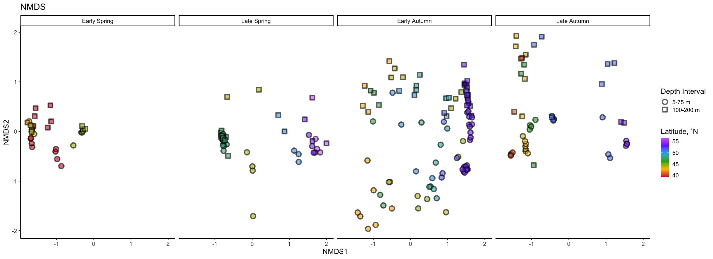

16S
================
Nicholas Baetge
8/13/2020

# Intro

Here, the NAAMES cast 16S sequences processed by Luis Bolanos in the
Giovannoni group are explored

``` r
library(tidyverse) 
library(rmarkdown)
library(patchwork)
library(lubridate)
library(phyloseq)
library(RColorBrewer)
library(ggpubr)
```

``` r
custom.colors <- c("AT39" = "#377EB8", "AT34" = "#4DAF4A", "AT38" = "#E41A1C", "AT32" = "#FF7F00", "Temperate" = "#A6CEE3", "Subpolar" = "#377EB8", "Subtropical" = "#FB9A99", "GS/Sargasso" = "#E41A1C", "Early Spring" = "#377EB8", "Late Spring" = "#4DAF4A","Early Autumn" = "#E41A1C", "Late Autumn" = "#FF7F00",  "5-75 m" = "#27ab19", "100-200 m" = "#feb483", "300 m" = "#d16cfa")

levels = c("GS/Sargasso", "Subtropical", "Temperate", "Subpolar",  "AT39-6", "AT34", "AT38", "AT32","South", "North", "Early Spring", "Late Spring","Early Autumn",  "Late Autumn", "5-75 m", "100-200 m", "300 m")

#odv.colors <- c("#feb483", "#d31f2a", "#ffc000", "#27ab19", "#0db5e6", "#7139fe", "#d16cfa")
odv.colors <- c( "#d31f2a", "#ffc000", "#27ab19", "#0db5e6", "#7139fe", "#d16cfa")
```

# Import Data

``` r
count.tab <- read.table("~/GITHUB/naames_multiday/Input/16s/HetV1OTU.txt", header = T, row.names = 1, check.names = F)

tax.tab <- as.matrix(read.table("~/GITHUB/naames_multiday/Input/16s/HetV1TUtax.txt", header = T, row.names = 1, check.names = F, na.strings = "", sep = "\t"))


ctd <-  readRDS("~/GITHUB/naames_multiday/Input/ctd_data.rds") %>%
  select(Cruise, Station, CampCN,  z, deriv_o2_umol_l, deriv_aou_umol_l, fl_mg_m3, ave_temp_c, ave_sal_psu, ave_dens_kg_m3, beamT_perc ) %>%
  mutate(Cruise = ifelse(Cruise == "AT39", "AT39-6", Cruise)) %>%
  rename(o2 = deriv_o2_umol_l,
         aou = deriv_aou_umol_l,
         fl = fl_mg_m3,
         temp = ave_temp_c,
         sal = ave_sal_psu,
         dens = ave_dens_kg_m3,
         beamt = beamT_perc) %>% 
  mutate_at(vars(Station), as.character) %>% 
  mutate(Station = ifelse(Cruise == "AT38" & Station == 0, "1A", Station)) 
  


npp <- read_rds("~/GITHUB/naames_multiday/Input/npp_data.rds")

sample.tab <- read_rds("~/GITHUB/naames_multiday/Input/master/processed_bf.8.2020.rds") %>% 
  select(Cruise:CampCN, Target_Z, DNA_ID) %>% 
  drop_na(DNA_ID) %>% 
  rename(z = Target_Z) %>% 
  left_join(., read_rds("~/GITHUB/naames_multiday/Output/processed_data.rds") %>%
              select(Cruise, Station, Date,  CampCN, mld, z, ba, doc, tdaa, n, phyc, bcd ) %>% 
              distinct() %>% 
              mutate_at(vars(Station), as.character) %>% 
              mutate(Station = ifelse(Cruise == "AT38" & Station == 0, "1A", Station)) %>% 
              mutate_at(vars(phyc:bcd), function(x)(x/10^3))) %>% 
  mutate(z_interv = ifelse(z <= 75, "5-75 m", NA),
         z_interv = ifelse(z > 75 & z <= 200 , "100-200 m", z_interv),
         z_interv = ifelse(z == 300, "300 m", z_interv)) %>% 
  select(Cruise:z,  z_interv, everything()) %>% 
  left_join(., ctd) %>% 
  left_join(., npp %>% mutate_at(vars(Station), as.character)) %>% 
  rename(latitude = Latitude) %>% 
  mutate(eddy = ifelse(Cruise == "AT34" & Station == 4, "Core", NA),
         eddy = ifelse(Date == "2016-05-27", "Outside", eddy)) %>% 
  group_by(Cruise, Station) %>% 
  mutate(time = ymd_hms(datetime),
         interv = interval(first(time), time),
         dur = as.duration(interv),
         hours = round(as.numeric(dur, "days")/3600),
         days = round(as.numeric(dur, "days")/86400)) %>% 
  ungroup() %>% 
  column_to_rownames(var = "DNA_ID") %>% 
  select(Cruise:CampCN, eddy, hours, days, everything()) %>% 
  select(-c(time:dur))
```

# Phyloseq Object

We need to create a phyloseq object that merges all three datasets.
Sometimes this doesn’t work beacuse of the format of the data files.
Make sure all the sample names between the sampleinfo.txt and
seqtab-nochimtaxa.txt are the same

``` r
OTU = otu_table(count.tab, taxa_are_rows = TRUE) 
TAX = tax_table(tax.tab)
SAM = sample_data(sample.tab)
ps = phyloseq(OTU,TAX,SAM) 

sample_data(ps)$z_interv <- factor(sample_data(ps)$z_interv, levels = levels)
sample_data(ps)$Season <- factor(sample_data(ps)$Season, levels = levels)
```

# Filter sequences

We will filter out chloroplasts and mitochondria, because we only
intended to amplify bacterial sequences. It’s good to check you don’t
have anything lurking in the taxonomy table.

``` r
sub_ps <- ps %>%
  subset_samples(z %in% c(5, 25, 50, 75, 100, 150, 200)) %>%
  subset_taxa(
    Family  != "mitochondria" &
    Order   != "Chloroplast")
```

# Sample Summary

As a first analysis, we will look at the distribution of read counts
from our
samples


``` r
# mean, max and min of sample read counts
smin <- min(sample_sums(sub_ps)) 
smean <- mean(sample_sums(sub_ps)) 
smax <- max(sample_sums(sub_ps)) 
```

# Beta Diversity

Beta diversity involves calculating metrics such as distances or
dissimilarities based on pairwise comparisons of samples – they don’t
exist for a single sample, but rather only as metrics that relate
samples to each other. i.e. beta diversity = patterns in community
structure between samples

Since differences in sampling depths between samples can influence
distance/dissimilarity metrics, we first need to somehow normalize the
read depth across our samples.

## Subsample

We will rarefy (random subsample with replacement) the read depth of the
samples first (scale to the smallest library size) according to Bolaños
et al 2021.

[Case for not
subsampling](https://journals.plos.org/ploscompbiol/article?id=10.1371/journal.pcbi.1003531)

[Response blog for
subsampling](https://www.polarmicrobes.org/how-i-learned-to-stop-worrying-and-love-subsampling-rarifying/)

Read depth is an artifact of a machine made by a company in San Diego,
not anything about your samples or their biology. It is totally
artifactual, and controlling for artifacts is critical in science.
Subsampling randomly is the simplest way to control for this, and the
question is whether this is the “best” way of controlling for it. See
links above for alternative arguments about what the best way of
controlling for this artifact is.

A strong reason to subsample is to standardize effort. The bottom line
is that in all experimental design you should not be comparing things to
which you devote different effort in resolution. For instance, you don’t
sample one site once a week and another once a month if you want to
compare the dynamics between the sites. You standardize effort.

With that said, the bigger your differential in mean (or median) read
depth (reads/sample) between pre- and post-subsampling, the greater the
“effect” on beta diversity.

Examples:

  - means reads before = 40k, mean reads after = 1k, big effect.
  - mean reads before = 40k, mean reads after = 20k, small effect.
  - mean reads before = 2k, mean reads after = 1k, small effect.

We will subsample to the minimum read depth of all samples and not
subsample. We’ll then compare the mean reads pre- and post-subsampling
and also compare beta diversity
patterns

``` r
ps_min <-  rarefy_even_depth(sub_ps, sample.size = smin, rngseed = 532898)
```

    ## `set.seed(532898)` was used to initialize repeatable random subsampling.

    ## Please record this for your records so others can reproduce.

    ## Try `set.seed(532898); .Random.seed` for the full vector

    ## ...

    ## 2659OTUs were removed because they are no longer 
    ## present in any sample after random subsampling

    ## ...

We can also subset the N2 and the N2S4 data here

``` r
n2 <- ps_min %>% 
  subset_samples(Cruise == "AT34")

n2s4 <- ps_min %>% 
  subset_samples(Cruise == "AT34" & Station == 4)
```

Based on the mean reads pre- and post-subsampling, subsampling here
could have a major effect on our beta diversity patterns

## Unconstrained Ordination

One of the best exploratory analyses for amplicon data is unconstrained
ordinations. Here we will look at ordinations of our full community
samples. We will rarfy the samples first (scale to the smallest library
size).

### NMDS

Let’s try an NMDS. For NMDS plots it’s important to set a seed since the
starting positions of samples in the alogrithm is random.

Important: if you calculate your bray-curtis distance metric “in-line”
it will perform a square root transformation and Wisconsin double
standardization. If you don’t want this, you can calculate your
bray-curtis distance separately

``` r
set.seed(1)

# Ordinate
nmds <- ordinate(sub_ps, method = "NMDS",  distance = "bray") # stress = 0.11
```

    ## Square root transformation
    ## Wisconsin double standardization
    ## Run 0 stress 0.09706361 
    ## Run 1 stress 0.1032024 
    ## Run 2 stress 0.1032024 
    ## Run 3 stress 0.0973769 
    ## ... Procrustes: rmse 0.003176898  max resid 0.04619471 
    ## Run 4 stress 0.0970636 
    ## ... New best solution
    ## ... Procrustes: rmse 1.143602e-05  max resid 9.758834e-05 
    ## ... Similar to previous best
    ## Run 5 stress 0.1083855 
    ## Run 6 stress 0.1129934 
    ## Run 7 stress 0.09737691 
    ## ... Procrustes: rmse 0.003182194  max resid 0.04627376 
    ## Run 8 stress 0.0973769 
    ## ... Procrustes: rmse 0.003175398  max resid 0.04617363 
    ## Run 9 stress 0.0973769 
    ## ... Procrustes: rmse 0.003174286  max resid 0.04615765 
    ## Run 10 stress 0.0973769 
    ## ... Procrustes: rmse 0.003177092  max resid 0.04619902 
    ## Run 11 stress 0.09737691 
    ## ... Procrustes: rmse 0.003173133  max resid 0.04613338 
    ## Run 12 stress 0.0970636 
    ## ... New best solution
    ## ... Procrustes: rmse 3.990035e-06  max resid 3.740625e-05 
    ## ... Similar to previous best
    ## Run 13 stress 0.1133099 
    ## Run 14 stress 0.102882 
    ## Run 15 stress 0.09737691 
    ## ... Procrustes: rmse 0.003174545  max resid 0.04616112 
    ## Run 16 stress 0.1080812 
    ## Run 17 stress 0.0973769 
    ## ... Procrustes: rmse 0.003177309  max resid 0.04620212 
    ## Run 18 stress 0.0970636 
    ## ... Procrustes: rmse 3.201538e-06  max resid 2.060067e-05 
    ## ... Similar to previous best
    ## Run 19 stress 0.0970636 
    ## ... Procrustes: rmse 3.34184e-06  max resid 2.857691e-05 
    ## ... Similar to previous best
    ## Run 20 stress 0.1133098 
    ## *** Solution reached

``` r
set.seed(1)
# Ordinate
nmds_min <- ordinate(ps_min, method = "NMDS",  distance = "bray") # stress = 0.10
```

    ## Square root transformation
    ## Wisconsin double standardization
    ## Run 0 stress 0.09065141 
    ## Run 1 stress 0.09752536 
    ## Run 2 stress 0.1076767 
    ## Run 3 stress 0.09102609 
    ## ... Procrustes: rmse 0.00295717  max resid 0.04288999 
    ## Run 4 stress 0.09065141 
    ## ... New best solution
    ## ... Procrustes: rmse 3.969074e-06  max resid 3.162631e-05 
    ## ... Similar to previous best
    ## Run 5 stress 0.1819144 
    ## Run 6 stress 0.1169273 
    ## Run 7 stress 0.0910261 
    ## ... Procrustes: rmse 0.002961244  max resid 0.04295146 
    ## Run 8 stress 0.0910261 
    ## ... Procrustes: rmse 0.002962481  max resid 0.04297012 
    ## Run 9 stress 0.09752535 
    ## Run 10 stress 0.09102608 
    ## ... Procrustes: rmse 0.002939779  max resid 0.04263838 
    ## Run 11 stress 0.0910261 
    ## ... Procrustes: rmse 0.002960237  max resid 0.04294046 
    ## Run 12 stress 0.09065141 
    ## ... New best solution
    ## ... Procrustes: rmse 6.231935e-06  max resid 5.414468e-05 
    ## ... Similar to previous best
    ## Run 13 stress 0.1171684 
    ## Run 14 stress 0.09714868 
    ## Run 15 stress 0.09102608 
    ## ... Procrustes: rmse 0.002954611  max resid 0.04285146 
    ## Run 16 stress 0.1076727 
    ## Run 17 stress 0.09102609 
    ## ... Procrustes: rmse 0.002957479  max resid 0.04289298 
    ## Run 18 stress 0.1018362 
    ## Run 19 stress 0.09065141 
    ## ... Procrustes: rmse 3.013539e-06  max resid 2.00629e-05 
    ## ... Similar to previous best
    ## Run 20 stress 0.1080628 
    ## *** Solution reached

``` r
set.seed(7)
# Ordinate
nmds_n2 <- ordinate(n2, method = "NMDS",  distance = "bray") # stress = 0.03
```

    ## Square root transformation
    ## Wisconsin double standardization
    ## Run 0 stress 0.03230665 
    ## Run 1 stress 0.06904317 
    ## Run 2 stress 0.06711159 
    ## Run 3 stress 0.06030276 
    ## Run 4 stress 0.03230635 
    ## ... New best solution
    ## ... Procrustes: rmse 0.0001434603  max resid 0.000863853 
    ## ... Similar to previous best
    ## Run 5 stress 0.04943882 
    ## Run 6 stress 0.03230639 
    ## ... Procrustes: rmse 2.319408e-05  max resid 0.0001366133 
    ## ... Similar to previous best
    ## Run 7 stress 0.0660434 
    ## Run 8 stress 0.05227056 
    ## Run 9 stress 0.03230639 
    ## ... Procrustes: rmse 2.407777e-05  max resid 0.0001434754 
    ## ... Similar to previous best
    ## Run 10 stress 0.0495313 
    ## Run 11 stress 0.06693095 
    ## Run 12 stress 0.06676677 
    ## Run 13 stress 0.03230667 
    ## ... Procrustes: rmse 9.011551e-05  max resid 0.0004087079 
    ## ... Similar to previous best
    ## Run 14 stress 0.07196127 
    ## Run 15 stress 0.06213695 
    ## Run 16 stress 0.07123741 
    ## Run 17 stress 0.07002531 
    ## Run 18 stress 0.06030848 
    ## Run 19 stress 0.06614976 
    ## Run 20 stress 0.03230662 
    ## ... Procrustes: rmse 8.341555e-05  max resid 0.0004822104 
    ## ... Similar to previous best
    ## *** Solution reached

``` r
set.seed(7)
# Ordinate
nmds_n2s4 <- ordinate(n2s4, method = "NMDS",  distance = "bray") # stress = 0.10
```

    ## Square root transformation
    ## Wisconsin double standardization
    ## Run 0 stress 0.09919532 
    ## Run 1 stress 0.09920533 
    ## ... Procrustes: rmse 0.001280901  max resid 0.005097665 
    ## ... Similar to previous best
    ## Run 2 stress 0.1031326 
    ## Run 3 stress 0.09924445 
    ## ... Procrustes: rmse 0.005819663  max resid 0.0259804 
    ## Run 4 stress 0.1003315 
    ## Run 5 stress 0.1031221 
    ## Run 6 stress 0.1041056 
    ## Run 7 stress 0.09924489 
    ## ... Procrustes: rmse 0.005836767  max resid 0.02599938 
    ## Run 8 stress 0.1040992 
    ## Run 9 stress 0.1132577 
    ## Run 10 stress 0.1028833 
    ## Run 11 stress 0.1042326 
    ## Run 12 stress 0.09883192 
    ## ... New best solution
    ## ... Procrustes: rmse 0.01754671  max resid 0.06645168 
    ## Run 13 stress 0.1113985 
    ## Run 14 stress 0.3894178 
    ## Run 15 stress 0.1042339 
    ## Run 16 stress 0.1165711 
    ## Run 17 stress 0.3855862 
    ## Run 18 stress 0.1028768 
    ## Run 19 stress 0.09883257 
    ## ... Procrustes: rmse 0.004457875  max resid 0.01900665 
    ## Run 20 stress 0.1031573 
    ## *** No convergence -- monoMDS stopping criteria:
    ##     20: stress ratio > sratmax




NMDS plots attempt to show ordinal distances between samples as
accurately as possible in two dimensions. It is important to report the
stress of these plots, because a high stress value means that the
algorithm had a hard time representing the distances between samples in
2 dimensions. The stress of these plots were good - it was .1 (generally
anything below .2 is considered acceptable).

It doesn’t look like subsampling has a major effect on how we would
interpret these beta diversity plots so we’ll move forward with ps\_min.

Let’s take a look at N2.

95% confidence interval ellipse for the mean (group centroid) tells us
something about the sampling distribution of the mean (centroid) we
might see if we repeated your data collection a lot of times. In other
words we are looking at the uncertainty in the estimate of the
population mean (centroid) given the sample of data we collected.

# Constrained Ordination

Above we used unconstrained ordinations (NMDS) to show relationships
between samples in low dimensions. We can use a constrained ordination
to see how environmental variables are associated with these changes in
community composition. We constrain the ordination axes to linear
combinations of environmental variables. We then plot the environmental
scores onto the ordination

``` r
# Remove data points with missing metadata
ps_not_na <- n2s4 %>%
  subset_samples(
    !is.na(mld) &
      !is.na(npp) & 
      !is.na(doc) &
      !is.na(ba) &
      !is.na(n) & 
      !is.na(aou) & 
      !is.na(beamt) & 
      !is.na(bcd) & 
      !is.na(o2) & 
      !is.na(phyc) &
      !is.na(days) & 
      !is.na(fl) & 
      !is.na(dens) & 
      !is.na(sal) & 
      !is.na(temp) &
      eddy == "Core"
  )

bray <- phyloseq::distance(ps_not_na, method = "bray")

# CAP ordinate
cap_ord <- ordinate(ps_not_na, method = "CAP", distance = bray, formula = ~ mld + doc + n  + bcd + ba  + fl  + z + npp +  aou + beamt + phyc + days
)
```

``` r
(nmds_n2.plot + 
  guides(fill = guide_colorbar(title = "Latitude, ˚N"), shape = F, color = F)) +

(nmds_n2s4.plot + 
  guides(fill = guide_colorbar(title = "Days"), shape = F, linetype = guide_legend(title = "Eddy Location"), color = F)) +
  
  cap.graph +
  plot_annotation(tag_levels = "a") &
  theme(plot.tag = element_text(size = 22),
        plot.title = element_text(size = 18)) 
```

<!-- -->

Do a permutational ANOVA on constrained axes used in ordination

``` r
anova(cap_ord)
```

    ## Permutation test for capscale under reduced model
    ## Permutation: free
    ## Number of permutations: 999
    ## 
    ## Model: capscale(formula = distance ~ mld + doc + n + bcd + ba + fl + z + npp + aou + beamt + phyc + days, data = data)
    ##          Df SumOfSqs     F Pr(>F)
    ## Model    12 0.161467 1.081  0.253
    ## Residual  8 0.099575

# Betadisper and permutational ANOVA

Above, we performed beta diversity analyses on Bray-Curtis distances on
rarefied datasets that were then visualized using NMDS and CAP. We can
test if there are statistically significant differences between sample
groups using the betadisper and adonis functions of the vegan package.
Betadisper tests whether two or more groups are homogeneously dispersed
in relation to their species in studied samples. This test can be done
to see if one group has more compositional variance than another.
Moreover, homogeneity of dispersion among groups is very advisable to
have if you want to test if two or more groups have different
compositions, which is tested by adonis.

## Phyloseq to DESeq, distance matrix

To be able to run the stats, we first have to create a distance matrix
from our data. We’ll use the DESeq package to do so.

``` r
library(DESeq2)
library(vegan)
```

``` r
deseq_counts <- phyloseq_to_deseq2(ps_min, design = ~latitude ) #the design argument is required but doesn't matter here
```

    ## converting counts to integer mode

    ##   the design formula contains one or more numeric variables that have mean or
    ##   standard deviation larger than 5 (an arbitrary threshold to trigger this message).
    ##   it is generally a good idea to center and scale numeric variables in the design
    ##   to improve GLM convergence.

``` r
deseq_count_tab <- assay(deseq_counts) #extract the read count matrix
```

We’ll calculate euclidean
distances

``` r
#We can subset our data if we want to and calculate distances/run stats for only a subset of the group. The code below shows how

sample.tab2 <- sample.tab %>%
  rownames_to_column() %>% 
  filter(z %in% c(5, 25, 50, 75, 100, 150, 200)) %>% 
  column_to_rownames(var = "rowname")

subset_sample_IDs_n2 <-  row.names(sample.tab2)[sample.tab2$Cruise == "AT34"]
subset_sample_IDs_n2s4 <-  row.names(sample.tab2)[sample.tab2$Station == 4 & sample.tab2$Cruise == "AT34"]


euc_dist_n2 <- dist(t(deseq_count_tab[ , colnames(deseq_count_tab) %in% subset_sample_IDs_n2]))
euc_dist_n2s4 <- dist(t(deseq_count_tab[ , colnames(deseq_count_tab) %in% subset_sample_IDs_n2s4]))

sample_info_tab_n2 <- sample.tab2[row.names(sample.tab2) %in% subset_sample_IDs_n2, ]
sample_info_tab_n2s4 <- sample.tab2[row.names(sample.tab2) %in% subset_sample_IDs_n2s4, ]
```

Betadisper first calculates the average distance of group members to the
group centroid in multivariate space (generated by a distance matrix).

Our first question is: Is the community composition between stations on
N2 different ?

In the function below: we are using the distance matrix to calculate the
multivariate dispersions (variances; average distance to centroids). We
then use group dispersions to perform an ANOVA test.

``` r
anova(betadisper(euc_dist_n2, sample_info_tab_n2$Station)) 
```

    ## Analysis of Variance Table
    ## 
    ## Response: Distances
    ##           Df   Sum Sq Mean Sq F value   Pr(>F)   
    ## Groups     4 15620644 3905161  4.4632 0.004015 **
    ## Residuals 45 39373446  874965                    
    ## ---
    ## Signif. codes:  0 '***' 0.001 '**' 0.01 '*' 0.05 '.' 0.1 ' ' 1

**Our groups (stations) at N2 do not present homogeneity among group
dispersions (compositions vary differently)**

``` r
anova(betadisper(euc_dist_n2s4, sample_info_tab_n2s4$days)) 
```

    ## Analysis of Variance Table
    ## 
    ## Response: Distances
    ##           Df Sum Sq Mean Sq F value Pr(>F)
    ## Groups     3   9844  3281.2  1.1312 0.3563
    ## Residuals 24  69613  2900.5

``` r
adonis(euc_dist_n2s4~sample_info_tab_n2s4$days)
```

    ## 
    ## Call:
    ## adonis(formula = euc_dist_n2s4 ~ sample_info_tab_n2s4$days) 
    ## 
    ## Permutation: free
    ## Number of permutations: 999
    ## 
    ## Terms added sequentially (first to last)
    ## 
    ##                           Df SumsOfSqs MeanSqs F.Model      R2 Pr(>F)    
    ## sample_info_tab_n2s4$days  1    176877  176877  5.1654 0.16574  0.001 ***
    ## Residuals                 26    890304   34242         0.83426           
    ## Total                     27   1067182                 1.00000           
    ## ---
    ## Signif. codes:  0 '***' 0.001 '**' 0.01 '*' 0.05 '.' 0.1 ' ' 1

The ANOVA’s p-value is not significant meaning that group dispersions
are homogenous (“Null hypothesis of no difference in dispersion between
groups”)

Adonis analyzes and partitions sums of squares using distance matrices.
It can be seen as an ANOVA using distance matrices (analogous to MANOVA
– multivariate analysis of variance). Therefore, it is used to test if
two or more groups have similar compositions.

**Our groups (days) at N2S4 present homogeneity among group dispersions
(compositions vary similarly) and have significantly different
compositions.**

# Alpha Diversity

Estimating alpha diversity of microbial communities is
[problematic](https://www.ncbi.nlm.nih.gov/pmc/articles/PMC93182/) no
matter what you do.

We are going to calculate the Chao1 index for richness and the Shannon
diversity index.

**it is important to note that the alpha diversity values are not
interpretable as “real” numbers of anything (due to the nature of
amplicon data), but they can still be useful as relative metrics of
comparison. If Chao1 richness goes up, but Shannon diversity goes down,
it indicates that the sample may have more ASVs but is dominated by a
few of them.**

We will use the subsampled library, which retains estimates of the
species abundance of the real population while standardizing sampling
effort.

[subsampling and alpha diversity
paper](https://www.frontiersin.org/articles/10.3389/fmicb.2019.02407/full)

[Chao1: nonparametric estimation of minimum community
richness](https://www.jstor.org/stable/4615964?seq=1#metadata_info_tab_contents)

``` r
richness <- estimate_richness(n2s4, measures = c("Chao1", "Shannon")) %>% 
  rownames_to_column(., var = "DNA_ID") %>% 
  mutate_at(vars(DNA_ID), str_replace_all, pattern = "NAAMES2.", "NAAMES2-") 
```

Let’s add the sample metadata into this
dataframe

``` r
alphadiv <- left_join(richness, sample.tab2 %>% rownames_to_column(., var = "DNA_ID")) 
```

    ## Joining, by = "DNA_ID"


Boxes represent the 1.5 interquartile range, with the internal solid
line representing the median. Circles represent data points. p-values
are reported the non-parametric two sample Wilcoxon test, which tests
whether the means between two groups are equal (ns: p \> 0.05, \* : p≤
0.05, \*\* : p ≤ 0.01).

Difference in the alpha diversity indexes among conditions were tested
using pairwise Wilcoxon tests; p \< 0.05 was considered the threshold
significance for a difference between conditions.

From this plot of community composition in the eddy core we can see
within the depth horizons that the richness (via Chao index) of our
samples did not significantly change and the overall diversity (via
Shannon index) also did not change.

# Who??

Which taxa were important? Which taxa were contributing to the change in
community compositon?

**Note: Recovered 16S rRNA gene copy numbers do not equal organism
abundance.**

That said, we can generate a heat map of our samples showing us how the
relative abundance of different taxonomic groups change…potentially
giving us a visual of which taxa are most important to the alpha and
beta diversity patterns we observed. First, we’re going to generate a
custom table that will be easier to work with than a phyloseq object.

## Generate relative abundances

Our data currently shows number gene copies recovered, so we’ll convert
to percentages (relative abundances)

``` r
n2s4_core <- n2s4 %>% 
  subset_samples(eddy == "Core")
ps_std <- transform_sample_counts(n2s4_core, function(x) x/sum(x))
#extract the relative abundance table and coerce into dataframe
ps_std.tab <- as(otu_table(ps_std), "matrix")
ps_std.df = as.data.frame(ps_std.tab) 
```

### Make table

``` r
#first coerce the taxa table into a data frame
tax.df <-  as.data.frame(tax.tab) 
#then combine the data frames
custom.tab <- tax.df %>% 
  rownames_to_column(., var = "asv") %>% 
  left_join(., ps_std.df %>% rownames_to_column(., var = "asv")) %>% 
  #create a new index of that combines the  class, order, family, and genus values, you can play around here!!
  mutate(#pcofg = paste(Phylum, "_", Class, "_", Order,"_", Family, "_", Genus),
         pcof = paste(Phylum, "_", Class, "_", Order,"_", Family)) %>% 
         # pco = paste(Phylum, "_", Class, "_", Order)) %>% 
  select(-c(asv:Genus)) %>% 
  select(pcof,everything()) %>%
  group_by(pcof) %>%
  # select(pco,everything()) %>% 
  # group_by(pco) %>% 
  #here we are combining the relative abundances based on our grouping
  summarise_at(vars(!contains(c("pco"))), sum, na.rm = T) %>% 
  ungroup()
```

    ## Joining, by = "asv"

``` r
#save the row names and then make them into the column names
colnames <- custom.tab[,1] 

#transpose the dataframe so we can merge with the sample info table
t_custom.tab <-  as.data.frame(t(custom.tab[,-1]))
colnames(t_custom.tab) <- colnames$pcof
# colnames(t_custom.tab) <- colnames$pco

#merge
sweet.tab <- t_custom.tab %>% 
  rownames_to_column(., var = "sample") %>% 
  left_join(., sample.tab %>% rownames_to_column(., var = "sample")) %>% 
  select(sample, Cruise:npp, everything())
```

    ## Joining, by = "sample"

``` r
relabund <- sweet.tab %>% 
  select(-c(sample:npp)) %>% 
  #remove groups that are completely absent
  .[ , colSums(.) > 0] %>% 
  #arrange by biggest contributors
  .[, order(colSums(-.))] %>% 
  bind_cols(sweet.tab %>% select(sample:npp), .)
```

## Heatmap


## Save

``` r
saveRDS(sample.tab, "~/GITHUB/naames_multiday/Output/Sample_Table.rds")
saveRDS(relabund, "~/GITHUB/naames_multiday/Output/Relabund_Table.rds")
saveRDS(sub_ps, "~/GITHUB/naames_multiday/Output/phyloseq_obj.rds")
saveRDS(ps_min, "~/GITHUB/naames_multiday/Output/phyloseq_obj_min.rds")
```
