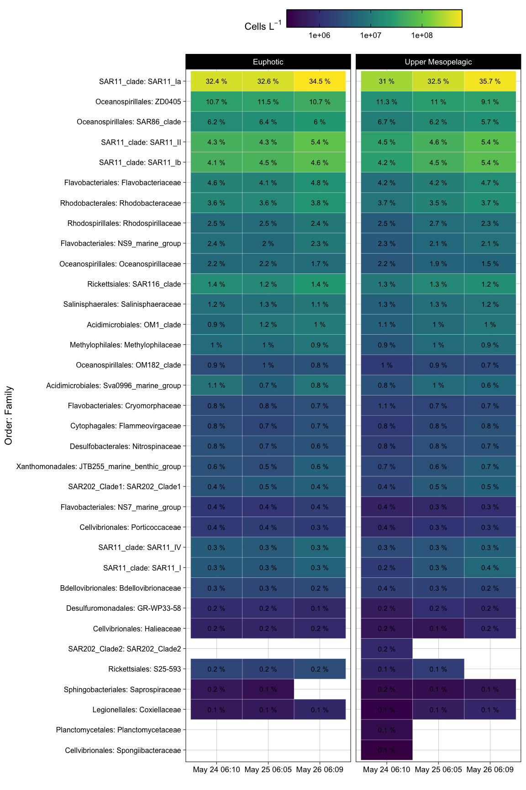

16S\_revised
================
Nicholas Baetge
12/28/2021

# Intro

``` r
library(tidyverse)
library(lubridate)
library(hms)
library(zoo) 
library(oce)  
library(ggpubr)
library(patchwork)
library(phyloseq)
library(rstatix)
```

# Import Data

``` r
floats <- read_rds("~/GITHUB/naames_multiday/Output/processed_floats.rds") 

floats %>% select(float:lon, ezd) %>% distinct() %>% drop_na(ezd) %>% 
  group_by(Cruise, Station) %>% 
  summarize(max_ezd = max(ezd))
```

    ## `summarise()` has grouped output by 'Cruise'. You can override using the
    ## `.groups` argument.

    ## # A tibble: 4 × 3
    ## # Groups:   Cruise [2]
    ##   Cruise Station max_ezd
    ##   <chr>    <dbl>   <dbl>
    ## 1 AT34         4    77.0
    ## 2 AT38         3    57.4
    ## 3 AT38         4    49.3
    ## 4 AT38         6    44.9

Euphotic zone for N2S4 = 75 m, for N3 is \< 75 m (don’t know for station
3.5, but likely similar to station 3 and
4)

``` r
count.tab <- read.table("~/GITHUB/naames_multiday/Input/16s/HetV1OTU.txt", header = T, row.names = 1, check.names = F) 

tax.tab <- as.matrix(read.table("~/GITHUB/naames_multiday/Input/16s/HetV1TUtax.txt", header = T, row.names = 1, check.names = F, na.strings = "", sep = "\t"))

sample.tab <- read_rds("~/GITHUB/naames_multiday/Input/bottle_data.rds") %>% 
  drop_na(DNA_ID) %>% 
  filter(Cruise == "AT34" & Station == 4 | Cruise == "AT38" & Station %in% c(3, 3.5, 4, 6))   %>% 
    filter(!plot_date %in% c("May 24 02:30", "May 27 06:07", "Sep 14 15:33", "Sep 15 03:04", "Sep 15 15:20", "Sep 16 03:04", "Sep 16 04:50", "Sep 16 07:26", "Sep 8 03:08", "Sep 8 03:08",  "Sep 8 15:30", "Sep 11 03:07"), z <= 200) %>% #FILTER OUT CASTS THAT HAVE DIFFERENT T-S PROPERTIES IN UPPER MESO
  mutate(dh = ifelse(Cruise == "AT34" & z < 100, "Euphotic", "Upper Mesopelagic"),
         dh = ifelse(Cruise == "AT38" & z < 75, "Euphotic", dh),
         Cruise = ifelse(Cruise == "AT34", "NAAMES 2", "NAAMES 3"),
         cruise_station = paste(Cruise, "Station", Station)) %>% 
  column_to_rownames(var = "DNA_ID") %>% 
  select(Cruise:mld, dh, everything())


gene_copies <- readxl::read_xlsx("~/GITHUB/naames_multiday/Input/16s/gene_copies.xlsx") %>% 
  mutate(copy_num = ave_order, 
         copy_num = ifelse(is.na(copy_num), ave_class, copy_num),
         copy_num = ifelse(is.na(copy_num), ave_phylum, copy_num),
         copy_num = ifelse(is.na(copy_num), ave_kingdom, copy_num))
```

# Phyloseq Object

We need to create a phyloseq object that merges all three datasets.
Sometimes this doesn’t work beacuse of the format of the data files.
Make sure all the sample names between the sampleinfo.txt and
seqtab-nochimtaxa.txt are the same

``` r
OTU = otu_table(count.tab, taxa_are_rows = TRUE) 
TAX = tax_table(tax.tab)
SAM = sample_data(sample.tab)
ps = phyloseq(OTU,TAX,SAM) 
```

# Filter sequences

We will filter out chloroplasts and mitochondria, because we only
intended to amplify bacterial sequences. It’s good to check you don’t
have anything lurking in the taxonomy table.

``` r
sub_ps <- ps %>%
  subset_taxa(
    Family  != "mitochondria" &
    Order   != "Chloroplast")
```

# Sample Summary

As a first analysis, we will look at the distribution of read counts
from our
samples


``` r
# mean, max and min of sample read counts
smin <- min(sample_sums(sub_ps)) 
smean <- mean(sample_sums(sub_ps)) 
smax <- max(sample_sums(sub_ps)) 
```

# Beta Diversity

Beta diversity involves calculating metrics such as distances or
dissimilarities based on pairwise comparisons of samples – they don’t
exist for a single sample, but rather only as metrics that relate
samples to each other. i.e. beta diversity = patterns in community
structure between samples

Since differences in sampling depths between samples can influence
distance/dissimilarity metrics, we first need to somehow normalize the
read depth across our samples.

## Subsample

We will rarefy (random subsample with replacement) the min read depth of
the samples first (scale to the smallest library size) according to
Bolaños et al 2021.

A strong reason to subsample is to standardize effort. The bottom line
is that in all experimental design you should not be comparing things to
which you devote different effort in resolution. For instance, you don’t
sample one site once a week and another once a month if you want to
compare the dynamics between the sites. You standardize
effort.

``` r
ps_min <-  rarefy_even_depth(sub_ps, sample.size = smin, rngseed = 532898)
```

    ## `set.seed(532898)` was used to initialize repeatable random subsampling.

    ## Please record this for your records so others can reproduce.

    ## Try `set.seed(532898); .Random.seed` for the full vector

    ## ...

    ## 7378OTUs were removed because they are no longer 
    ## present in any sample after random subsampling

    ## ...

We can also subset the N2 and the N2S4 data here

``` r
s4n3 <- ps_min %>% 
  subset_samples(Cruise == "NAAMES 3" & z %in% c(5, 25, 100, 150, 200) | Cruise == "NAAMES 2" )
```

``` r
s4 <- ps_min %>% 
  subset_samples(Cruise == "NAAMES 2" & Station == 4)
```

``` r
s4_meso <- s4 %>% 
  subset_samples(dh == "Upper Mesopelagic" )
```

``` r
n3 <- ps_min %>% 
  subset_samples(Cruise == "NAAMES 3" & z %in% c(5, 25, 100, 150, 200) & !Cruise == "NAAMES 2" )
```

## Unconstrained Ordination

One of the best exploratory analyses for amplicon data is unconstrained
ordinations. Here we will look at ordinations of our subsampled dataset

### NMDS

Let’s try an NMDS. For NMDS plots it’s important to set a seed since the
starting positions of samples in the alogrithm is random.

``` r
set.seed(8)
# Ordinate
nmds <- ordinate(s4n3, method = "NMDS",  distance = "bray") # stress = 0.05
```

    ## Square root transformation
    ## Wisconsin double standardization
    ## Run 0 stress 0.04794218 
    ## Run 1 stress 0.2253945 
    ## Run 2 stress 0.04770254 
    ## ... New best solution
    ## ... Procrustes: rmse 0.005554127  max resid 0.02785282 
    ## Run 3 stress 0.04770254 
    ## ... Procrustes: rmse 1.57293e-06  max resid 6.055682e-06 
    ## ... Similar to previous best
    ## Run 4 stress 0.04794218 
    ## ... Procrustes: rmse 0.00555353  max resid 0.02792731 
    ## Run 5 stress 0.04794218 
    ## ... Procrustes: rmse 0.005552265  max resid 0.02791789 
    ## Run 6 stress 0.04794218 
    ## ... Procrustes: rmse 0.005551875  max resid 0.02791536 
    ## Run 7 stress 0.2346769 
    ## Run 8 stress 0.04770254 
    ## ... New best solution
    ## ... Procrustes: rmse 4.221448e-06  max resid 1.370858e-05 
    ## ... Similar to previous best
    ## Run 9 stress 0.04794218 
    ## ... Procrustes: rmse 0.005553068  max resid 0.02792427 
    ## Run 10 stress 0.1570516 
    ## Run 11 stress 0.04794218 
    ## ... Procrustes: rmse 0.005553386  max resid 0.02792666 
    ## Run 12 stress 0.04770254 
    ## ... Procrustes: rmse 1.179855e-06  max resid 4.19091e-06 
    ## ... Similar to previous best
    ## Run 13 stress 0.04770254 
    ## ... Procrustes: rmse 5.007979e-06  max resid 1.588646e-05 
    ## ... Similar to previous best
    ## Run 14 stress 0.04770254 
    ## ... Procrustes: rmse 4.84863e-06  max resid 1.223331e-05 
    ## ... Similar to previous best
    ## Run 15 stress 0.04794218 
    ## ... Procrustes: rmse 0.005551858  max resid 0.02791558 
    ## Run 16 stress 0.04794218 
    ## ... Procrustes: rmse 0.005553353  max resid 0.02792684 
    ## Run 17 stress 0.1395345 
    ## Run 18 stress 0.04770254 
    ## ... Procrustes: rmse 2.921744e-06  max resid 7.84295e-06 
    ## ... Similar to previous best
    ## Run 19 stress 0.1614722 
    ## Run 20 stress 0.04794218 
    ## ... Procrustes: rmse 0.005551606  max resid 0.02791354 
    ## *** Solution reached

``` r
set.seed(7)
# Ordinate
nmds_s4 <- ordinate(s4, method = "NMDS",  distance = "bray") # stress = 0.09
```

    ## Square root transformation
    ## Wisconsin double standardization
    ## Run 0 stress 0.08763807 
    ## Run 1 stress 0.3789439 
    ## Run 2 stress 0.09551312 
    ## Run 3 stress 0.09887487 
    ## Run 4 stress 0.08983489 
    ## Run 5 stress 0.09493637 
    ## Run 6 stress 0.1029261 
    ## Run 7 stress 0.08900643 
    ## Run 8 stress 0.09677245 
    ## Run 9 stress 0.1029261 
    ## Run 10 stress 0.08900656 
    ## Run 11 stress 0.08995316 
    ## Run 12 stress 0.09551264 
    ## Run 13 stress 0.08900654 
    ## Run 14 stress 0.1034377 
    ## Run 15 stress 0.08763824 
    ## ... Procrustes: rmse 9.591818e-05  max resid 0.0003474707 
    ## ... Similar to previous best
    ## Run 16 stress 0.08662108 
    ## ... New best solution
    ## ... Procrustes: rmse 0.07222615  max resid 0.2774339 
    ## Run 17 stress 0.1015351 
    ## Run 18 stress 0.08763827 
    ## Run 19 stress 0.09912518 
    ## Run 20 stress 0.08763794 
    ## *** No convergence -- monoMDS stopping criteria:
    ##     20: stress ratio > sratmax

``` r
set.seed(7)
# Ordinate
nmds_n3 <- ordinate(n3, method = "NMDS",  distance = "bray") # stress = 0.05
```

    ## Square root transformation
    ## Wisconsin double standardization
    ## Run 0 stress 0.04631479 
    ## Run 1 stress 0.0463147 
    ## ... New best solution
    ## ... Procrustes: rmse 7.566689e-05  max resid 0.0002041815 
    ## ... Similar to previous best
    ## Run 2 stress 0.04631478 
    ## ... Procrustes: rmse 7.166777e-05  max resid 0.0001958597 
    ## ... Similar to previous best
    ## Run 3 stress 0.04631465 
    ## ... New best solution
    ## ... Procrustes: rmse 0.0001344509  max resid 0.0003616062 
    ## ... Similar to previous best
    ## Run 4 stress 0.1764532 
    ## Run 5 stress 0.04631472 
    ## ... Procrustes: rmse 0.0001436614  max resid 0.0003905697 
    ## ... Similar to previous best
    ## Run 6 stress 0.1764532 
    ## Run 7 stress 0.1907817 
    ## Run 8 stress 0.04631469 
    ## ... Procrustes: rmse 0.0001165458  max resid 0.0003146987 
    ## ... Similar to previous best
    ## Run 9 stress 0.04631475 
    ## ... Procrustes: rmse 0.0001803109  max resid 0.0004875831 
    ## ... Similar to previous best
    ## Run 10 stress 0.04631469 
    ## ... Procrustes: rmse 4.534901e-05  max resid 0.0001196273 
    ## ... Similar to previous best
    ## Run 11 stress 0.04631466 
    ## ... Procrustes: rmse 6.454815e-05  max resid 0.0001752133 
    ## ... Similar to previous best
    ## Run 12 stress 0.2052355 
    ## Run 13 stress 0.04631468 
    ## ... Procrustes: rmse 3.418669e-05  max resid 8.957789e-05 
    ## ... Similar to previous best
    ## Run 14 stress 0.04631478 
    ## ... Procrustes: rmse 0.0001899186  max resid 0.0005158884 
    ## ... Similar to previous best
    ## Run 15 stress 0.04631475 
    ## ... Procrustes: rmse 0.0001812531  max resid 0.0004882325 
    ## ... Similar to previous best
    ## Run 16 stress 0.2051069 
    ## Run 17 stress 0.04631466 
    ## ... Procrustes: rmse 6.46289e-05  max resid 0.0001749478 
    ## ... Similar to previous best
    ## Run 18 stress 0.04631466 
    ## ... Procrustes: rmse 7.369678e-05  max resid 0.0001997115 
    ## ... Similar to previous best
    ## Run 19 stress 0.2052355 
    ## Run 20 stress 0.04631476 
    ## ... Procrustes: rmse 0.0001850903  max resid 0.0005008306 
    ## ... Similar to previous best
    ## *** Solution reached

NMDS plots attempt to show ordinal distances between samples as
accurately as possible in two dimensions. It is important to report the
stress of these plots, because a high stress value means that the
algorithm had a hard time representing the distances between samples in
2 dimensions. The stress of these plots were good - it was .1 (generally
anything below .2 is considered acceptable).

``` r
nmds.plot + nmds_s4.plot +
  plot_annotation(tag_levels = "a") &
  theme(plot.tag = element_text(size = 22),
        plot.title = element_text(size = 18)) 
```

<!-- -->

95% confidence interval ellipse for the mean (group centroid) tells us
something about the sampling distribution of the mean (centroid) we
might see if we repeated your data collection a lot of times. In other
words we are looking at the uncertainty in the estimate of the
population mean (centroid) given the sample of data we collected.

# Permutational ANOVA

Above, we performed beta diversity analyses on Bray-Curtis distances on
rarefied datasets that were then visualized using NMDS. We can test if
there are statistically significant differences between sample groups
using the adonis function of the vegan package.

## Phyloseq to DESeq, distance matrix

To be able to run the stats, we first have to create a distance matrix
from our data. We’ll use the DESeq package to do so.

``` r
library(DESeq2)
library(vegan)
```

``` r
deseq_counts <- phyloseq_to_deseq2(s4n3, design = ~datetime ) #the design argument is required but doesn't matter here
```

    ## converting counts to integer mode

``` r
deseq_count_tab <- assay(deseq_counts) #extract the read count matrix
```

\`\`

We’ll calculate bray-curtis distances, which reflect the NMDS
ordinations
above

``` r
#We can subset our data if we want to and calculate distances/run stats for only a subset of the group. The code below shows how

sample.tab2 <- sample.tab %>%
  rownames_to_column() %>% 
  column_to_rownames(var = "rowname") %>% 
  select(Cruise:z)


####

subset_sample_IDs_s4n3 <-  row.names(sample.tab2)[sample.tab2$Cruise == "NAAMES 3" & sample.tab2$z %in% c(5, 25, 100, 150, 200) |  sample.tab2$Cruise == "NAAMES 2" ]

dist <- vegdist(t(deseq_count_tab[ , colnames(deseq_count_tab) %in% subset_sample_IDs_s4n3]), method = "bray", na.rm = T)

sample_info_tab_s4n3 <- sample.tab2[row.names(sample.tab2) %in% subset_sample_IDs_s4n3, ]

####

subset_sample_IDs_n2s4 <-  row.names(sample.tab2)[sample.tab2$Cruise == "NAAMES 2" & sample.tab2$Station == 4]

dist_n2s4 <- vegdist(t(deseq_count_tab[ , colnames(deseq_count_tab) %in% subset_sample_IDs_n2s4]), method = "bray", na.rm = T)

sample_info_tab_n2s4 <- sample.tab2[row.names(sample.tab2) %in% subset_sample_IDs_n2s4, ]

####

subset_sample_IDs_n2s4_ez <-  row.names(sample.tab2)[sample.tab2$Cruise == "NAAMES 2" & sample.tab2$Station == 4 & sample.tab2$dh == "Euphotic"]

dist_n2s4_ez <- vegdist(t(deseq_count_tab[ , colnames(deseq_count_tab) %in% subset_sample_IDs_n2s4_ez]), method = "bray", na.rm = T)

sample_info_tab_n2s4_ez <- sample.tab2[row.names(sample.tab2) %in% subset_sample_IDs_n2s4_ez, ]

####


subset_sample_IDs_n2s4_mz <-  row.names(sample.tab2)[sample.tab2$Cruise == "NAAMES 2" & sample.tab2$Station == 4 & sample.tab2$dh == "Upper Mesopelagic"]

dist_n2s4_mz <- vegdist(t(deseq_count_tab[ , colnames(deseq_count_tab) %in% subset_sample_IDs_n2s4_mz]), method = "bray", na.rm = T)

sample_info_tab_n2s4_mz <- sample.tab2[row.names(sample.tab2) %in% subset_sample_IDs_n2s4_mz, ]


####

# subset_sample_IDs_n3 <-  row.names(sample.tab2)[sample.tab2$Cruise == "NAAMES 3" & sample.tab2$z %in% c(5, 25, 150, 200) & !sample.tab2$Cruise == "NAAMES 2"]

subset_sample_IDs_n3 <-  row.names(sample.tab2)[sample.tab2$Cruise == "NAAMES 3"]

dist_n3 <- vegdist(t(deseq_count_tab[ , colnames(deseq_count_tab) %in% subset_sample_IDs_n3]), method = "bray", na.rm = T)

sample_info_tab_n3 <- sample.tab2[row.names(sample.tab2) %in% subset_sample_IDs_n3, ]
```

Adonis analyzes and partitions sums of squares using distance matrices.
It can be seen as an ANOVA using distance matrices (analogous to MANOVA
– multivariate analysis of variance). Therefore, it is used to test if
two or more groups have similar compositions.

A one-way permutational multivariate ANOVA (PERMANOVA) test was used to
assess whether there were statistically significant differences between
groups (e.g., stations, depth horizons, or time) using the function
adonis in the R package vegan (v 2.5-6) (Anderson, 2001). To be a
reliable statistical test, the PERMANOVA test requires that there be a
sufficient level of homogeneity of dispersion within the groups, that
is, that the distances between samples to their group centroid should be
similar. Thus, the homogeneity of dispersion within the groups was
assessed using the vegan function betadisper prior to performing
PERMANOVAs (Anderson, 2006).

``` r
adonis(dist~dh:Cruise , data = sample_info_tab_s4n3)
```

    ## 
    ## Call:
    ## adonis(formula = dist ~ dh:Cruise, data = sample_info_tab_s4n3) 
    ## 
    ## Permutation: free
    ## Number of permutations: 999
    ## 
    ## Terms added sequentially (first to last)
    ## 
    ##           Df SumsOfSqs MeanSqs F.Model      R2 Pr(>F)    
    ## dh:Cruise  3    3.6007 1.20022  9.5502 0.44316  0.001 ***
    ## Residuals 36    4.5243 0.12567         0.55684           
    ## Total     39    8.1249                 1.00000           
    ## ---
    ## Signif. codes:  0 '***' 0.001 '**' 0.01 '*' 0.05 '.' 0.1 ' ' 1

``` r
adonis(dist~dh*Cruise , data = sample_info_tab_s4n3)
```

    ## 
    ## Call:
    ## adonis(formula = dist ~ dh * Cruise, data = sample_info_tab_s4n3) 
    ## 
    ## Permutation: free
    ## Number of permutations: 999
    ## 
    ## Terms added sequentially (first to last)
    ## 
    ##           Df SumsOfSqs MeanSqs F.Model      R2 Pr(>F)    
    ## dh         1    0.3511 0.35113   2.794 0.04322  0.028 *  
    ## Cruise     1    3.0511 3.05109  24.278 0.37552  0.001 ***
    ## dh:Cruise  1    0.1984 0.19844   1.579 0.02442  0.178    
    ## Residuals 36    4.5243 0.12567         0.55684           
    ## Total     39    8.1249                 1.00000           
    ## ---
    ## Signif. codes:  0 '***' 0.001 '**' 0.01 '*' 0.05 '.' 0.1 ' ' 1

``` r
adonis(dist_n2s4~plot_date:dh, data = sample_info_tab_n2s4)
```

    ## 
    ## Call:
    ## adonis(formula = dist_n2s4 ~ plot_date:dh, data = sample_info_tab_n2s4) 
    ## 
    ## Permutation: free
    ## Number of permutations: 999
    ## 
    ## Terms added sequentially (first to last)
    ## 
    ##              Df SumsOfSqs  MeanSqs F.Model      R2 Pr(>F)    
    ## plot_date:dh  5  0.095923 0.019185  1.9004 0.38781  0.001 ***
    ## Residuals    15  0.151421 0.010095         0.61219           
    ## Total        20  0.247344                  1.00000           
    ## ---
    ## Signif. codes:  0 '***' 0.001 '**' 0.01 '*' 0.05 '.' 0.1 ' ' 1

``` r
adonis(dist_n2s4~plot_date*dh, data = sample_info_tab_n2s4)
```

    ## 
    ## Call:
    ## adonis(formula = dist_n2s4 ~ plot_date * dh, data = sample_info_tab_n2s4) 
    ## 
    ## Permutation: free
    ## Number of permutations: 999
    ## 
    ## Terms added sequentially (first to last)
    ## 
    ##              Df SumsOfSqs   MeanSqs F.Model      R2 Pr(>F)   
    ## plot_date     2  0.041410 0.0207051 2.05108 0.16742  0.004 **
    ## dh            1  0.009839 0.0098391 0.97468 0.03978  0.397   
    ## plot_date:dh  2  0.044673 0.0223366 2.21270 0.18061  0.002 **
    ## Residuals    15  0.151421 0.0100947         0.61219          
    ## Total        20  0.247344                   1.00000          
    ## ---
    ## Signif. codes:  0 '***' 0.001 '**' 0.01 '*' 0.05 '.' 0.1 ' ' 1

# Alpha Diversity

We are going to calculate the the Chao1 diversity index.

**it is important to note that the alpha diversity values are not
interpretable as “real” numbers of anything (due to the nature of
amplicon data), but they can still be useful as relative metrics of
comparison.**

[Chao1: nonparametric estimation of minimum community
richness](https://www.jstor.org/stable/4615964?seq=1#metadata_info_tab_contents)

``` r
richness <- estimate_richness(s4n3, measures = c("Chao1", "Shannon", "Observed")) %>% 
  rownames_to_column(., var = "DNA_ID") %>% 
   separate(DNA_ID, into = c("a", "b"), sep = "_") %>% 
  separate(a, into = c("x", "y", "z")) %>% 
  mutate(z = ifelse(is.na(z), y, z),
         y = ifelse(y == z, y, NA), 
         x = ifelse(is.na(y), paste(x, "-5", sep = ""), x)) %>% 
  mutate(DNA_ID = paste(x, "-", z, "_", b, sep = "")) %>% 
  select(-c(x,y,z,b)) %>% 
  mutate(DNA_ID = ifelse(DNA_ID == "N3S3-5_S56", "N3S3-5-5_S56", DNA_ID)) %>% 
  mutate(shan_eveness = Shannon/(log(Observed)) )
```

``` r
alphadiv <- left_join(richness, sample.tab %>% rownames_to_column(., var = "DNA_ID")) 
```

    ## Joining, by = "DNA_ID"

``` r
alphadiv %>% filter(Cruise == "NAAMES 2") %>% select(Chao1, Shannon, shan_eveness) %>% summary()
```

    ##      Chao1          Shannon       shan_eveness   
    ##  Min.   :401.7   Min.   :4.532   Min.   :0.7147  
    ##  1st Qu.:588.5   1st Qu.:4.650   1st Qu.:0.7304  
    ##  Median :670.8   Median :4.696   Median :0.7319  
    ##  Mean   :678.6   Mean   :4.700   Mean   :0.7349  
    ##  3rd Qu.:782.2   3rd Qu.:4.758   3rd Qu.:0.7382  
    ##  Max.   :926.3   Max.   :4.862   Max.   :0.7615

``` r
alphadiv %>% filter(Cruise == "NAAMES 2") %>% select(Chao1, Shannon, shan_eveness) %>% mutate(sd_Chao = sd(Chao1, na.rm = T), sd_Shannon = sd(Shannon, na.rm = T), sd_shan_eveness = sd(shan_eveness, na.rm = T)) %>%
  select(contains("sd")) %>% unique()
```

    ##    sd_Chao sd_Shannon sd_shan_eveness
    ## 1 134.6127 0.08403076      0.01191955

``` r
alphadiv %>% filter(Cruise == "NAAMES 3", z >= 100) %>% select(Chao1, Shannon, shan_eveness) %>% summary()
```

    ##      Chao1          Shannon       shan_eveness   
    ##  Min.   :398.0   Min.   :4.924   Min.   :0.7908  
    ##  1st Qu.:524.9   1st Qu.:5.135   1st Qu.:0.8158  
    ##  Median :578.5   Median :5.217   Median :0.8232  
    ##  Mean   :585.2   Mean   :5.253   Mean   :0.8324  
    ##  3rd Qu.:658.0   3rd Qu.:5.434   3rd Qu.:0.8514  
    ##  Max.   :729.6   Max.   :5.608   Max.   :0.8772

``` r
alphadiv %>% filter(Cruise == "NAAMES 3", z >= 100) %>% select(Chao1, Shannon, shan_eveness) %>% mutate(sd_Chao = sd(Chao1, na.rm = T), sd_Shannon = sd(Shannon, na.rm = T), sd_shan_eveness = sd(shan_eveness, na.rm = T)) %>%
  select(contains("sd")) %>% unique()
```

    ##    sd_Chao sd_Shannon sd_shan_eveness
    ## 1 101.9052  0.2092339      0.02604154

``` r
alphadiv.plot / chao.plot  +
  plot_layout(guides = "collect") +
  plot_annotation(tag_levels = "a") &
  theme(plot.tag = element_text(size = 22),
        plot.title = element_text(size = 18)) 
```

<!-- -->

``` r
n2s4_alphadiv.plot / n2s4_chao.plot  +
  plot_layout(guides = "collect") +
  plot_annotation(tag_levels = "a") &
  theme(plot.tag = element_text(size = 22),
        plot.title = element_text(size = 18)) 
```

<!-- -->

Boxes represent the 1.5 interquartile range, with the internal solid
line representing the median. Circles represent data points. Difference
in the alpha diversity indexes among conditions were tested using
pairwise t-tests; p \< 0.05 was considered the threshold significance
for a difference between conditions.

# Who??

Which taxa were important? Which taxa were contributing to differences
in community compositon?

**Note: Recovered 16S rRNA gene copy numbers do not equal organism
abundance.**

That said, we can generate a heat map of our samples showing us how the
relative abundance of different taxonomic groups change…potentially
giving us a visual of which taxa are most important to the alpha and
beta diversity patterns we observed. First, we’re going to generate a
custom table that will be easier to work with than a phyloseq object.

## Generate relative abundances

Our data currently shows number gene copies recovered, so we’ll convert
to percentages (relative abundances)

``` r
data <- s4n3 %>% 
  # subset_samples(Cruise == "NAAMES 3" & z %in% c(5, 25,  200) | Cruise == "NAAMES 2" ) %>% 
  psmelt() %>% 
  select(-c(doc:sd_bp, sd_ba:bcd)) %>% 
  left_join(., gene_copies %>% 
              select(Phylum, Class, Order, copy_num)) %>% 
  arrange(Cruise, Station, datetime, dh) %>% 
  # mutate(interval = ifelse(Cruise == "NAAMES2" & dh == "Euphotic", 75, 100),
  #        interval = ifelse(Cruise == "NAAMES 3" & dh == "Euphotic", 50, interval)) %>% 
  group_by(Cruise, Station, datetime, dh) %>% 
  dplyr::rename(copies = Abundance) %>% 
  mutate(total_copies_dh = sum(copies, na.rm = T),
         mean_ba_dh = mean(ba, na.rm = T),
         sd_ba_dh = sd(ba, na.rm = T)) %>% 
  ungroup() %>% 
  group_by(Cruise, Station, datetime, dh, Family) %>% 
  mutate(fam_copies_dh = sum(copies, na.rm = T),
         fam_relabund_dh = fam_copies_dh/total_copies_dh, 
         fam_relacount_dh = fam_relabund_dh * mean_ba_dh,
         sd_fam_relacount_dh = fam_relabund_dh * sd_ba_dh,
         fam_normcount_dh = fam_relacount_dh/copy_num,
         sd_fam_normcount_dh = sd_fam_relacount_dh/copy_num) %>% 
  ungroup() %>% 
  group_by(Cruise, Station, datetime, dh, Family, Genus) %>% 
  mutate(gen_copies_dh = sum(copies, na.rm = T),
         gen_relabund_dh = fam_copies_dh/total_copies_dh) %>% 
  ungroup() %>% 
  mutate(plot_tax = paste(Order, Family, sep = ": ")) %>% 
  select(Cruise:z, Sample, OTU, Kingdom:Genus, plot_tax, copies, total_copies_dh:gen_relabund_dh,  everything())
```

    ## Joining, by = c("Phylum", "Class", "Order")

``` r
data %>% 
  filter(Cruise == "NAAMES 2") %>% 
  filter(fam_relabund_dh >= 0.001) %>% 
  filter(fam_normcount_dh > 0) %>% 
  select(dh, plot_date, Family, plot_tax, fam_relabund_dh, fam_normcount_dh) %>% 
  mutate(Family = ifelse(Family == "NA", "Unassigned", Family)) %>% 
  filter(!Family == "Unassigned") %>% #don't know what good copy numbers would be
  distinct() %>% 
  ggplot(aes(x = plot_date, y = reorder(plot_tax, fam_relabund_dh))) +
  geom_tile(aes(fill = fam_normcount_dh), color = "white") +
  scale_fill_viridis_c(trans = 'log10') +
  # scale_fill_viridis_b(option = "D",  trans = 'log10') +
  geom_text(aes(label = paste(round(fam_relabund_dh * 100, 1), "%"), color = "black"), size = 4) +
  # geom_text(aes(label = formatC(fam_normcount_dh, format = "e", digits = 1), color = "black"), size = 4) +
  scale_color_manual(values = c("white" = "white", "black" = "black")) +
  labs(x = "", y = "Order: Family", fill = expression(paste("Cells L"^-1))) +
  facet_grid(~factor(dh, levels = c("Euphotic", "Upper Mesopelagic"))) +
  theme_linedraw(base_size = 16) +
  theme(axis.text.y = element_text(size = 12), legend.position = "top") +
   guides(fill = guide_colourbar(barheight = 2, barwidth = 20, frame.colour = "black", frame.linewidth = 2,ticks.colour = "black", ticks.linewidth = 1), color = "none") 
```

<!-- -->

``` r
data %>% 
  filter(Cruise == "NAAMES 3") %>% 
   filter(fam_relabund_dh > 0.01) %>%
  # filter(gen_relabund_dh >= 0.001) %>% 
  select(dh, Station, plot_date, Family, fam_relabund_dh, Genus, gen_relabund_dh) %>% 
  mutate_at(vars(Station), as.character) %>% 
  distinct() %>% 
  mutate(Family = ifelse(Family == "NA", "Unassigned", Family),
         Genus = ifelse(Genus == "NA", "Unassigned", Genus),
         plot_tax = paste(Family, Genus, sep = ": ")) %>% 
  ggplot(aes(x = Station, y = reorder(plot_tax, gen_relabund_dh))) +
  geom_tile(aes(fill = gen_relabund_dh), color = "white") +
  scale_fill_viridis_c(trans = 'log10') +
  # scale_fill_viridis_b(option = "D",  trans = 'log10') +
  geom_text(aes(label = round(gen_relabund_dh, 3), color = "black"), size = 4) +
  scale_color_manual(values = c("white" = "white", "black" = "black")) +
  labs(x = "Station", y = "Family: Genus", fill = "Relative Abundance") +
  facet_grid(~factor(dh, levels = c("Euphotic", "Upper Mesopelagic"))) +
  theme_linedraw(base_size = 16) +
  theme(axis.text.y = element_text(size = 12), legend.position = "top") +
   guides(fill = guide_colourbar(barheight = 2, barwidth = 20, frame.colour = "black", frame.linewidth = 2,ticks.colour = "black", ticks.linewidth = 1), color = "none") +
  ggtitle("")
```

<!-- -->

``` r
## Simper analysis, extract abundance matrix from a phyloseq object
s4_meso_OTUs = as(otu_table(s4_meso), "matrix")

# transpose so we have the OTUs as columns
if(taxa_are_rows(s4_meso)){s4_meso_OTUs <- t(s4_meso_OTUs)}

# Coerce the object to a data.frame
OTUs_scaled = as.data.frame(s4_meso_OTUs)

# running the simper analysis on the dataframe and the variable of interest "time"
simper <- vegan::simper(OTUs_scaled, sample_info_tab_n2s4_mz$plot_date, permutations = 100)

summary(simper)
```

    ## 
    ## Contrast: May 24 06:10_May 25 06:05 
    ## 
    ##          average        sd  ratio       ava       avb  cumsum        p   
    ## N3     9.137e-03 1.808e-03 5.0548  987.6667 1207.6667 0.06098 0.158416   
    ## N1     8.500e-03 2.936e-03 2.8951 2148.6667 1944.0000 0.11771 0.603960   
    ## N31    2.132e-03 6.129e-04 3.4787  152.0000  203.3333 0.13194 0.366337   
    ## N5     1.689e-03 9.626e-04 1.7545  460.6667  420.0000 0.14321 0.277228   
    ## N14    1.578e-03 9.500e-04 1.6612  291.6667  293.6667 0.15374 0.782178   
    ## N7     1.417e-03 8.060e-04 1.7577  249.6667  218.0000 0.16320 0.079208 . 
    ## N11    1.094e-03 6.346e-04 1.7233  213.3333  187.0000 0.17050 0.475248   
    ## N37    1.048e-03 8.220e-04 1.2744  117.0000   95.3333 0.17749 0.475248   
    ## N137   9.921e-04 6.857e-04 1.4469   48.0000   59.6667 0.18411 0.485149   
    ## N27    9.506e-04 6.183e-04 1.5375  147.3333  158.6667 0.19045 0.217822   
    ## N114   8.860e-04 5.339e-04 1.6595   68.0000   46.6667 0.19637 0.049505 * 
    ## N53    8.676e-04 5.783e-04 1.5003   88.0000   87.3333 0.20216 0.435644   
    ## N15    8.214e-04 5.199e-04 1.5800  149.6667  135.6667 0.20764 0.336634   
    ## N66    7.891e-04 4.390e-04 1.7973   79.0000   98.0000 0.21290 0.376238   
    ## N13    7.660e-04 3.271e-04 2.3419  198.6667  200.0000 0.21802 0.980198   
    ## N17    7.660e-04 5.258e-04 1.4569  173.3333  172.0000 0.22313 0.920792   
    ## N21    7.522e-04 5.147e-04 1.4613  120.3333  108.6667 0.22815 0.792079   
    ## N82    7.383e-04 5.776e-04 1.2782   70.0000   53.3333 0.23308 0.633663   
    ## N108   7.337e-04 4.625e-04 1.5865   81.0000   70.0000 0.23797 0.415842   
    ## N67    7.060e-04 2.509e-04 2.8139   46.6667   63.6667 0.24269 0.009901 **
    ## N38    6.460e-04 2.981e-04 2.1670   61.6667   67.6667 0.24700 0.198020   
    ## N68    6.368e-04 4.497e-04 1.4161   86.0000   88.6667 0.25125 0.910891   
    ## N49    6.137e-04 4.345e-04 1.4126  123.3333  137.0000 0.25534 0.732673   
    ## N2     6.091e-04 2.973e-04 2.0487  115.0000  119.6667 0.25941 0.287129   
    ## N52    6.091e-04 2.907e-04 2.0952   83.0000   91.0000 0.26347 0.534653   
    ## N136   6.045e-04 3.968e-04 1.5235   29.0000   42.0000 0.26751 0.138614   
    ## N79    5.907e-04 4.647e-04 1.2711   87.6667   94.3333 0.27145 0.623762   
    ## N61    5.861e-04 3.876e-04 1.5119   81.3333   75.6667 0.27536 0.663366   
    ## N19    5.722e-04 3.922e-04 1.4588   61.6667   55.6667 0.27918 0.465347   
    ## N118   5.630e-04 4.091e-04 1.3762   35.6667   49.0000 0.28294 0.465347   
    ## N77    5.307e-04 3.684e-04 1.4404   42.6667   44.3333 0.28648 0.881188   
    ## N235   5.261e-04 2.265e-04 2.3223   16.6667   29.3333 0.28999 0.039604 * 
    ## N305   5.168e-04 3.432e-04 1.5060   12.3333   23.6667 0.29344 0.059406 . 
    ## N20    5.076e-04 3.256e-04 1.5592   69.6667   81.0000 0.29683 0.772277   
    ## N24    5.076e-04 4.100e-04 1.2381   72.6667   70.0000 0.30022 0.495050   
    ## N23    4.984e-04 3.437e-04 1.4499   97.3333  106.6667 0.30354 0.940594   
    ## N97    4.799e-04 3.095e-04 1.5507   51.3333   62.6667 0.30674 0.841584   
    ## N88    4.707e-04 2.692e-04 1.7488   59.6667   49.6667 0.30989 0.534653   
    ## N35    4.568e-04 3.183e-04 1.4351   86.3333   88.6667 0.31294 0.821782   
    ## N95    4.568e-04 2.907e-04 1.5714   70.3333   70.6667 0.31598 0.841584   
    ## N105   4.568e-04 2.349e-04 1.9445   19.3333   30.3333 0.31903 0.653465   
    ## N41    4.384e-04 1.938e-04 2.2619   49.3333   42.3333 0.32196 0.534653   
    ## N125   4.384e-04 2.228e-04 1.9677   23.6667   22.0000 0.32488 0.821782   
    ## N33    4.338e-04 2.716e-04 1.5969   51.6667   41.6667 0.32778 0.257426   
    ## N217   4.292e-04 2.602e-04 1.6494   32.6667   43.0000 0.33064 0.049505 * 
    ## N124   4.245e-04 2.625e-04 1.6174   57.6667   53.0000 0.33348 0.643564   
    ## N111   4.153e-04 2.585e-04 1.6064   54.3333   64.3333 0.33625 0.019802 * 
    ## N196   4.061e-04 1.293e-04 3.1404   20.3333   15.6667 0.33896 0.138614   
    ## N99    4.015e-04 2.077e-04 1.9333   32.0000   41.6667 0.34164 0.891089   
    ## N39    3.876e-04 1.408e-04 2.7522   40.0000   45.3333 0.34423 0.435644   
    ## N123   3.830e-04 3.155e-04 1.2141   37.0000   41.3333 0.34678 0.574257   
    ## N44    3.646e-04 2.853e-04 1.2777   21.0000   19.3333 0.34921 0.306931   
    ## N131   3.646e-04 3.708e-04 0.9833   46.3333   38.6667 0.35165 0.544554   
    ## N8     3.599e-04 2.723e-04 1.3217   20.6667   24.0000 0.35405 0.732673   
    ## N115   3.599e-04 2.045e-04 1.7599   18.6667   10.0000 0.35645 0.653465   
    ## N186   3.599e-04 2.386e-04 1.5087   25.3333   17.3333 0.35885 0.049505 * 
    ## N58    3.507e-04 2.923e-04 1.1999   80.3333   83.0000 0.36119 0.772277   
    ## N130   3.507e-04 2.493e-04 1.4069   22.6667   16.0000 0.36354 0.504950   
    ## N173   3.507e-04 2.764e-04 1.2690   38.6667   32.0000 0.36588 0.881188   
    ## N208   3.507e-04 2.199e-04 1.5951   19.3333   16.6667 0.36822 0.376238   
    ## N254   3.507e-04 1.982e-04 1.7694   27.6667   34.3333 0.37056 0.910891   
    ## N258   3.507e-04 2.387e-04 1.4694   22.3333   15.0000 0.37290 0.574257   
    ## N310   3.461e-04 3.217e-04 1.0758   10.6667   15.6667 0.37521 0.722772   
    ## N339   3.461e-04 2.294e-04 1.5089   18.6667   26.3333 0.37752 0.217822   
    ## N410   3.461e-04 4.153e-05 8.3333   18.6667   21.0000 0.37983 0.237624   
    ## N154   3.415e-04 2.455e-04 1.3909   45.0000   39.0000 0.38211 0.683168   
    ## N488   3.369e-04 2.029e-04 1.6605   13.0000   20.6667 0.38435 0.326733   
    ## N94    3.323e-04 7.770e-05 4.2762   26.6667   18.6667 0.38657 0.693069   
    ## N174   3.323e-04 1.834e-04 1.8116   36.0000   28.0000 0.38879 0.099010 . 
    ## N483   3.323e-04 2.359e-04 1.4087   13.6667    7.0000 0.39101 0.455446   
    ## N155   3.276e-04 2.162e-04 1.5151   24.0000   16.3333 0.39319 0.485149   
    ## N225   3.276e-04 1.874e-04 1.7483   34.0000   37.6667 0.39538 0.475248   
    ## N161   3.230e-04 1.735e-04 1.8622   10.0000    9.3333 0.39754 0.861386   
    ## N209   3.184e-04 2.675e-04 1.1901   25.0000   30.0000 0.39966 0.910891   
    ## N224   3.184e-04 1.497e-04 2.1264   12.3333   20.0000 0.40179 0.099010 . 
    ## N404   3.184e-04 2.340e-04 1.3606   17.0000   12.6667 0.40391 0.871287   
    ## N413   3.184e-04 1.846e-04 1.7251   18.6667   11.0000 0.40604 0.069307 . 
    ## N32    3.138e-04 2.218e-04 1.4146  100.3333  106.3333 0.40813 0.990099   
    ## N162   3.138e-04 1.960e-04 1.6008   29.6667   32.3333 0.41022 0.980198   
    ## N151   3.092e-04 3.251e-04 0.9510   20.3333   24.6667 0.41229 0.693069   
    ## N107   3.046e-04 1.981e-04 1.5375   55.0000   56.3333 0.41432 0.831683   
    ## N143   3.046e-04 2.275e-04 1.3389   24.3333   20.3333 0.41635 0.613861   
    ## N148   3.000e-04 2.273e-04 1.3198   12.3333   15.3333 0.41836 0.277228   
    ## N338   3.000e-04 2.868e-04 1.0458   14.3333   18.6667 0.42036 0.584158   
    ## N85    2.953e-04 1.108e-04 2.6667   45.3333   42.6667 0.42233 0.940594   
    ## N87    2.907e-04 1.687e-04 1.7233   39.0000   37.3333 0.42427 0.198020   
    ## N242   2.907e-04 2.594e-04 1.1209   19.6667   14.0000 0.42621 0.425743   
    ## N294   2.907e-04 2.066e-04 1.4071   20.3333   18.0000 0.42815 0.643564   
    ## N509   2.907e-04 1.786e-04 1.6275    6.3333   13.3333 0.43009 0.465347   
    ## N438   2.861e-04 8.918e-05 3.2081    7.6667    4.3333 0.43200 0.168317   
    ## N60    2.815e-04 1.784e-04 1.5782   15.3333   15.0000 0.43388 0.663366   
    ## N321   2.815e-04 1.509e-04 1.8659   20.0000   15.0000 0.43576 0.792079   
    ## N517   2.815e-04 1.923e-04 1.4636   10.0000   11.6667 0.43763 0.455446   
    ## N199   2.769e-04 9.740e-05 2.8427    7.0000   10.3333 0.43948 0.782178   
    ## N423   2.769e-04 1.869e-04 1.4815   11.3333    5.3333 0.44133 0.445545   
    ## N447   2.769e-04 1.661e-04 1.6667   12.6667   18.0000 0.44318 0.445545   
    ## N356   2.769e-04 1.622e-04 1.7072   11.6667    5.0000 0.44503 0.158416   
    ## N175   2.723e-04 2.129e-04 1.2788   14.6667   19.0000 0.44684 0.792079   
    ## N397   2.723e-04 1.663e-04 1.6375   15.3333   19.6667 0.44866 0.732673   
    ## N399   2.723e-04 1.597e-04 1.7053    6.3333   11.3333 0.45048 0.069307 . 
    ## N466   2.723e-04 1.230e-04 2.2127    5.3333    8.3333 0.45229 0.564356   
    ## N230   2.676e-04 1.597e-04 1.6764   23.0000   23.6667 0.45408 1.000000   
    ## N275   2.676e-04 1.835e-04 1.4583    5.3333    4.6667 0.45587 0.445545   
    ## N18    2.630e-04 1.700e-04 1.5475   28.3333   30.0000 0.45762 0.356436   
    ## N90    2.630e-04 1.737e-04 1.5140   29.0000   29.3333 0.45938 0.811881   
    ## N91    2.630e-04 1.959e-04 1.3427   43.3333   45.6667 0.46113 0.940594   
    ## N561   2.630e-04 6.887e-05 3.8191    1.3333    7.6667 0.46289 0.019802 * 
    ## N178   2.584e-04 1.565e-04 1.6515   13.0000   13.0000 0.46461 0.811881   
    ## N344   2.584e-04 2.347e-04 1.1009   20.6667   20.6667 0.46634 0.831683   
    ## N355   2.584e-04 1.878e-04 1.3761    6.6667   11.3333 0.46806 0.217822   
    ## N661   2.584e-04 1.759e-04 1.4689    7.6667    3.0000 0.46979 0.227723   
    ## N1069  2.584e-04 2.375e-04 1.0882    7.6667    3.6667 0.47151 0.564356   
    ## N140   2.538e-04 2.212e-04 1.1475   15.6667   11.3333 0.47321 0.574257   
    ## N353   2.538e-04 1.986e-04 1.2781   16.0000   20.3333 0.47490 0.445545   
    ## N169   2.538e-04 2.202e-04 1.1526   28.0000   23.6667 0.47659 0.950495   
    ## N280   2.538e-04 1.504e-04 1.6877   13.3333   19.0000 0.47829 0.722772   
    ## N528   2.538e-04 1.504e-04 1.6877    8.0000   12.3333 0.47998 0.445545   
    ## N451   2.492e-04 2.118e-04 1.1767   10.6667   12.6667 0.48164 0.504950   
    ## N92    2.446e-04 1.445e-04 1.6922   34.6667   35.6667 0.48328 0.643564   
    ## N285   2.400e-04 2.254e-04 1.0648    7.6667   12.3333 0.48488 0.504950   
    ## N585   2.400e-04 1.796e-04 1.3363   10.0000    6.6667 0.48648 0.861386   
    ## N240   2.353e-04 1.774e-04 1.3265    8.3333   14.0000 0.48805 0.712871   
    ## N26    2.353e-04 2.013e-04 1.1689   20.6667   25.0000 0.48962 0.801980   
    ## N160   2.353e-04 1.687e-04 1.3950    7.6667   10.6667 0.49119 0.326733   
    ## N858   2.353e-04 2.077e-04 1.1333    9.6667    4.0000 0.49276 0.574257   
    ## N1736  2.353e-04 1.981e-04 1.1881    5.6667    0.0000 0.49433 0.198020   
    ## N113   2.307e-04 1.893e-04 1.2188    2.6667    6.0000 0.49587 0.514851   
    ## N284   2.307e-04 1.425e-04 1.6188   15.3333   18.0000 0.49741 0.960396   
    ## N374   2.307e-04 1.739e-04 1.3270   11.6667    9.6667 0.49895 0.891089   
    ## N386   2.307e-04 1.623e-04 1.4213   15.3333   13.3333 0.50049 0.950495   
    ## N98    2.307e-04 1.569e-04 1.4703   16.3333   15.6667 0.50203 0.900990   
    ## N377   2.307e-04 1.788e-04 1.2907    9.6667   11.0000 0.50357 0.960396   
    ## N168   2.261e-04 1.637e-04 1.3817   14.3333   17.3333 0.50508 0.950495   
    ## N491   2.261e-04 1.425e-04 1.5864   13.3333   14.3333 0.50659 0.801980   
    ## N513   2.261e-04 1.139e-04 1.9844   14.0000   14.3333 0.50810 0.564356   
    ## N640   2.261e-04 6.268e-05 3.6074    4.6667    7.0000 0.50961 0.277228   
    ## N696   2.261e-04 1.230e-04 1.8376    6.6667    1.6667 0.51112 0.178218   
    ## N906   2.261e-04 1.363e-04 1.6584    6.6667   10.3333 0.51263 0.485149   
    ## N138   2.215e-04 1.880e-04 1.1779   11.0000   16.3333 0.51411 0.168317   
    ## N187   2.215e-04 1.712e-04 1.2935   40.6667   35.3333 0.51558 0.891089   
    ## N412   2.215e-04 1.581e-04 1.4006   12.3333   15.0000 0.51706 0.287129   
    ## N514   2.215e-04 1.497e-04 1.4792    3.6667    9.0000 0.51854 0.346535   
    ## N684   2.215e-04 1.408e-04 1.5727   13.0000    7.6667 0.52002 0.386139   
    ## N2085  2.215e-04 3.323e-04 0.6667    5.3333    0.0000 0.52150 0.693069   
    ## N43    2.169e-04 1.684e-04 1.2878    8.3333    8.6667 0.52294 0.920792   
    ## N153   2.169e-04 1.326e-04 1.6356   14.0000   19.0000 0.52439 0.356436   
    ## N213   2.169e-04 5.791e-05 3.7450   10.3333   12.0000 0.52584 0.891089   
    ## N218   2.169e-04 1.989e-04 1.0902   23.6667   26.0000 0.52729 0.534653   
    ## N267   2.169e-04 2.481e-04 0.8741    3.6667    4.0000 0.52873 0.564356   
    ## N424   2.169e-04 1.374e-04 1.5786    9.0000    9.3333 0.53018 0.316832   
    ## N503   2.169e-04 1.784e-04 1.2160    6.3333   10.0000 0.53163 0.663366   
    ## N560   2.169e-04 1.889e-04 1.1480    3.0000    6.0000 0.53308 0.415842   
    ## N48    2.123e-04 1.108e-04 1.9167    4.3333    4.3333 0.53449 0.247525   
    ## N201   2.123e-04 1.027e-04 2.0675    9.6667   12.3333 0.53591 0.821782   
    ## N226   2.123e-04 1.667e-04 1.2734   21.3333   19.3333 0.53733 0.821782   
    ## N279   2.123e-04 1.127e-04 1.8838    3.3333    4.0000 0.53874 0.425743   
    ## N480   2.123e-04 1.400e-04 1.5164   11.6667   16.3333 0.54016 0.762376   
    ## N628   2.123e-04 1.504e-04 1.4115    5.6667    1.6667 0.54158 0.158416   
    ## N1362  2.077e-04 1.393e-04 1.4907    7.0000    2.6667 0.54296 0.198020   
    ## N57    2.077e-04 1.297e-04 1.6013   24.0000   23.6667 0.54435 0.831683   
    ## N481   2.077e-04 1.346e-04 1.5430    9.0000    4.6667 0.54573 0.099010 . 
    ## N586   2.077e-04 1.017e-04 2.0412   11.0000    6.0000 0.54712 0.039604 * 
    ## N741   2.077e-04 4.643e-05 4.4721    0.6667    5.6667 0.54851 0.059406 . 
    ## N907   2.077e-04 7.770e-05 2.6726    5.3333    0.3333 0.54989 0.029703 * 
    ## N1135  2.077e-04 1.137e-04 1.8257    6.0000    3.0000 0.55128 0.198020   
    ## N2113  2.077e-04 3.597e-05 5.7735    5.0000    0.0000 0.55266 0.029703 * 
    ## N301   2.030e-04 1.839e-04 1.1040    6.0000    8.0000 0.55402 0.673267   
    ## N345   2.030e-04 1.588e-04 1.2790   10.6667    9.3333 0.55537 0.801980   
    ## N116   2.030e-04 1.667e-04 1.2180    9.6667   12.3333 0.55673 0.633663   
    ## N232   2.030e-04 1.743e-04 1.1650   15.3333   18.6667 0.55808 0.643564   
    ## N563   2.030e-04 1.863e-04 1.0902   11.6667   15.6667 0.55944 0.811881   
    ## N146   1.984e-04 1.537e-04 1.2911   14.0000   15.6667 0.56076 0.950495   
    ## N457   1.984e-04 1.405e-04 1.4123    6.3333   10.0000 0.56209 0.851485   
    ## N664   1.984e-04 1.276e-04 1.5547    4.3333    8.6667 0.56341 0.178218   
    ## N158   1.938e-04 1.362e-04 1.4233    4.0000    3.3333 0.56471 0.386139   
    ## N251   1.938e-04 1.038e-04 1.8667    7.0000    2.3333 0.56600 0.207921   
    ## N369   1.938e-04 1.408e-04 1.3761    3.0000    5.6667 0.56729 0.811881   
    ## N463   1.938e-04 8.562e-05 2.2637    1.6667    6.3333 0.56859 0.069307 . 
    ## N566   1.938e-04 8.306e-05 2.3333    9.6667    5.0000 0.56988 0.297030   
    ## N674   1.938e-04 1.497e-04 1.2943    5.3333   10.0000 0.57117 0.861386   
    ## N713   1.938e-04 7.770e-05 2.4944    3.6667    8.3333 0.57247 0.910891   
    ## N779   1.938e-04 5.494e-05 3.5277    4.6667    0.0000 0.57376 0.029703 * 
    ## N892   1.938e-04 1.099e-04 1.7638    3.0000    6.3333 0.57505 0.158416   
    ## N206   1.892e-04 1.663e-04 1.1379   17.0000   18.6667 0.57632 0.891089   
    ## N281   1.892e-04 1.542e-04 1.2273   19.6667   24.0000 0.57758 0.534653   
    ## N473   1.892e-04 1.623e-04 1.1655    9.0000   13.3333 0.57884 0.168317   
    ## N204   1.846e-04 1.158e-04 1.5936   17.0000   18.3333 0.58007 0.980198   
    ## N212   1.846e-04 1.542e-04 1.1974    6.0000    8.6667 0.58131 0.940594   
    ## N340   1.846e-04 1.410e-04 1.3090   14.3333   13.0000 0.58254 0.801980   
    ## N500   1.846e-04 1.139e-04 1.6199    9.3333    5.3333 0.58377 0.178218   
    ## N506   1.846e-04 1.265e-04 1.4591   11.3333    8.0000 0.58500 0.237624   
    ## N565   1.846e-04 1.663e-04 1.1101   12.3333   13.0000 0.58623 0.920792   
    ## N626   1.846e-04 1.299e-04 1.4213    7.6667    3.6667 0.58747 0.940594   
    ## N663   1.846e-04 1.410e-04 1.3090   11.6667    9.0000 0.58870 0.801980   
    ## N764   1.846e-04 1.230e-04 1.5001    5.6667    2.3333 0.58993 0.346535   
    ## N964   1.846e-04 8.072e-05 2.2866    3.6667    5.6667 0.59116 0.128713   
    ## N1322  1.846e-04 1.440e-04 1.2815    7.3333    3.3333 0.59239 0.623762   
    ## N564   1.800e-04 1.211e-04 1.4863    9.0000   13.3333 0.59359 0.673267   
    ## N605   1.800e-04 1.211e-04 1.4863    9.0000   10.0000 0.59480 0.960396   
    ## N643   1.800e-04 4.153e-05 4.3333    6.3333    2.0000 0.59600 0.089109 . 
    ## N1137  1.800e-04 1.079e-04 1.6679    5.6667    2.6667 0.59720 0.287129   
    ## N1877  1.800e-04 2.700e-04 0.6667    4.3333    0.0000 0.59840 0.693069   
    ## N358   1.754e-04 1.054e-04 1.6632    5.6667    2.3333 0.59957 0.178218   
    ## N1635  1.754e-04 1.207e-04 1.4530    3.6667    7.0000 0.60074 0.851485   
    ## N266   1.754e-04 1.293e-04 1.3561   11.6667   13.6667 0.60191 0.841584   
    ## N334   1.754e-04 1.189e-04 1.4750    6.3333   10.3333 0.60308 0.702970   
    ## N350   1.754e-04 1.405e-04 1.2481    6.6667    4.0000 0.60425 0.168317   
    ## N975   1.754e-04 1.293e-04 1.3561    6.6667    4.6667 0.60542 0.900990   
    ## N1181  1.754e-04 1.509e-04 1.1624    1.3333    4.6667 0.60659 0.227723   
    ## N93    1.707e-04 1.068e-04 1.5989   13.3333   12.3333 0.60773 0.980198   
    ## N346   1.707e-04 1.304e-04 1.3092    5.0000    3.3333 0.60887 0.782178   
    ## N494   1.707e-04 1.400e-04 1.2197    9.0000   10.6667 0.61001 0.871287   
    ## N547   1.707e-04 1.201e-04 1.4218    5.0000    8.6667 0.61115 0.554455   
    ## N922   1.707e-04 1.108e-04 1.5417    5.6667    5.3333 0.61229 0.811881   
    ## N2593  1.707e-04 1.920e-04 0.8895    1.3333    3.6667 0.61343 0.435644   
    ## N372   1.707e-04 1.219e-04 1.4010    8.3333    6.6667 0.61457 0.356436   
    ## N1342  1.707e-04 1.986e-04 0.8598    4.3333    0.6667 0.61571 0.643564   
    ## N117   1.661e-04 1.193e-04 1.3926   25.0000   25.6667 0.61682 0.841584   
    ## N133   1.661e-04 1.118e-04 1.4856    5.3333    1.3333 0.61792 0.049505 * 
    ## N215   1.661e-04 1.246e-04 1.3333    3.0000    3.0000 0.61903 0.732673   
    ## N265   1.661e-04 9.740e-05 1.7056   11.6667    8.3333 0.62014 0.752475   
    ## N295   1.661e-04 1.193e-04 1.3926    3.6667    5.0000 0.62125 0.801980   
    ## N558   1.661e-04 1.059e-04 1.5689    6.3333    8.3333 0.62236 0.930693   
    ## N612   1.661e-04 1.137e-04 1.4606   11.0000   13.6667 0.62347 0.663366   
    ## N618   1.661e-04 7.193e-05 2.3094    5.0000    9.0000 0.62458 0.920792   
    ## N666   1.661e-04 1.609e-04 1.0328    1.0000    4.3333 0.62569 0.257426   
    ## N676   1.661e-04 7.770e-05 2.1381    2.3333    6.3333 0.62679 0.029703 * 
    ## N758   1.661e-04 1.211e-04 1.3720    3.3333    4.6667 0.62790 0.811881   
    ## N791   1.661e-04 9.959e-05 1.6681    4.6667    4.6667 0.62901 0.881188   
    ## N792   1.661e-04 1.079e-04 1.5396    5.3333    2.0000 0.63012 0.217822   
    ## N937   1.661e-04 1.099e-04 1.5119    7.3333   10.6667 0.63123 0.920792   
    ## N2809  1.661e-04 2.492e-04 0.6667    4.0000    0.0000 0.63234 0.693069   
    ## N101   1.615e-04 6.034e-05 2.6765   13.0000   11.3333 0.63342 0.871287   
    ## N304   1.615e-04 9.389e-05 1.7202    5.0000    6.6667 0.63449 0.900990   
    ## N315   1.615e-04 1.183e-04 1.3655    4.0000    7.0000 0.63557 0.782178   
    ## N433   1.615e-04 1.183e-04 1.3655    9.3333   11.0000 0.63665 0.821782   
    ## N633   1.615e-04 1.088e-04 1.4847    9.6667    9.3333 0.63773 0.267327   
    ## N711   1.615e-04 1.400e-04 1.1538    7.6667    9.3333 0.63881 0.920792   
    ## N205   1.569e-04 1.405e-04 1.1167    9.3333    7.3333 0.63985 0.970297   
    ## N432   1.569e-04 1.225e-04 1.2812   13.0000   10.3333 0.64090 0.900990   
    ## N801   1.569e-04 1.054e-04 1.4881    5.0000    8.3333 0.64195 0.940594   
    ## N890   1.569e-04 1.784e-04 0.8796    9.3333    6.0000 0.64299 0.950495   
    ## N1424  1.569e-04 1.465e-04 1.0709    4.0000    2.0000 0.64404 0.712871   
    ## N253   1.523e-04 6.567e-05 2.3190    6.0000    8.3333 0.64506 0.336634   
    ## N262   1.523e-04 1.263e-04 1.2056    9.0000   11.3333 0.64607 0.415842   
    ## N409   1.523e-04 1.497e-04 1.0170    4.3333    2.0000 0.64709 0.603960   
    ## N461   1.523e-04 5.494e-05 2.7717    3.6667    0.0000 0.64811 0.079208 . 
    ## N502   1.523e-04 1.038e-04 1.4667    4.0000    1.6667 0.64912 0.188119   
    ## N553   1.523e-04 1.193e-04 1.2766    5.3333    8.3333 0.65014 0.524752   
    ## N630   1.523e-04 7.487e-05 2.0339    0.3333    4.0000 0.65115 0.049505 * 
    ## N699   1.523e-04 1.017e-04 1.4969    3.6667    4.6667 0.65217 0.594059   
    ## N745   1.523e-04 1.059e-04 1.4382    5.6667    9.3333 0.65319 0.425743   
    ## N905   1.523e-04 2.077e-05 7.3333    3.6667    0.0000 0.65420 0.029703 * 
    ## N1118  1.523e-04 8.306e-05 1.8333    5.0000    2.6667 0.65522 0.643564   
    ## N375   1.477e-04 1.299e-04 1.1371   14.6667   16.0000 0.65621 0.910891   
    ## N126   1.477e-04 1.158e-04 1.2749   32.6667   31.3333 0.65719 0.950495   
    ## N239   1.477e-04 1.265e-04 1.1673    2.3333    3.6667 0.65818 0.257426   
    ## N249   1.477e-04 1.139e-04 1.2959   12.0000   10.0000 0.65916 0.891089   
    ## N276   1.477e-04 9.765e-05 1.5123    8.6667    5.3333 0.66015 0.594059   
    ## N318   1.477e-04 2.189e-05 6.7462   19.6667   18.3333 0.66113 0.811881   
    ## N469   1.477e-04 1.081e-04 1.3657   13.3333   10.0000 0.66212 0.366337   
    ## N530   1.477e-04 1.299e-04 1.1371    9.0000    9.0000 0.66310 0.900990   
    ## N672   1.477e-04 1.248e-04 1.1834   10.0000    8.6667 0.66409 0.495050   
    ## N709   1.477e-04 1.120e-04 1.3180    4.3333    6.3333 0.66508 0.960396   
    ## N1130  1.477e-04 1.230e-04 1.2001    3.6667    1.6667 0.66606 0.544554   
    ## N527   1.431e-04 9.983e-05 1.4330   10.0000    9.0000 0.66702 0.960396   
    ## N36    1.431e-04 1.041e-04 1.3747    6.3333    3.3333 0.66797 0.623762   
    ## N331   1.431e-04 8.335e-05 1.7163   11.3333   10.3333 0.66893 0.950495   
    ## N520   1.431e-04 3.663e-05 3.9056    7.6667    9.3333 0.66988 0.752475   
    ## N526   1.431e-04 9.313e-05 1.5361    7.0000    4.0000 0.67083 0.059406 . 
    ## N574   1.431e-04 9.078e-05 1.5758    4.6667    5.6667 0.67179 0.881188   
    ## N751   1.431e-04 1.542e-04 0.9280    5.6667    8.6667 0.67274 0.782178   
    ## N384   1.384e-04 6.567e-05 2.1082    5.0000    7.0000 0.67367 0.514851   
    ## N419   1.384e-04 1.038e-04 1.3333    2.0000    2.6667 0.67459 0.425743   
    ## N459   1.384e-04 1.099e-04 1.2599    0.0000    3.3333 0.67552 0.534653   
    ## N460   1.384e-04 1.099e-04 1.2599    6.0000    5.3333 0.67644 0.831683   
    ## N1036  1.384e-04 5.873e-05 2.3570    1.3333    4.6667 0.67736 0.079208 . 
    ## N1037  1.384e-04 8.306e-05 1.6667    5.3333    2.0000 0.67829 0.306931   
    ## N1097  1.384e-04 1.017e-04 1.3608    3.3333    5.3333 0.67921 0.465347   
    ## N1102  1.384e-04 1.099e-04 1.2599    4.0000    4.0000 0.68014 0.801980   
    ## N1344  1.384e-04 9.740e-05 1.4213    0.6667    4.0000 0.68106 0.069307 . 
    ## N3425  1.384e-04 1.263e-04 1.0960    3.3333    0.0000 0.68198 0.158416   
    ## N119   1.338e-04 1.133e-04 1.1810    7.0000    8.6667 0.68288 0.841584   
    ## N129   1.338e-04 1.054e-04 1.2693   12.6667   15.6667 0.68377 0.990099   
    ## N147   1.338e-04 1.013e-04 1.3216    3.0000    6.0000 0.68466 0.712871   
    ## N282   1.338e-04 8.506e-05 1.5733   13.6667   12.6667 0.68556 0.930693   
    ## N479   1.338e-04 5.406e-05 2.4754    9.3333    9.6667 0.68645 0.910891   
    ## N765   1.338e-04 1.075e-04 1.2454    4.0000    2.3333 0.68734 0.742574   
    ## N1364  1.338e-04 8.248e-05 1.6224    2.6667    2.3333 0.68824 0.782178   
    ## N1413  1.338e-04 1.189e-04 1.1256    5.0000    2.6667 0.68913 0.653465   
    ## N110   1.292e-04 9.838e-05 1.3134   34.0000   36.6667 0.68999 0.970297   
    ## N293   1.292e-04 9.389e-05 1.3761   13.3333   14.6667 0.69085 0.297030   
    ## N330   1.292e-04 9.389e-05 1.3761   15.3333   16.6667 0.69172 0.970297   
    ## N348   1.292e-04 9.389e-05 1.3761    8.6667    9.3333 0.69258 0.504950   
    ## N352   1.292e-04 8.421e-05 1.5344    5.0000    3.6667 0.69344 0.683168   
    ## N540   1.292e-04 1.047e-04 1.2335    3.3333    2.0000 0.69430 0.405941   
    ## N632   1.292e-04 1.219e-04 1.0602    2.6667    4.0000 0.69516 0.693069   
    ## N724   1.292e-04 8.673e-05 1.4898    0.6667    3.3333 0.69603 0.118812   
    ## N781   1.292e-04 1.460e-04 0.8849    2.3333    5.0000 0.69689 0.603960   
    ## N998   1.292e-04 1.384e-04 0.9333    1.3333    2.6667 0.69775 0.732673   
    ## N1013  1.292e-04 1.047e-04 1.2335    3.6667    1.0000 0.69861 0.564356   
    ## N1127  1.292e-04 1.068e-04 1.2100    3.6667    2.3333 0.69948 0.673267   
    ## N1274  1.292e-04 5.272e-05 2.4511    4.3333    2.3333 0.70034 0.227723   
    ## N1534  1.292e-04 1.384e-04 0.9333    3.3333    0.6667 0.70120 0.346535   
    ## N80    1.246e-04 1.079e-04 1.1547    4.6667    3.0000 0.70203 0.524752   
    ## N302   1.246e-04 8.810e-05 1.4142    7.3333    7.0000 0.70286 1.000000   
    ## N313   1.246e-04 1.017e-04 1.2247   11.0000   10.0000 0.70370 1.000000   
    ## N365   1.246e-04 8.043e-05 1.5492   13.0000   12.6667 0.70453 0.811881   
    ## N471   1.246e-04 1.099e-04 1.1339    7.3333    5.6667 0.70536 0.950495   
    ## N546   1.246e-04 8.043e-05 1.5492    2.6667    5.0000 0.70619 0.881188   
    ## N671   1.246e-04 8.810e-05 1.4142    2.0000    2.3333 0.70702 0.683168   
    ## N675   1.246e-04 9.740e-05 1.2792    7.6667    5.3333 0.70785 0.633663   
    ## N851   1.246e-04 8.306e-05 1.5000    4.6667    6.3333 0.70868 0.891089   
    ## N854   1.246e-04 7.770e-05 1.6036    7.6667    4.6667 0.70952 0.792079   
    ## N958   1.246e-04 8.562e-05 1.4552    4.3333    1.3333 0.71035 0.237624   
    ## N984   1.246e-04 8.810e-05 1.4142    4.0000    5.6667 0.71118 0.811881   
    ## N985   1.246e-04 6.230e-05 2.0000    2.0000    3.6667 0.71201 0.267327   
    ## N1191  1.246e-04 7.193e-05 1.7321    3.0000    0.0000 0.71284 0.029703 * 
    ## N1231  1.246e-04 3.597e-05 3.4641    0.0000    3.0000 0.71367 0.019802 * 
    ## N1537  1.246e-04 9.516e-05 1.3093    2.0000    5.0000 0.71451 0.207921   
    ## N40    1.200e-04 1.219e-04 0.9845   31.0000   28.3333 0.71531 0.851485   
    ## N525   1.200e-04 9.838e-05 1.2196    4.3333    7.0000 0.71611 0.831683   
    ## N679   1.200e-04 1.027e-04 1.1686    4.3333    2.3333 0.71691 0.910891   
    ## N748   1.200e-04 7.892e-05 1.5202    6.6667    7.3333 0.71771 0.633663   
    ## N379   1.200e-04 1.047e-04 1.1454   12.0000   11.3333 0.71851 0.990099   
    ## N381   1.200e-04 1.047e-04 1.1454    4.6667    2.0000 0.71931 0.613861   
    ## N651   1.200e-04 8.918e-05 1.3453    2.3333    4.3333 0.72011 0.881188   
    ## N855   1.200e-04 9.616e-05 1.2477    4.3333    6.3333 0.72091 0.485149   
    ## N875   1.200e-04 6.711e-05 1.7878    1.0000    3.6667 0.72171 0.099010 . 
    ## N910   1.200e-04 7.892e-05 1.5202    2.3333    3.6667 0.72251 0.485149   
    ## N991   1.200e-04 7.892e-05 1.5202    2.6667    3.3333 0.72331 0.376238   
    ## N1144  1.200e-04 8.918e-05 1.3453    2.6667    4.6667 0.72411 0.940594   
    ## N1153  1.200e-04 5.272e-05 2.2760    5.6667    5.6667 0.72492 0.792079   
    ## N2256  1.200e-04 1.047e-04 1.1454    3.6667    1.0000 0.72572 0.217822   
    ## N51    1.154e-04 7.708e-05 1.4967    5.3333    6.3333 0.72649 0.851485   
    ## N157   1.154e-04 8.756e-05 1.3176    5.3333    5.0000 0.72726 0.782178   
    ## N286   1.154e-04 6.493e-05 1.7767    3.3333    1.6667 0.72803 0.772277   
    ## N541   1.154e-04 7.127e-05 1.6188    4.0000    1.6667 0.72880 0.920792   
    ## N582   1.154e-04 7.708e-05 1.4967   10.6667    9.6667 0.72957 1.000000   
    ## N595   1.154e-04 8.506e-05 1.3563    4.3333    5.3333 0.73034 0.623762   
    ## N596   1.154e-04 4.539e-05 2.5416    7.6667    8.6667 0.73111 0.950495   
    ## N658   1.154e-04 7.127e-05 1.6188    3.3333    1.0000 0.73188 0.148515   
    ## N846   1.154e-04 2.769e-05 4.1667    5.6667    4.6667 0.73265 0.712871   
    ## N1425  1.154e-04 4.991e-05 2.3113    2.3333    2.0000 0.73342 0.386139   
    ## N6     1.108e-04 1.661e-04 0.6667    2.6667    0.0000 0.73415 0.693069   
    ## N89    1.108e-04 8.306e-05 1.3333    4.0000    3.3333 0.73489 0.514851   
    ## N171   1.108e-04 7.487e-05 1.4792    3.3333    2.0000 0.73563 0.623762   
    ## N177   1.108e-04 8.562e-05 1.2935   21.6667   22.3333 0.73637 1.000000   
    ## N233   1.108e-04 8.562e-05 1.2935   27.3333   28.6667 0.73711 0.603960   
    ## N245   1.108e-04 9.740e-05 1.1371    3.0000    1.6667 0.73785 0.811881   
    ## N260   1.108e-04 7.487e-05 1.4792   11.0000    8.3333 0.73859 0.861386   
    ## N278   1.108e-04 4.153e-05 2.6667    0.0000    2.6667 0.73933 0.019802 * 
    ## N359   1.108e-04 8.306e-05 1.3333    9.0000   11.0000 0.74007 0.891089   
    ## N641   1.108e-04 7.193e-05 1.5396    7.3333    7.3333 0.74081 0.851485   
    ## N657   1.108e-04 5.494e-05 2.0158    4.6667    6.0000 0.74155 0.920792   
    ## N705   1.108e-04 7.770e-05 1.4254    5.6667    8.3333 0.74229 0.801980   
    ## N782   1.108e-04 4.153e-05 2.6667    0.3333    3.0000 0.74302 0.346535   
    ## N842   1.108e-04 1.263e-04 0.8768    3.0000    0.3333 0.74376 0.425743   
    ## N847   1.108e-04 4.643e-05 2.3851    3.3333    0.6667 0.74450 0.049505 * 
    ## N849   1.108e-04 1.059e-04 1.0460    6.6667    5.3333 0.74524 0.920792   
    ## N863   1.108e-04 7.770e-05 1.4254    4.3333    1.6667 0.74598 0.237624   
    ## N868   1.108e-04 9.740e-05 1.1371    3.6667    3.0000 0.74672 0.861386   
    ## N909   1.108e-04 6.567e-05 1.6865    4.6667    4.0000 0.74746 0.623762   
    ## N1003  1.108e-04 8.306e-05 1.3333    4.0000    6.0000 0.74820 0.821782   
    ## N1057  1.108e-04 7.770e-05 1.4254    1.6667    4.3333 0.74894 0.683168   
    ## N1400  1.108e-04 8.306e-05 1.3333    2.6667    0.0000 0.74968 0.178218   
    ## N1439  1.108e-04 1.661e-04 0.6667    0.0000    2.6667 0.75042 0.693069   
    ## N1468  1.108e-04 7.770e-05 1.4254    3.6667    2.3333 0.75115 0.633663   
    ## N1584  1.108e-04 9.052e-05 1.2236    2.6667    0.0000 0.75189 0.247525   
    ## N1898  1.108e-04 9.740e-05 1.1371    1.0000    3.0000 0.75263 0.227723   
    ## N2774  1.108e-04 9.052e-05 1.2236    0.0000    2.6667 0.75337 0.178218   
    ## N1228  1.061e-04 8.072e-05 1.3148    2.6667    2.3333 0.75408 0.405941   
    ## N1646  1.061e-04 4.210e-05 2.5208    1.6667    2.6667 0.75479 0.198020   
    ## N86    1.061e-04 8.072e-05 1.3148    9.3333    7.6667 0.75550 1.000000   
    ## N170   1.061e-04 6.922e-05 1.5333    3.3333    1.0000 0.75621 0.158416   
    ## N220   1.061e-04 6.922e-05 1.5333   10.0000    9.6667 0.75691 0.970297   
    ## N306   1.061e-04 6.922e-05 1.5333   19.0000   18.6667 0.75762 0.900990   
    ## N336   1.061e-04 9.313e-05 1.1397    7.6667   10.0000 0.75833 0.702970   
    ## N378   1.061e-04 8.072e-05 1.3148    6.6667    4.3333 0.75904 0.138614   
    ## N436   1.061e-04 6.922e-05 1.5333    9.0000   10.0000 0.75975 0.960396   
    ## N446   1.061e-04 8.590e-05 1.2356    9.3333    7.0000 0.76046 0.069307 . 
    ## N468   1.061e-04 7.801e-05 1.3606    1.3333    3.0000 0.76116 0.772277   
    ## N614   1.061e-04 8.590e-05 1.2356    5.0000    6.0000 0.76187 0.980198   
    ## N647   1.061e-04 6.922e-05 1.5333    8.0000    6.3333 0.76258 0.950495   
    ## N768   1.061e-04 1.299e-04 0.8173    2.6667    0.3333 0.76329 0.574257   
    ## N803   1.061e-04 8.072e-05 1.3148    3.3333    5.6667 0.76400 0.603960   
    ## N1159  1.061e-04 4.695e-05 2.2608    2.3333    4.0000 0.76471 0.742574   
    ## N1266  1.061e-04 9.313e-05 1.1397    1.6667    4.0000 0.76541 0.326733   
    ## N1466  1.061e-04 9.313e-05 1.1397    1.0000    2.6667 0.76612 0.910891   
    ## N54    1.015e-04 7.519e-05 1.3502    6.6667    5.3333 0.76680 0.841584   
    ## N727   1.015e-04 5.914e-05 1.7166    1.3333    3.3333 0.76748 0.138614   
    ## N785   1.015e-04 1.331e-04 0.7625    0.3333    2.3333 0.76816 0.415842   
    ## N815   1.015e-04 4.210e-05 2.4112    6.3333    5.6667 0.76883 0.801980   
    ## N886   1.015e-04 5.538e-05 1.8333    6.3333    5.6667 0.76951 0.960396   
    ## N939   1.015e-04 8.072e-05 1.2577    3.0000    1.6667 0.77019 0.514851   
    ## N955   1.015e-04 9.541e-05 1.0640    3.3333    4.0000 0.77087 0.990099   
    ## N967   1.015e-04 3.663e-05 2.7717    2.0000    3.3333 0.77154 0.584158   
    ## N1038  1.015e-04 9.983e-05 1.0170    3.6667    5.6667 0.77222 0.900990   
    ## N1059  1.015e-04 2.189e-05 4.6380    2.3333    1.6667 0.77290 0.722772   
    ## N1136  1.015e-04 6.268e-05 1.6197    5.0000    5.0000 0.77358 0.801980   
    ## N1151  1.015e-04 6.922e-05 1.4667    2.6667    0.6667 0.77425 0.693069   
    ## N1407  1.015e-04 7.519e-05 1.3502    4.3333    3.6667 0.77493 0.811881   
    ## N1518  1.015e-04 9.541e-05 1.0640    2.3333    1.0000 0.77561 0.861386   
    ## N2143  1.015e-04 1.081e-04 0.9389    2.0000    1.3333 0.77629 0.435644   
    ## N1496  1.015e-04 9.313e-05 1.0902    0.6667    2.6667 0.77696 0.673267   
    ## N30    9.691e-05 6.567e-05 1.4757    4.0000    3.6667 0.77761 0.900990   
    ## N102   9.691e-05 4.643e-05 2.0870    0.3333    2.6667 0.77826 0.297030   
    ## N190   9.691e-05 1.454e-04 0.6667    0.0000    2.3333 0.77890 0.673267   
    ## N202   9.691e-05 5.494e-05 1.7638    3.0000    5.3333 0.77955 0.663366   
    ## N223   9.691e-05 1.059e-04 0.9152    3.3333    5.6667 0.78020 0.940594   
    ## N327   9.691e-05 6.567e-05 1.4757    0.6667    3.0000 0.78084 0.059406 . 
    ## N400   9.691e-05 5.494e-05 1.7638    6.0000    6.3333 0.78149 0.960396   
    ## N411   9.691e-05 1.454e-04 0.6667    0.0000    2.3333 0.78214 0.673267   
    ## N499   9.691e-05 1.454e-04 0.6667    2.3333    0.0000 0.78278 0.643564   
    ## N599   9.691e-05 7.487e-05 1.2943   10.3333   10.0000 0.78343 0.980198   
    ## N611   9.691e-05 5.494e-05 1.7638    1.3333    3.0000 0.78408 0.297030   
    ## N654   9.691e-05 7.770e-05 1.2472    3.6667    1.3333 0.78472 0.316832   
    ## N694   9.691e-05 4.153e-05 2.3333    3.0000    4.0000 0.78537 0.564356   
    ## N760   9.691e-05 2.937e-05 3.2998    0.3333    2.6667 0.78602 0.920792   
    ## N802   9.691e-05 6.567e-05 1.4757    5.0000    4.0000 0.78666 0.792079   
    ## N813   9.691e-05 2.077e-05 4.6667    2.3333    0.0000 0.78731 0.029703 * 
    ## N884   9.691e-05 5.494e-05 1.7638    4.0000    3.6667 0.78796 0.782178   
    ## N885   9.691e-05 4.153e-05 2.3333    2.6667    5.0000 0.78860 0.990099   
    ## N901   9.691e-05 6.567e-05 1.4757    5.0000    2.6667 0.78925 0.049505 * 
    ## N912   9.691e-05 6.567e-05 1.4757    2.0000    3.6667 0.78990 0.554455   
    ## N969   9.691e-05 6.567e-05 1.4757    5.0000    6.6667 0.79055 0.772277   
    ## N1152  9.691e-05 5.494e-05 1.7638    1.6667    4.0000 0.79119 0.198020   
    ## N1180  9.691e-05 6.567e-05 1.4757    1.0000    2.6667 0.79184 0.306931   
    ## N1291  9.691e-05 7.487e-05 1.2943    4.0000    6.3333 0.79249 0.762376   
    ## N1442  9.691e-05 9.052e-05 1.0706    2.3333    0.0000 0.79313 0.158416   
    ## N1451  9.691e-05 5.494e-05 1.7638    2.3333    0.0000 0.79378 0.029703 * 
    ## N1453  9.691e-05 6.567e-05 1.4757    2.6667    1.0000 0.79443 0.277228   
    ## N1835  9.691e-05 8.043e-05 1.2049    1.3333    2.3333 0.79507 0.544554   
    ## N1928  9.691e-05 9.052e-05 1.0706    2.3333    0.0000 0.79572 0.178218   
    ## N2258  9.691e-05 5.873e-05 1.6499    2.6667    0.3333 0.79637 0.069307 . 
    ## N3050  9.691e-05 1.454e-04 0.6667    0.0000    2.3333 0.79701 0.693069   
    ## N12    9.229e-05 7.127e-05 1.2950    4.6667    5.3333 0.79763 0.752475   
    ## N454   9.229e-05 8.248e-05 1.1189    5.6667    3.6667 0.79824 0.534653   
    ## N478   9.229e-05 6.817e-05 1.3538    6.0000    5.3333 0.79886 0.544554   
    ## N493   9.229e-05 7.127e-05 1.2950    2.6667    1.3333 0.79948 0.495050   
    ## N531   9.229e-05 8.248e-05 1.1189    3.3333    1.3333 0.80009 0.712871   
    ## N592   9.229e-05 6.493e-05 1.4213    6.6667    6.6667 0.80071 0.950495   
    ## N668   9.229e-05 6.493e-05 1.4213    1.6667    1.6667 0.80132 0.732673   
    ## N830   9.229e-05 5.406e-05 1.7072    6.6667    6.6667 0.80194 0.970297   
    ## N841   9.229e-05 5.406e-05 1.7072    2.6667    4.6667 0.80256 0.831683   
    ## N869   9.229e-05 8.756e-05 1.0541    3.3333    4.6667 0.80317 0.891089   
    ## N876   9.229e-05 5.791e-05 1.5936    2.0000    4.0000 0.80379 0.495050   
    ## N883   9.229e-05 6.493e-05 1.4213    3.3333    1.3333 0.80440 0.376238   
    ## N940   9.229e-05 9.235e-05 0.9994    1.0000    2.3333 0.80502 0.910891   
    ## N970   9.229e-05 6.152e-05 1.5001    2.6667    1.3333 0.80564 0.257426   
    ## N977   9.229e-05 4.991e-05 1.8490    3.3333    4.6667 0.80625 0.673267   
    ## N1075  9.229e-05 1.054e-04 0.8754    2.0000    0.6667 0.80687 0.554455   
    ## N1082  9.229e-05 4.991e-05 1.8490    5.3333    6.6667 0.80748 0.792079   
    ## N1145  9.229e-05 6.817e-05 1.3538    2.0000    2.6667 0.80810 0.851485   
    ## N1223  9.229e-05 4.991e-05 1.8490    1.3333    2.6667 0.80872 0.366337   
    ## N1436  9.229e-05 6.817e-05 1.3538    1.0000    3.0000 0.80933 0.386139   
    ## N1508  9.229e-05 4.991e-05 1.8490    3.6667    2.3333 0.80995 0.712871   
    ## N1799  9.229e-05 6.493e-05 1.4213    2.3333    0.3333 0.81056 0.198020   
    ## N1904  9.229e-05 5.406e-05 1.7072    2.6667    0.6667 0.81118 0.277228   
    ## N145   8.768e-05 5.272e-05 1.6632    0.6667    2.3333 0.81176 0.118812   
    ## N343   8.768e-05 3.247e-05 2.7005    6.0000    6.3333 0.81235 0.851485   
    ## N557   8.768e-05 6.382e-05 1.3739   11.6667   13.3333 0.81294 0.990099   
    ## N678   8.768e-05 4.378e-05 2.0028    4.3333    5.3333 0.81352 0.871287   
    ## N700   8.768e-05 6.034e-05 1.4530    3.3333    5.0000 0.81411 0.930693   
    ## N957   8.768e-05 6.034e-05 1.4530    3.6667    2.0000 0.81469 0.702970   
    ## N1100  8.768e-05 6.382e-05 1.3739    0.6667    2.3333 0.81528 0.386139   
    ## N1267  8.768e-05 3.247e-05 2.7005    4.0000    4.3333 0.81586 1.000000   
    ## N1680  8.768e-05 6.034e-05 1.4530    1.3333    3.0000 0.81645 0.247525   
    ## N508   8.768e-05 7.892e-05 1.1109    9.0000    7.3333 0.81703 0.940594   
    ## N1329  8.768e-05 6.711e-05 1.3065    3.3333    4.3333 0.81762 0.504950   
    ## N1650  8.768e-05 8.161e-05 1.0744    2.3333    0.6667 0.81820 0.811881   
    ## N1676  8.768e-05 9.616e-05 0.9118    1.6667    1.3333 0.81879 0.336634   
    ## N1721  8.768e-05 9.616e-05 0.9118    1.6667    1.3333 0.81937 0.752475   
    ## N2010  8.768e-05 6.711e-05 1.3065    1.6667    2.6667 0.81996 0.594059   
    ## N2349  8.768e-05 7.892e-05 1.1109    2.0000    1.0000 0.82054 0.900990   
    ## N2933  8.768e-05 1.127e-04 0.7781    2.0000    0.3333 0.82113 0.554455   
    ## N3063  8.768e-05 7.326e-05 1.1969    1.6667    1.3333 0.82171 0.257426   
    ## N45    8.306e-05 7.193e-05 1.1547    4.0000    6.0000 0.82227 0.891089   
    ## N70    8.306e-05 6.230e-05 1.3333    4.0000    3.3333 0.82282 0.960396   
    ## N259   8.306e-05 7.193e-05 1.1547    4.0000    2.0000 0.82338 0.673267   
    ## N288   8.306e-05 5.873e-05 1.4142    0.6667    2.6667 0.82393 0.178218   
    ## N303   8.306e-05 6.230e-05 1.3333    1.0000    2.3333 0.82448 0.396040   
    ## N333   8.306e-05 3.597e-05 2.3094    5.0000    3.0000 0.82504 0.920792   
    ## N390   8.306e-05 5.087e-05 1.6330    2.3333    1.0000 0.82559 0.227723   
    ## N415   8.306e-05 4.643e-05 1.7889    2.3333    0.3333 0.82615 0.059406 . 
    ## N417   8.306e-05 7.193e-05 1.1547    6.6667    8.0000 0.82670 1.000000   
    ## N429   8.306e-05 7.193e-05 1.1547    2.0000    1.3333 0.82726 0.366337   
    ## N444   8.306e-05 6.230e-05 1.3333    7.3333    6.0000 0.82781 0.386139   
    ## N533   8.306e-05 7.193e-05 1.1547    2.0000    0.0000 0.82836 0.198020   
    ## N648   8.306e-05 7.193e-05 1.1547    3.0000    4.3333 0.82892 0.792079   
    ## N721   8.306e-05 5.087e-05 1.6330    5.3333    4.0000 0.82947 0.990099   
    ## N762   8.306e-05 5.087e-05 1.6330    6.6667    6.0000 0.83003 1.000000   
    ## N831   8.306e-05 7.193e-05 1.1547    4.0000    3.3333 0.83058 0.841584   
    ## N943   8.306e-05 6.230e-05 1.3333    2.0000    0.0000 0.83114 0.772277   
    ## N947   8.306e-05 3.597e-05 2.3094    5.6667    5.0000 0.83169 0.851485   
    ## N953   8.306e-05 5.873e-05 1.4142    0.6667    2.6667 0.83225 0.198020   
    ## N1061  8.306e-05 6.567e-05 1.2649    3.3333    2.6667 0.83280 0.643564   
    ## N1139  8.306e-05 1.246e-04 0.6667    2.0000    0.0000 0.83335 0.712871   
    ## N1148  8.306e-05 7.193e-05 1.1547    1.0000    2.3333 0.83391 0.564356   
    ## N1158  8.306e-05 7.193e-05 1.1547    2.0000    0.0000 0.83446 0.693069   
    ## N1229  8.306e-05 7.193e-05 1.1547    1.0000    1.6667 0.83502 0.415842   
    ## N1290  8.306e-05 7.193e-05 1.1547    2.0000    0.0000 0.83557 0.158416   
    ## N1577  8.306e-05 5.087e-05 1.6330    2.0000    2.0000 0.83613 0.801980   
    ## N1687  8.306e-05 7.193e-05 1.1547    1.0000    2.3333 0.83668 0.514851   
    ## N1699  8.306e-05 7.193e-05 1.1547    1.0000    1.6667 0.83723 0.762376   
    ## N1714  8.306e-05 4.643e-05 1.7889    0.3333    2.3333 0.83779 0.247525   
    ## N1765  8.306e-05 8.043e-05 1.0328    2.0000    0.6667 0.83834 0.564356   
    ## N1779  8.306e-05 5.087e-05 1.6330    3.0000    2.3333 0.83890 0.831683   
    ## N1872  8.306e-05 8.810e-05 0.9428    1.0000    1.6667 0.83945 0.435644   
    ## N1881  8.306e-05 5.087e-05 1.6330    3.0000    1.0000 0.84001 0.158416   
    ## N2243  8.306e-05 1.246e-04 0.6667    2.0000    0.0000 0.84056 0.643564   
    ## N2309  8.306e-05 5.873e-05 1.4142    2.6667    0.6667 0.84111 0.188119   
    ## N2612  8.306e-05 7.193e-05 1.1547    2.0000    0.0000 0.84167 0.178218   
    ## N2696  8.306e-05 7.193e-05 1.1547    2.0000    1.3333 0.84222 0.465347   
    ## N3318  8.306e-05 1.246e-04 0.6667    2.0000    0.0000 0.84278 0.643564   
    ## N4543  8.306e-05 1.246e-04 0.6667    0.0000    2.0000 0.84333 0.574257   
    ## N261   7.845e-05 3.247e-05 2.4163    2.6667    1.6667 0.84386 0.079208 . 
    ## N405   7.845e-05 7.025e-05 1.1167    5.3333    4.3333 0.84438 0.940594   
    ## N567   7.845e-05 5.272e-05 1.4881    3.0000    4.6667 0.84490 0.673267   
    ## N710   7.845e-05 7.025e-05 1.1167    3.3333    2.3333 0.84543 0.475248   
    ## N971   7.845e-05 7.326e-05 1.0709    4.0000    2.3333 0.84595 0.891089   
    ## N980   7.845e-05 8.918e-05 0.8796    2.0000    0.3333 0.84647 0.425743   
    ## N1121  7.845e-05 6.382e-05 1.2293    4.0000    5.0000 0.84700 0.792079   
    ## N1200  7.845e-05 8.673e-05 0.9045    1.6667    0.6667 0.84752 0.613861   
    ## N1332  7.845e-05 5.666e-05 1.3846    2.3333    2.6667 0.84804 0.792079   
    ## N1368  7.845e-05 5.272e-05 1.4881    1.3333    3.0000 0.84857 0.663366   
    ## N1490  7.845e-05 5.272e-05 1.4881    1.0000    2.6667 0.84909 0.683168   
    ## N1529  7.845e-05 7.614e-05 1.0303    2.6667    2.3333 0.84962 0.811881   
    ## N1607  7.845e-05 6.382e-05 1.2293    2.0000    1.6667 0.85014 0.643564   
    ## N1666  7.845e-05 5.666e-05 1.3846    1.6667    1.3333 0.85066 0.425743   
    ## N1746  7.845e-05 7.326e-05 1.0709    2.6667    1.0000 0.85119 0.643564   
    ## N1926  7.845e-05 5.666e-05 1.3846    1.6667    1.3333 0.85171 0.396040   
    ## N2101  7.845e-05 6.382e-05 1.2293    2.0000    0.3333 0.85223 0.524752   
    ## N2237  7.845e-05 5.272e-05 1.4881    2.0000    0.3333 0.85276 0.178218   
    ## N2242  7.845e-05 7.326e-05 1.0709    4.0000    2.3333 0.85328 0.940594   
    ## N2264  7.845e-05 6.382e-05 1.2293    1.6667    2.0000 0.85380 0.435644   
    ## N818   7.383e-05 2.769e-05 2.6667    1.6667    2.3333 0.85430 0.405941   
    ## N2334  7.383e-05 6.493e-05 1.1371    1.0000    1.6667 0.85479 0.277228   
    ## N406   7.383e-05 5.791e-05 1.2749    3.3333    2.6667 0.85528 0.633663   
    ## N569   7.383e-05 5.791e-05 1.2749    1.6667    2.3333 0.85577 0.653465   
    ## N812   7.383e-05 5.406e-05 1.3657    2.0000    2.0000 0.85627 0.673267   
    ## N887   7.383e-05 5.406e-05 1.3657    1.3333    2.0000 0.85676 0.495050   
    ## N1029  7.383e-05 5.406e-05 1.3657    5.3333    4.0000 0.85725 0.900990   
    ## N1051  7.383e-05 5.406e-05 1.3657    6.0000    6.0000 0.85775 0.415842   
    ## N1080  7.383e-05 9.235e-05 0.7995    1.6667    0.3333 0.85824 0.415842   
    ## N1432  7.383e-05 5.406e-05 1.3657    2.0000    0.6667 0.85873 0.217822   
    ## N2160  7.383e-05 6.152e-05 1.2001    1.3333    1.3333 0.85922 0.801980   
    ## N3603  7.383e-05 6.152e-05 1.2001    1.3333    1.3333 0.85972 0.267327   
    ## N50    6.922e-05 5.087e-05 1.3608    1.3333    2.3333 0.86018 0.970297   
    ## N172   6.922e-05 4.153e-05 1.6667    1.6667    2.0000 0.86064 0.861386   
    ## N176   6.922e-05 6.567e-05 1.0541    9.0000    7.3333 0.86110 0.633663   
    ## N297   6.922e-05 4.643e-05 1.4907    0.6667    2.3333 0.86156 0.277228   
    ## N308   6.922e-05 6.567e-05 1.0541    4.6667    5.0000 0.86203 0.861386   
    ## N316   6.922e-05 4.643e-05 1.4907    5.3333    5.6667 0.86249 0.940594   
    ## N329   6.922e-05 6.567e-05 1.0541    6.3333    6.0000 0.86295 0.980198   
    ## N490   6.922e-05 5.494e-05 1.2599    1.6667    0.0000 0.86341 0.178218   
    ## N604   6.922e-05 5.087e-05 1.3608    2.6667    1.6667 0.86387 0.762376   
    ## N793   6.922e-05 5.494e-05 1.2599    2.0000    1.0000 0.86434 0.653465   
    ## N1221  6.922e-05 5.494e-05 1.2599    1.6667    0.0000 0.86480 0.168317   
    ## N1444  6.922e-05 7.487e-05 0.9245    0.0000    1.6667 0.86526 0.673267   
    ## N1536  6.922e-05 4.153e-05 1.6667    1.0000    1.3333 0.86572 0.594059   
    ## N1653  6.922e-05 6.567e-05 1.0541    1.0000    2.0000 0.86618 0.970297   
    ## N1684  6.922e-05 2.077e-05 3.3333    0.0000    1.6667 0.86665 0.049505 * 
    ## N1734  6.922e-05 2.077e-05 3.3333    1.6667    0.0000 0.86711 0.079208 . 
    ## N1758  6.922e-05 7.487e-05 0.9245    1.0000    1.3333 0.86757 0.445545   
    ## N1818  6.922e-05 7.487e-05 0.9245    1.0000    1.3333 0.86803 0.316832   
    ## N1946  6.922e-05 5.494e-05 1.2599    1.0000    1.3333 0.86849 0.346535   
    ## N1962  6.922e-05 4.153e-05 1.6667    2.0000    2.3333 0.86896 0.702970   
    ## N2292  6.922e-05 4.153e-05 1.6667    1.0000    2.0000 0.86942 0.336634   
    ## N2713  6.922e-05 7.487e-05 0.9245    0.0000    1.6667 0.86988 0.643564   
    ## N3214  6.922e-05 5.494e-05 1.2599    1.6667    0.0000 0.87034 0.198020   
    ## N3981  6.922e-05 5.494e-05 1.2599    0.0000    1.6667 0.87080 0.108911   
    ## N312   6.922e-05 1.038e-04 0.6667    1.6667    0.0000 0.87127 0.693069   
    ## N1441  6.922e-05 1.038e-04 0.6667    1.6667    0.0000 0.87173 0.643564   
    ## N3881  6.922e-05 1.038e-04 0.6667    1.6667    0.0000 0.87219 0.643564   
    ## N81    6.460e-05 4.210e-05 1.5344    3.3333    4.0000 0.87262 0.168317   
    ## N139   6.460e-05 4.210e-05 1.5344   13.0000   11.6667 0.87305 1.000000   
    ## N142   6.460e-05 5.538e-05 1.1667    3.0000    1.6667 0.87348 0.970297   
    ## N559   6.460e-05 6.922e-05 0.9333    1.6667    0.3333 0.87391 0.594059   
    ## N584   6.460e-05 4.210e-05 1.5344    4.3333    3.0000 0.87435 0.742574   
    ## N598   6.460e-05 4.210e-05 1.5344    1.6667    1.0000 0.87478 0.217822   
    ## N731   6.460e-05 3.663e-05 1.7638    1.6667    1.6667 0.87521 0.732673   
    ## N796   6.460e-05 4.210e-05 1.5344    5.0000    4.3333 0.87564 0.732673   
    ## N808   6.460e-05 4.210e-05 1.5344    1.0000    1.6667 0.87607 0.257426   
    ## N822   6.460e-05 5.538e-05 1.1667    1.6667    1.0000 0.87650 0.594059   
    ## N823   6.460e-05 5.538e-05 1.1667    4.0000    4.6667 0.87693 0.960396   
    ## N882   6.460e-05 4.210e-05 1.5344    4.0000    4.6667 0.87736 0.990099   
    ## N923   6.460e-05 5.538e-05 1.1667    1.0000    1.6667 0.87779 0.346535   
    ## N1028  6.460e-05 5.538e-05 1.1667    3.0000    1.6667 0.87823 0.970297   
    ## N1083  6.460e-05 5.914e-05 1.0924    2.6667    3.3333 0.87866 0.980198   
    ## N1177  6.460e-05 5.133e-05 1.2585    2.3333    2.3333 0.87909 0.861386   
    ## N1251  6.460e-05 5.538e-05 1.1667    1.6667    1.0000 0.87952 0.574257   
    ## N1550  6.460e-05 6.922e-05 0.9333    1.3333    0.6667 0.87995 0.831683   
    ## N1641  6.460e-05 5.538e-05 1.1667    1.6667    1.0000 0.88038 0.841584   
    ## N1711  6.460e-05 5.914e-05 1.0924    1.3333    0.6667 0.88081 0.415842   
    ## N1781  6.460e-05 5.538e-05 1.1667    1.0000    1.6667 0.88124 0.455446   
    ## N1786  6.460e-05 4.210e-05 1.5344    3.0000    3.0000 0.88168 0.623762   
    ## N2046  6.460e-05 4.695e-05 1.3761    1.3333    2.6667 0.88211 0.217822   
    ## N2056  6.460e-05 5.538e-05 1.1667    1.3333    2.0000 0.88254 0.673267   
    ## N2107  6.460e-05 6.922e-05 0.9333    0.6667    1.3333 0.88297 0.891089   
    ## N2231  6.460e-05 4.210e-05 1.5344    2.0000    0.6667 0.88340 0.207921   
    ## N2953  6.460e-05 4.695e-05 1.3761    0.3333    1.6667 0.88383 0.178218   
    ## N3441  6.460e-05 5.914e-05 1.0924    0.6667    1.3333 0.88426 0.415842   
    ## N3643  6.460e-05 4.695e-05 1.3761    0.3333    1.6667 0.88469 0.762376   
    ## N203   5.999e-05 3.663e-05 1.6378    1.6667    0.6667 0.88509 0.247525   
    ## N902   5.999e-05 7.227e-05 0.8301    0.3333    1.3333 0.88549 0.633663   
    ## N919   5.999e-05 5.133e-05 1.1686    1.3333    2.3333 0.88589 0.603960   
    ## N1105  5.999e-05 3.663e-05 1.6378    2.3333    1.3333 0.88630 0.277228   
    ## N1176  5.999e-05 5.538e-05 1.0833    3.0000    2.0000 0.88670 0.980198   
    ## N1287  5.999e-05 3.663e-05 1.6378    1.3333    2.3333 0.88710 0.584158   
    ## N1477  5.999e-05 5.133e-05 1.1686    2.3333    1.3333 0.88750 0.871287   
    ## N1494  5.999e-05 5.133e-05 1.1686    2.6667    3.6667 0.88790 0.910891   
    ## N1959  5.999e-05 5.133e-05 1.1686    1.6667    0.6667 0.88830 0.346535   
    ## N1963  5.999e-05 7.227e-05 0.8301    0.3333    1.3333 0.88870 0.504950   
    ## N2777  5.999e-05 5.133e-05 1.1686    1.6667    0.6667 0.88910 0.336634   
    ## N683   5.999e-05 5.538e-05 1.0833    1.3333    1.0000 0.88950 0.653465   
    ## N797   5.999e-05 5.538e-05 1.0833    1.0000    1.3333 0.88990 0.297030   
    ## N1050  5.999e-05 5.538e-05 1.0833    1.3333    1.0000 0.89030 0.653465   
    ## N1226  5.999e-05 5.538e-05 1.0833    1.3333    1.0000 0.89070 0.247525   
    ## N1707  5.999e-05 5.538e-05 1.0833    1.3333    1.0000 0.89110 0.930693   
    ## N163   5.538e-05 8.306e-05 0.6667    1.3333    0.0000 0.89147 0.930693   
    ## N166   5.538e-05 6.567e-05 0.8433    2.0000    0.6667 0.89184 0.762376   
    ## N180   5.538e-05 4.643e-05 1.1926    0.6667    1.3333 0.89221 0.316832   
    ## N283   5.538e-05 8.306e-05 0.6667    1.3333    0.0000 0.89258 0.643564   
    ## N319   5.538e-05 8.306e-05 0.6667    1.3333    0.0000 0.89295 0.712871   
    ## N322   5.538e-05 4.153e-05 1.3333    2.0000    3.3333 0.89332 0.900990   
    ## N425   5.538e-05 5.494e-05 1.0079    3.0000    1.6667 0.89369 0.910891   
    ## N497   5.538e-05 4.153e-05 1.3333    3.0000    1.6667 0.89406 0.970297   
    ## N532   5.538e-05 3.597e-05 1.5396    1.3333    1.3333 0.89443 0.801980   
    ## N637   5.538e-05 8.306e-05 0.6667    1.3333    0.0000 0.89480 0.643564   
    ## N707   5.538e-05 5.494e-05 1.0079    1.3333    0.0000 0.89516 0.405941   
    ## N723   5.538e-05 2.077e-05 2.6667    1.0000    1.0000 0.89553 0.485149   
    ## N774   5.538e-05 8.306e-05 0.6667    0.0000    1.3333 0.89590 0.693069   
    ## N795   5.538e-05 4.153e-05 1.3333    1.0000    1.0000 0.89627 0.792079   
    ## N832   5.538e-05 4.153e-05 1.3333    3.0000    4.3333 0.89664 0.415842   
    ## N852   5.538e-05 8.306e-05 0.6667    1.3333    0.0000 0.89701 0.643564   
    ## N946   5.538e-05 2.077e-05 2.6667    4.0000    4.0000 0.89738 0.930693   
    ## N1009  5.538e-05 5.494e-05 1.0079    1.3333    0.0000 0.89775 0.198020   
    ## N1054  5.538e-05 4.153e-05 1.3333    1.3333    0.0000 0.89812 0.158416   
    ## N1060  5.538e-05 5.494e-05 1.0079    1.3333    0.0000 0.89849 0.227723   
    ## N1099  5.538e-05 4.153e-05 1.3333    1.0000    1.0000 0.89886 0.861386   
    ## N1189  5.538e-05 4.153e-05 1.3333    2.0000    0.6667 0.89923 0.742574   
    ## N1202  5.538e-05 4.153e-05 1.3333    1.3333    0.0000 0.89960 0.198020   
    ## N1347  5.538e-05 4.153e-05 1.3333    0.0000    1.3333 0.89997 0.237624   
    ## N1356  5.538e-05 4.153e-05 1.3333    1.0000    1.0000 0.90034 0.792079   
    ## N1389  5.538e-05 5.494e-05 1.0079    1.3333    0.0000 0.90071 0.198020   
    ## N1452  5.538e-05 4.153e-05 1.3333    0.0000    1.3333 0.90108 0.178218   
    ## N1495  5.538e-05 6.567e-05 0.8433    1.0000    1.0000 0.90145 0.415842   
    ## N1499  5.538e-05 4.643e-05 1.1926    0.6667    1.3333 0.90182 0.544554   
    ## N1555  5.538e-05 4.153e-05 1.3333    2.6667    2.0000 0.90219 1.000000   
    ## N1557  5.538e-05 4.153e-05 1.3333    3.0000    1.6667 0.90256 0.514851   
    ## N1598  5.538e-05 2.077e-05 2.6667    1.3333    0.0000 0.90293 0.029703 * 
    ## N1690  5.538e-05 5.494e-05 1.0079    0.0000    1.3333 0.90330 0.118812   
    ## N1753  5.538e-05 4.153e-05 1.3333    3.0000    1.6667 0.90366 0.257426   
    ## N1803  5.538e-05 5.494e-05 1.0079    1.3333    0.0000 0.90403 0.376238   
    ## N1889  5.538e-05 8.306e-05 0.6667    1.3333    0.0000 0.90440 0.693069   
    ## N2062  5.538e-05 5.494e-05 1.0079    1.3333    0.0000 0.90477 0.762376   
    ## N2144  5.538e-05 4.153e-05 1.3333    1.0000    1.0000 0.90514 0.297030   
    ## N2195  5.538e-05 4.153e-05 1.3333    1.0000    1.0000 0.90551 0.485149   
    ## N2263  5.538e-05 5.494e-05 1.0079    1.3333    0.0000 0.90588 0.752475   
    ## N2279  5.538e-05 8.306e-05 0.6667    1.3333    0.0000 0.90625 0.950495   
    ## N2324  5.538e-05 5.494e-05 1.0079    0.0000    1.3333 0.90662 0.118812   
    ## N2361  5.538e-05 8.306e-05 0.6667    0.0000    1.3333 0.90699 0.693069   
    ## N2374  5.538e-05 4.153e-05 1.3333    1.0000    1.0000 0.90736 0.297030   
    ## N2651  5.538e-05 4.153e-05 1.3333    1.0000    1.0000 0.90773 0.297030   
    ## N2794  5.538e-05 6.567e-05 0.8433    1.0000    1.0000 0.90810 0.336634   
    ## N3104  5.538e-05 2.937e-05 1.8856    1.6667    0.3333 0.90847 0.069307 . 
    ## N3598  5.538e-05 8.306e-05 0.6667    1.3333    0.0000 0.90884 0.643564   
    ## N4668  5.538e-05 8.306e-05 0.6667    0.0000    1.3333 0.90921 0.574257   
    ## N4704  5.538e-05 8.306e-05 0.6667    1.3333    0.0000 0.90958 0.712871   
    ## N5267  5.538e-05 8.306e-05 0.6667    1.3333    0.0000 0.90995 0.712871   
    ## N5776  5.538e-05 8.306e-05 0.6667    0.0000    1.3333 0.91032 0.673267   
    ## N6022  5.538e-05 5.494e-05 1.0079    1.3333    0.0000 0.91069 0.178218   
    ## N7072  5.538e-05 8.306e-05 0.6667    0.0000    1.3333 0.91106 0.574257   
    ## N7541  5.538e-05 8.306e-05 0.6667    0.0000    1.3333 0.91143 0.673267   
    ## N7564  5.538e-05 4.153e-05 1.3333    0.0000    1.3333 0.91180 0.168317   
    ## N307   5.076e-05 4.036e-05 1.2577    1.0000    1.3333 0.91213 0.623762   
    ## N472   5.076e-05 4.036e-05 1.2577    3.3333    3.0000 0.91247 0.920792   
    ## N621   5.076e-05 4.036e-05 1.2577    2.0000    1.0000 0.91281 0.455446   
    ## N697   5.076e-05 4.036e-05 1.2577    1.0000    0.6667 0.91315 0.435644   
    ## N750   5.076e-05 4.036e-05 1.2577    3.6667    4.0000 0.91349 1.000000   
    ## N872   5.076e-05 4.036e-05 1.2577    2.0000    2.3333 0.91383 1.000000   
    ## N896   5.076e-05 4.036e-05 1.2577    4.0000    3.0000 0.91417 0.970297   
    ## N983   5.076e-05 4.036e-05 1.2577    1.3333    1.0000 0.91451 0.970297   
    ## N1024  5.076e-05 3.461e-05 1.4667    1.3333    0.3333 0.91484 0.702970   
    ## N1041  5.076e-05 2.769e-05 1.8333    1.6667    1.3333 0.91518 0.712871   
    ## N1111  5.076e-05 4.036e-05 1.2577    1.0000    1.3333 0.91552 0.831683   
    ## N1122  5.076e-05 4.036e-05 1.2577    1.0000    1.3333 0.91586 0.752475   
    ## N1188  5.076e-05 5.406e-05 0.9389    0.6667    1.0000 0.91620 0.633663   
    ## N1199  5.076e-05 4.991e-05 1.0170    1.3333    0.3333 0.91654 0.495050   
    ## N1208  5.076e-05 4.036e-05 1.2577    1.0000    1.3333 0.91688 0.891089   
    ## N1333  5.076e-05 5.406e-05 0.9389    0.6667    1.0000 0.91722 0.782178   
    ## N1399  5.076e-05 3.461e-05 1.4667    1.3333    0.3333 0.91755 0.267327   
    ## N1551  5.076e-05 4.036e-05 1.2577    2.0000    2.3333 0.91789 1.000000   
    ## N1923  5.076e-05 4.991e-05 1.0170    0.3333    1.3333 0.91823 0.356436   
    ## N1989  5.076e-05 2.769e-05 1.8333    1.6667    1.3333 0.91857 0.920792   
    ## N2002  5.076e-05 5.406e-05 0.9389    2.3333    2.0000 0.91891 0.980198   
    ## N2554  5.076e-05 5.406e-05 0.9389    1.0000    0.6667 0.91925 0.316832   
    ## N2611  5.076e-05 5.406e-05 0.9389    0.6667    1.0000 0.91959 0.504950   
    ## N96    4.615e-05 5.272e-05 0.8754    0.3333    1.0000 0.91990 0.415842   
    ## N150   4.615e-05 5.272e-05 0.8754    0.3333    1.0000 0.92020 0.366337   
    ## N290   4.615e-05 5.272e-05 0.8754    0.3333    1.0000 0.92051 0.950495   
    ## N314   4.615e-05 2.496e-05 1.8490    0.6667    1.3333 0.92082 0.940594   
    ## N756   4.615e-05 4.378e-05 1.0541    1.3333    0.6667 0.92113 0.900990   
    ## N759   4.615e-05 4.378e-05 1.0541    1.3333    0.6667 0.92144 0.861386   
    ## N873   4.615e-05 5.272e-05 0.8754    0.3333    1.0000 0.92174 0.445545   
    ## N908   4.615e-05 4.378e-05 1.0541    1.3333    0.6667 0.92205 0.435644   
    ## N979   4.615e-05 5.272e-05 0.8754    1.0000    0.3333 0.92236 0.445545   
    ## N1062  4.615e-05 4.378e-05 1.0541    0.6667    1.3333 0.92267 0.792079   
    ## N1292  4.615e-05 5.272e-05 0.8754    1.0000    0.3333 0.92298 0.336634   
    ## N1751  4.615e-05 4.378e-05 1.0541    1.3333    0.6667 0.92328 0.435644   
    ## N2176  4.615e-05 4.378e-05 1.0541    1.3333    0.6667 0.92359 0.683168   
    ## N2360  4.615e-05 2.496e-05 1.8490    1.3333    0.6667 0.92390 0.455446   
    ## N2451  4.615e-05 2.496e-05 1.8490    0.6667    1.3333 0.92421 0.732673   
    ## N2838  4.615e-05 5.272e-05 0.8754    0.3333    1.0000 0.92451 0.930693   
    ## N3032  4.615e-05 5.272e-05 0.8754    1.0000    0.3333 0.92482 0.455446   
    ## N3075  4.615e-05 5.272e-05 0.8754    1.0000    0.3333 0.92513 0.415842   
    ## N3541  4.615e-05 5.272e-05 0.8754    1.0000    0.3333 0.92544 0.445545   
    ## N3674  4.615e-05 5.272e-05 0.8754    1.0000    0.3333 0.92575 0.316832   
    ## N65    4.153e-05 6.230e-05 0.6667    0.0000    1.0000 0.92602 0.940594   
    ## N106   4.153e-05 0.000e+00    Inf    0.0000    1.0000 0.92630 0.168317   
    ## N149   4.153e-05 2.937e-05 1.4142    1.6667    0.6667 0.92658 0.960396   
    ## N388   4.153e-05 6.230e-05 0.6667    1.0000    0.0000 0.92686 0.643564   
    ## N395   4.153e-05 6.230e-05 0.6667    1.0000    0.0000 0.92713 0.643564   
    ## N439   4.153e-05 3.597e-05 1.1547    0.0000    1.0000 0.92741 0.396040   
    ## N443   4.153e-05 3.597e-05 1.1547    2.6667    3.0000 0.92769 0.970297   
    ## N449   4.153e-05 6.230e-05 0.6667    1.0000    0.0000 0.92796 0.712871   
    ## N455   4.153e-05 3.597e-05 1.1547    1.0000    0.6667 0.92824 0.792079   
    ## N510   4.153e-05 2.937e-05 1.4142    0.6667    1.6667 0.92852 0.792079   
    ## N529   4.153e-05 3.597e-05 1.1547    1.0000    0.0000 0.92880 0.207921   
    ## N573   4.153e-05 3.597e-05 1.1547    0.0000    1.0000 0.92907 0.178218   
    ## N576   4.153e-05 6.230e-05 0.6667    1.0000    0.0000 0.92935 0.643564   
    ## N602   4.153e-05 6.230e-05 0.6667    1.0000    0.0000 0.92963 0.693069   
    ## N689   4.153e-05 3.597e-05 1.1547    1.0000    0.0000 0.92990 0.227723   
    ## N701   4.153e-05 3.597e-05 1.1547    0.0000    1.0000 0.93018 0.237624   
    ## N789   4.153e-05 2.937e-05 1.4142    0.6667    1.6667 0.93046 0.772277   
    ## N1035  4.153e-05 3.597e-05 1.1547    2.6667    3.0000 0.93074 0.990099   
    ## N1052  4.153e-05 3.597e-05 1.1547    2.0000    1.6667 0.93101 0.970297   
    ## N1058  4.153e-05 6.230e-05 0.6667    1.0000    0.0000 0.93129 0.693069   
    ## N1084  4.153e-05 6.230e-05 0.6667    0.0000    1.0000 0.93157 0.574257   
    ## N1094  4.153e-05 6.230e-05 0.6667    1.0000    0.0000 0.93184 0.643564   
    ## N1187  4.153e-05 3.597e-05 1.1547    3.3333    3.0000 0.93212 1.000000   
    ## N1193  4.153e-05 0.000e+00    Inf    1.0000    0.0000 0.93240 0.198020   
    ## N1209  4.153e-05 6.230e-05 0.6667    0.0000    1.0000 0.93268 0.574257   
    ## N1220  4.153e-05 6.230e-05 0.6667    1.0000    0.0000 0.93295 0.693069   
    ## N1256  4.153e-05 3.597e-05 1.1547    0.0000    1.0000 0.93323 0.237624   
    ## N1313  4.153e-05 3.597e-05 1.1547    1.0000    0.0000 0.93351 0.168317   
    ## N1472  4.153e-05 6.230e-05 0.6667    1.0000    0.0000 0.93379 0.693069   
    ## N1487  4.153e-05 3.597e-05 1.1547    1.0000    0.0000 0.93406 0.158416   
    ## N1522  4.153e-05 3.597e-05 1.1547    0.0000    1.0000 0.93434 0.643564   
    ## N1719  4.153e-05 6.230e-05 0.6667    0.0000    1.0000 0.93462 0.693069   
    ## N1873  4.153e-05 6.230e-05 0.6667    1.0000    0.0000 0.93489 0.712871   
    ## N1897  4.153e-05 6.230e-05 0.6667    0.0000    1.0000 0.93517 0.673267   
    ## N1978  4.153e-05 3.597e-05 1.1547    1.0000    0.6667 0.93545 0.920792   
    ## N1981  4.153e-05 3.597e-05 1.1547    0.6667    1.0000 0.93573 0.415842   
    ## N2003  4.153e-05 6.230e-05 0.6667    0.0000    1.0000 0.93600 0.574257   
    ## N2142  4.153e-05 3.597e-05 1.1547    1.0000    0.6667 0.93628 0.871287   
    ## N2184  4.153e-05 6.230e-05 0.6667    1.0000    0.0000 0.93656 0.643564   
    ## N2194  4.153e-05 3.597e-05 1.1547    1.0000    0.0000 0.93683 0.198020   
    ## N2246  4.153e-05 2.937e-05 1.4142    0.3333    1.3333 0.93711 0.455446   
    ## N2304  4.153e-05 6.230e-05 0.6667    1.0000    0.0000 0.93739 0.693069   
    ## N2336  4.153e-05 6.230e-05 0.6667    1.0000    0.0000 0.93767 0.693069   
    ## N2346  4.153e-05 6.230e-05 0.6667    0.0000    1.0000 0.93794 0.574257   
    ## N2382  4.153e-05 6.230e-05 0.6667    1.0000    0.0000 0.93822 0.712871   
    ## N2389  4.153e-05 6.230e-05 0.6667    1.0000    0.0000 0.93850 0.643564   
    ## N2452  4.153e-05 6.230e-05 0.6667    0.0000    1.0000 0.93877 0.574257   
    ## N2470  4.153e-05 6.230e-05 0.6667    0.0000    1.0000 0.93905 0.673267   
    ## N2472  4.153e-05 6.230e-05 0.6667    1.0000    0.0000 0.93933 0.643564   
    ## N2490  4.153e-05 2.937e-05 1.4142    0.3333    1.3333 0.93961 0.188119   
    ## N2575  4.153e-05 3.597e-05 1.1547    1.0000    0.6667 0.93988 0.465347   
    ## N2592  4.153e-05 6.230e-05 0.6667    1.0000    0.0000 0.94016 0.643564   
    ## N2704  4.153e-05 6.230e-05 0.6667    1.0000    0.0000 0.94044 0.643564   
    ## N3074  4.153e-05 3.597e-05 1.1547    1.0000    0.6667 0.94071 0.405941   
    ## N3235  4.153e-05 6.230e-05 0.6667    0.0000    1.0000 0.94099 0.693069   
    ## N3274  4.153e-05 6.230e-05 0.6667    1.0000    0.0000 0.94127 0.920792   
    ## N3344  4.153e-05 3.597e-05 1.1547    1.0000    0.0000 0.94155 0.198020   
    ## N3443  4.153e-05 6.230e-05 0.6667    0.0000    1.0000 0.94182 0.673267   
    ## N3444  4.153e-05 6.230e-05 0.6667    0.0000    1.0000 0.94210 0.693069   
    ## N3597  4.153e-05 6.230e-05 0.6667    1.0000    0.0000 0.94238 0.643564   
    ## N4937  4.153e-05 3.597e-05 1.1547    1.0000    0.0000 0.94265 0.198020   
    ## N5223  4.153e-05 6.230e-05 0.6667    0.0000    1.0000 0.94293 0.673267   
    ## N6094  4.153e-05 6.230e-05 0.6667    1.0000    0.0000 0.94321 0.712871   
    ## N6550  4.153e-05 6.230e-05 0.6667    0.0000    1.0000 0.94349 0.574257   
    ## N7018  4.153e-05 6.230e-05 0.6667    0.0000    1.0000 0.94376 0.574257   
    ## N7939  4.153e-05 6.230e-05 0.6667    1.0000    0.0000 0.94404 0.693069   
    ## N8635  4.153e-05 6.230e-05 0.6667    1.0000    0.0000 0.94432 0.643564   
    ## N8726  4.153e-05 6.230e-05 0.6667    0.0000    1.0000 0.94460 0.673267   
    ## N28    3.692e-05 3.247e-05 1.1371    2.0000    2.6667 0.94484 0.801980   
    ## N69    3.692e-05 3.247e-05 1.1371    1.0000    0.3333 0.94509 0.386139   
    ## N120   3.692e-05 3.247e-05 1.1371    0.3333    1.0000 0.94533 0.356436   
    ## N398   3.692e-05 2.496e-05 1.4792    0.6667    0.6667 0.94558 0.851485   
    ## N453   3.692e-05 2.496e-05 1.4792    0.6667    0.6667 0.94583 0.415842   
    ## N492   3.692e-05 3.247e-05 1.1371    0.3333    1.0000 0.94607 0.891089   
    ## N903   3.692e-05 3.247e-05 1.1371    2.0000    2.0000 0.94632 0.900990   
    ## N936   3.692e-05 3.247e-05 1.1371    1.0000    0.3333 0.94657 0.475248   
    ## N960   3.692e-05 2.496e-05 1.4792    1.3333    1.3333 0.94681 0.910891   
    ## N1048  3.692e-05 3.247e-05 1.1371    0.3333    1.0000 0.94706 0.801980   
    ## N1103  3.692e-05 4.378e-05 0.8433    0.6667    0.6667 0.94731 0.316832   
    ## N1157  3.692e-05 3.247e-05 1.1371    1.0000    1.0000 0.94755 0.732673   
    ## N1387  3.692e-05 3.247e-05 1.1371    1.0000    0.3333 0.94780 0.356436   
    ## N1440  3.692e-05 3.247e-05 1.1371    2.0000    2.6667 0.94804 1.000000   
    ## N1492  3.692e-05 2.496e-05 1.4792    1.3333    1.3333 0.94829 0.980198   
    ## N1695  3.692e-05 4.378e-05 0.8433    0.6667    0.6667 0.94854 1.000000   
    ## N2208  3.692e-05 3.247e-05 1.1371    0.3333    1.0000 0.94878 0.841584   
    ## N2462  3.692e-05 4.378e-05 0.8433    0.6667    0.6667 0.94903 0.316832   
    ## N2816  3.692e-05 3.247e-05 1.1371    0.3333    1.0000 0.94928 0.455446   
    ## N3608  3.692e-05 2.496e-05 1.4792    0.6667    0.6667 0.94952 0.356436   
    ## N4786  3.692e-05 2.496e-05 1.4792    0.6667    0.6667 0.94977 0.435644   
    ## N5129  3.692e-05 4.378e-05 0.8433    0.6667    0.6667 0.95002 0.445545   
    ## N536   3.230e-05 2.769e-05 1.1667    1.3333    1.0000 0.95023 0.960396   
    ## N688   3.230e-05 3.461e-05 0.9333    0.3333    0.6667 0.95045 0.801980   
    ## N783   3.230e-05 3.461e-05 0.9333    0.3333    0.6667 0.95066 0.415842   
    ## N794   3.230e-05 3.461e-05 0.9333    0.3333    0.6667 0.95088 0.435644   
    ## N860   3.230e-05 2.769e-05 1.1667    1.0000    1.3333 0.95109 0.603960   
    ## N930   3.230e-05 2.769e-05 1.1667    0.6667    1.0000 0.95131 0.564356   
    ## N949   3.230e-05 3.461e-05 0.9333    0.6667    0.3333 0.95152 0.663366   
    ## N993   3.230e-05 3.461e-05 0.9333    0.3333    0.6667 0.95174 0.772277   
    ## N1245  3.230e-05 3.461e-05 0.9333    0.6667    0.3333 0.95196 0.653465   
    ## N1361  3.230e-05 3.461e-05 0.9333    0.3333    0.6667 0.95217 0.594059   
    ## N1392  3.230e-05 3.461e-05 0.9333    0.6667    0.3333 0.95239 0.841584   
    ## N1572  3.230e-05 3.461e-05 0.9333    0.3333    0.6667 0.95260 0.336634   
    ## N1595  3.230e-05 2.769e-05 1.1667    1.3333    1.0000 0.95282 0.990099   
    ## N1694  3.230e-05 2.769e-05 1.1667    1.0000    0.6667 0.95303 0.990099   
    ## N1864  3.230e-05 2.769e-05 1.1667    0.6667    1.0000 0.95325 0.544554   
    ## N1958  3.230e-05 3.461e-05 0.9333    0.6667    0.3333 0.95346 0.445545   
    ## N1984  3.230e-05 3.461e-05 0.9333    0.6667    0.3333 0.95368 0.970297   
    ## N2130  3.230e-05 3.461e-05 0.9333    0.3333    0.6667 0.95390 0.633663   
    ## N2507  3.230e-05 3.461e-05 0.9333    0.3333    0.6667 0.95411 0.940594   
    ## N2553  3.230e-05 3.461e-05 0.9333    0.3333    0.6667 0.95433 0.435644   
    ## N2742  3.230e-05 3.461e-05 0.9333    0.3333    0.6667 0.95454 0.415842   
    ## N3096  3.230e-05 3.461e-05 0.9333    0.6667    0.3333 0.95476 0.316832   
    ## N3466  3.230e-05 3.461e-05 0.9333    0.6667    0.3333 0.95497 0.445545   
    ## N3950  3.230e-05 3.461e-05 0.9333    0.3333    0.6667 0.95519 0.445545   
    ## N4272  3.230e-05 3.461e-05 0.9333    0.3333    0.6667 0.95540 0.415842   
    ## N4342  3.230e-05 3.461e-05 0.9333    0.3333    0.6667 0.95562 0.455446   
    ## N4785  3.230e-05 3.461e-05 0.9333    0.3333    0.6667 0.95584 0.445545   
    ## N5576  3.230e-05 3.461e-05 0.9333    0.6667    0.3333 0.95605 0.445545   
    ## N144   2.769e-05 4.153e-05 0.6667    0.6667    0.0000 0.95624 0.693069   
    ## N152   2.769e-05 4.153e-05 0.6667    0.6667    0.0000 0.95642 0.643564   
    ## N183   2.769e-05 4.153e-05 0.6667    0.6667    0.0000 0.95661 0.712871   
    ## N323   2.769e-05 4.153e-05 0.6667    0.0000    0.6667 0.95679 0.574257   
    ## N392   2.769e-05 4.153e-05 0.6667    0.0000    0.6667 0.95698 0.910891   
    ## N441   2.769e-05 4.153e-05 0.6667    0.6667    0.0000 0.95716 0.643564   
    ## N448   2.769e-05 4.153e-05 0.6667    0.6667    0.0000 0.95735 0.712871   
    ## N505   2.769e-05 4.153e-05 0.6667    0.0000    0.6667 0.95753 0.910891   
    ## N515   2.769e-05 4.153e-05 0.6667    0.0000    0.6667 0.95771 0.673267   
    ## N622   2.769e-05 2.077e-05 1.3333    0.6667    0.0000 0.95790 0.702970   
    ## N642   2.769e-05 4.153e-05 0.6667    0.6667    0.0000 0.95808 0.643564   
    ## N753   2.769e-05 2.077e-05 1.3333    0.0000    0.6667 0.95827 0.178218   
    ## N784   2.769e-05 4.153e-05 0.6667    0.6667    0.0000 0.95845 0.643564   
    ## N824   2.769e-05 4.153e-05 0.6667    0.6667    0.0000 0.95864 0.930693   
    ## N866   2.769e-05 4.153e-05 0.6667    0.6667    0.0000 0.95882 0.643564   
    ## N880   2.769e-05 4.153e-05 0.6667    0.6667    0.0000 0.95901 0.643564   
    ## N926   2.769e-05 4.153e-05 0.6667    0.6667    0.0000 0.95919 0.643564   
    ## N927   2.769e-05 2.077e-05 1.3333    0.6667    0.0000 0.95938 0.158416   
    ## N961   2.769e-05 2.077e-05 1.3333    0.0000    0.6667 0.95956 0.702970   
    ## N1010  2.769e-05 4.153e-05 0.6667    0.0000    0.6667 0.95975 0.574257   
    ## N1108  2.769e-05 2.077e-05 1.3333    0.6667    0.0000 0.95993 0.198020   
    ## N1113  2.769e-05 4.153e-05 0.6667    0.6667    0.0000 0.96012 0.693069   
    ## N1143  2.769e-05 2.077e-05 1.3333    0.6667    0.0000 0.96030 0.158416   
    ## N1206  2.769e-05 4.153e-05 0.6667    0.6667    0.0000 0.96049 0.712871   
    ## N1416  2.769e-05 2.077e-05 1.3333    0.6667    0.0000 0.96067 0.237624   
    ## N1462  2.769e-05 4.153e-05 0.6667    0.6667    0.0000 0.96086 0.712871   
    ## N1483  2.769e-05 4.153e-05 0.6667    0.6667    0.0000 0.96104 0.643564   
    ## N1500  2.769e-05 4.153e-05 0.6667    0.0000    0.6667 0.96123 0.574257   
    ## N1579  2.769e-05 4.153e-05 0.6667    0.6667    0.0000 0.96141 0.643564   
    ## N1597  2.769e-05 4.153e-05 0.6667    0.6667    0.0000 0.96160 0.693069   
    ## N1603  2.769e-05 4.153e-05 0.6667    0.6667    0.0000 0.96178 0.693069   
    ## N1706  2.769e-05 4.153e-05 0.6667    0.6667    0.0000 0.96196 0.712871   
    ## N1767  2.769e-05 2.077e-05 1.3333    0.6667    0.0000 0.96215 0.792079   
    ## N1821  2.769e-05 4.153e-05 0.6667    0.6667    0.0000 0.96233 0.643564   
    ## N1853  2.769e-05 2.077e-05 1.3333    0.6667    0.0000 0.96252 0.198020   
    ## N1920  2.769e-05 4.153e-05 0.6667    0.6667    0.0000 0.96270 0.693069   
    ## N2019  2.769e-05 4.153e-05 0.6667    0.6667    0.0000 0.96289 0.693069   
    ## N2026  2.769e-05 2.077e-05 1.3333    1.0000    0.3333 0.96307 0.782178   
    ## N2095  2.769e-05 4.153e-05 0.6667    0.6667    0.0000 0.96326 0.752475   
    ## N2102  2.769e-05 4.153e-05 0.6667    0.0000    0.6667 0.96344 0.693069   
    ## N2103  2.769e-05 4.153e-05 0.6667    0.6667    0.0000 0.96363 0.693069   
    ## N2133  2.769e-05 2.077e-05 1.3333    0.6667    0.0000 0.96381 0.762376   
    ## N2255  2.769e-05 4.153e-05 0.6667    0.0000    0.6667 0.96400 0.871287   
    ## N2273  2.769e-05 4.153e-05 0.6667    0.6667    0.0000 0.96418 0.643564   
    ## N2291  2.769e-05 4.153e-05 0.6667    0.0000    0.6667 0.96437 0.574257   
    ## N2351  2.769e-05 4.153e-05 0.6667    0.6667    0.0000 0.96455 0.970297   
    ## N2367  2.769e-05 4.153e-05 0.6667    0.0000    0.6667 0.96474 0.574257   
    ## N2383  2.769e-05 2.077e-05 1.3333    0.6667    0.0000 0.96492 0.762376   
    ## N2436  2.769e-05 4.153e-05 0.6667    0.0000    0.6667 0.96511 0.574257   
    ## N2461  2.769e-05 4.153e-05 0.6667    0.0000    0.6667 0.96529 0.574257   
    ## N2540  2.769e-05 4.153e-05 0.6667    0.6667    0.0000 0.96548 0.643564   
    ## N2620  2.769e-05 4.153e-05 0.6667    0.6667    0.0000 0.96566 0.712871   
    ## N2630  2.769e-05 2.077e-05 1.3333    0.6667    0.0000 0.96585 0.178218   
    ## N2631  2.769e-05 4.153e-05 0.6667    0.6667    0.0000 0.96603 0.712871   
    ## N2653  2.769e-05 4.153e-05 0.6667    0.0000    0.6667 0.96621 0.693069   
    ## N2659  2.769e-05 4.153e-05 0.6667    0.6667    0.0000 0.96640 0.643564   
    ## N2667  2.769e-05 2.077e-05 1.3333    0.6667    0.0000 0.96658 0.198020   
    ## N2725  2.769e-05 4.153e-05 0.6667    0.0000    0.6667 0.96677 0.673267   
    ## N2728  2.769e-05 4.153e-05 0.6667    0.6667    0.0000 0.96695 1.000000   
    ## N2795  2.769e-05 4.153e-05 0.6667    0.6667    0.0000 0.96714 0.643564   
    ## N2811  2.769e-05 4.153e-05 0.6667    0.6667    0.0000 0.96732 0.693069   
    ## N2902  2.769e-05 4.153e-05 0.6667    0.0000    0.6667 0.96751 0.910891   
    ## N3014  2.769e-05 4.153e-05 0.6667    0.0000    0.6667 0.96769 0.693069   
    ## N3028  2.769e-05 4.153e-05 0.6667    0.0000    0.6667 0.96788 0.574257   
    ## N3039  2.769e-05 4.153e-05 0.6667    0.0000    0.6667 0.96806 0.574257   
    ## N3051  2.769e-05 4.153e-05 0.6667    0.0000    0.6667 0.96825 0.940594   
    ## N3152  2.769e-05 4.153e-05 0.6667    0.6667    0.0000 0.96843 0.693069   
    ## N3267  2.769e-05 4.153e-05 0.6667    0.0000    0.6667 0.96862 0.910891   
    ## N3319  2.769e-05 4.153e-05 0.6667    0.6667    0.0000 0.96880 0.643564   
    ## N3426  2.769e-05 2.077e-05 1.3333    0.6667    0.0000 0.96899 0.178218   
    ## N3447  2.769e-05 4.153e-05 0.6667    0.0000    0.6667 0.96917 0.673267   
    ## N3454  2.769e-05 4.153e-05 0.6667    0.0000    0.6667 0.96936 0.673267   
    ## N3574  2.769e-05 4.153e-05 0.6667    0.6667    0.0000 0.96954 0.643564   
    ## N3620  2.769e-05 4.153e-05 0.6667    0.6667    0.0000 0.96973 0.643564   
    ## N3645  2.769e-05 4.153e-05 0.6667    0.0000    0.6667 0.96991 0.693069   
    ## N3671  2.769e-05 4.153e-05 0.6667    0.0000    0.6667 0.97010 0.693069   
    ## N3690  2.769e-05 4.153e-05 0.6667    0.0000    0.6667 0.97028 0.574257   
    ## N3766  2.769e-05 4.153e-05 0.6667    0.0000    0.6667 0.97047 0.693069   
    ## N3788  2.769e-05 4.153e-05 0.6667    0.6667    0.0000 0.97065 0.940594   
    ## N3876  2.769e-05 4.153e-05 0.6667    0.0000    0.6667 0.97083 0.940594   
    ## N4204  2.769e-05 4.153e-05 0.6667    0.0000    0.6667 0.97102 0.574257   
    ## N4457  2.769e-05 4.153e-05 0.6667    0.0000    0.6667 0.97120 0.574257   
    ## N4496  2.769e-05 4.153e-05 0.6667    0.6667    0.0000 0.97139 0.712871   
    ## N4568  2.769e-05 4.153e-05 0.6667    0.6667    0.0000 0.97157 0.712871   
    ## N4859  2.769e-05 4.153e-05 0.6667    0.0000    0.6667 0.97176 0.673267   
    ## N5022  2.769e-05 4.153e-05 0.6667    0.0000    0.6667 0.97194 0.693069   
    ## N5030  2.769e-05 4.153e-05 0.6667    0.0000    0.6667 0.97213 0.693069   
    ## N5188  2.769e-05 4.153e-05 0.6667    0.6667    0.0000 0.97231 0.920792   
    ## N5189  2.769e-05 4.153e-05 0.6667    0.6667    0.0000 0.97250 0.693069   
    ## N5305  2.769e-05 4.153e-05 0.6667    0.6667    0.0000 0.97268 0.712871   
    ## N5380  2.769e-05 4.153e-05 0.6667    0.6667    0.0000 0.97287 0.712871   
    ## N5467  2.769e-05 4.153e-05 0.6667    0.0000    0.6667 0.97305 0.693069   
    ## N5484  2.769e-05 2.077e-05 1.3333    0.6667    0.0000 0.97324 0.158416   
    ## N6027  2.769e-05 4.153e-05 0.6667    0.6667    0.0000 0.97342 0.712871   
    ## N6209  2.769e-05 2.077e-05 1.3333    0.6667    0.0000 0.97361 0.158416   
    ## N6329  2.769e-05 4.153e-05 0.6667    0.6667    0.0000 0.97379 0.693069   
    ## N7386  2.769e-05 4.153e-05 0.6667    0.0000    0.6667 0.97398 0.574257   
    ## N7810  2.769e-05 4.153e-05 0.6667    0.6667    0.0000 0.97416 0.693069   
    ## N8815  2.769e-05 4.153e-05 0.6667    0.0000    0.6667 0.97435 0.574257   
    ## N222   2.307e-05 2.189e-05 1.0541    0.3333    0.6667 0.97450 0.811881   
    ## N1070  2.307e-05 2.189e-05 1.0541    0.6667    0.3333 0.97465 0.881188   
    ## N1437  2.307e-05 2.189e-05 1.0541    0.3333    0.6667 0.97481 0.990099   
    ## N1547  2.307e-05 2.189e-05 1.0541    0.6667    0.3333 0.97496 0.465347   
    ## N2025  2.307e-05 2.189e-05 1.0541    0.6667    0.3333 0.97512 0.633663   
    ## N2408  2.307e-05 2.189e-05 1.0541    0.6667    0.3333 0.97527 0.435644   
    ## N2715  2.307e-05 2.189e-05 1.0541    0.3333    0.6667 0.97542 0.445545   
    ## N3106  2.307e-05 2.189e-05 1.0541    0.3333    0.6667 0.97558 0.415842   
    ## N3489  2.307e-05 2.189e-05 1.0541    0.6667    0.3333 0.97573 0.425743   
    ## N3684  2.307e-05 2.189e-05 1.0541    0.3333    0.6667 0.97589 0.475248   
    ## N3878  2.307e-05 2.189e-05 1.0541    0.6667    0.3333 0.97604 0.495050   
    ## N4411  2.307e-05 2.189e-05 1.0541    0.3333    0.6667 0.97619 0.514851   
    ## N587   1.846e-05 2.189e-05 0.8433    0.3333    0.3333 0.97632 0.316832   
    ## N877   1.846e-05 2.189e-05 0.8433    0.3333    0.3333 0.97644 0.316832   
    ## N1117  1.846e-05 2.189e-05 0.8433    0.3333    0.3333 0.97656 0.990099   
    ## N1396  1.846e-05 2.189e-05 0.8433    0.3333    0.3333 0.97669 0.445545   
    ## N1630  1.846e-05 2.189e-05 0.8433    0.3333    0.3333 0.97681 0.841584   
    ## N1732  1.846e-05 2.189e-05 0.8433    0.3333    0.3333 0.97693 0.316832   
    ## N2604  1.846e-05 2.189e-05 0.8433    0.3333    0.3333 0.97706 0.366337   
    ## N2705  1.846e-05 2.189e-05 0.8433    0.3333    0.3333 0.97718 0.950495   
    ## N2714  1.846e-05 2.189e-05 0.8433    0.6667    0.6667 0.97730 0.940594   
    ## N2922  1.846e-05 2.189e-05 0.8433    0.3333    0.3333 0.97743 0.316832   
    ## N3133  1.846e-05 2.189e-05 0.8433    0.3333    0.3333 0.97755 0.801980   
    ## N3251  1.846e-05 2.189e-05 0.8433    0.3333    0.3333 0.97767 0.782178   
    ## N3255  1.846e-05 2.189e-05 0.8433    0.3333    0.3333 0.97779 0.336634   
    ## N3393  1.846e-05 2.189e-05 0.8433    0.3333    0.3333 0.97792 0.336634   
    ## N3427  1.846e-05 2.189e-05 0.8433    0.3333    0.3333 0.97804 0.415842   
    ## N3596  1.846e-05 2.189e-05 0.8433    0.3333    0.3333 0.97816 0.910891   
    ## N4320  1.846e-05 2.189e-05 0.8433    0.3333    0.3333 0.97829 0.316832   
    ## N4472  1.846e-05 2.189e-05 0.8433    0.3333    0.3333 0.97841 0.435644   
    ## N5351  1.846e-05 2.189e-05 0.8433    0.3333    0.3333 0.97853 0.366337   
    ## N5482  1.846e-05 2.189e-05 0.8433    0.3333    0.3333 0.97866 0.445545   
    ## N5982  1.846e-05 2.189e-05 0.8433    0.3333    0.3333 0.97878 0.445545   
    ## N6029  1.846e-05 2.189e-05 0.8433    0.3333    0.3333 0.97890 0.366337   
    ## N6154  1.846e-05 2.189e-05 0.8433    0.3333    0.3333 0.97903 0.316832   
    ## N7431  1.846e-05 2.189e-05 0.8433    0.3333    0.3333 0.97915 0.445545   
    ## N8245  1.846e-05 2.189e-05 0.8433    0.3333    0.3333 0.97927 0.435644   
    ## N9895  1.846e-05 2.189e-05 0.8433    0.3333    0.3333 0.97940 0.415842   
    ## N103   1.384e-05 2.077e-05 0.6667    0.3333    0.0000 0.97949 0.712871   
    ## N109   1.384e-05 2.077e-05 0.6667    0.3333    0.0000 0.97958 0.643564   
    ## N122   1.384e-05 2.077e-05 0.6667    0.0000    0.3333 0.97967 0.574257   
    ## N132   1.384e-05 2.077e-05 0.6667    0.0000    0.3333 0.97977 0.900990   
    ## N156   1.384e-05 2.077e-05 0.6667    0.0000    0.3333 0.97986 0.673267   
    ## N292   1.384e-05 2.077e-05 0.6667    0.3333    0.0000 0.97995 0.712871   
    ## N342   1.384e-05 2.077e-05 0.6667    0.3333    0.0000 0.98004 0.712871   
    ## N380   1.384e-05 2.077e-05 0.6667    0.0000    0.3333 0.98014 0.673267   
    ## N382   1.384e-05 2.077e-05 0.6667    0.0000    0.3333 0.98023 0.574257   
    ## N383   1.384e-05 2.077e-05 0.6667    0.3333    0.0000 0.98032 0.910891   
    ## N435   1.384e-05 2.077e-05 0.6667    0.0000    0.3333 0.98041 0.574257   
    ## N452   1.384e-05 2.077e-05 0.6667    0.3333    0.0000 0.98051 0.920792   
    ## N496   1.384e-05 2.077e-05 0.6667    0.0000    0.3333 0.98060 0.851485   
    ## N518   1.384e-05 2.077e-05 0.6667    0.3333    0.0000 0.98069 0.643564   
    ## N542   1.384e-05 2.077e-05 0.6667    0.3333    0.0000 0.98078 0.712871   
    ## N550   1.384e-05 2.077e-05 0.6667    0.3333    0.0000 0.98087 0.643564   
    ## N572   1.384e-05 2.077e-05 0.6667    0.3333    0.0000 0.98097 0.712871   
    ## N580   1.384e-05 2.077e-05 0.6667    0.3333    0.0000 0.98106 0.950495   
    ## N627   1.384e-05 2.077e-05 0.6667    0.3333    0.0000 0.98115 0.930693   
    ## N644   1.384e-05 2.077e-05 0.6667    0.3333    0.0000 0.98124 0.712871   
    ## N646   1.384e-05 2.077e-05 0.6667    0.3333    0.0000 0.98134 0.643564   
    ## N652   1.384e-05 2.077e-05 0.6667    0.3333    0.0000 0.98143 0.643564   
    ## N665   1.384e-05 2.077e-05 0.6667    0.0000    0.3333 0.98152 0.574257   
    ## N717   1.384e-05 2.077e-05 0.6667    0.0000    0.3333 0.98161 0.693069   
    ## N733   1.384e-05 2.077e-05 0.6667    0.3333    0.0000 0.98171 0.643564   
    ## N773   1.384e-05 2.077e-05 0.6667    0.0000    0.3333 0.98180 0.910891   
    ## N829   1.384e-05 2.077e-05 0.6667    0.3333    0.0000 0.98189 0.930693   
    ## N913   1.384e-05 2.077e-05 0.6667    0.0000    0.3333 0.98198 0.940594   
    ## N915   1.384e-05 2.077e-05 0.6667    0.0000    0.3333 0.98208 0.673267   
    ## N978   1.384e-05 2.077e-05 0.6667    0.0000    0.3333 0.98217 0.574257   
    ## N1007  1.384e-05 2.077e-05 0.6667    0.3333    0.0000 0.98226 0.643564   
    ## N1032  1.384e-05 2.077e-05 0.6667    0.3333    0.0000 0.98235 0.643564   
    ## N1086  1.384e-05 2.077e-05 0.6667    0.0000    0.3333 0.98245 0.673267   
    ## N1092  1.384e-05 2.077e-05 0.6667    0.3333    0.0000 0.98254 0.693069   
    ## N1129  1.384e-05 2.077e-05 0.6667    0.0000    0.3333 0.98263 0.574257   
    ## N1134  1.384e-05 2.077e-05 0.6667    0.0000    0.3333 0.98272 0.574257   
    ## N1186  1.384e-05 2.077e-05 0.6667    0.3333    0.0000 0.98281 0.643564   
    ## N1203  1.384e-05 2.077e-05 0.6667    0.3333    0.0000 0.98291 0.643564   
    ## N1227  1.384e-05 2.077e-05 0.6667    0.3333    0.0000 0.98300 0.910891   
    ## N1236  1.384e-05 2.077e-05 0.6667    0.0000    0.3333 0.98309 0.673267   
    ## N1249  1.384e-05 2.077e-05 0.6667    0.0000    0.3333 0.98318 0.960396   
    ## N1299  1.384e-05 2.077e-05 0.6667    0.3333    0.0000 0.98328 0.712871   
    ## N1302  1.384e-05 2.077e-05 0.6667    0.3333    0.0000 0.98337 0.643564   
    ## N1334  1.384e-05 2.077e-05 0.6667    0.0000    0.3333 0.98346 0.910891   
    ## N1386  1.384e-05 2.077e-05 0.6667    0.0000    0.3333 0.98355 0.574257   
    ## N1434  1.384e-05 2.077e-05 0.6667    0.3333    0.0000 0.98365 0.712871   
    ## N1449  1.384e-05 2.077e-05 0.6667    0.3333    0.0000 0.98374 0.693069   
    ## N1450  1.384e-05 2.077e-05 0.6667    0.3333    0.0000 0.98383 0.643564   
    ## N1464  1.384e-05 2.077e-05 0.6667    0.0000    0.3333 0.98392 0.574257   
    ## N1493  1.384e-05 2.077e-05 0.6667    0.0000    0.3333 0.98402 0.574257   
    ## N1520  1.384e-05 2.077e-05 0.6667    0.0000    0.3333 0.98411 0.574257   
    ## N1538  1.384e-05 2.077e-05 0.6667    0.3333    0.0000 0.98420 0.643564   
    ## N1624  1.384e-05 2.077e-05 0.6667    0.3333    0.0000 0.98429 0.712871   
    ## N1638  1.384e-05 2.077e-05 0.6667    0.3333    0.0000 0.98439 0.930693   
    ## N1730  1.384e-05 2.077e-05 0.6667    0.0000    0.3333 0.98448 1.000000   
    ## N1735  1.384e-05 2.077e-05 0.6667    0.3333    0.0000 0.98457 0.950495   
    ## N1749  1.384e-05 2.077e-05 0.6667    0.3333    0.0000 0.98466 0.643564   
    ## N1782  1.384e-05 2.077e-05 0.6667    0.0000    0.3333 0.98476 0.693069   
    ## N1787  1.384e-05 2.077e-05 0.6667    0.3333    0.0000 0.98485 0.643564   
    ## N1802  1.384e-05 2.077e-05 0.6667    0.0000    0.3333 0.98494 0.693069   
    ## N1815  1.384e-05 2.077e-05 0.6667    0.3333    0.0000 0.98503 0.712871   
    ## N1839  1.384e-05 2.077e-05 0.6667    0.0000    0.3333 0.98512 0.574257   
    ## N1879  1.384e-05 2.077e-05 0.6667    0.3333    0.0000 0.98522 0.712871   
    ## N1888  1.384e-05 2.077e-05 0.6667    0.3333    0.0000 0.98531 0.693069   
    ## N1890  1.384e-05 2.077e-05 0.6667    0.3333    0.0000 0.98540 0.643564   
    ## N1903  1.384e-05 2.077e-05 0.6667    0.3333    0.0000 0.98549 0.693069   
    ## N1916  1.384e-05 2.077e-05 0.6667    0.3333    0.0000 0.98559 0.643564   
    ## N1933  1.384e-05 2.077e-05 0.6667    0.0000    0.3333 0.98568 0.851485   
    ## N1977  1.384e-05 2.077e-05 0.6667    0.0000    0.3333 0.98577 0.851485   
    ## N1983  1.384e-05 2.077e-05 0.6667    0.0000    0.3333 0.98586 0.574257   
    ## N1988  1.384e-05 2.077e-05 0.6667    0.3333    0.0000 0.98596 0.693069   
    ## N1997  1.384e-05 2.077e-05 0.6667    0.3333    0.0000 0.98605 0.643564   
    ## N2006  1.384e-05 2.077e-05 0.6667    0.0000    0.3333 0.98614 0.693069   
    ## N2054  1.384e-05 2.077e-05 0.6667    0.3333    0.0000 0.98623 0.940594   
    ## N2078  1.384e-05 2.077e-05 0.6667    0.0000    0.3333 0.98633 0.693069   
    ## N2135  1.384e-05 2.077e-05 0.6667    0.3333    0.0000 0.98642 0.712871   
    ## N2164  1.384e-05 2.077e-05 0.6667    0.3333    0.0000 0.98651 0.643564   
    ## N2177  1.384e-05 2.077e-05 0.6667    0.3333    0.0000 0.98660 0.693069   
    ## N2188  1.384e-05 2.077e-05 0.6667    0.0000    0.3333 0.98670 0.871287   
    ## N2267  1.384e-05 2.077e-05 0.6667    0.3333    0.0000 0.98679 0.940594   
    ## N2316  1.384e-05 2.077e-05 0.6667    0.3333    0.0000 0.98688 1.000000   
    ## N2411  1.384e-05 2.077e-05 0.6667    0.3333    0.0000 0.98697 0.643564   
    ## N2415  1.384e-05 2.077e-05 0.6667    0.3333    0.0000 0.98706 0.930693   
    ## N2449  1.384e-05 2.077e-05 0.6667    0.3333    0.0000 0.98716 0.712871   
    ## N2491  1.384e-05 2.077e-05 0.6667    0.3333    0.0000 0.98725 0.712871   
    ## N2498  1.384e-05 2.077e-05 0.6667    0.3333    0.0000 0.98734 0.712871   
    ## N2503  1.384e-05 2.077e-05 0.6667    0.0000    0.3333 0.98743 0.574257   
    ## N2570  1.384e-05 2.077e-05 0.6667    0.3333    0.0000 0.98753 0.712871   
    ## N2606  1.384e-05 2.077e-05 0.6667    0.3333    0.0000 0.98762 0.712871   
    ## N2637  1.384e-05 2.077e-05 0.6667    0.3333    0.0000 0.98771 0.643564   
    ## N2650  1.384e-05 2.077e-05 0.6667    0.0000    0.3333 0.98780 0.574257   
    ## N2668  1.384e-05 2.077e-05 0.6667    0.0000    0.3333 0.98790 0.673267   
    ## N2720  1.384e-05 2.077e-05 0.6667    0.3333    0.0000 0.98799 0.643564   
    ## N2775  1.384e-05 2.077e-05 0.6667    0.0000    0.3333 0.98808 0.574257   
    ## N2825  1.384e-05 2.077e-05 0.6667    0.3333    0.0000 0.98817 0.643564   
    ## N2826  1.384e-05 2.077e-05 0.6667    0.0000    0.3333 0.98827 0.871287   
    ## N2872  1.384e-05 2.077e-05 0.6667    0.3333    0.0000 0.98836 0.643564   
    ## N2896  1.384e-05 2.077e-05 0.6667    0.3333    0.0000 0.98845 0.693069   
    ## N2908  1.384e-05 2.077e-05 0.6667    0.0000    0.3333 0.98854 0.693069   
    ## N2909  1.384e-05 2.077e-05 0.6667    0.0000    0.3333 0.98864 0.693069   
    ## N2923  1.384e-05 2.077e-05 0.6667    0.3333    0.0000 0.98873 0.930693   
    ## N2961  1.384e-05 2.077e-05 0.6667    0.0000    0.3333 0.98882 1.000000   
    ## N3006  1.384e-05 2.077e-05 0.6667    0.3333    0.0000 0.98891 0.712871   
    ## N3052  1.384e-05 2.077e-05 0.6667    0.3333    0.0000 0.98901 0.940594   
    ## N3064  1.384e-05 2.077e-05 0.6667    0.3333    0.0000 0.98910 0.712871   
    ## N3095  1.384e-05 2.077e-05 0.6667    0.0000    0.3333 0.98919 0.574257   
    ## N3226  1.384e-05 2.077e-05 0.6667    0.3333    0.0000 0.98928 0.643564   
    ## N3252  1.384e-05 2.077e-05 0.6667    0.0000    0.3333 0.98937 0.673267   
    ## N3256  1.384e-05 2.077e-05 0.6667    0.0000    0.3333 0.98947 0.574257   
    ## N3330  1.384e-05 2.077e-05 0.6667    0.3333    0.0000 0.98956 0.693069   
    ## N3403  1.384e-05 2.077e-05 0.6667    0.3333    0.0000 0.98965 0.940594   
    ## N3500  1.384e-05 2.077e-05 0.6667    0.3333    0.0000 0.98974 0.643564   
    ## N3513  1.384e-05 2.077e-05 0.6667    0.3333    0.0000 0.98984 0.693069   
    ## N3523  1.384e-05 2.077e-05 0.6667    0.0000    0.3333 0.98993 0.673267   
    ## N3561  1.384e-05 2.077e-05 0.6667    0.0000    0.3333 0.99002 0.574257   
    ## N3685  1.384e-05 2.077e-05 0.6667    0.0000    0.3333 0.99011 0.910891   
    ## N3742  1.384e-05 2.077e-05 0.6667    0.3333    0.0000 0.99021 0.643564   
    ## N3867  1.384e-05 2.077e-05 0.6667    0.3333    0.0000 0.99030 0.693069   
    ## N3868  1.384e-05 2.077e-05 0.6667    0.0000    0.3333 0.99039 0.693069   
    ## N3915  1.384e-05 2.077e-05 0.6667    0.3333    0.0000 0.99048 0.643564   
    ## N3943  1.384e-05 2.077e-05 0.6667    0.0000    0.3333 0.99058 0.574257   
    ## N4038  1.384e-05 2.077e-05 0.6667    0.3333    0.0000 0.99067 0.643564   
    ## N4082  1.384e-05 2.077e-05 0.6667    0.3333    0.0000 0.99076 0.643564   
    ## N4084  1.384e-05 2.077e-05 0.6667    0.0000    0.3333 0.99085 0.693069   
    ## N4113  1.384e-05 2.077e-05 0.6667    0.3333    0.0000 0.99095 1.000000   
    ## N4141  1.384e-05 2.077e-05 0.6667    0.3333    0.0000 0.99104 0.920792   
    ## N4214  1.384e-05 2.077e-05 0.6667    0.0000    0.3333 0.99113 0.693069   
    ## N4247  1.384e-05 2.077e-05 0.6667    0.0000    0.3333 0.99122 0.940594   
    ## N4290  1.384e-05 2.077e-05 0.6667    0.3333    0.0000 0.99132 0.643564   
    ## N4319  1.384e-05 2.077e-05 0.6667    0.3333    0.0000 0.99141 0.643564   
    ## N4345  1.384e-05 2.077e-05 0.6667    0.3333    0.0000 0.99150 0.693069   
    ## N4384  1.384e-05 2.077e-05 0.6667    0.0000    0.3333 0.99159 0.574257   
    ## N4385  1.384e-05 2.077e-05 0.6667    0.0000    0.3333 0.99168 0.574257   
    ## N4412  1.384e-05 2.077e-05 0.6667    0.0000    0.3333 0.99178 0.673267   
    ## N4421  1.384e-05 2.077e-05 0.6667    0.0000    0.3333 0.99187 0.574257   
    ## N4450  1.384e-05 2.077e-05 0.6667    0.3333    0.0000 0.99196 0.693069   
    ## N4498  1.384e-05 2.077e-05 0.6667    0.3333    0.0000 0.99205 0.930693   
    ## N4502  1.384e-05 2.077e-05 0.6667    0.0000    0.3333 0.99215 0.574257   
    ## N4521  1.384e-05 2.077e-05 0.6667    0.0000    0.3333 0.99224 0.673267   
    ## N4547  1.384e-05 2.077e-05 0.6667    0.3333    0.0000 0.99233 0.643564   
    ## N4615  1.384e-05 2.077e-05 0.6667    0.0000    0.3333 0.99242 0.693069   
    ## N4624  1.384e-05 2.077e-05 0.6667    0.3333    0.0000 0.99252 0.643564   
    ## N4727  1.384e-05 2.077e-05 0.6667    0.3333    0.0000 0.99261 0.712871   
    ## N4760  1.384e-05 2.077e-05 0.6667    0.3333    0.0000 0.99270 0.920792   
    ## N4781  1.384e-05 2.077e-05 0.6667    0.3333    0.0000 0.99279 0.693069   
    ## N4788  1.384e-05 2.077e-05 0.6667    0.0000    0.3333 0.99289 0.673267   
    ## N4873  1.384e-05 2.077e-05 0.6667    0.3333    0.0000 0.99298 0.712871   
    ## N4909  1.384e-05 2.077e-05 0.6667    0.3333    0.0000 0.99307 0.693069   
    ## N4967  1.384e-05 2.077e-05 0.6667    0.0000    0.3333 0.99316 0.673267   
    ## N5116  1.384e-05 2.077e-05 0.6667    0.0000    0.3333 0.99326 0.574257   
    ## N5130  1.384e-05 2.077e-05 0.6667    0.0000    0.3333 0.99335 0.871287   
    ## N5131  1.384e-05 2.077e-05 0.6667    0.0000    0.3333 0.99344 0.574257   
    ## N5152  1.384e-05 2.077e-05 0.6667    0.3333    0.0000 0.99353 0.712871   
    ## N5161  1.384e-05 2.077e-05 0.6667    0.0000    0.3333 0.99362 0.693069   
    ## N5186  1.384e-05 2.077e-05 0.6667    0.3333    0.0000 0.99372 0.693069   
    ## N5201  1.384e-05 2.077e-05 0.6667    0.0000    0.3333 0.99381 0.693069   
    ## N5225  1.384e-05 2.077e-05 0.6667    0.0000    0.3333 0.99390 0.910891   
    ## N5339  1.384e-05 2.077e-05 0.6667    0.3333    0.0000 0.99399 0.643564   
    ## N5353  1.384e-05 2.077e-05 0.6667    0.3333    0.0000 0.99409 0.643564   
    ## N5381  1.384e-05 2.077e-05 0.6667    0.0000    0.3333 0.99418 0.673267   
    ## N5395  1.384e-05 2.077e-05 0.6667    0.0000    0.3333 0.99427 0.574257   
    ## N5415  1.384e-05 2.077e-05 0.6667    0.0000    0.3333 0.99436 0.910891   
    ## N5623  1.384e-05 2.077e-05 0.6667    0.3333    0.0000 0.99446 0.712871   
    ## N5625  1.384e-05 2.077e-05 0.6667    0.0000    0.3333 0.99455 0.574257   
    ## N5672  1.384e-05 2.077e-05 0.6667    0.0000    0.3333 0.99464 0.574257   
    ## N5708  1.384e-05 2.077e-05 0.6667    0.3333    0.0000 0.99473 0.693069   
    ## N5719  1.384e-05 2.077e-05 0.6667    0.0000    0.3333 0.99483 0.574257   
    ## N5784  1.384e-05 2.077e-05 0.6667    0.3333    0.0000 0.99492 0.930693   
    ## N5787  1.384e-05 2.077e-05 0.6667    0.3333    0.0000 0.99501 0.643564   
    ## N5850  1.384e-05 2.077e-05 0.6667    0.3333    0.0000 0.99510 0.643564   
    ## N5861  1.384e-05 2.077e-05 0.6667    0.3333    0.0000 0.99520 0.693069   
    ## N5911  1.384e-05 2.077e-05 0.6667    0.0000    0.3333 0.99529 0.673267   
    ## N5974  1.384e-05 2.077e-05 0.6667    0.3333    0.0000 0.99538 0.712871   
    ## N6001  1.384e-05 2.077e-05 0.6667    0.0000    0.3333 0.99547 0.693069   
    ## N6212  1.384e-05 2.077e-05 0.6667    0.0000    0.3333 0.99557 0.673267   
    ## N6348  1.384e-05 2.077e-05 0.6667    0.0000    0.3333 0.99566 0.574257   
    ## N6349  1.384e-05 2.077e-05 0.6667    0.0000    0.3333 0.99575 0.574257   
    ## N6489  1.384e-05 2.077e-05 0.6667    0.0000    0.3333 0.99584 0.673267   
    ## N6634  1.384e-05 2.077e-05 0.6667    0.3333    0.0000 0.99593 0.712871   
    ## N6698  1.384e-05 2.077e-05 0.6667    0.3333    0.0000 0.99603 0.693069   
    ## N6711  1.384e-05 2.077e-05 0.6667    0.3333    0.0000 0.99612 0.693069   
    ## N6771  1.384e-05 2.077e-05 0.6667    0.3333    0.0000 0.99621 0.712871   
    ## N6777  1.384e-05 2.077e-05 0.6667    0.0000    0.3333 0.99630 0.871287   
    ## N6884  1.384e-05 2.077e-05 0.6667    0.0000    0.3333 0.99640 0.574257   
    ## N6930  1.384e-05 2.077e-05 0.6667    0.3333    0.0000 0.99649 0.712871   
    ## N6954  1.384e-05 2.077e-05 0.6667    0.0000    0.3333 0.99658 0.574257   
    ## N7029  1.384e-05 2.077e-05 0.6667    0.3333    0.0000 0.99667 0.643564   
    ## N7066  1.384e-05 2.077e-05 0.6667    0.0000    0.3333 0.99677 0.693069   
    ## N7126  1.384e-05 2.077e-05 0.6667    0.3333    0.0000 0.99686 0.643564   
    ## N7315  1.384e-05 2.077e-05 0.6667    0.3333    0.0000 0.99695 0.712871   
    ## N7317  1.384e-05 2.077e-05 0.6667    0.3333    0.0000 0.99704 0.693069   
    ## N7342  1.384e-05 2.077e-05 0.6667    0.0000    0.3333 0.99714 0.673267   
    ## N7371  1.384e-05 2.077e-05 0.6667    0.0000    0.3333 0.99723 0.673267   
    ## N7424  1.384e-05 2.077e-05 0.6667    0.3333    0.0000 0.99732 0.940594   
    ## N7584  1.384e-05 2.077e-05 0.6667    0.0000    0.3333 0.99741 0.673267   
    ## N7670  1.384e-05 2.077e-05 0.6667    0.3333    0.0000 0.99751 0.693069   
    ## N7680  1.384e-05 2.077e-05 0.6667    0.3333    0.0000 0.99760 0.693069   
    ## N7682  1.384e-05 2.077e-05 0.6667    0.3333    0.0000 0.99769 0.693069   
    ## N7806  1.384e-05 2.077e-05 0.6667    0.3333    0.0000 0.99778 0.712871   
    ## N7944  1.384e-05 2.077e-05 0.6667    0.3333    0.0000 0.99787 0.643564   
    ## N7957  1.384e-05 2.077e-05 0.6667    0.0000    0.3333 0.99797 0.574257   
    ## N8097  1.384e-05 2.077e-05 0.6667    0.3333    0.0000 0.99806 0.643564   
    ## N8098  1.384e-05 2.077e-05 0.6667    0.3333    0.0000 0.99815 0.643564   
    ## N8304  1.384e-05 2.077e-05 0.6667    0.0000    0.3333 0.99824 0.673267   
    ## N8727  1.384e-05 2.077e-05 0.6667    0.0000    0.3333 0.99834 0.940594   
    ## N8814  1.384e-05 2.077e-05 0.6667    0.0000    0.3333 0.99843 0.693069   
    ## N9036  1.384e-05 2.077e-05 0.6667    0.3333    0.0000 0.99852 0.712871   
    ## N9048  1.384e-05 2.077e-05 0.6667    0.0000    0.3333 0.99861 0.574257   
    ## N9296  1.384e-05 2.077e-05 0.6667    0.3333    0.0000 0.99871 0.693069   
    ## N9547  1.384e-05 2.077e-05 0.6667    0.0000    0.3333 0.99880 0.693069   
    ## N9862  1.384e-05 2.077e-05 0.6667    0.3333    0.0000 0.99889 0.712871   
    ## N10260 1.384e-05 2.077e-05 0.6667    0.3333    0.0000 0.99898 0.693069   
    ## N10281 1.384e-05 2.077e-05 0.6667    0.3333    0.0000 0.99908 0.643564   
    ## N10435 1.384e-05 2.077e-05 0.6667    0.0000    0.3333 0.99917 0.693069   
    ## N10476 1.384e-05 2.077e-05 0.6667    0.0000    0.3333 0.99926 0.693069   
    ## N10928 1.384e-05 2.077e-05 0.6667    0.0000    0.3333 0.99935 0.673267   
    ## N11197 1.384e-05 2.077e-05 0.6667    0.3333    0.0000 0.99945 0.693069   
    ## N11480 1.384e-05 2.077e-05 0.6667    0.0000    0.3333 0.99954 0.693069   
    ## N11533 1.384e-05 2.077e-05 0.6667    0.0000    0.3333 0.99963 0.574257   
    ## N11887 1.384e-05 2.077e-05 0.6667    0.3333    0.0000 0.99972 0.643564   
    ## N13210 1.384e-05 2.077e-05 0.6667    0.0000    0.3333 0.99982 0.673267   
    ## N13234 1.384e-05 2.077e-05 0.6667    0.0000    0.3333 0.99991 0.574257   
    ## N13814 1.384e-05 2.077e-05 0.6667    0.3333    0.0000 1.00000 0.693069   
    ## N46    0.000e+00 0.000e+00    NaN    0.0000    0.0000 1.00000 1.000000   
    ## N47    0.000e+00 0.000e+00    NaN    0.0000    0.0000 1.00000 1.000000   
    ## N56    0.000e+00 0.000e+00    NaN    0.0000    0.0000 1.00000 1.000000   
    ## N59    0.000e+00 0.000e+00    NaN    0.0000    0.0000 1.00000 1.000000   
    ## N63    0.000e+00 0.000e+00    NaN    0.0000    0.0000 1.00000 1.000000   
    ## N64    0.000e+00 0.000e+00    NaN    0.0000    0.0000 1.00000 1.000000   
    ## N72    0.000e+00 0.000e+00    NaN    0.0000    0.0000 1.00000 1.000000   
    ## N73    0.000e+00 0.000e+00    NaN    0.0000    0.0000 1.00000 1.000000   
    ## N76    0.000e+00 0.000e+00    NaN    0.0000    0.0000 1.00000 1.000000   
    ## N83    0.000e+00 0.000e+00    NaN    0.0000    0.0000 1.00000 1.000000   
    ## N100   0.000e+00 0.000e+00    NaN    0.0000    0.0000 1.00000 1.000000   
    ## N104   0.000e+00 0.000e+00    NaN    0.0000    0.0000 1.00000 1.000000   
    ## N112   0.000e+00 0.000e+00    NaN    0.0000    0.0000 1.00000 1.000000   
    ## N135   0.000e+00 0.000e+00    NaN    0.0000    0.0000 1.00000 1.000000   
    ## N165   0.000e+00 0.000e+00    NaN    0.0000    0.0000 1.00000 1.000000   
    ## N167   0.000e+00 0.000e+00    NaN    0.0000    0.0000 1.00000 1.000000   
    ## N179   0.000e+00 0.000e+00    NaN    0.0000    0.0000 1.00000 1.000000   
    ## N184   0.000e+00 0.000e+00    NaN    0.0000    0.0000 1.00000 1.000000   
    ## N188   0.000e+00 0.000e+00    NaN    0.0000    0.0000 1.00000 1.000000   
    ## N191   0.000e+00 0.000e+00    NaN    0.0000    0.0000 1.00000 1.000000   
    ## N207   0.000e+00 0.000e+00    NaN    0.0000    0.0000 1.00000 1.000000   
    ## N210   0.000e+00 0.000e+00    NaN    0.0000    0.0000 1.00000 1.000000   
    ## N211   0.000e+00 0.000e+00    NaN    0.0000    0.0000 1.00000 1.000000   
    ## N214   0.000e+00 0.000e+00    NaN    0.0000    0.0000 1.00000 1.000000   
    ## N219   0.000e+00 0.000e+00    NaN    0.0000    0.0000 1.00000 1.000000   
    ## N221   0.000e+00 0.000e+00    NaN    0.0000    0.0000 1.00000 1.000000   
    ## N227   0.000e+00 0.000e+00    NaN    0.0000    0.0000 1.00000 1.000000   
    ## N228   0.000e+00 0.000e+00    NaN    0.0000    0.0000 1.00000 1.000000   
    ## N231   0.000e+00 0.000e+00    NaN    0.0000    0.0000 1.00000 1.000000   
    ## N234   0.000e+00 0.000e+00    NaN    0.0000    0.0000 1.00000 1.000000   
    ## N237   0.000e+00 0.000e+00    NaN    0.0000    0.0000 1.00000 1.000000   
    ## N241   0.000e+00 0.000e+00    NaN    0.0000    0.0000 1.00000 1.000000   
    ## N244   0.000e+00 0.000e+00    NaN    0.0000    0.0000 1.00000 1.000000   
    ## N246   0.000e+00 0.000e+00    NaN    0.0000    0.0000 1.00000 1.000000   
    ## N248   0.000e+00 0.000e+00    NaN    0.0000    0.0000 1.00000 1.000000   
    ## N250   0.000e+00 0.000e+00    NaN    0.0000    0.0000 1.00000 1.000000   
    ## N252   0.000e+00 0.000e+00    NaN    0.0000    0.0000 1.00000 1.000000   
    ## N255   0.000e+00 0.000e+00    NaN    0.0000    0.0000 1.00000 1.000000   
    ## N256   0.000e+00 0.000e+00    NaN    0.0000    0.0000 1.00000 1.000000   
    ## N257   0.000e+00 0.000e+00    NaN    0.0000    0.0000 1.00000 1.000000   
    ## N263   0.000e+00 0.000e+00    NaN    0.0000    0.0000 1.00000 1.000000   
    ## N264   0.000e+00 0.000e+00    NaN    0.0000    0.0000 1.00000 1.000000   
    ## N268   0.000e+00 0.000e+00    NaN    0.0000    0.0000 1.00000 1.000000   
    ## N270   0.000e+00 0.000e+00    NaN    0.0000    0.0000 1.00000 1.000000   
    ## N271   0.000e+00 0.000e+00    NaN    0.0000    0.0000 1.00000 1.000000   
    ## N272   0.000e+00 0.000e+00    NaN    0.0000    0.0000 1.00000 1.000000   
    ## N273   0.000e+00 0.000e+00    NaN    0.0000    0.0000 1.00000 1.000000   
    ## N274   0.000e+00 0.000e+00    NaN    0.0000    0.0000 1.00000 1.000000   
    ## N287   0.000e+00 0.000e+00    NaN    0.0000    0.0000 1.00000 1.000000   
    ## N289   0.000e+00 0.000e+00    NaN    0.0000    0.0000 1.00000 1.000000   
    ## N291   0.000e+00 0.000e+00    NaN    0.0000    0.0000 1.00000 1.000000   
    ## N296   0.000e+00 0.000e+00    NaN    0.0000    0.0000 1.00000 1.000000   
    ## N299   0.000e+00 0.000e+00    NaN    0.0000    0.0000 1.00000 1.000000   
    ## N300   0.000e+00 0.000e+00    NaN    0.0000    0.0000 1.00000 1.000000   
    ## N320   0.000e+00 0.000e+00    NaN    0.0000    0.0000 1.00000 1.000000   
    ## N324   0.000e+00 0.000e+00    NaN    0.0000    0.0000 1.00000 1.000000   
    ## N332   0.000e+00 0.000e+00    NaN    0.0000    0.0000 1.00000 1.000000   
    ## N335   0.000e+00 0.000e+00    NaN    0.0000    0.0000 1.00000 1.000000   
    ## N337   0.000e+00 0.000e+00    NaN    0.0000    0.0000 1.00000 1.000000   
    ## N349   0.000e+00 0.000e+00    NaN    0.0000    0.0000 1.00000 1.000000   
    ## N351   0.000e+00 0.000e+00    NaN    0.0000    0.0000 1.00000 1.000000   
    ## N354   0.000e+00 0.000e+00    NaN    0.0000    0.0000 1.00000 1.000000   
    ## N362   0.000e+00 0.000e+00    NaN    0.0000    0.0000 1.00000 1.000000   
    ## N367   0.000e+00 0.000e+00    NaN    0.0000    0.0000 1.00000 1.000000   
    ## N368   0.000e+00 0.000e+00    NaN    0.0000    0.0000 1.00000 1.000000   
    ## N370   0.000e+00 0.000e+00    NaN    0.0000    0.0000 1.00000 1.000000   
    ## N371   0.000e+00 0.000e+00    NaN    0.0000    0.0000 1.00000 1.000000   
    ## N373   0.000e+00 0.000e+00    NaN    0.0000    0.0000 1.00000 1.000000   
    ## N376   0.000e+00 0.000e+00    NaN    0.0000    0.0000 1.00000 1.000000   
    ## N385   0.000e+00 0.000e+00    NaN    0.0000    0.0000 1.00000 1.000000   
    ## N387   0.000e+00 0.000e+00    NaN    0.0000    0.0000 1.00000 1.000000   
    ## N393   0.000e+00 0.000e+00    NaN    0.0000    0.0000 1.00000 1.000000   
    ## N396   0.000e+00 0.000e+00    NaN    0.0000    0.0000 1.00000 1.000000   
    ## N401   0.000e+00 0.000e+00    NaN    0.0000    0.0000 1.00000 1.000000   
    ## N403   0.000e+00 0.000e+00    NaN    0.0000    0.0000 1.00000 1.000000   
    ## N407   0.000e+00 0.000e+00    NaN    0.0000    0.0000 1.00000 1.000000   
    ## N408   0.000e+00 0.000e+00    NaN    0.0000    0.0000 1.00000 1.000000   
    ## N414   0.000e+00 0.000e+00    NaN    0.0000    0.0000 1.00000 1.000000   
    ## N416   0.000e+00 0.000e+00    NaN    0.0000    0.0000 1.00000 1.000000   
    ## N418   0.000e+00 0.000e+00    NaN    0.0000    0.0000 1.00000 1.000000   
    ## N420   0.000e+00 0.000e+00    NaN    0.0000    0.0000 1.00000 1.000000   
    ## N422   0.000e+00 0.000e+00    NaN    0.0000    0.0000 1.00000 1.000000   
    ## N426   0.000e+00 0.000e+00    NaN    0.0000    0.0000 1.00000 1.000000   
    ## N427   0.000e+00 0.000e+00    NaN    0.0000    0.0000 1.00000 1.000000   
    ## N428   0.000e+00 0.000e+00    NaN    0.0000    0.0000 1.00000 1.000000   
    ## N430   0.000e+00 0.000e+00    NaN    0.0000    0.0000 1.00000 1.000000   
    ## N431   0.000e+00 0.000e+00    NaN    0.0000    0.0000 1.00000 1.000000   
    ## N434   0.000e+00 0.000e+00    NaN    0.0000    0.0000 1.00000 1.000000   
    ## N437   0.000e+00 0.000e+00    NaN    0.0000    0.0000 1.00000 1.000000   
    ## N440   0.000e+00 0.000e+00    NaN    0.0000    0.0000 1.00000 1.000000   
    ## N442   0.000e+00 0.000e+00    NaN    0.0000    0.0000 1.00000 1.000000   
    ## N445   0.000e+00 0.000e+00    NaN    0.0000    0.0000 1.00000 1.000000   
    ## N458   0.000e+00 0.000e+00    NaN    0.0000    0.0000 1.00000 1.000000   
    ## N462   0.000e+00 0.000e+00    NaN    0.0000    0.0000 1.00000 1.000000   
    ## N464   0.000e+00 0.000e+00    NaN    0.0000    0.0000 1.00000 1.000000   
    ## N465   0.000e+00 0.000e+00    NaN    0.0000    0.0000 1.00000 1.000000   
    ## N475   0.000e+00 0.000e+00    NaN    0.0000    0.0000 1.00000 1.000000   
    ## N476   0.000e+00 0.000e+00    NaN    0.0000    0.0000 1.00000 1.000000   
    ## N484   0.000e+00 0.000e+00    NaN    0.0000    0.0000 1.00000 1.000000   
    ## N485   0.000e+00 0.000e+00    NaN    0.0000    0.0000 1.00000 1.000000   
    ## N487   0.000e+00 0.000e+00    NaN    0.0000    0.0000 1.00000 1.000000   
    ## N498   0.000e+00 0.000e+00    NaN    0.0000    0.0000 1.00000 1.000000   
    ## N501   0.000e+00 0.000e+00    NaN    0.0000    0.0000 1.00000 1.000000   
    ## N504   0.000e+00 0.000e+00    NaN    0.0000    0.0000 1.00000 1.000000   
    ## N507   0.000e+00 0.000e+00    NaN    0.0000    0.0000 1.00000 1.000000   
    ## N512   0.000e+00 0.000e+00    NaN    0.0000    0.0000 1.00000 1.000000   
    ## N516   0.000e+00 0.000e+00    NaN    0.0000    0.0000 1.00000 1.000000   
    ## N521   0.000e+00 0.000e+00    NaN    0.0000    0.0000 1.00000 1.000000   
    ## N522   0.000e+00 0.000e+00    NaN    0.0000    0.0000 1.00000 1.000000   
    ## N524   0.000e+00 0.000e+00    NaN    0.0000    0.0000 1.00000 1.000000   
    ## N537   0.000e+00 0.000e+00    NaN    0.0000    0.0000 1.00000 1.000000   
    ## N538   0.000e+00 0.000e+00    NaN    0.0000    0.0000 1.00000 1.000000   
    ## N539   0.000e+00 0.000e+00    NaN    0.0000    0.0000 1.00000 1.000000   
    ## N543   0.000e+00 0.000e+00    NaN    0.0000    0.0000 1.00000 1.000000   
    ## N544   0.000e+00 0.000e+00    NaN    0.0000    0.0000 1.00000 1.000000   
    ## N548   0.000e+00 0.000e+00    NaN    0.0000    0.0000 1.00000 1.000000   
    ## N549   0.000e+00 0.000e+00    NaN    0.0000    0.0000 1.00000 1.000000   
    ## N552   0.000e+00 0.000e+00    NaN    0.0000    0.0000 1.00000 1.000000   
    ## N555   0.000e+00 0.000e+00    NaN    0.0000    0.0000 1.00000 1.000000   
    ## N556   0.000e+00 0.000e+00    NaN    0.0000    0.0000 1.00000 1.000000   
    ## N562   0.000e+00 0.000e+00    NaN    0.0000    0.0000 1.00000 1.000000   
    ## N570   0.000e+00 0.000e+00    NaN    0.0000    0.0000 1.00000 1.000000   
    ## N575   0.000e+00 0.000e+00    NaN    0.0000    0.0000 1.00000 1.000000   
    ## N578   0.000e+00 0.000e+00    NaN    0.0000    0.0000 1.00000 1.000000   
    ## N579   0.000e+00 0.000e+00    NaN    0.0000    0.0000 1.00000 1.000000   
    ## N581   0.000e+00 0.000e+00    NaN    0.0000    0.0000 1.00000 1.000000   
    ## N583   0.000e+00 0.000e+00    NaN    0.0000    0.0000 1.00000 1.000000   
    ## N588   0.000e+00 0.000e+00    NaN    0.0000    0.0000 1.00000 1.000000   
    ## N597   0.000e+00 0.000e+00    NaN    0.0000    0.0000 1.00000 1.000000   
    ## N600   0.000e+00 0.000e+00    NaN    0.0000    0.0000 1.00000 1.000000   
    ## N608   0.000e+00 0.000e+00    NaN    0.0000    0.0000 1.00000 1.000000   
    ## N609   0.000e+00 0.000e+00    NaN    0.0000    0.0000 1.00000 1.000000   
    ## N610   0.000e+00 0.000e+00    NaN    0.0000    0.0000 1.00000 1.000000   
    ## N615   0.000e+00 0.000e+00    NaN    0.0000    0.0000 1.00000 1.000000   
    ## N617   0.000e+00 0.000e+00    NaN    0.0000    0.0000 1.00000 1.000000   
    ## N619   0.000e+00 0.000e+00    NaN    0.0000    0.0000 1.00000 1.000000   
    ## N620   0.000e+00 0.000e+00    NaN    0.0000    0.0000 1.00000 1.000000   
    ## N629   0.000e+00 0.000e+00    NaN    0.0000    0.0000 1.00000 1.000000   
    ## N631   0.000e+00 0.000e+00    NaN    0.0000    0.0000 1.00000 1.000000   
    ## N634   0.000e+00 0.000e+00    NaN    0.0000    0.0000 1.00000 1.000000   
    ## N635   0.000e+00 0.000e+00    NaN    0.0000    0.0000 1.00000 1.000000   
    ## N639   0.000e+00 0.000e+00    NaN    0.0000    0.0000 1.00000 1.000000   
    ## N645   0.000e+00 0.000e+00    NaN    0.0000    0.0000 1.00000 1.000000   
    ## N649   0.000e+00 0.000e+00    NaN    0.0000    0.0000 1.00000 1.000000   
    ## N655   0.000e+00 0.000e+00    NaN    0.0000    0.0000 1.00000 1.000000   
    ## N656   0.000e+00 0.000e+00    NaN    0.0000    0.0000 1.00000 1.000000   
    ## N660   0.000e+00 0.000e+00    NaN    0.0000    0.0000 1.00000 1.000000   
    ## N669   0.000e+00 0.000e+00    NaN    0.0000    0.0000 1.00000 1.000000   
    ## N670   0.000e+00 0.000e+00    NaN    0.0000    0.0000 1.00000 1.000000   
    ## N677   0.000e+00 0.000e+00    NaN    0.0000    0.0000 1.00000 1.000000   
    ## N680   0.000e+00 0.000e+00    NaN    0.0000    0.0000 1.00000 1.000000   
    ## N681   0.000e+00 0.000e+00    NaN    0.0000    0.0000 1.00000 1.000000   
    ## N682   0.000e+00 0.000e+00    NaN    0.0000    0.0000 1.00000 1.000000   
    ## N686   0.000e+00 0.000e+00    NaN    0.0000    0.0000 1.00000 1.000000   
    ## N690   0.000e+00 0.000e+00    NaN    0.0000    0.0000 1.00000 1.000000   
    ## N691   0.000e+00 0.000e+00    NaN    0.0000    0.0000 1.00000 1.000000   
    ## N695   0.000e+00 0.000e+00    NaN    0.0000    0.0000 1.00000 1.000000   
    ## N702   0.000e+00 0.000e+00    NaN    0.0000    0.0000 1.00000 1.000000   
    ## N704   0.000e+00 0.000e+00    NaN    0.0000    0.0000 1.00000 1.000000   
    ## N706   0.000e+00 0.000e+00    NaN    0.0000    0.0000 1.00000 1.000000   
    ## N714   0.000e+00 0.000e+00    NaN    0.0000    0.0000 1.00000 1.000000   
    ## N715   0.000e+00 0.000e+00    NaN    0.0000    0.0000 1.00000 1.000000   
    ## N716   0.000e+00 0.000e+00    NaN    0.0000    0.0000 1.00000 1.000000   
    ## N720   0.000e+00 0.000e+00    NaN    0.0000    0.0000 1.00000 1.000000   
    ## N722   0.000e+00 0.000e+00    NaN    0.0000    0.0000 1.00000 1.000000   
    ## N725   0.000e+00 0.000e+00    NaN    0.0000    0.0000 1.00000 1.000000   
    ## N729   0.000e+00 0.000e+00    NaN    0.0000    0.0000 1.00000 1.000000   
    ## N734   0.000e+00 0.000e+00    NaN    0.0000    0.0000 1.00000 1.000000   
    ## N735   0.000e+00 0.000e+00    NaN    0.0000    0.0000 1.00000 1.000000   
    ## N737   0.000e+00 0.000e+00    NaN    0.0000    0.0000 1.00000 1.000000   
    ## N742   0.000e+00 0.000e+00    NaN    0.0000    0.0000 1.00000 1.000000   
    ## N743   0.000e+00 0.000e+00    NaN    0.0000    0.0000 1.00000 1.000000   
    ## N744   0.000e+00 0.000e+00    NaN    0.0000    0.0000 1.00000 1.000000   
    ## N746   0.000e+00 0.000e+00    NaN    0.0000    0.0000 1.00000 1.000000   
    ## N747   0.000e+00 0.000e+00    NaN    0.0000    0.0000 1.00000 1.000000   
    ## N749   0.000e+00 0.000e+00    NaN    0.0000    0.0000 1.00000 1.000000   
    ## N752   0.000e+00 0.000e+00    NaN    0.0000    0.0000 1.00000 1.000000   
    ## N754   0.000e+00 0.000e+00    NaN    0.0000    0.0000 1.00000 1.000000   
    ## N755   0.000e+00 0.000e+00    NaN    0.0000    0.0000 1.00000 1.000000   
    ## N757   0.000e+00 0.000e+00    NaN    0.0000    0.0000 1.00000 1.000000   
    ## N766   0.000e+00 0.000e+00    NaN    0.0000    0.0000 1.00000 1.000000   
    ## N772   0.000e+00 0.000e+00    NaN    0.0000    0.0000 1.00000 1.000000   
    ## N775   0.000e+00 0.000e+00    NaN    0.0000    0.0000 1.00000 1.000000   
    ## N776   0.000e+00 0.000e+00    NaN    0.0000    0.0000 1.00000 1.000000   
    ## N777   0.000e+00 0.000e+00    NaN    0.0000    0.0000 1.00000 1.000000   
    ## N786   0.000e+00 0.000e+00    NaN    0.0000    0.0000 1.00000 1.000000   
    ## N787   0.000e+00 0.000e+00    NaN    0.0000    0.0000 1.00000 1.000000   
    ## N788   0.000e+00 0.000e+00    NaN    0.0000    0.0000 1.00000 1.000000   
    ## N800   0.000e+00 0.000e+00    NaN    0.0000    0.0000 1.00000 1.000000   
    ## N805   0.000e+00 0.000e+00    NaN    0.0000    0.0000 1.00000 1.000000   
    ## N806   0.000e+00 0.000e+00    NaN    0.0000    0.0000 1.00000 1.000000   
    ## N807   0.000e+00 0.000e+00    NaN    0.0000    0.0000 1.00000 1.000000   
    ## N810   0.000e+00 0.000e+00    NaN    0.0000    0.0000 1.00000 1.000000   
    ## N811   0.000e+00 0.000e+00    NaN    0.0000    0.0000 1.00000 1.000000   
    ## N814   0.000e+00 0.000e+00    NaN    0.0000    0.0000 1.00000 1.000000   
    ## N816   0.000e+00 0.000e+00    NaN    0.0000    0.0000 1.00000 1.000000   
    ## N819   0.000e+00 0.000e+00    NaN    0.0000    0.0000 1.00000 1.000000   
    ## N825   0.000e+00 0.000e+00    NaN    0.0000    0.0000 1.00000 1.000000   
    ## N826   0.000e+00 0.000e+00    NaN    0.0000    0.0000 1.00000 1.000000   
    ## N827   0.000e+00 0.000e+00    NaN    0.0000    0.0000 1.00000 1.000000   
    ## N833   0.000e+00 0.000e+00    NaN    0.0000    0.0000 1.00000 1.000000   
    ## N838   0.000e+00 0.000e+00    NaN    0.0000    0.0000 1.00000 1.000000   
    ## N839   0.000e+00 0.000e+00    NaN    0.0000    0.0000 1.00000 1.000000   
    ## N840   0.000e+00 0.000e+00    NaN    0.0000    0.0000 1.00000 1.000000   
    ## N857   0.000e+00 0.000e+00    NaN    0.0000    0.0000 1.00000 1.000000   
    ## N859   0.000e+00 0.000e+00    NaN    0.0000    0.0000 1.00000 1.000000   
    ## N861   0.000e+00 0.000e+00    NaN    0.0000    0.0000 1.00000 1.000000   
    ## N862   0.000e+00 0.000e+00    NaN    0.0000    0.0000 1.00000 1.000000   
    ## N864   0.000e+00 0.000e+00    NaN    0.0000    0.0000 1.00000 1.000000   
    ## N867   0.000e+00 0.000e+00    NaN    0.0000    0.0000 1.00000 1.000000   
    ## N870   0.000e+00 0.000e+00    NaN    0.0000    0.0000 1.00000 1.000000   
    ## N874   0.000e+00 0.000e+00    NaN    0.0000    0.0000 1.00000 1.000000   
    ## N879   0.000e+00 0.000e+00    NaN    0.0000    0.0000 1.00000 1.000000   
    ## N881   0.000e+00 0.000e+00    NaN    0.0000    0.0000 1.00000 1.000000   
    ## N888   0.000e+00 0.000e+00    NaN    0.0000    0.0000 1.00000 1.000000   
    ## N889   0.000e+00 0.000e+00    NaN    0.0000    0.0000 1.00000 1.000000   
    ## N891   0.000e+00 0.000e+00    NaN    0.0000    0.0000 1.00000 1.000000   
    ## N897   0.000e+00 0.000e+00    NaN    0.0000    0.0000 1.00000 1.000000   
    ## N898   0.000e+00 0.000e+00    NaN    0.0000    0.0000 1.00000 1.000000   
    ## N899   0.000e+00 0.000e+00    NaN    0.0000    0.0000 1.00000 1.000000   
    ## N900   0.000e+00 0.000e+00    NaN    0.0000    0.0000 1.00000 1.000000   
    ## N911   0.000e+00 0.000e+00    NaN    0.0000    0.0000 1.00000 1.000000   
    ## N916   0.000e+00 0.000e+00    NaN    0.0000    0.0000 1.00000 1.000000   
    ## N917   0.000e+00 0.000e+00    NaN    0.0000    0.0000 1.00000 1.000000   
    ## N918   0.000e+00 0.000e+00    NaN    0.0000    0.0000 1.00000 1.000000   
    ## N924   0.000e+00 0.000e+00    NaN    0.0000    0.0000 1.00000 1.000000   
    ## N928   0.000e+00 0.000e+00    NaN    0.0000    0.0000 1.00000 1.000000   
    ## N929   0.000e+00 0.000e+00    NaN    0.0000    0.0000 1.00000 1.000000   
    ## N931   0.000e+00 0.000e+00    NaN    0.0000    0.0000 1.00000 1.000000   
    ## N933   0.000e+00 0.000e+00    NaN    0.0000    0.0000 1.00000 1.000000   
    ## N934   0.000e+00 0.000e+00    NaN    0.0000    0.0000 1.00000 1.000000   
    ## N935   0.000e+00 0.000e+00    NaN    0.0000    0.0000 1.00000 1.000000   
    ## N938   0.000e+00 0.000e+00    NaN    0.0000    0.0000 1.00000 1.000000   
    ## N942   0.000e+00 0.000e+00    NaN    0.0000    0.0000 1.00000 1.000000   
    ## N944   0.000e+00 0.000e+00    NaN    0.0000    0.0000 1.00000 1.000000   
    ## N950   0.000e+00 0.000e+00    NaN    0.0000    0.0000 1.00000 1.000000   
    ## N954   0.000e+00 0.000e+00    NaN    0.0000    0.0000 1.00000 1.000000   
    ## N956   0.000e+00 0.000e+00    NaN    0.0000    0.0000 1.00000 1.000000   
    ## N963   0.000e+00 0.000e+00    NaN    0.0000    0.0000 1.00000 1.000000   
    ## N974   0.000e+00 0.000e+00    NaN    0.0000    0.0000 1.00000 1.000000   
    ## N976   0.000e+00 0.000e+00    NaN    0.0000    0.0000 1.00000 1.000000   
    ## N981   0.000e+00 0.000e+00    NaN    0.0000    0.0000 1.00000 1.000000   
    ## N982   0.000e+00 0.000e+00    NaN    0.0000    0.0000 1.00000 1.000000   
    ## N986   0.000e+00 0.000e+00    NaN    0.0000    0.0000 1.00000 1.000000   
    ## N989   0.000e+00 0.000e+00    NaN    0.0000    0.0000 1.00000 1.000000   
    ## N990   0.000e+00 0.000e+00    NaN    0.0000    0.0000 1.00000 1.000000   
    ## N992   0.000e+00 0.000e+00    NaN    0.0000    0.0000 1.00000 1.000000   
    ## N995   0.000e+00 0.000e+00    NaN    0.0000    0.0000 1.00000 1.000000   
    ## N996   0.000e+00 0.000e+00    NaN    0.0000    0.0000 1.00000 1.000000   
    ## N997   0.000e+00 0.000e+00    NaN    0.0000    0.0000 1.00000 1.000000   
    ## N999   0.000e+00 0.000e+00    NaN    0.0000    0.0000 1.00000 1.000000   
    ## N1000  0.000e+00 0.000e+00    NaN    0.0000    0.0000 1.00000 1.000000   
    ## N1002  0.000e+00 0.000e+00    NaN    0.0000    0.0000 1.00000 1.000000   
    ## N1004  0.000e+00 0.000e+00    NaN    0.0000    0.0000 1.00000 1.000000   
    ## N1005  0.000e+00 0.000e+00    NaN    0.0000    0.0000 1.00000 1.000000   
    ## N1006  0.000e+00 0.000e+00    NaN    0.0000    0.0000 1.00000 1.000000   
    ## N1008  0.000e+00 0.000e+00    NaN    0.0000    0.0000 1.00000 1.000000   
    ## N1011  0.000e+00 0.000e+00    NaN    0.0000    0.0000 1.00000 1.000000   
    ## N1012  0.000e+00 0.000e+00    NaN    0.0000    0.0000 1.00000 1.000000   
    ## N1018  0.000e+00 0.000e+00    NaN    0.0000    0.0000 1.00000 1.000000   
    ## N1019  0.000e+00 0.000e+00    NaN    0.0000    0.0000 1.00000 1.000000   
    ## N1020  0.000e+00 0.000e+00    NaN    0.0000    0.0000 1.00000 1.000000   
    ## N1022  0.000e+00 0.000e+00    NaN    0.0000    0.0000 1.00000 1.000000   
    ## N1025  0.000e+00 0.000e+00    NaN    0.0000    0.0000 1.00000 1.000000   
    ## N1030  0.000e+00 0.000e+00    NaN    0.0000    0.0000 1.00000 1.000000   
    ## N1031  0.000e+00 0.000e+00    NaN    0.0000    0.0000 1.00000 1.000000   
    ## N1033  0.000e+00 0.000e+00    NaN    0.0000    0.0000 1.00000 1.000000   
    ## N1039  0.000e+00 0.000e+00    NaN    0.0000    0.0000 1.00000 1.000000   
    ## N1042  0.000e+00 0.000e+00    NaN    0.0000    0.0000 1.00000 1.000000   
    ## N1043  0.000e+00 0.000e+00    NaN    0.0000    0.0000 1.00000 1.000000   
    ## N1047  0.000e+00 0.000e+00    NaN    0.0000    0.0000 1.00000 1.000000   
    ## N1053  0.000e+00 0.000e+00    NaN    0.0000    0.0000 1.00000 1.000000   
    ## N1056  0.000e+00 0.000e+00    NaN    0.0000    0.0000 1.00000 1.000000   
    ## N1063  0.000e+00 0.000e+00    NaN    0.0000    0.0000 1.00000 1.000000   
    ## N1065  0.000e+00 0.000e+00    NaN    0.0000    0.0000 1.00000 1.000000   
    ## N1066  0.000e+00 0.000e+00    NaN    0.0000    0.0000 1.00000 1.000000   
    ## N1067  0.000e+00 0.000e+00    NaN    0.0000    0.0000 1.00000 1.000000   
    ## N1068  0.000e+00 0.000e+00    NaN    0.0000    0.0000 1.00000 1.000000   
    ## N1073  0.000e+00 0.000e+00    NaN    0.0000    0.0000 1.00000 1.000000   
    ## N1078  0.000e+00 0.000e+00    NaN    0.0000    0.0000 1.00000 1.000000   
    ## N1081  0.000e+00 0.000e+00    NaN    0.0000    0.0000 1.00000 1.000000   
    ## N1085  0.000e+00 0.000e+00    NaN    0.0000    0.0000 1.00000 1.000000   
    ## N1090  0.000e+00 0.000e+00    NaN    0.0000    0.0000 1.00000 1.000000   
    ## N1095  0.000e+00 0.000e+00    NaN    0.0000    0.0000 1.00000 1.000000   
    ## N1096  0.000e+00 0.000e+00    NaN    0.0000    0.0000 1.00000 1.000000   
    ## N1101  0.000e+00 0.000e+00    NaN    0.0000    0.0000 1.00000 1.000000   
    ## N1106  0.000e+00 0.000e+00    NaN    0.0000    0.0000 1.00000 1.000000   
    ## N1109  0.000e+00 0.000e+00    NaN    0.0000    0.0000 1.00000 1.000000   
    ## N1110  0.000e+00 0.000e+00    NaN    0.0000    0.0000 1.00000 1.000000   
    ## N1112  0.000e+00 0.000e+00    NaN    0.0000    0.0000 1.00000 1.000000   
    ## N1115  0.000e+00 0.000e+00    NaN    0.0000    0.0000 1.00000 1.000000   
    ## N1116  0.000e+00 0.000e+00    NaN    0.0000    0.0000 1.00000 1.000000   
    ## N1119  0.000e+00 0.000e+00    NaN    0.0000    0.0000 1.00000 1.000000   
    ## N1120  0.000e+00 0.000e+00    NaN    0.0000    0.0000 1.00000 1.000000   
    ## N1125  0.000e+00 0.000e+00    NaN    0.0000    0.0000 1.00000 1.000000   
    ## N1126  0.000e+00 0.000e+00    NaN    0.0000    0.0000 1.00000 1.000000   
    ## N1140  0.000e+00 0.000e+00    NaN    0.0000    0.0000 1.00000 1.000000   
    ## N1141  0.000e+00 0.000e+00    NaN    0.0000    0.0000 1.00000 1.000000   
    ## N1146  0.000e+00 0.000e+00    NaN    0.0000    0.0000 1.00000 1.000000   
    ## N1147  0.000e+00 0.000e+00    NaN    0.0000    0.0000 1.00000 1.000000   
    ## N1149  0.000e+00 0.000e+00    NaN    0.0000    0.0000 1.00000 1.000000   
    ## N1155  0.000e+00 0.000e+00    NaN    0.0000    0.0000 1.00000 1.000000   
    ## N1156  0.000e+00 0.000e+00    NaN    0.0000    0.0000 1.00000 1.000000   
    ## N1160  0.000e+00 0.000e+00    NaN    0.0000    0.0000 1.00000 1.000000   
    ## N1162  0.000e+00 0.000e+00    NaN    0.0000    0.0000 1.00000 1.000000   
    ## N1163  0.000e+00 0.000e+00    NaN    0.0000    0.0000 1.00000 1.000000   
    ## N1164  0.000e+00 0.000e+00    NaN    0.0000    0.0000 1.00000 1.000000   
    ## N1165  0.000e+00 0.000e+00    NaN    0.0000    0.0000 1.00000 1.000000   
    ## N1166  0.000e+00 0.000e+00    NaN    0.0000    0.0000 1.00000 1.000000   
    ## N1169  0.000e+00 0.000e+00    NaN    0.0000    0.0000 1.00000 1.000000   
    ## N1170  0.000e+00 0.000e+00    NaN    0.0000    0.0000 1.00000 1.000000   
    ## N1171  0.000e+00 0.000e+00    NaN    0.0000    0.0000 1.00000 1.000000   
    ## N1172  0.000e+00 0.000e+00    NaN    0.0000    0.0000 1.00000 1.000000   
    ## N1173  0.000e+00 0.000e+00    NaN    0.0000    0.0000 1.00000 1.000000   
    ## N1174  0.000e+00 0.000e+00    NaN    0.0000    0.0000 1.00000 1.000000   
    ## N1175  0.000e+00 0.000e+00    NaN    0.0000    0.0000 1.00000 1.000000   
    ## N1178  0.000e+00 0.000e+00    NaN    0.0000    0.0000 1.00000 1.000000   
    ## N1179  0.000e+00 0.000e+00    NaN    0.0000    0.0000 1.00000 1.000000   
    ## N1182  0.000e+00 0.000e+00    NaN    0.0000    0.0000 1.00000 1.000000   
    ## N1183  0.000e+00 0.000e+00    NaN    0.0000    0.0000 1.00000 1.000000   
    ## N1184  0.000e+00 0.000e+00    NaN    0.0000    0.0000 1.00000 1.000000   
    ## N1190  0.000e+00 0.000e+00    NaN    0.0000    0.0000 1.00000 1.000000   
    ## N1192  0.000e+00 0.000e+00    NaN    0.0000    0.0000 1.00000 1.000000   
    ## N1194  0.000e+00 0.000e+00    NaN    0.0000    0.0000 1.00000 1.000000   
    ## N1195  0.000e+00 0.000e+00    NaN    0.0000    0.0000 1.00000 1.000000   
    ## N1196  0.000e+00 0.000e+00    NaN    0.0000    0.0000 1.00000 1.000000   
    ## N1197  0.000e+00 0.000e+00    NaN    0.0000    0.0000 1.00000 1.000000   
    ## N1205  0.000e+00 0.000e+00    NaN    0.0000    0.0000 1.00000 1.000000   
    ## N1210  0.000e+00 0.000e+00    NaN    0.0000    0.0000 1.00000 1.000000   
    ## N1212  0.000e+00 0.000e+00    NaN    0.0000    0.0000 1.00000 1.000000   
    ## N1215  0.000e+00 0.000e+00    NaN    0.0000    0.0000 1.00000 1.000000   
    ## N1218  0.000e+00 0.000e+00    NaN    0.0000    0.0000 1.00000 1.000000   
    ## N1219  0.000e+00 0.000e+00    NaN    0.0000    0.0000 1.00000 1.000000   
    ## N1222  0.000e+00 0.000e+00    NaN    0.0000    0.0000 1.00000 1.000000   
    ## N1225  0.000e+00 0.000e+00    NaN    0.0000    0.0000 1.00000 1.000000   
    ## N1232  0.000e+00 0.000e+00    NaN    0.0000    0.0000 1.00000 1.000000   
    ## N1233  0.000e+00 0.000e+00    NaN    0.0000    0.0000 1.00000 1.000000   
    ## N1235  0.000e+00 0.000e+00    NaN    0.0000    0.0000 1.00000 1.000000   
    ## N1238  0.000e+00 0.000e+00    NaN    0.0000    0.0000 1.00000 1.000000   
    ## N1239  0.000e+00 0.000e+00    NaN    0.0000    0.0000 1.00000 1.000000   
    ## N1240  0.000e+00 0.000e+00    NaN    0.0000    0.0000 1.00000 1.000000   
    ## N1242  0.000e+00 0.000e+00    NaN    0.0000    0.0000 1.00000 1.000000   
    ## N1243  0.000e+00 0.000e+00    NaN    0.0000    0.0000 1.00000 1.000000   
    ## N1244  0.000e+00 0.000e+00    NaN    0.0000    0.0000 1.00000 1.000000   
    ## N1246  0.000e+00 0.000e+00    NaN    0.0000    0.0000 1.00000 1.000000   
    ## N1247  0.000e+00 0.000e+00    NaN    0.0000    0.0000 1.00000 1.000000   
    ## N1248  0.000e+00 0.000e+00    NaN    0.0000    0.0000 1.00000 1.000000   
    ## N1250  0.000e+00 0.000e+00    NaN    0.0000    0.0000 1.00000 1.000000   
    ## N1253  0.000e+00 0.000e+00    NaN    0.0000    0.0000 1.00000 1.000000   
    ## N1254  0.000e+00 0.000e+00    NaN    0.0000    0.0000 1.00000 1.000000   
    ## N1257  0.000e+00 0.000e+00    NaN    0.0000    0.0000 1.00000 1.000000   
    ## N1258  0.000e+00 0.000e+00    NaN    0.0000    0.0000 1.00000 1.000000   
    ## N1259  0.000e+00 0.000e+00    NaN    0.0000    0.0000 1.00000 1.000000   
    ## N1261  0.000e+00 0.000e+00    NaN    0.0000    0.0000 1.00000 1.000000   
    ## N1262  0.000e+00 0.000e+00    NaN    0.0000    0.0000 1.00000 1.000000   
    ## N1263  0.000e+00 0.000e+00    NaN    0.0000    0.0000 1.00000 1.000000   
    ## N1264  0.000e+00 0.000e+00    NaN    0.0000    0.0000 1.00000 1.000000   
    ## N1265  0.000e+00 0.000e+00    NaN    0.0000    0.0000 1.00000 1.000000   
    ## N1270  0.000e+00 0.000e+00    NaN    0.0000    0.0000 1.00000 1.000000   
    ## N1271  0.000e+00 0.000e+00    NaN    0.0000    0.0000 1.00000 1.000000   
    ## N1273  0.000e+00 0.000e+00    NaN    0.0000    0.0000 1.00000 1.000000   
    ## N1275  0.000e+00 0.000e+00    NaN    0.0000    0.0000 1.00000 1.000000   
    ## N1276  0.000e+00 0.000e+00    NaN    0.0000    0.0000 1.00000 1.000000   
    ## N1277  0.000e+00 0.000e+00    NaN    0.0000    0.0000 1.00000 1.000000   
    ## N1278  0.000e+00 0.000e+00    NaN    0.0000    0.0000 1.00000 1.000000   
    ## N1279  0.000e+00 0.000e+00    NaN    0.0000    0.0000 1.00000 1.000000   
    ## N1282  0.000e+00 0.000e+00    NaN    0.0000    0.0000 1.00000 1.000000   
    ## N1283  0.000e+00 0.000e+00    NaN    0.0000    0.0000 1.00000 1.000000   
    ## N1284  0.000e+00 0.000e+00    NaN    0.0000    0.0000 1.00000 1.000000   
    ## N1286  0.000e+00 0.000e+00    NaN    0.0000    0.0000 1.00000 1.000000   
    ## N1288  0.000e+00 0.000e+00    NaN    0.0000    0.0000 1.00000 1.000000   
    ## N1289  0.000e+00 0.000e+00    NaN    0.0000    0.0000 1.00000 1.000000   
    ## N1295  0.000e+00 0.000e+00    NaN    0.0000    0.0000 1.00000 1.000000   
    ## N1296  0.000e+00 0.000e+00    NaN    0.0000    0.0000 1.00000 1.000000   
    ## N1298  0.000e+00 0.000e+00    NaN    0.0000    0.0000 1.00000 1.000000   
    ## N1301  0.000e+00 0.000e+00    NaN    0.0000    0.0000 1.00000 1.000000   
    ## N1303  0.000e+00 0.000e+00    NaN    0.0000    0.0000 1.00000 1.000000   
    ## N1304  0.000e+00 0.000e+00    NaN    0.0000    0.0000 1.00000 1.000000   
    ## N1305  0.000e+00 0.000e+00    NaN    0.0000    0.0000 1.00000 1.000000   
    ## N1307  0.000e+00 0.000e+00    NaN    0.0000    0.0000 1.00000 1.000000   
    ## N1308  0.000e+00 0.000e+00    NaN    0.0000    0.0000 1.00000 1.000000   
    ## N1309  0.000e+00 0.000e+00    NaN    0.0000    0.0000 1.00000 1.000000   
    ## N1310  0.000e+00 0.000e+00    NaN    0.0000    0.0000 1.00000 1.000000   
    ## N1311  0.000e+00 0.000e+00    NaN    0.0000    0.0000 1.00000 1.000000   
    ## N1318  0.000e+00 0.000e+00    NaN    0.0000    0.0000 1.00000 1.000000   
    ## N1320  0.000e+00 0.000e+00    NaN    0.0000    0.0000 1.00000 1.000000   
    ## N1321  0.000e+00 0.000e+00    NaN    0.0000    0.0000 1.00000 1.000000   
    ## N1324  0.000e+00 0.000e+00    NaN    0.0000    0.0000 1.00000 1.000000   
    ## N1325  0.000e+00 0.000e+00    NaN    0.0000    0.0000 1.00000 1.000000   
    ## N1326  0.000e+00 0.000e+00    NaN    0.0000    0.0000 1.00000 1.000000   
    ## N1328  0.000e+00 0.000e+00    NaN    0.0000    0.0000 1.00000 1.000000   
    ## N1331  0.000e+00 0.000e+00    NaN    0.0000    0.0000 1.00000 1.000000   
    ## N1335  0.000e+00 0.000e+00    NaN    0.0000    0.0000 1.00000 1.000000   
    ## N1338  0.000e+00 0.000e+00    NaN    0.0000    0.0000 1.00000 1.000000   
    ## N1341  0.000e+00 0.000e+00    NaN    0.0000    0.0000 1.00000 1.000000   
    ## N1345  0.000e+00 0.000e+00    NaN    0.0000    0.0000 1.00000 1.000000   
    ## N1346  0.000e+00 0.000e+00    NaN    0.0000    0.0000 1.00000 1.000000   
    ## N1348  0.000e+00 0.000e+00    NaN    0.0000    0.0000 1.00000 1.000000   
    ## N1350  0.000e+00 0.000e+00    NaN    0.0000    0.0000 1.00000 1.000000   
    ## N1352  0.000e+00 0.000e+00    NaN    0.0000    0.0000 1.00000 1.000000   
    ## N1355  0.000e+00 0.000e+00    NaN    0.0000    0.0000 1.00000 1.000000   
    ## N1357  0.000e+00 0.000e+00    NaN    0.0000    0.0000 1.00000 1.000000   
    ## N1358  0.000e+00 0.000e+00    NaN    0.0000    0.0000 1.00000 1.000000   
    ## N1359  0.000e+00 0.000e+00    NaN    0.0000    0.0000 1.00000 1.000000   
    ## N1366  0.000e+00 0.000e+00    NaN    0.0000    0.0000 1.00000 1.000000   
    ## N1367  0.000e+00 0.000e+00    NaN    0.0000    0.0000 1.00000 1.000000   
    ## N1369  0.000e+00 0.000e+00    NaN    0.0000    0.0000 1.00000 1.000000   
    ## N1372  0.000e+00 0.000e+00    NaN    0.0000    0.0000 1.00000 1.000000   
    ## N1373  0.000e+00 0.000e+00    NaN    0.0000    0.0000 1.00000 1.000000   
    ## N1374  0.000e+00 0.000e+00    NaN    0.0000    0.0000 1.00000 1.000000   
    ## N1375  0.000e+00 0.000e+00    NaN    0.0000    0.0000 1.00000 1.000000   
    ## N1376  0.000e+00 0.000e+00    NaN    0.0000    0.0000 1.00000 1.000000   
    ## N1379  0.000e+00 0.000e+00    NaN    0.0000    0.0000 1.00000 1.000000   
    ## N1381  0.000e+00 0.000e+00    NaN    0.0000    0.0000 1.00000 1.000000   
    ## N1382  0.000e+00 0.000e+00    NaN    0.0000    0.0000 1.00000 1.000000   
    ## N1383  0.000e+00 0.000e+00    NaN    0.0000    0.0000 1.00000 1.000000   
    ## N1384  0.000e+00 0.000e+00    NaN    0.0000    0.0000 1.00000 1.000000   
    ## N1388  0.000e+00 0.000e+00    NaN    0.0000    0.0000 1.00000 1.000000   
    ## N1390  0.000e+00 0.000e+00    NaN    0.0000    0.0000 1.00000 1.000000   
    ## N1398  0.000e+00 0.000e+00    NaN    0.0000    0.0000 1.00000 1.000000   
    ## N1401  0.000e+00 0.000e+00    NaN    0.0000    0.0000 1.00000 1.000000   
    ## N1403  0.000e+00 0.000e+00    NaN    0.0000    0.0000 1.00000 1.000000   
    ## N1405  0.000e+00 0.000e+00    NaN    0.0000    0.0000 1.00000 1.000000   
    ## N1406  0.000e+00 0.000e+00    NaN    0.0000    0.0000 1.00000 1.000000   
    ## N1408  0.000e+00 0.000e+00    NaN    0.0000    0.0000 1.00000 1.000000   
    ## N1409  0.000e+00 0.000e+00    NaN    0.0000    0.0000 1.00000 1.000000   
    ## N1414  0.000e+00 0.000e+00    NaN    0.0000    0.0000 1.00000 1.000000   
    ## N1417  0.000e+00 0.000e+00    NaN    0.0000    0.0000 1.00000 1.000000   
    ## N1420  0.000e+00 0.000e+00    NaN    0.0000    0.0000 1.00000 1.000000   
    ## N1423  0.000e+00 0.000e+00    NaN    0.0000    0.0000 1.00000 1.000000   
    ## N1426  0.000e+00 0.000e+00    NaN    0.0000    0.0000 1.00000 1.000000   
    ## N1429  0.000e+00 0.000e+00    NaN    0.0000    0.0000 1.00000 1.000000   
    ## N1431  0.000e+00 0.000e+00    NaN    0.0000    0.0000 1.00000 1.000000   
    ## N1438  0.000e+00 0.000e+00    NaN    0.0000    0.0000 1.00000 1.000000   
    ## N1443  0.000e+00 0.000e+00    NaN    0.0000    0.0000 1.00000 1.000000   
    ## N1446  0.000e+00 0.000e+00    NaN    0.0000    0.0000 1.00000 1.000000   
    ## N1447  0.000e+00 0.000e+00    NaN    0.0000    0.0000 1.00000 1.000000   
    ## N1448  0.000e+00 0.000e+00    NaN    0.0000    0.0000 1.00000 1.000000   
    ## N1454  0.000e+00 0.000e+00    NaN    0.0000    0.0000 1.00000 1.000000   
    ## N1458  0.000e+00 0.000e+00    NaN    0.0000    0.0000 1.00000 1.000000   
    ## N1459  0.000e+00 0.000e+00    NaN    0.0000    0.0000 1.00000 1.000000   
    ## N1460  0.000e+00 0.000e+00    NaN    0.0000    0.0000 1.00000 1.000000   
    ## N1461  0.000e+00 0.000e+00    NaN    0.0000    0.0000 1.00000 1.000000   
    ## N1470  0.000e+00 0.000e+00    NaN    0.0000    0.0000 1.00000 1.000000   
    ## N1476  0.000e+00 0.000e+00    NaN    0.0000    0.0000 1.00000 1.000000   
    ## N1480  0.000e+00 0.000e+00    NaN    0.0000    0.0000 1.00000 1.000000   
    ## N1481  0.000e+00 0.000e+00    NaN    0.0000    0.0000 1.00000 1.000000   
    ## N1482  0.000e+00 0.000e+00    NaN    0.0000    0.0000 1.00000 1.000000   
    ## N1484  0.000e+00 0.000e+00    NaN    0.0000    0.0000 1.00000 1.000000   
    ## N1488  0.000e+00 0.000e+00    NaN    0.0000    0.0000 1.00000 1.000000   
    ## N1489  0.000e+00 0.000e+00    NaN    0.0000    0.0000 1.00000 1.000000   
    ## N1497  0.000e+00 0.000e+00    NaN    0.0000    0.0000 1.00000 1.000000   
    ## N1501  0.000e+00 0.000e+00    NaN    0.0000    0.0000 1.00000 1.000000   
    ## N1503  0.000e+00 0.000e+00    NaN    0.0000    0.0000 1.00000 1.000000   
    ## N1504  0.000e+00 0.000e+00    NaN    0.0000    0.0000 1.00000 1.000000   
    ## N1507  0.000e+00 0.000e+00    NaN    0.0000    0.0000 1.00000 1.000000   
    ## N1511  0.000e+00 0.000e+00    NaN    0.0000    0.0000 1.00000 1.000000   
    ## N1512  0.000e+00 0.000e+00    NaN    0.0000    0.0000 1.00000 1.000000   
    ## N1514  0.000e+00 0.000e+00    NaN    0.0000    0.0000 1.00000 1.000000   
    ## N1515  0.000e+00 0.000e+00    NaN    0.0000    0.0000 1.00000 1.000000   
    ## N1517  0.000e+00 0.000e+00    NaN    0.0000    0.0000 1.00000 1.000000   
    ## N1519  0.000e+00 0.000e+00    NaN    0.0000    0.0000 1.00000 1.000000   
    ## N1524  0.000e+00 0.000e+00    NaN    0.0000    0.0000 1.00000 1.000000   
    ## N1525  0.000e+00 0.000e+00    NaN    0.0000    0.0000 1.00000 1.000000   
    ## N1527  0.000e+00 0.000e+00    NaN    0.0000    0.0000 1.00000 1.000000   
    ## N1528  0.000e+00 0.000e+00    NaN    0.0000    0.0000 1.00000 1.000000   
    ## N1533  0.000e+00 0.000e+00    NaN    0.0000    0.0000 1.00000 1.000000   
    ## N1535  0.000e+00 0.000e+00    NaN    0.0000    0.0000 1.00000 1.000000   
    ## N1540  0.000e+00 0.000e+00    NaN    0.0000    0.0000 1.00000 1.000000   
    ## N1541  0.000e+00 0.000e+00    NaN    0.0000    0.0000 1.00000 1.000000   
    ## N1542  0.000e+00 0.000e+00    NaN    0.0000    0.0000 1.00000 1.000000   
    ## N1544  0.000e+00 0.000e+00    NaN    0.0000    0.0000 1.00000 1.000000   
    ## N1545  0.000e+00 0.000e+00    NaN    0.0000    0.0000 1.00000 1.000000   
    ## N1546  0.000e+00 0.000e+00    NaN    0.0000    0.0000 1.00000 1.000000   
    ## N1549  0.000e+00 0.000e+00    NaN    0.0000    0.0000 1.00000 1.000000   
    ## N1552  0.000e+00 0.000e+00    NaN    0.0000    0.0000 1.00000 1.000000   
    ## N1554  0.000e+00 0.000e+00    NaN    0.0000    0.0000 1.00000 1.000000   
    ## N1558  0.000e+00 0.000e+00    NaN    0.0000    0.0000 1.00000 1.000000   
    ## N1560  0.000e+00 0.000e+00    NaN    0.0000    0.0000 1.00000 1.000000   
    ## N1565  0.000e+00 0.000e+00    NaN    0.0000    0.0000 1.00000 1.000000   
    ## N1567  0.000e+00 0.000e+00    NaN    0.0000    0.0000 1.00000 1.000000   
    ## N1568  0.000e+00 0.000e+00    NaN    0.0000    0.0000 1.00000 1.000000   
    ## N1570  0.000e+00 0.000e+00    NaN    0.0000    0.0000 1.00000 1.000000   
    ## N1571  0.000e+00 0.000e+00    NaN    0.0000    0.0000 1.00000 1.000000   
    ## N1576  0.000e+00 0.000e+00    NaN    0.0000    0.0000 1.00000 1.000000   
    ## N1578  0.000e+00 0.000e+00    NaN    0.0000    0.0000 1.00000 1.000000   
    ## N1580  0.000e+00 0.000e+00    NaN    0.0000    0.0000 1.00000 1.000000   
    ## N1581  0.000e+00 0.000e+00    NaN    0.0000    0.0000 1.00000 1.000000   
    ## N1585  0.000e+00 0.000e+00    NaN    0.0000    0.0000 1.00000 1.000000   
    ## N1587  0.000e+00 0.000e+00    NaN    0.0000    0.0000 1.00000 1.000000   
    ## N1589  0.000e+00 0.000e+00    NaN    0.0000    0.0000 1.00000 1.000000   
    ## N1590  0.000e+00 0.000e+00    NaN    0.0000    0.0000 1.00000 1.000000   
    ## N1592  0.000e+00 0.000e+00    NaN    0.0000    0.0000 1.00000 1.000000   
    ## N1596  0.000e+00 0.000e+00    NaN    0.0000    0.0000 1.00000 1.000000   
    ## N1599  0.000e+00 0.000e+00    NaN    0.0000    0.0000 1.00000 1.000000   
    ## N1602  0.000e+00 0.000e+00    NaN    0.0000    0.0000 1.00000 1.000000   
    ## N1605  0.000e+00 0.000e+00    NaN    0.0000    0.0000 1.00000 1.000000   
    ## N1606  0.000e+00 0.000e+00    NaN    0.0000    0.0000 1.00000 1.000000   
    ## N1610  0.000e+00 0.000e+00    NaN    0.0000    0.0000 1.00000 1.000000   
    ## N1611  0.000e+00 0.000e+00    NaN    0.0000    0.0000 1.00000 1.000000   
    ## N1613  0.000e+00 0.000e+00    NaN    0.0000    0.0000 1.00000 1.000000   
    ## N1614  0.000e+00 0.000e+00    NaN    0.0000    0.0000 1.00000 1.000000   
    ## N1615  0.000e+00 0.000e+00    NaN    0.0000    0.0000 1.00000 1.000000   
    ## N1618  0.000e+00 0.000e+00    NaN    0.0000    0.0000 1.00000 1.000000   
    ## N1620  0.000e+00 0.000e+00    NaN    0.0000    0.0000 1.00000 1.000000   
    ## N1621  0.000e+00 0.000e+00    NaN    0.0000    0.0000 1.00000 1.000000   
    ## N1622  0.000e+00 0.000e+00    NaN    0.0000    0.0000 1.00000 1.000000   
    ## N1626  0.000e+00 0.000e+00    NaN    0.0000    0.0000 1.00000 1.000000   
    ## N1628  0.000e+00 0.000e+00    NaN    0.0000    0.0000 1.00000 1.000000   
    ## N1629  0.000e+00 0.000e+00    NaN    0.0000    0.0000 1.00000 1.000000   
    ## N1631  0.000e+00 0.000e+00    NaN    0.0000    0.0000 1.00000 1.000000   
    ## N1633  0.000e+00 0.000e+00    NaN    0.0000    0.0000 1.00000 1.000000   
    ## N1636  0.000e+00 0.000e+00    NaN    0.0000    0.0000 1.00000 1.000000   
    ## N1640  0.000e+00 0.000e+00    NaN    0.0000    0.0000 1.00000 1.000000   
    ## N1642  0.000e+00 0.000e+00    NaN    0.0000    0.0000 1.00000 1.000000   
    ## N1643  0.000e+00 0.000e+00    NaN    0.0000    0.0000 1.00000 1.000000   
    ## N1644  0.000e+00 0.000e+00    NaN    0.0000    0.0000 1.00000 1.000000   
    ## N1645  0.000e+00 0.000e+00    NaN    0.0000    0.0000 1.00000 1.000000   
    ## N1647  0.000e+00 0.000e+00    NaN    0.0000    0.0000 1.00000 1.000000   
    ## N1649  0.000e+00 0.000e+00    NaN    0.0000    0.0000 1.00000 1.000000   
    ## N1655  0.000e+00 0.000e+00    NaN    0.0000    0.0000 1.00000 1.000000   
    ## N1658  0.000e+00 0.000e+00    NaN    0.0000    0.0000 1.00000 1.000000   
    ## N1659  0.000e+00 0.000e+00    NaN    0.0000    0.0000 1.00000 1.000000   
    ## N1660  0.000e+00 0.000e+00    NaN    0.0000    0.0000 1.00000 1.000000   
    ## N1661  0.000e+00 0.000e+00    NaN    0.0000    0.0000 1.00000 1.000000   
    ## N1663  0.000e+00 0.000e+00    NaN    0.0000    0.0000 1.00000 1.000000   
    ## N1665  0.000e+00 0.000e+00    NaN    0.0000    0.0000 1.00000 1.000000   
    ## N1667  0.000e+00 0.000e+00    NaN    0.0000    0.0000 1.00000 1.000000   
    ## N1670  0.000e+00 0.000e+00    NaN    0.0000    0.0000 1.00000 1.000000   
    ## N1672  0.000e+00 0.000e+00    NaN    0.0000    0.0000 1.00000 1.000000   
    ## N1673  0.000e+00 0.000e+00    NaN    0.0000    0.0000 1.00000 1.000000   
    ## N1678  0.000e+00 0.000e+00    NaN    0.0000    0.0000 1.00000 1.000000   
    ## N1679  0.000e+00 0.000e+00    NaN    0.0000    0.0000 1.00000 1.000000   
    ## N1686  0.000e+00 0.000e+00    NaN    0.0000    0.0000 1.00000 1.000000   
    ## N1688  0.000e+00 0.000e+00    NaN    0.0000    0.0000 1.00000 1.000000   
    ## N1691  0.000e+00 0.000e+00    NaN    0.0000    0.0000 1.00000 1.000000   
    ## N1692  0.000e+00 0.000e+00    NaN    0.0000    0.0000 1.00000 1.000000   
    ## N1693  0.000e+00 0.000e+00    NaN    0.0000    0.0000 1.00000 1.000000   
    ## N1696  0.000e+00 0.000e+00    NaN    0.0000    0.0000 1.00000 1.000000   
    ## N1697  0.000e+00 0.000e+00    NaN    0.0000    0.0000 1.00000 1.000000   
    ## N1702  0.000e+00 0.000e+00    NaN    0.0000    0.0000 1.00000 1.000000   
    ## N1704  0.000e+00 0.000e+00    NaN    0.0000    0.0000 1.00000 1.000000   
    ## N1705  0.000e+00 0.000e+00    NaN    0.0000    0.0000 1.00000 1.000000   
    ## N1710  0.000e+00 0.000e+00    NaN    0.0000    0.0000 1.00000 1.000000   
    ## N1712  0.000e+00 0.000e+00    NaN    0.0000    0.0000 1.00000 1.000000   
    ## N1713  0.000e+00 0.000e+00    NaN    0.0000    0.0000 1.00000 1.000000   
    ## N1717  0.000e+00 0.000e+00    NaN    0.0000    0.0000 1.00000 1.000000   
    ## N1720  0.000e+00 0.000e+00    NaN    0.0000    0.0000 1.00000 1.000000   
    ## N1723  0.000e+00 0.000e+00    NaN    0.0000    0.0000 1.00000 1.000000   
    ## N1726  0.000e+00 0.000e+00    NaN    0.0000    0.0000 1.00000 1.000000   
    ## N1727  0.000e+00 0.000e+00    NaN    0.0000    0.0000 1.00000 1.000000   
    ## N1729  0.000e+00 0.000e+00    NaN    0.0000    0.0000 1.00000 1.000000   
    ## N1739  0.000e+00 0.000e+00    NaN    0.0000    0.0000 1.00000 1.000000   
    ## N1741  0.000e+00 0.000e+00    NaN    0.0000    0.0000 1.00000 1.000000   
    ## N1742  0.000e+00 0.000e+00    NaN    0.0000    0.0000 1.00000 1.000000   
    ## N1744  0.000e+00 0.000e+00    NaN    0.0000    0.0000 1.00000 1.000000   
    ## N1747  0.000e+00 0.000e+00    NaN    0.0000    0.0000 1.00000 1.000000   
    ## N1748  0.000e+00 0.000e+00    NaN    0.0000    0.0000 1.00000 1.000000   
    ## N1752  0.000e+00 0.000e+00    NaN    0.0000    0.0000 1.00000 1.000000   
    ## N1754  0.000e+00 0.000e+00    NaN    0.0000    0.0000 1.00000 1.000000   
    ## N1755  0.000e+00 0.000e+00    NaN    0.0000    0.0000 1.00000 1.000000   
    ## N1757  0.000e+00 0.000e+00    NaN    0.0000    0.0000 1.00000 1.000000   
    ## N1762  0.000e+00 0.000e+00    NaN    0.0000    0.0000 1.00000 1.000000   
    ## N1763  0.000e+00 0.000e+00    NaN    0.0000    0.0000 1.00000 1.000000   
    ## N1773  0.000e+00 0.000e+00    NaN    0.0000    0.0000 1.00000 1.000000   
    ## N1774  0.000e+00 0.000e+00    NaN    0.0000    0.0000 1.00000 1.000000   
    ## N1775  0.000e+00 0.000e+00    NaN    0.0000    0.0000 1.00000 1.000000   
    ## N1777  0.000e+00 0.000e+00    NaN    0.0000    0.0000 1.00000 1.000000   
    ## N1778  0.000e+00 0.000e+00    NaN    0.0000    0.0000 1.00000 1.000000   
    ## N1780  0.000e+00 0.000e+00    NaN    0.0000    0.0000 1.00000 1.000000   
    ## N1783  0.000e+00 0.000e+00    NaN    0.0000    0.0000 1.00000 1.000000   
    ## N1789  0.000e+00 0.000e+00    NaN    0.0000    0.0000 1.00000 1.000000   
    ## N1791  0.000e+00 0.000e+00    NaN    0.0000    0.0000 1.00000 1.000000   
    ## N1792  0.000e+00 0.000e+00    NaN    0.0000    0.0000 1.00000 1.000000   
    ## N1793  0.000e+00 0.000e+00    NaN    0.0000    0.0000 1.00000 1.000000   
    ## N1794  0.000e+00 0.000e+00    NaN    0.0000    0.0000 1.00000 1.000000   
    ## N1796  0.000e+00 0.000e+00    NaN    0.0000    0.0000 1.00000 1.000000   
    ## N1797  0.000e+00 0.000e+00    NaN    0.0000    0.0000 1.00000 1.000000   
    ## N1798  0.000e+00 0.000e+00    NaN    0.0000    0.0000 1.00000 1.000000   
    ## N1800  0.000e+00 0.000e+00    NaN    0.0000    0.0000 1.00000 1.000000   
    ## N1804  0.000e+00 0.000e+00    NaN    0.0000    0.0000 1.00000 1.000000   
    ## N1806  0.000e+00 0.000e+00    NaN    0.0000    0.0000 1.00000 1.000000   
    ## N1810  0.000e+00 0.000e+00    NaN    0.0000    0.0000 1.00000 1.000000   
    ## N1817  0.000e+00 0.000e+00    NaN    0.0000    0.0000 1.00000 1.000000   
    ## N1822  0.000e+00 0.000e+00    NaN    0.0000    0.0000 1.00000 1.000000   
    ## N1824  0.000e+00 0.000e+00    NaN    0.0000    0.0000 1.00000 1.000000   
    ## N1826  0.000e+00 0.000e+00    NaN    0.0000    0.0000 1.00000 1.000000   
    ## N1827  0.000e+00 0.000e+00    NaN    0.0000    0.0000 1.00000 1.000000   
    ## N1828  0.000e+00 0.000e+00    NaN    0.0000    0.0000 1.00000 1.000000   
    ## N1830  0.000e+00 0.000e+00    NaN    0.0000    0.0000 1.00000 1.000000   
    ## N1831  0.000e+00 0.000e+00    NaN    0.0000    0.0000 1.00000 1.000000   
    ## N1832  0.000e+00 0.000e+00    NaN    0.0000    0.0000 1.00000 1.000000   
    ## N1833  0.000e+00 0.000e+00    NaN    0.0000    0.0000 1.00000 1.000000   
    ## N1842  0.000e+00 0.000e+00    NaN    0.0000    0.0000 1.00000 1.000000   
    ## N1845  0.000e+00 0.000e+00    NaN    0.0000    0.0000 1.00000 1.000000   
    ## N1846  0.000e+00 0.000e+00    NaN    0.0000    0.0000 1.00000 1.000000   
    ## N1847  0.000e+00 0.000e+00    NaN    0.0000    0.0000 1.00000 1.000000   
    ## N1848  0.000e+00 0.000e+00    NaN    0.0000    0.0000 1.00000 1.000000   
    ## N1850  0.000e+00 0.000e+00    NaN    0.0000    0.0000 1.00000 1.000000   
    ## N1852  0.000e+00 0.000e+00    NaN    0.0000    0.0000 1.00000 1.000000   
    ## N1857  0.000e+00 0.000e+00    NaN    0.0000    0.0000 1.00000 1.000000   
    ## N1860  0.000e+00 0.000e+00    NaN    0.0000    0.0000 1.00000 1.000000   
    ## N1861  0.000e+00 0.000e+00    NaN    0.0000    0.0000 1.00000 1.000000   
    ## N1866  0.000e+00 0.000e+00    NaN    0.0000    0.0000 1.00000 1.000000   
    ## N1867  0.000e+00 0.000e+00    NaN    0.0000    0.0000 1.00000 1.000000   
    ## N1871  0.000e+00 0.000e+00    NaN    0.0000    0.0000 1.00000 1.000000   
    ## N1874  0.000e+00 0.000e+00    NaN    0.0000    0.0000 1.00000 1.000000   
    ## N1876  0.000e+00 0.000e+00    NaN    0.0000    0.0000 1.00000 1.000000   
    ## N1880  0.000e+00 0.000e+00    NaN    0.0000    0.0000 1.00000 1.000000   
    ## N1883  0.000e+00 0.000e+00    NaN    0.0000    0.0000 1.00000 1.000000   
    ## N1884  0.000e+00 0.000e+00    NaN    0.0000    0.0000 1.00000 1.000000   
    ## N1887  0.000e+00 0.000e+00    NaN    0.0000    0.0000 1.00000 1.000000   
    ## N1891  0.000e+00 0.000e+00    NaN    0.0000    0.0000 1.00000 1.000000   
    ## N1893  0.000e+00 0.000e+00    NaN    0.0000    0.0000 1.00000 1.000000   
    ## N1894  0.000e+00 0.000e+00    NaN    0.0000    0.0000 1.00000 1.000000   
    ## N1895  0.000e+00 0.000e+00    NaN    0.0000    0.0000 1.00000 1.000000   
    ## N1900  0.000e+00 0.000e+00    NaN    0.0000    0.0000 1.00000 1.000000   
    ## N1901  0.000e+00 0.000e+00    NaN    0.0000    0.0000 1.00000 1.000000   
    ## N1902  0.000e+00 0.000e+00    NaN    0.0000    0.0000 1.00000 1.000000   
    ## N1905  0.000e+00 0.000e+00    NaN    0.0000    0.0000 1.00000 1.000000   
    ## N1909  0.000e+00 0.000e+00    NaN    0.0000    0.0000 1.00000 1.000000   
    ## N1910  0.000e+00 0.000e+00    NaN    0.0000    0.0000 1.00000 1.000000   
    ## N1915  0.000e+00 0.000e+00    NaN    0.0000    0.0000 1.00000 1.000000   
    ## N1917  0.000e+00 0.000e+00    NaN    0.0000    0.0000 1.00000 1.000000   
    ## N1918  0.000e+00 0.000e+00    NaN    0.0000    0.0000 1.00000 1.000000   
    ## N1922  0.000e+00 0.000e+00    NaN    0.0000    0.0000 1.00000 1.000000   
    ## N1924  0.000e+00 0.000e+00    NaN    0.0000    0.0000 1.00000 1.000000   
    ## N1925  0.000e+00 0.000e+00    NaN    0.0000    0.0000 1.00000 1.000000   
    ## N1930  0.000e+00 0.000e+00    NaN    0.0000    0.0000 1.00000 1.000000   
    ## N1935  0.000e+00 0.000e+00    NaN    0.0000    0.0000 1.00000 1.000000   
    ## N1936  0.000e+00 0.000e+00    NaN    0.0000    0.0000 1.00000 1.000000   
    ## N1937  0.000e+00 0.000e+00    NaN    0.0000    0.0000 1.00000 1.000000   
    ## N1938  0.000e+00 0.000e+00    NaN    0.0000    0.0000 1.00000 1.000000   
    ## N1939  0.000e+00 0.000e+00    NaN    0.0000    0.0000 1.00000 1.000000   
    ## N1943  0.000e+00 0.000e+00    NaN    0.0000    0.0000 1.00000 1.000000   
    ## N1947  0.000e+00 0.000e+00    NaN    0.0000    0.0000 1.00000 1.000000   
    ## N1948  0.000e+00 0.000e+00    NaN    0.0000    0.0000 1.00000 1.000000   
    ## N1949  0.000e+00 0.000e+00    NaN    0.0000    0.0000 1.00000 1.000000   
    ## N1950  0.000e+00 0.000e+00    NaN    0.0000    0.0000 1.00000 1.000000   
    ## N1953  0.000e+00 0.000e+00    NaN    0.0000    0.0000 1.00000 1.000000   
    ## N1955  0.000e+00 0.000e+00    NaN    0.0000    0.0000 1.00000 1.000000   
    ## N1964  0.000e+00 0.000e+00    NaN    0.0000    0.0000 1.00000 1.000000   
    ## N1965  0.000e+00 0.000e+00    NaN    0.0000    0.0000 1.00000 1.000000   
    ## N1966  0.000e+00 0.000e+00    NaN    0.0000    0.0000 1.00000 1.000000   
    ## N1970  0.000e+00 0.000e+00    NaN    0.0000    0.0000 1.00000 1.000000   
    ## N1971  0.000e+00 0.000e+00    NaN    0.0000    0.0000 1.00000 1.000000   
    ## N1972  0.000e+00 0.000e+00    NaN    0.0000    0.0000 1.00000 1.000000   
    ## N1975  0.000e+00 0.000e+00    NaN    0.0000    0.0000 1.00000 1.000000   
    ## N1980  0.000e+00 0.000e+00    NaN    0.0000    0.0000 1.00000 1.000000   
    ## N1982  0.000e+00 0.000e+00    NaN    0.0000    0.0000 1.00000 1.000000   
    ## N1986  0.000e+00 0.000e+00    NaN    0.0000    0.0000 1.00000 1.000000   
    ## N1993  0.000e+00 0.000e+00    NaN    0.0000    0.0000 1.00000 1.000000   
    ## N1995  0.000e+00 0.000e+00    NaN    0.0000    0.0000 1.00000 1.000000   
    ## N2004  0.000e+00 0.000e+00    NaN    0.0000    0.0000 1.00000 1.000000   
    ## N2007  0.000e+00 0.000e+00    NaN    0.0000    0.0000 1.00000 1.000000   
    ## N2008  0.000e+00 0.000e+00    NaN    0.0000    0.0000 1.00000 1.000000   
    ## N2013  0.000e+00 0.000e+00    NaN    0.0000    0.0000 1.00000 1.000000   
    ## N2014  0.000e+00 0.000e+00    NaN    0.0000    0.0000 1.00000 1.000000   
    ## N2017  0.000e+00 0.000e+00    NaN    0.0000    0.0000 1.00000 1.000000   
    ## N2018  0.000e+00 0.000e+00    NaN    0.0000    0.0000 1.00000 1.000000   
    ## N2020  0.000e+00 0.000e+00    NaN    0.0000    0.0000 1.00000 1.000000   
    ## N2021  0.000e+00 0.000e+00    NaN    0.0000    0.0000 1.00000 1.000000   
    ## N2022  0.000e+00 0.000e+00    NaN    0.0000    0.0000 1.00000 1.000000   
    ## N2027  0.000e+00 0.000e+00    NaN    0.0000    0.0000 1.00000 1.000000   
    ## N2030  0.000e+00 0.000e+00    NaN    0.0000    0.0000 1.00000 1.000000   
    ## N2033  0.000e+00 0.000e+00    NaN    0.0000    0.0000 1.00000 1.000000   
    ## N2034  0.000e+00 0.000e+00    NaN    0.0000    0.0000 1.00000 1.000000   
    ## N2036  0.000e+00 0.000e+00    NaN    0.0000    0.0000 1.00000 1.000000   
    ## N2039  0.000e+00 0.000e+00    NaN    0.0000    0.0000 1.00000 1.000000   
    ## N2041  0.000e+00 0.000e+00    NaN    0.0000    0.0000 1.00000 1.000000   
    ## N2042  0.000e+00 0.000e+00    NaN    0.0000    0.0000 1.00000 1.000000   
    ## N2043  0.000e+00 0.000e+00    NaN    0.0000    0.0000 1.00000 1.000000   
    ## N2045  0.000e+00 0.000e+00    NaN    0.0000    0.0000 1.00000 1.000000   
    ## N2049  0.000e+00 0.000e+00    NaN    0.0000    0.0000 1.00000 1.000000   
    ## N2052  0.000e+00 0.000e+00    NaN    0.0000    0.0000 1.00000 1.000000   
    ## N2055  0.000e+00 0.000e+00    NaN    0.0000    0.0000 1.00000 1.000000   
    ## N2057  0.000e+00 0.000e+00    NaN    0.0000    0.0000 1.00000 1.000000   
    ## N2058  0.000e+00 0.000e+00    NaN    0.0000    0.0000 1.00000 1.000000   
    ## N2060  0.000e+00 0.000e+00    NaN    0.0000    0.0000 1.00000 1.000000   
    ## N2061  0.000e+00 0.000e+00    NaN    0.0000    0.0000 1.00000 1.000000   
    ## N2063  0.000e+00 0.000e+00    NaN    0.0000    0.0000 1.00000 1.000000   
    ## N2065  0.000e+00 0.000e+00    NaN    0.0000    0.0000 1.00000 1.000000   
    ## N2067  0.000e+00 0.000e+00    NaN    0.0000    0.0000 1.00000 1.000000   
    ## N2070  0.000e+00 0.000e+00    NaN    0.0000    0.0000 1.00000 1.000000   
    ## N2072  0.000e+00 0.000e+00    NaN    0.0000    0.0000 1.00000 1.000000   
    ## N2079  0.000e+00 0.000e+00    NaN    0.0000    0.0000 1.00000 1.000000   
    ## N2082  0.000e+00 0.000e+00    NaN    0.0000    0.0000 1.00000 1.000000   
    ## N2083  0.000e+00 0.000e+00    NaN    0.0000    0.0000 1.00000 1.000000   
    ## N2086  0.000e+00 0.000e+00    NaN    0.0000    0.0000 1.00000 1.000000   
    ## N2088  0.000e+00 0.000e+00    NaN    0.0000    0.0000 1.00000 1.000000   
    ## N2091  0.000e+00 0.000e+00    NaN    0.0000    0.0000 1.00000 1.000000   
    ## N2092  0.000e+00 0.000e+00    NaN    0.0000    0.0000 1.00000 1.000000   
    ## N2098  0.000e+00 0.000e+00    NaN    0.0000    0.0000 1.00000 1.000000   
    ## N2106  0.000e+00 0.000e+00    NaN    0.0000    0.0000 1.00000 1.000000   
    ## N2108  0.000e+00 0.000e+00    NaN    0.0000    0.0000 1.00000 1.000000   
    ## N2118  0.000e+00 0.000e+00    NaN    0.0000    0.0000 1.00000 1.000000   
    ## N2121  0.000e+00 0.000e+00    NaN    0.0000    0.0000 1.00000 1.000000   
    ## N2126  0.000e+00 0.000e+00    NaN    0.0000    0.0000 1.00000 1.000000   
    ## N2129  0.000e+00 0.000e+00    NaN    0.0000    0.0000 1.00000 1.000000   
    ## N2131  0.000e+00 0.000e+00    NaN    0.0000    0.0000 1.00000 1.000000   
    ## N2134  0.000e+00 0.000e+00    NaN    0.0000    0.0000 1.00000 1.000000   
    ## N2137  0.000e+00 0.000e+00    NaN    0.0000    0.0000 1.00000 1.000000   
    ## N2138  0.000e+00 0.000e+00    NaN    0.0000    0.0000 1.00000 1.000000   
    ## N2139  0.000e+00 0.000e+00    NaN    0.0000    0.0000 1.00000 1.000000   
    ## N2141  0.000e+00 0.000e+00    NaN    0.0000    0.0000 1.00000 1.000000   
    ## N2145  0.000e+00 0.000e+00    NaN    0.0000    0.0000 1.00000 1.000000   
    ## N2149  0.000e+00 0.000e+00    NaN    0.0000    0.0000 1.00000 1.000000   
    ## N2154  0.000e+00 0.000e+00    NaN    0.0000    0.0000 1.00000 1.000000   
    ## N2157  0.000e+00 0.000e+00    NaN    0.0000    0.0000 1.00000 1.000000   
    ## N2159  0.000e+00 0.000e+00    NaN    0.0000    0.0000 1.00000 1.000000   
    ## N2161  0.000e+00 0.000e+00    NaN    0.0000    0.0000 1.00000 1.000000   
    ## N2165  0.000e+00 0.000e+00    NaN    0.0000    0.0000 1.00000 1.000000   
    ## N2166  0.000e+00 0.000e+00    NaN    0.0000    0.0000 1.00000 1.000000   
    ## N2168  0.000e+00 0.000e+00    NaN    0.0000    0.0000 1.00000 1.000000   
    ## N2169  0.000e+00 0.000e+00    NaN    0.0000    0.0000 1.00000 1.000000   
    ## N2174  0.000e+00 0.000e+00    NaN    0.0000    0.0000 1.00000 1.000000   
    ## N2175  0.000e+00 0.000e+00    NaN    0.0000    0.0000 1.00000 1.000000   
    ## N2180  0.000e+00 0.000e+00    NaN    0.0000    0.0000 1.00000 1.000000   
    ## N2181  0.000e+00 0.000e+00    NaN    0.0000    0.0000 1.00000 1.000000   
    ## N2183  0.000e+00 0.000e+00    NaN    0.0000    0.0000 1.00000 1.000000   
    ## N2187  0.000e+00 0.000e+00    NaN    0.0000    0.0000 1.00000 1.000000   
    ## N2189  0.000e+00 0.000e+00    NaN    0.0000    0.0000 1.00000 1.000000   
    ## N2190  0.000e+00 0.000e+00    NaN    0.0000    0.0000 1.00000 1.000000   
    ## N2193  0.000e+00 0.000e+00    NaN    0.0000    0.0000 1.00000 1.000000   
    ## N2198  0.000e+00 0.000e+00    NaN    0.0000    0.0000 1.00000 1.000000   
    ## N2204  0.000e+00 0.000e+00    NaN    0.0000    0.0000 1.00000 1.000000   
    ## N2207  0.000e+00 0.000e+00    NaN    0.0000    0.0000 1.00000 1.000000   
    ## N2209  0.000e+00 0.000e+00    NaN    0.0000    0.0000 1.00000 1.000000   
    ## N2210  0.000e+00 0.000e+00    NaN    0.0000    0.0000 1.00000 1.000000   
    ## N2213  0.000e+00 0.000e+00    NaN    0.0000    0.0000 1.00000 1.000000   
    ## N2214  0.000e+00 0.000e+00    NaN    0.0000    0.0000 1.00000 1.000000   
    ## N2217  0.000e+00 0.000e+00    NaN    0.0000    0.0000 1.00000 1.000000   
    ## N2218  0.000e+00 0.000e+00    NaN    0.0000    0.0000 1.00000 1.000000   
    ## N2220  0.000e+00 0.000e+00    NaN    0.0000    0.0000 1.00000 1.000000   
    ## N2224  0.000e+00 0.000e+00    NaN    0.0000    0.0000 1.00000 1.000000   
    ## N2227  0.000e+00 0.000e+00    NaN    0.0000    0.0000 1.00000 1.000000   
    ## N2230  0.000e+00 0.000e+00    NaN    0.0000    0.0000 1.00000 1.000000   
    ## N2236  0.000e+00 0.000e+00    NaN    0.0000    0.0000 1.00000 1.000000   
    ## N2238  0.000e+00 0.000e+00    NaN    0.0000    0.0000 1.00000 1.000000   
    ## N2249  0.000e+00 0.000e+00    NaN    0.0000    0.0000 1.00000 1.000000   
    ## N2251  0.000e+00 0.000e+00    NaN    0.0000    0.0000 1.00000 1.000000   
    ## N2252  0.000e+00 0.000e+00    NaN    0.0000    0.0000 1.00000 1.000000   
    ## N2253  0.000e+00 0.000e+00    NaN    0.0000    0.0000 1.00000 1.000000   
    ## N2254  0.000e+00 0.000e+00    NaN    0.0000    0.0000 1.00000 1.000000   
    ## N2268  0.000e+00 0.000e+00    NaN    0.0000    0.0000 1.00000 1.000000   
    ## N2271  0.000e+00 0.000e+00    NaN    0.0000    0.0000 1.00000 1.000000   
    ## N2272  0.000e+00 0.000e+00    NaN    0.0000    0.0000 1.00000 1.000000   
    ## N2274  0.000e+00 0.000e+00    NaN    0.0000    0.0000 1.00000 1.000000   
    ## N2275  0.000e+00 0.000e+00    NaN    0.0000    0.0000 1.00000 1.000000   
    ## N2280  0.000e+00 0.000e+00    NaN    0.0000    0.0000 1.00000 1.000000   
    ## N2282  0.000e+00 0.000e+00    NaN    0.0000    0.0000 1.00000 1.000000   
    ## N2284  0.000e+00 0.000e+00    NaN    0.0000    0.0000 1.00000 1.000000   
    ## N2285  0.000e+00 0.000e+00    NaN    0.0000    0.0000 1.00000 1.000000   
    ## N2288  0.000e+00 0.000e+00    NaN    0.0000    0.0000 1.00000 1.000000   
    ## N2293  0.000e+00 0.000e+00    NaN    0.0000    0.0000 1.00000 1.000000   
    ## N2296  0.000e+00 0.000e+00    NaN    0.0000    0.0000 1.00000 1.000000   
    ## N2298  0.000e+00 0.000e+00    NaN    0.0000    0.0000 1.00000 1.000000   
    ## N2299  0.000e+00 0.000e+00    NaN    0.0000    0.0000 1.00000 1.000000   
    ## N2301  0.000e+00 0.000e+00    NaN    0.0000    0.0000 1.00000 1.000000   
    ## N2303  0.000e+00 0.000e+00    NaN    0.0000    0.0000 1.00000 1.000000   
    ## N2305  0.000e+00 0.000e+00    NaN    0.0000    0.0000 1.00000 1.000000   
    ## N2306  0.000e+00 0.000e+00    NaN    0.0000    0.0000 1.00000 1.000000   
    ## N2307  0.000e+00 0.000e+00    NaN    0.0000    0.0000 1.00000 1.000000   
    ## N2308  0.000e+00 0.000e+00    NaN    0.0000    0.0000 1.00000 1.000000   
    ## N2313  0.000e+00 0.000e+00    NaN    0.0000    0.0000 1.00000 1.000000   
    ## N2314  0.000e+00 0.000e+00    NaN    0.0000    0.0000 1.00000 1.000000   
    ## N2315  0.000e+00 0.000e+00    NaN    0.0000    0.0000 1.00000 1.000000   
    ## N2321  0.000e+00 0.000e+00    NaN    0.0000    0.0000 1.00000 1.000000   
    ## N2325  0.000e+00 0.000e+00    NaN    0.0000    0.0000 1.00000 1.000000   
    ## N2328  0.000e+00 0.000e+00    NaN    0.0000    0.0000 1.00000 1.000000   
    ## N2329  0.000e+00 0.000e+00    NaN    0.0000    0.0000 1.00000 1.000000   
    ## N2330  0.000e+00 0.000e+00    NaN    0.0000    0.0000 1.00000 1.000000   
    ## N2333  0.000e+00 0.000e+00    NaN    0.0000    0.0000 1.00000 1.000000   
    ## N2335  0.000e+00 0.000e+00    NaN    0.0000    0.0000 1.00000 1.000000   
    ## N2337  0.000e+00 0.000e+00    NaN    0.0000    0.0000 1.00000 1.000000   
    ## N2338  0.000e+00 0.000e+00    NaN    0.0000    0.0000 1.00000 1.000000   
    ## N2343  0.000e+00 0.000e+00    NaN    0.0000    0.0000 1.00000 1.000000   
    ## N2347  0.000e+00 0.000e+00    NaN    0.0000    0.0000 1.00000 1.000000   
    ## N2354  0.000e+00 0.000e+00    NaN    0.0000    0.0000 1.00000 1.000000   
    ## N2356  0.000e+00 0.000e+00    NaN    0.0000    0.0000 1.00000 1.000000   
    ## N2358  0.000e+00 0.000e+00    NaN    0.0000    0.0000 1.00000 1.000000   
    ## N2359  0.000e+00 0.000e+00    NaN    0.0000    0.0000 1.00000 1.000000   
    ## N2362  0.000e+00 0.000e+00    NaN    0.0000    0.0000 1.00000 1.000000   
    ## N2363  0.000e+00 0.000e+00    NaN    0.0000    0.0000 1.00000 1.000000   
    ## N2365  0.000e+00 0.000e+00    NaN    0.0000    0.0000 1.00000 1.000000   
    ## N2368  0.000e+00 0.000e+00    NaN    0.0000    0.0000 1.00000 1.000000   
    ## N2372  0.000e+00 0.000e+00    NaN    0.0000    0.0000 1.00000 1.000000   
    ## N2378  0.000e+00 0.000e+00    NaN    0.0000    0.0000 1.00000 1.000000   
    ## N2384  0.000e+00 0.000e+00    NaN    0.0000    0.0000 1.00000 1.000000   
    ## N2388  0.000e+00 0.000e+00    NaN    0.0000    0.0000 1.00000 1.000000   
    ## N2390  0.000e+00 0.000e+00    NaN    0.0000    0.0000 1.00000 1.000000   
    ## N2391  0.000e+00 0.000e+00    NaN    0.0000    0.0000 1.00000 1.000000   
    ## N2392  0.000e+00 0.000e+00    NaN    0.0000    0.0000 1.00000 1.000000   
    ## N2393  0.000e+00 0.000e+00    NaN    0.0000    0.0000 1.00000 1.000000   
    ## N2397  0.000e+00 0.000e+00    NaN    0.0000    0.0000 1.00000 1.000000   
    ## N2398  0.000e+00 0.000e+00    NaN    0.0000    0.0000 1.00000 1.000000   
    ## N2399  0.000e+00 0.000e+00    NaN    0.0000    0.0000 1.00000 1.000000   
    ## N2403  0.000e+00 0.000e+00    NaN    0.0000    0.0000 1.00000 1.000000   
    ## N2404  0.000e+00 0.000e+00    NaN    0.0000    0.0000 1.00000 1.000000   
    ## N2405  0.000e+00 0.000e+00    NaN    0.0000    0.0000 1.00000 1.000000   
    ## N2407  0.000e+00 0.000e+00    NaN    0.0000    0.0000 1.00000 1.000000   
    ## N2409  0.000e+00 0.000e+00    NaN    0.0000    0.0000 1.00000 1.000000   
    ## N2410  0.000e+00 0.000e+00    NaN    0.0000    0.0000 1.00000 1.000000   
    ## N2413  0.000e+00 0.000e+00    NaN    0.0000    0.0000 1.00000 1.000000   
    ## N2416  0.000e+00 0.000e+00    NaN    0.0000    0.0000 1.00000 1.000000   
    ## N2417  0.000e+00 0.000e+00    NaN    0.0000    0.0000 1.00000 1.000000   
    ## N2421  0.000e+00 0.000e+00    NaN    0.0000    0.0000 1.00000 1.000000   
    ## N2422  0.000e+00 0.000e+00    NaN    0.0000    0.0000 1.00000 1.000000   
    ## N2423  0.000e+00 0.000e+00    NaN    0.0000    0.0000 1.00000 1.000000   
    ## N2424  0.000e+00 0.000e+00    NaN    0.0000    0.0000 1.00000 1.000000   
    ## N2426  0.000e+00 0.000e+00    NaN    0.0000    0.0000 1.00000 1.000000   
    ## N2428  0.000e+00 0.000e+00    NaN    0.0000    0.0000 1.00000 1.000000   
    ## N2429  0.000e+00 0.000e+00    NaN    0.0000    0.0000 1.00000 1.000000   
    ## N2433  0.000e+00 0.000e+00    NaN    0.0000    0.0000 1.00000 1.000000   
    ## N2435  0.000e+00 0.000e+00    NaN    0.0000    0.0000 1.00000 1.000000   
    ## N2437  0.000e+00 0.000e+00    NaN    0.0000    0.0000 1.00000 1.000000   
    ## N2439  0.000e+00 0.000e+00    NaN    0.0000    0.0000 1.00000 1.000000   
    ## N2440  0.000e+00 0.000e+00    NaN    0.0000    0.0000 1.00000 1.000000   
    ## N2441  0.000e+00 0.000e+00    NaN    0.0000    0.0000 1.00000 1.000000   
    ## N2443  0.000e+00 0.000e+00    NaN    0.0000    0.0000 1.00000 1.000000   
    ## N2446  0.000e+00 0.000e+00    NaN    0.0000    0.0000 1.00000 1.000000   
    ## N2453  0.000e+00 0.000e+00    NaN    0.0000    0.0000 1.00000 1.000000   
    ## N2455  0.000e+00 0.000e+00    NaN    0.0000    0.0000 1.00000 1.000000   
    ## N2458  0.000e+00 0.000e+00    NaN    0.0000    0.0000 1.00000 1.000000   
    ## N2465  0.000e+00 0.000e+00    NaN    0.0000    0.0000 1.00000 1.000000   
    ## N2467  0.000e+00 0.000e+00    NaN    0.0000    0.0000 1.00000 1.000000   
    ## N2469  0.000e+00 0.000e+00    NaN    0.0000    0.0000 1.00000 1.000000   
    ## N2477  0.000e+00 0.000e+00    NaN    0.0000    0.0000 1.00000 1.000000   
    ## N2479  0.000e+00 0.000e+00    NaN    0.0000    0.0000 1.00000 1.000000   
    ## N2481  0.000e+00 0.000e+00    NaN    0.0000    0.0000 1.00000 1.000000   
    ## N2484  0.000e+00 0.000e+00    NaN    0.0000    0.0000 1.00000 1.000000   
    ## N2486  0.000e+00 0.000e+00    NaN    0.0000    0.0000 1.00000 1.000000   
    ## N2492  0.000e+00 0.000e+00    NaN    0.0000    0.0000 1.00000 1.000000   
    ## N2493  0.000e+00 0.000e+00    NaN    0.0000    0.0000 1.00000 1.000000   
    ## N2496  0.000e+00 0.000e+00    NaN    0.0000    0.0000 1.00000 1.000000   
    ## N2499  0.000e+00 0.000e+00    NaN    0.0000    0.0000 1.00000 1.000000   
    ## N2501  0.000e+00 0.000e+00    NaN    0.0000    0.0000 1.00000 1.000000   
    ## N2502  0.000e+00 0.000e+00    NaN    0.0000    0.0000 1.00000 1.000000   
    ## N2506  0.000e+00 0.000e+00    NaN    0.0000    0.0000 1.00000 1.000000   
    ## N2510  0.000e+00 0.000e+00    NaN    0.0000    0.0000 1.00000 1.000000   
    ## N2511  0.000e+00 0.000e+00    NaN    0.0000    0.0000 1.00000 1.000000   
    ## N2512  0.000e+00 0.000e+00    NaN    0.0000    0.0000 1.00000 1.000000   
    ## N2513  0.000e+00 0.000e+00    NaN    0.0000    0.0000 1.00000 1.000000   
    ## N2515  0.000e+00 0.000e+00    NaN    0.0000    0.0000 1.00000 1.000000   
    ## N2524  0.000e+00 0.000e+00    NaN    0.0000    0.0000 1.00000 1.000000   
    ## N2527  0.000e+00 0.000e+00    NaN    0.0000    0.0000 1.00000 1.000000   
    ## N2530  0.000e+00 0.000e+00    NaN    0.0000    0.0000 1.00000 1.000000   
    ## N2532  0.000e+00 0.000e+00    NaN    0.0000    0.0000 1.00000 1.000000   
    ## N2534  0.000e+00 0.000e+00    NaN    0.0000    0.0000 1.00000 1.000000   
    ## N2535  0.000e+00 0.000e+00    NaN    0.0000    0.0000 1.00000 1.000000   
    ## N2537  0.000e+00 0.000e+00    NaN    0.0000    0.0000 1.00000 1.000000   
    ## N2538  0.000e+00 0.000e+00    NaN    0.0000    0.0000 1.00000 1.000000   
    ## N2539  0.000e+00 0.000e+00    NaN    0.0000    0.0000 1.00000 1.000000   
    ## N2541  0.000e+00 0.000e+00    NaN    0.0000    0.0000 1.00000 1.000000   
    ## N2542  0.000e+00 0.000e+00    NaN    0.0000    0.0000 1.00000 1.000000   
    ## N2550  0.000e+00 0.000e+00    NaN    0.0000    0.0000 1.00000 1.000000   
    ## N2552  0.000e+00 0.000e+00    NaN    0.0000    0.0000 1.00000 1.000000   
    ## N2555  0.000e+00 0.000e+00    NaN    0.0000    0.0000 1.00000 1.000000   
    ## N2558  0.000e+00 0.000e+00    NaN    0.0000    0.0000 1.00000 1.000000   
    ## N2559  0.000e+00 0.000e+00    NaN    0.0000    0.0000 1.00000 1.000000   
    ## N2560  0.000e+00 0.000e+00    NaN    0.0000    0.0000 1.00000 1.000000   
    ## N2561  0.000e+00 0.000e+00    NaN    0.0000    0.0000 1.00000 1.000000   
    ## N2562  0.000e+00 0.000e+00    NaN    0.0000    0.0000 1.00000 1.000000   
    ## N2569  0.000e+00 0.000e+00    NaN    0.0000    0.0000 1.00000 1.000000   
    ## N2572  0.000e+00 0.000e+00    NaN    0.0000    0.0000 1.00000 1.000000   
    ## N2574  0.000e+00 0.000e+00    NaN    0.0000    0.0000 1.00000 1.000000   
    ## N2578  0.000e+00 0.000e+00    NaN    0.0000    0.0000 1.00000 1.000000   
    ## N2583  0.000e+00 0.000e+00    NaN    0.0000    0.0000 1.00000 1.000000   
    ## N2585  0.000e+00 0.000e+00    NaN    0.0000    0.0000 1.00000 1.000000   
    ## N2589  0.000e+00 0.000e+00    NaN    0.0000    0.0000 1.00000 1.000000   
    ## N2590  0.000e+00 0.000e+00    NaN    0.0000    0.0000 1.00000 1.000000   
    ## N2591  0.000e+00 0.000e+00    NaN    0.0000    0.0000 1.00000 1.000000   
    ## N2596  0.000e+00 0.000e+00    NaN    0.0000    0.0000 1.00000 1.000000   
    ## N2597  0.000e+00 0.000e+00    NaN    0.0000    0.0000 1.00000 1.000000   
    ## N2603  0.000e+00 0.000e+00    NaN    0.0000    0.0000 1.00000 1.000000   
    ## N2607  0.000e+00 0.000e+00    NaN    0.0000    0.0000 1.00000 1.000000   
    ## N2608  0.000e+00 0.000e+00    NaN    0.0000    0.0000 1.00000 1.000000   
    ## N2610  0.000e+00 0.000e+00    NaN    0.0000    0.0000 1.00000 1.000000   
    ## N2613  0.000e+00 0.000e+00    NaN    0.0000    0.0000 1.00000 1.000000   
    ## N2616  0.000e+00 0.000e+00    NaN    0.0000    0.0000 1.00000 1.000000   
    ## N2622  0.000e+00 0.000e+00    NaN    0.0000    0.0000 1.00000 1.000000   
    ## N2627  0.000e+00 0.000e+00    NaN    0.0000    0.0000 1.00000 1.000000   
    ## N2632  0.000e+00 0.000e+00    NaN    0.0000    0.0000 1.00000 1.000000   
    ## N2634  0.000e+00 0.000e+00    NaN    0.0000    0.0000 1.00000 1.000000   
    ## N2635  0.000e+00 0.000e+00    NaN    0.0000    0.0000 1.00000 1.000000   
    ## N2638  0.000e+00 0.000e+00    NaN    0.0000    0.0000 1.00000 1.000000   
    ## N2639  0.000e+00 0.000e+00    NaN    0.0000    0.0000 1.00000 1.000000   
    ## N2643  0.000e+00 0.000e+00    NaN    0.0000    0.0000 1.00000 1.000000   
    ## N2644  0.000e+00 0.000e+00    NaN    0.0000    0.0000 1.00000 1.000000   
    ## N2645  0.000e+00 0.000e+00    NaN    0.0000    0.0000 1.00000 1.000000   
    ## N2647  0.000e+00 0.000e+00    NaN    0.0000    0.0000 1.00000 1.000000   
    ## N2654  0.000e+00 0.000e+00    NaN    0.0000    0.0000 1.00000 1.000000   
    ## N2656  0.000e+00 0.000e+00    NaN    0.0000    0.0000 1.00000 1.000000   
    ## N2658  0.000e+00 0.000e+00    NaN    0.0000    0.0000 1.00000 1.000000   
    ## N2661  0.000e+00 0.000e+00    NaN    0.0000    0.0000 1.00000 1.000000   
    ## N2664  0.000e+00 0.000e+00    NaN    0.0000    0.0000 1.00000 1.000000   
    ## N2665  0.000e+00 0.000e+00    NaN    0.0000    0.0000 1.00000 1.000000   
    ## N2669  0.000e+00 0.000e+00    NaN    0.0000    0.0000 1.00000 1.000000   
    ## N2670  0.000e+00 0.000e+00    NaN    0.0000    0.0000 1.00000 1.000000   
    ## N2672  0.000e+00 0.000e+00    NaN    0.0000    0.0000 1.00000 1.000000   
    ## N2674  0.000e+00 0.000e+00    NaN    0.0000    0.0000 1.00000 1.000000   
    ## N2676  0.000e+00 0.000e+00    NaN    0.0000    0.0000 1.00000 1.000000   
    ## N2679  0.000e+00 0.000e+00    NaN    0.0000    0.0000 1.00000 1.000000   
    ## N2680  0.000e+00 0.000e+00    NaN    0.0000    0.0000 1.00000 1.000000   
    ## N2681  0.000e+00 0.000e+00    NaN    0.0000    0.0000 1.00000 1.000000   
    ## N2683  0.000e+00 0.000e+00    NaN    0.0000    0.0000 1.00000 1.000000   
    ## N2685  0.000e+00 0.000e+00    NaN    0.0000    0.0000 1.00000 1.000000   
    ## N2686  0.000e+00 0.000e+00    NaN    0.0000    0.0000 1.00000 1.000000   
    ## N2691  0.000e+00 0.000e+00    NaN    0.0000    0.0000 1.00000 1.000000   
    ## N2692  0.000e+00 0.000e+00    NaN    0.0000    0.0000 1.00000 1.000000   
    ## N2701  0.000e+00 0.000e+00    NaN    0.0000    0.0000 1.00000 1.000000   
    ## N2703  0.000e+00 0.000e+00    NaN    0.0000    0.0000 1.00000 1.000000   
    ## N2707  0.000e+00 0.000e+00    NaN    0.0000    0.0000 1.00000 1.000000   
    ## N2709  0.000e+00 0.000e+00    NaN    0.0000    0.0000 1.00000 1.000000   
    ## N2710  0.000e+00 0.000e+00    NaN    0.0000    0.0000 1.00000 1.000000   
    ## N2712  0.000e+00 0.000e+00    NaN    0.0000    0.0000 1.00000 1.000000   
    ## N2717  0.000e+00 0.000e+00    NaN    0.0000    0.0000 1.00000 1.000000   
    ## N2726  0.000e+00 0.000e+00    NaN    0.0000    0.0000 1.00000 1.000000   
    ## N2727  0.000e+00 0.000e+00    NaN    0.0000    0.0000 1.00000 1.000000   
    ## N2731  0.000e+00 0.000e+00    NaN    0.0000    0.0000 1.00000 1.000000   
    ## N2745  0.000e+00 0.000e+00    NaN    0.0000    0.0000 1.00000 1.000000   
    ## N2746  0.000e+00 0.000e+00    NaN    0.0000    0.0000 1.00000 1.000000   
    ## N2747  0.000e+00 0.000e+00    NaN    0.0000    0.0000 1.00000 1.000000   
    ## N2749  0.000e+00 0.000e+00    NaN    0.0000    0.0000 1.00000 1.000000   
    ## N2750  0.000e+00 0.000e+00    NaN    0.0000    0.0000 1.00000 1.000000   
    ## N2757  0.000e+00 0.000e+00    NaN    0.0000    0.0000 1.00000 1.000000   
    ## N2759  0.000e+00 0.000e+00    NaN    0.0000    0.0000 1.00000 1.000000   
    ## N2767  0.000e+00 0.000e+00    NaN    0.0000    0.0000 1.00000 1.000000   
    ## N2768  0.000e+00 0.000e+00    NaN    0.0000    0.0000 1.00000 1.000000   
    ## N2770  0.000e+00 0.000e+00    NaN    0.0000    0.0000 1.00000 1.000000   
    ## N2771  0.000e+00 0.000e+00    NaN    0.0000    0.0000 1.00000 1.000000   
    ## N2780  0.000e+00 0.000e+00    NaN    0.0000    0.0000 1.00000 1.000000   
    ## N2782  0.000e+00 0.000e+00    NaN    0.0000    0.0000 1.00000 1.000000   
    ## N2783  0.000e+00 0.000e+00    NaN    0.0000    0.0000 1.00000 1.000000   
    ## N2786  0.000e+00 0.000e+00    NaN    0.0000    0.0000 1.00000 1.000000   
    ## N2788  0.000e+00 0.000e+00    NaN    0.0000    0.0000 1.00000 1.000000   
    ## N2789  0.000e+00 0.000e+00    NaN    0.0000    0.0000 1.00000 1.000000   
    ## N2797  0.000e+00 0.000e+00    NaN    0.0000    0.0000 1.00000 1.000000   
    ## N2799  0.000e+00 0.000e+00    NaN    0.0000    0.0000 1.00000 1.000000   
    ## N2800  0.000e+00 0.000e+00    NaN    0.0000    0.0000 1.00000 1.000000   
    ## N2802  0.000e+00 0.000e+00    NaN    0.0000    0.0000 1.00000 1.000000   
    ## N2810  0.000e+00 0.000e+00    NaN    0.0000    0.0000 1.00000 1.000000   
    ## N2813  0.000e+00 0.000e+00    NaN    0.0000    0.0000 1.00000 1.000000   
    ## N2814  0.000e+00 0.000e+00    NaN    0.0000    0.0000 1.00000 1.000000   
    ## N2815  0.000e+00 0.000e+00    NaN    0.0000    0.0000 1.00000 1.000000   
    ## N2827  0.000e+00 0.000e+00    NaN    0.0000    0.0000 1.00000 1.000000   
    ## N2828  0.000e+00 0.000e+00    NaN    0.0000    0.0000 1.00000 1.000000   
    ## N2843  0.000e+00 0.000e+00    NaN    0.0000    0.0000 1.00000 1.000000   
    ## N2844  0.000e+00 0.000e+00    NaN    0.0000    0.0000 1.00000 1.000000   
    ## N2845  0.000e+00 0.000e+00    NaN    0.0000    0.0000 1.00000 1.000000   
    ## N2848  0.000e+00 0.000e+00    NaN    0.0000    0.0000 1.00000 1.000000   
    ## N2851  0.000e+00 0.000e+00    NaN    0.0000    0.0000 1.00000 1.000000   
    ## N2860  0.000e+00 0.000e+00    NaN    0.0000    0.0000 1.00000 1.000000   
    ## N2862  0.000e+00 0.000e+00    NaN    0.0000    0.0000 1.00000 1.000000   
    ## N2863  0.000e+00 0.000e+00    NaN    0.0000    0.0000 1.00000 1.000000   
    ## N2864  0.000e+00 0.000e+00    NaN    0.0000    0.0000 1.00000 1.000000   
    ## N2865  0.000e+00 0.000e+00    NaN    0.0000    0.0000 1.00000 1.000000   
    ## N2866  0.000e+00 0.000e+00    NaN    0.0000    0.0000 1.00000 1.000000   
    ## N2867  0.000e+00 0.000e+00    NaN    0.0000    0.0000 1.00000 1.000000   
    ## N2871  0.000e+00 0.000e+00    NaN    0.0000    0.0000 1.00000 1.000000   
    ## N2874  0.000e+00 0.000e+00    NaN    0.0000    0.0000 1.00000 1.000000   
    ## N2879  0.000e+00 0.000e+00    NaN    0.0000    0.0000 1.00000 1.000000   
    ## N2882  0.000e+00 0.000e+00    NaN    0.0000    0.0000 1.00000 1.000000   
    ## N2885  0.000e+00 0.000e+00    NaN    0.0000    0.0000 1.00000 1.000000   
    ## N2888  0.000e+00 0.000e+00    NaN    0.0000    0.0000 1.00000 1.000000   
    ## N2893  0.000e+00 0.000e+00    NaN    0.0000    0.0000 1.00000 1.000000   
    ## N2895  0.000e+00 0.000e+00    NaN    0.0000    0.0000 1.00000 1.000000   
    ## N2898  0.000e+00 0.000e+00    NaN    0.0000    0.0000 1.00000 1.000000   
    ## N2900  0.000e+00 0.000e+00    NaN    0.0000    0.0000 1.00000 1.000000   
    ## N2911  0.000e+00 0.000e+00    NaN    0.0000    0.0000 1.00000 1.000000   
    ## N2918  0.000e+00 0.000e+00    NaN    0.0000    0.0000 1.00000 1.000000   
    ## N2919  0.000e+00 0.000e+00    NaN    0.0000    0.0000 1.00000 1.000000   
    ## N2926  0.000e+00 0.000e+00    NaN    0.0000    0.0000 1.00000 1.000000   
    ## N2930  0.000e+00 0.000e+00    NaN    0.0000    0.0000 1.00000 1.000000   
    ## N2934  0.000e+00 0.000e+00    NaN    0.0000    0.0000 1.00000 1.000000   
    ## N2944  0.000e+00 0.000e+00    NaN    0.0000    0.0000 1.00000 1.000000   
    ## N2945  0.000e+00 0.000e+00    NaN    0.0000    0.0000 1.00000 1.000000   
    ## N2947  0.000e+00 0.000e+00    NaN    0.0000    0.0000 1.00000 1.000000   
    ## N2948  0.000e+00 0.000e+00    NaN    0.0000    0.0000 1.00000 1.000000   
    ## N2957  0.000e+00 0.000e+00    NaN    0.0000    0.0000 1.00000 1.000000   
    ## N2962  0.000e+00 0.000e+00    NaN    0.0000    0.0000 1.00000 1.000000   
    ## N2968  0.000e+00 0.000e+00    NaN    0.0000    0.0000 1.00000 1.000000   
    ## N2972  0.000e+00 0.000e+00    NaN    0.0000    0.0000 1.00000 1.000000   
    ## N2973  0.000e+00 0.000e+00    NaN    0.0000    0.0000 1.00000 1.000000   
    ## N2975  0.000e+00 0.000e+00    NaN    0.0000    0.0000 1.00000 1.000000   
    ## N2976  0.000e+00 0.000e+00    NaN    0.0000    0.0000 1.00000 1.000000   
    ## N2978  0.000e+00 0.000e+00    NaN    0.0000    0.0000 1.00000 1.000000   
    ## N2984  0.000e+00 0.000e+00    NaN    0.0000    0.0000 1.00000 1.000000   
    ## N2985  0.000e+00 0.000e+00    NaN    0.0000    0.0000 1.00000 1.000000   
    ## N2992  0.000e+00 0.000e+00    NaN    0.0000    0.0000 1.00000 1.000000   
    ## N2994  0.000e+00 0.000e+00    NaN    0.0000    0.0000 1.00000 1.000000   
    ## N2995  0.000e+00 0.000e+00    NaN    0.0000    0.0000 1.00000 1.000000   
    ## N3001  0.000e+00 0.000e+00    NaN    0.0000    0.0000 1.00000 1.000000   
    ## N3005  0.000e+00 0.000e+00    NaN    0.0000    0.0000 1.00000 1.000000   
    ## N3007  0.000e+00 0.000e+00    NaN    0.0000    0.0000 1.00000 1.000000   
    ## N3008  0.000e+00 0.000e+00    NaN    0.0000    0.0000 1.00000 1.000000   
    ## N3009  0.000e+00 0.000e+00    NaN    0.0000    0.0000 1.00000 1.000000   
    ## N3010  0.000e+00 0.000e+00    NaN    0.0000    0.0000 1.00000 1.000000   
    ## N3012  0.000e+00 0.000e+00    NaN    0.0000    0.0000 1.00000 1.000000   
    ## N3016  0.000e+00 0.000e+00    NaN    0.0000    0.0000 1.00000 1.000000   
    ## N3020  0.000e+00 0.000e+00    NaN    0.0000    0.0000 1.00000 1.000000   
    ## N3021  0.000e+00 0.000e+00    NaN    0.0000    0.0000 1.00000 1.000000   
    ## N3025  0.000e+00 0.000e+00    NaN    0.0000    0.0000 1.00000 1.000000   
    ## N3026  0.000e+00 0.000e+00    NaN    0.0000    0.0000 1.00000 1.000000   
    ## N3027  0.000e+00 0.000e+00    NaN    0.0000    0.0000 1.00000 1.000000   
    ## N3035  0.000e+00 0.000e+00    NaN    0.0000    0.0000 1.00000 1.000000   
    ## N3040  0.000e+00 0.000e+00    NaN    0.0000    0.0000 1.00000 1.000000   
    ## N3045  0.000e+00 0.000e+00    NaN    0.0000    0.0000 1.00000 1.000000   
    ## N3048  0.000e+00 0.000e+00    NaN    0.0000    0.0000 1.00000 1.000000   
    ## N3053  0.000e+00 0.000e+00    NaN    0.0000    0.0000 1.00000 1.000000   
    ## N3055  0.000e+00 0.000e+00    NaN    0.0000    0.0000 1.00000 1.000000   
    ## N3056  0.000e+00 0.000e+00    NaN    0.0000    0.0000 1.00000 1.000000   
    ## N3057  0.000e+00 0.000e+00    NaN    0.0000    0.0000 1.00000 1.000000   
    ## N3059  0.000e+00 0.000e+00    NaN    0.0000    0.0000 1.00000 1.000000   
    ## N3066  0.000e+00 0.000e+00    NaN    0.0000    0.0000 1.00000 1.000000   
    ## N3069  0.000e+00 0.000e+00    NaN    0.0000    0.0000 1.00000 1.000000   
    ## N3070  0.000e+00 0.000e+00    NaN    0.0000    0.0000 1.00000 1.000000   
    ## N3071  0.000e+00 0.000e+00    NaN    0.0000    0.0000 1.00000 1.000000   
    ## N3072  0.000e+00 0.000e+00    NaN    0.0000    0.0000 1.00000 1.000000   
    ## N3076  0.000e+00 0.000e+00    NaN    0.0000    0.0000 1.00000 1.000000   
    ## N3078  0.000e+00 0.000e+00    NaN    0.0000    0.0000 1.00000 1.000000   
    ## N3080  0.000e+00 0.000e+00    NaN    0.0000    0.0000 1.00000 1.000000   
    ## N3085  0.000e+00 0.000e+00    NaN    0.0000    0.0000 1.00000 1.000000   
    ## N3086  0.000e+00 0.000e+00    NaN    0.0000    0.0000 1.00000 1.000000   
    ## N3087  0.000e+00 0.000e+00    NaN    0.0000    0.0000 1.00000 1.000000   
    ## N3089  0.000e+00 0.000e+00    NaN    0.0000    0.0000 1.00000 1.000000   
    ## N3092  0.000e+00 0.000e+00    NaN    0.0000    0.0000 1.00000 1.000000   
    ## N3097  0.000e+00 0.000e+00    NaN    0.0000    0.0000 1.00000 1.000000   
    ## N3098  0.000e+00 0.000e+00    NaN    0.0000    0.0000 1.00000 1.000000   
    ## N3099  0.000e+00 0.000e+00    NaN    0.0000    0.0000 1.00000 1.000000   
    ## N3105  0.000e+00 0.000e+00    NaN    0.0000    0.0000 1.00000 1.000000   
    ## N3107  0.000e+00 0.000e+00    NaN    0.0000    0.0000 1.00000 1.000000   
    ## N3108  0.000e+00 0.000e+00    NaN    0.0000    0.0000 1.00000 1.000000   
    ## N3111  0.000e+00 0.000e+00    NaN    0.0000    0.0000 1.00000 1.000000   
    ## N3114  0.000e+00 0.000e+00    NaN    0.0000    0.0000 1.00000 1.000000   
    ## N3120  0.000e+00 0.000e+00    NaN    0.0000    0.0000 1.00000 1.000000   
    ## N3121  0.000e+00 0.000e+00    NaN    0.0000    0.0000 1.00000 1.000000   
    ## N3123  0.000e+00 0.000e+00    NaN    0.0000    0.0000 1.00000 1.000000   
    ## N3124  0.000e+00 0.000e+00    NaN    0.0000    0.0000 1.00000 1.000000   
    ## N3126  0.000e+00 0.000e+00    NaN    0.0000    0.0000 1.00000 1.000000   
    ## N3127  0.000e+00 0.000e+00    NaN    0.0000    0.0000 1.00000 1.000000   
    ## N3128  0.000e+00 0.000e+00    NaN    0.0000    0.0000 1.00000 1.000000   
    ## N3131  0.000e+00 0.000e+00    NaN    0.0000    0.0000 1.00000 1.000000   
    ## N3134  0.000e+00 0.000e+00    NaN    0.0000    0.0000 1.00000 1.000000   
    ## N3137  0.000e+00 0.000e+00    NaN    0.0000    0.0000 1.00000 1.000000   
    ## N3139  0.000e+00 0.000e+00    NaN    0.0000    0.0000 1.00000 1.000000   
    ## N3140  0.000e+00 0.000e+00    NaN    0.0000    0.0000 1.00000 1.000000   
    ## N3141  0.000e+00 0.000e+00    NaN    0.0000    0.0000 1.00000 1.000000   
    ## N3142  0.000e+00 0.000e+00    NaN    0.0000    0.0000 1.00000 1.000000   
    ## N3143  0.000e+00 0.000e+00    NaN    0.0000    0.0000 1.00000 1.000000   
    ## N3149  0.000e+00 0.000e+00    NaN    0.0000    0.0000 1.00000 1.000000   
    ## N3157  0.000e+00 0.000e+00    NaN    0.0000    0.0000 1.00000 1.000000   
    ## N3165  0.000e+00 0.000e+00    NaN    0.0000    0.0000 1.00000 1.000000   
    ## N3169  0.000e+00 0.000e+00    NaN    0.0000    0.0000 1.00000 1.000000   
    ## N3171  0.000e+00 0.000e+00    NaN    0.0000    0.0000 1.00000 1.000000   
    ## N3175  0.000e+00 0.000e+00    NaN    0.0000    0.0000 1.00000 1.000000   
    ## N3176  0.000e+00 0.000e+00    NaN    0.0000    0.0000 1.00000 1.000000   
    ## N3179  0.000e+00 0.000e+00    NaN    0.0000    0.0000 1.00000 1.000000   
    ## N3180  0.000e+00 0.000e+00    NaN    0.0000    0.0000 1.00000 1.000000   
    ## N3185  0.000e+00 0.000e+00    NaN    0.0000    0.0000 1.00000 1.000000   
    ## N3189  0.000e+00 0.000e+00    NaN    0.0000    0.0000 1.00000 1.000000   
    ## N3196  0.000e+00 0.000e+00    NaN    0.0000    0.0000 1.00000 1.000000   
    ## N3197  0.000e+00 0.000e+00    NaN    0.0000    0.0000 1.00000 1.000000   
    ## N3198  0.000e+00 0.000e+00    NaN    0.0000    0.0000 1.00000 1.000000   
    ## N3202  0.000e+00 0.000e+00    NaN    0.0000    0.0000 1.00000 1.000000   
    ## N3205  0.000e+00 0.000e+00    NaN    0.0000    0.0000 1.00000 1.000000   
    ## N3208  0.000e+00 0.000e+00    NaN    0.0000    0.0000 1.00000 1.000000   
    ## N3215  0.000e+00 0.000e+00    NaN    0.0000    0.0000 1.00000 1.000000   
    ## N3217  0.000e+00 0.000e+00    NaN    0.0000    0.0000 1.00000 1.000000   
    ## N3221  0.000e+00 0.000e+00    NaN    0.0000    0.0000 1.00000 1.000000   
    ## N3223  0.000e+00 0.000e+00    NaN    0.0000    0.0000 1.00000 1.000000   
    ## N3224  0.000e+00 0.000e+00    NaN    0.0000    0.0000 1.00000 1.000000   
    ## N3225  0.000e+00 0.000e+00    NaN    0.0000    0.0000 1.00000 1.000000   
    ## N3229  0.000e+00 0.000e+00    NaN    0.0000    0.0000 1.00000 1.000000   
    ## N3230  0.000e+00 0.000e+00    NaN    0.0000    0.0000 1.00000 1.000000   
    ## N3236  0.000e+00 0.000e+00    NaN    0.0000    0.0000 1.00000 1.000000   
    ## N3237  0.000e+00 0.000e+00    NaN    0.0000    0.0000 1.00000 1.000000   
    ## N3239  0.000e+00 0.000e+00    NaN    0.0000    0.0000 1.00000 1.000000   
    ## N3240  0.000e+00 0.000e+00    NaN    0.0000    0.0000 1.00000 1.000000   
    ## N3241  0.000e+00 0.000e+00    NaN    0.0000    0.0000 1.00000 1.000000   
    ## N3242  0.000e+00 0.000e+00    NaN    0.0000    0.0000 1.00000 1.000000   
    ## N3243  0.000e+00 0.000e+00    NaN    0.0000    0.0000 1.00000 1.000000   
    ## N3244  0.000e+00 0.000e+00    NaN    0.0000    0.0000 1.00000 1.000000   
    ## N3254  0.000e+00 0.000e+00    NaN    0.0000    0.0000 1.00000 1.000000   
    ## N3259  0.000e+00 0.000e+00    NaN    0.0000    0.0000 1.00000 1.000000   
    ## N3260  0.000e+00 0.000e+00    NaN    0.0000    0.0000 1.00000 1.000000   
    ## N3262  0.000e+00 0.000e+00    NaN    0.0000    0.0000 1.00000 1.000000   
    ## N3269  0.000e+00 0.000e+00    NaN    0.0000    0.0000 1.00000 1.000000   
    ## N3271  0.000e+00 0.000e+00    NaN    0.0000    0.0000 1.00000 1.000000   
    ## N3275  0.000e+00 0.000e+00    NaN    0.0000    0.0000 1.00000 1.000000   
    ## N3276  0.000e+00 0.000e+00    NaN    0.0000    0.0000 1.00000 1.000000   
    ## N3277  0.000e+00 0.000e+00    NaN    0.0000    0.0000 1.00000 1.000000   
    ## N3278  0.000e+00 0.000e+00    NaN    0.0000    0.0000 1.00000 1.000000   
    ## N3282  0.000e+00 0.000e+00    NaN    0.0000    0.0000 1.00000 1.000000   
    ## N3288  0.000e+00 0.000e+00    NaN    0.0000    0.0000 1.00000 1.000000   
    ## N3290  0.000e+00 0.000e+00    NaN    0.0000    0.0000 1.00000 1.000000   
    ## N3291  0.000e+00 0.000e+00    NaN    0.0000    0.0000 1.00000 1.000000   
    ## N3296  0.000e+00 0.000e+00    NaN    0.0000    0.0000 1.00000 1.000000   
    ## N3303  0.000e+00 0.000e+00    NaN    0.0000    0.0000 1.00000 1.000000   
    ## N3304  0.000e+00 0.000e+00    NaN    0.0000    0.0000 1.00000 1.000000   
    ## N3306  0.000e+00 0.000e+00    NaN    0.0000    0.0000 1.00000 1.000000   
    ## N3307  0.000e+00 0.000e+00    NaN    0.0000    0.0000 1.00000 1.000000   
    ## N3310  0.000e+00 0.000e+00    NaN    0.0000    0.0000 1.00000 1.000000   
    ## N3311  0.000e+00 0.000e+00    NaN    0.0000    0.0000 1.00000 1.000000   
    ## N3315  0.000e+00 0.000e+00    NaN    0.0000    0.0000 1.00000 1.000000   
    ## N3316  0.000e+00 0.000e+00    NaN    0.0000    0.0000 1.00000 1.000000   
    ## N3320  0.000e+00 0.000e+00    NaN    0.0000    0.0000 1.00000 1.000000   
    ## N3321  0.000e+00 0.000e+00    NaN    0.0000    0.0000 1.00000 1.000000   
    ## N3326  0.000e+00 0.000e+00    NaN    0.0000    0.0000 1.00000 1.000000   
    ## N3327  0.000e+00 0.000e+00    NaN    0.0000    0.0000 1.00000 1.000000   
    ## N3333  0.000e+00 0.000e+00    NaN    0.0000    0.0000 1.00000 1.000000   
    ## N3334  0.000e+00 0.000e+00    NaN    0.0000    0.0000 1.00000 1.000000   
    ## N3337  0.000e+00 0.000e+00    NaN    0.0000    0.0000 1.00000 1.000000   
    ## N3338  0.000e+00 0.000e+00    NaN    0.0000    0.0000 1.00000 1.000000   
    ## N3341  0.000e+00 0.000e+00    NaN    0.0000    0.0000 1.00000 1.000000   
    ## N3342  0.000e+00 0.000e+00    NaN    0.0000    0.0000 1.00000 1.000000   
    ## N3346  0.000e+00 0.000e+00    NaN    0.0000    0.0000 1.00000 1.000000   
    ## N3350  0.000e+00 0.000e+00    NaN    0.0000    0.0000 1.00000 1.000000   
    ## N3351  0.000e+00 0.000e+00    NaN    0.0000    0.0000 1.00000 1.000000   
    ## N3352  0.000e+00 0.000e+00    NaN    0.0000    0.0000 1.00000 1.000000   
    ## N3353  0.000e+00 0.000e+00    NaN    0.0000    0.0000 1.00000 1.000000   
    ## N3354  0.000e+00 0.000e+00    NaN    0.0000    0.0000 1.00000 1.000000   
    ## N3356  0.000e+00 0.000e+00    NaN    0.0000    0.0000 1.00000 1.000000   
    ## N3359  0.000e+00 0.000e+00    NaN    0.0000    0.0000 1.00000 1.000000   
    ## N3360  0.000e+00 0.000e+00    NaN    0.0000    0.0000 1.00000 1.000000   
    ## N3362  0.000e+00 0.000e+00    NaN    0.0000    0.0000 1.00000 1.000000   
    ## N3364  0.000e+00 0.000e+00    NaN    0.0000    0.0000 1.00000 1.000000   
    ## N3367  0.000e+00 0.000e+00    NaN    0.0000    0.0000 1.00000 1.000000   
    ## N3368  0.000e+00 0.000e+00    NaN    0.0000    0.0000 1.00000 1.000000   
    ## N3376  0.000e+00 0.000e+00    NaN    0.0000    0.0000 1.00000 1.000000   
    ## N3377  0.000e+00 0.000e+00    NaN    0.0000    0.0000 1.00000 1.000000   
    ## N3379  0.000e+00 0.000e+00    NaN    0.0000    0.0000 1.00000 1.000000   
    ## N3383  0.000e+00 0.000e+00    NaN    0.0000    0.0000 1.00000 1.000000   
    ## N3384  0.000e+00 0.000e+00    NaN    0.0000    0.0000 1.00000 1.000000   
    ## N3390  0.000e+00 0.000e+00    NaN    0.0000    0.0000 1.00000 1.000000   
    ## N3392  0.000e+00 0.000e+00    NaN    0.0000    0.0000 1.00000 1.000000   
    ## N3394  0.000e+00 0.000e+00    NaN    0.0000    0.0000 1.00000 1.000000   
    ## N3395  0.000e+00 0.000e+00    NaN    0.0000    0.0000 1.00000 1.000000   
    ## N3397  0.000e+00 0.000e+00    NaN    0.0000    0.0000 1.00000 1.000000   
    ## N3401  0.000e+00 0.000e+00    NaN    0.0000    0.0000 1.00000 1.000000   
    ## N3411  0.000e+00 0.000e+00    NaN    0.0000    0.0000 1.00000 1.000000   
    ## N3413  0.000e+00 0.000e+00    NaN    0.0000    0.0000 1.00000 1.000000   
    ## N3416  0.000e+00 0.000e+00    NaN    0.0000    0.0000 1.00000 1.000000   
    ## N3419  0.000e+00 0.000e+00    NaN    0.0000    0.0000 1.00000 1.000000   
    ## N3423  0.000e+00 0.000e+00    NaN    0.0000    0.0000 1.00000 1.000000   
    ## N3424  0.000e+00 0.000e+00    NaN    0.0000    0.0000 1.00000 1.000000   
    ## N3428  0.000e+00 0.000e+00    NaN    0.0000    0.0000 1.00000 1.000000   
    ## N3434  0.000e+00 0.000e+00    NaN    0.0000    0.0000 1.00000 1.000000   
    ## N3435  0.000e+00 0.000e+00    NaN    0.0000    0.0000 1.00000 1.000000   
    ## N3436  0.000e+00 0.000e+00    NaN    0.0000    0.0000 1.00000 1.000000   
    ## N3437  0.000e+00 0.000e+00    NaN    0.0000    0.0000 1.00000 1.000000   
    ## N3442  0.000e+00 0.000e+00    NaN    0.0000    0.0000 1.00000 1.000000   
    ## N3448  0.000e+00 0.000e+00    NaN    0.0000    0.0000 1.00000 1.000000   
    ## N3455  0.000e+00 0.000e+00    NaN    0.0000    0.0000 1.00000 1.000000   
    ## N3456  0.000e+00 0.000e+00    NaN    0.0000    0.0000 1.00000 1.000000   
    ## N3470  0.000e+00 0.000e+00    NaN    0.0000    0.0000 1.00000 1.000000   
    ## N3473  0.000e+00 0.000e+00    NaN    0.0000    0.0000 1.00000 1.000000   
    ## N3474  0.000e+00 0.000e+00    NaN    0.0000    0.0000 1.00000 1.000000   
    ## N3479  0.000e+00 0.000e+00    NaN    0.0000    0.0000 1.00000 1.000000   
    ## N3480  0.000e+00 0.000e+00    NaN    0.0000    0.0000 1.00000 1.000000   
    ## N3483  0.000e+00 0.000e+00    NaN    0.0000    0.0000 1.00000 1.000000   
    ## N3485  0.000e+00 0.000e+00    NaN    0.0000    0.0000 1.00000 1.000000   
    ## N3487  0.000e+00 0.000e+00    NaN    0.0000    0.0000 1.00000 1.000000   
    ## N3488  0.000e+00 0.000e+00    NaN    0.0000    0.0000 1.00000 1.000000   
    ## N3491  0.000e+00 0.000e+00    NaN    0.0000    0.0000 1.00000 1.000000   
    ## N3492  0.000e+00 0.000e+00    NaN    0.0000    0.0000 1.00000 1.000000   
    ## N3497  0.000e+00 0.000e+00    NaN    0.0000    0.0000 1.00000 1.000000   
    ## N3503  0.000e+00 0.000e+00    NaN    0.0000    0.0000 1.00000 1.000000   
    ## N3505  0.000e+00 0.000e+00    NaN    0.0000    0.0000 1.00000 1.000000   
    ## N3507  0.000e+00 0.000e+00    NaN    0.0000    0.0000 1.00000 1.000000   
    ## N3517  0.000e+00 0.000e+00    NaN    0.0000    0.0000 1.00000 1.000000   
    ## N3520  0.000e+00 0.000e+00    NaN    0.0000    0.0000 1.00000 1.000000   
    ## N3521  0.000e+00 0.000e+00    NaN    0.0000    0.0000 1.00000 1.000000   
    ## N3522  0.000e+00 0.000e+00    NaN    0.0000    0.0000 1.00000 1.000000   
    ## N3530  0.000e+00 0.000e+00    NaN    0.0000    0.0000 1.00000 1.000000   
    ## N3531  0.000e+00 0.000e+00    NaN    0.0000    0.0000 1.00000 1.000000   
    ## N3532  0.000e+00 0.000e+00    NaN    0.0000    0.0000 1.00000 1.000000   
    ## N3533  0.000e+00 0.000e+00    NaN    0.0000    0.0000 1.00000 1.000000   
    ## N3536  0.000e+00 0.000e+00    NaN    0.0000    0.0000 1.00000 1.000000   
    ## N3539  0.000e+00 0.000e+00    NaN    0.0000    0.0000 1.00000 1.000000   
    ## N3540  0.000e+00 0.000e+00    NaN    0.0000    0.0000 1.00000 1.000000   
    ## N3544  0.000e+00 0.000e+00    NaN    0.0000    0.0000 1.00000 1.000000   
    ## N3545  0.000e+00 0.000e+00    NaN    0.0000    0.0000 1.00000 1.000000   
    ## N3546  0.000e+00 0.000e+00    NaN    0.0000    0.0000 1.00000 1.000000   
    ## N3550  0.000e+00 0.000e+00    NaN    0.0000    0.0000 1.00000 1.000000   
    ## N3554  0.000e+00 0.000e+00    NaN    0.0000    0.0000 1.00000 1.000000   
    ## N3555  0.000e+00 0.000e+00    NaN    0.0000    0.0000 1.00000 1.000000   
    ## N3560  0.000e+00 0.000e+00    NaN    0.0000    0.0000 1.00000 1.000000   
    ## N3562  0.000e+00 0.000e+00    NaN    0.0000    0.0000 1.00000 1.000000   
    ## N3570  0.000e+00 0.000e+00    NaN    0.0000    0.0000 1.00000 1.000000   
    ## N3571  0.000e+00 0.000e+00    NaN    0.0000    0.0000 1.00000 1.000000   
    ## N3573  0.000e+00 0.000e+00    NaN    0.0000    0.0000 1.00000 1.000000   
    ## N3577  0.000e+00 0.000e+00    NaN    0.0000    0.0000 1.00000 1.000000   
    ## N3578  0.000e+00 0.000e+00    NaN    0.0000    0.0000 1.00000 1.000000   
    ## N3583  0.000e+00 0.000e+00    NaN    0.0000    0.0000 1.00000 1.000000   
    ## N3584  0.000e+00 0.000e+00    NaN    0.0000    0.0000 1.00000 1.000000   
    ## N3586  0.000e+00 0.000e+00    NaN    0.0000    0.0000 1.00000 1.000000   
    ## N3588  0.000e+00 0.000e+00    NaN    0.0000    0.0000 1.00000 1.000000   
    ## N3607  0.000e+00 0.000e+00    NaN    0.0000    0.0000 1.00000 1.000000   
    ## N3611  0.000e+00 0.000e+00    NaN    0.0000    0.0000 1.00000 1.000000   
    ## N3612  0.000e+00 0.000e+00    NaN    0.0000    0.0000 1.00000 1.000000   
    ## N3613  0.000e+00 0.000e+00    NaN    0.0000    0.0000 1.00000 1.000000   
    ## N3622  0.000e+00 0.000e+00    NaN    0.0000    0.0000 1.00000 1.000000   
    ## N3625  0.000e+00 0.000e+00    NaN    0.0000    0.0000 1.00000 1.000000   
    ## N3627  0.000e+00 0.000e+00    NaN    0.0000    0.0000 1.00000 1.000000   
    ## N3628  0.000e+00 0.000e+00    NaN    0.0000    0.0000 1.00000 1.000000   
    ## N3641  0.000e+00 0.000e+00    NaN    0.0000    0.0000 1.00000 1.000000   
    ## N3649  0.000e+00 0.000e+00    NaN    0.0000    0.0000 1.00000 1.000000   
    ## N3651  0.000e+00 0.000e+00    NaN    0.0000    0.0000 1.00000 1.000000   
    ## N3657  0.000e+00 0.000e+00    NaN    0.0000    0.0000 1.00000 1.000000   
    ## N3659  0.000e+00 0.000e+00    NaN    0.0000    0.0000 1.00000 1.000000   
    ## N3665  0.000e+00 0.000e+00    NaN    0.0000    0.0000 1.00000 1.000000   
    ## N3670  0.000e+00 0.000e+00    NaN    0.0000    0.0000 1.00000 1.000000   
    ## N3672  0.000e+00 0.000e+00    NaN    0.0000    0.0000 1.00000 1.000000   
    ## N3673  0.000e+00 0.000e+00    NaN    0.0000    0.0000 1.00000 1.000000   
    ## N3678  0.000e+00 0.000e+00    NaN    0.0000    0.0000 1.00000 1.000000   
    ## N3680  0.000e+00 0.000e+00    NaN    0.0000    0.0000 1.00000 1.000000   
    ## N3691  0.000e+00 0.000e+00    NaN    0.0000    0.0000 1.00000 1.000000   
    ## N3693  0.000e+00 0.000e+00    NaN    0.0000    0.0000 1.00000 1.000000   
    ## N3694  0.000e+00 0.000e+00    NaN    0.0000    0.0000 1.00000 1.000000   
    ## N3696  0.000e+00 0.000e+00    NaN    0.0000    0.0000 1.00000 1.000000   
    ## N3710  0.000e+00 0.000e+00    NaN    0.0000    0.0000 1.00000 1.000000   
    ## N3713  0.000e+00 0.000e+00    NaN    0.0000    0.0000 1.00000 1.000000   
    ## N3717  0.000e+00 0.000e+00    NaN    0.0000    0.0000 1.00000 1.000000   
    ## N3721  0.000e+00 0.000e+00    NaN    0.0000    0.0000 1.00000 1.000000   
    ## N3724  0.000e+00 0.000e+00    NaN    0.0000    0.0000 1.00000 1.000000   
    ## N3726  0.000e+00 0.000e+00    NaN    0.0000    0.0000 1.00000 1.000000   
    ## N3729  0.000e+00 0.000e+00    NaN    0.0000    0.0000 1.00000 1.000000   
    ## N3736  0.000e+00 0.000e+00    NaN    0.0000    0.0000 1.00000 1.000000   
    ## N3737  0.000e+00 0.000e+00    NaN    0.0000    0.0000 1.00000 1.000000   
    ## N3750  0.000e+00 0.000e+00    NaN    0.0000    0.0000 1.00000 1.000000   
    ## N3751  0.000e+00 0.000e+00    NaN    0.0000    0.0000 1.00000 1.000000   
    ## N3753  0.000e+00 0.000e+00    NaN    0.0000    0.0000 1.00000 1.000000   
    ## N3754  0.000e+00 0.000e+00    NaN    0.0000    0.0000 1.00000 1.000000   
    ## N3755  0.000e+00 0.000e+00    NaN    0.0000    0.0000 1.00000 1.000000   
    ## N3758  0.000e+00 0.000e+00    NaN    0.0000    0.0000 1.00000 1.000000   
    ## N3759  0.000e+00 0.000e+00    NaN    0.0000    0.0000 1.00000 1.000000   
    ## N3763  0.000e+00 0.000e+00    NaN    0.0000    0.0000 1.00000 1.000000   
    ## N3765  0.000e+00 0.000e+00    NaN    0.0000    0.0000 1.00000 1.000000   
    ## N3770  0.000e+00 0.000e+00    NaN    0.0000    0.0000 1.00000 1.000000   
    ## N3775  0.000e+00 0.000e+00    NaN    0.0000    0.0000 1.00000 1.000000   
    ## N3777  0.000e+00 0.000e+00    NaN    0.0000    0.0000 1.00000 1.000000   
    ## N3778  0.000e+00 0.000e+00    NaN    0.0000    0.0000 1.00000 1.000000   
    ## N3785  0.000e+00 0.000e+00    NaN    0.0000    0.0000 1.00000 1.000000   
    ## N3786  0.000e+00 0.000e+00    NaN    0.0000    0.0000 1.00000 1.000000   
    ## N3790  0.000e+00 0.000e+00    NaN    0.0000    0.0000 1.00000 1.000000   
    ## N3791  0.000e+00 0.000e+00    NaN    0.0000    0.0000 1.00000 1.000000   
    ## N3794  0.000e+00 0.000e+00    NaN    0.0000    0.0000 1.00000 1.000000   
    ## N3797  0.000e+00 0.000e+00    NaN    0.0000    0.0000 1.00000 1.000000   
    ## N3799  0.000e+00 0.000e+00    NaN    0.0000    0.0000 1.00000 1.000000   
    ## N3800  0.000e+00 0.000e+00    NaN    0.0000    0.0000 1.00000 1.000000   
    ## N3802  0.000e+00 0.000e+00    NaN    0.0000    0.0000 1.00000 1.000000   
    ## N3812  0.000e+00 0.000e+00    NaN    0.0000    0.0000 1.00000 1.000000   
    ## N3814  0.000e+00 0.000e+00    NaN    0.0000    0.0000 1.00000 1.000000   
    ## N3819  0.000e+00 0.000e+00    NaN    0.0000    0.0000 1.00000 1.000000   
    ## N3820  0.000e+00 0.000e+00    NaN    0.0000    0.0000 1.00000 1.000000   
    ## N3823  0.000e+00 0.000e+00    NaN    0.0000    0.0000 1.00000 1.000000   
    ## N3824  0.000e+00 0.000e+00    NaN    0.0000    0.0000 1.00000 1.000000   
    ## N3825  0.000e+00 0.000e+00    NaN    0.0000    0.0000 1.00000 1.000000   
    ## N3828  0.000e+00 0.000e+00    NaN    0.0000    0.0000 1.00000 1.000000   
    ## N3829  0.000e+00 0.000e+00    NaN    0.0000    0.0000 1.00000 1.000000   
    ## N3833  0.000e+00 0.000e+00    NaN    0.0000    0.0000 1.00000 1.000000   
    ## N3834  0.000e+00 0.000e+00    NaN    0.0000    0.0000 1.00000 1.000000   
    ## N3837  0.000e+00 0.000e+00    NaN    0.0000    0.0000 1.00000 1.000000   
    ## N3838  0.000e+00 0.000e+00    NaN    0.0000    0.0000 1.00000 1.000000   
    ## N3847  0.000e+00 0.000e+00    NaN    0.0000    0.0000 1.00000 1.000000   
    ## N3853  0.000e+00 0.000e+00    NaN    0.0000    0.0000 1.00000 1.000000   
    ## N3854  0.000e+00 0.000e+00    NaN    0.0000    0.0000 1.00000 1.000000   
    ## N3857  0.000e+00 0.000e+00    NaN    0.0000    0.0000 1.00000 1.000000   
    ## N3858  0.000e+00 0.000e+00    NaN    0.0000    0.0000 1.00000 1.000000   
    ## N3865  0.000e+00 0.000e+00    NaN    0.0000    0.0000 1.00000 1.000000   
    ## N3869  0.000e+00 0.000e+00    NaN    0.0000    0.0000 1.00000 1.000000   
    ## N3875  0.000e+00 0.000e+00    NaN    0.0000    0.0000 1.00000 1.000000   
    ## N3877  0.000e+00 0.000e+00    NaN    0.0000    0.0000 1.00000 1.000000   
    ## N3879  0.000e+00 0.000e+00    NaN    0.0000    0.0000 1.00000 1.000000   
    ## N3884  0.000e+00 0.000e+00    NaN    0.0000    0.0000 1.00000 1.000000   
    ## N3896  0.000e+00 0.000e+00    NaN    0.0000    0.0000 1.00000 1.000000   
    ## N3900  0.000e+00 0.000e+00    NaN    0.0000    0.0000 1.00000 1.000000   
    ## N3904  0.000e+00 0.000e+00    NaN    0.0000    0.0000 1.00000 1.000000   
    ## N3909  0.000e+00 0.000e+00    NaN    0.0000    0.0000 1.00000 1.000000   
    ## N3912  0.000e+00 0.000e+00    NaN    0.0000    0.0000 1.00000 1.000000   
    ## N3926  0.000e+00 0.000e+00    NaN    0.0000    0.0000 1.00000 1.000000   
    ## N3928  0.000e+00 0.000e+00    NaN    0.0000    0.0000 1.00000 1.000000   
    ## N3933  0.000e+00 0.000e+00    NaN    0.0000    0.0000 1.00000 1.000000   
    ## N3935  0.000e+00 0.000e+00    NaN    0.0000    0.0000 1.00000 1.000000   
    ## N3936  0.000e+00 0.000e+00    NaN    0.0000    0.0000 1.00000 1.000000   
    ## N3937  0.000e+00 0.000e+00    NaN    0.0000    0.0000 1.00000 1.000000   
    ## N3947  0.000e+00 0.000e+00    NaN    0.0000    0.0000 1.00000 1.000000   
    ## N3952  0.000e+00 0.000e+00    NaN    0.0000    0.0000 1.00000 1.000000   
    ## N3953  0.000e+00 0.000e+00    NaN    0.0000    0.0000 1.00000 1.000000   
    ## N3954  0.000e+00 0.000e+00    NaN    0.0000    0.0000 1.00000 1.000000   
    ## N3962  0.000e+00 0.000e+00    NaN    0.0000    0.0000 1.00000 1.000000   
    ## N3964  0.000e+00 0.000e+00    NaN    0.0000    0.0000 1.00000 1.000000   
    ## N3966  0.000e+00 0.000e+00    NaN    0.0000    0.0000 1.00000 1.000000   
    ## N3979  0.000e+00 0.000e+00    NaN    0.0000    0.0000 1.00000 1.000000   
    ## N3980  0.000e+00 0.000e+00    NaN    0.0000    0.0000 1.00000 1.000000   
    ## N3983  0.000e+00 0.000e+00    NaN    0.0000    0.0000 1.00000 1.000000   
    ## N3984  0.000e+00 0.000e+00    NaN    0.0000    0.0000 1.00000 1.000000   
    ## N3986  0.000e+00 0.000e+00    NaN    0.0000    0.0000 1.00000 1.000000   
    ## N3988  0.000e+00 0.000e+00    NaN    0.0000    0.0000 1.00000 1.000000   
    ## N3991  0.000e+00 0.000e+00    NaN    0.0000    0.0000 1.00000 1.000000   
    ## N3992  0.000e+00 0.000e+00    NaN    0.0000    0.0000 1.00000 1.000000   
    ## N3997  0.000e+00 0.000e+00    NaN    0.0000    0.0000 1.00000 1.000000   
    ## N3999  0.000e+00 0.000e+00    NaN    0.0000    0.0000 1.00000 1.000000   
    ## N4001  0.000e+00 0.000e+00    NaN    0.0000    0.0000 1.00000 1.000000   
    ## N4002  0.000e+00 0.000e+00    NaN    0.0000    0.0000 1.00000 1.000000   
    ## N4003  0.000e+00 0.000e+00    NaN    0.0000    0.0000 1.00000 1.000000   
    ## N4004  0.000e+00 0.000e+00    NaN    0.0000    0.0000 1.00000 1.000000   
    ## N4006  0.000e+00 0.000e+00    NaN    0.0000    0.0000 1.00000 1.000000   
    ## N4007  0.000e+00 0.000e+00    NaN    0.0000    0.0000 1.00000 1.000000   
    ## N4009  0.000e+00 0.000e+00    NaN    0.0000    0.0000 1.00000 1.000000   
    ## N4011  0.000e+00 0.000e+00    NaN    0.0000    0.0000 1.00000 1.000000   
    ## N4012  0.000e+00 0.000e+00    NaN    0.0000    0.0000 1.00000 1.000000   
    ## N4013  0.000e+00 0.000e+00    NaN    0.0000    0.0000 1.00000 1.000000   
    ## N4018  0.000e+00 0.000e+00    NaN    0.0000    0.0000 1.00000 1.000000   
    ## N4019  0.000e+00 0.000e+00    NaN    0.0000    0.0000 1.00000 1.000000   
    ## N4020  0.000e+00 0.000e+00    NaN    0.0000    0.0000 1.00000 1.000000   
    ## N4021  0.000e+00 0.000e+00    NaN    0.0000    0.0000 1.00000 1.000000   
    ## N4024  0.000e+00 0.000e+00    NaN    0.0000    0.0000 1.00000 1.000000   
    ## N4025  0.000e+00 0.000e+00    NaN    0.0000    0.0000 1.00000 1.000000   
    ## N4026  0.000e+00 0.000e+00    NaN    0.0000    0.0000 1.00000 1.000000   
    ## N4032  0.000e+00 0.000e+00    NaN    0.0000    0.0000 1.00000 1.000000   
    ## N4040  0.000e+00 0.000e+00    NaN    0.0000    0.0000 1.00000 1.000000   
    ## N4048  0.000e+00 0.000e+00    NaN    0.0000    0.0000 1.00000 1.000000   
    ## N4054  0.000e+00 0.000e+00    NaN    0.0000    0.0000 1.00000 1.000000   
    ## N4057  0.000e+00 0.000e+00    NaN    0.0000    0.0000 1.00000 1.000000   
    ## N4067  0.000e+00 0.000e+00    NaN    0.0000    0.0000 1.00000 1.000000   
    ## N4069  0.000e+00 0.000e+00    NaN    0.0000    0.0000 1.00000 1.000000   
    ## N4089  0.000e+00 0.000e+00    NaN    0.0000    0.0000 1.00000 1.000000   
    ## N4095  0.000e+00 0.000e+00    NaN    0.0000    0.0000 1.00000 1.000000   
    ## N4098  0.000e+00 0.000e+00    NaN    0.0000    0.0000 1.00000 1.000000   
    ## N4107  0.000e+00 0.000e+00    NaN    0.0000    0.0000 1.00000 1.000000   
    ## N4111  0.000e+00 0.000e+00    NaN    0.0000    0.0000 1.00000 1.000000   
    ## N4115  0.000e+00 0.000e+00    NaN    0.0000    0.0000 1.00000 1.000000   
    ## N4118  0.000e+00 0.000e+00    NaN    0.0000    0.0000 1.00000 1.000000   
    ## N4119  0.000e+00 0.000e+00    NaN    0.0000    0.0000 1.00000 1.000000   
    ## N4124  0.000e+00 0.000e+00    NaN    0.0000    0.0000 1.00000 1.000000   
    ## N4132  0.000e+00 0.000e+00    NaN    0.0000    0.0000 1.00000 1.000000   
    ## N4139  0.000e+00 0.000e+00    NaN    0.0000    0.0000 1.00000 1.000000   
    ## N4146  0.000e+00 0.000e+00    NaN    0.0000    0.0000 1.00000 1.000000   
    ## N4147  0.000e+00 0.000e+00    NaN    0.0000    0.0000 1.00000 1.000000   
    ## N4166  0.000e+00 0.000e+00    NaN    0.0000    0.0000 1.00000 1.000000   
    ## N4167  0.000e+00 0.000e+00    NaN    0.0000    0.0000 1.00000 1.000000   
    ## N4168  0.000e+00 0.000e+00    NaN    0.0000    0.0000 1.00000 1.000000   
    ## N4177  0.000e+00 0.000e+00    NaN    0.0000    0.0000 1.00000 1.000000   
    ## N4178  0.000e+00 0.000e+00    NaN    0.0000    0.0000 1.00000 1.000000   
    ## N4179  0.000e+00 0.000e+00    NaN    0.0000    0.0000 1.00000 1.000000   
    ## N4190  0.000e+00 0.000e+00    NaN    0.0000    0.0000 1.00000 1.000000   
    ## N4192  0.000e+00 0.000e+00    NaN    0.0000    0.0000 1.00000 1.000000   
    ## N4207  0.000e+00 0.000e+00    NaN    0.0000    0.0000 1.00000 1.000000   
    ## N4208  0.000e+00 0.000e+00    NaN    0.0000    0.0000 1.00000 1.000000   
    ## N4209  0.000e+00 0.000e+00    NaN    0.0000    0.0000 1.00000 1.000000   
    ## N4210  0.000e+00 0.000e+00    NaN    0.0000    0.0000 1.00000 1.000000   
    ## N4213  0.000e+00 0.000e+00    NaN    0.0000    0.0000 1.00000 1.000000   
    ## N4216  0.000e+00 0.000e+00    NaN    0.0000    0.0000 1.00000 1.000000   
    ## N4217  0.000e+00 0.000e+00    NaN    0.0000    0.0000 1.00000 1.000000   
    ## N4219  0.000e+00 0.000e+00    NaN    0.0000    0.0000 1.00000 1.000000   
    ## N4221  0.000e+00 0.000e+00    NaN    0.0000    0.0000 1.00000 1.000000   
    ## N4222  0.000e+00 0.000e+00    NaN    0.0000    0.0000 1.00000 1.000000   
    ## N4229  0.000e+00 0.000e+00    NaN    0.0000    0.0000 1.00000 1.000000   
    ## N4230  0.000e+00 0.000e+00    NaN    0.0000    0.0000 1.00000 1.000000   
    ## N4232  0.000e+00 0.000e+00    NaN    0.0000    0.0000 1.00000 1.000000   
    ## N4237  0.000e+00 0.000e+00    NaN    0.0000    0.0000 1.00000 1.000000   
    ## N4238  0.000e+00 0.000e+00    NaN    0.0000    0.0000 1.00000 1.000000   
    ## N4245  0.000e+00 0.000e+00    NaN    0.0000    0.0000 1.00000 1.000000   
    ## N4246  0.000e+00 0.000e+00    NaN    0.0000    0.0000 1.00000 1.000000   
    ## N4249  0.000e+00 0.000e+00    NaN    0.0000    0.0000 1.00000 1.000000   
    ## N4250  0.000e+00 0.000e+00    NaN    0.0000    0.0000 1.00000 1.000000   
    ## N4256  0.000e+00 0.000e+00    NaN    0.0000    0.0000 1.00000 1.000000   
    ## N4260  0.000e+00 0.000e+00    NaN    0.0000    0.0000 1.00000 1.000000   
    ## N4277  0.000e+00 0.000e+00    NaN    0.0000    0.0000 1.00000 1.000000   
    ## N4279  0.000e+00 0.000e+00    NaN    0.0000    0.0000 1.00000 1.000000   
    ## N4280  0.000e+00 0.000e+00    NaN    0.0000    0.0000 1.00000 1.000000   
    ## N4281  0.000e+00 0.000e+00    NaN    0.0000    0.0000 1.00000 1.000000   
    ## N4282  0.000e+00 0.000e+00    NaN    0.0000    0.0000 1.00000 1.000000   
    ## N4285  0.000e+00 0.000e+00    NaN    0.0000    0.0000 1.00000 1.000000   
    ## N4287  0.000e+00 0.000e+00    NaN    0.0000    0.0000 1.00000 1.000000   
    ## N4299  0.000e+00 0.000e+00    NaN    0.0000    0.0000 1.00000 1.000000   
    ## N4305  0.000e+00 0.000e+00    NaN    0.0000    0.0000 1.00000 1.000000   
    ## N4310  0.000e+00 0.000e+00    NaN    0.0000    0.0000 1.00000 1.000000   
    ## N4311  0.000e+00 0.000e+00    NaN    0.0000    0.0000 1.00000 1.000000   
    ## N4312  0.000e+00 0.000e+00    NaN    0.0000    0.0000 1.00000 1.000000   
    ## N4313  0.000e+00 0.000e+00    NaN    0.0000    0.0000 1.00000 1.000000   
    ## N4321  0.000e+00 0.000e+00    NaN    0.0000    0.0000 1.00000 1.000000   
    ## N4329  0.000e+00 0.000e+00    NaN    0.0000    0.0000 1.00000 1.000000   
    ## N4331  0.000e+00 0.000e+00    NaN    0.0000    0.0000 1.00000 1.000000   
    ## N4340  0.000e+00 0.000e+00    NaN    0.0000    0.0000 1.00000 1.000000   
    ## N4346  0.000e+00 0.000e+00    NaN    0.0000    0.0000 1.00000 1.000000   
    ## N4347  0.000e+00 0.000e+00    NaN    0.0000    0.0000 1.00000 1.000000   
    ## N4350  0.000e+00 0.000e+00    NaN    0.0000    0.0000 1.00000 1.000000   
    ## N4354  0.000e+00 0.000e+00    NaN    0.0000    0.0000 1.00000 1.000000   
    ## N4362  0.000e+00 0.000e+00    NaN    0.0000    0.0000 1.00000 1.000000   
    ## N4368  0.000e+00 0.000e+00    NaN    0.0000    0.0000 1.00000 1.000000   
    ## N4369  0.000e+00 0.000e+00    NaN    0.0000    0.0000 1.00000 1.000000   
    ## N4370  0.000e+00 0.000e+00    NaN    0.0000    0.0000 1.00000 1.000000   
    ## N4372  0.000e+00 0.000e+00    NaN    0.0000    0.0000 1.00000 1.000000   
    ## N4373  0.000e+00 0.000e+00    NaN    0.0000    0.0000 1.00000 1.000000   
    ## N4377  0.000e+00 0.000e+00    NaN    0.0000    0.0000 1.00000 1.000000   
    ## N4382  0.000e+00 0.000e+00    NaN    0.0000    0.0000 1.00000 1.000000   
    ## N4383  0.000e+00 0.000e+00    NaN    0.0000    0.0000 1.00000 1.000000   
    ## N4388  0.000e+00 0.000e+00    NaN    0.0000    0.0000 1.00000 1.000000   
    ## N4390  0.000e+00 0.000e+00    NaN    0.0000    0.0000 1.00000 1.000000   
    ## N4403  0.000e+00 0.000e+00    NaN    0.0000    0.0000 1.00000 1.000000   
    ## N4404  0.000e+00 0.000e+00    NaN    0.0000    0.0000 1.00000 1.000000   
    ## N4413  0.000e+00 0.000e+00    NaN    0.0000    0.0000 1.00000 1.000000   
    ## N4422  0.000e+00 0.000e+00    NaN    0.0000    0.0000 1.00000 1.000000   
    ## N4423  0.000e+00 0.000e+00    NaN    0.0000    0.0000 1.00000 1.000000   
    ## N4424  0.000e+00 0.000e+00    NaN    0.0000    0.0000 1.00000 1.000000   
    ## N4425  0.000e+00 0.000e+00    NaN    0.0000    0.0000 1.00000 1.000000   
    ## N4431  0.000e+00 0.000e+00    NaN    0.0000    0.0000 1.00000 1.000000   
    ## N4440  0.000e+00 0.000e+00    NaN    0.0000    0.0000 1.00000 1.000000   
    ## N4444  0.000e+00 0.000e+00    NaN    0.0000    0.0000 1.00000 1.000000   
    ## N4453  0.000e+00 0.000e+00    NaN    0.0000    0.0000 1.00000 1.000000   
    ## N4460  0.000e+00 0.000e+00    NaN    0.0000    0.0000 1.00000 1.000000   
    ## N4471  0.000e+00 0.000e+00    NaN    0.0000    0.0000 1.00000 1.000000   
    ## N4473  0.000e+00 0.000e+00    NaN    0.0000    0.0000 1.00000 1.000000   
    ## N4474  0.000e+00 0.000e+00    NaN    0.0000    0.0000 1.00000 1.000000   
    ## N4477  0.000e+00 0.000e+00    NaN    0.0000    0.0000 1.00000 1.000000   
    ## N4495  0.000e+00 0.000e+00    NaN    0.0000    0.0000 1.00000 1.000000   
    ## N4517  0.000e+00 0.000e+00    NaN    0.0000    0.0000 1.00000 1.000000   
    ## N4518  0.000e+00 0.000e+00    NaN    0.0000    0.0000 1.00000 1.000000   
    ## N4528  0.000e+00 0.000e+00    NaN    0.0000    0.0000 1.00000 1.000000   
    ## N4529  0.000e+00 0.000e+00    NaN    0.0000    0.0000 1.00000 1.000000   
    ## N4530  0.000e+00 0.000e+00    NaN    0.0000    0.0000 1.00000 1.000000   
    ## N4531  0.000e+00 0.000e+00    NaN    0.0000    0.0000 1.00000 1.000000   
    ## N4536  0.000e+00 0.000e+00    NaN    0.0000    0.0000 1.00000 1.000000   
    ## N4549  0.000e+00 0.000e+00    NaN    0.0000    0.0000 1.00000 1.000000   
    ## N4550  0.000e+00 0.000e+00    NaN    0.0000    0.0000 1.00000 1.000000   
    ## N4553  0.000e+00 0.000e+00    NaN    0.0000    0.0000 1.00000 1.000000   
    ## N4556  0.000e+00 0.000e+00    NaN    0.0000    0.0000 1.00000 1.000000   
    ## N4573  0.000e+00 0.000e+00    NaN    0.0000    0.0000 1.00000 1.000000   
    ## N4575  0.000e+00 0.000e+00    NaN    0.0000    0.0000 1.00000 1.000000   
    ## N4577  0.000e+00 0.000e+00    NaN    0.0000    0.0000 1.00000 1.000000   
    ## N4578  0.000e+00 0.000e+00    NaN    0.0000    0.0000 1.00000 1.000000   
    ## N4579  0.000e+00 0.000e+00    NaN    0.0000    0.0000 1.00000 1.000000   
    ## N4582  0.000e+00 0.000e+00    NaN    0.0000    0.0000 1.00000 1.000000   
    ## N4593  0.000e+00 0.000e+00    NaN    0.0000    0.0000 1.00000 1.000000   
    ## N4601  0.000e+00 0.000e+00    NaN    0.0000    0.0000 1.00000 1.000000   
    ## N4603  0.000e+00 0.000e+00    NaN    0.0000    0.0000 1.00000 1.000000   
    ## N4613  0.000e+00 0.000e+00    NaN    0.0000    0.0000 1.00000 1.000000   
    ## N4617  0.000e+00 0.000e+00    NaN    0.0000    0.0000 1.00000 1.000000   
    ## N4618  0.000e+00 0.000e+00    NaN    0.0000    0.0000 1.00000 1.000000   
    ## N4620  0.000e+00 0.000e+00    NaN    0.0000    0.0000 1.00000 1.000000   
    ## N4623  0.000e+00 0.000e+00    NaN    0.0000    0.0000 1.00000 1.000000   
    ## N4625  0.000e+00 0.000e+00    NaN    0.0000    0.0000 1.00000 1.000000   
    ## N4626  0.000e+00 0.000e+00    NaN    0.0000    0.0000 1.00000 1.000000   
    ## N4631  0.000e+00 0.000e+00    NaN    0.0000    0.0000 1.00000 1.000000   
    ## N4632  0.000e+00 0.000e+00    NaN    0.0000    0.0000 1.00000 1.000000   
    ## N4633  0.000e+00 0.000e+00    NaN    0.0000    0.0000 1.00000 1.000000   
    ## N4638  0.000e+00 0.000e+00    NaN    0.0000    0.0000 1.00000 1.000000   
    ## N4650  0.000e+00 0.000e+00    NaN    0.0000    0.0000 1.00000 1.000000   
    ## N4653  0.000e+00 0.000e+00    NaN    0.0000    0.0000 1.00000 1.000000   
    ## N4659  0.000e+00 0.000e+00    NaN    0.0000    0.0000 1.00000 1.000000   
    ## N4660  0.000e+00 0.000e+00    NaN    0.0000    0.0000 1.00000 1.000000   
    ## N4661  0.000e+00 0.000e+00    NaN    0.0000    0.0000 1.00000 1.000000   
    ## N4666  0.000e+00 0.000e+00    NaN    0.0000    0.0000 1.00000 1.000000   
    ## N4667  0.000e+00 0.000e+00    NaN    0.0000    0.0000 1.00000 1.000000   
    ## N4672  0.000e+00 0.000e+00    NaN    0.0000    0.0000 1.00000 1.000000   
    ## N4678  0.000e+00 0.000e+00    NaN    0.0000    0.0000 1.00000 1.000000   
    ## N4685  0.000e+00 0.000e+00    NaN    0.0000    0.0000 1.00000 1.000000   
    ## N4686  0.000e+00 0.000e+00    NaN    0.0000    0.0000 1.00000 1.000000   
    ## N4687  0.000e+00 0.000e+00    NaN    0.0000    0.0000 1.00000 1.000000   
    ## N4699  0.000e+00 0.000e+00    NaN    0.0000    0.0000 1.00000 1.000000   
    ## N4705  0.000e+00 0.000e+00    NaN    0.0000    0.0000 1.00000 1.000000   
    ## N4706  0.000e+00 0.000e+00    NaN    0.0000    0.0000 1.00000 1.000000   
    ## N4710  0.000e+00 0.000e+00    NaN    0.0000    0.0000 1.00000 1.000000   
    ## N4712  0.000e+00 0.000e+00    NaN    0.0000    0.0000 1.00000 1.000000   
    ## N4714  0.000e+00 0.000e+00    NaN    0.0000    0.0000 1.00000 1.000000   
    ## N4715  0.000e+00 0.000e+00    NaN    0.0000    0.0000 1.00000 1.000000   
    ## N4725  0.000e+00 0.000e+00    NaN    0.0000    0.0000 1.00000 1.000000   
    ## N4728  0.000e+00 0.000e+00    NaN    0.0000    0.0000 1.00000 1.000000   
    ## N4731  0.000e+00 0.000e+00    NaN    0.0000    0.0000 1.00000 1.000000   
    ## N4735  0.000e+00 0.000e+00    NaN    0.0000    0.0000 1.00000 1.000000   
    ## N4747  0.000e+00 0.000e+00    NaN    0.0000    0.0000 1.00000 1.000000   
    ## N4748  0.000e+00 0.000e+00    NaN    0.0000    0.0000 1.00000 1.000000   
    ## N4749  0.000e+00 0.000e+00    NaN    0.0000    0.0000 1.00000 1.000000   
    ## N4757  0.000e+00 0.000e+00    NaN    0.0000    0.0000 1.00000 1.000000   
    ## N4758  0.000e+00 0.000e+00    NaN    0.0000    0.0000 1.00000 1.000000   
    ## N4764  0.000e+00 0.000e+00    NaN    0.0000    0.0000 1.00000 1.000000   
    ## N4769  0.000e+00 0.000e+00    NaN    0.0000    0.0000 1.00000 1.000000   
    ## N4772  0.000e+00 0.000e+00    NaN    0.0000    0.0000 1.00000 1.000000   
    ## N4784  0.000e+00 0.000e+00    NaN    0.0000    0.0000 1.00000 1.000000   
    ## N4795  0.000e+00 0.000e+00    NaN    0.0000    0.0000 1.00000 1.000000   
    ## N4796  0.000e+00 0.000e+00    NaN    0.0000    0.0000 1.00000 1.000000   
    ## N4799  0.000e+00 0.000e+00    NaN    0.0000    0.0000 1.00000 1.000000   
    ## N4804  0.000e+00 0.000e+00    NaN    0.0000    0.0000 1.00000 1.000000   
    ## N4805  0.000e+00 0.000e+00    NaN    0.0000    0.0000 1.00000 1.000000   
    ## N4814  0.000e+00 0.000e+00    NaN    0.0000    0.0000 1.00000 1.000000   
    ## N4815  0.000e+00 0.000e+00    NaN    0.0000    0.0000 1.00000 1.000000   
    ## N4817  0.000e+00 0.000e+00    NaN    0.0000    0.0000 1.00000 1.000000   
    ## N4823  0.000e+00 0.000e+00    NaN    0.0000    0.0000 1.00000 1.000000   
    ## N4825  0.000e+00 0.000e+00    NaN    0.0000    0.0000 1.00000 1.000000   
    ## N4846  0.000e+00 0.000e+00    NaN    0.0000    0.0000 1.00000 1.000000   
    ## N4850  0.000e+00 0.000e+00    NaN    0.0000    0.0000 1.00000 1.000000   
    ## N4855  0.000e+00 0.000e+00    NaN    0.0000    0.0000 1.00000 1.000000   
    ## N4863  0.000e+00 0.000e+00    NaN    0.0000    0.0000 1.00000 1.000000   
    ## N4874  0.000e+00 0.000e+00    NaN    0.0000    0.0000 1.00000 1.000000   
    ## N4875  0.000e+00 0.000e+00    NaN    0.0000    0.0000 1.00000 1.000000   
    ## N4876  0.000e+00 0.000e+00    NaN    0.0000    0.0000 1.00000 1.000000   
    ## N4880  0.000e+00 0.000e+00    NaN    0.0000    0.0000 1.00000 1.000000   
    ## N4882  0.000e+00 0.000e+00    NaN    0.0000    0.0000 1.00000 1.000000   
    ## N4884  0.000e+00 0.000e+00    NaN    0.0000    0.0000 1.00000 1.000000   
    ## N4889  0.000e+00 0.000e+00    NaN    0.0000    0.0000 1.00000 1.000000   
    ## N4892  0.000e+00 0.000e+00    NaN    0.0000    0.0000 1.00000 1.000000   
    ## N4903  0.000e+00 0.000e+00    NaN    0.0000    0.0000 1.00000 1.000000   
    ## N4904  0.000e+00 0.000e+00    NaN    0.0000    0.0000 1.00000 1.000000   
    ## N4905  0.000e+00 0.000e+00    NaN    0.0000    0.0000 1.00000 1.000000   
    ## N4908  0.000e+00 0.000e+00    NaN    0.0000    0.0000 1.00000 1.000000   
    ## N4915  0.000e+00 0.000e+00    NaN    0.0000    0.0000 1.00000 1.000000   
    ## N4916  0.000e+00 0.000e+00    NaN    0.0000    0.0000 1.00000 1.000000   
    ## N4922  0.000e+00 0.000e+00    NaN    0.0000    0.0000 1.00000 1.000000   
    ## N4927  0.000e+00 0.000e+00    NaN    0.0000    0.0000 1.00000 1.000000   
    ## N4932  0.000e+00 0.000e+00    NaN    0.0000    0.0000 1.00000 1.000000   
    ## N4933  0.000e+00 0.000e+00    NaN    0.0000    0.0000 1.00000 1.000000   
    ## N4934  0.000e+00 0.000e+00    NaN    0.0000    0.0000 1.00000 1.000000   
    ## N4935  0.000e+00 0.000e+00    NaN    0.0000    0.0000 1.00000 1.000000   
    ## N4936  0.000e+00 0.000e+00    NaN    0.0000    0.0000 1.00000 1.000000   
    ## N4943  0.000e+00 0.000e+00    NaN    0.0000    0.0000 1.00000 1.000000   
    ## N4957  0.000e+00 0.000e+00    NaN    0.0000    0.0000 1.00000 1.000000   
    ## N4962  0.000e+00 0.000e+00    NaN    0.0000    0.0000 1.00000 1.000000   
    ## N4969  0.000e+00 0.000e+00    NaN    0.0000    0.0000 1.00000 1.000000   
    ## N4971  0.000e+00 0.000e+00    NaN    0.0000    0.0000 1.00000 1.000000   
    ## N4980  0.000e+00 0.000e+00    NaN    0.0000    0.0000 1.00000 1.000000   
    ## N4982  0.000e+00 0.000e+00    NaN    0.0000    0.0000 1.00000 1.000000   
    ## N4984  0.000e+00 0.000e+00    NaN    0.0000    0.0000 1.00000 1.000000   
    ## N4987  0.000e+00 0.000e+00    NaN    0.0000    0.0000 1.00000 1.000000   
    ## N4989  0.000e+00 0.000e+00    NaN    0.0000    0.0000 1.00000 1.000000   
    ## N4994  0.000e+00 0.000e+00    NaN    0.0000    0.0000 1.00000 1.000000   
    ## N4995  0.000e+00 0.000e+00    NaN    0.0000    0.0000 1.00000 1.000000   
    ## N4997  0.000e+00 0.000e+00    NaN    0.0000    0.0000 1.00000 1.000000   
    ## N4998  0.000e+00 0.000e+00    NaN    0.0000    0.0000 1.00000 1.000000   
    ## N5003  0.000e+00 0.000e+00    NaN    0.0000    0.0000 1.00000 1.000000   
    ## N5006  0.000e+00 0.000e+00    NaN    0.0000    0.0000 1.00000 1.000000   
    ## N5010  0.000e+00 0.000e+00    NaN    0.0000    0.0000 1.00000 1.000000   
    ## N5013  0.000e+00 0.000e+00    NaN    0.0000    0.0000 1.00000 1.000000   
    ## N5021  0.000e+00 0.000e+00    NaN    0.0000    0.0000 1.00000 1.000000   
    ## N5023  0.000e+00 0.000e+00    NaN    0.0000    0.0000 1.00000 1.000000   
    ## N5051  0.000e+00 0.000e+00    NaN    0.0000    0.0000 1.00000 1.000000   
    ## N5053  0.000e+00 0.000e+00    NaN    0.0000    0.0000 1.00000 1.000000   
    ## N5057  0.000e+00 0.000e+00    NaN    0.0000    0.0000 1.00000 1.000000   
    ## N5076  0.000e+00 0.000e+00    NaN    0.0000    0.0000 1.00000 1.000000   
    ## N5077  0.000e+00 0.000e+00    NaN    0.0000    0.0000 1.00000 1.000000   
    ## N5079  0.000e+00 0.000e+00    NaN    0.0000    0.0000 1.00000 1.000000   
    ## N5080  0.000e+00 0.000e+00    NaN    0.0000    0.0000 1.00000 1.000000   
    ## N5083  0.000e+00 0.000e+00    NaN    0.0000    0.0000 1.00000 1.000000   
    ## N5092  0.000e+00 0.000e+00    NaN    0.0000    0.0000 1.00000 1.000000   
    ## N5096  0.000e+00 0.000e+00    NaN    0.0000    0.0000 1.00000 1.000000   
    ## N5105  0.000e+00 0.000e+00    NaN    0.0000    0.0000 1.00000 1.000000   
    ## N5111  0.000e+00 0.000e+00    NaN    0.0000    0.0000 1.00000 1.000000   
    ## N5117  0.000e+00 0.000e+00    NaN    0.0000    0.0000 1.00000 1.000000   
    ## N5122  0.000e+00 0.000e+00    NaN    0.0000    0.0000 1.00000 1.000000   
    ## N5132  0.000e+00 0.000e+00    NaN    0.0000    0.0000 1.00000 1.000000   
    ## N5150  0.000e+00 0.000e+00    NaN    0.0000    0.0000 1.00000 1.000000   
    ## N5151  0.000e+00 0.000e+00    NaN    0.0000    0.0000 1.00000 1.000000   
    ## N5154  0.000e+00 0.000e+00    NaN    0.0000    0.0000 1.00000 1.000000   
    ## N5156  0.000e+00 0.000e+00    NaN    0.0000    0.0000 1.00000 1.000000   
    ## N5162  0.000e+00 0.000e+00    NaN    0.0000    0.0000 1.00000 1.000000   
    ## N5165  0.000e+00 0.000e+00    NaN    0.0000    0.0000 1.00000 1.000000   
    ## N5166  0.000e+00 0.000e+00    NaN    0.0000    0.0000 1.00000 1.000000   
    ## N5167  0.000e+00 0.000e+00    NaN    0.0000    0.0000 1.00000 1.000000   
    ## N5191  0.000e+00 0.000e+00    NaN    0.0000    0.0000 1.00000 1.000000   
    ## N5193  0.000e+00 0.000e+00    NaN    0.0000    0.0000 1.00000 1.000000   
    ## N5194  0.000e+00 0.000e+00    NaN    0.0000    0.0000 1.00000 1.000000   
    ## N5200  0.000e+00 0.000e+00    NaN    0.0000    0.0000 1.00000 1.000000   
    ## N5204  0.000e+00 0.000e+00    NaN    0.0000    0.0000 1.00000 1.000000   
    ## N5205  0.000e+00 0.000e+00    NaN    0.0000    0.0000 1.00000 1.000000   
    ## N5206  0.000e+00 0.000e+00    NaN    0.0000    0.0000 1.00000 1.000000   
    ## N5207  0.000e+00 0.000e+00    NaN    0.0000    0.0000 1.00000 1.000000   
    ## N5209  0.000e+00 0.000e+00    NaN    0.0000    0.0000 1.00000 1.000000   
    ## N5213  0.000e+00 0.000e+00    NaN    0.0000    0.0000 1.00000 1.000000   
    ## N5219  0.000e+00 0.000e+00    NaN    0.0000    0.0000 1.00000 1.000000   
    ## N5220  0.000e+00 0.000e+00    NaN    0.0000    0.0000 1.00000 1.000000   
    ## N5226  0.000e+00 0.000e+00    NaN    0.0000    0.0000 1.00000 1.000000   
    ## N5230  0.000e+00 0.000e+00    NaN    0.0000    0.0000 1.00000 1.000000   
    ## N5235  0.000e+00 0.000e+00    NaN    0.0000    0.0000 1.00000 1.000000   
    ## N5243  0.000e+00 0.000e+00    NaN    0.0000    0.0000 1.00000 1.000000   
    ## N5248  0.000e+00 0.000e+00    NaN    0.0000    0.0000 1.00000 1.000000   
    ## N5261  0.000e+00 0.000e+00    NaN    0.0000    0.0000 1.00000 1.000000   
    ## N5269  0.000e+00 0.000e+00    NaN    0.0000    0.0000 1.00000 1.000000   
    ## N5270  0.000e+00 0.000e+00    NaN    0.0000    0.0000 1.00000 1.000000   
    ## N5278  0.000e+00 0.000e+00    NaN    0.0000    0.0000 1.00000 1.000000   
    ## N5279  0.000e+00 0.000e+00    NaN    0.0000    0.0000 1.00000 1.000000   
    ## N5280  0.000e+00 0.000e+00    NaN    0.0000    0.0000 1.00000 1.000000   
    ## N5294  0.000e+00 0.000e+00    NaN    0.0000    0.0000 1.00000 1.000000   
    ## N5295  0.000e+00 0.000e+00    NaN    0.0000    0.0000 1.00000 1.000000   
    ## N5303  0.000e+00 0.000e+00    NaN    0.0000    0.0000 1.00000 1.000000   
    ## N5307  0.000e+00 0.000e+00    NaN    0.0000    0.0000 1.00000 1.000000   
    ## N5315  0.000e+00 0.000e+00    NaN    0.0000    0.0000 1.00000 1.000000   
    ## N5318  0.000e+00 0.000e+00    NaN    0.0000    0.0000 1.00000 1.000000   
    ## N5319  0.000e+00 0.000e+00    NaN    0.0000    0.0000 1.00000 1.000000   
    ## N5320  0.000e+00 0.000e+00    NaN    0.0000    0.0000 1.00000 1.000000   
    ## N5322  0.000e+00 0.000e+00    NaN    0.0000    0.0000 1.00000 1.000000   
    ## N5325  0.000e+00 0.000e+00    NaN    0.0000    0.0000 1.00000 1.000000   
    ## N5329  0.000e+00 0.000e+00    NaN    0.0000    0.0000 1.00000 1.000000   
    ## N5340  0.000e+00 0.000e+00    NaN    0.0000    0.0000 1.00000 1.000000   
    ## N5344  0.000e+00 0.000e+00    NaN    0.0000    0.0000 1.00000 1.000000   
    ## N5356  0.000e+00 0.000e+00    NaN    0.0000    0.0000 1.00000 1.000000   
    ## N5366  0.000e+00 0.000e+00    NaN    0.0000    0.0000 1.00000 1.000000   
    ## N5377  0.000e+00 0.000e+00    NaN    0.0000    0.0000 1.00000 1.000000   
    ## N5379  0.000e+00 0.000e+00    NaN    0.0000    0.0000 1.00000 1.000000   
    ## N5383  0.000e+00 0.000e+00    NaN    0.0000    0.0000 1.00000 1.000000   
    ## N5387  0.000e+00 0.000e+00    NaN    0.0000    0.0000 1.00000 1.000000   
    ## N5388  0.000e+00 0.000e+00    NaN    0.0000    0.0000 1.00000 1.000000   
    ## N5389  0.000e+00 0.000e+00    NaN    0.0000    0.0000 1.00000 1.000000   
    ## N5393  0.000e+00 0.000e+00    NaN    0.0000    0.0000 1.00000 1.000000   
    ## N5412  0.000e+00 0.000e+00    NaN    0.0000    0.0000 1.00000 1.000000   
    ## N5414  0.000e+00 0.000e+00    NaN    0.0000    0.0000 1.00000 1.000000   
    ## N5418  0.000e+00 0.000e+00    NaN    0.0000    0.0000 1.00000 1.000000   
    ## N5419  0.000e+00 0.000e+00    NaN    0.0000    0.0000 1.00000 1.000000   
    ## N5422  0.000e+00 0.000e+00    NaN    0.0000    0.0000 1.00000 1.000000   
    ## N5423  0.000e+00 0.000e+00    NaN    0.0000    0.0000 1.00000 1.000000   
    ## N5426  0.000e+00 0.000e+00    NaN    0.0000    0.0000 1.00000 1.000000   
    ## N5452  0.000e+00 0.000e+00    NaN    0.0000    0.0000 1.00000 1.000000   
    ## N5454  0.000e+00 0.000e+00    NaN    0.0000    0.0000 1.00000 1.000000   
    ## N5455  0.000e+00 0.000e+00    NaN    0.0000    0.0000 1.00000 1.000000   
    ## N5456  0.000e+00 0.000e+00    NaN    0.0000    0.0000 1.00000 1.000000   
    ## N5457  0.000e+00 0.000e+00    NaN    0.0000    0.0000 1.00000 1.000000   
    ## N5458  0.000e+00 0.000e+00    NaN    0.0000    0.0000 1.00000 1.000000   
    ## N5483  0.000e+00 0.000e+00    NaN    0.0000    0.0000 1.00000 1.000000   
    ## N5486  0.000e+00 0.000e+00    NaN    0.0000    0.0000 1.00000 1.000000   
    ## N5494  0.000e+00 0.000e+00    NaN    0.0000    0.0000 1.00000 1.000000   
    ## N5495  0.000e+00 0.000e+00    NaN    0.0000    0.0000 1.00000 1.000000   
    ## N5499  0.000e+00 0.000e+00    NaN    0.0000    0.0000 1.00000 1.000000   
    ## N5503  0.000e+00 0.000e+00    NaN    0.0000    0.0000 1.00000 1.000000   
    ## N5513  0.000e+00 0.000e+00    NaN    0.0000    0.0000 1.00000 1.000000   
    ## N5535  0.000e+00 0.000e+00    NaN    0.0000    0.0000 1.00000 1.000000   
    ## N5537  0.000e+00 0.000e+00    NaN    0.0000    0.0000 1.00000 1.000000   
    ## N5539  0.000e+00 0.000e+00    NaN    0.0000    0.0000 1.00000 1.000000   
    ## N5541  0.000e+00 0.000e+00    NaN    0.0000    0.0000 1.00000 1.000000   
    ## N5547  0.000e+00 0.000e+00    NaN    0.0000    0.0000 1.00000 1.000000   
    ## N5553  0.000e+00 0.000e+00    NaN    0.0000    0.0000 1.00000 1.000000   
    ## N5555  0.000e+00 0.000e+00    NaN    0.0000    0.0000 1.00000 1.000000   
    ## N5567  0.000e+00 0.000e+00    NaN    0.0000    0.0000 1.00000 1.000000   
    ## N5568  0.000e+00 0.000e+00    NaN    0.0000    0.0000 1.00000 1.000000   
    ## N5575  0.000e+00 0.000e+00    NaN    0.0000    0.0000 1.00000 1.000000   
    ## N5582  0.000e+00 0.000e+00    NaN    0.0000    0.0000 1.00000 1.000000   
    ## N5583  0.000e+00 0.000e+00    NaN    0.0000    0.0000 1.00000 1.000000   
    ## N5584  0.000e+00 0.000e+00    NaN    0.0000    0.0000 1.00000 1.000000   
    ## N5594  0.000e+00 0.000e+00    NaN    0.0000    0.0000 1.00000 1.000000   
    ## N5595  0.000e+00 0.000e+00    NaN    0.0000    0.0000 1.00000 1.000000   
    ## N5596  0.000e+00 0.000e+00    NaN    0.0000    0.0000 1.00000 1.000000   
    ## N5598  0.000e+00 0.000e+00    NaN    0.0000    0.0000 1.00000 1.000000   
    ## N5601  0.000e+00 0.000e+00    NaN    0.0000    0.0000 1.00000 1.000000   
    ## N5608  0.000e+00 0.000e+00    NaN    0.0000    0.0000 1.00000 1.000000   
    ## N5622  0.000e+00 0.000e+00    NaN    0.0000    0.0000 1.00000 1.000000   
    ## N5633  0.000e+00 0.000e+00    NaN    0.0000    0.0000 1.00000 1.000000   
    ## N5634  0.000e+00 0.000e+00    NaN    0.0000    0.0000 1.00000 1.000000   
    ## N5642  0.000e+00 0.000e+00    NaN    0.0000    0.0000 1.00000 1.000000   
    ## N5649  0.000e+00 0.000e+00    NaN    0.0000    0.0000 1.00000 1.000000   
    ## N5662  0.000e+00 0.000e+00    NaN    0.0000    0.0000 1.00000 1.000000   
    ## N5665  0.000e+00 0.000e+00    NaN    0.0000    0.0000 1.00000 1.000000   
    ## N5674  0.000e+00 0.000e+00    NaN    0.0000    0.0000 1.00000 1.000000   
    ## N5675  0.000e+00 0.000e+00    NaN    0.0000    0.0000 1.00000 1.000000   
    ## N5677  0.000e+00 0.000e+00    NaN    0.0000    0.0000 1.00000 1.000000   
    ## N5679  0.000e+00 0.000e+00    NaN    0.0000    0.0000 1.00000 1.000000   
    ## N5680  0.000e+00 0.000e+00    NaN    0.0000    0.0000 1.00000 1.000000   
    ## N5688  0.000e+00 0.000e+00    NaN    0.0000    0.0000 1.00000 1.000000   
    ## N5704  0.000e+00 0.000e+00    NaN    0.0000    0.0000 1.00000 1.000000   
    ## N5706  0.000e+00 0.000e+00    NaN    0.0000    0.0000 1.00000 1.000000   
    ## N5721  0.000e+00 0.000e+00    NaN    0.0000    0.0000 1.00000 1.000000   
    ## N5722  0.000e+00 0.000e+00    NaN    0.0000    0.0000 1.00000 1.000000   
    ## N5735  0.000e+00 0.000e+00    NaN    0.0000    0.0000 1.00000 1.000000   
    ## N5748  0.000e+00 0.000e+00    NaN    0.0000    0.0000 1.00000 1.000000   
    ## N5751  0.000e+00 0.000e+00    NaN    0.0000    0.0000 1.00000 1.000000   
    ## N5752  0.000e+00 0.000e+00    NaN    0.0000    0.0000 1.00000 1.000000   
    ## N5756  0.000e+00 0.000e+00    NaN    0.0000    0.0000 1.00000 1.000000   
    ## N5763  0.000e+00 0.000e+00    NaN    0.0000    0.0000 1.00000 1.000000   
    ## N5771  0.000e+00 0.000e+00    NaN    0.0000    0.0000 1.00000 1.000000   
    ## N5778  0.000e+00 0.000e+00    NaN    0.0000    0.0000 1.00000 1.000000   
    ## N5792  0.000e+00 0.000e+00    NaN    0.0000    0.0000 1.00000 1.000000   
    ## N5805  0.000e+00 0.000e+00    NaN    0.0000    0.0000 1.00000 1.000000   
    ## N5806  0.000e+00 0.000e+00    NaN    0.0000    0.0000 1.00000 1.000000   
    ## N5808  0.000e+00 0.000e+00    NaN    0.0000    0.0000 1.00000 1.000000   
    ## N5809  0.000e+00 0.000e+00    NaN    0.0000    0.0000 1.00000 1.000000   
    ## N5817  0.000e+00 0.000e+00    NaN    0.0000    0.0000 1.00000 1.000000   
    ## N5845  0.000e+00 0.000e+00    NaN    0.0000    0.0000 1.00000 1.000000   
    ## N5847  0.000e+00 0.000e+00    NaN    0.0000    0.0000 1.00000 1.000000   
    ## N5853  0.000e+00 0.000e+00    NaN    0.0000    0.0000 1.00000 1.000000   
    ## N5854  0.000e+00 0.000e+00    NaN    0.0000    0.0000 1.00000 1.000000   
    ## N5856  0.000e+00 0.000e+00    NaN    0.0000    0.0000 1.00000 1.000000   
    ## N5862  0.000e+00 0.000e+00    NaN    0.0000    0.0000 1.00000 1.000000   
    ## N5865  0.000e+00 0.000e+00    NaN    0.0000    0.0000 1.00000 1.000000   
    ## N5867  0.000e+00 0.000e+00    NaN    0.0000    0.0000 1.00000 1.000000   
    ## N5868  0.000e+00 0.000e+00    NaN    0.0000    0.0000 1.00000 1.000000   
    ## N5870  0.000e+00 0.000e+00    NaN    0.0000    0.0000 1.00000 1.000000   
    ## N5871  0.000e+00 0.000e+00    NaN    0.0000    0.0000 1.00000 1.000000   
    ## N5875  0.000e+00 0.000e+00    NaN    0.0000    0.0000 1.00000 1.000000   
    ## N5876  0.000e+00 0.000e+00    NaN    0.0000    0.0000 1.00000 1.000000   
    ## N5879  0.000e+00 0.000e+00    NaN    0.0000    0.0000 1.00000 1.000000   
    ## N5891  0.000e+00 0.000e+00    NaN    0.0000    0.0000 1.00000 1.000000   
    ## N5912  0.000e+00 0.000e+00    NaN    0.0000    0.0000 1.00000 1.000000   
    ## N5916  0.000e+00 0.000e+00    NaN    0.0000    0.0000 1.00000 1.000000   
    ## N5924  0.000e+00 0.000e+00    NaN    0.0000    0.0000 1.00000 1.000000   
    ## N5928  0.000e+00 0.000e+00    NaN    0.0000    0.0000 1.00000 1.000000   
    ## N5931  0.000e+00 0.000e+00    NaN    0.0000    0.0000 1.00000 1.000000   
    ## N5932  0.000e+00 0.000e+00    NaN    0.0000    0.0000 1.00000 1.000000   
    ## N5939  0.000e+00 0.000e+00    NaN    0.0000    0.0000 1.00000 1.000000   
    ## N5945  0.000e+00 0.000e+00    NaN    0.0000    0.0000 1.00000 1.000000   
    ## N5951  0.000e+00 0.000e+00    NaN    0.0000    0.0000 1.00000 1.000000   
    ## N5952  0.000e+00 0.000e+00    NaN    0.0000    0.0000 1.00000 1.000000   
    ## N5971  0.000e+00 0.000e+00    NaN    0.0000    0.0000 1.00000 1.000000   
    ## N5975  0.000e+00 0.000e+00    NaN    0.0000    0.0000 1.00000 1.000000   
    ## N5976  0.000e+00 0.000e+00    NaN    0.0000    0.0000 1.00000 1.000000   
    ## N5979  0.000e+00 0.000e+00    NaN    0.0000    0.0000 1.00000 1.000000   
    ## N5999  0.000e+00 0.000e+00    NaN    0.0000    0.0000 1.00000 1.000000   
    ## N6000  0.000e+00 0.000e+00    NaN    0.0000    0.0000 1.00000 1.000000   
    ## N6002  0.000e+00 0.000e+00    NaN    0.0000    0.0000 1.00000 1.000000   
    ## N6003  0.000e+00 0.000e+00    NaN    0.0000    0.0000 1.00000 1.000000   
    ## N6004  0.000e+00 0.000e+00    NaN    0.0000    0.0000 1.00000 1.000000   
    ## N6015  0.000e+00 0.000e+00    NaN    0.0000    0.0000 1.00000 1.000000   
    ## N6020  0.000e+00 0.000e+00    NaN    0.0000    0.0000 1.00000 1.000000   
    ## N6021  0.000e+00 0.000e+00    NaN    0.0000    0.0000 1.00000 1.000000   
    ## N6036  0.000e+00 0.000e+00    NaN    0.0000    0.0000 1.00000 1.000000   
    ## N6039  0.000e+00 0.000e+00    NaN    0.0000    0.0000 1.00000 1.000000   
    ## N6044  0.000e+00 0.000e+00    NaN    0.0000    0.0000 1.00000 1.000000   
    ## N6046  0.000e+00 0.000e+00    NaN    0.0000    0.0000 1.00000 1.000000   
    ## N6049  0.000e+00 0.000e+00    NaN    0.0000    0.0000 1.00000 1.000000   
    ## N6051  0.000e+00 0.000e+00    NaN    0.0000    0.0000 1.00000 1.000000   
    ## N6052  0.000e+00 0.000e+00    NaN    0.0000    0.0000 1.00000 1.000000   
    ## N6087  0.000e+00 0.000e+00    NaN    0.0000    0.0000 1.00000 1.000000   
    ## N6089  0.000e+00 0.000e+00    NaN    0.0000    0.0000 1.00000 1.000000   
    ## N6090  0.000e+00 0.000e+00    NaN    0.0000    0.0000 1.00000 1.000000   
    ## N6093  0.000e+00 0.000e+00    NaN    0.0000    0.0000 1.00000 1.000000   
    ## N6099  0.000e+00 0.000e+00    NaN    0.0000    0.0000 1.00000 1.000000   
    ## N6104  0.000e+00 0.000e+00    NaN    0.0000    0.0000 1.00000 1.000000   
    ## N6107  0.000e+00 0.000e+00    NaN    0.0000    0.0000 1.00000 1.000000   
    ## N6111  0.000e+00 0.000e+00    NaN    0.0000    0.0000 1.00000 1.000000   
    ## N6114  0.000e+00 0.000e+00    NaN    0.0000    0.0000 1.00000 1.000000   
    ## N6118  0.000e+00 0.000e+00    NaN    0.0000    0.0000 1.00000 1.000000   
    ## N6123  0.000e+00 0.000e+00    NaN    0.0000    0.0000 1.00000 1.000000   
    ## N6142  0.000e+00 0.000e+00    NaN    0.0000    0.0000 1.00000 1.000000   
    ## N6147  0.000e+00 0.000e+00    NaN    0.0000    0.0000 1.00000 1.000000   
    ## N6151  0.000e+00 0.000e+00    NaN    0.0000    0.0000 1.00000 1.000000   
    ## N6152  0.000e+00 0.000e+00    NaN    0.0000    0.0000 1.00000 1.000000   
    ## N6153  0.000e+00 0.000e+00    NaN    0.0000    0.0000 1.00000 1.000000   
    ## N6155  0.000e+00 0.000e+00    NaN    0.0000    0.0000 1.00000 1.000000   
    ## N6164  0.000e+00 0.000e+00    NaN    0.0000    0.0000 1.00000 1.000000   
    ## N6165  0.000e+00 0.000e+00    NaN    0.0000    0.0000 1.00000 1.000000   
    ## N6170  0.000e+00 0.000e+00    NaN    0.0000    0.0000 1.00000 1.000000   
    ## N6173  0.000e+00 0.000e+00    NaN    0.0000    0.0000 1.00000 1.000000   
    ## N6178  0.000e+00 0.000e+00    NaN    0.0000    0.0000 1.00000 1.000000   
    ## N6184  0.000e+00 0.000e+00    NaN    0.0000    0.0000 1.00000 1.000000   
    ## N6186  0.000e+00 0.000e+00    NaN    0.0000    0.0000 1.00000 1.000000   
    ## N6189  0.000e+00 0.000e+00    NaN    0.0000    0.0000 1.00000 1.000000   
    ## N6191  0.000e+00 0.000e+00    NaN    0.0000    0.0000 1.00000 1.000000   
    ## N6211  0.000e+00 0.000e+00    NaN    0.0000    0.0000 1.00000 1.000000   
    ## N6213  0.000e+00 0.000e+00    NaN    0.0000    0.0000 1.00000 1.000000   
    ## N6217  0.000e+00 0.000e+00    NaN    0.0000    0.0000 1.00000 1.000000   
    ## N6222  0.000e+00 0.000e+00    NaN    0.0000    0.0000 1.00000 1.000000   
    ## N6226  0.000e+00 0.000e+00    NaN    0.0000    0.0000 1.00000 1.000000   
    ## N6234  0.000e+00 0.000e+00    NaN    0.0000    0.0000 1.00000 1.000000   
    ## N6236  0.000e+00 0.000e+00    NaN    0.0000    0.0000 1.00000 1.000000   
    ## N6237  0.000e+00 0.000e+00    NaN    0.0000    0.0000 1.00000 1.000000   
    ## N6246  0.000e+00 0.000e+00    NaN    0.0000    0.0000 1.00000 1.000000   
    ## N6262  0.000e+00 0.000e+00    NaN    0.0000    0.0000 1.00000 1.000000   
    ## N6274  0.000e+00 0.000e+00    NaN    0.0000    0.0000 1.00000 1.000000   
    ## N6277  0.000e+00 0.000e+00    NaN    0.0000    0.0000 1.00000 1.000000   
    ## N6280  0.000e+00 0.000e+00    NaN    0.0000    0.0000 1.00000 1.000000   
    ## N6285  0.000e+00 0.000e+00    NaN    0.0000    0.0000 1.00000 1.000000   
    ## N6291  0.000e+00 0.000e+00    NaN    0.0000    0.0000 1.00000 1.000000   
    ## N6293  0.000e+00 0.000e+00    NaN    0.0000    0.0000 1.00000 1.000000   
    ## N6297  0.000e+00 0.000e+00    NaN    0.0000    0.0000 1.00000 1.000000   
    ## N6298  0.000e+00 0.000e+00    NaN    0.0000    0.0000 1.00000 1.000000   
    ## N6301  0.000e+00 0.000e+00    NaN    0.0000    0.0000 1.00000 1.000000   
    ## N6303  0.000e+00 0.000e+00    NaN    0.0000    0.0000 1.00000 1.000000   
    ## N6304  0.000e+00 0.000e+00    NaN    0.0000    0.0000 1.00000 1.000000   
    ## N6306  0.000e+00 0.000e+00    NaN    0.0000    0.0000 1.00000 1.000000   
    ## N6309  0.000e+00 0.000e+00    NaN    0.0000    0.0000 1.00000 1.000000   
    ## N6334  0.000e+00 0.000e+00    NaN    0.0000    0.0000 1.00000 1.000000   
    ## N6335  0.000e+00 0.000e+00    NaN    0.0000    0.0000 1.00000 1.000000   
    ## N6351  0.000e+00 0.000e+00    NaN    0.0000    0.0000 1.00000 1.000000   
    ## N6358  0.000e+00 0.000e+00    NaN    0.0000    0.0000 1.00000 1.000000   
    ## N6359  0.000e+00 0.000e+00    NaN    0.0000    0.0000 1.00000 1.000000   
    ## N6361  0.000e+00 0.000e+00    NaN    0.0000    0.0000 1.00000 1.000000   
    ## N6362  0.000e+00 0.000e+00    NaN    0.0000    0.0000 1.00000 1.000000   
    ## N6363  0.000e+00 0.000e+00    NaN    0.0000    0.0000 1.00000 1.000000   
    ## N6367  0.000e+00 0.000e+00    NaN    0.0000    0.0000 1.00000 1.000000   
    ## N6377  0.000e+00 0.000e+00    NaN    0.0000    0.0000 1.00000 1.000000   
    ## N6382  0.000e+00 0.000e+00    NaN    0.0000    0.0000 1.00000 1.000000   
    ## N6399  0.000e+00 0.000e+00    NaN    0.0000    0.0000 1.00000 1.000000   
    ## N6404  0.000e+00 0.000e+00    NaN    0.0000    0.0000 1.00000 1.000000   
    ## N6409  0.000e+00 0.000e+00    NaN    0.0000    0.0000 1.00000 1.000000   
    ## N6424  0.000e+00 0.000e+00    NaN    0.0000    0.0000 1.00000 1.000000   
    ## N6425  0.000e+00 0.000e+00    NaN    0.0000    0.0000 1.00000 1.000000   
    ## N6431  0.000e+00 0.000e+00    NaN    0.0000    0.0000 1.00000 1.000000   
    ## N6434  0.000e+00 0.000e+00    NaN    0.0000    0.0000 1.00000 1.000000   
    ## N6440  0.000e+00 0.000e+00    NaN    0.0000    0.0000 1.00000 1.000000   
    ## N6474  0.000e+00 0.000e+00    NaN    0.0000    0.0000 1.00000 1.000000   
    ## N6479  0.000e+00 0.000e+00    NaN    0.0000    0.0000 1.00000 1.000000   
    ## N6501  0.000e+00 0.000e+00    NaN    0.0000    0.0000 1.00000 1.000000   
    ## N6503  0.000e+00 0.000e+00    NaN    0.0000    0.0000 1.00000 1.000000   
    ## N6506  0.000e+00 0.000e+00    NaN    0.0000    0.0000 1.00000 1.000000   
    ## N6516  0.000e+00 0.000e+00    NaN    0.0000    0.0000 1.00000 1.000000   
    ## N6518  0.000e+00 0.000e+00    NaN    0.0000    0.0000 1.00000 1.000000   
    ## N6542  0.000e+00 0.000e+00    NaN    0.0000    0.0000 1.00000 1.000000   
    ## N6549  0.000e+00 0.000e+00    NaN    0.0000    0.0000 1.00000 1.000000   
    ## N6557  0.000e+00 0.000e+00    NaN    0.0000    0.0000 1.00000 1.000000   
    ## N6580  0.000e+00 0.000e+00    NaN    0.0000    0.0000 1.00000 1.000000   
    ## N6582  0.000e+00 0.000e+00    NaN    0.0000    0.0000 1.00000 1.000000   
    ## N6591  0.000e+00 0.000e+00    NaN    0.0000    0.0000 1.00000 1.000000   
    ## N6625  0.000e+00 0.000e+00    NaN    0.0000    0.0000 1.00000 1.000000   
    ## N6628  0.000e+00 0.000e+00    NaN    0.0000    0.0000 1.00000 1.000000   
    ## N6629  0.000e+00 0.000e+00    NaN    0.0000    0.0000 1.00000 1.000000   
    ## N6630  0.000e+00 0.000e+00    NaN    0.0000    0.0000 1.00000 1.000000   
    ## N6632  0.000e+00 0.000e+00    NaN    0.0000    0.0000 1.00000 1.000000   
    ## N6636  0.000e+00 0.000e+00    NaN    0.0000    0.0000 1.00000 1.000000   
    ## N6646  0.000e+00 0.000e+00    NaN    0.0000    0.0000 1.00000 1.000000   
    ## N6648  0.000e+00 0.000e+00    NaN    0.0000    0.0000 1.00000 1.000000   
    ## N6649  0.000e+00 0.000e+00    NaN    0.0000    0.0000 1.00000 1.000000   
    ## N6650  0.000e+00 0.000e+00    NaN    0.0000    0.0000 1.00000 1.000000   
    ## N6653  0.000e+00 0.000e+00    NaN    0.0000    0.0000 1.00000 1.000000   
    ## N6654  0.000e+00 0.000e+00    NaN    0.0000    0.0000 1.00000 1.000000   
    ## N6655  0.000e+00 0.000e+00    NaN    0.0000    0.0000 1.00000 1.000000   
    ## N6657  0.000e+00 0.000e+00    NaN    0.0000    0.0000 1.00000 1.000000   
    ## N6658  0.000e+00 0.000e+00    NaN    0.0000    0.0000 1.00000 1.000000   
    ## N6667  0.000e+00 0.000e+00    NaN    0.0000    0.0000 1.00000 1.000000   
    ## N6672  0.000e+00 0.000e+00    NaN    0.0000    0.0000 1.00000 1.000000   
    ## N6699  0.000e+00 0.000e+00    NaN    0.0000    0.0000 1.00000 1.000000   
    ## N6702  0.000e+00 0.000e+00    NaN    0.0000    0.0000 1.00000 1.000000   
    ## N6703  0.000e+00 0.000e+00    NaN    0.0000    0.0000 1.00000 1.000000   
    ## N6705  0.000e+00 0.000e+00    NaN    0.0000    0.0000 1.00000 1.000000   
    ## N6720  0.000e+00 0.000e+00    NaN    0.0000    0.0000 1.00000 1.000000   
    ## N6721  0.000e+00 0.000e+00    NaN    0.0000    0.0000 1.00000 1.000000   
    ## N6725  0.000e+00 0.000e+00    NaN    0.0000    0.0000 1.00000 1.000000   
    ## N6730  0.000e+00 0.000e+00    NaN    0.0000    0.0000 1.00000 1.000000   
    ## N6737  0.000e+00 0.000e+00    NaN    0.0000    0.0000 1.00000 1.000000   
    ## N6757  0.000e+00 0.000e+00    NaN    0.0000    0.0000 1.00000 1.000000   
    ## N6769  0.000e+00 0.000e+00    NaN    0.0000    0.0000 1.00000 1.000000   
    ## N6781  0.000e+00 0.000e+00    NaN    0.0000    0.0000 1.00000 1.000000   
    ## N6784  0.000e+00 0.000e+00    NaN    0.0000    0.0000 1.00000 1.000000   
    ## N6791  0.000e+00 0.000e+00    NaN    0.0000    0.0000 1.00000 1.000000   
    ## N6795  0.000e+00 0.000e+00    NaN    0.0000    0.0000 1.00000 1.000000   
    ## N6800  0.000e+00 0.000e+00    NaN    0.0000    0.0000 1.00000 1.000000   
    ## N6801  0.000e+00 0.000e+00    NaN    0.0000    0.0000 1.00000 1.000000   
    ## N6802  0.000e+00 0.000e+00    NaN    0.0000    0.0000 1.00000 1.000000   
    ## N6812  0.000e+00 0.000e+00    NaN    0.0000    0.0000 1.00000 1.000000   
    ## N6814  0.000e+00 0.000e+00    NaN    0.0000    0.0000 1.00000 1.000000   
    ## N6817  0.000e+00 0.000e+00    NaN    0.0000    0.0000 1.00000 1.000000   
    ## N6839  0.000e+00 0.000e+00    NaN    0.0000    0.0000 1.00000 1.000000   
    ## N6866  0.000e+00 0.000e+00    NaN    0.0000    0.0000 1.00000 1.000000   
    ## N6868  0.000e+00 0.000e+00    NaN    0.0000    0.0000 1.00000 1.000000   
    ## N6874  0.000e+00 0.000e+00    NaN    0.0000    0.0000 1.00000 1.000000   
    ## N6881  0.000e+00 0.000e+00    NaN    0.0000    0.0000 1.00000 1.000000   
    ## N6920  0.000e+00 0.000e+00    NaN    0.0000    0.0000 1.00000 1.000000   
    ## N6921  0.000e+00 0.000e+00    NaN    0.0000    0.0000 1.00000 1.000000   
    ## N6922  0.000e+00 0.000e+00    NaN    0.0000    0.0000 1.00000 1.000000   
    ## N6934  0.000e+00 0.000e+00    NaN    0.0000    0.0000 1.00000 1.000000   
    ## N6936  0.000e+00 0.000e+00    NaN    0.0000    0.0000 1.00000 1.000000   
    ## N6950  0.000e+00 0.000e+00    NaN    0.0000    0.0000 1.00000 1.000000   
    ## N6955  0.000e+00 0.000e+00    NaN    0.0000    0.0000 1.00000 1.000000   
    ## N6956  0.000e+00 0.000e+00    NaN    0.0000    0.0000 1.00000 1.000000   
    ## N6960  0.000e+00 0.000e+00    NaN    0.0000    0.0000 1.00000 1.000000   
    ## N6967  0.000e+00 0.000e+00    NaN    0.0000    0.0000 1.00000 1.000000   
    ## N6969  0.000e+00 0.000e+00    NaN    0.0000    0.0000 1.00000 1.000000   
    ## N6973  0.000e+00 0.000e+00    NaN    0.0000    0.0000 1.00000 1.000000   
    ## N7003  0.000e+00 0.000e+00    NaN    0.0000    0.0000 1.00000 1.000000   
    ## N7006  0.000e+00 0.000e+00    NaN    0.0000    0.0000 1.00000 1.000000   
    ## N7013  0.000e+00 0.000e+00    NaN    0.0000    0.0000 1.00000 1.000000   
    ## N7014  0.000e+00 0.000e+00    NaN    0.0000    0.0000 1.00000 1.000000   
    ## N7036  0.000e+00 0.000e+00    NaN    0.0000    0.0000 1.00000 1.000000   
    ## N7037  0.000e+00 0.000e+00    NaN    0.0000    0.0000 1.00000 1.000000   
    ## N7040  0.000e+00 0.000e+00    NaN    0.0000    0.0000 1.00000 1.000000   
    ## N7045  0.000e+00 0.000e+00    NaN    0.0000    0.0000 1.00000 1.000000   
    ## N7055  0.000e+00 0.000e+00    NaN    0.0000    0.0000 1.00000 1.000000   
    ## N7073  0.000e+00 0.000e+00    NaN    0.0000    0.0000 1.00000 1.000000   
    ## N7104  0.000e+00 0.000e+00    NaN    0.0000    0.0000 1.00000 1.000000   
    ## N7105  0.000e+00 0.000e+00    NaN    0.0000    0.0000 1.00000 1.000000   
    ## N7108  0.000e+00 0.000e+00    NaN    0.0000    0.0000 1.00000 1.000000   
    ## N7119  0.000e+00 0.000e+00    NaN    0.0000    0.0000 1.00000 1.000000   
    ## N7120  0.000e+00 0.000e+00    NaN    0.0000    0.0000 1.00000 1.000000   
    ## N7127  0.000e+00 0.000e+00    NaN    0.0000    0.0000 1.00000 1.000000   
    ## N7141  0.000e+00 0.000e+00    NaN    0.0000    0.0000 1.00000 1.000000   
    ## N7150  0.000e+00 0.000e+00    NaN    0.0000    0.0000 1.00000 1.000000   
    ## N7153  0.000e+00 0.000e+00    NaN    0.0000    0.0000 1.00000 1.000000   
    ## N7156  0.000e+00 0.000e+00    NaN    0.0000    0.0000 1.00000 1.000000   
    ## N7158  0.000e+00 0.000e+00    NaN    0.0000    0.0000 1.00000 1.000000   
    ## N7161  0.000e+00 0.000e+00    NaN    0.0000    0.0000 1.00000 1.000000   
    ## N7170  0.000e+00 0.000e+00    NaN    0.0000    0.0000 1.00000 1.000000   
    ## N7210  0.000e+00 0.000e+00    NaN    0.0000    0.0000 1.00000 1.000000   
    ## N7214  0.000e+00 0.000e+00    NaN    0.0000    0.0000 1.00000 1.000000   
    ## N7223  0.000e+00 0.000e+00    NaN    0.0000    0.0000 1.00000 1.000000   
    ## N7228  0.000e+00 0.000e+00    NaN    0.0000    0.0000 1.00000 1.000000   
    ## N7229  0.000e+00 0.000e+00    NaN    0.0000    0.0000 1.00000 1.000000   
    ## N7234  0.000e+00 0.000e+00    NaN    0.0000    0.0000 1.00000 1.000000   
    ## N7236  0.000e+00 0.000e+00    NaN    0.0000    0.0000 1.00000 1.000000   
    ## N7237  0.000e+00 0.000e+00    NaN    0.0000    0.0000 1.00000 1.000000   
    ## N7240  0.000e+00 0.000e+00    NaN    0.0000    0.0000 1.00000 1.000000   
    ## N7244  0.000e+00 0.000e+00    NaN    0.0000    0.0000 1.00000 1.000000   
    ## N7255  0.000e+00 0.000e+00    NaN    0.0000    0.0000 1.00000 1.000000   
    ## N7301  0.000e+00 0.000e+00    NaN    0.0000    0.0000 1.00000 1.000000   
    ## N7306  0.000e+00 0.000e+00    NaN    0.0000    0.0000 1.00000 1.000000   
    ## N7308  0.000e+00 0.000e+00    NaN    0.0000    0.0000 1.00000 1.000000   
    ## N7313  0.000e+00 0.000e+00    NaN    0.0000    0.0000 1.00000 1.000000   
    ## N7322  0.000e+00 0.000e+00    NaN    0.0000    0.0000 1.00000 1.000000   
    ## N7333  0.000e+00 0.000e+00    NaN    0.0000    0.0000 1.00000 1.000000   
    ## N7338  0.000e+00 0.000e+00    NaN    0.0000    0.0000 1.00000 1.000000   
    ## N7339  0.000e+00 0.000e+00    NaN    0.0000    0.0000 1.00000 1.000000   
    ## N7341  0.000e+00 0.000e+00    NaN    0.0000    0.0000 1.00000 1.000000   
    ## N7358  0.000e+00 0.000e+00    NaN    0.0000    0.0000 1.00000 1.000000   
    ## N7361  0.000e+00 0.000e+00    NaN    0.0000    0.0000 1.00000 1.000000   
    ## N7367  0.000e+00 0.000e+00    NaN    0.0000    0.0000 1.00000 1.000000   
    ## N7374  0.000e+00 0.000e+00    NaN    0.0000    0.0000 1.00000 1.000000   
    ## N7378  0.000e+00 0.000e+00    NaN    0.0000    0.0000 1.00000 1.000000   
    ## N7408  0.000e+00 0.000e+00    NaN    0.0000    0.0000 1.00000 1.000000   
    ## N7416  0.000e+00 0.000e+00    NaN    0.0000    0.0000 1.00000 1.000000   
    ## N7418  0.000e+00 0.000e+00    NaN    0.0000    0.0000 1.00000 1.000000   
    ## N7422  0.000e+00 0.000e+00    NaN    0.0000    0.0000 1.00000 1.000000   
    ## N7425  0.000e+00 0.000e+00    NaN    0.0000    0.0000 1.00000 1.000000   
    ## N7446  0.000e+00 0.000e+00    NaN    0.0000    0.0000 1.00000 1.000000   
    ## N7458  0.000e+00 0.000e+00    NaN    0.0000    0.0000 1.00000 1.000000   
    ## N7459  0.000e+00 0.000e+00    NaN    0.0000    0.0000 1.00000 1.000000   
    ## N7472  0.000e+00 0.000e+00    NaN    0.0000    0.0000 1.00000 1.000000   
    ## N7476  0.000e+00 0.000e+00    NaN    0.0000    0.0000 1.00000 1.000000   
    ## N7483  0.000e+00 0.000e+00    NaN    0.0000    0.0000 1.00000 1.000000   
    ## N7492  0.000e+00 0.000e+00    NaN    0.0000    0.0000 1.00000 1.000000   
    ## N7493  0.000e+00 0.000e+00    NaN    0.0000    0.0000 1.00000 1.000000   
    ## N7531  0.000e+00 0.000e+00    NaN    0.0000    0.0000 1.00000 1.000000   
    ## N7534  0.000e+00 0.000e+00    NaN    0.0000    0.0000 1.00000 1.000000   
    ## N7536  0.000e+00 0.000e+00    NaN    0.0000    0.0000 1.00000 1.000000   
    ## N7537  0.000e+00 0.000e+00    NaN    0.0000    0.0000 1.00000 1.000000   
    ## N7543  0.000e+00 0.000e+00    NaN    0.0000    0.0000 1.00000 1.000000   
    ## N7546  0.000e+00 0.000e+00    NaN    0.0000    0.0000 1.00000 1.000000   
    ## N7547  0.000e+00 0.000e+00    NaN    0.0000    0.0000 1.00000 1.000000   
    ## N7554  0.000e+00 0.000e+00    NaN    0.0000    0.0000 1.00000 1.000000   
    ## N7569  0.000e+00 0.000e+00    NaN    0.0000    0.0000 1.00000 1.000000   
    ## N7570  0.000e+00 0.000e+00    NaN    0.0000    0.0000 1.00000 1.000000   
    ## N7572  0.000e+00 0.000e+00    NaN    0.0000    0.0000 1.00000 1.000000   
    ## N7577  0.000e+00 0.000e+00    NaN    0.0000    0.0000 1.00000 1.000000   
    ## N7579  0.000e+00 0.000e+00    NaN    0.0000    0.0000 1.00000 1.000000   
    ## N7580  0.000e+00 0.000e+00    NaN    0.0000    0.0000 1.00000 1.000000   
    ## N7587  0.000e+00 0.000e+00    NaN    0.0000    0.0000 1.00000 1.000000   
    ## N7596  0.000e+00 0.000e+00    NaN    0.0000    0.0000 1.00000 1.000000   
    ## N7602  0.000e+00 0.000e+00    NaN    0.0000    0.0000 1.00000 1.000000   
    ## N7611  0.000e+00 0.000e+00    NaN    0.0000    0.0000 1.00000 1.000000   
    ## N7619  0.000e+00 0.000e+00    NaN    0.0000    0.0000 1.00000 1.000000   
    ## N7625  0.000e+00 0.000e+00    NaN    0.0000    0.0000 1.00000 1.000000   
    ## N7658  0.000e+00 0.000e+00    NaN    0.0000    0.0000 1.00000 1.000000   
    ## N7669  0.000e+00 0.000e+00    NaN    0.0000    0.0000 1.00000 1.000000   
    ## N7671  0.000e+00 0.000e+00    NaN    0.0000    0.0000 1.00000 1.000000   
    ## N7674  0.000e+00 0.000e+00    NaN    0.0000    0.0000 1.00000 1.000000   
    ## N7684  0.000e+00 0.000e+00    NaN    0.0000    0.0000 1.00000 1.000000   
    ## N7694  0.000e+00 0.000e+00    NaN    0.0000    0.0000 1.00000 1.000000   
    ## N7704  0.000e+00 0.000e+00    NaN    0.0000    0.0000 1.00000 1.000000   
    ## N7719  0.000e+00 0.000e+00    NaN    0.0000    0.0000 1.00000 1.000000   
    ## N7727  0.000e+00 0.000e+00    NaN    0.0000    0.0000 1.00000 1.000000   
    ## N7733  0.000e+00 0.000e+00    NaN    0.0000    0.0000 1.00000 1.000000   
    ## N7737  0.000e+00 0.000e+00    NaN    0.0000    0.0000 1.00000 1.000000   
    ## N7751  0.000e+00 0.000e+00    NaN    0.0000    0.0000 1.00000 1.000000   
    ## N7753  0.000e+00 0.000e+00    NaN    0.0000    0.0000 1.00000 1.000000   
    ## N7794  0.000e+00 0.000e+00    NaN    0.0000    0.0000 1.00000 1.000000   
    ## N7796  0.000e+00 0.000e+00    NaN    0.0000    0.0000 1.00000 1.000000   
    ## N7800  0.000e+00 0.000e+00    NaN    0.0000    0.0000 1.00000 1.000000   
    ## N7802  0.000e+00 0.000e+00    NaN    0.0000    0.0000 1.00000 1.000000   
    ## N7811  0.000e+00 0.000e+00    NaN    0.0000    0.0000 1.00000 1.000000   
    ## N7824  0.000e+00 0.000e+00    NaN    0.0000    0.0000 1.00000 1.000000   
    ## N7825  0.000e+00 0.000e+00    NaN    0.0000    0.0000 1.00000 1.000000   
    ## N7829  0.000e+00 0.000e+00    NaN    0.0000    0.0000 1.00000 1.000000   
    ## N7832  0.000e+00 0.000e+00    NaN    0.0000    0.0000 1.00000 1.000000   
    ## N7835  0.000e+00 0.000e+00    NaN    0.0000    0.0000 1.00000 1.000000   
    ## N7842  0.000e+00 0.000e+00    NaN    0.0000    0.0000 1.00000 1.000000   
    ## N7848  0.000e+00 0.000e+00    NaN    0.0000    0.0000 1.00000 1.000000   
    ## N7866  0.000e+00 0.000e+00    NaN    0.0000    0.0000 1.00000 1.000000   
    ## N7867  0.000e+00 0.000e+00    NaN    0.0000    0.0000 1.00000 1.000000   
    ## N7868  0.000e+00 0.000e+00    NaN    0.0000    0.0000 1.00000 1.000000   
    ## N7881  0.000e+00 0.000e+00    NaN    0.0000    0.0000 1.00000 1.000000   
    ## N7898  0.000e+00 0.000e+00    NaN    0.0000    0.0000 1.00000 1.000000   
    ## N7918  0.000e+00 0.000e+00    NaN    0.0000    0.0000 1.00000 1.000000   
    ## N7926  0.000e+00 0.000e+00    NaN    0.0000    0.0000 1.00000 1.000000   
    ## N7937  0.000e+00 0.000e+00    NaN    0.0000    0.0000 1.00000 1.000000   
    ## N7950  0.000e+00 0.000e+00    NaN    0.0000    0.0000 1.00000 1.000000   
    ## N7954  0.000e+00 0.000e+00    NaN    0.0000    0.0000 1.00000 1.000000   
    ## N7956  0.000e+00 0.000e+00    NaN    0.0000    0.0000 1.00000 1.000000   
    ## N7958  0.000e+00 0.000e+00    NaN    0.0000    0.0000 1.00000 1.000000   
    ## N7959  0.000e+00 0.000e+00    NaN    0.0000    0.0000 1.00000 1.000000   
    ## N7974  0.000e+00 0.000e+00    NaN    0.0000    0.0000 1.00000 1.000000   
    ## N7976  0.000e+00 0.000e+00    NaN    0.0000    0.0000 1.00000 1.000000   
    ## N7979  0.000e+00 0.000e+00    NaN    0.0000    0.0000 1.00000 1.000000   
    ## N8000  0.000e+00 0.000e+00    NaN    0.0000    0.0000 1.00000 1.000000   
    ## N8045  0.000e+00 0.000e+00    NaN    0.0000    0.0000 1.00000 1.000000   
    ## N8068  0.000e+00 0.000e+00    NaN    0.0000    0.0000 1.00000 1.000000   
    ## N8070  0.000e+00 0.000e+00    NaN    0.0000    0.0000 1.00000 1.000000   
    ## N8075  0.000e+00 0.000e+00    NaN    0.0000    0.0000 1.00000 1.000000   
    ## N8077  0.000e+00 0.000e+00    NaN    0.0000    0.0000 1.00000 1.000000   
    ## N8089  0.000e+00 0.000e+00    NaN    0.0000    0.0000 1.00000 1.000000   
    ## N8093  0.000e+00 0.000e+00    NaN    0.0000    0.0000 1.00000 1.000000   
    ## N8104  0.000e+00 0.000e+00    NaN    0.0000    0.0000 1.00000 1.000000   
    ## N8111  0.000e+00 0.000e+00    NaN    0.0000    0.0000 1.00000 1.000000   
    ## N8120  0.000e+00 0.000e+00    NaN    0.0000    0.0000 1.00000 1.000000   
    ## N8122  0.000e+00 0.000e+00    NaN    0.0000    0.0000 1.00000 1.000000   
    ## N8144  0.000e+00 0.000e+00    NaN    0.0000    0.0000 1.00000 1.000000   
    ## N8146  0.000e+00 0.000e+00    NaN    0.0000    0.0000 1.00000 1.000000   
    ## N8153  0.000e+00 0.000e+00    NaN    0.0000    0.0000 1.00000 1.000000   
    ## N8160  0.000e+00 0.000e+00    NaN    0.0000    0.0000 1.00000 1.000000   
    ## N8225  0.000e+00 0.000e+00    NaN    0.0000    0.0000 1.00000 1.000000   
    ## N8227  0.000e+00 0.000e+00    NaN    0.0000    0.0000 1.00000 1.000000   
    ## N8228  0.000e+00 0.000e+00    NaN    0.0000    0.0000 1.00000 1.000000   
    ## N8229  0.000e+00 0.000e+00    NaN    0.0000    0.0000 1.00000 1.000000   
    ## N8234  0.000e+00 0.000e+00    NaN    0.0000    0.0000 1.00000 1.000000   
    ## N8235  0.000e+00 0.000e+00    NaN    0.0000    0.0000 1.00000 1.000000   
    ## N8243  0.000e+00 0.000e+00    NaN    0.0000    0.0000 1.00000 1.000000   
    ## N8258  0.000e+00 0.000e+00    NaN    0.0000    0.0000 1.00000 1.000000   
    ## N8260  0.000e+00 0.000e+00    NaN    0.0000    0.0000 1.00000 1.000000   
    ## N8272  0.000e+00 0.000e+00    NaN    0.0000    0.0000 1.00000 1.000000   
    ## N8274  0.000e+00 0.000e+00    NaN    0.0000    0.0000 1.00000 1.000000   
    ## N8276  0.000e+00 0.000e+00    NaN    0.0000    0.0000 1.00000 1.000000   
    ## N8277  0.000e+00 0.000e+00    NaN    0.0000    0.0000 1.00000 1.000000   
    ## N8281  0.000e+00 0.000e+00    NaN    0.0000    0.0000 1.00000 1.000000   
    ## N8282  0.000e+00 0.000e+00    NaN    0.0000    0.0000 1.00000 1.000000   
    ## N8283  0.000e+00 0.000e+00    NaN    0.0000    0.0000 1.00000 1.000000   
    ## N8286  0.000e+00 0.000e+00    NaN    0.0000    0.0000 1.00000 1.000000   
    ## N8300  0.000e+00 0.000e+00    NaN    0.0000    0.0000 1.00000 1.000000   
    ## N8311  0.000e+00 0.000e+00    NaN    0.0000    0.0000 1.00000 1.000000   
    ## N8322  0.000e+00 0.000e+00    NaN    0.0000    0.0000 1.00000 1.000000   
    ## N8327  0.000e+00 0.000e+00    NaN    0.0000    0.0000 1.00000 1.000000   
    ## N8378  0.000e+00 0.000e+00    NaN    0.0000    0.0000 1.00000 1.000000   
    ## N8409  0.000e+00 0.000e+00    NaN    0.0000    0.0000 1.00000 1.000000   
    ## N8416  0.000e+00 0.000e+00    NaN    0.0000    0.0000 1.00000 1.000000   
    ## N8418  0.000e+00 0.000e+00    NaN    0.0000    0.0000 1.00000 1.000000   
    ## N8421  0.000e+00 0.000e+00    NaN    0.0000    0.0000 1.00000 1.000000   
    ## N8429  0.000e+00 0.000e+00    NaN    0.0000    0.0000 1.00000 1.000000   
    ## N8435  0.000e+00 0.000e+00    NaN    0.0000    0.0000 1.00000 1.000000   
    ## N8453  0.000e+00 0.000e+00    NaN    0.0000    0.0000 1.00000 1.000000   
    ## N8460  0.000e+00 0.000e+00    NaN    0.0000    0.0000 1.00000 1.000000   
    ## N8467  0.000e+00 0.000e+00    NaN    0.0000    0.0000 1.00000 1.000000   
    ## N8477  0.000e+00 0.000e+00    NaN    0.0000    0.0000 1.00000 1.000000   
    ## N8479  0.000e+00 0.000e+00    NaN    0.0000    0.0000 1.00000 1.000000   
    ## N8480  0.000e+00 0.000e+00    NaN    0.0000    0.0000 1.00000 1.000000   
    ## N8483  0.000e+00 0.000e+00    NaN    0.0000    0.0000 1.00000 1.000000   
    ## N8485  0.000e+00 0.000e+00    NaN    0.0000    0.0000 1.00000 1.000000   
    ## N8486  0.000e+00 0.000e+00    NaN    0.0000    0.0000 1.00000 1.000000   
    ## N8505  0.000e+00 0.000e+00    NaN    0.0000    0.0000 1.00000 1.000000   
    ## N8514  0.000e+00 0.000e+00    NaN    0.0000    0.0000 1.00000 1.000000   
    ## N8598  0.000e+00 0.000e+00    NaN    0.0000    0.0000 1.00000 1.000000   
    ## N8600  0.000e+00 0.000e+00    NaN    0.0000    0.0000 1.00000 1.000000   
    ## N8601  0.000e+00 0.000e+00    NaN    0.0000    0.0000 1.00000 1.000000   
    ## N8603  0.000e+00 0.000e+00    NaN    0.0000    0.0000 1.00000 1.000000   
    ## N8604  0.000e+00 0.000e+00    NaN    0.0000    0.0000 1.00000 1.000000   
    ## N8605  0.000e+00 0.000e+00    NaN    0.0000    0.0000 1.00000 1.000000   
    ## N8636  0.000e+00 0.000e+00    NaN    0.0000    0.0000 1.00000 1.000000   
    ## N8650  0.000e+00 0.000e+00    NaN    0.0000    0.0000 1.00000 1.000000   
    ## N8658  0.000e+00 0.000e+00    NaN    0.0000    0.0000 1.00000 1.000000   
    ## N8674  0.000e+00 0.000e+00    NaN    0.0000    0.0000 1.00000 1.000000   
    ## N8678  0.000e+00 0.000e+00    NaN    0.0000    0.0000 1.00000 1.000000   
    ## N8706  0.000e+00 0.000e+00    NaN    0.0000    0.0000 1.00000 1.000000   
    ## N8725  0.000e+00 0.000e+00    NaN    0.0000    0.0000 1.00000 1.000000   
    ## N8801  0.000e+00 0.000e+00    NaN    0.0000    0.0000 1.00000 1.000000   
    ## N8804  0.000e+00 0.000e+00    NaN    0.0000    0.0000 1.00000 1.000000   
    ## N8807  0.000e+00 0.000e+00    NaN    0.0000    0.0000 1.00000 1.000000   
    ## N8809  0.000e+00 0.000e+00    NaN    0.0000    0.0000 1.00000 1.000000   
    ## N8810  0.000e+00 0.000e+00    NaN    0.0000    0.0000 1.00000 1.000000   
    ## N8817  0.000e+00 0.000e+00    NaN    0.0000    0.0000 1.00000 1.000000   
    ## N8819  0.000e+00 0.000e+00    NaN    0.0000    0.0000 1.00000 1.000000   
    ## N8831  0.000e+00 0.000e+00    NaN    0.0000    0.0000 1.00000 1.000000   
    ## N8849  0.000e+00 0.000e+00    NaN    0.0000    0.0000 1.00000 1.000000   
    ## N8852  0.000e+00 0.000e+00    NaN    0.0000    0.0000 1.00000 1.000000   
    ## N8867  0.000e+00 0.000e+00    NaN    0.0000    0.0000 1.00000 1.000000   
    ## N8870  0.000e+00 0.000e+00    NaN    0.0000    0.0000 1.00000 1.000000   
    ## N8874  0.000e+00 0.000e+00    NaN    0.0000    0.0000 1.00000 1.000000   
    ## N8876  0.000e+00 0.000e+00    NaN    0.0000    0.0000 1.00000 1.000000   
    ## N8878  0.000e+00 0.000e+00    NaN    0.0000    0.0000 1.00000 1.000000   
    ## N8911  0.000e+00 0.000e+00    NaN    0.0000    0.0000 1.00000 1.000000   
    ## N8917  0.000e+00 0.000e+00    NaN    0.0000    0.0000 1.00000 1.000000   
    ## N8961  0.000e+00 0.000e+00    NaN    0.0000    0.0000 1.00000 1.000000   
    ## N9029  0.000e+00 0.000e+00    NaN    0.0000    0.0000 1.00000 1.000000   
    ## N9037  0.000e+00 0.000e+00    NaN    0.0000    0.0000 1.00000 1.000000   
    ## N9041  0.000e+00 0.000e+00    NaN    0.0000    0.0000 1.00000 1.000000   
    ## N9052  0.000e+00 0.000e+00    NaN    0.0000    0.0000 1.00000 1.000000   
    ## N9061  0.000e+00 0.000e+00    NaN    0.0000    0.0000 1.00000 1.000000   
    ## N9070  0.000e+00 0.000e+00    NaN    0.0000    0.0000 1.00000 1.000000   
    ## N9099  0.000e+00 0.000e+00    NaN    0.0000    0.0000 1.00000 1.000000   
    ## N9100  0.000e+00 0.000e+00    NaN    0.0000    0.0000 1.00000 1.000000   
    ## N9112  0.000e+00 0.000e+00    NaN    0.0000    0.0000 1.00000 1.000000   
    ## N9113  0.000e+00 0.000e+00    NaN    0.0000    0.0000 1.00000 1.000000   
    ## N9114  0.000e+00 0.000e+00    NaN    0.0000    0.0000 1.00000 1.000000   
    ## N9120  0.000e+00 0.000e+00    NaN    0.0000    0.0000 1.00000 1.000000   
    ## N9130  0.000e+00 0.000e+00    NaN    0.0000    0.0000 1.00000 1.000000   
    ## N9148  0.000e+00 0.000e+00    NaN    0.0000    0.0000 1.00000 1.000000   
    ## N9153  0.000e+00 0.000e+00    NaN    0.0000    0.0000 1.00000 1.000000   
    ## N9195  0.000e+00 0.000e+00    NaN    0.0000    0.0000 1.00000 1.000000   
    ## N9228  0.000e+00 0.000e+00    NaN    0.0000    0.0000 1.00000 1.000000   
    ## N9269  0.000e+00 0.000e+00    NaN    0.0000    0.0000 1.00000 1.000000   
    ## N9270  0.000e+00 0.000e+00    NaN    0.0000    0.0000 1.00000 1.000000   
    ## N9272  0.000e+00 0.000e+00    NaN    0.0000    0.0000 1.00000 1.000000   
    ## N9317  0.000e+00 0.000e+00    NaN    0.0000    0.0000 1.00000 1.000000   
    ## N9319  0.000e+00 0.000e+00    NaN    0.0000    0.0000 1.00000 1.000000   
    ## N9329  0.000e+00 0.000e+00    NaN    0.0000    0.0000 1.00000 1.000000   
    ## N9337  0.000e+00 0.000e+00    NaN    0.0000    0.0000 1.00000 1.000000   
    ## N9340  0.000e+00 0.000e+00    NaN    0.0000    0.0000 1.00000 1.000000   
    ## N9345  0.000e+00 0.000e+00    NaN    0.0000    0.0000 1.00000 1.000000   
    ## N9349  0.000e+00 0.000e+00    NaN    0.0000    0.0000 1.00000 1.000000   
    ## N9360  0.000e+00 0.000e+00    NaN    0.0000    0.0000 1.00000 1.000000   
    ## N9373  0.000e+00 0.000e+00    NaN    0.0000    0.0000 1.00000 1.000000   
    ## N9385  0.000e+00 0.000e+00    NaN    0.0000    0.0000 1.00000 1.000000   
    ## N9391  0.000e+00 0.000e+00    NaN    0.0000    0.0000 1.00000 1.000000   
    ## N9395  0.000e+00 0.000e+00    NaN    0.0000    0.0000 1.00000 1.000000   
    ## N9426  0.000e+00 0.000e+00    NaN    0.0000    0.0000 1.00000 1.000000   
    ## N9434  0.000e+00 0.000e+00    NaN    0.0000    0.0000 1.00000 1.000000   
    ## N9478  0.000e+00 0.000e+00    NaN    0.0000    0.0000 1.00000 1.000000   
    ## N9482  0.000e+00 0.000e+00    NaN    0.0000    0.0000 1.00000 1.000000   
    ## N9523  0.000e+00 0.000e+00    NaN    0.0000    0.0000 1.00000 1.000000   
    ## N9534  0.000e+00 0.000e+00    NaN    0.0000    0.0000 1.00000 1.000000   
    ## N9535  0.000e+00 0.000e+00    NaN    0.0000    0.0000 1.00000 1.000000   
    ## N9540  0.000e+00 0.000e+00    NaN    0.0000    0.0000 1.00000 1.000000   
    ## N9542  0.000e+00 0.000e+00    NaN    0.0000    0.0000 1.00000 1.000000   
    ## N9567  0.000e+00 0.000e+00    NaN    0.0000    0.0000 1.00000 1.000000   
    ## N9577  0.000e+00 0.000e+00    NaN    0.0000    0.0000 1.00000 1.000000   
    ## N9578  0.000e+00 0.000e+00    NaN    0.0000    0.0000 1.00000 1.000000   
    ## N9590  0.000e+00 0.000e+00    NaN    0.0000    0.0000 1.00000 1.000000   
    ## N9605  0.000e+00 0.000e+00    NaN    0.0000    0.0000 1.00000 1.000000   
    ## N9646  0.000e+00 0.000e+00    NaN    0.0000    0.0000 1.00000 1.000000   
    ## N9671  0.000e+00 0.000e+00    NaN    0.0000    0.0000 1.00000 1.000000   
    ## N9672  0.000e+00 0.000e+00    NaN    0.0000    0.0000 1.00000 1.000000   
    ## N9687  0.000e+00 0.000e+00    NaN    0.0000    0.0000 1.00000 1.000000   
    ## N9691  0.000e+00 0.000e+00    NaN    0.0000    0.0000 1.00000 1.000000   
    ## N9732  0.000e+00 0.000e+00    NaN    0.0000    0.0000 1.00000 1.000000   
    ## N9768  0.000e+00 0.000e+00    NaN    0.0000    0.0000 1.00000 1.000000   
    ## N9770  0.000e+00 0.000e+00    NaN    0.0000    0.0000 1.00000 1.000000   
    ## N9773  0.000e+00 0.000e+00    NaN    0.0000    0.0000 1.00000 1.000000   
    ## N9798  0.000e+00 0.000e+00    NaN    0.0000    0.0000 1.00000 1.000000   
    ## N9835  0.000e+00 0.000e+00    NaN    0.0000    0.0000 1.00000 1.000000   
    ## N9837  0.000e+00 0.000e+00    NaN    0.0000    0.0000 1.00000 1.000000   
    ## N9839  0.000e+00 0.000e+00    NaN    0.0000    0.0000 1.00000 1.000000   
    ## N9841  0.000e+00 0.000e+00    NaN    0.0000    0.0000 1.00000 1.000000   
    ## N9842  0.000e+00 0.000e+00    NaN    0.0000    0.0000 1.00000 1.000000   
    ## N9847  0.000e+00 0.000e+00    NaN    0.0000    0.0000 1.00000 1.000000   
    ## N9857  0.000e+00 0.000e+00    NaN    0.0000    0.0000 1.00000 1.000000   
    ## N9896  0.000e+00 0.000e+00    NaN    0.0000    0.0000 1.00000 1.000000   
    ## N9913  0.000e+00 0.000e+00    NaN    0.0000    0.0000 1.00000 1.000000   
    ## N9930  0.000e+00 0.000e+00    NaN    0.0000    0.0000 1.00000 1.000000   
    ## N9933  0.000e+00 0.000e+00    NaN    0.0000    0.0000 1.00000 1.000000   
    ## N9953  0.000e+00 0.000e+00    NaN    0.0000    0.0000 1.00000 1.000000   
    ## N9968  0.000e+00 0.000e+00    NaN    0.0000    0.0000 1.00000 1.000000   
    ## N9970  0.000e+00 0.000e+00    NaN    0.0000    0.0000 1.00000 1.000000   
    ## N9982  0.000e+00 0.000e+00    NaN    0.0000    0.0000 1.00000 1.000000   
    ## N10050 0.000e+00 0.000e+00    NaN    0.0000    0.0000 1.00000 1.000000   
    ## N10051 0.000e+00 0.000e+00    NaN    0.0000    0.0000 1.00000 1.000000   
    ## N10053 0.000e+00 0.000e+00    NaN    0.0000    0.0000 1.00000 1.000000   
    ## N10086 0.000e+00 0.000e+00    NaN    0.0000    0.0000 1.00000 1.000000   
    ## N10095 0.000e+00 0.000e+00    NaN    0.0000    0.0000 1.00000 1.000000   
    ## N10128 0.000e+00 0.000e+00    NaN    0.0000    0.0000 1.00000 1.000000   
    ## N10210 0.000e+00 0.000e+00    NaN    0.0000    0.0000 1.00000 1.000000   
    ## N10220 0.000e+00 0.000e+00    NaN    0.0000    0.0000 1.00000 1.000000   
    ## N10241 0.000e+00 0.000e+00    NaN    0.0000    0.0000 1.00000 1.000000   
    ## N10245 0.000e+00 0.000e+00    NaN    0.0000    0.0000 1.00000 1.000000   
    ## N10274 0.000e+00 0.000e+00    NaN    0.0000    0.0000 1.00000 1.000000   
    ## N10282 0.000e+00 0.000e+00    NaN    0.0000    0.0000 1.00000 1.000000   
    ## N10294 0.000e+00 0.000e+00    NaN    0.0000    0.0000 1.00000 1.000000   
    ## N10309 0.000e+00 0.000e+00    NaN    0.0000    0.0000 1.00000 1.000000   
    ## N10326 0.000e+00 0.000e+00    NaN    0.0000    0.0000 1.00000 1.000000   
    ## N10345 0.000e+00 0.000e+00    NaN    0.0000    0.0000 1.00000 1.000000   
    ## N10347 0.000e+00 0.000e+00    NaN    0.0000    0.0000 1.00000 1.000000   
    ## N10375 0.000e+00 0.000e+00    NaN    0.0000    0.0000 1.00000 1.000000   
    ## N10389 0.000e+00 0.000e+00    NaN    0.0000    0.0000 1.00000 1.000000   
    ## N10421 0.000e+00 0.000e+00    NaN    0.0000    0.0000 1.00000 1.000000   
    ## N10431 0.000e+00 0.000e+00    NaN    0.0000    0.0000 1.00000 1.000000   
    ## N10460 0.000e+00 0.000e+00    NaN    0.0000    0.0000 1.00000 1.000000   
    ## N10467 0.000e+00 0.000e+00    NaN    0.0000    0.0000 1.00000 1.000000   
    ## N10487 0.000e+00 0.000e+00    NaN    0.0000    0.0000 1.00000 1.000000   
    ## N10639 0.000e+00 0.000e+00    NaN    0.0000    0.0000 1.00000 1.000000   
    ## N10653 0.000e+00 0.000e+00    NaN    0.0000    0.0000 1.00000 1.000000   
    ## N10657 0.000e+00 0.000e+00    NaN    0.0000    0.0000 1.00000 1.000000   
    ## N10660 0.000e+00 0.000e+00    NaN    0.0000    0.0000 1.00000 1.000000   
    ## N10682 0.000e+00 0.000e+00    NaN    0.0000    0.0000 1.00000 1.000000   
    ## N10693 0.000e+00 0.000e+00    NaN    0.0000    0.0000 1.00000 1.000000   
    ## N10732 0.000e+00 0.000e+00    NaN    0.0000    0.0000 1.00000 1.000000   
    ## N10734 0.000e+00 0.000e+00    NaN    0.0000    0.0000 1.00000 1.000000   
    ## N10762 0.000e+00 0.000e+00    NaN    0.0000    0.0000 1.00000 1.000000   
    ## N10773 0.000e+00 0.000e+00    NaN    0.0000    0.0000 1.00000 1.000000   
    ## N10777 0.000e+00 0.000e+00    NaN    0.0000    0.0000 1.00000 1.000000   
    ## N10779 0.000e+00 0.000e+00    NaN    0.0000    0.0000 1.00000 1.000000   
    ## N10785 0.000e+00 0.000e+00    NaN    0.0000    0.0000 1.00000 1.000000   
    ## N10812 0.000e+00 0.000e+00    NaN    0.0000    0.0000 1.00000 1.000000   
    ## N10820 0.000e+00 0.000e+00    NaN    0.0000    0.0000 1.00000 1.000000   
    ## N11042 0.000e+00 0.000e+00    NaN    0.0000    0.0000 1.00000 1.000000   
    ## N11125 0.000e+00 0.000e+00    NaN    0.0000    0.0000 1.00000 1.000000   
    ## N11131 0.000e+00 0.000e+00    NaN    0.0000    0.0000 1.00000 1.000000   
    ## N11137 0.000e+00 0.000e+00    NaN    0.0000    0.0000 1.00000 1.000000   
    ## N11177 0.000e+00 0.000e+00    NaN    0.0000    0.0000 1.00000 1.000000   
    ## N11232 0.000e+00 0.000e+00    NaN    0.0000    0.0000 1.00000 1.000000   
    ## N11261 0.000e+00 0.000e+00    NaN    0.0000    0.0000 1.00000 1.000000   
    ## N11279 0.000e+00 0.000e+00    NaN    0.0000    0.0000 1.00000 1.000000   
    ## N11281 0.000e+00 0.000e+00    NaN    0.0000    0.0000 1.00000 1.000000   
    ## N11286 0.000e+00 0.000e+00    NaN    0.0000    0.0000 1.00000 1.000000   
    ## N11289 0.000e+00 0.000e+00    NaN    0.0000    0.0000 1.00000 1.000000   
    ## N11312 0.000e+00 0.000e+00    NaN    0.0000    0.0000 1.00000 1.000000   
    ## N11329 0.000e+00 0.000e+00    NaN    0.0000    0.0000 1.00000 1.000000   
    ## N11336 0.000e+00 0.000e+00    NaN    0.0000    0.0000 1.00000 1.000000   
    ## N11372 0.000e+00 0.000e+00    NaN    0.0000    0.0000 1.00000 1.000000   
    ## N11425 0.000e+00 0.000e+00    NaN    0.0000    0.0000 1.00000 1.000000   
    ## N11458 0.000e+00 0.000e+00    NaN    0.0000    0.0000 1.00000 1.000000   
    ## N11509 0.000e+00 0.000e+00    NaN    0.0000    0.0000 1.00000 1.000000   
    ## N11658 0.000e+00 0.000e+00    NaN    0.0000    0.0000 1.00000 1.000000   
    ## N11725 0.000e+00 0.000e+00    NaN    0.0000    0.0000 1.00000 1.000000   
    ## N11728 0.000e+00 0.000e+00    NaN    0.0000    0.0000 1.00000 1.000000   
    ## N11729 0.000e+00 0.000e+00    NaN    0.0000    0.0000 1.00000 1.000000   
    ## N11804 0.000e+00 0.000e+00    NaN    0.0000    0.0000 1.00000 1.000000   
    ## N11809 0.000e+00 0.000e+00    NaN    0.0000    0.0000 1.00000 1.000000   
    ## N11857 0.000e+00 0.000e+00    NaN    0.0000    0.0000 1.00000 1.000000   
    ## N11858 0.000e+00 0.000e+00    NaN    0.0000    0.0000 1.00000 1.000000   
    ## N11889 0.000e+00 0.000e+00    NaN    0.0000    0.0000 1.00000 1.000000   
    ## N11930 0.000e+00 0.000e+00    NaN    0.0000    0.0000 1.00000 1.000000   
    ## N11938 0.000e+00 0.000e+00    NaN    0.0000    0.0000 1.00000 1.000000   
    ## N11953 0.000e+00 0.000e+00    NaN    0.0000    0.0000 1.00000 1.000000   
    ## N11955 0.000e+00 0.000e+00    NaN    0.0000    0.0000 1.00000 1.000000   
    ## N11980 0.000e+00 0.000e+00    NaN    0.0000    0.0000 1.00000 1.000000   
    ## N11984 0.000e+00 0.000e+00    NaN    0.0000    0.0000 1.00000 1.000000   
    ## N12040 0.000e+00 0.000e+00    NaN    0.0000    0.0000 1.00000 1.000000   
    ## N12089 0.000e+00 0.000e+00    NaN    0.0000    0.0000 1.00000 1.000000   
    ## N12093 0.000e+00 0.000e+00    NaN    0.0000    0.0000 1.00000 1.000000   
    ## N12147 0.000e+00 0.000e+00    NaN    0.0000    0.0000 1.00000 1.000000   
    ## N12301 0.000e+00 0.000e+00    NaN    0.0000    0.0000 1.00000 1.000000   
    ## N12317 0.000e+00 0.000e+00    NaN    0.0000    0.0000 1.00000 1.000000   
    ## N12470 0.000e+00 0.000e+00    NaN    0.0000    0.0000 1.00000 1.000000   
    ## N12472 0.000e+00 0.000e+00    NaN    0.0000    0.0000 1.00000 1.000000   
    ## N12477 0.000e+00 0.000e+00    NaN    0.0000    0.0000 1.00000 1.000000   
    ## N12548 0.000e+00 0.000e+00    NaN    0.0000    0.0000 1.00000 1.000000   
    ## N12573 0.000e+00 0.000e+00    NaN    0.0000    0.0000 1.00000 1.000000   
    ## N12601 0.000e+00 0.000e+00    NaN    0.0000    0.0000 1.00000 1.000000   
    ## N12614 0.000e+00 0.000e+00    NaN    0.0000    0.0000 1.00000 1.000000   
    ## N12672 0.000e+00 0.000e+00    NaN    0.0000    0.0000 1.00000 1.000000   
    ## N12753 0.000e+00 0.000e+00    NaN    0.0000    0.0000 1.00000 1.000000   
    ## N12783 0.000e+00 0.000e+00    NaN    0.0000    0.0000 1.00000 1.000000   
    ## N12892 0.000e+00 0.000e+00    NaN    0.0000    0.0000 1.00000 1.000000   
    ## N12985 0.000e+00 0.000e+00    NaN    0.0000    0.0000 1.00000 1.000000   
    ## N13182 0.000e+00 0.000e+00    NaN    0.0000    0.0000 1.00000 1.000000   
    ## N13357 0.000e+00 0.000e+00    NaN    0.0000    0.0000 1.00000 1.000000   
    ## N13369 0.000e+00 0.000e+00    NaN    0.0000    0.0000 1.00000 1.000000   
    ## N13434 0.000e+00 0.000e+00    NaN    0.0000    0.0000 1.00000 1.000000   
    ## N13440 0.000e+00 0.000e+00    NaN    0.0000    0.0000 1.00000 1.000000   
    ## N13616 0.000e+00 0.000e+00    NaN    0.0000    0.0000 1.00000 1.000000   
    ## N13672 0.000e+00 0.000e+00    NaN    0.0000    0.0000 1.00000 1.000000   
    ## N13688 0.000e+00 0.000e+00    NaN    0.0000    0.0000 1.00000 1.000000   
    ## N13694 0.000e+00 0.000e+00    NaN    0.0000    0.0000 1.00000 1.000000   
    ## N13700 0.000e+00 0.000e+00    NaN    0.0000    0.0000 1.00000 1.000000   
    ## N13703 0.000e+00 0.000e+00    NaN    0.0000    0.0000 1.00000 1.000000   
    ## N13817 0.000e+00 0.000e+00    NaN    0.0000    0.0000 1.00000 1.000000   
    ## N13862 0.000e+00 0.000e+00    NaN    0.0000    0.0000 1.00000 1.000000   
    ## N13910 0.000e+00 0.000e+00    NaN    0.0000    0.0000 1.00000 1.000000   
    ## N14081 0.000e+00 0.000e+00    NaN    0.0000    0.0000 1.00000 1.000000   
    ## N14161 0.000e+00 0.000e+00    NaN    0.0000    0.0000 1.00000 1.000000   
    ## N14213 0.000e+00 0.000e+00    NaN    0.0000    0.0000 1.00000 1.000000   
    ## N14262 0.000e+00 0.000e+00    NaN    0.0000    0.0000 1.00000 1.000000   
    ## N14391 0.000e+00 0.000e+00    NaN    0.0000    0.0000 1.00000 1.000000   
    ## N14653 0.000e+00 0.000e+00    NaN    0.0000    0.0000 1.00000 1.000000   
    ## N14654 0.000e+00 0.000e+00    NaN    0.0000    0.0000 1.00000 1.000000   
    ## N14701 0.000e+00 0.000e+00    NaN    0.0000    0.0000 1.00000 1.000000   
    ## N14719 0.000e+00 0.000e+00    NaN    0.0000    0.0000 1.00000 1.000000   
    ## N14748 0.000e+00 0.000e+00    NaN    0.0000    0.0000 1.00000 1.000000   
    ## N14750 0.000e+00 0.000e+00    NaN    0.0000    0.0000 1.00000 1.000000   
    ## N14822 0.000e+00 0.000e+00    NaN    0.0000    0.0000 1.00000 1.000000   
    ## N14823 0.000e+00 0.000e+00    NaN    0.0000    0.0000 1.00000 1.000000   
    ## N14824 0.000e+00 0.000e+00    NaN    0.0000    0.0000 1.00000 1.000000   
    ## N14825 0.000e+00 0.000e+00    NaN    0.0000    0.0000 1.00000 1.000000   
    ## N14826 0.000e+00 0.000e+00    NaN    0.0000    0.0000 1.00000 1.000000   
    ## N14827 0.000e+00 0.000e+00    NaN    0.0000    0.0000 1.00000 1.000000   
    ## N14828 0.000e+00 0.000e+00    NaN    0.0000    0.0000 1.00000 1.000000   
    ## N14831 0.000e+00 0.000e+00    NaN    0.0000    0.0000 1.00000 1.000000   
    ## N14832 0.000e+00 0.000e+00    NaN    0.0000    0.0000 1.00000 1.000000   
    ## N14833 0.000e+00 0.000e+00    NaN    0.0000    0.0000 1.00000 1.000000   
    ## N14834 0.000e+00 0.000e+00    NaN    0.0000    0.0000 1.00000 1.000000   
    ## N14835 0.000e+00 0.000e+00    NaN    0.0000    0.0000 1.00000 1.000000   
    ## N14836 0.000e+00 0.000e+00    NaN    0.0000    0.0000 1.00000 1.000000   
    ## N14837 0.000e+00 0.000e+00    NaN    0.0000    0.0000 1.00000 1.000000   
    ## N14838 0.000e+00 0.000e+00    NaN    0.0000    0.0000 1.00000 1.000000   
    ## N14839 0.000e+00 0.000e+00    NaN    0.0000    0.0000 1.00000 1.000000   
    ## N14840 0.000e+00 0.000e+00    NaN    0.0000    0.0000 1.00000 1.000000   
    ## N14841 0.000e+00 0.000e+00    NaN    0.0000    0.0000 1.00000 1.000000   
    ## N14843 0.000e+00 0.000e+00    NaN    0.0000    0.0000 1.00000 1.000000   
    ## N14844 0.000e+00 0.000e+00    NaN    0.0000    0.0000 1.00000 1.000000   
    ## N14846 0.000e+00 0.000e+00    NaN    0.0000    0.0000 1.00000 1.000000   
    ## N14847 0.000e+00 0.000e+00    NaN    0.0000    0.0000 1.00000 1.000000   
    ## N14848 0.000e+00 0.000e+00    NaN    0.0000    0.0000 1.00000 1.000000   
    ## N14849 0.000e+00 0.000e+00    NaN    0.0000    0.0000 1.00000 1.000000   
    ## N14851 0.000e+00 0.000e+00    NaN    0.0000    0.0000 1.00000 1.000000   
    ## N14853 0.000e+00 0.000e+00    NaN    0.0000    0.0000 1.00000 1.000000   
    ## N14855 0.000e+00 0.000e+00    NaN    0.0000    0.0000 1.00000 1.000000   
    ## N14856 0.000e+00 0.000e+00    NaN    0.0000    0.0000 1.00000 1.000000   
    ## N14857 0.000e+00 0.000e+00    NaN    0.0000    0.0000 1.00000 1.000000   
    ## N14861 0.000e+00 0.000e+00    NaN    0.0000    0.0000 1.00000 1.000000   
    ## N14862 0.000e+00 0.000e+00    NaN    0.0000    0.0000 1.00000 1.000000   
    ## N14863 0.000e+00 0.000e+00    NaN    0.0000    0.0000 1.00000 1.000000   
    ## N14864 0.000e+00 0.000e+00    NaN    0.0000    0.0000 1.00000 1.000000   
    ## N14866 0.000e+00 0.000e+00    NaN    0.0000    0.0000 1.00000 1.000000   
    ## N14867 0.000e+00 0.000e+00    NaN    0.0000    0.0000 1.00000 1.000000   
    ## N14868 0.000e+00 0.000e+00    NaN    0.0000    0.0000 1.00000 1.000000   
    ## N14872 0.000e+00 0.000e+00    NaN    0.0000    0.0000 1.00000 1.000000   
    ## N14873 0.000e+00 0.000e+00    NaN    0.0000    0.0000 1.00000 1.000000   
    ## N14874 0.000e+00 0.000e+00    NaN    0.0000    0.0000 1.00000 1.000000   
    ## N14875 0.000e+00 0.000e+00    NaN    0.0000    0.0000 1.00000 1.000000   
    ## N14876 0.000e+00 0.000e+00    NaN    0.0000    0.0000 1.00000 1.000000   
    ## N14877 0.000e+00 0.000e+00    NaN    0.0000    0.0000 1.00000 1.000000   
    ## N14878 0.000e+00 0.000e+00    NaN    0.0000    0.0000 1.00000 1.000000   
    ## N14879 0.000e+00 0.000e+00    NaN    0.0000    0.0000 1.00000 1.000000   
    ## N14880 0.000e+00 0.000e+00    NaN    0.0000    0.0000 1.00000 1.000000   
    ## N14882 0.000e+00 0.000e+00    NaN    0.0000    0.0000 1.00000 1.000000   
    ## N14883 0.000e+00 0.000e+00    NaN    0.0000    0.0000 1.00000 1.000000   
    ## N14884 0.000e+00 0.000e+00    NaN    0.0000    0.0000 1.00000 1.000000   
    ## N14886 0.000e+00 0.000e+00    NaN    0.0000    0.0000 1.00000 1.000000   
    ## N14887 0.000e+00 0.000e+00    NaN    0.0000    0.0000 1.00000 1.000000   
    ## N14889 0.000e+00 0.000e+00    NaN    0.0000    0.0000 1.00000 1.000000   
    ## N14890 0.000e+00 0.000e+00    NaN    0.0000    0.0000 1.00000 1.000000   
    ## N14891 0.000e+00 0.000e+00    NaN    0.0000    0.0000 1.00000 1.000000   
    ## N14892 0.000e+00 0.000e+00    NaN    0.0000    0.0000 1.00000 1.000000   
    ## N14897 0.000e+00 0.000e+00    NaN    0.0000    0.0000 1.00000 1.000000   
    ## N14898 0.000e+00 0.000e+00    NaN    0.0000    0.0000 1.00000 1.000000   
    ## N14899 0.000e+00 0.000e+00    NaN    0.0000    0.0000 1.00000 1.000000   
    ## N14900 0.000e+00 0.000e+00    NaN    0.0000    0.0000 1.00000 1.000000   
    ## N14901 0.000e+00 0.000e+00    NaN    0.0000    0.0000 1.00000 1.000000   
    ## N14902 0.000e+00 0.000e+00    NaN    0.0000    0.0000 1.00000 1.000000   
    ## N14903 0.000e+00 0.000e+00    NaN    0.0000    0.0000 1.00000 1.000000   
    ## N14906 0.000e+00 0.000e+00    NaN    0.0000    0.0000 1.00000 1.000000   
    ## N14909 0.000e+00 0.000e+00    NaN    0.0000    0.0000 1.00000 1.000000   
    ## N14910 0.000e+00 0.000e+00    NaN    0.0000    0.0000 1.00000 1.000000   
    ## N14911 0.000e+00 0.000e+00    NaN    0.0000    0.0000 1.00000 1.000000   
    ## N14913 0.000e+00 0.000e+00    NaN    0.0000    0.0000 1.00000 1.000000   
    ## N14914 0.000e+00 0.000e+00    NaN    0.0000    0.0000 1.00000 1.000000   
    ## N14915 0.000e+00 0.000e+00    NaN    0.0000    0.0000 1.00000 1.000000   
    ## N14916 0.000e+00 0.000e+00    NaN    0.0000    0.0000 1.00000 1.000000   
    ## N14917 0.000e+00 0.000e+00    NaN    0.0000    0.0000 1.00000 1.000000   
    ## N14918 0.000e+00 0.000e+00    NaN    0.0000    0.0000 1.00000 1.000000   
    ## N14919 0.000e+00 0.000e+00    NaN    0.0000    0.0000 1.00000 1.000000   
    ## N14921 0.000e+00 0.000e+00    NaN    0.0000    0.0000 1.00000 1.000000   
    ## N14922 0.000e+00 0.000e+00    NaN    0.0000    0.0000 1.00000 1.000000   
    ## N14923 0.000e+00 0.000e+00    NaN    0.0000    0.0000 1.00000 1.000000   
    ## N14924 0.000e+00 0.000e+00    NaN    0.0000    0.0000 1.00000 1.000000   
    ## N14925 0.000e+00 0.000e+00    NaN    0.0000    0.0000 1.00000 1.000000   
    ## N14927 0.000e+00 0.000e+00    NaN    0.0000    0.0000 1.00000 1.000000   
    ## N14928 0.000e+00 0.000e+00    NaN    0.0000    0.0000 1.00000 1.000000   
    ## N14929 0.000e+00 0.000e+00    NaN    0.0000    0.0000 1.00000 1.000000   
    ## N14931 0.000e+00 0.000e+00    NaN    0.0000    0.0000 1.00000 1.000000   
    ## N14932 0.000e+00 0.000e+00    NaN    0.0000    0.0000 1.00000 1.000000   
    ## N14933 0.000e+00 0.000e+00    NaN    0.0000    0.0000 1.00000 1.000000   
    ## N14935 0.000e+00 0.000e+00    NaN    0.0000    0.0000 1.00000 1.000000   
    ## N14936 0.000e+00 0.000e+00    NaN    0.0000    0.0000 1.00000 1.000000   
    ## N14937 0.000e+00 0.000e+00    NaN    0.0000    0.0000 1.00000 1.000000   
    ## N14939 0.000e+00 0.000e+00    NaN    0.0000    0.0000 1.00000 1.000000   
    ## N14942 0.000e+00 0.000e+00    NaN    0.0000    0.0000 1.00000 1.000000   
    ## N14944 0.000e+00 0.000e+00    NaN    0.0000    0.0000 1.00000 1.000000   
    ## N14950 0.000e+00 0.000e+00    NaN    0.0000    0.0000 1.00000 1.000000   
    ## N14955 0.000e+00 0.000e+00    NaN    0.0000    0.0000 1.00000 1.000000   
    ## N14956 0.000e+00 0.000e+00    NaN    0.0000    0.0000 1.00000 1.000000   
    ## N14958 0.000e+00 0.000e+00    NaN    0.0000    0.0000 1.00000 1.000000   
    ## N14960 0.000e+00 0.000e+00    NaN    0.0000    0.0000 1.00000 1.000000   
    ## N14967 0.000e+00 0.000e+00    NaN    0.0000    0.0000 1.00000 1.000000   
    ## N14968 0.000e+00 0.000e+00    NaN    0.0000    0.0000 1.00000 1.000000   
    ## N14969 0.000e+00 0.000e+00    NaN    0.0000    0.0000 1.00000 1.000000   
    ## N14971 0.000e+00 0.000e+00    NaN    0.0000    0.0000 1.00000 1.000000   
    ## N14972 0.000e+00 0.000e+00    NaN    0.0000    0.0000 1.00000 1.000000   
    ## N14973 0.000e+00 0.000e+00    NaN    0.0000    0.0000 1.00000 1.000000   
    ## N14974 0.000e+00 0.000e+00    NaN    0.0000    0.0000 1.00000 1.000000   
    ## N14976 0.000e+00 0.000e+00    NaN    0.0000    0.0000 1.00000 1.000000   
    ## N14978 0.000e+00 0.000e+00    NaN    0.0000    0.0000 1.00000 1.000000   
    ## N14980 0.000e+00 0.000e+00    NaN    0.0000    0.0000 1.00000 1.000000   
    ## N14981 0.000e+00 0.000e+00    NaN    0.0000    0.0000 1.00000 1.000000   
    ## N14982 0.000e+00 0.000e+00    NaN    0.0000    0.0000 1.00000 1.000000   
    ## N14983 0.000e+00 0.000e+00    NaN    0.0000    0.0000 1.00000 1.000000   
    ## N14984 0.000e+00 0.000e+00    NaN    0.0000    0.0000 1.00000 1.000000   
    ## N14985 0.000e+00 0.000e+00    NaN    0.0000    0.0000 1.00000 1.000000   
    ## N14986 0.000e+00 0.000e+00    NaN    0.0000    0.0000 1.00000 1.000000   
    ## N14987 0.000e+00 0.000e+00    NaN    0.0000    0.0000 1.00000 1.000000   
    ## N14989 0.000e+00 0.000e+00    NaN    0.0000    0.0000 1.00000 1.000000   
    ## N14990 0.000e+00 0.000e+00    NaN    0.0000    0.0000 1.00000 1.000000   
    ## N14991 0.000e+00 0.000e+00    NaN    0.0000    0.0000 1.00000 1.000000   
    ## N14992 0.000e+00 0.000e+00    NaN    0.0000    0.0000 1.00000 1.000000   
    ## N14994 0.000e+00 0.000e+00    NaN    0.0000    0.0000 1.00000 1.000000   
    ## N14997 0.000e+00 0.000e+00    NaN    0.0000    0.0000 1.00000 1.000000   
    ## N14998 0.000e+00 0.000e+00    NaN    0.0000    0.0000 1.00000 1.000000   
    ## N15000 0.000e+00 0.000e+00    NaN    0.0000    0.0000 1.00000 1.000000   
    ## N15001 0.000e+00 0.000e+00    NaN    0.0000    0.0000 1.00000 1.000000   
    ## N15003 0.000e+00 0.000e+00    NaN    0.0000    0.0000 1.00000 1.000000   
    ## N15004 0.000e+00 0.000e+00    NaN    0.0000    0.0000 1.00000 1.000000   
    ## N15006 0.000e+00 0.000e+00    NaN    0.0000    0.0000 1.00000 1.000000   
    ## N15008 0.000e+00 0.000e+00    NaN    0.0000    0.0000 1.00000 1.000000   
    ## N15011 0.000e+00 0.000e+00    NaN    0.0000    0.0000 1.00000 1.000000   
    ## N15012 0.000e+00 0.000e+00    NaN    0.0000    0.0000 1.00000 1.000000   
    ## N15014 0.000e+00 0.000e+00    NaN    0.0000    0.0000 1.00000 1.000000   
    ## N15015 0.000e+00 0.000e+00    NaN    0.0000    0.0000 1.00000 1.000000   
    ## N15016 0.000e+00 0.000e+00    NaN    0.0000    0.0000 1.00000 1.000000   
    ## N15018 0.000e+00 0.000e+00    NaN    0.0000    0.0000 1.00000 1.000000   
    ## N15019 0.000e+00 0.000e+00    NaN    0.0000    0.0000 1.00000 1.000000   
    ## N15023 0.000e+00 0.000e+00    NaN    0.0000    0.0000 1.00000 1.000000   
    ## N15027 0.000e+00 0.000e+00    NaN    0.0000    0.0000 1.00000 1.000000   
    ## N15028 0.000e+00 0.000e+00    NaN    0.0000    0.0000 1.00000 1.000000   
    ## N15029 0.000e+00 0.000e+00    NaN    0.0000    0.0000 1.00000 1.000000   
    ## N15030 0.000e+00 0.000e+00    NaN    0.0000    0.0000 1.00000 1.000000   
    ## N15032 0.000e+00 0.000e+00    NaN    0.0000    0.0000 1.00000 1.000000   
    ## N15033 0.000e+00 0.000e+00    NaN    0.0000    0.0000 1.00000 1.000000   
    ## N15034 0.000e+00 0.000e+00    NaN    0.0000    0.0000 1.00000 1.000000   
    ## N15035 0.000e+00 0.000e+00    NaN    0.0000    0.0000 1.00000 1.000000   
    ## N15038 0.000e+00 0.000e+00    NaN    0.0000    0.0000 1.00000 1.000000   
    ## N15040 0.000e+00 0.000e+00    NaN    0.0000    0.0000 1.00000 1.000000   
    ## N15044 0.000e+00 0.000e+00    NaN    0.0000    0.0000 1.00000 1.000000   
    ## N15046 0.000e+00 0.000e+00    NaN    0.0000    0.0000 1.00000 1.000000   
    ## N15048 0.000e+00 0.000e+00    NaN    0.0000    0.0000 1.00000 1.000000   
    ## N15049 0.000e+00 0.000e+00    NaN    0.0000    0.0000 1.00000 1.000000   
    ## N15053 0.000e+00 0.000e+00    NaN    0.0000    0.0000 1.00000 1.000000   
    ## N15055 0.000e+00 0.000e+00    NaN    0.0000    0.0000 1.00000 1.000000   
    ## N15056 0.000e+00 0.000e+00    NaN    0.0000    0.0000 1.00000 1.000000   
    ## N15058 0.000e+00 0.000e+00    NaN    0.0000    0.0000 1.00000 1.000000   
    ## N15059 0.000e+00 0.000e+00    NaN    0.0000    0.0000 1.00000 1.000000   
    ## N15062 0.000e+00 0.000e+00    NaN    0.0000    0.0000 1.00000 1.000000   
    ## N15065 0.000e+00 0.000e+00    NaN    0.0000    0.0000 1.00000 1.000000   
    ## N15068 0.000e+00 0.000e+00    NaN    0.0000    0.0000 1.00000 1.000000   
    ## N15069 0.000e+00 0.000e+00    NaN    0.0000    0.0000 1.00000 1.000000   
    ## N15072 0.000e+00 0.000e+00    NaN    0.0000    0.0000 1.00000 1.000000   
    ## N15073 0.000e+00 0.000e+00    NaN    0.0000    0.0000 1.00000 1.000000   
    ## N15075 0.000e+00 0.000e+00    NaN    0.0000    0.0000 1.00000 1.000000   
    ## N15077 0.000e+00 0.000e+00    NaN    0.0000    0.0000 1.00000 1.000000   
    ## N15078 0.000e+00 0.000e+00    NaN    0.0000    0.0000 1.00000 1.000000   
    ## N15080 0.000e+00 0.000e+00    NaN    0.0000    0.0000 1.00000 1.000000   
    ## N15081 0.000e+00 0.000e+00    NaN    0.0000    0.0000 1.00000 1.000000   
    ## N15084 0.000e+00 0.000e+00    NaN    0.0000    0.0000 1.00000 1.000000   
    ## N15085 0.000e+00 0.000e+00    NaN    0.0000    0.0000 1.00000 1.000000   
    ## N15087 0.000e+00 0.000e+00    NaN    0.0000    0.0000 1.00000 1.000000   
    ## N15089 0.000e+00 0.000e+00    NaN    0.0000    0.0000 1.00000 1.000000   
    ## N15090 0.000e+00 0.000e+00    NaN    0.0000    0.0000 1.00000 1.000000   
    ## N15091 0.000e+00 0.000e+00    NaN    0.0000    0.0000 1.00000 1.000000   
    ## N15092 0.000e+00 0.000e+00    NaN    0.0000    0.0000 1.00000 1.000000   
    ## N15094 0.000e+00 0.000e+00    NaN    0.0000    0.0000 1.00000 1.000000   
    ## N15095 0.000e+00 0.000e+00    NaN    0.0000    0.0000 1.00000 1.000000   
    ## N15096 0.000e+00 0.000e+00    NaN    0.0000    0.0000 1.00000 1.000000   
    ## N15097 0.000e+00 0.000e+00    NaN    0.0000    0.0000 1.00000 1.000000   
    ## N15105 0.000e+00 0.000e+00    NaN    0.0000    0.0000 1.00000 1.000000   
    ## N15107 0.000e+00 0.000e+00    NaN    0.0000    0.0000 1.00000 1.000000   
    ## N15108 0.000e+00 0.000e+00    NaN    0.0000    0.0000 1.00000 1.000000   
    ## N15109 0.000e+00 0.000e+00    NaN    0.0000    0.0000 1.00000 1.000000   
    ## N15110 0.000e+00 0.000e+00    NaN    0.0000    0.0000 1.00000 1.000000   
    ## N15114 0.000e+00 0.000e+00    NaN    0.0000    0.0000 1.00000 1.000000   
    ## N15115 0.000e+00 0.000e+00    NaN    0.0000    0.0000 1.00000 1.000000   
    ## N15117 0.000e+00 0.000e+00    NaN    0.0000    0.0000 1.00000 1.000000   
    ## N15120 0.000e+00 0.000e+00    NaN    0.0000    0.0000 1.00000 1.000000   
    ## N15121 0.000e+00 0.000e+00    NaN    0.0000    0.0000 1.00000 1.000000   
    ## N15122 0.000e+00 0.000e+00    NaN    0.0000    0.0000 1.00000 1.000000   
    ## N15123 0.000e+00 0.000e+00    NaN    0.0000    0.0000 1.00000 1.000000   
    ## N15130 0.000e+00 0.000e+00    NaN    0.0000    0.0000 1.00000 1.000000   
    ## N15133 0.000e+00 0.000e+00    NaN    0.0000    0.0000 1.00000 1.000000   
    ## N15135 0.000e+00 0.000e+00    NaN    0.0000    0.0000 1.00000 1.000000   
    ## N15136 0.000e+00 0.000e+00    NaN    0.0000    0.0000 1.00000 1.000000   
    ## N15140 0.000e+00 0.000e+00    NaN    0.0000    0.0000 1.00000 1.000000   
    ## N15142 0.000e+00 0.000e+00    NaN    0.0000    0.0000 1.00000 1.000000   
    ## N15146 0.000e+00 0.000e+00    NaN    0.0000    0.0000 1.00000 1.000000   
    ## N15148 0.000e+00 0.000e+00    NaN    0.0000    0.0000 1.00000 1.000000   
    ## N15152 0.000e+00 0.000e+00    NaN    0.0000    0.0000 1.00000 1.000000   
    ## N15153 0.000e+00 0.000e+00    NaN    0.0000    0.0000 1.00000 1.000000   
    ## N15156 0.000e+00 0.000e+00    NaN    0.0000    0.0000 1.00000 1.000000   
    ## N15159 0.000e+00 0.000e+00    NaN    0.0000    0.0000 1.00000 1.000000   
    ## N15161 0.000e+00 0.000e+00    NaN    0.0000    0.0000 1.00000 1.000000   
    ## N15164 0.000e+00 0.000e+00    NaN    0.0000    0.0000 1.00000 1.000000   
    ## N15165 0.000e+00 0.000e+00    NaN    0.0000    0.0000 1.00000 1.000000   
    ## N15167 0.000e+00 0.000e+00    NaN    0.0000    0.0000 1.00000 1.000000   
    ## N15178 0.000e+00 0.000e+00    NaN    0.0000    0.0000 1.00000 1.000000   
    ## N15184 0.000e+00 0.000e+00    NaN    0.0000    0.0000 1.00000 1.000000   
    ## N15185 0.000e+00 0.000e+00    NaN    0.0000    0.0000 1.00000 1.000000   
    ## N15187 0.000e+00 0.000e+00    NaN    0.0000    0.0000 1.00000 1.000000   
    ## N15189 0.000e+00 0.000e+00    NaN    0.0000    0.0000 1.00000 1.000000   
    ## N15190 0.000e+00 0.000e+00    NaN    0.0000    0.0000 1.00000 1.000000   
    ## N15191 0.000e+00 0.000e+00    NaN    0.0000    0.0000 1.00000 1.000000   
    ## N15193 0.000e+00 0.000e+00    NaN    0.0000    0.0000 1.00000 1.000000   
    ## N15197 0.000e+00 0.000e+00    NaN    0.0000    0.0000 1.00000 1.000000   
    ## N15199 0.000e+00 0.000e+00    NaN    0.0000    0.0000 1.00000 1.000000   
    ## N15207 0.000e+00 0.000e+00    NaN    0.0000    0.0000 1.00000 1.000000   
    ## N15208 0.000e+00 0.000e+00    NaN    0.0000    0.0000 1.00000 1.000000   
    ## N15210 0.000e+00 0.000e+00    NaN    0.0000    0.0000 1.00000 1.000000   
    ## N15215 0.000e+00 0.000e+00    NaN    0.0000    0.0000 1.00000 1.000000   
    ## N15220 0.000e+00 0.000e+00    NaN    0.0000    0.0000 1.00000 1.000000   
    ## N15221 0.000e+00 0.000e+00    NaN    0.0000    0.0000 1.00000 1.000000   
    ## N15224 0.000e+00 0.000e+00    NaN    0.0000    0.0000 1.00000 1.000000   
    ## N15226 0.000e+00 0.000e+00    NaN    0.0000    0.0000 1.00000 1.000000   
    ## N15229 0.000e+00 0.000e+00    NaN    0.0000    0.0000 1.00000 1.000000   
    ## N15230 0.000e+00 0.000e+00    NaN    0.0000    0.0000 1.00000 1.000000   
    ## N15232 0.000e+00 0.000e+00    NaN    0.0000    0.0000 1.00000 1.000000   
    ## N15237 0.000e+00 0.000e+00    NaN    0.0000    0.0000 1.00000 1.000000   
    ## N15240 0.000e+00 0.000e+00    NaN    0.0000    0.0000 1.00000 1.000000   
    ## N15243 0.000e+00 0.000e+00    NaN    0.0000    0.0000 1.00000 1.000000   
    ## N15249 0.000e+00 0.000e+00    NaN    0.0000    0.0000 1.00000 1.000000   
    ## N15250 0.000e+00 0.000e+00    NaN    0.0000    0.0000 1.00000 1.000000   
    ## N15256 0.000e+00 0.000e+00    NaN    0.0000    0.0000 1.00000 1.000000   
    ## N15257 0.000e+00 0.000e+00    NaN    0.0000    0.0000 1.00000 1.000000   
    ## N15260 0.000e+00 0.000e+00    NaN    0.0000    0.0000 1.00000 1.000000   
    ## N15262 0.000e+00 0.000e+00    NaN    0.0000    0.0000 1.00000 1.000000   
    ## N15263 0.000e+00 0.000e+00    NaN    0.0000    0.0000 1.00000 1.000000   
    ## N15264 0.000e+00 0.000e+00    NaN    0.0000    0.0000 1.00000 1.000000   
    ## N15266 0.000e+00 0.000e+00    NaN    0.0000    0.0000 1.00000 1.000000   
    ## N15271 0.000e+00 0.000e+00    NaN    0.0000    0.0000 1.00000 1.000000   
    ## N15272 0.000e+00 0.000e+00    NaN    0.0000    0.0000 1.00000 1.000000   
    ## N15284 0.000e+00 0.000e+00    NaN    0.0000    0.0000 1.00000 1.000000   
    ## N15291 0.000e+00 0.000e+00    NaN    0.0000    0.0000 1.00000 1.000000   
    ## N15294 0.000e+00 0.000e+00    NaN    0.0000    0.0000 1.00000 1.000000   
    ## N15296 0.000e+00 0.000e+00    NaN    0.0000    0.0000 1.00000 1.000000   
    ## N15298 0.000e+00 0.000e+00    NaN    0.0000    0.0000 1.00000 1.000000   
    ## N15299 0.000e+00 0.000e+00    NaN    0.0000    0.0000 1.00000 1.000000   
    ## N15300 0.000e+00 0.000e+00    NaN    0.0000    0.0000 1.00000 1.000000   
    ## N15303 0.000e+00 0.000e+00    NaN    0.0000    0.0000 1.00000 1.000000   
    ## N15306 0.000e+00 0.000e+00    NaN    0.0000    0.0000 1.00000 1.000000   
    ## N15307 0.000e+00 0.000e+00    NaN    0.0000    0.0000 1.00000 1.000000   
    ## N15309 0.000e+00 0.000e+00    NaN    0.0000    0.0000 1.00000 1.000000   
    ## N15310 0.000e+00 0.000e+00    NaN    0.0000    0.0000 1.00000 1.000000   
    ## N15319 0.000e+00 0.000e+00    NaN    0.0000    0.0000 1.00000 1.000000   
    ## N15321 0.000e+00 0.000e+00    NaN    0.0000    0.0000 1.00000 1.000000   
    ## N15327 0.000e+00 0.000e+00    NaN    0.0000    0.0000 1.00000 1.000000   
    ## N15332 0.000e+00 0.000e+00    NaN    0.0000    0.0000 1.00000 1.000000   
    ## N15334 0.000e+00 0.000e+00    NaN    0.0000    0.0000 1.00000 1.000000   
    ## N15335 0.000e+00 0.000e+00    NaN    0.0000    0.0000 1.00000 1.000000   
    ## N15337 0.000e+00 0.000e+00    NaN    0.0000    0.0000 1.00000 1.000000   
    ## N15341 0.000e+00 0.000e+00    NaN    0.0000    0.0000 1.00000 1.000000   
    ## N15350 0.000e+00 0.000e+00    NaN    0.0000    0.0000 1.00000 1.000000   
    ## N15351 0.000e+00 0.000e+00    NaN    0.0000    0.0000 1.00000 1.000000   
    ## N15355 0.000e+00 0.000e+00    NaN    0.0000    0.0000 1.00000 1.000000   
    ## N15356 0.000e+00 0.000e+00    NaN    0.0000    0.0000 1.00000 1.000000   
    ## N15369 0.000e+00 0.000e+00    NaN    0.0000    0.0000 1.00000 1.000000   
    ## N15371 0.000e+00 0.000e+00    NaN    0.0000    0.0000 1.00000 1.000000   
    ## N15383 0.000e+00 0.000e+00    NaN    0.0000    0.0000 1.00000 1.000000   
    ## N15384 0.000e+00 0.000e+00    NaN    0.0000    0.0000 1.00000 1.000000   
    ## N15387 0.000e+00 0.000e+00    NaN    0.0000    0.0000 1.00000 1.000000   
    ## N15395 0.000e+00 0.000e+00    NaN    0.0000    0.0000 1.00000 1.000000   
    ## N15397 0.000e+00 0.000e+00    NaN    0.0000    0.0000 1.00000 1.000000   
    ## N15398 0.000e+00 0.000e+00    NaN    0.0000    0.0000 1.00000 1.000000   
    ## N15403 0.000e+00 0.000e+00    NaN    0.0000    0.0000 1.00000 1.000000   
    ## N15408 0.000e+00 0.000e+00    NaN    0.0000    0.0000 1.00000 1.000000   
    ## N15414 0.000e+00 0.000e+00    NaN    0.0000    0.0000 1.00000 1.000000   
    ## N15431 0.000e+00 0.000e+00    NaN    0.0000    0.0000 1.00000 1.000000   
    ## N15438 0.000e+00 0.000e+00    NaN    0.0000    0.0000 1.00000 1.000000   
    ## N15441 0.000e+00 0.000e+00    NaN    0.0000    0.0000 1.00000 1.000000   
    ## N15444 0.000e+00 0.000e+00    NaN    0.0000    0.0000 1.00000 1.000000   
    ## N15447 0.000e+00 0.000e+00    NaN    0.0000    0.0000 1.00000 1.000000   
    ## N15449 0.000e+00 0.000e+00    NaN    0.0000    0.0000 1.00000 1.000000   
    ## N15451 0.000e+00 0.000e+00    NaN    0.0000    0.0000 1.00000 1.000000   
    ## N15454 0.000e+00 0.000e+00    NaN    0.0000    0.0000 1.00000 1.000000   
    ## N15456 0.000e+00 0.000e+00    NaN    0.0000    0.0000 1.00000 1.000000   
    ## N15465 0.000e+00 0.000e+00    NaN    0.0000    0.0000 1.00000 1.000000   
    ## N15466 0.000e+00 0.000e+00    NaN    0.0000    0.0000 1.00000 1.000000   
    ## N15472 0.000e+00 0.000e+00    NaN    0.0000    0.0000 1.00000 1.000000   
    ## N15474 0.000e+00 0.000e+00    NaN    0.0000    0.0000 1.00000 1.000000   
    ## N15489 0.000e+00 0.000e+00    NaN    0.0000    0.0000 1.00000 1.000000   
    ## N15519 0.000e+00 0.000e+00    NaN    0.0000    0.0000 1.00000 1.000000   
    ## N15521 0.000e+00 0.000e+00    NaN    0.0000    0.0000 1.00000 1.000000   
    ## N15524 0.000e+00 0.000e+00    NaN    0.0000    0.0000 1.00000 1.000000   
    ## N15528 0.000e+00 0.000e+00    NaN    0.0000    0.0000 1.00000 1.000000   
    ## N15533 0.000e+00 0.000e+00    NaN    0.0000    0.0000 1.00000 1.000000   
    ## N15538 0.000e+00 0.000e+00    NaN    0.0000    0.0000 1.00000 1.000000   
    ## N15544 0.000e+00 0.000e+00    NaN    0.0000    0.0000 1.00000 1.000000   
    ## N15546 0.000e+00 0.000e+00    NaN    0.0000    0.0000 1.00000 1.000000   
    ## N15551 0.000e+00 0.000e+00    NaN    0.0000    0.0000 1.00000 1.000000   
    ## N15552 0.000e+00 0.000e+00    NaN    0.0000    0.0000 1.00000 1.000000   
    ## N15553 0.000e+00 0.000e+00    NaN    0.0000    0.0000 1.00000 1.000000   
    ## N15555 0.000e+00 0.000e+00    NaN    0.0000    0.0000 1.00000 1.000000   
    ## N15560 0.000e+00 0.000e+00    NaN    0.0000    0.0000 1.00000 1.000000   
    ## N15572 0.000e+00 0.000e+00    NaN    0.0000    0.0000 1.00000 1.000000   
    ## N15580 0.000e+00 0.000e+00    NaN    0.0000    0.0000 1.00000 1.000000   
    ## N15582 0.000e+00 0.000e+00    NaN    0.0000    0.0000 1.00000 1.000000   
    ## N15584 0.000e+00 0.000e+00    NaN    0.0000    0.0000 1.00000 1.000000   
    ## N15585 0.000e+00 0.000e+00    NaN    0.0000    0.0000 1.00000 1.000000   
    ## N15589 0.000e+00 0.000e+00    NaN    0.0000    0.0000 1.00000 1.000000   
    ## N15594 0.000e+00 0.000e+00    NaN    0.0000    0.0000 1.00000 1.000000   
    ## N15596 0.000e+00 0.000e+00    NaN    0.0000    0.0000 1.00000 1.000000   
    ## N15601 0.000e+00 0.000e+00    NaN    0.0000    0.0000 1.00000 1.000000   
    ## N15617 0.000e+00 0.000e+00    NaN    0.0000    0.0000 1.00000 1.000000   
    ## N15624 0.000e+00 0.000e+00    NaN    0.0000    0.0000 1.00000 1.000000   
    ## N15627 0.000e+00 0.000e+00    NaN    0.0000    0.0000 1.00000 1.000000   
    ## N15633 0.000e+00 0.000e+00    NaN    0.0000    0.0000 1.00000 1.000000   
    ## N15635 0.000e+00 0.000e+00    NaN    0.0000    0.0000 1.00000 1.000000   
    ## N15637 0.000e+00 0.000e+00    NaN    0.0000    0.0000 1.00000 1.000000   
    ## N15643 0.000e+00 0.000e+00    NaN    0.0000    0.0000 1.00000 1.000000   
    ## N15652 0.000e+00 0.000e+00    NaN    0.0000    0.0000 1.00000 1.000000   
    ## N15667 0.000e+00 0.000e+00    NaN    0.0000    0.0000 1.00000 1.000000   
    ## N15668 0.000e+00 0.000e+00    NaN    0.0000    0.0000 1.00000 1.000000   
    ## N15669 0.000e+00 0.000e+00    NaN    0.0000    0.0000 1.00000 1.000000   
    ## N15675 0.000e+00 0.000e+00    NaN    0.0000    0.0000 1.00000 1.000000   
    ## N15678 0.000e+00 0.000e+00    NaN    0.0000    0.0000 1.00000 1.000000   
    ## N15687 0.000e+00 0.000e+00    NaN    0.0000    0.0000 1.00000 1.000000   
    ## N15688 0.000e+00 0.000e+00    NaN    0.0000    0.0000 1.00000 1.000000   
    ## N15690 0.000e+00 0.000e+00    NaN    0.0000    0.0000 1.00000 1.000000   
    ## N15699 0.000e+00 0.000e+00    NaN    0.0000    0.0000 1.00000 1.000000   
    ## N15711 0.000e+00 0.000e+00    NaN    0.0000    0.0000 1.00000 1.000000   
    ## N15730 0.000e+00 0.000e+00    NaN    0.0000    0.0000 1.00000 1.000000   
    ## N15744 0.000e+00 0.000e+00    NaN    0.0000    0.0000 1.00000 1.000000   
    ## N15770 0.000e+00 0.000e+00    NaN    0.0000    0.0000 1.00000 1.000000   
    ## N15775 0.000e+00 0.000e+00    NaN    0.0000    0.0000 1.00000 1.000000   
    ## N15780 0.000e+00 0.000e+00    NaN    0.0000    0.0000 1.00000 1.000000   
    ## N15790 0.000e+00 0.000e+00    NaN    0.0000    0.0000 1.00000 1.000000   
    ## N15797 0.000e+00 0.000e+00    NaN    0.0000    0.0000 1.00000 1.000000   
    ## N15803 0.000e+00 0.000e+00    NaN    0.0000    0.0000 1.00000 1.000000   
    ## N15804 0.000e+00 0.000e+00    NaN    0.0000    0.0000 1.00000 1.000000   
    ## N15805 0.000e+00 0.000e+00    NaN    0.0000    0.0000 1.00000 1.000000   
    ## N15820 0.000e+00 0.000e+00    NaN    0.0000    0.0000 1.00000 1.000000   
    ## N15823 0.000e+00 0.000e+00    NaN    0.0000    0.0000 1.00000 1.000000   
    ## N15825 0.000e+00 0.000e+00    NaN    0.0000    0.0000 1.00000 1.000000   
    ## N15827 0.000e+00 0.000e+00    NaN    0.0000    0.0000 1.00000 1.000000   
    ## N15835 0.000e+00 0.000e+00    NaN    0.0000    0.0000 1.00000 1.000000   
    ## N15839 0.000e+00 0.000e+00    NaN    0.0000    0.0000 1.00000 1.000000   
    ## N15844 0.000e+00 0.000e+00    NaN    0.0000    0.0000 1.00000 1.000000   
    ## N15849 0.000e+00 0.000e+00    NaN    0.0000    0.0000 1.00000 1.000000   
    ## N15854 0.000e+00 0.000e+00    NaN    0.0000    0.0000 1.00000 1.000000   
    ## N15881 0.000e+00 0.000e+00    NaN    0.0000    0.0000 1.00000 1.000000   
    ## N15885 0.000e+00 0.000e+00    NaN    0.0000    0.0000 1.00000 1.000000   
    ## N15887 0.000e+00 0.000e+00    NaN    0.0000    0.0000 1.00000 1.000000   
    ## N15888 0.000e+00 0.000e+00    NaN    0.0000    0.0000 1.00000 1.000000   
    ## N15894 0.000e+00 0.000e+00    NaN    0.0000    0.0000 1.00000 1.000000   
    ## N15896 0.000e+00 0.000e+00    NaN    0.0000    0.0000 1.00000 1.000000   
    ## N15898 0.000e+00 0.000e+00    NaN    0.0000    0.0000 1.00000 1.000000   
    ## N15903 0.000e+00 0.000e+00    NaN    0.0000    0.0000 1.00000 1.000000   
    ## N15909 0.000e+00 0.000e+00    NaN    0.0000    0.0000 1.00000 1.000000   
    ## N15915 0.000e+00 0.000e+00    NaN    0.0000    0.0000 1.00000 1.000000   
    ## N15919 0.000e+00 0.000e+00    NaN    0.0000    0.0000 1.00000 1.000000   
    ## N15922 0.000e+00 0.000e+00    NaN    0.0000    0.0000 1.00000 1.000000   
    ## N15939 0.000e+00 0.000e+00    NaN    0.0000    0.0000 1.00000 1.000000   
    ## N15956 0.000e+00 0.000e+00    NaN    0.0000    0.0000 1.00000 1.000000   
    ## N15968 0.000e+00 0.000e+00    NaN    0.0000    0.0000 1.00000 1.000000   
    ## N15978 0.000e+00 0.000e+00    NaN    0.0000    0.0000 1.00000 1.000000   
    ## N15983 0.000e+00 0.000e+00    NaN    0.0000    0.0000 1.00000 1.000000   
    ## N15989 0.000e+00 0.000e+00    NaN    0.0000    0.0000 1.00000 1.000000   
    ## N16006 0.000e+00 0.000e+00    NaN    0.0000    0.0000 1.00000 1.000000   
    ## N16015 0.000e+00 0.000e+00    NaN    0.0000    0.0000 1.00000 1.000000   
    ## N16035 0.000e+00 0.000e+00    NaN    0.0000    0.0000 1.00000 1.000000   
    ## N16059 0.000e+00 0.000e+00    NaN    0.0000    0.0000 1.00000 1.000000   
    ## N16061 0.000e+00 0.000e+00    NaN    0.0000    0.0000 1.00000 1.000000   
    ## N16064 0.000e+00 0.000e+00    NaN    0.0000    0.0000 1.00000 1.000000   
    ## N16065 0.000e+00 0.000e+00    NaN    0.0000    0.0000 1.00000 1.000000   
    ## N16085 0.000e+00 0.000e+00    NaN    0.0000    0.0000 1.00000 1.000000   
    ## N16105 0.000e+00 0.000e+00    NaN    0.0000    0.0000 1.00000 1.000000   
    ## N16117 0.000e+00 0.000e+00    NaN    0.0000    0.0000 1.00000 1.000000   
    ## N16128 0.000e+00 0.000e+00    NaN    0.0000    0.0000 1.00000 1.000000   
    ## N16137 0.000e+00 0.000e+00    NaN    0.0000    0.0000 1.00000 1.000000   
    ## N16138 0.000e+00 0.000e+00    NaN    0.0000    0.0000 1.00000 1.000000   
    ## N16140 0.000e+00 0.000e+00    NaN    0.0000    0.0000 1.00000 1.000000   
    ## N16148 0.000e+00 0.000e+00    NaN    0.0000    0.0000 1.00000 1.000000   
    ## N16149 0.000e+00 0.000e+00    NaN    0.0000    0.0000 1.00000 1.000000   
    ## N16165 0.000e+00 0.000e+00    NaN    0.0000    0.0000 1.00000 1.000000   
    ## N16183 0.000e+00 0.000e+00    NaN    0.0000    0.0000 1.00000 1.000000   
    ## N16196 0.000e+00 0.000e+00    NaN    0.0000    0.0000 1.00000 1.000000   
    ## N16202 0.000e+00 0.000e+00    NaN    0.0000    0.0000 1.00000 1.000000   
    ## N16206 0.000e+00 0.000e+00    NaN    0.0000    0.0000 1.00000 1.000000   
    ## N16213 0.000e+00 0.000e+00    NaN    0.0000    0.0000 1.00000 1.000000   
    ## N16232 0.000e+00 0.000e+00    NaN    0.0000    0.0000 1.00000 1.000000   
    ## N16238 0.000e+00 0.000e+00    NaN    0.0000    0.0000 1.00000 1.000000   
    ## N16261 0.000e+00 0.000e+00    NaN    0.0000    0.0000 1.00000 1.000000   
    ## N16282 0.000e+00 0.000e+00    NaN    0.0000    0.0000 1.00000 1.000000   
    ## N16285 0.000e+00 0.000e+00    NaN    0.0000    0.0000 1.00000 1.000000   
    ## N16290 0.000e+00 0.000e+00    NaN    0.0000    0.0000 1.00000 1.000000   
    ## N16291 0.000e+00 0.000e+00    NaN    0.0000    0.0000 1.00000 1.000000   
    ## N16308 0.000e+00 0.000e+00    NaN    0.0000    0.0000 1.00000 1.000000   
    ## N16312 0.000e+00 0.000e+00    NaN    0.0000    0.0000 1.00000 1.000000   
    ## N16319 0.000e+00 0.000e+00    NaN    0.0000    0.0000 1.00000 1.000000   
    ## N16321 0.000e+00 0.000e+00    NaN    0.0000    0.0000 1.00000 1.000000   
    ## N16326 0.000e+00 0.000e+00    NaN    0.0000    0.0000 1.00000 1.000000   
    ## N16327 0.000e+00 0.000e+00    NaN    0.0000    0.0000 1.00000 1.000000   
    ## N16330 0.000e+00 0.000e+00    NaN    0.0000    0.0000 1.00000 1.000000   
    ## N16340 0.000e+00 0.000e+00    NaN    0.0000    0.0000 1.00000 1.000000   
    ## N16368 0.000e+00 0.000e+00    NaN    0.0000    0.0000 1.00000 1.000000   
    ## N16369 0.000e+00 0.000e+00    NaN    0.0000    0.0000 1.00000 1.000000   
    ## N16382 0.000e+00 0.000e+00    NaN    0.0000    0.0000 1.00000 1.000000   
    ## N16392 0.000e+00 0.000e+00    NaN    0.0000    0.0000 1.00000 1.000000   
    ## N16398 0.000e+00 0.000e+00    NaN    0.0000    0.0000 1.00000 1.000000   
    ## N16420 0.000e+00 0.000e+00    NaN    0.0000    0.0000 1.00000 1.000000   
    ## N16421 0.000e+00 0.000e+00    NaN    0.0000    0.0000 1.00000 1.000000   
    ## N16424 0.000e+00 0.000e+00    NaN    0.0000    0.0000 1.00000 1.000000   
    ## N16447 0.000e+00 0.000e+00    NaN    0.0000    0.0000 1.00000 1.000000   
    ## N16454 0.000e+00 0.000e+00    NaN    0.0000    0.0000 1.00000 1.000000   
    ## N16455 0.000e+00 0.000e+00    NaN    0.0000    0.0000 1.00000 1.000000   
    ## N16468 0.000e+00 0.000e+00    NaN    0.0000    0.0000 1.00000 1.000000   
    ## N16474 0.000e+00 0.000e+00    NaN    0.0000    0.0000 1.00000 1.000000   
    ## N16485 0.000e+00 0.000e+00    NaN    0.0000    0.0000 1.00000 1.000000   
    ## N16486 0.000e+00 0.000e+00    NaN    0.0000    0.0000 1.00000 1.000000   
    ## N16489 0.000e+00 0.000e+00    NaN    0.0000    0.0000 1.00000 1.000000   
    ## N16514 0.000e+00 0.000e+00    NaN    0.0000    0.0000 1.00000 1.000000   
    ## N16515 0.000e+00 0.000e+00    NaN    0.0000    0.0000 1.00000 1.000000   
    ## N16519 0.000e+00 0.000e+00    NaN    0.0000    0.0000 1.00000 1.000000   
    ## N16529 0.000e+00 0.000e+00    NaN    0.0000    0.0000 1.00000 1.000000   
    ## N16537 0.000e+00 0.000e+00    NaN    0.0000    0.0000 1.00000 1.000000   
    ## N16538 0.000e+00 0.000e+00    NaN    0.0000    0.0000 1.00000 1.000000   
    ## N16569 0.000e+00 0.000e+00    NaN    0.0000    0.0000 1.00000 1.000000   
    ## N16570 0.000e+00 0.000e+00    NaN    0.0000    0.0000 1.00000 1.000000   
    ## N16584 0.000e+00 0.000e+00    NaN    0.0000    0.0000 1.00000 1.000000   
    ## N16593 0.000e+00 0.000e+00    NaN    0.0000    0.0000 1.00000 1.000000   
    ## N16606 0.000e+00 0.000e+00    NaN    0.0000    0.0000 1.00000 1.000000   
    ## N16618 0.000e+00 0.000e+00    NaN    0.0000    0.0000 1.00000 1.000000   
    ## N16624 0.000e+00 0.000e+00    NaN    0.0000    0.0000 1.00000 1.000000   
    ## N16638 0.000e+00 0.000e+00    NaN    0.0000    0.0000 1.00000 1.000000   
    ## N16641 0.000e+00 0.000e+00    NaN    0.0000    0.0000 1.00000 1.000000   
    ## N16656 0.000e+00 0.000e+00    NaN    0.0000    0.0000 1.00000 1.000000   
    ## N16659 0.000e+00 0.000e+00    NaN    0.0000    0.0000 1.00000 1.000000   
    ## N16682 0.000e+00 0.000e+00    NaN    0.0000    0.0000 1.00000 1.000000   
    ## N16717 0.000e+00 0.000e+00    NaN    0.0000    0.0000 1.00000 1.000000   
    ## N16731 0.000e+00 0.000e+00    NaN    0.0000    0.0000 1.00000 1.000000   
    ## N16743 0.000e+00 0.000e+00    NaN    0.0000    0.0000 1.00000 1.000000   
    ## N16761 0.000e+00 0.000e+00    NaN    0.0000    0.0000 1.00000 1.000000   
    ## N16766 0.000e+00 0.000e+00    NaN    0.0000    0.0000 1.00000 1.000000   
    ## N16767 0.000e+00 0.000e+00    NaN    0.0000    0.0000 1.00000 1.000000   
    ## N16780 0.000e+00 0.000e+00    NaN    0.0000    0.0000 1.00000 1.000000   
    ## N16782 0.000e+00 0.000e+00    NaN    0.0000    0.0000 1.00000 1.000000   
    ## N16790 0.000e+00 0.000e+00    NaN    0.0000    0.0000 1.00000 1.000000   
    ## N16800 0.000e+00 0.000e+00    NaN    0.0000    0.0000 1.00000 1.000000   
    ## N16817 0.000e+00 0.000e+00    NaN    0.0000    0.0000 1.00000 1.000000   
    ## N16855 0.000e+00 0.000e+00    NaN    0.0000    0.0000 1.00000 1.000000   
    ## N16857 0.000e+00 0.000e+00    NaN    0.0000    0.0000 1.00000 1.000000   
    ## N16885 0.000e+00 0.000e+00    NaN    0.0000    0.0000 1.00000 1.000000   
    ## N16904 0.000e+00 0.000e+00    NaN    0.0000    0.0000 1.00000 1.000000   
    ## N16942 0.000e+00 0.000e+00    NaN    0.0000    0.0000 1.00000 1.000000   
    ## N16943 0.000e+00 0.000e+00    NaN    0.0000    0.0000 1.00000 1.000000   
    ## N16960 0.000e+00 0.000e+00    NaN    0.0000    0.0000 1.00000 1.000000   
    ## N16962 0.000e+00 0.000e+00    NaN    0.0000    0.0000 1.00000 1.000000   
    ## N16965 0.000e+00 0.000e+00    NaN    0.0000    0.0000 1.00000 1.000000   
    ## N16968 0.000e+00 0.000e+00    NaN    0.0000    0.0000 1.00000 1.000000   
    ## N16992 0.000e+00 0.000e+00    NaN    0.0000    0.0000 1.00000 1.000000   
    ## N16993 0.000e+00 0.000e+00    NaN    0.0000    0.0000 1.00000 1.000000   
    ## N17008 0.000e+00 0.000e+00    NaN    0.0000    0.0000 1.00000 1.000000   
    ## N17045 0.000e+00 0.000e+00    NaN    0.0000    0.0000 1.00000 1.000000   
    ## N17067 0.000e+00 0.000e+00    NaN    0.0000    0.0000 1.00000 1.000000   
    ## N17156 0.000e+00 0.000e+00    NaN    0.0000    0.0000 1.00000 1.000000   
    ## N17157 0.000e+00 0.000e+00    NaN    0.0000    0.0000 1.00000 1.000000   
    ## N17159 0.000e+00 0.000e+00    NaN    0.0000    0.0000 1.00000 1.000000   
    ## N17185 0.000e+00 0.000e+00    NaN    0.0000    0.0000 1.00000 1.000000   
    ## N17188 0.000e+00 0.000e+00    NaN    0.0000    0.0000 1.00000 1.000000   
    ## N17191 0.000e+00 0.000e+00    NaN    0.0000    0.0000 1.00000 1.000000   
    ## N17197 0.000e+00 0.000e+00    NaN    0.0000    0.0000 1.00000 1.000000   
    ## N17219 0.000e+00 0.000e+00    NaN    0.0000    0.0000 1.00000 1.000000   
    ## N17221 0.000e+00 0.000e+00    NaN    0.0000    0.0000 1.00000 1.000000   
    ## N17231 0.000e+00 0.000e+00    NaN    0.0000    0.0000 1.00000 1.000000   
    ## N17244 0.000e+00 0.000e+00    NaN    0.0000    0.0000 1.00000 1.000000   
    ## N17252 0.000e+00 0.000e+00    NaN    0.0000    0.0000 1.00000 1.000000   
    ## N17289 0.000e+00 0.000e+00    NaN    0.0000    0.0000 1.00000 1.000000   
    ## N17292 0.000e+00 0.000e+00    NaN    0.0000    0.0000 1.00000 1.000000   
    ## N17295 0.000e+00 0.000e+00    NaN    0.0000    0.0000 1.00000 1.000000   
    ## N17408 0.000e+00 0.000e+00    NaN    0.0000    0.0000 1.00000 1.000000   
    ## N17410 0.000e+00 0.000e+00    NaN    0.0000    0.0000 1.00000 1.000000   
    ## N17421 0.000e+00 0.000e+00    NaN    0.0000    0.0000 1.00000 1.000000   
    ## N17470 0.000e+00 0.000e+00    NaN    0.0000    0.0000 1.00000 1.000000   
    ## N17498 0.000e+00 0.000e+00    NaN    0.0000    0.0000 1.00000 1.000000   
    ## N17660 0.000e+00 0.000e+00    NaN    0.0000    0.0000 1.00000 1.000000   
    ## N17762 0.000e+00 0.000e+00    NaN    0.0000    0.0000 1.00000 1.000000   
    ## N17766 0.000e+00 0.000e+00    NaN    0.0000    0.0000 1.00000 1.000000   
    ## N17778 0.000e+00 0.000e+00    NaN    0.0000    0.0000 1.00000 1.000000   
    ## N17807 0.000e+00 0.000e+00    NaN    0.0000    0.0000 1.00000 1.000000   
    ## N17935 0.000e+00 0.000e+00    NaN    0.0000    0.0000 1.00000 1.000000   
    ## N17937 0.000e+00 0.000e+00    NaN    0.0000    0.0000 1.00000 1.000000   
    ## N18018 0.000e+00 0.000e+00    NaN    0.0000    0.0000 1.00000 1.000000   
    ## N18042 0.000e+00 0.000e+00    NaN    0.0000    0.0000 1.00000 1.000000   
    ## N18181 0.000e+00 0.000e+00    NaN    0.0000    0.0000 1.00000 1.000000   
    ## N18184 0.000e+00 0.000e+00    NaN    0.0000    0.0000 1.00000 1.000000   
    ## N18195 0.000e+00 0.000e+00    NaN    0.0000    0.0000 1.00000 1.000000   
    ## N18231 0.000e+00 0.000e+00    NaN    0.0000    0.0000 1.00000 1.000000   
    ## N18270 0.000e+00 0.000e+00    NaN    0.0000    0.0000 1.00000 1.000000   
    ## N18347 0.000e+00 0.000e+00    NaN    0.0000    0.0000 1.00000 1.000000   
    ## N18352 0.000e+00 0.000e+00    NaN    0.0000    0.0000 1.00000 1.000000   
    ## N18417 0.000e+00 0.000e+00    NaN    0.0000    0.0000 1.00000 1.000000   
    ## N18543 0.000e+00 0.000e+00    NaN    0.0000    0.0000 1.00000 1.000000   
    ## N18613 0.000e+00 0.000e+00    NaN    0.0000    0.0000 1.00000 1.000000   
    ## N18734 0.000e+00 0.000e+00    NaN    0.0000    0.0000 1.00000 1.000000   
    ## N18833 0.000e+00 0.000e+00    NaN    0.0000    0.0000 1.00000 1.000000   
    ## N19032 0.000e+00 0.000e+00    NaN    0.0000    0.0000 1.00000 1.000000   
    ## N19034 0.000e+00 0.000e+00    NaN    0.0000    0.0000 1.00000 1.000000   
    ## N19109 0.000e+00 0.000e+00    NaN    0.0000    0.0000 1.00000 1.000000   
    ## N19313 0.000e+00 0.000e+00    NaN    0.0000    0.0000 1.00000 1.000000   
    ## N19346 0.000e+00 0.000e+00    NaN    0.0000    0.0000 1.00000 1.000000   
    ## N19435 0.000e+00 0.000e+00    NaN    0.0000    0.0000 1.00000 1.000000   
    ## N19442 0.000e+00 0.000e+00    NaN    0.0000    0.0000 1.00000 1.000000   
    ## N19960 0.000e+00 0.000e+00    NaN    0.0000    0.0000 1.00000 1.000000   
    ## N20349 0.000e+00 0.000e+00    NaN    0.0000    0.0000 1.00000 1.000000   
    ## N20729 0.000e+00 0.000e+00    NaN    0.0000    0.0000 1.00000 1.000000   
    ## N22035 0.000e+00 0.000e+00    NaN    0.0000    0.0000 1.00000 1.000000   
    ## N22041 0.000e+00 0.000e+00    NaN    0.0000    0.0000 1.00000 1.000000   
    ## N22045 0.000e+00 0.000e+00    NaN    0.0000    0.0000 1.00000 1.000000   
    ## N23086 0.000e+00 0.000e+00    NaN    0.0000    0.0000 1.00000 1.000000   
    ## N24638 0.000e+00 0.000e+00    NaN    0.0000    0.0000 1.00000 1.000000   
    ## N24639 0.000e+00 0.000e+00    NaN    0.0000    0.0000 1.00000 1.000000   
    ## N24640 0.000e+00 0.000e+00    NaN    0.0000    0.0000 1.00000 1.000000   
    ## N24642 0.000e+00 0.000e+00    NaN    0.0000    0.0000 1.00000 1.000000   
    ## N24643 0.000e+00 0.000e+00    NaN    0.0000    0.0000 1.00000 1.000000   
    ## N24644 0.000e+00 0.000e+00    NaN    0.0000    0.0000 1.00000 1.000000   
    ## N24645 0.000e+00 0.000e+00    NaN    0.0000    0.0000 1.00000 1.000000   
    ## N24647 0.000e+00 0.000e+00    NaN    0.0000    0.0000 1.00000 1.000000   
    ## N24648 0.000e+00 0.000e+00    NaN    0.0000    0.0000 1.00000 1.000000   
    ## N24649 0.000e+00 0.000e+00    NaN    0.0000    0.0000 1.00000 1.000000   
    ## N24650 0.000e+00 0.000e+00    NaN    0.0000    0.0000 1.00000 1.000000   
    ## N24651 0.000e+00 0.000e+00    NaN    0.0000    0.0000 1.00000 1.000000   
    ## N24656 0.000e+00 0.000e+00    NaN    0.0000    0.0000 1.00000 1.000000   
    ## N24659 0.000e+00 0.000e+00    NaN    0.0000    0.0000 1.00000 1.000000   
    ## N24662 0.000e+00 0.000e+00    NaN    0.0000    0.0000 1.00000 1.000000   
    ## N24671 0.000e+00 0.000e+00    NaN    0.0000    0.0000 1.00000 1.000000   
    ## N24672 0.000e+00 0.000e+00    NaN    0.0000    0.0000 1.00000 1.000000   
    ## N24675 0.000e+00 0.000e+00    NaN    0.0000    0.0000 1.00000 1.000000   
    ## N24676 0.000e+00 0.000e+00    NaN    0.0000    0.0000 1.00000 1.000000   
    ## N24678 0.000e+00 0.000e+00    NaN    0.0000    0.0000 1.00000 1.000000   
    ## N24679 0.000e+00 0.000e+00    NaN    0.0000    0.0000 1.00000 1.000000   
    ## N24681 0.000e+00 0.000e+00    NaN    0.0000    0.0000 1.00000 1.000000   
    ## N24682 0.000e+00 0.000e+00    NaN    0.0000    0.0000 1.00000 1.000000   
    ## N24683 0.000e+00 0.000e+00    NaN    0.0000    0.0000 1.00000 1.000000   
    ## N24684 0.000e+00 0.000e+00    NaN    0.0000    0.0000 1.00000 1.000000   
    ## N24685 0.000e+00 0.000e+00    NaN    0.0000    0.0000 1.00000 1.000000   
    ## N24687 0.000e+00 0.000e+00    NaN    0.0000    0.0000 1.00000 1.000000   
    ## N24689 0.000e+00 0.000e+00    NaN    0.0000    0.0000 1.00000 1.000000   
    ## N24693 0.000e+00 0.000e+00    NaN    0.0000    0.0000 1.00000 1.000000   
    ## N24694 0.000e+00 0.000e+00    NaN    0.0000    0.0000 1.00000 1.000000   
    ## N24695 0.000e+00 0.000e+00    NaN    0.0000    0.0000 1.00000 1.000000   
    ## N24697 0.000e+00 0.000e+00    NaN    0.0000    0.0000 1.00000 1.000000   
    ## N24699 0.000e+00 0.000e+00    NaN    0.0000    0.0000 1.00000 1.000000   
    ## N24700 0.000e+00 0.000e+00    NaN    0.0000    0.0000 1.00000 1.000000   
    ## N24709 0.000e+00 0.000e+00    NaN    0.0000    0.0000 1.00000 1.000000   
    ## N24710 0.000e+00 0.000e+00    NaN    0.0000    0.0000 1.00000 1.000000   
    ## N24714 0.000e+00 0.000e+00    NaN    0.0000    0.0000 1.00000 1.000000   
    ## N24715 0.000e+00 0.000e+00    NaN    0.0000    0.0000 1.00000 1.000000   
    ## N24720 0.000e+00 0.000e+00    NaN    0.0000    0.0000 1.00000 1.000000   
    ## N24722 0.000e+00 0.000e+00    NaN    0.0000    0.0000 1.00000 1.000000   
    ## N24725 0.000e+00 0.000e+00    NaN    0.0000    0.0000 1.00000 1.000000   
    ## N24726 0.000e+00 0.000e+00    NaN    0.0000    0.0000 1.00000 1.000000   
    ## N24730 0.000e+00 0.000e+00    NaN    0.0000    0.0000 1.00000 1.000000   
    ## N24735 0.000e+00 0.000e+00    NaN    0.0000    0.0000 1.00000 1.000000   
    ## N24746 0.000e+00 0.000e+00    NaN    0.0000    0.0000 1.00000 1.000000   
    ## N24754 0.000e+00 0.000e+00    NaN    0.0000    0.0000 1.00000 1.000000   
    ## N24756 0.000e+00 0.000e+00    NaN    0.0000    0.0000 1.00000 1.000000   
    ## N24759 0.000e+00 0.000e+00    NaN    0.0000    0.0000 1.00000 1.000000   
    ## N24769 0.000e+00 0.000e+00    NaN    0.0000    0.0000 1.00000 1.000000   
    ## N24776 0.000e+00 0.000e+00    NaN    0.0000    0.0000 1.00000 1.000000   
    ## N24789 0.000e+00 0.000e+00    NaN    0.0000    0.0000 1.00000 1.000000   
    ## N24792 0.000e+00 0.000e+00    NaN    0.0000    0.0000 1.00000 1.000000   
    ## N24797 0.000e+00 0.000e+00    NaN    0.0000    0.0000 1.00000 1.000000   
    ## N24799 0.000e+00 0.000e+00    NaN    0.0000    0.0000 1.00000 1.000000   
    ## N24800 0.000e+00 0.000e+00    NaN    0.0000    0.0000 1.00000 1.000000   
    ## N24801 0.000e+00 0.000e+00    NaN    0.0000    0.0000 1.00000 1.000000   
    ## N24806 0.000e+00 0.000e+00    NaN    0.0000    0.0000 1.00000 1.000000   
    ## N24808 0.000e+00 0.000e+00    NaN    0.0000    0.0000 1.00000 1.000000   
    ## N24809 0.000e+00 0.000e+00    NaN    0.0000    0.0000 1.00000 1.000000   
    ## N24811 0.000e+00 0.000e+00    NaN    0.0000    0.0000 1.00000 1.000000   
    ## N24825 0.000e+00 0.000e+00    NaN    0.0000    0.0000 1.00000 1.000000   
    ## N24832 0.000e+00 0.000e+00    NaN    0.0000    0.0000 1.00000 1.000000   
    ## N24838 0.000e+00 0.000e+00    NaN    0.0000    0.0000 1.00000 1.000000   
    ## N24846 0.000e+00 0.000e+00    NaN    0.0000    0.0000 1.00000 1.000000   
    ## N24847 0.000e+00 0.000e+00    NaN    0.0000    0.0000 1.00000 1.000000   
    ## N24855 0.000e+00 0.000e+00    NaN    0.0000    0.0000 1.00000 1.000000   
    ## N24857 0.000e+00 0.000e+00    NaN    0.0000    0.0000 1.00000 1.000000   
    ## N24858 0.000e+00 0.000e+00    NaN    0.0000    0.0000 1.00000 1.000000   
    ## N24861 0.000e+00 0.000e+00    NaN    0.0000    0.0000 1.00000 1.000000   
    ## N24866 0.000e+00 0.000e+00    NaN    0.0000    0.0000 1.00000 1.000000   
    ## N24875 0.000e+00 0.000e+00    NaN    0.0000    0.0000 1.00000 1.000000   
    ## N24877 0.000e+00 0.000e+00    NaN    0.0000    0.0000 1.00000 1.000000   
    ## N24881 0.000e+00 0.000e+00    NaN    0.0000    0.0000 1.00000 1.000000   
    ## N24890 0.000e+00 0.000e+00    NaN    0.0000    0.0000 1.00000 1.000000   
    ## N24891 0.000e+00 0.000e+00    NaN    0.0000    0.0000 1.00000 1.000000   
    ## N24898 0.000e+00 0.000e+00    NaN    0.0000    0.0000 1.00000 1.000000   
    ## N24903 0.000e+00 0.000e+00    NaN    0.0000    0.0000 1.00000 1.000000   
    ## N24907 0.000e+00 0.000e+00    NaN    0.0000    0.0000 1.00000 1.000000   
    ## N24915 0.000e+00 0.000e+00    NaN    0.0000    0.0000 1.00000 1.000000   
    ## N24925 0.000e+00 0.000e+00    NaN    0.0000    0.0000 1.00000 1.000000   
    ## N24938 0.000e+00 0.000e+00    NaN    0.0000    0.0000 1.00000 1.000000   
    ## N24959 0.000e+00 0.000e+00    NaN    0.0000    0.0000 1.00000 1.000000   
    ## N24963 0.000e+00 0.000e+00    NaN    0.0000    0.0000 1.00000 1.000000   
    ## N24965 0.000e+00 0.000e+00    NaN    0.0000    0.0000 1.00000 1.000000   
    ## N24979 0.000e+00 0.000e+00    NaN    0.0000    0.0000 1.00000 1.000000   
    ## N24980 0.000e+00 0.000e+00    NaN    0.0000    0.0000 1.00000 1.000000   
    ## N24985 0.000e+00 0.000e+00    NaN    0.0000    0.0000 1.00000 1.000000   
    ## N24988 0.000e+00 0.000e+00    NaN    0.0000    0.0000 1.00000 1.000000   
    ## N25009 0.000e+00 0.000e+00    NaN    0.0000    0.0000 1.00000 1.000000   
    ## N25014 0.000e+00 0.000e+00    NaN    0.0000    0.0000 1.00000 1.000000   
    ## N25017 0.000e+00 0.000e+00    NaN    0.0000    0.0000 1.00000 1.000000   
    ## N25026 0.000e+00 0.000e+00    NaN    0.0000    0.0000 1.00000 1.000000   
    ## N25035 0.000e+00 0.000e+00    NaN    0.0000    0.0000 1.00000 1.000000   
    ## N25064 0.000e+00 0.000e+00    NaN    0.0000    0.0000 1.00000 1.000000   
    ## N25068 0.000e+00 0.000e+00    NaN    0.0000    0.0000 1.00000 1.000000   
    ## N25072 0.000e+00 0.000e+00    NaN    0.0000    0.0000 1.00000 1.000000   
    ## N25083 0.000e+00 0.000e+00    NaN    0.0000    0.0000 1.00000 1.000000   
    ## N25087 0.000e+00 0.000e+00    NaN    0.0000    0.0000 1.00000 1.000000   
    ## N25123 0.000e+00 0.000e+00    NaN    0.0000    0.0000 1.00000 1.000000   
    ## N25129 0.000e+00 0.000e+00    NaN    0.0000    0.0000 1.00000 1.000000   
    ## N25149 0.000e+00 0.000e+00    NaN    0.0000    0.0000 1.00000 1.000000   
    ## N25153 0.000e+00 0.000e+00    NaN    0.0000    0.0000 1.00000 1.000000   
    ## N25161 0.000e+00 0.000e+00    NaN    0.0000    0.0000 1.00000 1.000000   
    ## N25162 0.000e+00 0.000e+00    NaN    0.0000    0.0000 1.00000 1.000000   
    ## N25165 0.000e+00 0.000e+00    NaN    0.0000    0.0000 1.00000 1.000000   
    ## N25168 0.000e+00 0.000e+00    NaN    0.0000    0.0000 1.00000 1.000000   
    ## N25175 0.000e+00 0.000e+00    NaN    0.0000    0.0000 1.00000 1.000000   
    ## N25203 0.000e+00 0.000e+00    NaN    0.0000    0.0000 1.00000 1.000000   
    ## N25204 0.000e+00 0.000e+00    NaN    0.0000    0.0000 1.00000 1.000000   
    ## N25208 0.000e+00 0.000e+00    NaN    0.0000    0.0000 1.00000 1.000000   
    ## N25224 0.000e+00 0.000e+00    NaN    0.0000    0.0000 1.00000 1.000000   
    ## N25225 0.000e+00 0.000e+00    NaN    0.0000    0.0000 1.00000 1.000000   
    ## N25228 0.000e+00 0.000e+00    NaN    0.0000    0.0000 1.00000 1.000000   
    ## N25233 0.000e+00 0.000e+00    NaN    0.0000    0.0000 1.00000 1.000000   
    ## N25239 0.000e+00 0.000e+00    NaN    0.0000    0.0000 1.00000 1.000000   
    ## N25247 0.000e+00 0.000e+00    NaN    0.0000    0.0000 1.00000 1.000000   
    ## N25252 0.000e+00 0.000e+00    NaN    0.0000    0.0000 1.00000 1.000000   
    ## N25262 0.000e+00 0.000e+00    NaN    0.0000    0.0000 1.00000 1.000000   
    ## N25279 0.000e+00 0.000e+00    NaN    0.0000    0.0000 1.00000 1.000000   
    ## N25285 0.000e+00 0.000e+00    NaN    0.0000    0.0000 1.00000 1.000000   
    ## N25296 0.000e+00 0.000e+00    NaN    0.0000    0.0000 1.00000 1.000000   
    ## N25310 0.000e+00 0.000e+00    NaN    0.0000    0.0000 1.00000 1.000000   
    ## N25316 0.000e+00 0.000e+00    NaN    0.0000    0.0000 1.00000 1.000000   
    ## N25322 0.000e+00 0.000e+00    NaN    0.0000    0.0000 1.00000 1.000000   
    ## N25338 0.000e+00 0.000e+00    NaN    0.0000    0.0000 1.00000 1.000000   
    ## N25340 0.000e+00 0.000e+00    NaN    0.0000    0.0000 1.00000 1.000000   
    ## N25350 0.000e+00 0.000e+00    NaN    0.0000    0.0000 1.00000 1.000000   
    ## N25401 0.000e+00 0.000e+00    NaN    0.0000    0.0000 1.00000 1.000000   
    ## N25422 0.000e+00 0.000e+00    NaN    0.0000    0.0000 1.00000 1.000000   
    ## N25444 0.000e+00 0.000e+00    NaN    0.0000    0.0000 1.00000 1.000000   
    ## N25478 0.000e+00 0.000e+00    NaN    0.0000    0.0000 1.00000 1.000000   
    ## N25506 0.000e+00 0.000e+00    NaN    0.0000    0.0000 1.00000 1.000000   
    ## N25514 0.000e+00 0.000e+00    NaN    0.0000    0.0000 1.00000 1.000000   
    ## N25518 0.000e+00 0.000e+00    NaN    0.0000    0.0000 1.00000 1.000000   
    ## N25528 0.000e+00 0.000e+00    NaN    0.0000    0.0000 1.00000 1.000000   
    ## N25529 0.000e+00 0.000e+00    NaN    0.0000    0.0000 1.00000 1.000000   
    ## N25546 0.000e+00 0.000e+00    NaN    0.0000    0.0000 1.00000 1.000000   
    ## N25555 0.000e+00 0.000e+00    NaN    0.0000    0.0000 1.00000 1.000000   
    ## N25557 0.000e+00 0.000e+00    NaN    0.0000    0.0000 1.00000 1.000000   
    ## N25561 0.000e+00 0.000e+00    NaN    0.0000    0.0000 1.00000 1.000000   
    ## N25562 0.000e+00 0.000e+00    NaN    0.0000    0.0000 1.00000 1.000000   
    ## N25565 0.000e+00 0.000e+00    NaN    0.0000    0.0000 1.00000 1.000000   
    ## N25578 0.000e+00 0.000e+00    NaN    0.0000    0.0000 1.00000 1.000000   
    ## N25611 0.000e+00 0.000e+00    NaN    0.0000    0.0000 1.00000 1.000000   
    ## N25613 0.000e+00 0.000e+00    NaN    0.0000    0.0000 1.00000 1.000000   
    ## N25625 0.000e+00 0.000e+00    NaN    0.0000    0.0000 1.00000 1.000000   
    ## N25643 0.000e+00 0.000e+00    NaN    0.0000    0.0000 1.00000 1.000000   
    ## N25670 0.000e+00 0.000e+00    NaN    0.0000    0.0000 1.00000 1.000000   
    ## N25683 0.000e+00 0.000e+00    NaN    0.0000    0.0000 1.00000 1.000000   
    ## N25685 0.000e+00 0.000e+00    NaN    0.0000    0.0000 1.00000 1.000000   
    ## N25700 0.000e+00 0.000e+00    NaN    0.0000    0.0000 1.00000 1.000000   
    ## N25703 0.000e+00 0.000e+00    NaN    0.0000    0.0000 1.00000 1.000000   
    ## N25709 0.000e+00 0.000e+00    NaN    0.0000    0.0000 1.00000 1.000000   
    ## N25715 0.000e+00 0.000e+00    NaN    0.0000    0.0000 1.00000 1.000000   
    ## N25722 0.000e+00 0.000e+00    NaN    0.0000    0.0000 1.00000 1.000000   
    ## N25728 0.000e+00 0.000e+00    NaN    0.0000    0.0000 1.00000 1.000000   
    ## N25772 0.000e+00 0.000e+00    NaN    0.0000    0.0000 1.00000 1.000000   
    ## N25795 0.000e+00 0.000e+00    NaN    0.0000    0.0000 1.00000 1.000000   
    ## N25807 0.000e+00 0.000e+00    NaN    0.0000    0.0000 1.00000 1.000000   
    ## N25826 0.000e+00 0.000e+00    NaN    0.0000    0.0000 1.00000 1.000000   
    ## N25835 0.000e+00 0.000e+00    NaN    0.0000    0.0000 1.00000 1.000000   
    ## N25849 0.000e+00 0.000e+00    NaN    0.0000    0.0000 1.00000 1.000000   
    ## N25860 0.000e+00 0.000e+00    NaN    0.0000    0.0000 1.00000 1.000000   
    ## N25861 0.000e+00 0.000e+00    NaN    0.0000    0.0000 1.00000 1.000000   
    ## N25866 0.000e+00 0.000e+00    NaN    0.0000    0.0000 1.00000 1.000000   
    ## N25874 0.000e+00 0.000e+00    NaN    0.0000    0.0000 1.00000 1.000000   
    ## N25890 0.000e+00 0.000e+00    NaN    0.0000    0.0000 1.00000 1.000000   
    ## N25944 0.000e+00 0.000e+00    NaN    0.0000    0.0000 1.00000 1.000000   
    ## N26022 0.000e+00 0.000e+00    NaN    0.0000    0.0000 1.00000 1.000000   
    ## N26027 0.000e+00 0.000e+00    NaN    0.0000    0.0000 1.00000 1.000000   
    ## N26050 0.000e+00 0.000e+00    NaN    0.0000    0.0000 1.00000 1.000000   
    ## N26053 0.000e+00 0.000e+00    NaN    0.0000    0.0000 1.00000 1.000000   
    ## N26067 0.000e+00 0.000e+00    NaN    0.0000    0.0000 1.00000 1.000000   
    ## N26096 0.000e+00 0.000e+00    NaN    0.0000    0.0000 1.00000 1.000000   
    ## N26132 0.000e+00 0.000e+00    NaN    0.0000    0.0000 1.00000 1.000000   
    ## N26175 0.000e+00 0.000e+00    NaN    0.0000    0.0000 1.00000 1.000000   
    ## N26331 0.000e+00 0.000e+00    NaN    0.0000    0.0000 1.00000 1.000000   
    ## N26355 0.000e+00 0.000e+00    NaN    0.0000    0.0000 1.00000 1.000000   
    ## N26551 0.000e+00 0.000e+00    NaN    0.0000    0.0000 1.00000 1.000000   
    ## N26573 0.000e+00 0.000e+00    NaN    0.0000    0.0000 1.00000 1.000000   
    ## N26580 0.000e+00 0.000e+00    NaN    0.0000    0.0000 1.00000 1.000000   
    ## N26947 0.000e+00 0.000e+00    NaN    0.0000    0.0000 1.00000 1.000000   
    ## N27389 0.000e+00 0.000e+00    NaN    0.0000    0.0000 1.00000 1.000000   
    ## N27504 0.000e+00 0.000e+00    NaN    0.0000    0.0000 1.00000 1.000000   
    ## 
    ## Contrast: May 24 06:10_May 26 06:09 
    ## 
    ##          average        sd  ratio       ava       avb  cumsum        p   
    ## N1     1.197e-02 7.627e-03 1.5701 2148.6667 1886.3333 0.06474 0.079208 . 
    ## N3     1.045e-02 7.232e-03 1.4453  987.6667 1239.3333 0.12125 0.049505 * 
    ## N31    3.323e-03 1.379e-03 2.4102  152.0000  232.0000 0.13921 0.009901 **
    ## N5     2.450e-03 8.585e-04 2.8544  460.6667  401.6667 0.15245 0.029703 * 
    ## N14    1.947e-03 1.508e-03 1.2916  291.6667  269.0000 0.16298 0.544554   
    ## N11    1.606e-03 9.118e-04 1.7612  213.3333  174.6667 0.17166 0.039604 * 
    ## N13    1.421e-03 2.979e-04 4.7713  198.6667  185.3333 0.17935 0.148515   
    ## N23    1.204e-03 5.070e-04 2.3758   97.3333  126.3333 0.18586 0.019802 * 
    ## N7     1.181e-03 8.387e-04 1.4086  249.6667  222.3333 0.19225 0.386139   
    ## N17    1.094e-03 6.850e-04 1.5967  173.3333  155.6667 0.19816 0.504950   
    ## N15    1.038e-03 6.275e-04 1.6548  149.6667  127.3333 0.20377 0.069307 . 
    ## N37    1.029e-03 7.626e-04 1.3493  117.0000  110.0000 0.20934 0.534653   
    ## N49    1.024e-03 7.312e-04 1.4010  123.3333  148.0000 0.21487 0.049505 * 
    ## N82    9.829e-04 7.188e-04 1.3675   70.0000   49.6667 0.22019 0.118812   
    ## N27    9.737e-04 5.929e-04 1.6423  147.3333  160.3333 0.22545 0.118812   
    ## N162   9.460e-04 4.878e-04 1.9394   29.6667   46.6667 0.23057 0.108911   
    ## N20    9.414e-04 5.660e-04 1.6631   69.6667   92.3333 0.23566 0.009901 **
    ## N66    9.414e-04 5.925e-04 1.5889   79.0000   99.0000 0.24074 0.128713   
    ## N53    9.275e-04 5.892e-04 1.5743   88.0000   91.0000 0.24576 0.237624   
    ## N68    9.275e-04 6.684e-04 1.3877   86.0000   77.6667 0.25077 0.326733   
    ## N137   9.229e-04 7.758e-04 1.1896   48.0000   67.3333 0.25576 0.693069   
    ## N21    9.045e-04 5.358e-04 1.6880  120.3333  113.6667 0.26065 0.415842   
    ## N118   8.445e-04 4.011e-04 2.1056   35.6667   56.0000 0.26522 0.049505 * 
    ## N108   8.260e-04 5.527e-04 1.4945   81.0000   65.3333 0.26968 0.178218   
    ## N85    7.983e-04 6.427e-04 1.2422   45.3333   63.0000 0.27400 0.237624   
    ## N35    7.660e-04 6.831e-04 1.1214   86.3333  103.0000 0.27814 0.534653   
    ## N61    7.660e-04 5.439e-04 1.4083   81.3333   64.0000 0.28228 0.207921   
    ## N32    7.568e-04 1.979e-04 3.8251  100.3333  105.6667 0.28637 0.089109 . 
    ## N230   7.430e-04 4.171e-04 1.7812   23.0000    6.0000 0.29039 0.099010 . 
    ## N284   7.337e-04 4.395e-04 1.6693   15.3333   33.0000 0.29436 0.049505 * 
    ## N254   7.291e-04 3.304e-04 2.2069   27.6667   19.6667 0.29830 0.336634   
    ## N99    7.199e-04 2.840e-04 2.5351   32.0000   36.0000 0.30219 0.118812   
    ## N168   7.060e-04 5.154e-04 1.3699   14.3333   30.6667 0.30601 0.039604 * 
    ## N91    6.737e-04 5.009e-04 1.3451   43.3333   59.3333 0.30965 0.158416   
    ## N77    6.691e-04 5.037e-04 1.3283   42.6667   53.0000 0.31327 0.584158   
    ## N86    6.553e-04 4.084e-04 1.6045    9.3333   12.6667 0.31681 0.049505 * 
    ## N114   6.507e-04 5.266e-04 1.2357   68.0000   55.0000 0.32033 0.623762   
    ## N79    6.368e-04 5.035e-04 1.2647   87.6667   93.6667 0.32377 0.386139   
    ## N209   6.368e-04 4.075e-04 1.5629   25.0000   39.0000 0.32721 0.128713   
    ## N52    6.276e-04 3.997e-04 1.5702   83.0000   79.0000 0.33061 0.415842   
    ## N97    6.276e-04 2.039e-04 3.0774   51.3333   43.3333 0.33400 0.455446   
    ## N38    6.230e-04 3.597e-04 1.7321   61.6667   66.0000 0.33737 0.257426   
    ## N94    6.230e-04 3.715e-04 1.6771   26.6667   11.6667 0.34073 0.009901 **
    ## N129   6.230e-04 4.587e-04 1.3580   12.6667   27.6667 0.34410 0.009901 **
    ## N88    6.137e-04 3.906e-04 1.5714   59.6667   46.0000 0.34742 0.099010 . 
    ## N95    5.907e-04 2.533e-04 2.3320   70.3333   73.0000 0.35061 0.554455   
    ## N173   5.861e-04 3.390e-04 1.7290   38.6667   37.0000 0.35378 0.366337   
    ## N130   5.399e-04 3.406e-04 1.5852   22.6667    9.6667 0.35670 0.009901 **
    ## N24    5.122e-04 3.885e-04 1.3185   72.6667   68.3333 0.35947 0.455446   
    ## N558   5.030e-04 3.118e-04 1.6132    6.3333   17.3333 0.36219 0.049505 * 
    ## N217   4.984e-04 1.635e-04 3.0480   32.6667   44.6667 0.36488 0.059406 . 
    ## N321   4.984e-04 3.450e-04 1.4446   20.0000   23.3333 0.36758 0.445545   
    ## N187   4.938e-04 3.173e-04 1.5563   40.6667   42.3333 0.37025 0.326733   
    ## N19    4.892e-04 4.757e-04 1.0283   61.6667   71.0000 0.37289 0.801980   
    ## N713   4.845e-04 2.659e-04 1.8220    3.6667   15.3333 0.37551 0.009901 **
    ## N235   4.799e-04 3.591e-04 1.3363   16.6667   28.0000 0.37811 0.178218   
    ## N240   4.568e-04 4.478e-04 1.0202    8.3333   18.0000 0.38058 0.257426   
    ## N423   4.568e-04 1.377e-04 3.3166   11.3333    0.3333 0.38305 0.019802 * 
    ## N125   4.476e-04 2.674e-04 1.6742   23.6667   30.0000 0.38547 0.752475   
    ## N136   4.476e-04 3.619e-04 1.2367   29.0000   39.3333 0.38789 0.653465   
    ## N155   4.476e-04 2.524e-04 1.7732   24.0000   14.3333 0.39031 0.039604 * 
    ## N8     4.430e-04 2.422e-04 1.8293   20.6667   18.0000 0.39270 0.376238   
    ## N169   4.430e-04 2.907e-04 1.5238   28.0000   28.0000 0.39510 0.504950   
    ## N201   4.430e-04 3.851e-04 1.1502    9.6667   20.3333 0.39749 0.227723   
    ## N41    4.384e-04 3.304e-04 1.3270   49.3333   53.0000 0.39986 0.514851   
    ## N377   4.384e-04 2.536e-04 1.7288    9.6667   19.3333 0.40223 0.128713   
    ## N344   4.338e-04 3.609e-04 1.2018   20.6667   13.3333 0.40458 0.465347   
    ## N386   4.338e-04 2.756e-04 1.5741   15.3333    8.6667 0.40692 0.099010 . 
    ## N404   4.153e-04 2.543e-04 1.6330   17.0000    9.0000 0.40917 0.346535   
    ## N585   4.153e-04 1.439e-04 2.8868   10.0000    0.0000 0.41141 0.029703 * 
    ## N105   4.107e-04 3.440e-04 1.1939   19.3333   16.3333 0.41363 0.732673   
    ## N26    4.061e-04 3.050e-04 1.3313   20.6667   29.3333 0.41583 0.227723   
    ## N196   4.061e-04 1.796e-04 2.2614   20.3333   15.6667 0.41802 0.118812   
    ## N280   4.061e-04 2.830e-04 1.4347   13.3333   22.6667 0.42022 0.019802 * 
    ## N98    4.015e-04 2.809e-04 1.4292   16.3333    7.3333 0.42239 0.198020   
    ## N110   4.015e-04 3.709e-04 1.0825   34.0000   27.6667 0.42456 0.386139   
    ## N204   4.015e-04 2.577e-04 1.5579   17.0000   24.0000 0.42673 0.128713   
    ## N225   4.015e-04 2.840e-04 1.4138   34.0000   42.3333 0.42890 0.108911   
    ## N397   4.015e-04 3.149e-04 1.2748   15.3333   21.6667 0.43107 0.237624   
    ## N447   4.015e-04 2.359e-04 1.7022   12.6667   21.6667 0.43324 0.049505 * 
    ## N151   3.922e-04 2.930e-04 1.3386   20.3333   21.3333 0.43536 0.297030   
    ## N161   3.876e-04 2.526e-04 1.5344   10.0000    6.0000 0.43746 0.267327   
    ## N369   3.876e-04 3.585e-04 1.0813    3.0000   10.3333 0.43955 0.425743   
    ## N618   3.876e-04 2.723e-04 1.4233    5.0000   13.6667 0.44165 0.079208 . 
    ## N154   3.830e-04 2.830e-04 1.3532   45.0000   42.6667 0.44372 0.287129   
    ## N290   3.830e-04 2.800e-04 1.3680    0.3333    9.3333 0.44579 0.118812   
    ## N58    3.784e-04 3.005e-04 1.2591   80.3333   77.6667 0.44783 0.564356   
    ## N123   3.784e-04 2.911e-04 1.3001   37.0000   40.3333 0.44988 0.702970   
    ## N146   3.738e-04 2.439e-04 1.5323   14.0000   13.6667 0.45190 0.544554   
    ## N356   3.738e-04 1.750e-04 2.1362   11.6667    2.6667 0.45392 0.019802 * 
    ## N33    3.692e-04 2.663e-04 1.3863   51.6667   46.3333 0.45592 0.376238   
    ## N115   3.692e-04 3.351e-04 1.1016   18.6667   13.3333 0.45791 0.613861   
    ## N305   3.692e-04 1.931e-04 1.9121   12.3333   15.6667 0.45991 0.663366   
    ## N709   3.646e-04 2.366e-04 1.5410    4.3333   12.6667 0.46188 0.059406 . 
    ## N124   3.507e-04 2.578e-04 1.3605   57.6667   62.3333 0.46378 0.900990   
    ## N294   3.507e-04 2.644e-04 1.3265   20.3333   15.0000 0.46567 0.257426   
    ## N483   3.461e-04 2.915e-04 1.1875   13.6667    5.3333 0.46754 0.356436   
    ## N226   3.369e-04 4.181e-04 0.8056   21.3333   13.6667 0.46936 0.653465   
    ## N375   3.369e-04 2.589e-04 1.3011   14.6667   13.0000 0.47119 0.297030   
    ## N410   3.323e-04 2.207e-04 1.5052   18.6667   18.6667 0.47298 0.178218   
    ## N614   3.323e-04 2.275e-04 1.4606    5.0000   13.0000 0.47478 0.049505 * 
    ## N93    3.276e-04 1.705e-04 1.9212   13.3333   15.6667 0.47655 0.346535   
    ## N338   3.276e-04 2.639e-04 1.2418   14.3333   13.3333 0.47832 0.376238   
    ## N527   3.276e-04 2.039e-04 1.6066   10.0000   17.0000 0.48009 0.079208 . 
    ## N565   3.276e-04 2.614e-04 1.2535   12.3333   19.3333 0.48186 0.297030   
    ## N90    3.230e-04 2.499e-04 1.2928   29.0000   29.6667 0.48361 0.504950   
    ## N107   3.230e-04 2.499e-04 1.2928   55.0000   56.3333 0.48536 0.683168   
    ## N331   3.230e-04 2.567e-04 1.2585   11.3333   15.3333 0.48710 0.396040   
    ## N858   3.230e-04 2.136e-04 1.5125    9.6667    3.0000 0.48885 0.089109 . 
    ## N139   3.184e-04 1.211e-04 2.6296   13.0000   12.0000 0.49057 0.099010 . 
    ## N140   3.184e-04 2.413e-04 1.3197   15.6667    8.6667 0.49229 0.108911   
    ## N153   3.184e-04 1.099e-04 2.8977   14.0000   21.6667 0.49401 0.029703 * 
    ## N175   3.184e-04 2.118e-04 1.5036   14.6667   20.3333 0.49573 0.247525   
    ## N339   3.184e-04 2.359e-04 1.3500   18.6667   21.6667 0.49746 0.376238   
    ## N438   3.184e-04 7.487e-05 4.2527    7.6667    0.0000 0.49918 0.128713   
    ## N528   3.184e-04 1.737e-04 1.8327    8.0000   15.6667 0.50090 0.108911   
    ## N44    3.138e-04 2.930e-04 1.0709   21.0000   16.3333 0.50259 0.415842   
    ## N330   3.138e-04 2.285e-04 1.3731   15.3333   22.0000 0.50429 0.158416   
    ## N605   3.138e-04 2.109e-04 1.4881    9.0000    1.6667 0.50599 0.089109 . 
    ## N208   3.092e-04 2.586e-04 1.1955   19.3333   15.6667 0.50766 0.673267   
    ## N488   3.092e-04 2.369e-04 1.3053   13.0000   18.0000 0.50933 0.465347   
    ## N39    3.046e-04 3.080e-04 0.9888   40.0000   44.0000 0.51098 0.871287   
    ## N212   3.046e-04 2.077e-04 1.4667    6.0000    9.3333 0.51262 0.376238   
    ## N249   3.046e-04 2.077e-04 1.4667   12.0000    4.6667 0.51427 0.029703 * 
    ## N334   3.046e-04 1.857e-04 1.6398    6.3333   13.6667 0.51592 0.029703 * 
    ## N379   3.046e-04 1.313e-04 2.3190   12.0000    8.6667 0.51756 0.079208 . 
    ## N1322  3.046e-04 1.263e-04 2.4112    7.3333    0.0000 0.51921 0.019802 * 
    ## N178   3.000e-04 2.393e-04 1.2535   13.0000    9.3333 0.52083 0.613861   
    ## N205   3.000e-04 1.878e-04 1.5973    9.3333    9.0000 0.52245 0.257426   
    ## N213   3.000e-04 1.551e-04 1.9341   10.3333   10.6667 0.52407 0.495050   
    ## N557   3.000e-04 1.523e-04 1.9697   11.6667    8.6667 0.52570 0.237624   
    ## N582   3.000e-04 1.710e-04 1.7545   10.6667    6.3333 0.52732 0.089109 . 
    ## N661   3.000e-04 2.244e-04 1.3367    7.6667    0.6667 0.52894 0.009901 **
    ## N258   2.953e-04 2.288e-04 1.2906   22.3333   27.6667 0.53054 0.871287   
    ## N310   2.953e-04 2.018e-04 1.4635   10.6667    9.3333 0.53213 0.702970   
    ## N92    2.907e-04 2.087e-04 1.3931   34.6667   37.6667 0.53370 0.336634   
    ## N199   2.907e-04 1.903e-04 1.5275    7.0000    9.3333 0.53528 0.712871   
    ## N285   2.907e-04 1.377e-04 2.1106    7.6667   14.6667 0.53685 0.257426   
    ## N374   2.907e-04 2.045e-04 1.4215   11.6667    7.3333 0.53842 0.495050   
    ## N417   2.907e-04 1.118e-04 2.5997    6.6667   13.6667 0.53999 0.009901 **
    ## N517   2.907e-04 1.609e-04 1.8074   10.0000    9.0000 0.54156 0.326733   
    ## N626   2.907e-04 2.118e-04 1.3728    7.6667   14.6667 0.54313 0.445545   
    ## N750   2.907e-04 1.468e-04 1.9799    3.6667   10.6667 0.54471 0.029703 * 
    ## N885   2.907e-04 7.770e-05 3.7417    2.6667    9.6667 0.54628 0.009901 **
    ## N1362  2.907e-04 6.230e-05 4.6667    7.0000    0.0000 0.54785 0.069307 . 
    ## N174   2.861e-04 1.931e-04 1.4819   36.0000   30.6667 0.54940 0.217822   
    ## N340   2.861e-04 2.655e-04 1.0777   14.3333   10.3333 0.55094 0.663366   
    ## N413   2.861e-04 1.986e-04 1.4408   18.6667   12.6667 0.55249 0.247525   
    ## N60    2.815e-04 1.989e-04 1.4150   15.3333   21.0000 0.55401 0.613861   
    ## N101   2.815e-04 2.455e-04 1.1466   13.0000   10.6667 0.55553 0.386139   
    ## N491   2.815e-04 2.254e-04 1.2491   13.3333   16.3333 0.55706 0.376238   
    ## N313   2.769e-04 1.810e-04 1.5294   11.0000    9.6667 0.55855 0.217822   
    ## N955   2.769e-04 1.263e-04 2.1920    3.3333   10.0000 0.56005 0.049505 * 
    ## N1069  2.769e-04 1.948e-04 1.4213    7.6667    9.0000 0.56155 0.534653   
    ## N111   2.769e-04 1.540e-04 1.7979   54.3333   61.0000 0.56304 0.613861   
    ## N126   2.769e-04 1.712e-04 1.6169   32.6667   35.3333 0.56454 0.415842   
    ## N984   2.769e-04 2.973e-04 0.9312    4.0000   10.6667 0.56604 0.396040   
    ## N302   2.723e-04 1.299e-04 2.0965    7.3333    9.0000 0.56751 0.247525   
    ## N304   2.723e-04 1.971e-04 1.3812    5.0000    7.3333 0.56898 0.267327   
    ## N494   2.723e-04 2.189e-04 1.2438    9.0000   14.6667 0.57045 0.504950   
    ## N530   2.723e-04 1.726e-04 1.5771    9.0000    2.6667 0.57192 0.247525   
    ## N43    2.676e-04 1.688e-04 1.5852    8.3333    7.6667 0.57337 0.435644   
    ## N266   2.676e-04 2.067e-04 1.2947   11.6667   10.3333 0.57482 0.584158   
    ## N466   2.676e-04 1.020e-04 2.6249    5.3333    4.6667 0.57626 0.792079   
    ## N546   2.676e-04 1.847e-04 1.4491    2.6667    8.6667 0.57771 0.009901 **
    ## N674   2.676e-04 2.414e-04 1.1088    5.3333    8.6667 0.57916 0.574257   
    ## N890   2.676e-04 1.847e-04 1.4491    9.3333    3.3333 0.58061 0.188119   
    ## N975   2.676e-04 1.812e-04 1.4774    6.6667   12.6667 0.58205 0.396040   
    ## N457   2.630e-04 1.903e-04 1.3820    6.3333    7.3333 0.58347 0.574257   
    ## N663   2.630e-04 2.118e-04 1.2421   11.6667    7.3333 0.58490 0.445545   
    ## N801   2.630e-04 1.313e-04 2.0028    5.0000    8.6667 0.58632 0.138614   
    ## N830   2.630e-04 1.981e-04 1.3278    6.6667   13.0000 0.58774 0.138614   
    ## N1653  2.630e-04 1.810e-04 1.4530    1.0000    6.6667 0.58916 0.158416   
    ## N143   2.584e-04 1.735e-04 1.4898   24.3333   27.6667 0.59056 0.712871   
    ## N148   2.584e-04 1.808e-04 1.4296   12.3333   15.6667 0.59196 0.762376   
    ## N684   2.584e-04 1.796e-04 1.4391   13.0000    7.0000 0.59335 0.069307 . 
    ## N223   2.538e-04 2.222e-04 1.1425    3.3333    6.3333 0.59473 0.316832   
    ## N937   2.538e-04 1.068e-04 2.3767    7.3333    3.6667 0.59610 0.415842   
    ## N2     2.492e-04 1.393e-04 1.7889  115.0000  111.6667 0.59745 0.970297   
    ## N57    2.492e-04 1.937e-04 1.2865   24.0000   26.0000 0.59879 0.574257   
    ## N67    2.492e-04 1.648e-04 1.5119   46.6667   52.0000 0.60014 0.980198   
    ## N119   2.492e-04 2.066e-04 1.2060    7.0000   12.3333 0.60149 0.257426   
    ## N353   2.492e-04 1.834e-04 1.3587   16.0000   20.6667 0.60283 0.445545   
    ## N762   2.492e-04 8.562e-05 2.9104    6.6667    0.6667 0.60418 0.009901 **
    ## N596   2.446e-04 1.088e-04 2.2482    7.6667    6.6667 0.60550 0.376238   
    ## N480   2.446e-04 2.112e-04 1.1580   11.6667    8.0000 0.60683 0.762376   
    ## N18    2.400e-04 1.578e-04 1.5202   28.3333   29.6667 0.60812 0.475248   
    ## N117   2.400e-04 1.866e-04 1.2857   25.0000   29.0000 0.60942 0.316832   
    ## N177   2.400e-04 1.034e-04 2.3215   21.6667   24.3333 0.61072 0.108911   
    ## N206   2.353e-04 1.099e-04 2.1418   17.0000   15.3333 0.61199 0.554455   
    ## N358   2.353e-04 5.494e-05 4.2836    5.6667    0.0000 0.61326 0.069307 . 
    ## N463   2.353e-04 5.873e-05 4.0069    1.6667    7.3333 0.61453 0.039604 * 
    ## N513   2.353e-04 2.395e-04 0.9827   14.0000    9.0000 0.61581 0.455446   
    ## N51    2.353e-04 2.003e-04 1.1752    5.3333   10.3333 0.61708 0.237624   
    ## N315   2.353e-04 2.368e-04 0.9940    4.0000    8.3333 0.61835 0.495050   
    ## N566   2.353e-04 1.408e-04 1.6710    9.6667    4.0000 0.61962 0.019802 * 
    ## N791   2.353e-04 1.595e-04 1.4755    4.6667    6.3333 0.62090 0.386139   
    ## N1736  2.353e-04 1.981e-04 1.1881    5.6667    0.0000 0.62217 0.198020   
    ## N70    2.307e-04 1.893e-04 1.2188    4.0000    9.3333 0.62342 0.188119   
    ## N265   2.307e-04 2.067e-04 1.1161   11.6667    6.3333 0.62466 0.316832   
    ## N599   2.307e-04 2.189e-04 1.0541   10.3333   13.6667 0.62591 0.514851   
    ## N218   2.261e-04 2.189e-04 1.0330   23.6667   28.0000 0.62713 0.495050   
    ## N224   2.261e-04 1.663e-04 1.3599   12.3333   14.6667 0.62836 0.811881   
    ## N471   2.261e-04 1.663e-04 1.3599    7.3333    5.6667 0.62958 0.267327   
    ## N479   2.261e-04 1.265e-04 1.7874    9.3333    5.6667 0.63080 0.336634   
    ## N1635  2.261e-04 1.637e-04 1.3817    3.6667    6.6667 0.63202 0.366337   
    ## N281   2.215e-04 1.725e-04 1.2841   19.6667   23.6667 0.63322 0.336634   
    ## N318   2.215e-04 1.915e-04 1.1570   19.6667   25.0000 0.63442 0.425743   
    ## N345   2.215e-04 1.648e-04 1.3439   10.6667   14.6667 0.63562 0.524752   
    ## N907   2.215e-04 7.487e-05 2.9584    5.3333    0.0000 0.63681 0.019802 * 
    ## N1037  2.215e-04 7.487e-05 2.9584    5.3333    0.0000 0.63801 0.009901 **
    ## N2085  2.215e-04 3.323e-04 0.6667    5.3333    0.0000 0.63921 0.673267   
    ## N40    2.169e-04 1.855e-04 1.1693   31.0000   26.6667 0.64038 0.227723   
    ## N563   2.169e-04 2.032e-04 1.0672   11.6667   15.3333 0.64155 0.534653   
    ## N696   2.169e-04 1.465e-04 1.4804    6.6667    3.0000 0.64273 0.227723   
    ## N251   2.123e-04 1.337e-04 1.5879    7.0000    2.3333 0.64387 0.158416   
    ## N436   2.123e-04 1.475e-04 1.4393    9.0000    7.6667 0.64502 0.544554   
    ## N520   2.123e-04 1.415e-04 1.5000    7.6667   11.6667 0.64617 0.297030   
    ## N758   2.123e-04 1.680e-04 1.2636    3.3333    4.0000 0.64732 0.613861   
    ## N2263  2.123e-04 2.417e-04 0.8783    1.3333    4.6667 0.64846 0.316832   
    ## N45    2.077e-04 1.725e-04 1.2039    4.0000    7.0000 0.64959 0.237624   
    ## N186   2.077e-04 1.834e-04 1.1323   25.3333   21.0000 0.65071 0.900990   
    ## N220   2.077e-04 1.137e-04 1.8257   10.0000   11.0000 0.65183 0.287129   
    ## N232   2.077e-04 1.439e-04 1.4434   15.3333   15.0000 0.65295 0.514851   
    ## N242   2.077e-04 2.035e-04 1.0206   19.6667   16.0000 0.65408 0.663366   
    ## N295   2.077e-04 1.622e-04 1.2804    3.6667    5.3333 0.65520 0.643564   
    ## N355   2.077e-04 1.408e-04 1.4744    6.6667    8.3333 0.65632 0.673267   
    ## N433   2.077e-04 1.786e-04 1.1625    9.3333    4.3333 0.65744 0.594059   
    ## N500   2.077e-04 1.229e-04 1.6903    9.3333    4.3333 0.65857 0.089109 . 
    ## N525   2.077e-04 1.059e-04 1.9612    4.3333    9.3333 0.65969 0.039604 * 
    ## N657   2.077e-04 1.497e-04 1.3868    4.6667    8.3333 0.66081 0.128713   
    ## N1135  2.077e-04 1.137e-04 1.8257    6.0000    1.0000 0.66193 0.247525   
    ## N1137  2.077e-04 1.313e-04 1.5811    5.6667    1.3333 0.66306 0.108911   
    ## N2113  2.077e-04 3.597e-05 5.7735    5.0000    0.0000 0.66418 0.039604 * 
    ## N260   2.030e-04 1.201e-04 1.6907   11.0000   11.0000 0.66528 0.336634   
    ## N711   2.030e-04 1.304e-04 1.5569    7.6667    7.0000 0.66638 0.663366   
    ## N760   2.030e-04 1.445e-04 1.4048    0.3333    5.0000 0.66747 0.079208 . 
    ## N267   2.030e-04 2.408e-04 0.8433    3.6667    3.6667 0.66857 0.861386   
    ## N301   1.984e-04 1.094e-04 1.8130    6.0000    6.3333 0.66964 0.910891   
    ## N574   1.984e-04 1.420e-04 1.3971    4.6667    6.3333 0.67072 0.207921   
    ## N628   1.984e-04 1.133e-04 1.7511    5.6667    2.6667 0.67179 0.128713   
    ## N275   1.984e-04 1.735e-04 1.1439    5.3333    3.0000 0.67286 0.871287   
    ## N245   1.938e-04 1.581e-04 1.2255    3.0000    5.0000 0.67391 0.554455   
    ## N253   1.938e-04 6.567e-05 2.9515    6.0000   10.6667 0.67496 0.148515   
    ## N384   1.938e-04 1.211e-04 1.6007    5.0000    9.0000 0.67601 0.059406 . 
    ## N432   1.938e-04 1.497e-04 1.2943   13.0000   15.6667 0.67705 0.623762   
    ## N503   1.938e-04 1.175e-04 1.6499    6.3333    1.6667 0.67810 0.693069   
    ## N509   1.938e-04 1.246e-04 1.5556    6.3333    2.3333 0.67915 0.960396   
    ## N592   1.938e-04 1.137e-04 1.7040    6.6667    2.6667 0.68020 0.217822   
    ## N641   1.938e-04 1.424e-04 1.3614    7.3333    8.6667 0.68124 0.495050   
    ## N664   1.938e-04 1.193e-04 1.6247    4.3333    8.3333 0.68229 0.247525   
    ## N721   1.938e-04 1.313e-04 1.4757    5.3333   10.0000 0.68334 0.178218   
    ## N779   1.938e-04 5.494e-05 3.5277    4.6667    0.0000 0.68439 0.039604 * 
    ## N841   1.938e-04 9.959e-05 1.9461    2.6667    7.3333 0.68544 0.019802 * 
    ## N346   1.892e-04 1.455e-04 1.3001    5.0000    5.3333 0.68646 0.455446   
    ## N1151  1.892e-04 1.440e-04 1.3136    2.6667    3.6667 0.68748 0.267327   
    ## N36    1.846e-04 1.195e-04 1.5448    6.3333    2.3333 0.68848 0.118812   
    ## N163   1.846e-04 2.109e-04 0.8754    1.3333    4.0000 0.68948 0.386139   
    ## N372   1.846e-04 9.983e-05 1.8490    8.3333    5.6667 0.69048 0.247525   
    ## N481   1.846e-04 1.041e-04 1.7738    9.0000    5.6667 0.69147 0.108911   
    ## N849   1.846e-04 1.265e-04 1.4591    6.6667    8.0000 0.69247 0.277228   
    ## N906   1.846e-04 1.676e-04 1.1016    6.6667    9.3333 0.69347 0.940594   
    ## N1144  1.846e-04 1.513e-04 1.2197    2.6667    5.3333 0.69447 0.376238   
    ## N1518  1.846e-04 1.650e-04 1.1189    2.3333    4.3333 0.69546 0.435644   
    ## N1877  1.846e-04 2.570e-04 0.7184    4.3333    0.3333 0.69646 0.386139   
    ## N306   1.800e-04 1.313e-04 1.3703   19.0000   21.3333 0.69744 0.495050   
    ## N333   1.800e-04 1.454e-04 1.2381    5.0000    6.0000 0.69841 0.475248   
    ## N365   1.800e-04 1.313e-04 1.3703   13.0000   10.0000 0.69938 0.188119   
    ## N400   1.800e-04 1.099e-04 1.6378    6.0000    1.6667 0.70035 0.227723   
    ## N424   1.800e-04 1.810e-04 0.9941    9.0000    6.0000 0.70133 0.693069   
    ## N459   1.800e-04 1.362e-04 1.3217    0.0000    4.3333 0.70230 0.128713   
    ## N564   1.800e-04 1.540e-04 1.1686    9.0000    6.6667 0.70327 0.792079   
    ## N792   1.800e-04 9.740e-05 1.8477    5.3333    1.0000 0.70425 0.079208 . 
    ## N1038  1.800e-04 1.156e-04 1.5566    3.6667    8.0000 0.70522 0.128713   
    ## N1342  1.800e-04 1.468e-04 1.2257    4.3333    2.6667 0.70619 0.455446   
    ## N1551  1.800e-04 8.306e-05 2.1667    2.0000    5.0000 0.70716 0.089109 . 
    ## N282   1.754e-04 1.133e-04 1.5475   13.6667   11.6667 0.70811 0.356436   
    ## N50    1.754e-04 1.114e-04 1.5741    1.3333    4.6667 0.70906 0.099010 . 
    ## N764   1.754e-04 1.242e-04 1.4118    5.6667    3.6667 0.71001 0.485149   
    ## N868   1.754e-04 1.435e-04 1.2217    3.6667    5.6667 0.71096 0.336634   
    ## N1153  1.754e-04 1.094e-04 1.6022    5.6667    5.0000 0.71190 0.237624   
    ## N1424  1.754e-04 1.578e-04 1.1109    4.0000    2.0000 0.71285 0.435644   
    ## N460   1.707e-04 1.304e-04 1.3092    6.0000    9.0000 0.71378 0.564356   
    ## N508   1.707e-04 1.146e-04 1.4902    9.0000   12.6667 0.71470 0.287129   
    ## N647   1.707e-04 9.616e-05 1.7755    8.0000   11.0000 0.71562 0.227723   
    ## N678   1.707e-04 1.384e-04 1.2333    4.3333    7.3333 0.71655 0.168317   
    ## N30    1.661e-04 1.079e-04 1.5396    4.0000    0.0000 0.71744 0.089109 . 
    ## N138   1.661e-04 1.393e-04 1.1926   11.0000   15.0000 0.71834 0.584158   
    ## N158   1.661e-04 1.297e-04 1.2810    4.0000    0.0000 0.71924 0.544554   
    ## N215   1.661e-04 1.246e-04 1.3333    3.0000    3.0000 0.72014 0.663366   
    ## N329   1.661e-04 9.287e-05 1.7889    6.3333   10.3333 0.72104 0.128713   
    ## N359   1.661e-04 1.609e-04 1.0328    9.0000   11.0000 0.72193 0.693069   
    ## N409   1.661e-04 1.346e-04 1.2344    4.3333    3.0000 0.72283 0.495050   
    ## N502   1.661e-04 1.246e-04 1.3333    4.0000    0.0000 0.72373 0.118812   
    ## N541   1.661e-04 7.193e-05 2.3094    4.0000    5.3333 0.72463 0.297030   
    ## N802   1.661e-04 1.017e-04 1.6330    5.0000    1.0000 0.72553 0.059406 . 
    ## N851   1.661e-04 9.516e-05 1.7457    4.6667    2.0000 0.72642 0.445545   
    ## N872   1.661e-04 7.193e-05 2.3094    2.0000    6.0000 0.72732 0.009901 **
    ## N882   1.661e-04 9.516e-05 1.7457    4.0000    5.3333 0.72822 0.178218   
    ## N922   1.661e-04 9.287e-05 1.7889    5.6667    5.6667 0.72912 0.811881   
    ## N1176  1.661e-04 1.017e-04 1.6330    3.0000    7.0000 0.73002 0.267327   
    ## N1444  1.661e-04 2.492e-04 0.6667    0.0000    4.0000 0.73092 0.653465   
    ## N2242  1.661e-04 3.597e-05 4.6188    4.0000    0.0000 0.73181 0.009901 **
    ## N2809  1.661e-04 2.492e-04 0.6667    4.0000    0.0000 0.73271 0.673267   
    ## N160   1.615e-04 1.767e-04 0.9138    7.6667   11.3333 0.73358 0.772277   
    ## N279   1.615e-04 6.034e-05 2.6765    3.3333    5.0000 0.73446 0.821782   
    ## N381   1.615e-04 1.047e-04 1.5419    4.6667    1.6667 0.73533 0.099010 . 
    ## N412   1.615e-04 1.445e-04 1.1175   12.3333   12.6667 0.73620 0.900990   
    ## N514   1.615e-04 1.164e-04 1.3870    3.6667    2.6667 0.73708 0.881188   
    ## N765   1.615e-04 1.337e-04 1.2082    4.0000    2.3333 0.73795 0.297030   
    ## N854   1.615e-04 1.337e-04 1.2082    7.6667    6.0000 0.73882 0.534653   
    ## N1145  1.615e-04 1.384e-04 1.1667    2.0000    5.6667 0.73970 0.495050   
    ## N87    1.569e-04 1.171e-04 1.3403   39.0000   37.6667 0.74054 0.940594   
    ## N262   1.569e-04 1.276e-04 1.2293    9.0000   12.3333 0.74139 0.277228   
    ## N286   1.569e-04 6.152e-05 2.5502    3.3333    2.6667 0.74224 0.366337   
    ## N343   1.569e-04 1.054e-04 1.4881    6.0000    5.3333 0.74309 0.326733   
    ## N399   1.569e-04 1.013e-04 1.5495    6.3333    9.6667 0.74394 0.851485   
    ## N679   1.569e-04 1.152e-04 1.3619    4.3333    6.3333 0.74479 0.613861   
    ## N751   1.569e-04 7.983e-05 1.9654    5.6667    6.3333 0.74563 0.564356   
    ## N131   1.523e-04 8.810e-05 1.7285   46.3333   49.3333 0.74646 0.891089   
    ## N259   1.523e-04 4.153e-05 3.6667    4.0000    0.3333 0.74728 0.059406 . 
    ## N348   1.523e-04 1.099e-04 1.3859    8.6667   11.0000 0.74810 0.118812   
    ## N547   1.523e-04 9.740e-05 1.5635    5.0000    4.6667 0.74893 0.801980   
    ## N612   1.523e-04 1.497e-04 1.0170   11.0000   13.3333 0.74975 0.821782   
    ## N745   1.523e-04 1.554e-04 0.9800    5.6667    9.3333 0.75057 0.495050   
    ## N748   1.523e-04 1.059e-04 1.4382    6.6667   10.3333 0.75140 0.217822   
    ## N971   1.523e-04 4.153e-05 3.6667    4.0000    0.3333 0.75222 0.029703 * 
    ## N1102  1.523e-04 9.740e-05 1.5635    4.0000    7.0000 0.75304 0.574257   
    ## N1130  1.523e-04 1.263e-04 1.2056    3.6667    2.0000 0.75387 0.405941   
    ## N1267  1.523e-04 9.740e-05 1.5635    4.0000    2.3333 0.75469 0.188119   
    ## N1730  1.523e-04 1.099e-04 1.3859    0.0000    3.6667 0.75551 0.009901 **
    ## N113   1.477e-04 1.751e-04 0.8433    2.6667    2.6667 0.75631 0.861386   
    ## N54    1.477e-04 1.230e-04 1.2001    6.6667    4.6667 0.75711 0.475248   
    ## N116   1.477e-04 1.195e-04 1.2358    9.6667    7.0000 0.75791 0.752475   
    ## N705   1.477e-04 9.078e-05 1.6267    5.6667    4.3333 0.75871 0.712871   
    ## N846   1.477e-04 1.120e-04 1.3180    5.6667    3.6667 0.75951 0.227723   
    ## N1057  1.477e-04 1.542e-04 0.9579    1.6667    4.3333 0.76030 0.534653   
    ## N1364  1.477e-04 1.081e-04 1.3657    2.6667    4.0000 0.76110 0.702970   
    ## N1413  1.477e-04 1.195e-04 1.2358    5.0000    2.3333 0.76190 0.376238   
    ## N1127  1.431e-04 1.195e-04 1.1972    3.6667    3.3333 0.76267 0.396040   
    ## N451   1.431e-04 1.120e-04 1.2768   10.6667    9.0000 0.76345 0.900990   
    ## N473   1.431e-04 1.120e-04 1.2768    9.0000   10.6667 0.76422 0.554455   
    ## N640   1.431e-04 9.078e-05 1.5758    4.6667    1.6667 0.76499 0.910891   
    ## N651   1.431e-04 1.139e-04 1.2554    2.3333    2.6667 0.76577 0.663366   
    ## N1118  1.431e-04 8.590e-05 1.6654    5.0000    4.6667 0.76654 0.811881   
    ## N48    1.384e-04 9.287e-05 1.4907    4.3333    1.6667 0.76729 0.831683   
    ## N336   1.384e-04 1.038e-04 1.3333    7.6667   11.0000 0.76804 0.138614   
    ## N425   1.384e-04 1.156e-04 1.1974    3.0000    5.0000 0.76879 0.524752   
    ## N506   1.384e-04 9.740e-05 1.4213   11.3333   12.0000 0.76953 0.871287   
    ## N847   1.384e-04 2.077e-05 6.6667    3.3333    0.0000 0.77028 0.009901 **
    ## N883   1.384e-04 5.494e-05 2.5198    3.3333    0.0000 0.77103 0.029703 * 
    ## N1407  1.384e-04 6.567e-05 2.1082    4.3333    1.0000 0.77178 0.247525   
    ## N1534  1.384e-04 1.497e-04 0.9245    3.3333    0.0000 0.77253 0.198020   
    ## N1537  1.384e-04 8.306e-05 1.6667    2.0000    5.3333 0.77328 0.178218   
    ## N3425  1.384e-04 1.263e-04 1.0960    3.3333    0.0000 0.77402 0.138614   
    ## N540   1.384e-04 1.038e-04 1.3333    3.3333    0.0000 0.77477 0.227723   
    ## N352   1.338e-04 8.756e-05 1.5284    5.0000    4.0000 0.77550 0.613861   
    ## N405   1.338e-04 9.691e-05 1.3810    5.3333    3.6667 0.77622 0.297030   
    ## N553   1.338e-04 8.506e-05 1.5733    5.3333    4.3333 0.77694 0.841584   
    ## N815   1.338e-04 1.189e-04 1.1256    6.3333    8.0000 0.77767 0.722772   
    ## N1159  1.338e-04 6.493e-05 2.0609    2.3333    4.6667 0.77839 0.207921   
    ## N1555  1.338e-04 6.493e-05 2.0609    2.6667    2.3333 0.77911 0.118812   
    ## N2256  1.338e-04 1.054e-04 1.2693    3.6667    0.6667 0.77984 0.069307 . 
    ## N469   1.292e-04 7.326e-05 1.7638   13.3333   11.3333 0.78054 0.712871   
    ## N643   1.292e-04 1.068e-04 1.2100    6.3333    3.6667 0.78123 0.594059   
    ## N672   1.292e-04 1.271e-04 1.0168   10.0000    7.3333 0.78193 0.702970   
    ## N688   1.292e-04 1.743e-04 0.7413    0.3333    3.0000 0.78263 0.653465   
    ## N700   1.292e-04 8.161e-05 1.5833    3.3333    3.3333 0.78333 0.564356   
    ## N842   1.292e-04 1.047e-04 1.2335    3.0000    1.6667 0.78403 0.168317   
    ## N909   1.292e-04 1.068e-04 1.2100    4.6667    3.3333 0.78473 0.247525   
    ## N946   1.292e-04 8.421e-05 1.5344    4.0000    4.6667 0.78543 0.227723   
    ## N958   1.292e-04 7.892e-05 1.6372    4.3333    1.6667 0.78612 0.148515   
    ## N1158  1.292e-04 1.047e-04 1.2335    2.0000    3.3333 0.78682 0.495050   
    ## N1650  1.292e-04 1.068e-04 1.2100    2.3333    3.6667 0.78752 0.514851   
    ## N80    1.246e-04 8.043e-05 1.5492    4.6667    5.0000 0.78819 0.554455   
    ## N147   1.246e-04 9.516e-05 1.3093    3.0000    0.0000 0.78887 0.861386   
    ## N171   1.246e-04 1.038e-04 1.2000    3.3333    1.6667 0.78954 0.267327   
    ## N350   1.246e-04 5.087e-05 2.4495    6.6667    5.0000 0.79022 0.811881   
    ## N462   1.246e-04 1.869e-04 0.6667    0.0000    3.0000 0.79089 0.653465   
    ## N560   1.246e-04 1.869e-04 0.6667    3.0000    0.0000 0.79156 0.900990   
    ## N586   1.246e-04 7.193e-05 1.7321   11.0000    8.6667 0.79224 0.693069   
    ## N671   1.246e-04 1.137e-04 1.0954    2.0000    3.0000 0.79291 0.742574   
    ## N768   1.246e-04 1.175e-04 1.0607    2.6667    1.6667 0.79358 0.326733   
    ## N940   1.246e-04 8.043e-05 1.5492    1.0000    3.3333 0.79426 0.366337   
    ## N1003  1.246e-04 5.087e-05 2.4495    4.0000    3.0000 0.79493 0.742574   
    ## N1013  1.246e-04 7.487e-05 1.6641    3.6667    3.3333 0.79560 0.653465   
    ## N1191  1.246e-04 7.193e-05 1.7321    3.0000    0.0000 0.79628 0.039604 * 
    ## N1368  1.246e-04 7.770e-05 1.6036    1.3333    4.3333 0.79695 0.019802 * 
    ## N1468  1.246e-04 9.052e-05 1.3765    3.6667    1.3333 0.79762 0.277228   
    ## N1477  1.246e-04 9.959e-05 1.2511    2.3333    3.3333 0.79830 0.495050   
    ## N2349  1.246e-04 1.017e-04 1.2247    2.0000    3.0000 0.79897 0.475248   
    ## N632   1.200e-04 8.918e-05 1.3453    2.6667    4.6667 0.79962 0.752475   
    ## N675   1.200e-04 7.892e-05 1.5202    7.6667    8.3333 0.80027 0.732673   
    ## N133   1.200e-04 6.382e-05 1.8801    5.3333    3.3333 0.80092 0.465347   
    ## N239   1.200e-04 9.389e-05 1.2778    2.3333    1.6667 0.80157 0.891089   
    ## N461   1.200e-04 7.326e-05 1.6378    3.6667    1.6667 0.80222 0.316832   
    ## N886   1.200e-04 1.108e-04 1.0833    6.3333    7.0000 0.80286 0.445545   
    ## N892   1.200e-04 1.047e-04 1.1454    3.0000    5.0000 0.80351 0.940594   
    ## N896   1.200e-04 7.614e-05 1.5758    4.0000    1.3333 0.80416 0.089109 . 
    ## N1437  1.200e-04 9.838e-05 1.2196    0.3333    3.0000 0.80481 0.099010 . 
    ## N157   1.154e-04 9.691e-05 1.1905    5.3333    3.6667 0.80543 0.861386   
    ## N233   1.154e-04 4.036e-05 2.8583   27.3333   25.6667 0.80606 0.316832   
    ## N276   1.154e-04 7.983e-05 1.4452    8.6667   11.0000 0.80668 0.841584   
    ## N316   1.154e-04 7.423e-05 1.5542    5.3333    5.6667 0.80730 0.485149   
    ## N468   1.154e-04 9.911e-05 1.1641    1.3333    2.3333 0.80793 0.712871   
    ## N633   1.154e-04 5.406e-05 2.1339    9.6667   11.3333 0.80855 0.673267   
    ## N658   1.154e-04 7.127e-05 1.6188    3.3333    1.0000 0.80918 0.158416   
    ## N869   1.154e-04 5.791e-05 1.9920    3.3333    2.3333 0.80980 0.603960   
    ## N957   1.154e-04 7.423e-05 1.5542    3.6667    1.3333 0.81042 0.188119   
    ## N998   1.154e-04 1.225e-04 0.9421    1.3333    2.3333 0.81105 0.792079   
    ## N1035  1.154e-04 9.466e-05 1.2188    2.6667    5.0000 0.81167 0.138614   
    ## N1187  1.154e-04 4.539e-05 2.5416    3.3333    2.3333 0.81229 0.128713   
    ## N1595  1.154e-04 9.235e-05 1.2492    1.3333    2.3333 0.81292 0.227723   
    ## N2160  1.154e-04 1.225e-04 0.9421    1.3333    2.3333 0.81354 0.564356   
    ## N2279  1.154e-04 1.225e-04 0.9421    1.3333    2.3333 0.81417 0.435644   
    ## N6     1.108e-04 1.661e-04 0.6667    2.6667    0.0000 0.81476 0.673267   
    ## N89    1.108e-04 1.099e-04 1.0079    4.0000    2.0000 0.81536 0.396040   
    ## N102   1.108e-04 7.487e-05 1.4792    0.3333    3.0000 0.81596 0.148515   
    ## N142   1.108e-04 4.153e-05 2.6667    3.0000    1.6667 0.81656 0.178218   
    ## N202   1.108e-04 4.153e-05 2.6667    3.0000    3.6667 0.81716 0.425743   
    ## N293   1.108e-04 6.887e-05 1.6081   13.3333   12.6667 0.81776 0.683168   
    ## N454   1.108e-04 9.740e-05 1.1371    5.6667    3.0000 0.81836 0.306931   
    ## N884   1.108e-04 8.306e-05 1.3333    4.0000    4.0000 0.81896 0.693069   
    ## N905   1.108e-04 6.567e-05 1.6865    3.6667    1.0000 0.81955 0.079208 . 
    ## N939   1.108e-04 8.306e-05 1.3333    3.0000    1.0000 0.82015 0.148515   
    ## N943   1.108e-04 7.487e-05 1.4792    2.0000    2.0000 0.82075 0.356436   
    ## N967   1.108e-04 9.740e-05 1.1371    2.0000    3.3333 0.82135 0.297030   
    ## N1028  1.108e-04 4.153e-05 2.6667    3.0000    3.6667 0.82195 0.396040   
    ## N1083  1.108e-04 8.306e-05 1.3333    2.6667    0.0000 0.82255 0.178218   
    ## N1121  1.108e-04 9.052e-05 1.2236    4.0000    6.0000 0.82315 0.376238   
    ## N1400  1.108e-04 8.306e-05 1.3333    2.6667    0.0000 0.82375 0.217822   
    ## N1440  1.108e-04 8.306e-05 1.3333    2.0000    4.0000 0.82434 0.099010 . 
    ## N1453  1.108e-04 7.487e-05 1.4792    2.6667    0.0000 0.82494 0.099010 . 
    ## N1466  1.108e-04 1.211e-04 0.9147    1.0000    2.3333 0.82554 0.673267   
    ## N1490  1.108e-04 8.306e-05 1.3333    1.0000    3.0000 0.82614 0.178218   
    ## N1508  1.108e-04 7.770e-05 1.4254    3.6667    2.3333 0.82674 0.217822   
    ## N1695  1.108e-04 6.887e-05 1.6081    0.6667    3.3333 0.82734 0.059406 . 
    ## N1881  1.108e-04 4.153e-05 2.6667    3.0000    0.3333 0.82794 0.039604 * 
    ## N2309  1.108e-04 5.494e-05 2.0158    2.6667    0.0000 0.82854 0.019802 * 
    ## N969   1.061e-04 9.313e-05 1.1397    5.0000    3.3333 0.82911 0.702970   
    ## N1136  1.061e-04 9.313e-05 1.1397    5.0000    3.3333 0.82968 0.722772   
    ## N398   1.061e-04 1.195e-04 0.8882    0.6667    2.3333 0.83026 0.683168   
    ## N668   1.061e-04 9.078e-05 1.1692    1.6667    2.6667 0.83083 0.366337   
    ## N823   1.061e-04 7.801e-05 1.3606    4.0000    2.3333 0.83140 0.455446   
    ## N910   1.061e-04 8.335e-05 1.2734    2.3333    3.3333 0.83198 0.762376   
    ## N947   1.061e-04 8.072e-05 1.3148    5.6667    5.3333 0.83255 0.336634   
    ## N1029  1.061e-04 9.078e-05 1.1692    5.3333    4.3333 0.83313 0.683168   
    ## N1059  1.061e-04 7.519e-05 1.4115    2.3333    3.3333 0.83370 0.673267   
    ## N1707  1.061e-04 8.590e-05 1.2356    1.3333    3.0000 0.83427 0.514851   
    ## N314   1.015e-04 5.914e-05 1.7166    0.6667    2.6667 0.83482 0.069307 . 
    ## N406   1.015e-04 7.801e-05 1.3015    3.3333    1.3333 0.83537 0.168317   
    ## N531   1.015e-04 8.072e-05 1.2577    3.3333    4.0000 0.83592 0.495050   
    ## N595   1.015e-04 7.801e-05 1.3015    4.3333    2.3333 0.83647 0.811881   
    ## N1097  1.015e-04 8.335e-05 1.2180    3.3333    2.6667 0.83702 0.702970   
    ## N1291  1.015e-04 6.268e-05 1.6197    4.0000    2.0000 0.83757 0.782178   
    ## N2933  1.015e-04 1.081e-04 0.9389    2.0000    1.3333 0.83811 0.435644   
    ## N308   9.691e-05 7.193e-05 1.3472    4.6667    3.6667 0.83864 0.425743   
    ## N390   9.691e-05 5.494e-05 1.7638    2.3333    0.0000 0.83916 0.079208 . 
    ## N415   9.691e-05 4.153e-05 2.3333    2.3333    0.0000 0.83969 0.039604 * 
    ## N493   9.691e-05 6.567e-05 1.4757    2.6667    1.0000 0.84021 0.257426   
    ## N497   9.691e-05 5.494e-05 1.7638    3.0000    1.3333 0.84073 0.099010 . 
    ## N499   9.691e-05 1.454e-04 0.6667    2.3333    0.0000 0.84126 0.653465   
    ## N526   9.691e-05 4.153e-05 2.3333    7.0000    6.0000 0.84178 0.673267   
    ## N796   9.691e-05 6.567e-05 1.4757    5.0000    3.3333 0.84231 0.168317   
    ## N803   9.691e-05 6.567e-05 1.4757    3.3333    3.0000 0.84283 0.801980   
    ## N813   9.691e-05 2.077e-05 4.6667    2.3333    0.0000 0.84335 0.039604 * 
    ## N970   9.691e-05 7.487e-05 1.2943    2.6667    1.0000 0.84388 0.168317   
    ## N977   9.691e-05 7.770e-05 1.2472    3.3333    1.6667 0.84440 0.594059   
    ## N1061  9.691e-05 7.193e-05 1.3472    3.3333    2.3333 0.84493 0.465347   
    ## N1177  9.691e-05 4.153e-05 2.3333    2.3333    0.0000 0.84545 0.148515   
    ## N1228  9.691e-05 1.059e-04 0.9152    2.6667    0.3333 0.84597 0.623762   
    ## N1332  9.691e-05 5.494e-05 1.7638    2.3333    0.0000 0.84650 0.277228   
    ## N1439  9.691e-05 7.487e-05 1.2943    0.0000    2.3333 0.84702 0.722772   
    ## N1442  9.691e-05 9.052e-05 1.0706    2.3333    0.0000 0.84755 0.138614   
    ## N1451  9.691e-05 5.494e-05 1.7638    2.3333    0.0000 0.84807 0.039604 * 
    ## N1646  9.691e-05 6.567e-05 1.4757    1.6667    2.0000 0.84859 0.336634   
    ## N1799  9.691e-05 7.487e-05 1.2943    2.3333    0.0000 0.84912 0.079208 . 
    ## N1928  9.691e-05 9.052e-05 1.0706    2.3333    0.0000 0.84964 0.217822   
    ## N3051  9.691e-05 1.156e-04 0.8382    0.0000    2.3333 0.85016 0.435644   
    ## N12    9.229e-05 6.493e-05 1.4213    4.6667    4.6667 0.85066 0.792079   
    ## N172   9.229e-05 8.248e-05 1.1189    1.6667    1.6667 0.85116 0.564356   
    ## N630   9.229e-05 8.248e-05 1.1189    0.3333    2.3333 0.85166 0.871287   
    ## N824   9.229e-05 1.054e-04 0.8754    0.6667    2.0000 0.85216 0.386139   
    ## N831   9.229e-05 6.817e-05 1.3538    4.0000    5.3333 0.85266 0.772277   
    ## N855   9.229e-05 7.983e-05 1.1561    4.3333    5.6667 0.85316 0.930693   
    ## N1082  9.229e-05 8.756e-05 1.0541    5.3333    6.6667 0.85366 0.841584   
    ## N1496  9.229e-05 9.911e-05 0.9312    0.6667    2.0000 0.85416 0.881188   
    ## N1529  9.229e-05 8.756e-05 1.0541    2.6667    1.3333 0.85466 0.425743   
    ## N1584  9.229e-05 6.817e-05 1.3538    2.6667    2.0000 0.85515 0.504950   
    ## N1721  9.229e-05 1.094e-04 0.8433    1.6667    1.6667 0.85565 0.574257   
    ## N1746  9.229e-05 7.423e-05 1.2433    2.6667    0.6667 0.85615 0.178218   
    ## N2243  9.229e-05 1.054e-04 0.8754    2.0000    0.6667 0.85665 0.386139   
    ## N2258  9.229e-05 5.406e-05 1.7072    2.6667    0.6667 0.85715 0.079208 . 
    ## N149   8.768e-05 4.378e-05 2.0028    1.6667    2.6667 0.85762 0.237624   
    ## N446   8.768e-05 7.326e-05 1.1969    9.3333    7.6667 0.85810 0.594059   
    ## N727   8.768e-05 4.845e-05 1.8095    1.3333    3.0000 0.85857 0.495050   
    ## N2107  8.768e-05 6.382e-05 1.3739    0.6667    2.3333 0.85905 0.455446   
    ## N472   8.768e-05 7.326e-05 1.1969    3.3333    3.6667 0.85952 0.396040   
    ## N561   8.768e-05 6.034e-05 1.4530    1.3333    3.0000 0.85999 1.000000   
    ## N584   8.768e-05 8.161e-05 1.0744    4.3333    2.6667 0.86047 0.435644   
    ## N782   8.768e-05 1.127e-04 0.7781    0.3333    2.0000 0.86094 0.732673   
    ## N983   8.768e-05 7.326e-05 1.1969    1.3333    1.6667 0.86142 0.514851   
    ## N1075  8.768e-05 1.127e-04 0.7781    2.0000    0.3333 0.86189 0.623762   
    ## N1550  8.768e-05 9.616e-05 0.9118    1.3333    1.6667 0.86236 0.465347   
    ## N1765  8.768e-05 7.892e-05 1.1109    2.0000    1.0000 0.86284 0.465347   
    ## N419   8.306e-05 6.230e-05 1.3333    2.0000    1.3333 0.86329 0.930693   
    ## N496   8.306e-05 1.246e-04 0.6667    0.0000    2.0000 0.86374 0.653465   
    ## N533   8.306e-05 7.193e-05 1.1547    2.0000    0.0000 0.86419 0.198020   
    ## N567   8.306e-05 5.087e-05 1.6330    3.0000    3.0000 0.86463 0.663366   
    ## N611   8.306e-05 7.193e-05 1.1547    1.3333    2.0000 0.86508 0.495050   
    ## N648   8.306e-05 5.087e-05 1.6330    3.0000    1.0000 0.86553 0.732673   
    ## N694   8.306e-05 5.087e-05 1.6330    3.0000    3.0000 0.86598 0.851485   
    ## N699   8.306e-05 6.887e-05 1.2060    3.6667    1.6667 0.86643 0.831683   
    ## N731   8.306e-05 7.487e-05 1.1094    1.6667    2.3333 0.86688 0.326733   
    ## N812   8.306e-05 7.193e-05 1.1547    2.0000    0.0000 0.86733 0.376238   
    ## N863   8.306e-05 6.230e-05 1.3333    4.3333    3.0000 0.86778 0.752475   
    ## N1052  8.306e-05 3.597e-05 2.3094    2.0000    0.0000 0.86823 0.069307 . 
    ## N1099  8.306e-05 7.193e-05 1.1547    1.0000    1.6667 0.86868 0.564356   
    ## N1139  8.306e-05 1.246e-04 0.6667    2.0000    0.0000 0.86912 0.584158   
    ## N1290  8.306e-05 7.193e-05 1.1547    2.0000    0.0000 0.86957 0.138614   
    ## N1356  8.306e-05 7.193e-05 1.1547    1.0000    1.6667 0.87002 0.643564   
    ## N1432  8.306e-05 7.193e-05 1.1547    2.0000    0.0000 0.87047 0.118812   
    ## N1436  8.306e-05 5.087e-05 1.6330    1.0000    2.3333 0.87092 0.693069   
    ## N1557  8.306e-05 5.087e-05 1.6330    3.0000    1.0000 0.87137 0.069307 . 
    ## N1577  8.306e-05 5.087e-05 1.6330    2.0000    2.0000 0.87182 0.722772   
    ## N1699  8.306e-05 5.087e-05 1.6330    1.0000    2.3333 0.87227 0.722772   
    ## N1779  8.306e-05 5.087e-05 1.6330    3.0000    2.3333 0.87272 0.742574   
    ## N2143  8.306e-05 1.246e-04 0.6667    2.0000    0.0000 0.87317 0.584158   
    ## N2231  8.306e-05 3.597e-05 2.3094    2.0000    0.0000 0.87362 0.049505 * 
    ## N2237  8.306e-05 6.230e-05 1.3333    2.0000    0.0000 0.87406 0.089109 . 
    ## N2612  8.306e-05 7.193e-05 1.1547    2.0000    0.0000 0.87451 0.217822   
    ## N2696  8.306e-05 7.193e-05 1.1547    2.0000    0.0000 0.87496 0.485149   
    ## N2713  8.306e-05 7.193e-05 1.1547    0.0000    2.0000 0.87541 0.445545   
    ## N2961  8.306e-05 3.597e-05 2.3094    0.0000    2.0000 0.87586 0.029703 * 
    ## N3318  8.306e-05 1.246e-04 0.6667    2.0000    0.0000 0.87631 0.653465   
    ## N3455  8.306e-05 1.246e-04 0.6667    0.0000    2.0000 0.87676 0.653465   
    ## N6234  8.306e-05 1.246e-04 0.6667    0.0000    2.0000 0.87721 0.732673   
    ## N214   8.306e-05 9.516e-05 0.8729    0.0000    2.0000 0.87766 0.207921   
    ## N980   8.306e-05 9.516e-05 0.8729    2.0000    0.0000 0.87811 0.217822   
    ## N429   7.845e-05 6.382e-05 1.2293    2.0000    0.3333 0.87853 0.475248   
    ## N443   7.845e-05 5.272e-05 1.4881    2.6667    1.0000 0.87895 0.178218   
    ## N478   7.845e-05 5.272e-05 1.4881    6.0000    4.3333 0.87938 0.841584   
    ## N710   7.845e-05 6.034e-05 1.3000    3.3333    2.3333 0.87980 0.465347   
    ## N759   7.845e-05 7.025e-05 1.1167    1.3333    2.3333 0.88023 0.455446   
    ## N781   7.845e-05 4.845e-05 1.6190    2.3333    3.3333 0.88065 0.722772   
    ## N991   7.845e-05 6.034e-05 1.3000    2.6667    1.6667 0.88107 0.990099   
    ## N1117  7.845e-05 5.272e-05 1.4881    0.3333    2.0000 0.88150 0.178218   
    ## N1200  7.845e-05 8.673e-05 0.9045    1.6667    0.6667 0.88192 0.663366   
    ## N1329  7.845e-05 5.272e-05 1.4881    3.3333    3.0000 0.88235 0.821782   
    ## N1392  7.845e-05 8.673e-05 0.9045    0.6667    1.6667 0.88277 0.465347   
    ## N1425  7.845e-05 7.025e-05 1.1167    2.3333    3.3333 0.88320 0.900990   
    ## N1641  7.845e-05 5.666e-05 1.3846    1.6667    1.3333 0.88362 0.495050   
    ## N2101  7.845e-05 6.382e-05 1.2293    2.0000    1.6667 0.88404 0.554455   
    ## N2142  7.845e-05 7.326e-05 1.0709    1.0000    2.0000 0.88447 0.643564   
    ## N2838  7.845e-05 6.382e-05 1.2293    0.3333    2.0000 0.88489 0.346535   
    ## N569   7.383e-05 2.769e-05 2.6667    1.6667    2.3333 0.88529 0.851485   
    ## N654   7.383e-05 4.991e-05 1.4792    3.6667    3.6667 0.88569 0.792079   
    ## N1100  7.383e-05 6.493e-05 1.1371    0.6667    2.0000 0.88609 0.752475   
    ## N170   7.383e-05 6.493e-05 1.1371    3.3333    2.0000 0.88649 0.603960   
    ## N536   7.383e-05 3.461e-05 2.1333    1.3333    1.3333 0.88689 0.257426   
    ## N1274  7.383e-05 8.248e-05 0.8951    4.3333    3.0000 0.88729 0.970297   
    ## N1494  7.383e-05 5.791e-05 1.2749    2.6667    3.3333 0.88769 0.455446   
    ## N2002  7.383e-05 5.406e-05 1.3657    2.3333    1.0000 0.88809 0.356436   
    ## N2062  7.383e-05 6.152e-05 1.2001    1.3333    1.3333 0.88848 0.287129   
    ## N166   6.922e-05 4.153e-05 1.6667    2.0000    1.6667 0.88886 0.415842   
    ## N490   6.922e-05 5.494e-05 1.2599    1.6667    0.0000 0.88923 0.217822   
    ## N559   6.922e-05 6.230e-05 1.1111    1.6667    0.6667 0.88961 0.405941   
    ## N723   6.922e-05 4.153e-05 1.6667    1.0000    2.0000 0.88998 0.108911   
    ## N756   6.922e-05 5.873e-05 1.1785    1.3333    1.6667 0.89036 0.366337   
    ## N793   6.922e-05 5.494e-05 1.2599    2.0000    2.3333 0.89073 0.534653   
    ## N875   6.922e-05 4.153e-05 1.6667    1.0000    2.0000 0.89110 0.851485   
    ## N876   6.922e-05 4.153e-05 1.6667    2.0000    1.0000 0.89148 0.900990   
    ## N912   6.922e-05 4.153e-05 1.6667    2.0000    1.6667 0.89185 0.910891   
    ## N964   6.922e-05 4.153e-05 1.6667    3.6667    4.0000 0.89223 1.000000   
    ## N985   6.922e-05 7.487e-05 0.9245    2.0000    3.0000 0.89260 0.940594   
    ## N1041  6.922e-05 5.494e-05 1.2599    1.6667    0.0000 0.89297 0.118812   
    ## N1051  6.922e-05 5.494e-05 1.2599    6.0000    7.0000 0.89335 0.752475   
    ## N1189  6.922e-05 4.153e-05 1.6667    2.0000    1.6667 0.89372 0.396040   
    ## N1208  6.922e-05 5.494e-05 1.2599    1.0000    1.3333 0.89410 0.653465   
    ## N1607  6.922e-05 5.494e-05 1.2599    2.0000    1.6667 0.89447 0.900990   
    ## N1666  6.922e-05 5.494e-05 1.2599    1.6667    0.0000 0.89485 0.544554   
    ## N1962  6.922e-05 4.153e-05 1.6667    2.0000    0.3333 0.89522 0.683168   
    ## N2010  6.922e-05 5.494e-05 1.2599    1.6667    0.0000 0.89559 0.732673   
    ## N2026  6.922e-05 4.153e-05 1.6667    1.0000    1.3333 0.89597 0.178218   
    ## N2264  6.922e-05 7.487e-05 0.9245    1.6667    0.0000 0.89634 0.801980   
    ## N3214  6.922e-05 5.494e-05 1.2599    1.6667    0.0000 0.89672 0.198020   
    ## N3274  6.922e-05 7.487e-05 0.9245    1.0000    1.3333 0.89709 0.405941   
    ## N65    6.922e-05 1.038e-04 0.6667    0.0000    1.6667 0.89747 0.653465   
    ## N263   6.922e-05 1.038e-04 0.6667    0.0000    1.6667 0.89784 0.653465   
    ## N312   6.922e-05 1.038e-04 0.6667    1.6667    0.0000 0.89821 0.673267   
    ## N392   6.922e-05 1.038e-04 0.6667    0.0000    1.6667 0.89859 0.732673   
    ## N1080  6.922e-05 1.038e-04 0.6667    1.6667    0.0000 0.89896 0.653465   
    ## N1441  6.922e-05 1.038e-04 0.6667    1.6667    0.0000 0.89934 0.653465   
    ## N1676  6.922e-05 1.038e-04 0.6667    1.6667    0.0000 0.89971 0.584158   
    ## N1977  6.922e-05 1.038e-04 0.6667    0.0000    1.6667 0.90008 0.653465   
    ## N3063  6.922e-05 1.038e-04 0.6667    1.6667    0.0000 0.90046 0.653465   
    ## N3401  6.922e-05 1.038e-04 0.6667    0.0000    1.6667 0.90083 0.653465   
    ## N3881  6.922e-05 1.038e-04 0.6667    1.6667    0.0000 0.90121 0.653465   
    ## N4404  6.922e-05 1.038e-04 0.6667    0.0000    1.6667 0.90158 0.653465   
    ## N4603  6.922e-05 1.038e-04 0.6667    0.0000    1.6667 0.90196 0.653465   
    ## N4764  6.922e-05 1.038e-04 0.6667    0.0000    1.6667 0.90233 0.732673   
    ## N322   6.460e-05 4.210e-05 1.5344    2.0000    0.6667 0.90268 0.643564   
    ## N604   6.460e-05 5.538e-05 1.1667    2.6667    4.0000 0.90303 0.782178   
    ## N676   6.460e-05 4.695e-05 1.3761    2.3333    3.6667 0.90338 0.930693   
    ## N741   6.460e-05 6.922e-05 0.9333    0.6667    1.3333 0.90373 1.000000   
    ## N822   6.460e-05 6.922e-05 0.9333    1.6667    0.3333 0.90408 0.594059   
    ## N832   6.460e-05 4.210e-05 1.5344    3.0000    4.3333 0.90443 0.138614   
    ## N1070  6.460e-05 5.914e-05 1.0924    0.6667    1.3333 0.90477 0.455446   
    ## N1105  6.460e-05 4.210e-05 1.5344    2.3333    1.0000 0.90512 0.207921   
    ## N1152  6.460e-05 5.133e-05 1.2585    1.6667    1.6667 0.90547 1.000000   
    ## N1223  6.460e-05 4.210e-05 1.5344    1.3333    2.0000 0.90582 0.930693   
    ## N1251  6.460e-05 5.538e-05 1.1667    1.6667    1.0000 0.90617 0.554455   
    ## N1767  6.460e-05 5.914e-05 1.0924    0.6667    1.3333 0.90652 0.386139   
    ## N1959  6.460e-05 4.695e-05 1.3761    1.6667    0.3333 0.90687 0.168317   
    ## N2292  6.460e-05 5.538e-05 1.1667    1.0000    1.6667 0.90722 0.495050   
    ## N2777  6.460e-05 4.695e-05 1.3761    1.6667    0.3333 0.90757 0.277228   
    ## N510   5.999e-05 6.268e-05 0.9571    0.6667    1.6667 0.90789 0.514851   
    ## N1024  5.999e-05 4.210e-05 1.4248    1.3333    1.0000 0.90822 0.207921   
    ## N1036  5.999e-05 4.695e-05 1.2778    1.3333    1.6667 0.90854 0.990099   
    ## N1221  5.999e-05 5.133e-05 1.1686    1.6667    0.6667 0.90887 0.306931   
    ## N1266  5.999e-05 4.210e-05 1.4248    1.6667    2.0000 0.90919 0.841584   
    ## N1492  5.999e-05 2.189e-05 2.7406    1.3333    1.0000 0.90952 0.326733   
    ## N1680  5.999e-05 4.695e-05 1.2778    1.3333    1.6667 0.90984 0.960396   
    ## N1711  5.999e-05 7.227e-05 0.8301    1.3333    0.3333 0.91016 0.643564   
    ## N1714  5.999e-05 7.227e-05 0.8301    0.3333    1.3333 0.91049 0.841584   
    ## N1786  5.999e-05 5.538e-05 1.0833    3.0000    2.0000 0.91081 0.801980   
    ## N1926  5.999e-05 5.133e-05 1.1686    1.6667    0.6667 0.91114 0.851485   
    ## N1989  5.999e-05 3.663e-05 1.6378    1.6667    2.6667 0.91146 0.663366   
    ## N2728  5.999e-05 3.663e-05 1.6378    0.6667    1.6667 0.91179 0.128713   
    ## N3052  5.999e-05 7.227e-05 0.8301    0.3333    1.3333 0.91211 0.386139   
    ## N3643  5.999e-05 7.227e-05 0.8301    0.3333    1.3333 0.91243 0.782178   
    ## N4141  5.999e-05 7.227e-05 0.8301    0.3333    1.3333 0.91276 0.356436   
    ## N176   5.999e-05 5.538e-05 1.0833    9.0000    9.3333 0.91308 0.801980   
    ## N683   5.999e-05 5.538e-05 1.0833    1.3333    1.0000 0.91341 0.643564   
    ## N1050  5.999e-05 5.538e-05 1.0833    1.3333    1.0000 0.91373 0.683168   
    ## N203   5.538e-05 4.153e-05 1.3333    1.6667    1.0000 0.91403 0.396040   
    ## N283   5.538e-05 8.306e-05 0.6667    1.3333    0.0000 0.91433 0.653465   
    ## N288   5.538e-05 4.643e-05 1.1926    0.6667    1.3333 0.91463 0.900990   
    ## N303   5.538e-05 2.077e-05 2.6667    1.0000    1.0000 0.91493 0.881188   
    ## N319   5.538e-05 8.306e-05 0.6667    1.3333    0.0000 0.91523 0.584158   
    ## N378   5.538e-05 4.153e-05 1.3333    6.6667    6.0000 0.91553 0.910891   
    ## N411   5.538e-05 8.306e-05 0.6667    0.0000    1.3333 0.91583 0.930693   
    ## N444   5.538e-05 3.597e-05 1.5396    7.3333    7.3333 0.91613 0.871287   
    ## N458   5.538e-05 5.494e-05 1.0079    0.0000    1.3333 0.91643 0.188119   
    ## N505   5.538e-05 5.494e-05 1.0079    0.0000    1.3333 0.91672 0.316832   
    ## N532   5.538e-05 5.087e-05 1.0887    1.3333    1.3333 0.91702 0.732673   
    ## N588   5.538e-05 8.306e-05 0.6667    0.0000    1.3333 0.91732 0.653465   
    ## N598   5.538e-05 4.643e-05 1.1926    1.6667    0.3333 0.91762 0.603960   
    ## N637   5.538e-05 8.306e-05 0.6667    1.3333    0.0000 0.91792 0.653465   
    ## N707   5.538e-05 4.643e-05 1.1926    1.3333    0.6667 0.91822 0.316832   
    ## N734   5.538e-05 5.494e-05 1.0079    0.0000    1.3333 0.91852 0.168317   
    ## N773   5.538e-05 8.306e-05 0.6667    0.0000    1.3333 0.91882 0.732673   
    ## N795   5.538e-05 4.153e-05 1.3333    1.0000    1.0000 0.91912 0.693069   
    ## N819   5.538e-05 8.306e-05 0.6667    0.0000    1.3333 0.91942 0.653465   
    ## N852   5.538e-05 8.306e-05 0.6667    1.3333    0.0000 0.91972 0.653465   
    ## N887   5.538e-05 5.494e-05 1.0079    1.3333    0.0000 0.92002 0.831683   
    ## N1054  5.538e-05 4.153e-05 1.3333    1.3333    0.0000 0.92032 0.138614   
    ## N1062  5.538e-05 6.567e-05 0.8433    0.6667    2.0000 0.92062 0.603960   
    ## N1111  5.538e-05 4.153e-05 1.3333    1.0000    1.0000 0.92092 0.811881   
    ## N1175  5.538e-05 8.306e-05 0.6667    0.0000    1.3333 0.92122 0.732673   
    ## N1202  5.538e-05 4.153e-05 1.3333    1.3333    0.0000 0.92151 0.198020   
    ## N1226  5.538e-05 5.494e-05 1.0079    1.3333    0.0000 0.92181 0.584158   
    ## N1287  5.538e-05 4.153e-05 1.3333    1.3333    0.0000 0.92211 0.910891   
    ## N1381  5.538e-05 8.306e-05 0.6667    0.0000    1.3333 0.92241 0.653465   
    ## N1389  5.538e-05 5.494e-05 1.0079    1.3333    0.0000 0.92271 0.198020   
    ## N1522  5.538e-05 4.153e-05 1.3333    0.0000    1.3333 0.92301 0.168317   
    ## N1536  5.538e-05 5.494e-05 1.0079    1.0000    1.6667 0.92331 0.960396   
    ## N1592  5.538e-05 5.494e-05 1.0079    0.0000    1.3333 0.92361 0.168317   
    ## N1598  5.538e-05 2.077e-05 2.6667    1.3333    0.0000 0.92391 0.039604 * 
    ## N1694  5.538e-05 4.153e-05 1.3333    1.0000    1.6667 0.92421 0.455446   
    ## N1751  5.538e-05 4.153e-05 1.3333    1.3333    0.0000 0.92451 0.306931   
    ## N1803  5.538e-05 4.643e-05 1.1926    1.3333    0.6667 0.92481 0.306931   
    ## N1835  5.538e-05 4.153e-05 1.3333    1.3333    0.0000 0.92511 0.653465   
    ## N1889  5.538e-05 8.306e-05 0.6667    1.3333    0.0000 0.92541 0.673267   
    ## N1978  5.538e-05 4.153e-05 1.3333    1.0000    1.6667 0.92571 0.722772   
    ## N2176  5.538e-05 5.494e-05 1.0079    1.3333    0.0000 0.92601 0.118812   
    ## N2451  5.538e-05 4.643e-05 1.1926    0.6667    1.3333 0.92630 0.405941   
    ## N2593  5.538e-05 8.306e-05 0.6667    1.3333    0.0000 0.92660 0.910891   
    ## N3104  5.538e-05 2.937e-05 1.8856    1.6667    0.3333 0.92690 0.148515   
    ## N3598  5.538e-05 8.306e-05 0.6667    1.3333    0.0000 0.92720 0.653465   
    ## N3603  5.538e-05 8.306e-05 0.6667    1.3333    0.0000 0.92750 0.693069   
    ## N4582  5.538e-05 4.153e-05 1.3333    0.0000    1.3333 0.92780 0.207921   
    ## N4704  5.538e-05 8.306e-05 0.6667    1.3333    0.0000 0.92810 0.584158   
    ## N5267  5.538e-05 8.306e-05 0.6667    1.3333    0.0000 0.92840 0.584158   
    ## N6022  5.538e-05 5.494e-05 1.0079    1.3333    0.0000 0.92870 0.217822   
    ## N602   5.076e-05 5.406e-05 0.9389    1.0000    0.6667 0.92897 0.386139   
    ## N789   5.076e-05 4.036e-05 1.2577    0.6667    1.0000 0.92925 0.643564   
    ## N818   5.076e-05 3.461e-05 1.4667    1.6667    0.6667 0.92952 0.940594   
    ## N903   5.076e-05 4.036e-05 1.2577    2.0000    1.0000 0.92980 0.534653   
    ## N908   5.076e-05 3.461e-05 1.4667    1.3333    0.3333 0.93007 0.326733   
    ## N919   5.076e-05 3.461e-05 1.4667    1.3333    0.3333 0.93035 0.821782   
    ## N1009  5.076e-05 4.991e-05 1.0170    1.3333    0.3333 0.93062 0.316832   
    ## N1060  5.076e-05 4.991e-05 1.0170    1.3333    0.3333 0.93090 0.366337   
    ## N1181  5.076e-05 4.991e-05 1.0170    1.3333    0.3333 0.93117 0.980198   
    ## N1199  5.076e-05 4.991e-05 1.0170    1.3333    0.3333 0.93144 0.386139   
    ## N1333  5.076e-05 5.406e-05 0.9389    0.6667    1.0000 0.93172 0.772277   
    ## N1734  5.076e-05 3.461e-05 1.4667    1.6667    0.6667 0.93199 0.287129   
    ## N1753  5.076e-05 4.036e-05 1.2577    3.0000    2.0000 0.93227 0.435644   
    ## N1904  5.076e-05 4.991e-05 1.0170    2.6667    3.6667 0.93254 0.980198   
    ## N1984  5.076e-05 3.461e-05 1.4667    0.6667    1.6667 0.93282 0.297030   
    ## N2046  5.076e-05 3.461e-05 1.4667    1.3333    2.3333 0.93309 0.742574   
    ## N2056  5.076e-05 3.461e-05 1.4667    1.3333    0.3333 0.93336 0.742574   
    ## N2195  5.076e-05 5.406e-05 0.9389    1.0000    0.6667 0.93364 0.782178   
    ## N2382  5.076e-05 5.406e-05 0.9389    1.0000    0.6667 0.93391 0.386139   
    ## N2383  5.076e-05 4.036e-05 1.2577    0.6667    1.0000 0.93419 0.356436   
    ## N2592  5.076e-05 5.406e-05 0.9389    1.0000    0.6667 0.93446 0.386139   
    ## N3788  5.076e-05 5.406e-05 0.9389    0.6667    1.0000 0.93474 0.386139   
    ## N222   4.615e-05 5.272e-05 0.8754    0.3333    1.0000 0.93499 0.653465   
    ## N492   4.615e-05 5.272e-05 0.8754    0.3333    1.0000 0.93524 0.732673   
    ## N621   4.615e-05 3.854e-05 1.1974    2.0000    1.3333 0.93549 0.732673   
    ## N697   4.615e-05 5.272e-05 0.8754    1.0000    0.3333 0.93573 0.663366   
    ## N923   4.615e-05 5.272e-05 0.8754    1.0000    0.3333 0.93598 0.900990   
    ## N1499  4.615e-05 4.378e-05 1.0541    0.6667    1.3333 0.93623 0.920792   
    ## N1781  4.615e-05 5.272e-05 0.8754    1.0000    0.3333 0.93648 0.891089   
    ## N1898  4.615e-05 5.272e-05 0.8754    1.0000    0.3333 0.93673 1.000000   
    ## N2208  4.615e-05 5.272e-05 0.8754    0.3333    1.0000 0.93698 0.623762   
    ## N2334  4.615e-05 5.272e-05 0.8754    1.0000    0.3333 0.93723 0.900990   
    ## N2351  4.615e-05 4.378e-05 1.0541    0.6667    1.3333 0.93748 0.445545   
    ## N2651  4.615e-05 5.272e-05 0.8754    1.0000    0.3333 0.93773 0.663366   
    ## N2923  4.615e-05 5.272e-05 0.8754    0.3333    1.0000 0.93798 0.386139   
    ## N3133  4.615e-05 5.272e-05 0.8754    0.3333    1.0000 0.93823 0.594059   
    ## N3403  4.615e-05 5.272e-05 0.8754    0.3333    1.0000 0.93848 0.386139   
    ## N3597  4.615e-05 5.272e-05 0.8754    1.0000    0.3333 0.93873 0.405941   
    ## N69    4.153e-05 3.597e-05 1.1547    1.0000    0.0000 0.93895 0.148515   
    ## N106   4.153e-05 3.597e-05 1.1547    0.0000    1.0000 0.93918 0.237624   
    ## N264   4.153e-05 6.230e-05 0.6667    0.0000    1.0000 0.93940 0.653465   
    ## N307   4.153e-05 3.597e-05 1.1547    1.0000    0.0000 0.93963 0.683168   
    ## N388   4.153e-05 6.230e-05 0.6667    1.0000    0.0000 0.93985 0.653465   
    ## N395   4.153e-05 6.230e-05 0.6667    1.0000    0.0000 0.94008 0.653465   
    ## N439   4.153e-05 3.597e-05 1.1547    0.0000    1.0000 0.94030 0.396040   
    ## N449   4.153e-05 6.230e-05 0.6667    1.0000    0.0000 0.94052 0.584158   
    ## N455   4.153e-05 3.597e-05 1.1547    1.0000    0.6667 0.94075 0.663366   
    ## N576   4.153e-05 6.230e-05 0.6667    1.0000    0.0000 0.94097 0.653465   
    ## N797   4.153e-05 6.230e-05 0.6667    1.0000    0.0000 0.94120 0.871287   
    ## N808   4.153e-05 6.230e-05 0.6667    1.0000    0.0000 0.94142 0.891089   
    ## N960   4.153e-05 2.937e-05 1.4142    1.3333    0.3333 0.94165 0.544554   
    ## N979   4.153e-05 6.230e-05 0.6667    1.0000    0.0000 0.94187 0.653465   
    ## N1058  4.153e-05 6.230e-05 0.6667    1.0000    0.0000 0.94210 0.673267   
    ## N1094  4.153e-05 6.230e-05 0.6667    1.0000    0.0000 0.94232 0.653465   
    ## N1119  4.153e-05 6.230e-05 0.6667    0.0000    1.0000 0.94255 0.732673   
    ## N1122  4.153e-05 3.597e-05 1.1547    1.0000    0.6667 0.94277 0.811881   
    ## N1148  4.153e-05 6.230e-05 0.6667    1.0000    0.0000 0.94299 0.990099   
    ## N1157  4.153e-05 3.597e-05 1.1547    1.0000    0.0000 0.94322 0.415842   
    ## N1180  4.153e-05 3.597e-05 1.1547    1.0000    0.6667 0.94344 0.940594   
    ## N1193  4.153e-05 0.000e+00    Inf    1.0000    0.6667 0.94367 0.178218   
    ## N1220  4.153e-05 6.230e-05 0.6667    1.0000    0.0000 0.94389 0.673267   
    ## N1229  4.153e-05 3.597e-05 1.1547    1.0000    0.0000 0.94412 0.712871   
    ## N1292  4.153e-05 6.230e-05 0.6667    1.0000    0.0000 0.94434 0.584158   
    ## N1334  4.153e-05 6.230e-05 0.6667    0.0000    1.0000 0.94457 0.653465   
    ## N1387  4.153e-05 3.597e-05 1.1547    1.0000    0.0000 0.94479 0.108911   
    ## N1399  4.153e-05 3.597e-05 1.1547    1.3333    1.0000 0.94502 0.524752   
    ## N1472  4.153e-05 6.230e-05 0.6667    1.0000    0.0000 0.94524 0.673267   
    ## N1487  4.153e-05 3.597e-05 1.1547    1.0000    0.0000 0.94546 0.138614   
    ## N1495  4.153e-05 6.230e-05 0.6667    1.0000    0.0000 0.94569 0.871287   
    ## N1621  4.153e-05 6.230e-05 0.6667    0.0000    1.0000 0.94591 0.653465   
    ## N1758  4.153e-05 6.230e-05 0.6667    1.0000    0.0000 0.94614 0.900990   
    ## N1818  4.153e-05 6.230e-05 0.6667    1.0000    0.0000 0.94636 0.990099   
    ## N1826  4.153e-05 6.230e-05 0.6667    0.0000    1.0000 0.94659 0.653465   
    ## N1872  4.153e-05 6.230e-05 0.6667    1.0000    0.0000 0.94681 0.910891   
    ## N1873  4.153e-05 6.230e-05 0.6667    1.0000    0.0000 0.94704 0.584158   
    ## N2008  4.153e-05 6.230e-05 0.6667    0.0000    1.0000 0.94726 0.732673   
    ## N2144  4.153e-05 3.597e-05 1.1547    1.0000    0.0000 0.94749 0.851485   
    ## N2184  4.153e-05 6.230e-05 0.6667    1.0000    0.0000 0.94771 0.653465   
    ## N2188  4.153e-05 6.230e-05 0.6667    0.0000    1.0000 0.94793 0.653465   
    ## N2194  4.153e-05 3.597e-05 1.1547    1.0000    0.0000 0.94816 0.198020   
    ## N2255  4.153e-05 3.597e-05 1.1547    0.0000    1.0000 0.94838 0.524752   
    ## N2304  4.153e-05 6.230e-05 0.6667    1.0000    0.0000 0.94861 0.673267   
    ## N2336  4.153e-05 6.230e-05 0.6667    1.0000    0.0000 0.94883 0.673267   
    ## N2374  4.153e-05 3.597e-05 1.1547    1.0000    0.0000 0.94906 0.851485   
    ## N2389  4.153e-05 6.230e-05 0.6667    1.0000    0.0000 0.94928 0.653465   
    ## N2467  4.153e-05 6.230e-05 0.6667    0.0000    1.0000 0.94951 0.653465   
    ## N2472  4.153e-05 6.230e-05 0.6667    1.0000    0.0000 0.94973 0.653465   
    ## N2554  4.153e-05 6.230e-05 0.6667    1.0000    0.0000 0.94996 0.653465   
    ## N2559  4.153e-05 6.230e-05 0.6667    0.0000    1.0000 0.95018 0.653465   
    ## N2704  4.153e-05 6.230e-05 0.6667    1.0000    0.0000 0.95040 0.653465   
    ## N2794  4.153e-05 6.230e-05 0.6667    1.0000    0.0000 0.95063 0.920792   
    ## N2800  4.153e-05 6.230e-05 0.6667    0.0000    1.0000 0.95085 0.653465   
    ## N2826  4.153e-05 6.230e-05 0.6667    0.0000    1.0000 0.95108 0.653465   
    ## N2944  4.153e-05 6.230e-05 0.6667    0.0000    1.0000 0.95130 0.732673   
    ## N3032  4.153e-05 6.230e-05 0.6667    1.0000    0.0000 0.95153 0.584158   
    ## N3074  4.153e-05 3.597e-05 1.1547    1.0000    0.0000 0.95175 0.445545   
    ## N3075  4.153e-05 6.230e-05 0.6667    1.0000    0.0000 0.95198 0.653465   
    ## N3267  4.153e-05 3.597e-05 1.1547    0.0000    1.0000 0.95220 0.524752   
    ## N3344  4.153e-05 3.597e-05 1.1547    1.0000    0.0000 0.95242 0.198020   
    ## N3377  4.153e-05 6.230e-05 0.6667    0.0000    1.0000 0.95265 0.653465   
    ## N3541  4.153e-05 6.230e-05 0.6667    1.0000    0.0000 0.95287 0.653465   
    ## N3560  4.153e-05 6.230e-05 0.6667    0.0000    1.0000 0.95310 0.653465   
    ## N3674  4.153e-05 6.230e-05 0.6667    1.0000    0.0000 0.95332 0.653465   
    ## N4281  4.153e-05 6.230e-05 0.6667    0.0000    1.0000 0.95355 0.732673   
    ## N4795  4.153e-05 6.230e-05 0.6667    0.0000    1.0000 0.95377 0.653465   
    ## N4937  4.153e-05 3.597e-05 1.1547    1.0000    0.0000 0.95400 0.198020   
    ## N6094  4.153e-05 6.230e-05 0.6667    1.0000    0.0000 0.95422 0.584158   
    ## N7210  4.153e-05 6.230e-05 0.6667    0.0000    1.0000 0.95445 0.732673   
    ## N7476  4.153e-05 6.230e-05 0.6667    0.0000    1.0000 0.95467 0.653465   
    ## N7939  4.153e-05 6.230e-05 0.6667    1.0000    0.0000 0.95489 0.673267   
    ## N8077  4.153e-05 6.230e-05 0.6667    0.0000    1.0000 0.95512 0.732673   
    ## N8635  4.153e-05 6.230e-05 0.6667    1.0000    0.0000 0.95534 0.653465   
    ## N28    3.692e-05 3.247e-05 1.1371    2.0000    2.0000 0.95554 0.752475   
    ## N327   3.692e-05 2.496e-05 1.4792    0.6667    0.6667 0.95574 1.000000   
    ## N622   3.692e-05 2.496e-05 1.4792    0.6667    0.6667 0.95594 0.316832   
    ## N666   3.692e-05 3.247e-05 1.1371    1.0000    0.3333 0.95614 0.970297   
    ## N689   3.692e-05 3.247e-05 1.1371    1.0000    0.3333 0.95634 0.366337   
    ## N901   3.692e-05 3.247e-05 1.1371    5.0000    4.3333 0.95654 0.940594   
    ## N936   3.692e-05 3.247e-05 1.1371    1.0000    0.3333 0.95674 0.504950   
    ## N1048  3.692e-05 3.247e-05 1.1371    0.3333    1.0000 0.95694 0.762376   
    ## N1188  3.692e-05 4.378e-05 0.8433    0.6667    0.6667 0.95714 0.910891   
    ## N1313  3.692e-05 3.247e-05 1.1371    1.0000    0.3333 0.95734 0.376238   
    ## N1687  3.692e-05 3.247e-05 1.1371    1.0000    0.3333 0.95754 0.960396   
    ## N1946  3.692e-05 3.247e-05 1.1371    1.0000    0.3333 0.95774 0.900990   
    ## N2095  3.692e-05 2.496e-05 1.4792    0.6667    0.6667 0.95794 0.376238   
    ## N2133  3.692e-05 2.496e-05 1.4792    0.6667    0.6667 0.95814 0.277228   
    ## N2246  3.692e-05 3.247e-05 1.1371    0.3333    1.0000 0.95834 0.594059   
    ## N2316  3.692e-05 3.247e-05 1.1371    0.3333    1.0000 0.95854 0.366337   
    ## N2360  3.692e-05 2.496e-05 1.4792    1.3333    1.3333 0.95874 0.970297   
    ## N2507  3.692e-05 3.247e-05 1.1371    0.3333    1.0000 0.95894 0.722772   
    ## N2575  3.692e-05 3.247e-05 1.1371    1.0000    0.3333 0.95914 0.881188   
    ## N2705  3.692e-05 3.247e-05 1.1371    0.3333    1.0000 0.95934 0.514851   
    ## N4113  3.692e-05 3.247e-05 1.1371    0.3333    1.0000 0.95953 0.366337   
    ## N5188  3.692e-05 4.378e-05 0.8433    0.6667    0.6667 0.95973 0.356436   
    ## N180   3.230e-05 3.461e-05 0.9333    0.6667    0.3333 0.95991 0.990099   
    ## N383   3.230e-05 3.461e-05 0.9333    0.3333    0.6667 0.96008 0.465347   
    ## N529   3.230e-05 2.769e-05 1.1667    1.0000    0.6667 0.96026 0.653465   
    ## N627   3.230e-05 3.461e-05 0.9333    0.3333    0.6667 0.96043 0.386139   
    ## N829   3.230e-05 3.461e-05 0.9333    0.3333    0.6667 0.96061 0.386139   
    ## N860   3.230e-05 2.769e-05 1.1667    1.0000    0.6667 0.96078 0.514851   
    ## N949   3.230e-05 3.461e-05 0.9333    0.6667    0.3333 0.96096 0.504950   
    ## N993   3.230e-05 3.461e-05 0.9333    0.3333    0.6667 0.96113 0.752475   
    ## N1245  3.230e-05 3.461e-05 0.9333    0.6667    0.3333 0.96131 0.623762   
    ## N1483  3.230e-05 3.461e-05 0.9333    0.6667    0.3333 0.96148 0.386139   
    ## N1630  3.230e-05 3.461e-05 0.9333    0.3333    0.6667 0.96166 0.544554   
    ## N1821  3.230e-05 3.461e-05 0.9333    0.6667    0.3333 0.96183 0.405941   
    ## N1963  3.230e-05 3.461e-05 0.9333    0.3333    0.6667 0.96200 0.871287   
    ## N2611  3.230e-05 3.461e-05 0.9333    0.6667    0.3333 0.96218 0.831683   
    ## N3596  3.230e-05 3.461e-05 0.9333    0.3333    0.6667 0.96235 0.554455   
    ## N4498  3.230e-05 3.461e-05 0.9333    0.3333    0.6667 0.96253 0.386139   
    ## N81    2.769e-05 2.077e-05 1.3333    3.3333    4.0000 0.96268 0.950495   
    ## N144   2.769e-05 4.153e-05 0.6667    0.6667    0.0000 0.96283 0.673267   
    ## N152   2.769e-05 4.153e-05 0.6667    0.6667    0.0000 0.96298 0.653465   
    ## N167   2.769e-05 4.153e-05 0.6667    0.0000    0.6667 0.96313 0.732673   
    ## N183   2.769e-05 4.153e-05 0.6667    0.6667    0.0000 0.96328 0.584158   
    ## N250   2.769e-05 4.153e-05 0.6667    0.0000    0.6667 0.96343 0.732673   
    ## N297   2.769e-05 2.077e-05 1.3333    0.6667    0.0000 0.96358 0.851485   
    ## N362   2.769e-05 4.153e-05 0.6667    0.0000    0.6667 0.96373 0.653465   
    ## N441   2.769e-05 4.153e-05 0.6667    0.6667    0.0000 0.96388 0.653465   
    ## N448   2.769e-05 4.153e-05 0.6667    0.6667    0.0000 0.96403 0.584158   
    ## N453   2.769e-05 2.077e-05 1.3333    0.6667    0.0000 0.96418 0.712871   
    ## N498   2.769e-05 4.153e-05 0.6667    0.0000    0.6667 0.96432 0.653465   
    ## N642   2.769e-05 4.153e-05 0.6667    0.6667    0.0000 0.96447 0.653465   
    ## N724   2.769e-05 2.077e-05 1.3333    0.6667    0.0000 0.96462 0.980198   
    ## N743   2.769e-05 4.153e-05 0.6667    0.0000    0.6667 0.96477 0.732673   
    ## N784   2.769e-05 4.153e-05 0.6667    0.6667    0.0000 0.96492 0.653465   
    ## N807   2.769e-05 4.153e-05 0.6667    0.0000    0.6667 0.96507 0.653465   
    ## N866   2.769e-05 4.153e-05 0.6667    0.6667    0.0000 0.96522 0.653465   
    ## N874   2.769e-05 4.153e-05 0.6667    0.0000    0.6667 0.96537 0.653465   
    ## N880   2.769e-05 4.153e-05 0.6667    0.6667    0.0000 0.96552 0.653465   
    ## N926   2.769e-05 4.153e-05 0.6667    0.6667    0.0000 0.96567 0.653465   
    ## N927   2.769e-05 2.077e-05 1.3333    0.6667    0.0000 0.96582 0.138614   
    ## N930   2.769e-05 2.077e-05 1.3333    0.6667    0.0000 0.96597 0.841584   
    ## N938   2.769e-05 4.153e-05 0.6667    0.0000    0.6667 0.96612 0.653465   
    ## N953   2.769e-05 4.153e-05 0.6667    0.6667    0.0000 0.96627 1.000000   
    ## N961   2.769e-05 4.153e-05 0.6667    0.0000    0.6667 0.96642 0.742574   
    ## N1043  2.769e-05 4.153e-05 0.6667    0.0000    0.6667 0.96657 0.653465   
    ## N1103  2.769e-05 4.153e-05 0.6667    0.6667    0.0000 0.96672 0.990099   
    ## N1108  2.769e-05 2.077e-05 1.3333    0.6667    0.0000 0.96687 0.198020   
    ## N1113  2.769e-05 4.153e-05 0.6667    0.6667    0.0000 0.96702 0.673267   
    ## N1143  2.769e-05 2.077e-05 1.3333    0.6667    0.0000 0.96717 0.138614   
    ## N1206  2.769e-05 4.153e-05 0.6667    0.6667    0.0000 0.96732 0.584158   
    ## N1231  2.769e-05 4.153e-05 0.6667    0.0000    0.6667 0.96747 1.000000   
    ## N1247  2.769e-05 4.153e-05 0.6667    0.0000    0.6667 0.96762 0.732673   
    ## N1249  2.769e-05 2.077e-05 1.3333    0.0000    0.6667 0.96777 0.257426   
    ## N1309  2.769e-05 4.153e-05 0.6667    0.0000    0.6667 0.96792 0.653465   
    ## N1344  2.769e-05 2.077e-05 1.3333    0.6667    0.0000 0.96807 0.990099   
    ## N1357  2.769e-05 4.153e-05 0.6667    0.0000    0.6667 0.96822 0.653465   
    ## N1462  2.769e-05 4.153e-05 0.6667    0.6667    0.0000 0.96837 0.584158   
    ## N1489  2.769e-05 4.153e-05 0.6667    0.0000    0.6667 0.96852 0.653465   
    ## N1507  2.769e-05 4.153e-05 0.6667    0.0000    0.6667 0.96867 0.653465   
    ## N1547  2.769e-05 2.077e-05 1.3333    0.6667    0.0000 0.96882 0.227723   
    ## N1579  2.769e-05 4.153e-05 0.6667    0.6667    0.0000 0.96897 0.653465   
    ## N1597  2.769e-05 4.153e-05 0.6667    0.6667    0.0000 0.96911 0.673267   
    ## N1603  2.769e-05 4.153e-05 0.6667    0.6667    0.0000 0.96926 0.673267   
    ## N1692  2.769e-05 4.153e-05 0.6667    0.0000    0.6667 0.96941 0.653465   
    ## N1706  2.769e-05 4.153e-05 0.6667    0.6667    0.0000 0.96956 0.584158   
    ## N1853  2.769e-05 2.077e-05 1.3333    0.6667    0.0000 0.96971 0.198020   
    ## N1864  2.769e-05 2.077e-05 1.3333    0.6667    0.0000 0.96986 0.891089   
    ## N1915  2.769e-05 4.153e-05 0.6667    0.0000    0.6667 0.97001 0.653465   
    ## N1917  2.769e-05 4.153e-05 0.6667    0.0000    0.6667 0.97016 0.653465   
    ## N1920  2.769e-05 4.153e-05 0.6667    0.6667    0.0000 0.97031 0.673267   
    ## N1958  2.769e-05 4.153e-05 0.6667    0.6667    0.0000 0.97046 0.673267   
    ## N1981  2.769e-05 4.153e-05 0.6667    0.6667    0.0000 0.97061 0.990099   
    ## N2019  2.769e-05 4.153e-05 0.6667    0.6667    0.0000 0.97076 0.673267   
    ## N2103  2.769e-05 4.153e-05 0.6667    0.6667    0.0000 0.97091 0.673267   
    ## N2273  2.769e-05 4.153e-05 0.6667    0.6667    0.0000 0.97106 0.653465   
    ## N2408  2.769e-05 2.077e-05 1.3333    0.6667    0.0000 0.97121 0.306931   
    ## N2462  2.769e-05 4.153e-05 0.6667    0.6667    0.0000 0.97136 0.990099   
    ## N2469  2.769e-05 4.153e-05 0.6667    0.0000    0.6667 0.97151 0.653465   
    ## N2537  2.769e-05 4.153e-05 0.6667    0.0000    0.6667 0.97166 0.653465   
    ## N2540  2.769e-05 4.153e-05 0.6667    0.6667    0.0000 0.97181 0.653465   
    ## N2620  2.769e-05 4.153e-05 0.6667    0.6667    0.0000 0.97196 0.584158   
    ## N2630  2.769e-05 2.077e-05 1.3333    0.6667    0.0000 0.97211 0.217822   
    ## N2631  2.769e-05 4.153e-05 0.6667    0.6667    0.0000 0.97226 0.584158   
    ## N2659  2.769e-05 4.153e-05 0.6667    0.6667    0.0000 0.97241 0.653465   
    ## N2667  2.769e-05 2.077e-05 1.3333    0.6667    0.0000 0.97256 0.198020   
    ## N2795  2.769e-05 4.153e-05 0.6667    0.6667    0.0000 0.97271 0.653465   
    ## N2811  2.769e-05 4.153e-05 0.6667    0.6667    0.0000 0.97286 0.673267   
    ## N2864  2.769e-05 4.153e-05 0.6667    0.0000    0.6667 0.97301 0.653465   
    ## N2902  2.769e-05 4.153e-05 0.6667    0.0000    0.6667 0.97316 0.960396   
    ## N2975  2.769e-05 4.153e-05 0.6667    0.0000    0.6667 0.97331 0.653465   
    ## N3020  2.769e-05 4.153e-05 0.6667    0.0000    0.6667 0.97346 0.653465   
    ## N3096  2.769e-05 4.153e-05 0.6667    0.6667    0.0000 0.97361 0.653465   
    ## N3152  2.769e-05 4.153e-05 0.6667    0.6667    0.0000 0.97376 0.673267   
    ## N3157  2.769e-05 4.153e-05 0.6667    0.0000    0.6667 0.97390 0.732673   
    ## N3271  2.769e-05 4.153e-05 0.6667    0.0000    0.6667 0.97405 0.653465   
    ## N3319  2.769e-05 4.153e-05 0.6667    0.6667    0.0000 0.97420 0.653465   
    ## N3426  2.769e-05 2.077e-05 1.3333    0.6667    0.0000 0.97435 0.217822   
    ## N3441  2.769e-05 2.077e-05 1.3333    0.6667    0.0000 0.97450 0.712871   
    ## N3466  2.769e-05 4.153e-05 0.6667    0.6667    0.0000 0.97465 0.653465   
    ## N3489  2.769e-05 2.077e-05 1.3333    0.6667    0.0000 0.97480 0.207921   
    ## N3491  2.769e-05 4.153e-05 0.6667    0.0000    0.6667 0.97495 0.732673   
    ## N3574  2.769e-05 4.153e-05 0.6667    0.6667    0.0000 0.97510 0.653465   
    ## N3608  2.769e-05 4.153e-05 0.6667    0.6667    0.0000 0.97525 0.693069   
    ## N3620  2.769e-05 4.153e-05 0.6667    0.6667    0.0000 0.97540 0.653465   
    ## N3763  2.769e-05 4.153e-05 0.6667    0.0000    0.6667 0.97555 0.653465   
    ## N3876  2.769e-05 4.153e-05 0.6667    0.0000    0.6667 0.97570 0.930693   
    ## N3878  2.769e-05 2.077e-05 1.3333    0.6667    0.0000 0.97585 0.287129   
    ## N3904  2.769e-05 4.153e-05 0.6667    0.0000    0.6667 0.97600 0.653465   
    ## N3981  2.769e-05 4.153e-05 0.6667    0.0000    0.6667 0.97615 0.990099   
    ## N4020  2.769e-05 4.153e-05 0.6667    0.0000    0.6667 0.97630 0.653465   
    ## N4069  2.769e-05 4.153e-05 0.6667    0.0000    0.6667 0.97645 0.732673   
    ## N4496  2.769e-05 4.153e-05 0.6667    0.6667    0.0000 0.97660 0.584158   
    ## N4568  2.769e-05 4.153e-05 0.6667    0.6667    0.0000 0.97675 0.584158   
    ## N4786  2.769e-05 2.077e-05 1.3333    0.6667    0.0000 0.97690 0.683168   
    ## N5076  2.769e-05 2.077e-05 1.3333    0.0000    0.6667 0.97705 0.207921   
    ## N5129  2.769e-05 4.153e-05 0.6667    0.6667    0.0000 0.97720 0.900990   
    ## N5130  2.769e-05 4.153e-05 0.6667    0.0000    0.6667 0.97735 0.653465   
    ## N5167  2.769e-05 4.153e-05 0.6667    0.0000    0.6667 0.97750 0.653465   
    ## N5189  2.769e-05 4.153e-05 0.6667    0.6667    0.0000 0.97765 0.673267   
    ## N5305  2.769e-05 4.153e-05 0.6667    0.6667    0.0000 0.97780 0.584158   
    ## N5380  2.769e-05 4.153e-05 0.6667    0.6667    0.0000 0.97795 0.584158   
    ## N5484  2.769e-05 2.077e-05 1.3333    0.6667    0.0000 0.97810 0.138614   
    ## N5576  2.769e-05 4.153e-05 0.6667    0.6667    0.0000 0.97825 0.653465   
    ## N5979  2.769e-05 4.153e-05 0.6667    0.0000    0.6667 0.97840 0.653465   
    ## N6027  2.769e-05 4.153e-05 0.6667    0.6667    0.0000 0.97855 0.584158   
    ## N6089  2.769e-05 4.153e-05 0.6667    0.0000    0.6667 0.97869 0.653465   
    ## N6191  2.769e-05 4.153e-05 0.6667    0.0000    0.6667 0.97884 0.653465   
    ## N6209  2.769e-05 2.077e-05 1.3333    0.6667    0.0000 0.97899 0.138614   
    ## N6329  2.769e-05 4.153e-05 0.6667    0.6667    0.0000 0.97914 0.673267   
    ## N6362  2.769e-05 4.153e-05 0.6667    0.0000    0.6667 0.97929 0.653465   
    ## N6629  2.769e-05 4.153e-05 0.6667    0.0000    0.6667 0.97944 0.732673   
    ## N7036  2.769e-05 4.153e-05 0.6667    0.0000    0.6667 0.97959 0.653465   
    ## N7546  2.769e-05 4.153e-05 0.6667    0.0000    0.6667 0.97974 0.653465   
    ## N7564  2.769e-05 4.153e-05 0.6667    0.0000    0.6667 0.97989 0.990099   
    ## N7810  2.769e-05 4.153e-05 0.6667    0.6667    0.0000 0.98004 0.673267   
    ## N8153  2.769e-05 4.153e-05 0.6667    0.0000    0.6667 0.98019 0.732673   
    ## N8160  2.769e-05 4.153e-05 0.6667    0.0000    0.6667 0.98034 0.653465   
    ## N8727  2.769e-05 4.153e-05 0.6667    0.0000    0.6667 0.98049 0.732673   
    ## N9319  2.769e-05 4.153e-05 0.6667    0.0000    0.6667 0.98064 0.653465   
    ## N11725 2.769e-05 4.153e-05 0.6667    0.0000    0.6667 0.98079 0.653465   
    ## N11728 2.769e-05 4.153e-05 0.6667    0.0000    0.6667 0.98094 0.653465   
    ## N14719 2.769e-05 4.153e-05 0.6667    0.0000    0.6667 0.98109 0.653465   
    ## N145   2.307e-05 2.189e-05 1.0541    0.6667    0.3333 0.98121 1.000000   
    ## N1416  2.307e-05 2.189e-05 1.0541    0.6667    0.3333 0.98134 0.346535   
    ## N2025  2.307e-05 2.189e-05 1.0541    0.6667    0.3333 0.98146 0.633663   
    ## N2714  2.307e-05 2.189e-05 1.0541    0.6667    0.3333 0.98159 0.683168   
    ## N261   1.846e-05 2.189e-05 0.8433    2.6667    2.6667 0.98169 1.000000   
    ## N452   1.846e-05 2.189e-05 0.8433    0.3333    0.3333 0.98179 0.405941   
    ## N580   1.846e-05 2.189e-05 0.8433    0.3333    0.3333 0.98189 0.435644   
    ## N902   1.846e-05 2.189e-05 0.8433    0.3333    0.3333 0.98199 0.831683   
    ## N1227  1.846e-05 2.189e-05 0.8433    0.3333    0.3333 0.98209 0.465347   
    ## N1361  1.846e-05 2.189e-05 0.8433    0.3333    0.3333 0.98219 0.851485   
    ## N1638  1.846e-05 2.189e-05 0.8433    0.3333    0.3333 0.98229 0.386139   
    ## N1735  1.846e-05 2.189e-05 0.8433    0.3333    0.3333 0.98239 0.435644   
    ## N2054  1.846e-05 2.189e-05 0.8433    0.3333    0.3333 0.98249 0.386139   
    ## N2130  1.846e-05 2.189e-05 0.8433    0.3333    0.3333 0.98259 0.841584   
    ## N2267  1.846e-05 2.189e-05 0.8433    0.3333    0.3333 0.98269 0.386139   
    ## N2415  1.846e-05 2.189e-05 0.8433    0.3333    0.3333 0.98279 0.386139   
    ## N2490  1.846e-05 2.189e-05 0.8433    0.3333    0.3333 0.98289 1.000000   
    ## N2953  1.846e-05 2.189e-05 0.8433    0.3333    0.3333 0.98299 0.980198   
    ## N3251  1.846e-05 2.189e-05 0.8433    0.3333    0.3333 0.98309 0.772277   
    ## N4760  1.846e-05 2.189e-05 0.8433    0.3333    0.3333 0.98319 0.405941   
    ## N5784  1.846e-05 2.189e-05 0.8433    0.3333    0.3333 0.98329 0.386139   
    ## N7424  1.846e-05 2.189e-05 0.8433    0.3333    0.3333 0.98338 0.386139   
    ## N96    1.384e-05 2.077e-05 0.6667    0.3333    0.0000 0.98346 0.871287   
    ## N103   1.384e-05 2.077e-05 0.6667    0.3333    0.0000 0.98353 0.584158   
    ## N109   1.384e-05 2.077e-05 0.6667    0.3333    0.0000 0.98361 0.653465   
    ## N120   1.384e-05 2.077e-05 0.6667    0.3333    0.0000 0.98368 1.000000   
    ## N132   1.384e-05 2.077e-05 0.6667    0.0000    0.3333 0.98376 0.930693   
    ## N150   1.384e-05 2.077e-05 0.6667    0.3333    0.0000 0.98383 0.940594   
    ## N274   1.384e-05 2.077e-05 0.6667    0.0000    0.3333 0.98391 0.653465   
    ## N278   1.384e-05 2.077e-05 0.6667    0.0000    0.3333 0.98398 1.000000   
    ## N292   1.384e-05 2.077e-05 0.6667    0.3333    0.0000 0.98406 0.584158   
    ## N323   1.384e-05 2.077e-05 0.6667    0.0000    0.3333 0.98413 0.940594   
    ## N342   1.384e-05 2.077e-05 0.6667    0.3333    0.0000 0.98421 0.584158   
    ## N416   1.384e-05 2.077e-05 0.6667    0.0000    0.3333 0.98428 0.653465   
    ## N515   1.384e-05 2.077e-05 0.6667    0.0000    0.3333 0.98436 0.920792   
    ## N518   1.384e-05 2.077e-05 0.6667    0.3333    0.0000 0.98443 0.653465   
    ## N542   1.384e-05 2.077e-05 0.6667    0.3333    0.0000 0.98451 0.584158   
    ## N550   1.384e-05 2.077e-05 0.6667    0.3333    0.0000 0.98458 0.653465   
    ## N572   1.384e-05 2.077e-05 0.6667    0.3333    0.0000 0.98466 0.584158   
    ## N587   1.384e-05 2.077e-05 0.6667    0.3333    0.0000 0.98473 0.990099   
    ## N644   1.384e-05 2.077e-05 0.6667    0.3333    0.0000 0.98481 0.584158   
    ## N646   1.384e-05 2.077e-05 0.6667    0.3333    0.0000 0.98488 0.653465   
    ## N652   1.384e-05 2.077e-05 0.6667    0.3333    0.0000 0.98496 0.653465   
    ## N670   1.384e-05 2.077e-05 0.6667    0.0000    0.3333 0.98503 0.653465   
    ## N680   1.384e-05 2.077e-05 0.6667    0.0000    0.3333 0.98511 0.653465   
    ## N733   1.384e-05 2.077e-05 0.6667    0.3333    0.0000 0.98518 0.653465   
    ## N783   1.384e-05 2.077e-05 0.6667    0.3333    0.0000 0.98526 0.871287   
    ## N785   1.384e-05 2.077e-05 0.6667    0.3333    0.0000 0.98533 0.871287   
    ## N794   1.384e-05 2.077e-05 0.6667    0.3333    0.0000 0.98541 0.881188   
    ## N806   1.384e-05 2.077e-05 0.6667    0.0000    0.3333 0.98548 0.653465   
    ## N873   1.384e-05 2.077e-05 0.6667    0.3333    0.0000 0.98556 0.900990   
    ## N877   1.384e-05 2.077e-05 0.6667    0.3333    0.0000 0.98563 0.990099   
    ## N913   1.384e-05 2.077e-05 0.6667    0.0000    0.3333 0.98571 0.920792   
    ## N981   1.384e-05 2.077e-05 0.6667    0.0000    0.3333 0.98578 0.653465   
    ## N992   1.384e-05 2.077e-05 0.6667    0.0000    0.3333 0.98585 0.653465   
    ## N1006  1.384e-05 2.077e-05 0.6667    0.0000    0.3333 0.98593 0.653465   
    ## N1007  1.384e-05 2.077e-05 0.6667    0.3333    0.0000 0.98600 0.653465   
    ## N1019  1.384e-05 2.077e-05 0.6667    0.0000    0.3333 0.98608 0.653465   
    ## N1032  1.384e-05 2.077e-05 0.6667    0.3333    0.0000 0.98615 0.653465   
    ## N1092  1.384e-05 2.077e-05 0.6667    0.3333    0.0000 0.98623 0.673267   
    ## N1140  1.384e-05 2.077e-05 0.6667    0.0000    0.3333 0.98630 0.732673   
    ## N1186  1.384e-05 2.077e-05 0.6667    0.3333    0.0000 0.98638 0.653465   
    ## N1203  1.384e-05 2.077e-05 0.6667    0.3333    0.0000 0.98645 0.653465   
    ## N1209  1.384e-05 2.077e-05 0.6667    0.0000    0.3333 0.98653 0.950495   
    ## N1275  1.384e-05 2.077e-05 0.6667    0.0000    0.3333 0.98660 0.653465   
    ## N1299  1.384e-05 2.077e-05 0.6667    0.3333    0.0000 0.98668 0.584158   
    ## N1302  1.384e-05 2.077e-05 0.6667    0.3333    0.0000 0.98675 0.653465   
    ## N1376  1.384e-05 2.077e-05 0.6667    0.0000    0.3333 0.98683 0.653465   
    ## N1396  1.384e-05 2.077e-05 0.6667    0.3333    0.0000 0.98690 0.900990   
    ## N1434  1.384e-05 2.077e-05 0.6667    0.3333    0.0000 0.98698 0.584158   
    ## N1449  1.384e-05 2.077e-05 0.6667    0.3333    0.0000 0.98705 0.673267   
    ## N1450  1.384e-05 2.077e-05 0.6667    0.3333    0.0000 0.98713 0.653465   
    ## N1458  1.384e-05 2.077e-05 0.6667    0.0000    0.3333 0.98720 0.653465   
    ## N1538  1.384e-05 2.077e-05 0.6667    0.3333    0.0000 0.98728 0.653465   
    ## N1572  1.384e-05 2.077e-05 0.6667    0.3333    0.0000 0.98735 0.920792   
    ## N1624  1.384e-05 2.077e-05 0.6667    0.3333    0.0000 0.98743 0.584158   
    ## N1732  1.384e-05 2.077e-05 0.6667    0.3333    0.0000 0.98750 0.990099   
    ## N1739  1.384e-05 2.077e-05 0.6667    0.0000    0.3333 0.98758 0.653465   
    ## N1749  1.384e-05 2.077e-05 0.6667    0.3333    0.0000 0.98765 0.653465   
    ## N1787  1.384e-05 2.077e-05 0.6667    0.3333    0.0000 0.98773 0.653465   
    ## N1815  1.384e-05 2.077e-05 0.6667    0.3333    0.0000 0.98780 0.584158   
    ## N1879  1.384e-05 2.077e-05 0.6667    0.3333    0.0000 0.98788 0.584158   
    ## N1888  1.384e-05 2.077e-05 0.6667    0.3333    0.0000 0.98795 0.673267   
    ## N1890  1.384e-05 2.077e-05 0.6667    0.3333    0.0000 0.98803 0.653465   
    ## N1903  1.384e-05 2.077e-05 0.6667    0.3333    0.0000 0.98810 0.673267   
    ## N1916  1.384e-05 2.077e-05 0.6667    0.3333    0.0000 0.98817 0.653465   
    ## N1923  1.384e-05 2.077e-05 0.6667    0.3333    0.0000 0.98825 1.000000   
    ## N1933  1.384e-05 2.077e-05 0.6667    0.0000    0.3333 0.98832 0.950495   
    ## N1988  1.384e-05 2.077e-05 0.6667    0.3333    0.0000 0.98840 0.673267   
    ## N1997  1.384e-05 2.077e-05 0.6667    0.3333    0.0000 0.98847 0.653465   
    ## N2061  1.384e-05 2.077e-05 0.6667    0.0000    0.3333 0.98855 0.653465   
    ## N2065  1.384e-05 2.077e-05 0.6667    0.0000    0.3333 0.98862 0.653465   
    ## N2086  1.384e-05 2.077e-05 0.6667    0.0000    0.3333 0.98870 0.653465   
    ## N2135  1.384e-05 2.077e-05 0.6667    0.3333    0.0000 0.98877 0.584158   
    ## N2164  1.384e-05 2.077e-05 0.6667    0.3333    0.0000 0.98885 0.653465   
    ## N2177  1.384e-05 2.077e-05 0.6667    0.3333    0.0000 0.98892 0.673267   
    ## N2335  1.384e-05 2.077e-05 0.6667    0.0000    0.3333 0.98900 0.653465   
    ## N2361  1.384e-05 2.077e-05 0.6667    0.0000    0.3333 0.98907 0.900990   
    ## N2393  1.384e-05 2.077e-05 0.6667    0.0000    0.3333 0.98915 0.653465   
    ## N2411  1.384e-05 2.077e-05 0.6667    0.3333    0.0000 0.98922 0.653465   
    ## N2416  1.384e-05 2.077e-05 0.6667    0.0000    0.3333 0.98930 0.653465   
    ## N2449  1.384e-05 2.077e-05 0.6667    0.3333    0.0000 0.98937 0.584158   
    ## N2461  1.384e-05 2.077e-05 0.6667    0.0000    0.3333 0.98945 0.940594   
    ## N2491  1.384e-05 2.077e-05 0.6667    0.3333    0.0000 0.98952 0.584158   
    ## N2498  1.384e-05 2.077e-05 0.6667    0.3333    0.0000 0.98960 0.584158   
    ## N2553  1.384e-05 2.077e-05 0.6667    0.3333    0.0000 0.98967 0.910891   
    ## N2570  1.384e-05 2.077e-05 0.6667    0.3333    0.0000 0.98975 0.584158   
    ## N2604  1.384e-05 2.077e-05 0.6667    0.3333    0.0000 0.98982 0.940594   
    ## N2606  1.384e-05 2.077e-05 0.6667    0.3333    0.0000 0.98990 0.584158   
    ## N2637  1.384e-05 2.077e-05 0.6667    0.3333    0.0000 0.98997 0.653465   
    ## N2715  1.384e-05 2.077e-05 0.6667    0.3333    0.0000 0.99005 0.980198   
    ## N2720  1.384e-05 2.077e-05 0.6667    0.3333    0.0000 0.99012 0.653465   
    ## N2742  1.384e-05 2.077e-05 0.6667    0.3333    0.0000 0.99020 0.871287   
    ## N2782  1.384e-05 2.077e-05 0.6667    0.0000    0.3333 0.99027 0.653465   
    ## N2810  1.384e-05 2.077e-05 0.6667    0.0000    0.3333 0.99035 0.653465   
    ## N2814  1.384e-05 2.077e-05 0.6667    0.0000    0.3333 0.99042 0.653465   
    ## N2816  1.384e-05 2.077e-05 0.6667    0.3333    0.0000 0.99049 0.960396   
    ## N2825  1.384e-05 2.077e-05 0.6667    0.3333    0.0000 0.99057 0.653465   
    ## N2872  1.384e-05 2.077e-05 0.6667    0.3333    0.0000 0.99064 0.653465   
    ## N2896  1.384e-05 2.077e-05 0.6667    0.3333    0.0000 0.99072 0.673267   
    ## N2922  1.384e-05 2.077e-05 0.6667    0.3333    0.0000 0.99079 0.990099   
    ## N3006  1.384e-05 2.077e-05 0.6667    0.3333    0.0000 0.99087 0.584158   
    ## N3064  1.384e-05 2.077e-05 0.6667    0.3333    0.0000 0.99094 0.584158   
    ## N3106  1.384e-05 2.077e-05 0.6667    0.3333    0.0000 0.99102 1.000000   
    ## N3189  1.384e-05 2.077e-05 0.6667    0.0000    0.3333 0.99109 0.653465   
    ## N3226  1.384e-05 2.077e-05 0.6667    0.3333    0.0000 0.99117 0.653465   
    ## N3239  1.384e-05 2.077e-05 0.6667    0.0000    0.3333 0.99124 0.653465   
    ## N3255  1.384e-05 2.077e-05 0.6667    0.3333    0.0000 0.99132 0.920792   
    ## N3259  1.384e-05 2.077e-05 0.6667    0.0000    0.3333 0.99139 0.653465   
    ## N3304  1.384e-05 2.077e-05 0.6667    0.0000    0.3333 0.99147 0.653465   
    ## N3321  1.384e-05 2.077e-05 0.6667    0.0000    0.3333 0.99154 0.653465   
    ## N3330  1.384e-05 2.077e-05 0.6667    0.3333    0.0000 0.99162 0.673267   
    ## N3393  1.384e-05 2.077e-05 0.6667    0.3333    0.0000 0.99169 0.920792   
    ## N3427  1.384e-05 2.077e-05 0.6667    0.3333    0.0000 0.99177 0.871287   
    ## N3500  1.384e-05 2.077e-05 0.6667    0.3333    0.0000 0.99184 0.653465   
    ## N3513  1.384e-05 2.077e-05 0.6667    0.3333    0.0000 0.99192 0.673267   
    ## N3684  1.384e-05 2.077e-05 0.6667    0.3333    0.0000 0.99199 0.980198   
    ## N3685  1.384e-05 2.077e-05 0.6667    0.0000    0.3333 0.99207 0.960396   
    ## N3742  1.384e-05 2.077e-05 0.6667    0.3333    0.0000 0.99214 0.653465   
    ## N3867  1.384e-05 2.077e-05 0.6667    0.3333    0.0000 0.99222 0.673267   
    ## N3915  1.384e-05 2.077e-05 0.6667    0.3333    0.0000 0.99229 0.653465   
    ## N3950  1.384e-05 2.077e-05 0.6667    0.3333    0.0000 0.99237 0.900990   
    ## N4038  1.384e-05 2.077e-05 0.6667    0.3333    0.0000 0.99244 0.653465   
    ## N4082  1.384e-05 2.077e-05 0.6667    0.3333    0.0000 0.99252 0.653465   
    ## N4124  1.384e-05 2.077e-05 0.6667    0.0000    0.3333 0.99259 0.653465   
    ## N4167  1.384e-05 2.077e-05 0.6667    0.0000    0.3333 0.99267 0.653465   
    ## N4230  1.384e-05 2.077e-05 0.6667    0.0000    0.3333 0.99274 0.653465   
    ## N4247  1.384e-05 2.077e-05 0.6667    0.0000    0.3333 0.99282 0.920792   
    ## N4272  1.384e-05 2.077e-05 0.6667    0.3333    0.0000 0.99289 0.871287   
    ## N4290  1.384e-05 2.077e-05 0.6667    0.3333    0.0000 0.99296 0.653465   
    ## N4305  1.384e-05 2.077e-05 0.6667    0.0000    0.3333 0.99304 0.653465   
    ## N4319  1.384e-05 2.077e-05 0.6667    0.3333    0.0000 0.99311 0.653465   
    ## N4320  1.384e-05 2.077e-05 0.6667    0.3333    0.0000 0.99319 0.990099   
    ## N4342  1.384e-05 2.077e-05 0.6667    0.3333    0.0000 0.99326 0.891089   
    ## N4345  1.384e-05 2.077e-05 0.6667    0.3333    0.0000 0.99334 0.673267   
    ## N4346  1.384e-05 2.077e-05 0.6667    0.0000    0.3333 0.99341 0.653465   
    ## N4411  1.384e-05 2.077e-05 0.6667    0.3333    0.0000 0.99349 0.980198   
    ## N4450  1.384e-05 2.077e-05 0.6667    0.3333    0.0000 0.99356 0.673267   
    ## N4471  1.384e-05 2.077e-05 0.6667    0.0000    0.3333 0.99364 0.653465   
    ## N4472  1.384e-05 2.077e-05 0.6667    0.3333    0.0000 0.99371 0.881188   
    ## N4547  1.384e-05 2.077e-05 0.6667    0.3333    0.0000 0.99379 0.653465   
    ## N4601  1.384e-05 2.077e-05 0.6667    0.0000    0.3333 0.99386 0.653465   
    ## N4624  1.384e-05 2.077e-05 0.6667    0.3333    0.0000 0.99394 0.653465   
    ## N4668  1.384e-05 2.077e-05 0.6667    0.0000    0.3333 0.99401 0.940594   
    ## N4727  1.384e-05 2.077e-05 0.6667    0.3333    0.0000 0.99409 0.584158   
    ## N4781  1.384e-05 2.077e-05 0.6667    0.3333    0.0000 0.99416 0.673267   
    ## N4785  1.384e-05 2.077e-05 0.6667    0.3333    0.0000 0.99424 0.900990   
    ## N4873  1.384e-05 2.077e-05 0.6667    0.3333    0.0000 0.99431 0.584158   
    ## N4875  1.384e-05 2.077e-05 0.6667    0.0000    0.3333 0.99439 0.653465   
    ## N4909  1.384e-05 2.077e-05 0.6667    0.3333    0.0000 0.99446 0.673267   
    ## N4934  1.384e-05 2.077e-05 0.6667    0.0000    0.3333 0.99454 0.653465   
    ## N5010  1.384e-05 2.077e-05 0.6667    0.0000    0.3333 0.99461 0.653465   
    ## N5152  1.384e-05 2.077e-05 0.6667    0.3333    0.0000 0.99469 0.584158   
    ## N5186  1.384e-05 2.077e-05 0.6667    0.3333    0.0000 0.99476 0.673267   
    ## N5225  1.384e-05 2.077e-05 0.6667    0.0000    0.3333 0.99484 0.960396   
    ## N5339  1.384e-05 2.077e-05 0.6667    0.3333    0.0000 0.99491 0.653465   
    ## N5351  1.384e-05 2.077e-05 0.6667    0.3333    0.0000 0.99499 0.940594   
    ## N5353  1.384e-05 2.077e-05 0.6667    0.3333    0.0000 0.99506 0.653465   
    ## N5383  1.384e-05 2.077e-05 0.6667    0.0000    0.3333 0.99514 0.653465   
    ## N5415  1.384e-05 2.077e-05 0.6667    0.0000    0.3333 0.99521 0.960396   
    ## N5418  1.384e-05 2.077e-05 0.6667    0.0000    0.3333 0.99528 0.653465   
    ## N5482  1.384e-05 2.077e-05 0.6667    0.3333    0.0000 0.99536 0.920792   
    ## N5539  1.384e-05 2.077e-05 0.6667    0.0000    0.3333 0.99543 0.653465   
    ## N5623  1.384e-05 2.077e-05 0.6667    0.3333    0.0000 0.99551 0.584158   
    ## N5708  1.384e-05 2.077e-05 0.6667    0.3333    0.0000 0.99558 0.673267   
    ## N5787  1.384e-05 2.077e-05 0.6667    0.3333    0.0000 0.99566 0.653465   
    ## N5850  1.384e-05 2.077e-05 0.6667    0.3333    0.0000 0.99573 0.653465   
    ## N5861  1.384e-05 2.077e-05 0.6667    0.3333    0.0000 0.99581 0.673267   
    ## N5862  1.384e-05 2.077e-05 0.6667    0.0000    0.3333 0.99588 0.732673   
    ## N5912  1.384e-05 2.077e-05 0.6667    0.0000    0.3333 0.99596 0.653465   
    ## N5974  1.384e-05 2.077e-05 0.6667    0.3333    0.0000 0.99603 0.584158   
    ## N5976  1.384e-05 2.077e-05 0.6667    0.0000    0.3333 0.99611 0.653465   
    ## N5982  1.384e-05 2.077e-05 0.6667    0.3333    0.0000 0.99618 0.900990   
    ## N6015  1.384e-05 2.077e-05 0.6667    0.0000    0.3333 0.99626 0.732673   
    ## N6029  1.384e-05 2.077e-05 0.6667    0.3333    0.0000 0.99633 0.940594   
    ## N6154  1.384e-05 2.077e-05 0.6667    0.3333    0.0000 0.99641 0.990099   
    ## N6213  1.384e-05 2.077e-05 0.6667    0.0000    0.3333 0.99648 0.653465   
    ## N6399  1.384e-05 2.077e-05 0.6667    0.0000    0.3333 0.99656 0.732673   
    ## N6634  1.384e-05 2.077e-05 0.6667    0.3333    0.0000 0.99663 0.584158   
    ## N6698  1.384e-05 2.077e-05 0.6667    0.3333    0.0000 0.99671 0.673267   
    ## N6711  1.384e-05 2.077e-05 0.6667    0.3333    0.0000 0.99678 0.673267   
    ## N6771  1.384e-05 2.077e-05 0.6667    0.3333    0.0000 0.99686 0.584158   
    ## N6777  1.384e-05 2.077e-05 0.6667    0.0000    0.3333 0.99693 0.940594   
    ## N6930  1.384e-05 2.077e-05 0.6667    0.3333    0.0000 0.99701 0.584158   
    ## N7029  1.384e-05 2.077e-05 0.6667    0.3333    0.0000 0.99708 0.653465   
    ## N7126  1.384e-05 2.077e-05 0.6667    0.3333    0.0000 0.99716 0.653465   
    ## N7161  1.384e-05 2.077e-05 0.6667    0.0000    0.3333 0.99723 0.732673   
    ## N7313  1.384e-05 2.077e-05 0.6667    0.0000    0.3333 0.99731 0.653465   
    ## N7315  1.384e-05 2.077e-05 0.6667    0.3333    0.0000 0.99738 0.584158   
    ## N7317  1.384e-05 2.077e-05 0.6667    0.3333    0.0000 0.99746 0.673267   
    ## N7339  1.384e-05 2.077e-05 0.6667    0.0000    0.3333 0.99753 0.653465   
    ## N7408  1.384e-05 2.077e-05 0.6667    0.0000    0.3333 0.99761 0.653465   
    ## N7422  1.384e-05 2.077e-05 0.6667    0.0000    0.3333 0.99768 0.653465   
    ## N7431  1.384e-05 2.077e-05 0.6667    0.3333    0.0000 0.99775 0.920792   
    ## N7537  1.384e-05 2.077e-05 0.6667    0.0000    0.3333 0.99783 0.653465   
    ## N7554  1.384e-05 2.077e-05 0.6667    0.0000    0.3333 0.99790 0.653465   
    ## N7670  1.384e-05 2.077e-05 0.6667    0.3333    0.0000 0.99798 0.673267   
    ## N7680  1.384e-05 2.077e-05 0.6667    0.3333    0.0000 0.99805 0.673267   
    ## N7682  1.384e-05 2.077e-05 0.6667    0.3333    0.0000 0.99813 0.673267   
    ## N7694  1.384e-05 2.077e-05 0.6667    0.0000    0.3333 0.99820 0.653465   
    ## N7751  1.384e-05 2.077e-05 0.6667    0.0000    0.3333 0.99828 0.653465   
    ## N7753  1.384e-05 2.077e-05 0.6667    0.0000    0.3333 0.99835 0.653465   
    ## N7806  1.384e-05 2.077e-05 0.6667    0.3333    0.0000 0.99843 0.584158   
    ## N7811  1.384e-05 2.077e-05 0.6667    0.0000    0.3333 0.99850 0.732673   
    ## N7944  1.384e-05 2.077e-05 0.6667    0.3333    0.0000 0.99858 0.653465   
    ## N8075  1.384e-05 2.077e-05 0.6667    0.0000    0.3333 0.99865 0.653465   
    ## N8097  1.384e-05 2.077e-05 0.6667    0.3333    0.0000 0.99873 0.653465   
    ## N8098  1.384e-05 2.077e-05 0.6667    0.3333    0.0000 0.99880 0.653465   
    ## N8245  1.384e-05 2.077e-05 0.6667    0.3333    0.0000 0.99888 0.910891   
    ## N8258  1.384e-05 2.077e-05 0.6667    0.0000    0.3333 0.99895 0.653465   
    ## N8421  1.384e-05 2.077e-05 0.6667    0.0000    0.3333 0.99903 0.653465   
    ## N9036  1.384e-05 2.077e-05 0.6667    0.3333    0.0000 0.99910 0.584158   
    ## N9296  1.384e-05 2.077e-05 0.6667    0.3333    0.0000 0.99918 0.673267   
    ## N9862  1.384e-05 2.077e-05 0.6667    0.3333    0.0000 0.99925 0.584158   
    ## N9895  1.384e-05 2.077e-05 0.6667    0.3333    0.0000 0.99933 0.871287   
    ## N10260 1.384e-05 2.077e-05 0.6667    0.3333    0.0000 0.99940 0.673267   
    ## N10281 1.384e-05 2.077e-05 0.6667    0.3333    0.0000 0.99948 0.653465   
    ## N11197 1.384e-05 2.077e-05 0.6667    0.3333    0.0000 0.99955 0.673267   
    ## N11729 1.384e-05 2.077e-05 0.6667    0.0000    0.3333 0.99963 0.653465   
    ## N11887 1.384e-05 2.077e-05 0.6667    0.3333    0.0000 0.99970 0.653465   
    ## N12470 1.384e-05 2.077e-05 0.6667    0.0000    0.3333 0.99978 0.653465   
    ## N12472 1.384e-05 2.077e-05 0.6667    0.0000    0.3333 0.99985 0.653465   
    ## N13814 1.384e-05 2.077e-05 0.6667    0.3333    0.0000 0.99993 0.673267   
    ## N14748 1.384e-05 2.077e-05 0.6667    0.0000    0.3333 1.00000 0.732673   
    ## N46    0.000e+00 0.000e+00    NaN    0.0000    0.0000 1.00000 1.000000   
    ## N47    0.000e+00 0.000e+00    NaN    0.0000    0.0000 1.00000 1.000000   
    ## N56    0.000e+00 0.000e+00    NaN    0.0000    0.0000 1.00000 1.000000   
    ## N59    0.000e+00 0.000e+00    NaN    0.0000    0.0000 1.00000 1.000000   
    ## N63    0.000e+00 0.000e+00    NaN    0.0000    0.0000 1.00000 1.000000   
    ## N64    0.000e+00 0.000e+00    NaN    0.0000    0.0000 1.00000 1.000000   
    ## N72    0.000e+00 0.000e+00    NaN    0.0000    0.0000 1.00000 1.000000   
    ## N73    0.000e+00 0.000e+00    NaN    0.0000    0.0000 1.00000 1.000000   
    ## N76    0.000e+00 0.000e+00    NaN    0.0000    0.0000 1.00000 1.000000   
    ## N83    0.000e+00 0.000e+00    NaN    0.0000    0.0000 1.00000 1.000000   
    ## N100   0.000e+00 0.000e+00    NaN    0.0000    0.0000 1.00000 1.000000   
    ## N104   0.000e+00 0.000e+00    NaN    0.0000    0.0000 1.00000 1.000000   
    ## N112   0.000e+00 0.000e+00    NaN    0.0000    0.0000 1.00000 1.000000   
    ## N122   0.000e+00 0.000e+00    NaN    0.0000    0.0000 1.00000 1.000000   
    ## N135   0.000e+00 0.000e+00    NaN    0.0000    0.0000 1.00000 1.000000   
    ## N156   0.000e+00 0.000e+00    NaN    0.0000    0.0000 1.00000 1.000000   
    ## N165   0.000e+00 0.000e+00    NaN    0.0000    0.0000 1.00000 1.000000   
    ## N179   0.000e+00 0.000e+00    NaN    0.0000    0.0000 1.00000 1.000000   
    ## N184   0.000e+00 0.000e+00    NaN    0.0000    0.0000 1.00000 1.000000   
    ## N188   0.000e+00 0.000e+00    NaN    0.0000    0.0000 1.00000 1.000000   
    ## N190   0.000e+00 0.000e+00    NaN    0.0000    0.0000 1.00000 1.000000   
    ## N191   0.000e+00 0.000e+00    NaN    0.0000    0.0000 1.00000 1.000000   
    ## N207   0.000e+00 0.000e+00    NaN    0.0000    0.0000 1.00000 1.000000   
    ## N210   0.000e+00 0.000e+00    NaN    0.0000    0.0000 1.00000 1.000000   
    ## N211   0.000e+00 0.000e+00    NaN    0.0000    0.0000 1.00000 1.000000   
    ## N219   0.000e+00 0.000e+00    NaN    0.0000    0.0000 1.00000 1.000000   
    ## N221   0.000e+00 0.000e+00    NaN    0.0000    0.0000 1.00000 1.000000   
    ## N227   0.000e+00 0.000e+00    NaN    0.0000    0.0000 1.00000 1.000000   
    ## N228   0.000e+00 0.000e+00    NaN    0.0000    0.0000 1.00000 1.000000   
    ## N231   0.000e+00 0.000e+00    NaN    0.0000    0.0000 1.00000 1.000000   
    ## N234   0.000e+00 0.000e+00    NaN    0.0000    0.0000 1.00000 1.000000   
    ## N237   0.000e+00 0.000e+00    NaN    0.0000    0.0000 1.00000 1.000000   
    ## N241   0.000e+00 0.000e+00    NaN    0.0000    0.0000 1.00000 1.000000   
    ## N244   0.000e+00 0.000e+00    NaN    0.0000    0.0000 1.00000 1.000000   
    ## N246   0.000e+00 0.000e+00    NaN    0.0000    0.0000 1.00000 1.000000   
    ## N248   0.000e+00 0.000e+00    NaN    0.0000    0.0000 1.00000 1.000000   
    ## N252   0.000e+00 0.000e+00    NaN    0.0000    0.0000 1.00000 1.000000   
    ## N255   0.000e+00 0.000e+00    NaN    0.0000    0.0000 1.00000 1.000000   
    ## N256   0.000e+00 0.000e+00    NaN    0.0000    0.0000 1.00000 1.000000   
    ## N257   0.000e+00 0.000e+00    NaN    0.0000    0.0000 1.00000 1.000000   
    ## N268   0.000e+00 0.000e+00    NaN    0.0000    0.0000 1.00000 1.000000   
    ## N270   0.000e+00 0.000e+00    NaN    0.0000    0.0000 1.00000 1.000000   
    ## N271   0.000e+00 0.000e+00    NaN    0.0000    0.0000 1.00000 1.000000   
    ## N272   0.000e+00 0.000e+00    NaN    0.0000    0.0000 1.00000 1.000000   
    ## N273   0.000e+00 0.000e+00    NaN    0.0000    0.0000 1.00000 1.000000   
    ## N287   0.000e+00 0.000e+00    NaN    0.0000    0.0000 1.00000 1.000000   
    ## N289   0.000e+00 0.000e+00    NaN    0.0000    0.0000 1.00000 1.000000   
    ## N291   0.000e+00 0.000e+00    NaN    0.0000    0.0000 1.00000 1.000000   
    ## N296   0.000e+00 0.000e+00    NaN    0.0000    0.0000 1.00000 1.000000   
    ## N299   0.000e+00 0.000e+00    NaN    0.0000    0.0000 1.00000 1.000000   
    ## N300   0.000e+00 0.000e+00    NaN    0.0000    0.0000 1.00000 1.000000   
    ## N320   0.000e+00 0.000e+00    NaN    0.0000    0.0000 1.00000 1.000000   
    ## N324   0.000e+00 0.000e+00    NaN    0.0000    0.0000 1.00000 1.000000   
    ## N332   0.000e+00 0.000e+00    NaN    0.0000    0.0000 1.00000 1.000000   
    ## N335   0.000e+00 0.000e+00    NaN    0.0000    0.0000 1.00000 1.000000   
    ## N337   0.000e+00 0.000e+00    NaN    0.0000    0.0000 1.00000 1.000000   
    ## N349   0.000e+00 0.000e+00    NaN    0.0000    0.0000 1.00000 1.000000   
    ## N351   0.000e+00 0.000e+00    NaN    0.0000    0.0000 1.00000 1.000000   
    ## N354   0.000e+00 0.000e+00    NaN    0.0000    0.0000 1.00000 1.000000   
    ## N367   0.000e+00 0.000e+00    NaN    0.0000    0.0000 1.00000 1.000000   
    ## N368   0.000e+00 0.000e+00    NaN    0.0000    0.0000 1.00000 1.000000   
    ## N370   0.000e+00 0.000e+00    NaN    0.0000    0.0000 1.00000 1.000000   
    ## N371   0.000e+00 0.000e+00    NaN    0.0000    0.0000 1.00000 1.000000   
    ## N373   0.000e+00 0.000e+00    NaN    0.0000    0.0000 1.00000 1.000000   
    ## N376   0.000e+00 0.000e+00    NaN    0.0000    0.0000 1.00000 1.000000   
    ## N380   0.000e+00 0.000e+00    NaN    0.0000    0.0000 1.00000 1.000000   
    ## N382   0.000e+00 0.000e+00    NaN    0.0000    0.0000 1.00000 1.000000   
    ## N385   0.000e+00 0.000e+00    NaN    0.0000    0.0000 1.00000 1.000000   
    ## N387   0.000e+00 0.000e+00    NaN    0.0000    0.0000 1.00000 1.000000   
    ## N393   0.000e+00 0.000e+00    NaN    0.0000    0.0000 1.00000 1.000000   
    ## N396   0.000e+00 0.000e+00    NaN    0.0000    0.0000 1.00000 1.000000   
    ## N401   0.000e+00 0.000e+00    NaN    0.0000    0.0000 1.00000 1.000000   
    ## N403   0.000e+00 0.000e+00    NaN    0.0000    0.0000 1.00000 1.000000   
    ## N407   0.000e+00 0.000e+00    NaN    0.0000    0.0000 1.00000 1.000000   
    ## N408   0.000e+00 0.000e+00    NaN    0.0000    0.0000 1.00000 1.000000   
    ## N414   0.000e+00 0.000e+00    NaN    0.0000    0.0000 1.00000 1.000000   
    ## N418   0.000e+00 0.000e+00    NaN    0.0000    0.0000 1.00000 1.000000   
    ## N420   0.000e+00 0.000e+00    NaN    0.0000    0.0000 1.00000 1.000000   
    ## N422   0.000e+00 0.000e+00    NaN    0.0000    0.0000 1.00000 1.000000   
    ## N426   0.000e+00 0.000e+00    NaN    0.0000    0.0000 1.00000 1.000000   
    ## N427   0.000e+00 0.000e+00    NaN    0.0000    0.0000 1.00000 1.000000   
    ## N428   0.000e+00 0.000e+00    NaN    0.0000    0.0000 1.00000 1.000000   
    ## N430   0.000e+00 0.000e+00    NaN    0.0000    0.0000 1.00000 1.000000   
    ## N431   0.000e+00 0.000e+00    NaN    0.0000    0.0000 1.00000 1.000000   
    ## N434   0.000e+00 0.000e+00    NaN    0.0000    0.0000 1.00000 1.000000   
    ## N435   0.000e+00 0.000e+00    NaN    0.0000    0.0000 1.00000 1.000000   
    ## N437   0.000e+00 0.000e+00    NaN    0.0000    0.0000 1.00000 1.000000   
    ## N440   0.000e+00 0.000e+00    NaN    0.0000    0.0000 1.00000 1.000000   
    ## N442   0.000e+00 0.000e+00    NaN    0.0000    0.0000 1.00000 1.000000   
    ## N445   0.000e+00 0.000e+00    NaN    0.0000    0.0000 1.00000 1.000000   
    ## N464   0.000e+00 0.000e+00    NaN    0.0000    0.0000 1.00000 1.000000   
    ## N465   0.000e+00 0.000e+00    NaN    0.0000    0.0000 1.00000 1.000000   
    ## N475   0.000e+00 0.000e+00    NaN    0.0000    0.0000 1.00000 1.000000   
    ## N476   0.000e+00 0.000e+00    NaN    0.0000    0.0000 1.00000 1.000000   
    ## N484   0.000e+00 0.000e+00    NaN    0.0000    0.0000 1.00000 1.000000   
    ## N485   0.000e+00 0.000e+00    NaN    0.0000    0.0000 1.00000 1.000000   
    ## N487   0.000e+00 0.000e+00    NaN    0.0000    0.0000 1.00000 1.000000   
    ## N501   0.000e+00 0.000e+00    NaN    0.0000    0.0000 1.00000 1.000000   
    ## N504   0.000e+00 0.000e+00    NaN    0.0000    0.0000 1.00000 1.000000   
    ## N507   0.000e+00 0.000e+00    NaN    0.0000    0.0000 1.00000 1.000000   
    ## N512   0.000e+00 0.000e+00    NaN    0.0000    0.0000 1.00000 1.000000   
    ## N516   0.000e+00 0.000e+00    NaN    0.0000    0.0000 1.00000 1.000000   
    ## N521   0.000e+00 0.000e+00    NaN    0.0000    0.0000 1.00000 1.000000   
    ## N522   0.000e+00 0.000e+00    NaN    0.0000    0.0000 1.00000 1.000000   
    ## N524   0.000e+00 0.000e+00    NaN    0.0000    0.0000 1.00000 1.000000   
    ## N537   0.000e+00 0.000e+00    NaN    0.0000    0.0000 1.00000 1.000000   
    ## N538   0.000e+00 0.000e+00    NaN    0.0000    0.0000 1.00000 1.000000   
    ## N539   0.000e+00 0.000e+00    NaN    0.0000    0.0000 1.00000 1.000000   
    ## N543   0.000e+00 0.000e+00    NaN    0.0000    0.0000 1.00000 1.000000   
    ## N544   0.000e+00 0.000e+00    NaN    0.0000    0.0000 1.00000 1.000000   
    ## N548   0.000e+00 0.000e+00    NaN    0.0000    0.0000 1.00000 1.000000   
    ## N549   0.000e+00 0.000e+00    NaN    0.0000    0.0000 1.00000 1.000000   
    ## N552   0.000e+00 0.000e+00    NaN    0.0000    0.0000 1.00000 1.000000   
    ## N555   0.000e+00 0.000e+00    NaN    0.0000    0.0000 1.00000 1.000000   
    ## N556   0.000e+00 0.000e+00    NaN    0.0000    0.0000 1.00000 1.000000   
    ## N562   0.000e+00 0.000e+00    NaN    0.0000    0.0000 1.00000 1.000000   
    ## N570   0.000e+00 0.000e+00    NaN    0.0000    0.0000 1.00000 1.000000   
    ## N573   0.000e+00 0.000e+00    NaN    0.0000    0.0000 1.00000 1.000000   
    ## N575   0.000e+00 0.000e+00    NaN    0.0000    0.0000 1.00000 1.000000   
    ## N578   0.000e+00 0.000e+00    NaN    0.0000    0.0000 1.00000 1.000000   
    ## N579   0.000e+00 0.000e+00    NaN    0.0000    0.0000 1.00000 1.000000   
    ## N581   0.000e+00 0.000e+00    NaN    0.0000    0.0000 1.00000 1.000000   
    ## N583   0.000e+00 0.000e+00    NaN    0.0000    0.0000 1.00000 1.000000   
    ## N597   0.000e+00 0.000e+00    NaN    0.0000    0.0000 1.00000 1.000000   
    ## N600   0.000e+00 0.000e+00    NaN    0.0000    0.0000 1.00000 1.000000   
    ## N608   0.000e+00 0.000e+00    NaN    0.0000    0.0000 1.00000 1.000000   
    ## N609   0.000e+00 0.000e+00    NaN    0.0000    0.0000 1.00000 1.000000   
    ## N610   0.000e+00 0.000e+00    NaN    0.0000    0.0000 1.00000 1.000000   
    ## N615   0.000e+00 0.000e+00    NaN    0.0000    0.0000 1.00000 1.000000   
    ## N617   0.000e+00 0.000e+00    NaN    0.0000    0.0000 1.00000 1.000000   
    ## N619   0.000e+00 0.000e+00    NaN    0.0000    0.0000 1.00000 1.000000   
    ## N620   0.000e+00 0.000e+00    NaN    0.0000    0.0000 1.00000 1.000000   
    ## N629   0.000e+00 0.000e+00    NaN    0.0000    0.0000 1.00000 1.000000   
    ## N631   0.000e+00 0.000e+00    NaN    0.0000    0.0000 1.00000 1.000000   
    ## N634   0.000e+00 0.000e+00    NaN    0.0000    0.0000 1.00000 1.000000   
    ## N635   0.000e+00 0.000e+00    NaN    0.0000    0.0000 1.00000 1.000000   
    ## N639   0.000e+00 0.000e+00    NaN    0.0000    0.0000 1.00000 1.000000   
    ## N645   0.000e+00 0.000e+00    NaN    0.0000    0.0000 1.00000 1.000000   
    ## N649   0.000e+00 0.000e+00    NaN    0.0000    0.0000 1.00000 1.000000   
    ## N655   0.000e+00 0.000e+00    NaN    0.0000    0.0000 1.00000 1.000000   
    ## N656   0.000e+00 0.000e+00    NaN    0.0000    0.0000 1.00000 1.000000   
    ## N660   0.000e+00 0.000e+00    NaN    0.0000    0.0000 1.00000 1.000000   
    ## N665   0.000e+00 0.000e+00    NaN    0.0000    0.0000 1.00000 1.000000   
    ## N669   0.000e+00 0.000e+00    NaN    0.0000    0.0000 1.00000 1.000000   
    ## N677   0.000e+00 0.000e+00    NaN    0.0000    0.0000 1.00000 1.000000   
    ## N681   0.000e+00 0.000e+00    NaN    0.0000    0.0000 1.00000 1.000000   
    ## N682   0.000e+00 0.000e+00    NaN    0.0000    0.0000 1.00000 1.000000   
    ## N686   0.000e+00 0.000e+00    NaN    0.0000    0.0000 1.00000 1.000000   
    ## N690   0.000e+00 0.000e+00    NaN    0.0000    0.0000 1.00000 1.000000   
    ## N691   0.000e+00 0.000e+00    NaN    0.0000    0.0000 1.00000 1.000000   
    ## N695   0.000e+00 0.000e+00    NaN    0.0000    0.0000 1.00000 1.000000   
    ## N701   0.000e+00 0.000e+00    NaN    0.0000    0.0000 1.00000 1.000000   
    ## N702   0.000e+00 0.000e+00    NaN    0.0000    0.0000 1.00000 1.000000   
    ## N704   0.000e+00 0.000e+00    NaN    0.0000    0.0000 1.00000 1.000000   
    ## N706   0.000e+00 0.000e+00    NaN    0.0000    0.0000 1.00000 1.000000   
    ## N714   0.000e+00 0.000e+00    NaN    0.0000    0.0000 1.00000 1.000000   
    ## N715   0.000e+00 0.000e+00    NaN    0.0000    0.0000 1.00000 1.000000   
    ## N716   0.000e+00 0.000e+00    NaN    0.0000    0.0000 1.00000 1.000000   
    ## N717   0.000e+00 0.000e+00    NaN    0.0000    0.0000 1.00000 1.000000   
    ## N720   0.000e+00 0.000e+00    NaN    0.0000    0.0000 1.00000 1.000000   
    ## N722   0.000e+00 0.000e+00    NaN    0.0000    0.0000 1.00000 1.000000   
    ## N725   0.000e+00 0.000e+00    NaN    0.0000    0.0000 1.00000 1.000000   
    ## N729   0.000e+00 0.000e+00    NaN    0.0000    0.0000 1.00000 1.000000   
    ## N735   0.000e+00 0.000e+00    NaN    0.0000    0.0000 1.00000 1.000000   
    ## N737   0.000e+00 0.000e+00    NaN    0.0000    0.0000 1.00000 1.000000   
    ## N742   0.000e+00 0.000e+00    NaN    0.0000    0.0000 1.00000 1.000000   
    ## N744   0.000e+00 0.000e+00    NaN    0.0000    0.0000 1.00000 1.000000   
    ## N746   0.000e+00 0.000e+00    NaN    0.0000    0.0000 1.00000 1.000000   
    ## N747   0.000e+00 0.000e+00    NaN    0.0000    0.0000 1.00000 1.000000   
    ## N749   0.000e+00 0.000e+00    NaN    0.0000    0.0000 1.00000 1.000000   
    ## N752   0.000e+00 0.000e+00    NaN    0.0000    0.0000 1.00000 1.000000   
    ## N753   0.000e+00 0.000e+00    NaN    0.0000    0.0000 1.00000 1.000000   
    ## N754   0.000e+00 0.000e+00    NaN    0.0000    0.0000 1.00000 1.000000   
    ## N755   0.000e+00 0.000e+00    NaN    0.0000    0.0000 1.00000 1.000000   
    ## N757   0.000e+00 0.000e+00    NaN    0.0000    0.0000 1.00000 1.000000   
    ## N766   0.000e+00 0.000e+00    NaN    0.0000    0.0000 1.00000 1.000000   
    ## N772   0.000e+00 0.000e+00    NaN    0.0000    0.0000 1.00000 1.000000   
    ## N774   0.000e+00 0.000e+00    NaN    0.0000    0.0000 1.00000 1.000000   
    ## N775   0.000e+00 0.000e+00    NaN    0.0000    0.0000 1.00000 1.000000   
    ## N776   0.000e+00 0.000e+00    NaN    0.0000    0.0000 1.00000 1.000000   
    ## N777   0.000e+00 0.000e+00    NaN    0.0000    0.0000 1.00000 1.000000   
    ## N786   0.000e+00 0.000e+00    NaN    0.0000    0.0000 1.00000 1.000000   
    ## N787   0.000e+00 0.000e+00    NaN    0.0000    0.0000 1.00000 1.000000   
    ## N788   0.000e+00 0.000e+00    NaN    0.0000    0.0000 1.00000 1.000000   
    ## N800   0.000e+00 0.000e+00    NaN    0.0000    0.0000 1.00000 1.000000   
    ## N805   0.000e+00 0.000e+00    NaN    0.0000    0.0000 1.00000 1.000000   
    ## N810   0.000e+00 0.000e+00    NaN    0.0000    0.0000 1.00000 1.000000   
    ## N811   0.000e+00 0.000e+00    NaN    0.0000    0.0000 1.00000 1.000000   
    ## N814   0.000e+00 0.000e+00    NaN    0.0000    0.0000 1.00000 1.000000   
    ## N816   0.000e+00 0.000e+00    NaN    0.0000    0.0000 1.00000 1.000000   
    ## N825   0.000e+00 0.000e+00    NaN    0.0000    0.0000 1.00000 1.000000   
    ## N826   0.000e+00 0.000e+00    NaN    0.0000    0.0000 1.00000 1.000000   
    ## N827   0.000e+00 0.000e+00    NaN    0.0000    0.0000 1.00000 1.000000   
    ## N833   0.000e+00 0.000e+00    NaN    0.0000    0.0000 1.00000 1.000000   
    ## N838   0.000e+00 0.000e+00    NaN    0.0000    0.0000 1.00000 1.000000   
    ## N839   0.000e+00 0.000e+00    NaN    0.0000    0.0000 1.00000 1.000000   
    ## N840   0.000e+00 0.000e+00    NaN    0.0000    0.0000 1.00000 1.000000   
    ## N857   0.000e+00 0.000e+00    NaN    0.0000    0.0000 1.00000 1.000000   
    ## N859   0.000e+00 0.000e+00    NaN    0.0000    0.0000 1.00000 1.000000   
    ## N861   0.000e+00 0.000e+00    NaN    0.0000    0.0000 1.00000 1.000000   
    ## N862   0.000e+00 0.000e+00    NaN    0.0000    0.0000 1.00000 1.000000   
    ## N864   0.000e+00 0.000e+00    NaN    0.0000    0.0000 1.00000 1.000000   
    ## N867   0.000e+00 0.000e+00    NaN    0.0000    0.0000 1.00000 1.000000   
    ## N870   0.000e+00 0.000e+00    NaN    0.0000    0.0000 1.00000 1.000000   
    ## N879   0.000e+00 0.000e+00    NaN    0.0000    0.0000 1.00000 1.000000   
    ## N881   0.000e+00 0.000e+00    NaN    0.0000    0.0000 1.00000 1.000000   
    ## N888   0.000e+00 0.000e+00    NaN    0.0000    0.0000 1.00000 1.000000   
    ## N889   0.000e+00 0.000e+00    NaN    0.0000    0.0000 1.00000 1.000000   
    ## N891   0.000e+00 0.000e+00    NaN    0.0000    0.0000 1.00000 1.000000   
    ## N897   0.000e+00 0.000e+00    NaN    0.0000    0.0000 1.00000 1.000000   
    ## N898   0.000e+00 0.000e+00    NaN    0.0000    0.0000 1.00000 1.000000   
    ## N899   0.000e+00 0.000e+00    NaN    0.0000    0.0000 1.00000 1.000000   
    ## N900   0.000e+00 0.000e+00    NaN    0.0000    0.0000 1.00000 1.000000   
    ## N911   0.000e+00 0.000e+00    NaN    0.0000    0.0000 1.00000 1.000000   
    ## N915   0.000e+00 0.000e+00    NaN    0.0000    0.0000 1.00000 1.000000   
    ## N916   0.000e+00 0.000e+00    NaN    0.0000    0.0000 1.00000 1.000000   
    ## N917   0.000e+00 0.000e+00    NaN    0.0000    0.0000 1.00000 1.000000   
    ## N918   0.000e+00 0.000e+00    NaN    0.0000    0.0000 1.00000 1.000000   
    ## N924   0.000e+00 0.000e+00    NaN    0.0000    0.0000 1.00000 1.000000   
    ## N928   0.000e+00 0.000e+00    NaN    0.0000    0.0000 1.00000 1.000000   
    ## N929   0.000e+00 0.000e+00    NaN    0.0000    0.0000 1.00000 1.000000   
    ## N931   0.000e+00 0.000e+00    NaN    0.0000    0.0000 1.00000 1.000000   
    ## N933   0.000e+00 0.000e+00    NaN    0.0000    0.0000 1.00000 1.000000   
    ## N934   0.000e+00 0.000e+00    NaN    0.0000    0.0000 1.00000 1.000000   
    ## N935   0.000e+00 0.000e+00    NaN    0.0000    0.0000 1.00000 1.000000   
    ## N942   0.000e+00 0.000e+00    NaN    0.0000    0.0000 1.00000 1.000000   
    ## N944   0.000e+00 0.000e+00    NaN    0.0000    0.0000 1.00000 1.000000   
    ## N950   0.000e+00 0.000e+00    NaN    0.0000    0.0000 1.00000 1.000000   
    ## N954   0.000e+00 0.000e+00    NaN    0.0000    0.0000 1.00000 1.000000   
    ## N956   0.000e+00 0.000e+00    NaN    0.0000    0.0000 1.00000 1.000000   
    ## N963   0.000e+00 0.000e+00    NaN    0.0000    0.0000 1.00000 1.000000   
    ## N974   0.000e+00 0.000e+00    NaN    0.0000    0.0000 1.00000 1.000000   
    ## N976   0.000e+00 0.000e+00    NaN    0.0000    0.0000 1.00000 1.000000   
    ## N978   0.000e+00 0.000e+00    NaN    0.0000    0.0000 1.00000 1.000000   
    ## N982   0.000e+00 0.000e+00    NaN    0.0000    0.0000 1.00000 1.000000   
    ## N986   0.000e+00 0.000e+00    NaN    0.0000    0.0000 1.00000 1.000000   
    ## N989   0.000e+00 0.000e+00    NaN    0.0000    0.0000 1.00000 1.000000   
    ## N990   0.000e+00 0.000e+00    NaN    0.0000    0.0000 1.00000 1.000000   
    ## N995   0.000e+00 0.000e+00    NaN    0.0000    0.0000 1.00000 1.000000   
    ## N996   0.000e+00 0.000e+00    NaN    0.0000    0.0000 1.00000 1.000000   
    ## N997   0.000e+00 0.000e+00    NaN    0.0000    0.0000 1.00000 1.000000   
    ## N999   0.000e+00 0.000e+00    NaN    0.0000    0.0000 1.00000 1.000000   
    ## N1000  0.000e+00 0.000e+00    NaN    0.0000    0.0000 1.00000 1.000000   
    ## N1002  0.000e+00 0.000e+00    NaN    0.0000    0.0000 1.00000 1.000000   
    ## N1004  0.000e+00 0.000e+00    NaN    0.0000    0.0000 1.00000 1.000000   
    ## N1005  0.000e+00 0.000e+00    NaN    0.0000    0.0000 1.00000 1.000000   
    ## N1008  0.000e+00 0.000e+00    NaN    0.0000    0.0000 1.00000 1.000000   
    ## N1010  0.000e+00 0.000e+00    NaN    0.0000    0.0000 1.00000 1.000000   
    ## N1011  0.000e+00 0.000e+00    NaN    0.0000    0.0000 1.00000 1.000000   
    ## N1012  0.000e+00 0.000e+00    NaN    0.0000    0.0000 1.00000 1.000000   
    ## N1018  0.000e+00 0.000e+00    NaN    0.0000    0.0000 1.00000 1.000000   
    ## N1020  0.000e+00 0.000e+00    NaN    0.0000    0.0000 1.00000 1.000000   
    ## N1022  0.000e+00 0.000e+00    NaN    0.0000    0.0000 1.00000 1.000000   
    ## N1025  0.000e+00 0.000e+00    NaN    0.0000    0.0000 1.00000 1.000000   
    ## N1030  0.000e+00 0.000e+00    NaN    0.0000    0.0000 1.00000 1.000000   
    ## N1031  0.000e+00 0.000e+00    NaN    0.0000    0.0000 1.00000 1.000000   
    ## N1033  0.000e+00 0.000e+00    NaN    0.0000    0.0000 1.00000 1.000000   
    ## N1039  0.000e+00 0.000e+00    NaN    0.0000    0.0000 1.00000 1.000000   
    ## N1042  0.000e+00 0.000e+00    NaN    0.0000    0.0000 1.00000 1.000000   
    ## N1047  0.000e+00 0.000e+00    NaN    0.0000    0.0000 1.00000 1.000000   
    ## N1053  0.000e+00 0.000e+00    NaN    0.0000    0.0000 1.00000 1.000000   
    ## N1056  0.000e+00 0.000e+00    NaN    0.0000    0.0000 1.00000 1.000000   
    ## N1063  0.000e+00 0.000e+00    NaN    0.0000    0.0000 1.00000 1.000000   
    ## N1065  0.000e+00 0.000e+00    NaN    0.0000    0.0000 1.00000 1.000000   
    ## N1066  0.000e+00 0.000e+00    NaN    0.0000    0.0000 1.00000 1.000000   
    ## N1067  0.000e+00 0.000e+00    NaN    0.0000    0.0000 1.00000 1.000000   
    ## N1068  0.000e+00 0.000e+00    NaN    0.0000    0.0000 1.00000 1.000000   
    ## N1073  0.000e+00 0.000e+00    NaN    0.0000    0.0000 1.00000 1.000000   
    ## N1078  0.000e+00 0.000e+00    NaN    0.0000    0.0000 1.00000 1.000000   
    ## N1081  0.000e+00 0.000e+00    NaN    0.0000    0.0000 1.00000 1.000000   
    ## N1084  0.000e+00 0.000e+00    NaN    0.0000    0.0000 1.00000 1.000000   
    ## N1085  0.000e+00 0.000e+00    NaN    0.0000    0.0000 1.00000 1.000000   
    ## N1086  0.000e+00 0.000e+00    NaN    0.0000    0.0000 1.00000 1.000000   
    ## N1090  0.000e+00 0.000e+00    NaN    0.0000    0.0000 1.00000 1.000000   
    ## N1095  0.000e+00 0.000e+00    NaN    0.0000    0.0000 1.00000 1.000000   
    ## N1096  0.000e+00 0.000e+00    NaN    0.0000    0.0000 1.00000 1.000000   
    ## N1101  0.000e+00 0.000e+00    NaN    0.0000    0.0000 1.00000 1.000000   
    ## N1106  0.000e+00 0.000e+00    NaN    0.0000    0.0000 1.00000 1.000000   
    ## N1109  0.000e+00 0.000e+00    NaN    0.0000    0.0000 1.00000 1.000000   
    ## N1110  0.000e+00 0.000e+00    NaN    0.0000    0.0000 1.00000 1.000000   
    ## N1112  0.000e+00 0.000e+00    NaN    0.0000    0.0000 1.00000 1.000000   
    ## N1115  0.000e+00 0.000e+00    NaN    0.0000    0.0000 1.00000 1.000000   
    ## N1116  0.000e+00 0.000e+00    NaN    0.0000    0.0000 1.00000 1.000000   
    ## N1120  0.000e+00 0.000e+00    NaN    0.0000    0.0000 1.00000 1.000000   
    ## N1125  0.000e+00 0.000e+00    NaN    0.0000    0.0000 1.00000 1.000000   
    ## N1126  0.000e+00 0.000e+00    NaN    0.0000    0.0000 1.00000 1.000000   
    ## N1129  0.000e+00 0.000e+00    NaN    0.0000    0.0000 1.00000 1.000000   
    ## N1134  0.000e+00 0.000e+00    NaN    0.0000    0.0000 1.00000 1.000000   
    ## N1141  0.000e+00 0.000e+00    NaN    0.0000    0.0000 1.00000 1.000000   
    ## N1146  0.000e+00 0.000e+00    NaN    0.0000    0.0000 1.00000 1.000000   
    ## N1147  0.000e+00 0.000e+00    NaN    0.0000    0.0000 1.00000 1.000000   
    ## N1149  0.000e+00 0.000e+00    NaN    0.0000    0.0000 1.00000 1.000000   
    ## N1155  0.000e+00 0.000e+00    NaN    0.0000    0.0000 1.00000 1.000000   
    ## N1156  0.000e+00 0.000e+00    NaN    0.0000    0.0000 1.00000 1.000000   
    ## N1160  0.000e+00 0.000e+00    NaN    0.0000    0.0000 1.00000 1.000000   
    ## N1162  0.000e+00 0.000e+00    NaN    0.0000    0.0000 1.00000 1.000000   
    ## N1163  0.000e+00 0.000e+00    NaN    0.0000    0.0000 1.00000 1.000000   
    ## N1164  0.000e+00 0.000e+00    NaN    0.0000    0.0000 1.00000 1.000000   
    ## N1165  0.000e+00 0.000e+00    NaN    0.0000    0.0000 1.00000 1.000000   
    ## N1166  0.000e+00 0.000e+00    NaN    0.0000    0.0000 1.00000 1.000000   
    ## N1169  0.000e+00 0.000e+00    NaN    0.0000    0.0000 1.00000 1.000000   
    ## N1170  0.000e+00 0.000e+00    NaN    0.0000    0.0000 1.00000 1.000000   
    ## N1171  0.000e+00 0.000e+00    NaN    0.0000    0.0000 1.00000 1.000000   
    ## N1172  0.000e+00 0.000e+00    NaN    0.0000    0.0000 1.00000 1.000000   
    ## N1173  0.000e+00 0.000e+00    NaN    0.0000    0.0000 1.00000 1.000000   
    ## N1174  0.000e+00 0.000e+00    NaN    0.0000    0.0000 1.00000 1.000000   
    ## N1178  0.000e+00 0.000e+00    NaN    0.0000    0.0000 1.00000 1.000000   
    ## N1179  0.000e+00 0.000e+00    NaN    0.0000    0.0000 1.00000 1.000000   
    ## N1182  0.000e+00 0.000e+00    NaN    0.0000    0.0000 1.00000 1.000000   
    ## N1183  0.000e+00 0.000e+00    NaN    0.0000    0.0000 1.00000 1.000000   
    ## N1184  0.000e+00 0.000e+00    NaN    0.0000    0.0000 1.00000 1.000000   
    ## N1190  0.000e+00 0.000e+00    NaN    0.0000    0.0000 1.00000 1.000000   
    ## N1192  0.000e+00 0.000e+00    NaN    0.0000    0.0000 1.00000 1.000000   
    ## N1194  0.000e+00 0.000e+00    NaN    0.0000    0.0000 1.00000 1.000000   
    ## N1195  0.000e+00 0.000e+00    NaN    0.0000    0.0000 1.00000 1.000000   
    ## N1196  0.000e+00 0.000e+00    NaN    0.0000    0.0000 1.00000 1.000000   
    ## N1197  0.000e+00 0.000e+00    NaN    0.0000    0.0000 1.00000 1.000000   
    ## N1205  0.000e+00 0.000e+00    NaN    0.0000    0.0000 1.00000 1.000000   
    ## N1210  0.000e+00 0.000e+00    NaN    0.0000    0.0000 1.00000 1.000000   
    ## N1212  0.000e+00 0.000e+00    NaN    0.0000    0.0000 1.00000 1.000000   
    ## N1215  0.000e+00 0.000e+00    NaN    0.0000    0.0000 1.00000 1.000000   
    ## N1218  0.000e+00 0.000e+00    NaN    0.0000    0.0000 1.00000 1.000000   
    ## N1219  0.000e+00 0.000e+00    NaN    0.0000    0.0000 1.00000 1.000000   
    ## N1222  0.000e+00 0.000e+00    NaN    0.0000    0.0000 1.00000 1.000000   
    ## N1225  0.000e+00 0.000e+00    NaN    0.0000    0.0000 1.00000 1.000000   
    ## N1232  0.000e+00 0.000e+00    NaN    0.0000    0.0000 1.00000 1.000000   
    ## N1233  0.000e+00 0.000e+00    NaN    0.0000    0.0000 1.00000 1.000000   
    ## N1235  0.000e+00 0.000e+00    NaN    0.0000    0.0000 1.00000 1.000000   
    ## N1236  0.000e+00 0.000e+00    NaN    0.0000    0.0000 1.00000 1.000000   
    ## N1238  0.000e+00 0.000e+00    NaN    0.0000    0.0000 1.00000 1.000000   
    ## N1239  0.000e+00 0.000e+00    NaN    0.0000    0.0000 1.00000 1.000000   
    ## N1240  0.000e+00 0.000e+00    NaN    0.0000    0.0000 1.00000 1.000000   
    ## N1242  0.000e+00 0.000e+00    NaN    0.0000    0.0000 1.00000 1.000000   
    ## N1243  0.000e+00 0.000e+00    NaN    0.0000    0.0000 1.00000 1.000000   
    ## N1244  0.000e+00 0.000e+00    NaN    0.0000    0.0000 1.00000 1.000000   
    ## N1246  0.000e+00 0.000e+00    NaN    0.0000    0.0000 1.00000 1.000000   
    ## N1248  0.000e+00 0.000e+00    NaN    0.0000    0.0000 1.00000 1.000000   
    ## N1250  0.000e+00 0.000e+00    NaN    0.0000    0.0000 1.00000 1.000000   
    ## N1253  0.000e+00 0.000e+00    NaN    0.0000    0.0000 1.00000 1.000000   
    ## N1254  0.000e+00 0.000e+00    NaN    0.0000    0.0000 1.00000 1.000000   
    ## N1256  0.000e+00 0.000e+00    NaN    0.0000    0.0000 1.00000 1.000000   
    ## N1257  0.000e+00 0.000e+00    NaN    0.0000    0.0000 1.00000 1.000000   
    ## N1258  0.000e+00 0.000e+00    NaN    0.0000    0.0000 1.00000 1.000000   
    ## N1259  0.000e+00 0.000e+00    NaN    0.0000    0.0000 1.00000 1.000000   
    ## N1261  0.000e+00 0.000e+00    NaN    0.0000    0.0000 1.00000 1.000000   
    ## N1262  0.000e+00 0.000e+00    NaN    0.0000    0.0000 1.00000 1.000000   
    ## N1263  0.000e+00 0.000e+00    NaN    0.0000    0.0000 1.00000 1.000000   
    ## N1264  0.000e+00 0.000e+00    NaN    0.0000    0.0000 1.00000 1.000000   
    ## N1265  0.000e+00 0.000e+00    NaN    0.0000    0.0000 1.00000 1.000000   
    ## N1270  0.000e+00 0.000e+00    NaN    0.0000    0.0000 1.00000 1.000000   
    ## N1271  0.000e+00 0.000e+00    NaN    0.0000    0.0000 1.00000 1.000000   
    ## N1273  0.000e+00 0.000e+00    NaN    0.0000    0.0000 1.00000 1.000000   
    ## N1276  0.000e+00 0.000e+00    NaN    0.0000    0.0000 1.00000 1.000000   
    ## N1277  0.000e+00 0.000e+00    NaN    0.0000    0.0000 1.00000 1.000000   
    ## N1278  0.000e+00 0.000e+00    NaN    0.0000    0.0000 1.00000 1.000000   
    ## N1279  0.000e+00 0.000e+00    NaN    0.0000    0.0000 1.00000 1.000000   
    ## N1282  0.000e+00 0.000e+00    NaN    0.0000    0.0000 1.00000 1.000000   
    ## N1283  0.000e+00 0.000e+00    NaN    0.0000    0.0000 1.00000 1.000000   
    ## N1284  0.000e+00 0.000e+00    NaN    0.0000    0.0000 1.00000 1.000000   
    ## N1286  0.000e+00 0.000e+00    NaN    0.0000    0.0000 1.00000 1.000000   
    ## N1288  0.000e+00 0.000e+00    NaN    0.0000    0.0000 1.00000 1.000000   
    ## N1289  0.000e+00 0.000e+00    NaN    0.0000    0.0000 1.00000 1.000000   
    ## N1295  0.000e+00 0.000e+00    NaN    0.0000    0.0000 1.00000 1.000000   
    ## N1296  0.000e+00 0.000e+00    NaN    0.0000    0.0000 1.00000 1.000000   
    ## N1298  0.000e+00 0.000e+00    NaN    0.0000    0.0000 1.00000 1.000000   
    ## N1301  0.000e+00 0.000e+00    NaN    0.0000    0.0000 1.00000 1.000000   
    ## N1303  0.000e+00 0.000e+00    NaN    0.0000    0.0000 1.00000 1.000000   
    ## N1304  0.000e+00 0.000e+00    NaN    0.0000    0.0000 1.00000 1.000000   
    ## N1305  0.000e+00 0.000e+00    NaN    0.0000    0.0000 1.00000 1.000000   
    ## N1307  0.000e+00 0.000e+00    NaN    0.0000    0.0000 1.00000 1.000000   
    ## N1308  0.000e+00 0.000e+00    NaN    0.0000    0.0000 1.00000 1.000000   
    ## N1310  0.000e+00 0.000e+00    NaN    0.0000    0.0000 1.00000 1.000000   
    ## N1311  0.000e+00 0.000e+00    NaN    0.0000    0.0000 1.00000 1.000000   
    ## N1318  0.000e+00 0.000e+00    NaN    0.0000    0.0000 1.00000 1.000000   
    ## N1320  0.000e+00 0.000e+00    NaN    0.0000    0.0000 1.00000 1.000000   
    ## N1321  0.000e+00 0.000e+00    NaN    0.0000    0.0000 1.00000 1.000000   
    ## N1324  0.000e+00 0.000e+00    NaN    0.0000    0.0000 1.00000 1.000000   
    ## N1325  0.000e+00 0.000e+00    NaN    0.0000    0.0000 1.00000 1.000000   
    ## N1326  0.000e+00 0.000e+00    NaN    0.0000    0.0000 1.00000 1.000000   
    ## N1328  0.000e+00 0.000e+00    NaN    0.0000    0.0000 1.00000 1.000000   
    ## N1331  0.000e+00 0.000e+00    NaN    0.0000    0.0000 1.00000 1.000000   
    ## N1335  0.000e+00 0.000e+00    NaN    0.0000    0.0000 1.00000 1.000000   
    ## N1338  0.000e+00 0.000e+00    NaN    0.0000    0.0000 1.00000 1.000000   
    ## N1341  0.000e+00 0.000e+00    NaN    0.0000    0.0000 1.00000 1.000000   
    ## N1345  0.000e+00 0.000e+00    NaN    0.0000    0.0000 1.00000 1.000000   
    ## N1346  0.000e+00 0.000e+00    NaN    0.0000    0.0000 1.00000 1.000000   
    ## N1347  0.000e+00 0.000e+00    NaN    0.0000    0.0000 1.00000 1.000000   
    ## N1348  0.000e+00 0.000e+00    NaN    0.0000    0.0000 1.00000 1.000000   
    ## N1350  0.000e+00 0.000e+00    NaN    0.0000    0.0000 1.00000 1.000000   
    ## N1352  0.000e+00 0.000e+00    NaN    0.0000    0.0000 1.00000 1.000000   
    ## N1355  0.000e+00 0.000e+00    NaN    0.0000    0.0000 1.00000 1.000000   
    ## N1358  0.000e+00 0.000e+00    NaN    0.0000    0.0000 1.00000 1.000000   
    ## N1359  0.000e+00 0.000e+00    NaN    0.0000    0.0000 1.00000 1.000000   
    ## N1366  0.000e+00 0.000e+00    NaN    0.0000    0.0000 1.00000 1.000000   
    ## N1367  0.000e+00 0.000e+00    NaN    0.0000    0.0000 1.00000 1.000000   
    ## N1369  0.000e+00 0.000e+00    NaN    0.0000    0.0000 1.00000 1.000000   
    ## N1372  0.000e+00 0.000e+00    NaN    0.0000    0.0000 1.00000 1.000000   
    ## N1373  0.000e+00 0.000e+00    NaN    0.0000    0.0000 1.00000 1.000000   
    ## N1374  0.000e+00 0.000e+00    NaN    0.0000    0.0000 1.00000 1.000000   
    ## N1375  0.000e+00 0.000e+00    NaN    0.0000    0.0000 1.00000 1.000000   
    ## N1379  0.000e+00 0.000e+00    NaN    0.0000    0.0000 1.00000 1.000000   
    ## N1382  0.000e+00 0.000e+00    NaN    0.0000    0.0000 1.00000 1.000000   
    ## N1383  0.000e+00 0.000e+00    NaN    0.0000    0.0000 1.00000 1.000000   
    ## N1384  0.000e+00 0.000e+00    NaN    0.0000    0.0000 1.00000 1.000000   
    ## N1386  0.000e+00 0.000e+00    NaN    0.0000    0.0000 1.00000 1.000000   
    ## N1388  0.000e+00 0.000e+00    NaN    0.0000    0.0000 1.00000 1.000000   
    ## N1390  0.000e+00 0.000e+00    NaN    0.0000    0.0000 1.00000 1.000000   
    ## N1398  0.000e+00 0.000e+00    NaN    0.0000    0.0000 1.00000 1.000000   
    ## N1401  0.000e+00 0.000e+00    NaN    0.0000    0.0000 1.00000 1.000000   
    ## N1403  0.000e+00 0.000e+00    NaN    0.0000    0.0000 1.00000 1.000000   
    ## N1405  0.000e+00 0.000e+00    NaN    0.0000    0.0000 1.00000 1.000000   
    ## N1406  0.000e+00 0.000e+00    NaN    0.0000    0.0000 1.00000 1.000000   
    ## N1408  0.000e+00 0.000e+00    NaN    0.0000    0.0000 1.00000 1.000000   
    ## N1409  0.000e+00 0.000e+00    NaN    0.0000    0.0000 1.00000 1.000000   
    ## N1414  0.000e+00 0.000e+00    NaN    0.0000    0.0000 1.00000 1.000000   
    ## N1417  0.000e+00 0.000e+00    NaN    0.0000    0.0000 1.00000 1.000000   
    ## N1420  0.000e+00 0.000e+00    NaN    0.0000    0.0000 1.00000 1.000000   
    ## N1423  0.000e+00 0.000e+00    NaN    0.0000    0.0000 1.00000 1.000000   
    ## N1426  0.000e+00 0.000e+00    NaN    0.0000    0.0000 1.00000 1.000000   
    ## N1429  0.000e+00 0.000e+00    NaN    0.0000    0.0000 1.00000 1.000000   
    ## N1431  0.000e+00 0.000e+00    NaN    0.0000    0.0000 1.00000 1.000000   
    ## N1438  0.000e+00 0.000e+00    NaN    0.0000    0.0000 1.00000 1.000000   
    ## N1443  0.000e+00 0.000e+00    NaN    0.0000    0.0000 1.00000 1.000000   
    ## N1446  0.000e+00 0.000e+00    NaN    0.0000    0.0000 1.00000 1.000000   
    ## N1447  0.000e+00 0.000e+00    NaN    0.0000    0.0000 1.00000 1.000000   
    ## N1448  0.000e+00 0.000e+00    NaN    0.0000    0.0000 1.00000 1.000000   
    ## N1452  0.000e+00 0.000e+00    NaN    0.0000    0.0000 1.00000 1.000000   
    ## N1454  0.000e+00 0.000e+00    NaN    0.0000    0.0000 1.00000 1.000000   
    ## N1459  0.000e+00 0.000e+00    NaN    0.0000    0.0000 1.00000 1.000000   
    ## N1460  0.000e+00 0.000e+00    NaN    0.0000    0.0000 1.00000 1.000000   
    ## N1461  0.000e+00 0.000e+00    NaN    0.0000    0.0000 1.00000 1.000000   
    ## N1464  0.000e+00 0.000e+00    NaN    0.0000    0.0000 1.00000 1.000000   
    ## N1470  0.000e+00 0.000e+00    NaN    0.0000    0.0000 1.00000 1.000000   
    ## N1476  0.000e+00 0.000e+00    NaN    0.0000    0.0000 1.00000 1.000000   
    ## N1480  0.000e+00 0.000e+00    NaN    0.0000    0.0000 1.00000 1.000000   
    ## N1481  0.000e+00 0.000e+00    NaN    0.0000    0.0000 1.00000 1.000000   
    ## N1482  0.000e+00 0.000e+00    NaN    0.0000    0.0000 1.00000 1.000000   
    ## N1484  0.000e+00 0.000e+00    NaN    0.0000    0.0000 1.00000 1.000000   
    ## N1488  0.000e+00 0.000e+00    NaN    0.0000    0.0000 1.00000 1.000000   
    ## N1493  0.000e+00 0.000e+00    NaN    0.0000    0.0000 1.00000 1.000000   
    ## N1497  0.000e+00 0.000e+00    NaN    0.0000    0.0000 1.00000 1.000000   
    ## N1500  0.000e+00 0.000e+00    NaN    0.0000    0.0000 1.00000 1.000000   
    ## N1501  0.000e+00 0.000e+00    NaN    0.0000    0.0000 1.00000 1.000000   
    ## N1503  0.000e+00 0.000e+00    NaN    0.0000    0.0000 1.00000 1.000000   
    ## N1504  0.000e+00 0.000e+00    NaN    0.0000    0.0000 1.00000 1.000000   
    ## N1511  0.000e+00 0.000e+00    NaN    0.0000    0.0000 1.00000 1.000000   
    ## N1512  0.000e+00 0.000e+00    NaN    0.0000    0.0000 1.00000 1.000000   
    ## N1514  0.000e+00 0.000e+00    NaN    0.0000    0.0000 1.00000 1.000000   
    ## N1515  0.000e+00 0.000e+00    NaN    0.0000    0.0000 1.00000 1.000000   
    ## N1517  0.000e+00 0.000e+00    NaN    0.0000    0.0000 1.00000 1.000000   
    ## N1519  0.000e+00 0.000e+00    NaN    0.0000    0.0000 1.00000 1.000000   
    ## N1520  0.000e+00 0.000e+00    NaN    0.0000    0.0000 1.00000 1.000000   
    ## N1524  0.000e+00 0.000e+00    NaN    0.0000    0.0000 1.00000 1.000000   
    ## N1525  0.000e+00 0.000e+00    NaN    0.0000    0.0000 1.00000 1.000000   
    ## N1527  0.000e+00 0.000e+00    NaN    0.0000    0.0000 1.00000 1.000000   
    ## N1528  0.000e+00 0.000e+00    NaN    0.0000    0.0000 1.00000 1.000000   
    ## N1533  0.000e+00 0.000e+00    NaN    0.0000    0.0000 1.00000 1.000000   
    ## N1535  0.000e+00 0.000e+00    NaN    0.0000    0.0000 1.00000 1.000000   
    ## N1540  0.000e+00 0.000e+00    NaN    0.0000    0.0000 1.00000 1.000000   
    ## N1541  0.000e+00 0.000e+00    NaN    0.0000    0.0000 1.00000 1.000000   
    ## N1542  0.000e+00 0.000e+00    NaN    0.0000    0.0000 1.00000 1.000000   
    ## N1544  0.000e+00 0.000e+00    NaN    0.0000    0.0000 1.00000 1.000000   
    ## N1545  0.000e+00 0.000e+00    NaN    0.0000    0.0000 1.00000 1.000000   
    ## N1546  0.000e+00 0.000e+00    NaN    0.0000    0.0000 1.00000 1.000000   
    ## N1549  0.000e+00 0.000e+00    NaN    0.0000    0.0000 1.00000 1.000000   
    ## N1552  0.000e+00 0.000e+00    NaN    0.0000    0.0000 1.00000 1.000000   
    ## N1554  0.000e+00 0.000e+00    NaN    0.0000    0.0000 1.00000 1.000000   
    ## N1558  0.000e+00 0.000e+00    NaN    0.0000    0.0000 1.00000 1.000000   
    ## N1560  0.000e+00 0.000e+00    NaN    0.0000    0.0000 1.00000 1.000000   
    ## N1565  0.000e+00 0.000e+00    NaN    0.0000    0.0000 1.00000 1.000000   
    ## N1567  0.000e+00 0.000e+00    NaN    0.0000    0.0000 1.00000 1.000000   
    ## N1568  0.000e+00 0.000e+00    NaN    0.0000    0.0000 1.00000 1.000000   
    ## N1570  0.000e+00 0.000e+00    NaN    0.0000    0.0000 1.00000 1.000000   
    ## N1571  0.000e+00 0.000e+00    NaN    0.0000    0.0000 1.00000 1.000000   
    ## N1576  0.000e+00 0.000e+00    NaN    0.0000    0.0000 1.00000 1.000000   
    ## N1578  0.000e+00 0.000e+00    NaN    0.0000    0.0000 1.00000 1.000000   
    ## N1580  0.000e+00 0.000e+00    NaN    0.0000    0.0000 1.00000 1.000000   
    ## N1581  0.000e+00 0.000e+00    NaN    0.0000    0.0000 1.00000 1.000000   
    ## N1585  0.000e+00 0.000e+00    NaN    0.0000    0.0000 1.00000 1.000000   
    ## N1587  0.000e+00 0.000e+00    NaN    0.0000    0.0000 1.00000 1.000000   
    ## N1589  0.000e+00 0.000e+00    NaN    0.0000    0.0000 1.00000 1.000000   
    ## N1590  0.000e+00 0.000e+00    NaN    0.0000    0.0000 1.00000 1.000000   
    ## N1596  0.000e+00 0.000e+00    NaN    0.0000    0.0000 1.00000 1.000000   
    ## N1599  0.000e+00 0.000e+00    NaN    0.0000    0.0000 1.00000 1.000000   
    ## N1602  0.000e+00 0.000e+00    NaN    0.0000    0.0000 1.00000 1.000000   
    ## N1605  0.000e+00 0.000e+00    NaN    0.0000    0.0000 1.00000 1.000000   
    ## N1606  0.000e+00 0.000e+00    NaN    0.0000    0.0000 1.00000 1.000000   
    ## N1610  0.000e+00 0.000e+00    NaN    0.0000    0.0000 1.00000 1.000000   
    ## N1611  0.000e+00 0.000e+00    NaN    0.0000    0.0000 1.00000 1.000000   
    ## N1613  0.000e+00 0.000e+00    NaN    0.0000    0.0000 1.00000 1.000000   
    ## N1614  0.000e+00 0.000e+00    NaN    0.0000    0.0000 1.00000 1.000000   
    ## N1615  0.000e+00 0.000e+00    NaN    0.0000    0.0000 1.00000 1.000000   
    ## N1618  0.000e+00 0.000e+00    NaN    0.0000    0.0000 1.00000 1.000000   
    ## N1620  0.000e+00 0.000e+00    NaN    0.0000    0.0000 1.00000 1.000000   
    ## N1622  0.000e+00 0.000e+00    NaN    0.0000    0.0000 1.00000 1.000000   
    ## N1626  0.000e+00 0.000e+00    NaN    0.0000    0.0000 1.00000 1.000000   
    ## N1628  0.000e+00 0.000e+00    NaN    0.0000    0.0000 1.00000 1.000000   
    ## N1629  0.000e+00 0.000e+00    NaN    0.0000    0.0000 1.00000 1.000000   
    ## N1631  0.000e+00 0.000e+00    NaN    0.0000    0.0000 1.00000 1.000000   
    ## N1633  0.000e+00 0.000e+00    NaN    0.0000    0.0000 1.00000 1.000000   
    ## N1636  0.000e+00 0.000e+00    NaN    0.0000    0.0000 1.00000 1.000000   
    ## N1640  0.000e+00 0.000e+00    NaN    0.0000    0.0000 1.00000 1.000000   
    ## N1642  0.000e+00 0.000e+00    NaN    0.0000    0.0000 1.00000 1.000000   
    ## N1643  0.000e+00 0.000e+00    NaN    0.0000    0.0000 1.00000 1.000000   
    ## N1644  0.000e+00 0.000e+00    NaN    0.0000    0.0000 1.00000 1.000000   
    ## N1645  0.000e+00 0.000e+00    NaN    0.0000    0.0000 1.00000 1.000000   
    ## N1647  0.000e+00 0.000e+00    NaN    0.0000    0.0000 1.00000 1.000000   
    ## N1649  0.000e+00 0.000e+00    NaN    0.0000    0.0000 1.00000 1.000000   
    ## N1655  0.000e+00 0.000e+00    NaN    0.0000    0.0000 1.00000 1.000000   
    ## N1658  0.000e+00 0.000e+00    NaN    0.0000    0.0000 1.00000 1.000000   
    ## N1659  0.000e+00 0.000e+00    NaN    0.0000    0.0000 1.00000 1.000000   
    ## N1660  0.000e+00 0.000e+00    NaN    0.0000    0.0000 1.00000 1.000000   
    ## N1661  0.000e+00 0.000e+00    NaN    0.0000    0.0000 1.00000 1.000000   
    ## N1663  0.000e+00 0.000e+00    NaN    0.0000    0.0000 1.00000 1.000000   
    ## N1665  0.000e+00 0.000e+00    NaN    0.0000    0.0000 1.00000 1.000000   
    ## N1667  0.000e+00 0.000e+00    NaN    0.0000    0.0000 1.00000 1.000000   
    ## N1670  0.000e+00 0.000e+00    NaN    0.0000    0.0000 1.00000 1.000000   
    ## N1672  0.000e+00 0.000e+00    NaN    0.0000    0.0000 1.00000 1.000000   
    ## N1673  0.000e+00 0.000e+00    NaN    0.0000    0.0000 1.00000 1.000000   
    ## N1678  0.000e+00 0.000e+00    NaN    0.0000    0.0000 1.00000 1.000000   
    ## N1679  0.000e+00 0.000e+00    NaN    0.0000    0.0000 1.00000 1.000000   
    ## N1684  0.000e+00 0.000e+00    NaN    0.0000    0.0000 1.00000 1.000000   
    ## N1686  0.000e+00 0.000e+00    NaN    0.0000    0.0000 1.00000 1.000000   
    ## N1688  0.000e+00 0.000e+00    NaN    0.0000    0.0000 1.00000 1.000000   
    ## N1690  0.000e+00 0.000e+00    NaN    0.0000    0.0000 1.00000 1.000000   
    ## N1691  0.000e+00 0.000e+00    NaN    0.0000    0.0000 1.00000 1.000000   
    ## N1693  0.000e+00 0.000e+00    NaN    0.0000    0.0000 1.00000 1.000000   
    ## N1696  0.000e+00 0.000e+00    NaN    0.0000    0.0000 1.00000 1.000000   
    ## N1697  0.000e+00 0.000e+00    NaN    0.0000    0.0000 1.00000 1.000000   
    ## N1702  0.000e+00 0.000e+00    NaN    0.0000    0.0000 1.00000 1.000000   
    ## N1704  0.000e+00 0.000e+00    NaN    0.0000    0.0000 1.00000 1.000000   
    ## N1705  0.000e+00 0.000e+00    NaN    0.0000    0.0000 1.00000 1.000000   
    ## N1710  0.000e+00 0.000e+00    NaN    0.0000    0.0000 1.00000 1.000000   
    ## N1712  0.000e+00 0.000e+00    NaN    0.0000    0.0000 1.00000 1.000000   
    ## N1713  0.000e+00 0.000e+00    NaN    0.0000    0.0000 1.00000 1.000000   
    ## N1717  0.000e+00 0.000e+00    NaN    0.0000    0.0000 1.00000 1.000000   
    ## N1719  0.000e+00 0.000e+00    NaN    0.0000    0.0000 1.00000 1.000000   
    ## N1720  0.000e+00 0.000e+00    NaN    0.0000    0.0000 1.00000 1.000000   
    ## N1723  0.000e+00 0.000e+00    NaN    0.0000    0.0000 1.00000 1.000000   
    ## N1726  0.000e+00 0.000e+00    NaN    0.0000    0.0000 1.00000 1.000000   
    ## N1727  0.000e+00 0.000e+00    NaN    0.0000    0.0000 1.00000 1.000000   
    ## N1729  0.000e+00 0.000e+00    NaN    0.0000    0.0000 1.00000 1.000000   
    ## N1741  0.000e+00 0.000e+00    NaN    0.0000    0.0000 1.00000 1.000000   
    ## N1742  0.000e+00 0.000e+00    NaN    0.0000    0.0000 1.00000 1.000000   
    ## N1744  0.000e+00 0.000e+00    NaN    0.0000    0.0000 1.00000 1.000000   
    ## N1747  0.000e+00 0.000e+00    NaN    0.0000    0.0000 1.00000 1.000000   
    ## N1748  0.000e+00 0.000e+00    NaN    0.0000    0.0000 1.00000 1.000000   
    ## N1752  0.000e+00 0.000e+00    NaN    0.0000    0.0000 1.00000 1.000000   
    ## N1754  0.000e+00 0.000e+00    NaN    0.0000    0.0000 1.00000 1.000000   
    ## N1755  0.000e+00 0.000e+00    NaN    0.0000    0.0000 1.00000 1.000000   
    ## N1757  0.000e+00 0.000e+00    NaN    0.0000    0.0000 1.00000 1.000000   
    ## N1762  0.000e+00 0.000e+00    NaN    0.0000    0.0000 1.00000 1.000000   
    ## N1763  0.000e+00 0.000e+00    NaN    0.0000    0.0000 1.00000 1.000000   
    ## N1773  0.000e+00 0.000e+00    NaN    0.0000    0.0000 1.00000 1.000000   
    ## N1774  0.000e+00 0.000e+00    NaN    0.0000    0.0000 1.00000 1.000000   
    ## N1775  0.000e+00 0.000e+00    NaN    0.0000    0.0000 1.00000 1.000000   
    ## N1777  0.000e+00 0.000e+00    NaN    0.0000    0.0000 1.00000 1.000000   
    ## N1778  0.000e+00 0.000e+00    NaN    0.0000    0.0000 1.00000 1.000000   
    ## N1780  0.000e+00 0.000e+00    NaN    0.0000    0.0000 1.00000 1.000000   
    ## N1782  0.000e+00 0.000e+00    NaN    0.0000    0.0000 1.00000 1.000000   
    ## N1783  0.000e+00 0.000e+00    NaN    0.0000    0.0000 1.00000 1.000000   
    ## N1789  0.000e+00 0.000e+00    NaN    0.0000    0.0000 1.00000 1.000000   
    ## N1791  0.000e+00 0.000e+00    NaN    0.0000    0.0000 1.00000 1.000000   
    ## N1792  0.000e+00 0.000e+00    NaN    0.0000    0.0000 1.00000 1.000000   
    ## N1793  0.000e+00 0.000e+00    NaN    0.0000    0.0000 1.00000 1.000000   
    ## N1794  0.000e+00 0.000e+00    NaN    0.0000    0.0000 1.00000 1.000000   
    ## N1796  0.000e+00 0.000e+00    NaN    0.0000    0.0000 1.00000 1.000000   
    ## N1797  0.000e+00 0.000e+00    NaN    0.0000    0.0000 1.00000 1.000000   
    ## N1798  0.000e+00 0.000e+00    NaN    0.0000    0.0000 1.00000 1.000000   
    ## N1800  0.000e+00 0.000e+00    NaN    0.0000    0.0000 1.00000 1.000000   
    ## N1802  0.000e+00 0.000e+00    NaN    0.0000    0.0000 1.00000 1.000000   
    ## N1804  0.000e+00 0.000e+00    NaN    0.0000    0.0000 1.00000 1.000000   
    ## N1806  0.000e+00 0.000e+00    NaN    0.0000    0.0000 1.00000 1.000000   
    ## N1810  0.000e+00 0.000e+00    NaN    0.0000    0.0000 1.00000 1.000000   
    ## N1817  0.000e+00 0.000e+00    NaN    0.0000    0.0000 1.00000 1.000000   
    ## N1822  0.000e+00 0.000e+00    NaN    0.0000    0.0000 1.00000 1.000000   
    ## N1824  0.000e+00 0.000e+00    NaN    0.0000    0.0000 1.00000 1.000000   
    ## N1827  0.000e+00 0.000e+00    NaN    0.0000    0.0000 1.00000 1.000000   
    ## N1828  0.000e+00 0.000e+00    NaN    0.0000    0.0000 1.00000 1.000000   
    ## N1830  0.000e+00 0.000e+00    NaN    0.0000    0.0000 1.00000 1.000000   
    ## N1831  0.000e+00 0.000e+00    NaN    0.0000    0.0000 1.00000 1.000000   
    ## N1832  0.000e+00 0.000e+00    NaN    0.0000    0.0000 1.00000 1.000000   
    ## N1833  0.000e+00 0.000e+00    NaN    0.0000    0.0000 1.00000 1.000000   
    ## N1839  0.000e+00 0.000e+00    NaN    0.0000    0.0000 1.00000 1.000000   
    ## N1842  0.000e+00 0.000e+00    NaN    0.0000    0.0000 1.00000 1.000000   
    ## N1845  0.000e+00 0.000e+00    NaN    0.0000    0.0000 1.00000 1.000000   
    ## N1846  0.000e+00 0.000e+00    NaN    0.0000    0.0000 1.00000 1.000000   
    ## N1847  0.000e+00 0.000e+00    NaN    0.0000    0.0000 1.00000 1.000000   
    ## N1848  0.000e+00 0.000e+00    NaN    0.0000    0.0000 1.00000 1.000000   
    ## N1850  0.000e+00 0.000e+00    NaN    0.0000    0.0000 1.00000 1.000000   
    ## N1852  0.000e+00 0.000e+00    NaN    0.0000    0.0000 1.00000 1.000000   
    ## N1857  0.000e+00 0.000e+00    NaN    0.0000    0.0000 1.00000 1.000000   
    ## N1860  0.000e+00 0.000e+00    NaN    0.0000    0.0000 1.00000 1.000000   
    ## N1861  0.000e+00 0.000e+00    NaN    0.0000    0.0000 1.00000 1.000000   
    ## N1866  0.000e+00 0.000e+00    NaN    0.0000    0.0000 1.00000 1.000000   
    ## N1867  0.000e+00 0.000e+00    NaN    0.0000    0.0000 1.00000 1.000000   
    ## N1871  0.000e+00 0.000e+00    NaN    0.0000    0.0000 1.00000 1.000000   
    ## N1874  0.000e+00 0.000e+00    NaN    0.0000    0.0000 1.00000 1.000000   
    ## N1876  0.000e+00 0.000e+00    NaN    0.0000    0.0000 1.00000 1.000000   
    ## N1880  0.000e+00 0.000e+00    NaN    0.0000    0.0000 1.00000 1.000000   
    ## N1883  0.000e+00 0.000e+00    NaN    0.0000    0.0000 1.00000 1.000000   
    ## N1884  0.000e+00 0.000e+00    NaN    0.0000    0.0000 1.00000 1.000000   
    ## N1887  0.000e+00 0.000e+00    NaN    0.0000    0.0000 1.00000 1.000000   
    ## N1891  0.000e+00 0.000e+00    NaN    0.0000    0.0000 1.00000 1.000000   
    ## N1893  0.000e+00 0.000e+00    NaN    0.0000    0.0000 1.00000 1.000000   
    ## N1894  0.000e+00 0.000e+00    NaN    0.0000    0.0000 1.00000 1.000000   
    ## N1895  0.000e+00 0.000e+00    NaN    0.0000    0.0000 1.00000 1.000000   
    ## N1897  0.000e+00 0.000e+00    NaN    0.0000    0.0000 1.00000 1.000000   
    ## N1900  0.000e+00 0.000e+00    NaN    0.0000    0.0000 1.00000 1.000000   
    ## N1901  0.000e+00 0.000e+00    NaN    0.0000    0.0000 1.00000 1.000000   
    ## N1902  0.000e+00 0.000e+00    NaN    0.0000    0.0000 1.00000 1.000000   
    ## N1905  0.000e+00 0.000e+00    NaN    0.0000    0.0000 1.00000 1.000000   
    ## N1909  0.000e+00 0.000e+00    NaN    0.0000    0.0000 1.00000 1.000000   
    ## N1910  0.000e+00 0.000e+00    NaN    0.0000    0.0000 1.00000 1.000000   
    ## N1918  0.000e+00 0.000e+00    NaN    0.0000    0.0000 1.00000 1.000000   
    ## N1922  0.000e+00 0.000e+00    NaN    0.0000    0.0000 1.00000 1.000000   
    ## N1924  0.000e+00 0.000e+00    NaN    0.0000    0.0000 1.00000 1.000000   
    ## N1925  0.000e+00 0.000e+00    NaN    0.0000    0.0000 1.00000 1.000000   
    ## N1930  0.000e+00 0.000e+00    NaN    0.0000    0.0000 1.00000 1.000000   
    ## N1935  0.000e+00 0.000e+00    NaN    0.0000    0.0000 1.00000 1.000000   
    ## N1936  0.000e+00 0.000e+00    NaN    0.0000    0.0000 1.00000 1.000000   
    ## N1937  0.000e+00 0.000e+00    NaN    0.0000    0.0000 1.00000 1.000000   
    ## N1938  0.000e+00 0.000e+00    NaN    0.0000    0.0000 1.00000 1.000000   
    ## N1939  0.000e+00 0.000e+00    NaN    0.0000    0.0000 1.00000 1.000000   
    ## N1943  0.000e+00 0.000e+00    NaN    0.0000    0.0000 1.00000 1.000000   
    ## N1947  0.000e+00 0.000e+00    NaN    0.0000    0.0000 1.00000 1.000000   
    ## N1948  0.000e+00 0.000e+00    NaN    0.0000    0.0000 1.00000 1.000000   
    ## N1949  0.000e+00 0.000e+00    NaN    0.0000    0.0000 1.00000 1.000000   
    ## N1950  0.000e+00 0.000e+00    NaN    0.0000    0.0000 1.00000 1.000000   
    ## N1953  0.000e+00 0.000e+00    NaN    0.0000    0.0000 1.00000 1.000000   
    ## N1955  0.000e+00 0.000e+00    NaN    0.0000    0.0000 1.00000 1.000000   
    ## N1964  0.000e+00 0.000e+00    NaN    0.0000    0.0000 1.00000 1.000000   
    ## N1965  0.000e+00 0.000e+00    NaN    0.0000    0.0000 1.00000 1.000000   
    ## N1966  0.000e+00 0.000e+00    NaN    0.0000    0.0000 1.00000 1.000000   
    ## N1970  0.000e+00 0.000e+00    NaN    0.0000    0.0000 1.00000 1.000000   
    ## N1971  0.000e+00 0.000e+00    NaN    0.0000    0.0000 1.00000 1.000000   
    ## N1972  0.000e+00 0.000e+00    NaN    0.0000    0.0000 1.00000 1.000000   
    ## N1975  0.000e+00 0.000e+00    NaN    0.0000    0.0000 1.00000 1.000000   
    ## N1980  0.000e+00 0.000e+00    NaN    0.0000    0.0000 1.00000 1.000000   
    ## N1982  0.000e+00 0.000e+00    NaN    0.0000    0.0000 1.00000 1.000000   
    ## N1983  0.000e+00 0.000e+00    NaN    0.0000    0.0000 1.00000 1.000000   
    ## N1986  0.000e+00 0.000e+00    NaN    0.0000    0.0000 1.00000 1.000000   
    ## N1993  0.000e+00 0.000e+00    NaN    0.0000    0.0000 1.00000 1.000000   
    ## N1995  0.000e+00 0.000e+00    NaN    0.0000    0.0000 1.00000 1.000000   
    ## N2003  0.000e+00 0.000e+00    NaN    0.0000    0.0000 1.00000 1.000000   
    ## N2004  0.000e+00 0.000e+00    NaN    0.0000    0.0000 1.00000 1.000000   
    ## N2006  0.000e+00 0.000e+00    NaN    0.0000    0.0000 1.00000 1.000000   
    ## N2007  0.000e+00 0.000e+00    NaN    0.0000    0.0000 1.00000 1.000000   
    ## N2013  0.000e+00 0.000e+00    NaN    0.0000    0.0000 1.00000 1.000000   
    ## N2014  0.000e+00 0.000e+00    NaN    0.0000    0.0000 1.00000 1.000000   
    ## N2017  0.000e+00 0.000e+00    NaN    0.0000    0.0000 1.00000 1.000000   
    ## N2018  0.000e+00 0.000e+00    NaN    0.0000    0.0000 1.00000 1.000000   
    ## N2020  0.000e+00 0.000e+00    NaN    0.0000    0.0000 1.00000 1.000000   
    ## N2021  0.000e+00 0.000e+00    NaN    0.0000    0.0000 1.00000 1.000000   
    ## N2022  0.000e+00 0.000e+00    NaN    0.0000    0.0000 1.00000 1.000000   
    ## N2027  0.000e+00 0.000e+00    NaN    0.0000    0.0000 1.00000 1.000000   
    ## N2030  0.000e+00 0.000e+00    NaN    0.0000    0.0000 1.00000 1.000000   
    ## N2033  0.000e+00 0.000e+00    NaN    0.0000    0.0000 1.00000 1.000000   
    ## N2034  0.000e+00 0.000e+00    NaN    0.0000    0.0000 1.00000 1.000000   
    ## N2036  0.000e+00 0.000e+00    NaN    0.0000    0.0000 1.00000 1.000000   
    ## N2039  0.000e+00 0.000e+00    NaN    0.0000    0.0000 1.00000 1.000000   
    ## N2041  0.000e+00 0.000e+00    NaN    0.0000    0.0000 1.00000 1.000000   
    ## N2042  0.000e+00 0.000e+00    NaN    0.0000    0.0000 1.00000 1.000000   
    ## N2043  0.000e+00 0.000e+00    NaN    0.0000    0.0000 1.00000 1.000000   
    ## N2045  0.000e+00 0.000e+00    NaN    0.0000    0.0000 1.00000 1.000000   
    ## N2049  0.000e+00 0.000e+00    NaN    0.0000    0.0000 1.00000 1.000000   
    ## N2052  0.000e+00 0.000e+00    NaN    0.0000    0.0000 1.00000 1.000000   
    ## N2055  0.000e+00 0.000e+00    NaN    0.0000    0.0000 1.00000 1.000000   
    ## N2057  0.000e+00 0.000e+00    NaN    0.0000    0.0000 1.00000 1.000000   
    ## N2058  0.000e+00 0.000e+00    NaN    0.0000    0.0000 1.00000 1.000000   
    ## N2060  0.000e+00 0.000e+00    NaN    0.0000    0.0000 1.00000 1.000000   
    ## N2063  0.000e+00 0.000e+00    NaN    0.0000    0.0000 1.00000 1.000000   
    ## N2067  0.000e+00 0.000e+00    NaN    0.0000    0.0000 1.00000 1.000000   
    ## N2070  0.000e+00 0.000e+00    NaN    0.0000    0.0000 1.00000 1.000000   
    ## N2072  0.000e+00 0.000e+00    NaN    0.0000    0.0000 1.00000 1.000000   
    ## N2078  0.000e+00 0.000e+00    NaN    0.0000    0.0000 1.00000 1.000000   
    ## N2079  0.000e+00 0.000e+00    NaN    0.0000    0.0000 1.00000 1.000000   
    ## N2082  0.000e+00 0.000e+00    NaN    0.0000    0.0000 1.00000 1.000000   
    ## N2083  0.000e+00 0.000e+00    NaN    0.0000    0.0000 1.00000 1.000000   
    ## N2088  0.000e+00 0.000e+00    NaN    0.0000    0.0000 1.00000 1.000000   
    ## N2091  0.000e+00 0.000e+00    NaN    0.0000    0.0000 1.00000 1.000000   
    ## N2092  0.000e+00 0.000e+00    NaN    0.0000    0.0000 1.00000 1.000000   
    ## N2098  0.000e+00 0.000e+00    NaN    0.0000    0.0000 1.00000 1.000000   
    ## N2102  0.000e+00 0.000e+00    NaN    0.0000    0.0000 1.00000 1.000000   
    ## N2106  0.000e+00 0.000e+00    NaN    0.0000    0.0000 1.00000 1.000000   
    ## N2108  0.000e+00 0.000e+00    NaN    0.0000    0.0000 1.00000 1.000000   
    ## N2118  0.000e+00 0.000e+00    NaN    0.0000    0.0000 1.00000 1.000000   
    ## N2121  0.000e+00 0.000e+00    NaN    0.0000    0.0000 1.00000 1.000000   
    ## N2126  0.000e+00 0.000e+00    NaN    0.0000    0.0000 1.00000 1.000000   
    ## N2129  0.000e+00 0.000e+00    NaN    0.0000    0.0000 1.00000 1.000000   
    ## N2131  0.000e+00 0.000e+00    NaN    0.0000    0.0000 1.00000 1.000000   
    ## N2134  0.000e+00 0.000e+00    NaN    0.0000    0.0000 1.00000 1.000000   
    ## N2137  0.000e+00 0.000e+00    NaN    0.0000    0.0000 1.00000 1.000000   
    ## N2138  0.000e+00 0.000e+00    NaN    0.0000    0.0000 1.00000 1.000000   
    ## N2139  0.000e+00 0.000e+00    NaN    0.0000    0.0000 1.00000 1.000000   
    ## N2141  0.000e+00 0.000e+00    NaN    0.0000    0.0000 1.00000 1.000000   
    ## N2145  0.000e+00 0.000e+00    NaN    0.0000    0.0000 1.00000 1.000000   
    ## N2149  0.000e+00 0.000e+00    NaN    0.0000    0.0000 1.00000 1.000000   
    ## N2154  0.000e+00 0.000e+00    NaN    0.0000    0.0000 1.00000 1.000000   
    ## N2157  0.000e+00 0.000e+00    NaN    0.0000    0.0000 1.00000 1.000000   
    ## N2159  0.000e+00 0.000e+00    NaN    0.0000    0.0000 1.00000 1.000000   
    ## N2161  0.000e+00 0.000e+00    NaN    0.0000    0.0000 1.00000 1.000000   
    ## N2165  0.000e+00 0.000e+00    NaN    0.0000    0.0000 1.00000 1.000000   
    ## N2166  0.000e+00 0.000e+00    NaN    0.0000    0.0000 1.00000 1.000000   
    ## N2168  0.000e+00 0.000e+00    NaN    0.0000    0.0000 1.00000 1.000000   
    ## N2169  0.000e+00 0.000e+00    NaN    0.0000    0.0000 1.00000 1.000000   
    ## N2174  0.000e+00 0.000e+00    NaN    0.0000    0.0000 1.00000 1.000000   
    ## N2175  0.000e+00 0.000e+00    NaN    0.0000    0.0000 1.00000 1.000000   
    ## N2180  0.000e+00 0.000e+00    NaN    0.0000    0.0000 1.00000 1.000000   
    ## N2181  0.000e+00 0.000e+00    NaN    0.0000    0.0000 1.00000 1.000000   
    ## N2183  0.000e+00 0.000e+00    NaN    0.0000    0.0000 1.00000 1.000000   
    ## N2187  0.000e+00 0.000e+00    NaN    0.0000    0.0000 1.00000 1.000000   
    ## N2189  0.000e+00 0.000e+00    NaN    0.0000    0.0000 1.00000 1.000000   
    ## N2190  0.000e+00 0.000e+00    NaN    0.0000    0.0000 1.00000 1.000000   
    ## N2193  0.000e+00 0.000e+00    NaN    0.0000    0.0000 1.00000 1.000000   
    ## N2198  0.000e+00 0.000e+00    NaN    0.0000    0.0000 1.00000 1.000000   
    ## N2204  0.000e+00 0.000e+00    NaN    0.0000    0.0000 1.00000 1.000000   
    ## N2207  0.000e+00 0.000e+00    NaN    0.0000    0.0000 1.00000 1.000000   
    ## N2209  0.000e+00 0.000e+00    NaN    0.0000    0.0000 1.00000 1.000000   
    ## N2210  0.000e+00 0.000e+00    NaN    0.0000    0.0000 1.00000 1.000000   
    ## N2213  0.000e+00 0.000e+00    NaN    0.0000    0.0000 1.00000 1.000000   
    ## N2214  0.000e+00 0.000e+00    NaN    0.0000    0.0000 1.00000 1.000000   
    ## N2217  0.000e+00 0.000e+00    NaN    0.0000    0.0000 1.00000 1.000000   
    ## N2218  0.000e+00 0.000e+00    NaN    0.0000    0.0000 1.00000 1.000000   
    ## N2220  0.000e+00 0.000e+00    NaN    0.0000    0.0000 1.00000 1.000000   
    ## N2224  0.000e+00 0.000e+00    NaN    0.0000    0.0000 1.00000 1.000000   
    ## N2227  0.000e+00 0.000e+00    NaN    0.0000    0.0000 1.00000 1.000000   
    ## N2230  0.000e+00 0.000e+00    NaN    0.0000    0.0000 1.00000 1.000000   
    ## N2236  0.000e+00 0.000e+00    NaN    0.0000    0.0000 1.00000 1.000000   
    ## N2238  0.000e+00 0.000e+00    NaN    0.0000    0.0000 1.00000 1.000000   
    ## N2249  0.000e+00 0.000e+00    NaN    0.0000    0.0000 1.00000 1.000000   
    ## N2251  0.000e+00 0.000e+00    NaN    0.0000    0.0000 1.00000 1.000000   
    ## N2252  0.000e+00 0.000e+00    NaN    0.0000    0.0000 1.00000 1.000000   
    ## N2253  0.000e+00 0.000e+00    NaN    0.0000    0.0000 1.00000 1.000000   
    ## N2254  0.000e+00 0.000e+00    NaN    0.0000    0.0000 1.00000 1.000000   
    ## N2268  0.000e+00 0.000e+00    NaN    0.0000    0.0000 1.00000 1.000000   
    ## N2271  0.000e+00 0.000e+00    NaN    0.0000    0.0000 1.00000 1.000000   
    ## N2272  0.000e+00 0.000e+00    NaN    0.0000    0.0000 1.00000 1.000000   
    ## N2274  0.000e+00 0.000e+00    NaN    0.0000    0.0000 1.00000 1.000000   
    ## N2275  0.000e+00 0.000e+00    NaN    0.0000    0.0000 1.00000 1.000000   
    ## N2280  0.000e+00 0.000e+00    NaN    0.0000    0.0000 1.00000 1.000000   
    ## N2282  0.000e+00 0.000e+00    NaN    0.0000    0.0000 1.00000 1.000000   
    ## N2284  0.000e+00 0.000e+00    NaN    0.0000    0.0000 1.00000 1.000000   
    ## N2285  0.000e+00 0.000e+00    NaN    0.0000    0.0000 1.00000 1.000000   
    ## N2288  0.000e+00 0.000e+00    NaN    0.0000    0.0000 1.00000 1.000000   
    ## N2291  0.000e+00 0.000e+00    NaN    0.0000    0.0000 1.00000 1.000000   
    ## N2293  0.000e+00 0.000e+00    NaN    0.0000    0.0000 1.00000 1.000000   
    ## N2296  0.000e+00 0.000e+00    NaN    0.0000    0.0000 1.00000 1.000000   
    ## N2298  0.000e+00 0.000e+00    NaN    0.0000    0.0000 1.00000 1.000000   
    ## N2299  0.000e+00 0.000e+00    NaN    0.0000    0.0000 1.00000 1.000000   
    ## N2301  0.000e+00 0.000e+00    NaN    0.0000    0.0000 1.00000 1.000000   
    ## N2303  0.000e+00 0.000e+00    NaN    0.0000    0.0000 1.00000 1.000000   
    ## N2305  0.000e+00 0.000e+00    NaN    0.0000    0.0000 1.00000 1.000000   
    ## N2306  0.000e+00 0.000e+00    NaN    0.0000    0.0000 1.00000 1.000000   
    ## N2307  0.000e+00 0.000e+00    NaN    0.0000    0.0000 1.00000 1.000000   
    ## N2308  0.000e+00 0.000e+00    NaN    0.0000    0.0000 1.00000 1.000000   
    ## N2313  0.000e+00 0.000e+00    NaN    0.0000    0.0000 1.00000 1.000000   
    ## N2314  0.000e+00 0.000e+00    NaN    0.0000    0.0000 1.00000 1.000000   
    ## N2315  0.000e+00 0.000e+00    NaN    0.0000    0.0000 1.00000 1.000000   
    ## N2321  0.000e+00 0.000e+00    NaN    0.0000    0.0000 1.00000 1.000000   
    ## N2324  0.000e+00 0.000e+00    NaN    0.0000    0.0000 1.00000 1.000000   
    ## N2325  0.000e+00 0.000e+00    NaN    0.0000    0.0000 1.00000 1.000000   
    ## N2328  0.000e+00 0.000e+00    NaN    0.0000    0.0000 1.00000 1.000000   
    ## N2329  0.000e+00 0.000e+00    NaN    0.0000    0.0000 1.00000 1.000000   
    ## N2330  0.000e+00 0.000e+00    NaN    0.0000    0.0000 1.00000 1.000000   
    ## N2333  0.000e+00 0.000e+00    NaN    0.0000    0.0000 1.00000 1.000000   
    ## N2337  0.000e+00 0.000e+00    NaN    0.0000    0.0000 1.00000 1.000000   
    ## N2338  0.000e+00 0.000e+00    NaN    0.0000    0.0000 1.00000 1.000000   
    ## N2343  0.000e+00 0.000e+00    NaN    0.0000    0.0000 1.00000 1.000000   
    ## N2346  0.000e+00 0.000e+00    NaN    0.0000    0.0000 1.00000 1.000000   
    ## N2347  0.000e+00 0.000e+00    NaN    0.0000    0.0000 1.00000 1.000000   
    ## N2354  0.000e+00 0.000e+00    NaN    0.0000    0.0000 1.00000 1.000000   
    ## N2356  0.000e+00 0.000e+00    NaN    0.0000    0.0000 1.00000 1.000000   
    ## N2358  0.000e+00 0.000e+00    NaN    0.0000    0.0000 1.00000 1.000000   
    ## N2359  0.000e+00 0.000e+00    NaN    0.0000    0.0000 1.00000 1.000000   
    ## N2362  0.000e+00 0.000e+00    NaN    0.0000    0.0000 1.00000 1.000000   
    ## N2363  0.000e+00 0.000e+00    NaN    0.0000    0.0000 1.00000 1.000000   
    ## N2365  0.000e+00 0.000e+00    NaN    0.0000    0.0000 1.00000 1.000000   
    ## N2367  0.000e+00 0.000e+00    NaN    0.0000    0.0000 1.00000 1.000000   
    ## N2368  0.000e+00 0.000e+00    NaN    0.0000    0.0000 1.00000 1.000000   
    ## N2372  0.000e+00 0.000e+00    NaN    0.0000    0.0000 1.00000 1.000000   
    ## N2378  0.000e+00 0.000e+00    NaN    0.0000    0.0000 1.00000 1.000000   
    ## N2384  0.000e+00 0.000e+00    NaN    0.0000    0.0000 1.00000 1.000000   
    ## N2388  0.000e+00 0.000e+00    NaN    0.0000    0.0000 1.00000 1.000000   
    ## N2390  0.000e+00 0.000e+00    NaN    0.0000    0.0000 1.00000 1.000000   
    ## N2391  0.000e+00 0.000e+00    NaN    0.0000    0.0000 1.00000 1.000000   
    ## N2392  0.000e+00 0.000e+00    NaN    0.0000    0.0000 1.00000 1.000000   
    ## N2397  0.000e+00 0.000e+00    NaN    0.0000    0.0000 1.00000 1.000000   
    ## N2398  0.000e+00 0.000e+00    NaN    0.0000    0.0000 1.00000 1.000000   
    ## N2399  0.000e+00 0.000e+00    NaN    0.0000    0.0000 1.00000 1.000000   
    ## N2403  0.000e+00 0.000e+00    NaN    0.0000    0.0000 1.00000 1.000000   
    ## N2404  0.000e+00 0.000e+00    NaN    0.0000    0.0000 1.00000 1.000000   
    ## N2405  0.000e+00 0.000e+00    NaN    0.0000    0.0000 1.00000 1.000000   
    ## N2407  0.000e+00 0.000e+00    NaN    0.0000    0.0000 1.00000 1.000000   
    ## N2409  0.000e+00 0.000e+00    NaN    0.0000    0.0000 1.00000 1.000000   
    ## N2410  0.000e+00 0.000e+00    NaN    0.0000    0.0000 1.00000 1.000000   
    ## N2413  0.000e+00 0.000e+00    NaN    0.0000    0.0000 1.00000 1.000000   
    ## N2417  0.000e+00 0.000e+00    NaN    0.0000    0.0000 1.00000 1.000000   
    ## N2421  0.000e+00 0.000e+00    NaN    0.0000    0.0000 1.00000 1.000000   
    ## N2422  0.000e+00 0.000e+00    NaN    0.0000    0.0000 1.00000 1.000000   
    ## N2423  0.000e+00 0.000e+00    NaN    0.0000    0.0000 1.00000 1.000000   
    ## N2424  0.000e+00 0.000e+00    NaN    0.0000    0.0000 1.00000 1.000000   
    ## N2426  0.000e+00 0.000e+00    NaN    0.0000    0.0000 1.00000 1.000000   
    ## N2428  0.000e+00 0.000e+00    NaN    0.0000    0.0000 1.00000 1.000000   
    ## N2429  0.000e+00 0.000e+00    NaN    0.0000    0.0000 1.00000 1.000000   
    ## N2433  0.000e+00 0.000e+00    NaN    0.0000    0.0000 1.00000 1.000000   
    ## N2435  0.000e+00 0.000e+00    NaN    0.0000    0.0000 1.00000 1.000000   
    ## N2436  0.000e+00 0.000e+00    NaN    0.0000    0.0000 1.00000 1.000000   
    ## N2437  0.000e+00 0.000e+00    NaN    0.0000    0.0000 1.00000 1.000000   
    ## N2439  0.000e+00 0.000e+00    NaN    0.0000    0.0000 1.00000 1.000000   
    ## N2440  0.000e+00 0.000e+00    NaN    0.0000    0.0000 1.00000 1.000000   
    ## N2441  0.000e+00 0.000e+00    NaN    0.0000    0.0000 1.00000 1.000000   
    ## N2443  0.000e+00 0.000e+00    NaN    0.0000    0.0000 1.00000 1.000000   
    ## N2446  0.000e+00 0.000e+00    NaN    0.0000    0.0000 1.00000 1.000000   
    ## N2452  0.000e+00 0.000e+00    NaN    0.0000    0.0000 1.00000 1.000000   
    ## N2453  0.000e+00 0.000e+00    NaN    0.0000    0.0000 1.00000 1.000000   
    ## N2455  0.000e+00 0.000e+00    NaN    0.0000    0.0000 1.00000 1.000000   
    ## N2458  0.000e+00 0.000e+00    NaN    0.0000    0.0000 1.00000 1.000000   
    ## N2465  0.000e+00 0.000e+00    NaN    0.0000    0.0000 1.00000 1.000000   
    ## N2470  0.000e+00 0.000e+00    NaN    0.0000    0.0000 1.00000 1.000000   
    ## N2477  0.000e+00 0.000e+00    NaN    0.0000    0.0000 1.00000 1.000000   
    ## N2479  0.000e+00 0.000e+00    NaN    0.0000    0.0000 1.00000 1.000000   
    ## N2481  0.000e+00 0.000e+00    NaN    0.0000    0.0000 1.00000 1.000000   
    ## N2484  0.000e+00 0.000e+00    NaN    0.0000    0.0000 1.00000 1.000000   
    ## N2486  0.000e+00 0.000e+00    NaN    0.0000    0.0000 1.00000 1.000000   
    ## N2492  0.000e+00 0.000e+00    NaN    0.0000    0.0000 1.00000 1.000000   
    ## N2493  0.000e+00 0.000e+00    NaN    0.0000    0.0000 1.00000 1.000000   
    ## N2496  0.000e+00 0.000e+00    NaN    0.0000    0.0000 1.00000 1.000000   
    ## N2499  0.000e+00 0.000e+00    NaN    0.0000    0.0000 1.00000 1.000000   
    ## N2501  0.000e+00 0.000e+00    NaN    0.0000    0.0000 1.00000 1.000000   
    ## N2502  0.000e+00 0.000e+00    NaN    0.0000    0.0000 1.00000 1.000000   
    ## N2503  0.000e+00 0.000e+00    NaN    0.0000    0.0000 1.00000 1.000000   
    ## N2506  0.000e+00 0.000e+00    NaN    0.0000    0.0000 1.00000 1.000000   
    ## N2510  0.000e+00 0.000e+00    NaN    0.0000    0.0000 1.00000 1.000000   
    ## N2511  0.000e+00 0.000e+00    NaN    0.0000    0.0000 1.00000 1.000000   
    ## N2512  0.000e+00 0.000e+00    NaN    0.0000    0.0000 1.00000 1.000000   
    ## N2513  0.000e+00 0.000e+00    NaN    0.0000    0.0000 1.00000 1.000000   
    ## N2515  0.000e+00 0.000e+00    NaN    0.0000    0.0000 1.00000 1.000000   
    ## N2524  0.000e+00 0.000e+00    NaN    0.0000    0.0000 1.00000 1.000000   
    ## N2527  0.000e+00 0.000e+00    NaN    0.0000    0.0000 1.00000 1.000000   
    ## N2530  0.000e+00 0.000e+00    NaN    0.0000    0.0000 1.00000 1.000000   
    ## N2532  0.000e+00 0.000e+00    NaN    0.0000    0.0000 1.00000 1.000000   
    ## N2534  0.000e+00 0.000e+00    NaN    0.0000    0.0000 1.00000 1.000000   
    ## N2535  0.000e+00 0.000e+00    NaN    0.0000    0.0000 1.00000 1.000000   
    ## N2538  0.000e+00 0.000e+00    NaN    0.0000    0.0000 1.00000 1.000000   
    ## N2539  0.000e+00 0.000e+00    NaN    0.0000    0.0000 1.00000 1.000000   
    ## N2541  0.000e+00 0.000e+00    NaN    0.0000    0.0000 1.00000 1.000000   
    ## N2542  0.000e+00 0.000e+00    NaN    0.0000    0.0000 1.00000 1.000000   
    ## N2550  0.000e+00 0.000e+00    NaN    0.0000    0.0000 1.00000 1.000000   
    ## N2552  0.000e+00 0.000e+00    NaN    0.0000    0.0000 1.00000 1.000000   
    ## N2555  0.000e+00 0.000e+00    NaN    0.0000    0.0000 1.00000 1.000000   
    ## N2558  0.000e+00 0.000e+00    NaN    0.0000    0.0000 1.00000 1.000000   
    ## N2560  0.000e+00 0.000e+00    NaN    0.0000    0.0000 1.00000 1.000000   
    ## N2561  0.000e+00 0.000e+00    NaN    0.0000    0.0000 1.00000 1.000000   
    ## N2562  0.000e+00 0.000e+00    NaN    0.0000    0.0000 1.00000 1.000000   
    ## N2569  0.000e+00 0.000e+00    NaN    0.0000    0.0000 1.00000 1.000000   
    ## N2572  0.000e+00 0.000e+00    NaN    0.0000    0.0000 1.00000 1.000000   
    ## N2574  0.000e+00 0.000e+00    NaN    0.0000    0.0000 1.00000 1.000000   
    ## N2578  0.000e+00 0.000e+00    NaN    0.0000    0.0000 1.00000 1.000000   
    ## N2583  0.000e+00 0.000e+00    NaN    0.0000    0.0000 1.00000 1.000000   
    ## N2585  0.000e+00 0.000e+00    NaN    0.0000    0.0000 1.00000 1.000000   
    ## N2589  0.000e+00 0.000e+00    NaN    0.0000    0.0000 1.00000 1.000000   
    ## N2590  0.000e+00 0.000e+00    NaN    0.0000    0.0000 1.00000 1.000000   
    ## N2591  0.000e+00 0.000e+00    NaN    0.0000    0.0000 1.00000 1.000000   
    ## N2596  0.000e+00 0.000e+00    NaN    0.0000    0.0000 1.00000 1.000000   
    ## N2597  0.000e+00 0.000e+00    NaN    0.0000    0.0000 1.00000 1.000000   
    ## N2603  0.000e+00 0.000e+00    NaN    0.0000    0.0000 1.00000 1.000000   
    ## N2607  0.000e+00 0.000e+00    NaN    0.0000    0.0000 1.00000 1.000000   
    ## N2608  0.000e+00 0.000e+00    NaN    0.0000    0.0000 1.00000 1.000000   
    ## N2610  0.000e+00 0.000e+00    NaN    0.0000    0.0000 1.00000 1.000000   
    ## N2613  0.000e+00 0.000e+00    NaN    0.0000    0.0000 1.00000 1.000000   
    ## N2616  0.000e+00 0.000e+00    NaN    0.0000    0.0000 1.00000 1.000000   
    ## N2622  0.000e+00 0.000e+00    NaN    0.0000    0.0000 1.00000 1.000000   
    ## N2627  0.000e+00 0.000e+00    NaN    0.0000    0.0000 1.00000 1.000000   
    ## N2632  0.000e+00 0.000e+00    NaN    0.0000    0.0000 1.00000 1.000000   
    ## N2634  0.000e+00 0.000e+00    NaN    0.0000    0.0000 1.00000 1.000000   
    ## N2635  0.000e+00 0.000e+00    NaN    0.0000    0.0000 1.00000 1.000000   
    ## N2638  0.000e+00 0.000e+00    NaN    0.0000    0.0000 1.00000 1.000000   
    ## N2639  0.000e+00 0.000e+00    NaN    0.0000    0.0000 1.00000 1.000000   
    ## N2643  0.000e+00 0.000e+00    NaN    0.0000    0.0000 1.00000 1.000000   
    ## N2644  0.000e+00 0.000e+00    NaN    0.0000    0.0000 1.00000 1.000000   
    ## N2645  0.000e+00 0.000e+00    NaN    0.0000    0.0000 1.00000 1.000000   
    ## N2647  0.000e+00 0.000e+00    NaN    0.0000    0.0000 1.00000 1.000000   
    ## N2650  0.000e+00 0.000e+00    NaN    0.0000    0.0000 1.00000 1.000000   
    ## N2653  0.000e+00 0.000e+00    NaN    0.0000    0.0000 1.00000 1.000000   
    ## N2654  0.000e+00 0.000e+00    NaN    0.0000    0.0000 1.00000 1.000000   
    ## N2656  0.000e+00 0.000e+00    NaN    0.0000    0.0000 1.00000 1.000000   
    ## N2658  0.000e+00 0.000e+00    NaN    0.0000    0.0000 1.00000 1.000000   
    ## N2661  0.000e+00 0.000e+00    NaN    0.0000    0.0000 1.00000 1.000000   
    ## N2664  0.000e+00 0.000e+00    NaN    0.0000    0.0000 1.00000 1.000000   
    ## N2665  0.000e+00 0.000e+00    NaN    0.0000    0.0000 1.00000 1.000000   
    ## N2668  0.000e+00 0.000e+00    NaN    0.0000    0.0000 1.00000 1.000000   
    ## N2669  0.000e+00 0.000e+00    NaN    0.0000    0.0000 1.00000 1.000000   
    ## N2670  0.000e+00 0.000e+00    NaN    0.0000    0.0000 1.00000 1.000000   
    ## N2672  0.000e+00 0.000e+00    NaN    0.0000    0.0000 1.00000 1.000000   
    ## N2674  0.000e+00 0.000e+00    NaN    0.0000    0.0000 1.00000 1.000000   
    ## N2676  0.000e+00 0.000e+00    NaN    0.0000    0.0000 1.00000 1.000000   
    ## N2679  0.000e+00 0.000e+00    NaN    0.0000    0.0000 1.00000 1.000000   
    ## N2680  0.000e+00 0.000e+00    NaN    0.0000    0.0000 1.00000 1.000000   
    ## N2681  0.000e+00 0.000e+00    NaN    0.0000    0.0000 1.00000 1.000000   
    ## N2683  0.000e+00 0.000e+00    NaN    0.0000    0.0000 1.00000 1.000000   
    ## N2685  0.000e+00 0.000e+00    NaN    0.0000    0.0000 1.00000 1.000000   
    ## N2686  0.000e+00 0.000e+00    NaN    0.0000    0.0000 1.00000 1.000000   
    ## N2691  0.000e+00 0.000e+00    NaN    0.0000    0.0000 1.00000 1.000000   
    ## N2692  0.000e+00 0.000e+00    NaN    0.0000    0.0000 1.00000 1.000000   
    ## N2701  0.000e+00 0.000e+00    NaN    0.0000    0.0000 1.00000 1.000000   
    ## N2703  0.000e+00 0.000e+00    NaN    0.0000    0.0000 1.00000 1.000000   
    ## N2707  0.000e+00 0.000e+00    NaN    0.0000    0.0000 1.00000 1.000000   
    ## N2709  0.000e+00 0.000e+00    NaN    0.0000    0.0000 1.00000 1.000000   
    ## N2710  0.000e+00 0.000e+00    NaN    0.0000    0.0000 1.00000 1.000000   
    ## N2712  0.000e+00 0.000e+00    NaN    0.0000    0.0000 1.00000 1.000000   
    ## N2717  0.000e+00 0.000e+00    NaN    0.0000    0.0000 1.00000 1.000000   
    ## N2725  0.000e+00 0.000e+00    NaN    0.0000    0.0000 1.00000 1.000000   
    ## N2726  0.000e+00 0.000e+00    NaN    0.0000    0.0000 1.00000 1.000000   
    ## N2727  0.000e+00 0.000e+00    NaN    0.0000    0.0000 1.00000 1.000000   
    ## N2731  0.000e+00 0.000e+00    NaN    0.0000    0.0000 1.00000 1.000000   
    ## N2745  0.000e+00 0.000e+00    NaN    0.0000    0.0000 1.00000 1.000000   
    ## N2746  0.000e+00 0.000e+00    NaN    0.0000    0.0000 1.00000 1.000000   
    ## N2747  0.000e+00 0.000e+00    NaN    0.0000    0.0000 1.00000 1.000000   
    ## N2749  0.000e+00 0.000e+00    NaN    0.0000    0.0000 1.00000 1.000000   
    ## N2750  0.000e+00 0.000e+00    NaN    0.0000    0.0000 1.00000 1.000000   
    ## N2757  0.000e+00 0.000e+00    NaN    0.0000    0.0000 1.00000 1.000000   
    ## N2759  0.000e+00 0.000e+00    NaN    0.0000    0.0000 1.00000 1.000000   
    ## N2767  0.000e+00 0.000e+00    NaN    0.0000    0.0000 1.00000 1.000000   
    ## N2768  0.000e+00 0.000e+00    NaN    0.0000    0.0000 1.00000 1.000000   
    ## N2770  0.000e+00 0.000e+00    NaN    0.0000    0.0000 1.00000 1.000000   
    ## N2771  0.000e+00 0.000e+00    NaN    0.0000    0.0000 1.00000 1.000000   
    ## N2774  0.000e+00 0.000e+00    NaN    0.0000    0.0000 1.00000 1.000000   
    ## N2775  0.000e+00 0.000e+00    NaN    0.0000    0.0000 1.00000 1.000000   
    ## N2780  0.000e+00 0.000e+00    NaN    0.0000    0.0000 1.00000 1.000000   
    ## N2783  0.000e+00 0.000e+00    NaN    0.0000    0.0000 1.00000 1.000000   
    ## N2786  0.000e+00 0.000e+00    NaN    0.0000    0.0000 1.00000 1.000000   
    ## N2788  0.000e+00 0.000e+00    NaN    0.0000    0.0000 1.00000 1.000000   
    ## N2789  0.000e+00 0.000e+00    NaN    0.0000    0.0000 1.00000 1.000000   
    ## N2797  0.000e+00 0.000e+00    NaN    0.0000    0.0000 1.00000 1.000000   
    ## N2799  0.000e+00 0.000e+00    NaN    0.0000    0.0000 1.00000 1.000000   
    ## N2802  0.000e+00 0.000e+00    NaN    0.0000    0.0000 1.00000 1.000000   
    ## N2813  0.000e+00 0.000e+00    NaN    0.0000    0.0000 1.00000 1.000000   
    ## N2815  0.000e+00 0.000e+00    NaN    0.0000    0.0000 1.00000 1.000000   
    ## N2827  0.000e+00 0.000e+00    NaN    0.0000    0.0000 1.00000 1.000000   
    ## N2828  0.000e+00 0.000e+00    NaN    0.0000    0.0000 1.00000 1.000000   
    ## N2843  0.000e+00 0.000e+00    NaN    0.0000    0.0000 1.00000 1.000000   
    ## N2844  0.000e+00 0.000e+00    NaN    0.0000    0.0000 1.00000 1.000000   
    ## N2845  0.000e+00 0.000e+00    NaN    0.0000    0.0000 1.00000 1.000000   
    ## N2848  0.000e+00 0.000e+00    NaN    0.0000    0.0000 1.00000 1.000000   
    ## N2851  0.000e+00 0.000e+00    NaN    0.0000    0.0000 1.00000 1.000000   
    ## N2860  0.000e+00 0.000e+00    NaN    0.0000    0.0000 1.00000 1.000000   
    ## N2862  0.000e+00 0.000e+00    NaN    0.0000    0.0000 1.00000 1.000000   
    ## N2863  0.000e+00 0.000e+00    NaN    0.0000    0.0000 1.00000 1.000000   
    ## N2865  0.000e+00 0.000e+00    NaN    0.0000    0.0000 1.00000 1.000000   
    ## N2866  0.000e+00 0.000e+00    NaN    0.0000    0.0000 1.00000 1.000000   
    ## N2867  0.000e+00 0.000e+00    NaN    0.0000    0.0000 1.00000 1.000000   
    ## N2871  0.000e+00 0.000e+00    NaN    0.0000    0.0000 1.00000 1.000000   
    ## N2874  0.000e+00 0.000e+00    NaN    0.0000    0.0000 1.00000 1.000000   
    ## N2879  0.000e+00 0.000e+00    NaN    0.0000    0.0000 1.00000 1.000000   
    ## N2882  0.000e+00 0.000e+00    NaN    0.0000    0.0000 1.00000 1.000000   
    ## N2885  0.000e+00 0.000e+00    NaN    0.0000    0.0000 1.00000 1.000000   
    ## N2888  0.000e+00 0.000e+00    NaN    0.0000    0.0000 1.00000 1.000000   
    ## N2893  0.000e+00 0.000e+00    NaN    0.0000    0.0000 1.00000 1.000000   
    ## N2895  0.000e+00 0.000e+00    NaN    0.0000    0.0000 1.00000 1.000000   
    ## N2898  0.000e+00 0.000e+00    NaN    0.0000    0.0000 1.00000 1.000000   
    ## N2900  0.000e+00 0.000e+00    NaN    0.0000    0.0000 1.00000 1.000000   
    ## N2908  0.000e+00 0.000e+00    NaN    0.0000    0.0000 1.00000 1.000000   
    ## N2909  0.000e+00 0.000e+00    NaN    0.0000    0.0000 1.00000 1.000000   
    ## N2911  0.000e+00 0.000e+00    NaN    0.0000    0.0000 1.00000 1.000000   
    ## N2918  0.000e+00 0.000e+00    NaN    0.0000    0.0000 1.00000 1.000000   
    ## N2919  0.000e+00 0.000e+00    NaN    0.0000    0.0000 1.00000 1.000000   
    ## N2926  0.000e+00 0.000e+00    NaN    0.0000    0.0000 1.00000 1.000000   
    ## N2930  0.000e+00 0.000e+00    NaN    0.0000    0.0000 1.00000 1.000000   
    ## N2934  0.000e+00 0.000e+00    NaN    0.0000    0.0000 1.00000 1.000000   
    ## N2945  0.000e+00 0.000e+00    NaN    0.0000    0.0000 1.00000 1.000000   
    ## N2947  0.000e+00 0.000e+00    NaN    0.0000    0.0000 1.00000 1.000000   
    ## N2948  0.000e+00 0.000e+00    NaN    0.0000    0.0000 1.00000 1.000000   
    ## N2957  0.000e+00 0.000e+00    NaN    0.0000    0.0000 1.00000 1.000000   
    ## N2962  0.000e+00 0.000e+00    NaN    0.0000    0.0000 1.00000 1.000000   
    ## N2968  0.000e+00 0.000e+00    NaN    0.0000    0.0000 1.00000 1.000000   
    ## N2972  0.000e+00 0.000e+00    NaN    0.0000    0.0000 1.00000 1.000000   
    ## N2973  0.000e+00 0.000e+00    NaN    0.0000    0.0000 1.00000 1.000000   
    ## N2976  0.000e+00 0.000e+00    NaN    0.0000    0.0000 1.00000 1.000000   
    ## N2978  0.000e+00 0.000e+00    NaN    0.0000    0.0000 1.00000 1.000000   
    ## N2984  0.000e+00 0.000e+00    NaN    0.0000    0.0000 1.00000 1.000000   
    ## N2985  0.000e+00 0.000e+00    NaN    0.0000    0.0000 1.00000 1.000000   
    ## N2992  0.000e+00 0.000e+00    NaN    0.0000    0.0000 1.00000 1.000000   
    ## N2994  0.000e+00 0.000e+00    NaN    0.0000    0.0000 1.00000 1.000000   
    ## N2995  0.000e+00 0.000e+00    NaN    0.0000    0.0000 1.00000 1.000000   
    ## N3001  0.000e+00 0.000e+00    NaN    0.0000    0.0000 1.00000 1.000000   
    ## N3005  0.000e+00 0.000e+00    NaN    0.0000    0.0000 1.00000 1.000000   
    ## N3007  0.000e+00 0.000e+00    NaN    0.0000    0.0000 1.00000 1.000000   
    ## N3008  0.000e+00 0.000e+00    NaN    0.0000    0.0000 1.00000 1.000000   
    ## N3009  0.000e+00 0.000e+00    NaN    0.0000    0.0000 1.00000 1.000000   
    ## N3010  0.000e+00 0.000e+00    NaN    0.0000    0.0000 1.00000 1.000000   
    ## N3012  0.000e+00 0.000e+00    NaN    0.0000    0.0000 1.00000 1.000000   
    ## N3014  0.000e+00 0.000e+00    NaN    0.0000    0.0000 1.00000 1.000000   
    ## N3016  0.000e+00 0.000e+00    NaN    0.0000    0.0000 1.00000 1.000000   
    ## N3021  0.000e+00 0.000e+00    NaN    0.0000    0.0000 1.00000 1.000000   
    ## N3025  0.000e+00 0.000e+00    NaN    0.0000    0.0000 1.00000 1.000000   
    ## N3026  0.000e+00 0.000e+00    NaN    0.0000    0.0000 1.00000 1.000000   
    ## N3027  0.000e+00 0.000e+00    NaN    0.0000    0.0000 1.00000 1.000000   
    ## N3028  0.000e+00 0.000e+00    NaN    0.0000    0.0000 1.00000 1.000000   
    ## N3035  0.000e+00 0.000e+00    NaN    0.0000    0.0000 1.00000 1.000000   
    ## N3039  0.000e+00 0.000e+00    NaN    0.0000    0.0000 1.00000 1.000000   
    ## N3040  0.000e+00 0.000e+00    NaN    0.0000    0.0000 1.00000 1.000000   
    ## N3045  0.000e+00 0.000e+00    NaN    0.0000    0.0000 1.00000 1.000000   
    ## N3048  0.000e+00 0.000e+00    NaN    0.0000    0.0000 1.00000 1.000000   
    ## N3050  0.000e+00 0.000e+00    NaN    0.0000    0.0000 1.00000 1.000000   
    ## N3053  0.000e+00 0.000e+00    NaN    0.0000    0.0000 1.00000 1.000000   
    ## N3055  0.000e+00 0.000e+00    NaN    0.0000    0.0000 1.00000 1.000000   
    ## N3056  0.000e+00 0.000e+00    NaN    0.0000    0.0000 1.00000 1.000000   
    ## N3057  0.000e+00 0.000e+00    NaN    0.0000    0.0000 1.00000 1.000000   
    ## N3059  0.000e+00 0.000e+00    NaN    0.0000    0.0000 1.00000 1.000000   
    ## N3066  0.000e+00 0.000e+00    NaN    0.0000    0.0000 1.00000 1.000000   
    ## N3069  0.000e+00 0.000e+00    NaN    0.0000    0.0000 1.00000 1.000000   
    ## N3070  0.000e+00 0.000e+00    NaN    0.0000    0.0000 1.00000 1.000000   
    ## N3071  0.000e+00 0.000e+00    NaN    0.0000    0.0000 1.00000 1.000000   
    ## N3072  0.000e+00 0.000e+00    NaN    0.0000    0.0000 1.00000 1.000000   
    ## N3076  0.000e+00 0.000e+00    NaN    0.0000    0.0000 1.00000 1.000000   
    ## N3078  0.000e+00 0.000e+00    NaN    0.0000    0.0000 1.00000 1.000000   
    ## N3080  0.000e+00 0.000e+00    NaN    0.0000    0.0000 1.00000 1.000000   
    ## N3085  0.000e+00 0.000e+00    NaN    0.0000    0.0000 1.00000 1.000000   
    ## N3086  0.000e+00 0.000e+00    NaN    0.0000    0.0000 1.00000 1.000000   
    ## N3087  0.000e+00 0.000e+00    NaN    0.0000    0.0000 1.00000 1.000000   
    ## N3089  0.000e+00 0.000e+00    NaN    0.0000    0.0000 1.00000 1.000000   
    ## N3092  0.000e+00 0.000e+00    NaN    0.0000    0.0000 1.00000 1.000000   
    ## N3095  0.000e+00 0.000e+00    NaN    0.0000    0.0000 1.00000 1.000000   
    ## N3097  0.000e+00 0.000e+00    NaN    0.0000    0.0000 1.00000 1.000000   
    ## N3098  0.000e+00 0.000e+00    NaN    0.0000    0.0000 1.00000 1.000000   
    ## N3099  0.000e+00 0.000e+00    NaN    0.0000    0.0000 1.00000 1.000000   
    ## N3105  0.000e+00 0.000e+00    NaN    0.0000    0.0000 1.00000 1.000000   
    ## N3107  0.000e+00 0.000e+00    NaN    0.0000    0.0000 1.00000 1.000000   
    ## N3108  0.000e+00 0.000e+00    NaN    0.0000    0.0000 1.00000 1.000000   
    ## N3111  0.000e+00 0.000e+00    NaN    0.0000    0.0000 1.00000 1.000000   
    ## N3114  0.000e+00 0.000e+00    NaN    0.0000    0.0000 1.00000 1.000000   
    ## N3120  0.000e+00 0.000e+00    NaN    0.0000    0.0000 1.00000 1.000000   
    ## N3121  0.000e+00 0.000e+00    NaN    0.0000    0.0000 1.00000 1.000000   
    ## N3123  0.000e+00 0.000e+00    NaN    0.0000    0.0000 1.00000 1.000000   
    ## N3124  0.000e+00 0.000e+00    NaN    0.0000    0.0000 1.00000 1.000000   
    ## N3126  0.000e+00 0.000e+00    NaN    0.0000    0.0000 1.00000 1.000000   
    ## N3127  0.000e+00 0.000e+00    NaN    0.0000    0.0000 1.00000 1.000000   
    ## N3128  0.000e+00 0.000e+00    NaN    0.0000    0.0000 1.00000 1.000000   
    ## N3131  0.000e+00 0.000e+00    NaN    0.0000    0.0000 1.00000 1.000000   
    ## N3134  0.000e+00 0.000e+00    NaN    0.0000    0.0000 1.00000 1.000000   
    ## N3137  0.000e+00 0.000e+00    NaN    0.0000    0.0000 1.00000 1.000000   
    ## N3139  0.000e+00 0.000e+00    NaN    0.0000    0.0000 1.00000 1.000000   
    ## N3140  0.000e+00 0.000e+00    NaN    0.0000    0.0000 1.00000 1.000000   
    ## N3141  0.000e+00 0.000e+00    NaN    0.0000    0.0000 1.00000 1.000000   
    ## N3142  0.000e+00 0.000e+00    NaN    0.0000    0.0000 1.00000 1.000000   
    ## N3143  0.000e+00 0.000e+00    NaN    0.0000    0.0000 1.00000 1.000000   
    ## N3149  0.000e+00 0.000e+00    NaN    0.0000    0.0000 1.00000 1.000000   
    ## N3165  0.000e+00 0.000e+00    NaN    0.0000    0.0000 1.00000 1.000000   
    ## N3169  0.000e+00 0.000e+00    NaN    0.0000    0.0000 1.00000 1.000000   
    ## N3171  0.000e+00 0.000e+00    NaN    0.0000    0.0000 1.00000 1.000000   
    ## N3175  0.000e+00 0.000e+00    NaN    0.0000    0.0000 1.00000 1.000000   
    ## N3176  0.000e+00 0.000e+00    NaN    0.0000    0.0000 1.00000 1.000000   
    ## N3179  0.000e+00 0.000e+00    NaN    0.0000    0.0000 1.00000 1.000000   
    ## N3180  0.000e+00 0.000e+00    NaN    0.0000    0.0000 1.00000 1.000000   
    ## N3185  0.000e+00 0.000e+00    NaN    0.0000    0.0000 1.00000 1.000000   
    ## N3196  0.000e+00 0.000e+00    NaN    0.0000    0.0000 1.00000 1.000000   
    ## N3197  0.000e+00 0.000e+00    NaN    0.0000    0.0000 1.00000 1.000000   
    ## N3198  0.000e+00 0.000e+00    NaN    0.0000    0.0000 1.00000 1.000000   
    ## N3202  0.000e+00 0.000e+00    NaN    0.0000    0.0000 1.00000 1.000000   
    ## N3205  0.000e+00 0.000e+00    NaN    0.0000    0.0000 1.00000 1.000000   
    ## N3208  0.000e+00 0.000e+00    NaN    0.0000    0.0000 1.00000 1.000000   
    ## N3215  0.000e+00 0.000e+00    NaN    0.0000    0.0000 1.00000 1.000000   
    ## N3217  0.000e+00 0.000e+00    NaN    0.0000    0.0000 1.00000 1.000000   
    ## N3221  0.000e+00 0.000e+00    NaN    0.0000    0.0000 1.00000 1.000000   
    ## N3223  0.000e+00 0.000e+00    NaN    0.0000    0.0000 1.00000 1.000000   
    ## N3224  0.000e+00 0.000e+00    NaN    0.0000    0.0000 1.00000 1.000000   
    ## N3225  0.000e+00 0.000e+00    NaN    0.0000    0.0000 1.00000 1.000000   
    ## N3229  0.000e+00 0.000e+00    NaN    0.0000    0.0000 1.00000 1.000000   
    ## N3230  0.000e+00 0.000e+00    NaN    0.0000    0.0000 1.00000 1.000000   
    ## N3235  0.000e+00 0.000e+00    NaN    0.0000    0.0000 1.00000 1.000000   
    ## N3236  0.000e+00 0.000e+00    NaN    0.0000    0.0000 1.00000 1.000000   
    ## N3237  0.000e+00 0.000e+00    NaN    0.0000    0.0000 1.00000 1.000000   
    ## N3240  0.000e+00 0.000e+00    NaN    0.0000    0.0000 1.00000 1.000000   
    ## N3241  0.000e+00 0.000e+00    NaN    0.0000    0.0000 1.00000 1.000000   
    ## N3242  0.000e+00 0.000e+00    NaN    0.0000    0.0000 1.00000 1.000000   
    ## N3243  0.000e+00 0.000e+00    NaN    0.0000    0.0000 1.00000 1.000000   
    ## N3244  0.000e+00 0.000e+00    NaN    0.0000    0.0000 1.00000 1.000000   
    ## N3252  0.000e+00 0.000e+00    NaN    0.0000    0.0000 1.00000 1.000000   
    ## N3254  0.000e+00 0.000e+00    NaN    0.0000    0.0000 1.00000 1.000000   
    ## N3256  0.000e+00 0.000e+00    NaN    0.0000    0.0000 1.00000 1.000000   
    ## N3260  0.000e+00 0.000e+00    NaN    0.0000    0.0000 1.00000 1.000000   
    ## N3262  0.000e+00 0.000e+00    NaN    0.0000    0.0000 1.00000 1.000000   
    ## N3269  0.000e+00 0.000e+00    NaN    0.0000    0.0000 1.00000 1.000000   
    ## N3275  0.000e+00 0.000e+00    NaN    0.0000    0.0000 1.00000 1.000000   
    ## N3276  0.000e+00 0.000e+00    NaN    0.0000    0.0000 1.00000 1.000000   
    ## N3277  0.000e+00 0.000e+00    NaN    0.0000    0.0000 1.00000 1.000000   
    ## N3278  0.000e+00 0.000e+00    NaN    0.0000    0.0000 1.00000 1.000000   
    ## N3282  0.000e+00 0.000e+00    NaN    0.0000    0.0000 1.00000 1.000000   
    ## N3288  0.000e+00 0.000e+00    NaN    0.0000    0.0000 1.00000 1.000000   
    ## N3290  0.000e+00 0.000e+00    NaN    0.0000    0.0000 1.00000 1.000000   
    ## N3291  0.000e+00 0.000e+00    NaN    0.0000    0.0000 1.00000 1.000000   
    ## N3296  0.000e+00 0.000e+00    NaN    0.0000    0.0000 1.00000 1.000000   
    ## N3303  0.000e+00 0.000e+00    NaN    0.0000    0.0000 1.00000 1.000000   
    ## N3306  0.000e+00 0.000e+00    NaN    0.0000    0.0000 1.00000 1.000000   
    ## N3307  0.000e+00 0.000e+00    NaN    0.0000    0.0000 1.00000 1.000000   
    ## N3310  0.000e+00 0.000e+00    NaN    0.0000    0.0000 1.00000 1.000000   
    ## N3311  0.000e+00 0.000e+00    NaN    0.0000    0.0000 1.00000 1.000000   
    ## N3315  0.000e+00 0.000e+00    NaN    0.0000    0.0000 1.00000 1.000000   
    ## N3316  0.000e+00 0.000e+00    NaN    0.0000    0.0000 1.00000 1.000000   
    ## N3320  0.000e+00 0.000e+00    NaN    0.0000    0.0000 1.00000 1.000000   
    ## N3326  0.000e+00 0.000e+00    NaN    0.0000    0.0000 1.00000 1.000000   
    ## N3327  0.000e+00 0.000e+00    NaN    0.0000    0.0000 1.00000 1.000000   
    ## N3333  0.000e+00 0.000e+00    NaN    0.0000    0.0000 1.00000 1.000000   
    ## N3334  0.000e+00 0.000e+00    NaN    0.0000    0.0000 1.00000 1.000000   
    ## N3337  0.000e+00 0.000e+00    NaN    0.0000    0.0000 1.00000 1.000000   
    ## N3338  0.000e+00 0.000e+00    NaN    0.0000    0.0000 1.00000 1.000000   
    ## N3341  0.000e+00 0.000e+00    NaN    0.0000    0.0000 1.00000 1.000000   
    ## N3342  0.000e+00 0.000e+00    NaN    0.0000    0.0000 1.00000 1.000000   
    ## N3346  0.000e+00 0.000e+00    NaN    0.0000    0.0000 1.00000 1.000000   
    ## N3350  0.000e+00 0.000e+00    NaN    0.0000    0.0000 1.00000 1.000000   
    ## N3351  0.000e+00 0.000e+00    NaN    0.0000    0.0000 1.00000 1.000000   
    ## N3352  0.000e+00 0.000e+00    NaN    0.0000    0.0000 1.00000 1.000000   
    ## N3353  0.000e+00 0.000e+00    NaN    0.0000    0.0000 1.00000 1.000000   
    ## N3354  0.000e+00 0.000e+00    NaN    0.0000    0.0000 1.00000 1.000000   
    ## N3356  0.000e+00 0.000e+00    NaN    0.0000    0.0000 1.00000 1.000000   
    ## N3359  0.000e+00 0.000e+00    NaN    0.0000    0.0000 1.00000 1.000000   
    ## N3360  0.000e+00 0.000e+00    NaN    0.0000    0.0000 1.00000 1.000000   
    ## N3362  0.000e+00 0.000e+00    NaN    0.0000    0.0000 1.00000 1.000000   
    ## N3364  0.000e+00 0.000e+00    NaN    0.0000    0.0000 1.00000 1.000000   
    ## N3367  0.000e+00 0.000e+00    NaN    0.0000    0.0000 1.00000 1.000000   
    ## N3368  0.000e+00 0.000e+00    NaN    0.0000    0.0000 1.00000 1.000000   
    ## N3376  0.000e+00 0.000e+00    NaN    0.0000    0.0000 1.00000 1.000000   
    ## N3379  0.000e+00 0.000e+00    NaN    0.0000    0.0000 1.00000 1.000000   
    ## N3383  0.000e+00 0.000e+00    NaN    0.0000    0.0000 1.00000 1.000000   
    ## N3384  0.000e+00 0.000e+00    NaN    0.0000    0.0000 1.00000 1.000000   
    ## N3390  0.000e+00 0.000e+00    NaN    0.0000    0.0000 1.00000 1.000000   
    ## N3392  0.000e+00 0.000e+00    NaN    0.0000    0.0000 1.00000 1.000000   
    ## N3394  0.000e+00 0.000e+00    NaN    0.0000    0.0000 1.00000 1.000000   
    ## N3395  0.000e+00 0.000e+00    NaN    0.0000    0.0000 1.00000 1.000000   
    ## N3397  0.000e+00 0.000e+00    NaN    0.0000    0.0000 1.00000 1.000000   
    ## N3411  0.000e+00 0.000e+00    NaN    0.0000    0.0000 1.00000 1.000000   
    ## N3413  0.000e+00 0.000e+00    NaN    0.0000    0.0000 1.00000 1.000000   
    ## N3416  0.000e+00 0.000e+00    NaN    0.0000    0.0000 1.00000 1.000000   
    ## N3419  0.000e+00 0.000e+00    NaN    0.0000    0.0000 1.00000 1.000000   
    ## N3423  0.000e+00 0.000e+00    NaN    0.0000    0.0000 1.00000 1.000000   
    ## N3424  0.000e+00 0.000e+00    NaN    0.0000    0.0000 1.00000 1.000000   
    ## N3428  0.000e+00 0.000e+00    NaN    0.0000    0.0000 1.00000 1.000000   
    ## N3434  0.000e+00 0.000e+00    NaN    0.0000    0.0000 1.00000 1.000000   
    ## N3435  0.000e+00 0.000e+00    NaN    0.0000    0.0000 1.00000 1.000000   
    ## N3436  0.000e+00 0.000e+00    NaN    0.0000    0.0000 1.00000 1.000000   
    ## N3437  0.000e+00 0.000e+00    NaN    0.0000    0.0000 1.00000 1.000000   
    ## N3442  0.000e+00 0.000e+00    NaN    0.0000    0.0000 1.00000 1.000000   
    ## N3443  0.000e+00 0.000e+00    NaN    0.0000    0.0000 1.00000 1.000000   
    ## N3444  0.000e+00 0.000e+00    NaN    0.0000    0.0000 1.00000 1.000000   
    ## N3447  0.000e+00 0.000e+00    NaN    0.0000    0.0000 1.00000 1.000000   
    ## N3448  0.000e+00 0.000e+00    NaN    0.0000    0.0000 1.00000 1.000000   
    ## N3454  0.000e+00 0.000e+00    NaN    0.0000    0.0000 1.00000 1.000000   
    ## N3456  0.000e+00 0.000e+00    NaN    0.0000    0.0000 1.00000 1.000000   
    ## N3470  0.000e+00 0.000e+00    NaN    0.0000    0.0000 1.00000 1.000000   
    ## N3473  0.000e+00 0.000e+00    NaN    0.0000    0.0000 1.00000 1.000000   
    ## N3474  0.000e+00 0.000e+00    NaN    0.0000    0.0000 1.00000 1.000000   
    ## N3479  0.000e+00 0.000e+00    NaN    0.0000    0.0000 1.00000 1.000000   
    ## N3480  0.000e+00 0.000e+00    NaN    0.0000    0.0000 1.00000 1.000000   
    ## N3483  0.000e+00 0.000e+00    NaN    0.0000    0.0000 1.00000 1.000000   
    ## N3485  0.000e+00 0.000e+00    NaN    0.0000    0.0000 1.00000 1.000000   
    ## N3487  0.000e+00 0.000e+00    NaN    0.0000    0.0000 1.00000 1.000000   
    ## N3488  0.000e+00 0.000e+00    NaN    0.0000    0.0000 1.00000 1.000000   
    ## N3492  0.000e+00 0.000e+00    NaN    0.0000    0.0000 1.00000 1.000000   
    ## N3497  0.000e+00 0.000e+00    NaN    0.0000    0.0000 1.00000 1.000000   
    ## N3503  0.000e+00 0.000e+00    NaN    0.0000    0.0000 1.00000 1.000000   
    ## N3505  0.000e+00 0.000e+00    NaN    0.0000    0.0000 1.00000 1.000000   
    ## N3507  0.000e+00 0.000e+00    NaN    0.0000    0.0000 1.00000 1.000000   
    ## N3517  0.000e+00 0.000e+00    NaN    0.0000    0.0000 1.00000 1.000000   
    ## N3520  0.000e+00 0.000e+00    NaN    0.0000    0.0000 1.00000 1.000000   
    ## N3521  0.000e+00 0.000e+00    NaN    0.0000    0.0000 1.00000 1.000000   
    ## N3522  0.000e+00 0.000e+00    NaN    0.0000    0.0000 1.00000 1.000000   
    ## N3523  0.000e+00 0.000e+00    NaN    0.0000    0.0000 1.00000 1.000000   
    ## N3530  0.000e+00 0.000e+00    NaN    0.0000    0.0000 1.00000 1.000000   
    ## N3531  0.000e+00 0.000e+00    NaN    0.0000    0.0000 1.00000 1.000000   
    ## N3532  0.000e+00 0.000e+00    NaN    0.0000    0.0000 1.00000 1.000000   
    ## N3533  0.000e+00 0.000e+00    NaN    0.0000    0.0000 1.00000 1.000000   
    ## N3536  0.000e+00 0.000e+00    NaN    0.0000    0.0000 1.00000 1.000000   
    ## N3539  0.000e+00 0.000e+00    NaN    0.0000    0.0000 1.00000 1.000000   
    ## N3540  0.000e+00 0.000e+00    NaN    0.0000    0.0000 1.00000 1.000000   
    ## N3544  0.000e+00 0.000e+00    NaN    0.0000    0.0000 1.00000 1.000000   
    ## N3545  0.000e+00 0.000e+00    NaN    0.0000    0.0000 1.00000 1.000000   
    ## N3546  0.000e+00 0.000e+00    NaN    0.0000    0.0000 1.00000 1.000000   
    ## N3550  0.000e+00 0.000e+00    NaN    0.0000    0.0000 1.00000 1.000000   
    ## N3554  0.000e+00 0.000e+00    NaN    0.0000    0.0000 1.00000 1.000000   
    ## N3555  0.000e+00 0.000e+00    NaN    0.0000    0.0000 1.00000 1.000000   
    ## N3561  0.000e+00 0.000e+00    NaN    0.0000    0.0000 1.00000 1.000000   
    ## N3562  0.000e+00 0.000e+00    NaN    0.0000    0.0000 1.00000 1.000000   
    ## N3570  0.000e+00 0.000e+00    NaN    0.0000    0.0000 1.00000 1.000000   
    ## N3571  0.000e+00 0.000e+00    NaN    0.0000    0.0000 1.00000 1.000000   
    ## N3573  0.000e+00 0.000e+00    NaN    0.0000    0.0000 1.00000 1.000000   
    ## N3577  0.000e+00 0.000e+00    NaN    0.0000    0.0000 1.00000 1.000000   
    ## N3578  0.000e+00 0.000e+00    NaN    0.0000    0.0000 1.00000 1.000000   
    ## N3583  0.000e+00 0.000e+00    NaN    0.0000    0.0000 1.00000 1.000000   
    ## N3584  0.000e+00 0.000e+00    NaN    0.0000    0.0000 1.00000 1.000000   
    ## N3586  0.000e+00 0.000e+00    NaN    0.0000    0.0000 1.00000 1.000000   
    ## N3588  0.000e+00 0.000e+00    NaN    0.0000    0.0000 1.00000 1.000000   
    ## N3607  0.000e+00 0.000e+00    NaN    0.0000    0.0000 1.00000 1.000000   
    ## N3611  0.000e+00 0.000e+00    NaN    0.0000    0.0000 1.00000 1.000000   
    ## N3612  0.000e+00 0.000e+00    NaN    0.0000    0.0000 1.00000 1.000000   
    ## N3613  0.000e+00 0.000e+00    NaN    0.0000    0.0000 1.00000 1.000000   
    ## N3622  0.000e+00 0.000e+00    NaN    0.0000    0.0000 1.00000 1.000000   
    ## N3625  0.000e+00 0.000e+00    NaN    0.0000    0.0000 1.00000 1.000000   
    ## N3627  0.000e+00 0.000e+00    NaN    0.0000    0.0000 1.00000 1.000000   
    ## N3628  0.000e+00 0.000e+00    NaN    0.0000    0.0000 1.00000 1.000000   
    ## N3641  0.000e+00 0.000e+00    NaN    0.0000    0.0000 1.00000 1.000000   
    ## N3645  0.000e+00 0.000e+00    NaN    0.0000    0.0000 1.00000 1.000000   
    ## N3649  0.000e+00 0.000e+00    NaN    0.0000    0.0000 1.00000 1.000000   
    ## N3651  0.000e+00 0.000e+00    NaN    0.0000    0.0000 1.00000 1.000000   
    ## N3657  0.000e+00 0.000e+00    NaN    0.0000    0.0000 1.00000 1.000000   
    ## N3659  0.000e+00 0.000e+00    NaN    0.0000    0.0000 1.00000 1.000000   
    ## N3665  0.000e+00 0.000e+00    NaN    0.0000    0.0000 1.00000 1.000000   
    ## N3670  0.000e+00 0.000e+00    NaN    0.0000    0.0000 1.00000 1.000000   
    ## N3671  0.000e+00 0.000e+00    NaN    0.0000    0.0000 1.00000 1.000000   
    ## N3672  0.000e+00 0.000e+00    NaN    0.0000    0.0000 1.00000 1.000000   
    ## N3673  0.000e+00 0.000e+00    NaN    0.0000    0.0000 1.00000 1.000000   
    ## N3678  0.000e+00 0.000e+00    NaN    0.0000    0.0000 1.00000 1.000000   
    ## N3680  0.000e+00 0.000e+00    NaN    0.0000    0.0000 1.00000 1.000000   
    ## N3690  0.000e+00 0.000e+00    NaN    0.0000    0.0000 1.00000 1.000000   
    ## N3691  0.000e+00 0.000e+00    NaN    0.0000    0.0000 1.00000 1.000000   
    ## N3693  0.000e+00 0.000e+00    NaN    0.0000    0.0000 1.00000 1.000000   
    ## N3694  0.000e+00 0.000e+00    NaN    0.0000    0.0000 1.00000 1.000000   
    ## N3696  0.000e+00 0.000e+00    NaN    0.0000    0.0000 1.00000 1.000000   
    ## N3710  0.000e+00 0.000e+00    NaN    0.0000    0.0000 1.00000 1.000000   
    ## N3713  0.000e+00 0.000e+00    NaN    0.0000    0.0000 1.00000 1.000000   
    ## N3717  0.000e+00 0.000e+00    NaN    0.0000    0.0000 1.00000 1.000000   
    ## N3721  0.000e+00 0.000e+00    NaN    0.0000    0.0000 1.00000 1.000000   
    ## N3724  0.000e+00 0.000e+00    NaN    0.0000    0.0000 1.00000 1.000000   
    ## N3726  0.000e+00 0.000e+00    NaN    0.0000    0.0000 1.00000 1.000000   
    ## N3729  0.000e+00 0.000e+00    NaN    0.0000    0.0000 1.00000 1.000000   
    ## N3736  0.000e+00 0.000e+00    NaN    0.0000    0.0000 1.00000 1.000000   
    ## N3737  0.000e+00 0.000e+00    NaN    0.0000    0.0000 1.00000 1.000000   
    ## N3750  0.000e+00 0.000e+00    NaN    0.0000    0.0000 1.00000 1.000000   
    ## N3751  0.000e+00 0.000e+00    NaN    0.0000    0.0000 1.00000 1.000000   
    ## N3753  0.000e+00 0.000e+00    NaN    0.0000    0.0000 1.00000 1.000000   
    ## N3754  0.000e+00 0.000e+00    NaN    0.0000    0.0000 1.00000 1.000000   
    ## N3755  0.000e+00 0.000e+00    NaN    0.0000    0.0000 1.00000 1.000000   
    ## N3758  0.000e+00 0.000e+00    NaN    0.0000    0.0000 1.00000 1.000000   
    ## N3759  0.000e+00 0.000e+00    NaN    0.0000    0.0000 1.00000 1.000000   
    ## N3765  0.000e+00 0.000e+00    NaN    0.0000    0.0000 1.00000 1.000000   
    ## N3766  0.000e+00 0.000e+00    NaN    0.0000    0.0000 1.00000 1.000000   
    ## N3770  0.000e+00 0.000e+00    NaN    0.0000    0.0000 1.00000 1.000000   
    ## N3775  0.000e+00 0.000e+00    NaN    0.0000    0.0000 1.00000 1.000000   
    ## N3777  0.000e+00 0.000e+00    NaN    0.0000    0.0000 1.00000 1.000000   
    ## N3778  0.000e+00 0.000e+00    NaN    0.0000    0.0000 1.00000 1.000000   
    ## N3785  0.000e+00 0.000e+00    NaN    0.0000    0.0000 1.00000 1.000000   
    ## N3786  0.000e+00 0.000e+00    NaN    0.0000    0.0000 1.00000 1.000000   
    ## N3790  0.000e+00 0.000e+00    NaN    0.0000    0.0000 1.00000 1.000000   
    ## N3791  0.000e+00 0.000e+00    NaN    0.0000    0.0000 1.00000 1.000000   
    ## N3794  0.000e+00 0.000e+00    NaN    0.0000    0.0000 1.00000 1.000000   
    ## N3797  0.000e+00 0.000e+00    NaN    0.0000    0.0000 1.00000 1.000000   
    ## N3799  0.000e+00 0.000e+00    NaN    0.0000    0.0000 1.00000 1.000000   
    ## N3800  0.000e+00 0.000e+00    NaN    0.0000    0.0000 1.00000 1.000000   
    ## N3802  0.000e+00 0.000e+00    NaN    0.0000    0.0000 1.00000 1.000000   
    ## N3812  0.000e+00 0.000e+00    NaN    0.0000    0.0000 1.00000 1.000000   
    ## N3814  0.000e+00 0.000e+00    NaN    0.0000    0.0000 1.00000 1.000000   
    ## N3819  0.000e+00 0.000e+00    NaN    0.0000    0.0000 1.00000 1.000000   
    ## N3820  0.000e+00 0.000e+00    NaN    0.0000    0.0000 1.00000 1.000000   
    ## N3823  0.000e+00 0.000e+00    NaN    0.0000    0.0000 1.00000 1.000000   
    ## N3824  0.000e+00 0.000e+00    NaN    0.0000    0.0000 1.00000 1.000000   
    ## N3825  0.000e+00 0.000e+00    NaN    0.0000    0.0000 1.00000 1.000000   
    ## N3828  0.000e+00 0.000e+00    NaN    0.0000    0.0000 1.00000 1.000000   
    ## N3829  0.000e+00 0.000e+00    NaN    0.0000    0.0000 1.00000 1.000000   
    ## N3833  0.000e+00 0.000e+00    NaN    0.0000    0.0000 1.00000 1.000000   
    ## N3834  0.000e+00 0.000e+00    NaN    0.0000    0.0000 1.00000 1.000000   
    ## N3837  0.000e+00 0.000e+00    NaN    0.0000    0.0000 1.00000 1.000000   
    ## N3838  0.000e+00 0.000e+00    NaN    0.0000    0.0000 1.00000 1.000000   
    ## N3847  0.000e+00 0.000e+00    NaN    0.0000    0.0000 1.00000 1.000000   
    ## N3853  0.000e+00 0.000e+00    NaN    0.0000    0.0000 1.00000 1.000000   
    ## N3854  0.000e+00 0.000e+00    NaN    0.0000    0.0000 1.00000 1.000000   
    ## N3857  0.000e+00 0.000e+00    NaN    0.0000    0.0000 1.00000 1.000000   
    ## N3858  0.000e+00 0.000e+00    NaN    0.0000    0.0000 1.00000 1.000000   
    ## N3865  0.000e+00 0.000e+00    NaN    0.0000    0.0000 1.00000 1.000000   
    ## N3868  0.000e+00 0.000e+00    NaN    0.0000    0.0000 1.00000 1.000000   
    ## N3869  0.000e+00 0.000e+00    NaN    0.0000    0.0000 1.00000 1.000000   
    ## N3875  0.000e+00 0.000e+00    NaN    0.0000    0.0000 1.00000 1.000000   
    ## N3877  0.000e+00 0.000e+00    NaN    0.0000    0.0000 1.00000 1.000000   
    ## N3879  0.000e+00 0.000e+00    NaN    0.0000    0.0000 1.00000 1.000000   
    ## N3884  0.000e+00 0.000e+00    NaN    0.0000    0.0000 1.00000 1.000000   
    ## N3896  0.000e+00 0.000e+00    NaN    0.0000    0.0000 1.00000 1.000000   
    ## N3900  0.000e+00 0.000e+00    NaN    0.0000    0.0000 1.00000 1.000000   
    ## N3909  0.000e+00 0.000e+00    NaN    0.0000    0.0000 1.00000 1.000000   
    ## N3912  0.000e+00 0.000e+00    NaN    0.0000    0.0000 1.00000 1.000000   
    ## N3926  0.000e+00 0.000e+00    NaN    0.0000    0.0000 1.00000 1.000000   
    ## N3928  0.000e+00 0.000e+00    NaN    0.0000    0.0000 1.00000 1.000000   
    ## N3933  0.000e+00 0.000e+00    NaN    0.0000    0.0000 1.00000 1.000000   
    ## N3935  0.000e+00 0.000e+00    NaN    0.0000    0.0000 1.00000 1.000000   
    ## N3936  0.000e+00 0.000e+00    NaN    0.0000    0.0000 1.00000 1.000000   
    ## N3937  0.000e+00 0.000e+00    NaN    0.0000    0.0000 1.00000 1.000000   
    ## N3943  0.000e+00 0.000e+00    NaN    0.0000    0.0000 1.00000 1.000000   
    ## N3947  0.000e+00 0.000e+00    NaN    0.0000    0.0000 1.00000 1.000000   
    ## N3952  0.000e+00 0.000e+00    NaN    0.0000    0.0000 1.00000 1.000000   
    ## N3953  0.000e+00 0.000e+00    NaN    0.0000    0.0000 1.00000 1.000000   
    ## N3954  0.000e+00 0.000e+00    NaN    0.0000    0.0000 1.00000 1.000000   
    ## N3962  0.000e+00 0.000e+00    NaN    0.0000    0.0000 1.00000 1.000000   
    ## N3964  0.000e+00 0.000e+00    NaN    0.0000    0.0000 1.00000 1.000000   
    ## N3966  0.000e+00 0.000e+00    NaN    0.0000    0.0000 1.00000 1.000000   
    ## N3979  0.000e+00 0.000e+00    NaN    0.0000    0.0000 1.00000 1.000000   
    ## N3980  0.000e+00 0.000e+00    NaN    0.0000    0.0000 1.00000 1.000000   
    ## N3983  0.000e+00 0.000e+00    NaN    0.0000    0.0000 1.00000 1.000000   
    ## N3984  0.000e+00 0.000e+00    NaN    0.0000    0.0000 1.00000 1.000000   
    ## N3986  0.000e+00 0.000e+00    NaN    0.0000    0.0000 1.00000 1.000000   
    ## N3988  0.000e+00 0.000e+00    NaN    0.0000    0.0000 1.00000 1.000000   
    ## N3991  0.000e+00 0.000e+00    NaN    0.0000    0.0000 1.00000 1.000000   
    ## N3992  0.000e+00 0.000e+00    NaN    0.0000    0.0000 1.00000 1.000000   
    ## N3997  0.000e+00 0.000e+00    NaN    0.0000    0.0000 1.00000 1.000000   
    ## N3999  0.000e+00 0.000e+00    NaN    0.0000    0.0000 1.00000 1.000000   
    ## N4001  0.000e+00 0.000e+00    NaN    0.0000    0.0000 1.00000 1.000000   
    ## N4002  0.000e+00 0.000e+00    NaN    0.0000    0.0000 1.00000 1.000000   
    ## N4003  0.000e+00 0.000e+00    NaN    0.0000    0.0000 1.00000 1.000000   
    ## N4004  0.000e+00 0.000e+00    NaN    0.0000    0.0000 1.00000 1.000000   
    ## N4006  0.000e+00 0.000e+00    NaN    0.0000    0.0000 1.00000 1.000000   
    ## N4007  0.000e+00 0.000e+00    NaN    0.0000    0.0000 1.00000 1.000000   
    ## N4009  0.000e+00 0.000e+00    NaN    0.0000    0.0000 1.00000 1.000000   
    ## N4011  0.000e+00 0.000e+00    NaN    0.0000    0.0000 1.00000 1.000000   
    ## N4012  0.000e+00 0.000e+00    NaN    0.0000    0.0000 1.00000 1.000000   
    ## N4013  0.000e+00 0.000e+00    NaN    0.0000    0.0000 1.00000 1.000000   
    ## N4018  0.000e+00 0.000e+00    NaN    0.0000    0.0000 1.00000 1.000000   
    ## N4019  0.000e+00 0.000e+00    NaN    0.0000    0.0000 1.00000 1.000000   
    ## N4021  0.000e+00 0.000e+00    NaN    0.0000    0.0000 1.00000 1.000000   
    ## N4024  0.000e+00 0.000e+00    NaN    0.0000    0.0000 1.00000 1.000000   
    ## N4025  0.000e+00 0.000e+00    NaN    0.0000    0.0000 1.00000 1.000000   
    ## N4026  0.000e+00 0.000e+00    NaN    0.0000    0.0000 1.00000 1.000000   
    ## N4032  0.000e+00 0.000e+00    NaN    0.0000    0.0000 1.00000 1.000000   
    ## N4040  0.000e+00 0.000e+00    NaN    0.0000    0.0000 1.00000 1.000000   
    ## N4048  0.000e+00 0.000e+00    NaN    0.0000    0.0000 1.00000 1.000000   
    ## N4054  0.000e+00 0.000e+00    NaN    0.0000    0.0000 1.00000 1.000000   
    ## N4057  0.000e+00 0.000e+00    NaN    0.0000    0.0000 1.00000 1.000000   
    ## N4067  0.000e+00 0.000e+00    NaN    0.0000    0.0000 1.00000 1.000000   
    ## N4084  0.000e+00 0.000e+00    NaN    0.0000    0.0000 1.00000 1.000000   
    ## N4089  0.000e+00 0.000e+00    NaN    0.0000    0.0000 1.00000 1.000000   
    ## N4095  0.000e+00 0.000e+00    NaN    0.0000    0.0000 1.00000 1.000000   
    ## N4098  0.000e+00 0.000e+00    NaN    0.0000    0.0000 1.00000 1.000000   
    ## N4107  0.000e+00 0.000e+00    NaN    0.0000    0.0000 1.00000 1.000000   
    ## N4111  0.000e+00 0.000e+00    NaN    0.0000    0.0000 1.00000 1.000000   
    ## N4115  0.000e+00 0.000e+00    NaN    0.0000    0.0000 1.00000 1.000000   
    ## N4118  0.000e+00 0.000e+00    NaN    0.0000    0.0000 1.00000 1.000000   
    ## N4119  0.000e+00 0.000e+00    NaN    0.0000    0.0000 1.00000 1.000000   
    ## N4132  0.000e+00 0.000e+00    NaN    0.0000    0.0000 1.00000 1.000000   
    ## N4139  0.000e+00 0.000e+00    NaN    0.0000    0.0000 1.00000 1.000000   
    ## N4146  0.000e+00 0.000e+00    NaN    0.0000    0.0000 1.00000 1.000000   
    ## N4147  0.000e+00 0.000e+00    NaN    0.0000    0.0000 1.00000 1.000000   
    ## N4166  0.000e+00 0.000e+00    NaN    0.0000    0.0000 1.00000 1.000000   
    ## N4168  0.000e+00 0.000e+00    NaN    0.0000    0.0000 1.00000 1.000000   
    ## N4177  0.000e+00 0.000e+00    NaN    0.0000    0.0000 1.00000 1.000000   
    ## N4178  0.000e+00 0.000e+00    NaN    0.0000    0.0000 1.00000 1.000000   
    ## N4179  0.000e+00 0.000e+00    NaN    0.0000    0.0000 1.00000 1.000000   
    ## N4190  0.000e+00 0.000e+00    NaN    0.0000    0.0000 1.00000 1.000000   
    ## N4192  0.000e+00 0.000e+00    NaN    0.0000    0.0000 1.00000 1.000000   
    ## N4204  0.000e+00 0.000e+00    NaN    0.0000    0.0000 1.00000 1.000000   
    ## N4207  0.000e+00 0.000e+00    NaN    0.0000    0.0000 1.00000 1.000000   
    ## N4208  0.000e+00 0.000e+00    NaN    0.0000    0.0000 1.00000 1.000000   
    ## N4209  0.000e+00 0.000e+00    NaN    0.0000    0.0000 1.00000 1.000000   
    ## N4210  0.000e+00 0.000e+00    NaN    0.0000    0.0000 1.00000 1.000000   
    ## N4213  0.000e+00 0.000e+00    NaN    0.0000    0.0000 1.00000 1.000000   
    ## N4214  0.000e+00 0.000e+00    NaN    0.0000    0.0000 1.00000 1.000000   
    ## N4216  0.000e+00 0.000e+00    NaN    0.0000    0.0000 1.00000 1.000000   
    ## N4217  0.000e+00 0.000e+00    NaN    0.0000    0.0000 1.00000 1.000000   
    ## N4219  0.000e+00 0.000e+00    NaN    0.0000    0.0000 1.00000 1.000000   
    ## N4221  0.000e+00 0.000e+00    NaN    0.0000    0.0000 1.00000 1.000000   
    ## N4222  0.000e+00 0.000e+00    NaN    0.0000    0.0000 1.00000 1.000000   
    ## N4229  0.000e+00 0.000e+00    NaN    0.0000    0.0000 1.00000 1.000000   
    ## N4232  0.000e+00 0.000e+00    NaN    0.0000    0.0000 1.00000 1.000000   
    ## N4237  0.000e+00 0.000e+00    NaN    0.0000    0.0000 1.00000 1.000000   
    ## N4238  0.000e+00 0.000e+00    NaN    0.0000    0.0000 1.00000 1.000000   
    ## N4245  0.000e+00 0.000e+00    NaN    0.0000    0.0000 1.00000 1.000000   
    ## N4246  0.000e+00 0.000e+00    NaN    0.0000    0.0000 1.00000 1.000000   
    ## N4249  0.000e+00 0.000e+00    NaN    0.0000    0.0000 1.00000 1.000000   
    ## N4250  0.000e+00 0.000e+00    NaN    0.0000    0.0000 1.00000 1.000000   
    ## N4256  0.000e+00 0.000e+00    NaN    0.0000    0.0000 1.00000 1.000000   
    ## N4260  0.000e+00 0.000e+00    NaN    0.0000    0.0000 1.00000 1.000000   
    ## N4277  0.000e+00 0.000e+00    NaN    0.0000    0.0000 1.00000 1.000000   
    ## N4279  0.000e+00 0.000e+00    NaN    0.0000    0.0000 1.00000 1.000000   
    ## N4280  0.000e+00 0.000e+00    NaN    0.0000    0.0000 1.00000 1.000000   
    ## N4282  0.000e+00 0.000e+00    NaN    0.0000    0.0000 1.00000 1.000000   
    ## N4285  0.000e+00 0.000e+00    NaN    0.0000    0.0000 1.00000 1.000000   
    ## N4287  0.000e+00 0.000e+00    NaN    0.0000    0.0000 1.00000 1.000000   
    ## N4299  0.000e+00 0.000e+00    NaN    0.0000    0.0000 1.00000 1.000000   
    ## N4310  0.000e+00 0.000e+00    NaN    0.0000    0.0000 1.00000 1.000000   
    ## N4311  0.000e+00 0.000e+00    NaN    0.0000    0.0000 1.00000 1.000000   
    ## N4312  0.000e+00 0.000e+00    NaN    0.0000    0.0000 1.00000 1.000000   
    ## N4313  0.000e+00 0.000e+00    NaN    0.0000    0.0000 1.00000 1.000000   
    ## N4321  0.000e+00 0.000e+00    NaN    0.0000    0.0000 1.00000 1.000000   
    ## N4329  0.000e+00 0.000e+00    NaN    0.0000    0.0000 1.00000 1.000000   
    ## N4331  0.000e+00 0.000e+00    NaN    0.0000    0.0000 1.00000 1.000000   
    ## N4340  0.000e+00 0.000e+00    NaN    0.0000    0.0000 1.00000 1.000000   
    ## N4347  0.000e+00 0.000e+00    NaN    0.0000    0.0000 1.00000 1.000000   
    ## N4350  0.000e+00 0.000e+00    NaN    0.0000    0.0000 1.00000 1.000000   
    ## N4354  0.000e+00 0.000e+00    NaN    0.0000    0.0000 1.00000 1.000000   
    ## N4362  0.000e+00 0.000e+00    NaN    0.0000    0.0000 1.00000 1.000000   
    ## N4368  0.000e+00 0.000e+00    NaN    0.0000    0.0000 1.00000 1.000000   
    ## N4369  0.000e+00 0.000e+00    NaN    0.0000    0.0000 1.00000 1.000000   
    ## N4370  0.000e+00 0.000e+00    NaN    0.0000    0.0000 1.00000 1.000000   
    ## N4372  0.000e+00 0.000e+00    NaN    0.0000    0.0000 1.00000 1.000000   
    ## N4373  0.000e+00 0.000e+00    NaN    0.0000    0.0000 1.00000 1.000000   
    ## N4377  0.000e+00 0.000e+00    NaN    0.0000    0.0000 1.00000 1.000000   
    ## N4382  0.000e+00 0.000e+00    NaN    0.0000    0.0000 1.00000 1.000000   
    ## N4383  0.000e+00 0.000e+00    NaN    0.0000    0.0000 1.00000 1.000000   
    ## N4384  0.000e+00 0.000e+00    NaN    0.0000    0.0000 1.00000 1.000000   
    ## N4385  0.000e+00 0.000e+00    NaN    0.0000    0.0000 1.00000 1.000000   
    ## N4388  0.000e+00 0.000e+00    NaN    0.0000    0.0000 1.00000 1.000000   
    ## N4390  0.000e+00 0.000e+00    NaN    0.0000    0.0000 1.00000 1.000000   
    ## N4403  0.000e+00 0.000e+00    NaN    0.0000    0.0000 1.00000 1.000000   
    ## N4412  0.000e+00 0.000e+00    NaN    0.0000    0.0000 1.00000 1.000000   
    ## N4413  0.000e+00 0.000e+00    NaN    0.0000    0.0000 1.00000 1.000000   
    ## N4421  0.000e+00 0.000e+00    NaN    0.0000    0.0000 1.00000 1.000000   
    ## N4422  0.000e+00 0.000e+00    NaN    0.0000    0.0000 1.00000 1.000000   
    ## N4423  0.000e+00 0.000e+00    NaN    0.0000    0.0000 1.00000 1.000000   
    ## N4424  0.000e+00 0.000e+00    NaN    0.0000    0.0000 1.00000 1.000000   
    ## N4425  0.000e+00 0.000e+00    NaN    0.0000    0.0000 1.00000 1.000000   
    ## N4431  0.000e+00 0.000e+00    NaN    0.0000    0.0000 1.00000 1.000000   
    ## N4440  0.000e+00 0.000e+00    NaN    0.0000    0.0000 1.00000 1.000000   
    ## N4444  0.000e+00 0.000e+00    NaN    0.0000    0.0000 1.00000 1.000000   
    ## N4453  0.000e+00 0.000e+00    NaN    0.0000    0.0000 1.00000 1.000000   
    ## N4457  0.000e+00 0.000e+00    NaN    0.0000    0.0000 1.00000 1.000000   
    ## N4460  0.000e+00 0.000e+00    NaN    0.0000    0.0000 1.00000 1.000000   
    ## N4473  0.000e+00 0.000e+00    NaN    0.0000    0.0000 1.00000 1.000000   
    ## N4474  0.000e+00 0.000e+00    NaN    0.0000    0.0000 1.00000 1.000000   
    ## N4477  0.000e+00 0.000e+00    NaN    0.0000    0.0000 1.00000 1.000000   
    ## N4495  0.000e+00 0.000e+00    NaN    0.0000    0.0000 1.00000 1.000000   
    ## N4502  0.000e+00 0.000e+00    NaN    0.0000    0.0000 1.00000 1.000000   
    ## N4517  0.000e+00 0.000e+00    NaN    0.0000    0.0000 1.00000 1.000000   
    ## N4518  0.000e+00 0.000e+00    NaN    0.0000    0.0000 1.00000 1.000000   
    ## N4521  0.000e+00 0.000e+00    NaN    0.0000    0.0000 1.00000 1.000000   
    ## N4528  0.000e+00 0.000e+00    NaN    0.0000    0.0000 1.00000 1.000000   
    ## N4529  0.000e+00 0.000e+00    NaN    0.0000    0.0000 1.00000 1.000000   
    ## N4530  0.000e+00 0.000e+00    NaN    0.0000    0.0000 1.00000 1.000000   
    ## N4531  0.000e+00 0.000e+00    NaN    0.0000    0.0000 1.00000 1.000000   
    ## N4536  0.000e+00 0.000e+00    NaN    0.0000    0.0000 1.00000 1.000000   
    ## N4543  0.000e+00 0.000e+00    NaN    0.0000    0.0000 1.00000 1.000000   
    ## N4549  0.000e+00 0.000e+00    NaN    0.0000    0.0000 1.00000 1.000000   
    ## N4550  0.000e+00 0.000e+00    NaN    0.0000    0.0000 1.00000 1.000000   
    ## N4553  0.000e+00 0.000e+00    NaN    0.0000    0.0000 1.00000 1.000000   
    ## N4556  0.000e+00 0.000e+00    NaN    0.0000    0.0000 1.00000 1.000000   
    ## N4573  0.000e+00 0.000e+00    NaN    0.0000    0.0000 1.00000 1.000000   
    ## N4575  0.000e+00 0.000e+00    NaN    0.0000    0.0000 1.00000 1.000000   
    ## N4577  0.000e+00 0.000e+00    NaN    0.0000    0.0000 1.00000 1.000000   
    ## N4578  0.000e+00 0.000e+00    NaN    0.0000    0.0000 1.00000 1.000000   
    ## N4579  0.000e+00 0.000e+00    NaN    0.0000    0.0000 1.00000 1.000000   
    ## N4593  0.000e+00 0.000e+00    NaN    0.0000    0.0000 1.00000 1.000000   
    ## N4613  0.000e+00 0.000e+00    NaN    0.0000    0.0000 1.00000 1.000000   
    ## N4615  0.000e+00 0.000e+00    NaN    0.0000    0.0000 1.00000 1.000000   
    ## N4617  0.000e+00 0.000e+00    NaN    0.0000    0.0000 1.00000 1.000000   
    ## N4618  0.000e+00 0.000e+00    NaN    0.0000    0.0000 1.00000 1.000000   
    ## N4620  0.000e+00 0.000e+00    NaN    0.0000    0.0000 1.00000 1.000000   
    ## N4623  0.000e+00 0.000e+00    NaN    0.0000    0.0000 1.00000 1.000000   
    ## N4625  0.000e+00 0.000e+00    NaN    0.0000    0.0000 1.00000 1.000000   
    ## N4626  0.000e+00 0.000e+00    NaN    0.0000    0.0000 1.00000 1.000000   
    ## N4631  0.000e+00 0.000e+00    NaN    0.0000    0.0000 1.00000 1.000000   
    ## N4632  0.000e+00 0.000e+00    NaN    0.0000    0.0000 1.00000 1.000000   
    ## N4633  0.000e+00 0.000e+00    NaN    0.0000    0.0000 1.00000 1.000000   
    ## N4638  0.000e+00 0.000e+00    NaN    0.0000    0.0000 1.00000 1.000000   
    ## N4650  0.000e+00 0.000e+00    NaN    0.0000    0.0000 1.00000 1.000000   
    ## N4653  0.000e+00 0.000e+00    NaN    0.0000    0.0000 1.00000 1.000000   
    ## N4659  0.000e+00 0.000e+00    NaN    0.0000    0.0000 1.00000 1.000000   
    ## N4660  0.000e+00 0.000e+00    NaN    0.0000    0.0000 1.00000 1.000000   
    ## N4661  0.000e+00 0.000e+00    NaN    0.0000    0.0000 1.00000 1.000000   
    ## N4666  0.000e+00 0.000e+00    NaN    0.0000    0.0000 1.00000 1.000000   
    ## N4667  0.000e+00 0.000e+00    NaN    0.0000    0.0000 1.00000 1.000000   
    ## N4672  0.000e+00 0.000e+00    NaN    0.0000    0.0000 1.00000 1.000000   
    ## N4678  0.000e+00 0.000e+00    NaN    0.0000    0.0000 1.00000 1.000000   
    ## N4685  0.000e+00 0.000e+00    NaN    0.0000    0.0000 1.00000 1.000000   
    ## N4686  0.000e+00 0.000e+00    NaN    0.0000    0.0000 1.00000 1.000000   
    ## N4687  0.000e+00 0.000e+00    NaN    0.0000    0.0000 1.00000 1.000000   
    ## N4699  0.000e+00 0.000e+00    NaN    0.0000    0.0000 1.00000 1.000000   
    ## N4705  0.000e+00 0.000e+00    NaN    0.0000    0.0000 1.00000 1.000000   
    ## N4706  0.000e+00 0.000e+00    NaN    0.0000    0.0000 1.00000 1.000000   
    ## N4710  0.000e+00 0.000e+00    NaN    0.0000    0.0000 1.00000 1.000000   
    ## N4712  0.000e+00 0.000e+00    NaN    0.0000    0.0000 1.00000 1.000000   
    ## N4714  0.000e+00 0.000e+00    NaN    0.0000    0.0000 1.00000 1.000000   
    ## N4715  0.000e+00 0.000e+00    NaN    0.0000    0.0000 1.00000 1.000000   
    ## N4725  0.000e+00 0.000e+00    NaN    0.0000    0.0000 1.00000 1.000000   
    ## N4728  0.000e+00 0.000e+00    NaN    0.0000    0.0000 1.00000 1.000000   
    ## N4731  0.000e+00 0.000e+00    NaN    0.0000    0.0000 1.00000 1.000000   
    ## N4735  0.000e+00 0.000e+00    NaN    0.0000    0.0000 1.00000 1.000000   
    ## N4747  0.000e+00 0.000e+00    NaN    0.0000    0.0000 1.00000 1.000000   
    ## N4748  0.000e+00 0.000e+00    NaN    0.0000    0.0000 1.00000 1.000000   
    ## N4749  0.000e+00 0.000e+00    NaN    0.0000    0.0000 1.00000 1.000000   
    ## N4757  0.000e+00 0.000e+00    NaN    0.0000    0.0000 1.00000 1.000000   
    ## N4758  0.000e+00 0.000e+00    NaN    0.0000    0.0000 1.00000 1.000000   
    ## N4769  0.000e+00 0.000e+00    NaN    0.0000    0.0000 1.00000 1.000000   
    ## N4772  0.000e+00 0.000e+00    NaN    0.0000    0.0000 1.00000 1.000000   
    ## N4784  0.000e+00 0.000e+00    NaN    0.0000    0.0000 1.00000 1.000000   
    ## N4788  0.000e+00 0.000e+00    NaN    0.0000    0.0000 1.00000 1.000000   
    ## N4796  0.000e+00 0.000e+00    NaN    0.0000    0.0000 1.00000 1.000000   
    ## N4799  0.000e+00 0.000e+00    NaN    0.0000    0.0000 1.00000 1.000000   
    ## N4804  0.000e+00 0.000e+00    NaN    0.0000    0.0000 1.00000 1.000000   
    ## N4805  0.000e+00 0.000e+00    NaN    0.0000    0.0000 1.00000 1.000000   
    ## N4814  0.000e+00 0.000e+00    NaN    0.0000    0.0000 1.00000 1.000000   
    ## N4815  0.000e+00 0.000e+00    NaN    0.0000    0.0000 1.00000 1.000000   
    ## N4817  0.000e+00 0.000e+00    NaN    0.0000    0.0000 1.00000 1.000000   
    ## N4823  0.000e+00 0.000e+00    NaN    0.0000    0.0000 1.00000 1.000000   
    ## N4825  0.000e+00 0.000e+00    NaN    0.0000    0.0000 1.00000 1.000000   
    ## N4846  0.000e+00 0.000e+00    NaN    0.0000    0.0000 1.00000 1.000000   
    ## N4850  0.000e+00 0.000e+00    NaN    0.0000    0.0000 1.00000 1.000000   
    ## N4855  0.000e+00 0.000e+00    NaN    0.0000    0.0000 1.00000 1.000000   
    ## N4859  0.000e+00 0.000e+00    NaN    0.0000    0.0000 1.00000 1.000000   
    ## N4863  0.000e+00 0.000e+00    NaN    0.0000    0.0000 1.00000 1.000000   
    ## N4874  0.000e+00 0.000e+00    NaN    0.0000    0.0000 1.00000 1.000000   
    ## N4876  0.000e+00 0.000e+00    NaN    0.0000    0.0000 1.00000 1.000000   
    ## N4880  0.000e+00 0.000e+00    NaN    0.0000    0.0000 1.00000 1.000000   
    ## N4882  0.000e+00 0.000e+00    NaN    0.0000    0.0000 1.00000 1.000000   
    ## N4884  0.000e+00 0.000e+00    NaN    0.0000    0.0000 1.00000 1.000000   
    ## N4889  0.000e+00 0.000e+00    NaN    0.0000    0.0000 1.00000 1.000000   
    ## N4892  0.000e+00 0.000e+00    NaN    0.0000    0.0000 1.00000 1.000000   
    ## N4903  0.000e+00 0.000e+00    NaN    0.0000    0.0000 1.00000 1.000000   
    ## N4904  0.000e+00 0.000e+00    NaN    0.0000    0.0000 1.00000 1.000000   
    ## N4905  0.000e+00 0.000e+00    NaN    0.0000    0.0000 1.00000 1.000000   
    ## N4908  0.000e+00 0.000e+00    NaN    0.0000    0.0000 1.00000 1.000000   
    ## N4915  0.000e+00 0.000e+00    NaN    0.0000    0.0000 1.00000 1.000000   
    ## N4916  0.000e+00 0.000e+00    NaN    0.0000    0.0000 1.00000 1.000000   
    ## N4922  0.000e+00 0.000e+00    NaN    0.0000    0.0000 1.00000 1.000000   
    ## N4927  0.000e+00 0.000e+00    NaN    0.0000    0.0000 1.00000 1.000000   
    ## N4932  0.000e+00 0.000e+00    NaN    0.0000    0.0000 1.00000 1.000000   
    ## N4933  0.000e+00 0.000e+00    NaN    0.0000    0.0000 1.00000 1.000000   
    ## N4935  0.000e+00 0.000e+00    NaN    0.0000    0.0000 1.00000 1.000000   
    ## N4936  0.000e+00 0.000e+00    NaN    0.0000    0.0000 1.00000 1.000000   
    ## N4943  0.000e+00 0.000e+00    NaN    0.0000    0.0000 1.00000 1.000000   
    ## N4957  0.000e+00 0.000e+00    NaN    0.0000    0.0000 1.00000 1.000000   
    ## N4962  0.000e+00 0.000e+00    NaN    0.0000    0.0000 1.00000 1.000000   
    ## N4967  0.000e+00 0.000e+00    NaN    0.0000    0.0000 1.00000 1.000000   
    ## N4969  0.000e+00 0.000e+00    NaN    0.0000    0.0000 1.00000 1.000000   
    ## N4971  0.000e+00 0.000e+00    NaN    0.0000    0.0000 1.00000 1.000000   
    ## N4980  0.000e+00 0.000e+00    NaN    0.0000    0.0000 1.00000 1.000000   
    ## N4982  0.000e+00 0.000e+00    NaN    0.0000    0.0000 1.00000 1.000000   
    ## N4984  0.000e+00 0.000e+00    NaN    0.0000    0.0000 1.00000 1.000000   
    ## N4987  0.000e+00 0.000e+00    NaN    0.0000    0.0000 1.00000 1.000000   
    ## N4989  0.000e+00 0.000e+00    NaN    0.0000    0.0000 1.00000 1.000000   
    ## N4994  0.000e+00 0.000e+00    NaN    0.0000    0.0000 1.00000 1.000000   
    ## N4995  0.000e+00 0.000e+00    NaN    0.0000    0.0000 1.00000 1.000000   
    ## N4997  0.000e+00 0.000e+00    NaN    0.0000    0.0000 1.00000 1.000000   
    ## N4998  0.000e+00 0.000e+00    NaN    0.0000    0.0000 1.00000 1.000000   
    ## N5003  0.000e+00 0.000e+00    NaN    0.0000    0.0000 1.00000 1.000000   
    ## N5006  0.000e+00 0.000e+00    NaN    0.0000    0.0000 1.00000 1.000000   
    ## N5013  0.000e+00 0.000e+00    NaN    0.0000    0.0000 1.00000 1.000000   
    ## N5021  0.000e+00 0.000e+00    NaN    0.0000    0.0000 1.00000 1.000000   
    ## N5022  0.000e+00 0.000e+00    NaN    0.0000    0.0000 1.00000 1.000000   
    ## N5023  0.000e+00 0.000e+00    NaN    0.0000    0.0000 1.00000 1.000000   
    ## N5030  0.000e+00 0.000e+00    NaN    0.0000    0.0000 1.00000 1.000000   
    ## N5051  0.000e+00 0.000e+00    NaN    0.0000    0.0000 1.00000 1.000000   
    ## N5053  0.000e+00 0.000e+00    NaN    0.0000    0.0000 1.00000 1.000000   
    ## N5057  0.000e+00 0.000e+00    NaN    0.0000    0.0000 1.00000 1.000000   
    ## N5077  0.000e+00 0.000e+00    NaN    0.0000    0.0000 1.00000 1.000000   
    ## N5079  0.000e+00 0.000e+00    NaN    0.0000    0.0000 1.00000 1.000000   
    ## N5080  0.000e+00 0.000e+00    NaN    0.0000    0.0000 1.00000 1.000000   
    ## N5083  0.000e+00 0.000e+00    NaN    0.0000    0.0000 1.00000 1.000000   
    ## N5092  0.000e+00 0.000e+00    NaN    0.0000    0.0000 1.00000 1.000000   
    ## N5096  0.000e+00 0.000e+00    NaN    0.0000    0.0000 1.00000 1.000000   
    ## N5105  0.000e+00 0.000e+00    NaN    0.0000    0.0000 1.00000 1.000000   
    ## N5111  0.000e+00 0.000e+00    NaN    0.0000    0.0000 1.00000 1.000000   
    ## N5116  0.000e+00 0.000e+00    NaN    0.0000    0.0000 1.00000 1.000000   
    ## N5117  0.000e+00 0.000e+00    NaN    0.0000    0.0000 1.00000 1.000000   
    ## N5122  0.000e+00 0.000e+00    NaN    0.0000    0.0000 1.00000 1.000000   
    ## N5131  0.000e+00 0.000e+00    NaN    0.0000    0.0000 1.00000 1.000000   
    ## N5132  0.000e+00 0.000e+00    NaN    0.0000    0.0000 1.00000 1.000000   
    ## N5150  0.000e+00 0.000e+00    NaN    0.0000    0.0000 1.00000 1.000000   
    ## N5151  0.000e+00 0.000e+00    NaN    0.0000    0.0000 1.00000 1.000000   
    ## N5154  0.000e+00 0.000e+00    NaN    0.0000    0.0000 1.00000 1.000000   
    ## N5156  0.000e+00 0.000e+00    NaN    0.0000    0.0000 1.00000 1.000000   
    ## N5161  0.000e+00 0.000e+00    NaN    0.0000    0.0000 1.00000 1.000000   
    ## N5162  0.000e+00 0.000e+00    NaN    0.0000    0.0000 1.00000 1.000000   
    ## N5165  0.000e+00 0.000e+00    NaN    0.0000    0.0000 1.00000 1.000000   
    ## N5166  0.000e+00 0.000e+00    NaN    0.0000    0.0000 1.00000 1.000000   
    ## N5191  0.000e+00 0.000e+00    NaN    0.0000    0.0000 1.00000 1.000000   
    ## N5193  0.000e+00 0.000e+00    NaN    0.0000    0.0000 1.00000 1.000000   
    ## N5194  0.000e+00 0.000e+00    NaN    0.0000    0.0000 1.00000 1.000000   
    ## N5200  0.000e+00 0.000e+00    NaN    0.0000    0.0000 1.00000 1.000000   
    ## N5201  0.000e+00 0.000e+00    NaN    0.0000    0.0000 1.00000 1.000000   
    ## N5204  0.000e+00 0.000e+00    NaN    0.0000    0.0000 1.00000 1.000000   
    ## N5205  0.000e+00 0.000e+00    NaN    0.0000    0.0000 1.00000 1.000000   
    ## N5206  0.000e+00 0.000e+00    NaN    0.0000    0.0000 1.00000 1.000000   
    ## N5207  0.000e+00 0.000e+00    NaN    0.0000    0.0000 1.00000 1.000000   
    ## N5209  0.000e+00 0.000e+00    NaN    0.0000    0.0000 1.00000 1.000000   
    ## N5213  0.000e+00 0.000e+00    NaN    0.0000    0.0000 1.00000 1.000000   
    ## N5219  0.000e+00 0.000e+00    NaN    0.0000    0.0000 1.00000 1.000000   
    ## N5220  0.000e+00 0.000e+00    NaN    0.0000    0.0000 1.00000 1.000000   
    ## N5223  0.000e+00 0.000e+00    NaN    0.0000    0.0000 1.00000 1.000000   
    ## N5226  0.000e+00 0.000e+00    NaN    0.0000    0.0000 1.00000 1.000000   
    ## N5230  0.000e+00 0.000e+00    NaN    0.0000    0.0000 1.00000 1.000000   
    ## N5235  0.000e+00 0.000e+00    NaN    0.0000    0.0000 1.00000 1.000000   
    ## N5243  0.000e+00 0.000e+00    NaN    0.0000    0.0000 1.00000 1.000000   
    ## N5248  0.000e+00 0.000e+00    NaN    0.0000    0.0000 1.00000 1.000000   
    ## N5261  0.000e+00 0.000e+00    NaN    0.0000    0.0000 1.00000 1.000000   
    ## N5269  0.000e+00 0.000e+00    NaN    0.0000    0.0000 1.00000 1.000000   
    ## N5270  0.000e+00 0.000e+00    NaN    0.0000    0.0000 1.00000 1.000000   
    ## N5278  0.000e+00 0.000e+00    NaN    0.0000    0.0000 1.00000 1.000000   
    ## N5279  0.000e+00 0.000e+00    NaN    0.0000    0.0000 1.00000 1.000000   
    ## N5280  0.000e+00 0.000e+00    NaN    0.0000    0.0000 1.00000 1.000000   
    ## N5294  0.000e+00 0.000e+00    NaN    0.0000    0.0000 1.00000 1.000000   
    ## N5295  0.000e+00 0.000e+00    NaN    0.0000    0.0000 1.00000 1.000000   
    ## N5303  0.000e+00 0.000e+00    NaN    0.0000    0.0000 1.00000 1.000000   
    ## N5307  0.000e+00 0.000e+00    NaN    0.0000    0.0000 1.00000 1.000000   
    ## N5315  0.000e+00 0.000e+00    NaN    0.0000    0.0000 1.00000 1.000000   
    ## N5318  0.000e+00 0.000e+00    NaN    0.0000    0.0000 1.00000 1.000000   
    ## N5319  0.000e+00 0.000e+00    NaN    0.0000    0.0000 1.00000 1.000000   
    ## N5320  0.000e+00 0.000e+00    NaN    0.0000    0.0000 1.00000 1.000000   
    ## N5322  0.000e+00 0.000e+00    NaN    0.0000    0.0000 1.00000 1.000000   
    ## N5325  0.000e+00 0.000e+00    NaN    0.0000    0.0000 1.00000 1.000000   
    ## N5329  0.000e+00 0.000e+00    NaN    0.0000    0.0000 1.00000 1.000000   
    ## N5340  0.000e+00 0.000e+00    NaN    0.0000    0.0000 1.00000 1.000000   
    ## N5344  0.000e+00 0.000e+00    NaN    0.0000    0.0000 1.00000 1.000000   
    ## N5356  0.000e+00 0.000e+00    NaN    0.0000    0.0000 1.00000 1.000000   
    ## N5366  0.000e+00 0.000e+00    NaN    0.0000    0.0000 1.00000 1.000000   
    ## N5377  0.000e+00 0.000e+00    NaN    0.0000    0.0000 1.00000 1.000000   
    ## N5379  0.000e+00 0.000e+00    NaN    0.0000    0.0000 1.00000 1.000000   
    ## N5381  0.000e+00 0.000e+00    NaN    0.0000    0.0000 1.00000 1.000000   
    ## N5387  0.000e+00 0.000e+00    NaN    0.0000    0.0000 1.00000 1.000000   
    ## N5388  0.000e+00 0.000e+00    NaN    0.0000    0.0000 1.00000 1.000000   
    ## N5389  0.000e+00 0.000e+00    NaN    0.0000    0.0000 1.00000 1.000000   
    ## N5393  0.000e+00 0.000e+00    NaN    0.0000    0.0000 1.00000 1.000000   
    ## N5395  0.000e+00 0.000e+00    NaN    0.0000    0.0000 1.00000 1.000000   
    ## N5412  0.000e+00 0.000e+00    NaN    0.0000    0.0000 1.00000 1.000000   
    ## N5414  0.000e+00 0.000e+00    NaN    0.0000    0.0000 1.00000 1.000000   
    ## N5419  0.000e+00 0.000e+00    NaN    0.0000    0.0000 1.00000 1.000000   
    ## N5422  0.000e+00 0.000e+00    NaN    0.0000    0.0000 1.00000 1.000000   
    ## N5423  0.000e+00 0.000e+00    NaN    0.0000    0.0000 1.00000 1.000000   
    ## N5426  0.000e+00 0.000e+00    NaN    0.0000    0.0000 1.00000 1.000000   
    ## N5452  0.000e+00 0.000e+00    NaN    0.0000    0.0000 1.00000 1.000000   
    ## N5454  0.000e+00 0.000e+00    NaN    0.0000    0.0000 1.00000 1.000000   
    ## N5455  0.000e+00 0.000e+00    NaN    0.0000    0.0000 1.00000 1.000000   
    ## N5456  0.000e+00 0.000e+00    NaN    0.0000    0.0000 1.00000 1.000000   
    ## N5457  0.000e+00 0.000e+00    NaN    0.0000    0.0000 1.00000 1.000000   
    ## N5458  0.000e+00 0.000e+00    NaN    0.0000    0.0000 1.00000 1.000000   
    ## N5467  0.000e+00 0.000e+00    NaN    0.0000    0.0000 1.00000 1.000000   
    ## N5483  0.000e+00 0.000e+00    NaN    0.0000    0.0000 1.00000 1.000000   
    ## N5486  0.000e+00 0.000e+00    NaN    0.0000    0.0000 1.00000 1.000000   
    ## N5494  0.000e+00 0.000e+00    NaN    0.0000    0.0000 1.00000 1.000000   
    ## N5495  0.000e+00 0.000e+00    NaN    0.0000    0.0000 1.00000 1.000000   
    ## N5499  0.000e+00 0.000e+00    NaN    0.0000    0.0000 1.00000 1.000000   
    ## N5503  0.000e+00 0.000e+00    NaN    0.0000    0.0000 1.00000 1.000000   
    ## N5513  0.000e+00 0.000e+00    NaN    0.0000    0.0000 1.00000 1.000000   
    ## N5535  0.000e+00 0.000e+00    NaN    0.0000    0.0000 1.00000 1.000000   
    ## N5537  0.000e+00 0.000e+00    NaN    0.0000    0.0000 1.00000 1.000000   
    ## N5541  0.000e+00 0.000e+00    NaN    0.0000    0.0000 1.00000 1.000000   
    ## N5547  0.000e+00 0.000e+00    NaN    0.0000    0.0000 1.00000 1.000000   
    ## N5553  0.000e+00 0.000e+00    NaN    0.0000    0.0000 1.00000 1.000000   
    ## N5555  0.000e+00 0.000e+00    NaN    0.0000    0.0000 1.00000 1.000000   
    ## N5567  0.000e+00 0.000e+00    NaN    0.0000    0.0000 1.00000 1.000000   
    ## N5568  0.000e+00 0.000e+00    NaN    0.0000    0.0000 1.00000 1.000000   
    ## N5575  0.000e+00 0.000e+00    NaN    0.0000    0.0000 1.00000 1.000000   
    ## N5582  0.000e+00 0.000e+00    NaN    0.0000    0.0000 1.00000 1.000000   
    ## N5583  0.000e+00 0.000e+00    NaN    0.0000    0.0000 1.00000 1.000000   
    ## N5584  0.000e+00 0.000e+00    NaN    0.0000    0.0000 1.00000 1.000000   
    ## N5594  0.000e+00 0.000e+00    NaN    0.0000    0.0000 1.00000 1.000000   
    ## N5595  0.000e+00 0.000e+00    NaN    0.0000    0.0000 1.00000 1.000000   
    ## N5596  0.000e+00 0.000e+00    NaN    0.0000    0.0000 1.00000 1.000000   
    ## N5598  0.000e+00 0.000e+00    NaN    0.0000    0.0000 1.00000 1.000000   
    ## N5601  0.000e+00 0.000e+00    NaN    0.0000    0.0000 1.00000 1.000000   
    ## N5608  0.000e+00 0.000e+00    NaN    0.0000    0.0000 1.00000 1.000000   
    ## N5622  0.000e+00 0.000e+00    NaN    0.0000    0.0000 1.00000 1.000000   
    ## N5625  0.000e+00 0.000e+00    NaN    0.0000    0.0000 1.00000 1.000000   
    ## N5633  0.000e+00 0.000e+00    NaN    0.0000    0.0000 1.00000 1.000000   
    ## N5634  0.000e+00 0.000e+00    NaN    0.0000    0.0000 1.00000 1.000000   
    ## N5642  0.000e+00 0.000e+00    NaN    0.0000    0.0000 1.00000 1.000000   
    ## N5649  0.000e+00 0.000e+00    NaN    0.0000    0.0000 1.00000 1.000000   
    ## N5662  0.000e+00 0.000e+00    NaN    0.0000    0.0000 1.00000 1.000000   
    ## N5665  0.000e+00 0.000e+00    NaN    0.0000    0.0000 1.00000 1.000000   
    ## N5672  0.000e+00 0.000e+00    NaN    0.0000    0.0000 1.00000 1.000000   
    ## N5674  0.000e+00 0.000e+00    NaN    0.0000    0.0000 1.00000 1.000000   
    ## N5675  0.000e+00 0.000e+00    NaN    0.0000    0.0000 1.00000 1.000000   
    ## N5677  0.000e+00 0.000e+00    NaN    0.0000    0.0000 1.00000 1.000000   
    ## N5679  0.000e+00 0.000e+00    NaN    0.0000    0.0000 1.00000 1.000000   
    ## N5680  0.000e+00 0.000e+00    NaN    0.0000    0.0000 1.00000 1.000000   
    ## N5688  0.000e+00 0.000e+00    NaN    0.0000    0.0000 1.00000 1.000000   
    ## N5704  0.000e+00 0.000e+00    NaN    0.0000    0.0000 1.00000 1.000000   
    ## N5706  0.000e+00 0.000e+00    NaN    0.0000    0.0000 1.00000 1.000000   
    ## N5719  0.000e+00 0.000e+00    NaN    0.0000    0.0000 1.00000 1.000000   
    ## N5721  0.000e+00 0.000e+00    NaN    0.0000    0.0000 1.00000 1.000000   
    ## N5722  0.000e+00 0.000e+00    NaN    0.0000    0.0000 1.00000 1.000000   
    ## N5735  0.000e+00 0.000e+00    NaN    0.0000    0.0000 1.00000 1.000000   
    ## N5748  0.000e+00 0.000e+00    NaN    0.0000    0.0000 1.00000 1.000000   
    ## N5751  0.000e+00 0.000e+00    NaN    0.0000    0.0000 1.00000 1.000000   
    ## N5752  0.000e+00 0.000e+00    NaN    0.0000    0.0000 1.00000 1.000000   
    ## N5756  0.000e+00 0.000e+00    NaN    0.0000    0.0000 1.00000 1.000000   
    ## N5763  0.000e+00 0.000e+00    NaN    0.0000    0.0000 1.00000 1.000000   
    ## N5771  0.000e+00 0.000e+00    NaN    0.0000    0.0000 1.00000 1.000000   
    ## N5776  0.000e+00 0.000e+00    NaN    0.0000    0.0000 1.00000 1.000000   
    ## N5778  0.000e+00 0.000e+00    NaN    0.0000    0.0000 1.00000 1.000000   
    ## N5792  0.000e+00 0.000e+00    NaN    0.0000    0.0000 1.00000 1.000000   
    ## N5805  0.000e+00 0.000e+00    NaN    0.0000    0.0000 1.00000 1.000000   
    ## N5806  0.000e+00 0.000e+00    NaN    0.0000    0.0000 1.00000 1.000000   
    ## N5808  0.000e+00 0.000e+00    NaN    0.0000    0.0000 1.00000 1.000000   
    ## N5809  0.000e+00 0.000e+00    NaN    0.0000    0.0000 1.00000 1.000000   
    ## N5817  0.000e+00 0.000e+00    NaN    0.0000    0.0000 1.00000 1.000000   
    ## N5845  0.000e+00 0.000e+00    NaN    0.0000    0.0000 1.00000 1.000000   
    ## N5847  0.000e+00 0.000e+00    NaN    0.0000    0.0000 1.00000 1.000000   
    ## N5853  0.000e+00 0.000e+00    NaN    0.0000    0.0000 1.00000 1.000000   
    ## N5854  0.000e+00 0.000e+00    NaN    0.0000    0.0000 1.00000 1.000000   
    ## N5856  0.000e+00 0.000e+00    NaN    0.0000    0.0000 1.00000 1.000000   
    ## N5865  0.000e+00 0.000e+00    NaN    0.0000    0.0000 1.00000 1.000000   
    ## N5867  0.000e+00 0.000e+00    NaN    0.0000    0.0000 1.00000 1.000000   
    ## N5868  0.000e+00 0.000e+00    NaN    0.0000    0.0000 1.00000 1.000000   
    ## N5870  0.000e+00 0.000e+00    NaN    0.0000    0.0000 1.00000 1.000000   
    ## N5871  0.000e+00 0.000e+00    NaN    0.0000    0.0000 1.00000 1.000000   
    ## N5875  0.000e+00 0.000e+00    NaN    0.0000    0.0000 1.00000 1.000000   
    ## N5876  0.000e+00 0.000e+00    NaN    0.0000    0.0000 1.00000 1.000000   
    ## N5879  0.000e+00 0.000e+00    NaN    0.0000    0.0000 1.00000 1.000000   
    ## N5891  0.000e+00 0.000e+00    NaN    0.0000    0.0000 1.00000 1.000000   
    ## N5911  0.000e+00 0.000e+00    NaN    0.0000    0.0000 1.00000 1.000000   
    ## N5916  0.000e+00 0.000e+00    NaN    0.0000    0.0000 1.00000 1.000000   
    ## N5924  0.000e+00 0.000e+00    NaN    0.0000    0.0000 1.00000 1.000000   
    ## N5928  0.000e+00 0.000e+00    NaN    0.0000    0.0000 1.00000 1.000000   
    ## N5931  0.000e+00 0.000e+00    NaN    0.0000    0.0000 1.00000 1.000000   
    ## N5932  0.000e+00 0.000e+00    NaN    0.0000    0.0000 1.00000 1.000000   
    ## N5939  0.000e+00 0.000e+00    NaN    0.0000    0.0000 1.00000 1.000000   
    ## N5945  0.000e+00 0.000e+00    NaN    0.0000    0.0000 1.00000 1.000000   
    ## N5951  0.000e+00 0.000e+00    NaN    0.0000    0.0000 1.00000 1.000000   
    ## N5952  0.000e+00 0.000e+00    NaN    0.0000    0.0000 1.00000 1.000000   
    ## N5971  0.000e+00 0.000e+00    NaN    0.0000    0.0000 1.00000 1.000000   
    ## N5975  0.000e+00 0.000e+00    NaN    0.0000    0.0000 1.00000 1.000000   
    ## N5999  0.000e+00 0.000e+00    NaN    0.0000    0.0000 1.00000 1.000000   
    ## N6000  0.000e+00 0.000e+00    NaN    0.0000    0.0000 1.00000 1.000000   
    ## N6001  0.000e+00 0.000e+00    NaN    0.0000    0.0000 1.00000 1.000000   
    ## N6002  0.000e+00 0.000e+00    NaN    0.0000    0.0000 1.00000 1.000000   
    ## N6003  0.000e+00 0.000e+00    NaN    0.0000    0.0000 1.00000 1.000000   
    ## N6004  0.000e+00 0.000e+00    NaN    0.0000    0.0000 1.00000 1.000000   
    ## N6020  0.000e+00 0.000e+00    NaN    0.0000    0.0000 1.00000 1.000000   
    ## N6021  0.000e+00 0.000e+00    NaN    0.0000    0.0000 1.00000 1.000000   
    ## N6036  0.000e+00 0.000e+00    NaN    0.0000    0.0000 1.00000 1.000000   
    ## N6039  0.000e+00 0.000e+00    NaN    0.0000    0.0000 1.00000 1.000000   
    ## N6044  0.000e+00 0.000e+00    NaN    0.0000    0.0000 1.00000 1.000000   
    ## N6046  0.000e+00 0.000e+00    NaN    0.0000    0.0000 1.00000 1.000000   
    ## N6049  0.000e+00 0.000e+00    NaN    0.0000    0.0000 1.00000 1.000000   
    ## N6051  0.000e+00 0.000e+00    NaN    0.0000    0.0000 1.00000 1.000000   
    ## N6052  0.000e+00 0.000e+00    NaN    0.0000    0.0000 1.00000 1.000000   
    ## N6087  0.000e+00 0.000e+00    NaN    0.0000    0.0000 1.00000 1.000000   
    ## N6090  0.000e+00 0.000e+00    NaN    0.0000    0.0000 1.00000 1.000000   
    ## N6093  0.000e+00 0.000e+00    NaN    0.0000    0.0000 1.00000 1.000000   
    ## N6099  0.000e+00 0.000e+00    NaN    0.0000    0.0000 1.00000 1.000000   
    ## N6104  0.000e+00 0.000e+00    NaN    0.0000    0.0000 1.00000 1.000000   
    ## N6107  0.000e+00 0.000e+00    NaN    0.0000    0.0000 1.00000 1.000000   
    ## N6111  0.000e+00 0.000e+00    NaN    0.0000    0.0000 1.00000 1.000000   
    ## N6114  0.000e+00 0.000e+00    NaN    0.0000    0.0000 1.00000 1.000000   
    ## N6118  0.000e+00 0.000e+00    NaN    0.0000    0.0000 1.00000 1.000000   
    ## N6123  0.000e+00 0.000e+00    NaN    0.0000    0.0000 1.00000 1.000000   
    ## N6142  0.000e+00 0.000e+00    NaN    0.0000    0.0000 1.00000 1.000000   
    ## N6147  0.000e+00 0.000e+00    NaN    0.0000    0.0000 1.00000 1.000000   
    ## N6151  0.000e+00 0.000e+00    NaN    0.0000    0.0000 1.00000 1.000000   
    ## N6152  0.000e+00 0.000e+00    NaN    0.0000    0.0000 1.00000 1.000000   
    ## N6153  0.000e+00 0.000e+00    NaN    0.0000    0.0000 1.00000 1.000000   
    ## N6155  0.000e+00 0.000e+00    NaN    0.0000    0.0000 1.00000 1.000000   
    ## N6164  0.000e+00 0.000e+00    NaN    0.0000    0.0000 1.00000 1.000000   
    ## N6165  0.000e+00 0.000e+00    NaN    0.0000    0.0000 1.00000 1.000000   
    ## N6170  0.000e+00 0.000e+00    NaN    0.0000    0.0000 1.00000 1.000000   
    ## N6173  0.000e+00 0.000e+00    NaN    0.0000    0.0000 1.00000 1.000000   
    ## N6178  0.000e+00 0.000e+00    NaN    0.0000    0.0000 1.00000 1.000000   
    ## N6184  0.000e+00 0.000e+00    NaN    0.0000    0.0000 1.00000 1.000000   
    ## N6186  0.000e+00 0.000e+00    NaN    0.0000    0.0000 1.00000 1.000000   
    ## N6189  0.000e+00 0.000e+00    NaN    0.0000    0.0000 1.00000 1.000000   
    ## N6211  0.000e+00 0.000e+00    NaN    0.0000    0.0000 1.00000 1.000000   
    ## N6212  0.000e+00 0.000e+00    NaN    0.0000    0.0000 1.00000 1.000000   
    ## N6217  0.000e+00 0.000e+00    NaN    0.0000    0.0000 1.00000 1.000000   
    ## N6222  0.000e+00 0.000e+00    NaN    0.0000    0.0000 1.00000 1.000000   
    ## N6226  0.000e+00 0.000e+00    NaN    0.0000    0.0000 1.00000 1.000000   
    ## N6236  0.000e+00 0.000e+00    NaN    0.0000    0.0000 1.00000 1.000000   
    ## N6237  0.000e+00 0.000e+00    NaN    0.0000    0.0000 1.00000 1.000000   
    ## N6246  0.000e+00 0.000e+00    NaN    0.0000    0.0000 1.00000 1.000000   
    ## N6262  0.000e+00 0.000e+00    NaN    0.0000    0.0000 1.00000 1.000000   
    ## N6274  0.000e+00 0.000e+00    NaN    0.0000    0.0000 1.00000 1.000000   
    ## N6277  0.000e+00 0.000e+00    NaN    0.0000    0.0000 1.00000 1.000000   
    ## N6280  0.000e+00 0.000e+00    NaN    0.0000    0.0000 1.00000 1.000000   
    ## N6285  0.000e+00 0.000e+00    NaN    0.0000    0.0000 1.00000 1.000000   
    ## N6291  0.000e+00 0.000e+00    NaN    0.0000    0.0000 1.00000 1.000000   
    ## N6293  0.000e+00 0.000e+00    NaN    0.0000    0.0000 1.00000 1.000000   
    ## N6297  0.000e+00 0.000e+00    NaN    0.0000    0.0000 1.00000 1.000000   
    ## N6298  0.000e+00 0.000e+00    NaN    0.0000    0.0000 1.00000 1.000000   
    ## N6301  0.000e+00 0.000e+00    NaN    0.0000    0.0000 1.00000 1.000000   
    ## N6303  0.000e+00 0.000e+00    NaN    0.0000    0.0000 1.00000 1.000000   
    ## N6304  0.000e+00 0.000e+00    NaN    0.0000    0.0000 1.00000 1.000000   
    ## N6306  0.000e+00 0.000e+00    NaN    0.0000    0.0000 1.00000 1.000000   
    ## N6309  0.000e+00 0.000e+00    NaN    0.0000    0.0000 1.00000 1.000000   
    ## N6334  0.000e+00 0.000e+00    NaN    0.0000    0.0000 1.00000 1.000000   
    ## N6335  0.000e+00 0.000e+00    NaN    0.0000    0.0000 1.00000 1.000000   
    ## N6348  0.000e+00 0.000e+00    NaN    0.0000    0.0000 1.00000 1.000000   
    ## N6349  0.000e+00 0.000e+00    NaN    0.0000    0.0000 1.00000 1.000000   
    ## N6351  0.000e+00 0.000e+00    NaN    0.0000    0.0000 1.00000 1.000000   
    ## N6358  0.000e+00 0.000e+00    NaN    0.0000    0.0000 1.00000 1.000000   
    ## N6359  0.000e+00 0.000e+00    NaN    0.0000    0.0000 1.00000 1.000000   
    ## N6361  0.000e+00 0.000e+00    NaN    0.0000    0.0000 1.00000 1.000000   
    ## N6363  0.000e+00 0.000e+00    NaN    0.0000    0.0000 1.00000 1.000000   
    ## N6367  0.000e+00 0.000e+00    NaN    0.0000    0.0000 1.00000 1.000000   
    ## N6377  0.000e+00 0.000e+00    NaN    0.0000    0.0000 1.00000 1.000000   
    ## N6382  0.000e+00 0.000e+00    NaN    0.0000    0.0000 1.00000 1.000000   
    ## N6404  0.000e+00 0.000e+00    NaN    0.0000    0.0000 1.00000 1.000000   
    ## N6409  0.000e+00 0.000e+00    NaN    0.0000    0.0000 1.00000 1.000000   
    ## N6424  0.000e+00 0.000e+00    NaN    0.0000    0.0000 1.00000 1.000000   
    ## N6425  0.000e+00 0.000e+00    NaN    0.0000    0.0000 1.00000 1.000000   
    ## N6431  0.000e+00 0.000e+00    NaN    0.0000    0.0000 1.00000 1.000000   
    ## N6434  0.000e+00 0.000e+00    NaN    0.0000    0.0000 1.00000 1.000000   
    ## N6440  0.000e+00 0.000e+00    NaN    0.0000    0.0000 1.00000 1.000000   
    ## N6474  0.000e+00 0.000e+00    NaN    0.0000    0.0000 1.00000 1.000000   
    ## N6479  0.000e+00 0.000e+00    NaN    0.0000    0.0000 1.00000 1.000000   
    ## N6489  0.000e+00 0.000e+00    NaN    0.0000    0.0000 1.00000 1.000000   
    ## N6501  0.000e+00 0.000e+00    NaN    0.0000    0.0000 1.00000 1.000000   
    ## N6503  0.000e+00 0.000e+00    NaN    0.0000    0.0000 1.00000 1.000000   
    ## N6506  0.000e+00 0.000e+00    NaN    0.0000    0.0000 1.00000 1.000000   
    ## N6516  0.000e+00 0.000e+00    NaN    0.0000    0.0000 1.00000 1.000000   
    ## N6518  0.000e+00 0.000e+00    NaN    0.0000    0.0000 1.00000 1.000000   
    ## N6542  0.000e+00 0.000e+00    NaN    0.0000    0.0000 1.00000 1.000000   
    ## N6549  0.000e+00 0.000e+00    NaN    0.0000    0.0000 1.00000 1.000000   
    ## N6550  0.000e+00 0.000e+00    NaN    0.0000    0.0000 1.00000 1.000000   
    ## N6557  0.000e+00 0.000e+00    NaN    0.0000    0.0000 1.00000 1.000000   
    ## N6580  0.000e+00 0.000e+00    NaN    0.0000    0.0000 1.00000 1.000000   
    ## N6582  0.000e+00 0.000e+00    NaN    0.0000    0.0000 1.00000 1.000000   
    ## N6591  0.000e+00 0.000e+00    NaN    0.0000    0.0000 1.00000 1.000000   
    ## N6625  0.000e+00 0.000e+00    NaN    0.0000    0.0000 1.00000 1.000000   
    ## N6628  0.000e+00 0.000e+00    NaN    0.0000    0.0000 1.00000 1.000000   
    ## N6630  0.000e+00 0.000e+00    NaN    0.0000    0.0000 1.00000 1.000000   
    ## N6632  0.000e+00 0.000e+00    NaN    0.0000    0.0000 1.00000 1.000000   
    ## N6636  0.000e+00 0.000e+00    NaN    0.0000    0.0000 1.00000 1.000000   
    ## N6646  0.000e+00 0.000e+00    NaN    0.0000    0.0000 1.00000 1.000000   
    ## N6648  0.000e+00 0.000e+00    NaN    0.0000    0.0000 1.00000 1.000000   
    ## N6649  0.000e+00 0.000e+00    NaN    0.0000    0.0000 1.00000 1.000000   
    ## N6650  0.000e+00 0.000e+00    NaN    0.0000    0.0000 1.00000 1.000000   
    ## N6653  0.000e+00 0.000e+00    NaN    0.0000    0.0000 1.00000 1.000000   
    ## N6654  0.000e+00 0.000e+00    NaN    0.0000    0.0000 1.00000 1.000000   
    ## N6655  0.000e+00 0.000e+00    NaN    0.0000    0.0000 1.00000 1.000000   
    ## N6657  0.000e+00 0.000e+00    NaN    0.0000    0.0000 1.00000 1.000000   
    ## N6658  0.000e+00 0.000e+00    NaN    0.0000    0.0000 1.00000 1.000000   
    ## N6667  0.000e+00 0.000e+00    NaN    0.0000    0.0000 1.00000 1.000000   
    ## N6672  0.000e+00 0.000e+00    NaN    0.0000    0.0000 1.00000 1.000000   
    ## N6699  0.000e+00 0.000e+00    NaN    0.0000    0.0000 1.00000 1.000000   
    ## N6702  0.000e+00 0.000e+00    NaN    0.0000    0.0000 1.00000 1.000000   
    ## N6703  0.000e+00 0.000e+00    NaN    0.0000    0.0000 1.00000 1.000000   
    ## N6705  0.000e+00 0.000e+00    NaN    0.0000    0.0000 1.00000 1.000000   
    ## N6720  0.000e+00 0.000e+00    NaN    0.0000    0.0000 1.00000 1.000000   
    ## N6721  0.000e+00 0.000e+00    NaN    0.0000    0.0000 1.00000 1.000000   
    ## N6725  0.000e+00 0.000e+00    NaN    0.0000    0.0000 1.00000 1.000000   
    ## N6730  0.000e+00 0.000e+00    NaN    0.0000    0.0000 1.00000 1.000000   
    ## N6737  0.000e+00 0.000e+00    NaN    0.0000    0.0000 1.00000 1.000000   
    ## N6757  0.000e+00 0.000e+00    NaN    0.0000    0.0000 1.00000 1.000000   
    ## N6769  0.000e+00 0.000e+00    NaN    0.0000    0.0000 1.00000 1.000000   
    ## N6781  0.000e+00 0.000e+00    NaN    0.0000    0.0000 1.00000 1.000000   
    ## N6784  0.000e+00 0.000e+00    NaN    0.0000    0.0000 1.00000 1.000000   
    ## N6791  0.000e+00 0.000e+00    NaN    0.0000    0.0000 1.00000 1.000000   
    ## N6795  0.000e+00 0.000e+00    NaN    0.0000    0.0000 1.00000 1.000000   
    ## N6800  0.000e+00 0.000e+00    NaN    0.0000    0.0000 1.00000 1.000000   
    ## N6801  0.000e+00 0.000e+00    NaN    0.0000    0.0000 1.00000 1.000000   
    ## N6802  0.000e+00 0.000e+00    NaN    0.0000    0.0000 1.00000 1.000000   
    ## N6812  0.000e+00 0.000e+00    NaN    0.0000    0.0000 1.00000 1.000000   
    ## N6814  0.000e+00 0.000e+00    NaN    0.0000    0.0000 1.00000 1.000000   
    ## N6817  0.000e+00 0.000e+00    NaN    0.0000    0.0000 1.00000 1.000000   
    ## N6839  0.000e+00 0.000e+00    NaN    0.0000    0.0000 1.00000 1.000000   
    ## N6866  0.000e+00 0.000e+00    NaN    0.0000    0.0000 1.00000 1.000000   
    ## N6868  0.000e+00 0.000e+00    NaN    0.0000    0.0000 1.00000 1.000000   
    ## N6874  0.000e+00 0.000e+00    NaN    0.0000    0.0000 1.00000 1.000000   
    ## N6881  0.000e+00 0.000e+00    NaN    0.0000    0.0000 1.00000 1.000000   
    ## N6884  0.000e+00 0.000e+00    NaN    0.0000    0.0000 1.00000 1.000000   
    ## N6920  0.000e+00 0.000e+00    NaN    0.0000    0.0000 1.00000 1.000000   
    ## N6921  0.000e+00 0.000e+00    NaN    0.0000    0.0000 1.00000 1.000000   
    ## N6922  0.000e+00 0.000e+00    NaN    0.0000    0.0000 1.00000 1.000000   
    ## N6934  0.000e+00 0.000e+00    NaN    0.0000    0.0000 1.00000 1.000000   
    ## N6936  0.000e+00 0.000e+00    NaN    0.0000    0.0000 1.00000 1.000000   
    ## N6950  0.000e+00 0.000e+00    NaN    0.0000    0.0000 1.00000 1.000000   
    ## N6954  0.000e+00 0.000e+00    NaN    0.0000    0.0000 1.00000 1.000000   
    ## N6955  0.000e+00 0.000e+00    NaN    0.0000    0.0000 1.00000 1.000000   
    ## N6956  0.000e+00 0.000e+00    NaN    0.0000    0.0000 1.00000 1.000000   
    ## N6960  0.000e+00 0.000e+00    NaN    0.0000    0.0000 1.00000 1.000000   
    ## N6967  0.000e+00 0.000e+00    NaN    0.0000    0.0000 1.00000 1.000000   
    ## N6969  0.000e+00 0.000e+00    NaN    0.0000    0.0000 1.00000 1.000000   
    ## N6973  0.000e+00 0.000e+00    NaN    0.0000    0.0000 1.00000 1.000000   
    ## N7003  0.000e+00 0.000e+00    NaN    0.0000    0.0000 1.00000 1.000000   
    ## N7006  0.000e+00 0.000e+00    NaN    0.0000    0.0000 1.00000 1.000000   
    ## N7013  0.000e+00 0.000e+00    NaN    0.0000    0.0000 1.00000 1.000000   
    ## N7014  0.000e+00 0.000e+00    NaN    0.0000    0.0000 1.00000 1.000000   
    ## N7018  0.000e+00 0.000e+00    NaN    0.0000    0.0000 1.00000 1.000000   
    ## N7037  0.000e+00 0.000e+00    NaN    0.0000    0.0000 1.00000 1.000000   
    ## N7040  0.000e+00 0.000e+00    NaN    0.0000    0.0000 1.00000 1.000000   
    ## N7045  0.000e+00 0.000e+00    NaN    0.0000    0.0000 1.00000 1.000000   
    ## N7055  0.000e+00 0.000e+00    NaN    0.0000    0.0000 1.00000 1.000000   
    ## N7066  0.000e+00 0.000e+00    NaN    0.0000    0.0000 1.00000 1.000000   
    ## N7072  0.000e+00 0.000e+00    NaN    0.0000    0.0000 1.00000 1.000000   
    ## N7073  0.000e+00 0.000e+00    NaN    0.0000    0.0000 1.00000 1.000000   
    ## N7104  0.000e+00 0.000e+00    NaN    0.0000    0.0000 1.00000 1.000000   
    ## N7105  0.000e+00 0.000e+00    NaN    0.0000    0.0000 1.00000 1.000000   
    ## N7108  0.000e+00 0.000e+00    NaN    0.0000    0.0000 1.00000 1.000000   
    ## N7119  0.000e+00 0.000e+00    NaN    0.0000    0.0000 1.00000 1.000000   
    ## N7120  0.000e+00 0.000e+00    NaN    0.0000    0.0000 1.00000 1.000000   
    ## N7127  0.000e+00 0.000e+00    NaN    0.0000    0.0000 1.00000 1.000000   
    ## N7141  0.000e+00 0.000e+00    NaN    0.0000    0.0000 1.00000 1.000000   
    ## N7150  0.000e+00 0.000e+00    NaN    0.0000    0.0000 1.00000 1.000000   
    ## N7153  0.000e+00 0.000e+00    NaN    0.0000    0.0000 1.00000 1.000000   
    ## N7156  0.000e+00 0.000e+00    NaN    0.0000    0.0000 1.00000 1.000000   
    ## N7158  0.000e+00 0.000e+00    NaN    0.0000    0.0000 1.00000 1.000000   
    ## N7170  0.000e+00 0.000e+00    NaN    0.0000    0.0000 1.00000 1.000000   
    ## N7214  0.000e+00 0.000e+00    NaN    0.0000    0.0000 1.00000 1.000000   
    ## N7223  0.000e+00 0.000e+00    NaN    0.0000    0.0000 1.00000 1.000000   
    ## N7228  0.000e+00 0.000e+00    NaN    0.0000    0.0000 1.00000 1.000000   
    ## N7229  0.000e+00 0.000e+00    NaN    0.0000    0.0000 1.00000 1.000000   
    ## N7234  0.000e+00 0.000e+00    NaN    0.0000    0.0000 1.00000 1.000000   
    ## N7236  0.000e+00 0.000e+00    NaN    0.0000    0.0000 1.00000 1.000000   
    ## N7237  0.000e+00 0.000e+00    NaN    0.0000    0.0000 1.00000 1.000000   
    ## N7240  0.000e+00 0.000e+00    NaN    0.0000    0.0000 1.00000 1.000000   
    ## N7244  0.000e+00 0.000e+00    NaN    0.0000    0.0000 1.00000 1.000000   
    ## N7255  0.000e+00 0.000e+00    NaN    0.0000    0.0000 1.00000 1.000000   
    ## N7301  0.000e+00 0.000e+00    NaN    0.0000    0.0000 1.00000 1.000000   
    ## N7306  0.000e+00 0.000e+00    NaN    0.0000    0.0000 1.00000 1.000000   
    ## N7308  0.000e+00 0.000e+00    NaN    0.0000    0.0000 1.00000 1.000000   
    ## N7322  0.000e+00 0.000e+00    NaN    0.0000    0.0000 1.00000 1.000000   
    ## N7333  0.000e+00 0.000e+00    NaN    0.0000    0.0000 1.00000 1.000000   
    ## N7338  0.000e+00 0.000e+00    NaN    0.0000    0.0000 1.00000 1.000000   
    ## N7341  0.000e+00 0.000e+00    NaN    0.0000    0.0000 1.00000 1.000000   
    ## N7342  0.000e+00 0.000e+00    NaN    0.0000    0.0000 1.00000 1.000000   
    ## N7358  0.000e+00 0.000e+00    NaN    0.0000    0.0000 1.00000 1.000000   
    ## N7361  0.000e+00 0.000e+00    NaN    0.0000    0.0000 1.00000 1.000000   
    ## N7367  0.000e+00 0.000e+00    NaN    0.0000    0.0000 1.00000 1.000000   
    ## N7371  0.000e+00 0.000e+00    NaN    0.0000    0.0000 1.00000 1.000000   
    ## N7374  0.000e+00 0.000e+00    NaN    0.0000    0.0000 1.00000 1.000000   
    ## N7378  0.000e+00 0.000e+00    NaN    0.0000    0.0000 1.00000 1.000000   
    ## N7386  0.000e+00 0.000e+00    NaN    0.0000    0.0000 1.00000 1.000000   
    ## N7416  0.000e+00 0.000e+00    NaN    0.0000    0.0000 1.00000 1.000000   
    ## N7418  0.000e+00 0.000e+00    NaN    0.0000    0.0000 1.00000 1.000000   
    ## N7425  0.000e+00 0.000e+00    NaN    0.0000    0.0000 1.00000 1.000000   
    ## N7446  0.000e+00 0.000e+00    NaN    0.0000    0.0000 1.00000 1.000000   
    ## N7458  0.000e+00 0.000e+00    NaN    0.0000    0.0000 1.00000 1.000000   
    ## N7459  0.000e+00 0.000e+00    NaN    0.0000    0.0000 1.00000 1.000000   
    ## N7472  0.000e+00 0.000e+00    NaN    0.0000    0.0000 1.00000 1.000000   
    ## N7483  0.000e+00 0.000e+00    NaN    0.0000    0.0000 1.00000 1.000000   
    ## N7492  0.000e+00 0.000e+00    NaN    0.0000    0.0000 1.00000 1.000000   
    ## N7493  0.000e+00 0.000e+00    NaN    0.0000    0.0000 1.00000 1.000000   
    ## N7531  0.000e+00 0.000e+00    NaN    0.0000    0.0000 1.00000 1.000000   
    ## N7534  0.000e+00 0.000e+00    NaN    0.0000    0.0000 1.00000 1.000000   
    ## N7536  0.000e+00 0.000e+00    NaN    0.0000    0.0000 1.00000 1.000000   
    ## N7541  0.000e+00 0.000e+00    NaN    0.0000    0.0000 1.00000 1.000000   
    ## N7543  0.000e+00 0.000e+00    NaN    0.0000    0.0000 1.00000 1.000000   
    ## N7547  0.000e+00 0.000e+00    NaN    0.0000    0.0000 1.00000 1.000000   
    ## N7569  0.000e+00 0.000e+00    NaN    0.0000    0.0000 1.00000 1.000000   
    ## N7570  0.000e+00 0.000e+00    NaN    0.0000    0.0000 1.00000 1.000000   
    ## N7572  0.000e+00 0.000e+00    NaN    0.0000    0.0000 1.00000 1.000000   
    ## N7577  0.000e+00 0.000e+00    NaN    0.0000    0.0000 1.00000 1.000000   
    ## N7579  0.000e+00 0.000e+00    NaN    0.0000    0.0000 1.00000 1.000000   
    ## N7580  0.000e+00 0.000e+00    NaN    0.0000    0.0000 1.00000 1.000000   
    ## N7584  0.000e+00 0.000e+00    NaN    0.0000    0.0000 1.00000 1.000000   
    ## N7587  0.000e+00 0.000e+00    NaN    0.0000    0.0000 1.00000 1.000000   
    ## N7596  0.000e+00 0.000e+00    NaN    0.0000    0.0000 1.00000 1.000000   
    ## N7602  0.000e+00 0.000e+00    NaN    0.0000    0.0000 1.00000 1.000000   
    ## N7611  0.000e+00 0.000e+00    NaN    0.0000    0.0000 1.00000 1.000000   
    ## N7619  0.000e+00 0.000e+00    NaN    0.0000    0.0000 1.00000 1.000000   
    ## N7625  0.000e+00 0.000e+00    NaN    0.0000    0.0000 1.00000 1.000000   
    ## N7658  0.000e+00 0.000e+00    NaN    0.0000    0.0000 1.00000 1.000000   
    ## N7669  0.000e+00 0.000e+00    NaN    0.0000    0.0000 1.00000 1.000000   
    ## N7671  0.000e+00 0.000e+00    NaN    0.0000    0.0000 1.00000 1.000000   
    ## N7674  0.000e+00 0.000e+00    NaN    0.0000    0.0000 1.00000 1.000000   
    ## N7684  0.000e+00 0.000e+00    NaN    0.0000    0.0000 1.00000 1.000000   
    ## N7704  0.000e+00 0.000e+00    NaN    0.0000    0.0000 1.00000 1.000000   
    ## N7719  0.000e+00 0.000e+00    NaN    0.0000    0.0000 1.00000 1.000000   
    ## N7727  0.000e+00 0.000e+00    NaN    0.0000    0.0000 1.00000 1.000000   
    ## N7733  0.000e+00 0.000e+00    NaN    0.0000    0.0000 1.00000 1.000000   
    ## N7737  0.000e+00 0.000e+00    NaN    0.0000    0.0000 1.00000 1.000000   
    ## N7794  0.000e+00 0.000e+00    NaN    0.0000    0.0000 1.00000 1.000000   
    ## N7796  0.000e+00 0.000e+00    NaN    0.0000    0.0000 1.00000 1.000000   
    ## N7800  0.000e+00 0.000e+00    NaN    0.0000    0.0000 1.00000 1.000000   
    ## N7802  0.000e+00 0.000e+00    NaN    0.0000    0.0000 1.00000 1.000000   
    ## N7824  0.000e+00 0.000e+00    NaN    0.0000    0.0000 1.00000 1.000000   
    ## N7825  0.000e+00 0.000e+00    NaN    0.0000    0.0000 1.00000 1.000000   
    ## N7829  0.000e+00 0.000e+00    NaN    0.0000    0.0000 1.00000 1.000000   
    ## N7832  0.000e+00 0.000e+00    NaN    0.0000    0.0000 1.00000 1.000000   
    ## N7835  0.000e+00 0.000e+00    NaN    0.0000    0.0000 1.00000 1.000000   
    ## N7842  0.000e+00 0.000e+00    NaN    0.0000    0.0000 1.00000 1.000000   
    ## N7848  0.000e+00 0.000e+00    NaN    0.0000    0.0000 1.00000 1.000000   
    ## N7866  0.000e+00 0.000e+00    NaN    0.0000    0.0000 1.00000 1.000000   
    ## N7867  0.000e+00 0.000e+00    NaN    0.0000    0.0000 1.00000 1.000000   
    ## N7868  0.000e+00 0.000e+00    NaN    0.0000    0.0000 1.00000 1.000000   
    ## N7881  0.000e+00 0.000e+00    NaN    0.0000    0.0000 1.00000 1.000000   
    ## N7898  0.000e+00 0.000e+00    NaN    0.0000    0.0000 1.00000 1.000000   
    ## N7918  0.000e+00 0.000e+00    NaN    0.0000    0.0000 1.00000 1.000000   
    ## N7926  0.000e+00 0.000e+00    NaN    0.0000    0.0000 1.00000 1.000000   
    ## N7937  0.000e+00 0.000e+00    NaN    0.0000    0.0000 1.00000 1.000000   
    ## N7950  0.000e+00 0.000e+00    NaN    0.0000    0.0000 1.00000 1.000000   
    ## N7954  0.000e+00 0.000e+00    NaN    0.0000    0.0000 1.00000 1.000000   
    ## N7956  0.000e+00 0.000e+00    NaN    0.0000    0.0000 1.00000 1.000000   
    ## N7957  0.000e+00 0.000e+00    NaN    0.0000    0.0000 1.00000 1.000000   
    ## N7958  0.000e+00 0.000e+00    NaN    0.0000    0.0000 1.00000 1.000000   
    ## N7959  0.000e+00 0.000e+00    NaN    0.0000    0.0000 1.00000 1.000000   
    ## N7974  0.000e+00 0.000e+00    NaN    0.0000    0.0000 1.00000 1.000000   
    ## N7976  0.000e+00 0.000e+00    NaN    0.0000    0.0000 1.00000 1.000000   
    ## N7979  0.000e+00 0.000e+00    NaN    0.0000    0.0000 1.00000 1.000000   
    ## N8000  0.000e+00 0.000e+00    NaN    0.0000    0.0000 1.00000 1.000000   
    ## N8045  0.000e+00 0.000e+00    NaN    0.0000    0.0000 1.00000 1.000000   
    ## N8068  0.000e+00 0.000e+00    NaN    0.0000    0.0000 1.00000 1.000000   
    ## N8070  0.000e+00 0.000e+00    NaN    0.0000    0.0000 1.00000 1.000000   
    ## N8089  0.000e+00 0.000e+00    NaN    0.0000    0.0000 1.00000 1.000000   
    ## N8093  0.000e+00 0.000e+00    NaN    0.0000    0.0000 1.00000 1.000000   
    ## N8104  0.000e+00 0.000e+00    NaN    0.0000    0.0000 1.00000 1.000000   
    ## N8111  0.000e+00 0.000e+00    NaN    0.0000    0.0000 1.00000 1.000000   
    ## N8120  0.000e+00 0.000e+00    NaN    0.0000    0.0000 1.00000 1.000000   
    ## N8122  0.000e+00 0.000e+00    NaN    0.0000    0.0000 1.00000 1.000000   
    ## N8144  0.000e+00 0.000e+00    NaN    0.0000    0.0000 1.00000 1.000000   
    ## N8146  0.000e+00 0.000e+00    NaN    0.0000    0.0000 1.00000 1.000000   
    ## N8225  0.000e+00 0.000e+00    NaN    0.0000    0.0000 1.00000 1.000000   
    ## N8227  0.000e+00 0.000e+00    NaN    0.0000    0.0000 1.00000 1.000000   
    ## N8228  0.000e+00 0.000e+00    NaN    0.0000    0.0000 1.00000 1.000000   
    ## N8229  0.000e+00 0.000e+00    NaN    0.0000    0.0000 1.00000 1.000000   
    ## N8234  0.000e+00 0.000e+00    NaN    0.0000    0.0000 1.00000 1.000000   
    ## N8235  0.000e+00 0.000e+00    NaN    0.0000    0.0000 1.00000 1.000000   
    ## N8243  0.000e+00 0.000e+00    NaN    0.0000    0.0000 1.00000 1.000000   
    ## N8260  0.000e+00 0.000e+00    NaN    0.0000    0.0000 1.00000 1.000000   
    ## N8272  0.000e+00 0.000e+00    NaN    0.0000    0.0000 1.00000 1.000000   
    ## N8274  0.000e+00 0.000e+00    NaN    0.0000    0.0000 1.00000 1.000000   
    ## N8276  0.000e+00 0.000e+00    NaN    0.0000    0.0000 1.00000 1.000000   
    ## N8277  0.000e+00 0.000e+00    NaN    0.0000    0.0000 1.00000 1.000000   
    ## N8281  0.000e+00 0.000e+00    NaN    0.0000    0.0000 1.00000 1.000000   
    ## N8282  0.000e+00 0.000e+00    NaN    0.0000    0.0000 1.00000 1.000000   
    ## N8283  0.000e+00 0.000e+00    NaN    0.0000    0.0000 1.00000 1.000000   
    ## N8286  0.000e+00 0.000e+00    NaN    0.0000    0.0000 1.00000 1.000000   
    ## N8300  0.000e+00 0.000e+00    NaN    0.0000    0.0000 1.00000 1.000000   
    ## N8304  0.000e+00 0.000e+00    NaN    0.0000    0.0000 1.00000 1.000000   
    ## N8311  0.000e+00 0.000e+00    NaN    0.0000    0.0000 1.00000 1.000000   
    ## N8322  0.000e+00 0.000e+00    NaN    0.0000    0.0000 1.00000 1.000000   
    ## N8327  0.000e+00 0.000e+00    NaN    0.0000    0.0000 1.00000 1.000000   
    ## N8378  0.000e+00 0.000e+00    NaN    0.0000    0.0000 1.00000 1.000000   
    ## N8409  0.000e+00 0.000e+00    NaN    0.0000    0.0000 1.00000 1.000000   
    ## N8416  0.000e+00 0.000e+00    NaN    0.0000    0.0000 1.00000 1.000000   
    ## N8418  0.000e+00 0.000e+00    NaN    0.0000    0.0000 1.00000 1.000000   
    ## N8429  0.000e+00 0.000e+00    NaN    0.0000    0.0000 1.00000 1.000000   
    ## N8435  0.000e+00 0.000e+00    NaN    0.0000    0.0000 1.00000 1.000000   
    ## N8453  0.000e+00 0.000e+00    NaN    0.0000    0.0000 1.00000 1.000000   
    ## N8460  0.000e+00 0.000e+00    NaN    0.0000    0.0000 1.00000 1.000000   
    ## N8467  0.000e+00 0.000e+00    NaN    0.0000    0.0000 1.00000 1.000000   
    ## N8477  0.000e+00 0.000e+00    NaN    0.0000    0.0000 1.00000 1.000000   
    ## N8479  0.000e+00 0.000e+00    NaN    0.0000    0.0000 1.00000 1.000000   
    ## N8480  0.000e+00 0.000e+00    NaN    0.0000    0.0000 1.00000 1.000000   
    ## N8483  0.000e+00 0.000e+00    NaN    0.0000    0.0000 1.00000 1.000000   
    ## N8485  0.000e+00 0.000e+00    NaN    0.0000    0.0000 1.00000 1.000000   
    ## N8486  0.000e+00 0.000e+00    NaN    0.0000    0.0000 1.00000 1.000000   
    ## N8505  0.000e+00 0.000e+00    NaN    0.0000    0.0000 1.00000 1.000000   
    ## N8514  0.000e+00 0.000e+00    NaN    0.0000    0.0000 1.00000 1.000000   
    ## N8598  0.000e+00 0.000e+00    NaN    0.0000    0.0000 1.00000 1.000000   
    ## N8600  0.000e+00 0.000e+00    NaN    0.0000    0.0000 1.00000 1.000000   
    ## N8601  0.000e+00 0.000e+00    NaN    0.0000    0.0000 1.00000 1.000000   
    ## N8603  0.000e+00 0.000e+00    NaN    0.0000    0.0000 1.00000 1.000000   
    ## N8604  0.000e+00 0.000e+00    NaN    0.0000    0.0000 1.00000 1.000000   
    ## N8605  0.000e+00 0.000e+00    NaN    0.0000    0.0000 1.00000 1.000000   
    ## N8636  0.000e+00 0.000e+00    NaN    0.0000    0.0000 1.00000 1.000000   
    ## N8650  0.000e+00 0.000e+00    NaN    0.0000    0.0000 1.00000 1.000000   
    ## N8658  0.000e+00 0.000e+00    NaN    0.0000    0.0000 1.00000 1.000000   
    ## N8674  0.000e+00 0.000e+00    NaN    0.0000    0.0000 1.00000 1.000000   
    ## N8678  0.000e+00 0.000e+00    NaN    0.0000    0.0000 1.00000 1.000000   
    ## N8706  0.000e+00 0.000e+00    NaN    0.0000    0.0000 1.00000 1.000000   
    ## N8725  0.000e+00 0.000e+00    NaN    0.0000    0.0000 1.00000 1.000000   
    ## N8726  0.000e+00 0.000e+00    NaN    0.0000    0.0000 1.00000 1.000000   
    ## N8801  0.000e+00 0.000e+00    NaN    0.0000    0.0000 1.00000 1.000000   
    ## N8804  0.000e+00 0.000e+00    NaN    0.0000    0.0000 1.00000 1.000000   
    ## N8807  0.000e+00 0.000e+00    NaN    0.0000    0.0000 1.00000 1.000000   
    ## N8809  0.000e+00 0.000e+00    NaN    0.0000    0.0000 1.00000 1.000000   
    ## N8810  0.000e+00 0.000e+00    NaN    0.0000    0.0000 1.00000 1.000000   
    ## N8814  0.000e+00 0.000e+00    NaN    0.0000    0.0000 1.00000 1.000000   
    ## N8815  0.000e+00 0.000e+00    NaN    0.0000    0.0000 1.00000 1.000000   
    ## N8817  0.000e+00 0.000e+00    NaN    0.0000    0.0000 1.00000 1.000000   
    ## N8819  0.000e+00 0.000e+00    NaN    0.0000    0.0000 1.00000 1.000000   
    ## N8831  0.000e+00 0.000e+00    NaN    0.0000    0.0000 1.00000 1.000000   
    ## N8849  0.000e+00 0.000e+00    NaN    0.0000    0.0000 1.00000 1.000000   
    ## N8852  0.000e+00 0.000e+00    NaN    0.0000    0.0000 1.00000 1.000000   
    ## N8867  0.000e+00 0.000e+00    NaN    0.0000    0.0000 1.00000 1.000000   
    ## N8870  0.000e+00 0.000e+00    NaN    0.0000    0.0000 1.00000 1.000000   
    ## N8874  0.000e+00 0.000e+00    NaN    0.0000    0.0000 1.00000 1.000000   
    ## N8876  0.000e+00 0.000e+00    NaN    0.0000    0.0000 1.00000 1.000000   
    ## N8878  0.000e+00 0.000e+00    NaN    0.0000    0.0000 1.00000 1.000000   
    ## N8911  0.000e+00 0.000e+00    NaN    0.0000    0.0000 1.00000 1.000000   
    ## N8917  0.000e+00 0.000e+00    NaN    0.0000    0.0000 1.00000 1.000000   
    ## N8961  0.000e+00 0.000e+00    NaN    0.0000    0.0000 1.00000 1.000000   
    ## N9029  0.000e+00 0.000e+00    NaN    0.0000    0.0000 1.00000 1.000000   
    ## N9037  0.000e+00 0.000e+00    NaN    0.0000    0.0000 1.00000 1.000000   
    ## N9041  0.000e+00 0.000e+00    NaN    0.0000    0.0000 1.00000 1.000000   
    ## N9048  0.000e+00 0.000e+00    NaN    0.0000    0.0000 1.00000 1.000000   
    ## N9052  0.000e+00 0.000e+00    NaN    0.0000    0.0000 1.00000 1.000000   
    ## N9061  0.000e+00 0.000e+00    NaN    0.0000    0.0000 1.00000 1.000000   
    ## N9070  0.000e+00 0.000e+00    NaN    0.0000    0.0000 1.00000 1.000000   
    ## N9099  0.000e+00 0.000e+00    NaN    0.0000    0.0000 1.00000 1.000000   
    ## N9100  0.000e+00 0.000e+00    NaN    0.0000    0.0000 1.00000 1.000000   
    ## N9112  0.000e+00 0.000e+00    NaN    0.0000    0.0000 1.00000 1.000000   
    ## N9113  0.000e+00 0.000e+00    NaN    0.0000    0.0000 1.00000 1.000000   
    ## N9114  0.000e+00 0.000e+00    NaN    0.0000    0.0000 1.00000 1.000000   
    ## N9120  0.000e+00 0.000e+00    NaN    0.0000    0.0000 1.00000 1.000000   
    ## N9130  0.000e+00 0.000e+00    NaN    0.0000    0.0000 1.00000 1.000000   
    ## N9148  0.000e+00 0.000e+00    NaN    0.0000    0.0000 1.00000 1.000000   
    ## N9153  0.000e+00 0.000e+00    NaN    0.0000    0.0000 1.00000 1.000000   
    ## N9195  0.000e+00 0.000e+00    NaN    0.0000    0.0000 1.00000 1.000000   
    ## N9228  0.000e+00 0.000e+00    NaN    0.0000    0.0000 1.00000 1.000000   
    ## N9269  0.000e+00 0.000e+00    NaN    0.0000    0.0000 1.00000 1.000000   
    ## N9270  0.000e+00 0.000e+00    NaN    0.0000    0.0000 1.00000 1.000000   
    ## N9272  0.000e+00 0.000e+00    NaN    0.0000    0.0000 1.00000 1.000000   
    ## N9317  0.000e+00 0.000e+00    NaN    0.0000    0.0000 1.00000 1.000000   
    ## N9329  0.000e+00 0.000e+00    NaN    0.0000    0.0000 1.00000 1.000000   
    ## N9337  0.000e+00 0.000e+00    NaN    0.0000    0.0000 1.00000 1.000000   
    ## N9340  0.000e+00 0.000e+00    NaN    0.0000    0.0000 1.00000 1.000000   
    ## N9345  0.000e+00 0.000e+00    NaN    0.0000    0.0000 1.00000 1.000000   
    ## N9349  0.000e+00 0.000e+00    NaN    0.0000    0.0000 1.00000 1.000000   
    ## N9360  0.000e+00 0.000e+00    NaN    0.0000    0.0000 1.00000 1.000000   
    ## N9373  0.000e+00 0.000e+00    NaN    0.0000    0.0000 1.00000 1.000000   
    ## N9385  0.000e+00 0.000e+00    NaN    0.0000    0.0000 1.00000 1.000000   
    ## N9391  0.000e+00 0.000e+00    NaN    0.0000    0.0000 1.00000 1.000000   
    ## N9395  0.000e+00 0.000e+00    NaN    0.0000    0.0000 1.00000 1.000000   
    ## N9426  0.000e+00 0.000e+00    NaN    0.0000    0.0000 1.00000 1.000000   
    ## N9434  0.000e+00 0.000e+00    NaN    0.0000    0.0000 1.00000 1.000000   
    ## N9478  0.000e+00 0.000e+00    NaN    0.0000    0.0000 1.00000 1.000000   
    ## N9482  0.000e+00 0.000e+00    NaN    0.0000    0.0000 1.00000 1.000000   
    ## N9523  0.000e+00 0.000e+00    NaN    0.0000    0.0000 1.00000 1.000000   
    ## N9534  0.000e+00 0.000e+00    NaN    0.0000    0.0000 1.00000 1.000000   
    ## N9535  0.000e+00 0.000e+00    NaN    0.0000    0.0000 1.00000 1.000000   
    ## N9540  0.000e+00 0.000e+00    NaN    0.0000    0.0000 1.00000 1.000000   
    ## N9542  0.000e+00 0.000e+00    NaN    0.0000    0.0000 1.00000 1.000000   
    ## N9547  0.000e+00 0.000e+00    NaN    0.0000    0.0000 1.00000 1.000000   
    ## N9567  0.000e+00 0.000e+00    NaN    0.0000    0.0000 1.00000 1.000000   
    ## N9577  0.000e+00 0.000e+00    NaN    0.0000    0.0000 1.00000 1.000000   
    ## N9578  0.000e+00 0.000e+00    NaN    0.0000    0.0000 1.00000 1.000000   
    ## N9590  0.000e+00 0.000e+00    NaN    0.0000    0.0000 1.00000 1.000000   
    ## N9605  0.000e+00 0.000e+00    NaN    0.0000    0.0000 1.00000 1.000000   
    ## N9646  0.000e+00 0.000e+00    NaN    0.0000    0.0000 1.00000 1.000000   
    ## N9671  0.000e+00 0.000e+00    NaN    0.0000    0.0000 1.00000 1.000000   
    ## N9672  0.000e+00 0.000e+00    NaN    0.0000    0.0000 1.00000 1.000000   
    ## N9687  0.000e+00 0.000e+00    NaN    0.0000    0.0000 1.00000 1.000000   
    ## N9691  0.000e+00 0.000e+00    NaN    0.0000    0.0000 1.00000 1.000000   
    ## N9732  0.000e+00 0.000e+00    NaN    0.0000    0.0000 1.00000 1.000000   
    ## N9768  0.000e+00 0.000e+00    NaN    0.0000    0.0000 1.00000 1.000000   
    ## N9770  0.000e+00 0.000e+00    NaN    0.0000    0.0000 1.00000 1.000000   
    ## N9773  0.000e+00 0.000e+00    NaN    0.0000    0.0000 1.00000 1.000000   
    ## N9798  0.000e+00 0.000e+00    NaN    0.0000    0.0000 1.00000 1.000000   
    ## N9835  0.000e+00 0.000e+00    NaN    0.0000    0.0000 1.00000 1.000000   
    ## N9837  0.000e+00 0.000e+00    NaN    0.0000    0.0000 1.00000 1.000000   
    ## N9839  0.000e+00 0.000e+00    NaN    0.0000    0.0000 1.00000 1.000000   
    ## N9841  0.000e+00 0.000e+00    NaN    0.0000    0.0000 1.00000 1.000000   
    ## N9842  0.000e+00 0.000e+00    NaN    0.0000    0.0000 1.00000 1.000000   
    ## N9847  0.000e+00 0.000e+00    NaN    0.0000    0.0000 1.00000 1.000000   
    ## N9857  0.000e+00 0.000e+00    NaN    0.0000    0.0000 1.00000 1.000000   
    ## N9896  0.000e+00 0.000e+00    NaN    0.0000    0.0000 1.00000 1.000000   
    ## N9913  0.000e+00 0.000e+00    NaN    0.0000    0.0000 1.00000 1.000000   
    ## N9930  0.000e+00 0.000e+00    NaN    0.0000    0.0000 1.00000 1.000000   
    ## N9933  0.000e+00 0.000e+00    NaN    0.0000    0.0000 1.00000 1.000000   
    ## N9953  0.000e+00 0.000e+00    NaN    0.0000    0.0000 1.00000 1.000000   
    ## N9968  0.000e+00 0.000e+00    NaN    0.0000    0.0000 1.00000 1.000000   
    ## N9970  0.000e+00 0.000e+00    NaN    0.0000    0.0000 1.00000 1.000000   
    ## N9982  0.000e+00 0.000e+00    NaN    0.0000    0.0000 1.00000 1.000000   
    ## N10050 0.000e+00 0.000e+00    NaN    0.0000    0.0000 1.00000 1.000000   
    ## N10051 0.000e+00 0.000e+00    NaN    0.0000    0.0000 1.00000 1.000000   
    ## N10053 0.000e+00 0.000e+00    NaN    0.0000    0.0000 1.00000 1.000000   
    ## N10086 0.000e+00 0.000e+00    NaN    0.0000    0.0000 1.00000 1.000000   
    ## N10095 0.000e+00 0.000e+00    NaN    0.0000    0.0000 1.00000 1.000000   
    ## N10128 0.000e+00 0.000e+00    NaN    0.0000    0.0000 1.00000 1.000000   
    ## N10210 0.000e+00 0.000e+00    NaN    0.0000    0.0000 1.00000 1.000000   
    ## N10220 0.000e+00 0.000e+00    NaN    0.0000    0.0000 1.00000 1.000000   
    ## N10241 0.000e+00 0.000e+00    NaN    0.0000    0.0000 1.00000 1.000000   
    ## N10245 0.000e+00 0.000e+00    NaN    0.0000    0.0000 1.00000 1.000000   
    ## N10274 0.000e+00 0.000e+00    NaN    0.0000    0.0000 1.00000 1.000000   
    ## N10282 0.000e+00 0.000e+00    NaN    0.0000    0.0000 1.00000 1.000000   
    ## N10294 0.000e+00 0.000e+00    NaN    0.0000    0.0000 1.00000 1.000000   
    ## N10309 0.000e+00 0.000e+00    NaN    0.0000    0.0000 1.00000 1.000000   
    ## N10326 0.000e+00 0.000e+00    NaN    0.0000    0.0000 1.00000 1.000000   
    ## N10345 0.000e+00 0.000e+00    NaN    0.0000    0.0000 1.00000 1.000000   
    ## N10347 0.000e+00 0.000e+00    NaN    0.0000    0.0000 1.00000 1.000000   
    ## N10375 0.000e+00 0.000e+00    NaN    0.0000    0.0000 1.00000 1.000000   
    ## N10389 0.000e+00 0.000e+00    NaN    0.0000    0.0000 1.00000 1.000000   
    ## N10421 0.000e+00 0.000e+00    NaN    0.0000    0.0000 1.00000 1.000000   
    ## N10431 0.000e+00 0.000e+00    NaN    0.0000    0.0000 1.00000 1.000000   
    ## N10435 0.000e+00 0.000e+00    NaN    0.0000    0.0000 1.00000 1.000000   
    ## N10460 0.000e+00 0.000e+00    NaN    0.0000    0.0000 1.00000 1.000000   
    ## N10467 0.000e+00 0.000e+00    NaN    0.0000    0.0000 1.00000 1.000000   
    ## N10476 0.000e+00 0.000e+00    NaN    0.0000    0.0000 1.00000 1.000000   
    ## N10487 0.000e+00 0.000e+00    NaN    0.0000    0.0000 1.00000 1.000000   
    ## N10639 0.000e+00 0.000e+00    NaN    0.0000    0.0000 1.00000 1.000000   
    ## N10653 0.000e+00 0.000e+00    NaN    0.0000    0.0000 1.00000 1.000000   
    ## N10657 0.000e+00 0.000e+00    NaN    0.0000    0.0000 1.00000 1.000000   
    ## N10660 0.000e+00 0.000e+00    NaN    0.0000    0.0000 1.00000 1.000000   
    ## N10682 0.000e+00 0.000e+00    NaN    0.0000    0.0000 1.00000 1.000000   
    ## N10693 0.000e+00 0.000e+00    NaN    0.0000    0.0000 1.00000 1.000000   
    ## N10732 0.000e+00 0.000e+00    NaN    0.0000    0.0000 1.00000 1.000000   
    ## N10734 0.000e+00 0.000e+00    NaN    0.0000    0.0000 1.00000 1.000000   
    ## N10762 0.000e+00 0.000e+00    NaN    0.0000    0.0000 1.00000 1.000000   
    ## N10773 0.000e+00 0.000e+00    NaN    0.0000    0.0000 1.00000 1.000000   
    ## N10777 0.000e+00 0.000e+00    NaN    0.0000    0.0000 1.00000 1.000000   
    ## N10779 0.000e+00 0.000e+00    NaN    0.0000    0.0000 1.00000 1.000000   
    ## N10785 0.000e+00 0.000e+00    NaN    0.0000    0.0000 1.00000 1.000000   
    ## N10812 0.000e+00 0.000e+00    NaN    0.0000    0.0000 1.00000 1.000000   
    ## N10820 0.000e+00 0.000e+00    NaN    0.0000    0.0000 1.00000 1.000000   
    ## N10928 0.000e+00 0.000e+00    NaN    0.0000    0.0000 1.00000 1.000000   
    ## N11042 0.000e+00 0.000e+00    NaN    0.0000    0.0000 1.00000 1.000000   
    ## N11125 0.000e+00 0.000e+00    NaN    0.0000    0.0000 1.00000 1.000000   
    ## N11131 0.000e+00 0.000e+00    NaN    0.0000    0.0000 1.00000 1.000000   
    ## N11137 0.000e+00 0.000e+00    NaN    0.0000    0.0000 1.00000 1.000000   
    ## N11177 0.000e+00 0.000e+00    NaN    0.0000    0.0000 1.00000 1.000000   
    ## N11232 0.000e+00 0.000e+00    NaN    0.0000    0.0000 1.00000 1.000000   
    ## N11261 0.000e+00 0.000e+00    NaN    0.0000    0.0000 1.00000 1.000000   
    ## N11279 0.000e+00 0.000e+00    NaN    0.0000    0.0000 1.00000 1.000000   
    ## N11281 0.000e+00 0.000e+00    NaN    0.0000    0.0000 1.00000 1.000000   
    ## N11286 0.000e+00 0.000e+00    NaN    0.0000    0.0000 1.00000 1.000000   
    ## N11289 0.000e+00 0.000e+00    NaN    0.0000    0.0000 1.00000 1.000000   
    ## N11312 0.000e+00 0.000e+00    NaN    0.0000    0.0000 1.00000 1.000000   
    ## N11329 0.000e+00 0.000e+00    NaN    0.0000    0.0000 1.00000 1.000000   
    ## N11336 0.000e+00 0.000e+00    NaN    0.0000    0.0000 1.00000 1.000000   
    ## N11372 0.000e+00 0.000e+00    NaN    0.0000    0.0000 1.00000 1.000000   
    ## N11425 0.000e+00 0.000e+00    NaN    0.0000    0.0000 1.00000 1.000000   
    ## N11458 0.000e+00 0.000e+00    NaN    0.0000    0.0000 1.00000 1.000000   
    ## N11480 0.000e+00 0.000e+00    NaN    0.0000    0.0000 1.00000 1.000000   
    ## N11509 0.000e+00 0.000e+00    NaN    0.0000    0.0000 1.00000 1.000000   
    ## N11533 0.000e+00 0.000e+00    NaN    0.0000    0.0000 1.00000 1.000000   
    ## N11658 0.000e+00 0.000e+00    NaN    0.0000    0.0000 1.00000 1.000000   
    ## N11804 0.000e+00 0.000e+00    NaN    0.0000    0.0000 1.00000 1.000000   
    ## N11809 0.000e+00 0.000e+00    NaN    0.0000    0.0000 1.00000 1.000000   
    ## N11857 0.000e+00 0.000e+00    NaN    0.0000    0.0000 1.00000 1.000000   
    ## N11858 0.000e+00 0.000e+00    NaN    0.0000    0.0000 1.00000 1.000000   
    ## N11889 0.000e+00 0.000e+00    NaN    0.0000    0.0000 1.00000 1.000000   
    ## N11930 0.000e+00 0.000e+00    NaN    0.0000    0.0000 1.00000 1.000000   
    ## N11938 0.000e+00 0.000e+00    NaN    0.0000    0.0000 1.00000 1.000000   
    ## N11953 0.000e+00 0.000e+00    NaN    0.0000    0.0000 1.00000 1.000000   
    ## N11955 0.000e+00 0.000e+00    NaN    0.0000    0.0000 1.00000 1.000000   
    ## N11980 0.000e+00 0.000e+00    NaN    0.0000    0.0000 1.00000 1.000000   
    ## N11984 0.000e+00 0.000e+00    NaN    0.0000    0.0000 1.00000 1.000000   
    ## N12040 0.000e+00 0.000e+00    NaN    0.0000    0.0000 1.00000 1.000000   
    ## N12089 0.000e+00 0.000e+00    NaN    0.0000    0.0000 1.00000 1.000000   
    ## N12093 0.000e+00 0.000e+00    NaN    0.0000    0.0000 1.00000 1.000000   
    ## N12147 0.000e+00 0.000e+00    NaN    0.0000    0.0000 1.00000 1.000000   
    ## N12301 0.000e+00 0.000e+00    NaN    0.0000    0.0000 1.00000 1.000000   
    ## N12317 0.000e+00 0.000e+00    NaN    0.0000    0.0000 1.00000 1.000000   
    ## N12477 0.000e+00 0.000e+00    NaN    0.0000    0.0000 1.00000 1.000000   
    ## N12548 0.000e+00 0.000e+00    NaN    0.0000    0.0000 1.00000 1.000000   
    ## N12573 0.000e+00 0.000e+00    NaN    0.0000    0.0000 1.00000 1.000000   
    ## N12601 0.000e+00 0.000e+00    NaN    0.0000    0.0000 1.00000 1.000000   
    ## N12614 0.000e+00 0.000e+00    NaN    0.0000    0.0000 1.00000 1.000000   
    ## N12672 0.000e+00 0.000e+00    NaN    0.0000    0.0000 1.00000 1.000000   
    ## N12753 0.000e+00 0.000e+00    NaN    0.0000    0.0000 1.00000 1.000000   
    ## N12783 0.000e+00 0.000e+00    NaN    0.0000    0.0000 1.00000 1.000000   
    ## N12892 0.000e+00 0.000e+00    NaN    0.0000    0.0000 1.00000 1.000000   
    ## N12985 0.000e+00 0.000e+00    NaN    0.0000    0.0000 1.00000 1.000000   
    ## N13182 0.000e+00 0.000e+00    NaN    0.0000    0.0000 1.00000 1.000000   
    ## N13210 0.000e+00 0.000e+00    NaN    0.0000    0.0000 1.00000 1.000000   
    ## N13234 0.000e+00 0.000e+00    NaN    0.0000    0.0000 1.00000 1.000000   
    ## N13357 0.000e+00 0.000e+00    NaN    0.0000    0.0000 1.00000 1.000000   
    ## N13369 0.000e+00 0.000e+00    NaN    0.0000    0.0000 1.00000 1.000000   
    ## N13434 0.000e+00 0.000e+00    NaN    0.0000    0.0000 1.00000 1.000000   
    ## N13440 0.000e+00 0.000e+00    NaN    0.0000    0.0000 1.00000 1.000000   
    ## N13616 0.000e+00 0.000e+00    NaN    0.0000    0.0000 1.00000 1.000000   
    ## N13672 0.000e+00 0.000e+00    NaN    0.0000    0.0000 1.00000 1.000000   
    ## N13688 0.000e+00 0.000e+00    NaN    0.0000    0.0000 1.00000 1.000000   
    ## N13694 0.000e+00 0.000e+00    NaN    0.0000    0.0000 1.00000 1.000000   
    ## N13700 0.000e+00 0.000e+00    NaN    0.0000    0.0000 1.00000 1.000000   
    ## N13703 0.000e+00 0.000e+00    NaN    0.0000    0.0000 1.00000 1.000000   
    ## N13817 0.000e+00 0.000e+00    NaN    0.0000    0.0000 1.00000 1.000000   
    ## N13862 0.000e+00 0.000e+00    NaN    0.0000    0.0000 1.00000 1.000000   
    ## N13910 0.000e+00 0.000e+00    NaN    0.0000    0.0000 1.00000 1.000000   
    ## N14081 0.000e+00 0.000e+00    NaN    0.0000    0.0000 1.00000 1.000000   
    ## N14161 0.000e+00 0.000e+00    NaN    0.0000    0.0000 1.00000 1.000000   
    ## N14213 0.000e+00 0.000e+00    NaN    0.0000    0.0000 1.00000 1.000000   
    ## N14262 0.000e+00 0.000e+00    NaN    0.0000    0.0000 1.00000 1.000000   
    ## N14391 0.000e+00 0.000e+00    NaN    0.0000    0.0000 1.00000 1.000000   
    ## N14653 0.000e+00 0.000e+00    NaN    0.0000    0.0000 1.00000 1.000000   
    ## N14654 0.000e+00 0.000e+00    NaN    0.0000    0.0000 1.00000 1.000000   
    ## N14701 0.000e+00 0.000e+00    NaN    0.0000    0.0000 1.00000 1.000000   
    ## N14750 0.000e+00 0.000e+00    NaN    0.0000    0.0000 1.00000 1.000000   
    ## N14822 0.000e+00 0.000e+00    NaN    0.0000    0.0000 1.00000 1.000000   
    ## N14823 0.000e+00 0.000e+00    NaN    0.0000    0.0000 1.00000 1.000000   
    ## N14824 0.000e+00 0.000e+00    NaN    0.0000    0.0000 1.00000 1.000000   
    ## N14825 0.000e+00 0.000e+00    NaN    0.0000    0.0000 1.00000 1.000000   
    ## N14826 0.000e+00 0.000e+00    NaN    0.0000    0.0000 1.00000 1.000000   
    ## N14827 0.000e+00 0.000e+00    NaN    0.0000    0.0000 1.00000 1.000000   
    ## N14828 0.000e+00 0.000e+00    NaN    0.0000    0.0000 1.00000 1.000000   
    ## N14831 0.000e+00 0.000e+00    NaN    0.0000    0.0000 1.00000 1.000000   
    ## N14832 0.000e+00 0.000e+00    NaN    0.0000    0.0000 1.00000 1.000000   
    ## N14833 0.000e+00 0.000e+00    NaN    0.0000    0.0000 1.00000 1.000000   
    ## N14834 0.000e+00 0.000e+00    NaN    0.0000    0.0000 1.00000 1.000000   
    ## N14835 0.000e+00 0.000e+00    NaN    0.0000    0.0000 1.00000 1.000000   
    ## N14836 0.000e+00 0.000e+00    NaN    0.0000    0.0000 1.00000 1.000000   
    ## N14837 0.000e+00 0.000e+00    NaN    0.0000    0.0000 1.00000 1.000000   
    ## N14838 0.000e+00 0.000e+00    NaN    0.0000    0.0000 1.00000 1.000000   
    ## N14839 0.000e+00 0.000e+00    NaN    0.0000    0.0000 1.00000 1.000000   
    ## N14840 0.000e+00 0.000e+00    NaN    0.0000    0.0000 1.00000 1.000000   
    ## N14841 0.000e+00 0.000e+00    NaN    0.0000    0.0000 1.00000 1.000000   
    ## N14843 0.000e+00 0.000e+00    NaN    0.0000    0.0000 1.00000 1.000000   
    ## N14844 0.000e+00 0.000e+00    NaN    0.0000    0.0000 1.00000 1.000000   
    ## N14846 0.000e+00 0.000e+00    NaN    0.0000    0.0000 1.00000 1.000000   
    ## N14847 0.000e+00 0.000e+00    NaN    0.0000    0.0000 1.00000 1.000000   
    ## N14848 0.000e+00 0.000e+00    NaN    0.0000    0.0000 1.00000 1.000000   
    ## N14849 0.000e+00 0.000e+00    NaN    0.0000    0.0000 1.00000 1.000000   
    ## N14851 0.000e+00 0.000e+00    NaN    0.0000    0.0000 1.00000 1.000000   
    ## N14853 0.000e+00 0.000e+00    NaN    0.0000    0.0000 1.00000 1.000000   
    ## N14855 0.000e+00 0.000e+00    NaN    0.0000    0.0000 1.00000 1.000000   
    ## N14856 0.000e+00 0.000e+00    NaN    0.0000    0.0000 1.00000 1.000000   
    ## N14857 0.000e+00 0.000e+00    NaN    0.0000    0.0000 1.00000 1.000000   
    ## N14861 0.000e+00 0.000e+00    NaN    0.0000    0.0000 1.00000 1.000000   
    ## N14862 0.000e+00 0.000e+00    NaN    0.0000    0.0000 1.00000 1.000000   
    ## N14863 0.000e+00 0.000e+00    NaN    0.0000    0.0000 1.00000 1.000000   
    ## N14864 0.000e+00 0.000e+00    NaN    0.0000    0.0000 1.00000 1.000000   
    ## N14866 0.000e+00 0.000e+00    NaN    0.0000    0.0000 1.00000 1.000000   
    ## N14867 0.000e+00 0.000e+00    NaN    0.0000    0.0000 1.00000 1.000000   
    ## N14868 0.000e+00 0.000e+00    NaN    0.0000    0.0000 1.00000 1.000000   
    ## N14872 0.000e+00 0.000e+00    NaN    0.0000    0.0000 1.00000 1.000000   
    ## N14873 0.000e+00 0.000e+00    NaN    0.0000    0.0000 1.00000 1.000000   
    ## N14874 0.000e+00 0.000e+00    NaN    0.0000    0.0000 1.00000 1.000000   
    ## N14875 0.000e+00 0.000e+00    NaN    0.0000    0.0000 1.00000 1.000000   
    ## N14876 0.000e+00 0.000e+00    NaN    0.0000    0.0000 1.00000 1.000000   
    ## N14877 0.000e+00 0.000e+00    NaN    0.0000    0.0000 1.00000 1.000000   
    ## N14878 0.000e+00 0.000e+00    NaN    0.0000    0.0000 1.00000 1.000000   
    ## N14879 0.000e+00 0.000e+00    NaN    0.0000    0.0000 1.00000 1.000000   
    ## N14880 0.000e+00 0.000e+00    NaN    0.0000    0.0000 1.00000 1.000000   
    ## N14882 0.000e+00 0.000e+00    NaN    0.0000    0.0000 1.00000 1.000000   
    ## N14883 0.000e+00 0.000e+00    NaN    0.0000    0.0000 1.00000 1.000000   
    ## N14884 0.000e+00 0.000e+00    NaN    0.0000    0.0000 1.00000 1.000000   
    ## N14886 0.000e+00 0.000e+00    NaN    0.0000    0.0000 1.00000 1.000000   
    ## N14887 0.000e+00 0.000e+00    NaN    0.0000    0.0000 1.00000 1.000000   
    ## N14889 0.000e+00 0.000e+00    NaN    0.0000    0.0000 1.00000 1.000000   
    ## N14890 0.000e+00 0.000e+00    NaN    0.0000    0.0000 1.00000 1.000000   
    ## N14891 0.000e+00 0.000e+00    NaN    0.0000    0.0000 1.00000 1.000000   
    ## N14892 0.000e+00 0.000e+00    NaN    0.0000    0.0000 1.00000 1.000000   
    ## N14897 0.000e+00 0.000e+00    NaN    0.0000    0.0000 1.00000 1.000000   
    ## N14898 0.000e+00 0.000e+00    NaN    0.0000    0.0000 1.00000 1.000000   
    ## N14899 0.000e+00 0.000e+00    NaN    0.0000    0.0000 1.00000 1.000000   
    ## N14900 0.000e+00 0.000e+00    NaN    0.0000    0.0000 1.00000 1.000000   
    ## N14901 0.000e+00 0.000e+00    NaN    0.0000    0.0000 1.00000 1.000000   
    ## N14902 0.000e+00 0.000e+00    NaN    0.0000    0.0000 1.00000 1.000000   
    ## N14903 0.000e+00 0.000e+00    NaN    0.0000    0.0000 1.00000 1.000000   
    ## N14906 0.000e+00 0.000e+00    NaN    0.0000    0.0000 1.00000 1.000000   
    ## N14909 0.000e+00 0.000e+00    NaN    0.0000    0.0000 1.00000 1.000000   
    ## N14910 0.000e+00 0.000e+00    NaN    0.0000    0.0000 1.00000 1.000000   
    ## N14911 0.000e+00 0.000e+00    NaN    0.0000    0.0000 1.00000 1.000000   
    ## N14913 0.000e+00 0.000e+00    NaN    0.0000    0.0000 1.00000 1.000000   
    ## N14914 0.000e+00 0.000e+00    NaN    0.0000    0.0000 1.00000 1.000000   
    ## N14915 0.000e+00 0.000e+00    NaN    0.0000    0.0000 1.00000 1.000000   
    ## N14916 0.000e+00 0.000e+00    NaN    0.0000    0.0000 1.00000 1.000000   
    ## N14917 0.000e+00 0.000e+00    NaN    0.0000    0.0000 1.00000 1.000000   
    ## N14918 0.000e+00 0.000e+00    NaN    0.0000    0.0000 1.00000 1.000000   
    ## N14919 0.000e+00 0.000e+00    NaN    0.0000    0.0000 1.00000 1.000000   
    ## N14921 0.000e+00 0.000e+00    NaN    0.0000    0.0000 1.00000 1.000000   
    ## N14922 0.000e+00 0.000e+00    NaN    0.0000    0.0000 1.00000 1.000000   
    ## N14923 0.000e+00 0.000e+00    NaN    0.0000    0.0000 1.00000 1.000000   
    ## N14924 0.000e+00 0.000e+00    NaN    0.0000    0.0000 1.00000 1.000000   
    ## N14925 0.000e+00 0.000e+00    NaN    0.0000    0.0000 1.00000 1.000000   
    ## N14927 0.000e+00 0.000e+00    NaN    0.0000    0.0000 1.00000 1.000000   
    ## N14928 0.000e+00 0.000e+00    NaN    0.0000    0.0000 1.00000 1.000000   
    ## N14929 0.000e+00 0.000e+00    NaN    0.0000    0.0000 1.00000 1.000000   
    ## N14931 0.000e+00 0.000e+00    NaN    0.0000    0.0000 1.00000 1.000000   
    ## N14932 0.000e+00 0.000e+00    NaN    0.0000    0.0000 1.00000 1.000000   
    ## N14933 0.000e+00 0.000e+00    NaN    0.0000    0.0000 1.00000 1.000000   
    ## N14935 0.000e+00 0.000e+00    NaN    0.0000    0.0000 1.00000 1.000000   
    ## N14936 0.000e+00 0.000e+00    NaN    0.0000    0.0000 1.00000 1.000000   
    ## N14937 0.000e+00 0.000e+00    NaN    0.0000    0.0000 1.00000 1.000000   
    ## N14939 0.000e+00 0.000e+00    NaN    0.0000    0.0000 1.00000 1.000000   
    ## N14942 0.000e+00 0.000e+00    NaN    0.0000    0.0000 1.00000 1.000000   
    ## N14944 0.000e+00 0.000e+00    NaN    0.0000    0.0000 1.00000 1.000000   
    ## N14950 0.000e+00 0.000e+00    NaN    0.0000    0.0000 1.00000 1.000000   
    ## N14955 0.000e+00 0.000e+00    NaN    0.0000    0.0000 1.00000 1.000000   
    ## N14956 0.000e+00 0.000e+00    NaN    0.0000    0.0000 1.00000 1.000000   
    ## N14958 0.000e+00 0.000e+00    NaN    0.0000    0.0000 1.00000 1.000000   
    ## N14960 0.000e+00 0.000e+00    NaN    0.0000    0.0000 1.00000 1.000000   
    ## N14967 0.000e+00 0.000e+00    NaN    0.0000    0.0000 1.00000 1.000000   
    ## N14968 0.000e+00 0.000e+00    NaN    0.0000    0.0000 1.00000 1.000000   
    ## N14969 0.000e+00 0.000e+00    NaN    0.0000    0.0000 1.00000 1.000000   
    ## N14971 0.000e+00 0.000e+00    NaN    0.0000    0.0000 1.00000 1.000000   
    ## N14972 0.000e+00 0.000e+00    NaN    0.0000    0.0000 1.00000 1.000000   
    ## N14973 0.000e+00 0.000e+00    NaN    0.0000    0.0000 1.00000 1.000000   
    ## N14974 0.000e+00 0.000e+00    NaN    0.0000    0.0000 1.00000 1.000000   
    ## N14976 0.000e+00 0.000e+00    NaN    0.0000    0.0000 1.00000 1.000000   
    ## N14978 0.000e+00 0.000e+00    NaN    0.0000    0.0000 1.00000 1.000000   
    ## N14980 0.000e+00 0.000e+00    NaN    0.0000    0.0000 1.00000 1.000000   
    ## N14981 0.000e+00 0.000e+00    NaN    0.0000    0.0000 1.00000 1.000000   
    ## N14982 0.000e+00 0.000e+00    NaN    0.0000    0.0000 1.00000 1.000000   
    ## N14983 0.000e+00 0.000e+00    NaN    0.0000    0.0000 1.00000 1.000000   
    ## N14984 0.000e+00 0.000e+00    NaN    0.0000    0.0000 1.00000 1.000000   
    ## N14985 0.000e+00 0.000e+00    NaN    0.0000    0.0000 1.00000 1.000000   
    ## N14986 0.000e+00 0.000e+00    NaN    0.0000    0.0000 1.00000 1.000000   
    ## N14987 0.000e+00 0.000e+00    NaN    0.0000    0.0000 1.00000 1.000000   
    ## N14989 0.000e+00 0.000e+00    NaN    0.0000    0.0000 1.00000 1.000000   
    ## N14990 0.000e+00 0.000e+00    NaN    0.0000    0.0000 1.00000 1.000000   
    ## N14991 0.000e+00 0.000e+00    NaN    0.0000    0.0000 1.00000 1.000000   
    ## N14992 0.000e+00 0.000e+00    NaN    0.0000    0.0000 1.00000 1.000000   
    ## N14994 0.000e+00 0.000e+00    NaN    0.0000    0.0000 1.00000 1.000000   
    ## N14997 0.000e+00 0.000e+00    NaN    0.0000    0.0000 1.00000 1.000000   
    ## N14998 0.000e+00 0.000e+00    NaN    0.0000    0.0000 1.00000 1.000000   
    ## N15000 0.000e+00 0.000e+00    NaN    0.0000    0.0000 1.00000 1.000000   
    ## N15001 0.000e+00 0.000e+00    NaN    0.0000    0.0000 1.00000 1.000000   
    ## N15003 0.000e+00 0.000e+00    NaN    0.0000    0.0000 1.00000 1.000000   
    ## N15004 0.000e+00 0.000e+00    NaN    0.0000    0.0000 1.00000 1.000000   
    ## N15006 0.000e+00 0.000e+00    NaN    0.0000    0.0000 1.00000 1.000000   
    ## N15008 0.000e+00 0.000e+00    NaN    0.0000    0.0000 1.00000 1.000000   
    ## N15011 0.000e+00 0.000e+00    NaN    0.0000    0.0000 1.00000 1.000000   
    ## N15012 0.000e+00 0.000e+00    NaN    0.0000    0.0000 1.00000 1.000000   
    ## N15014 0.000e+00 0.000e+00    NaN    0.0000    0.0000 1.00000 1.000000   
    ## N15015 0.000e+00 0.000e+00    NaN    0.0000    0.0000 1.00000 1.000000   
    ## N15016 0.000e+00 0.000e+00    NaN    0.0000    0.0000 1.00000 1.000000   
    ## N15018 0.000e+00 0.000e+00    NaN    0.0000    0.0000 1.00000 1.000000   
    ## N15019 0.000e+00 0.000e+00    NaN    0.0000    0.0000 1.00000 1.000000   
    ## N15023 0.000e+00 0.000e+00    NaN    0.0000    0.0000 1.00000 1.000000   
    ## N15027 0.000e+00 0.000e+00    NaN    0.0000    0.0000 1.00000 1.000000   
    ## N15028 0.000e+00 0.000e+00    NaN    0.0000    0.0000 1.00000 1.000000   
    ## N15029 0.000e+00 0.000e+00    NaN    0.0000    0.0000 1.00000 1.000000   
    ## N15030 0.000e+00 0.000e+00    NaN    0.0000    0.0000 1.00000 1.000000   
    ## N15032 0.000e+00 0.000e+00    NaN    0.0000    0.0000 1.00000 1.000000   
    ## N15033 0.000e+00 0.000e+00    NaN    0.0000    0.0000 1.00000 1.000000   
    ## N15034 0.000e+00 0.000e+00    NaN    0.0000    0.0000 1.00000 1.000000   
    ## N15035 0.000e+00 0.000e+00    NaN    0.0000    0.0000 1.00000 1.000000   
    ## N15038 0.000e+00 0.000e+00    NaN    0.0000    0.0000 1.00000 1.000000   
    ## N15040 0.000e+00 0.000e+00    NaN    0.0000    0.0000 1.00000 1.000000   
    ## N15044 0.000e+00 0.000e+00    NaN    0.0000    0.0000 1.00000 1.000000   
    ## N15046 0.000e+00 0.000e+00    NaN    0.0000    0.0000 1.00000 1.000000   
    ## N15048 0.000e+00 0.000e+00    NaN    0.0000    0.0000 1.00000 1.000000   
    ## N15049 0.000e+00 0.000e+00    NaN    0.0000    0.0000 1.00000 1.000000   
    ## N15053 0.000e+00 0.000e+00    NaN    0.0000    0.0000 1.00000 1.000000   
    ## N15055 0.000e+00 0.000e+00    NaN    0.0000    0.0000 1.00000 1.000000   
    ## N15056 0.000e+00 0.000e+00    NaN    0.0000    0.0000 1.00000 1.000000   
    ## N15058 0.000e+00 0.000e+00    NaN    0.0000    0.0000 1.00000 1.000000   
    ## N15059 0.000e+00 0.000e+00    NaN    0.0000    0.0000 1.00000 1.000000   
    ## N15062 0.000e+00 0.000e+00    NaN    0.0000    0.0000 1.00000 1.000000   
    ## N15065 0.000e+00 0.000e+00    NaN    0.0000    0.0000 1.00000 1.000000   
    ## N15068 0.000e+00 0.000e+00    NaN    0.0000    0.0000 1.00000 1.000000   
    ## N15069 0.000e+00 0.000e+00    NaN    0.0000    0.0000 1.00000 1.000000   
    ## N15072 0.000e+00 0.000e+00    NaN    0.0000    0.0000 1.00000 1.000000   
    ## N15073 0.000e+00 0.000e+00    NaN    0.0000    0.0000 1.00000 1.000000   
    ## N15075 0.000e+00 0.000e+00    NaN    0.0000    0.0000 1.00000 1.000000   
    ## N15077 0.000e+00 0.000e+00    NaN    0.0000    0.0000 1.00000 1.000000   
    ## N15078 0.000e+00 0.000e+00    NaN    0.0000    0.0000 1.00000 1.000000   
    ## N15080 0.000e+00 0.000e+00    NaN    0.0000    0.0000 1.00000 1.000000   
    ## N15081 0.000e+00 0.000e+00    NaN    0.0000    0.0000 1.00000 1.000000   
    ## N15084 0.000e+00 0.000e+00    NaN    0.0000    0.0000 1.00000 1.000000   
    ## N15085 0.000e+00 0.000e+00    NaN    0.0000    0.0000 1.00000 1.000000   
    ## N15087 0.000e+00 0.000e+00    NaN    0.0000    0.0000 1.00000 1.000000   
    ## N15089 0.000e+00 0.000e+00    NaN    0.0000    0.0000 1.00000 1.000000   
    ## N15090 0.000e+00 0.000e+00    NaN    0.0000    0.0000 1.00000 1.000000   
    ## N15091 0.000e+00 0.000e+00    NaN    0.0000    0.0000 1.00000 1.000000   
    ## N15092 0.000e+00 0.000e+00    NaN    0.0000    0.0000 1.00000 1.000000   
    ## N15094 0.000e+00 0.000e+00    NaN    0.0000    0.0000 1.00000 1.000000   
    ## N15095 0.000e+00 0.000e+00    NaN    0.0000    0.0000 1.00000 1.000000   
    ## N15096 0.000e+00 0.000e+00    NaN    0.0000    0.0000 1.00000 1.000000   
    ## N15097 0.000e+00 0.000e+00    NaN    0.0000    0.0000 1.00000 1.000000   
    ## N15105 0.000e+00 0.000e+00    NaN    0.0000    0.0000 1.00000 1.000000   
    ## N15107 0.000e+00 0.000e+00    NaN    0.0000    0.0000 1.00000 1.000000   
    ## N15108 0.000e+00 0.000e+00    NaN    0.0000    0.0000 1.00000 1.000000   
    ## N15109 0.000e+00 0.000e+00    NaN    0.0000    0.0000 1.00000 1.000000   
    ## N15110 0.000e+00 0.000e+00    NaN    0.0000    0.0000 1.00000 1.000000   
    ## N15114 0.000e+00 0.000e+00    NaN    0.0000    0.0000 1.00000 1.000000   
    ## N15115 0.000e+00 0.000e+00    NaN    0.0000    0.0000 1.00000 1.000000   
    ## N15117 0.000e+00 0.000e+00    NaN    0.0000    0.0000 1.00000 1.000000   
    ## N15120 0.000e+00 0.000e+00    NaN    0.0000    0.0000 1.00000 1.000000   
    ## N15121 0.000e+00 0.000e+00    NaN    0.0000    0.0000 1.00000 1.000000   
    ## N15122 0.000e+00 0.000e+00    NaN    0.0000    0.0000 1.00000 1.000000   
    ## N15123 0.000e+00 0.000e+00    NaN    0.0000    0.0000 1.00000 1.000000   
    ## N15130 0.000e+00 0.000e+00    NaN    0.0000    0.0000 1.00000 1.000000   
    ## N15133 0.000e+00 0.000e+00    NaN    0.0000    0.0000 1.00000 1.000000   
    ## N15135 0.000e+00 0.000e+00    NaN    0.0000    0.0000 1.00000 1.000000   
    ## N15136 0.000e+00 0.000e+00    NaN    0.0000    0.0000 1.00000 1.000000   
    ## N15140 0.000e+00 0.000e+00    NaN    0.0000    0.0000 1.00000 1.000000   
    ## N15142 0.000e+00 0.000e+00    NaN    0.0000    0.0000 1.00000 1.000000   
    ## N15146 0.000e+00 0.000e+00    NaN    0.0000    0.0000 1.00000 1.000000   
    ## N15148 0.000e+00 0.000e+00    NaN    0.0000    0.0000 1.00000 1.000000   
    ## N15152 0.000e+00 0.000e+00    NaN    0.0000    0.0000 1.00000 1.000000   
    ## N15153 0.000e+00 0.000e+00    NaN    0.0000    0.0000 1.00000 1.000000   
    ## N15156 0.000e+00 0.000e+00    NaN    0.0000    0.0000 1.00000 1.000000   
    ## N15159 0.000e+00 0.000e+00    NaN    0.0000    0.0000 1.00000 1.000000   
    ## N15161 0.000e+00 0.000e+00    NaN    0.0000    0.0000 1.00000 1.000000   
    ## N15164 0.000e+00 0.000e+00    NaN    0.0000    0.0000 1.00000 1.000000   
    ## N15165 0.000e+00 0.000e+00    NaN    0.0000    0.0000 1.00000 1.000000   
    ## N15167 0.000e+00 0.000e+00    NaN    0.0000    0.0000 1.00000 1.000000   
    ## N15178 0.000e+00 0.000e+00    NaN    0.0000    0.0000 1.00000 1.000000   
    ## N15184 0.000e+00 0.000e+00    NaN    0.0000    0.0000 1.00000 1.000000   
    ## N15185 0.000e+00 0.000e+00    NaN    0.0000    0.0000 1.00000 1.000000   
    ## N15187 0.000e+00 0.000e+00    NaN    0.0000    0.0000 1.00000 1.000000   
    ## N15189 0.000e+00 0.000e+00    NaN    0.0000    0.0000 1.00000 1.000000   
    ## N15190 0.000e+00 0.000e+00    NaN    0.0000    0.0000 1.00000 1.000000   
    ## N15191 0.000e+00 0.000e+00    NaN    0.0000    0.0000 1.00000 1.000000   
    ## N15193 0.000e+00 0.000e+00    NaN    0.0000    0.0000 1.00000 1.000000   
    ## N15197 0.000e+00 0.000e+00    NaN    0.0000    0.0000 1.00000 1.000000   
    ## N15199 0.000e+00 0.000e+00    NaN    0.0000    0.0000 1.00000 1.000000   
    ## N15207 0.000e+00 0.000e+00    NaN    0.0000    0.0000 1.00000 1.000000   
    ## N15208 0.000e+00 0.000e+00    NaN    0.0000    0.0000 1.00000 1.000000   
    ## N15210 0.000e+00 0.000e+00    NaN    0.0000    0.0000 1.00000 1.000000   
    ## N15215 0.000e+00 0.000e+00    NaN    0.0000    0.0000 1.00000 1.000000   
    ## N15220 0.000e+00 0.000e+00    NaN    0.0000    0.0000 1.00000 1.000000   
    ## N15221 0.000e+00 0.000e+00    NaN    0.0000    0.0000 1.00000 1.000000   
    ## N15224 0.000e+00 0.000e+00    NaN    0.0000    0.0000 1.00000 1.000000   
    ## N15226 0.000e+00 0.000e+00    NaN    0.0000    0.0000 1.00000 1.000000   
    ## N15229 0.000e+00 0.000e+00    NaN    0.0000    0.0000 1.00000 1.000000   
    ## N15230 0.000e+00 0.000e+00    NaN    0.0000    0.0000 1.00000 1.000000   
    ## N15232 0.000e+00 0.000e+00    NaN    0.0000    0.0000 1.00000 1.000000   
    ## N15237 0.000e+00 0.000e+00    NaN    0.0000    0.0000 1.00000 1.000000   
    ## N15240 0.000e+00 0.000e+00    NaN    0.0000    0.0000 1.00000 1.000000   
    ## N15243 0.000e+00 0.000e+00    NaN    0.0000    0.0000 1.00000 1.000000   
    ## N15249 0.000e+00 0.000e+00    NaN    0.0000    0.0000 1.00000 1.000000   
    ## N15250 0.000e+00 0.000e+00    NaN    0.0000    0.0000 1.00000 1.000000   
    ## N15256 0.000e+00 0.000e+00    NaN    0.0000    0.0000 1.00000 1.000000   
    ## N15257 0.000e+00 0.000e+00    NaN    0.0000    0.0000 1.00000 1.000000   
    ## N15260 0.000e+00 0.000e+00    NaN    0.0000    0.0000 1.00000 1.000000   
    ## N15262 0.000e+00 0.000e+00    NaN    0.0000    0.0000 1.00000 1.000000   
    ## N15263 0.000e+00 0.000e+00    NaN    0.0000    0.0000 1.00000 1.000000   
    ## N15264 0.000e+00 0.000e+00    NaN    0.0000    0.0000 1.00000 1.000000   
    ## N15266 0.000e+00 0.000e+00    NaN    0.0000    0.0000 1.00000 1.000000   
    ## N15271 0.000e+00 0.000e+00    NaN    0.0000    0.0000 1.00000 1.000000   
    ## N15272 0.000e+00 0.000e+00    NaN    0.0000    0.0000 1.00000 1.000000   
    ## N15284 0.000e+00 0.000e+00    NaN    0.0000    0.0000 1.00000 1.000000   
    ## N15291 0.000e+00 0.000e+00    NaN    0.0000    0.0000 1.00000 1.000000   
    ## N15294 0.000e+00 0.000e+00    NaN    0.0000    0.0000 1.00000 1.000000   
    ## N15296 0.000e+00 0.000e+00    NaN    0.0000    0.0000 1.00000 1.000000   
    ## N15298 0.000e+00 0.000e+00    NaN    0.0000    0.0000 1.00000 1.000000   
    ## N15299 0.000e+00 0.000e+00    NaN    0.0000    0.0000 1.00000 1.000000   
    ## N15300 0.000e+00 0.000e+00    NaN    0.0000    0.0000 1.00000 1.000000   
    ## N15303 0.000e+00 0.000e+00    NaN    0.0000    0.0000 1.00000 1.000000   
    ## N15306 0.000e+00 0.000e+00    NaN    0.0000    0.0000 1.00000 1.000000   
    ## N15307 0.000e+00 0.000e+00    NaN    0.0000    0.0000 1.00000 1.000000   
    ## N15309 0.000e+00 0.000e+00    NaN    0.0000    0.0000 1.00000 1.000000   
    ## N15310 0.000e+00 0.000e+00    NaN    0.0000    0.0000 1.00000 1.000000   
    ## N15319 0.000e+00 0.000e+00    NaN    0.0000    0.0000 1.00000 1.000000   
    ## N15321 0.000e+00 0.000e+00    NaN    0.0000    0.0000 1.00000 1.000000   
    ## N15327 0.000e+00 0.000e+00    NaN    0.0000    0.0000 1.00000 1.000000   
    ## N15332 0.000e+00 0.000e+00    NaN    0.0000    0.0000 1.00000 1.000000   
    ## N15334 0.000e+00 0.000e+00    NaN    0.0000    0.0000 1.00000 1.000000   
    ## N15335 0.000e+00 0.000e+00    NaN    0.0000    0.0000 1.00000 1.000000   
    ## N15337 0.000e+00 0.000e+00    NaN    0.0000    0.0000 1.00000 1.000000   
    ## N15341 0.000e+00 0.000e+00    NaN    0.0000    0.0000 1.00000 1.000000   
    ## N15350 0.000e+00 0.000e+00    NaN    0.0000    0.0000 1.00000 1.000000   
    ## N15351 0.000e+00 0.000e+00    NaN    0.0000    0.0000 1.00000 1.000000   
    ## N15355 0.000e+00 0.000e+00    NaN    0.0000    0.0000 1.00000 1.000000   
    ## N15356 0.000e+00 0.000e+00    NaN    0.0000    0.0000 1.00000 1.000000   
    ## N15369 0.000e+00 0.000e+00    NaN    0.0000    0.0000 1.00000 1.000000   
    ## N15371 0.000e+00 0.000e+00    NaN    0.0000    0.0000 1.00000 1.000000   
    ## N15383 0.000e+00 0.000e+00    NaN    0.0000    0.0000 1.00000 1.000000   
    ## N15384 0.000e+00 0.000e+00    NaN    0.0000    0.0000 1.00000 1.000000   
    ## N15387 0.000e+00 0.000e+00    NaN    0.0000    0.0000 1.00000 1.000000   
    ## N15395 0.000e+00 0.000e+00    NaN    0.0000    0.0000 1.00000 1.000000   
    ## N15397 0.000e+00 0.000e+00    NaN    0.0000    0.0000 1.00000 1.000000   
    ## N15398 0.000e+00 0.000e+00    NaN    0.0000    0.0000 1.00000 1.000000   
    ## N15403 0.000e+00 0.000e+00    NaN    0.0000    0.0000 1.00000 1.000000   
    ## N15408 0.000e+00 0.000e+00    NaN    0.0000    0.0000 1.00000 1.000000   
    ## N15414 0.000e+00 0.000e+00    NaN    0.0000    0.0000 1.00000 1.000000   
    ## N15431 0.000e+00 0.000e+00    NaN    0.0000    0.0000 1.00000 1.000000   
    ## N15438 0.000e+00 0.000e+00    NaN    0.0000    0.0000 1.00000 1.000000   
    ## N15441 0.000e+00 0.000e+00    NaN    0.0000    0.0000 1.00000 1.000000   
    ## N15444 0.000e+00 0.000e+00    NaN    0.0000    0.0000 1.00000 1.000000   
    ## N15447 0.000e+00 0.000e+00    NaN    0.0000    0.0000 1.00000 1.000000   
    ## N15449 0.000e+00 0.000e+00    NaN    0.0000    0.0000 1.00000 1.000000   
    ## N15451 0.000e+00 0.000e+00    NaN    0.0000    0.0000 1.00000 1.000000   
    ## N15454 0.000e+00 0.000e+00    NaN    0.0000    0.0000 1.00000 1.000000   
    ## N15456 0.000e+00 0.000e+00    NaN    0.0000    0.0000 1.00000 1.000000   
    ## N15465 0.000e+00 0.000e+00    NaN    0.0000    0.0000 1.00000 1.000000   
    ## N15466 0.000e+00 0.000e+00    NaN    0.0000    0.0000 1.00000 1.000000   
    ## N15472 0.000e+00 0.000e+00    NaN    0.0000    0.0000 1.00000 1.000000   
    ## N15474 0.000e+00 0.000e+00    NaN    0.0000    0.0000 1.00000 1.000000   
    ## N15489 0.000e+00 0.000e+00    NaN    0.0000    0.0000 1.00000 1.000000   
    ## N15519 0.000e+00 0.000e+00    NaN    0.0000    0.0000 1.00000 1.000000   
    ## N15521 0.000e+00 0.000e+00    NaN    0.0000    0.0000 1.00000 1.000000   
    ## N15524 0.000e+00 0.000e+00    NaN    0.0000    0.0000 1.00000 1.000000   
    ## N15528 0.000e+00 0.000e+00    NaN    0.0000    0.0000 1.00000 1.000000   
    ## N15533 0.000e+00 0.000e+00    NaN    0.0000    0.0000 1.00000 1.000000   
    ## N15538 0.000e+00 0.000e+00    NaN    0.0000    0.0000 1.00000 1.000000   
    ## N15544 0.000e+00 0.000e+00    NaN    0.0000    0.0000 1.00000 1.000000   
    ## N15546 0.000e+00 0.000e+00    NaN    0.0000    0.0000 1.00000 1.000000   
    ## N15551 0.000e+00 0.000e+00    NaN    0.0000    0.0000 1.00000 1.000000   
    ## N15552 0.000e+00 0.000e+00    NaN    0.0000    0.0000 1.00000 1.000000   
    ## N15553 0.000e+00 0.000e+00    NaN    0.0000    0.0000 1.00000 1.000000   
    ## N15555 0.000e+00 0.000e+00    NaN    0.0000    0.0000 1.00000 1.000000   
    ## N15560 0.000e+00 0.000e+00    NaN    0.0000    0.0000 1.00000 1.000000   
    ## N15572 0.000e+00 0.000e+00    NaN    0.0000    0.0000 1.00000 1.000000   
    ## N15580 0.000e+00 0.000e+00    NaN    0.0000    0.0000 1.00000 1.000000   
    ## N15582 0.000e+00 0.000e+00    NaN    0.0000    0.0000 1.00000 1.000000   
    ## N15584 0.000e+00 0.000e+00    NaN    0.0000    0.0000 1.00000 1.000000   
    ## N15585 0.000e+00 0.000e+00    NaN    0.0000    0.0000 1.00000 1.000000   
    ## N15589 0.000e+00 0.000e+00    NaN    0.0000    0.0000 1.00000 1.000000   
    ## N15594 0.000e+00 0.000e+00    NaN    0.0000    0.0000 1.00000 1.000000   
    ## N15596 0.000e+00 0.000e+00    NaN    0.0000    0.0000 1.00000 1.000000   
    ## N15601 0.000e+00 0.000e+00    NaN    0.0000    0.0000 1.00000 1.000000   
    ## N15617 0.000e+00 0.000e+00    NaN    0.0000    0.0000 1.00000 1.000000   
    ## N15624 0.000e+00 0.000e+00    NaN    0.0000    0.0000 1.00000 1.000000   
    ## N15627 0.000e+00 0.000e+00    NaN    0.0000    0.0000 1.00000 1.000000   
    ## N15633 0.000e+00 0.000e+00    NaN    0.0000    0.0000 1.00000 1.000000   
    ## N15635 0.000e+00 0.000e+00    NaN    0.0000    0.0000 1.00000 1.000000   
    ## N15637 0.000e+00 0.000e+00    NaN    0.0000    0.0000 1.00000 1.000000   
    ## N15643 0.000e+00 0.000e+00    NaN    0.0000    0.0000 1.00000 1.000000   
    ## N15652 0.000e+00 0.000e+00    NaN    0.0000    0.0000 1.00000 1.000000   
    ## N15667 0.000e+00 0.000e+00    NaN    0.0000    0.0000 1.00000 1.000000   
    ## N15668 0.000e+00 0.000e+00    NaN    0.0000    0.0000 1.00000 1.000000   
    ## N15669 0.000e+00 0.000e+00    NaN    0.0000    0.0000 1.00000 1.000000   
    ## N15675 0.000e+00 0.000e+00    NaN    0.0000    0.0000 1.00000 1.000000   
    ## N15678 0.000e+00 0.000e+00    NaN    0.0000    0.0000 1.00000 1.000000   
    ## N15687 0.000e+00 0.000e+00    NaN    0.0000    0.0000 1.00000 1.000000   
    ## N15688 0.000e+00 0.000e+00    NaN    0.0000    0.0000 1.00000 1.000000   
    ## N15690 0.000e+00 0.000e+00    NaN    0.0000    0.0000 1.00000 1.000000   
    ## N15699 0.000e+00 0.000e+00    NaN    0.0000    0.0000 1.00000 1.000000   
    ## N15711 0.000e+00 0.000e+00    NaN    0.0000    0.0000 1.00000 1.000000   
    ## N15730 0.000e+00 0.000e+00    NaN    0.0000    0.0000 1.00000 1.000000   
    ## N15744 0.000e+00 0.000e+00    NaN    0.0000    0.0000 1.00000 1.000000   
    ## N15770 0.000e+00 0.000e+00    NaN    0.0000    0.0000 1.00000 1.000000   
    ## N15775 0.000e+00 0.000e+00    NaN    0.0000    0.0000 1.00000 1.000000   
    ## N15780 0.000e+00 0.000e+00    NaN    0.0000    0.0000 1.00000 1.000000   
    ## N15790 0.000e+00 0.000e+00    NaN    0.0000    0.0000 1.00000 1.000000   
    ## N15797 0.000e+00 0.000e+00    NaN    0.0000    0.0000 1.00000 1.000000   
    ## N15803 0.000e+00 0.000e+00    NaN    0.0000    0.0000 1.00000 1.000000   
    ## N15804 0.000e+00 0.000e+00    NaN    0.0000    0.0000 1.00000 1.000000   
    ## N15805 0.000e+00 0.000e+00    NaN    0.0000    0.0000 1.00000 1.000000   
    ## N15820 0.000e+00 0.000e+00    NaN    0.0000    0.0000 1.00000 1.000000   
    ## N15823 0.000e+00 0.000e+00    NaN    0.0000    0.0000 1.00000 1.000000   
    ## N15825 0.000e+00 0.000e+00    NaN    0.0000    0.0000 1.00000 1.000000   
    ## N15827 0.000e+00 0.000e+00    NaN    0.0000    0.0000 1.00000 1.000000   
    ## N15835 0.000e+00 0.000e+00    NaN    0.0000    0.0000 1.00000 1.000000   
    ## N15839 0.000e+00 0.000e+00    NaN    0.0000    0.0000 1.00000 1.000000   
    ## N15844 0.000e+00 0.000e+00    NaN    0.0000    0.0000 1.00000 1.000000   
    ## N15849 0.000e+00 0.000e+00    NaN    0.0000    0.0000 1.00000 1.000000   
    ## N15854 0.000e+00 0.000e+00    NaN    0.0000    0.0000 1.00000 1.000000   
    ## N15881 0.000e+00 0.000e+00    NaN    0.0000    0.0000 1.00000 1.000000   
    ## N15885 0.000e+00 0.000e+00    NaN    0.0000    0.0000 1.00000 1.000000   
    ## N15887 0.000e+00 0.000e+00    NaN    0.0000    0.0000 1.00000 1.000000   
    ## N15888 0.000e+00 0.000e+00    NaN    0.0000    0.0000 1.00000 1.000000   
    ## N15894 0.000e+00 0.000e+00    NaN    0.0000    0.0000 1.00000 1.000000   
    ## N15896 0.000e+00 0.000e+00    NaN    0.0000    0.0000 1.00000 1.000000   
    ## N15898 0.000e+00 0.000e+00    NaN    0.0000    0.0000 1.00000 1.000000   
    ## N15903 0.000e+00 0.000e+00    NaN    0.0000    0.0000 1.00000 1.000000   
    ## N15909 0.000e+00 0.000e+00    NaN    0.0000    0.0000 1.00000 1.000000   
    ## N15915 0.000e+00 0.000e+00    NaN    0.0000    0.0000 1.00000 1.000000   
    ## N15919 0.000e+00 0.000e+00    NaN    0.0000    0.0000 1.00000 1.000000   
    ## N15922 0.000e+00 0.000e+00    NaN    0.0000    0.0000 1.00000 1.000000   
    ## N15939 0.000e+00 0.000e+00    NaN    0.0000    0.0000 1.00000 1.000000   
    ## N15956 0.000e+00 0.000e+00    NaN    0.0000    0.0000 1.00000 1.000000   
    ## N15968 0.000e+00 0.000e+00    NaN    0.0000    0.0000 1.00000 1.000000   
    ## N15978 0.000e+00 0.000e+00    NaN    0.0000    0.0000 1.00000 1.000000   
    ## N15983 0.000e+00 0.000e+00    NaN    0.0000    0.0000 1.00000 1.000000   
    ## N15989 0.000e+00 0.000e+00    NaN    0.0000    0.0000 1.00000 1.000000   
    ## N16006 0.000e+00 0.000e+00    NaN    0.0000    0.0000 1.00000 1.000000   
    ## N16015 0.000e+00 0.000e+00    NaN    0.0000    0.0000 1.00000 1.000000   
    ## N16035 0.000e+00 0.000e+00    NaN    0.0000    0.0000 1.00000 1.000000   
    ## N16059 0.000e+00 0.000e+00    NaN    0.0000    0.0000 1.00000 1.000000   
    ## N16061 0.000e+00 0.000e+00    NaN    0.0000    0.0000 1.00000 1.000000   
    ## N16064 0.000e+00 0.000e+00    NaN    0.0000    0.0000 1.00000 1.000000   
    ## N16065 0.000e+00 0.000e+00    NaN    0.0000    0.0000 1.00000 1.000000   
    ## N16085 0.000e+00 0.000e+00    NaN    0.0000    0.0000 1.00000 1.000000   
    ## N16105 0.000e+00 0.000e+00    NaN    0.0000    0.0000 1.00000 1.000000   
    ## N16117 0.000e+00 0.000e+00    NaN    0.0000    0.0000 1.00000 1.000000   
    ## N16128 0.000e+00 0.000e+00    NaN    0.0000    0.0000 1.00000 1.000000   
    ## N16137 0.000e+00 0.000e+00    NaN    0.0000    0.0000 1.00000 1.000000   
    ## N16138 0.000e+00 0.000e+00    NaN    0.0000    0.0000 1.00000 1.000000   
    ## N16140 0.000e+00 0.000e+00    NaN    0.0000    0.0000 1.00000 1.000000   
    ## N16148 0.000e+00 0.000e+00    NaN    0.0000    0.0000 1.00000 1.000000   
    ## N16149 0.000e+00 0.000e+00    NaN    0.0000    0.0000 1.00000 1.000000   
    ## N16165 0.000e+00 0.000e+00    NaN    0.0000    0.0000 1.00000 1.000000   
    ## N16183 0.000e+00 0.000e+00    NaN    0.0000    0.0000 1.00000 1.000000   
    ## N16196 0.000e+00 0.000e+00    NaN    0.0000    0.0000 1.00000 1.000000   
    ## N16202 0.000e+00 0.000e+00    NaN    0.0000    0.0000 1.00000 1.000000   
    ## N16206 0.000e+00 0.000e+00    NaN    0.0000    0.0000 1.00000 1.000000   
    ## N16213 0.000e+00 0.000e+00    NaN    0.0000    0.0000 1.00000 1.000000   
    ## N16232 0.000e+00 0.000e+00    NaN    0.0000    0.0000 1.00000 1.000000   
    ## N16238 0.000e+00 0.000e+00    NaN    0.0000    0.0000 1.00000 1.000000   
    ## N16261 0.000e+00 0.000e+00    NaN    0.0000    0.0000 1.00000 1.000000   
    ## N16282 0.000e+00 0.000e+00    NaN    0.0000    0.0000 1.00000 1.000000   
    ## N16285 0.000e+00 0.000e+00    NaN    0.0000    0.0000 1.00000 1.000000   
    ## N16290 0.000e+00 0.000e+00    NaN    0.0000    0.0000 1.00000 1.000000   
    ## N16291 0.000e+00 0.000e+00    NaN    0.0000    0.0000 1.00000 1.000000   
    ## N16308 0.000e+00 0.000e+00    NaN    0.0000    0.0000 1.00000 1.000000   
    ## N16312 0.000e+00 0.000e+00    NaN    0.0000    0.0000 1.00000 1.000000   
    ## N16319 0.000e+00 0.000e+00    NaN    0.0000    0.0000 1.00000 1.000000   
    ## N16321 0.000e+00 0.000e+00    NaN    0.0000    0.0000 1.00000 1.000000   
    ## N16326 0.000e+00 0.000e+00    NaN    0.0000    0.0000 1.00000 1.000000   
    ## N16327 0.000e+00 0.000e+00    NaN    0.0000    0.0000 1.00000 1.000000   
    ## N16330 0.000e+00 0.000e+00    NaN    0.0000    0.0000 1.00000 1.000000   
    ## N16340 0.000e+00 0.000e+00    NaN    0.0000    0.0000 1.00000 1.000000   
    ## N16368 0.000e+00 0.000e+00    NaN    0.0000    0.0000 1.00000 1.000000   
    ## N16369 0.000e+00 0.000e+00    NaN    0.0000    0.0000 1.00000 1.000000   
    ## N16382 0.000e+00 0.000e+00    NaN    0.0000    0.0000 1.00000 1.000000   
    ## N16392 0.000e+00 0.000e+00    NaN    0.0000    0.0000 1.00000 1.000000   
    ## N16398 0.000e+00 0.000e+00    NaN    0.0000    0.0000 1.00000 1.000000   
    ## N16420 0.000e+00 0.000e+00    NaN    0.0000    0.0000 1.00000 1.000000   
    ## N16421 0.000e+00 0.000e+00    NaN    0.0000    0.0000 1.00000 1.000000   
    ## N16424 0.000e+00 0.000e+00    NaN    0.0000    0.0000 1.00000 1.000000   
    ## N16447 0.000e+00 0.000e+00    NaN    0.0000    0.0000 1.00000 1.000000   
    ## N16454 0.000e+00 0.000e+00    NaN    0.0000    0.0000 1.00000 1.000000   
    ## N16455 0.000e+00 0.000e+00    NaN    0.0000    0.0000 1.00000 1.000000   
    ## N16468 0.000e+00 0.000e+00    NaN    0.0000    0.0000 1.00000 1.000000   
    ## N16474 0.000e+00 0.000e+00    NaN    0.0000    0.0000 1.00000 1.000000   
    ## N16485 0.000e+00 0.000e+00    NaN    0.0000    0.0000 1.00000 1.000000   
    ## N16486 0.000e+00 0.000e+00    NaN    0.0000    0.0000 1.00000 1.000000   
    ## N16489 0.000e+00 0.000e+00    NaN    0.0000    0.0000 1.00000 1.000000   
    ## N16514 0.000e+00 0.000e+00    NaN    0.0000    0.0000 1.00000 1.000000   
    ## N16515 0.000e+00 0.000e+00    NaN    0.0000    0.0000 1.00000 1.000000   
    ## N16519 0.000e+00 0.000e+00    NaN    0.0000    0.0000 1.00000 1.000000   
    ## N16529 0.000e+00 0.000e+00    NaN    0.0000    0.0000 1.00000 1.000000   
    ## N16537 0.000e+00 0.000e+00    NaN    0.0000    0.0000 1.00000 1.000000   
    ## N16538 0.000e+00 0.000e+00    NaN    0.0000    0.0000 1.00000 1.000000   
    ## N16569 0.000e+00 0.000e+00    NaN    0.0000    0.0000 1.00000 1.000000   
    ## N16570 0.000e+00 0.000e+00    NaN    0.0000    0.0000 1.00000 1.000000   
    ## N16584 0.000e+00 0.000e+00    NaN    0.0000    0.0000 1.00000 1.000000   
    ## N16593 0.000e+00 0.000e+00    NaN    0.0000    0.0000 1.00000 1.000000   
    ## N16606 0.000e+00 0.000e+00    NaN    0.0000    0.0000 1.00000 1.000000   
    ## N16618 0.000e+00 0.000e+00    NaN    0.0000    0.0000 1.00000 1.000000   
    ## N16624 0.000e+00 0.000e+00    NaN    0.0000    0.0000 1.00000 1.000000   
    ## N16638 0.000e+00 0.000e+00    NaN    0.0000    0.0000 1.00000 1.000000   
    ## N16641 0.000e+00 0.000e+00    NaN    0.0000    0.0000 1.00000 1.000000   
    ## N16656 0.000e+00 0.000e+00    NaN    0.0000    0.0000 1.00000 1.000000   
    ## N16659 0.000e+00 0.000e+00    NaN    0.0000    0.0000 1.00000 1.000000   
    ## N16682 0.000e+00 0.000e+00    NaN    0.0000    0.0000 1.00000 1.000000   
    ## N16717 0.000e+00 0.000e+00    NaN    0.0000    0.0000 1.00000 1.000000   
    ## N16731 0.000e+00 0.000e+00    NaN    0.0000    0.0000 1.00000 1.000000   
    ## N16743 0.000e+00 0.000e+00    NaN    0.0000    0.0000 1.00000 1.000000   
    ## N16761 0.000e+00 0.000e+00    NaN    0.0000    0.0000 1.00000 1.000000   
    ## N16766 0.000e+00 0.000e+00    NaN    0.0000    0.0000 1.00000 1.000000   
    ## N16767 0.000e+00 0.000e+00    NaN    0.0000    0.0000 1.00000 1.000000   
    ## N16780 0.000e+00 0.000e+00    NaN    0.0000    0.0000 1.00000 1.000000   
    ## N16782 0.000e+00 0.000e+00    NaN    0.0000    0.0000 1.00000 1.000000   
    ## N16790 0.000e+00 0.000e+00    NaN    0.0000    0.0000 1.00000 1.000000   
    ## N16800 0.000e+00 0.000e+00    NaN    0.0000    0.0000 1.00000 1.000000   
    ## N16817 0.000e+00 0.000e+00    NaN    0.0000    0.0000 1.00000 1.000000   
    ## N16855 0.000e+00 0.000e+00    NaN    0.0000    0.0000 1.00000 1.000000   
    ## N16857 0.000e+00 0.000e+00    NaN    0.0000    0.0000 1.00000 1.000000   
    ## N16885 0.000e+00 0.000e+00    NaN    0.0000    0.0000 1.00000 1.000000   
    ## N16904 0.000e+00 0.000e+00    NaN    0.0000    0.0000 1.00000 1.000000   
    ## N16942 0.000e+00 0.000e+00    NaN    0.0000    0.0000 1.00000 1.000000   
    ## N16943 0.000e+00 0.000e+00    NaN    0.0000    0.0000 1.00000 1.000000   
    ## N16960 0.000e+00 0.000e+00    NaN    0.0000    0.0000 1.00000 1.000000   
    ## N16962 0.000e+00 0.000e+00    NaN    0.0000    0.0000 1.00000 1.000000   
    ## N16965 0.000e+00 0.000e+00    NaN    0.0000    0.0000 1.00000 1.000000   
    ## N16968 0.000e+00 0.000e+00    NaN    0.0000    0.0000 1.00000 1.000000   
    ## N16992 0.000e+00 0.000e+00    NaN    0.0000    0.0000 1.00000 1.000000   
    ## N16993 0.000e+00 0.000e+00    NaN    0.0000    0.0000 1.00000 1.000000   
    ## N17008 0.000e+00 0.000e+00    NaN    0.0000    0.0000 1.00000 1.000000   
    ## N17045 0.000e+00 0.000e+00    NaN    0.0000    0.0000 1.00000 1.000000   
    ## N17067 0.000e+00 0.000e+00    NaN    0.0000    0.0000 1.00000 1.000000   
    ## N17156 0.000e+00 0.000e+00    NaN    0.0000    0.0000 1.00000 1.000000   
    ## N17157 0.000e+00 0.000e+00    NaN    0.0000    0.0000 1.00000 1.000000   
    ## N17159 0.000e+00 0.000e+00    NaN    0.0000    0.0000 1.00000 1.000000   
    ## N17185 0.000e+00 0.000e+00    NaN    0.0000    0.0000 1.00000 1.000000   
    ## N17188 0.000e+00 0.000e+00    NaN    0.0000    0.0000 1.00000 1.000000   
    ## N17191 0.000e+00 0.000e+00    NaN    0.0000    0.0000 1.00000 1.000000   
    ## N17197 0.000e+00 0.000e+00    NaN    0.0000    0.0000 1.00000 1.000000   
    ## N17219 0.000e+00 0.000e+00    NaN    0.0000    0.0000 1.00000 1.000000   
    ## N17221 0.000e+00 0.000e+00    NaN    0.0000    0.0000 1.00000 1.000000   
    ## N17231 0.000e+00 0.000e+00    NaN    0.0000    0.0000 1.00000 1.000000   
    ## N17244 0.000e+00 0.000e+00    NaN    0.0000    0.0000 1.00000 1.000000   
    ## N17252 0.000e+00 0.000e+00    NaN    0.0000    0.0000 1.00000 1.000000   
    ## N17289 0.000e+00 0.000e+00    NaN    0.0000    0.0000 1.00000 1.000000   
    ## N17292 0.000e+00 0.000e+00    NaN    0.0000    0.0000 1.00000 1.000000   
    ## N17295 0.000e+00 0.000e+00    NaN    0.0000    0.0000 1.00000 1.000000   
    ## N17408 0.000e+00 0.000e+00    NaN    0.0000    0.0000 1.00000 1.000000   
    ## N17410 0.000e+00 0.000e+00    NaN    0.0000    0.0000 1.00000 1.000000   
    ## N17421 0.000e+00 0.000e+00    NaN    0.0000    0.0000 1.00000 1.000000   
    ## N17470 0.000e+00 0.000e+00    NaN    0.0000    0.0000 1.00000 1.000000   
    ## N17498 0.000e+00 0.000e+00    NaN    0.0000    0.0000 1.00000 1.000000   
    ## N17660 0.000e+00 0.000e+00    NaN    0.0000    0.0000 1.00000 1.000000   
    ## N17762 0.000e+00 0.000e+00    NaN    0.0000    0.0000 1.00000 1.000000   
    ## N17766 0.000e+00 0.000e+00    NaN    0.0000    0.0000 1.00000 1.000000   
    ## N17778 0.000e+00 0.000e+00    NaN    0.0000    0.0000 1.00000 1.000000   
    ## N17807 0.000e+00 0.000e+00    NaN    0.0000    0.0000 1.00000 1.000000   
    ## N17935 0.000e+00 0.000e+00    NaN    0.0000    0.0000 1.00000 1.000000   
    ## N17937 0.000e+00 0.000e+00    NaN    0.0000    0.0000 1.00000 1.000000   
    ## N18018 0.000e+00 0.000e+00    NaN    0.0000    0.0000 1.00000 1.000000   
    ## N18042 0.000e+00 0.000e+00    NaN    0.0000    0.0000 1.00000 1.000000   
    ## N18181 0.000e+00 0.000e+00    NaN    0.0000    0.0000 1.00000 1.000000   
    ## N18184 0.000e+00 0.000e+00    NaN    0.0000    0.0000 1.00000 1.000000   
    ## N18195 0.000e+00 0.000e+00    NaN    0.0000    0.0000 1.00000 1.000000   
    ## N18231 0.000e+00 0.000e+00    NaN    0.0000    0.0000 1.00000 1.000000   
    ## N18270 0.000e+00 0.000e+00    NaN    0.0000    0.0000 1.00000 1.000000   
    ## N18347 0.000e+00 0.000e+00    NaN    0.0000    0.0000 1.00000 1.000000   
    ## N18352 0.000e+00 0.000e+00    NaN    0.0000    0.0000 1.00000 1.000000   
    ## N18417 0.000e+00 0.000e+00    NaN    0.0000    0.0000 1.00000 1.000000   
    ## N18543 0.000e+00 0.000e+00    NaN    0.0000    0.0000 1.00000 1.000000   
    ## N18613 0.000e+00 0.000e+00    NaN    0.0000    0.0000 1.00000 1.000000   
    ## N18734 0.000e+00 0.000e+00    NaN    0.0000    0.0000 1.00000 1.000000   
    ## N18833 0.000e+00 0.000e+00    NaN    0.0000    0.0000 1.00000 1.000000   
    ## N19032 0.000e+00 0.000e+00    NaN    0.0000    0.0000 1.00000 1.000000   
    ## N19034 0.000e+00 0.000e+00    NaN    0.0000    0.0000 1.00000 1.000000   
    ## N19109 0.000e+00 0.000e+00    NaN    0.0000    0.0000 1.00000 1.000000   
    ## N19313 0.000e+00 0.000e+00    NaN    0.0000    0.0000 1.00000 1.000000   
    ## N19346 0.000e+00 0.000e+00    NaN    0.0000    0.0000 1.00000 1.000000   
    ## N19435 0.000e+00 0.000e+00    NaN    0.0000    0.0000 1.00000 1.000000   
    ## N19442 0.000e+00 0.000e+00    NaN    0.0000    0.0000 1.00000 1.000000   
    ## N19960 0.000e+00 0.000e+00    NaN    0.0000    0.0000 1.00000 1.000000   
    ## N20349 0.000e+00 0.000e+00    NaN    0.0000    0.0000 1.00000 1.000000   
    ## N20729 0.000e+00 0.000e+00    NaN    0.0000    0.0000 1.00000 1.000000   
    ## N22035 0.000e+00 0.000e+00    NaN    0.0000    0.0000 1.00000 1.000000   
    ## N22041 0.000e+00 0.000e+00    NaN    0.0000    0.0000 1.00000 1.000000   
    ## N22045 0.000e+00 0.000e+00    NaN    0.0000    0.0000 1.00000 1.000000   
    ## N23086 0.000e+00 0.000e+00    NaN    0.0000    0.0000 1.00000 1.000000   
    ## N24638 0.000e+00 0.000e+00    NaN    0.0000    0.0000 1.00000 1.000000   
    ## N24639 0.000e+00 0.000e+00    NaN    0.0000    0.0000 1.00000 1.000000   
    ## N24640 0.000e+00 0.000e+00    NaN    0.0000    0.0000 1.00000 1.000000   
    ## N24642 0.000e+00 0.000e+00    NaN    0.0000    0.0000 1.00000 1.000000   
    ## N24643 0.000e+00 0.000e+00    NaN    0.0000    0.0000 1.00000 1.000000   
    ## N24644 0.000e+00 0.000e+00    NaN    0.0000    0.0000 1.00000 1.000000   
    ## N24645 0.000e+00 0.000e+00    NaN    0.0000    0.0000 1.00000 1.000000   
    ## N24647 0.000e+00 0.000e+00    NaN    0.0000    0.0000 1.00000 1.000000   
    ## N24648 0.000e+00 0.000e+00    NaN    0.0000    0.0000 1.00000 1.000000   
    ## N24649 0.000e+00 0.000e+00    NaN    0.0000    0.0000 1.00000 1.000000   
    ## N24650 0.000e+00 0.000e+00    NaN    0.0000    0.0000 1.00000 1.000000   
    ## N24651 0.000e+00 0.000e+00    NaN    0.0000    0.0000 1.00000 1.000000   
    ## N24656 0.000e+00 0.000e+00    NaN    0.0000    0.0000 1.00000 1.000000   
    ## N24659 0.000e+00 0.000e+00    NaN    0.0000    0.0000 1.00000 1.000000   
    ## N24662 0.000e+00 0.000e+00    NaN    0.0000    0.0000 1.00000 1.000000   
    ## N24671 0.000e+00 0.000e+00    NaN    0.0000    0.0000 1.00000 1.000000   
    ## N24672 0.000e+00 0.000e+00    NaN    0.0000    0.0000 1.00000 1.000000   
    ## N24675 0.000e+00 0.000e+00    NaN    0.0000    0.0000 1.00000 1.000000   
    ## N24676 0.000e+00 0.000e+00    NaN    0.0000    0.0000 1.00000 1.000000   
    ## N24678 0.000e+00 0.000e+00    NaN    0.0000    0.0000 1.00000 1.000000   
    ## N24679 0.000e+00 0.000e+00    NaN    0.0000    0.0000 1.00000 1.000000   
    ## N24681 0.000e+00 0.000e+00    NaN    0.0000    0.0000 1.00000 1.000000   
    ## N24682 0.000e+00 0.000e+00    NaN    0.0000    0.0000 1.00000 1.000000   
    ## N24683 0.000e+00 0.000e+00    NaN    0.0000    0.0000 1.00000 1.000000   
    ## N24684 0.000e+00 0.000e+00    NaN    0.0000    0.0000 1.00000 1.000000   
    ## N24685 0.000e+00 0.000e+00    NaN    0.0000    0.0000 1.00000 1.000000   
    ## N24687 0.000e+00 0.000e+00    NaN    0.0000    0.0000 1.00000 1.000000   
    ## N24689 0.000e+00 0.000e+00    NaN    0.0000    0.0000 1.00000 1.000000   
    ## N24693 0.000e+00 0.000e+00    NaN    0.0000    0.0000 1.00000 1.000000   
    ## N24694 0.000e+00 0.000e+00    NaN    0.0000    0.0000 1.00000 1.000000   
    ## N24695 0.000e+00 0.000e+00    NaN    0.0000    0.0000 1.00000 1.000000   
    ## N24697 0.000e+00 0.000e+00    NaN    0.0000    0.0000 1.00000 1.000000   
    ## N24699 0.000e+00 0.000e+00    NaN    0.0000    0.0000 1.00000 1.000000   
    ## N24700 0.000e+00 0.000e+00    NaN    0.0000    0.0000 1.00000 1.000000   
    ## N24709 0.000e+00 0.000e+00    NaN    0.0000    0.0000 1.00000 1.000000   
    ## N24710 0.000e+00 0.000e+00    NaN    0.0000    0.0000 1.00000 1.000000   
    ## N24714 0.000e+00 0.000e+00    NaN    0.0000    0.0000 1.00000 1.000000   
    ## N24715 0.000e+00 0.000e+00    NaN    0.0000    0.0000 1.00000 1.000000   
    ## N24720 0.000e+00 0.000e+00    NaN    0.0000    0.0000 1.00000 1.000000   
    ## N24722 0.000e+00 0.000e+00    NaN    0.0000    0.0000 1.00000 1.000000   
    ## N24725 0.000e+00 0.000e+00    NaN    0.0000    0.0000 1.00000 1.000000   
    ## N24726 0.000e+00 0.000e+00    NaN    0.0000    0.0000 1.00000 1.000000   
    ## N24730 0.000e+00 0.000e+00    NaN    0.0000    0.0000 1.00000 1.000000   
    ## N24735 0.000e+00 0.000e+00    NaN    0.0000    0.0000 1.00000 1.000000   
    ## N24746 0.000e+00 0.000e+00    NaN    0.0000    0.0000 1.00000 1.000000   
    ## N24754 0.000e+00 0.000e+00    NaN    0.0000    0.0000 1.00000 1.000000   
    ## N24756 0.000e+00 0.000e+00    NaN    0.0000    0.0000 1.00000 1.000000   
    ## N24759 0.000e+00 0.000e+00    NaN    0.0000    0.0000 1.00000 1.000000   
    ## N24769 0.000e+00 0.000e+00    NaN    0.0000    0.0000 1.00000 1.000000   
    ## N24776 0.000e+00 0.000e+00    NaN    0.0000    0.0000 1.00000 1.000000   
    ## N24789 0.000e+00 0.000e+00    NaN    0.0000    0.0000 1.00000 1.000000   
    ## N24792 0.000e+00 0.000e+00    NaN    0.0000    0.0000 1.00000 1.000000   
    ## N24797 0.000e+00 0.000e+00    NaN    0.0000    0.0000 1.00000 1.000000   
    ## N24799 0.000e+00 0.000e+00    NaN    0.0000    0.0000 1.00000 1.000000   
    ## N24800 0.000e+00 0.000e+00    NaN    0.0000    0.0000 1.00000 1.000000   
    ## N24801 0.000e+00 0.000e+00    NaN    0.0000    0.0000 1.00000 1.000000   
    ## N24806 0.000e+00 0.000e+00    NaN    0.0000    0.0000 1.00000 1.000000   
    ## N24808 0.000e+00 0.000e+00    NaN    0.0000    0.0000 1.00000 1.000000   
    ## N24809 0.000e+00 0.000e+00    NaN    0.0000    0.0000 1.00000 1.000000   
    ## N24811 0.000e+00 0.000e+00    NaN    0.0000    0.0000 1.00000 1.000000   
    ## N24825 0.000e+00 0.000e+00    NaN    0.0000    0.0000 1.00000 1.000000   
    ## N24832 0.000e+00 0.000e+00    NaN    0.0000    0.0000 1.00000 1.000000   
    ## N24838 0.000e+00 0.000e+00    NaN    0.0000    0.0000 1.00000 1.000000   
    ## N24846 0.000e+00 0.000e+00    NaN    0.0000    0.0000 1.00000 1.000000   
    ## N24847 0.000e+00 0.000e+00    NaN    0.0000    0.0000 1.00000 1.000000   
    ## N24855 0.000e+00 0.000e+00    NaN    0.0000    0.0000 1.00000 1.000000   
    ## N24857 0.000e+00 0.000e+00    NaN    0.0000    0.0000 1.00000 1.000000   
    ## N24858 0.000e+00 0.000e+00    NaN    0.0000    0.0000 1.00000 1.000000   
    ## N24861 0.000e+00 0.000e+00    NaN    0.0000    0.0000 1.00000 1.000000   
    ## N24866 0.000e+00 0.000e+00    NaN    0.0000    0.0000 1.00000 1.000000   
    ## N24875 0.000e+00 0.000e+00    NaN    0.0000    0.0000 1.00000 1.000000   
    ## N24877 0.000e+00 0.000e+00    NaN    0.0000    0.0000 1.00000 1.000000   
    ## N24881 0.000e+00 0.000e+00    NaN    0.0000    0.0000 1.00000 1.000000   
    ## N24890 0.000e+00 0.000e+00    NaN    0.0000    0.0000 1.00000 1.000000   
    ## N24891 0.000e+00 0.000e+00    NaN    0.0000    0.0000 1.00000 1.000000   
    ## N24898 0.000e+00 0.000e+00    NaN    0.0000    0.0000 1.00000 1.000000   
    ## N24903 0.000e+00 0.000e+00    NaN    0.0000    0.0000 1.00000 1.000000   
    ## N24907 0.000e+00 0.000e+00    NaN    0.0000    0.0000 1.00000 1.000000   
    ## N24915 0.000e+00 0.000e+00    NaN    0.0000    0.0000 1.00000 1.000000   
    ## N24925 0.000e+00 0.000e+00    NaN    0.0000    0.0000 1.00000 1.000000   
    ## N24938 0.000e+00 0.000e+00    NaN    0.0000    0.0000 1.00000 1.000000   
    ## N24959 0.000e+00 0.000e+00    NaN    0.0000    0.0000 1.00000 1.000000   
    ## N24963 0.000e+00 0.000e+00    NaN    0.0000    0.0000 1.00000 1.000000   
    ## N24965 0.000e+00 0.000e+00    NaN    0.0000    0.0000 1.00000 1.000000   
    ## N24979 0.000e+00 0.000e+00    NaN    0.0000    0.0000 1.00000 1.000000   
    ## N24980 0.000e+00 0.000e+00    NaN    0.0000    0.0000 1.00000 1.000000   
    ## N24985 0.000e+00 0.000e+00    NaN    0.0000    0.0000 1.00000 1.000000   
    ## N24988 0.000e+00 0.000e+00    NaN    0.0000    0.0000 1.00000 1.000000   
    ## N25009 0.000e+00 0.000e+00    NaN    0.0000    0.0000 1.00000 1.000000   
    ## N25014 0.000e+00 0.000e+00    NaN    0.0000    0.0000 1.00000 1.000000   
    ## N25017 0.000e+00 0.000e+00    NaN    0.0000    0.0000 1.00000 1.000000   
    ## N25026 0.000e+00 0.000e+00    NaN    0.0000    0.0000 1.00000 1.000000   
    ## N25035 0.000e+00 0.000e+00    NaN    0.0000    0.0000 1.00000 1.000000   
    ## N25064 0.000e+00 0.000e+00    NaN    0.0000    0.0000 1.00000 1.000000   
    ## N25068 0.000e+00 0.000e+00    NaN    0.0000    0.0000 1.00000 1.000000   
    ## N25072 0.000e+00 0.000e+00    NaN    0.0000    0.0000 1.00000 1.000000   
    ## N25083 0.000e+00 0.000e+00    NaN    0.0000    0.0000 1.00000 1.000000   
    ## N25087 0.000e+00 0.000e+00    NaN    0.0000    0.0000 1.00000 1.000000   
    ## N25123 0.000e+00 0.000e+00    NaN    0.0000    0.0000 1.00000 1.000000   
    ## N25129 0.000e+00 0.000e+00    NaN    0.0000    0.0000 1.00000 1.000000   
    ## N25149 0.000e+00 0.000e+00    NaN    0.0000    0.0000 1.00000 1.000000   
    ## N25153 0.000e+00 0.000e+00    NaN    0.0000    0.0000 1.00000 1.000000   
    ## N25161 0.000e+00 0.000e+00    NaN    0.0000    0.0000 1.00000 1.000000   
    ## N25162 0.000e+00 0.000e+00    NaN    0.0000    0.0000 1.00000 1.000000   
    ## N25165 0.000e+00 0.000e+00    NaN    0.0000    0.0000 1.00000 1.000000   
    ## N25168 0.000e+00 0.000e+00    NaN    0.0000    0.0000 1.00000 1.000000   
    ## N25175 0.000e+00 0.000e+00    NaN    0.0000    0.0000 1.00000 1.000000   
    ## N25203 0.000e+00 0.000e+00    NaN    0.0000    0.0000 1.00000 1.000000   
    ## N25204 0.000e+00 0.000e+00    NaN    0.0000    0.0000 1.00000 1.000000   
    ## N25208 0.000e+00 0.000e+00    NaN    0.0000    0.0000 1.00000 1.000000   
    ## N25224 0.000e+00 0.000e+00    NaN    0.0000    0.0000 1.00000 1.000000   
    ## N25225 0.000e+00 0.000e+00    NaN    0.0000    0.0000 1.00000 1.000000   
    ## N25228 0.000e+00 0.000e+00    NaN    0.0000    0.0000 1.00000 1.000000   
    ## N25233 0.000e+00 0.000e+00    NaN    0.0000    0.0000 1.00000 1.000000   
    ## N25239 0.000e+00 0.000e+00    NaN    0.0000    0.0000 1.00000 1.000000   
    ## N25247 0.000e+00 0.000e+00    NaN    0.0000    0.0000 1.00000 1.000000   
    ## N25252 0.000e+00 0.000e+00    NaN    0.0000    0.0000 1.00000 1.000000   
    ## N25262 0.000e+00 0.000e+00    NaN    0.0000    0.0000 1.00000 1.000000   
    ## N25279 0.000e+00 0.000e+00    NaN    0.0000    0.0000 1.00000 1.000000   
    ## N25285 0.000e+00 0.000e+00    NaN    0.0000    0.0000 1.00000 1.000000   
    ## N25296 0.000e+00 0.000e+00    NaN    0.0000    0.0000 1.00000 1.000000   
    ## N25310 0.000e+00 0.000e+00    NaN    0.0000    0.0000 1.00000 1.000000   
    ## N25316 0.000e+00 0.000e+00    NaN    0.0000    0.0000 1.00000 1.000000   
    ## N25322 0.000e+00 0.000e+00    NaN    0.0000    0.0000 1.00000 1.000000   
    ## N25338 0.000e+00 0.000e+00    NaN    0.0000    0.0000 1.00000 1.000000   
    ## N25340 0.000e+00 0.000e+00    NaN    0.0000    0.0000 1.00000 1.000000   
    ## N25350 0.000e+00 0.000e+00    NaN    0.0000    0.0000 1.00000 1.000000   
    ## N25401 0.000e+00 0.000e+00    NaN    0.0000    0.0000 1.00000 1.000000   
    ## N25422 0.000e+00 0.000e+00    NaN    0.0000    0.0000 1.00000 1.000000   
    ## N25444 0.000e+00 0.000e+00    NaN    0.0000    0.0000 1.00000 1.000000   
    ## N25478 0.000e+00 0.000e+00    NaN    0.0000    0.0000 1.00000 1.000000   
    ## N25506 0.000e+00 0.000e+00    NaN    0.0000    0.0000 1.00000 1.000000   
    ## N25514 0.000e+00 0.000e+00    NaN    0.0000    0.0000 1.00000 1.000000   
    ## N25518 0.000e+00 0.000e+00    NaN    0.0000    0.0000 1.00000 1.000000   
    ## N25528 0.000e+00 0.000e+00    NaN    0.0000    0.0000 1.00000 1.000000   
    ## N25529 0.000e+00 0.000e+00    NaN    0.0000    0.0000 1.00000 1.000000   
    ## N25546 0.000e+00 0.000e+00    NaN    0.0000    0.0000 1.00000 1.000000   
    ## N25555 0.000e+00 0.000e+00    NaN    0.0000    0.0000 1.00000 1.000000   
    ## N25557 0.000e+00 0.000e+00    NaN    0.0000    0.0000 1.00000 1.000000   
    ## N25561 0.000e+00 0.000e+00    NaN    0.0000    0.0000 1.00000 1.000000   
    ## N25562 0.000e+00 0.000e+00    NaN    0.0000    0.0000 1.00000 1.000000   
    ## N25565 0.000e+00 0.000e+00    NaN    0.0000    0.0000 1.00000 1.000000   
    ## N25578 0.000e+00 0.000e+00    NaN    0.0000    0.0000 1.00000 1.000000   
    ## N25611 0.000e+00 0.000e+00    NaN    0.0000    0.0000 1.00000 1.000000   
    ## N25613 0.000e+00 0.000e+00    NaN    0.0000    0.0000 1.00000 1.000000   
    ## N25625 0.000e+00 0.000e+00    NaN    0.0000    0.0000 1.00000 1.000000   
    ## N25643 0.000e+00 0.000e+00    NaN    0.0000    0.0000 1.00000 1.000000   
    ## N25670 0.000e+00 0.000e+00    NaN    0.0000    0.0000 1.00000 1.000000   
    ## N25683 0.000e+00 0.000e+00    NaN    0.0000    0.0000 1.00000 1.000000   
    ## N25685 0.000e+00 0.000e+00    NaN    0.0000    0.0000 1.00000 1.000000   
    ## N25700 0.000e+00 0.000e+00    NaN    0.0000    0.0000 1.00000 1.000000   
    ## N25703 0.000e+00 0.000e+00    NaN    0.0000    0.0000 1.00000 1.000000   
    ## N25709 0.000e+00 0.000e+00    NaN    0.0000    0.0000 1.00000 1.000000   
    ## N25715 0.000e+00 0.000e+00    NaN    0.0000    0.0000 1.00000 1.000000   
    ## N25722 0.000e+00 0.000e+00    NaN    0.0000    0.0000 1.00000 1.000000   
    ## N25728 0.000e+00 0.000e+00    NaN    0.0000    0.0000 1.00000 1.000000   
    ## N25772 0.000e+00 0.000e+00    NaN    0.0000    0.0000 1.00000 1.000000   
    ## N25795 0.000e+00 0.000e+00    NaN    0.0000    0.0000 1.00000 1.000000   
    ## N25807 0.000e+00 0.000e+00    NaN    0.0000    0.0000 1.00000 1.000000   
    ## N25826 0.000e+00 0.000e+00    NaN    0.0000    0.0000 1.00000 1.000000   
    ## N25835 0.000e+00 0.000e+00    NaN    0.0000    0.0000 1.00000 1.000000   
    ## N25849 0.000e+00 0.000e+00    NaN    0.0000    0.0000 1.00000 1.000000   
    ## N25860 0.000e+00 0.000e+00    NaN    0.0000    0.0000 1.00000 1.000000   
    ## N25861 0.000e+00 0.000e+00    NaN    0.0000    0.0000 1.00000 1.000000   
    ## N25866 0.000e+00 0.000e+00    NaN    0.0000    0.0000 1.00000 1.000000   
    ## N25874 0.000e+00 0.000e+00    NaN    0.0000    0.0000 1.00000 1.000000   
    ## N25890 0.000e+00 0.000e+00    NaN    0.0000    0.0000 1.00000 1.000000   
    ## N25944 0.000e+00 0.000e+00    NaN    0.0000    0.0000 1.00000 1.000000   
    ## N26022 0.000e+00 0.000e+00    NaN    0.0000    0.0000 1.00000 1.000000   
    ## N26027 0.000e+00 0.000e+00    NaN    0.0000    0.0000 1.00000 1.000000   
    ## N26050 0.000e+00 0.000e+00    NaN    0.0000    0.0000 1.00000 1.000000   
    ## N26053 0.000e+00 0.000e+00    NaN    0.0000    0.0000 1.00000 1.000000   
    ## N26067 0.000e+00 0.000e+00    NaN    0.0000    0.0000 1.00000 1.000000   
    ## N26096 0.000e+00 0.000e+00    NaN    0.0000    0.0000 1.00000 1.000000   
    ## N26132 0.000e+00 0.000e+00    NaN    0.0000    0.0000 1.00000 1.000000   
    ## N26175 0.000e+00 0.000e+00    NaN    0.0000    0.0000 1.00000 1.000000   
    ## N26331 0.000e+00 0.000e+00    NaN    0.0000    0.0000 1.00000 1.000000   
    ## N26355 0.000e+00 0.000e+00    NaN    0.0000    0.0000 1.00000 1.000000   
    ## N26551 0.000e+00 0.000e+00    NaN    0.0000    0.0000 1.00000 1.000000   
    ## N26573 0.000e+00 0.000e+00    NaN    0.0000    0.0000 1.00000 1.000000   
    ## N26580 0.000e+00 0.000e+00    NaN    0.0000    0.0000 1.00000 1.000000   
    ## N26947 0.000e+00 0.000e+00    NaN    0.0000    0.0000 1.00000 1.000000   
    ## N27389 0.000e+00 0.000e+00    NaN    0.0000    0.0000 1.00000 1.000000   
    ## N27504 0.000e+00 0.000e+00    NaN    0.0000    0.0000 1.00000 1.000000   
    ## 
    ## Contrast: May 25 06:05_May 26 06:09 
    ## 
    ##          average        sd  ratio       ava       avb  cumsum       p  
    ## N1     8.625e-03 2.343e-03 3.6807 1944.0000 1886.3333 0.05410 0.58416  
    ## N3     6.567e-03 2.700e-03 2.4317 1207.6667 1239.3333 0.09529 0.82178  
    ## N14    1.929e-03 1.432e-03 1.3473  293.6667  269.0000 0.10739 0.54455  
    ## N31    1.504e-03 9.420e-04 1.5970  203.3333  232.0000 0.11683 0.90099  
    ## N13    1.440e-03 8.768e-04 1.6420  200.0000  185.3333 0.12586 0.13861  
    ## N17    1.140e-03 7.593e-04 1.5011  172.0000  155.6667 0.13301 0.20792  
    ## N5     9.737e-04 6.302e-04 1.5449  420.0000  401.6667 0.13912 0.99010  
    ## N137   9.460e-04 6.677e-04 1.4169   59.6667   67.3333 0.14505 0.64356  
    ## N37    9.322e-04 7.717e-04 1.2079   95.3333  110.0000 0.15090 0.76238  
    ## N85    9.275e-04 6.645e-04 1.3958   42.6667   63.0000 0.15672 0.06931 .
    ## N162   9.091e-04 4.466e-04 2.0357   32.3333   46.6667 0.16242 0.11881  
    ## N97    8.768e-04 5.333e-04 1.6442   62.6667   43.3333 0.16792 0.03960 *
    ## N68    8.537e-04 6.306e-04 1.3538   88.6667   77.6667 0.17328 0.54455  
    ## N7     8.445e-04 5.837e-04 1.4469  218.0000  222.3333 0.17857 0.90099  
    ## N254   8.214e-04 5.671e-04 1.4484   34.3333   19.6667 0.18373 0.05941 .
    ## N23    8.168e-04 5.463e-04 1.4952  106.6667  126.3333 0.18885 0.26733  
    ## N21    7.983e-04 7.353e-04 1.0857  108.6667  113.6667 0.19386 0.59406  
    ## N35    7.799e-04 6.440e-04 1.2110   88.6667  103.0000 0.19875 0.29703  
    ## N11    7.522e-04 6.120e-04 1.2291  187.0000  174.6667 0.20347 0.95050  
    ## N77    7.383e-04 5.174e-04 1.4271   44.3333   53.0000 0.20810 0.18812  
    ## N230   7.337e-04 3.879e-04 1.8913   23.6667    6.0000 0.21270 0.08911 .
    ## N66    7.153e-04 4.340e-04 1.6481   98.0000   99.0000 0.21719 0.55446  
    ## N82    6.968e-04 4.173e-04 1.6699   53.3333   49.6667 0.22156 0.79208  
    ## N49    6.876e-04 6.001e-04 1.1458  137.0000  148.0000 0.22587 0.54455  
    ## N32    6.737e-04 3.950e-04 1.7058  106.3333  105.6667 0.23010 0.25743  
    ## N95    6.691e-04 5.024e-04 1.3317   70.6667   73.0000 0.23430 0.24752  
    ## N284   6.691e-04 4.318e-04 1.5495   18.0000   33.0000 0.23849 0.12871  
    ## N2     6.553e-04 3.760e-04 1.7430  119.6667  111.6667 0.24260 0.10891  
    ## N19    6.368e-04 4.870e-04 1.3076   55.6667   71.0000 0.24660 0.21782  
    ## N86    6.322e-04 4.793e-04 1.3190    7.6667   12.6667 0.25056 0.13861  
    ## N61    6.137e-04 3.988e-04 1.5391   75.6667   64.0000 0.25441 0.64356  
    ## N99    6.137e-04 5.098e-04 1.2038   41.6667   36.0000 0.25826 0.50495  
    ## N91    5.953e-04 4.685e-04 1.2706   45.6667   59.3333 0.26200 0.25743  
    ## N52    5.814e-04 4.690e-04 1.2399   91.0000   79.0000 0.26565 0.61386  
    ## N105   5.814e-04 5.367e-04 1.0834   30.3333   16.3333 0.26929 0.17822  
    ## N108   5.814e-04 4.606e-04 1.2623   70.0000   65.3333 0.27294 0.93069  
    ## N168   5.814e-04 4.936e-04 1.1780   17.3333   30.6667 0.27659 0.28713  
    ## N173   5.768e-04 3.910e-04 1.4754   32.0000   37.0000 0.28021 0.35644  
    ## N20    5.630e-04 4.366e-04 1.2894   81.0000   92.3333 0.28374 0.57426  
    ## N125   5.538e-04 4.246e-04 1.3043   22.0000   30.0000 0.28721 0.17822  
    ## N124   5.353e-04 3.521e-04 1.5204   53.0000   62.3333 0.29057 0.12871  
    ## N258   5.261e-04 2.422e-04 2.1723   15.0000   27.6667 0.29387 0.06931 .
    ## N15    5.215e-04 3.457e-04 1.5085  135.6667  127.3333 0.29714 0.95050  
    ## N79    4.984e-04 4.075e-04 1.2232   94.3333   93.6667 0.30027 0.88119  
    ## N129   4.984e-04 4.559e-04 1.0932   15.6667   27.6667 0.30339 0.22772  
    ## N67    4.845e-04 2.501e-04 1.9377   63.6667   52.0000 0.30643 0.29703  
    ## N321   4.845e-04 4.639e-04 1.0445   15.0000   23.3333 0.30947 0.43564  
    ## N187   4.753e-04 4.672e-04 1.0174   35.3333   42.3333 0.31245 0.34653  
    ## N209   4.753e-04 2.967e-04 1.6021   30.0000   39.0000 0.31543 0.54455  
    ## N114   4.661e-04 3.064e-04 1.5209   46.6667   55.0000 0.31836 0.81188  
    ## N169   4.661e-04 3.643e-04 1.2794   23.6667   28.0000 0.32128 0.25743  
    ## N41    4.615e-04 3.575e-04 1.2907   42.3333   53.0000 0.32418 0.42574  
    ## N131   4.615e-04 3.991e-04 1.1561   38.6667   49.3333 0.32707 0.03960 *
    ## N509   4.568e-04 2.178e-04 2.0976   13.3333    2.3333 0.32994 0.02970 *
    ## N626   4.568e-04 1.926e-04 2.3723    3.6667   14.6667 0.33280 0.03960 *
    ## N39    4.430e-04 2.771e-04 1.5990   45.3333   44.0000 0.33558 0.16832  
    ## N136   4.430e-04 2.862e-04 1.5477   42.0000   39.3333 0.33836 0.79208  
    ## N110   4.384e-04 4.164e-04 1.0528   36.6667   27.6667 0.34111 0.08911 .
    ## N558   4.384e-04 2.833e-04 1.5475    8.3333   17.3333 0.34386 0.18812  
    ## N344   4.338e-04 3.609e-04 1.2018   20.6667   13.3333 0.34658 0.42574  
    ## N310   4.292e-04 3.425e-04 1.2531   15.6667    9.3333 0.34927 0.36634  
    ## N404   4.199e-04 3.034e-04 1.3842   12.6667    9.0000 0.35191 0.26733  
    ## N115   4.153e-04 1.193e-04 3.4816   10.0000   13.3333 0.35451 0.29703  
    ## N146   4.153e-04 2.731e-04 1.5206   15.6667   13.6667 0.35712 0.17822  
    ## N201   4.153e-04 3.536e-04 1.1744   12.3333   20.3333 0.35972 0.25743  
    ## N118   4.107e-04 3.111e-04 1.3201   49.0000   56.0000 0.36230 0.95050  
    ## N107   4.061e-04 2.420e-04 1.6782   56.3333   56.3333 0.36485 0.26733  
    ## N226   4.015e-04 3.555e-04 1.1295   19.3333   13.6667 0.36737 0.29703  
    ## N8     3.969e-04 3.278e-04 1.2108   24.0000   18.0000 0.36985 0.71287  
    ## N58    3.969e-04 2.519e-04 1.5757   83.0000   77.6667 0.37234 0.43564  
    ## N98    3.922e-04 2.644e-04 1.4835   15.6667    7.3333 0.37480 0.28713  
    ## N123   3.922e-04 2.139e-04 1.8337   41.3333   40.3333 0.37727 0.57426  
    ## N377   3.922e-04 2.561e-04 1.5315   11.0000   19.3333 0.37973 0.26733  
    ## N88    3.830e-04 2.964e-04 1.2921   49.6667   46.0000 0.38213 0.87129  
    ## N204   3.830e-04 1.684e-04 2.2742   18.3333   24.0000 0.38453 0.12871  
    ## N161   3.784e-04 2.911e-04 1.3001    9.3333    6.0000 0.38690 0.47525  
    ## N386   3.784e-04 1.755e-04 2.1558   13.3333    8.6667 0.38928 0.37624  
    ## N290   3.738e-04 2.594e-04 1.4412    1.0000    9.3333 0.39162 0.15842  
    ## N240   3.692e-04 3.286e-04 1.1234   14.0000   18.0000 0.39394 0.49505  
    ## N38    3.646e-04 2.567e-04 1.4203   67.6667   66.0000 0.39623 0.99010  
    ## N480   3.646e-04 2.737e-04 1.3317   16.3333    8.0000 0.39851 0.07921 .
    ## N369   3.599e-04 3.230e-04 1.1142    5.6667   10.3333 0.40077 0.46535  
    ## N503   3.553e-04 2.432e-04 1.4613   10.0000    1.6667 0.40300 0.04950 *
    ## N93    3.507e-04 2.199e-04 1.5951   12.3333   15.6667 0.40520 0.17822  
    ## N143   3.507e-04 2.109e-04 1.6632   20.3333   27.6667 0.40740 0.25743  
    ## N24    3.461e-04 2.013e-04 1.7190   70.0000   68.3333 0.40957 0.84158  
    ## N26    3.461e-04 2.627e-04 1.3176   25.0000   29.3333 0.41174 0.54455  
    ## N199   3.461e-04 2.331e-04 1.4848   10.3333    9.3333 0.41391 0.21782  
    ## N605   3.461e-04 1.408e-04 2.4574   10.0000    1.6667 0.41608 0.06931 .
    ## N178   3.369e-04 2.408e-04 1.3991   13.0000    9.3333 0.41820 0.36634  
    ## N713   3.369e-04 2.081e-04 1.6186    8.3333   15.3333 0.42031 0.23762  
    ## N60    3.323e-04 2.217e-04 1.4985   15.0000   21.0000 0.42239 0.25743  
    ## N527   3.323e-04 2.097e-04 1.5842    9.0000   17.0000 0.42448 0.07921 .
    ## N618   3.323e-04 1.137e-04 2.9212    9.0000   13.6667 0.42656 0.19802  
    ## N975   3.323e-04 2.118e-04 1.5689    4.6667   12.6667 0.42865 0.06931 .
    ## N305   3.323e-04 2.056e-04 1.6162   23.6667   15.6667 0.43073 0.72277  
    ## N53    3.276e-04 2.162e-04 1.5151   87.3333   91.0000 0.43279 0.94059  
    ## N331   3.276e-04 2.564e-04 1.2779   10.3333   15.3333 0.43484 0.29703  
    ## N937   3.276e-04 2.060e-04 1.5902   10.6667    3.6667 0.43690 0.06931 .
    ## N33    3.230e-04 2.658e-04 1.2155   41.6667   46.3333 0.43892 0.72277  
    ## N213   3.230e-04 2.366e-04 1.3655   12.0000   10.6667 0.44095 0.28713  
    ## N557   3.230e-04 1.889e-04 1.7097   13.3333    8.6667 0.44297 0.04950 *
    ## N154   3.184e-04 2.422e-04 1.3148   39.0000   42.6667 0.44497 0.90099  
    ## N375   3.184e-04 2.929e-04 1.0870   16.0000   13.0000 0.44697 0.44554  
    ## N466   3.184e-04 2.684e-04 1.1865    8.3333    4.6667 0.44897 0.30693  
    ## N565   3.184e-04 2.552e-04 1.2478   13.0000   19.3333 0.45096 0.30693  
    ## N614   3.092e-04 2.341e-04 1.3206    6.0000   13.0000 0.45290 0.17822  
    ## N212   3.046e-04 1.712e-04 1.7786    8.6667    9.3333 0.45481 0.32673  
    ## N266   3.046e-04 2.207e-04 1.3797   13.6667   10.3333 0.45672 0.25743  
    ## N330   3.046e-04 2.138e-04 1.4246   16.6667   22.0000 0.45863 0.17822  
    ## N457   3.046e-04 1.810e-04 1.6824   10.0000    7.3333 0.46055 0.22772  
    ## N674   3.046e-04 1.661e-04 1.8333   10.0000    8.6667 0.46246 0.24752  
    ## N90    3.000e-04 1.957e-04 1.5330   29.3333   29.6667 0.46434 0.73267  
    ## N139   3.000e-04 1.619e-04 1.8528   11.6667   12.0000 0.46622 0.14851  
    ## N709   3.000e-04 2.115e-04 1.4179    6.3333   12.6667 0.46810 0.25743  
    ## N175   2.953e-04 1.908e-04 1.5477   19.0000   20.3333 0.46995 0.56436  
    ## N340   2.953e-04 2.162e-04 1.3657   13.0000   10.3333 0.47181 0.36634  
    ## N379   2.953e-04 1.047e-04 2.8195   11.3333    8.6667 0.47366 0.13861  
    ## N27    2.907e-04 2.198e-04 1.3229  158.6667  160.3333 0.47548 1.00000  
    ## N94    2.907e-04 3.644e-04 0.7977   18.6667   11.6667 0.47731 0.57426  
    ## N374   2.907e-04 2.077e-04 1.4000    9.6667    7.3333 0.47913 0.43564  
    ## N101   2.861e-04 1.445e-04 1.9795   11.3333   10.6667 0.48092 0.30693  
    ## N126   2.861e-04 1.953e-04 1.4650   31.3333   35.3333 0.48272 0.30693  
    ## N206   2.861e-04 2.071e-04 1.3816   18.6667   15.3333 0.48451 0.24752  
    ## N397   2.861e-04 2.172e-04 1.3170   19.6667   21.6667 0.48631 0.61386  
    ## N433   2.861e-04 1.931e-04 1.4819   11.0000    4.3333 0.48810 0.08911 .
    ## N494   2.861e-04 2.112e-04 1.3546   10.6667   14.6667 0.48990 0.21782  
    ## N564   2.861e-04 2.363e-04 1.2110   13.3333    6.6667 0.49169 0.08911 .
    ## N582   2.861e-04 1.027e-04 2.7867    9.6667    6.3333 0.49349 0.16832  
    ## N205   2.815e-04 1.710e-04 1.6465    7.3333    9.0000 0.49525 0.36634  
    ## N302   2.769e-04 1.211e-04 2.2866    7.0000    9.0000 0.49699 0.14851  
    ## N488   2.769e-04 1.810e-04 1.5294   20.6667   18.0000 0.49873 0.75248  
    ## N750   2.769e-04 1.408e-04 1.9659    4.0000   10.6667 0.50046 0.04950 *
    ## N224   2.769e-04 1.540e-04 1.7979   20.0000   14.6667 0.50220 0.26733  
    ## N318   2.769e-04 1.263e-04 2.1920   18.3333   25.0000 0.50394 0.01980 *
    ## N585   2.769e-04 2.340e-04 1.1831    6.6667    0.0000 0.50567 0.40594  
    ## N87    2.723e-04 1.542e-04 1.7661   37.3333   37.6667 0.50738 0.44554  
    ## N130   2.723e-04 1.938e-04 1.4048   16.0000    9.6667 0.50909 0.89109  
    ## N301   2.723e-04 1.800e-04 1.5128    8.0000    6.3333 0.51080 0.23762  
    ## N514   2.723e-04 1.763e-04 1.5440    9.0000    2.6667 0.51251 0.09901 .
    ## N530   2.723e-04 1.938e-04 1.4048    9.0000    2.6667 0.51421 0.15842  
    ## N830   2.723e-04 1.800e-04 1.5128    6.6667   13.0000 0.51592 0.10891  
    ## N235   2.676e-04 1.556e-04 1.7206   29.3333   28.0000 0.51760 0.96040  
    ## N339   2.676e-04 2.276e-04 1.1760   26.3333   21.6667 0.51928 0.76238  
    ## N640   2.676e-04 1.824e-04 1.4678    7.0000    1.6667 0.52096 0.08911 .
    ## N313   2.630e-04 1.211e-04 2.1723   10.0000    9.6667 0.52261 0.28713  
    ## N984   2.630e-04 2.667e-04 0.9861    5.6667   10.6667 0.52426 0.42574  
    ## N151   2.584e-04 1.808e-04 1.4296   24.6667   21.3333 0.52588 0.77228  
    ## N223   2.584e-04 1.405e-04 1.8393    5.6667    6.3333 0.52750 0.19802  
    ## N432   2.584e-04 1.619e-04 1.5963   10.3333   15.6667 0.52912 0.05941 .
    ## N596   2.584e-04 1.465e-04 1.7638    8.6667    6.6667 0.53074 0.16832  
    ## N57    2.538e-04 1.743e-04 1.4562   23.6667   26.0000 0.53233 0.42574  
    ## N70    2.492e-04 1.822e-04 1.3675    3.3333    9.3333 0.53390 0.07921 .
    ## N147   2.492e-04 6.230e-05 4.0000    6.0000    0.0000 0.53546 0.01980 *
    ## N560   2.492e-04 1.903e-04 1.3093    6.0000    0.0000 0.53702 0.20792  
    ## N721   2.492e-04 1.137e-04 2.1909    4.0000   10.0000 0.53859 0.03960 *
    ## N955   2.492e-04 1.193e-04 2.0889    4.0000   10.0000 0.54015 0.08911 .
    ## N1653  2.492e-04 1.439e-04 1.7321    2.0000    6.6667 0.54171 0.14851  
    ## N43    2.446e-04 1.654e-04 1.4787    8.6667    7.6667 0.54325 0.60396  
    ## N285   2.446e-04 9.389e-05 2.6048   12.3333   14.6667 0.54478 0.48515  
    ## N451   2.446e-04 2.317e-04 1.0558   12.6667    9.0000 0.54632 0.57426  
    ## N711   2.446e-04 1.588e-04 1.5406    9.3333    7.0000 0.54785 0.29703  
    ## N148   2.446e-04 1.560e-04 1.5677   15.3333   15.6667 0.54938 0.90099  
    ## N280   2.446e-04 2.142e-04 1.1416   19.0000   22.6667 0.55092 0.63366  
    ## N116   2.400e-04 2.095e-04 1.1454   12.3333    7.0000 0.55242 0.30693  
    ## N155   2.400e-04 5.791e-05 4.1435   16.3333   14.3333 0.55393 0.90099  
    ## N304   2.400e-04 1.619e-04 1.4822    6.6667    7.3333 0.55543 0.55446  
    ## N479   2.400e-04 1.889e-04 1.2701    9.6667    5.6667 0.55694 0.13861  
    ## N1069  2.400e-04 2.064e-04 1.1627    3.6667    9.0000 0.55844 0.64356  
    ## N906   2.353e-04 1.609e-04 1.4631   10.3333    9.3333 0.55992 0.35644  
    ## N186   2.353e-04 1.408e-04 1.6710   17.3333   21.0000 0.56140 0.72277  
    ## N208   2.353e-04 1.725e-04 1.3644   16.6667   15.6667 0.56287 0.79208  
    ## N217   2.353e-04 1.915e-04 1.2293   43.0000   44.6667 0.56435 0.98020  
    ## N275   2.353e-04 2.501e-04 0.9412    4.6667    3.0000 0.56583 0.64356  
    ## N276   2.353e-04 9.740e-05 2.4163    5.3333   11.0000 0.56730 0.04950 *
    ## N279   2.353e-04 1.700e-04 1.3846    4.0000    5.0000 0.56878 0.24752  
    ## N417   2.353e-04 1.038e-04 2.2667    8.0000   13.6667 0.57025 0.11881  
    ## N563   2.353e-04 1.992e-04 1.1816   15.6667   15.3333 0.57173 0.46535  
    ## N599   2.353e-04 2.108e-04 1.1167   10.0000   13.6667 0.57321 0.38614  
    ## N113   2.307e-04 1.893e-04 1.2188    6.0000    2.6667 0.57465 0.50495  
    ## N177   2.307e-04 1.158e-04 1.9920   22.3333   24.3333 0.57610 0.20792  
    ## N225   2.307e-04 1.485e-04 1.5542   37.6667   42.3333 0.57755 0.89109  
    ## N345   2.307e-04 1.904e-04 1.2115    9.3333   14.6667 0.57900 0.46535  
    ## N491   2.307e-04 1.776e-04 1.2995   14.3333   16.3333 0.58044 0.64356  
    ## N758   2.307e-04 1.714e-04 1.3463    4.6667    4.0000 0.58189 0.38614  
    ## N119   2.261e-04 1.882e-04 1.2017    8.6667   12.3333 0.58331 0.59406  
    ## N294   2.261e-04 1.650e-04 1.3707   18.0000   15.0000 0.58473 0.88119  
    ## N399   2.261e-04 1.363e-04 1.6584   11.3333    9.6667 0.58615 0.46535  
    ## N436   2.261e-04 1.726e-04 1.3098   10.0000    7.6667 0.58756 0.25743  
    ## N51    2.215e-04 1.937e-04 1.1436    6.3333   10.3333 0.58895 0.41584  
    ## N111   2.215e-04 1.810e-04 1.2236   64.3333   61.0000 0.59034 0.84158  
    ## N249   2.215e-04 1.774e-04 1.2484   10.0000    4.6667 0.59173 0.44554  
    ## N315   2.215e-04 1.948e-04 1.1371    7.0000    8.3333 0.59312 0.52475  
    ## N338   2.215e-04 2.509e-04 0.8828   18.6667   13.3333 0.59451 0.83168  
    ## N508   2.215e-04 1.468e-04 1.5085    7.3333   12.6667 0.59590 0.02970 *
    ## N513   2.215e-04 8.306e-05 2.6667   14.3333    9.0000 0.59729 0.74257  
    ## N762   2.215e-04 7.487e-05 2.9584    6.0000    0.6667 0.59868 0.05941 .
    ## N890   2.215e-04 1.948e-04 1.1371    6.0000    3.3333 0.60007 0.39604  
    ## N267   2.169e-04 2.481e-04 0.8741    4.0000    3.6667 0.60143 0.64356  
    ## N423   2.169e-04 1.697e-04 1.2781    5.3333    0.3333 0.60279 0.96040  
    ## N483   2.169e-04 1.276e-04 1.6993    7.0000    5.3333 0.60415 0.78218  
    ## N801   2.169e-04 1.242e-04 1.7461    8.3333    8.6667 0.60551 0.49505  
    ## N1635  2.169e-04 1.326e-04 1.6356    7.0000    6.6667 0.60687 0.46535  
    ## N220   2.123e-04 1.475e-04 1.4393    9.6667   11.0000 0.60820 0.27723  
    ## N400   2.123e-04 1.201e-04 1.7676    6.3333    1.6667 0.60954 0.06931 .
    ## N44    2.077e-04 2.148e-04 0.9667   19.3333   16.3333 0.61084 0.89109  
    ## N295   2.077e-04 1.439e-04 1.4434    5.0000    5.3333 0.61214 0.54455  
    ## N333   2.077e-04 1.609e-04 1.2910    3.0000    6.0000 0.61344 0.11881  
    ## N751   2.077e-04 1.540e-04 1.3484    8.6667    6.3333 0.61475 0.28713  
    ## N791   2.077e-04 1.581e-04 1.3131    4.6667    6.3333 0.61605 0.62376  
    ## N922   2.077e-04 1.581e-04 1.3131    5.3333    5.6667 0.61735 0.35644  
    ## N1176  2.077e-04 1.137e-04 1.8257    2.0000    7.0000 0.61865 0.01980 *
    ## N245   2.030e-04 1.908e-04 1.0640    1.6667    5.0000 0.61993 0.46535  
    ## N471   2.030e-04 1.127e-04 1.8019    5.6667    5.6667 0.62120 0.43564  
    ## N547   2.030e-04 1.518e-04 1.3375    8.6667    4.6667 0.62247 0.30693  
    ## N647   2.030e-04 1.201e-04 1.6907    6.3333   11.0000 0.62375 0.06931 .
    ## N92    2.030e-04 1.827e-04 1.1111   35.6667   37.6667 0.62502 0.80198  
    ## N260   2.030e-04 1.532e-04 1.3251    8.3333   11.0000 0.62630 0.35644  
    ## N528   2.030e-04 1.743e-04 1.1650   12.3333   15.6667 0.62757 0.90099  
    ## N520   1.984e-04 1.551e-04 1.2795    9.3333   11.6667 0.62881 0.45545  
    ## N541   1.984e-04 1.276e-04 1.5547    1.6667    5.3333 0.63006 0.14851  
    ## N663   1.984e-04 1.619e-04 1.2257    9.0000    7.3333 0.63130 0.61386  
    ## N232   1.984e-04 1.494e-04 1.3280   18.6667   15.0000 0.63255 0.73267  
    ## N851   1.984e-04 1.259e-04 1.5757    6.3333    2.0000 0.63379 0.07921 .
    ## N48    1.938e-04 1.992e-04 0.9731    4.3333    1.6667 0.63501 0.61386  
    ## N117   1.938e-04 1.661e-04 1.1667   25.6667   29.0000 0.63622 0.67327  
    ## N242   1.938e-04 1.581e-04 1.2255   14.0000   16.0000 0.63744 0.74257  
    ## N265   1.938e-04 1.439e-04 1.3472    8.3333    6.3333 0.63866 0.52475  
    ## N306   1.938e-04 1.554e-04 1.2472   18.6667   21.3333 0.63987 0.36634  
    ## N359   1.938e-04 1.313e-04 1.4757   11.0000   11.0000 0.64109 0.18812  
    ## N517   1.938e-04 1.497e-04 1.2943   11.6667    9.0000 0.64230 0.94059  
    ## N553   1.938e-04 1.526e-04 1.2701    8.3333    4.3333 0.64352 0.21782  
    ## N561   1.938e-04 9.052e-05 2.1412    7.6667    3.0000 0.64473 0.14851  
    ## N592   1.938e-04 1.246e-04 1.5556    6.6667    2.6667 0.64595 0.12871  
    ## N641   1.938e-04 1.674e-04 1.1577    7.3333    8.6667 0.64717 0.41584  
    ## N679   1.938e-04 1.297e-04 1.4945    2.3333    6.3333 0.64838 0.09901 .
    ## N705   1.938e-04 1.346e-04 1.4402    8.3333    4.3333 0.64960 0.10891  
    ## N885   1.938e-04 8.306e-05 2.3333    5.0000    9.6667 0.65081 0.23762  
    ## N2263  1.938e-04 2.907e-04 0.6667    0.0000    4.6667 0.65203 0.56436  
    ## N18    1.892e-04 1.315e-04 1.4386   30.0000   29.6667 0.65322 0.91089  
    ## N353   1.892e-04 1.788e-04 1.0584   20.3333   20.6667 0.65440 0.88119  
    ## N412   1.892e-04 1.542e-04 1.2273   15.0000   12.6667 0.65559 0.59406  
    ## N447   1.892e-04 1.315e-04 1.4386   18.0000   21.6667 0.65678 0.94059  
    ## N612   1.892e-04 1.425e-04 1.3274   13.6667   13.3333 0.65796 0.36634  
    ## N1181  1.892e-04 1.714e-04 1.1040    4.6667    0.3333 0.65915 0.09901 .
    ## N1444  1.892e-04 1.949e-04 0.9706    1.6667    4.0000 0.66034 0.31683  
    ## N160   1.846e-04 8.590e-05 2.1489   10.6667   11.3333 0.66149 0.61386  
    ## N334   1.846e-04 1.556e-04 1.1867   10.3333   13.6667 0.66265 0.75248  
    ## N854   1.846e-04 4.210e-05 4.3840    4.6667    6.0000 0.66381 0.15842  
    ## N45    1.800e-04 1.454e-04 1.2381    6.0000    7.0000 0.66494 0.40594  
    ## N329   1.800e-04 8.306e-05 2.1667    6.0000   10.3333 0.66607 0.05941 .
    ## N355   1.800e-04 1.346e-04 1.3373   11.3333    8.3333 0.66720 0.84158  
    ## N410   1.800e-04 1.540e-04 1.1686   21.0000   18.6667 0.66833 0.96040  
    ## N438   1.800e-04 2.700e-04 0.6667    4.3333    0.0000 0.66946 0.93069  
    ## N546   1.800e-04 1.540e-04 1.1686    5.0000    8.6667 0.67058 0.68317  
    ## N657   1.800e-04 9.052e-05 1.9883    6.0000    8.3333 0.67171 0.48515  
    ## N741   1.800e-04 8.562e-05 2.1020    5.6667    1.3333 0.67284 0.11881  
    ## N858   1.800e-04 4.153e-05 4.3333    4.0000    3.0000 0.67397 0.80198  
    ## N964   1.800e-04 4.153e-05 4.3333    5.6667    4.0000 0.67510 0.13861  
    ## N1102  1.800e-04 1.211e-04 1.4863    4.0000    7.0000 0.67623 0.16832  
    ## N1291  1.800e-04 7.487e-05 2.4037    6.3333    2.0000 0.67736 0.01980 *
    ## N346   1.754e-04 1.189e-04 1.4750    3.3333    5.3333 0.67846 0.66337  
    ## N506   1.754e-04 1.310e-04 1.3389    8.0000   12.0000 0.67956 0.45545  
    ## N666   1.754e-04 1.759e-04 0.9967    4.3333    0.3333 0.68066 0.12871  
    ## N849   1.754e-04 1.207e-04 1.4530    5.3333    8.0000 0.68176 0.43564  
    ## N892   1.754e-04 1.152e-04 1.5221    6.3333    5.0000 0.68286 0.47525  
    ## N1118  1.754e-04 1.342e-04 1.3065    2.6667    4.6667 0.68396 0.27723  
    ## N1144  1.754e-04 1.171e-04 1.4980    4.6667    5.3333 0.68506 0.52475  
    ## N1518  1.754e-04 1.878e-04 0.9338    1.0000    4.3333 0.68616 0.63366  
    ## N1551  1.754e-04 8.248e-05 2.1259    2.3333    5.0000 0.68726 0.12871  
    ## N460   1.707e-04 1.304e-04 1.3092    5.3333    9.0000 0.68833 0.44554  
    ## N651   1.707e-04 9.157e-05 1.8646    4.3333    2.6667 0.68940 0.19802  
    ## N699   1.707e-04 1.430e-04 1.1937    4.6667    1.6667 0.69047 0.22772  
    ## N760   1.707e-04 5.272e-05 3.2389    2.6667    5.0000 0.69154 0.19802  
    ## N1003  1.707e-04 1.146e-04 1.4902    6.0000    3.0000 0.69261 0.10891  
    ## N1145  1.707e-04 1.337e-04 1.2772    2.6667    5.6667 0.69368 0.19802  
    ## N1364  1.707e-04 1.445e-04 1.1813    2.3333    4.0000 0.69475 0.31683  
    ## N140   1.661e-04 1.313e-04 1.2649   11.3333    8.6667 0.69580 0.81188  
    ## N163   1.661e-04 2.492e-04 0.6667    0.0000    4.0000 0.69684 0.67327  
    ## N174   1.661e-04 1.609e-04 1.0328   28.0000   30.6667 0.69788 0.97030  
    ## N424   1.661e-04 1.137e-04 1.4606    9.3333    6.0000 0.69892 0.80198  
    ## N425   1.661e-04 1.439e-04 1.1547    1.6667    5.0000 0.69997 0.06931 .
    ## N1344  1.661e-04 9.516e-05 1.7457    4.0000    0.0000 0.70101 0.03960 *
    ## N215   1.661e-04 1.970e-04 0.8433    3.0000    3.0000 0.70205 0.80198  
    ## N50    1.615e-04 8.161e-05 1.9791    2.3333    4.6667 0.70306 0.25743  
    ## N282   1.615e-04 1.164e-04 1.3870   12.6667   11.6667 0.70408 0.50495  
    ## N815   1.615e-04 1.384e-04 1.1667    5.6667    8.0000 0.70509 0.24752  
    ## N1151  1.615e-04 2.050e-04 0.7879    0.6667    3.6667 0.70610 0.70297  
    ## N138   1.569e-04 1.509e-04 1.0400   16.3333   15.0000 0.70709 0.74257  
    ## N218   1.569e-04 1.276e-04 1.2293   26.0000   28.0000 0.70807 0.80198  
    ## N574   1.569e-04 9.466e-05 1.6576    5.6667    6.3333 0.70905 0.66337  
    ## N882   1.569e-04 8.756e-05 1.7920    4.6667    5.3333 0.71004 0.29703  
    ## N1057  1.569e-04 8.248e-05 1.9021    4.3333    4.3333 0.71102 0.50495  
    ## N1267  1.569e-04 4.036e-05 3.8873    4.3333    2.3333 0.71201 0.13861  
    ## N30    1.523e-04 5.494e-05 2.7717    3.6667    0.0000 0.71296 0.13861  
    ## N281   1.523e-04 5.494e-05 2.7717   24.0000   23.6667 0.71392 0.69307  
    ## N350   1.523e-04 6.567e-05 2.3190    4.0000    5.0000 0.71487 0.59406  
    ## N675   1.523e-04 1.137e-04 1.3389    5.3333    8.3333 0.71583 0.36634  
    ## N700   1.523e-04 7.487e-05 2.0339    5.0000    3.3333 0.71678 0.11881  
    ## N869   1.523e-04 9.287e-05 1.6398    4.6667    2.3333 0.71774 0.13861  
    ## N872   1.523e-04 4.153e-05 3.6667    2.3333    6.0000 0.71869 0.06931 .
    ## N2593  1.523e-04 2.284e-04 0.6667    3.6667    0.0000 0.71965 0.66337  
    ## N54    1.477e-04 1.041e-04 1.4191    5.3333    4.6667 0.72058 0.55446  
    ## N153   1.477e-04 1.139e-04 1.2959   19.0000   21.6667 0.72150 0.96040  
    ## N196   1.477e-04 1.230e-04 1.2001   15.6667   15.6667 0.72243 1.00000  
    ## N365   1.477e-04 8.837e-05 1.6710   12.6667   10.0000 0.72335 0.61386  
    ## N632   1.477e-04 1.081e-04 1.3657    4.0000    4.6667 0.72428 0.39604  
    ## N671   1.477e-04 1.485e-04 0.9947    2.3333    3.0000 0.72521 0.52475  
    ## N678   1.477e-04 9.983e-05 1.4792    5.3333    7.3333 0.72613 0.46535  
    ## N696   1.477e-04 1.569e-04 0.9410    1.6667    3.0000 0.72706 0.95050  
    ## N868   1.477e-04 1.485e-04 0.9947    3.0000    5.6667 0.72799 0.55446  
    ## N969   1.477e-04 1.213e-04 1.2176    6.6667    3.3333 0.72891 0.19802  
    ## N36    1.431e-04 1.265e-04 1.1308    3.3333    2.3333 0.72981 0.66337  
    ## N40    1.431e-04 1.299e-04 1.1015   28.3333   26.6667 0.73071 0.52475  
    ## N884   1.431e-04 1.061e-04 1.3481    3.6667    4.0000 0.73160 0.17822  
    ## N998   1.431e-04 1.610e-04 0.8885    2.6667    2.3333 0.73250 0.53465  
    ## N1038  1.431e-04 1.061e-04 1.3481    5.6667    8.0000 0.73340 0.44554  
    ## N1439  1.431e-04 1.020e-04 1.4029    2.6667    2.3333 0.73430 0.36634  
    ## N595   1.431e-04 9.078e-05 1.5758    5.3333    2.3333 0.73519 0.20792  
    ## N781   1.431e-04 1.120e-04 1.2768    5.0000    3.3333 0.73609 0.36634  
    ## N157   1.384e-04 1.099e-04 1.2599    5.0000    3.6667 0.73696 0.36634  
    ## N468   1.384e-04 1.099e-04 1.2599    3.0000    2.3333 0.73783 0.24752  
    ## N648   1.384e-04 9.740e-05 1.4213    4.3333    1.0000 0.73870 0.04950 *
    ## N724   1.384e-04 1.099e-04 1.2599    3.3333    0.0000 0.73956 0.09901 .
    ## N803   1.384e-04 9.740e-05 1.4213    5.6667    3.0000 0.74043 0.19802  
    ## N1083  1.384e-04 2.077e-05 6.6667    3.3333    0.0000 0.74130 0.05941 .
    ## N1158  1.384e-04 1.454e-04 0.9524    0.0000    3.3333 0.74217 0.39604  
    ## N1322  1.384e-04 1.099e-04 1.2599    3.3333    0.0000 0.74304 0.83168  
    ## N1407  1.384e-04 1.099e-04 1.2599    3.6667    1.0000 0.74391 0.20792  
    ## N1730  1.384e-04 1.118e-04 1.2380    0.3333    3.6667 0.74478 0.07921 .
    ## N158   1.384e-04 2.077e-04 0.6667    3.3333    0.0000 0.74564 0.75248  
    ## N1135  1.384e-04 1.581e-04 0.8754    3.0000    1.0000 0.74651 0.92079  
    ## N286   1.338e-04 1.420e-04 0.9422    1.6667    2.6667 0.74735 0.57426  
    ## N343   1.338e-04 1.054e-04 1.2693    6.3333    5.3333 0.74819 0.51485  
    ## N413   1.338e-04 1.242e-04 1.0774   11.0000   12.6667 0.74903 0.94059  
    ## N459   1.338e-04 1.114e-04 1.2013    3.3333    4.3333 0.74987 0.69307  
    ## N525   1.338e-04 8.756e-05 1.5284    7.0000    9.3333 0.75071 0.62376  
    ## N688   1.338e-04 1.645e-04 0.8134    0.6667    3.0000 0.75155 0.49505  
    ## N876   1.338e-04 7.127e-05 1.8778    4.0000    1.0000 0.75239 0.06931 .
    ## N1059  1.338e-04 1.094e-04 1.2227    1.6667    3.3333 0.75323 0.28713  
    ## N1136  1.338e-04 9.466e-05 1.4138    5.0000    3.3333 0.75407 0.30693  
    ## N1466  1.338e-04 1.152e-04 1.1616    2.6667    2.3333 0.75491 0.37624  
    ## N1650  1.338e-04 1.326e-04 1.0092    0.6667    3.6667 0.75575 0.30693  
    ## N239   1.292e-04 8.918e-05 1.4488    3.6667    1.6667 0.75656 0.70297  
    ## N251   1.292e-04 8.918e-05 1.4488    2.3333    2.3333 0.75737 0.93069  
    ## N419   1.292e-04 1.384e-04 0.9333    2.6667    1.3333 0.75818 0.52475  
    ## N469   1.292e-04 9.838e-05 1.3134   10.0000   11.3333 0.75899 0.71287  
    ## N473   1.292e-04 7.892e-05 1.6372   13.3333   10.6667 0.75980 0.72277  
    ## N586   1.292e-04 1.219e-04 1.0602    6.0000    8.6667 0.76061 0.71287  
    ## N633   1.292e-04 1.353e-04 0.9551    9.3333   11.3333 0.76142 0.72277  
    ## N672   1.292e-04 1.068e-04 1.2100    8.6667    7.3333 0.76223 0.63366  
    ## N684   1.292e-04 7.614e-05 1.6970    7.6667    7.0000 0.76304 0.96040  
    ## N745   1.292e-04 1.027e-04 1.2585    9.3333    9.3333 0.76385 0.61386  
    ## N765   1.292e-04 8.918e-05 1.4488    2.3333    2.3333 0.76466 0.88119  
    ## N855   1.292e-04 9.389e-05 1.3761    6.3333    5.6667 0.76547 0.29703  
    ## N886   1.292e-04 4.378e-05 2.9515    5.6667    7.0000 0.76628 0.35644  
    ## N985   1.292e-04 8.421e-05 1.5344    3.6667    3.0000 0.76709 0.25743  
    ## N1028  1.292e-04 7.326e-05 1.7638    1.6667    3.6667 0.76790 0.08911 .
    ## N1097  1.292e-04 1.236e-04 1.0451    5.3333    2.6667 0.76871 0.61386  
    ## N1153  1.292e-04 9.838e-05 1.3134    5.6667    5.0000 0.76952 0.61386  
    ## N1425  1.292e-04 9.157e-05 1.4111    2.0000    3.3333 0.77034 0.22772  
    ## N233   1.246e-04 8.562e-05 1.4552   28.6667   25.6667 0.77112 0.24752  
    ## N253   1.246e-04 1.211e-04 1.0290    8.3333   10.6667 0.77190 0.89109  
    ## N352   1.246e-04 1.137e-04 1.0954    3.6667    4.0000 0.77268 0.83168  
    ## N462   1.246e-04 1.869e-04 0.6667    0.0000    3.0000 0.77346 0.71287  
    ## N643   1.246e-04 7.193e-05 1.7321    2.0000    3.6667 0.77424 0.60396  
    ## N664   1.246e-04 7.487e-05 1.6641    8.6667    8.3333 0.77502 0.95050  
    ## N748   1.246e-04 1.059e-04 1.1767    7.3333   10.3333 0.77581 0.59406  
    ## N782   1.246e-04 3.597e-05 3.4641    3.0000    2.0000 0.77659 0.19802  
    ## N802   1.246e-04 7.193e-05 1.7321    4.0000    1.0000 0.77737 0.50495  
    ## N940   1.246e-04 9.959e-05 1.2511    2.3333    3.3333 0.77815 0.36634  
    ## N977   1.246e-04 5.873e-05 2.1213    4.6667    1.6667 0.77893 0.08911 .
    ## N1013  1.246e-04 8.810e-05 1.4142    1.0000    3.3333 0.77971 0.49505  
    ## N1029  1.246e-04 8.043e-05 1.5492    4.0000    4.3333 0.78050 0.16832  
    ## N1036  1.246e-04 5.873e-05 2.1213    4.6667    1.6667 0.78128 0.06931 .
    ## N1555  1.246e-04 7.193e-05 1.7321    2.0000    2.3333 0.78206 0.34653  
    ## N1904  1.246e-04 4.643e-05 2.6833    0.6667    3.6667 0.78284 0.06931 .
    ## N764   1.200e-04 9.389e-05 1.2778    2.3333    3.6667 0.78359 0.89109  
    ## N841   1.200e-04 9.389e-05 1.2778    4.6667    7.3333 0.78435 0.60396  
    ## N1477  1.200e-04 1.254e-04 0.9571    1.3333    3.3333 0.78510 0.47525  
    ## N2349  1.200e-04 1.108e-04 1.0833    1.0000    3.0000 0.78585 0.61386  
    ## N316   1.200e-04 8.918e-05 1.3453    5.6667    5.6667 0.78660 0.27723  
    ## N1274  1.200e-04 8.421e-05 1.4248    2.3333    3.0000 0.78736 0.25743  
    ## N1496  1.200e-04 1.108e-04 1.0833    2.6667    2.0000 0.78811 0.19802  
    ## N1898  1.200e-04 9.838e-05 1.2196    3.0000    0.3333 0.78886 0.13861  
    ## N356   1.154e-04 8.756e-05 1.3176    5.0000    2.6667 0.78958 0.99010  
    ## N372   1.154e-04 7.708e-05 1.4967    6.6667    5.6667 0.79031 0.97030  
    ## N411   1.154e-04 1.225e-04 0.9421    2.3333    1.3333 0.79103 0.43564  
    ## N566   1.154e-04 8.756e-05 1.3176    5.0000    4.0000 0.79176 0.91089  
    ## N661   1.154e-04 7.983e-05 1.4452    3.0000    0.6667 0.79248 0.95050  
    ## N823   1.154e-04 7.423e-05 1.5542    4.6667    2.3333 0.79320 0.12871  
    ## N910   1.154e-04 1.034e-04 1.1161    3.6667    3.3333 0.79393 0.65347  
    ## N991   1.154e-04 9.691e-05 1.1905    3.3333    1.6667 0.79465 0.48515  
    ## N1127  1.154e-04 9.235e-05 1.2492    2.3333    3.3333 0.79537 0.88119  
    ## N1437  1.154e-04 8.756e-05 1.3176    0.6667    3.0000 0.79610 0.14851  
    ## N2160  1.154e-04 1.054e-04 1.0942    1.3333    2.3333 0.79682 0.58416  
    ## N322   1.108e-04 4.643e-05 2.3851    3.3333    0.6667 0.79752 0.03960 *
    ## N405   1.108e-04 6.887e-05 1.6081    4.3333    3.6667 0.79821 0.53465  
    ## N531   1.108e-04 9.740e-05 1.1371    1.3333    4.0000 0.79891 0.37624  
    ## N676   1.108e-04 5.873e-05 1.8856    6.3333    3.6667 0.79960 0.55446  
    ## N831   1.108e-04 8.043e-05 1.3771    3.3333    5.3333 0.80030 0.19802  
    ## N912   1.108e-04 8.810e-05 1.2571    3.6667    1.6667 0.80099 0.25743  
    ## N946   1.108e-04 9.052e-05 1.2236    4.0000    4.6667 0.80168 0.37624  
    ## N953   1.108e-04 4.153e-05 2.6667    2.6667    0.0000 0.80238 0.05941 .
    ## N1035  1.108e-04 8.306e-05 1.3333    3.0000    5.0000 0.80307 0.18812  
    ## N1082  1.108e-04 7.193e-05 1.5396    6.6667    6.6667 0.80377 0.37624  
    ## N1159  1.108e-04 9.740e-05 1.1371    4.0000    4.6667 0.80446 0.52475  
    ## N1187  1.108e-04 4.153e-05 2.6667    3.0000    2.3333 0.80516 0.16832  
    ## N1332  1.108e-04 8.306e-05 1.3333    2.6667    0.0000 0.80585 0.08911 .
    ## N1362  1.108e-04 1.661e-04 0.6667    2.6667    0.0000 0.80655 0.99010  
    ## N1424  1.108e-04 8.306e-05 1.3333    2.0000    2.0000 0.80724 0.89109  
    ## N1595  1.108e-04 1.099e-04 1.0079    1.0000    2.3333 0.80794 0.35644  
    ## N1695  1.108e-04 6.887e-05 1.6081    0.6667    3.3333 0.80863 0.05941 .
    ## N1707  1.108e-04 9.740e-05 1.1371    1.0000    3.0000 0.80933 0.36634  
    ## N2010  1.108e-04 9.052e-05 1.2236    2.6667    0.0000 0.81002 0.10891  
    ## N2774  1.108e-04 9.052e-05 1.2236    2.6667    0.0000 0.81072 0.18812  
    ## N336   1.061e-04 8.590e-05 1.2356   10.0000   11.0000 0.81138 0.68317  
    ## N398   1.061e-04 1.248e-04 0.8505    0.6667    2.3333 0.81205 0.44554  
    ## N478   1.061e-04 6.603e-05 1.6074    5.3333    4.3333 0.81271 0.30693  
    ## N628   1.061e-04 9.078e-05 1.1692    1.6667    2.6667 0.81338 1.00000  
    ## N630   1.061e-04 7.801e-05 1.3606    4.0000    2.3333 0.81405 0.74257  
    ## N694   1.061e-04 8.590e-05 1.2356    4.0000    3.0000 0.81471 0.38614  
    ## N846   1.061e-04 7.519e-05 1.4115    4.6667    3.6667 0.81538 0.76238  
    ## N1130  1.061e-04 1.177e-04 0.9020    1.6667    2.0000 0.81604 0.89109  
    ## N1152  1.061e-04 6.922e-05 1.5333    4.0000    1.6667 0.81671 0.14851  
    ## N12    1.015e-04 7.519e-05 1.3502    5.3333    4.6667 0.81734 0.63366  
    ## N80    1.015e-04 8.072e-05 1.2577    3.0000    5.0000 0.81798 0.78218  
    ## N149   1.015e-04 6.922e-05 1.4667    0.6667    2.6667 0.81862 0.06931 .
    ## N1266  1.015e-04 9.541e-05 1.0640    4.0000    2.0000 0.81926 0.46535  
    ## N1440  1.015e-04 6.268e-05 1.6197    2.6667    4.0000 0.81989 0.34653  
    ## N1699  1.015e-04 7.519e-05 1.3502    1.6667    2.3333 0.82053 0.30693  
    ## N293   1.015e-04 7.801e-05 1.3015   14.6667   12.6667 0.82117 0.75248  
    ## N1137  1.015e-04 8.335e-05 1.2180    2.6667    1.3333 0.82180 0.96040  
    ## N1180  1.015e-04 7.801e-05 1.3015    2.6667    0.6667 0.82244 0.14851  
    ## N1342  1.015e-04 7.801e-05 1.3015    0.6667    2.6667 0.82308 0.72277  
    ## N171   9.691e-05 6.567e-05 1.4757    2.0000    1.6667 0.82368 0.92079  
    ## N172   9.691e-05 4.153e-05 2.3333    2.0000    1.6667 0.82429 0.42574  
    ## N190   9.691e-05 1.454e-04 0.6667    2.3333    0.0000 0.82490 0.72277  
    ## N202   9.691e-05 9.959e-05 0.9731    5.3333    3.6667 0.82551 0.59406  
    ## N278   9.691e-05 4.643e-05 2.0870    2.6667    0.3333 0.82612 0.07921 .
    ## N297   9.691e-05 4.153e-05 2.3333    2.3333    0.0000 0.82672 0.02970 *
    ## N327   9.691e-05 7.487e-05 1.2943    3.0000    0.6667 0.82733 0.10891  
    ## N358   9.691e-05 1.454e-04 0.6667    2.3333    0.0000 0.82794 0.98020  
    ## N381   9.691e-05 4.153e-05 2.3333    2.0000    1.6667 0.82855 0.83168  
    ## N409   9.691e-05 8.306e-05 1.1667    2.0000    3.0000 0.82916 0.91089  
    ## N567   9.691e-05 8.306e-05 1.1667    4.6667    3.0000 0.82976 0.44554  
    ## N604   9.691e-05 6.567e-05 1.4757    1.6667    4.0000 0.83037 0.13861  
    ## N654   9.691e-05 5.873e-05 1.6499    1.3333    3.6667 0.83098 0.25743  
    ## N785   9.691e-05 1.454e-04 0.6667    2.3333    0.0000 0.83159 0.66337  
    ## N792   9.691e-05 1.038e-04 0.9333    2.0000    1.0000 0.83219 0.99010  
    ## N896   9.691e-05 5.494e-05 1.7638    3.0000    1.3333 0.83280 0.22772  
    ## N947   9.691e-05 5.494e-05 1.7638    5.0000    5.3333 0.83341 0.66337  
    ## N1121  9.691e-05 6.567e-05 1.4757    5.0000    6.0000 0.83402 0.62376  
    ## N1148  9.691e-05 7.487e-05 1.2943    2.3333    0.0000 0.83463 0.14851  
    ## N1177  9.691e-05 7.487e-05 1.2943    2.3333    0.0000 0.83523 0.14851  
    ## N1231  9.691e-05 5.494e-05 1.7638    3.0000    0.6667 0.83584 0.10891  
    ## N1287  9.691e-05 4.153e-05 2.3333    2.3333    0.0000 0.83645 0.02970 *
    ## N1413  9.691e-05 6.887e-05 1.4071    2.6667    2.3333 0.83706 0.79208  
    ## N1468  9.691e-05 8.043e-05 1.2049    2.3333    1.3333 0.83767 0.85149  
    ## N1835  9.691e-05 1.156e-04 0.8382    2.3333    0.0000 0.83827 0.61386  
    ## N2242  9.691e-05 7.487e-05 1.2943    2.3333    0.0000 0.83888 0.59406  
    ## N2279  9.691e-05 1.454e-04 0.6667    0.0000    2.3333 0.83949 0.67327  
    ## N3050  9.691e-05 1.454e-04 0.6667    2.3333    0.0000 0.84010 0.66337  
    ## N3051  9.691e-05 9.959e-05 0.9731    0.6667    2.3333 0.84071 0.33663  
    ## N142   9.229e-05 6.493e-05 1.4213    1.6667    1.6667 0.84128 0.50495  
    ## N145   9.229e-05 6.493e-05 1.4213    2.3333    0.3333 0.84186 0.11881  
    ## N303   9.229e-05 7.708e-05 1.1974    2.3333    1.0000 0.84244 0.25743  
    ## N308   9.229e-05 7.708e-05 1.1974    5.0000    3.6667 0.84302 0.61386  
    ## N314   9.229e-05 4.991e-05 1.8490    1.3333    2.6667 0.84360 0.19802  
    ## N384   9.229e-05 9.235e-05 0.9994    7.0000    9.0000 0.84418 0.93069  
    ## N526   9.229e-05 6.817e-05 1.3538    4.0000    6.0000 0.84476 0.82178  
    ## N569   9.229e-05 6.493e-05 1.4213    2.3333    2.3333 0.84534 0.35644  
    ## N967   9.229e-05 4.036e-05 2.2866    3.3333    3.3333 0.84592 0.76238  
    ## N971   9.229e-05 6.493e-05 1.4213    2.3333    0.3333 0.84649 0.59406  
    ## N1223  9.229e-05 6.817e-05 1.3538    2.6667    2.0000 0.84707 0.31683  
    ## N1228  9.229e-05 8.248e-05 1.1189    2.3333    0.3333 0.84765 0.73267  
    ## N1577  9.229e-05 9.235e-05 0.9994    2.0000    2.0000 0.84823 0.52475  
    ## N1687  9.229e-05 8.248e-05 1.1189    2.3333    0.3333 0.84881 0.21782  
    ## N1779  9.229e-05 8.248e-05 1.1189    2.3333    2.3333 0.84939 0.51485  
    ## N1962  9.229e-05 6.493e-05 1.4213    2.3333    0.3333 0.84997 0.09901 .
    ## N463   8.768e-05 5.666e-05 1.5475    6.3333    7.3333 0.85052 1.00000  
    ## N818   8.768e-05 6.382e-05 1.3739    2.3333    0.6667 0.85107 0.12871  
    ## N1529  8.768e-05 7.614e-05 1.1515    2.3333    1.3333 0.85162 0.66337  
    ## N2107  8.768e-05 7.614e-05 1.1515    1.3333    2.3333 0.85217 0.45545  
    ## N496   8.768e-05 1.127e-04 0.7781    0.3333    2.0000 0.85272 0.38614  
    ## N500   8.768e-05 6.711e-05 1.3065    5.3333    4.3333 0.85327 0.97030  
    ## N668   8.768e-05 6.711e-05 1.3065    1.6667    2.6667 0.85382 0.88119  
    ## N958   8.768e-05 9.616e-05 0.9118    1.3333    1.6667 0.85437 0.91089  
    ## N1714  8.768e-05 4.378e-05 2.0028    2.3333    1.3333 0.85492 0.14851  
    ## N1721  8.768e-05 9.616e-05 0.9118    1.3333    1.6667 0.85547 0.73267  
    ## N65    8.306e-05 8.810e-05 0.9428    1.0000    1.6667 0.85599 0.43564  
    ## N133   8.306e-05 2.937e-05 2.8284    1.3333    3.3333 0.85651 0.87129  
    ## N176   8.306e-05 5.873e-05 1.4142    7.3333    9.3333 0.85703 0.30693  
    ## N443   8.306e-05 3.597e-05 2.3094    3.0000    1.0000 0.85755 0.11881  
    ## N472   8.306e-05 7.193e-05 1.1547    3.0000    3.6667 0.85807 0.61386  
    ## N540   8.306e-05 1.246e-04 0.6667    2.0000    0.0000 0.85859 0.86139  
    ## N812   8.306e-05 6.230e-05 1.3333    2.0000    0.0000 0.85912 0.34653  
    ## N824   8.306e-05 1.246e-04 0.6667    0.0000    2.0000 0.85964 0.67327  
    ## N863   8.306e-05 6.230e-05 1.3333    1.6667    3.0000 0.86016 0.65347  
    ## N887   8.306e-05 7.193e-05 1.1547    2.0000    0.0000 0.86068 0.17822  
    ## N909   8.306e-05 7.193e-05 1.1547    4.0000    3.3333 0.86120 0.91089  
    ## N919   8.306e-05 5.873e-05 1.4142    2.3333    0.3333 0.86172 0.08911 .
    ## N943   8.306e-05 1.246e-04 0.6667    0.0000    2.0000 0.86224 0.73267  
    ## N957   8.306e-05 6.230e-05 1.3333    2.0000    1.3333 0.86276 0.75248  
    ## N983   8.306e-05 7.193e-05 1.1547    1.0000    1.6667 0.86328 0.48515  
    ## N1037  8.306e-05 3.597e-05 2.3094    2.0000    0.0000 0.86380 0.92079  
    ## N1099  8.306e-05 8.810e-05 0.9428    1.0000    1.6667 0.86433 0.66337  
    ## N1329  8.306e-05 7.193e-05 1.1547    4.3333    3.0000 0.86485 0.56436  
    ## N1356  8.306e-05 8.810e-05 0.9428    1.0000    1.6667 0.86537 0.59406  
    ## N1436  8.306e-05 6.230e-05 1.3333    3.0000    2.3333 0.86589 0.69307  
    ## N1584  8.306e-05 7.193e-05 1.1547    0.0000    2.0000 0.86641 0.73267  
    ## N1680  8.306e-05 5.087e-05 1.6330    3.0000    1.6667 0.86693 0.26733  
    ## N2142  8.306e-05 8.043e-05 1.0328    0.6667    2.0000 0.86745 0.53465  
    ## N2264  8.306e-05 7.193e-05 1.1547    2.0000    0.0000 0.86797 0.36634  
    ## N3455  8.306e-05 1.246e-04 0.6667    0.0000    2.0000 0.86849 0.67327  
    ## N4543  8.306e-05 1.246e-04 0.6667    2.0000    0.0000 0.86902 0.62376  
    ## N6234  8.306e-05 1.246e-04 0.6667    0.0000    2.0000 0.86954 0.56436  
    ## N214   8.306e-05 9.516e-05 0.8729    0.0000    2.0000 0.87006 0.15842  
    ## N259   7.845e-05 5.272e-05 1.4881    2.0000    0.3333 0.87055 0.85149  
    ## N261   7.845e-05 3.247e-05 2.4163    1.6667    2.6667 0.87104 0.09901 .
    ## N262   7.845e-05 8.673e-05 0.9045   11.3333   12.3333 0.87153 0.96040  
    ## N378   7.845e-05 7.326e-05 1.0709    4.3333    6.0000 0.87203 0.58416  
    ## N392   7.845e-05 8.673e-05 0.9045    0.6667    1.6667 0.87252 0.31683  
    ## N481   7.845e-05 6.034e-05 1.3000    4.6667    5.6667 0.87301 0.97030  
    ## N497   7.845e-05 2.496e-05 3.1433    1.6667    1.3333 0.87350 0.37624  
    ## N584   7.845e-05 5.272e-05 1.4881    3.0000    2.6667 0.87399 0.52475  
    ## N875   7.845e-05 5.272e-05 1.4881    3.6667    2.0000 0.87449 0.79208  
    ## N1100  7.845e-05 6.382e-05 1.2293    2.3333    2.0000 0.87498 0.69307  
    ## N1117  7.845e-05 5.272e-05 1.4881    0.3333    2.0000 0.87547 0.13861  
    ## N1490  7.845e-05 5.272e-05 1.4881    2.6667    3.0000 0.87596 0.66337  
    ## N1536  7.845e-05 7.614e-05 1.0303    1.3333    1.6667 0.87645 0.23762  
    ## N1550  7.845e-05 8.673e-05 0.9045    0.6667    1.6667 0.87695 0.66337  
    ## N1786  7.845e-05 6.382e-05 1.2293    3.0000    2.0000 0.87744 0.38614  
    ## N2056  7.845e-05 6.382e-05 1.2293    2.0000    0.3333 0.87793 0.17822  
    ## N2713  7.845e-05 6.382e-05 1.2293    1.6667    2.0000 0.87842 0.55446  
    ## N2838  7.845e-05 6.382e-05 1.2293    1.0000    2.0000 0.87892 0.30693  
    ## N3643  7.845e-05 5.666e-05 1.3846    1.6667    1.3333 0.87941 0.26733  
    ## N288   7.383e-05 4.539e-05 1.6267    2.6667    1.3333 0.87987 0.50495  
    ## N444   7.383e-05 6.493e-05 1.1371    6.0000    7.3333 0.88033 0.60396  
    ## N1607  7.383e-05 4.991e-05 1.4792    1.6667    1.6667 0.88080 0.77228  
    ## N768   7.383e-05 9.235e-05 0.7995    0.3333    1.6667 0.88126 0.87129  
    ## N842   7.383e-05 9.235e-05 0.7995    0.3333    1.6667 0.88172 0.95050  
    ## N1208  7.383e-05 6.152e-05 1.2001    1.3333    1.3333 0.88219 0.45545  
    ## N1392  7.383e-05 9.235e-05 0.7995    0.3333    1.6667 0.88265 0.62376  
    ## N1508  7.383e-05 4.991e-05 1.4792    2.3333    2.3333 0.88311 0.89109  
    ## N1977  7.383e-05 9.235e-05 0.7995    0.3333    1.6667 0.88358 0.38614  
    ## N1989  7.383e-05 5.791e-05 1.2749    1.3333    2.6667 0.88404 0.18812  
    ## N102   6.922e-05 4.153e-05 1.6667    2.6667    3.0000 0.88447 0.85149  
    ## N170   6.922e-05 6.567e-05 1.0541    1.0000    2.0000 0.88491 0.84158  
    ## N348   6.922e-05 4.153e-05 1.6667    9.3333   11.0000 0.88534 0.93069  
    ## N536   6.922e-05 5.494e-05 1.2599    1.0000    1.3333 0.88578 0.34653  
    ## N611   6.922e-05 5.494e-05 1.2599    3.0000    2.0000 0.88621 0.98020  
    ## N727   6.922e-05 6.567e-05 1.0541    3.3333    3.0000 0.88664 0.88119  
    ## N759   6.922e-05 8.562e-05 0.8085    0.6667    2.3333 0.88708 0.53465  
    ## N796   6.922e-05 6.230e-05 1.1111    4.3333    3.3333 0.88751 0.74257  
    ## N808   6.922e-05 4.153e-05 1.6667    1.6667    0.0000 0.88795 0.19802  
    ## N901   6.922e-05 5.873e-05 1.1785    2.6667    4.3333 0.88838 0.49505  
    ## N1052  6.922e-05 4.153e-05 1.6667    1.6667    0.0000 0.88881 0.21782  
    ## N1061  6.922e-05 5.873e-05 1.1785    2.6667    2.3333 0.88925 0.86139  
    ## N1494  6.922e-05 4.643e-05 1.4907    3.6667    3.3333 0.88968 0.55446  
    ## N1537  6.922e-05 5.494e-05 1.2599    5.0000    5.3333 0.89012 0.99010  
    ## N1641  6.922e-05 7.487e-05 0.9245    1.0000    1.3333 0.89055 0.76238  
    ## N1684  6.922e-05 2.077e-05 3.3333    1.6667    0.0000 0.89099 0.04950 *
    ## N2002  6.922e-05 6.567e-05 1.0541    2.0000    1.0000 0.89142 0.44554  
    ## N2728  6.922e-05 4.153e-05 1.6667    0.0000    1.6667 0.89185 0.06931 .
    ## N2961  6.922e-05 4.153e-05 1.6667    0.3333    2.0000 0.89229 0.08911 .
    ## N263   6.922e-05 1.038e-04 0.6667    0.0000    1.6667 0.89272 0.67327  
    ## N461   6.922e-05 1.038e-04 0.6667    0.0000    1.6667 0.89316 0.90099  
    ## N502   6.922e-05 1.038e-04 0.6667    1.6667    0.0000 0.89359 0.95050  
    ## N1229  6.922e-05 1.038e-04 0.6667    1.6667    0.0000 0.89403 0.72277  
    ## N1872  6.922e-05 1.038e-04 0.6667    1.6667    0.0000 0.89446 0.66337  
    ## N3401  6.922e-05 1.038e-04 0.6667    0.0000    1.6667 0.89489 0.71287  
    ## N4404  6.922e-05 1.038e-04 0.6667    0.0000    1.6667 0.89533 0.71287  
    ## N4603  6.922e-05 1.038e-04 0.6667    0.0000    1.6667 0.89576 0.67327  
    ## N4764  6.922e-05 1.038e-04 0.6667    0.0000    1.6667 0.89620 0.56436  
    ## N89    6.460e-05 5.538e-05 1.1667    3.3333    2.0000 0.89660 0.90099  
    ## N454   6.460e-05 5.538e-05 1.1667    3.6667    3.0000 0.89701 0.89109  
    ## N510   6.460e-05 3.663e-05 1.7638    1.6667    1.6667 0.89741 0.48515  
    ## N731   6.460e-05 5.914e-05 1.0924    1.6667    2.3333 0.89782 0.77228  
    ## N789   6.460e-05 2.189e-05 2.9515    1.6667    1.0000 0.89822 0.13861  
    ## N793   6.460e-05 5.538e-05 1.1667    1.0000    2.3333 0.89863 0.82178  
    ## N923   6.460e-05 4.695e-05 1.3761    1.6667    0.3333 0.89903 0.42574  
    ## N1062  6.460e-05 5.538e-05 1.1667    1.3333    2.0000 0.89944 0.50495  
    ## N1368  6.460e-05 5.538e-05 1.1667    3.0000    4.3333 0.89984 0.90099  
    ## N1646  6.460e-05 4.210e-05 1.5344    2.6667    2.0000 0.90025 0.97030  
    ## N1781  6.460e-05 4.695e-05 1.3761    1.6667    0.3333 0.90065 0.45545  
    ## N1926  6.460e-05 6.922e-05 0.9333    1.3333    0.6667 0.90106 0.70297  
    ## N1963  6.460e-05 6.922e-05 0.9333    1.3333    0.6667 0.90146 0.48515  
    ## N2101  6.460e-05 6.922e-05 0.9333    0.3333    1.6667 0.90187 0.80198  
    ## N2334  6.460e-05 6.922e-05 0.9333    1.6667    0.3333 0.90228 0.65347  
    ## N2953  6.460e-05 4.695e-05 1.3761    1.6667    0.3333 0.90268 0.16832  
    ## N166   5.999e-05 3.663e-05 1.6378    0.6667    1.6667 0.90306 0.68317  
    ## N429   5.999e-05 7.227e-05 0.8301    1.3333    0.3333 0.90343 0.94059  
    ## N756   5.999e-05 6.268e-05 0.9571    0.6667    1.6667 0.90381 0.70297  
    ## N773   5.999e-05 7.227e-05 0.8301    0.3333    1.3333 0.90419 0.31683  
    ## N902   5.999e-05 7.227e-05 0.8301    1.3333    0.3333 0.90456 0.63366  
    ## N1051  5.999e-05 5.538e-05 1.0833    6.0000    7.0000 0.90494 0.84158  
    ## N1070  5.999e-05 7.227e-05 0.8301    0.3333    1.3333 0.90531 0.66337  
    ## N1189  5.999e-05 6.268e-05 0.9571    0.6667    1.6667 0.90569 0.64356  
    ## N1492  5.999e-05 4.210e-05 1.4248    1.3333    1.0000 0.90607 0.27723  
    ## N1694  5.999e-05 3.663e-05 1.6378    0.6667    1.6667 0.90644 0.18812  
    ## N1946  5.999e-05 7.227e-05 0.8301    1.3333    0.3333 0.90682 0.61386  
    ## N1978  5.999e-05 5.133e-05 1.1686    0.6667    1.6667 0.90720 0.33663  
    ## N2026  5.999e-05 7.227e-05 0.8301    0.3333    1.3333 0.90757 0.62376  
    ## N2361  5.999e-05 7.227e-05 0.8301    1.3333    0.3333 0.90795 0.42574  
    ## N2933  5.999e-05 7.227e-05 0.8301    0.3333    1.3333 0.90833 0.79208  
    ## N3981  5.999e-05 5.133e-05 1.1686    1.6667    0.6667 0.90870 0.42574  
    ## N4668  5.999e-05 7.227e-05 0.8301    1.3333    0.3333 0.90908 0.44554  
    ## N970   5.999e-05 5.538e-05 1.0833    1.3333    1.0000 0.90945 0.97030  
    ## N1111  5.999e-05 5.538e-05 1.0833    1.3333    1.0000 0.90983 0.52475  
    ## N81    5.538e-05 4.153e-05 1.3333    4.0000    4.0000 0.91018 0.51485  
    ## N307   5.538e-05 5.494e-05 1.0079    1.3333    0.0000 0.91053 0.49505  
    ## N406   5.538e-05 4.643e-05 1.1926    2.6667    1.3333 0.91087 0.78218  
    ## N458   5.538e-05 5.494e-05 1.0079    0.0000    1.3333 0.91122 0.16832  
    ## N492   5.538e-05 4.153e-05 1.3333    1.0000    1.0000 0.91157 0.30693  
    ## N505   5.538e-05 4.643e-05 1.1926    0.6667    1.3333 0.91191 0.41584  
    ## N532   5.538e-05 3.597e-05 1.5396    1.3333    1.3333 0.91226 0.72277  
    ## N588   5.538e-05 8.306e-05 0.6667    0.0000    1.3333 0.91261 0.71287  
    ## N658   5.538e-05 6.567e-05 0.8433    1.0000    1.0000 0.91296 0.99010  
    ## N683   5.538e-05 6.567e-05 0.8433    1.0000    1.0000 0.91330 0.87129  
    ## N734   5.538e-05 5.494e-05 1.0079    0.0000    1.3333 0.91365 0.21782  
    ## N774   5.538e-05 8.306e-05 0.6667    1.3333    0.0000 0.91400 0.66337  
    ## N795   5.538e-05 6.567e-05 0.8433    1.0000    1.0000 0.91435 0.75248  
    ## N797   5.538e-05 5.494e-05 1.0079    1.3333    0.0000 0.91469 0.56436  
    ## N819   5.538e-05 8.306e-05 0.6667    0.0000    1.3333 0.91504 0.71287  
    ## N883   5.538e-05 5.494e-05 1.0079    1.3333    0.0000 0.91539 0.97030  
    ## N939   5.538e-05 4.153e-05 1.3333    1.6667    1.0000 0.91574 0.98020  
    ## N1041  5.538e-05 2.077e-05 2.6667    1.3333    0.0000 0.91608 0.54455  
    ## N1050  5.538e-05 6.567e-05 0.8433    1.0000    1.0000 0.91643 0.81188  
    ## N1122  5.538e-05 4.643e-05 1.1926    1.3333    0.6667 0.91678 0.52475  
    ## N1175  5.538e-05 8.306e-05 0.6667    0.0000    1.3333 0.91712 0.56436  
    ## N1333  5.538e-05 6.567e-05 0.8433    1.0000    1.0000 0.91747 0.59406  
    ## N1347  5.538e-05 4.153e-05 1.3333    1.3333    0.0000 0.91782 0.22772  
    ## N1381  5.538e-05 8.306e-05 0.6667    0.0000    1.3333 0.91817 0.71287  
    ## N1452  5.538e-05 4.153e-05 1.3333    1.3333    0.0000 0.91851 0.18812  
    ## N1499  5.538e-05 3.597e-05 1.5396    1.3333    1.3333 0.91886 0.54455  
    ## N1592  5.538e-05 5.494e-05 1.0079    0.0000    1.3333 0.91921 0.21782  
    ## N1666  5.538e-05 8.306e-05 0.6667    1.3333    0.0000 0.91956 0.80198  
    ## N1676  5.538e-05 8.306e-05 0.6667    1.3333    0.0000 0.91990 0.95050  
    ## N1690  5.538e-05 5.494e-05 1.0079    1.3333    0.0000 0.92025 0.17822  
    ## N1758  5.538e-05 8.306e-05 0.6667    1.3333    0.0000 0.92060 0.72277  
    ## N1767  5.538e-05 8.306e-05 0.6667    0.0000    1.3333 0.92095 0.56436  
    ## N1818  5.538e-05 8.306e-05 0.6667    1.3333    0.0000 0.92129 0.62376  
    ## N1923  5.538e-05 5.494e-05 1.0079    1.3333    0.0000 0.92164 0.17822  
    ## N1984  5.538e-05 2.937e-05 1.8856    0.3333    1.6667 0.92199 0.18812  
    ## N2062  5.538e-05 8.306e-05 0.6667    0.0000    1.3333 0.92234 0.78218  
    ## N2143  5.538e-05 8.306e-05 0.6667    1.3333    0.0000 0.92268 0.91089  
    ## N2208  5.538e-05 4.153e-05 1.3333    1.0000    1.0000 0.92303 0.43564  
    ## N2324  5.538e-05 5.494e-05 1.0079    1.3333    0.0000 0.92338 0.17822  
    ## N2351  5.538e-05 4.153e-05 1.3333    0.0000    1.3333 0.92372 0.27723  
    ## N2696  5.538e-05 8.306e-05 0.6667    1.3333    0.0000 0.92407 0.93069  
    ## N3052  5.538e-05 8.306e-05 0.6667    0.0000    1.3333 0.92442 0.71287  
    ## N3063  5.538e-05 5.494e-05 1.0079    1.3333    0.0000 0.92477 0.77228  
    ## N3274  5.538e-05 8.306e-05 0.6667    0.0000    1.3333 0.92511 0.71287  
    ## N3441  5.538e-05 8.306e-05 0.6667    1.3333    0.0000 0.92546 0.72277  
    ## N3603  5.538e-05 5.494e-05 1.0079    1.3333    0.0000 0.92581 0.74257  
    ## N4141  5.538e-05 8.306e-05 0.6667    0.0000    1.3333 0.92616 0.71287  
    ## N4582  5.538e-05 4.153e-05 1.3333    0.0000    1.3333 0.92650 0.15842  
    ## N5776  5.538e-05 8.306e-05 0.6667    1.3333    0.0000 0.92685 0.72277  
    ## N7072  5.538e-05 8.306e-05 0.6667    1.3333    0.0000 0.92720 0.62376  
    ## N7541  5.538e-05 8.306e-05 0.6667    1.3333    0.0000 0.92755 0.72277  
    ## N180   5.076e-05 4.991e-05 1.0170    1.3333    0.3333 0.92786 0.60396  
    ## N222   5.076e-05 4.036e-05 1.2577    0.6667    1.0000 0.92818 0.45545  
    ## N493   5.076e-05 4.036e-05 1.2577    1.3333    1.0000 0.92850 0.99010  
    ## N903   5.076e-05 4.036e-05 1.2577    2.0000    1.0000 0.92882 0.55446  
    ## N960   5.076e-05 3.461e-05 1.4667    1.3333    0.3333 0.92914 0.16832  
    ## N1188  5.076e-05 5.406e-05 0.9389    1.0000    0.6667 0.92946 0.60396  
    ## N1765  5.076e-05 5.406e-05 0.9389    0.6667    1.0000 0.92977 0.89109  
    ## N2046  5.076e-05 4.539e-05 1.1183    2.6667    2.3333 0.93009 0.76238  
    ## N2292  5.076e-05 4.036e-05 1.2577    2.0000    1.6667 0.93041 0.99010  
    ## N598   4.615e-05 5.272e-05 0.8754    1.0000    0.3333 0.93070 0.90099  
    ## N1024  4.615e-05 5.272e-05 0.8754    0.3333    1.0000 0.93099 0.74257  
    ## N1209  4.615e-05 5.272e-05 0.8754    1.0000    0.3333 0.93128 0.38614  
    ## N1334  4.615e-05 5.272e-05 0.8754    0.3333    1.0000 0.93157 0.43564  
    ## N2188  4.615e-05 5.272e-05 0.8754    0.3333    1.0000 0.93186 0.44554  
    ## N2360  4.615e-05 4.378e-05 1.0541    0.6667    1.3333 0.93215 0.31683  
    ## N2451  4.615e-05 3.247e-05 1.4213    1.3333    1.3333 0.93244 0.80198  
    ## N2611  4.615e-05 5.272e-05 0.8754    1.0000    0.3333 0.93273 0.60396  
    ## N2826  4.615e-05 5.272e-05 0.8754    0.3333    1.0000 0.93302 0.44554  
    ## N3133  4.615e-05 5.272e-05 0.8754    0.3333    1.0000 0.93331 0.63366  
    ## N7564  4.615e-05 4.378e-05 1.0541    1.3333    0.6667 0.93360 0.51485  
    ## N96    4.153e-05 6.230e-05 0.6667    1.0000    0.0000 0.93386 0.66337  
    ## N120   4.153e-05 3.597e-05 1.1547    1.0000    0.0000 0.93412 0.17822  
    ## N150   4.153e-05 6.230e-05 0.6667    1.0000    0.0000 0.93438 0.62376  
    ## N264   4.153e-05 6.230e-05 0.6667    0.0000    1.0000 0.93464 0.67327  
    ## N390   4.153e-05 6.230e-05 0.6667    1.0000    0.0000 0.93490 0.95050  
    ## N573   4.153e-05 3.597e-05 1.1547    1.0000    0.0000 0.93516 0.18812  
    ## N621   4.153e-05 3.597e-05 1.1547    1.0000    1.3333 0.93542 0.78218  
    ## N701   4.153e-05 3.597e-05 1.1547    1.0000    0.0000 0.93568 0.22772  
    ## N723   4.153e-05 3.597e-05 1.1547    1.0000    2.0000 0.93594 0.97030  
    ## N873   4.153e-05 6.230e-05 0.6667    1.0000    0.0000 0.93620 0.72277  
    ## N905   4.153e-05 6.230e-05 0.6667    0.0000    1.0000 0.93646 1.00000  
    ## N930   4.153e-05 3.597e-05 1.1547    1.0000    0.0000 0.93672 0.16832  
    ## N1084  4.153e-05 6.230e-05 0.6667    1.0000    0.0000 0.93698 0.62376  
    ## N1105  4.153e-05 3.597e-05 1.1547    1.3333    1.0000 0.93724 0.94059  
    ## N1119  4.153e-05 6.230e-05 0.6667    0.0000    1.0000 0.93750 0.56436  
    ## N1157  4.153e-05 3.597e-05 1.1547    1.0000    0.0000 0.93776 0.47525  
    ## N1226  4.153e-05 6.230e-05 0.6667    1.0000    0.0000 0.93802 0.95050  
    ## N1256  4.153e-05 3.597e-05 1.1547    1.0000    0.0000 0.93829 0.22772  
    ## N1453  4.153e-05 6.230e-05 0.6667    1.0000    0.0000 0.93855 0.96040  
    ## N1495  4.153e-05 6.230e-05 0.6667    1.0000    0.0000 0.93881 0.91089  
    ## N1522  4.153e-05 3.597e-05 1.1547    1.0000    1.3333 0.93907 0.73267  
    ## N1621  4.153e-05 6.230e-05 0.6667    0.0000    1.0000 0.93933 0.67327  
    ## N1719  4.153e-05 6.230e-05 0.6667    1.0000    0.0000 0.93959 0.66337  
    ## N1746  4.153e-05 3.597e-05 1.1547    1.0000    0.6667 0.93985 0.88119  
    ## N1826  4.153e-05 6.230e-05 0.6667    0.0000    1.0000 0.94011 0.71287  
    ## N1864  4.153e-05 3.597e-05 1.1547    1.0000    0.0000 0.94037 0.14851  
    ## N1897  4.153e-05 6.230e-05 0.6667    1.0000    0.0000 0.94063 0.72277  
    ## N1981  4.153e-05 3.597e-05 1.1547    1.0000    0.0000 0.94089 0.43564  
    ## N2003  4.153e-05 6.230e-05 0.6667    1.0000    0.0000 0.94115 0.62376  
    ## N2008  4.153e-05 6.230e-05 0.6667    0.0000    1.0000 0.94141 0.56436  
    ## N2144  4.153e-05 6.230e-05 0.6667    1.0000    0.0000 0.94167 0.75248  
    ## N2195  4.153e-05 3.597e-05 1.1547    1.0000    0.6667 0.94193 0.86139  
    ## N2255  4.153e-05 3.597e-05 1.1547    0.6667    1.0000 0.94219 0.50495  
    ## N2256  4.153e-05 3.597e-05 1.1547    1.0000    0.6667 0.94245 0.95050  
    ## N2316  4.153e-05 3.597e-05 1.1547    0.0000    1.0000 0.94271 0.20792  
    ## N2346  4.153e-05 6.230e-05 0.6667    1.0000    0.0000 0.94297 0.62376  
    ## N2374  4.153e-05 6.230e-05 0.6667    1.0000    0.0000 0.94324 0.75248  
    ## N2383  4.153e-05 6.230e-05 0.6667    0.0000    1.0000 0.94350 0.67327  
    ## N2452  4.153e-05 6.230e-05 0.6667    1.0000    0.0000 0.94376 0.62376  
    ## N2467  4.153e-05 6.230e-05 0.6667    0.0000    1.0000 0.94402 0.71287  
    ## N2470  4.153e-05 6.230e-05 0.6667    1.0000    0.0000 0.94428 0.72277  
    ## N2490  4.153e-05 2.937e-05 1.4142    1.3333    0.3333 0.94454 0.24752  
    ## N2507  4.153e-05 3.597e-05 1.1547    0.6667    1.0000 0.94480 0.45545  
    ## N2559  4.153e-05 6.230e-05 0.6667    0.0000    1.0000 0.94506 0.67327  
    ## N2794  4.153e-05 6.230e-05 0.6667    1.0000    0.0000 0.94532 0.95050  
    ## N2800  4.153e-05 6.230e-05 0.6667    0.0000    1.0000 0.94558 0.67327  
    ## N2816  4.153e-05 3.597e-05 1.1547    1.0000    0.0000 0.94584 0.23762  
    ## N2923  4.153e-05 6.230e-05 0.6667    0.0000    1.0000 0.94610 0.67327  
    ## N2944  4.153e-05 6.230e-05 0.6667    0.0000    1.0000 0.94636 0.56436  
    ## N3235  4.153e-05 6.230e-05 0.6667    1.0000    0.0000 0.94662 0.66337  
    ## N3267  4.153e-05 3.597e-05 1.1547    0.6667    1.0000 0.94688 0.37624  
    ## N3377  4.153e-05 6.230e-05 0.6667    0.0000    1.0000 0.94714 0.71287  
    ## N3403  4.153e-05 6.230e-05 0.6667    0.0000    1.0000 0.94740 0.71287  
    ## N3443  4.153e-05 6.230e-05 0.6667    1.0000    0.0000 0.94766 0.72277  
    ## N3444  4.153e-05 6.230e-05 0.6667    1.0000    0.0000 0.94792 0.66337  
    ## N3560  4.153e-05 6.230e-05 0.6667    0.0000    1.0000 0.94819 0.71287  
    ## N3788  4.153e-05 6.230e-05 0.6667    0.0000    1.0000 0.94845 0.71287  
    ## N4113  4.153e-05 3.597e-05 1.1547    0.0000    1.0000 0.94871 0.20792  
    ## N4281  4.153e-05 6.230e-05 0.6667    0.0000    1.0000 0.94897 0.56436  
    ## N4795  4.153e-05 6.230e-05 0.6667    0.0000    1.0000 0.94923 0.67327  
    ## N5223  4.153e-05 6.230e-05 0.6667    1.0000    0.0000 0.94949 0.72277  
    ## N6550  4.153e-05 6.230e-05 0.6667    1.0000    0.0000 0.94975 0.62376  
    ## N7018  4.153e-05 6.230e-05 0.6667    1.0000    0.0000 0.95001 0.62376  
    ## N7210  4.153e-05 6.230e-05 0.6667    0.0000    1.0000 0.95027 0.56436  
    ## N7476  4.153e-05 6.230e-05 0.6667    0.0000    1.0000 0.95053 0.67327  
    ## N8077  4.153e-05 6.230e-05 0.6667    0.0000    1.0000 0.95079 0.56436  
    ## N8726  4.153e-05 6.230e-05 0.6667    1.0000    0.0000 0.95105 0.72277  
    ## N28    3.692e-05 3.247e-05 1.1371    2.6667    2.0000 0.95128 0.72277  
    ## N439   3.692e-05 3.247e-05 1.1371    1.0000    1.0000 0.95151 0.82178  
    ## N446   3.692e-05 3.247e-05 1.1371    7.0000    7.6667 0.95175 0.94059  
    ## N455   3.692e-05 4.378e-05 0.8433    0.6667    0.6667 0.95198 0.87129  
    ## N710   3.692e-05 2.496e-05 1.4792    2.3333    2.3333 0.95221 0.94059  
    ## N822   3.692e-05 3.247e-05 1.1371    1.0000    0.3333 0.95244 0.82178  
    ## N832   3.692e-05 2.496e-05 1.4792    4.3333    4.3333 0.95267 0.91089  
    ## N961   3.692e-05 2.496e-05 1.4792    0.6667    0.6667 0.95290 0.39604  
    ## N993   3.692e-05 4.378e-05 0.8433    0.6667    0.6667 0.95313 0.62376  
    ## N1048  3.692e-05 3.247e-05 1.1371    1.0000    1.0000 0.95337 0.76238  
    ## N1200  3.692e-05 4.378e-05 0.8433    0.6667    0.6667 0.95360 0.79208  
    ## N1251  3.692e-05 3.247e-05 1.1371    1.0000    1.0000 0.95383 0.94059  
    ## N1399  3.692e-05 3.247e-05 1.1371    0.3333    1.0000 0.95406 0.97030  
    ## N1557  3.692e-05 3.247e-05 1.1371    1.6667    1.0000 0.95429 0.90099  
    ## N1881  3.692e-05 3.247e-05 1.1371    1.0000    0.3333 0.95452 1.00000  
    ## N2651  3.692e-05 3.247e-05 1.1371    1.0000    0.3333 0.95476 0.86139  
    ## N2705  3.692e-05 3.247e-05 1.1371    0.3333    1.0000 0.95499 0.49505  
    ## N2902  3.692e-05 4.378e-05 0.8433    0.6667    0.6667 0.95522 0.43564  
    ## N3876  3.692e-05 4.378e-05 0.8433    0.6667    0.6667 0.95545 0.43564  
    ## N203   3.230e-05 2.769e-05 1.1667    0.6667    1.0000 0.95565 0.99010  
    ## N323   3.230e-05 3.461e-05 0.9333    0.6667    0.3333 0.95586 0.44554  
    ## N515   3.230e-05 3.461e-05 0.9333    0.6667    0.3333 0.95606 0.36634  
    ## N559   3.230e-05 3.461e-05 0.9333    0.3333    0.6667 0.95626 0.86139  
    ## N908   3.230e-05 3.461e-05 0.9333    0.6667    0.3333 0.95646 0.95050  
    ## N1075  3.230e-05 3.461e-05 0.9333    0.6667    0.3333 0.95667 0.81188  
    ## N1361  3.230e-05 3.461e-05 0.9333    0.6667    0.3333 0.95687 0.59406  
    ## N1630  3.230e-05 3.461e-05 0.9333    0.3333    0.6667 0.95707 0.62376  
    ## N1753  3.230e-05 2.769e-05 1.1667    1.6667    2.0000 0.95727 0.93069  
    ## N1959  3.230e-05 3.461e-05 0.9333    0.6667    0.3333 0.95748 0.97030  
    ## N2130  3.230e-05 3.461e-05 0.9333    0.6667    0.3333 0.95768 0.66337  
    ## N2246  3.230e-05 2.769e-05 1.1667    1.3333    1.0000 0.95788 0.74257  
    ## N2258  3.230e-05 3.461e-05 0.9333    0.3333    0.6667 0.95808 0.99010  
    ## N2461  3.230e-05 3.461e-05 0.9333    0.6667    0.3333 0.95829 0.44554  
    ## N2575  3.230e-05 3.461e-05 0.9333    0.6667    0.3333 0.95849 0.85149  
    ## N2777  3.230e-05 3.461e-05 0.9333    0.6667    0.3333 0.95869 0.97030  
    ## N3596  3.230e-05 3.461e-05 0.9333    0.3333    0.6667 0.95890 0.61386  
    ## N5130  3.230e-05 3.461e-05 0.9333    0.3333    0.6667 0.95910 0.44554  
    ## N8727  3.230e-05 3.461e-05 0.9333    0.3333    0.6667 0.95930 0.36634  
    ## N106   2.769e-05 2.077e-05 1.3333    1.0000    1.0000 0.95947 0.80198  
    ## N167   2.769e-05 4.153e-05 0.6667    0.0000    0.6667 0.95965 0.56436  
    ## N250   2.769e-05 4.153e-05 0.6667    0.0000    0.6667 0.95982 0.56436  
    ## N362   2.769e-05 4.153e-05 0.6667    0.0000    0.6667 0.96000 0.71287  
    ## N383   2.769e-05 4.153e-05 0.6667    0.0000    0.6667 0.96017 0.56436  
    ## N453   2.769e-05 4.153e-05 0.6667    0.6667    0.0000 0.96034 0.83168  
    ## N498   2.769e-05 4.153e-05 0.6667    0.0000    0.6667 0.96052 0.71287  
    ## N529   2.769e-05 2.077e-05 1.3333    0.0000    0.6667 0.96069 0.75248  
    ## N602   2.769e-05 4.153e-05 0.6667    0.0000    0.6667 0.96086 0.92079  
    ## N622   2.769e-05 4.153e-05 0.6667    0.0000    0.6667 0.96104 0.78218  
    ## N627   2.769e-05 4.153e-05 0.6667    0.0000    0.6667 0.96121 0.67327  
    ## N707   2.769e-05 4.153e-05 0.6667    0.0000    0.6667 0.96138 0.95050  
    ## N743   2.769e-05 4.153e-05 0.6667    0.0000    0.6667 0.96156 0.56436  
    ## N753   2.769e-05 2.077e-05 1.3333    0.6667    0.0000 0.96173 0.18812  
    ## N783   2.769e-05 4.153e-05 0.6667    0.6667    0.0000 0.96191 0.66337  
    ## N794   2.769e-05 4.153e-05 0.6667    0.6667    0.0000 0.96208 0.72277  
    ## N807   2.769e-05 4.153e-05 0.6667    0.0000    0.6667 0.96225 0.67327  
    ## N829   2.769e-05 4.153e-05 0.6667    0.0000    0.6667 0.96243 0.67327  
    ## N847   2.769e-05 4.153e-05 0.6667    0.6667    0.0000 0.96260 1.00000  
    ## N860   2.769e-05 2.937e-05 0.9428    1.3333    0.6667 0.96277 0.90099  
    ## N874   2.769e-05 4.153e-05 0.6667    0.0000    0.6667 0.96295 0.71287  
    ## N938   2.769e-05 4.153e-05 0.6667    0.0000    0.6667 0.96312 0.67327  
    ## N1010  2.769e-05 4.153e-05 0.6667    0.6667    0.0000 0.96330 0.62376  
    ## N1043  2.769e-05 4.153e-05 0.6667    0.0000    0.6667 0.96347 0.71287  
    ## N1103  2.769e-05 4.153e-05 0.6667    0.6667    0.0000 0.96364 0.89109  
    ## N1193  2.769e-05 4.153e-05 0.6667    0.0000    0.6667 0.96382 0.73267  
    ## N1221  2.769e-05 4.153e-05 0.6667    0.0000    0.6667 0.96399 0.99010  
    ## N1247  2.769e-05 4.153e-05 0.6667    0.0000    0.6667 0.96416 0.56436  
    ## N1309  2.769e-05 4.153e-05 0.6667    0.0000    0.6667 0.96434 0.67327  
    ## N1357  2.769e-05 4.153e-05 0.6667    0.0000    0.6667 0.96451 0.71287  
    ## N1432  2.769e-05 2.077e-05 1.3333    0.6667    0.0000 0.96468 0.94059  
    ## N1489  2.769e-05 4.153e-05 0.6667    0.0000    0.6667 0.96486 0.67327  
    ## N1500  2.769e-05 4.153e-05 0.6667    0.6667    0.0000 0.96503 0.62376  
    ## N1507  2.769e-05 4.153e-05 0.6667    0.0000    0.6667 0.96521 0.71287  
    ## N1534  2.769e-05 4.153e-05 0.6667    0.6667    0.0000 0.96538 0.98020  
    ## N1572  2.769e-05 4.153e-05 0.6667    0.6667    0.0000 0.96555 0.62376  
    ## N1692  2.769e-05 4.153e-05 0.6667    0.0000    0.6667 0.96573 0.67327  
    ## N1734  2.769e-05 4.153e-05 0.6667    0.0000    0.6667 0.96590 0.98020  
    ## N1751  2.769e-05 4.153e-05 0.6667    0.6667    0.0000 0.96607 0.99010  
    ## N1803  2.769e-05 4.153e-05 0.6667    0.0000    0.6667 0.96625 0.95050  
    ## N1915  2.769e-05 4.153e-05 0.6667    0.0000    0.6667 0.96642 0.71287  
    ## N1917  2.769e-05 4.153e-05 0.6667    0.0000    0.6667 0.96660 0.71287  
    ## N2095  2.769e-05 2.077e-05 1.3333    0.0000    0.6667 0.96677 0.82178  
    ## N2102  2.769e-05 4.153e-05 0.6667    0.6667    0.0000 0.96694 0.66337  
    ## N2133  2.769e-05 4.153e-05 0.6667    0.0000    0.6667 0.96712 0.76238  
    ## N2176  2.769e-05 2.077e-05 1.3333    0.6667    0.0000 0.96729 0.74257  
    ## N2231  2.769e-05 4.153e-05 0.6667    0.6667    0.0000 0.96746 0.99010  
    ## N2243  2.769e-05 4.153e-05 0.6667    0.0000    0.6667 0.96764 0.95050  
    ## N2291  2.769e-05 4.153e-05 0.6667    0.6667    0.0000 0.96781 0.62376  
    ## N2309  2.769e-05 2.077e-05 1.3333    0.6667    0.0000 0.96798 0.92079  
    ## N2367  2.769e-05 4.153e-05 0.6667    0.6667    0.0000 0.96816 0.62376  
    ## N2382  2.769e-05 4.153e-05 0.6667    0.0000    0.6667 0.96833 0.95050  
    ## N2436  2.769e-05 4.153e-05 0.6667    0.6667    0.0000 0.96851 0.62376  
    ## N2462  2.769e-05 4.153e-05 0.6667    0.6667    0.0000 0.96868 0.89109  
    ## N2469  2.769e-05 4.153e-05 0.6667    0.0000    0.6667 0.96885 0.67327  
    ## N2537  2.769e-05 4.153e-05 0.6667    0.0000    0.6667 0.96903 0.67327  
    ## N2553  2.769e-05 4.153e-05 0.6667    0.6667    0.0000 0.96920 0.66337  
    ## N2554  2.769e-05 4.153e-05 0.6667    0.6667    0.0000 0.96937 0.89109  
    ## N2592  2.769e-05 4.153e-05 0.6667    0.0000    0.6667 0.96955 0.95050  
    ## N2653  2.769e-05 4.153e-05 0.6667    0.6667    0.0000 0.96972 0.66337  
    ## N2715  2.769e-05 2.077e-05 1.3333    0.6667    0.0000 0.96990 0.27723  
    ## N2725  2.769e-05 4.153e-05 0.6667    0.6667    0.0000 0.97007 0.72277  
    ## N2742  2.769e-05 4.153e-05 0.6667    0.6667    0.0000 0.97024 0.66337  
    ## N2864  2.769e-05 4.153e-05 0.6667    0.0000    0.6667 0.97042 0.71287  
    ## N2975  2.769e-05 4.153e-05 0.6667    0.0000    0.6667 0.97059 0.67327  
    ## N3014  2.769e-05 4.153e-05 0.6667    0.6667    0.0000 0.97076 0.66337  
    ## N3020  2.769e-05 4.153e-05 0.6667    0.0000    0.6667 0.97094 0.71287  
    ## N3028  2.769e-05 4.153e-05 0.6667    0.6667    0.0000 0.97111 0.62376  
    ## N3039  2.769e-05 4.153e-05 0.6667    0.6667    0.0000 0.97128 0.62376  
    ## N3074  2.769e-05 4.153e-05 0.6667    0.6667    0.0000 0.97146 0.95050  
    ## N3106  2.769e-05 2.077e-05 1.3333    0.6667    0.0000 0.97163 0.21782  
    ## N3157  2.769e-05 4.153e-05 0.6667    0.0000    0.6667 0.97181 0.56436  
    ## N3271  2.769e-05 4.153e-05 0.6667    0.0000    0.6667 0.97198 0.71287  
    ## N3447  2.769e-05 4.153e-05 0.6667    0.6667    0.0000 0.97215 0.72277  
    ## N3454  2.769e-05 4.153e-05 0.6667    0.6667    0.0000 0.97233 0.72277  
    ## N3491  2.769e-05 4.153e-05 0.6667    0.0000    0.6667 0.97250 0.56436  
    ## N3608  2.769e-05 2.077e-05 1.3333    0.6667    0.0000 0.97267 0.74257  
    ## N3645  2.769e-05 4.153e-05 0.6667    0.6667    0.0000 0.97285 0.66337  
    ## N3671  2.769e-05 4.153e-05 0.6667    0.6667    0.0000 0.97302 0.66337  
    ## N3684  2.769e-05 2.077e-05 1.3333    0.6667    0.0000 0.97320 0.17822  
    ## N3690  2.769e-05 4.153e-05 0.6667    0.6667    0.0000 0.97337 0.62376  
    ## N3763  2.769e-05 4.153e-05 0.6667    0.0000    0.6667 0.97354 0.67327  
    ## N3766  2.769e-05 4.153e-05 0.6667    0.6667    0.0000 0.97372 0.66337  
    ## N3904  2.769e-05 4.153e-05 0.6667    0.0000    0.6667 0.97389 0.67327  
    ## N3950  2.769e-05 4.153e-05 0.6667    0.6667    0.0000 0.97406 0.72277  
    ## N4020  2.769e-05 4.153e-05 0.6667    0.0000    0.6667 0.97424 0.71287  
    ## N4069  2.769e-05 4.153e-05 0.6667    0.0000    0.6667 0.97441 0.56436  
    ## N4204  2.769e-05 4.153e-05 0.6667    0.6667    0.0000 0.97458 0.62376  
    ## N4272  2.769e-05 4.153e-05 0.6667    0.6667    0.0000 0.97476 0.66337  
    ## N4342  2.769e-05 4.153e-05 0.6667    0.6667    0.0000 0.97493 0.72277  
    ## N4411  2.769e-05 2.077e-05 1.3333    0.6667    0.0000 0.97511 0.30693  
    ## N4457  2.769e-05 4.153e-05 0.6667    0.6667    0.0000 0.97528 0.62376  
    ## N4498  2.769e-05 4.153e-05 0.6667    0.0000    0.6667 0.97545 0.67327  
    ## N4785  2.769e-05 4.153e-05 0.6667    0.6667    0.0000 0.97563 0.72277  
    ## N4786  2.769e-05 4.153e-05 0.6667    0.6667    0.0000 0.97580 0.78218  
    ## N4859  2.769e-05 4.153e-05 0.6667    0.6667    0.0000 0.97597 0.72277  
    ## N5022  2.769e-05 4.153e-05 0.6667    0.6667    0.0000 0.97615 0.66337  
    ## N5030  2.769e-05 4.153e-05 0.6667    0.6667    0.0000 0.97632 0.66337  
    ## N5076  2.769e-05 2.077e-05 1.3333    0.0000    0.6667 0.97650 0.15842  
    ## N5129  2.769e-05 4.153e-05 0.6667    0.6667    0.0000 0.97667 0.96040  
    ## N5167  2.769e-05 4.153e-05 0.6667    0.0000    0.6667 0.97684 0.67327  
    ## N5188  2.769e-05 4.153e-05 0.6667    0.0000    0.6667 0.97702 0.94059  
    ## N5467  2.769e-05 4.153e-05 0.6667    0.6667    0.0000 0.97719 0.66337  
    ## N5979  2.769e-05 4.153e-05 0.6667    0.0000    0.6667 0.97736 0.67327  
    ## N6089  2.769e-05 4.153e-05 0.6667    0.0000    0.6667 0.97754 0.67327  
    ## N6191  2.769e-05 4.153e-05 0.6667    0.0000    0.6667 0.97771 0.67327  
    ## N6362  2.769e-05 4.153e-05 0.6667    0.0000    0.6667 0.97788 0.71287  
    ## N6629  2.769e-05 4.153e-05 0.6667    0.0000    0.6667 0.97806 0.56436  
    ## N7036  2.769e-05 4.153e-05 0.6667    0.0000    0.6667 0.97823 0.67327  
    ## N7386  2.769e-05 4.153e-05 0.6667    0.6667    0.0000 0.97841 0.62376  
    ## N7546  2.769e-05 4.153e-05 0.6667    0.0000    0.6667 0.97858 0.67327  
    ## N8153  2.769e-05 4.153e-05 0.6667    0.0000    0.6667 0.97875 0.56436  
    ## N8160  2.769e-05 4.153e-05 0.6667    0.0000    0.6667 0.97893 0.67327  
    ## N8815  2.769e-05 4.153e-05 0.6667    0.6667    0.0000 0.97910 0.62376  
    ## N9319  2.769e-05 4.153e-05 0.6667    0.0000    0.6667 0.97927 0.71287  
    ## N11725 2.769e-05 4.153e-05 0.6667    0.0000    0.6667 0.97945 0.71287  
    ## N11728 2.769e-05 4.153e-05 0.6667    0.0000    0.6667 0.97962 0.71287  
    ## N14719 2.769e-05 4.153e-05 0.6667    0.0000    0.6667 0.97980 0.71287  
    ## N697   2.307e-05 2.189e-05 1.0541    0.6667    0.3333 0.97994 0.91089  
    ## N1249  2.307e-05 2.189e-05 1.0541    0.3333    0.6667 0.98008 0.50495  
    ## N1711  2.307e-05 2.189e-05 1.0541    0.6667    0.3333 0.98023 0.89109  
    ## N2714  2.307e-05 2.189e-05 1.0541    0.6667    0.3333 0.98037 0.63366  
    ## N132   1.846e-05 2.189e-05 0.8433    0.3333    0.3333 0.98049 0.49505  
    ## N913   1.846e-05 2.189e-05 0.8433    0.3333    0.3333 0.98061 0.36634  
    ## N936   1.846e-05 2.189e-05 0.8433    0.3333    0.3333 0.98072 0.97030  
    ## N949   1.846e-05 2.189e-05 0.8433    0.3333    0.3333 0.98084 0.83168  
    ## N1199  1.846e-05 2.189e-05 0.8433    0.3333    0.3333 0.98095 0.98020  
    ## N1245  1.846e-05 2.189e-05 0.8433    0.3333    0.3333 0.98107 0.81188  
    ## N1933  1.846e-05 2.189e-05 0.8433    0.3333    0.3333 0.98118 0.38614  
    ## N2025  1.846e-05 2.189e-05 0.8433    0.3333    0.3333 0.98130 0.97030  
    ## N3104  1.846e-05 2.189e-05 0.8433    0.3333    0.3333 0.98142 1.00000  
    ## N3251  1.846e-05 2.189e-05 0.8433    0.3333    0.3333 0.98153 0.87129  
    ## N3685  1.846e-05 2.189e-05 0.8433    0.3333    0.3333 0.98165 0.43564  
    ## N4247  1.846e-05 2.189e-05 0.8433    0.3333    0.3333 0.98176 0.36634  
    ## N5225  1.846e-05 2.189e-05 0.8433    0.3333    0.3333 0.98188 0.43564  
    ## N5415  1.846e-05 2.189e-05 0.8433    0.3333    0.3333 0.98200 0.43564  
    ## N6777  1.846e-05 2.189e-05 0.8433    0.3333    0.3333 0.98211 0.44554  
    ## N69    1.384e-05 2.077e-05 0.6667    0.3333    0.0000 0.98220 0.99010  
    ## N122   1.384e-05 2.077e-05 0.6667    0.3333    0.0000 0.98228 0.62376  
    ## N156   1.384e-05 2.077e-05 0.6667    0.3333    0.0000 0.98237 0.72277  
    ## N274   1.384e-05 2.077e-05 0.6667    0.0000    0.3333 0.98246 0.71287  
    ## N380   1.384e-05 2.077e-05 0.6667    0.3333    0.0000 0.98255 0.72277  
    ## N382   1.384e-05 2.077e-05 0.6667    0.3333    0.0000 0.98263 0.62376  
    ## N415   1.384e-05 2.077e-05 0.6667    0.3333    0.0000 0.98272 1.00000  
    ## N416   1.384e-05 2.077e-05 0.6667    0.0000    0.3333 0.98281 0.71287  
    ## N435   1.384e-05 2.077e-05 0.6667    0.3333    0.0000 0.98289 0.62376  
    ## N452   1.384e-05 2.077e-05 0.6667    0.0000    0.3333 0.98298 0.94059  
    ## N580   1.384e-05 2.077e-05 0.6667    0.0000    0.3333 0.98307 0.87129  
    ## N587   1.384e-05 2.077e-05 0.6667    0.3333    0.0000 0.98315 0.89109  
    ## N665   1.384e-05 2.077e-05 0.6667    0.3333    0.0000 0.98324 0.62376  
    ## N670   1.384e-05 2.077e-05 0.6667    0.0000    0.3333 0.98333 0.67327  
    ## N680   1.384e-05 2.077e-05 0.6667    0.0000    0.3333 0.98341 0.67327  
    ## N689   1.384e-05 2.077e-05 0.6667    0.0000    0.3333 0.98350 0.99010  
    ## N717   1.384e-05 2.077e-05 0.6667    0.3333    0.0000 0.98359 0.66337  
    ## N806   1.384e-05 2.077e-05 0.6667    0.0000    0.3333 0.98367 0.71287  
    ## N877   1.384e-05 2.077e-05 0.6667    0.3333    0.0000 0.98376 0.89109  
    ## N907   1.384e-05 2.077e-05 0.6667    0.3333    0.0000 0.98385 1.00000  
    ## N915   1.384e-05 2.077e-05 0.6667    0.3333    0.0000 0.98393 0.72277  
    ## N978   1.384e-05 2.077e-05 0.6667    0.3333    0.0000 0.98402 0.62376  
    ## N979   1.384e-05 2.077e-05 0.6667    0.3333    0.0000 0.98411 0.96040  
    ## N980   1.384e-05 2.077e-05 0.6667    0.3333    0.0000 0.98419 0.99010  
    ## N981   1.384e-05 2.077e-05 0.6667    0.0000    0.3333 0.98428 0.67327  
    ## N992   1.384e-05 2.077e-05 0.6667    0.0000    0.3333 0.98437 0.67327  
    ## N1006  1.384e-05 2.077e-05 0.6667    0.0000    0.3333 0.98446 0.67327  
    ## N1009  1.384e-05 2.077e-05 0.6667    0.0000    0.3333 0.98454 0.99010  
    ## N1019  1.384e-05 2.077e-05 0.6667    0.0000    0.3333 0.98463 0.71287  
    ## N1060  1.384e-05 2.077e-05 0.6667    0.0000    0.3333 0.98472 0.99010  
    ## N1080  1.384e-05 2.077e-05 0.6667    0.3333    0.0000 0.98480 0.91089  
    ## N1086  1.384e-05 2.077e-05 0.6667    0.3333    0.0000 0.98489 0.72277  
    ## N1129  1.384e-05 2.077e-05 0.6667    0.3333    0.0000 0.98498 0.62376  
    ## N1134  1.384e-05 2.077e-05 0.6667    0.3333    0.0000 0.98506 0.62376  
    ## N1140  1.384e-05 2.077e-05 0.6667    0.0000    0.3333 0.98515 0.56436  
    ## N1227  1.384e-05 2.077e-05 0.6667    0.0000    0.3333 0.98524 0.86139  
    ## N1236  1.384e-05 2.077e-05 0.6667    0.3333    0.0000 0.98532 0.72277  
    ## N1275  1.384e-05 2.077e-05 0.6667    0.0000    0.3333 0.98541 0.67327  
    ## N1292  1.384e-05 2.077e-05 0.6667    0.3333    0.0000 0.98550 0.95050  
    ## N1313  1.384e-05 2.077e-05 0.6667    0.0000    0.3333 0.98558 0.98020  
    ## N1376  1.384e-05 2.077e-05 0.6667    0.0000    0.3333 0.98567 0.71287  
    ## N1386  1.384e-05 2.077e-05 0.6667    0.3333    0.0000 0.98576 0.62376  
    ## N1387  1.384e-05 2.077e-05 0.6667    0.3333    0.0000 0.98584 0.98020  
    ## N1396  1.384e-05 2.077e-05 0.6667    0.3333    0.0000 0.98593 0.96040  
    ## N1416  1.384e-05 2.077e-05 0.6667    0.0000    0.3333 0.98602 0.99010  
    ## N1458  1.384e-05 2.077e-05 0.6667    0.0000    0.3333 0.98611 0.71287  
    ## N1464  1.384e-05 2.077e-05 0.6667    0.3333    0.0000 0.98619 0.62376  
    ## N1483  1.384e-05 2.077e-05 0.6667    0.0000    0.3333 0.98628 0.95050  
    ## N1493  1.384e-05 2.077e-05 0.6667    0.3333    0.0000 0.98637 0.62376  
    ## N1520  1.384e-05 2.077e-05 0.6667    0.3333    0.0000 0.98645 0.62376  
    ## N1547  1.384e-05 2.077e-05 0.6667    0.3333    0.0000 0.98654 0.99010  
    ## N1638  1.384e-05 2.077e-05 0.6667    0.0000    0.3333 0.98663 0.95050  
    ## N1732  1.384e-05 2.077e-05 0.6667    0.3333    0.0000 0.98671 0.89109  
    ## N1735  1.384e-05 2.077e-05 0.6667    0.0000    0.3333 0.98680 0.87129  
    ## N1739  1.384e-05 2.077e-05 0.6667    0.0000    0.3333 0.98689 0.71287  
    ## N1782  1.384e-05 2.077e-05 0.6667    0.3333    0.0000 0.98697 0.66337  
    ## N1799  1.384e-05 2.077e-05 0.6667    0.3333    0.0000 0.98706 0.98020  
    ## N1802  1.384e-05 2.077e-05 0.6667    0.3333    0.0000 0.98715 0.66337  
    ## N1821  1.384e-05 2.077e-05 0.6667    0.0000    0.3333 0.98723 0.94059  
    ## N1839  1.384e-05 2.077e-05 0.6667    0.3333    0.0000 0.98732 0.62376  
    ## N1877  1.384e-05 2.077e-05 0.6667    0.0000    0.3333 0.98741 0.92079  
    ## N1958  1.384e-05 2.077e-05 0.6667    0.3333    0.0000 0.98749 0.95050  
    ## N1983  1.384e-05 2.077e-05 0.6667    0.3333    0.0000 0.98758 0.62376  
    ## N2006  1.384e-05 2.077e-05 0.6667    0.3333    0.0000 0.98767 0.66337  
    ## N2054  1.384e-05 2.077e-05 0.6667    0.0000    0.3333 0.98776 0.92079  
    ## N2061  1.384e-05 2.077e-05 0.6667    0.0000    0.3333 0.98784 0.67327  
    ## N2065  1.384e-05 2.077e-05 0.6667    0.0000    0.3333 0.98793 0.67327  
    ## N2078  1.384e-05 2.077e-05 0.6667    0.3333    0.0000 0.98802 0.66337  
    ## N2086  1.384e-05 2.077e-05 0.6667    0.0000    0.3333 0.98810 0.71287  
    ## N2237  1.384e-05 2.077e-05 0.6667    0.3333    0.0000 0.98819 0.99010  
    ## N2267  1.384e-05 2.077e-05 0.6667    0.0000    0.3333 0.98828 0.95050  
    ## N2335  1.384e-05 2.077e-05 0.6667    0.0000    0.3333 0.98836 0.67327  
    ## N2393  1.384e-05 2.077e-05 0.6667    0.0000    0.3333 0.98845 0.71287  
    ## N2408  1.384e-05 2.077e-05 0.6667    0.3333    0.0000 0.98854 0.99010  
    ## N2415  1.384e-05 2.077e-05 0.6667    0.0000    0.3333 0.98862 0.95050  
    ## N2416  1.384e-05 2.077e-05 0.6667    0.0000    0.3333 0.98871 0.67327  
    ## N2503  1.384e-05 2.077e-05 0.6667    0.3333    0.0000 0.98880 0.62376  
    ## N2604  1.384e-05 2.077e-05 0.6667    0.3333    0.0000 0.98888 0.90099  
    ## N2650  1.384e-05 2.077e-05 0.6667    0.3333    0.0000 0.98897 0.62376  
    ## N2668  1.384e-05 2.077e-05 0.6667    0.3333    0.0000 0.98906 0.72277  
    ## N2775  1.384e-05 2.077e-05 0.6667    0.3333    0.0000 0.98914 0.62376  
    ## N2782  1.384e-05 2.077e-05 0.6667    0.0000    0.3333 0.98923 0.67327  
    ## N2810  1.384e-05 2.077e-05 0.6667    0.0000    0.3333 0.98932 0.67327  
    ## N2814  1.384e-05 2.077e-05 0.6667    0.0000    0.3333 0.98941 0.67327  
    ## N2908  1.384e-05 2.077e-05 0.6667    0.3333    0.0000 0.98949 0.66337  
    ## N2909  1.384e-05 2.077e-05 0.6667    0.3333    0.0000 0.98958 0.66337  
    ## N2922  1.384e-05 2.077e-05 0.6667    0.3333    0.0000 0.98967 0.89109  
    ## N3032  1.384e-05 2.077e-05 0.6667    0.3333    0.0000 0.98975 0.90099  
    ## N3075  1.384e-05 2.077e-05 0.6667    0.3333    0.0000 0.98984 0.91089  
    ## N3095  1.384e-05 2.077e-05 0.6667    0.3333    0.0000 0.98993 0.62376  
    ## N3096  1.384e-05 2.077e-05 0.6667    0.3333    0.0000 0.99001 0.89109  
    ## N3189  1.384e-05 2.077e-05 0.6667    0.0000    0.3333 0.99010 0.71287  
    ## N3239  1.384e-05 2.077e-05 0.6667    0.0000    0.3333 0.99019 0.71287  
    ## N3252  1.384e-05 2.077e-05 0.6667    0.3333    0.0000 0.99027 0.72277  
    ## N3255  1.384e-05 2.077e-05 0.6667    0.3333    0.0000 0.99036 0.95050  
    ## N3256  1.384e-05 2.077e-05 0.6667    0.3333    0.0000 0.99045 0.62376  
    ## N3259  1.384e-05 2.077e-05 0.6667    0.0000    0.3333 0.99053 0.67327  
    ## N3304  1.384e-05 2.077e-05 0.6667    0.0000    0.3333 0.99062 0.71287  
    ## N3321  1.384e-05 2.077e-05 0.6667    0.0000    0.3333 0.99071 0.67327  
    ## N3393  1.384e-05 2.077e-05 0.6667    0.3333    0.0000 0.99079 0.95050  
    ## N3427  1.384e-05 2.077e-05 0.6667    0.3333    0.0000 0.99088 0.91089  
    ## N3466  1.384e-05 2.077e-05 0.6667    0.3333    0.0000 0.99097 0.96040  
    ## N3489  1.384e-05 2.077e-05 0.6667    0.3333    0.0000 0.99106 0.99010  
    ## N3523  1.384e-05 2.077e-05 0.6667    0.3333    0.0000 0.99114 0.72277  
    ## N3541  1.384e-05 2.077e-05 0.6667    0.3333    0.0000 0.99123 0.96040  
    ## N3561  1.384e-05 2.077e-05 0.6667    0.3333    0.0000 0.99132 0.62376  
    ## N3597  1.384e-05 2.077e-05 0.6667    0.0000    0.3333 0.99140 0.94059  
    ## N3674  1.384e-05 2.077e-05 0.6667    0.3333    0.0000 0.99149 0.89109  
    ## N3868  1.384e-05 2.077e-05 0.6667    0.3333    0.0000 0.99158 0.66337  
    ## N3878  1.384e-05 2.077e-05 0.6667    0.3333    0.0000 0.99166 0.99010  
    ## N3943  1.384e-05 2.077e-05 0.6667    0.3333    0.0000 0.99175 0.62376  
    ## N4084  1.384e-05 2.077e-05 0.6667    0.3333    0.0000 0.99184 0.66337  
    ## N4124  1.384e-05 2.077e-05 0.6667    0.0000    0.3333 0.99192 0.71287  
    ## N4167  1.384e-05 2.077e-05 0.6667    0.0000    0.3333 0.99201 0.67327  
    ## N4214  1.384e-05 2.077e-05 0.6667    0.3333    0.0000 0.99210 0.66337  
    ## N4230  1.384e-05 2.077e-05 0.6667    0.0000    0.3333 0.99218 0.71287  
    ## N4305  1.384e-05 2.077e-05 0.6667    0.0000    0.3333 0.99227 0.71287  
    ## N4320  1.384e-05 2.077e-05 0.6667    0.3333    0.0000 0.99236 0.89109  
    ## N4346  1.384e-05 2.077e-05 0.6667    0.0000    0.3333 0.99244 0.67327  
    ## N4384  1.384e-05 2.077e-05 0.6667    0.3333    0.0000 0.99253 0.62376  
    ## N4385  1.384e-05 2.077e-05 0.6667    0.3333    0.0000 0.99262 0.62376  
    ## N4412  1.384e-05 2.077e-05 0.6667    0.3333    0.0000 0.99271 0.72277  
    ## N4421  1.384e-05 2.077e-05 0.6667    0.3333    0.0000 0.99279 0.62376  
    ## N4471  1.384e-05 2.077e-05 0.6667    0.0000    0.3333 0.99288 0.71287  
    ## N4472  1.384e-05 2.077e-05 0.6667    0.3333    0.0000 0.99297 0.93069  
    ## N4502  1.384e-05 2.077e-05 0.6667    0.3333    0.0000 0.99305 0.62376  
    ## N4521  1.384e-05 2.077e-05 0.6667    0.3333    0.0000 0.99314 0.72277  
    ## N4601  1.384e-05 2.077e-05 0.6667    0.0000    0.3333 0.99323 0.67327  
    ## N4615  1.384e-05 2.077e-05 0.6667    0.3333    0.0000 0.99331 0.66337  
    ## N4760  1.384e-05 2.077e-05 0.6667    0.0000    0.3333 0.99340 0.94059  
    ## N4788  1.384e-05 2.077e-05 0.6667    0.3333    0.0000 0.99349 0.72277  
    ## N4875  1.384e-05 2.077e-05 0.6667    0.0000    0.3333 0.99357 0.67327  
    ## N4934  1.384e-05 2.077e-05 0.6667    0.0000    0.3333 0.99366 0.71287  
    ## N4967  1.384e-05 2.077e-05 0.6667    0.3333    0.0000 0.99375 0.72277  
    ## N5010  1.384e-05 2.077e-05 0.6667    0.0000    0.3333 0.99383 0.71287  
    ## N5116  1.384e-05 2.077e-05 0.6667    0.3333    0.0000 0.99392 0.62376  
    ## N5131  1.384e-05 2.077e-05 0.6667    0.3333    0.0000 0.99401 0.62376  
    ## N5161  1.384e-05 2.077e-05 0.6667    0.3333    0.0000 0.99409 0.66337  
    ## N5201  1.384e-05 2.077e-05 0.6667    0.3333    0.0000 0.99418 0.66337  
    ## N5351  1.384e-05 2.077e-05 0.6667    0.3333    0.0000 0.99427 0.90099  
    ## N5381  1.384e-05 2.077e-05 0.6667    0.3333    0.0000 0.99436 0.72277  
    ## N5383  1.384e-05 2.077e-05 0.6667    0.0000    0.3333 0.99444 0.67327  
    ## N5395  1.384e-05 2.077e-05 0.6667    0.3333    0.0000 0.99453 0.62376  
    ## N5418  1.384e-05 2.077e-05 0.6667    0.0000    0.3333 0.99462 0.71287  
    ## N5482  1.384e-05 2.077e-05 0.6667    0.3333    0.0000 0.99470 0.95050  
    ## N5539  1.384e-05 2.077e-05 0.6667    0.0000    0.3333 0.99479 0.67327  
    ## N5576  1.384e-05 2.077e-05 0.6667    0.3333    0.0000 0.99488 0.96040  
    ## N5625  1.384e-05 2.077e-05 0.6667    0.3333    0.0000 0.99496 0.62376  
    ## N5672  1.384e-05 2.077e-05 0.6667    0.3333    0.0000 0.99505 0.62376  
    ## N5719  1.384e-05 2.077e-05 0.6667    0.3333    0.0000 0.99514 0.62376  
    ## N5784  1.384e-05 2.077e-05 0.6667    0.0000    0.3333 0.99522 0.95050  
    ## N5862  1.384e-05 2.077e-05 0.6667    0.0000    0.3333 0.99531 0.56436  
    ## N5911  1.384e-05 2.077e-05 0.6667    0.3333    0.0000 0.99540 0.72277  
    ## N5912  1.384e-05 2.077e-05 0.6667    0.0000    0.3333 0.99548 0.67327  
    ## N5976  1.384e-05 2.077e-05 0.6667    0.0000    0.3333 0.99557 0.67327  
    ## N5982  1.384e-05 2.077e-05 0.6667    0.3333    0.0000 0.99566 0.96040  
    ## N6001  1.384e-05 2.077e-05 0.6667    0.3333    0.0000 0.99574 0.66337  
    ## N6015  1.384e-05 2.077e-05 0.6667    0.0000    0.3333 0.99583 0.56436  
    ## N6029  1.384e-05 2.077e-05 0.6667    0.3333    0.0000 0.99592 0.90099  
    ## N6154  1.384e-05 2.077e-05 0.6667    0.3333    0.0000 0.99601 0.89109  
    ## N6212  1.384e-05 2.077e-05 0.6667    0.3333    0.0000 0.99609 0.72277  
    ## N6213  1.384e-05 2.077e-05 0.6667    0.0000    0.3333 0.99618 0.71287  
    ## N6348  1.384e-05 2.077e-05 0.6667    0.3333    0.0000 0.99627 0.62376  
    ## N6349  1.384e-05 2.077e-05 0.6667    0.3333    0.0000 0.99635 0.62376  
    ## N6399  1.384e-05 2.077e-05 0.6667    0.0000    0.3333 0.99644 0.56436  
    ## N6489  1.384e-05 2.077e-05 0.6667    0.3333    0.0000 0.99653 0.72277  
    ## N6884  1.384e-05 2.077e-05 0.6667    0.3333    0.0000 0.99661 0.62376  
    ## N6954  1.384e-05 2.077e-05 0.6667    0.3333    0.0000 0.99670 0.62376  
    ## N7066  1.384e-05 2.077e-05 0.6667    0.3333    0.0000 0.99679 0.66337  
    ## N7161  1.384e-05 2.077e-05 0.6667    0.0000    0.3333 0.99687 0.56436  
    ## N7313  1.384e-05 2.077e-05 0.6667    0.0000    0.3333 0.99696 0.67327  
    ## N7339  1.384e-05 2.077e-05 0.6667    0.0000    0.3333 0.99705 0.71287  
    ## N7342  1.384e-05 2.077e-05 0.6667    0.3333    0.0000 0.99713 0.72277  
    ## N7371  1.384e-05 2.077e-05 0.6667    0.3333    0.0000 0.99722 0.72277  
    ## N7408  1.384e-05 2.077e-05 0.6667    0.0000    0.3333 0.99731 0.67327  
    ## N7422  1.384e-05 2.077e-05 0.6667    0.0000    0.3333 0.99739 0.67327  
    ## N7424  1.384e-05 2.077e-05 0.6667    0.0000    0.3333 0.99748 0.95050  
    ## N7431  1.384e-05 2.077e-05 0.6667    0.3333    0.0000 0.99757 0.95050  
    ## N7537  1.384e-05 2.077e-05 0.6667    0.0000    0.3333 0.99766 0.71287  
    ## N7554  1.384e-05 2.077e-05 0.6667    0.0000    0.3333 0.99774 0.67327  
    ## N7584  1.384e-05 2.077e-05 0.6667    0.3333    0.0000 0.99783 0.72277  
    ## N7694  1.384e-05 2.077e-05 0.6667    0.0000    0.3333 0.99792 0.71287  
    ## N7751  1.384e-05 2.077e-05 0.6667    0.0000    0.3333 0.99800 0.67327  
    ## N7753  1.384e-05 2.077e-05 0.6667    0.0000    0.3333 0.99809 0.67327  
    ## N7811  1.384e-05 2.077e-05 0.6667    0.0000    0.3333 0.99818 0.56436  
    ## N7957  1.384e-05 2.077e-05 0.6667    0.3333    0.0000 0.99826 0.62376  
    ## N8075  1.384e-05 2.077e-05 0.6667    0.0000    0.3333 0.99835 0.71287  
    ## N8245  1.384e-05 2.077e-05 0.6667    0.3333    0.0000 0.99844 0.91089  
    ## N8258  1.384e-05 2.077e-05 0.6667    0.0000    0.3333 0.99852 0.67327  
    ## N8304  1.384e-05 2.077e-05 0.6667    0.3333    0.0000 0.99861 0.72277  
    ## N8421  1.384e-05 2.077e-05 0.6667    0.0000    0.3333 0.99870 0.71287  
    ## N8814  1.384e-05 2.077e-05 0.6667    0.3333    0.0000 0.99878 0.66337  
    ## N9048  1.384e-05 2.077e-05 0.6667    0.3333    0.0000 0.99887 0.62376  
    ## N9547  1.384e-05 2.077e-05 0.6667    0.3333    0.0000 0.99896 0.66337  
    ## N9895  1.384e-05 2.077e-05 0.6667    0.3333    0.0000 0.99904 0.91089  
    ## N10435 1.384e-05 2.077e-05 0.6667    0.3333    0.0000 0.99913 0.66337  
    ## N10476 1.384e-05 2.077e-05 0.6667    0.3333    0.0000 0.99922 0.66337  
    ## N10928 1.384e-05 2.077e-05 0.6667    0.3333    0.0000 0.99931 0.72277  
    ## N11480 1.384e-05 2.077e-05 0.6667    0.3333    0.0000 0.99939 0.66337  
    ## N11533 1.384e-05 2.077e-05 0.6667    0.3333    0.0000 0.99948 0.62376  
    ## N11729 1.384e-05 2.077e-05 0.6667    0.0000    0.3333 0.99957 0.71287  
    ## N12470 1.384e-05 2.077e-05 0.6667    0.0000    0.3333 0.99965 0.71287  
    ## N12472 1.384e-05 2.077e-05 0.6667    0.0000    0.3333 0.99974 0.71287  
    ## N13210 1.384e-05 2.077e-05 0.6667    0.3333    0.0000 0.99983 0.72277  
    ## N13234 1.384e-05 2.077e-05 0.6667    0.3333    0.0000 0.99991 0.62376  
    ## N14748 1.384e-05 2.077e-05 0.6667    0.0000    0.3333 1.00000 0.56436  
    ## N6     0.000e+00 0.000e+00    NaN    0.0000    0.0000 1.00000 1.00000  
    ## N46    0.000e+00 0.000e+00    NaN    0.0000    0.0000 1.00000 1.00000  
    ## N47    0.000e+00 0.000e+00    NaN    0.0000    0.0000 1.00000 1.00000  
    ## N56    0.000e+00 0.000e+00    NaN    0.0000    0.0000 1.00000 1.00000  
    ## N59    0.000e+00 0.000e+00    NaN    0.0000    0.0000 1.00000 1.00000  
    ## N63    0.000e+00 0.000e+00    NaN    0.0000    0.0000 1.00000 1.00000  
    ## N64    0.000e+00 0.000e+00    NaN    0.0000    0.0000 1.00000 1.00000  
    ## N72    0.000e+00 0.000e+00    NaN    0.0000    0.0000 1.00000 1.00000  
    ## N73    0.000e+00 0.000e+00    NaN    0.0000    0.0000 1.00000 1.00000  
    ## N76    0.000e+00 0.000e+00    NaN    0.0000    0.0000 1.00000 1.00000  
    ## N83    0.000e+00 0.000e+00    NaN    0.0000    0.0000 1.00000 1.00000  
    ## N100   0.000e+00 0.000e+00    NaN    0.0000    0.0000 1.00000 1.00000  
    ## N103   0.000e+00 0.000e+00    NaN    0.0000    0.0000 1.00000 1.00000  
    ## N104   0.000e+00 0.000e+00    NaN    0.0000    0.0000 1.00000 1.00000  
    ## N109   0.000e+00 0.000e+00    NaN    0.0000    0.0000 1.00000 1.00000  
    ## N112   0.000e+00 0.000e+00    NaN    0.0000    0.0000 1.00000 1.00000  
    ## N135   0.000e+00 0.000e+00    NaN    0.0000    0.0000 1.00000 1.00000  
    ## N144   0.000e+00 0.000e+00    NaN    0.0000    0.0000 1.00000 1.00000  
    ## N152   0.000e+00 0.000e+00    NaN    0.0000    0.0000 1.00000 1.00000  
    ## N165   0.000e+00 0.000e+00    NaN    0.0000    0.0000 1.00000 1.00000  
    ## N179   0.000e+00 0.000e+00    NaN    0.0000    0.0000 1.00000 1.00000  
    ## N183   0.000e+00 0.000e+00    NaN    0.0000    0.0000 1.00000 1.00000  
    ## N184   0.000e+00 0.000e+00    NaN    0.0000    0.0000 1.00000 1.00000  
    ## N188   0.000e+00 0.000e+00    NaN    0.0000    0.0000 1.00000 1.00000  
    ## N191   0.000e+00 0.000e+00    NaN    0.0000    0.0000 1.00000 1.00000  
    ## N207   0.000e+00 0.000e+00    NaN    0.0000    0.0000 1.00000 1.00000  
    ## N210   0.000e+00 0.000e+00    NaN    0.0000    0.0000 1.00000 1.00000  
    ## N211   0.000e+00 0.000e+00    NaN    0.0000    0.0000 1.00000 1.00000  
    ## N219   0.000e+00 0.000e+00    NaN    0.0000    0.0000 1.00000 1.00000  
    ## N221   0.000e+00 0.000e+00    NaN    0.0000    0.0000 1.00000 1.00000  
    ## N227   0.000e+00 0.000e+00    NaN    0.0000    0.0000 1.00000 1.00000  
    ## N228   0.000e+00 0.000e+00    NaN    0.0000    0.0000 1.00000 1.00000  
    ## N231   0.000e+00 0.000e+00    NaN    0.0000    0.0000 1.00000 1.00000  
    ## N234   0.000e+00 0.000e+00    NaN    0.0000    0.0000 1.00000 1.00000  
    ## N237   0.000e+00 0.000e+00    NaN    0.0000    0.0000 1.00000 1.00000  
    ## N241   0.000e+00 0.000e+00    NaN    0.0000    0.0000 1.00000 1.00000  
    ## N244   0.000e+00 0.000e+00    NaN    0.0000    0.0000 1.00000 1.00000  
    ## N246   0.000e+00 0.000e+00    NaN    0.0000    0.0000 1.00000 1.00000  
    ## N248   0.000e+00 0.000e+00    NaN    0.0000    0.0000 1.00000 1.00000  
    ## N252   0.000e+00 0.000e+00    NaN    0.0000    0.0000 1.00000 1.00000  
    ## N255   0.000e+00 0.000e+00    NaN    0.0000    0.0000 1.00000 1.00000  
    ## N256   0.000e+00 0.000e+00    NaN    0.0000    0.0000 1.00000 1.00000  
    ## N257   0.000e+00 0.000e+00    NaN    0.0000    0.0000 1.00000 1.00000  
    ## N268   0.000e+00 0.000e+00    NaN    0.0000    0.0000 1.00000 1.00000  
    ## N270   0.000e+00 0.000e+00    NaN    0.0000    0.0000 1.00000 1.00000  
    ## N271   0.000e+00 0.000e+00    NaN    0.0000    0.0000 1.00000 1.00000  
    ## N272   0.000e+00 0.000e+00    NaN    0.0000    0.0000 1.00000 1.00000  
    ## N273   0.000e+00 0.000e+00    NaN    0.0000    0.0000 1.00000 1.00000  
    ## N283   0.000e+00 0.000e+00    NaN    0.0000    0.0000 1.00000 1.00000  
    ## N287   0.000e+00 0.000e+00    NaN    0.0000    0.0000 1.00000 1.00000  
    ## N289   0.000e+00 0.000e+00    NaN    0.0000    0.0000 1.00000 1.00000  
    ## N291   0.000e+00 0.000e+00    NaN    0.0000    0.0000 1.00000 1.00000  
    ## N292   0.000e+00 0.000e+00    NaN    0.0000    0.0000 1.00000 1.00000  
    ## N296   0.000e+00 0.000e+00    NaN    0.0000    0.0000 1.00000 1.00000  
    ## N299   0.000e+00 0.000e+00    NaN    0.0000    0.0000 1.00000 1.00000  
    ## N300   0.000e+00 0.000e+00    NaN    0.0000    0.0000 1.00000 1.00000  
    ## N312   0.000e+00 0.000e+00    NaN    0.0000    0.0000 1.00000 1.00000  
    ## N319   0.000e+00 0.000e+00    NaN    0.0000    0.0000 1.00000 1.00000  
    ## N320   0.000e+00 0.000e+00    NaN    0.0000    0.0000 1.00000 1.00000  
    ## N324   0.000e+00 0.000e+00    NaN    0.0000    0.0000 1.00000 1.00000  
    ## N332   0.000e+00 0.000e+00    NaN    0.0000    0.0000 1.00000 1.00000  
    ## N335   0.000e+00 0.000e+00    NaN    0.0000    0.0000 1.00000 1.00000  
    ## N337   0.000e+00 0.000e+00    NaN    0.0000    0.0000 1.00000 1.00000  
    ## N342   0.000e+00 0.000e+00    NaN    0.0000    0.0000 1.00000 1.00000  
    ## N349   0.000e+00 0.000e+00    NaN    0.0000    0.0000 1.00000 1.00000  
    ## N351   0.000e+00 0.000e+00    NaN    0.0000    0.0000 1.00000 1.00000  
    ## N354   0.000e+00 0.000e+00    NaN    0.0000    0.0000 1.00000 1.00000  
    ## N367   0.000e+00 0.000e+00    NaN    0.0000    0.0000 1.00000 1.00000  
    ## N368   0.000e+00 0.000e+00    NaN    0.0000    0.0000 1.00000 1.00000  
    ## N370   0.000e+00 0.000e+00    NaN    0.0000    0.0000 1.00000 1.00000  
    ## N371   0.000e+00 0.000e+00    NaN    0.0000    0.0000 1.00000 1.00000  
    ## N373   0.000e+00 0.000e+00    NaN    0.0000    0.0000 1.00000 1.00000  
    ## N376   0.000e+00 0.000e+00    NaN    0.0000    0.0000 1.00000 1.00000  
    ## N385   0.000e+00 0.000e+00    NaN    0.0000    0.0000 1.00000 1.00000  
    ## N387   0.000e+00 0.000e+00    NaN    0.0000    0.0000 1.00000 1.00000  
    ## N388   0.000e+00 0.000e+00    NaN    0.0000    0.0000 1.00000 1.00000  
    ## N393   0.000e+00 0.000e+00    NaN    0.0000    0.0000 1.00000 1.00000  
    ## N395   0.000e+00 0.000e+00    NaN    0.0000    0.0000 1.00000 1.00000  
    ## N396   0.000e+00 0.000e+00    NaN    0.0000    0.0000 1.00000 1.00000  
    ## N401   0.000e+00 0.000e+00    NaN    0.0000    0.0000 1.00000 1.00000  
    ## N403   0.000e+00 0.000e+00    NaN    0.0000    0.0000 1.00000 1.00000  
    ## N407   0.000e+00 0.000e+00    NaN    0.0000    0.0000 1.00000 1.00000  
    ## N408   0.000e+00 0.000e+00    NaN    0.0000    0.0000 1.00000 1.00000  
    ## N414   0.000e+00 0.000e+00    NaN    0.0000    0.0000 1.00000 1.00000  
    ## N418   0.000e+00 0.000e+00    NaN    0.0000    0.0000 1.00000 1.00000  
    ## N420   0.000e+00 0.000e+00    NaN    0.0000    0.0000 1.00000 1.00000  
    ## N422   0.000e+00 0.000e+00    NaN    0.0000    0.0000 1.00000 1.00000  
    ## N426   0.000e+00 0.000e+00    NaN    0.0000    0.0000 1.00000 1.00000  
    ## N427   0.000e+00 0.000e+00    NaN    0.0000    0.0000 1.00000 1.00000  
    ## N428   0.000e+00 0.000e+00    NaN    0.0000    0.0000 1.00000 1.00000  
    ## N430   0.000e+00 0.000e+00    NaN    0.0000    0.0000 1.00000 1.00000  
    ## N431   0.000e+00 0.000e+00    NaN    0.0000    0.0000 1.00000 1.00000  
    ## N434   0.000e+00 0.000e+00    NaN    0.0000    0.0000 1.00000 1.00000  
    ## N437   0.000e+00 0.000e+00    NaN    0.0000    0.0000 1.00000 1.00000  
    ## N440   0.000e+00 0.000e+00    NaN    0.0000    0.0000 1.00000 1.00000  
    ## N441   0.000e+00 0.000e+00    NaN    0.0000    0.0000 1.00000 1.00000  
    ## N442   0.000e+00 0.000e+00    NaN    0.0000    0.0000 1.00000 1.00000  
    ## N445   0.000e+00 0.000e+00    NaN    0.0000    0.0000 1.00000 1.00000  
    ## N448   0.000e+00 0.000e+00    NaN    0.0000    0.0000 1.00000 1.00000  
    ## N449   0.000e+00 0.000e+00    NaN    0.0000    0.0000 1.00000 1.00000  
    ## N464   0.000e+00 0.000e+00    NaN    0.0000    0.0000 1.00000 1.00000  
    ## N465   0.000e+00 0.000e+00    NaN    0.0000    0.0000 1.00000 1.00000  
    ## N475   0.000e+00 0.000e+00    NaN    0.0000    0.0000 1.00000 1.00000  
    ## N476   0.000e+00 0.000e+00    NaN    0.0000    0.0000 1.00000 1.00000  
    ## N484   0.000e+00 0.000e+00    NaN    0.0000    0.0000 1.00000 1.00000  
    ## N485   0.000e+00 0.000e+00    NaN    0.0000    0.0000 1.00000 1.00000  
    ## N487   0.000e+00 0.000e+00    NaN    0.0000    0.0000 1.00000 1.00000  
    ## N490   0.000e+00 0.000e+00    NaN    0.0000    0.0000 1.00000 1.00000  
    ## N499   0.000e+00 0.000e+00    NaN    0.0000    0.0000 1.00000 1.00000  
    ## N501   0.000e+00 0.000e+00    NaN    0.0000    0.0000 1.00000 1.00000  
    ## N504   0.000e+00 0.000e+00    NaN    0.0000    0.0000 1.00000 1.00000  
    ## N507   0.000e+00 0.000e+00    NaN    0.0000    0.0000 1.00000 1.00000  
    ## N512   0.000e+00 0.000e+00    NaN    0.0000    0.0000 1.00000 1.00000  
    ## N516   0.000e+00 0.000e+00    NaN    0.0000    0.0000 1.00000 1.00000  
    ## N518   0.000e+00 0.000e+00    NaN    0.0000    0.0000 1.00000 1.00000  
    ## N521   0.000e+00 0.000e+00    NaN    0.0000    0.0000 1.00000 1.00000  
    ## N522   0.000e+00 0.000e+00    NaN    0.0000    0.0000 1.00000 1.00000  
    ## N524   0.000e+00 0.000e+00    NaN    0.0000    0.0000 1.00000 1.00000  
    ## N533   0.000e+00 0.000e+00    NaN    0.0000    0.0000 1.00000 1.00000  
    ## N537   0.000e+00 0.000e+00    NaN    0.0000    0.0000 1.00000 1.00000  
    ## N538   0.000e+00 0.000e+00    NaN    0.0000    0.0000 1.00000 1.00000  
    ## N539   0.000e+00 0.000e+00    NaN    0.0000    0.0000 1.00000 1.00000  
    ## N542   0.000e+00 0.000e+00    NaN    0.0000    0.0000 1.00000 1.00000  
    ## N543   0.000e+00 0.000e+00    NaN    0.0000    0.0000 1.00000 1.00000  
    ## N544   0.000e+00 0.000e+00    NaN    0.0000    0.0000 1.00000 1.00000  
    ## N548   0.000e+00 0.000e+00    NaN    0.0000    0.0000 1.00000 1.00000  
    ## N549   0.000e+00 0.000e+00    NaN    0.0000    0.0000 1.00000 1.00000  
    ## N550   0.000e+00 0.000e+00    NaN    0.0000    0.0000 1.00000 1.00000  
    ## N552   0.000e+00 0.000e+00    NaN    0.0000    0.0000 1.00000 1.00000  
    ## N555   0.000e+00 0.000e+00    NaN    0.0000    0.0000 1.00000 1.00000  
    ## N556   0.000e+00 0.000e+00    NaN    0.0000    0.0000 1.00000 1.00000  
    ## N562   0.000e+00 0.000e+00    NaN    0.0000    0.0000 1.00000 1.00000  
    ## N570   0.000e+00 0.000e+00    NaN    0.0000    0.0000 1.00000 1.00000  
    ## N572   0.000e+00 0.000e+00    NaN    0.0000    0.0000 1.00000 1.00000  
    ## N575   0.000e+00 0.000e+00    NaN    0.0000    0.0000 1.00000 1.00000  
    ## N576   0.000e+00 0.000e+00    NaN    0.0000    0.0000 1.00000 1.00000  
    ## N578   0.000e+00 0.000e+00    NaN    0.0000    0.0000 1.00000 1.00000  
    ## N579   0.000e+00 0.000e+00    NaN    0.0000    0.0000 1.00000 1.00000  
    ## N581   0.000e+00 0.000e+00    NaN    0.0000    0.0000 1.00000 1.00000  
    ## N583   0.000e+00 0.000e+00    NaN    0.0000    0.0000 1.00000 1.00000  
    ## N597   0.000e+00 0.000e+00    NaN    0.0000    0.0000 1.00000 1.00000  
    ## N600   0.000e+00 0.000e+00    NaN    0.0000    0.0000 1.00000 1.00000  
    ## N608   0.000e+00 0.000e+00    NaN    0.0000    0.0000 1.00000 1.00000  
    ## N609   0.000e+00 0.000e+00    NaN    0.0000    0.0000 1.00000 1.00000  
    ## N610   0.000e+00 0.000e+00    NaN    0.0000    0.0000 1.00000 1.00000  
    ## N615   0.000e+00 0.000e+00    NaN    0.0000    0.0000 1.00000 1.00000  
    ## N617   0.000e+00 0.000e+00    NaN    0.0000    0.0000 1.00000 1.00000  
    ## N619   0.000e+00 0.000e+00    NaN    0.0000    0.0000 1.00000 1.00000  
    ## N620   0.000e+00 0.000e+00    NaN    0.0000    0.0000 1.00000 1.00000  
    ## N629   0.000e+00 0.000e+00    NaN    0.0000    0.0000 1.00000 1.00000  
    ## N631   0.000e+00 0.000e+00    NaN    0.0000    0.0000 1.00000 1.00000  
    ## N634   0.000e+00 0.000e+00    NaN    0.0000    0.0000 1.00000 1.00000  
    ## N635   0.000e+00 0.000e+00    NaN    0.0000    0.0000 1.00000 1.00000  
    ## N637   0.000e+00 0.000e+00    NaN    0.0000    0.0000 1.00000 1.00000  
    ## N639   0.000e+00 0.000e+00    NaN    0.0000    0.0000 1.00000 1.00000  
    ## N642   0.000e+00 0.000e+00    NaN    0.0000    0.0000 1.00000 1.00000  
    ## N644   0.000e+00 0.000e+00    NaN    0.0000    0.0000 1.00000 1.00000  
    ## N645   0.000e+00 0.000e+00    NaN    0.0000    0.0000 1.00000 1.00000  
    ## N646   0.000e+00 0.000e+00    NaN    0.0000    0.0000 1.00000 1.00000  
    ## N649   0.000e+00 0.000e+00    NaN    0.0000    0.0000 1.00000 1.00000  
    ## N652   0.000e+00 0.000e+00    NaN    0.0000    0.0000 1.00000 1.00000  
    ## N655   0.000e+00 0.000e+00    NaN    0.0000    0.0000 1.00000 1.00000  
    ## N656   0.000e+00 0.000e+00    NaN    0.0000    0.0000 1.00000 1.00000  
    ## N660   0.000e+00 0.000e+00    NaN    0.0000    0.0000 1.00000 1.00000  
    ## N669   0.000e+00 0.000e+00    NaN    0.0000    0.0000 1.00000 1.00000  
    ## N677   0.000e+00 0.000e+00    NaN    0.0000    0.0000 1.00000 1.00000  
    ## N681   0.000e+00 0.000e+00    NaN    0.0000    0.0000 1.00000 1.00000  
    ## N682   0.000e+00 0.000e+00    NaN    0.0000    0.0000 1.00000 1.00000  
    ## N686   0.000e+00 0.000e+00    NaN    0.0000    0.0000 1.00000 1.00000  
    ## N690   0.000e+00 0.000e+00    NaN    0.0000    0.0000 1.00000 1.00000  
    ## N691   0.000e+00 0.000e+00    NaN    0.0000    0.0000 1.00000 1.00000  
    ## N695   0.000e+00 0.000e+00    NaN    0.0000    0.0000 1.00000 1.00000  
    ## N702   0.000e+00 0.000e+00    NaN    0.0000    0.0000 1.00000 1.00000  
    ## N704   0.000e+00 0.000e+00    NaN    0.0000    0.0000 1.00000 1.00000  
    ## N706   0.000e+00 0.000e+00    NaN    0.0000    0.0000 1.00000 1.00000  
    ## N714   0.000e+00 0.000e+00    NaN    0.0000    0.0000 1.00000 1.00000  
    ## N715   0.000e+00 0.000e+00    NaN    0.0000    0.0000 1.00000 1.00000  
    ## N716   0.000e+00 0.000e+00    NaN    0.0000    0.0000 1.00000 1.00000  
    ## N720   0.000e+00 0.000e+00    NaN    0.0000    0.0000 1.00000 1.00000  
    ## N722   0.000e+00 0.000e+00    NaN    0.0000    0.0000 1.00000 1.00000  
    ## N725   0.000e+00 0.000e+00    NaN    0.0000    0.0000 1.00000 1.00000  
    ## N729   0.000e+00 0.000e+00    NaN    0.0000    0.0000 1.00000 1.00000  
    ## N733   0.000e+00 0.000e+00    NaN    0.0000    0.0000 1.00000 1.00000  
    ## N735   0.000e+00 0.000e+00    NaN    0.0000    0.0000 1.00000 1.00000  
    ## N737   0.000e+00 0.000e+00    NaN    0.0000    0.0000 1.00000 1.00000  
    ## N742   0.000e+00 0.000e+00    NaN    0.0000    0.0000 1.00000 1.00000  
    ## N744   0.000e+00 0.000e+00    NaN    0.0000    0.0000 1.00000 1.00000  
    ## N746   0.000e+00 0.000e+00    NaN    0.0000    0.0000 1.00000 1.00000  
    ## N747   0.000e+00 0.000e+00    NaN    0.0000    0.0000 1.00000 1.00000  
    ## N749   0.000e+00 0.000e+00    NaN    0.0000    0.0000 1.00000 1.00000  
    ## N752   0.000e+00 0.000e+00    NaN    0.0000    0.0000 1.00000 1.00000  
    ## N754   0.000e+00 0.000e+00    NaN    0.0000    0.0000 1.00000 1.00000  
    ## N755   0.000e+00 0.000e+00    NaN    0.0000    0.0000 1.00000 1.00000  
    ## N757   0.000e+00 0.000e+00    NaN    0.0000    0.0000 1.00000 1.00000  
    ## N766   0.000e+00 0.000e+00    NaN    0.0000    0.0000 1.00000 1.00000  
    ## N772   0.000e+00 0.000e+00    NaN    0.0000    0.0000 1.00000 1.00000  
    ## N775   0.000e+00 0.000e+00    NaN    0.0000    0.0000 1.00000 1.00000  
    ## N776   0.000e+00 0.000e+00    NaN    0.0000    0.0000 1.00000 1.00000  
    ## N777   0.000e+00 0.000e+00    NaN    0.0000    0.0000 1.00000 1.00000  
    ## N779   0.000e+00 0.000e+00    NaN    0.0000    0.0000 1.00000 1.00000  
    ## N784   0.000e+00 0.000e+00    NaN    0.0000    0.0000 1.00000 1.00000  
    ## N786   0.000e+00 0.000e+00    NaN    0.0000    0.0000 1.00000 1.00000  
    ## N787   0.000e+00 0.000e+00    NaN    0.0000    0.0000 1.00000 1.00000  
    ## N788   0.000e+00 0.000e+00    NaN    0.0000    0.0000 1.00000 1.00000  
    ## N800   0.000e+00 0.000e+00    NaN    0.0000    0.0000 1.00000 1.00000  
    ## N805   0.000e+00 0.000e+00    NaN    0.0000    0.0000 1.00000 1.00000  
    ## N810   0.000e+00 0.000e+00    NaN    0.0000    0.0000 1.00000 1.00000  
    ## N811   0.000e+00 0.000e+00    NaN    0.0000    0.0000 1.00000 1.00000  
    ## N813   0.000e+00 0.000e+00    NaN    0.0000    0.0000 1.00000 1.00000  
    ## N814   0.000e+00 0.000e+00    NaN    0.0000    0.0000 1.00000 1.00000  
    ## N816   0.000e+00 0.000e+00    NaN    0.0000    0.0000 1.00000 1.00000  
    ## N825   0.000e+00 0.000e+00    NaN    0.0000    0.0000 1.00000 1.00000  
    ## N826   0.000e+00 0.000e+00    NaN    0.0000    0.0000 1.00000 1.00000  
    ## N827   0.000e+00 0.000e+00    NaN    0.0000    0.0000 1.00000 1.00000  
    ## N833   0.000e+00 0.000e+00    NaN    0.0000    0.0000 1.00000 1.00000  
    ## N838   0.000e+00 0.000e+00    NaN    0.0000    0.0000 1.00000 1.00000  
    ## N839   0.000e+00 0.000e+00    NaN    0.0000    0.0000 1.00000 1.00000  
    ## N840   0.000e+00 0.000e+00    NaN    0.0000    0.0000 1.00000 1.00000  
    ## N852   0.000e+00 0.000e+00    NaN    0.0000    0.0000 1.00000 1.00000  
    ## N857   0.000e+00 0.000e+00    NaN    0.0000    0.0000 1.00000 1.00000  
    ## N859   0.000e+00 0.000e+00    NaN    0.0000    0.0000 1.00000 1.00000  
    ## N861   0.000e+00 0.000e+00    NaN    0.0000    0.0000 1.00000 1.00000  
    ## N862   0.000e+00 0.000e+00    NaN    0.0000    0.0000 1.00000 1.00000  
    ## N864   0.000e+00 0.000e+00    NaN    0.0000    0.0000 1.00000 1.00000  
    ## N866   0.000e+00 0.000e+00    NaN    0.0000    0.0000 1.00000 1.00000  
    ## N867   0.000e+00 0.000e+00    NaN    0.0000    0.0000 1.00000 1.00000  
    ## N870   0.000e+00 0.000e+00    NaN    0.0000    0.0000 1.00000 1.00000  
    ## N879   0.000e+00 0.000e+00    NaN    0.0000    0.0000 1.00000 1.00000  
    ## N880   0.000e+00 0.000e+00    NaN    0.0000    0.0000 1.00000 1.00000  
    ## N881   0.000e+00 0.000e+00    NaN    0.0000    0.0000 1.00000 1.00000  
    ## N888   0.000e+00 0.000e+00    NaN    0.0000    0.0000 1.00000 1.00000  
    ## N889   0.000e+00 0.000e+00    NaN    0.0000    0.0000 1.00000 1.00000  
    ## N891   0.000e+00 0.000e+00    NaN    0.0000    0.0000 1.00000 1.00000  
    ## N897   0.000e+00 0.000e+00    NaN    0.0000    0.0000 1.00000 1.00000  
    ## N898   0.000e+00 0.000e+00    NaN    0.0000    0.0000 1.00000 1.00000  
    ## N899   0.000e+00 0.000e+00    NaN    0.0000    0.0000 1.00000 1.00000  
    ## N900   0.000e+00 0.000e+00    NaN    0.0000    0.0000 1.00000 1.00000  
    ## N911   0.000e+00 0.000e+00    NaN    0.0000    0.0000 1.00000 1.00000  
    ## N916   0.000e+00 0.000e+00    NaN    0.0000    0.0000 1.00000 1.00000  
    ## N917   0.000e+00 0.000e+00    NaN    0.0000    0.0000 1.00000 1.00000  
    ## N918   0.000e+00 0.000e+00    NaN    0.0000    0.0000 1.00000 1.00000  
    ## N924   0.000e+00 0.000e+00    NaN    0.0000    0.0000 1.00000 1.00000  
    ## N926   0.000e+00 0.000e+00    NaN    0.0000    0.0000 1.00000 1.00000  
    ## N927   0.000e+00 0.000e+00    NaN    0.0000    0.0000 1.00000 1.00000  
    ## N928   0.000e+00 0.000e+00    NaN    0.0000    0.0000 1.00000 1.00000  
    ## N929   0.000e+00 0.000e+00    NaN    0.0000    0.0000 1.00000 1.00000  
    ## N931   0.000e+00 0.000e+00    NaN    0.0000    0.0000 1.00000 1.00000  
    ## N933   0.000e+00 0.000e+00    NaN    0.0000    0.0000 1.00000 1.00000  
    ## N934   0.000e+00 0.000e+00    NaN    0.0000    0.0000 1.00000 1.00000  
    ## N935   0.000e+00 0.000e+00    NaN    0.0000    0.0000 1.00000 1.00000  
    ## N942   0.000e+00 0.000e+00    NaN    0.0000    0.0000 1.00000 1.00000  
    ## N944   0.000e+00 0.000e+00    NaN    0.0000    0.0000 1.00000 1.00000  
    ## N950   0.000e+00 0.000e+00    NaN    0.0000    0.0000 1.00000 1.00000  
    ## N954   0.000e+00 0.000e+00    NaN    0.0000    0.0000 1.00000 1.00000  
    ## N956   0.000e+00 0.000e+00    NaN    0.0000    0.0000 1.00000 1.00000  
    ## N963   0.000e+00 0.000e+00    NaN    0.0000    0.0000 1.00000 1.00000  
    ## N974   0.000e+00 0.000e+00    NaN    0.0000    0.0000 1.00000 1.00000  
    ## N976   0.000e+00 0.000e+00    NaN    0.0000    0.0000 1.00000 1.00000  
    ## N982   0.000e+00 0.000e+00    NaN    0.0000    0.0000 1.00000 1.00000  
    ## N986   0.000e+00 0.000e+00    NaN    0.0000    0.0000 1.00000 1.00000  
    ## N989   0.000e+00 0.000e+00    NaN    0.0000    0.0000 1.00000 1.00000  
    ## N990   0.000e+00 0.000e+00    NaN    0.0000    0.0000 1.00000 1.00000  
    ## N995   0.000e+00 0.000e+00    NaN    0.0000    0.0000 1.00000 1.00000  
    ## N996   0.000e+00 0.000e+00    NaN    0.0000    0.0000 1.00000 1.00000  
    ## N997   0.000e+00 0.000e+00    NaN    0.0000    0.0000 1.00000 1.00000  
    ## N999   0.000e+00 0.000e+00    NaN    0.0000    0.0000 1.00000 1.00000  
    ## N1000  0.000e+00 0.000e+00    NaN    0.0000    0.0000 1.00000 1.00000  
    ## N1002  0.000e+00 0.000e+00    NaN    0.0000    0.0000 1.00000 1.00000  
    ## N1004  0.000e+00 0.000e+00    NaN    0.0000    0.0000 1.00000 1.00000  
    ## N1005  0.000e+00 0.000e+00    NaN    0.0000    0.0000 1.00000 1.00000  
    ## N1007  0.000e+00 0.000e+00    NaN    0.0000    0.0000 1.00000 1.00000  
    ## N1008  0.000e+00 0.000e+00    NaN    0.0000    0.0000 1.00000 1.00000  
    ## N1011  0.000e+00 0.000e+00    NaN    0.0000    0.0000 1.00000 1.00000  
    ## N1012  0.000e+00 0.000e+00    NaN    0.0000    0.0000 1.00000 1.00000  
    ## N1018  0.000e+00 0.000e+00    NaN    0.0000    0.0000 1.00000 1.00000  
    ## N1020  0.000e+00 0.000e+00    NaN    0.0000    0.0000 1.00000 1.00000  
    ## N1022  0.000e+00 0.000e+00    NaN    0.0000    0.0000 1.00000 1.00000  
    ## N1025  0.000e+00 0.000e+00    NaN    0.0000    0.0000 1.00000 1.00000  
    ## N1030  0.000e+00 0.000e+00    NaN    0.0000    0.0000 1.00000 1.00000  
    ## N1031  0.000e+00 0.000e+00    NaN    0.0000    0.0000 1.00000 1.00000  
    ## N1032  0.000e+00 0.000e+00    NaN    0.0000    0.0000 1.00000 1.00000  
    ## N1033  0.000e+00 0.000e+00    NaN    0.0000    0.0000 1.00000 1.00000  
    ## N1039  0.000e+00 0.000e+00    NaN    0.0000    0.0000 1.00000 1.00000  
    ## N1042  0.000e+00 0.000e+00    NaN    0.0000    0.0000 1.00000 1.00000  
    ## N1047  0.000e+00 0.000e+00    NaN    0.0000    0.0000 1.00000 1.00000  
    ## N1053  0.000e+00 0.000e+00    NaN    0.0000    0.0000 1.00000 1.00000  
    ## N1054  0.000e+00 0.000e+00    NaN    0.0000    0.0000 1.00000 1.00000  
    ## N1056  0.000e+00 0.000e+00    NaN    0.0000    0.0000 1.00000 1.00000  
    ## N1058  0.000e+00 0.000e+00    NaN    0.0000    0.0000 1.00000 1.00000  
    ## N1063  0.000e+00 0.000e+00    NaN    0.0000    0.0000 1.00000 1.00000  
    ## N1065  0.000e+00 0.000e+00    NaN    0.0000    0.0000 1.00000 1.00000  
    ## N1066  0.000e+00 0.000e+00    NaN    0.0000    0.0000 1.00000 1.00000  
    ## N1067  0.000e+00 0.000e+00    NaN    0.0000    0.0000 1.00000 1.00000  
    ## N1068  0.000e+00 0.000e+00    NaN    0.0000    0.0000 1.00000 1.00000  
    ## N1073  0.000e+00 0.000e+00    NaN    0.0000    0.0000 1.00000 1.00000  
    ## N1078  0.000e+00 0.000e+00    NaN    0.0000    0.0000 1.00000 1.00000  
    ## N1081  0.000e+00 0.000e+00    NaN    0.0000    0.0000 1.00000 1.00000  
    ## N1085  0.000e+00 0.000e+00    NaN    0.0000    0.0000 1.00000 1.00000  
    ## N1090  0.000e+00 0.000e+00    NaN    0.0000    0.0000 1.00000 1.00000  
    ## N1092  0.000e+00 0.000e+00    NaN    0.0000    0.0000 1.00000 1.00000  
    ## N1094  0.000e+00 0.000e+00    NaN    0.0000    0.0000 1.00000 1.00000  
    ## N1095  0.000e+00 0.000e+00    NaN    0.0000    0.0000 1.00000 1.00000  
    ## N1096  0.000e+00 0.000e+00    NaN    0.0000    0.0000 1.00000 1.00000  
    ## N1101  0.000e+00 0.000e+00    NaN    0.0000    0.0000 1.00000 1.00000  
    ## N1106  0.000e+00 0.000e+00    NaN    0.0000    0.0000 1.00000 1.00000  
    ## N1108  0.000e+00 0.000e+00    NaN    0.0000    0.0000 1.00000 1.00000  
    ## N1109  0.000e+00 0.000e+00    NaN    0.0000    0.0000 1.00000 1.00000  
    ## N1110  0.000e+00 0.000e+00    NaN    0.0000    0.0000 1.00000 1.00000  
    ## N1112  0.000e+00 0.000e+00    NaN    0.0000    0.0000 1.00000 1.00000  
    ## N1113  0.000e+00 0.000e+00    NaN    0.0000    0.0000 1.00000 1.00000  
    ## N1115  0.000e+00 0.000e+00    NaN    0.0000    0.0000 1.00000 1.00000  
    ## N1116  0.000e+00 0.000e+00    NaN    0.0000    0.0000 1.00000 1.00000  
    ## N1120  0.000e+00 0.000e+00    NaN    0.0000    0.0000 1.00000 1.00000  
    ## N1125  0.000e+00 0.000e+00    NaN    0.0000    0.0000 1.00000 1.00000  
    ## N1126  0.000e+00 0.000e+00    NaN    0.0000    0.0000 1.00000 1.00000  
    ## N1139  0.000e+00 0.000e+00    NaN    0.0000    0.0000 1.00000 1.00000  
    ## N1141  0.000e+00 0.000e+00    NaN    0.0000    0.0000 1.00000 1.00000  
    ## N1143  0.000e+00 0.000e+00    NaN    0.0000    0.0000 1.00000 1.00000  
    ## N1146  0.000e+00 0.000e+00    NaN    0.0000    0.0000 1.00000 1.00000  
    ## N1147  0.000e+00 0.000e+00    NaN    0.0000    0.0000 1.00000 1.00000  
    ## N1149  0.000e+00 0.000e+00    NaN    0.0000    0.0000 1.00000 1.00000  
    ## N1155  0.000e+00 0.000e+00    NaN    0.0000    0.0000 1.00000 1.00000  
    ## N1156  0.000e+00 0.000e+00    NaN    0.0000    0.0000 1.00000 1.00000  
    ## N1160  0.000e+00 0.000e+00    NaN    0.0000    0.0000 1.00000 1.00000  
    ## N1162  0.000e+00 0.000e+00    NaN    0.0000    0.0000 1.00000 1.00000  
    ## N1163  0.000e+00 0.000e+00    NaN    0.0000    0.0000 1.00000 1.00000  
    ## N1164  0.000e+00 0.000e+00    NaN    0.0000    0.0000 1.00000 1.00000  
    ## N1165  0.000e+00 0.000e+00    NaN    0.0000    0.0000 1.00000 1.00000  
    ## N1166  0.000e+00 0.000e+00    NaN    0.0000    0.0000 1.00000 1.00000  
    ## N1169  0.000e+00 0.000e+00    NaN    0.0000    0.0000 1.00000 1.00000  
    ## N1170  0.000e+00 0.000e+00    NaN    0.0000    0.0000 1.00000 1.00000  
    ## N1171  0.000e+00 0.000e+00    NaN    0.0000    0.0000 1.00000 1.00000  
    ## N1172  0.000e+00 0.000e+00    NaN    0.0000    0.0000 1.00000 1.00000  
    ## N1173  0.000e+00 0.000e+00    NaN    0.0000    0.0000 1.00000 1.00000  
    ## N1174  0.000e+00 0.000e+00    NaN    0.0000    0.0000 1.00000 1.00000  
    ## N1178  0.000e+00 0.000e+00    NaN    0.0000    0.0000 1.00000 1.00000  
    ## N1179  0.000e+00 0.000e+00    NaN    0.0000    0.0000 1.00000 1.00000  
    ## N1182  0.000e+00 0.000e+00    NaN    0.0000    0.0000 1.00000 1.00000  
    ## N1183  0.000e+00 0.000e+00    NaN    0.0000    0.0000 1.00000 1.00000  
    ## N1184  0.000e+00 0.000e+00    NaN    0.0000    0.0000 1.00000 1.00000  
    ## N1186  0.000e+00 0.000e+00    NaN    0.0000    0.0000 1.00000 1.00000  
    ## N1190  0.000e+00 0.000e+00    NaN    0.0000    0.0000 1.00000 1.00000  
    ## N1191  0.000e+00 0.000e+00    NaN    0.0000    0.0000 1.00000 1.00000  
    ## N1192  0.000e+00 0.000e+00    NaN    0.0000    0.0000 1.00000 1.00000  
    ## N1194  0.000e+00 0.000e+00    NaN    0.0000    0.0000 1.00000 1.00000  
    ## N1195  0.000e+00 0.000e+00    NaN    0.0000    0.0000 1.00000 1.00000  
    ## N1196  0.000e+00 0.000e+00    NaN    0.0000    0.0000 1.00000 1.00000  
    ## N1197  0.000e+00 0.000e+00    NaN    0.0000    0.0000 1.00000 1.00000  
    ## N1202  0.000e+00 0.000e+00    NaN    0.0000    0.0000 1.00000 1.00000  
    ## N1203  0.000e+00 0.000e+00    NaN    0.0000    0.0000 1.00000 1.00000  
    ## N1205  0.000e+00 0.000e+00    NaN    0.0000    0.0000 1.00000 1.00000  
    ## N1206  0.000e+00 0.000e+00    NaN    0.0000    0.0000 1.00000 1.00000  
    ## N1210  0.000e+00 0.000e+00    NaN    0.0000    0.0000 1.00000 1.00000  
    ## N1212  0.000e+00 0.000e+00    NaN    0.0000    0.0000 1.00000 1.00000  
    ## N1215  0.000e+00 0.000e+00    NaN    0.0000    0.0000 1.00000 1.00000  
    ## N1218  0.000e+00 0.000e+00    NaN    0.0000    0.0000 1.00000 1.00000  
    ## N1219  0.000e+00 0.000e+00    NaN    0.0000    0.0000 1.00000 1.00000  
    ## N1220  0.000e+00 0.000e+00    NaN    0.0000    0.0000 1.00000 1.00000  
    ## N1222  0.000e+00 0.000e+00    NaN    0.0000    0.0000 1.00000 1.00000  
    ## N1225  0.000e+00 0.000e+00    NaN    0.0000    0.0000 1.00000 1.00000  
    ## N1232  0.000e+00 0.000e+00    NaN    0.0000    0.0000 1.00000 1.00000  
    ## N1233  0.000e+00 0.000e+00    NaN    0.0000    0.0000 1.00000 1.00000  
    ## N1235  0.000e+00 0.000e+00    NaN    0.0000    0.0000 1.00000 1.00000  
    ## N1238  0.000e+00 0.000e+00    NaN    0.0000    0.0000 1.00000 1.00000  
    ## N1239  0.000e+00 0.000e+00    NaN    0.0000    0.0000 1.00000 1.00000  
    ## N1240  0.000e+00 0.000e+00    NaN    0.0000    0.0000 1.00000 1.00000  
    ## N1242  0.000e+00 0.000e+00    NaN    0.0000    0.0000 1.00000 1.00000  
    ## N1243  0.000e+00 0.000e+00    NaN    0.0000    0.0000 1.00000 1.00000  
    ## N1244  0.000e+00 0.000e+00    NaN    0.0000    0.0000 1.00000 1.00000  
    ## N1246  0.000e+00 0.000e+00    NaN    0.0000    0.0000 1.00000 1.00000  
    ## N1248  0.000e+00 0.000e+00    NaN    0.0000    0.0000 1.00000 1.00000  
    ## N1250  0.000e+00 0.000e+00    NaN    0.0000    0.0000 1.00000 1.00000  
    ## N1253  0.000e+00 0.000e+00    NaN    0.0000    0.0000 1.00000 1.00000  
    ## N1254  0.000e+00 0.000e+00    NaN    0.0000    0.0000 1.00000 1.00000  
    ## N1257  0.000e+00 0.000e+00    NaN    0.0000    0.0000 1.00000 1.00000  
    ## N1258  0.000e+00 0.000e+00    NaN    0.0000    0.0000 1.00000 1.00000  
    ## N1259  0.000e+00 0.000e+00    NaN    0.0000    0.0000 1.00000 1.00000  
    ## N1261  0.000e+00 0.000e+00    NaN    0.0000    0.0000 1.00000 1.00000  
    ## N1262  0.000e+00 0.000e+00    NaN    0.0000    0.0000 1.00000 1.00000  
    ## N1263  0.000e+00 0.000e+00    NaN    0.0000    0.0000 1.00000 1.00000  
    ## N1264  0.000e+00 0.000e+00    NaN    0.0000    0.0000 1.00000 1.00000  
    ## N1265  0.000e+00 0.000e+00    NaN    0.0000    0.0000 1.00000 1.00000  
    ## N1270  0.000e+00 0.000e+00    NaN    0.0000    0.0000 1.00000 1.00000  
    ## N1271  0.000e+00 0.000e+00    NaN    0.0000    0.0000 1.00000 1.00000  
    ## N1273  0.000e+00 0.000e+00    NaN    0.0000    0.0000 1.00000 1.00000  
    ## N1276  0.000e+00 0.000e+00    NaN    0.0000    0.0000 1.00000 1.00000  
    ## N1277  0.000e+00 0.000e+00    NaN    0.0000    0.0000 1.00000 1.00000  
    ## N1278  0.000e+00 0.000e+00    NaN    0.0000    0.0000 1.00000 1.00000  
    ## N1279  0.000e+00 0.000e+00    NaN    0.0000    0.0000 1.00000 1.00000  
    ## N1282  0.000e+00 0.000e+00    NaN    0.0000    0.0000 1.00000 1.00000  
    ## N1283  0.000e+00 0.000e+00    NaN    0.0000    0.0000 1.00000 1.00000  
    ## N1284  0.000e+00 0.000e+00    NaN    0.0000    0.0000 1.00000 1.00000  
    ## N1286  0.000e+00 0.000e+00    NaN    0.0000    0.0000 1.00000 1.00000  
    ## N1288  0.000e+00 0.000e+00    NaN    0.0000    0.0000 1.00000 1.00000  
    ## N1289  0.000e+00 0.000e+00    NaN    0.0000    0.0000 1.00000 1.00000  
    ## N1290  0.000e+00 0.000e+00    NaN    0.0000    0.0000 1.00000 1.00000  
    ## N1295  0.000e+00 0.000e+00    NaN    0.0000    0.0000 1.00000 1.00000  
    ## N1296  0.000e+00 0.000e+00    NaN    0.0000    0.0000 1.00000 1.00000  
    ## N1298  0.000e+00 0.000e+00    NaN    0.0000    0.0000 1.00000 1.00000  
    ## N1299  0.000e+00 0.000e+00    NaN    0.0000    0.0000 1.00000 1.00000  
    ## N1301  0.000e+00 0.000e+00    NaN    0.0000    0.0000 1.00000 1.00000  
    ## N1302  0.000e+00 0.000e+00    NaN    0.0000    0.0000 1.00000 1.00000  
    ## N1303  0.000e+00 0.000e+00    NaN    0.0000    0.0000 1.00000 1.00000  
    ## N1304  0.000e+00 0.000e+00    NaN    0.0000    0.0000 1.00000 1.00000  
    ## N1305  0.000e+00 0.000e+00    NaN    0.0000    0.0000 1.00000 1.00000  
    ## N1307  0.000e+00 0.000e+00    NaN    0.0000    0.0000 1.00000 1.00000  
    ## N1308  0.000e+00 0.000e+00    NaN    0.0000    0.0000 1.00000 1.00000  
    ## N1310  0.000e+00 0.000e+00    NaN    0.0000    0.0000 1.00000 1.00000  
    ## N1311  0.000e+00 0.000e+00    NaN    0.0000    0.0000 1.00000 1.00000  
    ## N1318  0.000e+00 0.000e+00    NaN    0.0000    0.0000 1.00000 1.00000  
    ## N1320  0.000e+00 0.000e+00    NaN    0.0000    0.0000 1.00000 1.00000  
    ## N1321  0.000e+00 0.000e+00    NaN    0.0000    0.0000 1.00000 1.00000  
    ## N1324  0.000e+00 0.000e+00    NaN    0.0000    0.0000 1.00000 1.00000  
    ## N1325  0.000e+00 0.000e+00    NaN    0.0000    0.0000 1.00000 1.00000  
    ## N1326  0.000e+00 0.000e+00    NaN    0.0000    0.0000 1.00000 1.00000  
    ## N1328  0.000e+00 0.000e+00    NaN    0.0000    0.0000 1.00000 1.00000  
    ## N1331  0.000e+00 0.000e+00    NaN    0.0000    0.0000 1.00000 1.00000  
    ## N1335  0.000e+00 0.000e+00    NaN    0.0000    0.0000 1.00000 1.00000  
    ## N1338  0.000e+00 0.000e+00    NaN    0.0000    0.0000 1.00000 1.00000  
    ## N1341  0.000e+00 0.000e+00    NaN    0.0000    0.0000 1.00000 1.00000  
    ## N1345  0.000e+00 0.000e+00    NaN    0.0000    0.0000 1.00000 1.00000  
    ## N1346  0.000e+00 0.000e+00    NaN    0.0000    0.0000 1.00000 1.00000  
    ## N1348  0.000e+00 0.000e+00    NaN    0.0000    0.0000 1.00000 1.00000  
    ## N1350  0.000e+00 0.000e+00    NaN    0.0000    0.0000 1.00000 1.00000  
    ## N1352  0.000e+00 0.000e+00    NaN    0.0000    0.0000 1.00000 1.00000  
    ## N1355  0.000e+00 0.000e+00    NaN    0.0000    0.0000 1.00000 1.00000  
    ## N1358  0.000e+00 0.000e+00    NaN    0.0000    0.0000 1.00000 1.00000  
    ## N1359  0.000e+00 0.000e+00    NaN    0.0000    0.0000 1.00000 1.00000  
    ## N1366  0.000e+00 0.000e+00    NaN    0.0000    0.0000 1.00000 1.00000  
    ## N1367  0.000e+00 0.000e+00    NaN    0.0000    0.0000 1.00000 1.00000  
    ## N1369  0.000e+00 0.000e+00    NaN    0.0000    0.0000 1.00000 1.00000  
    ## N1372  0.000e+00 0.000e+00    NaN    0.0000    0.0000 1.00000 1.00000  
    ## N1373  0.000e+00 0.000e+00    NaN    0.0000    0.0000 1.00000 1.00000  
    ## N1374  0.000e+00 0.000e+00    NaN    0.0000    0.0000 1.00000 1.00000  
    ## N1375  0.000e+00 0.000e+00    NaN    0.0000    0.0000 1.00000 1.00000  
    ## N1379  0.000e+00 0.000e+00    NaN    0.0000    0.0000 1.00000 1.00000  
    ## N1382  0.000e+00 0.000e+00    NaN    0.0000    0.0000 1.00000 1.00000  
    ## N1383  0.000e+00 0.000e+00    NaN    0.0000    0.0000 1.00000 1.00000  
    ## N1384  0.000e+00 0.000e+00    NaN    0.0000    0.0000 1.00000 1.00000  
    ## N1388  0.000e+00 0.000e+00    NaN    0.0000    0.0000 1.00000 1.00000  
    ## N1389  0.000e+00 0.000e+00    NaN    0.0000    0.0000 1.00000 1.00000  
    ## N1390  0.000e+00 0.000e+00    NaN    0.0000    0.0000 1.00000 1.00000  
    ## N1398  0.000e+00 0.000e+00    NaN    0.0000    0.0000 1.00000 1.00000  
    ## N1400  0.000e+00 0.000e+00    NaN    0.0000    0.0000 1.00000 1.00000  
    ## N1401  0.000e+00 0.000e+00    NaN    0.0000    0.0000 1.00000 1.00000  
    ## N1403  0.000e+00 0.000e+00    NaN    0.0000    0.0000 1.00000 1.00000  
    ## N1405  0.000e+00 0.000e+00    NaN    0.0000    0.0000 1.00000 1.00000  
    ## N1406  0.000e+00 0.000e+00    NaN    0.0000    0.0000 1.00000 1.00000  
    ## N1408  0.000e+00 0.000e+00    NaN    0.0000    0.0000 1.00000 1.00000  
    ## N1409  0.000e+00 0.000e+00    NaN    0.0000    0.0000 1.00000 1.00000  
    ## N1414  0.000e+00 0.000e+00    NaN    0.0000    0.0000 1.00000 1.00000  
    ## N1417  0.000e+00 0.000e+00    NaN    0.0000    0.0000 1.00000 1.00000  
    ## N1420  0.000e+00 0.000e+00    NaN    0.0000    0.0000 1.00000 1.00000  
    ## N1423  0.000e+00 0.000e+00    NaN    0.0000    0.0000 1.00000 1.00000  
    ## N1426  0.000e+00 0.000e+00    NaN    0.0000    0.0000 1.00000 1.00000  
    ## N1429  0.000e+00 0.000e+00    NaN    0.0000    0.0000 1.00000 1.00000  
    ## N1431  0.000e+00 0.000e+00    NaN    0.0000    0.0000 1.00000 1.00000  
    ## N1434  0.000e+00 0.000e+00    NaN    0.0000    0.0000 1.00000 1.00000  
    ## N1438  0.000e+00 0.000e+00    NaN    0.0000    0.0000 1.00000 1.00000  
    ## N1441  0.000e+00 0.000e+00    NaN    0.0000    0.0000 1.00000 1.00000  
    ## N1442  0.000e+00 0.000e+00    NaN    0.0000    0.0000 1.00000 1.00000  
    ## N1443  0.000e+00 0.000e+00    NaN    0.0000    0.0000 1.00000 1.00000  
    ## N1446  0.000e+00 0.000e+00    NaN    0.0000    0.0000 1.00000 1.00000  
    ## N1447  0.000e+00 0.000e+00    NaN    0.0000    0.0000 1.00000 1.00000  
    ## N1448  0.000e+00 0.000e+00    NaN    0.0000    0.0000 1.00000 1.00000  
    ## N1449  0.000e+00 0.000e+00    NaN    0.0000    0.0000 1.00000 1.00000  
    ## N1450  0.000e+00 0.000e+00    NaN    0.0000    0.0000 1.00000 1.00000  
    ## N1451  0.000e+00 0.000e+00    NaN    0.0000    0.0000 1.00000 1.00000  
    ## N1454  0.000e+00 0.000e+00    NaN    0.0000    0.0000 1.00000 1.00000  
    ## N1459  0.000e+00 0.000e+00    NaN    0.0000    0.0000 1.00000 1.00000  
    ## N1460  0.000e+00 0.000e+00    NaN    0.0000    0.0000 1.00000 1.00000  
    ## N1461  0.000e+00 0.000e+00    NaN    0.0000    0.0000 1.00000 1.00000  
    ## N1462  0.000e+00 0.000e+00    NaN    0.0000    0.0000 1.00000 1.00000  
    ## N1470  0.000e+00 0.000e+00    NaN    0.0000    0.0000 1.00000 1.00000  
    ## N1472  0.000e+00 0.000e+00    NaN    0.0000    0.0000 1.00000 1.00000  
    ## N1476  0.000e+00 0.000e+00    NaN    0.0000    0.0000 1.00000 1.00000  
    ## N1480  0.000e+00 0.000e+00    NaN    0.0000    0.0000 1.00000 1.00000  
    ## N1481  0.000e+00 0.000e+00    NaN    0.0000    0.0000 1.00000 1.00000  
    ## N1482  0.000e+00 0.000e+00    NaN    0.0000    0.0000 1.00000 1.00000  
    ## N1484  0.000e+00 0.000e+00    NaN    0.0000    0.0000 1.00000 1.00000  
    ## N1487  0.000e+00 0.000e+00    NaN    0.0000    0.0000 1.00000 1.00000  
    ## N1488  0.000e+00 0.000e+00    NaN    0.0000    0.0000 1.00000 1.00000  
    ## N1497  0.000e+00 0.000e+00    NaN    0.0000    0.0000 1.00000 1.00000  
    ## N1501  0.000e+00 0.000e+00    NaN    0.0000    0.0000 1.00000 1.00000  
    ## N1503  0.000e+00 0.000e+00    NaN    0.0000    0.0000 1.00000 1.00000  
    ## N1504  0.000e+00 0.000e+00    NaN    0.0000    0.0000 1.00000 1.00000  
    ## N1511  0.000e+00 0.000e+00    NaN    0.0000    0.0000 1.00000 1.00000  
    ## N1512  0.000e+00 0.000e+00    NaN    0.0000    0.0000 1.00000 1.00000  
    ## N1514  0.000e+00 0.000e+00    NaN    0.0000    0.0000 1.00000 1.00000  
    ## N1515  0.000e+00 0.000e+00    NaN    0.0000    0.0000 1.00000 1.00000  
    ## N1517  0.000e+00 0.000e+00    NaN    0.0000    0.0000 1.00000 1.00000  
    ## N1519  0.000e+00 0.000e+00    NaN    0.0000    0.0000 1.00000 1.00000  
    ## N1524  0.000e+00 0.000e+00    NaN    0.0000    0.0000 1.00000 1.00000  
    ## N1525  0.000e+00 0.000e+00    NaN    0.0000    0.0000 1.00000 1.00000  
    ## N1527  0.000e+00 0.000e+00    NaN    0.0000    0.0000 1.00000 1.00000  
    ## N1528  0.000e+00 0.000e+00    NaN    0.0000    0.0000 1.00000 1.00000  
    ## N1533  0.000e+00 0.000e+00    NaN    0.0000    0.0000 1.00000 1.00000  
    ## N1535  0.000e+00 0.000e+00    NaN    0.0000    0.0000 1.00000 1.00000  
    ## N1538  0.000e+00 0.000e+00    NaN    0.0000    0.0000 1.00000 1.00000  
    ## N1540  0.000e+00 0.000e+00    NaN    0.0000    0.0000 1.00000 1.00000  
    ## N1541  0.000e+00 0.000e+00    NaN    0.0000    0.0000 1.00000 1.00000  
    ## N1542  0.000e+00 0.000e+00    NaN    0.0000    0.0000 1.00000 1.00000  
    ## N1544  0.000e+00 0.000e+00    NaN    0.0000    0.0000 1.00000 1.00000  
    ## N1545  0.000e+00 0.000e+00    NaN    0.0000    0.0000 1.00000 1.00000  
    ## N1546  0.000e+00 0.000e+00    NaN    0.0000    0.0000 1.00000 1.00000  
    ## N1549  0.000e+00 0.000e+00    NaN    0.0000    0.0000 1.00000 1.00000  
    ## N1552  0.000e+00 0.000e+00    NaN    0.0000    0.0000 1.00000 1.00000  
    ## N1554  0.000e+00 0.000e+00    NaN    0.0000    0.0000 1.00000 1.00000  
    ## N1558  0.000e+00 0.000e+00    NaN    0.0000    0.0000 1.00000 1.00000  
    ## N1560  0.000e+00 0.000e+00    NaN    0.0000    0.0000 1.00000 1.00000  
    ## N1565  0.000e+00 0.000e+00    NaN    0.0000    0.0000 1.00000 1.00000  
    ## N1567  0.000e+00 0.000e+00    NaN    0.0000    0.0000 1.00000 1.00000  
    ## N1568  0.000e+00 0.000e+00    NaN    0.0000    0.0000 1.00000 1.00000  
    ## N1570  0.000e+00 0.000e+00    NaN    0.0000    0.0000 1.00000 1.00000  
    ## N1571  0.000e+00 0.000e+00    NaN    0.0000    0.0000 1.00000 1.00000  
    ## N1576  0.000e+00 0.000e+00    NaN    0.0000    0.0000 1.00000 1.00000  
    ## N1578  0.000e+00 0.000e+00    NaN    0.0000    0.0000 1.00000 1.00000  
    ## N1579  0.000e+00 0.000e+00    NaN    0.0000    0.0000 1.00000 1.00000  
    ## N1580  0.000e+00 0.000e+00    NaN    0.0000    0.0000 1.00000 1.00000  
    ## N1581  0.000e+00 0.000e+00    NaN    0.0000    0.0000 1.00000 1.00000  
    ## N1585  0.000e+00 0.000e+00    NaN    0.0000    0.0000 1.00000 1.00000  
    ## N1587  0.000e+00 0.000e+00    NaN    0.0000    0.0000 1.00000 1.00000  
    ## N1589  0.000e+00 0.000e+00    NaN    0.0000    0.0000 1.00000 1.00000  
    ## N1590  0.000e+00 0.000e+00    NaN    0.0000    0.0000 1.00000 1.00000  
    ## N1596  0.000e+00 0.000e+00    NaN    0.0000    0.0000 1.00000 1.00000  
    ## N1597  0.000e+00 0.000e+00    NaN    0.0000    0.0000 1.00000 1.00000  
    ## N1598  0.000e+00 0.000e+00    NaN    0.0000    0.0000 1.00000 1.00000  
    ## N1599  0.000e+00 0.000e+00    NaN    0.0000    0.0000 1.00000 1.00000  
    ## N1602  0.000e+00 0.000e+00    NaN    0.0000    0.0000 1.00000 1.00000  
    ## N1603  0.000e+00 0.000e+00    NaN    0.0000    0.0000 1.00000 1.00000  
    ## N1605  0.000e+00 0.000e+00    NaN    0.0000    0.0000 1.00000 1.00000  
    ## N1606  0.000e+00 0.000e+00    NaN    0.0000    0.0000 1.00000 1.00000  
    ## N1610  0.000e+00 0.000e+00    NaN    0.0000    0.0000 1.00000 1.00000  
    ## N1611  0.000e+00 0.000e+00    NaN    0.0000    0.0000 1.00000 1.00000  
    ## N1613  0.000e+00 0.000e+00    NaN    0.0000    0.0000 1.00000 1.00000  
    ## N1614  0.000e+00 0.000e+00    NaN    0.0000    0.0000 1.00000 1.00000  
    ## N1615  0.000e+00 0.000e+00    NaN    0.0000    0.0000 1.00000 1.00000  
    ## N1618  0.000e+00 0.000e+00    NaN    0.0000    0.0000 1.00000 1.00000  
    ## N1620  0.000e+00 0.000e+00    NaN    0.0000    0.0000 1.00000 1.00000  
    ## N1622  0.000e+00 0.000e+00    NaN    0.0000    0.0000 1.00000 1.00000  
    ## N1624  0.000e+00 0.000e+00    NaN    0.0000    0.0000 1.00000 1.00000  
    ## N1626  0.000e+00 0.000e+00    NaN    0.0000    0.0000 1.00000 1.00000  
    ## N1628  0.000e+00 0.000e+00    NaN    0.0000    0.0000 1.00000 1.00000  
    ## N1629  0.000e+00 0.000e+00    NaN    0.0000    0.0000 1.00000 1.00000  
    ## N1631  0.000e+00 0.000e+00    NaN    0.0000    0.0000 1.00000 1.00000  
    ## N1633  0.000e+00 0.000e+00    NaN    0.0000    0.0000 1.00000 1.00000  
    ## N1636  0.000e+00 0.000e+00    NaN    0.0000    0.0000 1.00000 1.00000  
    ## N1640  0.000e+00 0.000e+00    NaN    0.0000    0.0000 1.00000 1.00000  
    ## N1642  0.000e+00 0.000e+00    NaN    0.0000    0.0000 1.00000 1.00000  
    ## N1643  0.000e+00 0.000e+00    NaN    0.0000    0.0000 1.00000 1.00000  
    ## N1644  0.000e+00 0.000e+00    NaN    0.0000    0.0000 1.00000 1.00000  
    ## N1645  0.000e+00 0.000e+00    NaN    0.0000    0.0000 1.00000 1.00000  
    ## N1647  0.000e+00 0.000e+00    NaN    0.0000    0.0000 1.00000 1.00000  
    ## N1649  0.000e+00 0.000e+00    NaN    0.0000    0.0000 1.00000 1.00000  
    ## N1655  0.000e+00 0.000e+00    NaN    0.0000    0.0000 1.00000 1.00000  
    ## N1658  0.000e+00 0.000e+00    NaN    0.0000    0.0000 1.00000 1.00000  
    ## N1659  0.000e+00 0.000e+00    NaN    0.0000    0.0000 1.00000 1.00000  
    ## N1660  0.000e+00 0.000e+00    NaN    0.0000    0.0000 1.00000 1.00000  
    ## N1661  0.000e+00 0.000e+00    NaN    0.0000    0.0000 1.00000 1.00000  
    ## N1663  0.000e+00 0.000e+00    NaN    0.0000    0.0000 1.00000 1.00000  
    ## N1665  0.000e+00 0.000e+00    NaN    0.0000    0.0000 1.00000 1.00000  
    ## N1667  0.000e+00 0.000e+00    NaN    0.0000    0.0000 1.00000 1.00000  
    ## N1670  0.000e+00 0.000e+00    NaN    0.0000    0.0000 1.00000 1.00000  
    ## N1672  0.000e+00 0.000e+00    NaN    0.0000    0.0000 1.00000 1.00000  
    ## N1673  0.000e+00 0.000e+00    NaN    0.0000    0.0000 1.00000 1.00000  
    ## N1678  0.000e+00 0.000e+00    NaN    0.0000    0.0000 1.00000 1.00000  
    ## N1679  0.000e+00 0.000e+00    NaN    0.0000    0.0000 1.00000 1.00000  
    ## N1686  0.000e+00 0.000e+00    NaN    0.0000    0.0000 1.00000 1.00000  
    ## N1688  0.000e+00 0.000e+00    NaN    0.0000    0.0000 1.00000 1.00000  
    ## N1691  0.000e+00 0.000e+00    NaN    0.0000    0.0000 1.00000 1.00000  
    ## N1693  0.000e+00 0.000e+00    NaN    0.0000    0.0000 1.00000 1.00000  
    ## N1696  0.000e+00 0.000e+00    NaN    0.0000    0.0000 1.00000 1.00000  
    ## N1697  0.000e+00 0.000e+00    NaN    0.0000    0.0000 1.00000 1.00000  
    ## N1702  0.000e+00 0.000e+00    NaN    0.0000    0.0000 1.00000 1.00000  
    ## N1704  0.000e+00 0.000e+00    NaN    0.0000    0.0000 1.00000 1.00000  
    ## N1705  0.000e+00 0.000e+00    NaN    0.0000    0.0000 1.00000 1.00000  
    ## N1706  0.000e+00 0.000e+00    NaN    0.0000    0.0000 1.00000 1.00000  
    ## N1710  0.000e+00 0.000e+00    NaN    0.0000    0.0000 1.00000 1.00000  
    ## N1712  0.000e+00 0.000e+00    NaN    0.0000    0.0000 1.00000 1.00000  
    ## N1713  0.000e+00 0.000e+00    NaN    0.0000    0.0000 1.00000 1.00000  
    ## N1717  0.000e+00 0.000e+00    NaN    0.0000    0.0000 1.00000 1.00000  
    ## N1720  0.000e+00 0.000e+00    NaN    0.0000    0.0000 1.00000 1.00000  
    ## N1723  0.000e+00 0.000e+00    NaN    0.0000    0.0000 1.00000 1.00000  
    ## N1726  0.000e+00 0.000e+00    NaN    0.0000    0.0000 1.00000 1.00000  
    ## N1727  0.000e+00 0.000e+00    NaN    0.0000    0.0000 1.00000 1.00000  
    ## N1729  0.000e+00 0.000e+00    NaN    0.0000    0.0000 1.00000 1.00000  
    ## N1736  0.000e+00 0.000e+00    NaN    0.0000    0.0000 1.00000 1.00000  
    ## N1741  0.000e+00 0.000e+00    NaN    0.0000    0.0000 1.00000 1.00000  
    ## N1742  0.000e+00 0.000e+00    NaN    0.0000    0.0000 1.00000 1.00000  
    ## N1744  0.000e+00 0.000e+00    NaN    0.0000    0.0000 1.00000 1.00000  
    ## N1747  0.000e+00 0.000e+00    NaN    0.0000    0.0000 1.00000 1.00000  
    ## N1748  0.000e+00 0.000e+00    NaN    0.0000    0.0000 1.00000 1.00000  
    ## N1749  0.000e+00 0.000e+00    NaN    0.0000    0.0000 1.00000 1.00000  
    ## N1752  0.000e+00 0.000e+00    NaN    0.0000    0.0000 1.00000 1.00000  
    ## N1754  0.000e+00 0.000e+00    NaN    0.0000    0.0000 1.00000 1.00000  
    ## N1755  0.000e+00 0.000e+00    NaN    0.0000    0.0000 1.00000 1.00000  
    ## N1757  0.000e+00 0.000e+00    NaN    0.0000    0.0000 1.00000 1.00000  
    ## N1762  0.000e+00 0.000e+00    NaN    0.0000    0.0000 1.00000 1.00000  
    ## N1763  0.000e+00 0.000e+00    NaN    0.0000    0.0000 1.00000 1.00000  
    ## N1773  0.000e+00 0.000e+00    NaN    0.0000    0.0000 1.00000 1.00000  
    ## N1774  0.000e+00 0.000e+00    NaN    0.0000    0.0000 1.00000 1.00000  
    ## N1775  0.000e+00 0.000e+00    NaN    0.0000    0.0000 1.00000 1.00000  
    ## N1777  0.000e+00 0.000e+00    NaN    0.0000    0.0000 1.00000 1.00000  
    ## N1778  0.000e+00 0.000e+00    NaN    0.0000    0.0000 1.00000 1.00000  
    ## N1780  0.000e+00 0.000e+00    NaN    0.0000    0.0000 1.00000 1.00000  
    ## N1783  0.000e+00 0.000e+00    NaN    0.0000    0.0000 1.00000 1.00000  
    ## N1787  0.000e+00 0.000e+00    NaN    0.0000    0.0000 1.00000 1.00000  
    ## N1789  0.000e+00 0.000e+00    NaN    0.0000    0.0000 1.00000 1.00000  
    ## N1791  0.000e+00 0.000e+00    NaN    0.0000    0.0000 1.00000 1.00000  
    ## N1792  0.000e+00 0.000e+00    NaN    0.0000    0.0000 1.00000 1.00000  
    ## N1793  0.000e+00 0.000e+00    NaN    0.0000    0.0000 1.00000 1.00000  
    ## N1794  0.000e+00 0.000e+00    NaN    0.0000    0.0000 1.00000 1.00000  
    ## N1796  0.000e+00 0.000e+00    NaN    0.0000    0.0000 1.00000 1.00000  
    ## N1797  0.000e+00 0.000e+00    NaN    0.0000    0.0000 1.00000 1.00000  
    ## N1798  0.000e+00 0.000e+00    NaN    0.0000    0.0000 1.00000 1.00000  
    ## N1800  0.000e+00 0.000e+00    NaN    0.0000    0.0000 1.00000 1.00000  
    ## N1804  0.000e+00 0.000e+00    NaN    0.0000    0.0000 1.00000 1.00000  
    ## N1806  0.000e+00 0.000e+00    NaN    0.0000    0.0000 1.00000 1.00000  
    ## N1810  0.000e+00 0.000e+00    NaN    0.0000    0.0000 1.00000 1.00000  
    ## N1815  0.000e+00 0.000e+00    NaN    0.0000    0.0000 1.00000 1.00000  
    ## N1817  0.000e+00 0.000e+00    NaN    0.0000    0.0000 1.00000 1.00000  
    ## N1822  0.000e+00 0.000e+00    NaN    0.0000    0.0000 1.00000 1.00000  
    ## N1824  0.000e+00 0.000e+00    NaN    0.0000    0.0000 1.00000 1.00000  
    ## N1827  0.000e+00 0.000e+00    NaN    0.0000    0.0000 1.00000 1.00000  
    ## N1828  0.000e+00 0.000e+00    NaN    0.0000    0.0000 1.00000 1.00000  
    ## N1830  0.000e+00 0.000e+00    NaN    0.0000    0.0000 1.00000 1.00000  
    ## N1831  0.000e+00 0.000e+00    NaN    0.0000    0.0000 1.00000 1.00000  
    ## N1832  0.000e+00 0.000e+00    NaN    0.0000    0.0000 1.00000 1.00000  
    ## N1833  0.000e+00 0.000e+00    NaN    0.0000    0.0000 1.00000 1.00000  
    ## N1842  0.000e+00 0.000e+00    NaN    0.0000    0.0000 1.00000 1.00000  
    ## N1845  0.000e+00 0.000e+00    NaN    0.0000    0.0000 1.00000 1.00000  
    ## N1846  0.000e+00 0.000e+00    NaN    0.0000    0.0000 1.00000 1.00000  
    ## N1847  0.000e+00 0.000e+00    NaN    0.0000    0.0000 1.00000 1.00000  
    ## N1848  0.000e+00 0.000e+00    NaN    0.0000    0.0000 1.00000 1.00000  
    ## N1850  0.000e+00 0.000e+00    NaN    0.0000    0.0000 1.00000 1.00000  
    ## N1852  0.000e+00 0.000e+00    NaN    0.0000    0.0000 1.00000 1.00000  
    ## N1853  0.000e+00 0.000e+00    NaN    0.0000    0.0000 1.00000 1.00000  
    ## N1857  0.000e+00 0.000e+00    NaN    0.0000    0.0000 1.00000 1.00000  
    ## N1860  0.000e+00 0.000e+00    NaN    0.0000    0.0000 1.00000 1.00000  
    ## N1861  0.000e+00 0.000e+00    NaN    0.0000    0.0000 1.00000 1.00000  
    ## N1866  0.000e+00 0.000e+00    NaN    0.0000    0.0000 1.00000 1.00000  
    ## N1867  0.000e+00 0.000e+00    NaN    0.0000    0.0000 1.00000 1.00000  
    ## N1871  0.000e+00 0.000e+00    NaN    0.0000    0.0000 1.00000 1.00000  
    ## N1873  0.000e+00 0.000e+00    NaN    0.0000    0.0000 1.00000 1.00000  
    ## N1874  0.000e+00 0.000e+00    NaN    0.0000    0.0000 1.00000 1.00000  
    ## N1876  0.000e+00 0.000e+00    NaN    0.0000    0.0000 1.00000 1.00000  
    ## N1879  0.000e+00 0.000e+00    NaN    0.0000    0.0000 1.00000 1.00000  
    ## N1880  0.000e+00 0.000e+00    NaN    0.0000    0.0000 1.00000 1.00000  
    ## N1883  0.000e+00 0.000e+00    NaN    0.0000    0.0000 1.00000 1.00000  
    ## N1884  0.000e+00 0.000e+00    NaN    0.0000    0.0000 1.00000 1.00000  
    ## N1887  0.000e+00 0.000e+00    NaN    0.0000    0.0000 1.00000 1.00000  
    ## N1888  0.000e+00 0.000e+00    NaN    0.0000    0.0000 1.00000 1.00000  
    ## N1889  0.000e+00 0.000e+00    NaN    0.0000    0.0000 1.00000 1.00000  
    ## N1890  0.000e+00 0.000e+00    NaN    0.0000    0.0000 1.00000 1.00000  
    ## N1891  0.000e+00 0.000e+00    NaN    0.0000    0.0000 1.00000 1.00000  
    ## N1893  0.000e+00 0.000e+00    NaN    0.0000    0.0000 1.00000 1.00000  
    ## N1894  0.000e+00 0.000e+00    NaN    0.0000    0.0000 1.00000 1.00000  
    ## N1895  0.000e+00 0.000e+00    NaN    0.0000    0.0000 1.00000 1.00000  
    ## N1900  0.000e+00 0.000e+00    NaN    0.0000    0.0000 1.00000 1.00000  
    ## N1901  0.000e+00 0.000e+00    NaN    0.0000    0.0000 1.00000 1.00000  
    ## N1902  0.000e+00 0.000e+00    NaN    0.0000    0.0000 1.00000 1.00000  
    ## N1903  0.000e+00 0.000e+00    NaN    0.0000    0.0000 1.00000 1.00000  
    ## N1905  0.000e+00 0.000e+00    NaN    0.0000    0.0000 1.00000 1.00000  
    ## N1909  0.000e+00 0.000e+00    NaN    0.0000    0.0000 1.00000 1.00000  
    ## N1910  0.000e+00 0.000e+00    NaN    0.0000    0.0000 1.00000 1.00000  
    ## N1916  0.000e+00 0.000e+00    NaN    0.0000    0.0000 1.00000 1.00000  
    ## N1918  0.000e+00 0.000e+00    NaN    0.0000    0.0000 1.00000 1.00000  
    ## N1920  0.000e+00 0.000e+00    NaN    0.0000    0.0000 1.00000 1.00000  
    ## N1922  0.000e+00 0.000e+00    NaN    0.0000    0.0000 1.00000 1.00000  
    ## N1924  0.000e+00 0.000e+00    NaN    0.0000    0.0000 1.00000 1.00000  
    ## N1925  0.000e+00 0.000e+00    NaN    0.0000    0.0000 1.00000 1.00000  
    ## N1928  0.000e+00 0.000e+00    NaN    0.0000    0.0000 1.00000 1.00000  
    ## N1930  0.000e+00 0.000e+00    NaN    0.0000    0.0000 1.00000 1.00000  
    ## N1935  0.000e+00 0.000e+00    NaN    0.0000    0.0000 1.00000 1.00000  
    ## N1936  0.000e+00 0.000e+00    NaN    0.0000    0.0000 1.00000 1.00000  
    ## N1937  0.000e+00 0.000e+00    NaN    0.0000    0.0000 1.00000 1.00000  
    ## N1938  0.000e+00 0.000e+00    NaN    0.0000    0.0000 1.00000 1.00000  
    ## N1939  0.000e+00 0.000e+00    NaN    0.0000    0.0000 1.00000 1.00000  
    ## N1943  0.000e+00 0.000e+00    NaN    0.0000    0.0000 1.00000 1.00000  
    ## N1947  0.000e+00 0.000e+00    NaN    0.0000    0.0000 1.00000 1.00000  
    ## N1948  0.000e+00 0.000e+00    NaN    0.0000    0.0000 1.00000 1.00000  
    ## N1949  0.000e+00 0.000e+00    NaN    0.0000    0.0000 1.00000 1.00000  
    ## N1950  0.000e+00 0.000e+00    NaN    0.0000    0.0000 1.00000 1.00000  
    ## N1953  0.000e+00 0.000e+00    NaN    0.0000    0.0000 1.00000 1.00000  
    ## N1955  0.000e+00 0.000e+00    NaN    0.0000    0.0000 1.00000 1.00000  
    ## N1964  0.000e+00 0.000e+00    NaN    0.0000    0.0000 1.00000 1.00000  
    ## N1965  0.000e+00 0.000e+00    NaN    0.0000    0.0000 1.00000 1.00000  
    ## N1966  0.000e+00 0.000e+00    NaN    0.0000    0.0000 1.00000 1.00000  
    ## N1970  0.000e+00 0.000e+00    NaN    0.0000    0.0000 1.00000 1.00000  
    ## N1971  0.000e+00 0.000e+00    NaN    0.0000    0.0000 1.00000 1.00000  
    ## N1972  0.000e+00 0.000e+00    NaN    0.0000    0.0000 1.00000 1.00000  
    ## N1975  0.000e+00 0.000e+00    NaN    0.0000    0.0000 1.00000 1.00000  
    ## N1980  0.000e+00 0.000e+00    NaN    0.0000    0.0000 1.00000 1.00000  
    ## N1982  0.000e+00 0.000e+00    NaN    0.0000    0.0000 1.00000 1.00000  
    ## N1986  0.000e+00 0.000e+00    NaN    0.0000    0.0000 1.00000 1.00000  
    ## N1988  0.000e+00 0.000e+00    NaN    0.0000    0.0000 1.00000 1.00000  
    ## N1993  0.000e+00 0.000e+00    NaN    0.0000    0.0000 1.00000 1.00000  
    ## N1995  0.000e+00 0.000e+00    NaN    0.0000    0.0000 1.00000 1.00000  
    ## N1997  0.000e+00 0.000e+00    NaN    0.0000    0.0000 1.00000 1.00000  
    ## N2004  0.000e+00 0.000e+00    NaN    0.0000    0.0000 1.00000 1.00000  
    ## N2007  0.000e+00 0.000e+00    NaN    0.0000    0.0000 1.00000 1.00000  
    ## N2013  0.000e+00 0.000e+00    NaN    0.0000    0.0000 1.00000 1.00000  
    ## N2014  0.000e+00 0.000e+00    NaN    0.0000    0.0000 1.00000 1.00000  
    ## N2017  0.000e+00 0.000e+00    NaN    0.0000    0.0000 1.00000 1.00000  
    ## N2018  0.000e+00 0.000e+00    NaN    0.0000    0.0000 1.00000 1.00000  
    ## N2019  0.000e+00 0.000e+00    NaN    0.0000    0.0000 1.00000 1.00000  
    ## N2020  0.000e+00 0.000e+00    NaN    0.0000    0.0000 1.00000 1.00000  
    ## N2021  0.000e+00 0.000e+00    NaN    0.0000    0.0000 1.00000 1.00000  
    ## N2022  0.000e+00 0.000e+00    NaN    0.0000    0.0000 1.00000 1.00000  
    ## N2027  0.000e+00 0.000e+00    NaN    0.0000    0.0000 1.00000 1.00000  
    ## N2030  0.000e+00 0.000e+00    NaN    0.0000    0.0000 1.00000 1.00000  
    ## N2033  0.000e+00 0.000e+00    NaN    0.0000    0.0000 1.00000 1.00000  
    ## N2034  0.000e+00 0.000e+00    NaN    0.0000    0.0000 1.00000 1.00000  
    ## N2036  0.000e+00 0.000e+00    NaN    0.0000    0.0000 1.00000 1.00000  
    ## N2039  0.000e+00 0.000e+00    NaN    0.0000    0.0000 1.00000 1.00000  
    ## N2041  0.000e+00 0.000e+00    NaN    0.0000    0.0000 1.00000 1.00000  
    ## N2042  0.000e+00 0.000e+00    NaN    0.0000    0.0000 1.00000 1.00000  
    ## N2043  0.000e+00 0.000e+00    NaN    0.0000    0.0000 1.00000 1.00000  
    ## N2045  0.000e+00 0.000e+00    NaN    0.0000    0.0000 1.00000 1.00000  
    ## N2049  0.000e+00 0.000e+00    NaN    0.0000    0.0000 1.00000 1.00000  
    ## N2052  0.000e+00 0.000e+00    NaN    0.0000    0.0000 1.00000 1.00000  
    ## N2055  0.000e+00 0.000e+00    NaN    0.0000    0.0000 1.00000 1.00000  
    ## N2057  0.000e+00 0.000e+00    NaN    0.0000    0.0000 1.00000 1.00000  
    ## N2058  0.000e+00 0.000e+00    NaN    0.0000    0.0000 1.00000 1.00000  
    ## N2060  0.000e+00 0.000e+00    NaN    0.0000    0.0000 1.00000 1.00000  
    ## N2063  0.000e+00 0.000e+00    NaN    0.0000    0.0000 1.00000 1.00000  
    ## N2067  0.000e+00 0.000e+00    NaN    0.0000    0.0000 1.00000 1.00000  
    ## N2070  0.000e+00 0.000e+00    NaN    0.0000    0.0000 1.00000 1.00000  
    ## N2072  0.000e+00 0.000e+00    NaN    0.0000    0.0000 1.00000 1.00000  
    ## N2079  0.000e+00 0.000e+00    NaN    0.0000    0.0000 1.00000 1.00000  
    ## N2082  0.000e+00 0.000e+00    NaN    0.0000    0.0000 1.00000 1.00000  
    ## N2083  0.000e+00 0.000e+00    NaN    0.0000    0.0000 1.00000 1.00000  
    ## N2085  0.000e+00 0.000e+00    NaN    0.0000    0.0000 1.00000 1.00000  
    ## N2088  0.000e+00 0.000e+00    NaN    0.0000    0.0000 1.00000 1.00000  
    ## N2091  0.000e+00 0.000e+00    NaN    0.0000    0.0000 1.00000 1.00000  
    ## N2092  0.000e+00 0.000e+00    NaN    0.0000    0.0000 1.00000 1.00000  
    ## N2098  0.000e+00 0.000e+00    NaN    0.0000    0.0000 1.00000 1.00000  
    ## N2103  0.000e+00 0.000e+00    NaN    0.0000    0.0000 1.00000 1.00000  
    ## N2106  0.000e+00 0.000e+00    NaN    0.0000    0.0000 1.00000 1.00000  
    ## N2108  0.000e+00 0.000e+00    NaN    0.0000    0.0000 1.00000 1.00000  
    ## N2113  0.000e+00 0.000e+00    NaN    0.0000    0.0000 1.00000 1.00000  
    ## N2118  0.000e+00 0.000e+00    NaN    0.0000    0.0000 1.00000 1.00000  
    ## N2121  0.000e+00 0.000e+00    NaN    0.0000    0.0000 1.00000 1.00000  
    ## N2126  0.000e+00 0.000e+00    NaN    0.0000    0.0000 1.00000 1.00000  
    ## N2129  0.000e+00 0.000e+00    NaN    0.0000    0.0000 1.00000 1.00000  
    ## N2131  0.000e+00 0.000e+00    NaN    0.0000    0.0000 1.00000 1.00000  
    ## N2134  0.000e+00 0.000e+00    NaN    0.0000    0.0000 1.00000 1.00000  
    ## N2135  0.000e+00 0.000e+00    NaN    0.0000    0.0000 1.00000 1.00000  
    ## N2137  0.000e+00 0.000e+00    NaN    0.0000    0.0000 1.00000 1.00000  
    ## N2138  0.000e+00 0.000e+00    NaN    0.0000    0.0000 1.00000 1.00000  
    ## N2139  0.000e+00 0.000e+00    NaN    0.0000    0.0000 1.00000 1.00000  
    ## N2141  0.000e+00 0.000e+00    NaN    0.0000    0.0000 1.00000 1.00000  
    ## N2145  0.000e+00 0.000e+00    NaN    0.0000    0.0000 1.00000 1.00000  
    ## N2149  0.000e+00 0.000e+00    NaN    0.0000    0.0000 1.00000 1.00000  
    ## N2154  0.000e+00 0.000e+00    NaN    0.0000    0.0000 1.00000 1.00000  
    ## N2157  0.000e+00 0.000e+00    NaN    0.0000    0.0000 1.00000 1.00000  
    ## N2159  0.000e+00 0.000e+00    NaN    0.0000    0.0000 1.00000 1.00000  
    ## N2161  0.000e+00 0.000e+00    NaN    0.0000    0.0000 1.00000 1.00000  
    ## N2164  0.000e+00 0.000e+00    NaN    0.0000    0.0000 1.00000 1.00000  
    ## N2165  0.000e+00 0.000e+00    NaN    0.0000    0.0000 1.00000 1.00000  
    ## N2166  0.000e+00 0.000e+00    NaN    0.0000    0.0000 1.00000 1.00000  
    ## N2168  0.000e+00 0.000e+00    NaN    0.0000    0.0000 1.00000 1.00000  
    ## N2169  0.000e+00 0.000e+00    NaN    0.0000    0.0000 1.00000 1.00000  
    ## N2174  0.000e+00 0.000e+00    NaN    0.0000    0.0000 1.00000 1.00000  
    ## N2175  0.000e+00 0.000e+00    NaN    0.0000    0.0000 1.00000 1.00000  
    ## N2177  0.000e+00 0.000e+00    NaN    0.0000    0.0000 1.00000 1.00000  
    ## N2180  0.000e+00 0.000e+00    NaN    0.0000    0.0000 1.00000 1.00000  
    ## N2181  0.000e+00 0.000e+00    NaN    0.0000    0.0000 1.00000 1.00000  
    ## N2183  0.000e+00 0.000e+00    NaN    0.0000    0.0000 1.00000 1.00000  
    ## N2184  0.000e+00 0.000e+00    NaN    0.0000    0.0000 1.00000 1.00000  
    ## N2187  0.000e+00 0.000e+00    NaN    0.0000    0.0000 1.00000 1.00000  
    ## N2189  0.000e+00 0.000e+00    NaN    0.0000    0.0000 1.00000 1.00000  
    ## N2190  0.000e+00 0.000e+00    NaN    0.0000    0.0000 1.00000 1.00000  
    ## N2193  0.000e+00 0.000e+00    NaN    0.0000    0.0000 1.00000 1.00000  
    ## N2194  0.000e+00 0.000e+00    NaN    0.0000    0.0000 1.00000 1.00000  
    ## N2198  0.000e+00 0.000e+00    NaN    0.0000    0.0000 1.00000 1.00000  
    ## N2204  0.000e+00 0.000e+00    NaN    0.0000    0.0000 1.00000 1.00000  
    ## N2207  0.000e+00 0.000e+00    NaN    0.0000    0.0000 1.00000 1.00000  
    ## N2209  0.000e+00 0.000e+00    NaN    0.0000    0.0000 1.00000 1.00000  
    ## N2210  0.000e+00 0.000e+00    NaN    0.0000    0.0000 1.00000 1.00000  
    ## N2213  0.000e+00 0.000e+00    NaN    0.0000    0.0000 1.00000 1.00000  
    ## N2214  0.000e+00 0.000e+00    NaN    0.0000    0.0000 1.00000 1.00000  
    ## N2217  0.000e+00 0.000e+00    NaN    0.0000    0.0000 1.00000 1.00000  
    ## N2218  0.000e+00 0.000e+00    NaN    0.0000    0.0000 1.00000 1.00000  
    ## N2220  0.000e+00 0.000e+00    NaN    0.0000    0.0000 1.00000 1.00000  
    ## N2224  0.000e+00 0.000e+00    NaN    0.0000    0.0000 1.00000 1.00000  
    ## N2227  0.000e+00 0.000e+00    NaN    0.0000    0.0000 1.00000 1.00000  
    ## N2230  0.000e+00 0.000e+00    NaN    0.0000    0.0000 1.00000 1.00000  
    ## N2236  0.000e+00 0.000e+00    NaN    0.0000    0.0000 1.00000 1.00000  
    ## N2238  0.000e+00 0.000e+00    NaN    0.0000    0.0000 1.00000 1.00000  
    ## N2249  0.000e+00 0.000e+00    NaN    0.0000    0.0000 1.00000 1.00000  
    ## N2251  0.000e+00 0.000e+00    NaN    0.0000    0.0000 1.00000 1.00000  
    ## N2252  0.000e+00 0.000e+00    NaN    0.0000    0.0000 1.00000 1.00000  
    ## N2253  0.000e+00 0.000e+00    NaN    0.0000    0.0000 1.00000 1.00000  
    ## N2254  0.000e+00 0.000e+00    NaN    0.0000    0.0000 1.00000 1.00000  
    ## N2268  0.000e+00 0.000e+00    NaN    0.0000    0.0000 1.00000 1.00000  
    ## N2271  0.000e+00 0.000e+00    NaN    0.0000    0.0000 1.00000 1.00000  
    ## N2272  0.000e+00 0.000e+00    NaN    0.0000    0.0000 1.00000 1.00000  
    ## N2273  0.000e+00 0.000e+00    NaN    0.0000    0.0000 1.00000 1.00000  
    ## N2274  0.000e+00 0.000e+00    NaN    0.0000    0.0000 1.00000 1.00000  
    ## N2275  0.000e+00 0.000e+00    NaN    0.0000    0.0000 1.00000 1.00000  
    ## N2280  0.000e+00 0.000e+00    NaN    0.0000    0.0000 1.00000 1.00000  
    ## N2282  0.000e+00 0.000e+00    NaN    0.0000    0.0000 1.00000 1.00000  
    ## N2284  0.000e+00 0.000e+00    NaN    0.0000    0.0000 1.00000 1.00000  
    ## N2285  0.000e+00 0.000e+00    NaN    0.0000    0.0000 1.00000 1.00000  
    ## N2288  0.000e+00 0.000e+00    NaN    0.0000    0.0000 1.00000 1.00000  
    ## N2293  0.000e+00 0.000e+00    NaN    0.0000    0.0000 1.00000 1.00000  
    ## N2296  0.000e+00 0.000e+00    NaN    0.0000    0.0000 1.00000 1.00000  
    ## N2298  0.000e+00 0.000e+00    NaN    0.0000    0.0000 1.00000 1.00000  
    ## N2299  0.000e+00 0.000e+00    NaN    0.0000    0.0000 1.00000 1.00000  
    ## N2301  0.000e+00 0.000e+00    NaN    0.0000    0.0000 1.00000 1.00000  
    ## N2303  0.000e+00 0.000e+00    NaN    0.0000    0.0000 1.00000 1.00000  
    ## N2304  0.000e+00 0.000e+00    NaN    0.0000    0.0000 1.00000 1.00000  
    ## N2305  0.000e+00 0.000e+00    NaN    0.0000    0.0000 1.00000 1.00000  
    ## N2306  0.000e+00 0.000e+00    NaN    0.0000    0.0000 1.00000 1.00000  
    ## N2307  0.000e+00 0.000e+00    NaN    0.0000    0.0000 1.00000 1.00000  
    ## N2308  0.000e+00 0.000e+00    NaN    0.0000    0.0000 1.00000 1.00000  
    ## N2313  0.000e+00 0.000e+00    NaN    0.0000    0.0000 1.00000 1.00000  
    ## N2314  0.000e+00 0.000e+00    NaN    0.0000    0.0000 1.00000 1.00000  
    ## N2315  0.000e+00 0.000e+00    NaN    0.0000    0.0000 1.00000 1.00000  
    ## N2321  0.000e+00 0.000e+00    NaN    0.0000    0.0000 1.00000 1.00000  
    ## N2325  0.000e+00 0.000e+00    NaN    0.0000    0.0000 1.00000 1.00000  
    ## N2328  0.000e+00 0.000e+00    NaN    0.0000    0.0000 1.00000 1.00000  
    ## N2329  0.000e+00 0.000e+00    NaN    0.0000    0.0000 1.00000 1.00000  
    ## N2330  0.000e+00 0.000e+00    NaN    0.0000    0.0000 1.00000 1.00000  
    ## N2333  0.000e+00 0.000e+00    NaN    0.0000    0.0000 1.00000 1.00000  
    ## N2336  0.000e+00 0.000e+00    NaN    0.0000    0.0000 1.00000 1.00000  
    ## N2337  0.000e+00 0.000e+00    NaN    0.0000    0.0000 1.00000 1.00000  
    ## N2338  0.000e+00 0.000e+00    NaN    0.0000    0.0000 1.00000 1.00000  
    ## N2343  0.000e+00 0.000e+00    NaN    0.0000    0.0000 1.00000 1.00000  
    ## N2347  0.000e+00 0.000e+00    NaN    0.0000    0.0000 1.00000 1.00000  
    ## N2354  0.000e+00 0.000e+00    NaN    0.0000    0.0000 1.00000 1.00000  
    ## N2356  0.000e+00 0.000e+00    NaN    0.0000    0.0000 1.00000 1.00000  
    ## N2358  0.000e+00 0.000e+00    NaN    0.0000    0.0000 1.00000 1.00000  
    ## N2359  0.000e+00 0.000e+00    NaN    0.0000    0.0000 1.00000 1.00000  
    ## N2362  0.000e+00 0.000e+00    NaN    0.0000    0.0000 1.00000 1.00000  
    ## N2363  0.000e+00 0.000e+00    NaN    0.0000    0.0000 1.00000 1.00000  
    ## N2365  0.000e+00 0.000e+00    NaN    0.0000    0.0000 1.00000 1.00000  
    ## N2368  0.000e+00 0.000e+00    NaN    0.0000    0.0000 1.00000 1.00000  
    ## N2372  0.000e+00 0.000e+00    NaN    0.0000    0.0000 1.00000 1.00000  
    ## N2378  0.000e+00 0.000e+00    NaN    0.0000    0.0000 1.00000 1.00000  
    ## N2384  0.000e+00 0.000e+00    NaN    0.0000    0.0000 1.00000 1.00000  
    ## N2388  0.000e+00 0.000e+00    NaN    0.0000    0.0000 1.00000 1.00000  
    ## N2389  0.000e+00 0.000e+00    NaN    0.0000    0.0000 1.00000 1.00000  
    ## N2390  0.000e+00 0.000e+00    NaN    0.0000    0.0000 1.00000 1.00000  
    ## N2391  0.000e+00 0.000e+00    NaN    0.0000    0.0000 1.00000 1.00000  
    ## N2392  0.000e+00 0.000e+00    NaN    0.0000    0.0000 1.00000 1.00000  
    ## N2397  0.000e+00 0.000e+00    NaN    0.0000    0.0000 1.00000 1.00000  
    ## N2398  0.000e+00 0.000e+00    NaN    0.0000    0.0000 1.00000 1.00000  
    ## N2399  0.000e+00 0.000e+00    NaN    0.0000    0.0000 1.00000 1.00000  
    ## N2403  0.000e+00 0.000e+00    NaN    0.0000    0.0000 1.00000 1.00000  
    ## N2404  0.000e+00 0.000e+00    NaN    0.0000    0.0000 1.00000 1.00000  
    ## N2405  0.000e+00 0.000e+00    NaN    0.0000    0.0000 1.00000 1.00000  
    ## N2407  0.000e+00 0.000e+00    NaN    0.0000    0.0000 1.00000 1.00000  
    ## N2409  0.000e+00 0.000e+00    NaN    0.0000    0.0000 1.00000 1.00000  
    ## N2410  0.000e+00 0.000e+00    NaN    0.0000    0.0000 1.00000 1.00000  
    ## N2411  0.000e+00 0.000e+00    NaN    0.0000    0.0000 1.00000 1.00000  
    ## N2413  0.000e+00 0.000e+00    NaN    0.0000    0.0000 1.00000 1.00000  
    ## N2417  0.000e+00 0.000e+00    NaN    0.0000    0.0000 1.00000 1.00000  
    ## N2421  0.000e+00 0.000e+00    NaN    0.0000    0.0000 1.00000 1.00000  
    ## N2422  0.000e+00 0.000e+00    NaN    0.0000    0.0000 1.00000 1.00000  
    ## N2423  0.000e+00 0.000e+00    NaN    0.0000    0.0000 1.00000 1.00000  
    ## N2424  0.000e+00 0.000e+00    NaN    0.0000    0.0000 1.00000 1.00000  
    ## N2426  0.000e+00 0.000e+00    NaN    0.0000    0.0000 1.00000 1.00000  
    ## N2428  0.000e+00 0.000e+00    NaN    0.0000    0.0000 1.00000 1.00000  
    ## N2429  0.000e+00 0.000e+00    NaN    0.0000    0.0000 1.00000 1.00000  
    ## N2433  0.000e+00 0.000e+00    NaN    0.0000    0.0000 1.00000 1.00000  
    ## N2435  0.000e+00 0.000e+00    NaN    0.0000    0.0000 1.00000 1.00000  
    ## N2437  0.000e+00 0.000e+00    NaN    0.0000    0.0000 1.00000 1.00000  
    ## N2439  0.000e+00 0.000e+00    NaN    0.0000    0.0000 1.00000 1.00000  
    ## N2440  0.000e+00 0.000e+00    NaN    0.0000    0.0000 1.00000 1.00000  
    ## N2441  0.000e+00 0.000e+00    NaN    0.0000    0.0000 1.00000 1.00000  
    ## N2443  0.000e+00 0.000e+00    NaN    0.0000    0.0000 1.00000 1.00000  
    ## N2446  0.000e+00 0.000e+00    NaN    0.0000    0.0000 1.00000 1.00000  
    ## N2449  0.000e+00 0.000e+00    NaN    0.0000    0.0000 1.00000 1.00000  
    ## N2453  0.000e+00 0.000e+00    NaN    0.0000    0.0000 1.00000 1.00000  
    ## N2455  0.000e+00 0.000e+00    NaN    0.0000    0.0000 1.00000 1.00000  
    ## N2458  0.000e+00 0.000e+00    NaN    0.0000    0.0000 1.00000 1.00000  
    ## N2465  0.000e+00 0.000e+00    NaN    0.0000    0.0000 1.00000 1.00000  
    ## N2472  0.000e+00 0.000e+00    NaN    0.0000    0.0000 1.00000 1.00000  
    ## N2477  0.000e+00 0.000e+00    NaN    0.0000    0.0000 1.00000 1.00000  
    ## N2479  0.000e+00 0.000e+00    NaN    0.0000    0.0000 1.00000 1.00000  
    ## N2481  0.000e+00 0.000e+00    NaN    0.0000    0.0000 1.00000 1.00000  
    ## N2484  0.000e+00 0.000e+00    NaN    0.0000    0.0000 1.00000 1.00000  
    ## N2486  0.000e+00 0.000e+00    NaN    0.0000    0.0000 1.00000 1.00000  
    ## N2491  0.000e+00 0.000e+00    NaN    0.0000    0.0000 1.00000 1.00000  
    ## N2492  0.000e+00 0.000e+00    NaN    0.0000    0.0000 1.00000 1.00000  
    ## N2493  0.000e+00 0.000e+00    NaN    0.0000    0.0000 1.00000 1.00000  
    ## N2496  0.000e+00 0.000e+00    NaN    0.0000    0.0000 1.00000 1.00000  
    ## N2498  0.000e+00 0.000e+00    NaN    0.0000    0.0000 1.00000 1.00000  
    ## N2499  0.000e+00 0.000e+00    NaN    0.0000    0.0000 1.00000 1.00000  
    ## N2501  0.000e+00 0.000e+00    NaN    0.0000    0.0000 1.00000 1.00000  
    ## N2502  0.000e+00 0.000e+00    NaN    0.0000    0.0000 1.00000 1.00000  
    ## N2506  0.000e+00 0.000e+00    NaN    0.0000    0.0000 1.00000 1.00000  
    ## N2510  0.000e+00 0.000e+00    NaN    0.0000    0.0000 1.00000 1.00000  
    ## N2511  0.000e+00 0.000e+00    NaN    0.0000    0.0000 1.00000 1.00000  
    ## N2512  0.000e+00 0.000e+00    NaN    0.0000    0.0000 1.00000 1.00000  
    ## N2513  0.000e+00 0.000e+00    NaN    0.0000    0.0000 1.00000 1.00000  
    ## N2515  0.000e+00 0.000e+00    NaN    0.0000    0.0000 1.00000 1.00000  
    ## N2524  0.000e+00 0.000e+00    NaN    0.0000    0.0000 1.00000 1.00000  
    ## N2527  0.000e+00 0.000e+00    NaN    0.0000    0.0000 1.00000 1.00000  
    ## N2530  0.000e+00 0.000e+00    NaN    0.0000    0.0000 1.00000 1.00000  
    ## N2532  0.000e+00 0.000e+00    NaN    0.0000    0.0000 1.00000 1.00000  
    ## N2534  0.000e+00 0.000e+00    NaN    0.0000    0.0000 1.00000 1.00000  
    ## N2535  0.000e+00 0.000e+00    NaN    0.0000    0.0000 1.00000 1.00000  
    ## N2538  0.000e+00 0.000e+00    NaN    0.0000    0.0000 1.00000 1.00000  
    ## N2539  0.000e+00 0.000e+00    NaN    0.0000    0.0000 1.00000 1.00000  
    ## N2540  0.000e+00 0.000e+00    NaN    0.0000    0.0000 1.00000 1.00000  
    ## N2541  0.000e+00 0.000e+00    NaN    0.0000    0.0000 1.00000 1.00000  
    ## N2542  0.000e+00 0.000e+00    NaN    0.0000    0.0000 1.00000 1.00000  
    ## N2550  0.000e+00 0.000e+00    NaN    0.0000    0.0000 1.00000 1.00000  
    ## N2552  0.000e+00 0.000e+00    NaN    0.0000    0.0000 1.00000 1.00000  
    ## N2555  0.000e+00 0.000e+00    NaN    0.0000    0.0000 1.00000 1.00000  
    ## N2558  0.000e+00 0.000e+00    NaN    0.0000    0.0000 1.00000 1.00000  
    ## N2560  0.000e+00 0.000e+00    NaN    0.0000    0.0000 1.00000 1.00000  
    ## N2561  0.000e+00 0.000e+00    NaN    0.0000    0.0000 1.00000 1.00000  
    ## N2562  0.000e+00 0.000e+00    NaN    0.0000    0.0000 1.00000 1.00000  
    ## N2569  0.000e+00 0.000e+00    NaN    0.0000    0.0000 1.00000 1.00000  
    ## N2570  0.000e+00 0.000e+00    NaN    0.0000    0.0000 1.00000 1.00000  
    ## N2572  0.000e+00 0.000e+00    NaN    0.0000    0.0000 1.00000 1.00000  
    ## N2574  0.000e+00 0.000e+00    NaN    0.0000    0.0000 1.00000 1.00000  
    ## N2578  0.000e+00 0.000e+00    NaN    0.0000    0.0000 1.00000 1.00000  
    ## N2583  0.000e+00 0.000e+00    NaN    0.0000    0.0000 1.00000 1.00000  
    ## N2585  0.000e+00 0.000e+00    NaN    0.0000    0.0000 1.00000 1.00000  
    ## N2589  0.000e+00 0.000e+00    NaN    0.0000    0.0000 1.00000 1.00000  
    ## N2590  0.000e+00 0.000e+00    NaN    0.0000    0.0000 1.00000 1.00000  
    ## N2591  0.000e+00 0.000e+00    NaN    0.0000    0.0000 1.00000 1.00000  
    ## N2596  0.000e+00 0.000e+00    NaN    0.0000    0.0000 1.00000 1.00000  
    ## N2597  0.000e+00 0.000e+00    NaN    0.0000    0.0000 1.00000 1.00000  
    ## N2603  0.000e+00 0.000e+00    NaN    0.0000    0.0000 1.00000 1.00000  
    ## N2606  0.000e+00 0.000e+00    NaN    0.0000    0.0000 1.00000 1.00000  
    ## N2607  0.000e+00 0.000e+00    NaN    0.0000    0.0000 1.00000 1.00000  
    ## N2608  0.000e+00 0.000e+00    NaN    0.0000    0.0000 1.00000 1.00000  
    ## N2610  0.000e+00 0.000e+00    NaN    0.0000    0.0000 1.00000 1.00000  
    ## N2612  0.000e+00 0.000e+00    NaN    0.0000    0.0000 1.00000 1.00000  
    ## N2613  0.000e+00 0.000e+00    NaN    0.0000    0.0000 1.00000 1.00000  
    ## N2616  0.000e+00 0.000e+00    NaN    0.0000    0.0000 1.00000 1.00000  
    ## N2620  0.000e+00 0.000e+00    NaN    0.0000    0.0000 1.00000 1.00000  
    ## N2622  0.000e+00 0.000e+00    NaN    0.0000    0.0000 1.00000 1.00000  
    ## N2627  0.000e+00 0.000e+00    NaN    0.0000    0.0000 1.00000 1.00000  
    ## N2630  0.000e+00 0.000e+00    NaN    0.0000    0.0000 1.00000 1.00000  
    ## N2631  0.000e+00 0.000e+00    NaN    0.0000    0.0000 1.00000 1.00000  
    ## N2632  0.000e+00 0.000e+00    NaN    0.0000    0.0000 1.00000 1.00000  
    ## N2634  0.000e+00 0.000e+00    NaN    0.0000    0.0000 1.00000 1.00000  
    ## N2635  0.000e+00 0.000e+00    NaN    0.0000    0.0000 1.00000 1.00000  
    ## N2637  0.000e+00 0.000e+00    NaN    0.0000    0.0000 1.00000 1.00000  
    ## N2638  0.000e+00 0.000e+00    NaN    0.0000    0.0000 1.00000 1.00000  
    ## N2639  0.000e+00 0.000e+00    NaN    0.0000    0.0000 1.00000 1.00000  
    ## N2643  0.000e+00 0.000e+00    NaN    0.0000    0.0000 1.00000 1.00000  
    ## N2644  0.000e+00 0.000e+00    NaN    0.0000    0.0000 1.00000 1.00000  
    ## N2645  0.000e+00 0.000e+00    NaN    0.0000    0.0000 1.00000 1.00000  
    ## N2647  0.000e+00 0.000e+00    NaN    0.0000    0.0000 1.00000 1.00000  
    ## N2654  0.000e+00 0.000e+00    NaN    0.0000    0.0000 1.00000 1.00000  
    ## N2656  0.000e+00 0.000e+00    NaN    0.0000    0.0000 1.00000 1.00000  
    ## N2658  0.000e+00 0.000e+00    NaN    0.0000    0.0000 1.00000 1.00000  
    ## N2659  0.000e+00 0.000e+00    NaN    0.0000    0.0000 1.00000 1.00000  
    ## N2661  0.000e+00 0.000e+00    NaN    0.0000    0.0000 1.00000 1.00000  
    ## N2664  0.000e+00 0.000e+00    NaN    0.0000    0.0000 1.00000 1.00000  
    ## N2665  0.000e+00 0.000e+00    NaN    0.0000    0.0000 1.00000 1.00000  
    ## N2667  0.000e+00 0.000e+00    NaN    0.0000    0.0000 1.00000 1.00000  
    ## N2669  0.000e+00 0.000e+00    NaN    0.0000    0.0000 1.00000 1.00000  
    ## N2670  0.000e+00 0.000e+00    NaN    0.0000    0.0000 1.00000 1.00000  
    ## N2672  0.000e+00 0.000e+00    NaN    0.0000    0.0000 1.00000 1.00000  
    ## N2674  0.000e+00 0.000e+00    NaN    0.0000    0.0000 1.00000 1.00000  
    ## N2676  0.000e+00 0.000e+00    NaN    0.0000    0.0000 1.00000 1.00000  
    ## N2679  0.000e+00 0.000e+00    NaN    0.0000    0.0000 1.00000 1.00000  
    ## N2680  0.000e+00 0.000e+00    NaN    0.0000    0.0000 1.00000 1.00000  
    ## N2681  0.000e+00 0.000e+00    NaN    0.0000    0.0000 1.00000 1.00000  
    ## N2683  0.000e+00 0.000e+00    NaN    0.0000    0.0000 1.00000 1.00000  
    ## N2685  0.000e+00 0.000e+00    NaN    0.0000    0.0000 1.00000 1.00000  
    ## N2686  0.000e+00 0.000e+00    NaN    0.0000    0.0000 1.00000 1.00000  
    ## N2691  0.000e+00 0.000e+00    NaN    0.0000    0.0000 1.00000 1.00000  
    ## N2692  0.000e+00 0.000e+00    NaN    0.0000    0.0000 1.00000 1.00000  
    ## N2701  0.000e+00 0.000e+00    NaN    0.0000    0.0000 1.00000 1.00000  
    ## N2703  0.000e+00 0.000e+00    NaN    0.0000    0.0000 1.00000 1.00000  
    ## N2704  0.000e+00 0.000e+00    NaN    0.0000    0.0000 1.00000 1.00000  
    ## N2707  0.000e+00 0.000e+00    NaN    0.0000    0.0000 1.00000 1.00000  
    ## N2709  0.000e+00 0.000e+00    NaN    0.0000    0.0000 1.00000 1.00000  
    ## N2710  0.000e+00 0.000e+00    NaN    0.0000    0.0000 1.00000 1.00000  
    ## N2712  0.000e+00 0.000e+00    NaN    0.0000    0.0000 1.00000 1.00000  
    ## N2717  0.000e+00 0.000e+00    NaN    0.0000    0.0000 1.00000 1.00000  
    ## N2720  0.000e+00 0.000e+00    NaN    0.0000    0.0000 1.00000 1.00000  
    ## N2726  0.000e+00 0.000e+00    NaN    0.0000    0.0000 1.00000 1.00000  
    ## N2727  0.000e+00 0.000e+00    NaN    0.0000    0.0000 1.00000 1.00000  
    ## N2731  0.000e+00 0.000e+00    NaN    0.0000    0.0000 1.00000 1.00000  
    ## N2745  0.000e+00 0.000e+00    NaN    0.0000    0.0000 1.00000 1.00000  
    ## N2746  0.000e+00 0.000e+00    NaN    0.0000    0.0000 1.00000 1.00000  
    ## N2747  0.000e+00 0.000e+00    NaN    0.0000    0.0000 1.00000 1.00000  
    ## N2749  0.000e+00 0.000e+00    NaN    0.0000    0.0000 1.00000 1.00000  
    ## N2750  0.000e+00 0.000e+00    NaN    0.0000    0.0000 1.00000 1.00000  
    ## N2757  0.000e+00 0.000e+00    NaN    0.0000    0.0000 1.00000 1.00000  
    ## N2759  0.000e+00 0.000e+00    NaN    0.0000    0.0000 1.00000 1.00000  
    ## N2767  0.000e+00 0.000e+00    NaN    0.0000    0.0000 1.00000 1.00000  
    ## N2768  0.000e+00 0.000e+00    NaN    0.0000    0.0000 1.00000 1.00000  
    ## N2770  0.000e+00 0.000e+00    NaN    0.0000    0.0000 1.00000 1.00000  
    ## N2771  0.000e+00 0.000e+00    NaN    0.0000    0.0000 1.00000 1.00000  
    ## N2780  0.000e+00 0.000e+00    NaN    0.0000    0.0000 1.00000 1.00000  
    ## N2783  0.000e+00 0.000e+00    NaN    0.0000    0.0000 1.00000 1.00000  
    ## N2786  0.000e+00 0.000e+00    NaN    0.0000    0.0000 1.00000 1.00000  
    ## N2788  0.000e+00 0.000e+00    NaN    0.0000    0.0000 1.00000 1.00000  
    ## N2789  0.000e+00 0.000e+00    NaN    0.0000    0.0000 1.00000 1.00000  
    ## N2795  0.000e+00 0.000e+00    NaN    0.0000    0.0000 1.00000 1.00000  
    ## N2797  0.000e+00 0.000e+00    NaN    0.0000    0.0000 1.00000 1.00000  
    ## N2799  0.000e+00 0.000e+00    NaN    0.0000    0.0000 1.00000 1.00000  
    ## N2802  0.000e+00 0.000e+00    NaN    0.0000    0.0000 1.00000 1.00000  
    ## N2809  0.000e+00 0.000e+00    NaN    0.0000    0.0000 1.00000 1.00000  
    ## N2811  0.000e+00 0.000e+00    NaN    0.0000    0.0000 1.00000 1.00000  
    ## N2813  0.000e+00 0.000e+00    NaN    0.0000    0.0000 1.00000 1.00000  
    ## N2815  0.000e+00 0.000e+00    NaN    0.0000    0.0000 1.00000 1.00000  
    ## N2825  0.000e+00 0.000e+00    NaN    0.0000    0.0000 1.00000 1.00000  
    ## N2827  0.000e+00 0.000e+00    NaN    0.0000    0.0000 1.00000 1.00000  
    ## N2828  0.000e+00 0.000e+00    NaN    0.0000    0.0000 1.00000 1.00000  
    ## N2843  0.000e+00 0.000e+00    NaN    0.0000    0.0000 1.00000 1.00000  
    ## N2844  0.000e+00 0.000e+00    NaN    0.0000    0.0000 1.00000 1.00000  
    ## N2845  0.000e+00 0.000e+00    NaN    0.0000    0.0000 1.00000 1.00000  
    ## N2848  0.000e+00 0.000e+00    NaN    0.0000    0.0000 1.00000 1.00000  
    ## N2851  0.000e+00 0.000e+00    NaN    0.0000    0.0000 1.00000 1.00000  
    ## N2860  0.000e+00 0.000e+00    NaN    0.0000    0.0000 1.00000 1.00000  
    ## N2862  0.000e+00 0.000e+00    NaN    0.0000    0.0000 1.00000 1.00000  
    ## N2863  0.000e+00 0.000e+00    NaN    0.0000    0.0000 1.00000 1.00000  
    ## N2865  0.000e+00 0.000e+00    NaN    0.0000    0.0000 1.00000 1.00000  
    ## N2866  0.000e+00 0.000e+00    NaN    0.0000    0.0000 1.00000 1.00000  
    ## N2867  0.000e+00 0.000e+00    NaN    0.0000    0.0000 1.00000 1.00000  
    ## N2871  0.000e+00 0.000e+00    NaN    0.0000    0.0000 1.00000 1.00000  
    ## N2872  0.000e+00 0.000e+00    NaN    0.0000    0.0000 1.00000 1.00000  
    ## N2874  0.000e+00 0.000e+00    NaN    0.0000    0.0000 1.00000 1.00000  
    ## N2879  0.000e+00 0.000e+00    NaN    0.0000    0.0000 1.00000 1.00000  
    ## N2882  0.000e+00 0.000e+00    NaN    0.0000    0.0000 1.00000 1.00000  
    ## N2885  0.000e+00 0.000e+00    NaN    0.0000    0.0000 1.00000 1.00000  
    ## N2888  0.000e+00 0.000e+00    NaN    0.0000    0.0000 1.00000 1.00000  
    ## N2893  0.000e+00 0.000e+00    NaN    0.0000    0.0000 1.00000 1.00000  
    ## N2895  0.000e+00 0.000e+00    NaN    0.0000    0.0000 1.00000 1.00000  
    ## N2896  0.000e+00 0.000e+00    NaN    0.0000    0.0000 1.00000 1.00000  
    ## N2898  0.000e+00 0.000e+00    NaN    0.0000    0.0000 1.00000 1.00000  
    ## N2900  0.000e+00 0.000e+00    NaN    0.0000    0.0000 1.00000 1.00000  
    ## N2911  0.000e+00 0.000e+00    NaN    0.0000    0.0000 1.00000 1.00000  
    ## N2918  0.000e+00 0.000e+00    NaN    0.0000    0.0000 1.00000 1.00000  
    ## N2919  0.000e+00 0.000e+00    NaN    0.0000    0.0000 1.00000 1.00000  
    ## N2926  0.000e+00 0.000e+00    NaN    0.0000    0.0000 1.00000 1.00000  
    ## N2930  0.000e+00 0.000e+00    NaN    0.0000    0.0000 1.00000 1.00000  
    ## N2934  0.000e+00 0.000e+00    NaN    0.0000    0.0000 1.00000 1.00000  
    ## N2945  0.000e+00 0.000e+00    NaN    0.0000    0.0000 1.00000 1.00000  
    ## N2947  0.000e+00 0.000e+00    NaN    0.0000    0.0000 1.00000 1.00000  
    ## N2948  0.000e+00 0.000e+00    NaN    0.0000    0.0000 1.00000 1.00000  
    ## N2957  0.000e+00 0.000e+00    NaN    0.0000    0.0000 1.00000 1.00000  
    ## N2962  0.000e+00 0.000e+00    NaN    0.0000    0.0000 1.00000 1.00000  
    ## N2968  0.000e+00 0.000e+00    NaN    0.0000    0.0000 1.00000 1.00000  
    ## N2972  0.000e+00 0.000e+00    NaN    0.0000    0.0000 1.00000 1.00000  
    ## N2973  0.000e+00 0.000e+00    NaN    0.0000    0.0000 1.00000 1.00000  
    ## N2976  0.000e+00 0.000e+00    NaN    0.0000    0.0000 1.00000 1.00000  
    ## N2978  0.000e+00 0.000e+00    NaN    0.0000    0.0000 1.00000 1.00000  
    ## N2984  0.000e+00 0.000e+00    NaN    0.0000    0.0000 1.00000 1.00000  
    ## N2985  0.000e+00 0.000e+00    NaN    0.0000    0.0000 1.00000 1.00000  
    ## N2992  0.000e+00 0.000e+00    NaN    0.0000    0.0000 1.00000 1.00000  
    ## N2994  0.000e+00 0.000e+00    NaN    0.0000    0.0000 1.00000 1.00000  
    ## N2995  0.000e+00 0.000e+00    NaN    0.0000    0.0000 1.00000 1.00000  
    ## N3001  0.000e+00 0.000e+00    NaN    0.0000    0.0000 1.00000 1.00000  
    ## N3005  0.000e+00 0.000e+00    NaN    0.0000    0.0000 1.00000 1.00000  
    ## N3006  0.000e+00 0.000e+00    NaN    0.0000    0.0000 1.00000 1.00000  
    ## N3007  0.000e+00 0.000e+00    NaN    0.0000    0.0000 1.00000 1.00000  
    ## N3008  0.000e+00 0.000e+00    NaN    0.0000    0.0000 1.00000 1.00000  
    ## N3009  0.000e+00 0.000e+00    NaN    0.0000    0.0000 1.00000 1.00000  
    ## N3010  0.000e+00 0.000e+00    NaN    0.0000    0.0000 1.00000 1.00000  
    ## N3012  0.000e+00 0.000e+00    NaN    0.0000    0.0000 1.00000 1.00000  
    ## N3016  0.000e+00 0.000e+00    NaN    0.0000    0.0000 1.00000 1.00000  
    ## N3021  0.000e+00 0.000e+00    NaN    0.0000    0.0000 1.00000 1.00000  
    ## N3025  0.000e+00 0.000e+00    NaN    0.0000    0.0000 1.00000 1.00000  
    ## N3026  0.000e+00 0.000e+00    NaN    0.0000    0.0000 1.00000 1.00000  
    ## N3027  0.000e+00 0.000e+00    NaN    0.0000    0.0000 1.00000 1.00000  
    ## N3035  0.000e+00 0.000e+00    NaN    0.0000    0.0000 1.00000 1.00000  
    ## N3040  0.000e+00 0.000e+00    NaN    0.0000    0.0000 1.00000 1.00000  
    ## N3045  0.000e+00 0.000e+00    NaN    0.0000    0.0000 1.00000 1.00000  
    ## N3048  0.000e+00 0.000e+00    NaN    0.0000    0.0000 1.00000 1.00000  
    ## N3053  0.000e+00 0.000e+00    NaN    0.0000    0.0000 1.00000 1.00000  
    ## N3055  0.000e+00 0.000e+00    NaN    0.0000    0.0000 1.00000 1.00000  
    ## N3056  0.000e+00 0.000e+00    NaN    0.0000    0.0000 1.00000 1.00000  
    ## N3057  0.000e+00 0.000e+00    NaN    0.0000    0.0000 1.00000 1.00000  
    ## N3059  0.000e+00 0.000e+00    NaN    0.0000    0.0000 1.00000 1.00000  
    ## N3064  0.000e+00 0.000e+00    NaN    0.0000    0.0000 1.00000 1.00000  
    ## N3066  0.000e+00 0.000e+00    NaN    0.0000    0.0000 1.00000 1.00000  
    ## N3069  0.000e+00 0.000e+00    NaN    0.0000    0.0000 1.00000 1.00000  
    ## N3070  0.000e+00 0.000e+00    NaN    0.0000    0.0000 1.00000 1.00000  
    ## N3071  0.000e+00 0.000e+00    NaN    0.0000    0.0000 1.00000 1.00000  
    ## N3072  0.000e+00 0.000e+00    NaN    0.0000    0.0000 1.00000 1.00000  
    ## N3076  0.000e+00 0.000e+00    NaN    0.0000    0.0000 1.00000 1.00000  
    ## N3078  0.000e+00 0.000e+00    NaN    0.0000    0.0000 1.00000 1.00000  
    ## N3080  0.000e+00 0.000e+00    NaN    0.0000    0.0000 1.00000 1.00000  
    ## N3085  0.000e+00 0.000e+00    NaN    0.0000    0.0000 1.00000 1.00000  
    ## N3086  0.000e+00 0.000e+00    NaN    0.0000    0.0000 1.00000 1.00000  
    ## N3087  0.000e+00 0.000e+00    NaN    0.0000    0.0000 1.00000 1.00000  
    ## N3089  0.000e+00 0.000e+00    NaN    0.0000    0.0000 1.00000 1.00000  
    ## N3092  0.000e+00 0.000e+00    NaN    0.0000    0.0000 1.00000 1.00000  
    ## N3097  0.000e+00 0.000e+00    NaN    0.0000    0.0000 1.00000 1.00000  
    ## N3098  0.000e+00 0.000e+00    NaN    0.0000    0.0000 1.00000 1.00000  
    ## N3099  0.000e+00 0.000e+00    NaN    0.0000    0.0000 1.00000 1.00000  
    ## N3105  0.000e+00 0.000e+00    NaN    0.0000    0.0000 1.00000 1.00000  
    ## N3107  0.000e+00 0.000e+00    NaN    0.0000    0.0000 1.00000 1.00000  
    ## N3108  0.000e+00 0.000e+00    NaN    0.0000    0.0000 1.00000 1.00000  
    ## N3111  0.000e+00 0.000e+00    NaN    0.0000    0.0000 1.00000 1.00000  
    ## N3114  0.000e+00 0.000e+00    NaN    0.0000    0.0000 1.00000 1.00000  
    ## N3120  0.000e+00 0.000e+00    NaN    0.0000    0.0000 1.00000 1.00000  
    ## N3121  0.000e+00 0.000e+00    NaN    0.0000    0.0000 1.00000 1.00000  
    ## N3123  0.000e+00 0.000e+00    NaN    0.0000    0.0000 1.00000 1.00000  
    ## N3124  0.000e+00 0.000e+00    NaN    0.0000    0.0000 1.00000 1.00000  
    ## N3126  0.000e+00 0.000e+00    NaN    0.0000    0.0000 1.00000 1.00000  
    ## N3127  0.000e+00 0.000e+00    NaN    0.0000    0.0000 1.00000 1.00000  
    ## N3128  0.000e+00 0.000e+00    NaN    0.0000    0.0000 1.00000 1.00000  
    ## N3131  0.000e+00 0.000e+00    NaN    0.0000    0.0000 1.00000 1.00000  
    ## N3134  0.000e+00 0.000e+00    NaN    0.0000    0.0000 1.00000 1.00000  
    ## N3137  0.000e+00 0.000e+00    NaN    0.0000    0.0000 1.00000 1.00000  
    ## N3139  0.000e+00 0.000e+00    NaN    0.0000    0.0000 1.00000 1.00000  
    ## N3140  0.000e+00 0.000e+00    NaN    0.0000    0.0000 1.00000 1.00000  
    ## N3141  0.000e+00 0.000e+00    NaN    0.0000    0.0000 1.00000 1.00000  
    ## N3142  0.000e+00 0.000e+00    NaN    0.0000    0.0000 1.00000 1.00000  
    ## N3143  0.000e+00 0.000e+00    NaN    0.0000    0.0000 1.00000 1.00000  
    ## N3149  0.000e+00 0.000e+00    NaN    0.0000    0.0000 1.00000 1.00000  
    ## N3152  0.000e+00 0.000e+00    NaN    0.0000    0.0000 1.00000 1.00000  
    ## N3165  0.000e+00 0.000e+00    NaN    0.0000    0.0000 1.00000 1.00000  
    ## N3169  0.000e+00 0.000e+00    NaN    0.0000    0.0000 1.00000 1.00000  
    ## N3171  0.000e+00 0.000e+00    NaN    0.0000    0.0000 1.00000 1.00000  
    ## N3175  0.000e+00 0.000e+00    NaN    0.0000    0.0000 1.00000 1.00000  
    ## N3176  0.000e+00 0.000e+00    NaN    0.0000    0.0000 1.00000 1.00000  
    ## N3179  0.000e+00 0.000e+00    NaN    0.0000    0.0000 1.00000 1.00000  
    ## N3180  0.000e+00 0.000e+00    NaN    0.0000    0.0000 1.00000 1.00000  
    ## N3185  0.000e+00 0.000e+00    NaN    0.0000    0.0000 1.00000 1.00000  
    ## N3196  0.000e+00 0.000e+00    NaN    0.0000    0.0000 1.00000 1.00000  
    ## N3197  0.000e+00 0.000e+00    NaN    0.0000    0.0000 1.00000 1.00000  
    ## N3198  0.000e+00 0.000e+00    NaN    0.0000    0.0000 1.00000 1.00000  
    ## N3202  0.000e+00 0.000e+00    NaN    0.0000    0.0000 1.00000 1.00000  
    ## N3205  0.000e+00 0.000e+00    NaN    0.0000    0.0000 1.00000 1.00000  
    ## N3208  0.000e+00 0.000e+00    NaN    0.0000    0.0000 1.00000 1.00000  
    ## N3214  0.000e+00 0.000e+00    NaN    0.0000    0.0000 1.00000 1.00000  
    ## N3215  0.000e+00 0.000e+00    NaN    0.0000    0.0000 1.00000 1.00000  
    ## N3217  0.000e+00 0.000e+00    NaN    0.0000    0.0000 1.00000 1.00000  
    ## N3221  0.000e+00 0.000e+00    NaN    0.0000    0.0000 1.00000 1.00000  
    ## N3223  0.000e+00 0.000e+00    NaN    0.0000    0.0000 1.00000 1.00000  
    ## N3224  0.000e+00 0.000e+00    NaN    0.0000    0.0000 1.00000 1.00000  
    ## N3225  0.000e+00 0.000e+00    NaN    0.0000    0.0000 1.00000 1.00000  
    ## N3226  0.000e+00 0.000e+00    NaN    0.0000    0.0000 1.00000 1.00000  
    ## N3229  0.000e+00 0.000e+00    NaN    0.0000    0.0000 1.00000 1.00000  
    ## N3230  0.000e+00 0.000e+00    NaN    0.0000    0.0000 1.00000 1.00000  
    ## N3236  0.000e+00 0.000e+00    NaN    0.0000    0.0000 1.00000 1.00000  
    ## N3237  0.000e+00 0.000e+00    NaN    0.0000    0.0000 1.00000 1.00000  
    ## N3240  0.000e+00 0.000e+00    NaN    0.0000    0.0000 1.00000 1.00000  
    ## N3241  0.000e+00 0.000e+00    NaN    0.0000    0.0000 1.00000 1.00000  
    ## N3242  0.000e+00 0.000e+00    NaN    0.0000    0.0000 1.00000 1.00000  
    ## N3243  0.000e+00 0.000e+00    NaN    0.0000    0.0000 1.00000 1.00000  
    ## N3244  0.000e+00 0.000e+00    NaN    0.0000    0.0000 1.00000 1.00000  
    ## N3254  0.000e+00 0.000e+00    NaN    0.0000    0.0000 1.00000 1.00000  
    ## N3260  0.000e+00 0.000e+00    NaN    0.0000    0.0000 1.00000 1.00000  
    ## N3262  0.000e+00 0.000e+00    NaN    0.0000    0.0000 1.00000 1.00000  
    ## N3269  0.000e+00 0.000e+00    NaN    0.0000    0.0000 1.00000 1.00000  
    ## N3275  0.000e+00 0.000e+00    NaN    0.0000    0.0000 1.00000 1.00000  
    ## N3276  0.000e+00 0.000e+00    NaN    0.0000    0.0000 1.00000 1.00000  
    ## N3277  0.000e+00 0.000e+00    NaN    0.0000    0.0000 1.00000 1.00000  
    ## N3278  0.000e+00 0.000e+00    NaN    0.0000    0.0000 1.00000 1.00000  
    ## N3282  0.000e+00 0.000e+00    NaN    0.0000    0.0000 1.00000 1.00000  
    ## N3288  0.000e+00 0.000e+00    NaN    0.0000    0.0000 1.00000 1.00000  
    ## N3290  0.000e+00 0.000e+00    NaN    0.0000    0.0000 1.00000 1.00000  
    ## N3291  0.000e+00 0.000e+00    NaN    0.0000    0.0000 1.00000 1.00000  
    ## N3296  0.000e+00 0.000e+00    NaN    0.0000    0.0000 1.00000 1.00000  
    ## N3303  0.000e+00 0.000e+00    NaN    0.0000    0.0000 1.00000 1.00000  
    ## N3306  0.000e+00 0.000e+00    NaN    0.0000    0.0000 1.00000 1.00000  
    ## N3307  0.000e+00 0.000e+00    NaN    0.0000    0.0000 1.00000 1.00000  
    ## N3310  0.000e+00 0.000e+00    NaN    0.0000    0.0000 1.00000 1.00000  
    ## N3311  0.000e+00 0.000e+00    NaN    0.0000    0.0000 1.00000 1.00000  
    ## N3315  0.000e+00 0.000e+00    NaN    0.0000    0.0000 1.00000 1.00000  
    ## N3316  0.000e+00 0.000e+00    NaN    0.0000    0.0000 1.00000 1.00000  
    ## N3318  0.000e+00 0.000e+00    NaN    0.0000    0.0000 1.00000 1.00000  
    ## N3319  0.000e+00 0.000e+00    NaN    0.0000    0.0000 1.00000 1.00000  
    ## N3320  0.000e+00 0.000e+00    NaN    0.0000    0.0000 1.00000 1.00000  
    ## N3326  0.000e+00 0.000e+00    NaN    0.0000    0.0000 1.00000 1.00000  
    ## N3327  0.000e+00 0.000e+00    NaN    0.0000    0.0000 1.00000 1.00000  
    ## N3330  0.000e+00 0.000e+00    NaN    0.0000    0.0000 1.00000 1.00000  
    ## N3333  0.000e+00 0.000e+00    NaN    0.0000    0.0000 1.00000 1.00000  
    ## N3334  0.000e+00 0.000e+00    NaN    0.0000    0.0000 1.00000 1.00000  
    ## N3337  0.000e+00 0.000e+00    NaN    0.0000    0.0000 1.00000 1.00000  
    ## N3338  0.000e+00 0.000e+00    NaN    0.0000    0.0000 1.00000 1.00000  
    ## N3341  0.000e+00 0.000e+00    NaN    0.0000    0.0000 1.00000 1.00000  
    ## N3342  0.000e+00 0.000e+00    NaN    0.0000    0.0000 1.00000 1.00000  
    ## N3344  0.000e+00 0.000e+00    NaN    0.0000    0.0000 1.00000 1.00000  
    ## N3346  0.000e+00 0.000e+00    NaN    0.0000    0.0000 1.00000 1.00000  
    ## N3350  0.000e+00 0.000e+00    NaN    0.0000    0.0000 1.00000 1.00000  
    ## N3351  0.000e+00 0.000e+00    NaN    0.0000    0.0000 1.00000 1.00000  
    ## N3352  0.000e+00 0.000e+00    NaN    0.0000    0.0000 1.00000 1.00000  
    ## N3353  0.000e+00 0.000e+00    NaN    0.0000    0.0000 1.00000 1.00000  
    ## N3354  0.000e+00 0.000e+00    NaN    0.0000    0.0000 1.00000 1.00000  
    ## N3356  0.000e+00 0.000e+00    NaN    0.0000    0.0000 1.00000 1.00000  
    ## N3359  0.000e+00 0.000e+00    NaN    0.0000    0.0000 1.00000 1.00000  
    ## N3360  0.000e+00 0.000e+00    NaN    0.0000    0.0000 1.00000 1.00000  
    ## N3362  0.000e+00 0.000e+00    NaN    0.0000    0.0000 1.00000 1.00000  
    ## N3364  0.000e+00 0.000e+00    NaN    0.0000    0.0000 1.00000 1.00000  
    ## N3367  0.000e+00 0.000e+00    NaN    0.0000    0.0000 1.00000 1.00000  
    ## N3368  0.000e+00 0.000e+00    NaN    0.0000    0.0000 1.00000 1.00000  
    ## N3376  0.000e+00 0.000e+00    NaN    0.0000    0.0000 1.00000 1.00000  
    ## N3379  0.000e+00 0.000e+00    NaN    0.0000    0.0000 1.00000 1.00000  
    ## N3383  0.000e+00 0.000e+00    NaN    0.0000    0.0000 1.00000 1.00000  
    ## N3384  0.000e+00 0.000e+00    NaN    0.0000    0.0000 1.00000 1.00000  
    ## N3390  0.000e+00 0.000e+00    NaN    0.0000    0.0000 1.00000 1.00000  
    ## N3392  0.000e+00 0.000e+00    NaN    0.0000    0.0000 1.00000 1.00000  
    ## N3394  0.000e+00 0.000e+00    NaN    0.0000    0.0000 1.00000 1.00000  
    ## N3395  0.000e+00 0.000e+00    NaN    0.0000    0.0000 1.00000 1.00000  
    ## N3397  0.000e+00 0.000e+00    NaN    0.0000    0.0000 1.00000 1.00000  
    ## N3411  0.000e+00 0.000e+00    NaN    0.0000    0.0000 1.00000 1.00000  
    ## N3413  0.000e+00 0.000e+00    NaN    0.0000    0.0000 1.00000 1.00000  
    ## N3416  0.000e+00 0.000e+00    NaN    0.0000    0.0000 1.00000 1.00000  
    ## N3419  0.000e+00 0.000e+00    NaN    0.0000    0.0000 1.00000 1.00000  
    ## N3423  0.000e+00 0.000e+00    NaN    0.0000    0.0000 1.00000 1.00000  
    ## N3424  0.000e+00 0.000e+00    NaN    0.0000    0.0000 1.00000 1.00000  
    ## N3425  0.000e+00 0.000e+00    NaN    0.0000    0.0000 1.00000 1.00000  
    ## N3426  0.000e+00 0.000e+00    NaN    0.0000    0.0000 1.00000 1.00000  
    ## N3428  0.000e+00 0.000e+00    NaN    0.0000    0.0000 1.00000 1.00000  
    ## N3434  0.000e+00 0.000e+00    NaN    0.0000    0.0000 1.00000 1.00000  
    ## N3435  0.000e+00 0.000e+00    NaN    0.0000    0.0000 1.00000 1.00000  
    ## N3436  0.000e+00 0.000e+00    NaN    0.0000    0.0000 1.00000 1.00000  
    ## N3437  0.000e+00 0.000e+00    NaN    0.0000    0.0000 1.00000 1.00000  
    ## N3442  0.000e+00 0.000e+00    NaN    0.0000    0.0000 1.00000 1.00000  
    ## N3448  0.000e+00 0.000e+00    NaN    0.0000    0.0000 1.00000 1.00000  
    ## N3456  0.000e+00 0.000e+00    NaN    0.0000    0.0000 1.00000 1.00000  
    ## N3470  0.000e+00 0.000e+00    NaN    0.0000    0.0000 1.00000 1.00000  
    ## N3473  0.000e+00 0.000e+00    NaN    0.0000    0.0000 1.00000 1.00000  
    ## N3474  0.000e+00 0.000e+00    NaN    0.0000    0.0000 1.00000 1.00000  
    ## N3479  0.000e+00 0.000e+00    NaN    0.0000    0.0000 1.00000 1.00000  
    ## N3480  0.000e+00 0.000e+00    NaN    0.0000    0.0000 1.00000 1.00000  
    ## N3483  0.000e+00 0.000e+00    NaN    0.0000    0.0000 1.00000 1.00000  
    ## N3485  0.000e+00 0.000e+00    NaN    0.0000    0.0000 1.00000 1.00000  
    ## N3487  0.000e+00 0.000e+00    NaN    0.0000    0.0000 1.00000 1.00000  
    ## N3488  0.000e+00 0.000e+00    NaN    0.0000    0.0000 1.00000 1.00000  
    ## N3492  0.000e+00 0.000e+00    NaN    0.0000    0.0000 1.00000 1.00000  
    ## N3497  0.000e+00 0.000e+00    NaN    0.0000    0.0000 1.00000 1.00000  
    ## N3500  0.000e+00 0.000e+00    NaN    0.0000    0.0000 1.00000 1.00000  
    ## N3503  0.000e+00 0.000e+00    NaN    0.0000    0.0000 1.00000 1.00000  
    ## N3505  0.000e+00 0.000e+00    NaN    0.0000    0.0000 1.00000 1.00000  
    ## N3507  0.000e+00 0.000e+00    NaN    0.0000    0.0000 1.00000 1.00000  
    ## N3513  0.000e+00 0.000e+00    NaN    0.0000    0.0000 1.00000 1.00000  
    ## N3517  0.000e+00 0.000e+00    NaN    0.0000    0.0000 1.00000 1.00000  
    ## N3520  0.000e+00 0.000e+00    NaN    0.0000    0.0000 1.00000 1.00000  
    ## N3521  0.000e+00 0.000e+00    NaN    0.0000    0.0000 1.00000 1.00000  
    ## N3522  0.000e+00 0.000e+00    NaN    0.0000    0.0000 1.00000 1.00000  
    ## N3530  0.000e+00 0.000e+00    NaN    0.0000    0.0000 1.00000 1.00000  
    ## N3531  0.000e+00 0.000e+00    NaN    0.0000    0.0000 1.00000 1.00000  
    ## N3532  0.000e+00 0.000e+00    NaN    0.0000    0.0000 1.00000 1.00000  
    ## N3533  0.000e+00 0.000e+00    NaN    0.0000    0.0000 1.00000 1.00000  
    ## N3536  0.000e+00 0.000e+00    NaN    0.0000    0.0000 1.00000 1.00000  
    ## N3539  0.000e+00 0.000e+00    NaN    0.0000    0.0000 1.00000 1.00000  
    ## N3540  0.000e+00 0.000e+00    NaN    0.0000    0.0000 1.00000 1.00000  
    ## N3544  0.000e+00 0.000e+00    NaN    0.0000    0.0000 1.00000 1.00000  
    ## N3545  0.000e+00 0.000e+00    NaN    0.0000    0.0000 1.00000 1.00000  
    ## N3546  0.000e+00 0.000e+00    NaN    0.0000    0.0000 1.00000 1.00000  
    ## N3550  0.000e+00 0.000e+00    NaN    0.0000    0.0000 1.00000 1.00000  
    ## N3554  0.000e+00 0.000e+00    NaN    0.0000    0.0000 1.00000 1.00000  
    ## N3555  0.000e+00 0.000e+00    NaN    0.0000    0.0000 1.00000 1.00000  
    ## N3562  0.000e+00 0.000e+00    NaN    0.0000    0.0000 1.00000 1.00000  
    ## N3570  0.000e+00 0.000e+00    NaN    0.0000    0.0000 1.00000 1.00000  
    ## N3571  0.000e+00 0.000e+00    NaN    0.0000    0.0000 1.00000 1.00000  
    ## N3573  0.000e+00 0.000e+00    NaN    0.0000    0.0000 1.00000 1.00000  
    ## N3574  0.000e+00 0.000e+00    NaN    0.0000    0.0000 1.00000 1.00000  
    ## N3577  0.000e+00 0.000e+00    NaN    0.0000    0.0000 1.00000 1.00000  
    ## N3578  0.000e+00 0.000e+00    NaN    0.0000    0.0000 1.00000 1.00000  
    ## N3583  0.000e+00 0.000e+00    NaN    0.0000    0.0000 1.00000 1.00000  
    ## N3584  0.000e+00 0.000e+00    NaN    0.0000    0.0000 1.00000 1.00000  
    ## N3586  0.000e+00 0.000e+00    NaN    0.0000    0.0000 1.00000 1.00000  
    ## N3588  0.000e+00 0.000e+00    NaN    0.0000    0.0000 1.00000 1.00000  
    ## N3598  0.000e+00 0.000e+00    NaN    0.0000    0.0000 1.00000 1.00000  
    ## N3607  0.000e+00 0.000e+00    NaN    0.0000    0.0000 1.00000 1.00000  
    ## N3611  0.000e+00 0.000e+00    NaN    0.0000    0.0000 1.00000 1.00000  
    ## N3612  0.000e+00 0.000e+00    NaN    0.0000    0.0000 1.00000 1.00000  
    ## N3613  0.000e+00 0.000e+00    NaN    0.0000    0.0000 1.00000 1.00000  
    ## N3620  0.000e+00 0.000e+00    NaN    0.0000    0.0000 1.00000 1.00000  
    ## N3622  0.000e+00 0.000e+00    NaN    0.0000    0.0000 1.00000 1.00000  
    ## N3625  0.000e+00 0.000e+00    NaN    0.0000    0.0000 1.00000 1.00000  
    ## N3627  0.000e+00 0.000e+00    NaN    0.0000    0.0000 1.00000 1.00000  
    ## N3628  0.000e+00 0.000e+00    NaN    0.0000    0.0000 1.00000 1.00000  
    ## N3641  0.000e+00 0.000e+00    NaN    0.0000    0.0000 1.00000 1.00000  
    ## N3649  0.000e+00 0.000e+00    NaN    0.0000    0.0000 1.00000 1.00000  
    ## N3651  0.000e+00 0.000e+00    NaN    0.0000    0.0000 1.00000 1.00000  
    ## N3657  0.000e+00 0.000e+00    NaN    0.0000    0.0000 1.00000 1.00000  
    ## N3659  0.000e+00 0.000e+00    NaN    0.0000    0.0000 1.00000 1.00000  
    ## N3665  0.000e+00 0.000e+00    NaN    0.0000    0.0000 1.00000 1.00000  
    ## N3670  0.000e+00 0.000e+00    NaN    0.0000    0.0000 1.00000 1.00000  
    ## N3672  0.000e+00 0.000e+00    NaN    0.0000    0.0000 1.00000 1.00000  
    ## N3673  0.000e+00 0.000e+00    NaN    0.0000    0.0000 1.00000 1.00000  
    ## N3678  0.000e+00 0.000e+00    NaN    0.0000    0.0000 1.00000 1.00000  
    ## N3680  0.000e+00 0.000e+00    NaN    0.0000    0.0000 1.00000 1.00000  
    ## N3691  0.000e+00 0.000e+00    NaN    0.0000    0.0000 1.00000 1.00000  
    ## N3693  0.000e+00 0.000e+00    NaN    0.0000    0.0000 1.00000 1.00000  
    ## N3694  0.000e+00 0.000e+00    NaN    0.0000    0.0000 1.00000 1.00000  
    ## N3696  0.000e+00 0.000e+00    NaN    0.0000    0.0000 1.00000 1.00000  
    ## N3710  0.000e+00 0.000e+00    NaN    0.0000    0.0000 1.00000 1.00000  
    ## N3713  0.000e+00 0.000e+00    NaN    0.0000    0.0000 1.00000 1.00000  
    ## N3717  0.000e+00 0.000e+00    NaN    0.0000    0.0000 1.00000 1.00000  
    ## N3721  0.000e+00 0.000e+00    NaN    0.0000    0.0000 1.00000 1.00000  
    ## N3724  0.000e+00 0.000e+00    NaN    0.0000    0.0000 1.00000 1.00000  
    ## N3726  0.000e+00 0.000e+00    NaN    0.0000    0.0000 1.00000 1.00000  
    ## N3729  0.000e+00 0.000e+00    NaN    0.0000    0.0000 1.00000 1.00000  
    ## N3736  0.000e+00 0.000e+00    NaN    0.0000    0.0000 1.00000 1.00000  
    ## N3737  0.000e+00 0.000e+00    NaN    0.0000    0.0000 1.00000 1.00000  
    ## N3742  0.000e+00 0.000e+00    NaN    0.0000    0.0000 1.00000 1.00000  
    ## N3750  0.000e+00 0.000e+00    NaN    0.0000    0.0000 1.00000 1.00000  
    ## N3751  0.000e+00 0.000e+00    NaN    0.0000    0.0000 1.00000 1.00000  
    ## N3753  0.000e+00 0.000e+00    NaN    0.0000    0.0000 1.00000 1.00000  
    ## N3754  0.000e+00 0.000e+00    NaN    0.0000    0.0000 1.00000 1.00000  
    ## N3755  0.000e+00 0.000e+00    NaN    0.0000    0.0000 1.00000 1.00000  
    ## N3758  0.000e+00 0.000e+00    NaN    0.0000    0.0000 1.00000 1.00000  
    ## N3759  0.000e+00 0.000e+00    NaN    0.0000    0.0000 1.00000 1.00000  
    ## N3765  0.000e+00 0.000e+00    NaN    0.0000    0.0000 1.00000 1.00000  
    ## N3770  0.000e+00 0.000e+00    NaN    0.0000    0.0000 1.00000 1.00000  
    ## N3775  0.000e+00 0.000e+00    NaN    0.0000    0.0000 1.00000 1.00000  
    ## N3777  0.000e+00 0.000e+00    NaN    0.0000    0.0000 1.00000 1.00000  
    ## N3778  0.000e+00 0.000e+00    NaN    0.0000    0.0000 1.00000 1.00000  
    ## N3785  0.000e+00 0.000e+00    NaN    0.0000    0.0000 1.00000 1.00000  
    ## N3786  0.000e+00 0.000e+00    NaN    0.0000    0.0000 1.00000 1.00000  
    ## N3790  0.000e+00 0.000e+00    NaN    0.0000    0.0000 1.00000 1.00000  
    ## N3791  0.000e+00 0.000e+00    NaN    0.0000    0.0000 1.00000 1.00000  
    ## N3794  0.000e+00 0.000e+00    NaN    0.0000    0.0000 1.00000 1.00000  
    ## N3797  0.000e+00 0.000e+00    NaN    0.0000    0.0000 1.00000 1.00000  
    ## N3799  0.000e+00 0.000e+00    NaN    0.0000    0.0000 1.00000 1.00000  
    ## N3800  0.000e+00 0.000e+00    NaN    0.0000    0.0000 1.00000 1.00000  
    ## N3802  0.000e+00 0.000e+00    NaN    0.0000    0.0000 1.00000 1.00000  
    ## N3812  0.000e+00 0.000e+00    NaN    0.0000    0.0000 1.00000 1.00000  
    ## N3814  0.000e+00 0.000e+00    NaN    0.0000    0.0000 1.00000 1.00000  
    ## N3819  0.000e+00 0.000e+00    NaN    0.0000    0.0000 1.00000 1.00000  
    ## N3820  0.000e+00 0.000e+00    NaN    0.0000    0.0000 1.00000 1.00000  
    ## N3823  0.000e+00 0.000e+00    NaN    0.0000    0.0000 1.00000 1.00000  
    ## N3824  0.000e+00 0.000e+00    NaN    0.0000    0.0000 1.00000 1.00000  
    ## N3825  0.000e+00 0.000e+00    NaN    0.0000    0.0000 1.00000 1.00000  
    ## N3828  0.000e+00 0.000e+00    NaN    0.0000    0.0000 1.00000 1.00000  
    ## N3829  0.000e+00 0.000e+00    NaN    0.0000    0.0000 1.00000 1.00000  
    ## N3833  0.000e+00 0.000e+00    NaN    0.0000    0.0000 1.00000 1.00000  
    ## N3834  0.000e+00 0.000e+00    NaN    0.0000    0.0000 1.00000 1.00000  
    ## N3837  0.000e+00 0.000e+00    NaN    0.0000    0.0000 1.00000 1.00000  
    ## N3838  0.000e+00 0.000e+00    NaN    0.0000    0.0000 1.00000 1.00000  
    ## N3847  0.000e+00 0.000e+00    NaN    0.0000    0.0000 1.00000 1.00000  
    ## N3853  0.000e+00 0.000e+00    NaN    0.0000    0.0000 1.00000 1.00000  
    ## N3854  0.000e+00 0.000e+00    NaN    0.0000    0.0000 1.00000 1.00000  
    ## N3857  0.000e+00 0.000e+00    NaN    0.0000    0.0000 1.00000 1.00000  
    ## N3858  0.000e+00 0.000e+00    NaN    0.0000    0.0000 1.00000 1.00000  
    ## N3865  0.000e+00 0.000e+00    NaN    0.0000    0.0000 1.00000 1.00000  
    ## N3867  0.000e+00 0.000e+00    NaN    0.0000    0.0000 1.00000 1.00000  
    ## N3869  0.000e+00 0.000e+00    NaN    0.0000    0.0000 1.00000 1.00000  
    ## N3875  0.000e+00 0.000e+00    NaN    0.0000    0.0000 1.00000 1.00000  
    ## N3877  0.000e+00 0.000e+00    NaN    0.0000    0.0000 1.00000 1.00000  
    ## N3879  0.000e+00 0.000e+00    NaN    0.0000    0.0000 1.00000 1.00000  
    ## N3881  0.000e+00 0.000e+00    NaN    0.0000    0.0000 1.00000 1.00000  
    ## N3884  0.000e+00 0.000e+00    NaN    0.0000    0.0000 1.00000 1.00000  
    ## N3896  0.000e+00 0.000e+00    NaN    0.0000    0.0000 1.00000 1.00000  
    ## N3900  0.000e+00 0.000e+00    NaN    0.0000    0.0000 1.00000 1.00000  
    ## N3909  0.000e+00 0.000e+00    NaN    0.0000    0.0000 1.00000 1.00000  
    ## N3912  0.000e+00 0.000e+00    NaN    0.0000    0.0000 1.00000 1.00000  
    ## N3915  0.000e+00 0.000e+00    NaN    0.0000    0.0000 1.00000 1.00000  
    ## N3926  0.000e+00 0.000e+00    NaN    0.0000    0.0000 1.00000 1.00000  
    ## N3928  0.000e+00 0.000e+00    NaN    0.0000    0.0000 1.00000 1.00000  
    ## N3933  0.000e+00 0.000e+00    NaN    0.0000    0.0000 1.00000 1.00000  
    ## N3935  0.000e+00 0.000e+00    NaN    0.0000    0.0000 1.00000 1.00000  
    ## N3936  0.000e+00 0.000e+00    NaN    0.0000    0.0000 1.00000 1.00000  
    ## N3937  0.000e+00 0.000e+00    NaN    0.0000    0.0000 1.00000 1.00000  
    ## N3947  0.000e+00 0.000e+00    NaN    0.0000    0.0000 1.00000 1.00000  
    ## N3952  0.000e+00 0.000e+00    NaN    0.0000    0.0000 1.00000 1.00000  
    ## N3953  0.000e+00 0.000e+00    NaN    0.0000    0.0000 1.00000 1.00000  
    ## N3954  0.000e+00 0.000e+00    NaN    0.0000    0.0000 1.00000 1.00000  
    ## N3962  0.000e+00 0.000e+00    NaN    0.0000    0.0000 1.00000 1.00000  
    ## N3964  0.000e+00 0.000e+00    NaN    0.0000    0.0000 1.00000 1.00000  
    ## N3966  0.000e+00 0.000e+00    NaN    0.0000    0.0000 1.00000 1.00000  
    ## N3979  0.000e+00 0.000e+00    NaN    0.0000    0.0000 1.00000 1.00000  
    ## N3980  0.000e+00 0.000e+00    NaN    0.0000    0.0000 1.00000 1.00000  
    ## N3983  0.000e+00 0.000e+00    NaN    0.0000    0.0000 1.00000 1.00000  
    ## N3984  0.000e+00 0.000e+00    NaN    0.0000    0.0000 1.00000 1.00000  
    ## N3986  0.000e+00 0.000e+00    NaN    0.0000    0.0000 1.00000 1.00000  
    ## N3988  0.000e+00 0.000e+00    NaN    0.0000    0.0000 1.00000 1.00000  
    ## N3991  0.000e+00 0.000e+00    NaN    0.0000    0.0000 1.00000 1.00000  
    ## N3992  0.000e+00 0.000e+00    NaN    0.0000    0.0000 1.00000 1.00000  
    ## N3997  0.000e+00 0.000e+00    NaN    0.0000    0.0000 1.00000 1.00000  
    ## N3999  0.000e+00 0.000e+00    NaN    0.0000    0.0000 1.00000 1.00000  
    ## N4001  0.000e+00 0.000e+00    NaN    0.0000    0.0000 1.00000 1.00000  
    ## N4002  0.000e+00 0.000e+00    NaN    0.0000    0.0000 1.00000 1.00000  
    ## N4003  0.000e+00 0.000e+00    NaN    0.0000    0.0000 1.00000 1.00000  
    ## N4004  0.000e+00 0.000e+00    NaN    0.0000    0.0000 1.00000 1.00000  
    ## N4006  0.000e+00 0.000e+00    NaN    0.0000    0.0000 1.00000 1.00000  
    ## N4007  0.000e+00 0.000e+00    NaN    0.0000    0.0000 1.00000 1.00000  
    ## N4009  0.000e+00 0.000e+00    NaN    0.0000    0.0000 1.00000 1.00000  
    ## N4011  0.000e+00 0.000e+00    NaN    0.0000    0.0000 1.00000 1.00000  
    ## N4012  0.000e+00 0.000e+00    NaN    0.0000    0.0000 1.00000 1.00000  
    ## N4013  0.000e+00 0.000e+00    NaN    0.0000    0.0000 1.00000 1.00000  
    ## N4018  0.000e+00 0.000e+00    NaN    0.0000    0.0000 1.00000 1.00000  
    ## N4019  0.000e+00 0.000e+00    NaN    0.0000    0.0000 1.00000 1.00000  
    ## N4021  0.000e+00 0.000e+00    NaN    0.0000    0.0000 1.00000 1.00000  
    ## N4024  0.000e+00 0.000e+00    NaN    0.0000    0.0000 1.00000 1.00000  
    ## N4025  0.000e+00 0.000e+00    NaN    0.0000    0.0000 1.00000 1.00000  
    ## N4026  0.000e+00 0.000e+00    NaN    0.0000    0.0000 1.00000 1.00000  
    ## N4032  0.000e+00 0.000e+00    NaN    0.0000    0.0000 1.00000 1.00000  
    ## N4038  0.000e+00 0.000e+00    NaN    0.0000    0.0000 1.00000 1.00000  
    ## N4040  0.000e+00 0.000e+00    NaN    0.0000    0.0000 1.00000 1.00000  
    ## N4048  0.000e+00 0.000e+00    NaN    0.0000    0.0000 1.00000 1.00000  
    ## N4054  0.000e+00 0.000e+00    NaN    0.0000    0.0000 1.00000 1.00000  
    ## N4057  0.000e+00 0.000e+00    NaN    0.0000    0.0000 1.00000 1.00000  
    ## N4067  0.000e+00 0.000e+00    NaN    0.0000    0.0000 1.00000 1.00000  
    ## N4082  0.000e+00 0.000e+00    NaN    0.0000    0.0000 1.00000 1.00000  
    ## N4089  0.000e+00 0.000e+00    NaN    0.0000    0.0000 1.00000 1.00000  
    ## N4095  0.000e+00 0.000e+00    NaN    0.0000    0.0000 1.00000 1.00000  
    ## N4098  0.000e+00 0.000e+00    NaN    0.0000    0.0000 1.00000 1.00000  
    ## N4107  0.000e+00 0.000e+00    NaN    0.0000    0.0000 1.00000 1.00000  
    ## N4111  0.000e+00 0.000e+00    NaN    0.0000    0.0000 1.00000 1.00000  
    ## N4115  0.000e+00 0.000e+00    NaN    0.0000    0.0000 1.00000 1.00000  
    ## N4118  0.000e+00 0.000e+00    NaN    0.0000    0.0000 1.00000 1.00000  
    ## N4119  0.000e+00 0.000e+00    NaN    0.0000    0.0000 1.00000 1.00000  
    ## N4132  0.000e+00 0.000e+00    NaN    0.0000    0.0000 1.00000 1.00000  
    ## N4139  0.000e+00 0.000e+00    NaN    0.0000    0.0000 1.00000 1.00000  
    ## N4146  0.000e+00 0.000e+00    NaN    0.0000    0.0000 1.00000 1.00000  
    ## N4147  0.000e+00 0.000e+00    NaN    0.0000    0.0000 1.00000 1.00000  
    ## N4166  0.000e+00 0.000e+00    NaN    0.0000    0.0000 1.00000 1.00000  
    ## N4168  0.000e+00 0.000e+00    NaN    0.0000    0.0000 1.00000 1.00000  
    ## N4177  0.000e+00 0.000e+00    NaN    0.0000    0.0000 1.00000 1.00000  
    ## N4178  0.000e+00 0.000e+00    NaN    0.0000    0.0000 1.00000 1.00000  
    ## N4179  0.000e+00 0.000e+00    NaN    0.0000    0.0000 1.00000 1.00000  
    ## N4190  0.000e+00 0.000e+00    NaN    0.0000    0.0000 1.00000 1.00000  
    ## N4192  0.000e+00 0.000e+00    NaN    0.0000    0.0000 1.00000 1.00000  
    ## N4207  0.000e+00 0.000e+00    NaN    0.0000    0.0000 1.00000 1.00000  
    ## N4208  0.000e+00 0.000e+00    NaN    0.0000    0.0000 1.00000 1.00000  
    ## N4209  0.000e+00 0.000e+00    NaN    0.0000    0.0000 1.00000 1.00000  
    ## N4210  0.000e+00 0.000e+00    NaN    0.0000    0.0000 1.00000 1.00000  
    ## N4213  0.000e+00 0.000e+00    NaN    0.0000    0.0000 1.00000 1.00000  
    ## N4216  0.000e+00 0.000e+00    NaN    0.0000    0.0000 1.00000 1.00000  
    ## N4217  0.000e+00 0.000e+00    NaN    0.0000    0.0000 1.00000 1.00000  
    ## N4219  0.000e+00 0.000e+00    NaN    0.0000    0.0000 1.00000 1.00000  
    ## N4221  0.000e+00 0.000e+00    NaN    0.0000    0.0000 1.00000 1.00000  
    ## N4222  0.000e+00 0.000e+00    NaN    0.0000    0.0000 1.00000 1.00000  
    ## N4229  0.000e+00 0.000e+00    NaN    0.0000    0.0000 1.00000 1.00000  
    ## N4232  0.000e+00 0.000e+00    NaN    0.0000    0.0000 1.00000 1.00000  
    ## N4237  0.000e+00 0.000e+00    NaN    0.0000    0.0000 1.00000 1.00000  
    ## N4238  0.000e+00 0.000e+00    NaN    0.0000    0.0000 1.00000 1.00000  
    ## N4245  0.000e+00 0.000e+00    NaN    0.0000    0.0000 1.00000 1.00000  
    ## N4246  0.000e+00 0.000e+00    NaN    0.0000    0.0000 1.00000 1.00000  
    ## N4249  0.000e+00 0.000e+00    NaN    0.0000    0.0000 1.00000 1.00000  
    ## N4250  0.000e+00 0.000e+00    NaN    0.0000    0.0000 1.00000 1.00000  
    ## N4256  0.000e+00 0.000e+00    NaN    0.0000    0.0000 1.00000 1.00000  
    ## N4260  0.000e+00 0.000e+00    NaN    0.0000    0.0000 1.00000 1.00000  
    ## N4277  0.000e+00 0.000e+00    NaN    0.0000    0.0000 1.00000 1.00000  
    ## N4279  0.000e+00 0.000e+00    NaN    0.0000    0.0000 1.00000 1.00000  
    ## N4280  0.000e+00 0.000e+00    NaN    0.0000    0.0000 1.00000 1.00000  
    ## N4282  0.000e+00 0.000e+00    NaN    0.0000    0.0000 1.00000 1.00000  
    ## N4285  0.000e+00 0.000e+00    NaN    0.0000    0.0000 1.00000 1.00000  
    ## N4287  0.000e+00 0.000e+00    NaN    0.0000    0.0000 1.00000 1.00000  
    ## N4290  0.000e+00 0.000e+00    NaN    0.0000    0.0000 1.00000 1.00000  
    ## N4299  0.000e+00 0.000e+00    NaN    0.0000    0.0000 1.00000 1.00000  
    ## N4310  0.000e+00 0.000e+00    NaN    0.0000    0.0000 1.00000 1.00000  
    ## N4311  0.000e+00 0.000e+00    NaN    0.0000    0.0000 1.00000 1.00000  
    ## N4312  0.000e+00 0.000e+00    NaN    0.0000    0.0000 1.00000 1.00000  
    ## N4313  0.000e+00 0.000e+00    NaN    0.0000    0.0000 1.00000 1.00000  
    ## N4319  0.000e+00 0.000e+00    NaN    0.0000    0.0000 1.00000 1.00000  
    ## N4321  0.000e+00 0.000e+00    NaN    0.0000    0.0000 1.00000 1.00000  
    ## N4329  0.000e+00 0.000e+00    NaN    0.0000    0.0000 1.00000 1.00000  
    ## N4331  0.000e+00 0.000e+00    NaN    0.0000    0.0000 1.00000 1.00000  
    ## N4340  0.000e+00 0.000e+00    NaN    0.0000    0.0000 1.00000 1.00000  
    ## N4345  0.000e+00 0.000e+00    NaN    0.0000    0.0000 1.00000 1.00000  
    ## N4347  0.000e+00 0.000e+00    NaN    0.0000    0.0000 1.00000 1.00000  
    ## N4350  0.000e+00 0.000e+00    NaN    0.0000    0.0000 1.00000 1.00000  
    ## N4354  0.000e+00 0.000e+00    NaN    0.0000    0.0000 1.00000 1.00000  
    ## N4362  0.000e+00 0.000e+00    NaN    0.0000    0.0000 1.00000 1.00000  
    ## N4368  0.000e+00 0.000e+00    NaN    0.0000    0.0000 1.00000 1.00000  
    ## N4369  0.000e+00 0.000e+00    NaN    0.0000    0.0000 1.00000 1.00000  
    ## N4370  0.000e+00 0.000e+00    NaN    0.0000    0.0000 1.00000 1.00000  
    ## N4372  0.000e+00 0.000e+00    NaN    0.0000    0.0000 1.00000 1.00000  
    ## N4373  0.000e+00 0.000e+00    NaN    0.0000    0.0000 1.00000 1.00000  
    ## N4377  0.000e+00 0.000e+00    NaN    0.0000    0.0000 1.00000 1.00000  
    ## N4382  0.000e+00 0.000e+00    NaN    0.0000    0.0000 1.00000 1.00000  
    ## N4383  0.000e+00 0.000e+00    NaN    0.0000    0.0000 1.00000 1.00000  
    ## N4388  0.000e+00 0.000e+00    NaN    0.0000    0.0000 1.00000 1.00000  
    ## N4390  0.000e+00 0.000e+00    NaN    0.0000    0.0000 1.00000 1.00000  
    ## N4403  0.000e+00 0.000e+00    NaN    0.0000    0.0000 1.00000 1.00000  
    ## N4413  0.000e+00 0.000e+00    NaN    0.0000    0.0000 1.00000 1.00000  
    ## N4422  0.000e+00 0.000e+00    NaN    0.0000    0.0000 1.00000 1.00000  
    ## N4423  0.000e+00 0.000e+00    NaN    0.0000    0.0000 1.00000 1.00000  
    ## N4424  0.000e+00 0.000e+00    NaN    0.0000    0.0000 1.00000 1.00000  
    ## N4425  0.000e+00 0.000e+00    NaN    0.0000    0.0000 1.00000 1.00000  
    ## N4431  0.000e+00 0.000e+00    NaN    0.0000    0.0000 1.00000 1.00000  
    ## N4440  0.000e+00 0.000e+00    NaN    0.0000    0.0000 1.00000 1.00000  
    ## N4444  0.000e+00 0.000e+00    NaN    0.0000    0.0000 1.00000 1.00000  
    ## N4450  0.000e+00 0.000e+00    NaN    0.0000    0.0000 1.00000 1.00000  
    ## N4453  0.000e+00 0.000e+00    NaN    0.0000    0.0000 1.00000 1.00000  
    ## N4460  0.000e+00 0.000e+00    NaN    0.0000    0.0000 1.00000 1.00000  
    ## N4473  0.000e+00 0.000e+00    NaN    0.0000    0.0000 1.00000 1.00000  
    ## N4474  0.000e+00 0.000e+00    NaN    0.0000    0.0000 1.00000 1.00000  
    ## N4477  0.000e+00 0.000e+00    NaN    0.0000    0.0000 1.00000 1.00000  
    ## N4495  0.000e+00 0.000e+00    NaN    0.0000    0.0000 1.00000 1.00000  
    ## N4496  0.000e+00 0.000e+00    NaN    0.0000    0.0000 1.00000 1.00000  
    ## N4517  0.000e+00 0.000e+00    NaN    0.0000    0.0000 1.00000 1.00000  
    ## N4518  0.000e+00 0.000e+00    NaN    0.0000    0.0000 1.00000 1.00000  
    ## N4528  0.000e+00 0.000e+00    NaN    0.0000    0.0000 1.00000 1.00000  
    ## N4529  0.000e+00 0.000e+00    NaN    0.0000    0.0000 1.00000 1.00000  
    ## N4530  0.000e+00 0.000e+00    NaN    0.0000    0.0000 1.00000 1.00000  
    ## N4531  0.000e+00 0.000e+00    NaN    0.0000    0.0000 1.00000 1.00000  
    ## N4536  0.000e+00 0.000e+00    NaN    0.0000    0.0000 1.00000 1.00000  
    ## N4547  0.000e+00 0.000e+00    NaN    0.0000    0.0000 1.00000 1.00000  
    ## N4549  0.000e+00 0.000e+00    NaN    0.0000    0.0000 1.00000 1.00000  
    ## N4550  0.000e+00 0.000e+00    NaN    0.0000    0.0000 1.00000 1.00000  
    ## N4553  0.000e+00 0.000e+00    NaN    0.0000    0.0000 1.00000 1.00000  
    ## N4556  0.000e+00 0.000e+00    NaN    0.0000    0.0000 1.00000 1.00000  
    ## N4568  0.000e+00 0.000e+00    NaN    0.0000    0.0000 1.00000 1.00000  
    ## N4573  0.000e+00 0.000e+00    NaN    0.0000    0.0000 1.00000 1.00000  
    ## N4575  0.000e+00 0.000e+00    NaN    0.0000    0.0000 1.00000 1.00000  
    ## N4577  0.000e+00 0.000e+00    NaN    0.0000    0.0000 1.00000 1.00000  
    ## N4578  0.000e+00 0.000e+00    NaN    0.0000    0.0000 1.00000 1.00000  
    ## N4579  0.000e+00 0.000e+00    NaN    0.0000    0.0000 1.00000 1.00000  
    ## N4593  0.000e+00 0.000e+00    NaN    0.0000    0.0000 1.00000 1.00000  
    ## N4613  0.000e+00 0.000e+00    NaN    0.0000    0.0000 1.00000 1.00000  
    ## N4617  0.000e+00 0.000e+00    NaN    0.0000    0.0000 1.00000 1.00000  
    ## N4618  0.000e+00 0.000e+00    NaN    0.0000    0.0000 1.00000 1.00000  
    ## N4620  0.000e+00 0.000e+00    NaN    0.0000    0.0000 1.00000 1.00000  
    ## N4623  0.000e+00 0.000e+00    NaN    0.0000    0.0000 1.00000 1.00000  
    ## N4624  0.000e+00 0.000e+00    NaN    0.0000    0.0000 1.00000 1.00000  
    ## N4625  0.000e+00 0.000e+00    NaN    0.0000    0.0000 1.00000 1.00000  
    ## N4626  0.000e+00 0.000e+00    NaN    0.0000    0.0000 1.00000 1.00000  
    ## N4631  0.000e+00 0.000e+00    NaN    0.0000    0.0000 1.00000 1.00000  
    ## N4632  0.000e+00 0.000e+00    NaN    0.0000    0.0000 1.00000 1.00000  
    ## N4633  0.000e+00 0.000e+00    NaN    0.0000    0.0000 1.00000 1.00000  
    ## N4638  0.000e+00 0.000e+00    NaN    0.0000    0.0000 1.00000 1.00000  
    ## N4650  0.000e+00 0.000e+00    NaN    0.0000    0.0000 1.00000 1.00000  
    ## N4653  0.000e+00 0.000e+00    NaN    0.0000    0.0000 1.00000 1.00000  
    ## N4659  0.000e+00 0.000e+00    NaN    0.0000    0.0000 1.00000 1.00000  
    ## N4660  0.000e+00 0.000e+00    NaN    0.0000    0.0000 1.00000 1.00000  
    ## N4661  0.000e+00 0.000e+00    NaN    0.0000    0.0000 1.00000 1.00000  
    ## N4666  0.000e+00 0.000e+00    NaN    0.0000    0.0000 1.00000 1.00000  
    ## N4667  0.000e+00 0.000e+00    NaN    0.0000    0.0000 1.00000 1.00000  
    ## N4672  0.000e+00 0.000e+00    NaN    0.0000    0.0000 1.00000 1.00000  
    ## N4678  0.000e+00 0.000e+00    NaN    0.0000    0.0000 1.00000 1.00000  
    ## N4685  0.000e+00 0.000e+00    NaN    0.0000    0.0000 1.00000 1.00000  
    ## N4686  0.000e+00 0.000e+00    NaN    0.0000    0.0000 1.00000 1.00000  
    ## N4687  0.000e+00 0.000e+00    NaN    0.0000    0.0000 1.00000 1.00000  
    ## N4699  0.000e+00 0.000e+00    NaN    0.0000    0.0000 1.00000 1.00000  
    ## N4704  0.000e+00 0.000e+00    NaN    0.0000    0.0000 1.00000 1.00000  
    ## N4705  0.000e+00 0.000e+00    NaN    0.0000    0.0000 1.00000 1.00000  
    ## N4706  0.000e+00 0.000e+00    NaN    0.0000    0.0000 1.00000 1.00000  
    ## N4710  0.000e+00 0.000e+00    NaN    0.0000    0.0000 1.00000 1.00000  
    ## N4712  0.000e+00 0.000e+00    NaN    0.0000    0.0000 1.00000 1.00000  
    ## N4714  0.000e+00 0.000e+00    NaN    0.0000    0.0000 1.00000 1.00000  
    ## N4715  0.000e+00 0.000e+00    NaN    0.0000    0.0000 1.00000 1.00000  
    ## N4725  0.000e+00 0.000e+00    NaN    0.0000    0.0000 1.00000 1.00000  
    ## N4727  0.000e+00 0.000e+00    NaN    0.0000    0.0000 1.00000 1.00000  
    ## N4728  0.000e+00 0.000e+00    NaN    0.0000    0.0000 1.00000 1.00000  
    ## N4731  0.000e+00 0.000e+00    NaN    0.0000    0.0000 1.00000 1.00000  
    ## N4735  0.000e+00 0.000e+00    NaN    0.0000    0.0000 1.00000 1.00000  
    ## N4747  0.000e+00 0.000e+00    NaN    0.0000    0.0000 1.00000 1.00000  
    ## N4748  0.000e+00 0.000e+00    NaN    0.0000    0.0000 1.00000 1.00000  
    ## N4749  0.000e+00 0.000e+00    NaN    0.0000    0.0000 1.00000 1.00000  
    ## N4757  0.000e+00 0.000e+00    NaN    0.0000    0.0000 1.00000 1.00000  
    ## N4758  0.000e+00 0.000e+00    NaN    0.0000    0.0000 1.00000 1.00000  
    ## N4769  0.000e+00 0.000e+00    NaN    0.0000    0.0000 1.00000 1.00000  
    ## N4772  0.000e+00 0.000e+00    NaN    0.0000    0.0000 1.00000 1.00000  
    ## N4781  0.000e+00 0.000e+00    NaN    0.0000    0.0000 1.00000 1.00000  
    ## N4784  0.000e+00 0.000e+00    NaN    0.0000    0.0000 1.00000 1.00000  
    ## N4796  0.000e+00 0.000e+00    NaN    0.0000    0.0000 1.00000 1.00000  
    ## N4799  0.000e+00 0.000e+00    NaN    0.0000    0.0000 1.00000 1.00000  
    ## N4804  0.000e+00 0.000e+00    NaN    0.0000    0.0000 1.00000 1.00000  
    ## N4805  0.000e+00 0.000e+00    NaN    0.0000    0.0000 1.00000 1.00000  
    ## N4814  0.000e+00 0.000e+00    NaN    0.0000    0.0000 1.00000 1.00000  
    ## N4815  0.000e+00 0.000e+00    NaN    0.0000    0.0000 1.00000 1.00000  
    ## N4817  0.000e+00 0.000e+00    NaN    0.0000    0.0000 1.00000 1.00000  
    ## N4823  0.000e+00 0.000e+00    NaN    0.0000    0.0000 1.00000 1.00000  
    ## N4825  0.000e+00 0.000e+00    NaN    0.0000    0.0000 1.00000 1.00000  
    ## N4846  0.000e+00 0.000e+00    NaN    0.0000    0.0000 1.00000 1.00000  
    ## N4850  0.000e+00 0.000e+00    NaN    0.0000    0.0000 1.00000 1.00000  
    ## N4855  0.000e+00 0.000e+00    NaN    0.0000    0.0000 1.00000 1.00000  
    ## N4863  0.000e+00 0.000e+00    NaN    0.0000    0.0000 1.00000 1.00000  
    ## N4873  0.000e+00 0.000e+00    NaN    0.0000    0.0000 1.00000 1.00000  
    ## N4874  0.000e+00 0.000e+00    NaN    0.0000    0.0000 1.00000 1.00000  
    ## N4876  0.000e+00 0.000e+00    NaN    0.0000    0.0000 1.00000 1.00000  
    ## N4880  0.000e+00 0.000e+00    NaN    0.0000    0.0000 1.00000 1.00000  
    ## N4882  0.000e+00 0.000e+00    NaN    0.0000    0.0000 1.00000 1.00000  
    ## N4884  0.000e+00 0.000e+00    NaN    0.0000    0.0000 1.00000 1.00000  
    ## N4889  0.000e+00 0.000e+00    NaN    0.0000    0.0000 1.00000 1.00000  
    ## N4892  0.000e+00 0.000e+00    NaN    0.0000    0.0000 1.00000 1.00000  
    ## N4903  0.000e+00 0.000e+00    NaN    0.0000    0.0000 1.00000 1.00000  
    ## N4904  0.000e+00 0.000e+00    NaN    0.0000    0.0000 1.00000 1.00000  
    ## N4905  0.000e+00 0.000e+00    NaN    0.0000    0.0000 1.00000 1.00000  
    ## N4908  0.000e+00 0.000e+00    NaN    0.0000    0.0000 1.00000 1.00000  
    ## N4909  0.000e+00 0.000e+00    NaN    0.0000    0.0000 1.00000 1.00000  
    ## N4915  0.000e+00 0.000e+00    NaN    0.0000    0.0000 1.00000 1.00000  
    ## N4916  0.000e+00 0.000e+00    NaN    0.0000    0.0000 1.00000 1.00000  
    ## N4922  0.000e+00 0.000e+00    NaN    0.0000    0.0000 1.00000 1.00000  
    ## N4927  0.000e+00 0.000e+00    NaN    0.0000    0.0000 1.00000 1.00000  
    ## N4932  0.000e+00 0.000e+00    NaN    0.0000    0.0000 1.00000 1.00000  
    ## N4933  0.000e+00 0.000e+00    NaN    0.0000    0.0000 1.00000 1.00000  
    ## N4935  0.000e+00 0.000e+00    NaN    0.0000    0.0000 1.00000 1.00000  
    ## N4936  0.000e+00 0.000e+00    NaN    0.0000    0.0000 1.00000 1.00000  
    ## N4937  0.000e+00 0.000e+00    NaN    0.0000    0.0000 1.00000 1.00000  
    ## N4943  0.000e+00 0.000e+00    NaN    0.0000    0.0000 1.00000 1.00000  
    ## N4957  0.000e+00 0.000e+00    NaN    0.0000    0.0000 1.00000 1.00000  
    ## N4962  0.000e+00 0.000e+00    NaN    0.0000    0.0000 1.00000 1.00000  
    ## N4969  0.000e+00 0.000e+00    NaN    0.0000    0.0000 1.00000 1.00000  
    ## N4971  0.000e+00 0.000e+00    NaN    0.0000    0.0000 1.00000 1.00000  
    ## N4980  0.000e+00 0.000e+00    NaN    0.0000    0.0000 1.00000 1.00000  
    ## N4982  0.000e+00 0.000e+00    NaN    0.0000    0.0000 1.00000 1.00000  
    ## N4984  0.000e+00 0.000e+00    NaN    0.0000    0.0000 1.00000 1.00000  
    ## N4987  0.000e+00 0.000e+00    NaN    0.0000    0.0000 1.00000 1.00000  
    ## N4989  0.000e+00 0.000e+00    NaN    0.0000    0.0000 1.00000 1.00000  
    ## N4994  0.000e+00 0.000e+00    NaN    0.0000    0.0000 1.00000 1.00000  
    ## N4995  0.000e+00 0.000e+00    NaN    0.0000    0.0000 1.00000 1.00000  
    ## N4997  0.000e+00 0.000e+00    NaN    0.0000    0.0000 1.00000 1.00000  
    ## N4998  0.000e+00 0.000e+00    NaN    0.0000    0.0000 1.00000 1.00000  
    ## N5003  0.000e+00 0.000e+00    NaN    0.0000    0.0000 1.00000 1.00000  
    ## N5006  0.000e+00 0.000e+00    NaN    0.0000    0.0000 1.00000 1.00000  
    ## N5013  0.000e+00 0.000e+00    NaN    0.0000    0.0000 1.00000 1.00000  
    ## N5021  0.000e+00 0.000e+00    NaN    0.0000    0.0000 1.00000 1.00000  
    ## N5023  0.000e+00 0.000e+00    NaN    0.0000    0.0000 1.00000 1.00000  
    ## N5051  0.000e+00 0.000e+00    NaN    0.0000    0.0000 1.00000 1.00000  
    ## N5053  0.000e+00 0.000e+00    NaN    0.0000    0.0000 1.00000 1.00000  
    ## N5057  0.000e+00 0.000e+00    NaN    0.0000    0.0000 1.00000 1.00000  
    ## N5077  0.000e+00 0.000e+00    NaN    0.0000    0.0000 1.00000 1.00000  
    ## N5079  0.000e+00 0.000e+00    NaN    0.0000    0.0000 1.00000 1.00000  
    ## N5080  0.000e+00 0.000e+00    NaN    0.0000    0.0000 1.00000 1.00000  
    ## N5083  0.000e+00 0.000e+00    NaN    0.0000    0.0000 1.00000 1.00000  
    ## N5092  0.000e+00 0.000e+00    NaN    0.0000    0.0000 1.00000 1.00000  
    ## N5096  0.000e+00 0.000e+00    NaN    0.0000    0.0000 1.00000 1.00000  
    ## N5105  0.000e+00 0.000e+00    NaN    0.0000    0.0000 1.00000 1.00000  
    ## N5111  0.000e+00 0.000e+00    NaN    0.0000    0.0000 1.00000 1.00000  
    ## N5117  0.000e+00 0.000e+00    NaN    0.0000    0.0000 1.00000 1.00000  
    ## N5122  0.000e+00 0.000e+00    NaN    0.0000    0.0000 1.00000 1.00000  
    ## N5132  0.000e+00 0.000e+00    NaN    0.0000    0.0000 1.00000 1.00000  
    ## N5150  0.000e+00 0.000e+00    NaN    0.0000    0.0000 1.00000 1.00000  
    ## N5151  0.000e+00 0.000e+00    NaN    0.0000    0.0000 1.00000 1.00000  
    ## N5152  0.000e+00 0.000e+00    NaN    0.0000    0.0000 1.00000 1.00000  
    ## N5154  0.000e+00 0.000e+00    NaN    0.0000    0.0000 1.00000 1.00000  
    ## N5156  0.000e+00 0.000e+00    NaN    0.0000    0.0000 1.00000 1.00000  
    ## N5162  0.000e+00 0.000e+00    NaN    0.0000    0.0000 1.00000 1.00000  
    ## N5165  0.000e+00 0.000e+00    NaN    0.0000    0.0000 1.00000 1.00000  
    ## N5166  0.000e+00 0.000e+00    NaN    0.0000    0.0000 1.00000 1.00000  
    ## N5186  0.000e+00 0.000e+00    NaN    0.0000    0.0000 1.00000 1.00000  
    ## N5189  0.000e+00 0.000e+00    NaN    0.0000    0.0000 1.00000 1.00000  
    ## N5191  0.000e+00 0.000e+00    NaN    0.0000    0.0000 1.00000 1.00000  
    ## N5193  0.000e+00 0.000e+00    NaN    0.0000    0.0000 1.00000 1.00000  
    ## N5194  0.000e+00 0.000e+00    NaN    0.0000    0.0000 1.00000 1.00000  
    ## N5200  0.000e+00 0.000e+00    NaN    0.0000    0.0000 1.00000 1.00000  
    ## N5204  0.000e+00 0.000e+00    NaN    0.0000    0.0000 1.00000 1.00000  
    ## N5205  0.000e+00 0.000e+00    NaN    0.0000    0.0000 1.00000 1.00000  
    ## N5206  0.000e+00 0.000e+00    NaN    0.0000    0.0000 1.00000 1.00000  
    ## N5207  0.000e+00 0.000e+00    NaN    0.0000    0.0000 1.00000 1.00000  
    ## N5209  0.000e+00 0.000e+00    NaN    0.0000    0.0000 1.00000 1.00000  
    ## N5213  0.000e+00 0.000e+00    NaN    0.0000    0.0000 1.00000 1.00000  
    ## N5219  0.000e+00 0.000e+00    NaN    0.0000    0.0000 1.00000 1.00000  
    ## N5220  0.000e+00 0.000e+00    NaN    0.0000    0.0000 1.00000 1.00000  
    ## N5226  0.000e+00 0.000e+00    NaN    0.0000    0.0000 1.00000 1.00000  
    ## N5230  0.000e+00 0.000e+00    NaN    0.0000    0.0000 1.00000 1.00000  
    ## N5235  0.000e+00 0.000e+00    NaN    0.0000    0.0000 1.00000 1.00000  
    ## N5243  0.000e+00 0.000e+00    NaN    0.0000    0.0000 1.00000 1.00000  
    ## N5248  0.000e+00 0.000e+00    NaN    0.0000    0.0000 1.00000 1.00000  
    ## N5261  0.000e+00 0.000e+00    NaN    0.0000    0.0000 1.00000 1.00000  
    ## N5267  0.000e+00 0.000e+00    NaN    0.0000    0.0000 1.00000 1.00000  
    ## N5269  0.000e+00 0.000e+00    NaN    0.0000    0.0000 1.00000 1.00000  
    ## N5270  0.000e+00 0.000e+00    NaN    0.0000    0.0000 1.00000 1.00000  
    ## N5278  0.000e+00 0.000e+00    NaN    0.0000    0.0000 1.00000 1.00000  
    ## N5279  0.000e+00 0.000e+00    NaN    0.0000    0.0000 1.00000 1.00000  
    ## N5280  0.000e+00 0.000e+00    NaN    0.0000    0.0000 1.00000 1.00000  
    ## N5294  0.000e+00 0.000e+00    NaN    0.0000    0.0000 1.00000 1.00000  
    ## N5295  0.000e+00 0.000e+00    NaN    0.0000    0.0000 1.00000 1.00000  
    ## N5303  0.000e+00 0.000e+00    NaN    0.0000    0.0000 1.00000 1.00000  
    ## N5305  0.000e+00 0.000e+00    NaN    0.0000    0.0000 1.00000 1.00000  
    ## N5307  0.000e+00 0.000e+00    NaN    0.0000    0.0000 1.00000 1.00000  
    ## N5315  0.000e+00 0.000e+00    NaN    0.0000    0.0000 1.00000 1.00000  
    ## N5318  0.000e+00 0.000e+00    NaN    0.0000    0.0000 1.00000 1.00000  
    ## N5319  0.000e+00 0.000e+00    NaN    0.0000    0.0000 1.00000 1.00000  
    ## N5320  0.000e+00 0.000e+00    NaN    0.0000    0.0000 1.00000 1.00000  
    ## N5322  0.000e+00 0.000e+00    NaN    0.0000    0.0000 1.00000 1.00000  
    ## N5325  0.000e+00 0.000e+00    NaN    0.0000    0.0000 1.00000 1.00000  
    ## N5329  0.000e+00 0.000e+00    NaN    0.0000    0.0000 1.00000 1.00000  
    ## N5339  0.000e+00 0.000e+00    NaN    0.0000    0.0000 1.00000 1.00000  
    ## N5340  0.000e+00 0.000e+00    NaN    0.0000    0.0000 1.00000 1.00000  
    ## N5344  0.000e+00 0.000e+00    NaN    0.0000    0.0000 1.00000 1.00000  
    ## N5353  0.000e+00 0.000e+00    NaN    0.0000    0.0000 1.00000 1.00000  
    ## N5356  0.000e+00 0.000e+00    NaN    0.0000    0.0000 1.00000 1.00000  
    ## N5366  0.000e+00 0.000e+00    NaN    0.0000    0.0000 1.00000 1.00000  
    ## N5377  0.000e+00 0.000e+00    NaN    0.0000    0.0000 1.00000 1.00000  
    ## N5379  0.000e+00 0.000e+00    NaN    0.0000    0.0000 1.00000 1.00000  
    ## N5380  0.000e+00 0.000e+00    NaN    0.0000    0.0000 1.00000 1.00000  
    ## N5387  0.000e+00 0.000e+00    NaN    0.0000    0.0000 1.00000 1.00000  
    ## N5388  0.000e+00 0.000e+00    NaN    0.0000    0.0000 1.00000 1.00000  
    ## N5389  0.000e+00 0.000e+00    NaN    0.0000    0.0000 1.00000 1.00000  
    ## N5393  0.000e+00 0.000e+00    NaN    0.0000    0.0000 1.00000 1.00000  
    ## N5412  0.000e+00 0.000e+00    NaN    0.0000    0.0000 1.00000 1.00000  
    ## N5414  0.000e+00 0.000e+00    NaN    0.0000    0.0000 1.00000 1.00000  
    ## N5419  0.000e+00 0.000e+00    NaN    0.0000    0.0000 1.00000 1.00000  
    ## N5422  0.000e+00 0.000e+00    NaN    0.0000    0.0000 1.00000 1.00000  
    ## N5423  0.000e+00 0.000e+00    NaN    0.0000    0.0000 1.00000 1.00000  
    ## N5426  0.000e+00 0.000e+00    NaN    0.0000    0.0000 1.00000 1.00000  
    ## N5452  0.000e+00 0.000e+00    NaN    0.0000    0.0000 1.00000 1.00000  
    ## N5454  0.000e+00 0.000e+00    NaN    0.0000    0.0000 1.00000 1.00000  
    ## N5455  0.000e+00 0.000e+00    NaN    0.0000    0.0000 1.00000 1.00000  
    ## N5456  0.000e+00 0.000e+00    NaN    0.0000    0.0000 1.00000 1.00000  
    ## N5457  0.000e+00 0.000e+00    NaN    0.0000    0.0000 1.00000 1.00000  
    ## N5458  0.000e+00 0.000e+00    NaN    0.0000    0.0000 1.00000 1.00000  
    ## N5483  0.000e+00 0.000e+00    NaN    0.0000    0.0000 1.00000 1.00000  
    ## N5484  0.000e+00 0.000e+00    NaN    0.0000    0.0000 1.00000 1.00000  
    ## N5486  0.000e+00 0.000e+00    NaN    0.0000    0.0000 1.00000 1.00000  
    ## N5494  0.000e+00 0.000e+00    NaN    0.0000    0.0000 1.00000 1.00000  
    ## N5495  0.000e+00 0.000e+00    NaN    0.0000    0.0000 1.00000 1.00000  
    ## N5499  0.000e+00 0.000e+00    NaN    0.0000    0.0000 1.00000 1.00000  
    ## N5503  0.000e+00 0.000e+00    NaN    0.0000    0.0000 1.00000 1.00000  
    ## N5513  0.000e+00 0.000e+00    NaN    0.0000    0.0000 1.00000 1.00000  
    ## N5535  0.000e+00 0.000e+00    NaN    0.0000    0.0000 1.00000 1.00000  
    ## N5537  0.000e+00 0.000e+00    NaN    0.0000    0.0000 1.00000 1.00000  
    ## N5541  0.000e+00 0.000e+00    NaN    0.0000    0.0000 1.00000 1.00000  
    ## N5547  0.000e+00 0.000e+00    NaN    0.0000    0.0000 1.00000 1.00000  
    ## N5553  0.000e+00 0.000e+00    NaN    0.0000    0.0000 1.00000 1.00000  
    ## N5555  0.000e+00 0.000e+00    NaN    0.0000    0.0000 1.00000 1.00000  
    ## N5567  0.000e+00 0.000e+00    NaN    0.0000    0.0000 1.00000 1.00000  
    ## N5568  0.000e+00 0.000e+00    NaN    0.0000    0.0000 1.00000 1.00000  
    ## N5575  0.000e+00 0.000e+00    NaN    0.0000    0.0000 1.00000 1.00000  
    ## N5582  0.000e+00 0.000e+00    NaN    0.0000    0.0000 1.00000 1.00000  
    ## N5583  0.000e+00 0.000e+00    NaN    0.0000    0.0000 1.00000 1.00000  
    ## N5584  0.000e+00 0.000e+00    NaN    0.0000    0.0000 1.00000 1.00000  
    ## N5594  0.000e+00 0.000e+00    NaN    0.0000    0.0000 1.00000 1.00000  
    ## N5595  0.000e+00 0.000e+00    NaN    0.0000    0.0000 1.00000 1.00000  
    ## N5596  0.000e+00 0.000e+00    NaN    0.0000    0.0000 1.00000 1.00000  
    ## N5598  0.000e+00 0.000e+00    NaN    0.0000    0.0000 1.00000 1.00000  
    ## N5601  0.000e+00 0.000e+00    NaN    0.0000    0.0000 1.00000 1.00000  
    ## N5608  0.000e+00 0.000e+00    NaN    0.0000    0.0000 1.00000 1.00000  
    ## N5622  0.000e+00 0.000e+00    NaN    0.0000    0.0000 1.00000 1.00000  
    ## N5623  0.000e+00 0.000e+00    NaN    0.0000    0.0000 1.00000 1.00000  
    ## N5633  0.000e+00 0.000e+00    NaN    0.0000    0.0000 1.00000 1.00000  
    ## N5634  0.000e+00 0.000e+00    NaN    0.0000    0.0000 1.00000 1.00000  
    ## N5642  0.000e+00 0.000e+00    NaN    0.0000    0.0000 1.00000 1.00000  
    ## N5649  0.000e+00 0.000e+00    NaN    0.0000    0.0000 1.00000 1.00000  
    ## N5662  0.000e+00 0.000e+00    NaN    0.0000    0.0000 1.00000 1.00000  
    ## N5665  0.000e+00 0.000e+00    NaN    0.0000    0.0000 1.00000 1.00000  
    ## N5674  0.000e+00 0.000e+00    NaN    0.0000    0.0000 1.00000 1.00000  
    ## N5675  0.000e+00 0.000e+00    NaN    0.0000    0.0000 1.00000 1.00000  
    ## N5677  0.000e+00 0.000e+00    NaN    0.0000    0.0000 1.00000 1.00000  
    ## N5679  0.000e+00 0.000e+00    NaN    0.0000    0.0000 1.00000 1.00000  
    ## N5680  0.000e+00 0.000e+00    NaN    0.0000    0.0000 1.00000 1.00000  
    ## N5688  0.000e+00 0.000e+00    NaN    0.0000    0.0000 1.00000 1.00000  
    ## N5704  0.000e+00 0.000e+00    NaN    0.0000    0.0000 1.00000 1.00000  
    ## N5706  0.000e+00 0.000e+00    NaN    0.0000    0.0000 1.00000 1.00000  
    ## N5708  0.000e+00 0.000e+00    NaN    0.0000    0.0000 1.00000 1.00000  
    ## N5721  0.000e+00 0.000e+00    NaN    0.0000    0.0000 1.00000 1.00000  
    ## N5722  0.000e+00 0.000e+00    NaN    0.0000    0.0000 1.00000 1.00000  
    ## N5735  0.000e+00 0.000e+00    NaN    0.0000    0.0000 1.00000 1.00000  
    ## N5748  0.000e+00 0.000e+00    NaN    0.0000    0.0000 1.00000 1.00000  
    ## N5751  0.000e+00 0.000e+00    NaN    0.0000    0.0000 1.00000 1.00000  
    ## N5752  0.000e+00 0.000e+00    NaN    0.0000    0.0000 1.00000 1.00000  
    ## N5756  0.000e+00 0.000e+00    NaN    0.0000    0.0000 1.00000 1.00000  
    ## N5763  0.000e+00 0.000e+00    NaN    0.0000    0.0000 1.00000 1.00000  
    ## N5771  0.000e+00 0.000e+00    NaN    0.0000    0.0000 1.00000 1.00000  
    ## N5778  0.000e+00 0.000e+00    NaN    0.0000    0.0000 1.00000 1.00000  
    ## N5787  0.000e+00 0.000e+00    NaN    0.0000    0.0000 1.00000 1.00000  
    ## N5792  0.000e+00 0.000e+00    NaN    0.0000    0.0000 1.00000 1.00000  
    ## N5805  0.000e+00 0.000e+00    NaN    0.0000    0.0000 1.00000 1.00000  
    ## N5806  0.000e+00 0.000e+00    NaN    0.0000    0.0000 1.00000 1.00000  
    ## N5808  0.000e+00 0.000e+00    NaN    0.0000    0.0000 1.00000 1.00000  
    ## N5809  0.000e+00 0.000e+00    NaN    0.0000    0.0000 1.00000 1.00000  
    ## N5817  0.000e+00 0.000e+00    NaN    0.0000    0.0000 1.00000 1.00000  
    ## N5845  0.000e+00 0.000e+00    NaN    0.0000    0.0000 1.00000 1.00000  
    ## N5847  0.000e+00 0.000e+00    NaN    0.0000    0.0000 1.00000 1.00000  
    ## N5850  0.000e+00 0.000e+00    NaN    0.0000    0.0000 1.00000 1.00000  
    ## N5853  0.000e+00 0.000e+00    NaN    0.0000    0.0000 1.00000 1.00000  
    ## N5854  0.000e+00 0.000e+00    NaN    0.0000    0.0000 1.00000 1.00000  
    ## N5856  0.000e+00 0.000e+00    NaN    0.0000    0.0000 1.00000 1.00000  
    ## N5861  0.000e+00 0.000e+00    NaN    0.0000    0.0000 1.00000 1.00000  
    ## N5865  0.000e+00 0.000e+00    NaN    0.0000    0.0000 1.00000 1.00000  
    ## N5867  0.000e+00 0.000e+00    NaN    0.0000    0.0000 1.00000 1.00000  
    ## N5868  0.000e+00 0.000e+00    NaN    0.0000    0.0000 1.00000 1.00000  
    ## N5870  0.000e+00 0.000e+00    NaN    0.0000    0.0000 1.00000 1.00000  
    ## N5871  0.000e+00 0.000e+00    NaN    0.0000    0.0000 1.00000 1.00000  
    ## N5875  0.000e+00 0.000e+00    NaN    0.0000    0.0000 1.00000 1.00000  
    ## N5876  0.000e+00 0.000e+00    NaN    0.0000    0.0000 1.00000 1.00000  
    ## N5879  0.000e+00 0.000e+00    NaN    0.0000    0.0000 1.00000 1.00000  
    ## N5891  0.000e+00 0.000e+00    NaN    0.0000    0.0000 1.00000 1.00000  
    ## N5916  0.000e+00 0.000e+00    NaN    0.0000    0.0000 1.00000 1.00000  
    ## N5924  0.000e+00 0.000e+00    NaN    0.0000    0.0000 1.00000 1.00000  
    ## N5928  0.000e+00 0.000e+00    NaN    0.0000    0.0000 1.00000 1.00000  
    ## N5931  0.000e+00 0.000e+00    NaN    0.0000    0.0000 1.00000 1.00000  
    ## N5932  0.000e+00 0.000e+00    NaN    0.0000    0.0000 1.00000 1.00000  
    ## N5939  0.000e+00 0.000e+00    NaN    0.0000    0.0000 1.00000 1.00000  
    ## N5945  0.000e+00 0.000e+00    NaN    0.0000    0.0000 1.00000 1.00000  
    ## N5951  0.000e+00 0.000e+00    NaN    0.0000    0.0000 1.00000 1.00000  
    ## N5952  0.000e+00 0.000e+00    NaN    0.0000    0.0000 1.00000 1.00000  
    ## N5971  0.000e+00 0.000e+00    NaN    0.0000    0.0000 1.00000 1.00000  
    ## N5974  0.000e+00 0.000e+00    NaN    0.0000    0.0000 1.00000 1.00000  
    ## N5975  0.000e+00 0.000e+00    NaN    0.0000    0.0000 1.00000 1.00000  
    ## N5999  0.000e+00 0.000e+00    NaN    0.0000    0.0000 1.00000 1.00000  
    ## N6000  0.000e+00 0.000e+00    NaN    0.0000    0.0000 1.00000 1.00000  
    ## N6002  0.000e+00 0.000e+00    NaN    0.0000    0.0000 1.00000 1.00000  
    ## N6003  0.000e+00 0.000e+00    NaN    0.0000    0.0000 1.00000 1.00000  
    ## N6004  0.000e+00 0.000e+00    NaN    0.0000    0.0000 1.00000 1.00000  
    ## N6020  0.000e+00 0.000e+00    NaN    0.0000    0.0000 1.00000 1.00000  
    ## N6021  0.000e+00 0.000e+00    NaN    0.0000    0.0000 1.00000 1.00000  
    ## N6022  0.000e+00 0.000e+00    NaN    0.0000    0.0000 1.00000 1.00000  
    ## N6027  0.000e+00 0.000e+00    NaN    0.0000    0.0000 1.00000 1.00000  
    ## N6036  0.000e+00 0.000e+00    NaN    0.0000    0.0000 1.00000 1.00000  
    ## N6039  0.000e+00 0.000e+00    NaN    0.0000    0.0000 1.00000 1.00000  
    ## N6044  0.000e+00 0.000e+00    NaN    0.0000    0.0000 1.00000 1.00000  
    ## N6046  0.000e+00 0.000e+00    NaN    0.0000    0.0000 1.00000 1.00000  
    ## N6049  0.000e+00 0.000e+00    NaN    0.0000    0.0000 1.00000 1.00000  
    ## N6051  0.000e+00 0.000e+00    NaN    0.0000    0.0000 1.00000 1.00000  
    ## N6052  0.000e+00 0.000e+00    NaN    0.0000    0.0000 1.00000 1.00000  
    ## N6087  0.000e+00 0.000e+00    NaN    0.0000    0.0000 1.00000 1.00000  
    ## N6090  0.000e+00 0.000e+00    NaN    0.0000    0.0000 1.00000 1.00000  
    ## N6093  0.000e+00 0.000e+00    NaN    0.0000    0.0000 1.00000 1.00000  
    ## N6094  0.000e+00 0.000e+00    NaN    0.0000    0.0000 1.00000 1.00000  
    ## N6099  0.000e+00 0.000e+00    NaN    0.0000    0.0000 1.00000 1.00000  
    ## N6104  0.000e+00 0.000e+00    NaN    0.0000    0.0000 1.00000 1.00000  
    ## N6107  0.000e+00 0.000e+00    NaN    0.0000    0.0000 1.00000 1.00000  
    ## N6111  0.000e+00 0.000e+00    NaN    0.0000    0.0000 1.00000 1.00000  
    ## N6114  0.000e+00 0.000e+00    NaN    0.0000    0.0000 1.00000 1.00000  
    ## N6118  0.000e+00 0.000e+00    NaN    0.0000    0.0000 1.00000 1.00000  
    ## N6123  0.000e+00 0.000e+00    NaN    0.0000    0.0000 1.00000 1.00000  
    ## N6142  0.000e+00 0.000e+00    NaN    0.0000    0.0000 1.00000 1.00000  
    ## N6147  0.000e+00 0.000e+00    NaN    0.0000    0.0000 1.00000 1.00000  
    ## N6151  0.000e+00 0.000e+00    NaN    0.0000    0.0000 1.00000 1.00000  
    ## N6152  0.000e+00 0.000e+00    NaN    0.0000    0.0000 1.00000 1.00000  
    ## N6153  0.000e+00 0.000e+00    NaN    0.0000    0.0000 1.00000 1.00000  
    ## N6155  0.000e+00 0.000e+00    NaN    0.0000    0.0000 1.00000 1.00000  
    ## N6164  0.000e+00 0.000e+00    NaN    0.0000    0.0000 1.00000 1.00000  
    ## N6165  0.000e+00 0.000e+00    NaN    0.0000    0.0000 1.00000 1.00000  
    ## N6170  0.000e+00 0.000e+00    NaN    0.0000    0.0000 1.00000 1.00000  
    ## N6173  0.000e+00 0.000e+00    NaN    0.0000    0.0000 1.00000 1.00000  
    ## N6178  0.000e+00 0.000e+00    NaN    0.0000    0.0000 1.00000 1.00000  
    ## N6184  0.000e+00 0.000e+00    NaN    0.0000    0.0000 1.00000 1.00000  
    ## N6186  0.000e+00 0.000e+00    NaN    0.0000    0.0000 1.00000 1.00000  
    ## N6189  0.000e+00 0.000e+00    NaN    0.0000    0.0000 1.00000 1.00000  
    ## N6209  0.000e+00 0.000e+00    NaN    0.0000    0.0000 1.00000 1.00000  
    ## N6211  0.000e+00 0.000e+00    NaN    0.0000    0.0000 1.00000 1.00000  
    ## N6217  0.000e+00 0.000e+00    NaN    0.0000    0.0000 1.00000 1.00000  
    ## N6222  0.000e+00 0.000e+00    NaN    0.0000    0.0000 1.00000 1.00000  
    ## N6226  0.000e+00 0.000e+00    NaN    0.0000    0.0000 1.00000 1.00000  
    ## N6236  0.000e+00 0.000e+00    NaN    0.0000    0.0000 1.00000 1.00000  
    ## N6237  0.000e+00 0.000e+00    NaN    0.0000    0.0000 1.00000 1.00000  
    ## N6246  0.000e+00 0.000e+00    NaN    0.0000    0.0000 1.00000 1.00000  
    ## N6262  0.000e+00 0.000e+00    NaN    0.0000    0.0000 1.00000 1.00000  
    ## N6274  0.000e+00 0.000e+00    NaN    0.0000    0.0000 1.00000 1.00000  
    ## N6277  0.000e+00 0.000e+00    NaN    0.0000    0.0000 1.00000 1.00000  
    ## N6280  0.000e+00 0.000e+00    NaN    0.0000    0.0000 1.00000 1.00000  
    ## N6285  0.000e+00 0.000e+00    NaN    0.0000    0.0000 1.00000 1.00000  
    ## N6291  0.000e+00 0.000e+00    NaN    0.0000    0.0000 1.00000 1.00000  
    ## N6293  0.000e+00 0.000e+00    NaN    0.0000    0.0000 1.00000 1.00000  
    ## N6297  0.000e+00 0.000e+00    NaN    0.0000    0.0000 1.00000 1.00000  
    ## N6298  0.000e+00 0.000e+00    NaN    0.0000    0.0000 1.00000 1.00000  
    ## N6301  0.000e+00 0.000e+00    NaN    0.0000    0.0000 1.00000 1.00000  
    ## N6303  0.000e+00 0.000e+00    NaN    0.0000    0.0000 1.00000 1.00000  
    ## N6304  0.000e+00 0.000e+00    NaN    0.0000    0.0000 1.00000 1.00000  
    ## N6306  0.000e+00 0.000e+00    NaN    0.0000    0.0000 1.00000 1.00000  
    ## N6309  0.000e+00 0.000e+00    NaN    0.0000    0.0000 1.00000 1.00000  
    ## N6329  0.000e+00 0.000e+00    NaN    0.0000    0.0000 1.00000 1.00000  
    ## N6334  0.000e+00 0.000e+00    NaN    0.0000    0.0000 1.00000 1.00000  
    ## N6335  0.000e+00 0.000e+00    NaN    0.0000    0.0000 1.00000 1.00000  
    ## N6351  0.000e+00 0.000e+00    NaN    0.0000    0.0000 1.00000 1.00000  
    ## N6358  0.000e+00 0.000e+00    NaN    0.0000    0.0000 1.00000 1.00000  
    ## N6359  0.000e+00 0.000e+00    NaN    0.0000    0.0000 1.00000 1.00000  
    ## N6361  0.000e+00 0.000e+00    NaN    0.0000    0.0000 1.00000 1.00000  
    ## N6363  0.000e+00 0.000e+00    NaN    0.0000    0.0000 1.00000 1.00000  
    ## N6367  0.000e+00 0.000e+00    NaN    0.0000    0.0000 1.00000 1.00000  
    ## N6377  0.000e+00 0.000e+00    NaN    0.0000    0.0000 1.00000 1.00000  
    ## N6382  0.000e+00 0.000e+00    NaN    0.0000    0.0000 1.00000 1.00000  
    ## N6404  0.000e+00 0.000e+00    NaN    0.0000    0.0000 1.00000 1.00000  
    ## N6409  0.000e+00 0.000e+00    NaN    0.0000    0.0000 1.00000 1.00000  
    ## N6424  0.000e+00 0.000e+00    NaN    0.0000    0.0000 1.00000 1.00000  
    ## N6425  0.000e+00 0.000e+00    NaN    0.0000    0.0000 1.00000 1.00000  
    ## N6431  0.000e+00 0.000e+00    NaN    0.0000    0.0000 1.00000 1.00000  
    ## N6434  0.000e+00 0.000e+00    NaN    0.0000    0.0000 1.00000 1.00000  
    ## N6440  0.000e+00 0.000e+00    NaN    0.0000    0.0000 1.00000 1.00000  
    ## N6474  0.000e+00 0.000e+00    NaN    0.0000    0.0000 1.00000 1.00000  
    ## N6479  0.000e+00 0.000e+00    NaN    0.0000    0.0000 1.00000 1.00000  
    ## N6501  0.000e+00 0.000e+00    NaN    0.0000    0.0000 1.00000 1.00000  
    ## N6503  0.000e+00 0.000e+00    NaN    0.0000    0.0000 1.00000 1.00000  
    ## N6506  0.000e+00 0.000e+00    NaN    0.0000    0.0000 1.00000 1.00000  
    ## N6516  0.000e+00 0.000e+00    NaN    0.0000    0.0000 1.00000 1.00000  
    ## N6518  0.000e+00 0.000e+00    NaN    0.0000    0.0000 1.00000 1.00000  
    ## N6542  0.000e+00 0.000e+00    NaN    0.0000    0.0000 1.00000 1.00000  
    ## N6549  0.000e+00 0.000e+00    NaN    0.0000    0.0000 1.00000 1.00000  
    ## N6557  0.000e+00 0.000e+00    NaN    0.0000    0.0000 1.00000 1.00000  
    ## N6580  0.000e+00 0.000e+00    NaN    0.0000    0.0000 1.00000 1.00000  
    ## N6582  0.000e+00 0.000e+00    NaN    0.0000    0.0000 1.00000 1.00000  
    ## N6591  0.000e+00 0.000e+00    NaN    0.0000    0.0000 1.00000 1.00000  
    ## N6625  0.000e+00 0.000e+00    NaN    0.0000    0.0000 1.00000 1.00000  
    ## N6628  0.000e+00 0.000e+00    NaN    0.0000    0.0000 1.00000 1.00000  
    ## N6630  0.000e+00 0.000e+00    NaN    0.0000    0.0000 1.00000 1.00000  
    ## N6632  0.000e+00 0.000e+00    NaN    0.0000    0.0000 1.00000 1.00000  
    ## N6634  0.000e+00 0.000e+00    NaN    0.0000    0.0000 1.00000 1.00000  
    ## N6636  0.000e+00 0.000e+00    NaN    0.0000    0.0000 1.00000 1.00000  
    ## N6646  0.000e+00 0.000e+00    NaN    0.0000    0.0000 1.00000 1.00000  
    ## N6648  0.000e+00 0.000e+00    NaN    0.0000    0.0000 1.00000 1.00000  
    ## N6649  0.000e+00 0.000e+00    NaN    0.0000    0.0000 1.00000 1.00000  
    ## N6650  0.000e+00 0.000e+00    NaN    0.0000    0.0000 1.00000 1.00000  
    ## N6653  0.000e+00 0.000e+00    NaN    0.0000    0.0000 1.00000 1.00000  
    ## N6654  0.000e+00 0.000e+00    NaN    0.0000    0.0000 1.00000 1.00000  
    ## N6655  0.000e+00 0.000e+00    NaN    0.0000    0.0000 1.00000 1.00000  
    ## N6657  0.000e+00 0.000e+00    NaN    0.0000    0.0000 1.00000 1.00000  
    ## N6658  0.000e+00 0.000e+00    NaN    0.0000    0.0000 1.00000 1.00000  
    ## N6667  0.000e+00 0.000e+00    NaN    0.0000    0.0000 1.00000 1.00000  
    ## N6672  0.000e+00 0.000e+00    NaN    0.0000    0.0000 1.00000 1.00000  
    ## N6698  0.000e+00 0.000e+00    NaN    0.0000    0.0000 1.00000 1.00000  
    ## N6699  0.000e+00 0.000e+00    NaN    0.0000    0.0000 1.00000 1.00000  
    ## N6702  0.000e+00 0.000e+00    NaN    0.0000    0.0000 1.00000 1.00000  
    ## N6703  0.000e+00 0.000e+00    NaN    0.0000    0.0000 1.00000 1.00000  
    ## N6705  0.000e+00 0.000e+00    NaN    0.0000    0.0000 1.00000 1.00000  
    ## N6711  0.000e+00 0.000e+00    NaN    0.0000    0.0000 1.00000 1.00000  
    ## N6720  0.000e+00 0.000e+00    NaN    0.0000    0.0000 1.00000 1.00000  
    ## N6721  0.000e+00 0.000e+00    NaN    0.0000    0.0000 1.00000 1.00000  
    ## N6725  0.000e+00 0.000e+00    NaN    0.0000    0.0000 1.00000 1.00000  
    ## N6730  0.000e+00 0.000e+00    NaN    0.0000    0.0000 1.00000 1.00000  
    ## N6737  0.000e+00 0.000e+00    NaN    0.0000    0.0000 1.00000 1.00000  
    ## N6757  0.000e+00 0.000e+00    NaN    0.0000    0.0000 1.00000 1.00000  
    ## N6769  0.000e+00 0.000e+00    NaN    0.0000    0.0000 1.00000 1.00000  
    ## N6771  0.000e+00 0.000e+00    NaN    0.0000    0.0000 1.00000 1.00000  
    ## N6781  0.000e+00 0.000e+00    NaN    0.0000    0.0000 1.00000 1.00000  
    ## N6784  0.000e+00 0.000e+00    NaN    0.0000    0.0000 1.00000 1.00000  
    ## N6791  0.000e+00 0.000e+00    NaN    0.0000    0.0000 1.00000 1.00000  
    ## N6795  0.000e+00 0.000e+00    NaN    0.0000    0.0000 1.00000 1.00000  
    ## N6800  0.000e+00 0.000e+00    NaN    0.0000    0.0000 1.00000 1.00000  
    ## N6801  0.000e+00 0.000e+00    NaN    0.0000    0.0000 1.00000 1.00000  
    ## N6802  0.000e+00 0.000e+00    NaN    0.0000    0.0000 1.00000 1.00000  
    ## N6812  0.000e+00 0.000e+00    NaN    0.0000    0.0000 1.00000 1.00000  
    ## N6814  0.000e+00 0.000e+00    NaN    0.0000    0.0000 1.00000 1.00000  
    ## N6817  0.000e+00 0.000e+00    NaN    0.0000    0.0000 1.00000 1.00000  
    ## N6839  0.000e+00 0.000e+00    NaN    0.0000    0.0000 1.00000 1.00000  
    ## N6866  0.000e+00 0.000e+00    NaN    0.0000    0.0000 1.00000 1.00000  
    ## N6868  0.000e+00 0.000e+00    NaN    0.0000    0.0000 1.00000 1.00000  
    ## N6874  0.000e+00 0.000e+00    NaN    0.0000    0.0000 1.00000 1.00000  
    ## N6881  0.000e+00 0.000e+00    NaN    0.0000    0.0000 1.00000 1.00000  
    ## N6920  0.000e+00 0.000e+00    NaN    0.0000    0.0000 1.00000 1.00000  
    ## N6921  0.000e+00 0.000e+00    NaN    0.0000    0.0000 1.00000 1.00000  
    ## N6922  0.000e+00 0.000e+00    NaN    0.0000    0.0000 1.00000 1.00000  
    ## N6930  0.000e+00 0.000e+00    NaN    0.0000    0.0000 1.00000 1.00000  
    ## N6934  0.000e+00 0.000e+00    NaN    0.0000    0.0000 1.00000 1.00000  
    ## N6936  0.000e+00 0.000e+00    NaN    0.0000    0.0000 1.00000 1.00000  
    ## N6950  0.000e+00 0.000e+00    NaN    0.0000    0.0000 1.00000 1.00000  
    ## N6955  0.000e+00 0.000e+00    NaN    0.0000    0.0000 1.00000 1.00000  
    ## N6956  0.000e+00 0.000e+00    NaN    0.0000    0.0000 1.00000 1.00000  
    ## N6960  0.000e+00 0.000e+00    NaN    0.0000    0.0000 1.00000 1.00000  
    ## N6967  0.000e+00 0.000e+00    NaN    0.0000    0.0000 1.00000 1.00000  
    ## N6969  0.000e+00 0.000e+00    NaN    0.0000    0.0000 1.00000 1.00000  
    ## N6973  0.000e+00 0.000e+00    NaN    0.0000    0.0000 1.00000 1.00000  
    ## N7003  0.000e+00 0.000e+00    NaN    0.0000    0.0000 1.00000 1.00000  
    ## N7006  0.000e+00 0.000e+00    NaN    0.0000    0.0000 1.00000 1.00000  
    ## N7013  0.000e+00 0.000e+00    NaN    0.0000    0.0000 1.00000 1.00000  
    ## N7014  0.000e+00 0.000e+00    NaN    0.0000    0.0000 1.00000 1.00000  
    ## N7029  0.000e+00 0.000e+00    NaN    0.0000    0.0000 1.00000 1.00000  
    ## N7037  0.000e+00 0.000e+00    NaN    0.0000    0.0000 1.00000 1.00000  
    ## N7040  0.000e+00 0.000e+00    NaN    0.0000    0.0000 1.00000 1.00000  
    ## N7045  0.000e+00 0.000e+00    NaN    0.0000    0.0000 1.00000 1.00000  
    ## N7055  0.000e+00 0.000e+00    NaN    0.0000    0.0000 1.00000 1.00000  
    ## N7073  0.000e+00 0.000e+00    NaN    0.0000    0.0000 1.00000 1.00000  
    ## N7104  0.000e+00 0.000e+00    NaN    0.0000    0.0000 1.00000 1.00000  
    ## N7105  0.000e+00 0.000e+00    NaN    0.0000    0.0000 1.00000 1.00000  
    ## N7108  0.000e+00 0.000e+00    NaN    0.0000    0.0000 1.00000 1.00000  
    ## N7119  0.000e+00 0.000e+00    NaN    0.0000    0.0000 1.00000 1.00000  
    ## N7120  0.000e+00 0.000e+00    NaN    0.0000    0.0000 1.00000 1.00000  
    ## N7126  0.000e+00 0.000e+00    NaN    0.0000    0.0000 1.00000 1.00000  
    ## N7127  0.000e+00 0.000e+00    NaN    0.0000    0.0000 1.00000 1.00000  
    ## N7141  0.000e+00 0.000e+00    NaN    0.0000    0.0000 1.00000 1.00000  
    ## N7150  0.000e+00 0.000e+00    NaN    0.0000    0.0000 1.00000 1.00000  
    ## N7153  0.000e+00 0.000e+00    NaN    0.0000    0.0000 1.00000 1.00000  
    ## N7156  0.000e+00 0.000e+00    NaN    0.0000    0.0000 1.00000 1.00000  
    ## N7158  0.000e+00 0.000e+00    NaN    0.0000    0.0000 1.00000 1.00000  
    ## N7170  0.000e+00 0.000e+00    NaN    0.0000    0.0000 1.00000 1.00000  
    ## N7214  0.000e+00 0.000e+00    NaN    0.0000    0.0000 1.00000 1.00000  
    ## N7223  0.000e+00 0.000e+00    NaN    0.0000    0.0000 1.00000 1.00000  
    ## N7228  0.000e+00 0.000e+00    NaN    0.0000    0.0000 1.00000 1.00000  
    ## N7229  0.000e+00 0.000e+00    NaN    0.0000    0.0000 1.00000 1.00000  
    ## N7234  0.000e+00 0.000e+00    NaN    0.0000    0.0000 1.00000 1.00000  
    ## N7236  0.000e+00 0.000e+00    NaN    0.0000    0.0000 1.00000 1.00000  
    ## N7237  0.000e+00 0.000e+00    NaN    0.0000    0.0000 1.00000 1.00000  
    ## N7240  0.000e+00 0.000e+00    NaN    0.0000    0.0000 1.00000 1.00000  
    ## N7244  0.000e+00 0.000e+00    NaN    0.0000    0.0000 1.00000 1.00000  
    ## N7255  0.000e+00 0.000e+00    NaN    0.0000    0.0000 1.00000 1.00000  
    ## N7301  0.000e+00 0.000e+00    NaN    0.0000    0.0000 1.00000 1.00000  
    ## N7306  0.000e+00 0.000e+00    NaN    0.0000    0.0000 1.00000 1.00000  
    ## N7308  0.000e+00 0.000e+00    NaN    0.0000    0.0000 1.00000 1.00000  
    ## N7315  0.000e+00 0.000e+00    NaN    0.0000    0.0000 1.00000 1.00000  
    ## N7317  0.000e+00 0.000e+00    NaN    0.0000    0.0000 1.00000 1.00000  
    ## N7322  0.000e+00 0.000e+00    NaN    0.0000    0.0000 1.00000 1.00000  
    ## N7333  0.000e+00 0.000e+00    NaN    0.0000    0.0000 1.00000 1.00000  
    ## N7338  0.000e+00 0.000e+00    NaN    0.0000    0.0000 1.00000 1.00000  
    ## N7341  0.000e+00 0.000e+00    NaN    0.0000    0.0000 1.00000 1.00000  
    ## N7358  0.000e+00 0.000e+00    NaN    0.0000    0.0000 1.00000 1.00000  
    ## N7361  0.000e+00 0.000e+00    NaN    0.0000    0.0000 1.00000 1.00000  
    ## N7367  0.000e+00 0.000e+00    NaN    0.0000    0.0000 1.00000 1.00000  
    ## N7374  0.000e+00 0.000e+00    NaN    0.0000    0.0000 1.00000 1.00000  
    ## N7378  0.000e+00 0.000e+00    NaN    0.0000    0.0000 1.00000 1.00000  
    ## N7416  0.000e+00 0.000e+00    NaN    0.0000    0.0000 1.00000 1.00000  
    ## N7418  0.000e+00 0.000e+00    NaN    0.0000    0.0000 1.00000 1.00000  
    ## N7425  0.000e+00 0.000e+00    NaN    0.0000    0.0000 1.00000 1.00000  
    ## N7446  0.000e+00 0.000e+00    NaN    0.0000    0.0000 1.00000 1.00000  
    ## N7458  0.000e+00 0.000e+00    NaN    0.0000    0.0000 1.00000 1.00000  
    ## N7459  0.000e+00 0.000e+00    NaN    0.0000    0.0000 1.00000 1.00000  
    ## N7472  0.000e+00 0.000e+00    NaN    0.0000    0.0000 1.00000 1.00000  
    ## N7483  0.000e+00 0.000e+00    NaN    0.0000    0.0000 1.00000 1.00000  
    ## N7492  0.000e+00 0.000e+00    NaN    0.0000    0.0000 1.00000 1.00000  
    ## N7493  0.000e+00 0.000e+00    NaN    0.0000    0.0000 1.00000 1.00000  
    ## N7531  0.000e+00 0.000e+00    NaN    0.0000    0.0000 1.00000 1.00000  
    ## N7534  0.000e+00 0.000e+00    NaN    0.0000    0.0000 1.00000 1.00000  
    ## N7536  0.000e+00 0.000e+00    NaN    0.0000    0.0000 1.00000 1.00000  
    ## N7543  0.000e+00 0.000e+00    NaN    0.0000    0.0000 1.00000 1.00000  
    ## N7547  0.000e+00 0.000e+00    NaN    0.0000    0.0000 1.00000 1.00000  
    ## N7569  0.000e+00 0.000e+00    NaN    0.0000    0.0000 1.00000 1.00000  
    ## N7570  0.000e+00 0.000e+00    NaN    0.0000    0.0000 1.00000 1.00000  
    ## N7572  0.000e+00 0.000e+00    NaN    0.0000    0.0000 1.00000 1.00000  
    ## N7577  0.000e+00 0.000e+00    NaN    0.0000    0.0000 1.00000 1.00000  
    ## N7579  0.000e+00 0.000e+00    NaN    0.0000    0.0000 1.00000 1.00000  
    ## N7580  0.000e+00 0.000e+00    NaN    0.0000    0.0000 1.00000 1.00000  
    ## N7587  0.000e+00 0.000e+00    NaN    0.0000    0.0000 1.00000 1.00000  
    ## N7596  0.000e+00 0.000e+00    NaN    0.0000    0.0000 1.00000 1.00000  
    ## N7602  0.000e+00 0.000e+00    NaN    0.0000    0.0000 1.00000 1.00000  
    ## N7611  0.000e+00 0.000e+00    NaN    0.0000    0.0000 1.00000 1.00000  
    ## N7619  0.000e+00 0.000e+00    NaN    0.0000    0.0000 1.00000 1.00000  
    ## N7625  0.000e+00 0.000e+00    NaN    0.0000    0.0000 1.00000 1.00000  
    ## N7658  0.000e+00 0.000e+00    NaN    0.0000    0.0000 1.00000 1.00000  
    ## N7669  0.000e+00 0.000e+00    NaN    0.0000    0.0000 1.00000 1.00000  
    ## N7670  0.000e+00 0.000e+00    NaN    0.0000    0.0000 1.00000 1.00000  
    ## N7671  0.000e+00 0.000e+00    NaN    0.0000    0.0000 1.00000 1.00000  
    ## N7674  0.000e+00 0.000e+00    NaN    0.0000    0.0000 1.00000 1.00000  
    ## N7680  0.000e+00 0.000e+00    NaN    0.0000    0.0000 1.00000 1.00000  
    ## N7682  0.000e+00 0.000e+00    NaN    0.0000    0.0000 1.00000 1.00000  
    ## N7684  0.000e+00 0.000e+00    NaN    0.0000    0.0000 1.00000 1.00000  
    ## N7704  0.000e+00 0.000e+00    NaN    0.0000    0.0000 1.00000 1.00000  
    ## N7719  0.000e+00 0.000e+00    NaN    0.0000    0.0000 1.00000 1.00000  
    ## N7727  0.000e+00 0.000e+00    NaN    0.0000    0.0000 1.00000 1.00000  
    ## N7733  0.000e+00 0.000e+00    NaN    0.0000    0.0000 1.00000 1.00000  
    ## N7737  0.000e+00 0.000e+00    NaN    0.0000    0.0000 1.00000 1.00000  
    ## N7794  0.000e+00 0.000e+00    NaN    0.0000    0.0000 1.00000 1.00000  
    ## N7796  0.000e+00 0.000e+00    NaN    0.0000    0.0000 1.00000 1.00000  
    ## N7800  0.000e+00 0.000e+00    NaN    0.0000    0.0000 1.00000 1.00000  
    ## N7802  0.000e+00 0.000e+00    NaN    0.0000    0.0000 1.00000 1.00000  
    ## N7806  0.000e+00 0.000e+00    NaN    0.0000    0.0000 1.00000 1.00000  
    ## N7810  0.000e+00 0.000e+00    NaN    0.0000    0.0000 1.00000 1.00000  
    ## N7824  0.000e+00 0.000e+00    NaN    0.0000    0.0000 1.00000 1.00000  
    ## N7825  0.000e+00 0.000e+00    NaN    0.0000    0.0000 1.00000 1.00000  
    ## N7829  0.000e+00 0.000e+00    NaN    0.0000    0.0000 1.00000 1.00000  
    ## N7832  0.000e+00 0.000e+00    NaN    0.0000    0.0000 1.00000 1.00000  
    ## N7835  0.000e+00 0.000e+00    NaN    0.0000    0.0000 1.00000 1.00000  
    ## N7842  0.000e+00 0.000e+00    NaN    0.0000    0.0000 1.00000 1.00000  
    ## N7848  0.000e+00 0.000e+00    NaN    0.0000    0.0000 1.00000 1.00000  
    ## N7866  0.000e+00 0.000e+00    NaN    0.0000    0.0000 1.00000 1.00000  
    ## N7867  0.000e+00 0.000e+00    NaN    0.0000    0.0000 1.00000 1.00000  
    ## N7868  0.000e+00 0.000e+00    NaN    0.0000    0.0000 1.00000 1.00000  
    ## N7881  0.000e+00 0.000e+00    NaN    0.0000    0.0000 1.00000 1.00000  
    ## N7898  0.000e+00 0.000e+00    NaN    0.0000    0.0000 1.00000 1.00000  
    ## N7918  0.000e+00 0.000e+00    NaN    0.0000    0.0000 1.00000 1.00000  
    ## N7926  0.000e+00 0.000e+00    NaN    0.0000    0.0000 1.00000 1.00000  
    ## N7937  0.000e+00 0.000e+00    NaN    0.0000    0.0000 1.00000 1.00000  
    ## N7939  0.000e+00 0.000e+00    NaN    0.0000    0.0000 1.00000 1.00000  
    ## N7944  0.000e+00 0.000e+00    NaN    0.0000    0.0000 1.00000 1.00000  
    ## N7950  0.000e+00 0.000e+00    NaN    0.0000    0.0000 1.00000 1.00000  
    ## N7954  0.000e+00 0.000e+00    NaN    0.0000    0.0000 1.00000 1.00000  
    ## N7956  0.000e+00 0.000e+00    NaN    0.0000    0.0000 1.00000 1.00000  
    ## N7958  0.000e+00 0.000e+00    NaN    0.0000    0.0000 1.00000 1.00000  
    ## N7959  0.000e+00 0.000e+00    NaN    0.0000    0.0000 1.00000 1.00000  
    ## N7974  0.000e+00 0.000e+00    NaN    0.0000    0.0000 1.00000 1.00000  
    ## N7976  0.000e+00 0.000e+00    NaN    0.0000    0.0000 1.00000 1.00000  
    ## N7979  0.000e+00 0.000e+00    NaN    0.0000    0.0000 1.00000 1.00000  
    ## N8000  0.000e+00 0.000e+00    NaN    0.0000    0.0000 1.00000 1.00000  
    ## N8045  0.000e+00 0.000e+00    NaN    0.0000    0.0000 1.00000 1.00000  
    ## N8068  0.000e+00 0.000e+00    NaN    0.0000    0.0000 1.00000 1.00000  
    ## N8070  0.000e+00 0.000e+00    NaN    0.0000    0.0000 1.00000 1.00000  
    ## N8089  0.000e+00 0.000e+00    NaN    0.0000    0.0000 1.00000 1.00000  
    ## N8093  0.000e+00 0.000e+00    NaN    0.0000    0.0000 1.00000 1.00000  
    ## N8097  0.000e+00 0.000e+00    NaN    0.0000    0.0000 1.00000 1.00000  
    ## N8098  0.000e+00 0.000e+00    NaN    0.0000    0.0000 1.00000 1.00000  
    ## N8104  0.000e+00 0.000e+00    NaN    0.0000    0.0000 1.00000 1.00000  
    ## N8111  0.000e+00 0.000e+00    NaN    0.0000    0.0000 1.00000 1.00000  
    ## N8120  0.000e+00 0.000e+00    NaN    0.0000    0.0000 1.00000 1.00000  
    ## N8122  0.000e+00 0.000e+00    NaN    0.0000    0.0000 1.00000 1.00000  
    ## N8144  0.000e+00 0.000e+00    NaN    0.0000    0.0000 1.00000 1.00000  
    ## N8146  0.000e+00 0.000e+00    NaN    0.0000    0.0000 1.00000 1.00000  
    ## N8225  0.000e+00 0.000e+00    NaN    0.0000    0.0000 1.00000 1.00000  
    ## N8227  0.000e+00 0.000e+00    NaN    0.0000    0.0000 1.00000 1.00000  
    ## N8228  0.000e+00 0.000e+00    NaN    0.0000    0.0000 1.00000 1.00000  
    ## N8229  0.000e+00 0.000e+00    NaN    0.0000    0.0000 1.00000 1.00000  
    ## N8234  0.000e+00 0.000e+00    NaN    0.0000    0.0000 1.00000 1.00000  
    ## N8235  0.000e+00 0.000e+00    NaN    0.0000    0.0000 1.00000 1.00000  
    ## N8243  0.000e+00 0.000e+00    NaN    0.0000    0.0000 1.00000 1.00000  
    ## N8260  0.000e+00 0.000e+00    NaN    0.0000    0.0000 1.00000 1.00000  
    ## N8272  0.000e+00 0.000e+00    NaN    0.0000    0.0000 1.00000 1.00000  
    ## N8274  0.000e+00 0.000e+00    NaN    0.0000    0.0000 1.00000 1.00000  
    ## N8276  0.000e+00 0.000e+00    NaN    0.0000    0.0000 1.00000 1.00000  
    ## N8277  0.000e+00 0.000e+00    NaN    0.0000    0.0000 1.00000 1.00000  
    ## N8281  0.000e+00 0.000e+00    NaN    0.0000    0.0000 1.00000 1.00000  
    ## N8282  0.000e+00 0.000e+00    NaN    0.0000    0.0000 1.00000 1.00000  
    ## N8283  0.000e+00 0.000e+00    NaN    0.0000    0.0000 1.00000 1.00000  
    ## N8286  0.000e+00 0.000e+00    NaN    0.0000    0.0000 1.00000 1.00000  
    ## N8300  0.000e+00 0.000e+00    NaN    0.0000    0.0000 1.00000 1.00000  
    ## N8311  0.000e+00 0.000e+00    NaN    0.0000    0.0000 1.00000 1.00000  
    ## N8322  0.000e+00 0.000e+00    NaN    0.0000    0.0000 1.00000 1.00000  
    ## N8327  0.000e+00 0.000e+00    NaN    0.0000    0.0000 1.00000 1.00000  
    ## N8378  0.000e+00 0.000e+00    NaN    0.0000    0.0000 1.00000 1.00000  
    ## N8409  0.000e+00 0.000e+00    NaN    0.0000    0.0000 1.00000 1.00000  
    ## N8416  0.000e+00 0.000e+00    NaN    0.0000    0.0000 1.00000 1.00000  
    ## N8418  0.000e+00 0.000e+00    NaN    0.0000    0.0000 1.00000 1.00000  
    ## N8429  0.000e+00 0.000e+00    NaN    0.0000    0.0000 1.00000 1.00000  
    ## N8435  0.000e+00 0.000e+00    NaN    0.0000    0.0000 1.00000 1.00000  
    ## N8453  0.000e+00 0.000e+00    NaN    0.0000    0.0000 1.00000 1.00000  
    ## N8460  0.000e+00 0.000e+00    NaN    0.0000    0.0000 1.00000 1.00000  
    ## N8467  0.000e+00 0.000e+00    NaN    0.0000    0.0000 1.00000 1.00000  
    ## N8477  0.000e+00 0.000e+00    NaN    0.0000    0.0000 1.00000 1.00000  
    ## N8479  0.000e+00 0.000e+00    NaN    0.0000    0.0000 1.00000 1.00000  
    ## N8480  0.000e+00 0.000e+00    NaN    0.0000    0.0000 1.00000 1.00000  
    ## N8483  0.000e+00 0.000e+00    NaN    0.0000    0.0000 1.00000 1.00000  
    ## N8485  0.000e+00 0.000e+00    NaN    0.0000    0.0000 1.00000 1.00000  
    ## N8486  0.000e+00 0.000e+00    NaN    0.0000    0.0000 1.00000 1.00000  
    ## N8505  0.000e+00 0.000e+00    NaN    0.0000    0.0000 1.00000 1.00000  
    ## N8514  0.000e+00 0.000e+00    NaN    0.0000    0.0000 1.00000 1.00000  
    ## N8598  0.000e+00 0.000e+00    NaN    0.0000    0.0000 1.00000 1.00000  
    ## N8600  0.000e+00 0.000e+00    NaN    0.0000    0.0000 1.00000 1.00000  
    ## N8601  0.000e+00 0.000e+00    NaN    0.0000    0.0000 1.00000 1.00000  
    ## N8603  0.000e+00 0.000e+00    NaN    0.0000    0.0000 1.00000 1.00000  
    ## N8604  0.000e+00 0.000e+00    NaN    0.0000    0.0000 1.00000 1.00000  
    ## N8605  0.000e+00 0.000e+00    NaN    0.0000    0.0000 1.00000 1.00000  
    ## N8635  0.000e+00 0.000e+00    NaN    0.0000    0.0000 1.00000 1.00000  
    ## N8636  0.000e+00 0.000e+00    NaN    0.0000    0.0000 1.00000 1.00000  
    ## N8650  0.000e+00 0.000e+00    NaN    0.0000    0.0000 1.00000 1.00000  
    ## N8658  0.000e+00 0.000e+00    NaN    0.0000    0.0000 1.00000 1.00000  
    ## N8674  0.000e+00 0.000e+00    NaN    0.0000    0.0000 1.00000 1.00000  
    ## N8678  0.000e+00 0.000e+00    NaN    0.0000    0.0000 1.00000 1.00000  
    ## N8706  0.000e+00 0.000e+00    NaN    0.0000    0.0000 1.00000 1.00000  
    ## N8725  0.000e+00 0.000e+00    NaN    0.0000    0.0000 1.00000 1.00000  
    ## N8801  0.000e+00 0.000e+00    NaN    0.0000    0.0000 1.00000 1.00000  
    ## N8804  0.000e+00 0.000e+00    NaN    0.0000    0.0000 1.00000 1.00000  
    ## N8807  0.000e+00 0.000e+00    NaN    0.0000    0.0000 1.00000 1.00000  
    ## N8809  0.000e+00 0.000e+00    NaN    0.0000    0.0000 1.00000 1.00000  
    ## N8810  0.000e+00 0.000e+00    NaN    0.0000    0.0000 1.00000 1.00000  
    ## N8817  0.000e+00 0.000e+00    NaN    0.0000    0.0000 1.00000 1.00000  
    ## N8819  0.000e+00 0.000e+00    NaN    0.0000    0.0000 1.00000 1.00000  
    ## N8831  0.000e+00 0.000e+00    NaN    0.0000    0.0000 1.00000 1.00000  
    ## N8849  0.000e+00 0.000e+00    NaN    0.0000    0.0000 1.00000 1.00000  
    ## N8852  0.000e+00 0.000e+00    NaN    0.0000    0.0000 1.00000 1.00000  
    ## N8867  0.000e+00 0.000e+00    NaN    0.0000    0.0000 1.00000 1.00000  
    ## N8870  0.000e+00 0.000e+00    NaN    0.0000    0.0000 1.00000 1.00000  
    ## N8874  0.000e+00 0.000e+00    NaN    0.0000    0.0000 1.00000 1.00000  
    ## N8876  0.000e+00 0.000e+00    NaN    0.0000    0.0000 1.00000 1.00000  
    ## N8878  0.000e+00 0.000e+00    NaN    0.0000    0.0000 1.00000 1.00000  
    ## N8911  0.000e+00 0.000e+00    NaN    0.0000    0.0000 1.00000 1.00000  
    ## N8917  0.000e+00 0.000e+00    NaN    0.0000    0.0000 1.00000 1.00000  
    ## N8961  0.000e+00 0.000e+00    NaN    0.0000    0.0000 1.00000 1.00000  
    ## N9029  0.000e+00 0.000e+00    NaN    0.0000    0.0000 1.00000 1.00000  
    ## N9036  0.000e+00 0.000e+00    NaN    0.0000    0.0000 1.00000 1.00000  
    ## N9037  0.000e+00 0.000e+00    NaN    0.0000    0.0000 1.00000 1.00000  
    ## N9041  0.000e+00 0.000e+00    NaN    0.0000    0.0000 1.00000 1.00000  
    ## N9052  0.000e+00 0.000e+00    NaN    0.0000    0.0000 1.00000 1.00000  
    ## N9061  0.000e+00 0.000e+00    NaN    0.0000    0.0000 1.00000 1.00000  
    ## N9070  0.000e+00 0.000e+00    NaN    0.0000    0.0000 1.00000 1.00000  
    ## N9099  0.000e+00 0.000e+00    NaN    0.0000    0.0000 1.00000 1.00000  
    ## N9100  0.000e+00 0.000e+00    NaN    0.0000    0.0000 1.00000 1.00000  
    ## N9112  0.000e+00 0.000e+00    NaN    0.0000    0.0000 1.00000 1.00000  
    ## N9113  0.000e+00 0.000e+00    NaN    0.0000    0.0000 1.00000 1.00000  
    ## N9114  0.000e+00 0.000e+00    NaN    0.0000    0.0000 1.00000 1.00000  
    ## N9120  0.000e+00 0.000e+00    NaN    0.0000    0.0000 1.00000 1.00000  
    ## N9130  0.000e+00 0.000e+00    NaN    0.0000    0.0000 1.00000 1.00000  
    ## N9148  0.000e+00 0.000e+00    NaN    0.0000    0.0000 1.00000 1.00000  
    ## N9153  0.000e+00 0.000e+00    NaN    0.0000    0.0000 1.00000 1.00000  
    ## N9195  0.000e+00 0.000e+00    NaN    0.0000    0.0000 1.00000 1.00000  
    ## N9228  0.000e+00 0.000e+00    NaN    0.0000    0.0000 1.00000 1.00000  
    ## N9269  0.000e+00 0.000e+00    NaN    0.0000    0.0000 1.00000 1.00000  
    ## N9270  0.000e+00 0.000e+00    NaN    0.0000    0.0000 1.00000 1.00000  
    ## N9272  0.000e+00 0.000e+00    NaN    0.0000    0.0000 1.00000 1.00000  
    ## N9296  0.000e+00 0.000e+00    NaN    0.0000    0.0000 1.00000 1.00000  
    ## N9317  0.000e+00 0.000e+00    NaN    0.0000    0.0000 1.00000 1.00000  
    ## N9329  0.000e+00 0.000e+00    NaN    0.0000    0.0000 1.00000 1.00000  
    ## N9337  0.000e+00 0.000e+00    NaN    0.0000    0.0000 1.00000 1.00000  
    ## N9340  0.000e+00 0.000e+00    NaN    0.0000    0.0000 1.00000 1.00000  
    ## N9345  0.000e+00 0.000e+00    NaN    0.0000    0.0000 1.00000 1.00000  
    ## N9349  0.000e+00 0.000e+00    NaN    0.0000    0.0000 1.00000 1.00000  
    ## N9360  0.000e+00 0.000e+00    NaN    0.0000    0.0000 1.00000 1.00000  
    ## N9373  0.000e+00 0.000e+00    NaN    0.0000    0.0000 1.00000 1.00000  
    ## N9385  0.000e+00 0.000e+00    NaN    0.0000    0.0000 1.00000 1.00000  
    ## N9391  0.000e+00 0.000e+00    NaN    0.0000    0.0000 1.00000 1.00000  
    ## N9395  0.000e+00 0.000e+00    NaN    0.0000    0.0000 1.00000 1.00000  
    ## N9426  0.000e+00 0.000e+00    NaN    0.0000    0.0000 1.00000 1.00000  
    ## N9434  0.000e+00 0.000e+00    NaN    0.0000    0.0000 1.00000 1.00000  
    ## N9478  0.000e+00 0.000e+00    NaN    0.0000    0.0000 1.00000 1.00000  
    ## N9482  0.000e+00 0.000e+00    NaN    0.0000    0.0000 1.00000 1.00000  
    ## N9523  0.000e+00 0.000e+00    NaN    0.0000    0.0000 1.00000 1.00000  
    ## N9534  0.000e+00 0.000e+00    NaN    0.0000    0.0000 1.00000 1.00000  
    ## N9535  0.000e+00 0.000e+00    NaN    0.0000    0.0000 1.00000 1.00000  
    ## N9540  0.000e+00 0.000e+00    NaN    0.0000    0.0000 1.00000 1.00000  
    ## N9542  0.000e+00 0.000e+00    NaN    0.0000    0.0000 1.00000 1.00000  
    ## N9567  0.000e+00 0.000e+00    NaN    0.0000    0.0000 1.00000 1.00000  
    ## N9577  0.000e+00 0.000e+00    NaN    0.0000    0.0000 1.00000 1.00000  
    ## N9578  0.000e+00 0.000e+00    NaN    0.0000    0.0000 1.00000 1.00000  
    ## N9590  0.000e+00 0.000e+00    NaN    0.0000    0.0000 1.00000 1.00000  
    ## N9605  0.000e+00 0.000e+00    NaN    0.0000    0.0000 1.00000 1.00000  
    ## N9646  0.000e+00 0.000e+00    NaN    0.0000    0.0000 1.00000 1.00000  
    ## N9671  0.000e+00 0.000e+00    NaN    0.0000    0.0000 1.00000 1.00000  
    ## N9672  0.000e+00 0.000e+00    NaN    0.0000    0.0000 1.00000 1.00000  
    ## N9687  0.000e+00 0.000e+00    NaN    0.0000    0.0000 1.00000 1.00000  
    ## N9691  0.000e+00 0.000e+00    NaN    0.0000    0.0000 1.00000 1.00000  
    ## N9732  0.000e+00 0.000e+00    NaN    0.0000    0.0000 1.00000 1.00000  
    ## N9768  0.000e+00 0.000e+00    NaN    0.0000    0.0000 1.00000 1.00000  
    ## N9770  0.000e+00 0.000e+00    NaN    0.0000    0.0000 1.00000 1.00000  
    ## N9773  0.000e+00 0.000e+00    NaN    0.0000    0.0000 1.00000 1.00000  
    ## N9798  0.000e+00 0.000e+00    NaN    0.0000    0.0000 1.00000 1.00000  
    ## N9835  0.000e+00 0.000e+00    NaN    0.0000    0.0000 1.00000 1.00000  
    ## N9837  0.000e+00 0.000e+00    NaN    0.0000    0.0000 1.00000 1.00000  
    ## N9839  0.000e+00 0.000e+00    NaN    0.0000    0.0000 1.00000 1.00000  
    ## N9841  0.000e+00 0.000e+00    NaN    0.0000    0.0000 1.00000 1.00000  
    ## N9842  0.000e+00 0.000e+00    NaN    0.0000    0.0000 1.00000 1.00000  
    ## N9847  0.000e+00 0.000e+00    NaN    0.0000    0.0000 1.00000 1.00000  
    ## N9857  0.000e+00 0.000e+00    NaN    0.0000    0.0000 1.00000 1.00000  
    ## N9862  0.000e+00 0.000e+00    NaN    0.0000    0.0000 1.00000 1.00000  
    ## N9896  0.000e+00 0.000e+00    NaN    0.0000    0.0000 1.00000 1.00000  
    ## N9913  0.000e+00 0.000e+00    NaN    0.0000    0.0000 1.00000 1.00000  
    ## N9930  0.000e+00 0.000e+00    NaN    0.0000    0.0000 1.00000 1.00000  
    ## N9933  0.000e+00 0.000e+00    NaN    0.0000    0.0000 1.00000 1.00000  
    ## N9953  0.000e+00 0.000e+00    NaN    0.0000    0.0000 1.00000 1.00000  
    ## N9968  0.000e+00 0.000e+00    NaN    0.0000    0.0000 1.00000 1.00000  
    ## N9970  0.000e+00 0.000e+00    NaN    0.0000    0.0000 1.00000 1.00000  
    ## N9982  0.000e+00 0.000e+00    NaN    0.0000    0.0000 1.00000 1.00000  
    ## N10050 0.000e+00 0.000e+00    NaN    0.0000    0.0000 1.00000 1.00000  
    ## N10051 0.000e+00 0.000e+00    NaN    0.0000    0.0000 1.00000 1.00000  
    ## N10053 0.000e+00 0.000e+00    NaN    0.0000    0.0000 1.00000 1.00000  
    ## N10086 0.000e+00 0.000e+00    NaN    0.0000    0.0000 1.00000 1.00000  
    ## N10095 0.000e+00 0.000e+00    NaN    0.0000    0.0000 1.00000 1.00000  
    ## N10128 0.000e+00 0.000e+00    NaN    0.0000    0.0000 1.00000 1.00000  
    ## N10210 0.000e+00 0.000e+00    NaN    0.0000    0.0000 1.00000 1.00000  
    ## N10220 0.000e+00 0.000e+00    NaN    0.0000    0.0000 1.00000 1.00000  
    ## N10241 0.000e+00 0.000e+00    NaN    0.0000    0.0000 1.00000 1.00000  
    ## N10245 0.000e+00 0.000e+00    NaN    0.0000    0.0000 1.00000 1.00000  
    ## N10260 0.000e+00 0.000e+00    NaN    0.0000    0.0000 1.00000 1.00000  
    ## N10274 0.000e+00 0.000e+00    NaN    0.0000    0.0000 1.00000 1.00000  
    ## N10281 0.000e+00 0.000e+00    NaN    0.0000    0.0000 1.00000 1.00000  
    ## N10282 0.000e+00 0.000e+00    NaN    0.0000    0.0000 1.00000 1.00000  
    ## N10294 0.000e+00 0.000e+00    NaN    0.0000    0.0000 1.00000 1.00000  
    ## N10309 0.000e+00 0.000e+00    NaN    0.0000    0.0000 1.00000 1.00000  
    ## N10326 0.000e+00 0.000e+00    NaN    0.0000    0.0000 1.00000 1.00000  
    ## N10345 0.000e+00 0.000e+00    NaN    0.0000    0.0000 1.00000 1.00000  
    ## N10347 0.000e+00 0.000e+00    NaN    0.0000    0.0000 1.00000 1.00000  
    ## N10375 0.000e+00 0.000e+00    NaN    0.0000    0.0000 1.00000 1.00000  
    ## N10389 0.000e+00 0.000e+00    NaN    0.0000    0.0000 1.00000 1.00000  
    ## N10421 0.000e+00 0.000e+00    NaN    0.0000    0.0000 1.00000 1.00000  
    ## N10431 0.000e+00 0.000e+00    NaN    0.0000    0.0000 1.00000 1.00000  
    ## N10460 0.000e+00 0.000e+00    NaN    0.0000    0.0000 1.00000 1.00000  
    ## N10467 0.000e+00 0.000e+00    NaN    0.0000    0.0000 1.00000 1.00000  
    ## N10487 0.000e+00 0.000e+00    NaN    0.0000    0.0000 1.00000 1.00000  
    ## N10639 0.000e+00 0.000e+00    NaN    0.0000    0.0000 1.00000 1.00000  
    ## N10653 0.000e+00 0.000e+00    NaN    0.0000    0.0000 1.00000 1.00000  
    ## N10657 0.000e+00 0.000e+00    NaN    0.0000    0.0000 1.00000 1.00000  
    ## N10660 0.000e+00 0.000e+00    NaN    0.0000    0.0000 1.00000 1.00000  
    ## N10682 0.000e+00 0.000e+00    NaN    0.0000    0.0000 1.00000 1.00000  
    ## N10693 0.000e+00 0.000e+00    NaN    0.0000    0.0000 1.00000 1.00000  
    ## N10732 0.000e+00 0.000e+00    NaN    0.0000    0.0000 1.00000 1.00000  
    ## N10734 0.000e+00 0.000e+00    NaN    0.0000    0.0000 1.00000 1.00000  
    ## N10762 0.000e+00 0.000e+00    NaN    0.0000    0.0000 1.00000 1.00000  
    ## N10773 0.000e+00 0.000e+00    NaN    0.0000    0.0000 1.00000 1.00000  
    ## N10777 0.000e+00 0.000e+00    NaN    0.0000    0.0000 1.00000 1.00000  
    ## N10779 0.000e+00 0.000e+00    NaN    0.0000    0.0000 1.00000 1.00000  
    ## N10785 0.000e+00 0.000e+00    NaN    0.0000    0.0000 1.00000 1.00000  
    ## N10812 0.000e+00 0.000e+00    NaN    0.0000    0.0000 1.00000 1.00000  
    ## N10820 0.000e+00 0.000e+00    NaN    0.0000    0.0000 1.00000 1.00000  
    ## N11042 0.000e+00 0.000e+00    NaN    0.0000    0.0000 1.00000 1.00000  
    ## N11125 0.000e+00 0.000e+00    NaN    0.0000    0.0000 1.00000 1.00000  
    ## N11131 0.000e+00 0.000e+00    NaN    0.0000    0.0000 1.00000 1.00000  
    ## N11137 0.000e+00 0.000e+00    NaN    0.0000    0.0000 1.00000 1.00000  
    ## N11177 0.000e+00 0.000e+00    NaN    0.0000    0.0000 1.00000 1.00000  
    ## N11197 0.000e+00 0.000e+00    NaN    0.0000    0.0000 1.00000 1.00000  
    ## N11232 0.000e+00 0.000e+00    NaN    0.0000    0.0000 1.00000 1.00000  
    ## N11261 0.000e+00 0.000e+00    NaN    0.0000    0.0000 1.00000 1.00000  
    ## N11279 0.000e+00 0.000e+00    NaN    0.0000    0.0000 1.00000 1.00000  
    ## N11281 0.000e+00 0.000e+00    NaN    0.0000    0.0000 1.00000 1.00000  
    ## N11286 0.000e+00 0.000e+00    NaN    0.0000    0.0000 1.00000 1.00000  
    ## N11289 0.000e+00 0.000e+00    NaN    0.0000    0.0000 1.00000 1.00000  
    ## N11312 0.000e+00 0.000e+00    NaN    0.0000    0.0000 1.00000 1.00000  
    ## N11329 0.000e+00 0.000e+00    NaN    0.0000    0.0000 1.00000 1.00000  
    ## N11336 0.000e+00 0.000e+00    NaN    0.0000    0.0000 1.00000 1.00000  
    ## N11372 0.000e+00 0.000e+00    NaN    0.0000    0.0000 1.00000 1.00000  
    ## N11425 0.000e+00 0.000e+00    NaN    0.0000    0.0000 1.00000 1.00000  
    ## N11458 0.000e+00 0.000e+00    NaN    0.0000    0.0000 1.00000 1.00000  
    ## N11509 0.000e+00 0.000e+00    NaN    0.0000    0.0000 1.00000 1.00000  
    ## N11658 0.000e+00 0.000e+00    NaN    0.0000    0.0000 1.00000 1.00000  
    ## N11804 0.000e+00 0.000e+00    NaN    0.0000    0.0000 1.00000 1.00000  
    ## N11809 0.000e+00 0.000e+00    NaN    0.0000    0.0000 1.00000 1.00000  
    ## N11857 0.000e+00 0.000e+00    NaN    0.0000    0.0000 1.00000 1.00000  
    ## N11858 0.000e+00 0.000e+00    NaN    0.0000    0.0000 1.00000 1.00000  
    ## N11887 0.000e+00 0.000e+00    NaN    0.0000    0.0000 1.00000 1.00000  
    ## N11889 0.000e+00 0.000e+00    NaN    0.0000    0.0000 1.00000 1.00000  
    ## N11930 0.000e+00 0.000e+00    NaN    0.0000    0.0000 1.00000 1.00000  
    ## N11938 0.000e+00 0.000e+00    NaN    0.0000    0.0000 1.00000 1.00000  
    ## N11953 0.000e+00 0.000e+00    NaN    0.0000    0.0000 1.00000 1.00000  
    ## N11955 0.000e+00 0.000e+00    NaN    0.0000    0.0000 1.00000 1.00000  
    ## N11980 0.000e+00 0.000e+00    NaN    0.0000    0.0000 1.00000 1.00000  
    ## N11984 0.000e+00 0.000e+00    NaN    0.0000    0.0000 1.00000 1.00000  
    ## N12040 0.000e+00 0.000e+00    NaN    0.0000    0.0000 1.00000 1.00000  
    ## N12089 0.000e+00 0.000e+00    NaN    0.0000    0.0000 1.00000 1.00000  
    ## N12093 0.000e+00 0.000e+00    NaN    0.0000    0.0000 1.00000 1.00000  
    ## N12147 0.000e+00 0.000e+00    NaN    0.0000    0.0000 1.00000 1.00000  
    ## N12301 0.000e+00 0.000e+00    NaN    0.0000    0.0000 1.00000 1.00000  
    ## N12317 0.000e+00 0.000e+00    NaN    0.0000    0.0000 1.00000 1.00000  
    ## N12477 0.000e+00 0.000e+00    NaN    0.0000    0.0000 1.00000 1.00000  
    ## N12548 0.000e+00 0.000e+00    NaN    0.0000    0.0000 1.00000 1.00000  
    ## N12573 0.000e+00 0.000e+00    NaN    0.0000    0.0000 1.00000 1.00000  
    ## N12601 0.000e+00 0.000e+00    NaN    0.0000    0.0000 1.00000 1.00000  
    ## N12614 0.000e+00 0.000e+00    NaN    0.0000    0.0000 1.00000 1.00000  
    ## N12672 0.000e+00 0.000e+00    NaN    0.0000    0.0000 1.00000 1.00000  
    ## N12753 0.000e+00 0.000e+00    NaN    0.0000    0.0000 1.00000 1.00000  
    ## N12783 0.000e+00 0.000e+00    NaN    0.0000    0.0000 1.00000 1.00000  
    ## N12892 0.000e+00 0.000e+00    NaN    0.0000    0.0000 1.00000 1.00000  
    ## N12985 0.000e+00 0.000e+00    NaN    0.0000    0.0000 1.00000 1.00000  
    ## N13182 0.000e+00 0.000e+00    NaN    0.0000    0.0000 1.00000 1.00000  
    ## N13357 0.000e+00 0.000e+00    NaN    0.0000    0.0000 1.00000 1.00000  
    ## N13369 0.000e+00 0.000e+00    NaN    0.0000    0.0000 1.00000 1.00000  
    ## N13434 0.000e+00 0.000e+00    NaN    0.0000    0.0000 1.00000 1.00000  
    ## N13440 0.000e+00 0.000e+00    NaN    0.0000    0.0000 1.00000 1.00000  
    ## N13616 0.000e+00 0.000e+00    NaN    0.0000    0.0000 1.00000 1.00000  
    ## N13672 0.000e+00 0.000e+00    NaN    0.0000    0.0000 1.00000 1.00000  
    ## N13688 0.000e+00 0.000e+00    NaN    0.0000    0.0000 1.00000 1.00000  
    ## N13694 0.000e+00 0.000e+00    NaN    0.0000    0.0000 1.00000 1.00000  
    ## N13700 0.000e+00 0.000e+00    NaN    0.0000    0.0000 1.00000 1.00000  
    ## N13703 0.000e+00 0.000e+00    NaN    0.0000    0.0000 1.00000 1.00000  
    ## N13814 0.000e+00 0.000e+00    NaN    0.0000    0.0000 1.00000 1.00000  
    ## N13817 0.000e+00 0.000e+00    NaN    0.0000    0.0000 1.00000 1.00000  
    ## N13862 0.000e+00 0.000e+00    NaN    0.0000    0.0000 1.00000 1.00000  
    ## N13910 0.000e+00 0.000e+00    NaN    0.0000    0.0000 1.00000 1.00000  
    ## N14081 0.000e+00 0.000e+00    NaN    0.0000    0.0000 1.00000 1.00000  
    ## N14161 0.000e+00 0.000e+00    NaN    0.0000    0.0000 1.00000 1.00000  
    ## N14213 0.000e+00 0.000e+00    NaN    0.0000    0.0000 1.00000 1.00000  
    ## N14262 0.000e+00 0.000e+00    NaN    0.0000    0.0000 1.00000 1.00000  
    ## N14391 0.000e+00 0.000e+00    NaN    0.0000    0.0000 1.00000 1.00000  
    ## N14653 0.000e+00 0.000e+00    NaN    0.0000    0.0000 1.00000 1.00000  
    ## N14654 0.000e+00 0.000e+00    NaN    0.0000    0.0000 1.00000 1.00000  
    ## N14701 0.000e+00 0.000e+00    NaN    0.0000    0.0000 1.00000 1.00000  
    ## N14750 0.000e+00 0.000e+00    NaN    0.0000    0.0000 1.00000 1.00000  
    ## N14822 0.000e+00 0.000e+00    NaN    0.0000    0.0000 1.00000 1.00000  
    ## N14823 0.000e+00 0.000e+00    NaN    0.0000    0.0000 1.00000 1.00000  
    ## N14824 0.000e+00 0.000e+00    NaN    0.0000    0.0000 1.00000 1.00000  
    ## N14825 0.000e+00 0.000e+00    NaN    0.0000    0.0000 1.00000 1.00000  
    ## N14826 0.000e+00 0.000e+00    NaN    0.0000    0.0000 1.00000 1.00000  
    ## N14827 0.000e+00 0.000e+00    NaN    0.0000    0.0000 1.00000 1.00000  
    ## N14828 0.000e+00 0.000e+00    NaN    0.0000    0.0000 1.00000 1.00000  
    ## N14831 0.000e+00 0.000e+00    NaN    0.0000    0.0000 1.00000 1.00000  
    ## N14832 0.000e+00 0.000e+00    NaN    0.0000    0.0000 1.00000 1.00000  
    ## N14833 0.000e+00 0.000e+00    NaN    0.0000    0.0000 1.00000 1.00000  
    ## N14834 0.000e+00 0.000e+00    NaN    0.0000    0.0000 1.00000 1.00000  
    ## N14835 0.000e+00 0.000e+00    NaN    0.0000    0.0000 1.00000 1.00000  
    ## N14836 0.000e+00 0.000e+00    NaN    0.0000    0.0000 1.00000 1.00000  
    ## N14837 0.000e+00 0.000e+00    NaN    0.0000    0.0000 1.00000 1.00000  
    ## N14838 0.000e+00 0.000e+00    NaN    0.0000    0.0000 1.00000 1.00000  
    ## N14839 0.000e+00 0.000e+00    NaN    0.0000    0.0000 1.00000 1.00000  
    ## N14840 0.000e+00 0.000e+00    NaN    0.0000    0.0000 1.00000 1.00000  
    ## N14841 0.000e+00 0.000e+00    NaN    0.0000    0.0000 1.00000 1.00000  
    ## N14843 0.000e+00 0.000e+00    NaN    0.0000    0.0000 1.00000 1.00000  
    ## N14844 0.000e+00 0.000e+00    NaN    0.0000    0.0000 1.00000 1.00000  
    ## N14846 0.000e+00 0.000e+00    NaN    0.0000    0.0000 1.00000 1.00000  
    ## N14847 0.000e+00 0.000e+00    NaN    0.0000    0.0000 1.00000 1.00000  
    ## N14848 0.000e+00 0.000e+00    NaN    0.0000    0.0000 1.00000 1.00000  
    ## N14849 0.000e+00 0.000e+00    NaN    0.0000    0.0000 1.00000 1.00000  
    ## N14851 0.000e+00 0.000e+00    NaN    0.0000    0.0000 1.00000 1.00000  
    ## N14853 0.000e+00 0.000e+00    NaN    0.0000    0.0000 1.00000 1.00000  
    ## N14855 0.000e+00 0.000e+00    NaN    0.0000    0.0000 1.00000 1.00000  
    ## N14856 0.000e+00 0.000e+00    NaN    0.0000    0.0000 1.00000 1.00000  
    ## N14857 0.000e+00 0.000e+00    NaN    0.0000    0.0000 1.00000 1.00000  
    ## N14861 0.000e+00 0.000e+00    NaN    0.0000    0.0000 1.00000 1.00000  
    ## N14862 0.000e+00 0.000e+00    NaN    0.0000    0.0000 1.00000 1.00000  
    ## N14863 0.000e+00 0.000e+00    NaN    0.0000    0.0000 1.00000 1.00000  
    ## N14864 0.000e+00 0.000e+00    NaN    0.0000    0.0000 1.00000 1.00000  
    ## N14866 0.000e+00 0.000e+00    NaN    0.0000    0.0000 1.00000 1.00000  
    ## N14867 0.000e+00 0.000e+00    NaN    0.0000    0.0000 1.00000 1.00000  
    ## N14868 0.000e+00 0.000e+00    NaN    0.0000    0.0000 1.00000 1.00000  
    ## N14872 0.000e+00 0.000e+00    NaN    0.0000    0.0000 1.00000 1.00000  
    ## N14873 0.000e+00 0.000e+00    NaN    0.0000    0.0000 1.00000 1.00000  
    ## N14874 0.000e+00 0.000e+00    NaN    0.0000    0.0000 1.00000 1.00000  
    ## N14875 0.000e+00 0.000e+00    NaN    0.0000    0.0000 1.00000 1.00000  
    ## N14876 0.000e+00 0.000e+00    NaN    0.0000    0.0000 1.00000 1.00000  
    ## N14877 0.000e+00 0.000e+00    NaN    0.0000    0.0000 1.00000 1.00000  
    ## N14878 0.000e+00 0.000e+00    NaN    0.0000    0.0000 1.00000 1.00000  
    ## N14879 0.000e+00 0.000e+00    NaN    0.0000    0.0000 1.00000 1.00000  
    ## N14880 0.000e+00 0.000e+00    NaN    0.0000    0.0000 1.00000 1.00000  
    ## N14882 0.000e+00 0.000e+00    NaN    0.0000    0.0000 1.00000 1.00000  
    ## N14883 0.000e+00 0.000e+00    NaN    0.0000    0.0000 1.00000 1.00000  
    ## N14884 0.000e+00 0.000e+00    NaN    0.0000    0.0000 1.00000 1.00000  
    ## N14886 0.000e+00 0.000e+00    NaN    0.0000    0.0000 1.00000 1.00000  
    ## N14887 0.000e+00 0.000e+00    NaN    0.0000    0.0000 1.00000 1.00000  
    ## N14889 0.000e+00 0.000e+00    NaN    0.0000    0.0000 1.00000 1.00000  
    ## N14890 0.000e+00 0.000e+00    NaN    0.0000    0.0000 1.00000 1.00000  
    ## N14891 0.000e+00 0.000e+00    NaN    0.0000    0.0000 1.00000 1.00000  
    ## N14892 0.000e+00 0.000e+00    NaN    0.0000    0.0000 1.00000 1.00000  
    ## N14897 0.000e+00 0.000e+00    NaN    0.0000    0.0000 1.00000 1.00000  
    ## N14898 0.000e+00 0.000e+00    NaN    0.0000    0.0000 1.00000 1.00000  
    ## N14899 0.000e+00 0.000e+00    NaN    0.0000    0.0000 1.00000 1.00000  
    ## N14900 0.000e+00 0.000e+00    NaN    0.0000    0.0000 1.00000 1.00000  
    ## N14901 0.000e+00 0.000e+00    NaN    0.0000    0.0000 1.00000 1.00000  
    ## N14902 0.000e+00 0.000e+00    NaN    0.0000    0.0000 1.00000 1.00000  
    ## N14903 0.000e+00 0.000e+00    NaN    0.0000    0.0000 1.00000 1.00000  
    ## N14906 0.000e+00 0.000e+00    NaN    0.0000    0.0000 1.00000 1.00000  
    ## N14909 0.000e+00 0.000e+00    NaN    0.0000    0.0000 1.00000 1.00000  
    ## N14910 0.000e+00 0.000e+00    NaN    0.0000    0.0000 1.00000 1.00000  
    ## N14911 0.000e+00 0.000e+00    NaN    0.0000    0.0000 1.00000 1.00000  
    ## N14913 0.000e+00 0.000e+00    NaN    0.0000    0.0000 1.00000 1.00000  
    ## N14914 0.000e+00 0.000e+00    NaN    0.0000    0.0000 1.00000 1.00000  
    ## N14915 0.000e+00 0.000e+00    NaN    0.0000    0.0000 1.00000 1.00000  
    ## N14916 0.000e+00 0.000e+00    NaN    0.0000    0.0000 1.00000 1.00000  
    ## N14917 0.000e+00 0.000e+00    NaN    0.0000    0.0000 1.00000 1.00000  
    ## N14918 0.000e+00 0.000e+00    NaN    0.0000    0.0000 1.00000 1.00000  
    ## N14919 0.000e+00 0.000e+00    NaN    0.0000    0.0000 1.00000 1.00000  
    ## N14921 0.000e+00 0.000e+00    NaN    0.0000    0.0000 1.00000 1.00000  
    ## N14922 0.000e+00 0.000e+00    NaN    0.0000    0.0000 1.00000 1.00000  
    ## N14923 0.000e+00 0.000e+00    NaN    0.0000    0.0000 1.00000 1.00000  
    ## N14924 0.000e+00 0.000e+00    NaN    0.0000    0.0000 1.00000 1.00000  
    ## N14925 0.000e+00 0.000e+00    NaN    0.0000    0.0000 1.00000 1.00000  
    ## N14927 0.000e+00 0.000e+00    NaN    0.0000    0.0000 1.00000 1.00000  
    ## N14928 0.000e+00 0.000e+00    NaN    0.0000    0.0000 1.00000 1.00000  
    ## N14929 0.000e+00 0.000e+00    NaN    0.0000    0.0000 1.00000 1.00000  
    ## N14931 0.000e+00 0.000e+00    NaN    0.0000    0.0000 1.00000 1.00000  
    ## N14932 0.000e+00 0.000e+00    NaN    0.0000    0.0000 1.00000 1.00000  
    ## N14933 0.000e+00 0.000e+00    NaN    0.0000    0.0000 1.00000 1.00000  
    ## N14935 0.000e+00 0.000e+00    NaN    0.0000    0.0000 1.00000 1.00000  
    ## N14936 0.000e+00 0.000e+00    NaN    0.0000    0.0000 1.00000 1.00000  
    ## N14937 0.000e+00 0.000e+00    NaN    0.0000    0.0000 1.00000 1.00000  
    ## N14939 0.000e+00 0.000e+00    NaN    0.0000    0.0000 1.00000 1.00000  
    ## N14942 0.000e+00 0.000e+00    NaN    0.0000    0.0000 1.00000 1.00000  
    ## N14944 0.000e+00 0.000e+00    NaN    0.0000    0.0000 1.00000 1.00000  
    ## N14950 0.000e+00 0.000e+00    NaN    0.0000    0.0000 1.00000 1.00000  
    ## N14955 0.000e+00 0.000e+00    NaN    0.0000    0.0000 1.00000 1.00000  
    ## N14956 0.000e+00 0.000e+00    NaN    0.0000    0.0000 1.00000 1.00000  
    ## N14958 0.000e+00 0.000e+00    NaN    0.0000    0.0000 1.00000 1.00000  
    ## N14960 0.000e+00 0.000e+00    NaN    0.0000    0.0000 1.00000 1.00000  
    ## N14967 0.000e+00 0.000e+00    NaN    0.0000    0.0000 1.00000 1.00000  
    ## N14968 0.000e+00 0.000e+00    NaN    0.0000    0.0000 1.00000 1.00000  
    ## N14969 0.000e+00 0.000e+00    NaN    0.0000    0.0000 1.00000 1.00000  
    ## N14971 0.000e+00 0.000e+00    NaN    0.0000    0.0000 1.00000 1.00000  
    ## N14972 0.000e+00 0.000e+00    NaN    0.0000    0.0000 1.00000 1.00000  
    ## N14973 0.000e+00 0.000e+00    NaN    0.0000    0.0000 1.00000 1.00000  
    ## N14974 0.000e+00 0.000e+00    NaN    0.0000    0.0000 1.00000 1.00000  
    ## N14976 0.000e+00 0.000e+00    NaN    0.0000    0.0000 1.00000 1.00000  
    ## N14978 0.000e+00 0.000e+00    NaN    0.0000    0.0000 1.00000 1.00000  
    ## N14980 0.000e+00 0.000e+00    NaN    0.0000    0.0000 1.00000 1.00000  
    ## N14981 0.000e+00 0.000e+00    NaN    0.0000    0.0000 1.00000 1.00000  
    ## N14982 0.000e+00 0.000e+00    NaN    0.0000    0.0000 1.00000 1.00000  
    ## N14983 0.000e+00 0.000e+00    NaN    0.0000    0.0000 1.00000 1.00000  
    ## N14984 0.000e+00 0.000e+00    NaN    0.0000    0.0000 1.00000 1.00000  
    ## N14985 0.000e+00 0.000e+00    NaN    0.0000    0.0000 1.00000 1.00000  
    ## N14986 0.000e+00 0.000e+00    NaN    0.0000    0.0000 1.00000 1.00000  
    ## N14987 0.000e+00 0.000e+00    NaN    0.0000    0.0000 1.00000 1.00000  
    ## N14989 0.000e+00 0.000e+00    NaN    0.0000    0.0000 1.00000 1.00000  
    ## N14990 0.000e+00 0.000e+00    NaN    0.0000    0.0000 1.00000 1.00000  
    ## N14991 0.000e+00 0.000e+00    NaN    0.0000    0.0000 1.00000 1.00000  
    ## N14992 0.000e+00 0.000e+00    NaN    0.0000    0.0000 1.00000 1.00000  
    ## N14994 0.000e+00 0.000e+00    NaN    0.0000    0.0000 1.00000 1.00000  
    ## N14997 0.000e+00 0.000e+00    NaN    0.0000    0.0000 1.00000 1.00000  
    ## N14998 0.000e+00 0.000e+00    NaN    0.0000    0.0000 1.00000 1.00000  
    ## N15000 0.000e+00 0.000e+00    NaN    0.0000    0.0000 1.00000 1.00000  
    ## N15001 0.000e+00 0.000e+00    NaN    0.0000    0.0000 1.00000 1.00000  
    ## N15003 0.000e+00 0.000e+00    NaN    0.0000    0.0000 1.00000 1.00000  
    ## N15004 0.000e+00 0.000e+00    NaN    0.0000    0.0000 1.00000 1.00000  
    ## N15006 0.000e+00 0.000e+00    NaN    0.0000    0.0000 1.00000 1.00000  
    ## N15008 0.000e+00 0.000e+00    NaN    0.0000    0.0000 1.00000 1.00000  
    ## N15011 0.000e+00 0.000e+00    NaN    0.0000    0.0000 1.00000 1.00000  
    ## N15012 0.000e+00 0.000e+00    NaN    0.0000    0.0000 1.00000 1.00000  
    ## N15014 0.000e+00 0.000e+00    NaN    0.0000    0.0000 1.00000 1.00000  
    ## N15015 0.000e+00 0.000e+00    NaN    0.0000    0.0000 1.00000 1.00000  
    ## N15016 0.000e+00 0.000e+00    NaN    0.0000    0.0000 1.00000 1.00000  
    ## N15018 0.000e+00 0.000e+00    NaN    0.0000    0.0000 1.00000 1.00000  
    ## N15019 0.000e+00 0.000e+00    NaN    0.0000    0.0000 1.00000 1.00000  
    ## N15023 0.000e+00 0.000e+00    NaN    0.0000    0.0000 1.00000 1.00000  
    ## N15027 0.000e+00 0.000e+00    NaN    0.0000    0.0000 1.00000 1.00000  
    ## N15028 0.000e+00 0.000e+00    NaN    0.0000    0.0000 1.00000 1.00000  
    ## N15029 0.000e+00 0.000e+00    NaN    0.0000    0.0000 1.00000 1.00000  
    ## N15030 0.000e+00 0.000e+00    NaN    0.0000    0.0000 1.00000 1.00000  
    ## N15032 0.000e+00 0.000e+00    NaN    0.0000    0.0000 1.00000 1.00000  
    ## N15033 0.000e+00 0.000e+00    NaN    0.0000    0.0000 1.00000 1.00000  
    ## N15034 0.000e+00 0.000e+00    NaN    0.0000    0.0000 1.00000 1.00000  
    ## N15035 0.000e+00 0.000e+00    NaN    0.0000    0.0000 1.00000 1.00000  
    ## N15038 0.000e+00 0.000e+00    NaN    0.0000    0.0000 1.00000 1.00000  
    ## N15040 0.000e+00 0.000e+00    NaN    0.0000    0.0000 1.00000 1.00000  
    ## N15044 0.000e+00 0.000e+00    NaN    0.0000    0.0000 1.00000 1.00000  
    ## N15046 0.000e+00 0.000e+00    NaN    0.0000    0.0000 1.00000 1.00000  
    ## N15048 0.000e+00 0.000e+00    NaN    0.0000    0.0000 1.00000 1.00000  
    ## N15049 0.000e+00 0.000e+00    NaN    0.0000    0.0000 1.00000 1.00000  
    ## N15053 0.000e+00 0.000e+00    NaN    0.0000    0.0000 1.00000 1.00000  
    ## N15055 0.000e+00 0.000e+00    NaN    0.0000    0.0000 1.00000 1.00000  
    ## N15056 0.000e+00 0.000e+00    NaN    0.0000    0.0000 1.00000 1.00000  
    ## N15058 0.000e+00 0.000e+00    NaN    0.0000    0.0000 1.00000 1.00000  
    ## N15059 0.000e+00 0.000e+00    NaN    0.0000    0.0000 1.00000 1.00000  
    ## N15062 0.000e+00 0.000e+00    NaN    0.0000    0.0000 1.00000 1.00000  
    ## N15065 0.000e+00 0.000e+00    NaN    0.0000    0.0000 1.00000 1.00000  
    ## N15068 0.000e+00 0.000e+00    NaN    0.0000    0.0000 1.00000 1.00000  
    ## N15069 0.000e+00 0.000e+00    NaN    0.0000    0.0000 1.00000 1.00000  
    ## N15072 0.000e+00 0.000e+00    NaN    0.0000    0.0000 1.00000 1.00000  
    ## N15073 0.000e+00 0.000e+00    NaN    0.0000    0.0000 1.00000 1.00000  
    ## N15075 0.000e+00 0.000e+00    NaN    0.0000    0.0000 1.00000 1.00000  
    ## N15077 0.000e+00 0.000e+00    NaN    0.0000    0.0000 1.00000 1.00000  
    ## N15078 0.000e+00 0.000e+00    NaN    0.0000    0.0000 1.00000 1.00000  
    ## N15080 0.000e+00 0.000e+00    NaN    0.0000    0.0000 1.00000 1.00000  
    ## N15081 0.000e+00 0.000e+00    NaN    0.0000    0.0000 1.00000 1.00000  
    ## N15084 0.000e+00 0.000e+00    NaN    0.0000    0.0000 1.00000 1.00000  
    ## N15085 0.000e+00 0.000e+00    NaN    0.0000    0.0000 1.00000 1.00000  
    ## N15087 0.000e+00 0.000e+00    NaN    0.0000    0.0000 1.00000 1.00000  
    ## N15089 0.000e+00 0.000e+00    NaN    0.0000    0.0000 1.00000 1.00000  
    ## N15090 0.000e+00 0.000e+00    NaN    0.0000    0.0000 1.00000 1.00000  
    ## N15091 0.000e+00 0.000e+00    NaN    0.0000    0.0000 1.00000 1.00000  
    ## N15092 0.000e+00 0.000e+00    NaN    0.0000    0.0000 1.00000 1.00000  
    ## N15094 0.000e+00 0.000e+00    NaN    0.0000    0.0000 1.00000 1.00000  
    ## N15095 0.000e+00 0.000e+00    NaN    0.0000    0.0000 1.00000 1.00000  
    ## N15096 0.000e+00 0.000e+00    NaN    0.0000    0.0000 1.00000 1.00000  
    ## N15097 0.000e+00 0.000e+00    NaN    0.0000    0.0000 1.00000 1.00000  
    ## N15105 0.000e+00 0.000e+00    NaN    0.0000    0.0000 1.00000 1.00000  
    ## N15107 0.000e+00 0.000e+00    NaN    0.0000    0.0000 1.00000 1.00000  
    ## N15108 0.000e+00 0.000e+00    NaN    0.0000    0.0000 1.00000 1.00000  
    ## N15109 0.000e+00 0.000e+00    NaN    0.0000    0.0000 1.00000 1.00000  
    ## N15110 0.000e+00 0.000e+00    NaN    0.0000    0.0000 1.00000 1.00000  
    ## N15114 0.000e+00 0.000e+00    NaN    0.0000    0.0000 1.00000 1.00000  
    ## N15115 0.000e+00 0.000e+00    NaN    0.0000    0.0000 1.00000 1.00000  
    ## N15117 0.000e+00 0.000e+00    NaN    0.0000    0.0000 1.00000 1.00000  
    ## N15120 0.000e+00 0.000e+00    NaN    0.0000    0.0000 1.00000 1.00000  
    ## N15121 0.000e+00 0.000e+00    NaN    0.0000    0.0000 1.00000 1.00000  
    ## N15122 0.000e+00 0.000e+00    NaN    0.0000    0.0000 1.00000 1.00000  
    ## N15123 0.000e+00 0.000e+00    NaN    0.0000    0.0000 1.00000 1.00000  
    ## N15130 0.000e+00 0.000e+00    NaN    0.0000    0.0000 1.00000 1.00000  
    ## N15133 0.000e+00 0.000e+00    NaN    0.0000    0.0000 1.00000 1.00000  
    ## N15135 0.000e+00 0.000e+00    NaN    0.0000    0.0000 1.00000 1.00000  
    ## N15136 0.000e+00 0.000e+00    NaN    0.0000    0.0000 1.00000 1.00000  
    ## N15140 0.000e+00 0.000e+00    NaN    0.0000    0.0000 1.00000 1.00000  
    ## N15142 0.000e+00 0.000e+00    NaN    0.0000    0.0000 1.00000 1.00000  
    ## N15146 0.000e+00 0.000e+00    NaN    0.0000    0.0000 1.00000 1.00000  
    ## N15148 0.000e+00 0.000e+00    NaN    0.0000    0.0000 1.00000 1.00000  
    ## N15152 0.000e+00 0.000e+00    NaN    0.0000    0.0000 1.00000 1.00000  
    ## N15153 0.000e+00 0.000e+00    NaN    0.0000    0.0000 1.00000 1.00000  
    ## N15156 0.000e+00 0.000e+00    NaN    0.0000    0.0000 1.00000 1.00000  
    ## N15159 0.000e+00 0.000e+00    NaN    0.0000    0.0000 1.00000 1.00000  
    ## N15161 0.000e+00 0.000e+00    NaN    0.0000    0.0000 1.00000 1.00000  
    ## N15164 0.000e+00 0.000e+00    NaN    0.0000    0.0000 1.00000 1.00000  
    ## N15165 0.000e+00 0.000e+00    NaN    0.0000    0.0000 1.00000 1.00000  
    ## N15167 0.000e+00 0.000e+00    NaN    0.0000    0.0000 1.00000 1.00000  
    ## N15178 0.000e+00 0.000e+00    NaN    0.0000    0.0000 1.00000 1.00000  
    ## N15184 0.000e+00 0.000e+00    NaN    0.0000    0.0000 1.00000 1.00000  
    ## N15185 0.000e+00 0.000e+00    NaN    0.0000    0.0000 1.00000 1.00000  
    ## N15187 0.000e+00 0.000e+00    NaN    0.0000    0.0000 1.00000 1.00000  
    ## N15189 0.000e+00 0.000e+00    NaN    0.0000    0.0000 1.00000 1.00000  
    ## N15190 0.000e+00 0.000e+00    NaN    0.0000    0.0000 1.00000 1.00000  
    ## N15191 0.000e+00 0.000e+00    NaN    0.0000    0.0000 1.00000 1.00000  
    ## N15193 0.000e+00 0.000e+00    NaN    0.0000    0.0000 1.00000 1.00000  
    ## N15197 0.000e+00 0.000e+00    NaN    0.0000    0.0000 1.00000 1.00000  
    ## N15199 0.000e+00 0.000e+00    NaN    0.0000    0.0000 1.00000 1.00000  
    ## N15207 0.000e+00 0.000e+00    NaN    0.0000    0.0000 1.00000 1.00000  
    ## N15208 0.000e+00 0.000e+00    NaN    0.0000    0.0000 1.00000 1.00000  
    ## N15210 0.000e+00 0.000e+00    NaN    0.0000    0.0000 1.00000 1.00000  
    ## N15215 0.000e+00 0.000e+00    NaN    0.0000    0.0000 1.00000 1.00000  
    ## N15220 0.000e+00 0.000e+00    NaN    0.0000    0.0000 1.00000 1.00000  
    ## N15221 0.000e+00 0.000e+00    NaN    0.0000    0.0000 1.00000 1.00000  
    ## N15224 0.000e+00 0.000e+00    NaN    0.0000    0.0000 1.00000 1.00000  
    ## N15226 0.000e+00 0.000e+00    NaN    0.0000    0.0000 1.00000 1.00000  
    ## N15229 0.000e+00 0.000e+00    NaN    0.0000    0.0000 1.00000 1.00000  
    ## N15230 0.000e+00 0.000e+00    NaN    0.0000    0.0000 1.00000 1.00000  
    ## N15232 0.000e+00 0.000e+00    NaN    0.0000    0.0000 1.00000 1.00000  
    ## N15237 0.000e+00 0.000e+00    NaN    0.0000    0.0000 1.00000 1.00000  
    ## N15240 0.000e+00 0.000e+00    NaN    0.0000    0.0000 1.00000 1.00000  
    ## N15243 0.000e+00 0.000e+00    NaN    0.0000    0.0000 1.00000 1.00000  
    ## N15249 0.000e+00 0.000e+00    NaN    0.0000    0.0000 1.00000 1.00000  
    ## N15250 0.000e+00 0.000e+00    NaN    0.0000    0.0000 1.00000 1.00000  
    ## N15256 0.000e+00 0.000e+00    NaN    0.0000    0.0000 1.00000 1.00000  
    ## N15257 0.000e+00 0.000e+00    NaN    0.0000    0.0000 1.00000 1.00000  
    ## N15260 0.000e+00 0.000e+00    NaN    0.0000    0.0000 1.00000 1.00000  
    ## N15262 0.000e+00 0.000e+00    NaN    0.0000    0.0000 1.00000 1.00000  
    ## N15263 0.000e+00 0.000e+00    NaN    0.0000    0.0000 1.00000 1.00000  
    ## N15264 0.000e+00 0.000e+00    NaN    0.0000    0.0000 1.00000 1.00000  
    ## N15266 0.000e+00 0.000e+00    NaN    0.0000    0.0000 1.00000 1.00000  
    ## N15271 0.000e+00 0.000e+00    NaN    0.0000    0.0000 1.00000 1.00000  
    ## N15272 0.000e+00 0.000e+00    NaN    0.0000    0.0000 1.00000 1.00000  
    ## N15284 0.000e+00 0.000e+00    NaN    0.0000    0.0000 1.00000 1.00000  
    ## N15291 0.000e+00 0.000e+00    NaN    0.0000    0.0000 1.00000 1.00000  
    ## N15294 0.000e+00 0.000e+00    NaN    0.0000    0.0000 1.00000 1.00000  
    ## N15296 0.000e+00 0.000e+00    NaN    0.0000    0.0000 1.00000 1.00000  
    ## N15298 0.000e+00 0.000e+00    NaN    0.0000    0.0000 1.00000 1.00000  
    ## N15299 0.000e+00 0.000e+00    NaN    0.0000    0.0000 1.00000 1.00000  
    ## N15300 0.000e+00 0.000e+00    NaN    0.0000    0.0000 1.00000 1.00000  
    ## N15303 0.000e+00 0.000e+00    NaN    0.0000    0.0000 1.00000 1.00000  
    ## N15306 0.000e+00 0.000e+00    NaN    0.0000    0.0000 1.00000 1.00000  
    ## N15307 0.000e+00 0.000e+00    NaN    0.0000    0.0000 1.00000 1.00000  
    ## N15309 0.000e+00 0.000e+00    NaN    0.0000    0.0000 1.00000 1.00000  
    ## N15310 0.000e+00 0.000e+00    NaN    0.0000    0.0000 1.00000 1.00000  
    ## N15319 0.000e+00 0.000e+00    NaN    0.0000    0.0000 1.00000 1.00000  
    ## N15321 0.000e+00 0.000e+00    NaN    0.0000    0.0000 1.00000 1.00000  
    ## N15327 0.000e+00 0.000e+00    NaN    0.0000    0.0000 1.00000 1.00000  
    ## N15332 0.000e+00 0.000e+00    NaN    0.0000    0.0000 1.00000 1.00000  
    ## N15334 0.000e+00 0.000e+00    NaN    0.0000    0.0000 1.00000 1.00000  
    ## N15335 0.000e+00 0.000e+00    NaN    0.0000    0.0000 1.00000 1.00000  
    ## N15337 0.000e+00 0.000e+00    NaN    0.0000    0.0000 1.00000 1.00000  
    ## N15341 0.000e+00 0.000e+00    NaN    0.0000    0.0000 1.00000 1.00000  
    ## N15350 0.000e+00 0.000e+00    NaN    0.0000    0.0000 1.00000 1.00000  
    ## N15351 0.000e+00 0.000e+00    NaN    0.0000    0.0000 1.00000 1.00000  
    ## N15355 0.000e+00 0.000e+00    NaN    0.0000    0.0000 1.00000 1.00000  
    ## N15356 0.000e+00 0.000e+00    NaN    0.0000    0.0000 1.00000 1.00000  
    ## N15369 0.000e+00 0.000e+00    NaN    0.0000    0.0000 1.00000 1.00000  
    ## N15371 0.000e+00 0.000e+00    NaN    0.0000    0.0000 1.00000 1.00000  
    ## N15383 0.000e+00 0.000e+00    NaN    0.0000    0.0000 1.00000 1.00000  
    ## N15384 0.000e+00 0.000e+00    NaN    0.0000    0.0000 1.00000 1.00000  
    ## N15387 0.000e+00 0.000e+00    NaN    0.0000    0.0000 1.00000 1.00000  
    ## N15395 0.000e+00 0.000e+00    NaN    0.0000    0.0000 1.00000 1.00000  
    ## N15397 0.000e+00 0.000e+00    NaN    0.0000    0.0000 1.00000 1.00000  
    ## N15398 0.000e+00 0.000e+00    NaN    0.0000    0.0000 1.00000 1.00000  
    ## N15403 0.000e+00 0.000e+00    NaN    0.0000    0.0000 1.00000 1.00000  
    ## N15408 0.000e+00 0.000e+00    NaN    0.0000    0.0000 1.00000 1.00000  
    ## N15414 0.000e+00 0.000e+00    NaN    0.0000    0.0000 1.00000 1.00000  
    ## N15431 0.000e+00 0.000e+00    NaN    0.0000    0.0000 1.00000 1.00000  
    ## N15438 0.000e+00 0.000e+00    NaN    0.0000    0.0000 1.00000 1.00000  
    ## N15441 0.000e+00 0.000e+00    NaN    0.0000    0.0000 1.00000 1.00000  
    ## N15444 0.000e+00 0.000e+00    NaN    0.0000    0.0000 1.00000 1.00000  
    ## N15447 0.000e+00 0.000e+00    NaN    0.0000    0.0000 1.00000 1.00000  
    ## N15449 0.000e+00 0.000e+00    NaN    0.0000    0.0000 1.00000 1.00000  
    ## N15451 0.000e+00 0.000e+00    NaN    0.0000    0.0000 1.00000 1.00000  
    ## N15454 0.000e+00 0.000e+00    NaN    0.0000    0.0000 1.00000 1.00000  
    ## N15456 0.000e+00 0.000e+00    NaN    0.0000    0.0000 1.00000 1.00000  
    ## N15465 0.000e+00 0.000e+00    NaN    0.0000    0.0000 1.00000 1.00000  
    ## N15466 0.000e+00 0.000e+00    NaN    0.0000    0.0000 1.00000 1.00000  
    ## N15472 0.000e+00 0.000e+00    NaN    0.0000    0.0000 1.00000 1.00000  
    ## N15474 0.000e+00 0.000e+00    NaN    0.0000    0.0000 1.00000 1.00000  
    ## N15489 0.000e+00 0.000e+00    NaN    0.0000    0.0000 1.00000 1.00000  
    ## N15519 0.000e+00 0.000e+00    NaN    0.0000    0.0000 1.00000 1.00000  
    ## N15521 0.000e+00 0.000e+00    NaN    0.0000    0.0000 1.00000 1.00000  
    ## N15524 0.000e+00 0.000e+00    NaN    0.0000    0.0000 1.00000 1.00000  
    ## N15528 0.000e+00 0.000e+00    NaN    0.0000    0.0000 1.00000 1.00000  
    ## N15533 0.000e+00 0.000e+00    NaN    0.0000    0.0000 1.00000 1.00000  
    ## N15538 0.000e+00 0.000e+00    NaN    0.0000    0.0000 1.00000 1.00000  
    ## N15544 0.000e+00 0.000e+00    NaN    0.0000    0.0000 1.00000 1.00000  
    ## N15546 0.000e+00 0.000e+00    NaN    0.0000    0.0000 1.00000 1.00000  
    ## N15551 0.000e+00 0.000e+00    NaN    0.0000    0.0000 1.00000 1.00000  
    ## N15552 0.000e+00 0.000e+00    NaN    0.0000    0.0000 1.00000 1.00000  
    ## N15553 0.000e+00 0.000e+00    NaN    0.0000    0.0000 1.00000 1.00000  
    ## N15555 0.000e+00 0.000e+00    NaN    0.0000    0.0000 1.00000 1.00000  
    ## N15560 0.000e+00 0.000e+00    NaN    0.0000    0.0000 1.00000 1.00000  
    ## N15572 0.000e+00 0.000e+00    NaN    0.0000    0.0000 1.00000 1.00000  
    ## N15580 0.000e+00 0.000e+00    NaN    0.0000    0.0000 1.00000 1.00000  
    ## N15582 0.000e+00 0.000e+00    NaN    0.0000    0.0000 1.00000 1.00000  
    ## N15584 0.000e+00 0.000e+00    NaN    0.0000    0.0000 1.00000 1.00000  
    ## N15585 0.000e+00 0.000e+00    NaN    0.0000    0.0000 1.00000 1.00000  
    ## N15589 0.000e+00 0.000e+00    NaN    0.0000    0.0000 1.00000 1.00000  
    ## N15594 0.000e+00 0.000e+00    NaN    0.0000    0.0000 1.00000 1.00000  
    ## N15596 0.000e+00 0.000e+00    NaN    0.0000    0.0000 1.00000 1.00000  
    ## N15601 0.000e+00 0.000e+00    NaN    0.0000    0.0000 1.00000 1.00000  
    ## N15617 0.000e+00 0.000e+00    NaN    0.0000    0.0000 1.00000 1.00000  
    ## N15624 0.000e+00 0.000e+00    NaN    0.0000    0.0000 1.00000 1.00000  
    ## N15627 0.000e+00 0.000e+00    NaN    0.0000    0.0000 1.00000 1.00000  
    ## N15633 0.000e+00 0.000e+00    NaN    0.0000    0.0000 1.00000 1.00000  
    ## N15635 0.000e+00 0.000e+00    NaN    0.0000    0.0000 1.00000 1.00000  
    ## N15637 0.000e+00 0.000e+00    NaN    0.0000    0.0000 1.00000 1.00000  
    ## N15643 0.000e+00 0.000e+00    NaN    0.0000    0.0000 1.00000 1.00000  
    ## N15652 0.000e+00 0.000e+00    NaN    0.0000    0.0000 1.00000 1.00000  
    ## N15667 0.000e+00 0.000e+00    NaN    0.0000    0.0000 1.00000 1.00000  
    ## N15668 0.000e+00 0.000e+00    NaN    0.0000    0.0000 1.00000 1.00000  
    ## N15669 0.000e+00 0.000e+00    NaN    0.0000    0.0000 1.00000 1.00000  
    ## N15675 0.000e+00 0.000e+00    NaN    0.0000    0.0000 1.00000 1.00000  
    ## N15678 0.000e+00 0.000e+00    NaN    0.0000    0.0000 1.00000 1.00000  
    ## N15687 0.000e+00 0.000e+00    NaN    0.0000    0.0000 1.00000 1.00000  
    ## N15688 0.000e+00 0.000e+00    NaN    0.0000    0.0000 1.00000 1.00000  
    ## N15690 0.000e+00 0.000e+00    NaN    0.0000    0.0000 1.00000 1.00000  
    ## N15699 0.000e+00 0.000e+00    NaN    0.0000    0.0000 1.00000 1.00000  
    ## N15711 0.000e+00 0.000e+00    NaN    0.0000    0.0000 1.00000 1.00000  
    ## N15730 0.000e+00 0.000e+00    NaN    0.0000    0.0000 1.00000 1.00000  
    ## N15744 0.000e+00 0.000e+00    NaN    0.0000    0.0000 1.00000 1.00000  
    ## N15770 0.000e+00 0.000e+00    NaN    0.0000    0.0000 1.00000 1.00000  
    ## N15775 0.000e+00 0.000e+00    NaN    0.0000    0.0000 1.00000 1.00000  
    ## N15780 0.000e+00 0.000e+00    NaN    0.0000    0.0000 1.00000 1.00000  
    ## N15790 0.000e+00 0.000e+00    NaN    0.0000    0.0000 1.00000 1.00000  
    ## N15797 0.000e+00 0.000e+00    NaN    0.0000    0.0000 1.00000 1.00000  
    ## N15803 0.000e+00 0.000e+00    NaN    0.0000    0.0000 1.00000 1.00000  
    ## N15804 0.000e+00 0.000e+00    NaN    0.0000    0.0000 1.00000 1.00000  
    ## N15805 0.000e+00 0.000e+00    NaN    0.0000    0.0000 1.00000 1.00000  
    ## N15820 0.000e+00 0.000e+00    NaN    0.0000    0.0000 1.00000 1.00000  
    ## N15823 0.000e+00 0.000e+00    NaN    0.0000    0.0000 1.00000 1.00000  
    ## N15825 0.000e+00 0.000e+00    NaN    0.0000    0.0000 1.00000 1.00000  
    ## N15827 0.000e+00 0.000e+00    NaN    0.0000    0.0000 1.00000 1.00000  
    ## N15835 0.000e+00 0.000e+00    NaN    0.0000    0.0000 1.00000 1.00000  
    ## N15839 0.000e+00 0.000e+00    NaN    0.0000    0.0000 1.00000 1.00000  
    ## N15844 0.000e+00 0.000e+00    NaN    0.0000    0.0000 1.00000 1.00000  
    ## N15849 0.000e+00 0.000e+00    NaN    0.0000    0.0000 1.00000 1.00000  
    ## N15854 0.000e+00 0.000e+00    NaN    0.0000    0.0000 1.00000 1.00000  
    ## N15881 0.000e+00 0.000e+00    NaN    0.0000    0.0000 1.00000 1.00000  
    ## N15885 0.000e+00 0.000e+00    NaN    0.0000    0.0000 1.00000 1.00000  
    ## N15887 0.000e+00 0.000e+00    NaN    0.0000    0.0000 1.00000 1.00000  
    ## N15888 0.000e+00 0.000e+00    NaN    0.0000    0.0000 1.00000 1.00000  
    ## N15894 0.000e+00 0.000e+00    NaN    0.0000    0.0000 1.00000 1.00000  
    ## N15896 0.000e+00 0.000e+00    NaN    0.0000    0.0000 1.00000 1.00000  
    ## N15898 0.000e+00 0.000e+00    NaN    0.0000    0.0000 1.00000 1.00000  
    ## N15903 0.000e+00 0.000e+00    NaN    0.0000    0.0000 1.00000 1.00000  
    ## N15909 0.000e+00 0.000e+00    NaN    0.0000    0.0000 1.00000 1.00000  
    ## N15915 0.000e+00 0.000e+00    NaN    0.0000    0.0000 1.00000 1.00000  
    ## N15919 0.000e+00 0.000e+00    NaN    0.0000    0.0000 1.00000 1.00000  
    ## N15922 0.000e+00 0.000e+00    NaN    0.0000    0.0000 1.00000 1.00000  
    ## N15939 0.000e+00 0.000e+00    NaN    0.0000    0.0000 1.00000 1.00000  
    ## N15956 0.000e+00 0.000e+00    NaN    0.0000    0.0000 1.00000 1.00000  
    ## N15968 0.000e+00 0.000e+00    NaN    0.0000    0.0000 1.00000 1.00000  
    ## N15978 0.000e+00 0.000e+00    NaN    0.0000    0.0000 1.00000 1.00000  
    ## N15983 0.000e+00 0.000e+00    NaN    0.0000    0.0000 1.00000 1.00000  
    ## N15989 0.000e+00 0.000e+00    NaN    0.0000    0.0000 1.00000 1.00000  
    ## N16006 0.000e+00 0.000e+00    NaN    0.0000    0.0000 1.00000 1.00000  
    ## N16015 0.000e+00 0.000e+00    NaN    0.0000    0.0000 1.00000 1.00000  
    ## N16035 0.000e+00 0.000e+00    NaN    0.0000    0.0000 1.00000 1.00000  
    ## N16059 0.000e+00 0.000e+00    NaN    0.0000    0.0000 1.00000 1.00000  
    ## N16061 0.000e+00 0.000e+00    NaN    0.0000    0.0000 1.00000 1.00000  
    ## N16064 0.000e+00 0.000e+00    NaN    0.0000    0.0000 1.00000 1.00000  
    ## N16065 0.000e+00 0.000e+00    NaN    0.0000    0.0000 1.00000 1.00000  
    ## N16085 0.000e+00 0.000e+00    NaN    0.0000    0.0000 1.00000 1.00000  
    ## N16105 0.000e+00 0.000e+00    NaN    0.0000    0.0000 1.00000 1.00000  
    ## N16117 0.000e+00 0.000e+00    NaN    0.0000    0.0000 1.00000 1.00000  
    ## N16128 0.000e+00 0.000e+00    NaN    0.0000    0.0000 1.00000 1.00000  
    ## N16137 0.000e+00 0.000e+00    NaN    0.0000    0.0000 1.00000 1.00000  
    ## N16138 0.000e+00 0.000e+00    NaN    0.0000    0.0000 1.00000 1.00000  
    ## N16140 0.000e+00 0.000e+00    NaN    0.0000    0.0000 1.00000 1.00000  
    ## N16148 0.000e+00 0.000e+00    NaN    0.0000    0.0000 1.00000 1.00000  
    ## N16149 0.000e+00 0.000e+00    NaN    0.0000    0.0000 1.00000 1.00000  
    ## N16165 0.000e+00 0.000e+00    NaN    0.0000    0.0000 1.00000 1.00000  
    ## N16183 0.000e+00 0.000e+00    NaN    0.0000    0.0000 1.00000 1.00000  
    ## N16196 0.000e+00 0.000e+00    NaN    0.0000    0.0000 1.00000 1.00000  
    ## N16202 0.000e+00 0.000e+00    NaN    0.0000    0.0000 1.00000 1.00000  
    ## N16206 0.000e+00 0.000e+00    NaN    0.0000    0.0000 1.00000 1.00000  
    ## N16213 0.000e+00 0.000e+00    NaN    0.0000    0.0000 1.00000 1.00000  
    ## N16232 0.000e+00 0.000e+00    NaN    0.0000    0.0000 1.00000 1.00000  
    ## N16238 0.000e+00 0.000e+00    NaN    0.0000    0.0000 1.00000 1.00000  
    ## N16261 0.000e+00 0.000e+00    NaN    0.0000    0.0000 1.00000 1.00000  
    ## N16282 0.000e+00 0.000e+00    NaN    0.0000    0.0000 1.00000 1.00000  
    ## N16285 0.000e+00 0.000e+00    NaN    0.0000    0.0000 1.00000 1.00000  
    ## N16290 0.000e+00 0.000e+00    NaN    0.0000    0.0000 1.00000 1.00000  
    ## N16291 0.000e+00 0.000e+00    NaN    0.0000    0.0000 1.00000 1.00000  
    ## N16308 0.000e+00 0.000e+00    NaN    0.0000    0.0000 1.00000 1.00000  
    ## N16312 0.000e+00 0.000e+00    NaN    0.0000    0.0000 1.00000 1.00000  
    ## N16319 0.000e+00 0.000e+00    NaN    0.0000    0.0000 1.00000 1.00000  
    ## N16321 0.000e+00 0.000e+00    NaN    0.0000    0.0000 1.00000 1.00000  
    ## N16326 0.000e+00 0.000e+00    NaN    0.0000    0.0000 1.00000 1.00000  
    ## N16327 0.000e+00 0.000e+00    NaN    0.0000    0.0000 1.00000 1.00000  
    ## N16330 0.000e+00 0.000e+00    NaN    0.0000    0.0000 1.00000 1.00000  
    ## N16340 0.000e+00 0.000e+00    NaN    0.0000    0.0000 1.00000 1.00000  
    ## N16368 0.000e+00 0.000e+00    NaN    0.0000    0.0000 1.00000 1.00000  
    ## N16369 0.000e+00 0.000e+00    NaN    0.0000    0.0000 1.00000 1.00000  
    ## N16382 0.000e+00 0.000e+00    NaN    0.0000    0.0000 1.00000 1.00000  
    ## N16392 0.000e+00 0.000e+00    NaN    0.0000    0.0000 1.00000 1.00000  
    ## N16398 0.000e+00 0.000e+00    NaN    0.0000    0.0000 1.00000 1.00000  
    ## N16420 0.000e+00 0.000e+00    NaN    0.0000    0.0000 1.00000 1.00000  
    ## N16421 0.000e+00 0.000e+00    NaN    0.0000    0.0000 1.00000 1.00000  
    ## N16424 0.000e+00 0.000e+00    NaN    0.0000    0.0000 1.00000 1.00000  
    ## N16447 0.000e+00 0.000e+00    NaN    0.0000    0.0000 1.00000 1.00000  
    ## N16454 0.000e+00 0.000e+00    NaN    0.0000    0.0000 1.00000 1.00000  
    ## N16455 0.000e+00 0.000e+00    NaN    0.0000    0.0000 1.00000 1.00000  
    ## N16468 0.000e+00 0.000e+00    NaN    0.0000    0.0000 1.00000 1.00000  
    ## N16474 0.000e+00 0.000e+00    NaN    0.0000    0.0000 1.00000 1.00000  
    ## N16485 0.000e+00 0.000e+00    NaN    0.0000    0.0000 1.00000 1.00000  
    ## N16486 0.000e+00 0.000e+00    NaN    0.0000    0.0000 1.00000 1.00000  
    ## N16489 0.000e+00 0.000e+00    NaN    0.0000    0.0000 1.00000 1.00000  
    ## N16514 0.000e+00 0.000e+00    NaN    0.0000    0.0000 1.00000 1.00000  
    ## N16515 0.000e+00 0.000e+00    NaN    0.0000    0.0000 1.00000 1.00000  
    ## N16519 0.000e+00 0.000e+00    NaN    0.0000    0.0000 1.00000 1.00000  
    ## N16529 0.000e+00 0.000e+00    NaN    0.0000    0.0000 1.00000 1.00000  
    ## N16537 0.000e+00 0.000e+00    NaN    0.0000    0.0000 1.00000 1.00000  
    ## N16538 0.000e+00 0.000e+00    NaN    0.0000    0.0000 1.00000 1.00000  
    ## N16569 0.000e+00 0.000e+00    NaN    0.0000    0.0000 1.00000 1.00000  
    ## N16570 0.000e+00 0.000e+00    NaN    0.0000    0.0000 1.00000 1.00000  
    ## N16584 0.000e+00 0.000e+00    NaN    0.0000    0.0000 1.00000 1.00000  
    ## N16593 0.000e+00 0.000e+00    NaN    0.0000    0.0000 1.00000 1.00000  
    ## N16606 0.000e+00 0.000e+00    NaN    0.0000    0.0000 1.00000 1.00000  
    ## N16618 0.000e+00 0.000e+00    NaN    0.0000    0.0000 1.00000 1.00000  
    ## N16624 0.000e+00 0.000e+00    NaN    0.0000    0.0000 1.00000 1.00000  
    ## N16638 0.000e+00 0.000e+00    NaN    0.0000    0.0000 1.00000 1.00000  
    ## N16641 0.000e+00 0.000e+00    NaN    0.0000    0.0000 1.00000 1.00000  
    ## N16656 0.000e+00 0.000e+00    NaN    0.0000    0.0000 1.00000 1.00000  
    ## N16659 0.000e+00 0.000e+00    NaN    0.0000    0.0000 1.00000 1.00000  
    ## N16682 0.000e+00 0.000e+00    NaN    0.0000    0.0000 1.00000 1.00000  
    ## N16717 0.000e+00 0.000e+00    NaN    0.0000    0.0000 1.00000 1.00000  
    ## N16731 0.000e+00 0.000e+00    NaN    0.0000    0.0000 1.00000 1.00000  
    ## N16743 0.000e+00 0.000e+00    NaN    0.0000    0.0000 1.00000 1.00000  
    ## N16761 0.000e+00 0.000e+00    NaN    0.0000    0.0000 1.00000 1.00000  
    ## N16766 0.000e+00 0.000e+00    NaN    0.0000    0.0000 1.00000 1.00000  
    ## N16767 0.000e+00 0.000e+00    NaN    0.0000    0.0000 1.00000 1.00000  
    ## N16780 0.000e+00 0.000e+00    NaN    0.0000    0.0000 1.00000 1.00000  
    ## N16782 0.000e+00 0.000e+00    NaN    0.0000    0.0000 1.00000 1.00000  
    ## N16790 0.000e+00 0.000e+00    NaN    0.0000    0.0000 1.00000 1.00000  
    ## N16800 0.000e+00 0.000e+00    NaN    0.0000    0.0000 1.00000 1.00000  
    ## N16817 0.000e+00 0.000e+00    NaN    0.0000    0.0000 1.00000 1.00000  
    ## N16855 0.000e+00 0.000e+00    NaN    0.0000    0.0000 1.00000 1.00000  
    ## N16857 0.000e+00 0.000e+00    NaN    0.0000    0.0000 1.00000 1.00000  
    ## N16885 0.000e+00 0.000e+00    NaN    0.0000    0.0000 1.00000 1.00000  
    ## N16904 0.000e+00 0.000e+00    NaN    0.0000    0.0000 1.00000 1.00000  
    ## N16942 0.000e+00 0.000e+00    NaN    0.0000    0.0000 1.00000 1.00000  
    ## N16943 0.000e+00 0.000e+00    NaN    0.0000    0.0000 1.00000 1.00000  
    ## N16960 0.000e+00 0.000e+00    NaN    0.0000    0.0000 1.00000 1.00000  
    ## N16962 0.000e+00 0.000e+00    NaN    0.0000    0.0000 1.00000 1.00000  
    ## N16965 0.000e+00 0.000e+00    NaN    0.0000    0.0000 1.00000 1.00000  
    ## N16968 0.000e+00 0.000e+00    NaN    0.0000    0.0000 1.00000 1.00000  
    ## N16992 0.000e+00 0.000e+00    NaN    0.0000    0.0000 1.00000 1.00000  
    ## N16993 0.000e+00 0.000e+00    NaN    0.0000    0.0000 1.00000 1.00000  
    ## N17008 0.000e+00 0.000e+00    NaN    0.0000    0.0000 1.00000 1.00000  
    ## N17045 0.000e+00 0.000e+00    NaN    0.0000    0.0000 1.00000 1.00000  
    ## N17067 0.000e+00 0.000e+00    NaN    0.0000    0.0000 1.00000 1.00000  
    ## N17156 0.000e+00 0.000e+00    NaN    0.0000    0.0000 1.00000 1.00000  
    ## N17157 0.000e+00 0.000e+00    NaN    0.0000    0.0000 1.00000 1.00000  
    ## N17159 0.000e+00 0.000e+00    NaN    0.0000    0.0000 1.00000 1.00000  
    ## N17185 0.000e+00 0.000e+00    NaN    0.0000    0.0000 1.00000 1.00000  
    ## N17188 0.000e+00 0.000e+00    NaN    0.0000    0.0000 1.00000 1.00000  
    ## N17191 0.000e+00 0.000e+00    NaN    0.0000    0.0000 1.00000 1.00000  
    ## N17197 0.000e+00 0.000e+00    NaN    0.0000    0.0000 1.00000 1.00000  
    ## N17219 0.000e+00 0.000e+00    NaN    0.0000    0.0000 1.00000 1.00000  
    ## N17221 0.000e+00 0.000e+00    NaN    0.0000    0.0000 1.00000 1.00000  
    ## N17231 0.000e+00 0.000e+00    NaN    0.0000    0.0000 1.00000 1.00000  
    ## N17244 0.000e+00 0.000e+00    NaN    0.0000    0.0000 1.00000 1.00000  
    ## N17252 0.000e+00 0.000e+00    NaN    0.0000    0.0000 1.00000 1.00000  
    ## N17289 0.000e+00 0.000e+00    NaN    0.0000    0.0000 1.00000 1.00000  
    ## N17292 0.000e+00 0.000e+00    NaN    0.0000    0.0000 1.00000 1.00000  
    ## N17295 0.000e+00 0.000e+00    NaN    0.0000    0.0000 1.00000 1.00000  
    ## N17408 0.000e+00 0.000e+00    NaN    0.0000    0.0000 1.00000 1.00000  
    ## N17410 0.000e+00 0.000e+00    NaN    0.0000    0.0000 1.00000 1.00000  
    ## N17421 0.000e+00 0.000e+00    NaN    0.0000    0.0000 1.00000 1.00000  
    ## N17470 0.000e+00 0.000e+00    NaN    0.0000    0.0000 1.00000 1.00000  
    ## N17498 0.000e+00 0.000e+00    NaN    0.0000    0.0000 1.00000 1.00000  
    ## N17660 0.000e+00 0.000e+00    NaN    0.0000    0.0000 1.00000 1.00000  
    ## N17762 0.000e+00 0.000e+00    NaN    0.0000    0.0000 1.00000 1.00000  
    ## N17766 0.000e+00 0.000e+00    NaN    0.0000    0.0000 1.00000 1.00000  
    ## N17778 0.000e+00 0.000e+00    NaN    0.0000    0.0000 1.00000 1.00000  
    ## N17807 0.000e+00 0.000e+00    NaN    0.0000    0.0000 1.00000 1.00000  
    ## N17935 0.000e+00 0.000e+00    NaN    0.0000    0.0000 1.00000 1.00000  
    ## N17937 0.000e+00 0.000e+00    NaN    0.0000    0.0000 1.00000 1.00000  
    ## N18018 0.000e+00 0.000e+00    NaN    0.0000    0.0000 1.00000 1.00000  
    ## N18042 0.000e+00 0.000e+00    NaN    0.0000    0.0000 1.00000 1.00000  
    ## N18181 0.000e+00 0.000e+00    NaN    0.0000    0.0000 1.00000 1.00000  
    ## N18184 0.000e+00 0.000e+00    NaN    0.0000    0.0000 1.00000 1.00000  
    ## N18195 0.000e+00 0.000e+00    NaN    0.0000    0.0000 1.00000 1.00000  
    ## N18231 0.000e+00 0.000e+00    NaN    0.0000    0.0000 1.00000 1.00000  
    ## N18270 0.000e+00 0.000e+00    NaN    0.0000    0.0000 1.00000 1.00000  
    ## N18347 0.000e+00 0.000e+00    NaN    0.0000    0.0000 1.00000 1.00000  
    ## N18352 0.000e+00 0.000e+00    NaN    0.0000    0.0000 1.00000 1.00000  
    ## N18417 0.000e+00 0.000e+00    NaN    0.0000    0.0000 1.00000 1.00000  
    ## N18543 0.000e+00 0.000e+00    NaN    0.0000    0.0000 1.00000 1.00000  
    ## N18613 0.000e+00 0.000e+00    NaN    0.0000    0.0000 1.00000 1.00000  
    ## N18734 0.000e+00 0.000e+00    NaN    0.0000    0.0000 1.00000 1.00000  
    ## N18833 0.000e+00 0.000e+00    NaN    0.0000    0.0000 1.00000 1.00000  
    ## N19032 0.000e+00 0.000e+00    NaN    0.0000    0.0000 1.00000 1.00000  
    ## N19034 0.000e+00 0.000e+00    NaN    0.0000    0.0000 1.00000 1.00000  
    ## N19109 0.000e+00 0.000e+00    NaN    0.0000    0.0000 1.00000 1.00000  
    ## N19313 0.000e+00 0.000e+00    NaN    0.0000    0.0000 1.00000 1.00000  
    ## N19346 0.000e+00 0.000e+00    NaN    0.0000    0.0000 1.00000 1.00000  
    ## N19435 0.000e+00 0.000e+00    NaN    0.0000    0.0000 1.00000 1.00000  
    ## N19442 0.000e+00 0.000e+00    NaN    0.0000    0.0000 1.00000 1.00000  
    ## N19960 0.000e+00 0.000e+00    NaN    0.0000    0.0000 1.00000 1.00000  
    ## N20349 0.000e+00 0.000e+00    NaN    0.0000    0.0000 1.00000 1.00000  
    ## N20729 0.000e+00 0.000e+00    NaN    0.0000    0.0000 1.00000 1.00000  
    ## N22035 0.000e+00 0.000e+00    NaN    0.0000    0.0000 1.00000 1.00000  
    ## N22041 0.000e+00 0.000e+00    NaN    0.0000    0.0000 1.00000 1.00000  
    ## N22045 0.000e+00 0.000e+00    NaN    0.0000    0.0000 1.00000 1.00000  
    ## N23086 0.000e+00 0.000e+00    NaN    0.0000    0.0000 1.00000 1.00000  
    ## N24638 0.000e+00 0.000e+00    NaN    0.0000    0.0000 1.00000 1.00000  
    ## N24639 0.000e+00 0.000e+00    NaN    0.0000    0.0000 1.00000 1.00000  
    ## N24640 0.000e+00 0.000e+00    NaN    0.0000    0.0000 1.00000 1.00000  
    ## N24642 0.000e+00 0.000e+00    NaN    0.0000    0.0000 1.00000 1.00000  
    ## N24643 0.000e+00 0.000e+00    NaN    0.0000    0.0000 1.00000 1.00000  
    ## N24644 0.000e+00 0.000e+00    NaN    0.0000    0.0000 1.00000 1.00000  
    ## N24645 0.000e+00 0.000e+00    NaN    0.0000    0.0000 1.00000 1.00000  
    ## N24647 0.000e+00 0.000e+00    NaN    0.0000    0.0000 1.00000 1.00000  
    ## N24648 0.000e+00 0.000e+00    NaN    0.0000    0.0000 1.00000 1.00000  
    ## N24649 0.000e+00 0.000e+00    NaN    0.0000    0.0000 1.00000 1.00000  
    ## N24650 0.000e+00 0.000e+00    NaN    0.0000    0.0000 1.00000 1.00000  
    ## N24651 0.000e+00 0.000e+00    NaN    0.0000    0.0000 1.00000 1.00000  
    ## N24656 0.000e+00 0.000e+00    NaN    0.0000    0.0000 1.00000 1.00000  
    ## N24659 0.000e+00 0.000e+00    NaN    0.0000    0.0000 1.00000 1.00000  
    ## N24662 0.000e+00 0.000e+00    NaN    0.0000    0.0000 1.00000 1.00000  
    ## N24671 0.000e+00 0.000e+00    NaN    0.0000    0.0000 1.00000 1.00000  
    ## N24672 0.000e+00 0.000e+00    NaN    0.0000    0.0000 1.00000 1.00000  
    ## N24675 0.000e+00 0.000e+00    NaN    0.0000    0.0000 1.00000 1.00000  
    ## N24676 0.000e+00 0.000e+00    NaN    0.0000    0.0000 1.00000 1.00000  
    ## N24678 0.000e+00 0.000e+00    NaN    0.0000    0.0000 1.00000 1.00000  
    ## N24679 0.000e+00 0.000e+00    NaN    0.0000    0.0000 1.00000 1.00000  
    ## N24681 0.000e+00 0.000e+00    NaN    0.0000    0.0000 1.00000 1.00000  
    ## N24682 0.000e+00 0.000e+00    NaN    0.0000    0.0000 1.00000 1.00000  
    ## N24683 0.000e+00 0.000e+00    NaN    0.0000    0.0000 1.00000 1.00000  
    ## N24684 0.000e+00 0.000e+00    NaN    0.0000    0.0000 1.00000 1.00000  
    ## N24685 0.000e+00 0.000e+00    NaN    0.0000    0.0000 1.00000 1.00000  
    ## N24687 0.000e+00 0.000e+00    NaN    0.0000    0.0000 1.00000 1.00000  
    ## N24689 0.000e+00 0.000e+00    NaN    0.0000    0.0000 1.00000 1.00000  
    ## N24693 0.000e+00 0.000e+00    NaN    0.0000    0.0000 1.00000 1.00000  
    ## N24694 0.000e+00 0.000e+00    NaN    0.0000    0.0000 1.00000 1.00000  
    ## N24695 0.000e+00 0.000e+00    NaN    0.0000    0.0000 1.00000 1.00000  
    ## N24697 0.000e+00 0.000e+00    NaN    0.0000    0.0000 1.00000 1.00000  
    ## N24699 0.000e+00 0.000e+00    NaN    0.0000    0.0000 1.00000 1.00000  
    ## N24700 0.000e+00 0.000e+00    NaN    0.0000    0.0000 1.00000 1.00000  
    ## N24709 0.000e+00 0.000e+00    NaN    0.0000    0.0000 1.00000 1.00000  
    ## N24710 0.000e+00 0.000e+00    NaN    0.0000    0.0000 1.00000 1.00000  
    ## N24714 0.000e+00 0.000e+00    NaN    0.0000    0.0000 1.00000 1.00000  
    ## N24715 0.000e+00 0.000e+00    NaN    0.0000    0.0000 1.00000 1.00000  
    ## N24720 0.000e+00 0.000e+00    NaN    0.0000    0.0000 1.00000 1.00000  
    ## N24722 0.000e+00 0.000e+00    NaN    0.0000    0.0000 1.00000 1.00000  
    ## N24725 0.000e+00 0.000e+00    NaN    0.0000    0.0000 1.00000 1.00000  
    ## N24726 0.000e+00 0.000e+00    NaN    0.0000    0.0000 1.00000 1.00000  
    ## N24730 0.000e+00 0.000e+00    NaN    0.0000    0.0000 1.00000 1.00000  
    ## N24735 0.000e+00 0.000e+00    NaN    0.0000    0.0000 1.00000 1.00000  
    ## N24746 0.000e+00 0.000e+00    NaN    0.0000    0.0000 1.00000 1.00000  
    ## N24754 0.000e+00 0.000e+00    NaN    0.0000    0.0000 1.00000 1.00000  
    ## N24756 0.000e+00 0.000e+00    NaN    0.0000    0.0000 1.00000 1.00000  
    ## N24759 0.000e+00 0.000e+00    NaN    0.0000    0.0000 1.00000 1.00000  
    ## N24769 0.000e+00 0.000e+00    NaN    0.0000    0.0000 1.00000 1.00000  
    ## N24776 0.000e+00 0.000e+00    NaN    0.0000    0.0000 1.00000 1.00000  
    ## N24789 0.000e+00 0.000e+00    NaN    0.0000    0.0000 1.00000 1.00000  
    ## N24792 0.000e+00 0.000e+00    NaN    0.0000    0.0000 1.00000 1.00000  
    ## N24797 0.000e+00 0.000e+00    NaN    0.0000    0.0000 1.00000 1.00000  
    ## N24799 0.000e+00 0.000e+00    NaN    0.0000    0.0000 1.00000 1.00000  
    ## N24800 0.000e+00 0.000e+00    NaN    0.0000    0.0000 1.00000 1.00000  
    ## N24801 0.000e+00 0.000e+00    NaN    0.0000    0.0000 1.00000 1.00000  
    ## N24806 0.000e+00 0.000e+00    NaN    0.0000    0.0000 1.00000 1.00000  
    ## N24808 0.000e+00 0.000e+00    NaN    0.0000    0.0000 1.00000 1.00000  
    ## N24809 0.000e+00 0.000e+00    NaN    0.0000    0.0000 1.00000 1.00000  
    ## N24811 0.000e+00 0.000e+00    NaN    0.0000    0.0000 1.00000 1.00000  
    ## N24825 0.000e+00 0.000e+00    NaN    0.0000    0.0000 1.00000 1.00000  
    ## N24832 0.000e+00 0.000e+00    NaN    0.0000    0.0000 1.00000 1.00000  
    ## N24838 0.000e+00 0.000e+00    NaN    0.0000    0.0000 1.00000 1.00000  
    ## N24846 0.000e+00 0.000e+00    NaN    0.0000    0.0000 1.00000 1.00000  
    ## N24847 0.000e+00 0.000e+00    NaN    0.0000    0.0000 1.00000 1.00000  
    ## N24855 0.000e+00 0.000e+00    NaN    0.0000    0.0000 1.00000 1.00000  
    ## N24857 0.000e+00 0.000e+00    NaN    0.0000    0.0000 1.00000 1.00000  
    ## N24858 0.000e+00 0.000e+00    NaN    0.0000    0.0000 1.00000 1.00000  
    ## N24861 0.000e+00 0.000e+00    NaN    0.0000    0.0000 1.00000 1.00000  
    ## N24866 0.000e+00 0.000e+00    NaN    0.0000    0.0000 1.00000 1.00000  
    ## N24875 0.000e+00 0.000e+00    NaN    0.0000    0.0000 1.00000 1.00000  
    ## N24877 0.000e+00 0.000e+00    NaN    0.0000    0.0000 1.00000 1.00000  
    ## N24881 0.000e+00 0.000e+00    NaN    0.0000    0.0000 1.00000 1.00000  
    ## N24890 0.000e+00 0.000e+00    NaN    0.0000    0.0000 1.00000 1.00000  
    ## N24891 0.000e+00 0.000e+00    NaN    0.0000    0.0000 1.00000 1.00000  
    ## N24898 0.000e+00 0.000e+00    NaN    0.0000    0.0000 1.00000 1.00000  
    ## N24903 0.000e+00 0.000e+00    NaN    0.0000    0.0000 1.00000 1.00000  
    ## N24907 0.000e+00 0.000e+00    NaN    0.0000    0.0000 1.00000 1.00000  
    ## N24915 0.000e+00 0.000e+00    NaN    0.0000    0.0000 1.00000 1.00000  
    ## N24925 0.000e+00 0.000e+00    NaN    0.0000    0.0000 1.00000 1.00000  
    ## N24938 0.000e+00 0.000e+00    NaN    0.0000    0.0000 1.00000 1.00000  
    ## N24959 0.000e+00 0.000e+00    NaN    0.0000    0.0000 1.00000 1.00000  
    ## N24963 0.000e+00 0.000e+00    NaN    0.0000    0.0000 1.00000 1.00000  
    ## N24965 0.000e+00 0.000e+00    NaN    0.0000    0.0000 1.00000 1.00000  
    ## N24979 0.000e+00 0.000e+00    NaN    0.0000    0.0000 1.00000 1.00000  
    ## N24980 0.000e+00 0.000e+00    NaN    0.0000    0.0000 1.00000 1.00000  
    ## N24985 0.000e+00 0.000e+00    NaN    0.0000    0.0000 1.00000 1.00000  
    ## N24988 0.000e+00 0.000e+00    NaN    0.0000    0.0000 1.00000 1.00000  
    ## N25009 0.000e+00 0.000e+00    NaN    0.0000    0.0000 1.00000 1.00000  
    ## N25014 0.000e+00 0.000e+00    NaN    0.0000    0.0000 1.00000 1.00000  
    ## N25017 0.000e+00 0.000e+00    NaN    0.0000    0.0000 1.00000 1.00000  
    ## N25026 0.000e+00 0.000e+00    NaN    0.0000    0.0000 1.00000 1.00000  
    ## N25035 0.000e+00 0.000e+00    NaN    0.0000    0.0000 1.00000 1.00000  
    ## N25064 0.000e+00 0.000e+00    NaN    0.0000    0.0000 1.00000 1.00000  
    ## N25068 0.000e+00 0.000e+00    NaN    0.0000    0.0000 1.00000 1.00000  
    ## N25072 0.000e+00 0.000e+00    NaN    0.0000    0.0000 1.00000 1.00000  
    ## N25083 0.000e+00 0.000e+00    NaN    0.0000    0.0000 1.00000 1.00000  
    ## N25087 0.000e+00 0.000e+00    NaN    0.0000    0.0000 1.00000 1.00000  
    ## N25123 0.000e+00 0.000e+00    NaN    0.0000    0.0000 1.00000 1.00000  
    ## N25129 0.000e+00 0.000e+00    NaN    0.0000    0.0000 1.00000 1.00000  
    ## N25149 0.000e+00 0.000e+00    NaN    0.0000    0.0000 1.00000 1.00000  
    ## N25153 0.000e+00 0.000e+00    NaN    0.0000    0.0000 1.00000 1.00000  
    ## N25161 0.000e+00 0.000e+00    NaN    0.0000    0.0000 1.00000 1.00000  
    ## N25162 0.000e+00 0.000e+00    NaN    0.0000    0.0000 1.00000 1.00000  
    ## N25165 0.000e+00 0.000e+00    NaN    0.0000    0.0000 1.00000 1.00000  
    ## N25168 0.000e+00 0.000e+00    NaN    0.0000    0.0000 1.00000 1.00000  
    ## N25175 0.000e+00 0.000e+00    NaN    0.0000    0.0000 1.00000 1.00000  
    ## N25203 0.000e+00 0.000e+00    NaN    0.0000    0.0000 1.00000 1.00000  
    ## N25204 0.000e+00 0.000e+00    NaN    0.0000    0.0000 1.00000 1.00000  
    ## N25208 0.000e+00 0.000e+00    NaN    0.0000    0.0000 1.00000 1.00000  
    ## N25224 0.000e+00 0.000e+00    NaN    0.0000    0.0000 1.00000 1.00000  
    ## N25225 0.000e+00 0.000e+00    NaN    0.0000    0.0000 1.00000 1.00000  
    ## N25228 0.000e+00 0.000e+00    NaN    0.0000    0.0000 1.00000 1.00000  
    ## N25233 0.000e+00 0.000e+00    NaN    0.0000    0.0000 1.00000 1.00000  
    ## N25239 0.000e+00 0.000e+00    NaN    0.0000    0.0000 1.00000 1.00000  
    ## N25247 0.000e+00 0.000e+00    NaN    0.0000    0.0000 1.00000 1.00000  
    ## N25252 0.000e+00 0.000e+00    NaN    0.0000    0.0000 1.00000 1.00000  
    ## N25262 0.000e+00 0.000e+00    NaN    0.0000    0.0000 1.00000 1.00000  
    ## N25279 0.000e+00 0.000e+00    NaN    0.0000    0.0000 1.00000 1.00000  
    ## N25285 0.000e+00 0.000e+00    NaN    0.0000    0.0000 1.00000 1.00000  
    ## N25296 0.000e+00 0.000e+00    NaN    0.0000    0.0000 1.00000 1.00000  
    ## N25310 0.000e+00 0.000e+00    NaN    0.0000    0.0000 1.00000 1.00000  
    ## N25316 0.000e+00 0.000e+00    NaN    0.0000    0.0000 1.00000 1.00000  
    ## N25322 0.000e+00 0.000e+00    NaN    0.0000    0.0000 1.00000 1.00000  
    ## N25338 0.000e+00 0.000e+00    NaN    0.0000    0.0000 1.00000 1.00000  
    ## N25340 0.000e+00 0.000e+00    NaN    0.0000    0.0000 1.00000 1.00000  
    ## N25350 0.000e+00 0.000e+00    NaN    0.0000    0.0000 1.00000 1.00000  
    ## N25401 0.000e+00 0.000e+00    NaN    0.0000    0.0000 1.00000 1.00000  
    ## N25422 0.000e+00 0.000e+00    NaN    0.0000    0.0000 1.00000 1.00000  
    ## N25444 0.000e+00 0.000e+00    NaN    0.0000    0.0000 1.00000 1.00000  
    ## N25478 0.000e+00 0.000e+00    NaN    0.0000    0.0000 1.00000 1.00000  
    ## N25506 0.000e+00 0.000e+00    NaN    0.0000    0.0000 1.00000 1.00000  
    ## N25514 0.000e+00 0.000e+00    NaN    0.0000    0.0000 1.00000 1.00000  
    ## N25518 0.000e+00 0.000e+00    NaN    0.0000    0.0000 1.00000 1.00000  
    ## N25528 0.000e+00 0.000e+00    NaN    0.0000    0.0000 1.00000 1.00000  
    ## N25529 0.000e+00 0.000e+00    NaN    0.0000    0.0000 1.00000 1.00000  
    ## N25546 0.000e+00 0.000e+00    NaN    0.0000    0.0000 1.00000 1.00000  
    ## N25555 0.000e+00 0.000e+00    NaN    0.0000    0.0000 1.00000 1.00000  
    ## N25557 0.000e+00 0.000e+00    NaN    0.0000    0.0000 1.00000 1.00000  
    ## N25561 0.000e+00 0.000e+00    NaN    0.0000    0.0000 1.00000 1.00000  
    ## N25562 0.000e+00 0.000e+00    NaN    0.0000    0.0000 1.00000 1.00000  
    ## N25565 0.000e+00 0.000e+00    NaN    0.0000    0.0000 1.00000 1.00000  
    ## N25578 0.000e+00 0.000e+00    NaN    0.0000    0.0000 1.00000 1.00000  
    ## N25611 0.000e+00 0.000e+00    NaN    0.0000    0.0000 1.00000 1.00000  
    ## N25613 0.000e+00 0.000e+00    NaN    0.0000    0.0000 1.00000 1.00000  
    ## N25625 0.000e+00 0.000e+00    NaN    0.0000    0.0000 1.00000 1.00000  
    ## N25643 0.000e+00 0.000e+00    NaN    0.0000    0.0000 1.00000 1.00000  
    ## N25670 0.000e+00 0.000e+00    NaN    0.0000    0.0000 1.00000 1.00000  
    ## N25683 0.000e+00 0.000e+00    NaN    0.0000    0.0000 1.00000 1.00000  
    ## N25685 0.000e+00 0.000e+00    NaN    0.0000    0.0000 1.00000 1.00000  
    ## N25700 0.000e+00 0.000e+00    NaN    0.0000    0.0000 1.00000 1.00000  
    ## N25703 0.000e+00 0.000e+00    NaN    0.0000    0.0000 1.00000 1.00000  
    ## N25709 0.000e+00 0.000e+00    NaN    0.0000    0.0000 1.00000 1.00000  
    ## N25715 0.000e+00 0.000e+00    NaN    0.0000    0.0000 1.00000 1.00000  
    ## N25722 0.000e+00 0.000e+00    NaN    0.0000    0.0000 1.00000 1.00000  
    ## N25728 0.000e+00 0.000e+00    NaN    0.0000    0.0000 1.00000 1.00000  
    ## N25772 0.000e+00 0.000e+00    NaN    0.0000    0.0000 1.00000 1.00000  
    ## N25795 0.000e+00 0.000e+00    NaN    0.0000    0.0000 1.00000 1.00000  
    ## N25807 0.000e+00 0.000e+00    NaN    0.0000    0.0000 1.00000 1.00000  
    ## N25826 0.000e+00 0.000e+00    NaN    0.0000    0.0000 1.00000 1.00000  
    ## N25835 0.000e+00 0.000e+00    NaN    0.0000    0.0000 1.00000 1.00000  
    ## N25849 0.000e+00 0.000e+00    NaN    0.0000    0.0000 1.00000 1.00000  
    ## N25860 0.000e+00 0.000e+00    NaN    0.0000    0.0000 1.00000 1.00000  
    ## N25861 0.000e+00 0.000e+00    NaN    0.0000    0.0000 1.00000 1.00000  
    ## N25866 0.000e+00 0.000e+00    NaN    0.0000    0.0000 1.00000 1.00000  
    ## N25874 0.000e+00 0.000e+00    NaN    0.0000    0.0000 1.00000 1.00000  
    ## N25890 0.000e+00 0.000e+00    NaN    0.0000    0.0000 1.00000 1.00000  
    ## N25944 0.000e+00 0.000e+00    NaN    0.0000    0.0000 1.00000 1.00000  
    ## N26022 0.000e+00 0.000e+00    NaN    0.0000    0.0000 1.00000 1.00000  
    ## N26027 0.000e+00 0.000e+00    NaN    0.0000    0.0000 1.00000 1.00000  
    ## N26050 0.000e+00 0.000e+00    NaN    0.0000    0.0000 1.00000 1.00000  
    ## N26053 0.000e+00 0.000e+00    NaN    0.0000    0.0000 1.00000 1.00000  
    ## N26067 0.000e+00 0.000e+00    NaN    0.0000    0.0000 1.00000 1.00000  
    ## N26096 0.000e+00 0.000e+00    NaN    0.0000    0.0000 1.00000 1.00000  
    ## N26132 0.000e+00 0.000e+00    NaN    0.0000    0.0000 1.00000 1.00000  
    ## N26175 0.000e+00 0.000e+00    NaN    0.0000    0.0000 1.00000 1.00000  
    ## N26331 0.000e+00 0.000e+00    NaN    0.0000    0.0000 1.00000 1.00000  
    ## N26355 0.000e+00 0.000e+00    NaN    0.0000    0.0000 1.00000 1.00000  
    ## N26551 0.000e+00 0.000e+00    NaN    0.0000    0.0000 1.00000 1.00000  
    ## N26573 0.000e+00 0.000e+00    NaN    0.0000    0.0000 1.00000 1.00000  
    ## N26580 0.000e+00 0.000e+00    NaN    0.0000    0.0000 1.00000 1.00000  
    ## N26947 0.000e+00 0.000e+00    NaN    0.0000    0.0000 1.00000 1.00000  
    ## N27389 0.000e+00 0.000e+00    NaN    0.0000    0.0000 1.00000 1.00000  
    ## N27504 0.000e+00 0.000e+00    NaN    0.0000    0.0000 1.00000 1.00000  
    ## ---
    ## Signif. codes:  0 '***' 0.001 '**' 0.01 '*' 0.05 '.' 0.1 ' ' 1 
    ## Permutation: free
    ## Number of permutations: 100

``` r
simper_res <- summary(simper)

simper_tax <- simper_res[[2]] %>% filter(p < 0.05) %>% 
  # rownames_to_column(var = "tax") %>% 
  # select(tax, p) %>% 
  cbind(., as(tax_table(tax.tab)[row.names(.), ], "matrix"))
```

# Taxa changes over time

``` r
bugs <- simper_tax %>% 
  select(Kingdom, Phylum, Class, Order, Family, Genus) %>% 
  mutate(bug = paste(Phylum, Class, Order, Family, Genus, sep = ": ")) %>% 
  select(bug)
  

s4_meso_bugs <- data %>% 
  filter(Cruise == "NAAMES 2") %>% 
  filter(dh == "Upper Mesopelagic") %>% 
  mutate(bug = paste(Phylum, Class, Order, Family, Genus, sep = ": ")) %>% 
  filter(bug %in% c(bugs$bug))
```

taxa that showd \>= 1 fold change in cell abundance

``` r
pruned <- s4_meso_bugs %>% 
  filter(!Date == "2016-05-25") %>% 
  select(Date, Kingdom:plot_tax, fam_relabund_dh, fam_normcount_dh, -Genus) %>% 
  distinct() %>% 
  group_by(Kingdom, Phylum, Class, Order, Family,  plot_tax) %>% 
  arrange(Kingdom, Phylum, Class, Order, Family, plot_tax, Date) %>% 
  mutate(relabund_change = (dplyr::last(fam_relabund_dh) - dplyr::first(fam_relabund_dh)) * 100,
           fold_change = (dplyr::last(fam_normcount_dh) - dplyr::first(fam_normcount_dh))/dplyr::first(fam_normcount_dh)) %>% 
  filter(fold_change >= 1)
```

``` r
mesobug.data <- s4_meso_bugs %>% 
  filter(plot_tax %in% c(pruned$plot_tax) )

mesobugs.plot <- mesobug.data %>% 
  ggplot(aes(x = datetime, y = fam_relabund_dh * 100)) +
  facet_wrap(~plot_tax, dir = "v", scales = "free_y", ncol = 3) +
  geom_line(size = 0.7) +
  geom_point(shape = 21, size = 2, fill = "white", color = "black", stroke = 1) + 
  geom_errorbar(data = mesobug.data, aes(x = datetime, ymin = (fam_normcount_dh - sd_fam_normcount_dh)/10^7, ymax = (fam_normcount_dh + sd_fam_normcount_dh)/10^7), color = "#377EB8", width = 5000) +
  geom_line(data = mesobug.data, aes(x = datetime, y = fam_normcount_dh/10^7), color = "#377EB8") +
  geom_point(data = mesobug.data, aes(x = datetime, y = fam_normcount_dh/10^7), shape = 21, size = 2, fill = "#377EB8", color = "black", stroke = 1) + 
  scale_y_continuous(
    # Add a second axis and specify its features
    sec.axis = sec_axis(~.*10^7, name = expression(paste("Cell Abundance, L"^-1)), labels = function(x) format(x, scientific = TRUE))
  ) + 
  labs(x = "", y = expression(paste("Relative Abundance, %")), colour = "", fill = "") +
  theme_linedraw(base_size = 16) +
  theme(axis.title.y.right = element_text(color = "#377EB8"),
        axis.text.y.right = element_text(color = "#377EB8"),
        strip.text.x = element_text(size = 16)) ; mesobugs.plot
```

<!-- -->

``` r
write_rds(data, "~/GITHUB/naames_multiday/Output/processed_16S.rds")
write_csv(simper_tax, "~/GITHUB/naames_multiday/Output/simper_results.csv")
```
