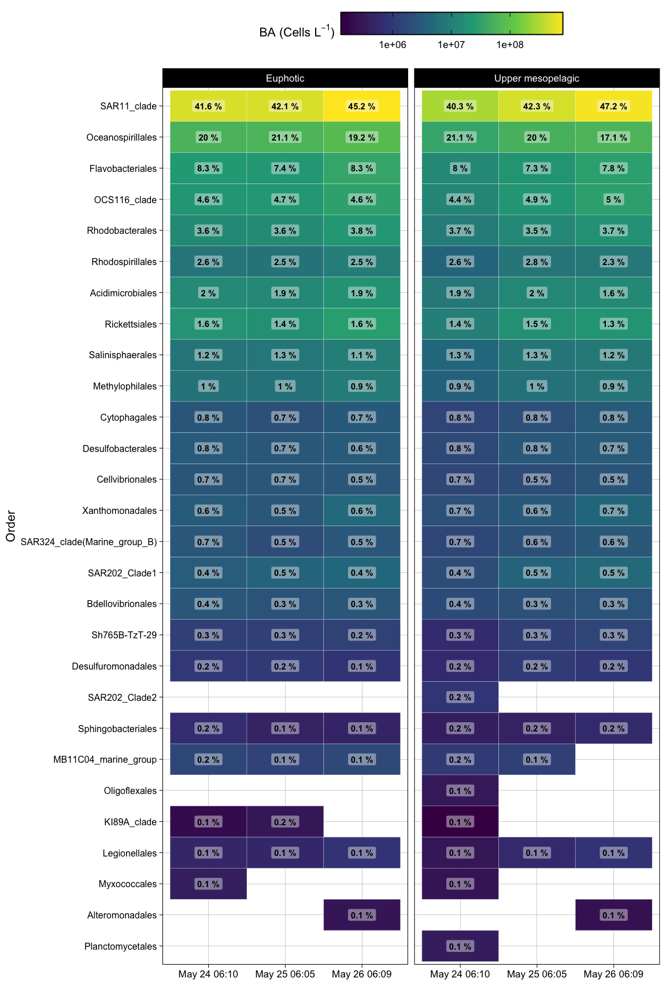
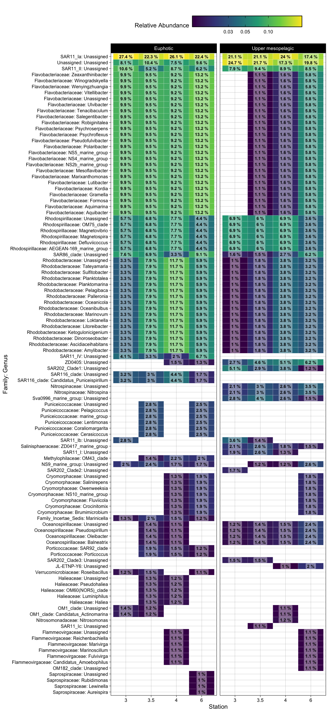
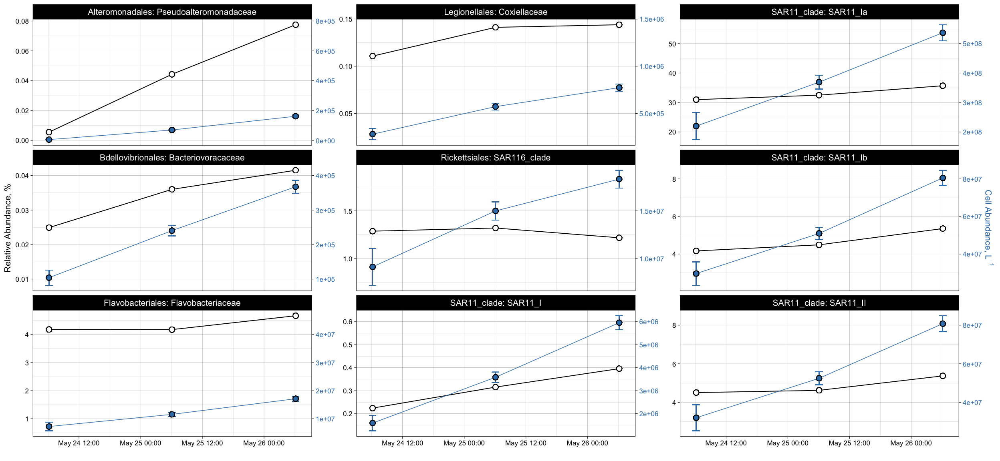

16S\_revised
================
Nicholas Baetge
12/28/2021

# Intro

``` r
library(tidyverse)
library(lubridate)
library(hms)
library(zoo) 
library(oce)  
library(ggpubr)
library(patchwork)
library(phyloseq)
library(rstatix)
```

# Import Data

``` r
floats <- read_rds("~/GITHUB/naames_multiday/Output/processed_floats.rds") 

floats %>% select(float:lon, ezd) %>% distinct() %>% drop_na(ezd) %>% 
  group_by(Cruise, Station) %>% 
  # summarize(max_ezd = max(ezd), 
  #           min_ezd = min(ezd)) 
  filter(Cruise == "AT34", Station == 4) %>% summary()
```

    ##     float              Cruise             Station     profile    
    ##  Length:20          Length:20          Min.   :4   Min.   : 1.0  
    ##  Class :character   Class :character   1st Qu.:4   1st Qu.: 6.5  
    ##  Mode  :character   Mode  :character   Median :4   Median :14.5  
    ##                                        Mean   :4   Mean   :14.4  
    ##                                        3rd Qu.:4   3rd Qu.:21.5  
    ##                                        Max.   :4   Max.   :28.0  
    ##     datetime                        date                time         
    ##  Min.   :2016-05-24 12:28:04   Min.   :2016-05-24   Length:20        
    ##  1st Qu.:2016-05-27 08:14:19   1st Qu.:2016-05-26   Class1:hms       
    ##  Median :2016-05-29 17:04:35   Median :2016-05-29   Class2:difftime  
    ##  Mean   :2016-05-29 15:45:39   Mean   :2016-05-29   Mode  :numeric   
    ##  3rd Qu.:2016-05-31 22:41:39   3rd Qu.:2016-05-31                    
    ##  Max.   :2016-06-03 06:34:08   Max.   :2016-06-03                    
    ##   plot_date              lat             lon              ezd       
    ##  Length:20          Min.   :46.77   Min.   :-39.07   Min.   :27.23  
    ##  Class :character   1st Qu.:46.91   1st Qu.:-38.46   1st Qu.:50.96  
    ##  Mode  :character   Median :46.94   Median :-38.36   Median :58.96  
    ##                     Mean   :47.05   Mean   :-38.25   Mean   :57.92  
    ##                     3rd Qu.:47.17   3rd Qu.:-38.03   3rd Qu.:68.84  
    ##                     Max.   :47.65   Max.   :-37.61   Max.   :76.98

Euphotic zone for N2S4 = 75 m, for N3 is \< 75 m (don’t know for station
3.5, but likely similar to station 3 and
4)

``` r
count.tab <- read.table("~/GITHUB/naames_multiday/Input/16s/HetV1OTU.txt", header = T, row.names = 1, check.names = F) 


tax.tab <- as.matrix(read.table("~/GITHUB/naames_multiday/Input/16s/HetV1TUtax.txt", header = T, row.names = 1, check.names = F, na.strings = "", sep = "\t")) 

# tax.tab2 <- as.matrix(read.table("~/GITHUB/naames_multiday/Input/16s/HetV1TUtax_NO_RICKETTS.txt", header = T, row.names = 1, check.names = F, na.strings = "", sep = "\t")) 

sample.tab <- read_rds("~/GITHUB/naames_multiday/Input/bottle_data.rds") %>% 
  drop_na(DNA_ID) %>% 
  filter(Cruise == "AT34" & Station == 4 | Cruise == "AT38" & Station %in% c(3, 3.5, 4, 6))   %>% 
    filter(!plot_date %in% c("May 24 02:30", "May 27 06:07", "Sep 14 15:33", "Sep 15 03:04", "Sep 15 15:20", "Sep 16 03:04", "Sep 16 04:50", "Sep 16 07:26", "Sep 8 03:08", "Sep 8 03:08",  "Sep 8 15:30", "Sep 11 03:07"), z <= 200) %>% #FILTER OUT CASTS THAT HAVE DIFFERENT T-S PROPERTIES IN UPPER MESO
  mutate(dh = ifelse(Cruise == "AT34" & z < 100, "Euphotic", "Upper mesopelagic"),
         dh = ifelse(Cruise == "AT38" & z < 75, "Euphotic", dh),
         Cruise = ifelse(Cruise == "AT34", "N2S4", "NAAMES 3"),
         cruise_station = paste(Cruise, "Station", Station)) %>% 
  column_to_rownames(var = "DNA_ID") %>% 
  select(Cruise:mld, dh, everything())


gene_copies <- readxl::read_xlsx("~/GITHUB/naames_multiday/Input/16s/gene_copies.xlsx") %>% 
  mutate(copy_num = ave_order, 
         copy_num = ifelse(is.na(copy_num), ave_class, copy_num),
         copy_num = ifelse(is.na(copy_num), ave_phylum, copy_num),
         copy_num = ifelse(is.na(copy_num), ave_kingdom, copy_num))
```

# Phyloseq Object

We need to create a phyloseq object that merges all three datasets.
Sometimes this doesn’t work beacuse of the format of the data files.
Make sure all the sample names between the sampleinfo.txt and
seqtab-nochimtaxa.txt are the same

``` r
OTU = otu_table(count.tab, taxa_are_rows = TRUE) 
TAX = tax_table(tax.tab)
SAM = sample_data(sample.tab)
ps = phyloseq(OTU,TAX,SAM) 
```

# Filter sequences

We will filter out chloroplasts and mitochondria, because we only
intended to amplify bacterial sequences. It’s good to check you don’t
have anything lurking in the taxonomy table.

``` r
sub_ps <- ps %>%
  subset_taxa(
    Family  != "mitochondria" &
    # Family  != "Mitochondria" &
    Order   != "Chloroplast")
```

# Sample Summary

As a first analysis, we will look at the distribution of read counts
from our
samples


``` r
# mean, max and min of sample read counts
smin <- min(sample_sums(sub_ps)) 
smean <- mean(sample_sums(sub_ps)) 
smax <- max(sample_sums(sub_ps)) 
```

# Beta Diversity

Beta diversity involves calculating metrics such as distances or
dissimilarities based on pairwise comparisons of samples – they don’t
exist for a single sample, but rather only as metrics that relate
samples to each other. i.e. beta diversity = patterns in community
structure between samples

Since differences in sampling depths between samples can influence
distance/dissimilarity metrics, we first need to somehow normalize the
read depth across our samples.

## Subsample

We will rarefy (random subsample with replacement) the min read depth of
the samples first (scale to the smallest library size) according to
Bolaños et al 2021.

A strong reason to subsample is to standardize effort. The bottom line
is that in all experimental design you should not be comparing things to
which you devote different effort in resolution. For instance, you don’t
sample one site once a week and another once a month if you want to
compare the dynamics between the sites. You standardize
effort.

``` r
ps_min <-  rarefy_even_depth(sub_ps, sample.size = smin, rngseed = 532898)
```

    ## `set.seed(532898)` was used to initialize repeatable random subsampling.

    ## Please record this for your records so others can reproduce.

    ## Try `set.seed(532898); .Random.seed` for the full vector

    ## ...

    ## 7378OTUs were removed because they are no longer 
    ## present in any sample after random subsampling

    ## ...

We can also subset the N2 and the N2S4 data here

``` r
s4n3 <- ps_min %>% 
  subset_samples(Cruise == "NAAMES 3" & z %in% c(5, 25, 100, 150, 200) | Cruise == "N2S4" )
```

``` r
s4 <- ps_min %>% 
  subset_samples(Cruise == "N2S4" & Station == 4)
```

``` r
s4_meso <- s4 %>% 
  subset_samples(dh == "Upper mesopelagic" )
```

``` r
n3 <- ps_min %>% 
  subset_samples(Cruise == "NAAMES 3" & z %in% c(5, 25, 100, 150, 200) & !Cruise == "N2S4" )
```

## Unconstrained Ordination

One of the best exploratory analyses for amplicon data is unconstrained
ordinations. Here we will look at ordinations of our subsampled dataset

### NMDS

Let’s try an NMDS. For NMDS plots it’s important to set a seed since the
starting positions of samples in the alogrithm is random.

``` r
set.seed(8)
# Ordinate
nmds <- ordinate(s4n3, method = "NMDS",  distance = "bray") # stress = 0.05
```

    ## Square root transformation
    ## Wisconsin double standardization
    ## Run 0 stress 0.04794218 
    ## Run 1 stress 0.2253945 
    ## Run 2 stress 0.04770254 
    ## ... New best solution
    ## ... Procrustes: rmse 0.005554127  max resid 0.02785282 
    ## Run 3 stress 0.04770254 
    ## ... Procrustes: rmse 1.57293e-06  max resid 6.055682e-06 
    ## ... Similar to previous best
    ## Run 4 stress 0.04794218 
    ## ... Procrustes: rmse 0.00555353  max resid 0.02792731 
    ## Run 5 stress 0.04794218 
    ## ... Procrustes: rmse 0.005552265  max resid 0.02791789 
    ## Run 6 stress 0.04794218 
    ## ... Procrustes: rmse 0.005551875  max resid 0.02791536 
    ## Run 7 stress 0.2346769 
    ## Run 8 stress 0.04770254 
    ## ... New best solution
    ## ... Procrustes: rmse 4.221448e-06  max resid 1.370858e-05 
    ## ... Similar to previous best
    ## Run 9 stress 0.04794218 
    ## ... Procrustes: rmse 0.005553068  max resid 0.02792427 
    ## Run 10 stress 0.1570516 
    ## Run 11 stress 0.04794218 
    ## ... Procrustes: rmse 0.005553386  max resid 0.02792666 
    ## Run 12 stress 0.04770254 
    ## ... Procrustes: rmse 1.179855e-06  max resid 4.19091e-06 
    ## ... Similar to previous best
    ## Run 13 stress 0.04770254 
    ## ... Procrustes: rmse 5.007979e-06  max resid 1.588646e-05 
    ## ... Similar to previous best
    ## Run 14 stress 0.04770254 
    ## ... Procrustes: rmse 4.84863e-06  max resid 1.223331e-05 
    ## ... Similar to previous best
    ## Run 15 stress 0.04794218 
    ## ... Procrustes: rmse 0.005551858  max resid 0.02791558 
    ## Run 16 stress 0.04794218 
    ## ... Procrustes: rmse 0.005553353  max resid 0.02792684 
    ## Run 17 stress 0.1395345 
    ## Run 18 stress 0.04770254 
    ## ... Procrustes: rmse 2.921744e-06  max resid 7.84295e-06 
    ## ... Similar to previous best
    ## Run 19 stress 0.1614722 
    ## Run 20 stress 0.04794218 
    ## ... Procrustes: rmse 0.005551606  max resid 0.02791354 
    ## *** Solution reached

``` r
set.seed(7)
# Ordinate
nmds_s4 <- ordinate(s4, method = "NMDS",  distance = "bray") # stress = 0.09
```

    ## Square root transformation
    ## Wisconsin double standardization
    ## Run 0 stress 0.08763807 
    ## Run 1 stress 0.3789439 
    ## Run 2 stress 0.09551312 
    ## Run 3 stress 0.09887487 
    ## Run 4 stress 0.08983489 
    ## Run 5 stress 0.09493637 
    ## Run 6 stress 0.1029261 
    ## Run 7 stress 0.08900643 
    ## Run 8 stress 0.09677245 
    ## Run 9 stress 0.1029261 
    ## Run 10 stress 0.08900656 
    ## Run 11 stress 0.08995316 
    ## Run 12 stress 0.09551264 
    ## Run 13 stress 0.08900654 
    ## Run 14 stress 0.1034377 
    ## Run 15 stress 0.08763824 
    ## ... Procrustes: rmse 9.591818e-05  max resid 0.0003474707 
    ## ... Similar to previous best
    ## Run 16 stress 0.08662108 
    ## ... New best solution
    ## ... Procrustes: rmse 0.07222615  max resid 0.2774339 
    ## Run 17 stress 0.1015351 
    ## Run 18 stress 0.08763827 
    ## Run 19 stress 0.09912518 
    ## Run 20 stress 0.08763794 
    ## *** No convergence -- monoMDS stopping criteria:
    ##     20: stress ratio > sratmax

``` r
set.seed(7)
# Ordinate
nmds_n3 <- ordinate(n3, method = "NMDS",  distance = "bray") # stress = 0.05
```

    ## Square root transformation
    ## Wisconsin double standardization
    ## Run 0 stress 0.04631479 
    ## Run 1 stress 0.0463147 
    ## ... New best solution
    ## ... Procrustes: rmse 7.566689e-05  max resid 0.0002041815 
    ## ... Similar to previous best
    ## Run 2 stress 0.04631478 
    ## ... Procrustes: rmse 7.166777e-05  max resid 0.0001958597 
    ## ... Similar to previous best
    ## Run 3 stress 0.04631465 
    ## ... New best solution
    ## ... Procrustes: rmse 0.0001344509  max resid 0.0003616062 
    ## ... Similar to previous best
    ## Run 4 stress 0.1764532 
    ## Run 5 stress 0.04631472 
    ## ... Procrustes: rmse 0.0001436614  max resid 0.0003905697 
    ## ... Similar to previous best
    ## Run 6 stress 0.1764532 
    ## Run 7 stress 0.1907817 
    ## Run 8 stress 0.04631469 
    ## ... Procrustes: rmse 0.0001165458  max resid 0.0003146987 
    ## ... Similar to previous best
    ## Run 9 stress 0.04631475 
    ## ... Procrustes: rmse 0.0001803109  max resid 0.0004875831 
    ## ... Similar to previous best
    ## Run 10 stress 0.04631469 
    ## ... Procrustes: rmse 4.534901e-05  max resid 0.0001196273 
    ## ... Similar to previous best
    ## Run 11 stress 0.04631466 
    ## ... Procrustes: rmse 6.454815e-05  max resid 0.0001752133 
    ## ... Similar to previous best
    ## Run 12 stress 0.2052355 
    ## Run 13 stress 0.04631468 
    ## ... Procrustes: rmse 3.418669e-05  max resid 8.957789e-05 
    ## ... Similar to previous best
    ## Run 14 stress 0.04631478 
    ## ... Procrustes: rmse 0.0001899186  max resid 0.0005158884 
    ## ... Similar to previous best
    ## Run 15 stress 0.04631475 
    ## ... Procrustes: rmse 0.0001812531  max resid 0.0004882325 
    ## ... Similar to previous best
    ## Run 16 stress 0.2051069 
    ## Run 17 stress 0.04631466 
    ## ... Procrustes: rmse 6.46289e-05  max resid 0.0001749478 
    ## ... Similar to previous best
    ## Run 18 stress 0.04631466 
    ## ... Procrustes: rmse 7.369678e-05  max resid 0.0001997115 
    ## ... Similar to previous best
    ## Run 19 stress 0.2052355 
    ## Run 20 stress 0.04631476 
    ## ... Procrustes: rmse 0.0001850903  max resid 0.0005008306 
    ## ... Similar to previous best
    ## *** Solution reached

NMDS plots attempt to show ordinal distances between samples as
accurately as possible in two dimensions. It is important to report the
stress of these plots, because a high stress value means that the
algorithm had a hard time representing the distances between samples in
2 dimensions. The stress of these plots were good - it was .1 (generally
anything below .2 is considered acceptable).

``` r
nmds.plot +  nmds_s4.plot +
  plot_annotation(tag_levels = "a") &
  theme(plot.tag = element_text(size = 22),
        plot.title = element_text(size = 18)) 
```

<!-- -->

95% confidence interval ellipse for the mean (group centroid) tells us
something about the sampling distribution of the mean (centroid) we
might see if we repeated your data collection a lot of times. In other
words we are looking at the uncertainty in the estimate of the
population mean (centroid) given the sample of data we collected.

# Permutational ANOVA

Above, we performed beta diversity analyses on Bray-Curtis distances on
rarefied datasets that were then visualized using NMDS. We can test if
there are statistically significant differences between sample groups
using the adonis function of the vegan package.

## Phyloseq to DESeq, distance matrix

To be able to run the stats, we first have to create a distance matrix
from our data. We’ll use the DESeq package to do so.

``` r
library(DESeq2)
library(vegan)
```

``` r
deseq_counts <- phyloseq_to_deseq2(s4n3, design = ~datetime ) #the design argument is required but doesn't matter here
```

    ## converting counts to integer mode

``` r
deseq_count_tab <- assay(deseq_counts) #extract the read count matrix
```

\`\`

We’ll calculate bray-curtis distances, which reflect the NMDS
ordinations
above

``` r
#We can subset our data if we want to and calculate distances/run stats for only a subset of the group. The code below shows how

sample.tab2 <- sample.tab %>%
  rownames_to_column() %>% 
  column_to_rownames(var = "rowname") %>% 
  select(Cruise:z)


####

subset_sample_IDs_s4n3 <-  row.names(sample.tab2)[sample.tab2$Cruise == "NAAMES 3" & sample.tab2$z %in% c(5, 25, 100, 150, 200) |  sample.tab2$Cruise == "N2S4" ]

dist <- vegdist(t(deseq_count_tab[ , colnames(deseq_count_tab) %in% subset_sample_IDs_s4n3]), method = "bray", na.rm = T)

sample_info_tab_s4n3 <- sample.tab2[row.names(sample.tab2) %in% subset_sample_IDs_s4n3, ]

####

subset_sample_IDs_n2s4 <-  row.names(sample.tab2)[sample.tab2$Cruise == "N2S4" & sample.tab2$Station == 4]

dist_n2s4 <- vegdist(t(deseq_count_tab[ , colnames(deseq_count_tab) %in% subset_sample_IDs_n2s4]), method = "bray", na.rm = T)

sample_info_tab_n2s4 <- sample.tab2[row.names(sample.tab2) %in% subset_sample_IDs_n2s4, ]

####

subset_sample_IDs_n2s4_ez <-  row.names(sample.tab2)[sample.tab2$Cruise == "N2S4" & sample.tab2$Station == 4 & sample.tab2$dh == "Euphotic"]

dist_n2s4_ez <- vegdist(t(deseq_count_tab[ , colnames(deseq_count_tab) %in% subset_sample_IDs_n2s4_ez]), method = "bray", na.rm = T)

sample_info_tab_n2s4_ez <- sample.tab2[row.names(sample.tab2) %in% subset_sample_IDs_n2s4_ez, ]

####


subset_sample_IDs_n2s4_mz <-  row.names(sample.tab2)[sample.tab2$Cruise == "N2S4" & sample.tab2$Station == 4 & sample.tab2$dh == "Upper mesopelagic"]

dist_n2s4_mz <- vegdist(t(deseq_count_tab[ , colnames(deseq_count_tab) %in% subset_sample_IDs_n2s4_mz]), method = "bray", na.rm = T)

sample_info_tab_n2s4_mz <- sample.tab2[row.names(sample.tab2) %in% subset_sample_IDs_n2s4_mz, ]


####

# subset_sample_IDs_n3 <-  row.names(sample.tab2)[sample.tab2$Cruise == "NAAMES 3" & sample.tab2$z %in% c(5, 25, 150, 200) & !sample.tab2$Cruise == "NAAMES 2"]

subset_sample_IDs_n3 <-  row.names(sample.tab2)[sample.tab2$Cruise == "NAAMES 3"]

dist_n3 <- vegdist(t(deseq_count_tab[ , colnames(deseq_count_tab) %in% subset_sample_IDs_n3]), method = "bray", na.rm = T)

sample_info_tab_n3 <- sample.tab2[row.names(sample.tab2) %in% subset_sample_IDs_n3, ]
```

Adonis analyzes and partitions sums of squares using distance matrices.
It can be seen as an ANOVA using distance matrices (analogous to MANOVA
– multivariate analysis of variance). Therefore, it is used to test if
two or more groups have similar compositions.

A one-way permutational multivariate ANOVA (PERMANOVA) test was used to
assess whether there were statistically significant differences between
groups (e.g., stations, depth horizons, or time) using the function
adonis in the R package vegan (v 2.5-6) (Anderson, 2001). To be a
reliable statistical test, the PERMANOVA test requires that there be a
sufficient level of homogeneity of dispersion within the groups, that
is, that the distances between samples to their group centroid should be
similar. Thus, the homogeneity of dispersion within the groups was
assessed using the vegan function betadisper prior to performing
PERMANOVAs (Anderson, 2006).

``` r
adonis(dist~dh:Cruise , data = sample_info_tab_s4n3)
```

    ## 'adonis' will be deprecated: use 'adonis2' instead

    ## $aov.tab
    ## Permutation: free
    ## Number of permutations: 999
    ## 
    ## Terms added sequentially (first to last)
    ## 
    ##           Df SumsOfSqs MeanSqs F.Model      R2 Pr(>F)    
    ## dh:Cruise  3    3.6007 1.20022  9.5502 0.44316  0.001 ***
    ## Residuals 36    4.5243 0.12567         0.55684           
    ## Total     39    8.1249                 1.00000           
    ## ---
    ## Signif. codes:  0 '***' 0.001 '**' 0.01 '*' 0.05 '.' 0.1 ' ' 1
    ## 
    ## $call
    ## adonis(formula = dist ~ dh:Cruise, data = sample_info_tab_s4n3)
    ## 
    ## $coefficients
    ## NULL
    ## 
    ## $coef.sites
    ##                                           [,1]        [,2]        [,3]
    ## (Intercept)                         0.78587016  0.78321969  0.77863610
    ## dhEuphotic:CruiseN2S4              -0.65815330 -0.64511990 -0.65064236
    ## dhUpper mesopelagic:CruiseN2S4     -0.63376266 -0.62234438 -0.62766380
    ## dhEuphotic:CruiseNAAMES 3          -0.06900207 -0.06400505 -0.06106197
    ## dhUpper mesopelagic:CruiseNAAMES 3          NA          NA          NA
    ##                                           [,4]        [,5]        [,6]
    ## (Intercept)                         0.77871916  0.78015389  0.78218517
    ## dhEuphotic:CruiseN2S4              -0.65321040 -0.63397619 -0.62693972
    ## dhUpper mesopelagic:CruiseN2S4     -0.63017416 -0.63563285 -0.63271724
    ## dhEuphotic:CruiseNAAMES 3          -0.06452986 -0.06592306 -0.06385308
    ## dhUpper mesopelagic:CruiseNAAMES 3          NA          NA          NA
    ##                                           [,7]        [,8]        [,9]
    ## (Intercept)                         0.78129413  0.78186047  0.78291009
    ## dhEuphotic:CruiseN2S4              -0.62717695 -0.61416243 -0.64087171
    ## dhUpper mesopelagic:CruiseN2S4     -0.63129090 -0.59832732 -0.61838922
    ## dhEuphotic:CruiseNAAMES 3          -0.06292051 -0.05783854 -0.06093359
    ## dhUpper mesopelagic:CruiseNAAMES 3          NA          NA          NA
    ##                                          [,10]       [,11]       [,12]
    ## (Intercept)                         0.77943653  0.77580439  0.77964796
    ## dhEuphotic:CruiseN2S4              -0.64254116 -0.64915351 -0.63430782
    ## dhUpper mesopelagic:CruiseN2S4     -0.62361886 -0.62577348 -0.63901244
    ## dhEuphotic:CruiseNAAMES 3          -0.06077219 -0.06128284 -0.06472147
    ## dhUpper mesopelagic:CruiseNAAMES 3          NA          NA          NA
    ##                                          [,13]       [,14]       [,15]
    ## (Intercept)                         0.77561561  0.77926285  0.77887774
    ## dhEuphotic:CruiseN2S4              -0.63615912 -0.63736291 -0.65081478
    ## dhUpper mesopelagic:CruiseN2S4     -0.64028691 -0.64282664 -0.63098801
    ## dhEuphotic:CruiseNAAMES 3          -0.06135363 -0.06138761 -0.06177084
    ## dhUpper mesopelagic:CruiseNAAMES 3          NA          NA          NA
    ##                                         [,16]       [,17]       [,18]
    ## (Intercept)                         0.7803276  0.77863610  0.77584970
    ## dhEuphotic:CruiseN2S4              -0.6500634 -0.65110613 -0.63969498
    ## dhUpper mesopelagic:CruiseN2S4     -0.6254236 -0.62828216 -0.61892452
    ## dhEuphotic:CruiseNAAMES 3          -0.0627742 -0.06174724 -0.06466106
    ## dhUpper mesopelagic:CruiseNAAMES 3         NA          NA          NA
    ##                                          [,19]       [,20]       [,21]
    ## (Intercept)                         0.77873427  0.77698238  0.78506974
    ## dhEuphotic:CruiseN2S4              -0.61070397 -0.59327388 -0.61168878
    ## dhUpper mesopelagic:CruiseN2S4     -0.61993555 -0.60590874 -0.62624333
    ## dhEuphotic:CruiseNAAMES 3          -0.05742228 -0.05330309 -0.05821327
    ## dhUpper mesopelagic:CruiseNAAMES 3          NA          NA          NA
    ##                                          [,22]       [,23]       [,24]
    ## (Intercept)                         0.74709467  0.67655121  0.65021257
    ## dhEuphotic:CruiseN2S4              -0.19349110 -0.01952682  0.01594188
    ## dhUpper mesopelagic:CruiseN2S4     -0.19585841 -0.01645578  0.01711861
    ## dhEuphotic:CruiseNAAMES 3          -0.08745724 -0.10133732 -0.05054690
    ## dhUpper mesopelagic:CruiseNAAMES 3          NA          NA          NA
    ##                                         [,25]      [,26]       [,27]
    ## (Intercept)                        0.58889669 0.64562898  0.71463199
    ## dhEuphotic:CruiseN2S4              0.11595836 0.15982967 -0.04840833
    ## dhUpper mesopelagic:CruiseN2S4     0.11357952 0.15700321 -0.04333223
    ## dhEuphotic:CruiseNAAMES 3          0.07928588 0.02946862 -0.10320247
    ## dhUpper mesopelagic:CruiseNAAMES 3         NA         NA          NA
    ##                                           [,28]     [,29]     [,30]      [,31]
    ## (Intercept)                         0.656842534 0.5389529 0.5151440 0.57710924
    ## dhEuphotic:CruiseN2S4              -0.008851284 0.2846550 0.3222941 0.26198315
    ## dhUpper mesopelagic:CruiseN2S4     -0.004878086 0.2845558 0.3222733 0.26131403
    ## dhEuphotic:CruiseNAAMES 3          -0.039743938 0.1749249 0.1949856 0.08323422
    ## dhUpper mesopelagic:CruiseNAAMES 3           NA        NA        NA         NA
    ##                                         [,32]     [,33]     [,34]     [,35]
    ## (Intercept)                        0.64426976 0.5638720 0.5532096 0.5597414
    ## dhEuphotic:CruiseN2S4              0.20503251 0.3420518 0.3459306 0.3405133
    ## dhUpper mesopelagic:CruiseN2S4     0.20737905 0.3432909 0.3460806 0.3401580
    ## dhEuphotic:CruiseNAAMES 3          0.02633203 0.2262892 0.2370242 0.2310634
    ## dhUpper mesopelagic:CruiseNAAMES 3         NA        NA        NA        NA
    ##                                         [,36]      [,37]        [,38]
    ## (Intercept)                         0.8354439  0.8314267  0.744663178
    ## dhEuphotic:CruiseN2S4              -0.1338214 -0.1639086 -0.102749398
    ## dhUpper mesopelagic:CruiseN2S4     -0.1302451 -0.1609852 -0.107345571
    ## dhEuphotic:CruiseNAAMES 3          -0.2224050 -0.2226136 -0.003135642
    ## dhUpper mesopelagic:CruiseNAAMES 3         NA         NA           NA
    ##                                         [,39]      [,40]
    ## (Intercept)                        0.60739717 0.63844022
    ## dhEuphotic:CruiseN2S4              0.09738174 0.20963686
    ## dhUpper mesopelagic:CruiseN2S4     0.09421149 0.21229489
    ## dhEuphotic:CruiseNAAMES 3          0.08058563 0.05111041
    ## dhUpper mesopelagic:CruiseNAAMES 3         NA         NA
    ## 
    ## $f.perms
    ##              [,1]
    ##    [1,] 1.6718734
    ##    [2,] 0.7242473
    ##    [3,] 1.9764287
    ##    [4,] 0.7684689
    ##    [5,] 0.8461415
    ##    [6,] 1.5774887
    ##    [7,] 0.6371149
    ##    [8,] 2.0370818
    ##    [9,] 0.5813556
    ##   [10,] 1.0104857
    ##   [11,] 1.0311731
    ##   [12,] 0.8215907
    ##   [13,] 0.6561296
    ##   [14,] 0.8167321
    ##   [15,] 0.8689583
    ##   [16,] 1.1049163
    ##   [17,] 1.7019499
    ##   [18,] 0.7773935
    ##   [19,] 0.7551621
    ##   [20,] 2.0723023
    ##   [21,] 1.0834608
    ##   [22,] 1.3107359
    ##   [23,] 1.4040286
    ##   [24,] 0.8883329
    ##   [25,] 1.4749107
    ##   [26,] 0.9429025
    ##   [27,] 0.7793629
    ##   [28,] 0.9750563
    ##   [29,] 0.9444591
    ##   [30,] 1.5840569
    ##   [31,] 1.1410534
    ##   [32,] 0.7001742
    ##   [33,] 1.1590033
    ##   [34,] 1.6294358
    ##   [35,] 1.0914423
    ##   [36,] 1.2125940
    ##   [37,] 0.9941121
    ##   [38,] 0.8902221
    ##   [39,] 0.7292766
    ##   [40,] 1.0992591
    ##   [41,] 0.8037098
    ##   [42,] 0.6460416
    ##   [43,] 1.3281050
    ##   [44,] 0.7558005
    ##   [45,] 1.5267464
    ##   [46,] 1.1462340
    ##   [47,] 1.0267523
    ##   [48,] 0.6278241
    ##   [49,] 1.2433573
    ##   [50,] 0.7211047
    ##   [51,] 1.1725923
    ##   [52,] 0.8248326
    ##   [53,] 1.1759439
    ##   [54,] 0.5020801
    ##   [55,] 1.2647317
    ##   [56,] 1.8608225
    ##   [57,] 1.2857137
    ##   [58,] 1.1184996
    ##   [59,] 0.7146893
    ##   [60,] 1.5429629
    ##   [61,] 1.0158099
    ##   [62,] 0.5664832
    ##   [63,] 0.4192831
    ##   [64,] 1.1196945
    ##   [65,] 0.7344252
    ##   [66,] 0.8686979
    ##   [67,] 1.0044382
    ##   [68,] 1.0690305
    ##   [69,] 0.7649443
    ##   [70,] 1.2079402
    ##   [71,] 1.5372460
    ##   [72,] 0.8794821
    ##   [73,] 0.6164513
    ##   [74,] 0.9788810
    ##   [75,] 1.2181011
    ##   [76,] 0.7423516
    ##   [77,] 1.3466728
    ##   [78,] 1.4836084
    ##   [79,] 1.3499715
    ##   [80,] 2.0750241
    ##   [81,] 0.8678223
    ##   [82,] 0.5792952
    ##   [83,] 2.6020325
    ##   [84,] 0.4334999
    ##   [85,] 0.6564179
    ##   [86,] 0.9353300
    ##   [87,] 0.5614242
    ##   [88,] 0.7611767
    ##   [89,] 0.3530541
    ##   [90,] 1.8499368
    ##   [91,] 0.7639021
    ##   [92,] 0.3926608
    ##   [93,] 1.0422999
    ##   [94,] 0.8122928
    ##   [95,] 0.4014723
    ##   [96,] 0.7198233
    ##   [97,] 1.0003840
    ##   [98,] 1.2610735
    ##   [99,] 0.6007047
    ##  [100,] 0.6236698
    ##  [101,] 0.8031207
    ##  [102,] 0.6134333
    ##  [103,] 0.8258417
    ##  [104,] 0.9315702
    ##  [105,] 0.5245836
    ##  [106,] 1.0605128
    ##  [107,] 1.2300753
    ##  [108,] 1.0400205
    ##  [109,] 0.8723322
    ##  [110,] 0.4817830
    ##  [111,] 0.8267818
    ##  [112,] 0.3791296
    ##  [113,] 1.4435699
    ##  [114,] 0.7700243
    ##  [115,] 1.2268327
    ##  [116,] 1.2896945
    ##  [117,] 0.4987081
    ##  [118,] 0.5789102
    ##  [119,] 0.9478766
    ##  [120,] 1.9294967
    ##  [121,] 0.7985995
    ##  [122,] 0.4743616
    ##  [123,] 1.2744664
    ##  [124,] 1.9269766
    ##  [125,] 1.1483424
    ##  [126,] 1.3967612
    ##  [127,] 1.1472888
    ##  [128,] 0.9292369
    ##  [129,] 0.9545602
    ##  [130,] 1.0273657
    ##  [131,] 1.0982923
    ##  [132,] 1.1668794
    ##  [133,] 0.7297974
    ##  [134,] 2.0022655
    ##  [135,] 0.5856256
    ##  [136,] 1.2680336
    ##  [137,] 0.7814345
    ##  [138,] 0.6625764
    ##  [139,] 0.7868938
    ##  [140,] 1.1140261
    ##  [141,] 1.4211643
    ##  [142,] 1.2467587
    ##  [143,] 0.9154990
    ##  [144,] 0.6986192
    ##  [145,] 1.1122203
    ##  [146,] 0.7099566
    ##  [147,] 0.7970582
    ##  [148,] 0.4346503
    ##  [149,] 1.2455627
    ##  [150,] 1.2824921
    ##  [151,] 1.3314173
    ##  [152,] 0.6731936
    ##  [153,] 0.8717027
    ##  [154,] 0.9632685
    ##  [155,] 0.4409061
    ##  [156,] 0.9174187
    ##  [157,] 0.4435042
    ##  [158,] 1.2099422
    ##  [159,] 0.7440686
    ##  [160,] 1.5315914
    ##  [161,] 1.1647915
    ##  [162,] 0.5546131
    ##  [163,] 0.4230632
    ##  [164,] 1.4168131
    ##  [165,] 0.6017420
    ##  [166,] 1.0196786
    ##  [167,] 1.2878306
    ##  [168,] 1.1396145
    ##  [169,] 1.3564561
    ##  [170,] 1.5244733
    ##  [171,] 0.7572128
    ##  [172,] 1.1938852
    ##  [173,] 0.8594188
    ##  [174,] 0.7847997
    ##  [175,] 2.1916867
    ##  [176,] 1.9822549
    ##  [177,] 0.6409335
    ##  [178,] 0.5309987
    ##  [179,] 1.1016199
    ##  [180,] 0.6535533
    ##  [181,] 2.2134407
    ##  [182,] 1.4914563
    ##  [183,] 0.6032215
    ##  [184,] 0.9192202
    ##  [185,] 1.5032116
    ##  [186,] 1.2115479
    ##  [187,] 1.7072852
    ##  [188,] 0.8188505
    ##  [189,] 0.9470841
    ##  [190,] 0.6984199
    ##  [191,] 0.8941160
    ##  [192,] 2.0832386
    ##  [193,] 0.5439271
    ##  [194,] 1.5050788
    ##  [195,] 0.5567638
    ##  [196,] 0.9458943
    ##  [197,] 0.7769672
    ##  [198,] 0.9315475
    ##  [199,] 0.7034766
    ##  [200,] 1.0867290
    ##  [201,] 1.9042740
    ##  [202,] 0.8784756
    ##  [203,] 1.6232044
    ##  [204,] 0.7243498
    ##  [205,] 0.9430102
    ##  [206,] 0.8622489
    ##  [207,] 0.8113003
    ##  [208,] 2.0486895
    ##  [209,] 0.7730438
    ##  [210,] 1.2151289
    ##  [211,] 0.5294158
    ##  [212,] 0.7772068
    ##  [213,] 0.4831147
    ##  [214,] 0.6690655
    ##  [215,] 0.7523214
    ##  [216,] 1.2027743
    ##  [217,] 0.8497898
    ##  [218,] 1.7642062
    ##  [219,] 0.9518716
    ##  [220,] 0.4613151
    ##  [221,] 1.1912889
    ##  [222,] 1.1873964
    ##  [223,] 0.5299815
    ##  [224,] 1.6422931
    ##  [225,] 1.7499093
    ##  [226,] 1.0949210
    ##  [227,] 1.0769225
    ##  [228,] 0.6626485
    ##  [229,] 1.1166831
    ##  [230,] 1.0077605
    ##  [231,] 1.6350200
    ##  [232,] 1.0084387
    ##  [233,] 0.9034092
    ##  [234,] 0.7356962
    ##  [235,] 0.8530351
    ##  [236,] 1.7096059
    ##  [237,] 0.8444265
    ##  [238,] 0.9525467
    ##  [239,] 2.0860575
    ##  [240,] 1.0294295
    ##  [241,] 0.8232251
    ##  [242,] 2.7771302
    ##  [243,] 1.6320371
    ##  [244,] 1.6063051
    ##  [245,] 1.1536785
    ##  [246,] 0.7092703
    ##  [247,] 1.0501180
    ##  [248,] 1.4416396
    ##  [249,] 0.6365621
    ##  [250,] 0.5236935
    ##  [251,] 1.2750620
    ##  [252,] 0.4056076
    ##  [253,] 1.0092553
    ##  [254,] 1.5313162
    ##  [255,] 1.3401433
    ##  [256,] 0.8583183
    ##  [257,] 0.9278326
    ##  [258,] 0.9655939
    ##  [259,] 0.8984425
    ##  [260,] 0.8216864
    ##  [261,] 1.3619101
    ##  [262,] 1.4299465
    ##  [263,] 0.7547056
    ##  [264,] 0.7792247
    ##  [265,] 1.3772688
    ##  [266,] 0.9086217
    ##  [267,] 0.4719548
    ##  [268,] 1.0399879
    ##  [269,] 1.2349824
    ##  [270,] 0.8129802
    ##  [271,] 0.7458327
    ##  [272,] 1.0825780
    ##  [273,] 2.1071122
    ##  [274,] 1.2922995
    ##  [275,] 0.8075233
    ##  [276,] 0.4862334
    ##  [277,] 0.5764600
    ##  [278,] 1.4450855
    ##  [279,] 1.2761777
    ##  [280,] 0.5562533
    ##  [281,] 0.4545052
    ##  [282,] 1.1939805
    ##  [283,] 0.5958670
    ##  [284,] 0.8996299
    ##  [285,] 1.1476564
    ##  [286,] 0.9715017
    ##  [287,] 0.4943031
    ##  [288,] 1.2114902
    ##  [289,] 1.8899576
    ##  [290,] 1.5696720
    ##  [291,] 0.9023082
    ##  [292,] 1.2092188
    ##  [293,] 0.9455568
    ##  [294,] 1.0181197
    ##  [295,] 0.4126776
    ##  [296,] 1.3724703
    ##  [297,] 1.0002436
    ##  [298,] 1.1408163
    ##  [299,] 0.6556340
    ##  [300,] 0.6900717
    ##  [301,] 0.5764019
    ##  [302,] 0.4909959
    ##  [303,] 0.9235414
    ##  [304,] 0.9855979
    ##  [305,] 0.5825685
    ##  [306,] 1.0456688
    ##  [307,] 0.8963287
    ##  [308,] 0.5133370
    ##  [309,] 0.8981923
    ##  [310,] 1.5576610
    ##  [311,] 0.6601760
    ##  [312,] 0.7718113
    ##  [313,] 1.4475482
    ##  [314,] 0.8478652
    ##  [315,] 0.8986605
    ##  [316,] 1.1798119
    ##  [317,] 0.9973303
    ##  [318,] 1.0473602
    ##  [319,] 0.8385587
    ##  [320,] 0.6989547
    ##  [321,] 0.6958766
    ##  [322,] 1.7501749
    ##  [323,] 0.8555107
    ##  [324,] 1.7514005
    ##  [325,] 0.8216143
    ##  [326,] 1.3429637
    ##  [327,] 0.7248833
    ##  [328,] 1.8597229
    ##  [329,] 0.7833700
    ##  [330,] 0.8720406
    ##  [331,] 1.6474164
    ##  [332,] 1.0761626
    ##  [333,] 0.9912880
    ##  [334,] 1.1768000
    ##  [335,] 0.8079407
    ##  [336,] 0.6954988
    ##  [337,] 1.2856951
    ##  [338,] 1.5752673
    ##  [339,] 1.1917631
    ##  [340,] 1.6246571
    ##  [341,] 1.4784571
    ##  [342,] 0.8231381
    ##  [343,] 0.5791617
    ##  [344,] 1.9063945
    ##  [345,] 1.2260344
    ##  [346,] 0.6477155
    ##  [347,] 1.0798625
    ##  [348,] 0.5566695
    ##  [349,] 1.3379471
    ##  [350,] 2.1414044
    ##  [351,] 2.1833455
    ##  [352,] 0.5845658
    ##  [353,] 1.5714132
    ##  [354,] 0.8339044
    ##  [355,] 1.2955616
    ##  [356,] 1.9009318
    ##  [357,] 0.7614707
    ##  [358,] 0.7677314
    ##  [359,] 1.0605680
    ##  [360,] 1.4157471
    ##  [361,] 1.0973023
    ##  [362,] 0.6450836
    ##  [363,] 1.7713616
    ##  [364,] 1.5436692
    ##  [365,] 1.5821582
    ##  [366,] 1.8673647
    ##  [367,] 0.9717522
    ##  [368,] 0.6116527
    ##  [369,] 0.7133315
    ##  [370,] 0.4315604
    ##  [371,] 0.8128065
    ##  [372,] 0.3861143
    ##  [373,] 0.3118021
    ##  [374,] 0.7409392
    ##  [375,] 0.9020784
    ##  [376,] 0.9154039
    ##  [377,] 0.3841747
    ##  [378,] 0.9662877
    ##  [379,] 0.5493569
    ##  [380,] 0.4685084
    ##  [381,] 0.8679663
    ##  [382,] 1.1532061
    ##  [383,] 0.5374168
    ##  [384,] 0.9058686
    ##  [385,] 0.8366043
    ##  [386,] 0.7861143
    ##  [387,] 0.8076538
    ##  [388,] 0.9179367
    ##  [389,] 1.3421858
    ##  [390,] 0.8653406
    ##  [391,] 0.7322805
    ##  [392,] 1.2235712
    ##  [393,] 1.2162071
    ##  [394,] 1.1502128
    ##  [395,] 1.2719278
    ##  [396,] 0.5594263
    ##  [397,] 1.5072096
    ##  [398,] 1.0211493
    ##  [399,] 1.3993128
    ##  [400,] 0.7623410
    ##  [401,] 0.4851126
    ##  [402,] 1.3286675
    ##  [403,] 1.0116296
    ##  [404,] 1.2083804
    ##  [405,] 0.8911210
    ##  [406,] 0.4857077
    ##  [407,] 0.5586211
    ##  [408,] 1.1252194
    ##  [409,] 0.7006730
    ##  [410,] 0.5299941
    ##  [411,] 0.5906048
    ##  [412,] 0.6235056
    ##  [413,] 0.7565364
    ##  [414,] 0.6377012
    ##  [415,] 0.7349642
    ##  [416,] 0.6339124
    ##  [417,] 1.0779991
    ##  [418,] 0.7484295
    ##  [419,] 0.6762792
    ##  [420,] 1.0849519
    ##  [421,] 0.6904424
    ##  [422,] 2.5196037
    ##  [423,] 0.4432929
    ##  [424,] 0.8368471
    ##  [425,] 1.2977386
    ##  [426,] 1.1381511
    ##  [427,] 0.4539832
    ##  [428,] 1.1168880
    ##  [429,] 0.8686990
    ##  [430,] 0.5141768
    ##  [431,] 0.4570763
    ##  [432,] 1.1337619
    ##  [433,] 0.9620974
    ##  [434,] 2.0765667
    ##  [435,] 0.8463580
    ##  [436,] 0.6743758
    ##  [437,] 0.7678779
    ##  [438,] 0.5801896
    ##  [439,] 0.7027700
    ##  [440,] 1.0554271
    ##  [441,] 0.9325574
    ##  [442,] 0.6049400
    ##  [443,] 0.6010141
    ##  [444,] 1.5142983
    ##  [445,] 0.8186369
    ##  [446,] 0.7154618
    ##  [447,] 0.7237680
    ##  [448,] 0.4822952
    ##  [449,] 1.6934196
    ##  [450,] 1.0866569
    ##  [451,] 2.4434025
    ##  [452,] 0.5701866
    ##  [453,] 0.6371099
    ##  [454,] 1.0166870
    ##  [455,] 1.3191498
    ##  [456,] 1.2400801
    ##  [457,] 1.0184123
    ##  [458,] 0.8282052
    ##  [459,] 1.5876620
    ##  [460,] 0.5981555
    ##  [461,] 1.0837930
    ##  [462,] 1.0216191
    ##  [463,] 0.5604274
    ##  [464,] 0.3215548
    ##  [465,] 0.7110787
    ##  [466,] 1.4012551
    ##  [467,] 0.7733937
    ##  [468,] 1.3691877
    ##  [469,] 0.6908628
    ##  [470,] 1.8697909
    ##  [471,] 1.6451937
    ##  [472,] 0.8685705
    ##  [473,] 0.4845751
    ##  [474,] 0.8528349
    ##  [475,] 1.1604559
    ##  [476,] 0.4359175
    ##  [477,] 0.8965365
    ##  [478,] 1.6906871
    ##  [479,] 0.9466475
    ##  [480,] 1.5545128
    ##  [481,] 1.2644402
    ##  [482,] 1.3102285
    ##  [483,] 0.8001554
    ##  [484,] 1.3257008
    ##  [485,] 1.8827984
    ##  [486,] 0.7745347
    ##  [487,] 0.8845442
    ##  [488,] 0.5841280
    ##  [489,] 0.7758201
    ##  [490,] 0.9094462
    ##  [491,] 0.7334396
    ##  [492,] 1.4821715
    ##  [493,] 0.8486561
    ##  [494,] 0.5085090
    ##  [495,] 1.4369235
    ##  [496,] 2.6212246
    ##  [497,] 0.6673767
    ##  [498,] 0.6008744
    ##  [499,] 0.8285063
    ##  [500,] 1.4852187
    ##  [501,] 3.6991695
    ##  [502,] 1.2606022
    ##  [503,] 0.8270567
    ##  [504,] 0.8251739
    ##  [505,] 0.7283361
    ##  [506,] 1.2785670
    ##  [507,] 0.8473097
    ##  [508,] 0.8907193
    ##  [509,] 0.8462177
    ##  [510,] 1.2450122
    ##  [511,] 0.8071102
    ##  [512,] 0.7943490
    ##  [513,] 0.6491470
    ##  [514,] 0.6607535
    ##  [515,] 1.2252796
    ##  [516,] 0.6788542
    ##  [517,] 0.6290010
    ##  [518,] 1.0835360
    ##  [519,] 0.6462275
    ##  [520,] 0.9817859
    ##  [521,] 1.2247914
    ##  [522,] 0.8564966
    ##  [523,] 1.0185940
    ##  [524,] 1.1451350
    ##  [525,] 1.0816398
    ##  [526,] 0.9984248
    ##  [527,] 1.2746929
    ##  [528,] 0.9358242
    ##  [529,] 0.5553314
    ##  [530,] 0.5142660
    ##  [531,] 0.8885717
    ##  [532,] 1.1794673
    ##  [533,] 0.8792749
    ##  [534,] 0.9140834
    ##  [535,] 0.7355717
    ##  [536,] 0.7514842
    ##  [537,] 0.7379222
    ##  [538,] 0.9635343
    ##  [539,] 0.6762515
    ##  [540,] 0.9761265
    ##  [541,] 0.4084012
    ##  [542,] 1.0748026
    ##  [543,] 0.8204316
    ##  [544,] 1.2594174
    ##  [545,] 0.5125003
    ##  [546,] 0.7509950
    ##  [547,] 2.0784064
    ##  [548,] 0.7583548
    ##  [549,] 0.4978435
    ##  [550,] 1.4877026
    ##  [551,] 0.8646977
    ##  [552,] 0.7306115
    ##  [553,] 1.6291179
    ##  [554,] 1.1247947
    ##  [555,] 0.9845753
    ##  [556,] 0.7895435
    ##  [557,] 0.6772578
    ##  [558,] 0.8628891
    ##  [559,] 0.5586132
    ##  [560,] 1.1923524
    ##  [561,] 1.3897636
    ##  [562,] 0.6049006
    ##  [563,] 1.2668739
    ##  [564,] 1.5228679
    ##  [565,] 0.6395978
    ##  [566,] 0.5684936
    ##  [567,] 0.7089584
    ##  [568,] 0.9561485
    ##  [569,] 0.7706986
    ##  [570,] 0.5377353
    ##  [571,] 0.8202443
    ##  [572,] 0.5718637
    ##  [573,] 0.8478294
    ##  [574,] 1.5629369
    ##  [575,] 0.7973713
    ##  [576,] 1.3266987
    ##  [577,] 0.6444547
    ##  [578,] 1.1043260
    ##  [579,] 0.8753190
    ##  [580,] 1.4561008
    ##  [581,] 0.9402645
    ##  [582,] 0.5984151
    ##  [583,] 0.7152346
    ##  [584,] 0.4539463
    ##  [585,] 1.7812571
    ##  [586,] 1.3948323
    ##  [587,] 0.5507931
    ##  [588,] 1.1228521
    ##  [589,] 3.9716770
    ##  [590,] 0.6090373
    ##  [591,] 1.4627477
    ##  [592,] 2.1242795
    ##  [593,] 1.0409698
    ##  [594,] 0.8172857
    ##  [595,] 1.1101505
    ##  [596,] 0.8272927
    ##  [597,] 0.9126308
    ##  [598,] 0.6393948
    ##  [599,] 0.5474989
    ##  [600,] 0.7269337
    ##  [601,] 0.9333131
    ##  [602,] 1.7000888
    ##  [603,] 0.3780686
    ##  [604,] 0.8811027
    ##  [605,] 0.6552015
    ##  [606,] 1.1787193
    ##  [607,] 0.7454937
    ##  [608,] 0.5205523
    ##  [609,] 0.7400515
    ##  [610,] 1.5614002
    ##  [611,] 0.9503285
    ##  [612,] 0.7991950
    ##  [613,] 0.8937471
    ##  [614,] 0.7288882
    ##  [615,] 0.9465955
    ##  [616,] 1.5448311
    ##  [617,] 0.7181308
    ##  [618,] 1.0033257
    ##  [619,] 0.6579156
    ##  [620,] 0.4427449
    ##  [621,] 1.2293772
    ##  [622,] 1.0647492
    ##  [623,] 0.6535150
    ##  [624,] 1.3125523
    ##  [625,] 0.7236155
    ##  [626,] 0.6869087
    ##  [627,] 0.7139755
    ##  [628,] 1.0977044
    ##  [629,] 0.7337768
    ##  [630,] 0.6197074
    ##  [631,] 1.0007191
    ##  [632,] 1.5254042
    ##  [633,] 1.1017638
    ##  [634,] 1.0449560
    ##  [635,] 0.5664759
    ##  [636,] 0.8505341
    ##  [637,] 0.8918454
    ##  [638,] 0.8411058
    ##  [639,] 1.1004342
    ##  [640,] 0.9580575
    ##  [641,] 0.6008296
    ##  [642,] 0.5006229
    ##  [643,] 1.4091247
    ##  [644,] 0.6317829
    ##  [645,] 0.7779898
    ##  [646,] 0.6143840
    ##  [647,] 1.1024049
    ##  [648,] 1.3262713
    ##  [649,] 1.0329326
    ##  [650,] 0.5813601
    ##  [651,] 0.6382520
    ##  [652,] 1.1261812
    ##  [653,] 1.3540156
    ##  [654,] 0.6680020
    ##  [655,] 0.9449371
    ##  [656,] 0.8895790
    ##  [657,] 0.9864311
    ##  [658,] 0.5439951
    ##  [659,] 0.9646395
    ##  [660,] 1.0591718
    ##  [661,] 0.8379425
    ##  [662,] 1.4317722
    ##  [663,] 1.1140258
    ##  [664,] 0.5308118
    ##  [665,] 0.7798033
    ##  [666,] 1.2092058
    ##  [667,] 0.4796310
    ##  [668,] 0.6654368
    ##  [669,] 2.4824528
    ##  [670,] 1.1801321
    ##  [671,] 1.1240277
    ##  [672,] 1.3514794
    ##  [673,] 1.2600541
    ##  [674,] 0.7623603
    ##  [675,] 0.7860401
    ##  [676,] 0.6250714
    ##  [677,] 0.9304749
    ##  [678,] 0.5833446
    ##  [679,] 0.5324671
    ##  [680,] 0.9881282
    ##  [681,] 1.3275330
    ##  [682,] 1.6366869
    ##  [683,] 0.4510722
    ##  [684,] 0.4586484
    ##  [685,] 0.9567291
    ##  [686,] 0.8074063
    ##  [687,] 0.8694271
    ##  [688,] 0.9229922
    ##  [689,] 1.4842556
    ##  [690,] 0.8638936
    ##  [691,] 2.3239258
    ##  [692,] 2.2857494
    ##  [693,] 0.6373092
    ##  [694,] 1.4146660
    ##  [695,] 0.8362199
    ##  [696,] 1.0252980
    ##  [697,] 0.8883680
    ##  [698,] 1.1855449
    ##  [699,] 1.2491325
    ##  [700,] 1.1925950
    ##  [701,] 1.2572016
    ##  [702,] 0.5358301
    ##  [703,] 0.6374461
    ##  [704,] 0.8786154
    ##  [705,] 0.7031454
    ##  [706,] 1.7325623
    ##  [707,] 1.2096148
    ##  [708,] 0.9127752
    ##  [709,] 1.3426439
    ##  [710,] 1.0401933
    ##  [711,] 0.7406084
    ##  [712,] 0.7535748
    ##  [713,] 0.7007370
    ##  [714,] 1.2751658
    ##  [715,] 2.1627117
    ##  [716,] 1.7967947
    ##  [717,] 1.4153201
    ##  [718,] 2.2884683
    ##  [719,] 0.7636221
    ##  [720,] 0.7983380
    ##  [721,] 0.5884602
    ##  [722,] 1.0156678
    ##  [723,] 1.5820277
    ##  [724,] 1.8332095
    ##  [725,] 0.9970121
    ##  [726,] 1.1057672
    ##  [727,] 1.2251891
    ##  [728,] 0.5561223
    ##  [729,] 1.1501682
    ##  [730,] 0.5358084
    ##  [731,] 0.4928241
    ##  [732,] 0.6959323
    ##  [733,] 0.7641987
    ##  [734,] 1.7168807
    ##  [735,] 0.7198148
    ##  [736,] 0.6508775
    ##  [737,] 0.6425059
    ##  [738,] 1.1050858
    ##  [739,] 0.5201665
    ##  [740,] 1.4592576
    ##  [741,] 0.4466067
    ##  [742,] 0.8635303
    ##  [743,] 0.7688613
    ##  [744,] 0.8890532
    ##  [745,] 2.2708858
    ##  [746,] 0.5243106
    ##  [747,] 1.2003320
    ##  [748,] 0.8637590
    ##  [749,] 0.3702010
    ##  [750,] 1.3642586
    ##  [751,] 0.5429875
    ##  [752,] 1.3882747
    ##  [753,] 0.6699629
    ##  [754,] 1.2058130
    ##  [755,] 0.6324684
    ##  [756,] 0.7611547
    ##  [757,] 0.6079162
    ##  [758,] 1.0448677
    ##  [759,] 0.5056631
    ##  [760,] 0.8427566
    ##  [761,] 0.4699192
    ##  [762,] 1.0915370
    ##  [763,] 1.2053857
    ##  [764,] 1.3625010
    ##  [765,] 0.5776015
    ##  [766,] 0.4747626
    ##  [767,] 0.7118911
    ##  [768,] 0.5777461
    ##  [769,] 0.9366794
    ##  [770,] 0.9622729
    ##  [771,] 0.9439124
    ##  [772,] 0.4265119
    ##  [773,] 1.9343424
    ##  [774,] 0.9057204
    ##  [775,] 0.7758242
    ##  [776,] 0.7261101
    ##  [777,] 0.8114229
    ##  [778,] 0.5943687
    ##  [779,] 0.8904188
    ##  [780,] 0.9041524
    ##  [781,] 1.1424267
    ##  [782,] 0.9650605
    ##  [783,] 1.1594469
    ##  [784,] 0.5028491
    ##  [785,] 0.7279692
    ##  [786,] 0.7620769
    ##  [787,] 0.7846710
    ##  [788,] 0.7610589
    ##  [789,] 1.0622533
    ##  [790,] 1.2538433
    ##  [791,] 1.6609094
    ##  [792,] 0.8901575
    ##  [793,] 1.0456398
    ##  [794,] 1.1698683
    ##  [795,] 2.0965607
    ##  [796,] 0.5498666
    ##  [797,] 0.9804305
    ##  [798,] 0.6813420
    ##  [799,] 0.6409347
    ##  [800,] 0.9044317
    ##  [801,] 0.3634321
    ##  [802,] 0.7974362
    ##  [803,] 1.0872300
    ##  [804,] 0.9243167
    ##  [805,] 1.2259210
    ##  [806,] 0.5471793
    ##  [807,] 1.6446401
    ##  [808,] 0.7274831
    ##  [809,] 0.6995787
    ##  [810,] 1.0608187
    ##  [811,] 0.5823581
    ##  [812,] 0.4757176
    ##  [813,] 0.9955386
    ##  [814,] 1.3051739
    ##  [815,] 1.2964005
    ##  [816,] 1.7757653
    ##  [817,] 0.5276799
    ##  [818,] 1.1524844
    ##  [819,] 2.4878571
    ##  [820,] 0.9486595
    ##  [821,] 1.5030784
    ##  [822,] 0.5920303
    ##  [823,] 1.6372803
    ##  [824,] 1.5240578
    ##  [825,] 0.7126091
    ##  [826,] 0.9547304
    ##  [827,] 1.5178384
    ##  [828,] 1.3164755
    ##  [829,] 0.8943676
    ##  [830,] 0.8881687
    ##  [831,] 0.8623002
    ##  [832,] 1.3406555
    ##  [833,] 0.8716607
    ##  [834,] 1.0491559
    ##  [835,] 1.2307923
    ##  [836,] 2.0530722
    ##  [837,] 0.7996163
    ##  [838,] 1.4943669
    ##  [839,] 1.4096068
    ##  [840,] 0.6614379
    ##  [841,] 0.8429485
    ##  [842,] 1.8202217
    ##  [843,] 0.6944869
    ##  [844,] 1.1204294
    ##  [845,] 1.6193968
    ##  [846,] 0.5421634
    ##  [847,] 1.5077040
    ##  [848,] 0.5830398
    ##  [849,] 1.1711495
    ##  [850,] 0.8569295
    ##  [851,] 0.8763622
    ##  [852,] 0.8582445
    ##  [853,] 1.4476928
    ##  [854,] 0.9431790
    ##  [855,] 0.5104967
    ##  [856,] 0.8240291
    ##  [857,] 1.5489352
    ##  [858,] 1.3835525
    ##  [859,] 1.0939583
    ##  [860,] 0.7225886
    ##  [861,] 1.3407010
    ##  [862,] 0.6214984
    ##  [863,] 1.1829127
    ##  [864,] 0.7238807
    ##  [865,] 0.7335840
    ##  [866,] 1.0628013
    ##  [867,] 2.2290500
    ##  [868,] 0.7782958
    ##  [869,] 0.8982820
    ##  [870,] 0.6193772
    ##  [871,] 0.8412063
    ##  [872,] 2.1492217
    ##  [873,] 0.9920636
    ##  [874,] 1.0322733
    ##  [875,] 0.7211344
    ##  [876,] 0.7858693
    ##  [877,] 0.6524551
    ##  [878,] 0.9259690
    ##  [879,] 1.2528167
    ##  [880,] 0.4207315
    ##  [881,] 0.8743179
    ##  [882,] 0.6406273
    ##  [883,] 0.7370372
    ##  [884,] 1.5612557
    ##  [885,] 0.7350478
    ##  [886,] 1.9048899
    ##  [887,] 0.7429666
    ##  [888,] 0.3397135
    ##  [889,] 1.3364278
    ##  [890,] 0.8244586
    ##  [891,] 0.9713728
    ##  [892,] 1.1116618
    ##  [893,] 0.8221340
    ##  [894,] 0.7775999
    ##  [895,] 1.0708155
    ##  [896,] 1.5117112
    ##  [897,] 1.1102452
    ##  [898,] 1.1574458
    ##  [899,] 1.0860120
    ##  [900,] 1.1887484
    ##  [901,] 0.5878813
    ##  [902,] 1.1886833
    ##  [903,] 0.5994881
    ##  [904,] 0.9351377
    ##  [905,] 0.4597929
    ##  [906,] 1.6808445
    ##  [907,] 1.6044402
    ##  [908,] 0.5860423
    ##  [909,] 1.0952276
    ##  [910,] 1.9172368
    ##  [911,] 0.8443960
    ##  [912,] 0.7548176
    ##  [913,] 0.6523404
    ##  [914,] 2.1979352
    ##  [915,] 0.8399281
    ##  [916,] 0.8600133
    ##  [917,] 0.7278365
    ##  [918,] 0.9080237
    ##  [919,] 2.1108809
    ##  [920,] 1.2306570
    ##  [921,] 0.7532505
    ##  [922,] 0.7906138
    ##  [923,] 1.1309579
    ##  [924,] 1.3235566
    ##  [925,] 1.3986019
    ##  [926,] 1.4407127
    ##  [927,] 1.3242380
    ##  [928,] 0.7493962
    ##  [929,] 0.6764428
    ##  [930,] 1.1895660
    ##  [931,] 1.0890921
    ##  [932,] 0.9698987
    ##  [933,] 0.9882842
    ##  [934,] 1.3024869
    ##  [935,] 0.6869257
    ##  [936,] 0.5177446
    ##  [937,] 0.6268657
    ##  [938,] 1.3336184
    ##  [939,] 0.9231352
    ##  [940,] 0.8444327
    ##  [941,] 0.6803709
    ##  [942,] 0.8836851
    ##  [943,] 1.0756393
    ##  [944,] 1.1794039
    ##  [945,] 0.8383780
    ##  [946,] 1.0223397
    ##  [947,] 0.5384600
    ##  [948,] 1.2696368
    ##  [949,] 1.1629005
    ##  [950,] 1.7200902
    ##  [951,] 1.1372726
    ##  [952,] 0.7877837
    ##  [953,] 0.7924256
    ##  [954,] 1.0208607
    ##  [955,] 1.1359408
    ##  [956,] 0.6424940
    ##  [957,] 0.5461942
    ##  [958,] 1.1748240
    ##  [959,] 0.7679697
    ##  [960,] 1.0768987
    ##  [961,] 1.1934265
    ##  [962,] 1.5429278
    ##  [963,] 0.9996367
    ##  [964,] 0.8182217
    ##  [965,] 0.6638231
    ##  [966,] 0.9502064
    ##  [967,] 0.8906031
    ##  [968,] 1.4783496
    ##  [969,] 0.6576691
    ##  [970,] 0.8518621
    ##  [971,] 0.6343076
    ##  [972,] 2.0550815
    ##  [973,] 1.4304693
    ##  [974,] 1.5836268
    ##  [975,] 0.7594640
    ##  [976,] 0.9043164
    ##  [977,] 0.8345713
    ##  [978,] 0.6024930
    ##  [979,] 1.6023779
    ##  [980,] 1.0241663
    ##  [981,] 0.8795018
    ##  [982,] 2.2268031
    ##  [983,] 0.5685537
    ##  [984,] 0.6160241
    ##  [985,] 0.8199506
    ##  [986,] 1.3597860
    ##  [987,] 0.8412967
    ##  [988,] 0.7565197
    ##  [989,] 1.1422455
    ##  [990,] 0.9561166
    ##  [991,] 0.9143693
    ##  [992,] 1.3206452
    ##  [993,] 1.0452270
    ##  [994,] 1.9118422
    ##  [995,] 1.0635292
    ##  [996,] 0.9893160
    ##  [997,] 1.4036041
    ##  [998,] 2.0830003
    ##  [999,] 0.8430159
    ## 
    ## $model.matrix
    ##                 (Intercept) dhEuphotic:CruiseN2S4
    ## NAAMES2-25_S48            1                     1
    ## NAAMES2-26_S49            1                     1
    ## NAAMES2-27_S29            1                     1
    ## NAAMES2-28_S30            1                     1
    ## NAAMES2-29_S50            1                     0
    ## NAAMES2-30_S51            1                     0
    ## NAAMES2-31_S52            1                     0
    ## NAAMES2-33_S31            1                     1
    ## NAAMES2-34_S32            1                     1
    ## NAAMES2-35_S33            1                     1
    ## NAAMES2-36_S54            1                     1
    ## NAAMES2-37_S34            1                     0
    ## NAAMES2-38_S35            1                     0
    ## NAAMES2-39_S36            1                     0
    ## NAAMES2-41_S1             1                     1
    ## NAAMES2-42_S2             1                     1
    ## NAAMES2-43_S3             1                     1
    ## NAAMES2-44_S4             1                     1
    ## NAAMES2-45_S5             1                     0
    ## NAAMES2-46_S6             1                     0
    ## NAAMES2-47_S7             1                     0
    ## N3S3-5_S138               1                     0
    ## N3S3-25_S139              1                     0
    ## N3S3-100_S141             1                     0
    ## N3S3-200_S44              1                     0
    ## N3S3-5-5_S56              1                     0
    ## N3S3-5-25_S57             1                     0
    ## N3S3-5-100_S146           1                     0
    ## N3S3-5-150_S61            1                     0
    ## N3S3-5-200_S62            1                     0
    ## N3S4-5_S65                1                     0
    ## N3S4-25_S66               1                     0
    ## N3S4-100_S69              1                     0
    ## N3S4-150_S70              1                     0
    ## N3S4-200_S71              1                     0
    ## N3S6C4-5_S102             1                     0
    ## N3S6C4-25m_S152           1                     0
    ## N3S6C4-100_S106           1                     0
    ## N3S6C4-150_S107           1                     0
    ## N3S6C4-200_S108           1                     0
    ##                 dhUpper mesopelagic:CruiseN2S4 dhEuphotic:CruiseNAAMES 3
    ## NAAMES2-25_S48                               0                         0
    ## NAAMES2-26_S49                               0                         0
    ## NAAMES2-27_S29                               0                         0
    ## NAAMES2-28_S30                               0                         0
    ## NAAMES2-29_S50                               1                         0
    ## NAAMES2-30_S51                               1                         0
    ## NAAMES2-31_S52                               1                         0
    ## NAAMES2-33_S31                               0                         0
    ## NAAMES2-34_S32                               0                         0
    ## NAAMES2-35_S33                               0                         0
    ## NAAMES2-36_S54                               0                         0
    ## NAAMES2-37_S34                               1                         0
    ## NAAMES2-38_S35                               1                         0
    ## NAAMES2-39_S36                               1                         0
    ## NAAMES2-41_S1                                0                         0
    ## NAAMES2-42_S2                                0                         0
    ## NAAMES2-43_S3                                0                         0
    ## NAAMES2-44_S4                                0                         0
    ## NAAMES2-45_S5                                1                         0
    ## NAAMES2-46_S6                                1                         0
    ## NAAMES2-47_S7                                1                         0
    ## N3S3-5_S138                                  0                         1
    ## N3S3-25_S139                                 0                         1
    ## N3S3-100_S141                                0                         0
    ## N3S3-200_S44                                 0                         0
    ## N3S3-5-5_S56                                 0                         1
    ## N3S3-5-25_S57                                0                         1
    ## N3S3-5-100_S146                              0                         0
    ## N3S3-5-150_S61                               0                         0
    ## N3S3-5-200_S62                               0                         0
    ## N3S4-5_S65                                   0                         1
    ## N3S4-25_S66                                  0                         1
    ## N3S4-100_S69                                 0                         0
    ## N3S4-150_S70                                 0                         0
    ## N3S4-200_S71                                 0                         0
    ## N3S6C4-5_S102                                0                         1
    ## N3S6C4-25m_S152                              0                         1
    ## N3S6C4-100_S106                              0                         0
    ## N3S6C4-150_S107                              0                         0
    ## N3S6C4-200_S108                              0                         0
    ## 
    ## $terms
    ## dist ~ dh:Cruise
    ## attr(,"variables")
    ## list(dist, dh, Cruise)
    ## attr(,"factors")
    ##        dh:Cruise
    ## dist           0
    ## dh             2
    ## Cruise         2
    ## attr(,"term.labels")
    ## [1] "dh:Cruise"
    ## attr(,"order")
    ## [1] 2
    ## attr(,"intercept")
    ## [1] 1
    ## attr(,"response")
    ## [1] 1
    ## attr(,".Environment")
    ## <environment: R_GlobalEnv>
    ## 
    ## attr(,"class")
    ## [1] "adonis"

``` r
adonis(dist~dh*Cruise , data = sample_info_tab_s4n3)
```

    ## 'adonis' will be deprecated: use 'adonis2' instead

    ## $aov.tab
    ## Permutation: free
    ## Number of permutations: 999
    ## 
    ## Terms added sequentially (first to last)
    ## 
    ##           Df SumsOfSqs MeanSqs F.Model      R2 Pr(>F)    
    ## dh         1    0.3511 0.35113   2.794 0.04322  0.028 *  
    ## Cruise     1    3.0511 3.05109  24.278 0.37552  0.001 ***
    ## dh:Cruise  1    0.1984 0.19844   1.579 0.02442  0.178    
    ## Residuals 36    4.5243 0.12567         0.55684           
    ## Total     39    8.1249                 1.00000           
    ## ---
    ## Signif. codes:  0 '***' 0.001 '**' 0.01 '*' 0.05 '.' 0.1 ' ' 1
    ## 
    ## $call
    ## adonis(formula = dist ~ dh * Cruise, data = sample_info_tab_s4n3)
    ## 
    ## $coefficients
    ## NULL
    ## 
    ## $coef.sites
    ##                    [,1]        [,2]         [,3]        [,4]        [,5]
    ## (Intercept)  0.44564066  0.45035235  0.443794070  0.44174056  0.44627087
    ## dh1         -0.02334818 -0.02169514 -0.021010131 -0.02189153 -0.01606660
    ## Cruise1     -0.30572847 -0.30086481 -0.304311047 -0.30471367 -0.30092149
    ## dh1:Cruise1  0.01115286  0.01030738  0.009520851  0.01037340  0.01689493
    ##                    [,6]        [,7]        [,8]         [,9]       [,10]
    ## (Intercept)  0.45130766  0.45094704  0.46427840  0.452861455  0.44770348
    ## dh1         -0.01451889 -0.01470164 -0.01841841 -0.020854021 -0.01992362
    ## Cruise1     -0.29895097 -0.29888684 -0.28866280 -0.299581836 -0.30134696
    ## dh1:Cruise1  0.01740765  0.01675861  0.01050086  0.009612777  0.01046247
    ##                    [,11]       [,12]       [,13]       [,14]       [,15]
    ## (Intercept)  0.441751938  0.44513753  0.44116570  0.44386856  0.44298433
    ## dh1         -0.021165718 -0.01500421 -0.01430646 -0.01398097 -0.02039940
    ## Cruise1     -0.303411036 -0.30214969 -0.30377310 -0.30470049 -0.30500799
    ## dh1:Cruise1  0.009475701  0.01735652  0.01637035  0.01671283  0.01048602
    ##                    [,16]        [,17]       [,18]       [,19]       [,20]
    ## (Intercept)  0.445762263  0.443352219  0.44502956  0.45671882  0.46386095
    ## dh1         -0.021853508 -0.021142802 -0.02135788 -0.01204768 -0.01016706
    ## Cruise1     -0.303178207 -0.304410262 -0.29848961 -0.29330431 -0.28646988
    ## dh1:Cruise1  0.009533594  0.009730817  0.01097265  0.01666346  0.01648449
    ##                   [,21]       [,22]       [,23]       [,24]       [,25]
    ## (Intercept)  0.46103339  0.62789298  0.64222123  0.64584096  0.66610263
    ## dh1         -0.01091468 -0.02127248 -0.02610209 -0.01293091  0.02041618
    ## Cruise1     -0.29492971 -0.07547307  0.01633868  0.02090184  0.03756300
    ## dh1:Cruise1  0.01819195  0.02245614  0.02456657  0.01234254 -0.01922676
    ##                    [,26]        [,27]        [,28]       [,29]       [,30]
    ## (Intercept)  0.732204353  0.665896233  0.643474208  0.72498689  0.72503222
    ## dh1          0.008073771 -0.027069642 -0.010929284  0.04375602  0.04875160
    ## Cruise1      0.071841064  0.002865477  0.006503642  0.09857150  0.11239545
    ## dh1:Cruise1 -0.006660540  0.024531594  0.008942685 -0.04370641 -0.04874121
    ##                   [,31]        [,32]       [,33]       [,34]       [,35]
    ## (Intercept)  0.72874209  0.753955657  0.79177993  0.78546851  0.78767511
    ## dh1          0.02097584  0.005996374  0.05626254  0.05921855  0.05785469
    ## Cruise1      0.11001574  0.096519880  0.11476338  0.11374677  0.11240195
    ## dh1:Cruise1 -0.02064128 -0.007169644 -0.05688205 -0.05929354 -0.05767703
    ##                   [,36]       [,37]         [,38]       [,39]       [,40]
    ## (Intercept)  0.71382603  0.69454979  0.6913555251  0.67544189  0.75670076
    ## dh1         -0.05649534 -0.05638425  0.0003651328  0.02093897  0.01211309
    ## Cruise1     -0.01041536 -0.02557004 -0.0517398317  0.02775190  0.09270534
    ## dh1:Cruise1  0.05470717  0.05492256  0.0019329540 -0.01935385 -0.01344211
    ## 
    ## $f.perms
    ##              [,1]      [,2]      [,3]
    ##    [1,] 2.3814838 0.8114327 0.7478016
    ##    [2,] 0.9684723 0.5274814 2.3542265
    ##    [3,] 0.6520254 0.4470299 0.7419280
    ##    [4,] 0.9085321 1.1145407 2.7307389
    ##    [5,] 0.5919860 1.0196743 1.2258449
    ##    [6,] 0.1522432 0.5474832 0.5776244
    ##    [7,] 1.0907631 1.3007494 3.7303922
    ##    [8,] 0.3160965 0.4913180 1.6110304
    ##    [9,] 0.8200586 2.8618666 0.2034094
    ##   [10,] 1.5503739 0.5239901 0.5907672
    ##   [11,] 1.8115181 0.7122065 1.1094184
    ##   [12,] 1.3657334 0.4639517 1.7142439
    ##   [13,] 0.5732004 0.7207364 0.2282049
    ##   [14,] 1.5414947 0.8537735 1.4999380
    ##   [15,] 0.5852911 1.5038282 0.4511885
    ##   [16,] 1.1118655 0.4752220 1.0021697
    ##   [17,] 0.5136467 0.7798688 0.2592939
    ##   [18,] 0.8113623 0.9828958 3.2855696
    ##   [19,] 1.0120248 0.7374956 0.5507202
    ##   [20,] 1.2326728 1.4151748 0.7473669
    ##   [21,] 1.0157447 1.0450018 0.8304005
    ##   [22,] 0.6843375 1.0201635 0.7206884
    ##   [23,] 0.5316394 0.6895527 0.7379311
    ##   [24,] 0.9140263 0.3611605 0.7254525
    ##   [25,] 0.7064751 1.2456455 0.6735549
    ##   [26,] 1.4619693 0.8167525 7.3031317
    ##   [27,] 0.6523185 1.0809417 1.0696118
    ##   [28,] 0.8568517 0.6499224 0.8362492
    ##   [29,] 0.5407918 1.7527904 0.6740040
    ##   [30,] 5.4436159 0.7156445 0.2894443
    ##   [31,] 1.5817652 2.4687267 0.4448314
    ##   [32,] 0.4571203 3.2448763 0.1924902
    ##   [33,] 0.7825157 0.2977313 1.7483918
    ##   [34,] 0.5234307 0.8577258 0.1948565
    ##   [35,] 0.2900345 0.3906263 0.5897116
    ##   [36,] 2.0959753 1.3770447 1.4216750
    ##   [37,] 0.7096588 1.0405647 2.9047432
    ##   [38,] 0.4005275 0.9559950 1.0724955
    ##   [39,] 0.6046806 0.8732422 0.8700138
    ##   [40,] 1.2152600 1.0769141 0.4108198
    ##   [41,] 1.2262197 1.3043944 1.7693610
    ##   [42,] 0.4802376 0.6129153 4.0637787
    ##   [43,] 0.4397690 0.4352361 0.2687856
    ##   [44,] 2.2828389 0.8912612 0.2231355
    ##   [45,] 0.3421103 0.5996390 0.7025813
    ##   [46,] 2.3595205 0.7652326 1.2177449
    ##   [47,] 0.7914512 0.3542202 0.8607086
    ##   [48,] 0.7311350 0.7313855 1.4472172
    ##   [49,] 0.6063718 0.3003297 1.1831997
    ##   [50,] 1.0740606 0.4424283 1.0192077
    ##   [51,] 0.3886255 2.3144108 0.4653577
    ##   [52,] 3.1846391 1.8627221 1.5563415
    ##   [53,] 0.9094915 2.2431826 1.2517946
    ##   [54,] 0.4383408 1.3029716 0.4579827
    ##   [55,] 0.7958055 1.0210537 1.3689767
    ##   [56,] 1.1378053 0.3518035 0.4244118
    ##   [57,] 0.6621951 0.7958974 0.5432344
    ##   [58,] 1.3321391 0.5320902 1.6677866
    ##   [59,] 1.3037969 0.6051390 0.2209064
    ##   [60,] 1.1305371 0.8725449 0.4897331
    ##   [61,] 0.7440442 0.9658592 0.8379986
    ##   [62,] 1.3433895 0.6915936 1.0054738
    ##   [63,] 3.0123959 1.0628226 2.5006488
    ##   [64,] 0.3772720 2.2531950 2.1497409
    ##   [65,] 0.4318169 0.3269911 0.9273272
    ##   [66,] 0.4115039 1.3133176 1.5012208
    ##   [67,] 2.0496654 0.5413360 1.2872901
    ##   [68,] 0.5297156 0.5019143 1.4318978
    ##   [69,] 0.2567564 1.0350492 0.4154712
    ##   [70,] 0.5476911 2.4310841 0.9139415
    ##   [71,] 0.7950554 0.7249514 0.5186974
    ##   [72,] 0.2556291 0.5365307 0.3419792
    ##   [73,] 0.4050339 0.2739352 0.6553167
    ##   [74,] 0.2395341 0.3881110 0.7554442
    ##   [75,] 2.6037376 0.9372309 0.6796522
    ##   [76,] 0.3895122 0.7392209 0.3922240
    ##   [77,] 0.4955691 0.8977729 0.5349742
    ##   [78,] 0.7629261 0.7671350 1.1274955
    ##   [79,] 0.9811294 2.2834014 2.5135950
    ##   [80,] 0.4051387 0.6962113 0.8112249
    ##   [81,] 0.5320431 1.5393088 1.3817400
    ##   [82,] 0.4531377 0.6632618 0.2718681
    ##   [83,] 0.6447370 0.4112108 0.6535512
    ##   [84,] 4.0915517 1.3444313 0.7094752
    ##   [85,] 3.4465656 1.4185214 1.0303880
    ##   [86,] 0.8492120 3.2852632 1.0264417
    ##   [87,] 0.6470540 0.9396248 0.5615586
    ##   [88,] 0.8910955 1.5903169 0.6485278
    ##   [89,] 0.2918274 0.5311834 0.9615224
    ##   [90,] 3.6367888 0.9285500 1.4594614
    ##   [91,] 0.4181889 1.0089127 1.2612416
    ##   [92,] 0.4455855 2.1635174 0.8523561
    ##   [93,] 1.1904834 0.7448122 0.5306707
    ##   [94,] 0.4718739 1.5241001 0.4663289
    ##   [95,] 1.4297610 0.7454705 0.8027247
    ##   [96,] 0.4974124 1.0265749 1.2285854
    ##   [97,] 2.3047418 1.2179116 0.4542653
    ##   [98,] 0.5748756 0.7917918 0.4611895
    ##   [99,] 0.6701262 1.5564726 0.7225567
    ##  [100,] 0.7784227 0.5738678 0.5824634
    ##  [101,] 0.6234284 2.0918686 0.5235640
    ##  [102,] 0.6218207 1.6547977 0.9973587
    ##  [103,] 0.5546144 3.0990290 0.8061777
    ##  [104,] 2.2090795 1.3993344 0.3299590
    ##  [105,] 1.2976145 0.4822279 0.9548323
    ##  [106,] 0.6304721 1.5682763 1.0307870
    ##  [107,] 0.8262451 2.1731855 5.5540317
    ##  [108,] 1.1495034 0.4888158 0.9630665
    ##  [109,] 0.9724245 1.1251575 0.3135562
    ##  [110,] 2.3431928 0.5285357 0.9099019
    ##  [111,] 1.1431944 1.1131244 0.5348393
    ##  [112,] 1.4574004 0.9000299 0.7174825
    ##  [113,] 1.2216159 0.6434224 0.2709933
    ##  [114,] 2.4332426 0.6058402 0.6953789
    ##  [115,] 0.4629852 1.8823120 1.6049548
    ##  [116,] 0.8467233 0.5787926 0.5464925
    ##  [117,] 1.9887375 0.4671400 0.8110908
    ##  [118,] 0.6500525 0.5957317 0.4451070
    ##  [119,] 2.4979338 1.0530390 1.6549090
    ##  [120,] 1.1023709 0.7019577 0.9348301
    ##  [121,] 1.3933017 1.8081677 0.5742703
    ##  [122,] 0.5538547 2.0425590 0.3820944
    ##  [123,] 0.5941101 3.1570970 0.9911368
    ##  [124,] 0.8629626 0.4878484 1.8348123
    ##  [125,] 0.7578763 2.1535395 0.5386937
    ##  [126,] 1.4313597 0.5468841 0.4336255
    ##  [127,] 1.0573114 0.6131049 0.3225615
    ##  [128,] 0.8457971 0.3599926 1.3260930
    ##  [129,] 0.6624990 1.0931786 0.5488710
    ##  [130,] 0.3373939 0.3342119 4.7959246
    ##  [131,] 0.7466495 0.3672005 0.7436321
    ##  [132,] 0.3755375 0.5014090 1.0527325
    ##  [133,] 0.5767916 1.3659687 0.7774550
    ##  [134,] 0.8703548 0.6150812 1.2061534
    ##  [135,] 0.5415596 0.3801800 0.3782363
    ##  [136,] 1.3666231 1.5527903 0.4629258
    ##  [137,] 2.2901157 0.7890756 2.1643546
    ##  [138,] 0.5800305 0.2180560 0.6716886
    ##  [139,] 1.1238929 0.4530597 0.9121096
    ##  [140,] 0.3326747 0.5879142 0.5223380
    ##  [141,] 0.6686714 0.5404724 0.1728531
    ##  [142,] 0.6380137 0.6315205 1.6215242
    ##  [143,] 0.9858404 0.8220521 1.3105090
    ##  [144,] 0.2953194 1.5619050 0.2224398
    ##  [145,] 1.0601057 0.7853528 3.8215947
    ##  [146,] 1.5018878 0.8347755 1.4358725
    ##  [147,] 1.7141436 0.5210285 1.6167043
    ##  [148,] 1.4350057 0.7731447 1.1947667
    ##  [149,] 1.1363446 1.1253558 1.5271879
    ##  [150,] 1.9209943 0.7143029 1.4592969
    ##  [151,] 1.2126118 0.9721936 0.4731488
    ##  [152,] 0.4795534 1.0318654 0.3007521
    ##  [153,] 1.7241339 0.2587140 0.4375730
    ##  [154,] 0.7263052 0.3360390 0.2858461
    ##  [155,] 0.5752857 0.9181894 0.4610041
    ##  [156,] 0.7336339 0.5329845 0.5716693
    ##  [157,] 0.3866856 0.6769668 0.1964924
    ##  [158,] 0.6910970 1.6409815 0.3560891
    ##  [159,] 1.8705320 6.7547482 1.3651926
    ##  [160,] 1.0097637 1.3763362 1.1007762
    ##  [161,] 1.3725475 0.8305311 1.1838106
    ##  [162,] 0.4944437 0.6587333 0.6429122
    ##  [163,] 1.1417267 1.5227135 0.6262085
    ##  [164,] 0.5660565 1.4770417 0.3030876
    ##  [165,] 2.3684752 0.9222658 0.6692635
    ##  [166,] 1.1010385 0.4681732 1.0403786
    ##  [167,] 0.6281195 0.5830681 1.4590124
    ##  [168,] 0.6018200 0.5517615 0.6055862
    ##  [169,] 0.8450995 1.5260476 0.4768939
    ##  [170,] 0.4287822 4.5192769 1.4426394
    ##  [171,] 0.8519153 3.9676025 0.4221930
    ##  [172,] 0.5520019 0.8606844 1.1875862
    ##  [173,] 0.6841654 0.5797753 0.4908801
    ##  [174,] 1.7075139 1.0176328 0.7648731
    ##  [175,] 0.8008723 0.3802769 0.4815993
    ##  [176,] 0.3437472 0.4695719 1.0829108
    ##  [177,] 1.4039812 0.6790188 1.2424477
    ##  [178,] 2.1748011 0.4766822 0.4519680
    ##  [179,] 0.4776162 0.4512648 0.6223939
    ##  [180,] 0.2338094 1.4620654 0.7123319
    ##  [181,] 0.4812106 2.2796839 1.1912494
    ##  [182,] 0.4847502 0.5055167 0.7656292
    ##  [183,] 1.2163468 0.6142185 2.0069930
    ##  [184,] 0.4025086 0.2756118 2.6248400
    ##  [185,] 0.2905898 2.8328728 0.7511081
    ##  [186,] 1.2870068 1.2276093 1.3914829
    ##  [187,] 1.2140963 0.4195548 0.7391190
    ##  [188,] 0.9006733 0.7913829 1.1933078
    ##  [189,] 1.7036108 0.4213332 1.6956559
    ##  [190,] 0.5316835 0.9344233 0.4547282
    ##  [191,] 0.6565294 0.7799890 1.1561392
    ##  [192,] 1.8515305 1.7997714 0.4300067
    ##  [193,] 0.9757089 0.6230906 0.7061884
    ##  [194,] 0.6117851 1.0112847 0.5589766
    ##  [195,] 1.4456381 0.8754396 0.7455124
    ##  [196,] 2.2810566 1.1440938 0.8078244
    ##  [197,] 0.5214989 0.6652940 0.5347428
    ##  [198,] 0.5599847 1.4702965 1.8537575
    ##  [199,] 1.0785797 1.3544594 1.0040944
    ##  [200,] 1.6212298 1.3479484 0.6061451
    ##  [201,] 1.2465926 1.1372120 1.9706899
    ##  [202,] 0.4751262 0.4012161 2.3534159
    ##  [203,] 0.8525912 0.5656664 1.4674127
    ##  [204,] 1.1194609 2.3406821 2.0508396
    ##  [205,] 0.6493873 0.8257287 1.7454355
    ##  [206,] 0.3615967 1.2521575 0.3914112
    ##  [207,] 1.6042619 3.8090161 1.0605661
    ##  [208,] 0.8762545 1.7001832 0.8410089
    ##  [209,] 0.6621654 1.3060971 0.8361719
    ##  [210,] 0.7439478 0.7413769 0.5131949
    ##  [211,] 1.4758169 4.3826493 1.0041233
    ##  [212,] 1.1313320 1.5899439 0.7225517
    ##  [213,] 0.4554521 0.6227208 0.4442226
    ##  [214,] 3.3397339 1.2129654 1.1843921
    ##  [215,] 0.3126368 1.0342473 0.3363289
    ##  [216,] 0.5896555 0.7890346 0.2509585
    ##  [217,] 0.7341055 0.3337674 0.9588998
    ##  [218,] 3.6223618 0.2500567 0.6274460
    ##  [219,] 1.4584416 1.1300574 2.0189852
    ##  [220,] 0.5378630 0.3478431 1.7487377
    ##  [221,] 0.4563861 0.6047540 0.9020398
    ##  [222,] 0.3063422 0.9985373 3.7753554
    ##  [223,] 0.3456929 0.6202132 1.1866331
    ##  [224,] 1.5052059 0.9004693 0.7615233
    ##  [225,] 0.4970989 1.2538682 0.2855830
    ##  [226,] 1.8386305 3.2208334 0.5751211
    ##  [227,] 0.5032672 2.3622913 1.1963895
    ##  [228,] 0.7324010 1.3870967 0.3400194
    ##  [229,] 0.6476328 0.5730624 0.4601372
    ##  [230,] 0.6692674 0.2978476 0.9461735
    ##  [231,] 0.4820976 0.9784900 0.7497256
    ##  [232,] 1.0734784 0.7680355 0.5568227
    ##  [233,] 0.8035596 0.6722126 0.2733609
    ##  [234,] 0.1536822 0.8170505 0.6373942
    ##  [235,] 0.3159759 0.5571436 1.6178135
    ##  [236,] 0.7119558 0.3286561 0.5646466
    ##  [237,] 0.4447810 0.7547787 1.4370948
    ##  [238,] 1.9906520 0.5809475 2.6127905
    ##  [239,] 0.9972129 0.4584073 0.6053913
    ##  [240,] 1.0293585 0.8171741 0.5232725
    ##  [241,] 0.4790765 0.5775842 0.7197175
    ##  [242,] 0.4182875 1.1607086 2.2354852
    ##  [243,] 0.4701019 0.5730010 0.6343024
    ##  [244,] 0.2345091 1.1919579 0.1719488
    ##  [245,] 1.1094476 1.2331699 1.5802195
    ##  [246,] 0.4498447 1.8920376 1.6137408
    ##  [247,] 0.5475648 0.9289676 1.0498225
    ##  [248,] 0.9800440 0.4903723 0.4612106
    ##  [249,] 0.3404087 0.5637328 0.7207024
    ##  [250,] 0.9140722 1.3662284 0.3618053
    ##  [251,] 0.3646325 0.3567559 0.9210049
    ##  [252,] 0.3717569 0.9108361 0.7539094
    ##  [253,] 2.1381458 0.3529006 0.2003381
    ##  [254,] 0.7960909 1.0503432 0.5534278
    ##  [255,] 1.3634128 0.4939123 1.1137654
    ##  [256,] 0.6778291 1.9253395 1.4440968
    ##  [257,] 0.4379798 0.7838706 0.3377082
    ##  [258,] 0.3773158 0.7906303 0.5195270
    ##  [259,] 0.5736472 0.7248210 0.8917983
    ##  [260,] 0.7869168 0.7586189 0.3474278
    ##  [261,] 0.3589561 1.4001160 0.7666740
    ##  [262,] 1.3603154 0.9214375 0.9778587
    ##  [263,] 1.2833405 0.6289976 2.4772277
    ##  [264,] 0.2337301 0.6449148 0.4761940
    ##  [265,] 0.7794420 2.5115659 0.7172730
    ##  [266,] 0.8655828 0.8352904 0.4731882
    ##  [267,] 1.8429764 0.5944849 0.4200790
    ##  [268,] 0.5911514 0.3715897 0.9412096
    ##  [269,] 0.4695023 0.7539903 2.2749949
    ##  [270,] 0.4784117 1.3920203 1.1453321
    ##  [271,] 0.7747788 3.5825383 0.5934751
    ##  [272,] 0.7283262 0.4203925 1.6689955
    ##  [273,] 0.7798661 1.5652883 0.6676439
    ##  [274,] 1.5444074 2.6885774 1.6126408
    ##  [275,] 0.9268587 0.8981287 2.3537762
    ##  [276,] 1.4023394 0.8380441 0.4581574
    ##  [277,] 0.8102174 0.8406722 2.3274059
    ##  [278,] 0.6561402 1.2899757 0.9362119
    ##  [279,] 0.6817400 0.7225406 0.7222338
    ##  [280,] 0.4830258 1.1212132 0.7664466
    ##  [281,] 1.5309645 1.8603550 0.3913119
    ##  [282,] 2.8732944 1.2210757 1.0907710
    ##  [283,] 2.4344610 0.6621045 1.0472479
    ##  [284,] 0.8027226 1.9283363 1.6947588
    ##  [285,] 1.0621823 1.1201850 0.5558886
    ##  [286,] 1.4463200 0.7107086 0.4071919
    ##  [287,] 0.4838813 1.0305713 0.6369069
    ##  [288,] 1.1033784 1.1021521 0.7007012
    ##  [289,] 0.4058406 0.7838832 0.9018682
    ##  [290,] 0.6676495 0.9157105 1.1941968
    ##  [291,] 0.5351888 2.3466335 1.0695465
    ##  [292,] 0.8117266 1.4414891 0.4052677
    ##  [293,] 1.6975350 0.4813788 0.2897513
    ##  [294,] 0.3680964 0.4914242 0.3927307
    ##  [295,] 1.3396864 0.4989938 0.9695146
    ##  [296,] 1.3059854 2.2533989 0.4799372
    ##  [297,] 1.4849584 0.8709336 3.8705610
    ##  [298,] 1.6929226 0.2807659 1.3051675
    ##  [299,] 4.1550705 0.6373293 3.0422566
    ##  [300,] 0.6723977 1.8326198 0.5157819
    ##  [301,] 3.1556074 0.5891002 1.2274183
    ##  [302,] 0.8351288 0.8146815 0.6208417
    ##  [303,] 0.5902859 0.4804319 0.5876155
    ##  [304,] 0.8043743 0.7042594 0.7984548
    ##  [305,] 0.8064929 0.7323547 0.8809492
    ##  [306,] 1.0705007 2.4274392 1.0770598
    ##  [307,] 1.0203753 0.8111353 0.3927786
    ##  [308,] 2.6927598 0.5344273 0.8660642
    ##  [309,] 0.9818406 1.1098787 0.7461012
    ##  [310,] 1.5543221 0.5171728 2.2603134
    ##  [311,] 1.0524398 0.9511698 1.0891217
    ##  [312,] 0.1976683 0.5133594 3.4685543
    ##  [313,] 0.5334474 1.2003671 0.6103600
    ##  [314,] 0.2268127 0.4500743 0.5916514
    ##  [315,] 0.6935301 0.4108135 0.3981886
    ##  [316,] 0.9393637 2.0272210 1.8578651
    ##  [317,] 1.2770581 0.9081198 1.5321880
    ##  [318,] 1.6195368 1.0776955 0.8224860
    ##  [319,] 1.4306630 0.7967015 0.7406070
    ##  [320,] 0.4164767 0.1487854 1.5664476
    ##  [321,] 0.4092349 1.3606367 0.5199510
    ##  [322,] 0.4948451 1.2238409 0.7242157
    ##  [323,] 0.2168960 0.1947134 2.4601023
    ##  [324,] 1.4666617 1.5925668 0.3434905
    ##  [325,] 0.5119820 0.3427213 0.4904707
    ##  [326,] 0.2062088 0.9838359 1.7404084
    ##  [327,] 0.6475554 2.2348515 1.5972347
    ##  [328,] 0.6124925 0.5449173 2.8424641
    ##  [329,] 0.5957667 1.0199237 0.9119838
    ##  [330,] 0.3527487 1.5374747 0.5799988
    ##  [331,] 0.3514598 0.8991896 4.0280249
    ##  [332,] 2.3469824 1.1109170 1.7840090
    ##  [333,] 0.9761888 0.5448490 1.0034402
    ##  [334,] 0.5114409 1.5437245 2.0423844
    ##  [335,] 1.7663366 0.6034723 0.8670541
    ##  [336,] 1.2259062 1.7238045 0.6358557
    ##  [337,] 1.1877366 0.7942743 1.2614375
    ##  [338,] 0.4328051 0.5552060 0.7340873
    ##  [339,] 1.0230982 2.5792463 1.8078719
    ##  [340,] 2.2021177 0.3919654 1.5991791
    ##  [341,] 0.6211592 0.3100269 0.9532056
    ##  [342,] 0.5850228 1.0608277 0.6823516
    ##  [343,] 0.6611570 1.3063414 1.4294881
    ##  [344,] 0.2158444 1.9772385 1.4241285
    ##  [345,] 0.9601442 1.3174383 0.4222987
    ##  [346,] 1.1387099 1.2885646 0.4331469
    ##  [347,] 0.7812492 0.6513813 0.5366026
    ##  [348,] 1.7490702 0.4645377 0.8383156
    ##  [349,] 4.3190083 5.1016985 0.4197905
    ##  [350,] 0.4255892 2.2191256 0.5813222
    ##  [351,] 0.5897263 1.6299824 0.7985149
    ##  [352,] 1.5042480 0.8726481 0.5386828
    ##  [353,] 0.7401541 0.3273890 0.4841696
    ##  [354,] 1.4408025 0.2887174 0.3426296
    ##  [355,] 0.3462952 0.2871767 0.5392301
    ##  [356,] 0.8130191 0.3956952 0.2815594
    ##  [357,] 0.6954724 1.4750940 1.6265499
    ##  [358,] 1.2826922 2.3933188 0.2418287
    ##  [359,] 1.7238738 0.1255214 0.3098744
    ##  [360,] 0.4195990 0.5177030 2.0301652
    ##  [361,] 0.4164570 0.5556401 0.4720420
    ##  [362,] 1.3341304 2.2126938 0.4152671
    ##  [363,] 1.0466416 0.2425869 0.2971065
    ##  [364,] 0.5801604 4.0478445 1.4268218
    ##  [365,] 0.6613437 0.9079938 0.2465248
    ##  [366,] 1.6656934 1.0125936 0.8723816
    ##  [367,] 0.7827770 0.6562703 0.5707468
    ##  [368,] 0.7227537 3.2495306 1.4527284
    ##  [369,] 1.2686550 1.1400991 0.5318317
    ##  [370,] 0.2156820 1.1256728 2.3238757
    ##  [371,] 1.0012475 1.7978537 0.4823786
    ##  [372,] 2.0756883 0.5153948 0.5349716
    ##  [373,] 0.6676087 0.5971838 0.4246385
    ##  [374,] 0.4980087 0.5300866 1.0318234
    ##  [375,] 0.5664005 0.7329464 1.8757799
    ##  [376,] 0.4490403 0.9441280 0.3879157
    ##  [377,] 0.8132254 2.5009177 0.2741202
    ##  [378,] 1.2842592 0.6584221 0.6544185
    ##  [379,] 0.9070983 0.9041243 1.1033670
    ##  [380,] 0.6332370 0.7865964 1.8102391
    ##  [381,] 0.6969532 0.8801753 0.7460455
    ##  [382,] 0.3295132 0.7713095 0.4784254
    ##  [383,] 0.3597615 0.8984687 1.7698253
    ##  [384,] 0.7576140 1.1944409 1.4301891
    ##  [385,] 0.3812062 0.7183692 0.5691118
    ##  [386,] 0.4024995 1.3967014 1.5109381
    ##  [387,] 1.9977887 0.5866915 0.9970742
    ##  [388,] 0.4035427 0.4326665 0.4523723
    ##  [389,] 3.8593984 0.8451912 1.0662889
    ##  [390,] 0.2699287 0.7409659 1.1251966
    ##  [391,] 1.1811245 0.6468604 0.3582764
    ##  [392,] 0.8292762 1.4621765 0.9932366
    ##  [393,] 0.8539582 0.6640157 1.0861677
    ##  [394,] 0.7974610 2.0742361 1.5182305
    ##  [395,] 1.3830162 0.6242026 0.4827804
    ##  [396,] 1.2384475 1.3298952 0.2309118
    ##  [397,] 0.5359754 0.4135778 1.5853747
    ##  [398,] 1.6339484 0.6110602 0.4301563
    ##  [399,] 0.5398019 1.3145120 4.7445757
    ##  [400,] 0.3738046 0.5987958 1.2750011
    ##  [401,] 0.4791299 0.5338693 0.6865634
    ##  [402,] 0.7478353 1.5962899 0.8237106
    ##  [403,] 1.3761820 2.4486678 0.3278716
    ##  [404,] 1.3923132 1.0871373 1.5333181
    ##  [405,] 0.5081215 0.9260977 0.9266562
    ##  [406,] 2.1742280 0.9903366 1.7777436
    ##  [407,] 0.3049108 0.5215411 1.3292702
    ##  [408,] 1.5253259 0.9427716 1.0769605
    ##  [409,] 2.1757410 1.5737200 0.9939320
    ##  [410,] 0.8999883 1.0415365 0.7465985
    ##  [411,] 0.5919776 0.5409753 0.4881502
    ##  [412,] 1.0071252 1.0520230 0.3382008
    ##  [413,] 0.9461737 0.8680868 3.4690293
    ##  [414,] 0.8107843 0.8387521 0.4306123
    ##  [415,] 1.3892583 0.2942881 0.4704016
    ##  [416,] 0.2056818 0.3004044 1.2597523
    ##  [417,] 0.8902683 0.7199168 1.8933337
    ##  [418,] 0.3177572 0.8213514 1.9469851
    ##  [419,] 0.7377626 0.5310568 0.4889154
    ##  [420,] 0.6040284 1.7398706 0.5847426
    ##  [421,] 0.5474491 0.7281343 0.5066254
    ##  [422,] 2.0858359 2.2597213 0.5886020
    ##  [423,] 0.3586374 0.5035708 1.1832590
    ##  [424,] 0.5374559 0.5951212 0.5340225
    ##  [425,] 0.5479832 0.6306732 0.4728322
    ##  [426,] 0.4175763 0.6664935 0.6158280
    ##  [427,] 1.2089782 0.8981697 0.2196367
    ##  [428,] 1.6216496 0.8226747 0.8597509
    ##  [429,] 2.9175477 0.3430765 0.7315901
    ##  [430,] 2.6724087 0.7291639 1.7301472
    ##  [431,] 0.9316975 0.5887120 0.5223204
    ##  [432,] 1.3593161 0.6017876 2.0241852
    ##  [433,] 0.4569289 1.6124796 0.9478863
    ##  [434,] 0.6938076 0.6969621 0.1728109
    ##  [435,] 7.6762599 0.7806777 0.2789698
    ##  [436,] 0.8298085 0.8028101 2.8182779
    ##  [437,] 0.6416448 0.9191488 0.4724585
    ##  [438,] 0.8347927 1.2040124 1.6179850
    ##  [439,] 0.1805890 0.3151883 2.7519766
    ##  [440,] 1.2301940 1.6193762 1.5420474
    ##  [441,] 1.9977853 2.3524008 0.7185700
    ##  [442,] 3.8258584 1.9876593 3.1259171
    ##  [443,] 0.3391902 1.0894727 3.1827764
    ##  [444,] 1.3493272 0.7454121 1.2781008
    ##  [445,] 0.7192624 0.8923343 0.5396339
    ##  [446,] 1.0357026 0.5584978 0.5354084
    ##  [447,] 0.6673255 0.7913614 0.5190256
    ##  [448,] 0.6121875 0.3959066 1.0065503
    ##  [449,] 1.8014068 1.0521565 0.7979331
    ##  [450,] 1.6949912 1.1964289 1.5933458
    ##  [451,] 0.7730482 0.3318067 1.1645784
    ##  [452,] 1.1258709 2.6859538 0.7436632
    ##  [453,] 0.8866117 0.6323960 0.4115841
    ##  [454,] 0.4487961 0.6587742 0.4221300
    ##  [455,] 1.4632931 0.5486650 1.0331890
    ##  [456,] 1.3011067 1.7291885 1.6764742
    ##  [457,] 0.7420426 1.0332020 0.6606115
    ##  [458,] 0.3259548 1.0667676 0.4714932
    ##  [459,] 1.0622237 1.3349409 1.8898502
    ##  [460,] 0.3183504 1.0947467 1.7629554
    ##  [461,] 0.5139020 0.2412759 0.6464968
    ##  [462,] 3.4019921 1.6181672 3.3724167
    ##  [463,] 0.6302701 1.4441399 1.9694378
    ##  [464,] 1.1542750 1.0882231 2.6531871
    ##  [465,] 1.6871977 0.6237516 1.4241111
    ##  [466,] 0.7231457 4.3869705 0.4013051
    ##  [467,] 0.4974546 0.3122935 0.7761902
    ##  [468,] 0.8131462 0.8158162 0.2613904
    ##  [469,] 1.0143884 0.8554748 0.4630755
    ##  [470,] 0.4212724 1.3858559 0.4362287
    ##  [471,] 1.2468711 2.0705283 0.9057261
    ##  [472,] 0.3926997 0.3021952 0.4958794
    ##  [473,] 0.7613451 0.6268424 1.1273152
    ##  [474,] 0.6207089 1.3706343 1.2086809
    ##  [475,] 2.2277953 0.1691048 0.8480055
    ##  [476,] 0.7132129 1.3057560 0.8834597
    ##  [477,] 1.0184917 0.3920679 0.2626311
    ##  [478,] 2.0977947 0.3458786 0.2055567
    ##  [479,] 0.5926420 1.1429934 0.6900663
    ##  [480,] 0.9685905 1.8561242 1.3283100
    ##  [481,] 0.7162152 0.4832740 2.1933607
    ##  [482,] 0.2541772 0.6212321 0.8389174
    ##  [483,] 1.9744628 1.9776148 0.5403581
    ##  [484,] 2.1770215 1.1231345 0.5555608
    ##  [485,] 0.6764743 0.3222370 0.5220221
    ##  [486,] 1.3074196 0.4504111 0.6278840
    ##  [487,] 1.4821466 1.2447671 2.4308063
    ##  [488,] 0.8447067 1.6064547 0.8789025
    ##  [489,] 1.4002991 2.4852723 0.6989770
    ##  [490,] 1.8091243 1.4310151 0.5963637
    ##  [491,] 0.6904878 0.4554990 0.9288302
    ##  [492,] 0.8458628 1.2958259 0.7048081
    ##  [493,] 2.1965574 0.4958870 0.8581610
    ##  [494,] 0.6585337 0.6463693 0.1611413
    ##  [495,] 0.5500102 1.1996417 0.6715463
    ##  [496,] 1.2977134 0.3520628 0.5066304
    ##  [497,] 2.8413656 0.7086886 0.6259004
    ##  [498,] 0.4903315 1.0704743 0.7364496
    ##  [499,] 1.0934136 0.4384311 1.2236269
    ##  [500,] 4.2224485 1.7506867 0.2803763
    ##  [501,] 0.4057689 1.2607089 1.8780978
    ##  [502,] 0.7398086 0.4199777 0.3250173
    ##  [503,] 0.6111574 1.4594393 0.6365105
    ##  [504,] 1.4013497 0.4647378 1.9232948
    ##  [505,] 0.9445599 1.0715808 0.7682589
    ##  [506,] 0.6056348 1.0299765 2.3037029
    ##  [507,] 0.4715510 0.7853825 0.8736098
    ##  [508,] 0.4056937 1.4754841 0.3912017
    ##  [509,] 1.0348995 0.6488948 0.9953637
    ##  [510,] 0.2002495 0.3471726 0.6460612
    ##  [511,] 1.4003936 1.9300477 1.0273910
    ##  [512,] 0.8566370 0.7557442 0.5000726
    ##  [513,] 0.7601704 1.1221170 0.4706160
    ##  [514,] 0.3734217 0.7068851 0.8350404
    ##  [515,] 0.7034872 0.5685878 0.5488606
    ##  [516,] 0.3801935 0.8112249 0.9189410
    ##  [517,] 1.0658048 1.9830542 1.2045413
    ##  [518,] 0.7930416 0.7873898 0.9180553
    ##  [519,] 0.8087081 0.9037404 0.8426164
    ##  [520,] 1.9265819 0.5688916 2.3500437
    ##  [521,] 0.5245507 1.1275037 0.6873281
    ##  [522,] 0.6617142 1.5624611 1.2921212
    ##  [523,] 0.2675344 3.6712662 0.7156725
    ##  [524,] 0.6394012 1.3653465 0.5618038
    ##  [525,] 0.5882077 1.3867962 1.3264557
    ##  [526,] 1.0684387 0.7813249 0.3098728
    ##  [527,] 0.5694364 0.2855508 1.9639281
    ##  [528,] 1.2015541 0.3968310 2.9174886
    ##  [529,] 0.3522862 0.2299623 0.8521664
    ##  [530,] 1.2708493 0.7279217 0.6796696
    ##  [531,] 0.3106703 0.7405886 1.1420448
    ##  [532,] 2.1873244 0.2444364 0.5691324
    ##  [533,] 1.8860050 0.9021516 2.4827102
    ##  [534,] 0.9748136 0.2641123 1.5160959
    ##  [535,] 1.4833594 0.3757044 5.1954541
    ##  [536,] 0.3336843 1.2674788 2.0837843
    ##  [537,] 0.3442948 0.8960365 2.0841649
    ##  [538,] 1.0207463 0.9840464 0.7663722
    ##  [539,] 0.9276285 1.3048665 0.8628519
    ##  [540,] 0.9475028 0.8689092 0.6873804
    ##  [541,] 1.5837151 1.1281496 1.0814876
    ##  [542,] 1.0177311 1.2381337 0.4760943
    ##  [543,] 0.7494833 0.4420555 2.5870773
    ##  [544,] 1.3282664 0.4492794 1.5199028
    ##  [545,] 0.4719622 0.7882361 0.4621639
    ##  [546,] 0.3251763 0.6238992 1.7096434
    ##  [547,] 0.4833024 1.1309660 0.9628544
    ##  [548,] 0.9628228 0.6764644 0.4859866
    ##  [549,] 0.4013374 0.9013913 0.3047683
    ##  [550,] 0.4156567 0.5720874 0.3215450
    ##  [551,] 1.1405897 0.7439532 0.3472274
    ##  [552,] 0.8867056 0.7056363 0.7362277
    ##  [553,] 0.4618788 1.3528134 1.8215892
    ##  [554,] 3.2640576 3.8404428 1.0858550
    ##  [555,] 1.5333868 0.3008712 0.4045740
    ##  [556,] 0.6635603 0.7726901 0.4718023
    ##  [557,] 0.8190722 1.5247556 1.9455921
    ##  [558,] 0.3147438 0.6072402 1.4118176
    ##  [559,] 1.4674817 1.2137505 0.7178171
    ##  [560,] 0.8896883 5.3124181 0.7263435
    ##  [561,] 0.8043497 0.8145179 0.7363532
    ##  [562,] 0.6412206 0.7661243 0.3597333
    ##  [563,] 0.7557948 0.6368551 1.4015376
    ##  [564,] 0.5832660 0.9047191 0.6282052
    ##  [565,] 1.2493799 0.4845389 0.4255963
    ##  [566,] 0.7132187 1.8704851 1.9395617
    ##  [567,] 0.7681188 0.5873956 0.9009283
    ##  [568,] 1.1923157 0.3206862 0.5579334
    ##  [569,] 0.5377450 0.6768718 1.7471944
    ##  [570,] 0.6733193 0.6487088 0.4199869
    ##  [571,] 0.2725309 0.7971696 0.5893384
    ##  [572,] 0.4933730 3.3432617 0.4072601
    ##  [573,] 1.7320049 2.9327688 0.9273684
    ##  [574,] 1.3252910 0.7313607 2.6123836
    ##  [575,] 0.5942986 4.1323859 1.3787809
    ##  [576,] 0.6992608 0.2142231 0.1645427
    ##  [577,] 1.7120999 1.8996798 0.7069405
    ##  [578,] 1.8346278 0.9443659 0.9809396
    ##  [579,] 0.6051197 0.3363017 0.5400044
    ##  [580,] 1.0523146 0.4089657 2.5685097
    ##  [581,] 0.8273160 3.0733396 4.5906720
    ##  [582,] 0.4505574 0.4862431 0.5718938
    ##  [583,] 0.6095504 0.5751380 1.8023965
    ##  [584,] 0.3754079 1.9763609 2.8574253
    ##  [585,] 0.9953136 0.5233399 0.7080655
    ##  [586,] 0.4345836 1.0199289 0.8458360
    ##  [587,] 0.9611497 1.5853102 0.7946404
    ##  [588,] 0.7582969 0.7875661 1.0093551
    ##  [589,] 1.3935012 2.3386104 0.6769005
    ##  [590,] 0.3480875 0.3395182 0.7298922
    ##  [591,] 0.3873239 0.8178101 0.5152651
    ##  [592,] 0.9776212 1.2220954 1.9772607
    ##  [593,] 1.1180831 0.2107391 1.4053207
    ##  [594,] 1.4653082 0.9511076 1.6499334
    ##  [595,] 0.5282846 0.6217939 3.4314765
    ##  [596,] 1.3099954 1.0039165 1.8212513
    ##  [597,] 1.0047338 0.3301283 0.5265603
    ##  [598,] 0.5719281 0.6468473 2.2858645
    ##  [599,] 1.0642088 2.3180418 0.2820190
    ##  [600,] 1.1470453 0.7124990 2.2284077
    ##  [601,] 0.7888050 0.3349553 0.9038725
    ##  [602,] 1.1134460 0.6501268 1.8971869
    ##  [603,] 1.4245503 0.5630074 0.5442395
    ##  [604,] 2.3402453 1.5380735 0.4800542
    ##  [605,] 0.8022514 0.4492026 0.5845569
    ##  [606,] 0.3337137 1.2800261 0.3037166
    ##  [607,] 0.5634156 1.4706814 2.0426114
    ##  [608,] 1.1955664 0.9800111 0.4908941
    ##  [609,] 0.6077675 0.8001665 0.2486029
    ##  [610,] 0.4436030 0.3192663 0.5743598
    ##  [611,] 1.6790460 0.8466605 0.6385311
    ##  [612,] 1.6624649 1.6120967 0.6251485
    ##  [613,] 0.3548267 1.4728398 0.2505664
    ##  [614,] 2.0079694 0.9960442 0.8469784
    ##  [615,] 0.3210660 1.1660635 0.3314715
    ##  [616,] 2.5499121 0.3507855 0.8123112
    ##  [617,] 0.6955825 1.0300561 3.2174346
    ##  [618,] 2.1870218 0.6465429 1.1265209
    ##  [619,] 0.9195271 0.9047248 0.9841749
    ##  [620,] 0.7385799 0.7805117 0.4706382
    ##  [621,] 0.4968701 0.6468138 2.1086812
    ##  [622,] 0.6374450 0.7035890 1.1140721
    ##  [623,] 1.0910548 3.8911971 1.0367087
    ##  [624,] 0.4281279 1.3700715 0.8831423
    ##  [625,] 0.9939271 0.5466760 1.7766403
    ##  [626,] 0.8646849 0.4624350 0.8907461
    ##  [627,] 1.6653603 0.5343076 0.7397934
    ##  [628,] 2.0441187 0.4719985 1.1010279
    ##  [629,] 1.5040508 0.8743607 1.5471192
    ##  [630,] 1.1113890 0.8204778 1.2076400
    ##  [631,] 0.4728227 1.3431479 3.5479601
    ##  [632,] 1.6139796 0.8219040 0.7731655
    ##  [633,] 0.7094531 2.5144300 2.3833868
    ##  [634,] 0.5979018 1.3832304 0.5593216
    ##  [635,] 0.9367411 1.0601932 1.7043928
    ##  [636,] 2.0209449 0.4333277 0.6446792
    ##  [637,] 0.6675441 0.1839143 1.2281505
    ##  [638,] 1.0895801 0.6148187 2.2386363
    ##  [639,] 1.8886591 1.5216850 0.8526109
    ##  [640,] 0.7286081 1.0367078 0.5903464
    ##  [641,] 2.6403226 0.6809802 0.8607162
    ##  [642,] 0.2510706 0.9315510 0.8602692
    ##  [643,] 2.9033640 0.4886820 0.5476209
    ##  [644,] 0.7425932 1.4420571 0.6422202
    ##  [645,] 0.9740444 1.3617890 0.3701282
    ##  [646,] 3.8209852 1.0042770 1.0618732
    ##  [647,] 0.4067956 0.8805485 0.6687184
    ##  [648,] 0.9259115 0.9973823 0.9414915
    ##  [649,] 1.6160197 1.0162339 1.2032526
    ##  [650,] 1.3263241 0.6263560 1.3893656
    ##  [651,] 0.8392929 2.0259136 4.1722136
    ##  [652,] 1.1200687 0.4176754 1.5684534
    ##  [653,] 0.8164145 0.8179687 0.5785929
    ##  [654,] 0.6398354 0.6215020 0.4485024
    ##  [655,] 0.6363495 0.3300874 0.9443876
    ##  [656,] 0.8023425 0.5096893 0.9702697
    ##  [657,] 0.6907792 1.2035267 1.0721393
    ##  [658,] 2.1839769 0.8801384 0.3826362
    ##  [659,] 0.5671306 1.9260535 1.1291171
    ##  [660,] 0.2434348 1.3712724 0.3446634
    ##  [661,] 1.0185248 0.5644638 0.5604498
    ##  [662,] 1.0042887 1.9718130 0.3196344
    ##  [663,] 0.7208475 0.9823478 0.6937887
    ##  [664,] 0.7594966 2.0475536 0.8278362
    ##  [665,] 0.3882678 0.6815519 0.3117563
    ##  [666,] 1.9926954 0.3340016 0.3408586
    ##  [667,] 1.1872080 0.5570243 0.5326082
    ##  [668,] 0.9567513 1.4636270 1.7279751
    ##  [669,] 0.4706563 0.4197085 0.5335996
    ##  [670,] 0.8294335 0.3594124 1.4052955
    ##  [671,] 2.5839495 0.4884968 2.4881757
    ##  [672,] 0.9727155 0.6478967 0.4689861
    ##  [673,] 0.3163968 0.3230708 2.7212378
    ##  [674,] 1.1129015 0.5706367 1.1858769
    ##  [675,] 0.4640465 0.8839410 0.6878805
    ##  [676,] 1.0848973 1.6579530 0.2514611
    ##  [677,] 1.3274214 1.1868264 0.8540141
    ##  [678,] 0.6896297 1.2265527 0.3701629
    ##  [679,] 0.6614647 1.5845636 0.8642943
    ##  [680,] 1.1449798 0.9634309 0.5030528
    ##  [681,] 0.3985016 1.4165268 0.5927565
    ##  [682,] 2.4742245 2.3223053 1.3818800
    ##  [683,] 0.8210545 0.2568317 0.5984147
    ##  [684,] 0.3579077 1.3834603 0.5744469
    ##  [685,] 1.0005937 0.7159517 0.5493290
    ##  [686,] 0.4367176 1.4240850 0.7159602
    ##  [687,] 0.5848136 1.7943921 0.2863160
    ##  [688,] 0.8609385 0.5533626 1.1064281
    ##  [689,] 0.4569743 1.5147340 1.2521955
    ##  [690,] 1.9217125 0.9572518 1.8069148
    ##  [691,] 0.7551460 0.6597911 0.5900967
    ##  [692,] 1.0604828 1.2602658 0.6865814
    ##  [693,] 0.4733839 0.6937318 1.0587379
    ##  [694,] 0.4709423 0.4525997 2.2660000
    ##  [695,] 0.6621806 1.7865881 0.4365885
    ##  [696,] 0.5657741 0.4106141 0.2456626
    ##  [697,] 0.6228474 2.1519414 0.4835276
    ##  [698,] 0.5268521 0.4132192 0.8535058
    ##  [699,] 0.4532772 0.5301006 0.3983703
    ##  [700,] 0.7444160 4.3734787 1.0840562
    ##  [701,] 0.9265173 1.7910685 1.2364824
    ##  [702,] 0.5632815 0.9930933 0.7666527
    ##  [703,] 0.3303648 0.6004551 0.7639792
    ##  [704,] 0.4259880 0.5471720 0.6189913
    ##  [705,] 2.1368435 0.8975544 1.0334333
    ##  [706,] 1.0427545 0.2201908 0.8372786
    ##  [707,] 0.5688425 0.4023550 0.6374448
    ##  [708,] 1.0266045 0.8210133 1.0274500
    ##  [709,] 0.7383334 1.2442297 0.6010909
    ##  [710,] 1.9999639 0.5107268 1.2694082
    ##  [711,] 0.7729267 1.4583247 1.1377096
    ##  [712,] 0.5841730 0.6267974 1.3073832
    ##  [713,] 2.7458577 1.4886570 0.5361895
    ##  [714,] 0.5678304 0.5588862 0.8903100
    ##  [715,] 1.1412545 0.6592104 0.8726969
    ##  [716,] 2.6999984 0.3362183 0.3247842
    ##  [717,] 0.9539669 1.0287430 0.9819457
    ##  [718,] 0.6894073 0.9068787 1.3919534
    ##  [719,] 1.0845287 1.1646425 2.1654991
    ##  [720,] 0.5412540 1.1654003 0.6561811
    ##  [721,] 0.9590169 1.6122763 2.1696728
    ##  [722,] 0.8518566 0.9774352 0.7776070
    ##  [723,] 0.9924168 0.5603622 0.2367110
    ##  [724,] 0.5914433 1.1311011 0.2511168
    ##  [725,] 0.5319985 0.3717064 0.5380002
    ##  [726,] 0.7326897 0.5079137 0.3665292
    ##  [727,] 1.2141226 2.0686987 0.9191266
    ##  [728,] 0.6577083 0.2760265 4.7481758
    ##  [729,] 0.3909894 0.4608108 0.8482444
    ##  [730,] 0.5526811 3.5120538 2.4759425
    ##  [731,] 0.5576599 0.6369583 0.4986582
    ##  [732,] 0.7475670 0.3694026 1.3712198
    ##  [733,] 1.2189418 0.9539893 1.2110807
    ##  [734,] 1.7731814 0.8537120 1.6432883
    ##  [735,] 0.8049760 0.4561235 1.0645140
    ##  [736,] 0.3585479 0.5951604 0.6468707
    ##  [737,] 0.7687023 0.6748880 0.2853745
    ##  [738,] 1.6820354 0.4957828 0.4028744
    ##  [739,] 0.5938230 0.6369546 0.6659580
    ##  [740,] 1.8706480 0.7406979 1.3469623
    ##  [741,] 1.0382547 0.7270348 1.3192634
    ##  [742,] 0.5052156 0.7091415 0.4004979
    ##  [743,] 1.0635536 0.6059438 4.7024644
    ##  [744,] 0.2908563 0.9467468 0.7186391
    ##  [745,] 1.9660044 2.3064791 0.9510250
    ##  [746,] 0.8283653 0.2928700 1.6500573
    ##  [747,] 0.5029216 0.5544020 0.4423050
    ##  [748,] 0.4417417 3.2908576 2.0092280
    ##  [749,] 2.0105073 0.7373597 1.3033107
    ##  [750,] 0.7393238 1.8536521 0.6064079
    ##  [751,] 0.6838316 0.8078349 0.3329793
    ##  [752,] 0.7256861 0.4748571 2.0256282
    ##  [753,] 1.7924889 0.4533095 0.8714822
    ##  [754,] 0.4142833 1.4394213 0.8508253
    ##  [755,] 1.1261599 0.2880044 1.3626335
    ##  [756,] 1.4959743 0.6440644 0.4404382
    ##  [757,] 0.5480971 0.3661107 2.7781127
    ##  [758,] 1.2700800 0.4109911 0.3862146
    ##  [759,] 0.5273734 0.5511048 0.2424096
    ##  [760,] 0.4292548 0.6941595 0.8277261
    ##  [761,] 0.3891264 1.1254878 1.6181141
    ##  [762,] 0.8290971 1.7237294 0.6396849
    ##  [763,] 1.1156424 0.3150705 0.6784280
    ##  [764,] 0.3551834 0.8234144 1.5220877
    ##  [765,] 0.6215253 1.5282608 0.4824218
    ##  [766,] 0.8259184 0.2406658 0.3985340
    ##  [767,] 0.5817743 1.2450459 0.6822867
    ##  [768,] 0.7905931 0.9528114 1.0818950
    ##  [769,] 1.3808171 1.1447643 3.1655934
    ##  [770,] 0.8815969 0.8214792 0.6825909
    ##  [771,] 2.5417364 1.3683869 1.0147089
    ##  [772,] 0.8531232 1.2652224 0.7773172
    ##  [773,] 0.4940508 0.8347891 0.8457188
    ##  [774,] 1.3359391 0.7130509 0.7191359
    ##  [775,] 0.8644929 1.6971938 2.0755314
    ##  [776,] 0.9354044 1.8055821 0.4076353
    ##  [777,] 0.4040622 0.4668483 0.5284562
    ##  [778,] 0.8656206 0.6930685 0.4010319
    ##  [779,] 2.2456011 1.1365809 0.3896579
    ##  [780,] 2.4288571 0.5372482 0.2346160
    ##  [781,] 0.5397857 0.2155702 0.6217412
    ##  [782,] 1.5622353 1.0022261 0.8047186
    ##  [783,] 0.6162088 1.3590402 0.5015475
    ##  [784,] 0.2416033 1.4051747 0.7551277
    ##  [785,] 3.4816521 1.8779435 0.7867909
    ##  [786,] 1.6878861 1.3824710 0.8739458
    ##  [787,] 1.6092220 1.0833549 1.0208577
    ##  [788,] 1.0998343 0.8517038 1.7793027
    ##  [789,] 0.4624949 0.8216274 0.8496720
    ##  [790,] 1.2754068 1.4468014 1.2595816
    ##  [791,] 0.6773098 0.9193749 1.2703706
    ##  [792,] 1.0174774 0.8828478 0.3611038
    ##  [793,] 1.9228145 1.1177869 0.2993129
    ##  [794,] 2.2024167 0.2157973 0.9733989
    ##  [795,] 0.4019801 0.6555834 0.8325983
    ##  [796,] 0.5116980 0.4549366 0.5293422
    ##  [797,] 1.4105116 2.5569896 0.6609666
    ##  [798,] 0.9687299 0.4217418 4.0364133
    ##  [799,] 0.2149291 2.0668030 0.9537332
    ##  [800,] 0.3367006 1.0609933 1.2819524
    ##  [801,] 1.1202950 0.5797910 0.4217601
    ##  [802,] 0.4403058 0.6388636 1.2219897
    ##  [803,] 0.4636398 0.9225862 0.5508004
    ##  [804,] 0.4003250 1.1525290 1.0844918
    ##  [805,] 0.8191346 1.0205336 0.4127336
    ##  [806,] 0.6475073 0.5357918 0.5849982
    ##  [807,] 1.7837384 1.0887483 0.4616720
    ##  [808,] 2.2957735 0.6768177 0.4480970
    ##  [809,] 1.3159559 0.8696093 1.6059614
    ##  [810,] 1.0607459 0.4533726 0.8560511
    ##  [811,] 1.7784817 0.5314247 0.6505071
    ##  [812,] 0.7264448 1.4360541 0.9470435
    ##  [813,] 0.6234922 1.9113671 0.2794292
    ##  [814,] 1.3653169 0.3425570 0.6428529
    ##  [815,] 0.8688510 0.8669514 1.6726998
    ##  [816,] 0.8435564 0.4746507 0.6347473
    ##  [817,] 2.4248656 0.3296538 0.9802846
    ##  [818,] 0.5661985 0.7947684 0.4261804
    ##  [819,] 0.8511853 0.3186138 1.1635768
    ##  [820,] 0.7279659 0.5970521 1.9410318
    ##  [821,] 0.9166451 1.9973966 0.2750671
    ##  [822,] 1.1541564 1.6763005 0.1807134
    ##  [823,] 1.1583393 1.0955627 1.3178880
    ##  [824,] 0.6198241 1.0216588 1.0761367
    ##  [825,] 0.5043009 0.4791558 0.8193123
    ##  [826,] 2.5144317 2.6655532 1.2319753
    ##  [827,] 1.0539787 0.3252702 0.5429993
    ##  [828,] 0.6509552 0.3675403 1.0981823
    ##  [829,] 3.2549554 1.6773331 0.9945931
    ##  [830,] 0.7297750 0.8576584 0.3951170
    ##  [831,] 0.4513782 0.6064356 0.6999615
    ##  [832,] 0.3674447 1.5556750 0.3019134
    ##  [833,] 1.0511277 0.6670469 0.6052772
    ##  [834,] 0.4333435 1.4262024 0.6317257
    ##  [835,] 0.6343739 0.3346483 0.8027263
    ##  [836,] 0.9361004 2.6587815 0.6573048
    ##  [837,] 0.7520535 1.7037490 1.4979800
    ##  [838,] 0.4713409 0.5840720 0.6023869
    ##  [839,] 0.3267913 0.3571899 0.4189891
    ##  [840,] 0.2416344 0.8910695 2.0524272
    ##  [841,] 0.6574408 1.3461017 0.4047457
    ##  [842,] 1.5749318 2.3165143 0.8641697
    ##  [843,] 0.5204695 1.0287590 1.6930416
    ##  [844,] 0.4303017 1.0307669 0.3556737
    ##  [845,] 1.2856974 1.2847683 2.4505244
    ##  [846,] 0.7085243 0.4002008 1.5972099
    ##  [847,] 0.7594550 0.8883441 0.1983930
    ##  [848,] 0.5508294 1.8868501 0.7581555
    ##  [849,] 0.6312133 0.3669747 0.4433693
    ##  [850,] 0.5703121 1.8000093 3.4911881
    ##  [851,] 1.2260552 0.2779410 0.8371133
    ##  [852,] 1.8142736 0.4268336 0.8368693
    ##  [853,] 0.7153270 1.0223634 0.5656373
    ##  [854,] 0.5768753 1.7112657 1.1045272
    ##  [855,] 1.5237414 1.2469810 0.3641458
    ##  [856,] 1.1370653 0.5334741 0.5027807
    ##  [857,] 1.9282256 1.6954053 0.8888198
    ##  [858,] 0.9880594 0.4328185 0.3227915
    ##  [859,] 0.6126957 0.3682053 0.7111561
    ##  [860,] 0.4819628 1.6705743 1.0392839
    ##  [861,] 4.5372375 3.2563032 0.8984809
    ##  [862,] 0.7839348 0.1873219 2.3436754
    ##  [863,] 1.1116040 0.8103101 2.6584689
    ##  [864,] 0.6640094 1.2317230 1.3425745
    ##  [865,] 0.4901118 0.6507038 0.4569727
    ##  [866,] 0.7416984 0.7096942 1.0370853
    ##  [867,] 0.7161329 0.5327056 0.8146744
    ##  [868,] 1.0405328 0.8407046 1.4546325
    ##  [869,] 0.6044970 0.9871844 0.5631446
    ##  [870,] 0.6845699 0.4845808 2.1446994
    ##  [871,] 0.9232028 0.6005676 1.4371417
    ##  [872,] 1.0505774 1.6953467 0.8686772
    ##  [873,] 0.2015341 2.4929113 1.3985880
    ##  [874,] 0.7376643 1.5568179 0.5778268
    ##  [875,] 0.2889445 1.0040841 0.9006208
    ##  [876,] 0.3167684 0.8977824 1.0178580
    ##  [877,] 6.5330794 1.9743254 3.9537370
    ##  [878,] 1.1006682 0.6105922 1.7417586
    ##  [879,] 0.5631064 0.8171376 0.8038001
    ##  [880,] 0.4462269 4.0418702 0.2707115
    ##  [881,] 0.5848612 1.1802203 1.9075407
    ##  [882,] 0.3890624 0.9147645 0.7489760
    ##  [883,] 0.5126966 0.6999510 0.7080011
    ##  [884,] 1.9136646 0.9791710 0.7026827
    ##  [885,] 0.3856886 0.5848163 0.6362197
    ##  [886,] 0.5848362 0.8589924 0.5692786
    ##  [887,] 2.5513847 0.8572549 0.5295155
    ##  [888,] 0.9341030 2.7819240 0.4738701
    ##  [889,] 0.5762547 2.0891958 0.4526645
    ##  [890,] 1.2076502 0.3266887 0.9669670
    ##  [891,] 1.3629030 0.8787665 1.7983237
    ##  [892,] 1.5445663 0.6241850 0.7416213
    ##  [893,] 1.5639978 0.5656835 0.5525309
    ##  [894,] 1.1282408 0.4324809 1.1970038
    ##  [895,] 0.4873694 1.0330221 1.6216116
    ##  [896,] 0.6184165 1.5895610 0.3914557
    ##  [897,] 1.1722960 1.1110068 0.9074284
    ##  [898,] 1.6302348 0.5993739 0.5689298
    ##  [899,] 0.4706415 0.5872652 0.3762123
    ##  [900,] 0.8809279 0.9402232 0.5199684
    ##  [901,] 0.6528397 1.1859008 0.2945099
    ##  [902,] 0.5119175 0.8332636 1.5554042
    ##  [903,] 1.0893778 0.6569053 0.8775222
    ##  [904,] 1.9829792 0.6368440 0.4553219
    ##  [905,] 3.2407268 0.3756911 0.5251087
    ##  [906,] 0.6186078 1.3032112 0.9717293
    ##  [907,] 0.4586028 1.1116619 0.9195163
    ##  [908,] 0.3679212 1.2611779 0.6781218
    ##  [909,] 0.9543308 1.0642892 3.9531574
    ##  [910,] 0.9513389 1.5196050 0.7246163
    ##  [911,] 0.8647117 2.4425793 0.7161224
    ##  [912,] 1.1953417 0.5619828 0.4690734
    ##  [913,] 0.5654436 0.5383639 0.5371339
    ##  [914,] 0.8262355 1.1447996 1.2257038
    ##  [915,] 0.5761983 0.7884283 2.2888807
    ##  [916,] 0.6813864 1.6397554 1.4966138
    ##  [917,] 1.9003985 1.7447806 1.3473359
    ##  [918,] 0.9030224 0.6978912 0.3106563
    ##  [919,] 0.4055265 0.8269532 0.4580556
    ##  [920,] 1.5519856 0.9577085 2.6897772
    ##  [921,] 0.6597956 0.4066383 0.7047314
    ##  [922,] 0.8852977 1.0046865 1.6062518
    ##  [923,] 2.7627784 0.7555555 1.6842286
    ##  [924,] 0.9799269 0.4243089 0.4757820
    ##  [925,] 0.8703106 0.6534616 1.0834801
    ##  [926,] 0.5139587 0.3248860 0.2211261
    ##  [927,] 0.5515482 0.3910827 0.4195324
    ##  [928,] 0.4591928 0.3363558 0.2411063
    ##  [929,] 0.7336094 0.9350101 2.2752313
    ##  [930,] 0.7246083 1.8278837 1.3933575
    ##  [931,] 0.6170219 0.7469049 1.0238285
    ##  [932,] 0.8243175 0.5458887 2.7629547
    ##  [933,] 1.0974222 0.6542604 0.6348249
    ##  [934,] 0.3805267 1.9031675 0.4678766
    ##  [935,] 0.2774710 0.5332585 0.8421327
    ##  [936,] 0.4996450 0.4583878 0.3549828
    ##  [937,] 0.1489654 0.4894313 0.7311431
    ##  [938,] 1.7241233 0.6327441 0.5922554
    ##  [939,] 0.6912623 1.2300380 0.7385158
    ##  [940,] 1.9034796 0.5227240 2.1720370
    ##  [941,] 0.4055288 0.9929776 0.6748336
    ##  [942,] 1.7691089 0.6068900 0.4528920
    ##  [943,] 0.9629013 0.6057974 0.4674482
    ##  [944,] 0.4333438 0.5320767 0.7064575
    ##  [945,] 0.8829730 0.7934835 1.7376990
    ##  [946,] 0.6973340 0.3680081 0.5501058
    ##  [947,] 0.7142791 0.6784055 2.0638857
    ##  [948,] 0.8271237 0.4464475 1.4606123
    ##  [949,] 1.0512748 1.5802028 0.7038416
    ##  [950,] 0.8870171 0.3077350 0.6047250
    ##  [951,] 1.9447899 1.8641442 0.6509556
    ##  [952,] 0.8925816 1.8130570 0.7423381
    ##  [953,] 0.5412138 0.8077079 0.7904949
    ##  [954,] 0.7173524 1.7395940 0.4870048
    ##  [955,] 0.4616203 0.8068673 0.6630085
    ##  [956,] 2.0137997 1.8668405 1.1707143
    ##  [957,] 0.5466923 0.7922009 1.4784434
    ##  [958,] 2.3333623 1.2735419 0.6661417
    ##  [959,] 0.7923932 1.3093133 0.7764220
    ##  [960,] 0.7853847 0.5723809 0.6480971
    ##  [961,] 0.1849315 2.2094413 1.1361627
    ##  [962,] 0.4217512 0.5459169 0.5869330
    ##  [963,] 0.6052868 0.8082996 0.4613657
    ##  [964,] 1.2162819 0.7935978 0.7411214
    ##  [965,] 0.4689056 3.1717081 1.3963588
    ##  [966,] 0.5628847 1.9136271 1.0260476
    ##  [967,] 1.1837756 0.7748337 0.3927919
    ##  [968,] 0.4268870 0.4469739 1.5262773
    ##  [969,] 0.4939071 0.7405264 1.1412974
    ##  [970,] 0.8533935 0.7824530 0.3853816
    ##  [971,] 0.3097152 1.8302279 0.8825401
    ##  [972,] 1.3244245 0.3623922 0.5288266
    ##  [973,] 0.3748974 0.9553414 3.8007009
    ##  [974,] 1.2258059 0.5808850 0.4596583
    ##  [975,] 1.0257727 0.7504751 0.7210292
    ##  [976,] 0.7894507 0.8630982 0.3777688
    ##  [977,] 1.1305499 0.6493300 0.5563738
    ##  [978,] 0.8588633 1.0490231 1.0465596
    ##  [979,] 0.5933962 0.3357785 0.9887269
    ##  [980,] 0.9144849 0.2336223 0.4480137
    ##  [981,] 1.3520680 0.5614212 1.6219572
    ##  [982,] 0.3524034 1.6518768 0.3956324
    ##  [983,] 1.2862089 0.7649328 0.1779821
    ##  [984,] 0.7239272 0.4933446 1.6168849
    ##  [985,] 0.5967303 0.9650005 0.5321734
    ##  [986,] 0.9598566 0.6321122 0.6545684
    ##  [987,] 0.3085645 2.3433960 0.4865740
    ##  [988,] 0.5793804 0.3884141 0.9936280
    ##  [989,] 0.6865636 0.4524408 0.8952337
    ##  [990,] 1.5671124 0.6273889 1.5023158
    ##  [991,] 1.2693969 1.4855631 0.3335349
    ##  [992,] 0.1929777 0.4431590 1.2989529
    ##  [993,] 0.4487410 0.4259032 4.4808981
    ##  [994,] 0.8619605 0.5385500 0.3983914
    ##  [995,] 0.5062672 1.4071071 0.9147960
    ##  [996,] 0.7020885 1.6883547 0.3115550
    ##  [997,] 1.4295988 0.5512793 1.8538720
    ##  [998,] 0.7937602 1.3700205 0.6542768
    ##  [999,] 2.7281298 0.6291384 0.5702641
    ## 
    ## $model.matrix
    ##                 (Intercept) dh1 Cruise1 dh1:Cruise1
    ## NAAMES2-25_S48            1   1       1           1
    ## NAAMES2-26_S49            1   1       1           1
    ## NAAMES2-27_S29            1   1       1           1
    ## NAAMES2-28_S30            1   1       1           1
    ## NAAMES2-29_S50            1  -1       1          -1
    ## NAAMES2-30_S51            1  -1       1          -1
    ## NAAMES2-31_S52            1  -1       1          -1
    ## NAAMES2-33_S31            1   1       1           1
    ## NAAMES2-34_S32            1   1       1           1
    ## NAAMES2-35_S33            1   1       1           1
    ## NAAMES2-36_S54            1   1       1           1
    ## NAAMES2-37_S34            1  -1       1          -1
    ## NAAMES2-38_S35            1  -1       1          -1
    ## NAAMES2-39_S36            1  -1       1          -1
    ## NAAMES2-41_S1             1   1       1           1
    ## NAAMES2-42_S2             1   1       1           1
    ## NAAMES2-43_S3             1   1       1           1
    ## NAAMES2-44_S4             1   1       1           1
    ## NAAMES2-45_S5             1  -1       1          -1
    ## NAAMES2-46_S6             1  -1       1          -1
    ## NAAMES2-47_S7             1  -1       1          -1
    ## N3S3-5_S138               1   1      -1          -1
    ## N3S3-25_S139              1   1      -1          -1
    ## N3S3-100_S141             1  -1      -1           1
    ## N3S3-200_S44              1  -1      -1           1
    ## N3S3-5-5_S56              1   1      -1          -1
    ## N3S3-5-25_S57             1   1      -1          -1
    ## N3S3-5-100_S146           1  -1      -1           1
    ## N3S3-5-150_S61            1  -1      -1           1
    ## N3S3-5-200_S62            1  -1      -1           1
    ## N3S4-5_S65                1   1      -1          -1
    ## N3S4-25_S66               1   1      -1          -1
    ## N3S4-100_S69              1  -1      -1           1
    ## N3S4-150_S70              1  -1      -1           1
    ## N3S4-200_S71              1  -1      -1           1
    ## N3S6C4-5_S102             1   1      -1          -1
    ## N3S6C4-25m_S152           1   1      -1          -1
    ## N3S6C4-100_S106           1  -1      -1           1
    ## N3S6C4-150_S107           1  -1      -1           1
    ## N3S6C4-200_S108           1  -1      -1           1
    ## 
    ## $terms
    ## dist ~ dh * Cruise
    ## attr(,"variables")
    ## list(dist, dh, Cruise)
    ## attr(,"factors")
    ##        dh Cruise dh:Cruise
    ## dist    0      0         0
    ## dh      1      0         1
    ## Cruise  0      1         1
    ## attr(,"term.labels")
    ## [1] "dh"        "Cruise"    "dh:Cruise"
    ## attr(,"order")
    ## [1] 1 1 2
    ## attr(,"intercept")
    ## [1] 1
    ## attr(,"response")
    ## [1] 1
    ## attr(,".Environment")
    ## <environment: R_GlobalEnv>
    ## 
    ## attr(,"class")
    ## [1] "adonis"

``` r
adonis(dist_n2s4~plot_date:dh, data = sample_info_tab_n2s4)
```

    ## 'adonis' will be deprecated: use 'adonis2' instead

    ## $aov.tab
    ## Permutation: free
    ## Number of permutations: 999
    ## 
    ## Terms added sequentially (first to last)
    ## 
    ##              Df SumsOfSqs  MeanSqs F.Model      R2 Pr(>F)    
    ## plot_date:dh  5  0.095923 0.019185  1.9004 0.38781  0.001 ***
    ## Residuals    15  0.151421 0.010095         0.61219           
    ## Total        20  0.247344                  1.00000           
    ## ---
    ## Signif. codes:  0 '***' 0.001 '**' 0.01 '*' 0.05 '.' 0.1 ' ' 1
    ## 
    ## $call
    ## adonis(formula = dist_n2s4 ~ plot_date:dh, data = sample_info_tab_n2s4)
    ## 
    ## $coefficients
    ## NULL
    ## 
    ## $coef.sites
    ##                                                  [,1]        [,2]        [,3]
    ## (Intercept)                                0.17955533  0.18404076  0.18838774
    ## plot_dateMay 24 06:10:dhEuphotic          -0.08222582 -0.08154055 -0.09334247
    ## plot_dateMay 25 06:05:dhEuphotic          -0.02655259 -0.02302240 -0.03299693
    ## plot_dateMay 26 06:09:dhEuphotic          -0.04673699 -0.03325996 -0.05484259
    ## plot_dateMay 24 06:10:dhUpper mesopelagic -0.03862447 -0.02945981 -0.05914112
    ## plot_dateMay 25 06:05:dhUpper mesopelagic -0.04371902 -0.04003655 -0.05310519
    ## plot_dateMay 26 06:09:dhUpper mesopelagic          NA          NA          NA
    ##                                                  [,4]        [,5]        [,6]
    ## (Intercept)                                0.17938921  0.20533267  0.20566492
    ## plot_dateMay 24 06:10:dhEuphotic          -0.08631669 -0.07201595 -0.06225600
    ## plot_dateMay 25 06:05:dhEuphotic          -0.02565966 -0.03688014 -0.03156408
    ## plot_dateMay 26 06:09:dhEuphotic          -0.04966498 -0.06856882 -0.05743833
    ## plot_dateMay 24 06:10:dhUpper mesopelagic -0.04770607 -0.11800537 -0.11360301
    ## plot_dateMay 25 06:05:dhUpper mesopelagic -0.04482654 -0.06442949 -0.05498796
    ## plot_dateMay 26 06:09:dhUpper mesopelagic          NA          NA          NA
    ##                                                  [,7]         [,8]         [,9]
    ## (Intercept)                                0.21599247  0.176897306  0.164188609
    ## plot_dateMay 24 06:10:dhEuphotic          -0.07538694  0.005759061 -0.007801036
    ## plot_dateMay 25 06:05:dhEuphotic          -0.03871446 -0.040216519 -0.044909599
    ## plot_dateMay 26 06:09:dhEuphotic          -0.07152449  0.006859651 -0.013740067
    ## plot_dateMay 24 06:10:dhUpper mesopelagic -0.12509345  0.028020046  0.006838885
    ## plot_dateMay 25 06:05:dhUpper mesopelagic -0.07287427 -0.008112523 -0.005842124
    ## plot_dateMay 26 06:09:dhUpper mesopelagic          NA           NA           NA
    ##                                                  [,10]       [,11]       [,12]
    ## (Intercept)                                0.143699643  0.17559598  0.19514356
    ## plot_dateMay 24 06:10:dhEuphotic           0.010175264 -0.04537337 -0.05775674
    ## plot_dateMay 25 06:05:dhEuphotic          -0.033453775 -0.05899576 -0.03478971
    ## plot_dateMay 26 06:09:dhEuphotic           0.002865687 -0.04246615 -0.05686380
    ## plot_dateMay 24 06:10:dhUpper mesopelagic  0.031979400 -0.03411136 -0.05792286
    ## plot_dateMay 25 06:05:dhUpper mesopelagic  0.004374671 -0.04258382 -0.10560124
    ## plot_dateMay 26 06:09:dhUpper mesopelagic           NA          NA          NA
    ##                                                 [,13]       [,14]        [,15]
    ## (Intercept)                                0.17327021  0.16789877  0.157626602
    ## plot_dateMay 24 06:10:dhEuphotic          -0.03966276 -0.02662873 -0.017976299
    ## plot_dateMay 25 06:05:dhEuphotic          -0.02273860 -0.02262093 -0.017415621
    ## plot_dateMay 26 06:09:dhEuphotic          -0.03903979 -0.02874685 -0.053299000
    ## plot_dateMay 24 06:10:dhUpper mesopelagic -0.02876762 -0.01492372 -0.005592934
    ## plot_dateMay 25 06:05:dhUpper mesopelagic -0.08505690 -0.07946396 -0.023617687
    ## plot_dateMay 26 06:09:dhUpper mesopelagic          NA          NA           NA
    ##                                                 [,16]       [,17]       [,18]
    ## (Intercept)                                0.18099510  0.16787109  0.20223164
    ## plot_dateMay 24 06:10:dhEuphotic          -0.04641166 -0.03256084 -0.06490711
    ## plot_dateMay 25 06:05:dhEuphotic          -0.02421297 -0.01814935 -0.03504582
    ## plot_dateMay 26 06:09:dhEuphotic          -0.08156824 -0.07031315 -0.09827782
    ## plot_dateMay 24 06:10:dhUpper mesopelagic -0.03856909 -0.02181798 -0.07013318
    ## plot_dateMay 25 06:05:dhUpper mesopelagic -0.03970429 -0.03073345 -0.06578619
    ## plot_dateMay 26 06:09:dhUpper mesopelagic          NA          NA          NA
    ##                                                [,19]      [,20]      [,21]
    ## (Intercept)                               0.10452142 0.10288784 0.09538444
    ## plot_dateMay 24 06:10:dhEuphotic          0.07047235 0.08871861 0.08654512
    ## plot_dateMay 25 06:05:dhEuphotic          0.05367279 0.06880416 0.07001551
    ## plot_dateMay 26 06:09:dhEuphotic          0.06638148 0.08493923 0.07742891
    ## plot_dateMay 24 06:10:dhUpper mesopelagic 0.09959299 0.11581804 0.10878534
    ## plot_dateMay 25 06:05:dhUpper mesopelagic 0.06323892 0.08873937 0.08154055
    ## plot_dateMay 26 06:09:dhUpper mesopelagic         NA         NA         NA
    ## 
    ## $f.perms
    ##              [,1]
    ##    [1,] 1.1154428
    ##    [2,] 0.9482916
    ##    [3,] 0.9081807
    ##    [4,] 1.3277197
    ##    [5,] 0.8373786
    ##    [6,] 0.9165300
    ##    [7,] 0.8473006
    ##    [8,] 0.9997972
    ##    [9,] 0.9169749
    ##   [10,] 1.0563349
    ##   [11,] 1.6228284
    ##   [12,] 1.0569991
    ##   [13,] 0.9953545
    ##   [14,] 1.1042238
    ##   [15,] 1.2206243
    ##   [16,] 0.9983516
    ##   [17,] 1.0549422
    ##   [18,] 0.7807845
    ##   [19,] 0.8824546
    ##   [20,] 1.0853250
    ##   [21,] 1.0588731
    ##   [22,] 1.0128000
    ##   [23,] 1.1992747
    ##   [24,] 1.2961449
    ##   [25,] 0.9882140
    ##   [26,] 1.2816420
    ##   [27,] 1.0594312
    ##   [28,] 1.1909492
    ##   [29,] 0.9854716
    ##   [30,] 1.0471823
    ##   [31,] 1.0748700
    ##   [32,] 0.9210612
    ##   [33,] 0.9272630
    ##   [34,] 0.9821686
    ##   [35,] 1.4813293
    ##   [36,] 0.9466072
    ##   [37,] 0.9082496
    ##   [38,] 0.9836514
    ##   [39,] 0.9784349
    ##   [40,] 0.9848756
    ##   [41,] 1.2072925
    ##   [42,] 0.9313868
    ##   [43,] 0.9237192
    ##   [44,] 0.9797204
    ##   [45,] 1.0574569
    ##   [46,] 1.3218869
    ##   [47,] 0.8636215
    ##   [48,] 0.9758691
    ##   [49,] 0.7487915
    ##   [50,] 0.9097574
    ##   [51,] 1.2469704
    ##   [52,] 1.1240179
    ##   [53,] 0.9689596
    ##   [54,] 0.8554826
    ##   [55,] 0.8420785
    ##   [56,] 1.0986203
    ##   [57,] 0.7944653
    ##   [58,] 0.7043654
    ##   [59,] 1.0595565
    ##   [60,] 0.8403082
    ##   [61,] 0.8780719
    ##   [62,] 1.2211374
    ##   [63,] 0.8873611
    ##   [64,] 1.1399660
    ##   [65,] 0.9161313
    ##   [66,] 1.1061070
    ##   [67,] 1.1936994
    ##   [68,] 0.8161272
    ##   [69,] 0.9196964
    ##   [70,] 1.0479092
    ##   [71,] 1.0364880
    ##   [72,] 0.8335806
    ##   [73,] 0.8937775
    ##   [74,] 0.8618213
    ##   [75,] 1.0275767
    ##   [76,] 1.1212448
    ##   [77,] 0.8679570
    ##   [78,] 0.8705061
    ##   [79,] 0.9700413
    ##   [80,] 0.8990408
    ##   [81,] 1.1439318
    ##   [82,] 0.8705826
    ##   [83,] 1.2596352
    ##   [84,] 0.8919582
    ##   [85,] 0.9834787
    ##   [86,] 0.8560863
    ##   [87,] 1.0320771
    ##   [88,] 0.8197074
    ##   [89,] 1.0889283
    ##   [90,] 1.0798192
    ##   [91,] 0.8825763
    ##   [92,] 1.2346716
    ##   [93,] 0.9595427
    ##   [94,] 0.9163667
    ##   [95,] 1.0539680
    ##   [96,] 1.2008291
    ##   [97,] 1.2285991
    ##   [98,] 0.8212863
    ##   [99,] 0.8811882
    ##  [100,] 1.1304756
    ##  [101,] 1.6961009
    ##  [102,] 0.8984421
    ##  [103,] 0.8531861
    ##  [104,] 1.0216986
    ##  [105,] 0.9494974
    ##  [106,] 0.9247229
    ##  [107,] 1.1043755
    ##  [108,] 1.0525989
    ##  [109,] 0.9570151
    ##  [110,] 0.9563244
    ##  [111,] 1.0480098
    ##  [112,] 0.9971660
    ##  [113,] 1.1676635
    ##  [114,] 0.7622405
    ##  [115,] 1.0356938
    ##  [116,] 0.9954437
    ##  [117,] 1.0658440
    ##  [118,] 0.8212358
    ##  [119,] 1.4460789
    ##  [120,] 0.8130860
    ##  [121,] 0.7588176
    ##  [122,] 0.8543110
    ##  [123,] 1.0141620
    ##  [124,] 0.8114064
    ##  [125,] 1.0747045
    ##  [126,] 0.8805583
    ##  [127,] 0.9901628
    ##  [128,] 0.9991048
    ##  [129,] 1.0734823
    ##  [130,] 1.1154689
    ##  [131,] 1.3835442
    ##  [132,] 0.9040374
    ##  [133,] 1.2641303
    ##  [134,] 0.9065780
    ##  [135,] 0.7556747
    ##  [136,] 0.8861611
    ##  [137,] 0.9569759
    ##  [138,] 1.1095261
    ##  [139,] 0.9289463
    ##  [140,] 0.8395271
    ##  [141,] 1.1807851
    ##  [142,] 1.1478358
    ##  [143,] 1.0545069
    ##  [144,] 1.5386965
    ##  [145,] 1.2089806
    ##  [146,] 0.7767387
    ##  [147,] 0.8988023
    ##  [148,] 1.0646810
    ##  [149,] 1.3012106
    ##  [150,] 1.0134440
    ##  [151,] 1.1090449
    ##  [152,] 0.8698293
    ##  [153,] 1.1015507
    ##  [154,] 0.9223958
    ##  [155,] 0.7896281
    ##  [156,] 0.9606704
    ##  [157,] 0.8860355
    ##  [158,] 0.9874207
    ##  [159,] 0.7413822
    ##  [160,] 1.1085394
    ##  [161,] 1.0265348
    ##  [162,] 0.8803461
    ##  [163,] 0.8737778
    ##  [164,] 0.9133352
    ##  [165,] 1.1541450
    ##  [166,] 0.8861175
    ##  [167,] 0.7860067
    ##  [168,] 0.9141213
    ##  [169,] 0.9935156
    ##  [170,] 0.8064849
    ##  [171,] 1.1572663
    ##  [172,] 0.9304631
    ##  [173,] 1.0042364
    ##  [174,] 1.0798643
    ##  [175,] 0.7610394
    ##  [176,] 1.2173345
    ##  [177,] 0.9656457
    ##  [178,] 1.0312186
    ##  [179,] 1.0386137
    ##  [180,] 0.7976679
    ##  [181,] 0.9369652
    ##  [182,] 0.7985312
    ##  [183,] 0.8294932
    ##  [184,] 1.2520368
    ##  [185,] 1.1447225
    ##  [186,] 1.1011428
    ##  [187,] 0.8228161
    ##  [188,] 1.2268465
    ##  [189,] 1.3828507
    ##  [190,] 1.0074453
    ##  [191,] 0.8320951
    ##  [192,] 1.0090563
    ##  [193,] 1.1165530
    ##  [194,] 0.9987296
    ##  [195,] 0.8384188
    ##  [196,] 1.1423766
    ##  [197,] 0.9385990
    ##  [198,] 1.1333786
    ##  [199,] 0.8247479
    ##  [200,] 1.2661369
    ##  [201,] 1.0606697
    ##  [202,] 1.0062515
    ##  [203,] 0.9040523
    ##  [204,] 1.0211004
    ##  [205,] 1.1574072
    ##  [206,] 1.2828610
    ##  [207,] 0.8708519
    ##  [208,] 1.3157599
    ##  [209,] 1.0081894
    ##  [210,] 0.8150054
    ##  [211,] 0.8287983
    ##  [212,] 0.9051201
    ##  [213,] 1.0175514
    ##  [214,] 0.9035613
    ##  [215,] 0.9432042
    ##  [216,] 0.9840817
    ##  [217,] 0.8591155
    ##  [218,] 1.1058689
    ##  [219,] 0.9610973
    ##  [220,] 1.1524047
    ##  [221,] 1.0853721
    ##  [222,] 0.7445231
    ##  [223,] 1.4776354
    ##  [224,] 0.8340064
    ##  [225,] 1.0873731
    ##  [226,] 0.9311693
    ##  [227,] 1.4625117
    ##  [228,] 1.1037441
    ##  [229,] 0.9977157
    ##  [230,] 1.2865758
    ##  [231,] 1.0173433
    ##  [232,] 1.1724363
    ##  [233,] 0.9665917
    ##  [234,] 1.3728435
    ##  [235,] 0.8454410
    ##  [236,] 1.1122984
    ##  [237,] 0.7647741
    ##  [238,] 0.9900255
    ##  [239,] 0.9069793
    ##  [240,] 0.9537547
    ##  [241,] 1.0831114
    ##  [242,] 1.0940942
    ##  [243,] 0.9465736
    ##  [244,] 0.8261617
    ##  [245,] 0.8653203
    ##  [246,] 0.9863636
    ##  [247,] 1.2146503
    ##  [248,] 0.8482543
    ##  [249,] 0.8974342
    ##  [250,] 1.0238646
    ##  [251,] 0.8767081
    ##  [252,] 0.9178364
    ##  [253,] 0.9176310
    ##  [254,] 0.8761893
    ##  [255,] 0.7846921
    ##  [256,] 1.0407516
    ##  [257,] 0.8782838
    ##  [258,] 0.9186016
    ##  [259,] 1.0740138
    ##  [260,] 0.9336316
    ##  [261,] 0.9817711
    ##  [262,] 0.9077001
    ##  [263,] 0.9480231
    ##  [264,] 1.3335945
    ##  [265,] 1.2899038
    ##  [266,] 1.0271208
    ##  [267,] 0.9355810
    ##  [268,] 1.1005651
    ##  [269,] 0.9027376
    ##  [270,] 0.7943060
    ##  [271,] 0.9379472
    ##  [272,] 1.0052642
    ##  [273,] 1.0957450
    ##  [274,] 0.9059234
    ##  [275,] 1.2781676
    ##  [276,] 1.2609207
    ##  [277,] 0.9930607
    ##  [278,] 1.3242615
    ##  [279,] 1.1182345
    ##  [280,] 0.9103912
    ##  [281,] 1.0035646
    ##  [282,] 0.7763503
    ##  [283,] 0.9058483
    ##  [284,] 0.9803485
    ##  [285,] 0.9125925
    ##  [286,] 1.2145570
    ##  [287,] 1.1930695
    ##  [288,] 0.7959652
    ##  [289,] 1.1339566
    ##  [290,] 1.1193132
    ##  [291,] 0.8417071
    ##  [292,] 0.9850335
    ##  [293,] 1.1644654
    ##  [294,] 0.8776311
    ##  [295,] 0.8369170
    ##  [296,] 0.9069365
    ##  [297,] 1.2942152
    ##  [298,] 1.1425924
    ##  [299,] 1.0274008
    ##  [300,] 0.7820975
    ##  [301,] 1.2812273
    ##  [302,] 1.0394925
    ##  [303,] 0.8410868
    ##  [304,] 0.8482428
    ##  [305,] 0.8859475
    ##  [306,] 0.9310392
    ##  [307,] 1.0096007
    ##  [308,] 1.1920965
    ##  [309,] 1.1085171
    ##  [310,] 1.2156116
    ##  [311,] 1.1834514
    ##  [312,] 1.1713671
    ##  [313,] 0.9218080
    ##  [314,] 0.9151025
    ##  [315,] 1.0383762
    ##  [316,] 0.8539991
    ##  [317,] 1.0621595
    ##  [318,] 1.0528760
    ##  [319,] 0.8278712
    ##  [320,] 0.8732617
    ##  [321,] 1.0157390
    ##  [322,] 0.8642719
    ##  [323,] 1.1461428
    ##  [324,] 1.0417407
    ##  [325,] 0.7960425
    ##  [326,] 1.2712939
    ##  [327,] 0.8393879
    ##  [328,] 0.8092563
    ##  [329,] 0.8095497
    ##  [330,] 0.9472691
    ##  [331,] 1.1557412
    ##  [332,] 0.8878546
    ##  [333,] 0.9393791
    ##  [334,] 1.0570222
    ##  [335,] 1.1580171
    ##  [336,] 1.0083821
    ##  [337,] 0.8973929
    ##  [338,] 0.9587162
    ##  [339,] 0.8589848
    ##  [340,] 0.9923395
    ##  [341,] 0.9594150
    ##  [342,] 1.0639720
    ##  [343,] 0.9713807
    ##  [344,] 0.9974559
    ##  [345,] 1.1961663
    ##  [346,] 1.0509963
    ##  [347,] 1.0905187
    ##  [348,] 1.4786370
    ##  [349,] 0.9600902
    ##  [350,] 0.9382319
    ##  [351,] 0.7839490
    ##  [352,] 0.9792675
    ##  [353,] 1.1163550
    ##  [354,] 1.1058648
    ##  [355,] 0.7918781
    ##  [356,] 1.0233071
    ##  [357,] 1.0074289
    ##  [358,] 0.9847169
    ##  [359,] 0.8122721
    ##  [360,] 1.0083367
    ##  [361,] 1.0605054
    ##  [362,] 1.2491207
    ##  [363,] 1.2974170
    ##  [364,] 1.0960450
    ##  [365,] 1.1124458
    ##  [366,] 1.0281725
    ##  [367,] 0.8931298
    ##  [368,] 1.1749514
    ##  [369,] 1.0489946
    ##  [370,] 0.9721903
    ##  [371,] 1.0785505
    ##  [372,] 0.9126468
    ##  [373,] 1.0497361
    ##  [374,] 0.9404380
    ##  [375,] 0.7991208
    ##  [376,] 0.8917367
    ##  [377,] 1.3317293
    ##  [378,] 1.3377443
    ##  [379,] 0.9048296
    ##  [380,] 1.3471518
    ##  [381,] 1.0661118
    ##  [382,] 0.9335962
    ##  [383,] 0.8924343
    ##  [384,] 0.8295496
    ##  [385,] 0.9427787
    ##  [386,] 1.0908899
    ##  [387,] 1.1669869
    ##  [388,] 1.0708576
    ##  [389,] 1.0834139
    ##  [390,] 1.4255582
    ##  [391,] 0.9422447
    ##  [392,] 0.8690181
    ##  [393,] 0.7607466
    ##  [394,] 1.0286599
    ##  [395,] 0.9617079
    ##  [396,] 0.7616236
    ##  [397,] 1.1158776
    ##  [398,] 0.9431709
    ##  [399,] 0.9939465
    ##  [400,] 1.2937764
    ##  [401,] 0.7543397
    ##  [402,] 1.1914586
    ##  [403,] 1.1871981
    ##  [404,] 0.9887823
    ##  [405,] 1.0026932
    ##  [406,] 0.8548074
    ##  [407,] 0.9281472
    ##  [408,] 0.9739975
    ##  [409,] 0.7682626
    ##  [410,] 0.9785319
    ##  [411,] 0.9145377
    ##  [412,] 0.9361492
    ##  [413,] 0.9420551
    ##  [414,] 0.8740466
    ##  [415,] 1.4054745
    ##  [416,] 1.2331064
    ##  [417,] 0.8899723
    ##  [418,] 0.8914325
    ##  [419,] 0.9112247
    ##  [420,] 0.8071415
    ##  [421,] 0.8211433
    ##  [422,] 0.9193572
    ##  [423,] 1.0625922
    ##  [424,] 0.9973360
    ##  [425,] 0.7584246
    ##  [426,] 0.9286228
    ##  [427,] 1.0071027
    ##  [428,] 1.1240231
    ##  [429,] 0.8825499
    ##  [430,] 1.2802209
    ##  [431,] 1.1003038
    ##  [432,] 1.1821070
    ##  [433,] 0.8657635
    ##  [434,] 0.9121536
    ##  [435,] 1.1480605
    ##  [436,] 0.8113143
    ##  [437,] 0.8517019
    ##  [438,] 0.9260855
    ##  [439,] 1.0751078
    ##  [440,] 1.0037183
    ##  [441,] 1.1248871
    ##  [442,] 1.2716840
    ##  [443,] 1.0564489
    ##  [444,] 0.9917894
    ##  [445,] 0.8631070
    ##  [446,] 0.9735290
    ##  [447,] 1.2180803
    ##  [448,] 1.1477565
    ##  [449,] 0.7307371
    ##  [450,] 1.1808292
    ##  [451,] 0.9837947
    ##  [452,] 1.2406523
    ##  [453,] 0.8501399
    ##  [454,] 0.7586132
    ##  [455,] 0.8338330
    ##  [456,] 0.9871547
    ##  [457,] 1.0639254
    ##  [458,] 1.0992889
    ##  [459,] 1.0014487
    ##  [460,] 0.9740538
    ##  [461,] 0.7818356
    ##  [462,] 0.9398320
    ##  [463,] 0.8608353
    ##  [464,] 0.9676135
    ##  [465,] 1.2280340
    ##  [466,] 0.8735865
    ##  [467,] 1.2967501
    ##  [468,] 1.0100818
    ##  [469,] 1.0173297
    ##  [470,] 1.2215458
    ##  [471,] 0.8775787
    ##  [472,] 1.2610742
    ##  [473,] 1.1562626
    ##  [474,] 0.9366420
    ##  [475,] 1.1182497
    ##  [476,] 1.0258142
    ##  [477,] 0.8761516
    ##  [478,] 0.9301986
    ##  [479,] 0.8006275
    ##  [480,] 1.1552265
    ##  [481,] 1.0624445
    ##  [482,] 1.0558252
    ##  [483,] 0.9106050
    ##  [484,] 0.8954943
    ##  [485,] 0.8388682
    ##  [486,] 0.8758003
    ##  [487,] 0.7974251
    ##  [488,] 0.8295376
    ##  [489,] 1.2237791
    ##  [490,] 0.8266460
    ##  [491,] 0.9743204
    ##  [492,] 1.1659075
    ##  [493,] 1.1203164
    ##  [494,] 1.0907462
    ##  [495,] 0.8936238
    ##  [496,] 1.1186237
    ##  [497,] 1.0294923
    ##  [498,] 0.8380225
    ##  [499,] 0.9697365
    ##  [500,] 1.0587383
    ##  [501,] 1.3211497
    ##  [502,] 0.9800546
    ##  [503,] 0.8917940
    ##  [504,] 0.9704985
    ##  [505,] 0.9135144
    ##  [506,] 1.2749219
    ##  [507,] 1.3423028
    ##  [508,] 0.9048641
    ##  [509,] 0.8958845
    ##  [510,] 0.9552225
    ##  [511,] 1.5398402
    ##  [512,] 0.9320478
    ##  [513,] 0.7254243
    ##  [514,] 0.8661271
    ##  [515,] 0.8404530
    ##  [516,] 1.0448148
    ##  [517,] 0.9155963
    ##  [518,] 0.7555222
    ##  [519,] 0.9026723
    ##  [520,] 1.0265593
    ##  [521,] 1.0824657
    ##  [522,] 1.1590007
    ##  [523,] 0.8025167
    ##  [524,] 1.0461970
    ##  [525,] 1.0705206
    ##  [526,] 1.1213267
    ##  [527,] 0.8505020
    ##  [528,] 0.8735449
    ##  [529,] 0.9479575
    ##  [530,] 1.1192276
    ##  [531,] 1.0729615
    ##  [532,] 0.9320371
    ##  [533,] 0.9316299
    ##  [534,] 0.8066925
    ##  [535,] 0.9591863
    ##  [536,] 1.1377808
    ##  [537,] 1.0478884
    ##  [538,] 0.8198397
    ##  [539,] 1.1315725
    ##  [540,] 0.9112324
    ##  [541,] 1.0973895
    ##  [542,] 1.0529259
    ##  [543,] 1.1145030
    ##  [544,] 0.9389915
    ##  [545,] 1.0346740
    ##  [546,] 1.0404590
    ##  [547,] 1.2984836
    ##  [548,] 0.7622274
    ##  [549,] 0.8406415
    ##  [550,] 1.0369444
    ##  [551,] 1.0873204
    ##  [552,] 0.7599110
    ##  [553,] 0.7929265
    ##  [554,] 0.8638340
    ##  [555,] 0.8671868
    ##  [556,] 1.2651428
    ##  [557,] 1.0375132
    ##  [558,] 0.8148509
    ##  [559,] 1.3354252
    ##  [560,] 0.8704511
    ##  [561,] 1.1251076
    ##  [562,] 0.9820760
    ##  [563,] 1.1402131
    ##  [564,] 1.0673345
    ##  [565,] 0.9683896
    ##  [566,] 0.8655893
    ##  [567,] 0.9226302
    ##  [568,] 1.0746538
    ##  [569,] 0.8869521
    ##  [570,] 1.2288763
    ##  [571,] 1.0067305
    ##  [572,] 0.9525509
    ##  [573,] 0.8048733
    ##  [574,] 0.7626123
    ##  [575,] 1.0860738
    ##  [576,] 1.0755344
    ##  [577,] 0.9545976
    ##  [578,] 0.9667169
    ##  [579,] 1.0838597
    ##  [580,] 0.8551036
    ##  [581,] 0.8273275
    ##  [582,] 0.9312564
    ##  [583,] 1.0378691
    ##  [584,] 1.2548752
    ##  [585,] 0.8926660
    ##  [586,] 0.8211387
    ##  [587,] 1.0837313
    ##  [588,] 0.9197235
    ##  [589,] 1.0093093
    ##  [590,] 1.0267540
    ##  [591,] 1.1732090
    ##  [592,] 0.9107241
    ##  [593,] 0.8358360
    ##  [594,] 0.9725755
    ##  [595,] 0.7849252
    ##  [596,] 0.9795456
    ##  [597,] 1.1807469
    ##  [598,] 0.9274427
    ##  [599,] 1.1239393
    ##  [600,] 0.9481978
    ##  [601,] 0.8762112
    ##  [602,] 0.8921680
    ##  [603,] 1.0059566
    ##  [604,] 0.9874398
    ##  [605,] 1.0811211
    ##  [606,] 0.9700368
    ##  [607,] 0.9167544
    ##  [608,] 0.9068469
    ##  [609,] 1.2074666
    ##  [610,] 0.7332761
    ##  [611,] 0.8667497
    ##  [612,] 1.3375223
    ##  [613,] 0.8637450
    ##  [614,] 0.8148159
    ##  [615,] 1.2218433
    ##  [616,] 0.9233699
    ##  [617,] 0.9366998
    ##  [618,] 1.3159366
    ##  [619,] 0.9068907
    ##  [620,] 1.1272637
    ##  [621,] 1.0643978
    ##  [622,] 1.0535442
    ##  [623,] 0.9121027
    ##  [624,] 1.1083991
    ##  [625,] 1.0401272
    ##  [626,] 1.0336482
    ##  [627,] 0.8363758
    ##  [628,] 0.9065193
    ##  [629,] 0.9129932
    ##  [630,] 0.9977859
    ##  [631,] 0.9858135
    ##  [632,] 1.1714801
    ##  [633,] 0.8885040
    ##  [634,] 0.9613204
    ##  [635,] 0.9840966
    ##  [636,] 0.9634774
    ##  [637,] 0.7891601
    ##  [638,] 0.9222921
    ##  [639,] 0.9325312
    ##  [640,] 0.9330259
    ##  [641,] 1.0030246
    ##  [642,] 1.0091783
    ##  [643,] 0.8794230
    ##  [644,] 0.8528274
    ##  [645,] 0.7961162
    ##  [646,] 0.8303276
    ##  [647,] 1.2352958
    ##  [648,] 1.2590889
    ##  [649,] 1.0384392
    ##  [650,] 1.0850084
    ##  [651,] 0.8920929
    ##  [652,] 0.8544196
    ##  [653,] 1.1929811
    ##  [654,] 0.8439918
    ##  [655,] 0.8347783
    ##  [656,] 1.6701036
    ##  [657,] 0.7916032
    ##  [658,] 1.0694236
    ##  [659,] 1.2258233
    ##  [660,] 1.1967688
    ##  [661,] 0.9479962
    ##  [662,] 1.0831086
    ##  [663,] 1.3192414
    ##  [664,] 1.3432852
    ##  [665,] 1.0481552
    ##  [666,] 0.9790825
    ##  [667,] 1.0644140
    ##  [668,] 0.8852854
    ##  [669,] 0.9349907
    ##  [670,] 1.0010904
    ##  [671,] 0.9123467
    ##  [672,] 1.1992068
    ##  [673,] 0.8947720
    ##  [674,] 1.1110933
    ##  [675,] 1.0243810
    ##  [676,] 0.9657849
    ##  [677,] 1.3306577
    ##  [678,] 1.1106942
    ##  [679,] 1.5391358
    ##  [680,] 1.2933965
    ##  [681,] 1.4999896
    ##  [682,] 0.8863216
    ##  [683,] 0.9006151
    ##  [684,] 0.8447128
    ##  [685,] 0.9287528
    ##  [686,] 1.1837540
    ##  [687,] 1.2061496
    ##  [688,] 1.1720698
    ##  [689,] 1.3467374
    ##  [690,] 0.9652597
    ##  [691,] 0.9465207
    ##  [692,] 0.9453439
    ##  [693,] 1.1998624
    ##  [694,] 0.9933236
    ##  [695,] 0.9941208
    ##  [696,] 0.8470671
    ##  [697,] 1.2438056
    ##  [698,] 1.0070817
    ##  [699,] 0.8886382
    ##  [700,] 0.9884496
    ##  [701,] 0.9033944
    ##  [702,] 1.1165844
    ##  [703,] 1.0117739
    ##  [704,] 1.0741173
    ##  [705,] 1.0624542
    ##  [706,] 1.0833110
    ##  [707,] 0.9837103
    ##  [708,] 1.2117373
    ##  [709,] 0.9943431
    ##  [710,] 0.9475320
    ##  [711,] 0.6922955
    ##  [712,] 1.0613643
    ##  [713,] 0.7203973
    ##  [714,] 0.8026070
    ##  [715,] 1.2699951
    ##  [716,] 0.8101851
    ##  [717,] 1.0097795
    ##  [718,] 0.7960640
    ##  [719,] 0.8646066
    ##  [720,] 0.8778563
    ##  [721,] 0.9365448
    ##  [722,] 1.0667059
    ##  [723,] 0.7895503
    ##  [724,] 0.9364728
    ##  [725,] 1.0482562
    ##  [726,] 0.7958890
    ##  [727,] 1.0323442
    ##  [728,] 1.0502216
    ##  [729,] 0.8838021
    ##  [730,] 1.3909735
    ##  [731,] 1.0809154
    ##  [732,] 1.0627192
    ##  [733,] 1.2437635
    ##  [734,] 0.9696712
    ##  [735,] 0.9416147
    ##  [736,] 1.0043374
    ##  [737,] 0.9113538
    ##  [738,] 0.9759079
    ##  [739,] 0.8561797
    ##  [740,] 1.2956264
    ##  [741,] 0.8716321
    ##  [742,] 0.8726384
    ##  [743,] 1.1114497
    ##  [744,] 1.0775209
    ##  [745,] 1.4004169
    ##  [746,] 1.2652051
    ##  [747,] 1.2576697
    ##  [748,] 0.8859535
    ##  [749,] 0.9969368
    ##  [750,] 1.2692895
    ##  [751,] 1.0441103
    ##  [752,] 0.8304297
    ##  [753,] 0.9194104
    ##  [754,] 0.8510576
    ##  [755,] 1.0072381
    ##  [756,] 1.0431214
    ##  [757,] 0.9644136
    ##  [758,] 0.9292034
    ##  [759,] 1.0284100
    ##  [760,] 1.2406963
    ##  [761,] 0.8170637
    ##  [762,] 0.9285348
    ##  [763,] 1.1399570
    ##  [764,] 0.9332433
    ##  [765,] 0.8420016
    ##  [766,] 1.1121797
    ##  [767,] 1.1440672
    ##  [768,] 0.8093106
    ##  [769,] 1.0837055
    ##  [770,] 0.9971383
    ##  [771,] 0.9812693
    ##  [772,] 0.7616388
    ##  [773,] 1.4145127
    ##  [774,] 0.8982615
    ##  [775,] 1.3183186
    ##  [776,] 1.0656616
    ##  [777,] 0.9271433
    ##  [778,] 0.8257215
    ##  [779,] 1.1014272
    ##  [780,] 0.7856337
    ##  [781,] 0.7973215
    ##  [782,] 0.9814492
    ##  [783,] 0.9861134
    ##  [784,] 0.9329008
    ##  [785,] 1.1209015
    ##  [786,] 1.0781691
    ##  [787,] 1.1238321
    ##  [788,] 0.9557642
    ##  [789,] 1.0029465
    ##  [790,] 0.9318861
    ##  [791,] 1.0394500
    ##  [792,] 1.0562207
    ##  [793,] 1.3695849
    ##  [794,] 1.0363815
    ##  [795,] 0.7787940
    ##  [796,] 0.9250256
    ##  [797,] 0.8332673
    ##  [798,] 1.1045669
    ##  [799,] 0.9319362
    ##  [800,] 1.0555970
    ##  [801,] 0.8685509
    ##  [802,] 1.1494306
    ##  [803,] 0.9463214
    ##  [804,] 1.2119283
    ##  [805,] 1.2381238
    ##  [806,] 1.3367473
    ##  [807,] 0.9233780
    ##  [808,] 0.9015002
    ##  [809,] 1.0094144
    ##  [810,] 0.9545107
    ##  [811,] 1.0822135
    ##  [812,] 1.5333748
    ##  [813,] 1.0956626
    ##  [814,] 0.9604404
    ##  [815,] 0.7876309
    ##  [816,] 1.1815108
    ##  [817,] 1.0537463
    ##  [818,] 1.3690313
    ##  [819,] 1.1523939
    ##  [820,] 0.9622246
    ##  [821,] 1.1435713
    ##  [822,] 1.0864179
    ##  [823,] 1.0028180
    ##  [824,] 0.8543267
    ##  [825,] 0.9277191
    ##  [826,] 0.8538877
    ##  [827,] 1.1027475
    ##  [828,] 0.8700173
    ##  [829,] 1.0207677
    ##  [830,] 1.2109712
    ##  [831,] 0.8937902
    ##  [832,] 0.8918511
    ##  [833,] 1.4236059
    ##  [834,] 0.8504815
    ##  [835,] 0.9197189
    ##  [836,] 0.8976191
    ##  [837,] 1.2480735
    ##  [838,] 0.8072229
    ##  [839,] 0.8498391
    ##  [840,] 0.9078333
    ##  [841,] 0.7366978
    ##  [842,] 0.7746748
    ##  [843,] 0.9881658
    ##  [844,] 0.8966767
    ##  [845,] 1.2632461
    ##  [846,] 0.9038892
    ##  [847,] 1.0640777
    ##  [848,] 1.2324720
    ##  [849,] 0.9820218
    ##  [850,] 0.7713243
    ##  [851,] 0.8371506
    ##  [852,] 1.0602270
    ##  [853,] 1.1109750
    ##  [854,] 0.7282985
    ##  [855,] 0.8640148
    ##  [856,] 0.9575189
    ##  [857,] 0.8367976
    ##  [858,] 0.8263371
    ##  [859,] 0.9649656
    ##  [860,] 1.3253961
    ##  [861,] 0.9571632
    ##  [862,] 1.0356407
    ##  [863,] 0.8401396
    ##  [864,] 0.8788560
    ##  [865,] 0.7894703
    ##  [866,] 1.1606759
    ##  [867,] 1.1140226
    ##  [868,] 1.0789021
    ##  [869,] 1.1922335
    ##  [870,] 0.8534346
    ##  [871,] 1.1544756
    ##  [872,] 1.1958347
    ##  [873,] 0.9293332
    ##  [874,] 0.7467026
    ##  [875,] 0.8892770
    ##  [876,] 0.8462331
    ##  [877,] 1.5162069
    ##  [878,] 1.0225020
    ##  [879,] 1.1235690
    ##  [880,] 0.8315841
    ##  [881,] 0.9828077
    ##  [882,] 1.0630253
    ##  [883,] 0.8703317
    ##  [884,] 0.7775135
    ##  [885,] 0.9849513
    ##  [886,] 1.0355104
    ##  [887,] 0.8670206
    ##  [888,] 1.3703367
    ##  [889,] 1.1616172
    ##  [890,] 1.1108877
    ##  [891,] 1.1943702
    ##  [892,] 0.9796808
    ##  [893,] 0.9177435
    ##  [894,] 0.9005241
    ##  [895,] 1.0106414
    ##  [896,] 0.9372689
    ##  [897,] 0.9465506
    ##  [898,] 0.9344242
    ##  [899,] 0.8549223
    ##  [900,] 1.3071710
    ##  [901,] 0.8356120
    ##  [902,] 0.8513085
    ##  [903,] 1.1114151
    ##  [904,] 0.8009301
    ##  [905,] 0.8290397
    ##  [906,] 1.0871982
    ##  [907,] 1.1346498
    ##  [908,] 0.9403856
    ##  [909,] 1.1215510
    ##  [910,] 1.0264637
    ##  [911,] 0.8451756
    ##  [912,] 1.3069497
    ##  [913,] 0.9516696
    ##  [914,] 1.3315074
    ##  [915,] 1.2503095
    ##  [916,] 0.9455911
    ##  [917,] 1.1529686
    ##  [918,] 0.9315138
    ##  [919,] 0.9445223
    ##  [920,] 1.2070591
    ##  [921,] 0.8993216
    ##  [922,] 0.8380696
    ##  [923,] 0.8636635
    ##  [924,] 1.0584976
    ##  [925,] 1.2271324
    ##  [926,] 1.0709502
    ##  [927,] 1.1832500
    ##  [928,] 1.1359272
    ##  [929,] 0.7327670
    ##  [930,] 0.7277013
    ##  [931,] 1.4791531
    ##  [932,] 0.9253246
    ##  [933,] 0.8816655
    ##  [934,] 1.1498580
    ##  [935,] 0.8840035
    ##  [936,] 0.9098809
    ##  [937,] 1.2156051
    ##  [938,] 0.8354595
    ##  [939,] 0.8847339
    ##  [940,] 0.9655609
    ##  [941,] 0.8143798
    ##  [942,] 0.8219959
    ##  [943,] 1.0191476
    ##  [944,] 0.8276612
    ##  [945,] 1.0151564
    ##  [946,] 0.8920428
    ##  [947,] 0.9295185
    ##  [948,] 1.2324207
    ##  [949,] 0.7993061
    ##  [950,] 1.0861539
    ##  [951,] 1.2881483
    ##  [952,] 0.7923633
    ##  [953,] 0.8993512
    ##  [954,] 1.1318303
    ##  [955,] 1.0676079
    ##  [956,] 1.0119925
    ##  [957,] 1.0871002
    ##  [958,] 1.0405652
    ##  [959,] 1.4414866
    ##  [960,] 1.1007570
    ##  [961,] 1.0169158
    ##  [962,] 1.0917205
    ##  [963,] 0.7762340
    ##  [964,] 0.8087352
    ##  [965,] 1.0299309
    ##  [966,] 1.1087431
    ##  [967,] 1.2601817
    ##  [968,] 0.9117795
    ##  [969,] 0.9136317
    ##  [970,] 1.3646508
    ##  [971,] 0.9950831
    ##  [972,] 0.9864139
    ##  [973,] 1.1796149
    ##  [974,] 1.1464110
    ##  [975,] 0.8853834
    ##  [976,] 1.2599811
    ##  [977,] 1.3898390
    ##  [978,] 1.0024360
    ##  [979,] 0.9664468
    ##  [980,] 0.8918029
    ##  [981,] 1.1245440
    ##  [982,] 0.9100276
    ##  [983,] 0.7755356
    ##  [984,] 1.2335200
    ##  [985,] 1.1437855
    ##  [986,] 0.9132061
    ##  [987,] 1.1128755
    ##  [988,] 0.9984326
    ##  [989,] 1.1799836
    ##  [990,] 1.1375430
    ##  [991,] 0.9922928
    ##  [992,] 0.8911021
    ##  [993,] 1.0649868
    ##  [994,] 1.0779213
    ##  [995,] 0.9264648
    ##  [996,] 0.8112002
    ##  [997,] 0.8180057
    ##  [998,] 1.0648546
    ##  [999,] 1.1159601
    ## 
    ## $model.matrix
    ##                (Intercept) plot_dateMay 24 06:10:dhEuphotic
    ## NAAMES2-25_S48           1                                1
    ## NAAMES2-26_S49           1                                1
    ## NAAMES2-27_S29           1                                1
    ## NAAMES2-28_S30           1                                1
    ## NAAMES2-29_S50           1                                0
    ## NAAMES2-30_S51           1                                0
    ## NAAMES2-31_S52           1                                0
    ## NAAMES2-33_S31           1                                0
    ## NAAMES2-34_S32           1                                0
    ## NAAMES2-35_S33           1                                0
    ## NAAMES2-36_S54           1                                0
    ## NAAMES2-37_S34           1                                0
    ## NAAMES2-38_S35           1                                0
    ## NAAMES2-39_S36           1                                0
    ## NAAMES2-41_S1            1                                0
    ## NAAMES2-42_S2            1                                0
    ## NAAMES2-43_S3            1                                0
    ## NAAMES2-44_S4            1                                0
    ## NAAMES2-45_S5            1                                0
    ## NAAMES2-46_S6            1                                0
    ## NAAMES2-47_S7            1                                0
    ##                plot_dateMay 25 06:05:dhEuphotic
    ## NAAMES2-25_S48                                0
    ## NAAMES2-26_S49                                0
    ## NAAMES2-27_S29                                0
    ## NAAMES2-28_S30                                0
    ## NAAMES2-29_S50                                0
    ## NAAMES2-30_S51                                0
    ## NAAMES2-31_S52                                0
    ## NAAMES2-33_S31                                1
    ## NAAMES2-34_S32                                1
    ## NAAMES2-35_S33                                1
    ## NAAMES2-36_S54                                1
    ## NAAMES2-37_S34                                0
    ## NAAMES2-38_S35                                0
    ## NAAMES2-39_S36                                0
    ## NAAMES2-41_S1                                 0
    ## NAAMES2-42_S2                                 0
    ## NAAMES2-43_S3                                 0
    ## NAAMES2-44_S4                                 0
    ## NAAMES2-45_S5                                 0
    ## NAAMES2-46_S6                                 0
    ## NAAMES2-47_S7                                 0
    ##                plot_dateMay 26 06:09:dhEuphotic
    ## NAAMES2-25_S48                                0
    ## NAAMES2-26_S49                                0
    ## NAAMES2-27_S29                                0
    ## NAAMES2-28_S30                                0
    ## NAAMES2-29_S50                                0
    ## NAAMES2-30_S51                                0
    ## NAAMES2-31_S52                                0
    ## NAAMES2-33_S31                                0
    ## NAAMES2-34_S32                                0
    ## NAAMES2-35_S33                                0
    ## NAAMES2-36_S54                                0
    ## NAAMES2-37_S34                                0
    ## NAAMES2-38_S35                                0
    ## NAAMES2-39_S36                                0
    ## NAAMES2-41_S1                                 1
    ## NAAMES2-42_S2                                 1
    ## NAAMES2-43_S3                                 1
    ## NAAMES2-44_S4                                 1
    ## NAAMES2-45_S5                                 0
    ## NAAMES2-46_S6                                 0
    ## NAAMES2-47_S7                                 0
    ##                plot_dateMay 24 06:10:dhUpper mesopelagic
    ## NAAMES2-25_S48                                         0
    ## NAAMES2-26_S49                                         0
    ## NAAMES2-27_S29                                         0
    ## NAAMES2-28_S30                                         0
    ## NAAMES2-29_S50                                         1
    ## NAAMES2-30_S51                                         1
    ## NAAMES2-31_S52                                         1
    ## NAAMES2-33_S31                                         0
    ## NAAMES2-34_S32                                         0
    ## NAAMES2-35_S33                                         0
    ## NAAMES2-36_S54                                         0
    ## NAAMES2-37_S34                                         0
    ## NAAMES2-38_S35                                         0
    ## NAAMES2-39_S36                                         0
    ## NAAMES2-41_S1                                          0
    ## NAAMES2-42_S2                                          0
    ## NAAMES2-43_S3                                          0
    ## NAAMES2-44_S4                                          0
    ## NAAMES2-45_S5                                          0
    ## NAAMES2-46_S6                                          0
    ## NAAMES2-47_S7                                          0
    ##                plot_dateMay 25 06:05:dhUpper mesopelagic
    ## NAAMES2-25_S48                                         0
    ## NAAMES2-26_S49                                         0
    ## NAAMES2-27_S29                                         0
    ## NAAMES2-28_S30                                         0
    ## NAAMES2-29_S50                                         0
    ## NAAMES2-30_S51                                         0
    ## NAAMES2-31_S52                                         0
    ## NAAMES2-33_S31                                         0
    ## NAAMES2-34_S32                                         0
    ## NAAMES2-35_S33                                         0
    ## NAAMES2-36_S54                                         0
    ## NAAMES2-37_S34                                         1
    ## NAAMES2-38_S35                                         1
    ## NAAMES2-39_S36                                         1
    ## NAAMES2-41_S1                                          0
    ## NAAMES2-42_S2                                          0
    ## NAAMES2-43_S3                                          0
    ## NAAMES2-44_S4                                          0
    ## NAAMES2-45_S5                                          0
    ## NAAMES2-46_S6                                          0
    ## NAAMES2-47_S7                                          0
    ## 
    ## $terms
    ## dist_n2s4 ~ plot_date:dh
    ## attr(,"variables")
    ## list(dist_n2s4, plot_date, dh)
    ## attr(,"factors")
    ##           plot_date:dh
    ## dist_n2s4            0
    ## plot_date            2
    ## dh                   2
    ## attr(,"term.labels")
    ## [1] "plot_date:dh"
    ## attr(,"order")
    ## [1] 2
    ## attr(,"intercept")
    ## [1] 1
    ## attr(,"response")
    ## [1] 1
    ## attr(,".Environment")
    ## <environment: R_GlobalEnv>
    ## 
    ## attr(,"class")
    ## [1] "adonis"

``` r
adonis(dist_n2s4~plot_date*dh, data = sample_info_tab_n2s4)
```

    ## 'adonis' will be deprecated: use 'adonis2' instead

    ## $aov.tab
    ## Permutation: free
    ## Number of permutations: 999
    ## 
    ## Terms added sequentially (first to last)
    ## 
    ##              Df SumsOfSqs   MeanSqs F.Model      R2 Pr(>F)   
    ## plot_date     2  0.041410 0.0207051 2.05108 0.16742  0.004 **
    ## dh            1  0.009839 0.0098391 0.97468 0.03978  0.397   
    ## plot_date:dh  2  0.044673 0.0223366 2.21270 0.18061  0.002 **
    ## Residuals    15  0.151421 0.0100947         0.61219          
    ## Total        20  0.247344                   1.00000          
    ## ---
    ## Signif. codes:  0 '***' 0.001 '**' 0.01 '*' 0.05 '.' 0.1 ' ' 1
    ## 
    ## $call
    ## adonis(formula = dist_n2s4 ~ plot_date * dh, data = sample_info_tab_n2s4)
    ## 
    ## $coefficients
    ## NULL
    ## 
    ## $coef.sites
    ##                        [,1]         [,2]         [,3]         [,4]
    ## (Intercept)     0.139912184  0.149487545  0.139483023  0.137026885
    ## plot_date1     -0.020781996 -0.020946969 -0.027337080 -0.024649057
    ## plot_date2      0.004507342  0.003023738  0.005853661  0.007119224
    ## dh1            -0.012195319 -0.011387758 -0.011489280 -0.011518122
    ## plot_date1:dh1 -0.009605357 -0.014652610 -0.005611393 -0.007787192
    ## plot_date2:dh1  0.020778535  0.019894833  0.021543410  0.021101559
    ##                         [,5]         [,6]         [,7]         [,8]
    ## (Intercept)     0.1453493738  0.152356693  0.152060202  0.175615592
    ## plot_date1     -0.0350273648 -0.034621277 -0.036307925  0.018171267
    ## plot_date2      0.0093284787  0.010032210  0.008137904 -0.022882807
    ## dh1             0.0008283265  0.002888760  0.002056972 -0.007917555
    ## plot_date1:dh1  0.0221663852  0.022784746  0.022796282 -0.003212938
    ## plot_date2:dh1  0.0129463503  0.008823177  0.015022935 -0.008134443
    ##                        [,9]        [,10]        [,11]        [,12]        [,13]
    ## (Intercept)     0.153279619  0.146356517  0.138340901  0.142987836  0.137392594
    ## plot_date1      0.010427915  0.018420458 -0.002487287 -0.005684073  0.001662421
    ## plot_date2     -0.014466872 -0.017196426 -0.013534716 -0.018039750 -0.018020138
    ## dh1            -0.011241244 -0.009461149 -0.011690017  0.002352309  0.002063894
    ## plot_date1:dh1  0.003921284 -0.001440919  0.006059012 -0.002269245 -0.007511467
    ## plot_date2:dh1 -0.008292494 -0.009453074  0.003484047  0.033053456  0.029095255
    ##                       [,14]         [,15]        [,16]        [,17]
    ## (Intercept)     0.139168074  0.1379763454  0.142584056  0.138941957
    ## plot_date1      0.007954472  0.0078656404 -0.004079335  0.001739716
    ## plot_date2     -0.022311746 -0.0008663972  0.006452409  0.004487730
    ## dh1             0.002731862 -0.0099133834 -0.012319914 -0.011411985
    ## plot_date1:dh1 -0.008584369  0.0037217008  0.008398630  0.006040553
    ## plot_date2:dh1  0.025689657  0.0130144161  0.020065574  0.017704036
    ##                       [,18]         [,19]        [,20]        [,21]
    ## (Intercept)     0.146539949  0.1634145047  0.177391072  0.166103682
    ## plot_date1     -0.011828456  0.0261395834  0.027765088  0.026945990
    ## plot_date2      0.005275678 -0.0004372364  0.004268535  0.005058790
    ## dh1            -0.010385229  0.0046157857  0.006317431  0.007277275
    ## plot_date1:dh1  0.012998265 -0.0191761036 -0.019867145 -0.018397384
    ## plot_date2:dh1  0.025755415 -0.0093988519 -0.016285037 -0.013039797
    ## 
    ## $f.perms
    ##              [,1]      [,2]      [,3]
    ##    [1,] 1.1227426 0.8893727 1.0859463
    ##    [2,] 1.0457242 0.8994055 1.1406620
    ##    [3,] 1.1245164 0.5978225 1.1263505
    ##    [4,] 0.9918681 0.9068157 0.9882695
    ##    [5,] 1.5365128 0.7363534 0.7949214
    ##    [6,] 1.4348902 0.8357250 1.0363662
    ##    [7,] 0.9433042 0.7915054 0.8351037
    ##    [8,] 0.9630152 0.7657992 1.1630617
    ##    [9,] 1.0386626 1.3536532 0.8928375
    ##   [10,] 0.9029760 0.9316401 0.8428363
    ##   [11,] 0.8412430 0.9384386 1.0032291
    ##   [12,] 1.6951611 0.8986676 1.1560393
    ##   [13,] 1.0533244 0.8488209 0.9951924
    ##   [14,] 1.0641261 0.8234767 0.8699771
    ##   [15,] 0.8677249 0.9270415 0.8939295
    ##   [16,] 1.6716710 1.0242743 0.7082257
    ##   [17,] 1.1546141 1.2186871 1.0777351
    ##   [18,] 1.2788347 1.1212027 1.8624290
    ##   [19,] 1.3312492 1.0048411 1.0980314
    ##   [20,] 1.0196000 0.8371710 0.9770493
    ##   [21,] 0.8231079 0.9854838 1.4672846
    ##   [22,] 0.8350453 1.2662928 1.7006587
    ##   [23,] 0.8146575 0.8880312 1.4227716
    ##   [24,] 0.9619144 0.7928883 0.7675482
    ##   [25,] 0.7904823 0.9046654 0.8027737
    ##   [26,] 1.0999614 1.3608464 1.6609252
    ##   [27,] 1.0297222 0.6167031 1.1821014
    ##   [28,] 0.9424652 1.0306863 1.3765399
    ##   [29,] 0.8006494 0.7769375 1.0481672
    ##   [30,] 0.8006047 0.8221533 0.8460528
    ##   [31,] 0.9656280 1.0486585 1.2620335
    ##   [32,] 1.2045472 0.7171355 0.8237300
    ##   [33,] 1.1727522 0.9227871 0.7665175
    ##   [34,] 0.9774522 1.5148002 0.9176481
    ##   [35,] 1.3835959 1.0696335 1.1681049
    ##   [36,] 0.9450514 0.8642267 1.1106142
    ##   [37,] 1.7679017 0.6648315 0.8050924
    ##   [38,] 0.8271278 0.8663223 0.8634414
    ##   [39,] 0.7068778 1.0796693 1.0262936
    ##   [40,] 0.8610139 0.7367183 0.8648844
    ##   [41,] 0.7611473 0.7905321 0.9556484
    ##   [42,] 0.9323978 1.1683632 0.7813297
    ##   [43,] 0.8717376 1.0001929 1.3599226
    ##   [44,] 0.6923738 0.9171236 0.9409263
    ##   [45,] 1.0895753 2.4078275 1.1798523
    ##   [46,] 0.7840996 0.7215666 0.9367624
    ##   [47,] 1.1301941 1.9696785 1.5428307
    ##   [48,] 0.9671800 0.7416786 1.3404566
    ##   [49,] 1.0058291 1.4472990 0.9652007
    ##   [50,] 0.9881340 0.7376357 0.8232128
    ##   [51,] 1.2184669 0.7259583 1.2505479
    ##   [52,] 1.3298047 0.9864726 0.9110041
    ##   [53,] 0.8744499 1.0544661 1.0199867
    ##   [54,] 1.5908817 1.2767695 1.3015852
    ##   [55,] 0.6909023 0.9311975 0.8714136
    ##   [56,] 0.8225286 0.7462433 0.9158928
    ##   [57,] 1.2709457 1.0488382 1.0850756
    ##   [58,] 0.8400145 1.4230850 1.1015170
    ##   [59,] 0.7907831 0.6520390 0.8618398
    ##   [60,] 0.9320161 1.2465447 0.7373830
    ##   [61,] 0.9973677 0.9793576 0.9333203
    ##   [62,] 0.8917652 0.7383805 1.7356678
    ##   [63,] 0.8477841 0.8363327 0.7538768
    ##   [64,] 1.1486822 0.8187442 0.7415353
    ##   [65,] 1.1126625 0.9529067 1.1342634
    ##   [66,] 0.8321087 1.6980292 0.7289647
    ##   [67,] 1.0202647 1.7357012 1.2955628
    ##   [68,] 1.2196335 0.7990285 1.1687219
    ##   [69,] 0.9763007 0.7689523 1.2563072
    ##   [70,] 0.9379938 0.5824547 0.7482062
    ##   [71,] 1.1679229 0.9154030 0.9775555
    ##   [72,] 1.1607700 0.7115333 0.9452951
    ##   [73,] 0.9246996 1.1566110 0.8586820
    ##   [74,] 0.9329035 0.7834159 1.1692160
    ##   [75,] 0.7927898 0.9020150 1.2991546
    ##   [76,] 1.1572245 0.8942024 1.0026547
    ##   [77,] 0.8944868 0.5949428 0.7743255
    ##   [78,] 0.6996827 0.8370660 0.6600262
    ##   [79,] 0.7016214 1.1995719 1.2905641
    ##   [80,] 1.1323047 1.6160048 0.7717980
    ##   [81,] 0.9689882 1.7335414 0.8290724
    ##   [82,] 0.8617318 1.0544654 1.0235881
    ##   [83,] 0.7975537 0.9059357 0.9592780
    ##   [84,] 0.7119349 1.3279598 0.8258482
    ##   [85,] 0.9557883 0.9051066 0.9442116
    ##   [86,] 1.1368296 0.9193912 1.3854338
    ##   [87,] 0.7255751 0.8075341 0.9051690
    ##   [88,] 1.2034395 1.0896418 1.1101154
    ##   [89,] 0.8641406 0.8587917 0.8345890
    ##   [90,] 1.1549588 0.7234235 0.8211910
    ##   [91,] 0.7900270 0.9693895 1.0605743
    ##   [92,] 0.9549734 0.9288621 1.1734190
    ##   [93,] 0.8217962 0.6598582 0.8840306
    ##   [94,] 0.7122538 0.7090450 1.2838351
    ##   [95,] 1.2574274 1.1542405 1.3669736
    ##   [96,] 1.1117005 0.6711822 0.8871969
    ##   [97,] 0.9519953 1.4783727 0.7897065
    ##   [98,] 0.9279151 1.1619558 0.7945595
    ##   [99,] 0.8973296 1.0856200 0.9623696
    ##  [100,] 0.9354338 0.7574019 1.0946372
    ##  [101,] 1.0739825 1.2382021 0.7459132
    ##  [102,] 1.0815315 0.8235582 0.6989949
    ##  [103,] 0.8745959 0.8717953 0.9669291
    ##  [104,] 0.8547290 0.6692735 0.9102534
    ##  [105,] 0.9321346 0.9000871 0.7897293
    ##  [106,] 1.6308993 2.0297556 0.8090249
    ##  [107,] 0.8337918 1.3115892 0.9168118
    ##  [108,] 0.7911817 1.2969734 1.1424157
    ##  [109,] 1.0652284 0.7119987 0.8500633
    ##  [110,] 1.0142522 0.6559137 0.6913712
    ##  [111,] 0.8915530 0.9720407 1.6594297
    ##  [112,] 0.9039650 0.8523908 1.1747354
    ##  [113,] 1.1488157 1.0696891 1.9239583
    ##  [114,] 0.9655902 0.8185991 0.8885859
    ##  [115,] 1.3875676 1.1514317 0.7406467
    ##  [116,] 0.9363073 0.8068741 1.0622288
    ##  [117,] 0.8964347 1.0711621 1.3855028
    ##  [118,] 1.4792699 0.8695292 0.8631156
    ##  [119,] 1.0732189 1.4726851 0.8992396
    ##  [120,] 0.7871577 0.8005368 0.9860657
    ##  [121,] 0.6350424 0.6824864 0.6747442
    ##  [122,] 1.0168253 1.3112519 1.1358222
    ##  [123,] 1.1070877 0.8939412 0.7886865
    ##  [124,] 0.7331249 0.9371205 0.9541307
    ##  [125,] 0.9772997 1.7069079 1.0010453
    ##  [126,] 0.9984996 1.1298055 0.9764685
    ##  [127,] 1.6199632 0.9365283 1.3524046
    ##  [128,] 0.9597911 0.8278219 1.1027440
    ##  [129,] 0.9177412 0.7833573 0.8427581
    ##  [130,] 1.1148608 0.7113494 0.9158860
    ##  [131,] 0.8471015 0.7211288 0.7176423
    ##  [132,] 1.1022708 0.9389094 1.0291656
    ##  [133,] 1.0637441 0.7365428 1.0735643
    ##  [134,] 0.9050088 1.0297687 1.0596796
    ##  [135,] 0.8964620 0.8889112 0.8404529
    ##  [136,] 0.9335781 0.8160552 0.9502329
    ##  [137,] 0.9841827 0.7413730 1.6871418
    ##  [138,] 0.8521473 1.3756932 0.7421648
    ##  [139,] 1.0156894 0.7211595 1.2360010
    ##  [140,] 0.8744661 0.8855742 0.9819335
    ##  [141,] 0.9793876 0.9383940 0.8555926
    ##  [142,] 0.9064073 0.9394862 0.7637117
    ##  [143,] 1.0913717 0.7898938 0.8206368
    ##  [144,] 0.8704234 0.9249657 0.9577522
    ##  [145,] 0.8672244 0.7731581 1.1658533
    ##  [146,] 1.0380691 1.4821538 1.7104242
    ##  [147,] 1.0071901 1.3061670 0.7943328
    ##  [148,] 1.3335102 0.7136209 1.2981463
    ##  [149,] 0.8858352 0.9330526 1.0641208
    ##  [150,] 0.8710013 0.6391340 0.9160460
    ##  [151,] 1.2546305 0.8645000 0.8775332
    ##  [152,] 0.7489755 0.7540923 0.6530523
    ##  [153,] 0.7742428 1.2446497 0.6942876
    ##  [154,] 1.1538056 0.9530641 1.0421132
    ##  [155,] 0.7012871 0.7659218 1.1150416
    ##  [156,] 0.8564405 2.3094280 1.1242436
    ##  [157,] 0.7920701 0.7105525 0.7622070
    ##  [158,] 0.8905875 0.9061513 0.9985038
    ##  [159,] 0.9642707 1.1351339 1.3933359
    ##  [160,] 1.2358717 0.6990788 0.8550205
    ##  [161,] 0.7450394 0.9504762 0.7748545
    ##  [162,] 1.0660798 0.6806782 0.7896915
    ##  [163,] 0.6975237 0.6552865 0.9404889
    ##  [164,] 0.8280135 0.7066243 0.7731239
    ##  [165,] 1.3185011 0.7135462 0.8507602
    ##  [166,] 1.0663598 0.9428001 1.4514252
    ##  [167,] 0.7951199 1.4203303 0.7790721
    ##  [168,] 1.1408190 0.7806994 0.7022552
    ##  [169,] 0.7975092 0.7080930 0.9298642
    ##  [170,] 0.9523208 0.7215060 0.7242742
    ##  [171,] 0.9556913 0.7857645 0.8128040
    ##  [172,] 1.2547263 0.9598573 0.8595385
    ##  [173,] 0.7303172 0.8018885 1.1022087
    ##  [174,] 1.3436307 0.7662767 0.7775380
    ##  [175,] 0.8174722 0.7522567 1.0360182
    ##  [176,] 0.7527998 1.1993199 1.3273338
    ##  [177,] 0.7800586 1.2263129 0.9034320
    ##  [178,] 1.6237070 0.9895124 0.9836559
    ##  [179,] 0.8651756 0.8736634 0.7842222
    ##  [180,] 1.7827601 1.1651178 1.1263631
    ##  [181,] 1.1162108 0.7509805 0.8421469
    ##  [182,] 0.7729010 1.1618996 0.8291070
    ##  [183,] 1.1962085 0.9693972 1.3377388
    ##  [184,] 0.8142094 1.2456434 1.2591303
    ##  [185,] 0.7649370 0.7773046 0.8891461
    ##  [186,] 0.7786354 1.7071545 0.9334849
    ##  [187,] 0.8923561 0.9710070 0.8525601
    ##  [188,] 0.9428156 0.6639927 0.8320566
    ##  [189,] 0.8318772 0.7958677 0.8983884
    ##  [190,] 0.7557953 0.6652857 0.9119768
    ##  [191,] 0.9183512 1.8365757 0.8351807
    ##  [192,] 0.9631471 1.9068988 0.8638529
    ##  [193,] 0.9771221 0.9050708 0.7308053
    ##  [194,] 0.7269783 0.9961413 1.3162239
    ##  [195,] 0.8700677 0.8744910 1.0492451
    ##  [196,] 0.8521711 1.1365026 0.7819807
    ##  [197,] 0.8581575 0.7189078 0.6501358
    ##  [198,] 1.2273177 0.7309385 0.8019819
    ##  [199,] 0.7677935 0.7844233 1.2828505
    ##  [200,] 0.7831444 0.8537420 0.8021025
    ##  [201,] 1.1679116 1.0387055 0.7561536
    ##  [202,] 0.7950441 0.7723358 0.8312231
    ##  [203,] 0.8414951 0.9614899 1.0348016
    ##  [204,] 0.9627564 1.0356683 0.9639655
    ##  [205,] 0.7897017 0.6843603 1.0650176
    ##  [206,] 0.8863041 1.1546914 0.9092585
    ##  [207,] 0.7912883 0.8099885 1.6193506
    ##  [208,] 0.8009017 0.8568158 1.1886816
    ##  [209,] 1.3282438 0.7811890 1.2065193
    ##  [210,] 0.8506325 0.7491446 0.7985370
    ##  [211,] 1.0784350 0.8301287 0.6827375
    ##  [212,] 0.9904470 0.7161434 1.3955874
    ##  [213,] 0.8838602 0.7664038 1.3538660
    ##  [214,] 1.3135156 1.4685934 1.0276567
    ##  [215,] 1.4440729 0.7027910 1.0662790
    ##  [216,] 0.8151788 0.9452078 0.8466283
    ##  [217,] 1.0489377 1.8734248 1.4732786
    ##  [218,] 1.0579118 1.1905656 1.0782358
    ##  [219,] 0.6170377 1.4663642 0.9145639
    ##  [220,] 0.7161003 0.7765236 0.7827060
    ##  [221,] 1.3735744 0.8605487 0.8367313
    ##  [222,] 0.9601887 1.0099767 1.0400760
    ##  [223,] 1.0498732 1.4379950 0.8152204
    ##  [224,] 0.8287954 1.1017729 0.7415238
    ##  [225,] 1.1407252 0.7956821 0.7233065
    ##  [226,] 1.1906895 0.9668910 0.9476380
    ##  [227,] 0.9654938 1.4790543 0.9739211
    ##  [228,] 1.3992908 0.7565303 0.7644039
    ##  [229,] 0.8850235 1.3582339 1.0969020
    ##  [230,] 0.9038746 0.8243420 1.0533825
    ##  [231,] 1.4634386 0.9713582 0.8631052
    ##  [232,] 1.0784705 0.9248539 0.8797335
    ##  [233,] 0.9807796 0.8191413 1.0475590
    ##  [234,] 0.8670734 1.1383450 0.8941441
    ##  [235,] 1.2274993 1.1181427 1.0050048
    ##  [236,] 1.3153204 1.0027728 1.8279338
    ##  [237,] 1.2781884 0.6760165 1.2255430
    ##  [238,] 0.8473304 1.0793003 0.8650638
    ##  [239,] 1.4380490 1.4643761 0.7237811
    ##  [240,] 0.9381545 1.2549977 1.1639556
    ##  [241,] 0.9311789 1.0382346 1.6977514
    ##  [242,] 0.6904121 0.9198109 0.9245016
    ##  [243,] 0.9135727 0.7932051 0.8246376
    ##  [244,] 0.8031050 0.8465820 1.1865749
    ##  [245,] 0.9065249 0.7966201 1.5944234
    ##  [246,] 1.4174611 1.1853629 0.6965288
    ##  [247,] 1.0403038 0.8928013 1.5785821
    ##  [248,] 1.0789553 1.0103321 1.0388912
    ##  [249,] 1.5291110 1.0033372 0.9242295
    ##  [250,] 0.8127431 1.2329525 1.3145797
    ##  [251,] 1.1826478 0.8259299 0.9050205
    ##  [252,] 0.9295925 0.6749241 0.8527011
    ##  [253,] 1.4838522 1.1173579 0.9158906
    ##  [254,] 1.0298317 0.8112632 0.9175732
    ##  [255,] 1.2027331 1.3092875 1.2470906
    ##  [256,] 0.9708867 0.8408780 1.2910880
    ##  [257,] 0.9335335 1.2536208 0.7108491
    ##  [258,] 1.5601904 0.8978521 0.7553311
    ##  [259,] 1.0838480 0.7641571 0.9134903
    ##  [260,] 0.9327136 0.6704542 1.1834921
    ##  [261,] 0.8622649 0.8306824 1.1321018
    ##  [262,] 0.7606345 1.0009891 0.7120656
    ##  [263,] 0.9066092 1.3034506 1.0605602
    ##  [264,] 1.7544008 1.1033414 1.0918691
    ##  [265,] 0.7636689 0.8179664 0.7706222
    ##  [266,] 1.2693849 0.9107114 1.9861506
    ##  [267,] 0.7842453 0.7543001 0.8740386
    ##  [268,] 0.9376127 2.2073724 0.9757098
    ##  [269,] 0.9560936 0.7231861 0.8435601
    ##  [270,] 1.0029257 1.0135694 0.9291684
    ##  [271,] 1.0273570 0.8453008 0.8860356
    ##  [272,] 0.8881987 0.8206079 1.0123232
    ##  [273,] 0.9605792 0.6983212 0.6786268
    ##  [274,] 1.0196971 0.9406800 0.7669967
    ##  [275,] 0.9752115 0.9306156 0.7655510
    ##  [276,] 0.8950136 0.7748513 1.4897925
    ##  [277,] 0.8298184 1.5344188 0.9052842
    ##  [278,] 0.8204828 0.7806024 0.8686883
    ##  [279,] 0.8828850 0.7549251 0.8319967
    ##  [280,] 0.7403109 1.0954819 0.9765140
    ##  [281,] 0.8107188 0.7986724 0.7752829
    ##  [282,] 0.8887717 1.3475215 0.9390208
    ##  [283,] 0.6641498 0.6829349 0.7888694
    ##  [284,] 1.0200343 1.1466684 0.9829610
    ##  [285,] 0.8708628 0.9103146 0.7655149
    ##  [286,] 1.3760262 1.0099743 1.0903280
    ##  [287,] 1.1467653 0.8304529 0.7954443
    ##  [288,] 0.9949403 0.6215208 0.8564729
    ##  [289,] 0.7336615 1.2953914 1.0776088
    ##  [290,] 0.8197213 0.8427092 0.6688303
    ##  [291,] 1.1562491 0.9322976 1.0482496
    ##  [292,] 0.6845988 0.6741643 0.8433561
    ##  [293,] 0.7694432 0.8871005 1.0348668
    ##  [294,] 1.0455124 0.8276075 1.1193866
    ##  [295,] 1.2465938 0.9876185 0.9713735
    ##  [296,] 0.7295442 0.7356120 1.1205239
    ##  [297,] 1.4902947 1.0490024 0.7620312
    ##  [298,] 0.7965545 0.8406882 0.9949157
    ##  [299,] 1.0113901 0.8406673 0.8062024
    ##  [300,] 0.8759813 1.6647818 0.7202898
    ##  [301,] 1.1402657 1.1270953 0.7822044
    ##  [302,] 0.9142902 1.4243832 0.9592588
    ##  [303,] 0.7589804 0.8938675 1.1338844
    ##  [304,] 0.8288474 1.2983697 0.8967482
    ##  [305,] 0.9601158 0.9059323 0.9057812
    ##  [306,] 0.7147926 0.5778846 0.7806944
    ##  [307,] 0.7947630 0.8225764 0.7447634
    ##  [308,] 0.8558729 0.6294738 0.8346682
    ##  [309,] 1.0585172 0.6156390 0.8046452
    ##  [310,] 1.1505220 1.0201054 0.7692772
    ##  [311,] 0.8088715 0.9266962 1.3228642
    ##  [312,] 0.9944650 1.0743343 0.7869983
    ##  [313,] 0.7536959 0.7727813 1.2932179
    ##  [314,] 1.1263794 0.7244261 0.9909198
    ##  [315,] 0.8703946 1.3472954 0.8784128
    ##  [316,] 1.6725227 1.2037505 1.1508868
    ##  [317,] 0.8001742 0.5925655 0.8864747
    ##  [318,] 1.1909340 0.7507398 0.9171757
    ##  [319,] 1.2696831 0.7609533 0.9029510
    ##  [320,] 0.8527358 0.7215391 0.8394952
    ##  [321,] 1.1249080 0.5926952 0.8877654
    ##  [322,] 0.8980999 0.7740665 1.1386047
    ##  [323,] 0.7687291 0.9693124 0.8872467
    ##  [324,] 0.9508490 0.9607100 1.1332996
    ##  [325,] 1.0822774 0.8554274 1.2431483
    ##  [326,] 1.0075888 0.7225009 1.1427979
    ##  [327,] 0.9035038 0.7121178 0.7625472
    ##  [328,] 1.0996636 1.3543099 1.0716391
    ##  [329,] 0.9976873 0.8768605 1.5382328
    ##  [330,] 0.9614733 0.7002749 1.1094049
    ##  [331,] 1.3913102 1.3637165 0.9613013
    ##  [332,] 0.8185256 0.8789776 0.8979521
    ##  [333,] 0.7089239 1.0519221 0.9505476
    ##  [334,] 0.8374905 1.1020398 1.0016171
    ##  [335,] 1.2340934 1.1065242 1.5507424
    ##  [336,] 0.7958910 0.5947206 0.6825113
    ##  [337,] 0.8289533 1.6708888 1.3859223
    ##  [338,] 1.0024364 0.7622832 0.9021925
    ##  [339,] 1.9331263 0.8134991 0.8678444
    ##  [340,] 0.9197410 0.7339623 1.0382913
    ##  [341,] 0.7222681 0.7645239 1.0901132
    ##  [342,] 1.5441642 0.7484721 0.8157376
    ##  [343,] 0.9334349 0.7322734 0.6304006
    ##  [344,] 0.7971775 0.7042844 0.6195964
    ##  [345,] 0.9747930 0.7151972 1.0812781
    ##  [346,] 0.7775983 0.9281279 1.1995701
    ##  [347,] 0.8509236 0.6738581 1.2825802
    ##  [348,] 0.8981767 1.4031682 1.1055859
    ##  [349,] 0.8011499 0.9919680 0.9438979
    ##  [350,] 0.9964507 0.9748107 0.8673820
    ##  [351,] 0.9198767 0.8846058 0.8021610
    ##  [352,] 0.8192871 1.0334245 1.0282606
    ##  [353,] 0.9167698 0.9068968 1.1048407
    ##  [354,] 0.8350491 0.9160325 0.9887083
    ##  [355,] 0.8287728 1.3180367 0.9293092
    ##  [356,] 0.9118069 0.8647536 0.8534769
    ##  [357,] 1.0695033 1.1035603 1.3587830
    ##  [358,] 0.8285723 1.0144156 0.9454701
    ##  [359,] 0.9553954 1.0347480 0.9417060
    ##  [360,] 0.8738577 0.8074664 0.7650011
    ##  [361,] 1.2522629 0.9864770 1.1064806
    ##  [362,] 0.7641868 0.9991208 0.9048118
    ##  [363,] 1.7413688 0.7636994 0.9800528
    ##  [364,] 0.9538107 0.9119948 0.9349664
    ##  [365,] 1.3549392 0.8475609 0.8194522
    ##  [366,] 0.7330423 1.3719791 0.8868881
    ##  [367,] 0.9323448 0.9191211 0.7977343
    ##  [368,] 0.8237041 0.9695643 1.2424925
    ##  [369,] 0.7243980 1.0289890 1.1662718
    ##  [370,] 0.7431559 0.9343037 0.7815686
    ##  [371,] 1.3273921 1.4355090 0.9260214
    ##  [372,] 1.3132187 0.9991352 1.0852732
    ##  [373,] 0.8623973 1.1210495 1.4649236
    ##  [374,] 0.7286221 0.9367414 1.2339989
    ##  [375,] 1.4350859 1.3185926 1.5613458
    ##  [376,] 0.9297284 0.9566861 0.8035507
    ##  [377,] 1.5607780 1.1028355 1.2900487
    ##  [378,] 0.9274865 1.1595540 1.0884485
    ##  [379,] 0.8828564 0.8637730 1.4572817
    ##  [380,] 0.8962667 1.2124845 0.8883065
    ##  [381,] 0.8187321 0.7616523 1.2292152
    ##  [382,] 0.9696207 1.0094645 1.0017203
    ##  [383,] 0.8053998 1.0460436 0.8847401
    ##  [384,] 0.8089272 0.7566628 0.8355836
    ##  [385,] 0.9606484 1.0471054 0.9784287
    ##  [386,] 0.7979555 1.2042985 1.0072993
    ##  [387,] 1.1799641 0.8100997 1.1491073
    ##  [388,] 1.0012362 1.0157656 1.0367342
    ##  [389,] 1.2819907 0.9964279 1.2503234
    ##  [390,] 2.3281680 0.7694617 0.8322351
    ##  [391,] 0.9857396 0.7915484 0.7868043
    ##  [392,] 0.8724331 1.5502903 1.3185035
    ##  [393,] 0.9500868 1.0141043 0.7599718
    ##  [394,] 1.0299227 0.8930438 0.9011157
    ##  [395,] 1.1380716 0.8698001 0.8149989
    ##  [396,] 0.7908309 1.2629552 0.7672119
    ##  [397,] 0.8450213 0.9741492 0.7755061
    ##  [398,] 0.7910513 0.6604375 1.2722232
    ##  [399,] 0.7533874 1.1582505 0.8365345
    ##  [400,] 1.0650717 0.9963120 0.9842195
    ##  [401,] 0.9584603 0.8801695 0.8864003
    ##  [402,] 0.8796740 0.8377521 1.1780967
    ##  [403,] 1.1846342 0.8464981 0.8575286
    ##  [404,] 0.9931739 0.9342373 2.1386414
    ##  [405,] 1.2361048 0.8988645 1.2820525
    ##  [406,] 1.3180249 0.8982846 0.8525935
    ##  [407,] 0.9981947 0.6791503 0.9863238
    ##  [408,] 0.7745519 0.7046564 0.8739337
    ##  [409,] 0.7859943 0.9900987 1.5553115
    ##  [410,] 0.8367492 0.6939206 0.7193107
    ##  [411,] 1.3057001 1.5726967 1.3477200
    ##  [412,] 0.8149047 0.7547626 0.7263800
    ##  [413,] 0.7031242 1.2649833 0.7677037
    ##  [414,] 0.7675503 0.7866294 1.1108531
    ##  [415,] 1.1567105 1.6059738 0.8441822
    ##  [416,] 0.8758721 1.6221951 1.0614266
    ##  [417,] 0.6564136 0.7119847 1.1720629
    ##  [418,] 1.0393678 0.8013402 1.0204846
    ##  [419,] 0.8806538 0.7640001 0.7889211
    ##  [420,] 0.9109165 0.7621754 0.7663883
    ##  [421,] 0.7980590 0.9863579 0.9258362
    ##  [422,] 0.9076612 0.9335945 0.8743635
    ##  [423,] 1.9566705 1.1722203 0.8506071
    ##  [424,] 0.9052196 0.9094254 0.7318979
    ##  [425,] 1.2017149 1.4195633 0.9301423
    ##  [426,] 0.7876130 1.3086230 0.8481211
    ##  [427,] 1.6526850 0.9494264 1.1126386
    ##  [428,] 1.1789300 0.9443438 1.4468857
    ##  [429,] 0.6934398 0.9479356 0.8424717
    ##  [430,] 0.7649139 0.9172760 0.7786302
    ##  [431,] 0.8768120 1.2587658 0.7833924
    ##  [432,] 1.0675748 0.7116921 0.8303536
    ##  [433,] 1.2929211 0.8097503 0.8115025
    ##  [434,] 1.0956986 1.1693272 1.4515490
    ##  [435,] 0.8053261 1.1665738 0.6448066
    ##  [436,] 0.7663849 0.7522701 0.9273533
    ##  [437,] 0.8801105 0.9837854 0.8847973
    ##  [438,] 1.0285121 0.6849906 1.0019078
    ##  [439,] 0.9468390 0.6472377 0.9882016
    ##  [440,] 1.0037864 0.9100015 1.1135215
    ##  [441,] 0.7616291 0.9592224 0.8532633
    ##  [442,] 0.9209794 3.3324677 1.0044643
    ##  [443,] 1.0184674 0.9400962 1.8500524
    ##  [444,] 0.8130152 0.7151619 1.2187940
    ##  [445,] 1.1160383 1.4860449 1.1226798
    ##  [446,] 0.9245083 1.4847605 0.7934582
    ##  [447,] 0.7550320 1.1202412 0.9935384
    ##  [448,] 0.9763205 0.7117094 1.0673619
    ##  [449,] 1.2875932 1.0529730 1.8866345
    ##  [450,] 0.9448563 0.7567362 1.1029796
    ##  [451,] 0.8672928 0.8346571 0.6512171
    ##  [452,] 0.7633228 0.8238761 0.7393028
    ##  [453,] 1.0001694 0.9794554 1.3171053
    ##  [454,] 1.0166845 0.8819546 1.1477903
    ##  [455,] 1.0915186 0.8035546 1.2281422
    ##  [456,] 1.0075211 0.8018966 0.9049023
    ##  [457,] 0.9833060 0.7476408 0.9953841
    ##  [458,] 1.2952402 0.8134503 0.6715017
    ##  [459,] 0.9376156 0.9485045 1.1644079
    ##  [460,] 0.8903300 0.8346900 0.9749799
    ##  [461,] 0.7642006 0.7852991 0.6414588
    ##  [462,] 0.8023726 0.7975542 1.0278536
    ##  [463,] 0.8044527 0.8518338 0.8498147
    ##  [464,] 1.7325873 0.8009417 1.1300942
    ##  [465,] 1.3491068 0.8825508 0.7123164
    ##  [466,] 0.6709608 0.7687990 1.1329055
    ##  [467,] 0.7856577 0.9571146 0.9161387
    ##  [468,] 1.2965519 1.0721043 1.6144739
    ##  [469,] 1.2799067 0.8524529 0.6662239
    ##  [470,] 1.0059088 1.6931749 1.2206568
    ##  [471,] 1.2903985 0.7312759 1.6707763
    ##  [472,] 1.1364236 0.7200448 2.2852993
    ##  [473,] 0.9061968 1.3053400 0.8080000
    ##  [474,] 1.2260073 0.8864797 0.8055837
    ##  [475,] 0.8126477 0.8794043 1.1620991
    ##  [476,] 0.8979439 1.4995665 1.2280929
    ##  [477,] 0.8753908 1.3394457 1.1443649
    ##  [478,] 0.9467922 0.6572110 0.7376472
    ##  [479,] 0.9271216 0.8720264 0.8535423
    ##  [480,] 1.0773862 1.4420784 0.9414861
    ##  [481,] 1.0664062 0.9509522 1.0052923
    ##  [482,] 1.0734370 1.6084432 1.1250847
    ##  [483,] 1.7684627 0.6718122 0.9225705
    ##  [484,] 0.7606107 1.0796684 0.8486544
    ##  [485,] 1.1180693 0.8841267 0.8081026
    ##  [486,] 1.0199546 1.8612802 0.8642451
    ##  [487,] 0.9837164 1.0766250 1.6257675
    ##  [488,] 0.8817650 1.6242790 1.2530800
    ##  [489,] 1.0177404 0.9162627 1.2899085
    ##  [490,] 1.2599190 0.7523624 1.4579593
    ##  [491,] 0.9472996 0.6024267 1.0286115
    ##  [492,] 1.1708246 1.0773549 0.8995469
    ##  [493,] 1.0525178 1.8447424 0.9705057
    ##  [494,] 0.8538168 1.3969837 1.0582607
    ##  [495,] 1.0420378 2.2998815 0.8252141
    ##  [496,] 0.9323447 0.9506254 1.6698645
    ##  [497,] 1.1503788 1.3143291 0.8248528
    ##  [498,] 1.6795466 1.1657826 0.8041221
    ##  [499,] 1.3438622 0.9123546 0.9275487
    ##  [500,] 1.1756370 0.8074370 0.8338483
    ##  [501,] 1.0773364 0.7330033 1.1836565
    ##  [502,] 0.8155657 1.1540517 0.7657162
    ##  [503,] 0.8268020 1.0906505 0.9919052
    ##  [504,] 1.0405564 0.7408292 0.8752743
    ##  [505,] 1.2780504 1.4548264 0.9815110
    ##  [506,] 0.9776967 1.7441756 0.9643175
    ##  [507,] 0.9260111 0.7731673 1.9291377
    ##  [508,] 1.0332873 1.0123521 1.8775050
    ##  [509,] 1.0508671 0.6707549 0.8680423
    ##  [510,] 1.1238372 1.0217193 0.7891488
    ##  [511,] 0.9443434 0.7877086 0.6496734
    ##  [512,] 0.8818105 0.8008679 0.8186253
    ##  [513,] 0.9264402 1.0565261 0.8679195
    ##  [514,] 0.8101947 1.8907506 0.8683085
    ##  [515,] 1.0590917 0.7229682 0.8474402
    ##  [516,] 1.1473916 0.8332445 0.9721549
    ##  [517,] 1.5148951 0.7612548 0.8182305
    ##  [518,] 0.9309152 2.1057678 1.0042923
    ##  [519,] 0.9344739 1.1450421 1.0935838
    ##  [520,] 0.8212188 0.8927976 0.8386232
    ##  [521,] 0.7941518 0.9910728 0.9227601
    ##  [522,] 0.8267568 0.8032860 0.7101928
    ##  [523,] 1.5471222 1.0772121 1.7394305
    ##  [524,] 1.0301869 0.8696175 0.9815770
    ##  [525,] 0.9499793 1.0327161 0.8720520
    ##  [526,] 0.9964377 1.2091820 1.0677610
    ##  [527,] 0.8341178 0.9262914 0.7300856
    ##  [528,] 1.1506788 0.8316046 0.7679149
    ##  [529,] 0.9334309 0.6951206 0.9572337
    ##  [530,] 1.0886927 2.5187701 1.0352143
    ##  [531,] 1.2236125 0.7546008 0.9090265
    ##  [532,] 0.8182460 0.8107289 0.8217493
    ##  [533,] 1.3051466 0.8001128 0.8335810
    ##  [534,] 0.7141614 0.9975084 0.7791319
    ##  [535,] 0.7044569 0.7308474 1.0036503
    ##  [536,] 0.8638135 0.6825767 1.0573424
    ##  [537,] 0.8896446 1.6685590 1.4192722
    ##  [538,] 0.9124522 1.2219231 1.0324764
    ##  [539,] 0.7436618 0.7866602 0.7487716
    ##  [540,] 0.8248219 1.0426066 1.3860143
    ##  [541,] 0.7617761 1.0280002 0.8879002
    ##  [542,] 0.9531565 0.7582273 0.7599443
    ##  [543,] 0.8998855 2.2922645 1.4100397
    ##  [544,] 1.0459791 0.7546041 1.1674012
    ##  [545,] 1.0168957 1.0387351 1.4781651
    ##  [546,] 0.8621953 0.8112093 0.8671677
    ##  [547,] 0.6509304 0.8233406 1.1105359
    ##  [548,] 0.7503100 0.8693909 1.2638403
    ##  [549,] 0.7878157 0.9715633 0.8441295
    ##  [550,] 0.7295659 1.0705300 0.7181894
    ##  [551,] 0.8863610 0.7247927 1.3779559
    ##  [552,] 0.7961985 0.8204894 0.7568135
    ##  [553,] 1.1002061 1.0376578 0.9440705
    ##  [554,] 1.0097768 0.7481612 0.9678835
    ##  [555,] 0.7971236 1.4008620 0.7288042
    ##  [556,] 1.0408097 0.7999600 0.7461383
    ##  [557,] 1.2122989 1.5681046 0.8051526
    ##  [558,] 1.6499006 0.9829539 1.2135491
    ##  [559,] 1.1228594 1.0818906 0.9967708
    ##  [560,] 1.0185419 0.7554686 1.0415744
    ##  [561,] 0.9914769 1.1088996 0.9668899
    ##  [562,] 0.8945340 1.0831428 0.9332021
    ##  [563,] 0.9275896 0.7515688 1.0856806
    ##  [564,] 1.0647988 0.6087207 0.8353541
    ##  [565,] 0.6870294 0.8165755 1.0576106
    ##  [566,] 0.8502312 1.0963998 0.6914023
    ##  [567,] 0.9557185 0.7293221 1.0138137
    ##  [568,] 0.5924820 1.0917155 0.7646848
    ##  [569,] 1.2880400 1.2230653 1.1016260
    ##  [570,] 0.7403131 0.9366462 0.8904884
    ##  [571,] 0.8244059 0.6269072 1.0234335
    ##  [572,] 0.9645288 0.8713470 0.9730632
    ##  [573,] 1.1640547 1.1296055 0.9824150
    ##  [574,] 1.3878634 0.9990663 1.1040166
    ##  [575,] 1.1281621 0.7759644 1.6572321
    ##  [576,] 1.1283782 0.7857233 0.8502694
    ##  [577,] 1.6212809 1.1173187 1.4557096
    ##  [578,] 0.7458697 0.9404616 0.8206863
    ##  [579,] 0.8234786 1.5035616 0.8838905
    ##  [580,] 0.8469882 0.6777254 1.3932166
    ##  [581,] 1.0957331 1.3321697 1.0966682
    ##  [582,] 1.7335502 1.0375198 0.7983697
    ##  [583,] 0.9823743 1.0962997 1.2721862
    ##  [584,] 0.9377586 0.8204484 0.9417467
    ##  [585,] 1.0176915 1.1499780 0.9197977
    ##  [586,] 0.6825689 0.6780497 0.7619245
    ##  [587,] 0.9696350 2.1120180 0.7670663
    ##  [588,] 1.2627880 1.7103329 1.0340827
    ##  [589,] 1.0212276 2.0927922 1.4085428
    ##  [590,] 0.8118338 1.8052658 1.2013046
    ##  [591,] 0.9909858 0.9068329 1.4989576
    ##  [592,] 0.7475430 0.8656182 1.0964592
    ##  [593,] 0.9883115 1.0134429 0.8861386
    ##  [594,] 0.7226643 0.7744266 0.6790584
    ##  [595,] 0.8090886 1.1385625 1.1332010
    ##  [596,] 1.0600692 1.1765116 1.1126581
    ##  [597,] 0.8187493 0.7204718 0.8157769
    ##  [598,] 1.1444867 1.5907531 0.7480364
    ##  [599,] 0.8535634 0.6951145 0.7584562
    ##  [600,] 0.8560736 0.8167416 0.7619012
    ##  [601,] 0.7235223 0.8209411 1.0433764
    ##  [602,] 0.9833266 0.8960141 0.9093063
    ##  [603,] 1.3160175 0.8371507 0.9681215
    ##  [604,] 0.7502079 0.7588887 1.0433439
    ##  [605,] 1.1330149 0.9866170 1.3007465
    ##  [606,] 1.2986117 0.6933805 1.0505465
    ##  [607,] 0.8113714 0.9165701 0.9644548
    ##  [608,] 0.9878632 1.6733240 1.0043358
    ##  [609,] 0.8804831 0.8583076 0.8540266
    ##  [610,] 1.4316690 1.0508626 1.0341293
    ##  [611,] 1.3375849 0.8378325 1.4465097
    ##  [612,] 1.0704219 1.0176824 1.0111291
    ##  [613,] 1.0949290 0.8796702 0.8353729
    ##  [614,] 0.8860998 0.8586252 1.2461533
    ##  [615,] 1.1240626 1.0372049 1.3453691
    ##  [616,] 1.0492065 0.7706707 1.4154205
    ##  [617,] 1.0062273 0.7902280 0.8422203
    ##  [618,] 0.7604991 1.0541850 0.9878180
    ##  [619,] 0.9149725 1.3761975 1.2541468
    ##  [620,] 1.2585190 1.0480234 0.9380206
    ##  [621,] 0.6748160 0.8304743 0.8519245
    ##  [622,] 1.1496192 1.4767945 0.9216145
    ##  [623,] 0.9769712 0.8754820 1.1328181
    ##  [624,] 1.1144490 0.9557421 0.9447063
    ##  [625,] 1.1489989 0.9541115 1.1226759
    ##  [626,] 0.8467955 0.8519313 0.7043386
    ##  [627,] 1.0302400 0.8847312 1.2384153
    ##  [628,] 1.1774976 1.1070773 0.7902203
    ##  [629,] 1.2716899 1.1978488 0.8924593
    ##  [630,] 0.8210420 1.0936059 1.0807348
    ##  [631,] 1.6240884 1.5878614 1.0254444
    ##  [632,] 2.0292234 1.0243853 0.8900206
    ##  [633,] 0.7930828 0.8566065 1.0179561
    ##  [634,] 0.8339268 0.9610817 0.7930838
    ##  [635,] 1.4199166 0.8551167 0.9378529
    ##  [636,] 1.0281946 1.8469712 1.1700359
    ##  [637,] 0.8465996 1.2602403 1.3846339
    ##  [638,] 0.9629612 0.9828822 0.7408376
    ##  [639,] 0.9794414 0.7519667 0.8457537
    ##  [640,] 1.2094034 0.7847274 0.9760521
    ##  [641,] 0.7787210 0.7107136 0.8663809
    ##  [642,] 1.6594366 2.4347381 1.1446638
    ##  [643,] 0.8584920 0.7855095 0.8606967
    ##  [644,] 0.8569081 1.1615354 0.9689485
    ##  [645,] 0.7632842 1.3422741 0.8682469
    ##  [646,] 1.0074710 0.8493202 1.2107936
    ##  [647,] 1.1366123 0.7828763 1.1948198
    ##  [648,] 1.0302183 0.8681443 0.9114815
    ##  [649,] 0.9019737 2.1523080 0.8507134
    ##  [650,] 0.8845654 0.9005949 0.9749937
    ##  [651,] 0.9195878 1.3006135 1.4353276
    ##  [652,] 1.1773215 1.8196146 0.6974767
    ##  [653,] 0.9860684 0.5216077 0.7488502
    ##  [654,] 0.8308235 0.8619467 1.0169763
    ##  [655,] 1.0768189 0.7630202 1.0099734
    ##  [656,] 1.0101499 0.7846157 1.3099580
    ##  [657,] 1.0804112 0.6796965 1.1785570
    ##  [658,] 1.0596274 0.8238818 0.8393873
    ##  [659,] 0.9161962 1.7293310 1.2620265
    ##  [660,] 0.9093026 1.6787101 0.9328434
    ##  [661,] 0.6893311 1.1113699 0.9172091
    ##  [662,] 0.9867662 0.8978901 0.9293154
    ##  [663,] 0.8503649 0.6991874 1.0416632
    ##  [664,] 1.1689777 0.6717279 0.9203093
    ##  [665,] 1.1599150 0.7978981 0.8701023
    ##  [666,] 0.9096497 0.7741793 0.9749324
    ##  [667,] 0.8350216 0.7821787 0.9702907
    ##  [668,] 0.8446815 1.1350952 0.9289715
    ##  [669,] 0.8190067 0.8722394 0.7710880
    ##  [670,] 1.0049897 0.7012898 0.7732901
    ##  [671,] 0.7763478 0.8525212 1.0058891
    ##  [672,] 1.1125371 0.7026267 1.3110901
    ##  [673,] 1.3569337 0.9269380 0.9159837
    ##  [674,] 0.8228408 0.7100932 0.7190019
    ##  [675,] 0.9803615 0.8012073 0.9053316
    ##  [676,] 1.0033533 0.6577805 0.8444303
    ##  [677,] 0.6790278 0.8865670 0.9154000
    ##  [678,] 0.9770210 0.6248274 1.0527437
    ##  [679,] 0.9124321 0.9438271 0.9139426
    ##  [680,] 0.9666478 0.9480680 0.8709045
    ##  [681,] 0.8312382 1.1181939 0.9069139
    ##  [682,] 0.7567793 0.6443161 0.9043145
    ##  [683,] 0.9186782 0.8461540 1.0589800
    ##  [684,] 1.0736760 0.9371030 1.2231763
    ##  [685,] 0.9442856 0.7373790 1.1146182
    ##  [686,] 0.8365552 0.9052240 0.9901298
    ##  [687,] 0.6911394 0.6994377 1.0097873
    ##  [688,] 1.6820734 0.8034872 0.9341209
    ##  [689,] 1.0346357 1.1623512 0.7830436
    ##  [690,] 0.7256887 0.6462393 0.8408777
    ##  [691,] 1.1173831 1.2037375 0.8752778
    ##  [692,] 1.0275263 0.8987262 1.4065911
    ##  [693,] 0.8663065 0.6771140 0.8977459
    ##  [694,] 0.8043237 0.9808429 0.9992161
    ##  [695,] 0.9819623 1.6341179 0.8498410
    ##  [696,] 0.8328932 0.6012017 0.8017301
    ##  [697,] 0.8107003 0.6223871 1.0654036
    ##  [698,] 0.9695161 0.7075225 1.1957974
    ##  [699,] 0.9669560 0.6577908 0.8598539
    ##  [700,] 1.0445469 0.6979291 0.6700187
    ##  [701,] 1.0342555 0.6587578 0.7848087
    ##  [702,] 0.7433633 1.0049252 1.3036115
    ##  [703,] 0.8906142 1.7401432 0.7920046
    ##  [704,] 0.9398155 0.7570749 0.9202712
    ##  [705,] 1.0621685 1.0802698 0.9785706
    ##  [706,] 0.9135259 0.8097568 0.9632052
    ##  [707,] 0.7335174 0.9908159 1.0322653
    ##  [708,] 0.7251060 0.9036791 0.8142277
    ##  [709,] 1.1375017 1.4520667 0.9705490
    ##  [710,] 0.7710221 0.7944180 0.9093958
    ##  [711,] 0.8214401 1.2149980 0.7547068
    ##  [712,] 0.9184399 1.6092613 0.7983989
    ##  [713,] 0.7966906 1.3349796 0.8976862
    ##  [714,] 0.8369135 0.7232470 0.9040259
    ##  [715,] 1.1342004 0.8829176 1.5996340
    ##  [716,] 0.9836498 1.3538311 1.3029131
    ##  [717,] 1.2436004 2.2341767 0.9522198
    ##  [718,] 0.8123539 0.7466109 0.6736571
    ##  [719,] 0.9084126 1.0800999 0.8284536
    ##  [720,] 1.0411102 1.5099728 0.9370089
    ##  [721,] 0.7483864 0.8533735 1.0119318
    ##  [722,] 1.0931889 1.0986773 0.7787772
    ##  [723,] 0.8349858 0.7922233 0.8996041
    ##  [724,] 0.8652103 0.7181251 1.0764893
    ##  [725,] 0.9423530 2.1690984 0.7861357
    ##  [726,] 0.7930783 0.8182029 0.7913353
    ##  [727,] 1.1100972 1.4173091 1.2416100
    ##  [728,] 1.0460928 0.8983081 1.1205318
    ##  [729,] 0.8186904 0.7203441 0.6412408
    ##  [730,] 0.8153836 0.6399727 0.9343737
    ##  [731,] 0.8253203 0.9853591 0.8295902
    ##  [732,] 1.0886042 0.9295269 0.9240265
    ##  [733,] 1.2234490 1.4965516 1.8025838
    ##  [734,] 1.2973731 0.9328004 0.9371490
    ##  [735,] 1.0386575 1.2153585 1.6786783
    ##  [736,] 1.0009921 0.7208276 1.0840021
    ##  [737,] 0.8851259 0.8444990 1.7229707
    ##  [738,] 1.0426018 1.2261589 0.6709100
    ##  [739,] 0.9798676 0.9811017 1.6727112
    ##  [740,] 1.2640950 1.7470646 0.9437393
    ##  [741,] 0.7835421 0.7594501 1.0648728
    ##  [742,] 0.8605312 0.8564181 1.2963651
    ##  [743,] 0.8507818 0.6748689 0.9250405
    ##  [744,] 1.1045444 0.9810824 0.9681105
    ##  [745,] 1.2316754 0.8420433 1.0054871
    ##  [746,] 1.0906613 0.8211138 1.3232823
    ##  [747,] 1.4722634 0.9635749 1.2828218
    ##  [748,] 0.8693522 0.9110779 1.9766831
    ##  [749,] 1.0137467 1.6216915 0.9122267
    ##  [750,] 0.8609103 0.8020877 0.6627318
    ##  [751,] 0.8957596 0.7434590 0.9455832
    ##  [752,] 0.8974108 1.0120741 1.2265598
    ##  [753,] 0.8815701 1.4488155 0.7808206
    ##  [754,] 1.2750419 0.8594914 0.9152014
    ##  [755,] 0.9531061 0.7785317 0.7360874
    ##  [756,] 0.8582232 0.8535270 0.7203211
    ##  [757,] 0.9700080 0.8360392 0.8728023
    ##  [758,] 0.6919839 0.9012914 1.2714340
    ##  [759,] 0.7756744 1.7660809 1.2021390
    ##  [760,] 0.7735951 0.8616012 0.8333961
    ##  [761,] 0.9578847 0.9110428 1.0924044
    ##  [762,] 0.8950989 0.8817916 0.9055660
    ##  [763,] 1.2961379 1.4466119 0.9463637
    ##  [764,] 0.6763425 0.8712748 1.0724570
    ##  [765,] 0.9507619 1.9412577 1.0830268
    ##  [766,] 0.9542812 0.7750869 1.1226031
    ##  [767,] 1.0037660 0.7430476 1.3342178
    ##  [768,] 0.7060229 0.8502656 1.0682045
    ##  [769,] 0.9244859 0.7257815 1.3246582
    ##  [770,] 1.7176126 0.9354182 1.0279037
    ##  [771,] 1.5296526 1.1412258 1.3049072
    ##  [772,] 1.1964444 0.8794600 0.7328518
    ##  [773,] 0.8886340 1.8715507 0.9716088
    ##  [774,] 1.0456518 1.3166806 0.7780349
    ##  [775,] 1.0869449 1.1210028 0.9090264
    ##  [776,] 0.8336376 1.0830787 0.8011209
    ##  [777,] 1.0559687 1.0935664 1.0182706
    ##  [778,] 0.6086751 0.7617936 0.8263204
    ##  [779,] 0.9165107 0.8199957 1.2681469
    ##  [780,] 0.9441318 0.8908125 0.8023088
    ##  [781,] 0.8499561 0.7277908 0.9244025
    ##  [782,] 0.7907046 0.8669650 1.0948248
    ##  [783,] 0.9835102 0.5841487 0.9936482
    ##  [784,] 1.0281597 0.8647623 1.0069726
    ##  [785,] 1.6078853 1.1848103 1.8340495
    ##  [786,] 1.2228905 1.3413595 1.5569091
    ##  [787,] 0.8992194 0.7176285 0.9044706
    ##  [788,] 0.8732408 0.8621191 0.9363158
    ##  [789,] 1.1543280 0.8677600 0.8365567
    ##  [790,] 0.8300818 0.8477095 1.2911881
    ##  [791,] 1.1133441 1.1071339 1.0661547
    ##  [792,] 0.7761220 1.4956786 0.9204170
    ##  [793,] 0.9506163 0.7781620 1.0430611
    ##  [794,] 0.9486859 1.0830148 0.9769204
    ##  [795,] 0.8642267 0.8248330 0.7545387
    ##  [796,] 1.0010175 0.7092852 0.8905707
    ##  [797,] 1.2998611 1.3919789 1.1698779
    ##  [798,] 1.3226821 1.3044197 1.1450531
    ##  [799,] 0.7135111 0.9850795 0.7917228
    ##  [800,] 0.8516336 2.1001906 0.9138858
    ##  [801,] 0.9741686 1.0728976 1.1323576
    ##  [802,] 0.7584663 0.9611847 0.8851481
    ##  [803,] 1.1772984 0.9670928 0.9055003
    ##  [804,] 0.7648340 0.8848170 0.9640253
    ##  [805,] 0.8672286 0.7300413 0.8410489
    ##  [806,] 2.1861034 0.8209402 0.9985650
    ##  [807,] 0.8880340 0.7298942 0.7368988
    ##  [808,] 1.2832170 1.3715114 0.9362491
    ##  [809,] 1.0036001 0.9091817 0.8208504
    ##  [810,] 1.4238498 0.9476198 1.0408534
    ##  [811,] 1.1434020 0.9294150 1.0534707
    ##  [812,] 1.0245561 0.7543908 1.2928488
    ##  [813,] 1.0213530 1.2315833 1.3735318
    ##  [814,] 1.1011973 0.7401994 0.9526333
    ##  [815,] 1.1808093 1.3338654 1.3597523
    ##  [816,] 0.9311000 0.7233568 1.7822484
    ##  [817,] 0.8742694 0.9088652 1.0514191
    ##  [818,] 1.4862130 1.1381141 1.1295748
    ##  [819,] 1.8165130 0.7465061 1.0722222
    ##  [820,] 1.0692514 1.2548174 1.1531987
    ##  [821,] 0.7158420 0.9704333 0.7397607
    ##  [822,] 1.2949327 0.6874519 0.9335174
    ##  [823,] 0.9974489 1.0183621 1.4281723
    ##  [824,] 0.7936070 0.7223228 1.1179968
    ##  [825,] 0.6934777 0.9571091 0.6716014
    ##  [826,] 0.7628869 1.0203081 0.9477038
    ##  [827,] 1.3604264 0.7817052 1.0038303
    ##  [828,] 0.8288513 1.4581275 1.3036015
    ##  [829,] 0.7077841 0.8181050 0.9656036
    ##  [830,] 0.8900849 1.8735859 1.1895310
    ##  [831,] 0.8047517 0.8365957 0.8389243
    ##  [832,] 1.0850171 0.8100324 0.8046479
    ##  [833,] 1.0612603 2.1175095 1.1558487
    ##  [834,] 1.0979626 0.9202284 1.5915470
    ##  [835,] 0.8982306 0.8891417 0.8036675
    ##  [836,] 0.9705304 0.6523199 0.8301495
    ##  [837,] 0.8883315 0.7979043 0.8190907
    ##  [838,] 0.9473503 0.8477616 0.9377826
    ##  [839,] 0.8195220 1.3317234 0.8719559
    ##  [840,] 1.1104740 1.6846487 1.0089388
    ##  [841,] 0.9076593 0.6743350 0.7770887
    ##  [842,] 0.8338966 0.8156517 1.4315704
    ##  [843,] 1.1540840 0.9935614 1.0486182
    ##  [844,] 1.0103915 0.7684945 1.3087504
    ##  [845,] 0.8882259 1.3504437 0.9993305
    ##  [846,] 1.1901796 0.8301488 1.2053183
    ##  [847,] 0.8547041 1.4790469 0.7481051
    ##  [848,] 0.6877766 1.4848252 1.0591291
    ##  [849,] 1.0578358 0.8279654 0.8373178
    ##  [850,] 1.4758899 0.7949491 0.8058946
    ##  [851,] 1.1211920 0.6026205 0.7366834
    ##  [852,] 1.2198434 0.9265427 0.9398751
    ##  [853,] 0.8608866 1.0270196 0.8298960
    ##  [854,] 0.8118497 1.0086638 0.5965530
    ##  [855,] 1.8672328 0.8395762 1.2556221
    ##  [856,] 0.7617064 0.8135506 1.1152230
    ##  [857,] 1.1317263 0.7540838 0.8134514
    ##  [858,] 0.8867713 1.4898277 0.7851735
    ##  [859,] 0.7108977 0.8198467 0.8447318
    ##  [860,] 0.9781913 1.2765617 0.8943343
    ##  [861,] 0.8506370 1.0309621 0.7944110
    ##  [862,] 1.0986130 0.7407196 0.8506507
    ##  [863,] 0.9826676 1.2180492 0.9527226
    ##  [864,] 0.8384314 1.5520958 0.8221921
    ##  [865,] 0.8184661 0.7743175 0.9113112
    ##  [866,] 1.3303877 0.8111060 0.6918197
    ##  [867,] 0.9924278 1.1066592 0.7309967
    ##  [868,] 0.9634870 0.8122217 1.0658074
    ##  [869,] 1.0965980 1.6877193 1.2333824
    ##  [870,] 1.2709406 0.6891984 0.9148717
    ##  [871,] 0.8372685 1.6234958 1.0265725
    ##  [872,] 1.4848104 0.9330483 0.7625534
    ##  [873,] 0.9129944 2.4644153 1.3823698
    ##  [874,] 1.1514542 1.0765082 1.2354666
    ##  [875,] 0.8111779 0.6798392 0.7422333
    ##  [876,] 1.2070637 0.7826741 0.8567575
    ##  [877,] 1.1570677 0.8333583 1.4244285
    ##  [878,] 0.7518262 1.3248522 0.8815302
    ##  [879,] 0.7468267 1.0045745 1.0600730
    ##  [880,] 0.9276437 0.7590878 0.9488883
    ##  [881,] 1.9270903 0.7196580 1.1874121
    ##  [882,] 1.2362464 1.0405914 0.7104003
    ##  [883,] 1.3648227 1.0517709 0.7433555
    ##  [884,] 0.8238718 0.6508736 1.0650061
    ##  [885,] 0.8513447 1.0014570 0.9157426
    ##  [886,] 0.8785837 0.7662780 0.9403950
    ##  [887,] 1.2764622 1.1486979 1.1158160
    ##  [888,] 1.1565166 0.9952029 1.3701422
    ##  [889,] 0.8704756 0.7681019 0.6899654
    ##  [890,] 1.2128762 1.0598295 1.1468386
    ##  [891,] 0.9320106 1.2667332 1.1444773
    ##  [892,] 1.3964465 1.2192472 0.9192678
    ##  [893,] 0.8396386 1.1383165 1.0915782
    ##  [894,] 0.8719923 0.7626941 0.8917363
    ##  [895,] 0.9797454 0.7673012 0.7822752
    ##  [896,] 1.0067461 1.3366285 1.0296365
    ##  [897,] 0.7136578 1.7220998 1.1776640
    ##  [898,] 0.9081921 1.2060959 1.0409514
    ##  [899,] 0.9084494 0.8487215 1.0645564
    ##  [900,] 0.8893752 1.2111739 0.8774441
    ##  [901,] 0.9931339 1.0059792 0.9503137
    ##  [902,] 0.9525011 1.6722761 0.8751079
    ##  [903,] 1.0805868 1.2148486 1.2707926
    ##  [904,] 1.7354732 1.0944874 1.1263484
    ##  [905,] 0.9269141 0.7341895 1.4270538
    ##  [906,] 0.8484968 0.7256466 0.8359920
    ##  [907,] 1.2643469 0.8258231 0.7512522
    ##  [908,] 1.0372807 1.5537342 1.0698204
    ##  [909,] 1.0132310 0.8903354 0.9900593
    ##  [910,] 0.9023307 0.7658521 1.0538302
    ##  [911,] 0.8330551 0.7915953 1.1460449
    ##  [912,] 0.7538786 0.7748308 0.9065537
    ##  [913,] 1.0005126 0.8214820 1.0438140
    ##  [914,] 0.8718515 1.6996623 0.9689724
    ##  [915,] 0.9396993 0.8791541 1.2046232
    ##  [916,] 0.9705832 1.1562238 1.3139190
    ##  [917,] 0.7771077 0.7256191 0.8875701
    ##  [918,] 0.7123031 0.7592270 0.7671518
    ##  [919,] 0.6290118 0.7779901 0.6321398
    ##  [920,] 1.0129553 0.7492008 1.2549960
    ##  [921,] 0.7833362 0.7219624 1.0520267
    ##  [922,] 0.8215312 1.1439446 0.9535887
    ##  [923,] 1.1044702 1.0351705 0.8604782
    ##  [924,] 0.9893168 0.9545778 1.0346916
    ##  [925,] 1.1302753 0.7999598 0.8284155
    ##  [926,] 0.9952521 1.9328612 0.9868865
    ##  [927,] 0.9615326 1.1335619 0.9288873
    ##  [928,] 0.9128492 0.7028374 0.9786193
    ##  [929,] 0.7262270 1.0006356 0.7681006
    ##  [930,] 0.7547647 1.0322083 1.2338137
    ##  [931,] 0.7309239 0.8560753 1.0383749
    ##  [932,] 0.8595568 1.6849149 0.8957107
    ##  [933,] 1.5552012 1.1699752 0.8755412
    ##  [934,] 1.3179472 0.7715246 0.8060663
    ##  [935,] 0.7998557 1.1219120 1.1746320
    ##  [936,] 0.6810607 0.7384243 0.8191817
    ##  [937,] 0.8386905 1.1430861 1.3830198
    ##  [938,] 1.4784522 1.5819437 0.8660611
    ##  [939,] 0.7968903 1.3249516 0.9378330
    ##  [940,] 0.6937159 0.5839257 0.9854116
    ##  [941,] 1.1255267 1.4895611 0.7646233
    ##  [942,] 1.1841886 0.9583448 0.9994776
    ##  [943,] 0.9058863 0.9261696 0.8077612
    ##  [944,] 0.8487581 1.5432579 1.0574743
    ##  [945,] 2.1611381 0.9392392 1.1312102
    ##  [946,] 0.7496288 0.7537385 1.1146633
    ##  [947,] 0.8405407 0.7805371 0.8455378
    ##  [948,] 0.8801784 1.0228867 1.0775963
    ##  [949,] 1.0058379 0.7275944 0.8787970
    ##  [950,] 1.0724900 0.7446064 1.1354354
    ##  [951,] 1.0126818 1.0416698 1.3029853
    ##  [952,] 0.8616140 0.7918001 0.7530419
    ##  [953,] 0.8566399 1.3201202 0.9208587
    ##  [954,] 0.8816475 0.7855659 1.2510470
    ##  [955,] 0.8330901 0.7361329 1.0064374
    ##  [956,] 1.1476148 0.8510993 0.7775802
    ##  [957,] 0.9885600 2.9796190 1.0709357
    ##  [958,] 0.7686005 1.1109586 1.0748808
    ##  [959,] 0.7076507 0.9274676 0.8643058
    ##  [960,] 0.7264145 0.8631045 0.8507447
    ##  [961,] 0.9439333 0.9336094 1.3538641
    ##  [962,] 0.9691928 0.9875940 1.3460413
    ##  [963,] 0.7670210 0.5793961 0.6220798
    ##  [964,] 1.3546345 0.7941511 1.0186045
    ##  [965,] 1.5215420 0.9065777 1.2625233
    ##  [966,] 0.7739441 0.9290646 1.9678272
    ##  [967,] 0.9468279 0.6282382 0.8017876
    ##  [968,] 0.7777023 0.9027776 0.9972952
    ##  [969,] 1.0741314 0.8732561 1.1037030
    ##  [970,] 0.8277966 0.9985729 0.8406093
    ##  [971,] 1.1157273 0.9174743 0.9157888
    ##  [972,] 1.1548837 0.7379404 0.8752461
    ##  [973,] 0.8659941 1.7649996 1.1827839
    ##  [974,] 0.9470101 2.4008372 0.9190129
    ##  [975,] 1.3311569 0.8187757 1.1941148
    ##  [976,] 0.9583547 1.1980172 0.9179506
    ##  [977,] 0.8607680 0.8762000 0.8165546
    ##  [978,] 0.8478740 1.3983973 0.9489213
    ##  [979,] 0.8921138 1.2029358 0.9387588
    ##  [980,] 0.8204181 0.8837571 0.9174464
    ##  [981,] 1.0010178 0.9772043 0.7106052
    ##  [982,] 0.8524879 0.8958208 1.1295266
    ##  [983,] 1.6046669 0.7812442 1.6894841
    ##  [984,] 0.8923562 0.7866154 0.8207237
    ##  [985,] 1.6155250 1.1720230 0.9828485
    ##  [986,] 0.7444488 0.8555403 1.0054413
    ##  [987,] 0.9506807 0.7311891 0.9767345
    ##  [988,] 1.2295508 1.7429540 1.1420548
    ##  [989,] 1.1438739 2.0339297 1.0388585
    ##  [990,] 0.8229773 0.7240048 0.8637786
    ##  [991,] 1.1118933 0.9236440 1.9104570
    ##  [992,] 0.8057820 0.8342664 1.1133616
    ##  [993,] 0.8330310 1.7136951 1.1019881
    ##  [994,] 1.0799464 0.8831128 0.9726523
    ##  [995,] 1.1284302 1.0710718 0.9017342
    ##  [996,] 0.8196725 1.0552905 0.9532627
    ##  [997,] 1.3561134 1.1663555 1.2581126
    ##  [998,] 0.9116128 0.9558199 0.7198321
    ##  [999,] 0.8290420 0.7181237 0.9092406
    ## 
    ## $model.matrix
    ##                (Intercept) plot_date1 plot_date2 dh1 plot_date1:dh1
    ## NAAMES2-25_S48           1          1          0   1              1
    ## NAAMES2-26_S49           1          1          0   1              1
    ## NAAMES2-27_S29           1          1          0   1              1
    ## NAAMES2-28_S30           1          1          0   1              1
    ## NAAMES2-29_S50           1          1          0  -1             -1
    ## NAAMES2-30_S51           1          1          0  -1             -1
    ## NAAMES2-31_S52           1          1          0  -1             -1
    ## NAAMES2-33_S31           1          0          1   1              0
    ## NAAMES2-34_S32           1          0          1   1              0
    ## NAAMES2-35_S33           1          0          1   1              0
    ## NAAMES2-36_S54           1          0          1   1              0
    ## NAAMES2-37_S34           1          0          1  -1              0
    ## NAAMES2-38_S35           1          0          1  -1              0
    ## NAAMES2-39_S36           1          0          1  -1              0
    ## NAAMES2-41_S1            1         -1         -1   1             -1
    ## NAAMES2-42_S2            1         -1         -1   1             -1
    ## NAAMES2-43_S3            1         -1         -1   1             -1
    ## NAAMES2-44_S4            1         -1         -1   1             -1
    ## NAAMES2-45_S5            1         -1         -1  -1              1
    ## NAAMES2-46_S6            1         -1         -1  -1              1
    ## NAAMES2-47_S7            1         -1         -1  -1              1
    ##                plot_date2:dh1
    ## NAAMES2-25_S48              0
    ## NAAMES2-26_S49              0
    ## NAAMES2-27_S29              0
    ## NAAMES2-28_S30              0
    ## NAAMES2-29_S50              0
    ## NAAMES2-30_S51              0
    ## NAAMES2-31_S52              0
    ## NAAMES2-33_S31              1
    ## NAAMES2-34_S32              1
    ## NAAMES2-35_S33              1
    ## NAAMES2-36_S54              1
    ## NAAMES2-37_S34             -1
    ## NAAMES2-38_S35             -1
    ## NAAMES2-39_S36             -1
    ## NAAMES2-41_S1              -1
    ## NAAMES2-42_S2              -1
    ## NAAMES2-43_S3              -1
    ## NAAMES2-44_S4              -1
    ## NAAMES2-45_S5               1
    ## NAAMES2-46_S6               1
    ## NAAMES2-47_S7               1
    ## 
    ## $terms
    ## dist_n2s4 ~ plot_date * dh
    ## attr(,"variables")
    ## list(dist_n2s4, plot_date, dh)
    ## attr(,"factors")
    ##           plot_date dh plot_date:dh
    ## dist_n2s4         0  0            0
    ## plot_date         1  0            1
    ## dh                0  1            1
    ## attr(,"term.labels")
    ## [1] "plot_date"    "dh"           "plot_date:dh"
    ## attr(,"order")
    ## [1] 1 1 2
    ## attr(,"intercept")
    ## [1] 1
    ## attr(,"response")
    ## [1] 1
    ## attr(,".Environment")
    ## <environment: R_GlobalEnv>
    ## 
    ## attr(,"class")
    ## [1] "adonis"

# Alpha Diversity

We are going to calculate the the Chao1 diversity index.

**it is important to note that the alpha diversity values are not
interpretable as “real” numbers of anything (due to the nature of
amplicon data), but they can still be useful as relative metrics of
comparison.**

[Chao1: nonparametric estimation of minimum community
richness](https://www.jstor.org/stable/4615964?seq=1#metadata_info_tab_contents)

``` r
richness <- estimate_richness(s4n3, measures = c("Chao1", "Shannon", "Observed")) %>% 
  rownames_to_column(., var = "DNA_ID") %>% 
   separate(DNA_ID, into = c("a", "b"), sep = "_") %>% 
  separate(a, into = c("x", "y", "z")) %>% 
  mutate(z = ifelse(is.na(z), y, z),
         y = ifelse(y == z, y, NA), 
         x = ifelse(is.na(y), paste(x, "-5", sep = ""), x)) %>% 
  mutate(DNA_ID = paste(x, "-", z, "_", b, sep = "")) %>% 
  select(-c(x,y,z,b)) %>% 
  mutate(DNA_ID = ifelse(DNA_ID == "N3S3-5_S56", "N3S3-5-5_S56", DNA_ID)) %>% 
  mutate(shan_eveness = Shannon/(log(Observed)) )
```

``` r
alphadiv <- left_join(richness, sample.tab %>% rownames_to_column(., var = "DNA_ID")) 
```

    ## Joining, by = "DNA_ID"

``` r
alphadiv %>% filter(Cruise == "N2S4") %>% select(Chao1, Shannon, shan_eveness) %>% summary()
```

    ##      Chao1          Shannon       shan_eveness   
    ##  Min.   :401.7   Min.   :4.532   Min.   :0.7147  
    ##  1st Qu.:588.5   1st Qu.:4.650   1st Qu.:0.7304  
    ##  Median :670.8   Median :4.696   Median :0.7319  
    ##  Mean   :678.6   Mean   :4.700   Mean   :0.7349  
    ##  3rd Qu.:782.2   3rd Qu.:4.758   3rd Qu.:0.7382  
    ##  Max.   :926.3   Max.   :4.862   Max.   :0.7615

``` r
alphadiv %>% filter(Cruise == "N2S4") %>% select(Chao1, Shannon, shan_eveness) %>% mutate(sd_Chao = sd(Chao1, na.rm = T), sd_Shannon = sd(Shannon, na.rm = T), sd_shan_eveness = sd(shan_eveness, na.rm = T)) %>%
  select(contains("sd")) %>% unique()
```

    ##    sd_Chao sd_Shannon sd_shan_eveness
    ## 1 134.6127 0.08403076      0.01191955

``` r
alphadiv %>% filter(Cruise == "NAAMES 3", z >= 100) %>% select(Chao1, Shannon, shan_eveness) %>% summary()
```

    ##      Chao1          Shannon       shan_eveness   
    ##  Min.   :398.0   Min.   :4.924   Min.   :0.7908  
    ##  1st Qu.:524.9   1st Qu.:5.135   1st Qu.:0.8158  
    ##  Median :578.5   Median :5.217   Median :0.8232  
    ##  Mean   :585.2   Mean   :5.253   Mean   :0.8324  
    ##  3rd Qu.:658.0   3rd Qu.:5.434   3rd Qu.:0.8514  
    ##  Max.   :729.6   Max.   :5.608   Max.   :0.8772

``` r
alphadiv %>% filter(Cruise == "NAAMES 3", z >= 100) %>% select(Chao1, Shannon, shan_eveness) %>% mutate(sd_Chao = sd(Chao1, na.rm = T), sd_Shannon = sd(Shannon, na.rm = T), sd_shan_eveness = sd(shan_eveness, na.rm = T)) %>%
  select(contains("sd")) %>% unique()
```

    ##    sd_Chao sd_Shannon sd_shan_eveness
    ## 1 101.9052  0.2092339      0.02604154

``` r
alphadiv.plot / chao.plot  +
  plot_layout(guides = "collect") +
  plot_annotation(tag_levels = "a") &
  theme(plot.tag = element_text(size = 22),
        plot.title = element_text(size = 18)) 
```

<!-- -->

``` r
n2s4_alphadiv.plot / n2s4_chao.plot  +
  plot_layout(guides = "collect") +
  plot_annotation(tag_levels = "a") &
  theme(plot.tag = element_text(size = 22),
        plot.title = element_text(size = 18)) 
```

<!-- -->

Boxes represent the 1.5 interquartile range, with the internal solid
line representing the median. Circles represent data points. Difference
in the alpha diversity indexes among conditions were tested using
pairwise t-tests; p \< 0.05 was considered the threshold significance
for a difference between conditions.

# Who??

Which taxa were important? Which taxa were contributing to differences
in community compositon?

**Note: Recovered 16S rRNA gene copy numbers do not equal organism
abundance.**

That said, we can generate a heat map of our samples showing us how the
relative abundance of different taxonomic groups change…potentially
giving us a visual of which taxa are most important to the alpha and
beta diversity patterns we observed. First, we’re going to generate a
custom table that will be easier to work with than a phyloseq object.

## Generate relative abundances

Our data currently shows number gene copies recovered, so we’ll convert
to percentages (relative abundances)

``` r
data <- s4n3 %>% 
  # subset_samples(Cruise == "NAAMES 3" & z %in% c(5, 25,  200) | Cruise == "NAAMES 2" ) %>% 
  psmelt() %>% 
  select(-c(doc:sd_bp, sd_ba:bcd)) %>% 
  left_join(., gene_copies %>% 
              select(Phylum, Class, Order, copy_num)) %>% 
  arrange(Cruise, Station, datetime, dh) %>% 
  # mutate(interval = ifelse(Cruise == "NAAMES2" & dh == "Euphotic", 75, 100),
  #        interval = ifelse(Cruise == "NAAMES 3" & dh == "Euphotic", 50, interval)) %>% 
  group_by(Cruise, Station, datetime, dh) %>% 
  dplyr::rename(copies = Abundance) %>% 
  mutate(total_copies_dh = sum(copies, na.rm = T),
         mean_ba_dh = mean(ba, na.rm = T),
         sd_ba_dh = sd(ba, na.rm = T)) %>% 
  ungroup() %>% 
  group_by(Cruise, Station, datetime, dh, Family) %>% 
  mutate(fam_copies_dh = sum(copies, na.rm = T),
         fam_relabund_dh = fam_copies_dh/total_copies_dh, 
         fam_relacount_dh = fam_relabund_dh * mean_ba_dh,
         sd_fam_relacount_dh = fam_relabund_dh * sd_ba_dh,
         fam_normcount_dh = fam_relacount_dh/copy_num,
         sd_fam_normcount_dh = sd_fam_relacount_dh/copy_num) %>% 
  ungroup() %>% 
  group_by(Cruise, Station, datetime, dh, Family, Genus) %>% 
  mutate(gen_copies_dh = sum(copies, na.rm = T),
         gen_relabund_dh = fam_copies_dh/total_copies_dh) %>% 
  ungroup() %>% 
  mutate(plot_tax = paste(Order, Family, sep = ": ")) %>% 
  select(Cruise:z, Sample, OTU, Kingdom:Genus, plot_tax, copies, total_copies_dh:gen_relabund_dh,  everything())
```

    ## Joining, by = c("Phylum", "Class", "Order")

``` r
data2 <- s4n3 %>% 
  # subset_samples(Cruise == "NAAMES 3" & z %in% c(5, 25,  200) | Cruise == "NAAMES 2" ) %>% 
  psmelt() %>% 
  select(-c(doc:sd_bp, sd_ba:bcd)) %>% 
  left_join(., gene_copies %>% 
              select(Phylum, Class, Order, copy_num)) %>% 
  arrange(Cruise, Station, datetime, dh) %>% 
  # mutate(interval = ifelse(Cruise == "NAAMES2" & dh == "Euphotic", 75, 100),
  #        interval = ifelse(Cruise == "NAAMES 3" & dh == "Euphotic", 50, interval)) %>% 
  group_by(Cruise, Station, datetime, dh) %>% 
  dplyr::rename(copies = Abundance) %>% 
  mutate(total_copies_dh = sum(copies, na.rm = T),
         mean_ba_dh = mean(ba, na.rm = T),
         sd_ba_dh = sd(ba, na.rm = T)) %>% 
  ungroup() %>% 
  group_by(Cruise, Station, datetime, dh, Order) %>% 
  mutate(ord_copies_dh = sum(copies, na.rm = T),
         ord_relabund_dh = ord_copies_dh/total_copies_dh, 
         ord_relacount_dh = ord_relabund_dh * mean_ba_dh,
         sd_ord_relacount_dh = ord_relabund_dh * sd_ba_dh,
         ord_normcount_dh = ord_relacount_dh/copy_num,
         sd_ord_normcount_dh = sd_ord_relacount_dh/copy_num) %>% 
  ungroup() 
```

    ## Joining, by = c("Phylum", "Class", "Order")

``` r
data2 %>% 
  filter(Cruise == "N2S4") %>% 
  filter(ord_relabund_dh >= 0.001) %>% 
  filter(ord_normcount_dh > 0) %>% 
  select(dh, plot_date, Order,  ord_relabund_dh, ord_normcount_dh) %>% 
  distinct() %>% 
  ggplot(aes(x = plot_date, y = reorder(Order, ord_relabund_dh))) +
  geom_tile(aes(fill = ord_normcount_dh), color = "white") +
  scale_fill_viridis_c(trans = 'log10') +
  # scale_fill_viridis_b(option = "D",  trans = 'log10') +
  geom_label(aes(label = paste(round(ord_relabund_dh * 100, 1), "%")),  color = "black", fill = "white", size = 4, fontface = "bold", alpha = 0.4, label.size = NA ) +
  # geom_text(aes(label = paste(round(fam_relabund_dh * 100, 1), "%"), color = "white"), size = 4) +
  # geom_text(aes(label = formatC(fam_normcount_dh, format = "e", digits = 1), color = "black"), size = 4) +
  scale_color_manual(values = c("white" = "white", "black" = "black")) +
  labs(x = "", y = "Order", fill = expression(paste("BA (Cells L"^-1, ")"))) +
  facet_grid(~factor(dh, levels = c("Euphotic", "Upper mesopelagic"))) +
  theme_linedraw(base_size = 16) +
  theme(axis.text.y = element_text(size = 12), legend.position = "top") +
   guides(fill = guide_colourbar(barheight = 2, barwidth = 20, frame.colour = "black", frame.linewidth = 2,ticks.colour = "black", ticks.linewidth = 1), color = "none") 
```

<!-- -->

``` r
data %>% 
  filter(Cruise == "N2S4") %>% 
  filter(fam_relabund_dh >= 0.001) %>% 
  filter(fam_normcount_dh > 0) %>% 
  select(dh, plot_date, Family, plot_tax, fam_relabund_dh, fam_normcount_dh) %>% 
  mutate(Family = ifelse(Family == "NA", "Unassigned", Family)) %>% 
  mutate(plot_tax = ifelse(plot_tax == "Rickettsiales: SAR116_clade" , "Puniceispirillales: SAR116_clade", plot_tax)) %>% 
  filter(!Family == "Unassigned") %>% #don't know what good copy numbers would be
  distinct() %>% 
  ggplot(aes(x = plot_date, y = reorder(plot_tax, fam_relabund_dh))) +
  geom_tile(aes(fill = fam_normcount_dh), color = "white") +
  scale_fill_viridis_c(trans = 'log10') +
  # scale_fill_viridis_b(option = "D",  trans = 'log10') +
  geom_label(aes(label = paste(round(fam_relabund_dh * 100, 1), "%")),  color = "black", fill = "white", size = 4, fontface = "bold", alpha = 0.4, label.size = NA ) +
  # geom_text(aes(label = paste(round(fam_relabund_dh * 100, 1), "%"), color = "white"), size = 4) +
  # geom_text(aes(label = formatC(fam_normcount_dh, format = "e", digits = 1), color = "black"), size = 4) +
  scale_color_manual(values = c("white" = "white", "black" = "black")) +
  labs(x = "", y = "Order: family", fill = expression(paste("BA (Cells L"^-1, ")"))) +
  facet_grid(~factor(dh, levels = c("Euphotic", "Upper Mesopelagic"))) +
  theme_linedraw(base_size = 16) +
  theme(axis.text.y = element_text(size = 12), legend.position = "top") +
   guides(fill = guide_colourbar(barheight = 2, barwidth = 20, frame.colour = "black", frame.linewidth = 2,ticks.colour = "black", ticks.linewidth = 1), color = "none") 
```

<!-- -->

``` r
data %>% 
  filter(Cruise == "NAAMES 3") %>% 
   filter(fam_relabund_dh > 0.01) %>%
  # filter(gen_relabund_dh >= 0.001) %>% 
  mutate(plot_tax = ifelse(plot_tax == "Rickettsiales: SAR116_clade" , "Puniceispirillales: SAR116_clade", plot_tax)) %>% 
  select(dh, Station, plot_date, Family, fam_relabund_dh, Genus, gen_relabund_dh) %>% 
  mutate_at(vars(Station), as.character) %>% 
  distinct() %>% 
  mutate(Family = ifelse(Family == "NA", "Unassigned", Family),
         Genus = ifelse(Genus == "NA", "Unassigned", Genus),
         plot_tax = paste(Family, Genus, sep = ": ")) %>% 
  ggplot(aes(x = Station, y = reorder(plot_tax, gen_relabund_dh))) +
  geom_tile(aes(fill = gen_relabund_dh), color = "white") +
  scale_fill_viridis_c(trans = 'log10') +
  # scale_fill_viridis_b(option = "D",  trans = 'log10') +
   geom_label(aes(label = paste(round(fam_relabund_dh * 100, 1), "%")),  color = "black", fill = "white", size = 4, fontface = "bold", alpha = 0.4, label.size = NA ) +
  scale_color_manual(values = c("white" = "white", "black" = "black")) +
  labs(x = "Station", y = "Family: Genus", fill = "Relative Abundance") +
  facet_grid(~factor(dh, levels = c("Euphotic", "Upper Mesopelagic"))) +
  theme_linedraw(base_size = 16) +
  theme(axis.text.y = element_text(size = 12), legend.position = "top") +
   guides(fill = guide_colourbar(barheight = 2, barwidth = 20, frame.colour = "black", frame.linewidth = 2,ticks.colour = "black", ticks.linewidth = 1), color = "none") +
  ggtitle("")
```

<!-- -->

``` r
## Simper analysis, extract abundance matrix from a phyloseq object
s4_meso_OTUs = as(otu_table(s4_meso), "matrix")

# transpose so we have the OTUs as columns
if(taxa_are_rows(s4_meso)){s4_meso_OTUs <- t(s4_meso_OTUs)}

# Coerce the object to a data.frame
OTUs_scaled = as.data.frame(s4_meso_OTUs)

# running the simper analysis on the dataframe and the variable of interest "time"
simper <- vegan::simper(OTUs_scaled, sample_info_tab_n2s4_mz$plot_date, permutations = 100)

# summary(simper)
```

``` r
simper_res <- summary(simper)

simper_tax <- simper_res[[2]] %>% 
  filter(p <= 0.05) %>%
  # rownames_to_column(var = "tax") %>% 
  # select(tax, p) %>% 
  cbind(., as(tax_table(tax.tab)[row.names(.), ], "matrix"))
```

# Taxa changes over time

``` r
bugs <- simper_tax %>% 
  select(Kingdom, Phylum, Class, Order, Family, Genus) %>% 
  mutate(bug = paste(Phylum, Class, Order, Family, Genus, sep = ": ")) %>% 
  select(bug)
  

s4_meso_bugs <- data %>% 
  filter(Cruise == "N2S4") %>% 
  filter(dh == "Upper mesopelagic") %>% 
  mutate(bug = paste(Phylum, Class, Order, Family, Genus, sep = ": ")) %>% 
  filter(bug %in% c(bugs$bug))
```

taxa that showd \>= 1 fold change in cell abundance

``` r
pruned <- s4_meso_bugs %>% 
  filter(!Date == "2016-05-25") %>% 
  select(Date, Kingdom:plot_tax, fam_relabund_dh, fam_normcount_dh, -Genus) %>% 
  distinct() %>% 
  group_by(Kingdom, Phylum, Class, Order, Family,  plot_tax) %>% 
  arrange(Kingdom, Phylum, Class, Order, Family, plot_tax, Date) %>% 
  mutate(relabund_change = ((dplyr::last(fam_relabund_dh) - dplyr::first(fam_relabund_dh))/dplyr::first(fam_relabund_dh) ) * 100,
           fold_change = (dplyr::last(fam_normcount_dh) - dplyr::first(fam_normcount_dh))/dplyr::first(fam_normcount_dh)) %>% 
  filter(fold_change >= 1 & fam_relabund_dh > 0.01)
```

``` r
tables2 <- s4_meso_bugs %>% 
  filter(!Date == "2016-05-25") %>% 
   mutate(Order = ifelse(plot_tax == "Rickettsiales: SAR116_clade" , "Puniceispirillales", Order),
         plot_tax = ifelse(plot_tax == "Rickettsiales: SAR116_clade" , "Puniceispirillales: SAR116_clade", plot_tax)
          ) %>% 
  select(Date, Kingdom:plot_tax, fam_relabund_dh, fam_normcount_dh, -Genus) %>% 
  distinct() %>% 
  group_by(Kingdom, Phylum, Class, Order, Family,  plot_tax) %>% 
  arrange(Kingdom, Phylum, Class, Order, Family, plot_tax, Date) %>% 
  mutate(relabund_change = ((dplyr::last(fam_relabund_dh) - dplyr::first(fam_relabund_dh))/dplyr::first(fam_relabund_dh) ) * 100,
           fold_change = (dplyr::last(fam_normcount_dh) - dplyr::first(fam_normcount_dh))/dplyr::first(fam_normcount_dh)) %>% 
  filter(fold_change >= 1)
```

``` r
mesobug.data <- s4_meso_bugs %>% 
  filter(plot_tax %in% c(pruned$plot_tax) )

unique(mesobug.data$Family)
```

    ## [1] "SAR11_Ia"          "Rhodobacteraceae"  "SAR11_Ib"         
    ## [4] "Flavobacteriaceae" "SAR11_II"          "SAR116_clade"

``` r
mesobugs.plot <- mesobug.data %>% 
  mutate(plot_tax = ifelse(plot_tax == "Rickettsiales: SAR116_clade" , "Puniceispirillales: SAR116_clade", plot_tax)) %>% 
  ggplot(aes(x = datetime, y = fam_relabund_dh * 100)) +
  facet_wrap(~plot_tax, dir = "v", scales = "free_y", ncol = 3) +
  geom_line(size = 0.7) +
  geom_point(shape = 21, size = 4, fill = "white", color = "black", stroke = 1) + 
  geom_errorbar(data = mesobug.data %>% mutate(plot_tax = ifelse(plot_tax == "Rickettsiales: SAR116_clade" , "Puniceispirillales: SAR116_clade", plot_tax)), aes(x = datetime, ymin = (fam_normcount_dh - sd_fam_normcount_dh)/10^7, ymax = (fam_normcount_dh + sd_fam_normcount_dh)/10^7), color = "#377EB8", width = 5000) +
  geom_line(data = mesobug.data %>% mutate(plot_tax = ifelse(plot_tax == "Rickettsiales: SAR116_clade" , "Puniceispirillales: SAR116_clade", plot_tax)), aes(x = datetime, y = fam_normcount_dh/10^7), color = "#377EB8") +
  geom_point(data = mesobug.data %>% mutate(plot_tax = ifelse(plot_tax == "Rickettsiales: SAR116_clade" , "Puniceispirillales: SAR116_clade", plot_tax)), aes(x = datetime, y = fam_normcount_dh/10^7), shape = 21, size = 4, fill = "#377EB8", color = "black", stroke = 1) + 
  scale_y_continuous(
    # Add a second axis and specify its features
    sec.axis = sec_axis(~.*10^7, name = expression(paste("BA (Cells, L"^-1, ")")), labels = function(x) format(x, scientific = TRUE))
  ) + 
  labs(x = "", y = expression(paste("Relative Abundance (%)")), colour = "", fill = "") +
  theme_linedraw(base_size = 22) +
  theme(axis.title.y.right = element_text(color = "#377EB8"),
        axis.text.y.right = element_text(color = "#377EB8"),
        strip.text.x = element_text(size = 24)) ; mesobugs.plot
```

<!-- -->

``` r
write_rds(data, "~/GITHUB/naames_multiday/Output/processed_16S.rds")
write_csv(simper_tax, "~/GITHUB/naames_multiday/Output/simper_results.csv")
write_csv(tables2, "~/GITHUB/naames_multiday/Output/Table_S2.csv")
```
