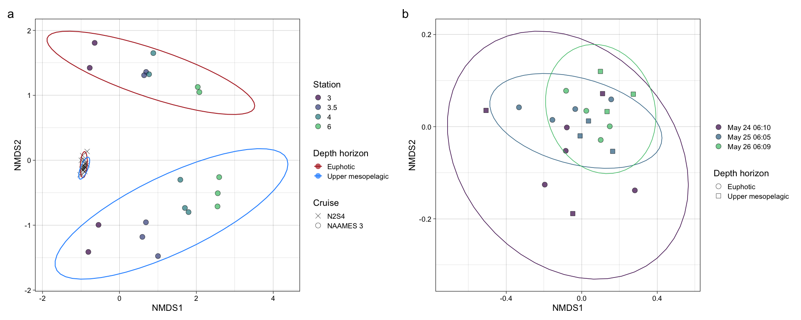

16S\_revised
================
Nicholas Baetge
12/28/2021

# Intro

``` r
library(tidyverse)
library(lubridate)
library(hms)
library(zoo) 
library(oce)  
```

    ## Error in get(genname, envir = envir) : object 'testthat_print' not found

``` r
library(ggpubr)
library(patchwork)
library(phyloseq)
```

# Import Data

``` r
floats <- read_rds("~/GITHUB/naames_multiday/Output/processed_floats.rds") 

floats %>% select(float:lon, ezd) %>% distinct() %>% drop_na(ezd) %>% 
  group_by(Cruise, Station) %>% 
  summarize(max_ezd = max(ezd))
```

    ## `summarise()` has grouped output by 'Cruise'. You can override using the `.groups` argument.

    ## # A tibble: 4 × 3
    ## # Groups:   Cruise [2]
    ##   Cruise Station max_ezd
    ##   <chr>    <dbl>   <dbl>
    ## 1 AT34         4    77.0
    ## 2 AT38         3    57.4
    ## 3 AT38         4    49.3
    ## 4 AT38         6    44.9

Euphotic zone for N2S4 = 75 m, for N3 is \< 75 m (don’t know for station
3.5, but likely similar to station 3 and
4)

``` r
count.tab <- read.table("~/GITHUB/naames_multiday/Input/16s/HetV1OTU.txt", header = T, row.names = 1, check.names = F) 

tax.tab <- as.matrix(read.table("~/GITHUB/naames_multiday/Input/16s/HetV1TUtax.txt", header = T, row.names = 1, check.names = F, na.strings = "", sep = "\t"))

sample.tab <- read_rds("~/GITHUB/naames_multiday/Input/bottle_data.rds") %>% 
  drop_na(DNA_ID) %>% 
  filter(Cruise == "AT34" & Station == 4 | Cruise == "AT38" & Station %in% c(3, 3.5, 4, 6))   %>% 
  filter(!plot_date %in% c("May 24 02:30", "May 27 06:07", "Sep 14 15:33", "Sep 15 03:04", "Sep 15 15:20", "Sep 16 03:04", "Sep 16 04:50", "Sep 16 07:26", "Sep 8 03:08", "Sep 8 03:08",  "Sep 8 15:30", "Sep 11 03:07"), z <= 200) %>% 
  mutate(dh = ifelse(Cruise == "AT34" & z < 100, "Euphotic", "Upper Mesopelagic"),
         dh = ifelse(Cruise == "AT38" & z < 75, "Euphotic", dh),
         Cruise = ifelse(Cruise == "AT34", "NAAMES 2", "NAAMES 3"),
         cruise_station = paste(Cruise, "Station", Station)) %>% 
  column_to_rownames(var = "DNA_ID") %>% 
  select(Cruise:mld, dh, everything())


gene_copies <- readxl::read_xlsx("~/GITHUB/naames_multiday/Input/16s/gene_copies.xlsx") %>% 
  mutate(copy_num = ave_order, 
         copy_num = ifelse(is.na(copy_num), ave_class, copy_num),
         copy_num = ifelse(is.na(copy_num), ave_phylum, copy_num),
         copy_num = ifelse(is.na(copy_num), ave_kingdom, copy_num))
```

# Phyloseq Object

We need to create a phyloseq object that merges all three datasets.
Sometimes this doesn’t work beacuse of the format of the data files.
Make sure all the sample names between the sampleinfo.txt and
seqtab-nochimtaxa.txt are the same

``` r
OTU = otu_table(count.tab, taxa_are_rows = TRUE) 
TAX = tax_table(tax.tab)
SAM = sample_data(sample.tab)
ps = phyloseq(OTU,TAX,SAM) 
```

# Filter sequences

We will filter out chloroplasts and mitochondria, because we only
intended to amplify bacterial sequences. It’s good to check you don’t
have anything lurking in the taxonomy table.

``` r
sub_ps <- ps %>%
  subset_taxa(
    Family  != "mitochondria" &
    Order   != "Chloroplast")
```

# Sample Summary

As a first analysis, we will look at the distribution of read counts
from our
samples


``` r
# mean, max and min of sample read counts
smin <- min(sample_sums(sub_ps)) 
smean <- mean(sample_sums(sub_ps)) 
smax <- max(sample_sums(sub_ps)) 
```

# Beta Diversity

Beta diversity involves calculating metrics such as distances or
dissimilarities based on pairwise comparisons of samples – they don’t
exist for a single sample, but rather only as metrics that relate
samples to each other. i.e. beta diversity = patterns in community
structure between samples

Since differences in sampling depths between samples can influence
distance/dissimilarity metrics, we first need to somehow normalize the
read depth across our samples.

## Subsample

We will rarefy (random subsample with replacement) the min read depth of
the samples first (scale to the smallest library size) according to
Bolaños et al 2021.

A strong reason to subsample is to standardize effort. The bottom line
is that in all experimental design you should not be comparing things to
which you devote different effort in resolution. For instance, you don’t
sample one site once a week and another once a month if you want to
compare the dynamics between the sites. You standardize
effort.

``` r
ps_min <-  rarefy_even_depth(sub_ps, sample.size = smin, rngseed = 532898)
```

    ## `set.seed(532898)` was used to initialize repeatable random subsampling.

    ## Please record this for your records so others can reproduce.

    ## Try `set.seed(532898); .Random.seed` for the full vector

    ## ...

    ## 7378OTUs were removed because they are no longer 
    ## present in any sample after random subsampling

    ## ...

We can also subset the N2 and the N2S4 data here

``` r
s4 <- ps_min %>% 
  subset_samples(Cruise == "NAAMES 2" & Station == 4)
```

``` r
s6 <- ps_min %>% 
  subset_samples(Cruise == "NAAMES 3" & Station == 6)
```

``` r
n3 <- ps_min %>% 
  subset_samples(Cruise == "NAAMES 3")
```

## Unconstrained Ordination

One of the best exploratory analyses for amplicon data is unconstrained
ordinations. Here we will look at ordinations of our subsampled dataset

### NMDS

Let’s try an NMDS. For NMDS plots it’s important to set a seed since the
starting positions of samples in the alogrithm is random.

``` r
set.seed(8)
# Ordinate
nmds <- ordinate(ps_min, method = "NMDS",  distance = "bray") # stress = 0.07
```

    ## Square root transformation
    ## Wisconsin double standardization
    ## Run 0 stress 0.05842301 
    ## Run 1 stress 0.05818753 
    ## ... New best solution
    ## ... Procrustes: rmse 0.003121559  max resid 0.01698622 
    ## Run 2 stress 0.1544437 
    ## Run 3 stress 0.058423 
    ## ... Procrustes: rmse 0.003121469  max resid 0.01701967 
    ## Run 4 stress 0.06567175 
    ## Run 5 stress 0.05818753 
    ## ... New best solution
    ## ... Procrustes: rmse 5.036269e-06  max resid 1.731909e-05 
    ## ... Similar to previous best
    ## Run 6 stress 0.05818753 
    ## ... Procrustes: rmse 6.853862e-06  max resid 2.505477e-05 
    ## ... Similar to previous best
    ## Run 7 stress 0.058423 
    ## ... Procrustes: rmse 0.003121477  max resid 0.01701578 
    ## Run 8 stress 0.06567173 
    ## Run 9 stress 0.05818753 
    ## ... New best solution
    ## ... Procrustes: rmse 3.430131e-06  max resid 1.045011e-05 
    ## ... Similar to previous best
    ## Run 10 stress 0.1505974 
    ## Run 11 stress 0.06567172 
    ## Run 12 stress 0.06567172 
    ## Run 13 stress 0.05842301 
    ## ... Procrustes: rmse 0.003121744  max resid 0.01701979 
    ## Run 14 stress 0.05818753 
    ## ... New best solution
    ## ... Procrustes: rmse 2.173879e-06  max resid 8.876177e-06 
    ## ... Similar to previous best
    ## Run 15 stress 0.05842301 
    ## ... Procrustes: rmse 0.003121619  max resid 0.01701671 
    ## Run 16 stress 0.05818753 
    ## ... Procrustes: rmse 1.230883e-06  max resid 2.798232e-06 
    ## ... Similar to previous best
    ## Run 17 stress 0.05842301 
    ## ... Procrustes: rmse 0.0031216  max resid 0.01701719 
    ## Run 18 stress 0.1193189 
    ## Run 19 stress 0.1323912 
    ## Run 20 stress 0.06567172 
    ## *** Solution reached

``` r
set.seed(7)
# Ordinate
nmds_s4 <- ordinate(s4, method = "NMDS",  distance = "bray") # stress = 0.09
```

    ## Square root transformation
    ## Wisconsin double standardization
    ## Run 0 stress 0.08763942 
    ## Run 1 stress 0.379017 
    ## Run 2 stress 0.09551588 
    ## Run 3 stress 0.09887677 
    ## Run 4 stress 0.08984012 
    ## Run 5 stress 0.09493932 
    ## Run 6 stress 0.1029264 
    ## Run 7 stress 0.08900718 
    ## Run 8 stress 0.09677471 
    ## Run 9 stress 0.1029299 
    ## Run 10 stress 0.0890099 
    ## Run 11 stress 0.08995539 
    ## Run 12 stress 0.0955203 
    ## Run 13 stress 0.08901149 
    ## Run 14 stress 0.1034378 
    ## Run 15 stress 0.08764173 
    ## ... Procrustes: rmse 0.0004845087  max resid 0.001762294 
    ## ... Similar to previous best
    ## Run 16 stress 0.08662229 
    ## ... New best solution
    ## ... Procrustes: rmse 0.07227539  max resid 0.2775323 
    ## Run 17 stress 0.1015404 
    ## Run 18 stress 0.0876395 
    ## Run 19 stress 0.09912979 
    ## Run 20 stress 0.08764139 
    ## *** No convergence -- monoMDS stopping criteria:
    ##     20: stress ratio > sratmax

``` r
set.seed(7)
# Ordinate
nmds_n3 <- ordinate(n3, method = "NMDS",  distance = "bray") # stress = 0.05
```

    ## Square root transformation
    ## Wisconsin double standardization
    ## Run 0 stress 0.05359791 
    ## Run 1 stress 0.05359791 
    ## ... Procrustes: rmse 5.719253e-06  max resid 2.04629e-05 
    ## ... Similar to previous best
    ## Run 2 stress 0.2115195 
    ## Run 3 stress 0.05359791 
    ## ... Procrustes: rmse 1.582794e-06  max resid 6.00165e-06 
    ## ... Similar to previous best
    ## Run 4 stress 0.05359791 
    ## ... New best solution
    ## ... Procrustes: rmse 9.557809e-07  max resid 3.646146e-06 
    ## ... Similar to previous best
    ## Run 5 stress 0.05359791 
    ## ... Procrustes: rmse 4.543368e-06  max resid 1.803011e-05 
    ## ... Similar to previous best
    ## Run 6 stress 0.05359791 
    ## ... New best solution
    ## ... Procrustes: rmse 2.320282e-06  max resid 8.892099e-06 
    ## ... Similar to previous best
    ## Run 7 stress 0.05359791 
    ## ... Procrustes: rmse 2.409037e-06  max resid 6.736217e-06 
    ## ... Similar to previous best
    ## Run 8 stress 0.2115195 
    ## Run 9 stress 0.05359791 
    ## ... Procrustes: rmse 4.384819e-06  max resid 1.730066e-05 
    ## ... Similar to previous best
    ## Run 10 stress 0.05359791 
    ## ... Procrustes: rmse 2.990828e-06  max resid 1.063893e-05 
    ## ... Similar to previous best
    ## Run 11 stress 0.05359791 
    ## ... Procrustes: rmse 3.729988e-06  max resid 1.352204e-05 
    ## ... Similar to previous best
    ## Run 12 stress 0.05359791 
    ## ... Procrustes: rmse 1.860193e-06  max resid 5.80812e-06 
    ## ... Similar to previous best
    ## Run 13 stress 0.05359791 
    ## ... Procrustes: rmse 2.641228e-06  max resid 9.905875e-06 
    ## ... Similar to previous best
    ## Run 14 stress 0.05359791 
    ## ... Procrustes: rmse 5.00949e-06  max resid 1.876595e-05 
    ## ... Similar to previous best
    ## Run 15 stress 0.05359791 
    ## ... Procrustes: rmse 5.264973e-06  max resid 1.987542e-05 
    ## ... Similar to previous best
    ## Run 16 stress 0.05359791 
    ## ... Procrustes: rmse 3.3885e-06  max resid 1.220224e-05 
    ## ... Similar to previous best
    ## Run 17 stress 0.05359791 
    ## ... Procrustes: rmse 3.245398e-06  max resid 1.153808e-05 
    ## ... Similar to previous best
    ## Run 18 stress 0.05359791 
    ## ... Procrustes: rmse 2.416905e-06  max resid 9.270508e-06 
    ## ... Similar to previous best
    ## Run 19 stress 0.05359791 
    ## ... New best solution
    ## ... Procrustes: rmse 1.369214e-06  max resid 4.296443e-06 
    ## ... Similar to previous best
    ## Run 20 stress 0.05359791 
    ## ... Procrustes: rmse 3.741406e-06  max resid 1.472593e-05 
    ## ... Similar to previous best
    ## *** Solution reached

NMDS plots attempt to show ordinal distances between samples as
accurately as possible in two dimensions. It is important to report the
stress of these plots, because a high stress value means that the
algorithm had a hard time representing the distances between samples in
2 dimensions. The stress of these plots were good - it was .1 (generally
anything below .2 is considered acceptable).

``` r
nmds.plot + nmds_s4.plot + nmds_n3.plot +  
  plot_annotation(tag_levels = "a") &
  theme(plot.tag = element_text(size = 22),
        plot.title = element_text(size = 18)) 
```

<!-- -->

95% confidence interval ellipse for the mean (group centroid) tells us
something about the sampling distribution of the mean (centroid) we
might see if we repeated your data collection a lot of times. In other
words we are looking at the uncertainty in the estimate of the
population mean (centroid) given the sample of data we collected.

# Betadisper and permutational ANOVA

Above, we performed beta diversity analyses on Bray-Curtis distances on
rarefied datasets that were then visualized using NMDS. We can test if
there are statistically significant differences between sample groups
using the betadisper and adonis functions of the vegan package.
Betadisper tests whether two or more groups are homogeneously dispersed
in relation to their species in studied samples. This test can be done
to see if one group has more compositional variance than another.
Moreover, homogeneity of dispersion among groups is very advisable to
have if you want to test if two or more groups have different
compositions, which is tested by adonis.

## Phyloseq to DESeq, distance matrix

To be able to run the stats, we first have to create a distance matrix
from our data. We’ll use the DESeq package to do so.

``` r
library(DESeq2)
library(vegan)
```

``` r
deseq_counts <- phyloseq_to_deseq2(ps_min, design = ~datetime ) #the design argument is required but doesn't matter here
```

    ## converting counts to integer mode

``` r
deseq_count_tab <- assay(deseq_counts) #extract the read count matrix
```

We’ll calculate bray-curtis distances, which reflect the NMDS
ordinations
above

``` r
#We can subset our data if we want to and calculate distances/run stats for only a subset of the group. The code below shows how

sample.tab2 <- sample.tab %>%
  rownames_to_column() %>% 
  column_to_rownames(var = "rowname")


####

subset_sample_IDs_n2s4 <-  row.names(sample.tab2)[sample.tab2$Cruise == "NAAMES 2" & sample.tab2$Station == 4]

dist_n2s4 <- vegdist(t(deseq_count_tab[ , colnames(deseq_count_tab) %in% subset_sample_IDs_n2s4]), method = "bray")

sample_info_tab_n2s4 <- sample.tab2[row.names(sample.tab2) %in% subset_sample_IDs_n2s4, ]

####

subset_sample_IDs_n2s4_ez <-  row.names(sample.tab2)[sample.tab2$Cruise == "NAAMES 2" & sample.tab2$Station == 4 & sample.tab2$dh == "Euphotic"]

dist_n2s4_ez <- vegdist(t(deseq_count_tab[ , colnames(deseq_count_tab) %in% subset_sample_IDs_n2s4_ez]), method = "bray")

sample_info_tab_n2s4_ez <- sample.tab2[row.names(sample.tab2) %in% subset_sample_IDs_n2s4_ez, ]

####


subset_sample_IDs_n2s4_mz <-  row.names(sample.tab2)[sample.tab2$Cruise == "NAAMES 2" & sample.tab2$Station == 4 & sample.tab2$dh == "Upper Mesopelagic"]

dist_n2s4_mz <- vegdist(t(deseq_count_tab[ , colnames(deseq_count_tab) %in% subset_sample_IDs_n2s4_mz]), method = "bray")

sample_info_tab_n2s4_mz <- sample.tab2[row.names(sample.tab2) %in% subset_sample_IDs_n2s4_mz, ]


####

subset_sample_IDs_n3 <-  row.names(sample.tab2)[sample.tab2$Cruise == "NAAMES 3"]

dist_n3 <- vegdist(t(deseq_count_tab[ , colnames(deseq_count_tab) %in% subset_sample_IDs_n3]), method = "bray")

sample_info_tab_n3 <- sample.tab2[row.names(sample.tab2) %in% subset_sample_IDs_n3, ]
```

Betadisper first calculates the average distance of group members to the
group centroid in multivariate space (generated by a distance matrix).

In the function below: we are using the distance matrix to calculate the
multivariate dispersions (variances; average distance to centroids). We
then use group dispersions to perform an ANOVA test.

``` r
anova(betadisper(dist_n2s4, sample_info_tab_n2s4$dh)) 
```

    ## Analysis of Variance Table
    ## 
    ## Response: Distances
    ##           Df    Sum Sq    Mean Sq F value Pr(>F)
    ## Groups     1 0.0009149 0.00091492   2.231 0.1517
    ## Residuals 19 0.0077919 0.00041010

``` r
anova(betadisper(dist_n2s4, sample_info_tab_n2s4$date)) 
```

    ## Analysis of Variance Table
    ## 
    ## Response: Distances
    ##           Df    Sum Sq    Mean Sq F value Pr(>F)
    ## Groups     2 0.0010464 0.00052321  2.1136 0.1498
    ## Residuals 18 0.0044557 0.00024754

``` r
anova(betadisper(dist_n2s4_ez, sample_info_tab_n2s4_ez$date)) 
```

    ## Analysis of Variance Table
    ## 
    ## Response: Distances
    ##           Df    Sum Sq    Mean Sq F value Pr(>F)
    ## Groups     2 0.0008061 0.00040307  0.7612 0.4949
    ## Residuals  9 0.0047654 0.00052949

``` r
anova(betadisper(dist_n3, sample_info_tab_n3$Station)) 
```

    ## Analysis of Variance Table
    ## 
    ## Response: Distances
    ##           Df  Sum Sq  Mean Sq F value  Pr(>F)  
    ## Groups     3 0.13977 0.046590  4.8144 0.01002 *
    ## Residuals 22 0.21290 0.009677                  
    ## ---
    ## Signif. codes:  0 '***' 0.001 '**' 0.01 '*' 0.05 '.' 0.1 ' ' 1

``` r
anova(betadisper(dist_n3, sample_info_tab_n3$dh)) 
```

    ## Analysis of Variance Table
    ## 
    ## Response: Distances
    ##           Df  Sum Sq   Mean Sq F value Pr(>F)
    ## Groups     1 0.00009 0.0000897  0.0063 0.9374
    ## Residuals 24 0.34209 0.0142537

``` r
anova(betadisper(dist_n2s4_mz, sample_info_tab_n2s4_mz$datetime)) 
```

    ## Analysis of Variance Table
    ## 
    ## Response: Distances
    ##           Df    Sum Sq    Mean Sq F value Pr(>F)  
    ## Groups     2 0.0023667 0.00118334  3.6869 0.0903 .
    ## Residuals  6 0.0019257 0.00032096                 
    ## ---
    ## Signif. codes:  0 '***' 0.001 '**' 0.01 '*' 0.05 '.' 0.1 ' ' 1

The ANOVA’s p-value is not significant meaning that group dispersions
are homogenous (“Null hypothesis of no difference in dispersion between
groups”)

**Homogeneity among group dispersions (compositions vary similarly) for
N2S4 with grouping as depth horizon, for N2S4 with grouping as date, for
N2S4 euphotic zone with grouping as date, for N3 with grouping as Cruise
and Station, for N3 with grouping as depth horizon. Compositions fo not
vary similarly for N2S4 mesopelagic zone with grouping as date.**

Adonis analyzes and partitions sums of squares using distance matrices.
It can be seen as an ANOVA using distance matrices (analogous to MANOVA
– multivariate analysis of variance). Therefore, it is used to test if
two or more groups have similar compositions.

``` r
adonis(dist_n2s4_mz~sample_info_tab_n2s4_mz$datetime)
```

    ## 
    ## Call:
    ## adonis(formula = dist_n2s4_mz ~ sample_info_tab_n2s4_mz$datetime) 
    ## 
    ## Permutation: free
    ## Number of permutations: 999
    ## 
    ## Terms added sequentially (first to last)
    ## 
    ##                                  Df SumsOfSqs  MeanSqs F.Model      R2 Pr(>F)  
    ## sample_info_tab_n2s4_mz$datetime  1  0.025656 0.025656   2.181 0.23755  0.024 *
    ## Residuals                         7  0.082347 0.011764         0.76245         
    ## Total                             8  0.108003                  1.00000         
    ## ---
    ## Signif. codes:  0 '***' 0.001 '**' 0.01 '*' 0.05 '.' 0.1 ' ' 1

``` r
adonis(dist_n3~sample_info_tab_n3$dh)
```

    ## 
    ## Call:
    ## adonis(formula = dist_n3 ~ sample_info_tab_n3$dh) 
    ## 
    ## Permutation: free
    ## Number of permutations: 999
    ## 
    ## Terms added sequentially (first to last)
    ## 
    ##                       Df SumsOfSqs MeanSqs F.Model      R2 Pr(>F)  
    ## sample_info_tab_n3$dh  1    0.4320 0.43198  1.8451 0.07139  0.078 .
    ## Residuals             24    5.6191 0.23413         0.92861         
    ## Total                 25    6.0511                 1.00000         
    ## ---
    ## Signif. codes:  0 '***' 0.001 '**' 0.01 '*' 0.05 '.' 0.1 ' ' 1

**N2S4 mesopelagic zone, group = date: no homogeneity among group
dispersions (compositions vary similarly) and are significantly
different **

# Alpha Diversity

We are going to calculate the the Chao1 diversity index.

**it is important to note that the alpha diversity values are not
interpretable as “real” numbers of anything (due to the nature of
amplicon data), but they can still be useful as relative metrics of
comparison.**

[Chao1: nonparametric estimation of minimum community
richness](https://www.jstor.org/stable/4615964?seq=1#metadata_info_tab_contents)

``` r
richness <- estimate_richness(ps_min, measures = c("Chao1", "Shannon")) %>% 
  rownames_to_column(., var = "DNA_ID") %>% 
   separate(DNA_ID, into = c("a", "b"), sep = "_") %>% 
  separate(a, into = c("x", "y", "z")) %>% 
  mutate(z = ifelse(is.na(z), y, z),
         y = ifelse(y == z, y, NA), 
         x = ifelse(is.na(y), paste(x, "-5", sep = ""), x)) %>% 
  mutate(DNA_ID = paste(x, "-", z, "_", b, sep = "")) %>% 
  select(-c(x,y,z,b)) %>% 
  mutate(DNA_ID = ifelse(DNA_ID == "N3S3-5_S56", "N3S3-5-5_S56", DNA_ID))
```

``` r
alphadiv <- left_join(richness, sample.tab %>% rownames_to_column(., var = "DNA_ID")) 
```

    ## Joining, by = "DNA_ID"

``` r
alphadiv.plot / chao.plot  +
  plot_layout(guides = "collect") +
  plot_annotation(tag_levels = "a") &
  theme(plot.tag = element_text(size = 22),
        plot.title = element_text(size = 18)) 
```

<!-- -->

``` r
n2s4_alphadiv.plot / n2s4_chao.plot  +
  plot_layout(guides = "collect") +
  plot_annotation(tag_levels = "a") &
  theme(plot.tag = element_text(size = 22),
        plot.title = element_text(size = 18)) 
```

<!-- -->

Boxes represent the 1.5 interquartile range, with the internal solid
line representing the median. Circles represent data points. Difference
in the alpha diversity indexes among conditions were tested using
pairwise t-tests; p \< 0.05 was considered the threshold significance
for a difference between conditions.

# Who??

Which taxa were important? Which taxa were contributing to differences
in community compositon?

**Note: Recovered 16S rRNA gene copy numbers do not equal organism
abundance.**

That said, we can generate a heat map of our samples showing us how the
relative abundance of different taxonomic groups change…potentially
giving us a visual of which taxa are most important to the alpha and
beta diversity patterns we observed. First, we’re going to generate a
custom table that will be easier to work with than a phyloseq object.

## Generate relative abundances

Our data currently shows number gene copies recovered, so we’ll convert
to percentages (relative abundances)

``` r
data <- ps_min %>% 
  psmelt() %>% 
  select(-c(doc:sd_bp, sd_ba:bcd)) %>% 
  left_join(., gene_copies %>% 
              select(Phylum, Class, Order, copy_num)) %>% 
  arrange(Cruise, Station, datetime, dh) %>% 
  # mutate(interval = ifelse(Cruise == "NAAMES2" & dh == "Euphotic", 75, 100),
  #        interval = ifelse(Cruise == "NAAMES 3" & dh == "Euphotic", 50, interval)) %>% 
  group_by(Cruise, Station, datetime, dh) %>% 
  dplyr::rename(copies = Abundance) %>% 
  mutate(total_copies_dh = sum(copies, na.rm = T),
         mean_ba_dh = mean(ba, na.rm = T)) %>% 
  ungroup() %>% 
  group_by(Cruise, Station, datetime, dh, Family) %>% 
  mutate(fam_copies_dh = sum(copies, na.rm = T),
         fam_relabund_dh = fam_copies_dh/total_copies_dh, 
         fam_relacount_dh = fam_relabund_dh * mean_ba_dh, 
         fam_normcount_dh = fam_relacount_dh/copy_num) %>% 
  ungroup() %>% 
  select(Cruise:z, Sample, OTU, Kingdom:Genus, copies, total_copies_dh:fam_normcount_dh, everything())
```

    ## Joining, by = c("Phylum", "Class", "Order")

``` r
relabund.plot <- data %>% 
  filter(Cruise == "NAAMES 2") %>% 
  filter(fam_relabund_dh >= 0.001) %>% 
  select(dh, plot_date, Family, fam_relabund_dh) %>% 
  distinct() %>% 
  mutate(Family = ifelse(Family == "NA", "Unassigned", Family)) %>% 
  ggplot(aes(x = plot_date, y = reorder(Family, fam_relabund_dh))) +
  geom_tile(aes(fill = fam_relabund_dh), color = "white") +
  scale_fill_viridis_c(trans = 'log10') +
  # scale_fill_viridis_b(option = "D",  trans = 'log10') +
  geom_text(aes(label = round(fam_relabund_dh, 3), color = "black"), size = 4) +
  scale_color_manual(values = c("white" = "white", "black" = "black")) +
  labs(x = "", y = "Family", fill = "Relative Abundance") +
  facet_grid(~factor(dh, levels = c("Euphotic", "Upper Mesopelagic"))) +
  theme_linedraw(base_size = 16) +
  theme(axis.text.y = element_text(size = 12), legend.position = "top") +
   guides(fill = guide_colourbar(barheight = 2, barwidth = 20, frame.colour = "black", frame.linewidth = 2,ticks.colour = "black", ticks.linewidth = 1), color = "none") +
  ggtitle("")
```

``` r
count.plot <- data %>% 
  filter(Cruise == "NAAMES 2") %>% 
  filter(fam_relabund_dh >= 0.001) %>% 
  filter(fam_normcount_dh > 0) %>% 
  select(dh, plot_date, Family, fam_relabund_dh, fam_normcount_dh) %>% 
  mutate(Family = ifelse(Family == "NA", "Unassigned", Family)) %>% 
  filter(!Family == "Unassigned") %>% #don't know what good copy numbers would be
  distinct() %>% 
  ggplot(aes(x = plot_date, y = reorder(Family, fam_relabund_dh))) +
  geom_tile(aes(fill = fam_normcount_dh), color = "white") +
  scale_fill_viridis_c(trans = 'log10') +
  # scale_fill_viridis_b(option = "D",  trans = 'log10') +
  geom_text(aes(label = formatC(fam_normcount_dh, format = "e", digits = 1), color = "black"), size = 4) +
  scale_color_manual(values = c("white" = "white", "black" = "black")) +
  labs(x = "", y = "Family", fill = expression(paste("Cells L"^-1))) +
  facet_grid(~factor(dh, levels = c("Euphotic", "Upper Mesopelagic"))) +
  theme_linedraw(base_size = 16) +
  theme(axis.text.y = element_text(size = 12), legend.position = "top") +
   guides(fill = guide_colourbar(barheight = 2, barwidth = 20, frame.colour = "black", frame.linewidth = 2,ticks.colour = "black", ticks.linewidth = 1), color = "none") +
  ggtitle("")
```

``` r
relabund.plot + count.plot + plot_annotation(tag_levels = "a") 
```

<!-- -->

``` r
n3_relabund.plot <- data %>% 
  filter(Cruise == "NAAMES 3") %>% 
  filter(fam_relabund_dh >= 0.001) %>% 
  select(dh, Station, plot_date, Family, fam_relabund_dh) %>% 
  mutate_at(vars(Station), as.character) %>% 
  distinct() %>% 
  mutate(Family = ifelse(Family == "NA", "Unassigned", Family)) %>% 
  ggplot(aes(x = Station, y = reorder(Family, fam_relabund_dh))) +
  geom_tile(aes(fill = fam_relabund_dh), color = "white") +
  scale_fill_viridis_c(trans = 'log10') +
  # scale_fill_viridis_b(option = "D",  trans = 'log10') +
  geom_text(aes(label = round(fam_relabund_dh, 3), color = "black"), size = 4) +
  scale_color_manual(values = c("white" = "white", "black" = "black")) +
  labs(x = "Station", y = "Family", fill = "Relative Abundance") +
  facet_grid(~factor(dh, levels = c("Euphotic", "Upper Mesopelagic"))) +
  theme_linedraw(base_size = 16) +
  theme(axis.text.y = element_text(size = 12), legend.position = "top") +
   guides(fill = guide_colourbar(barheight = 2, barwidth = 20, frame.colour = "black", frame.linewidth = 2,ticks.colour = "black", ticks.linewidth = 1), color = "none") +
  ggtitle("")
```

``` r
n3_count.plot <- data %>% 
  filter(Cruise == "NAAMES 3") %>% 
  filter(fam_relabund_dh >= 0.001) %>% 
  filter(fam_normcount_dh > 0) %>% 
  select(dh, plot_date, Station, Family, fam_relabund_dh, fam_normcount_dh) %>% 
  mutate_at(vars(Station), as.character) %>% 
  mutate(Family = ifelse(Family == "NA", "Unassigned", Family)) %>% 
  filter(!Family == "Unassigned") %>% #don't know what good copy numbers would be
  distinct() %>% 
  ggplot(aes(x = Station, y = reorder(Family, fam_relabund_dh))) +
  geom_tile(aes(fill = fam_normcount_dh), color = "white") +
  scale_fill_viridis_c(trans = 'log10') +
  # scale_fill_viridis_b(option = "D",  trans = 'log10') +
  geom_text(aes(label = formatC(fam_normcount_dh, format = "e", digits = 1), color = "black"), size = 4) +
  scale_color_manual(values = c("white" = "white", "black" = "black")) +
  labs(x = "Station", y = "Family", fill = expression(paste("Cells L"^-1))) +
  facet_grid(~factor(dh, levels = c("Euphotic", "Upper Mesopelagic"))) +
  theme_linedraw(base_size = 16) +
  theme(axis.text.y = element_text(size = 12), legend.position = "top") +
   guides(fill = guide_colourbar(barheight = 2, barwidth = 20, frame.colour = "black", frame.linewidth = 2,ticks.colour = "black", ticks.linewidth = 1), color = "none") +
  ggtitle("")
```

``` r
n3_relabund.plot + n3_count.plot + plot_annotation(tag_levels = "a") 
```

<!-- -->

``` r
(data %>% 
  filter(Cruise == "NAAMES 2") %>% 
  filter(dh == "Upper Mesopelagic") %>%
  filter(fam_relabund_dh >= 0.001) %>% 
  filter(fam_normcount_dh > 0) %>% 
  select(dh, plot_date, Family, fam_relabund_dh, fam_normcount_dh) %>% 
  mutate(Family = ifelse(Family == "NA", "Unassigned", Family)) %>% 
  filter(!Family == "Unassigned") %>% #don't know what good copy numbers would be
  distinct() %>% 
  ggplot(aes(x = plot_date, y = reorder(Family, fam_relabund_dh))) +
  geom_tile(aes(fill = fam_normcount_dh), color = "white") +
  scale_fill_viridis_c(trans = 'log10') +
  # scale_fill_viridis_b(option = "D",  trans = 'log10') +
  geom_text(aes(label = formatC(fam_normcount_dh, format = "e", digits = 1), color = "black"), size = 4) +
  scale_color_manual(values = c("white" = "white", "black" = "black")) +
  labs(x = "", y = "Family", fill = expression(paste("Cells L"^-1))) +
  facet_grid(~factor(dh, levels = c("Euphotic", "Upper Mesopelagic"))) +
  theme_linedraw(base_size = 16) +
  theme(axis.text.y = element_text(size = 12), legend.position = "top") +
  guides(fill = guide_colourbar(barheight = 2, barwidth = 20, frame.colour = "black", frame.linewidth = 2,ticks.colour = "black", ticks.linewidth = 1), color = "none") +
  ggtitle("") ) +


(data %>% 
  filter(Cruise == "NAAMES 2") %>% 
  filter(dh == "Upper Mesopelagic") %>%
  filter(fam_relabund_dh >= 0.001) %>% 
  select(dh, plot_date, datetime, decimaldate, Phylum, Order, Family, fam_relabund_dh, fam_normcount_dh) %>% 
  mutate(Family = ifelse(Family == "NA", "Unassigned", Family)) %>% 
  filter(!Family == "Unassigned") %>% #don't know what good copy numbers would be
  distinct() %>% 
  ggplot(aes(y = reorder(Family, fam_relabund_dh), x = fam_normcount_dh, fill = Phylum)) +
  ggridges::geom_density_ridges2(scale = 3, alpha = 0.7, rel_min_height = 0.01) +
  labs(x = expression(paste("Log Cells L"^-1)), y = "Family", fill = expression(paste("Phylum"))) +
  scale_x_continuous(trans = 'log10') +
  facet_grid(~factor(dh, levels = c("Euphotic", "Upper Mesopelagic"))) +
  scale_fill_viridis_d() +
  theme_linedraw(base_size = 16)) 
```

<!-- -->

# Identify “typical”surface and mesopelagic microbes

We’ll make our designation based on our well-stratified profiles from
NAAMES 3.

``` r
surf_bugs <- data %>% 
  filter(Cruise == "NAAMES 3", !Station == 3) %>% 
  filter(!dh == "Upper Mesopelagic") %>%
  filter(fam_relabund_dh > 0.01) %>%
  select(dh, datetime, Phylum, Order, Family, fam_relabund_dh, fam_normcount_dh) %>% 
  mutate(Family = ifelse(Family == "NA", "Unassigned", Family)) %>% 
  filter(!Family == "Unassigned") %>% #don't know what good copy numbers would be
  distinct() %>% 
  select(Family) %>% 
  dplyr::rename(surf = Family) %>% 
  as_vector()


meso_bugs <- data %>% 
              filter(Cruise == "NAAMES 3") %>% 
              filter(dh == "Upper Mesopelagic") %>%
              filter(fam_relabund_dh > 0.01) %>%
              select(dh, datetime, Phylum, Order, Family, fam_relabund_dh, fam_normcount_dh) %>% 
              mutate(Family = ifelse(Family == "NA", "Unassigned", Family)) %>% 
              filter(!Family == "Unassigned") %>% #don't know what good copy numbers would be
              distinct() %>% 
              select(Family) %>% 
              dplyr::rename(meso = Family) %>% 
  as_vector()

unique_surf_bugs <- setdiff(surf_bugs, meso_bugs)

unique_meso_bugs <- setdiff(meso_bugs, surf_bugs)
```

# Taxa changes over time

``` r
s4_meso_subset <- data %>% 
  filter(Cruise == "NAAMES 2") %>% 
  filter(dh == "Upper Mesopelagic") %>%
  filter(fam_relabund_dh >= 0.001) %>% 
  filter(Family %in% c(unique_meso_bugs) | Family == "SAR11_II") %>% 
  select(dh, datetime, Phylum, Order, Family, Genus, fam_relabund_dh, fam_normcount_dh) %>% 
  mutate(Family = ifelse(Family == "NA", "Unassigned", Family)) %>% 
  filter(!Family == "Unassigned") %>% #don't know what good copy numbers would be
  distinct()  
```

``` r
mesobugs.plot <- s4_meso_subset %>% 
  filter(!Family == "SAR202_Clade2") %>% #only appears once
  ggplot(aes(x = datetime, y = fam_relabund_dh)) +
  facet_wrap(~Family, dir = "v", scales = "free_y") +
  geom_line(size = 0.7) +
  geom_point(shape = 21, size = 4, fill = "white", color = "black", stroke = 1) + 
  geom_line(data = s4_meso_subset %>% filter(!Family == "SAR202_Clade2"), aes(x = datetime, y = fam_normcount_dh/10^9), color = "#377EB8") +
  geom_point(data = s4_meso_subset %>% filter(!Family == "SAR202_Clade2"), aes(x = datetime, y = fam_normcount_dh/10^9), shape = 21, size = 6, fill = "#377EB8", color = "black", stroke = 1) + 
  scale_y_continuous(
    # Add a second axis and specify its features
    sec.axis = sec_axis(~.*10^9, name = expression(paste("Cell Abundance, L"^-1)))
  ) + 
  labs(x = "", y = expression(paste("Relative Abundance, %")), colour = "", fill = "") +
  theme_linedraw(base_size = 16) +
  theme(axis.title.y.right = element_text(color = "#377EB8"),
        axis.text.y.right = element_text(color = "#377EB8"))
```

``` r
s4_meso_subset_ez <- data %>% 
  filter(Cruise == "NAAMES 2") %>% 
  filter(dh == "Upper Mesopelagic") %>%
  filter(fam_relabund_dh >= 0.001) %>% 
  filter(Family %in% c(unique_surf_bugs) | Family == "SAR11_Ia") %>% 
  select(dh, datetime, Phylum, Order, Family, Genus, fam_relabund_dh, fam_normcount_dh) %>% 
  mutate(Family = ifelse(Family == "NA", "Unassigned", Family)) %>% 
  filter(!Family == "Unassigned") %>% #don't know what good copy numbers would be
  distinct()  
```

``` r
s4_meso_subset %>% select(Family, Genus) %>% 
  mutate(name = paste(Family, Genus, sep = "_")) %>% 
  select(name) %>% 
  distinct()
```

    ## # A tibble: 17 × 1
    ##    name                                    
    ##    <chr>                                   
    ##  1 SAR11_Ib_NA                             
    ##  2 Flammeovirgaceae_Marinoscillum          
    ##  3 OM182_clade_NA                          
    ##  4 SAR11_II_NA                             
    ##  5 Salinisphaeraceae_ZD0417_marine_group   
    ##  6 JTB255_marine_benthic_group_NA          
    ##  7 Nitrospinaceae_Nitrospina               
    ##  8 Sva0996_marine_group_NA                 
    ##  9 SAR202_Clade1_NA                        
    ## 10 SAR11_I_NA                              
    ## 11 SAR202_Clade2_NA                        
    ## 12 Flammeovirgaceae_Reichenbachiella       
    ## 13 Flammeovirgaceae_Candidatus_Amoebophilus
    ## 14 Flammeovirgaceae_Fulvivirga             
    ## 15 Flammeovirgaceae_Marivirga              
    ## 16 Nitrospinaceae_NA                       
    ## 17 Flammeovirgaceae_NA

``` r
surfbugs.plot <- s4_meso_subset_ez %>% 
  ggplot(aes(x = datetime, y = fam_relabund_dh)) +
  facet_wrap(~Family, dir = "v", scales = "free_y") +
  geom_line(size = 0.7) +
  geom_point(shape = 21, size = 4, fill = "white", color = "black", stroke = 1) + 
  geom_line(data = s4_meso_subset_ez, aes(x = datetime, y = fam_normcount_dh/10^9), color = "#377EB8") +
  geom_point(data = s4_meso_subset_ez, aes(x = datetime, y = fam_normcount_dh/10^9), shape = 21, size = 6, fill = "#377EB8", color = "black", stroke = 1) +
  scale_y_continuous(
    # Add a second axis and specify its features
    sec.axis = sec_axis(~.*10^9, name = expression(paste("Cell Abundance, L"^-1)))
  ) + 
  labs(x = "", y = expression(paste("Relative Abundance, %")), colour = "", fill = "") +
  theme_linedraw(base_size = 16) +
  theme(axis.title.y.right = element_text(color = "#377EB8"),
        axis.text.y.right = element_text(color = "#377EB8"))
```

``` r
s4_meso_subset_ez %>% select(Family, Genus) %>% 
  mutate(name = paste(Family, Genus, sep = "_")) %>% 
  select(name) %>% 
  distinct()
```

    ## # A tibble: 11 × 1
    ##    name                                    
    ##    <chr>                                   
    ##  1 SAR11_Ia_NA                             
    ##  2 Methylophilaceae_OM43_clade             
    ##  3 SAR116_clade_NA                         
    ##  4 Porticoccaceae_SAR92_clade              
    ##  5 Halieaceae_OM60(NOR5)_clade             
    ##  6 SAR116_clade_Candidatus_Puniceispirillum
    ##  7 Halieaceae_Haliea                       
    ##  8 Halieaceae_Luminiphilus                 
    ##  9 Halieaceae_NA                           
    ## 10 Porticoccaceae_Porticoccus              
    ## 11 Halieaceae_Pseudohaliea

``` r
surfbugs.plot / mesobugs.plot + plot_annotation(tag_levels = "a") 
```

<!-- -->

``` r
levels <- c("SAR11_Ia", "Flavobacteriaceae", "ZD0405", "SAR86_clade", "SAR11_II", "SAR202_Clade1", "OM1_clade", "Salinisphaeraceae", "OCS116_clade")
```

``` r
write_rds(data, "~/GITHUB/naames_multiday/Output/processed_16S.rds")
```
