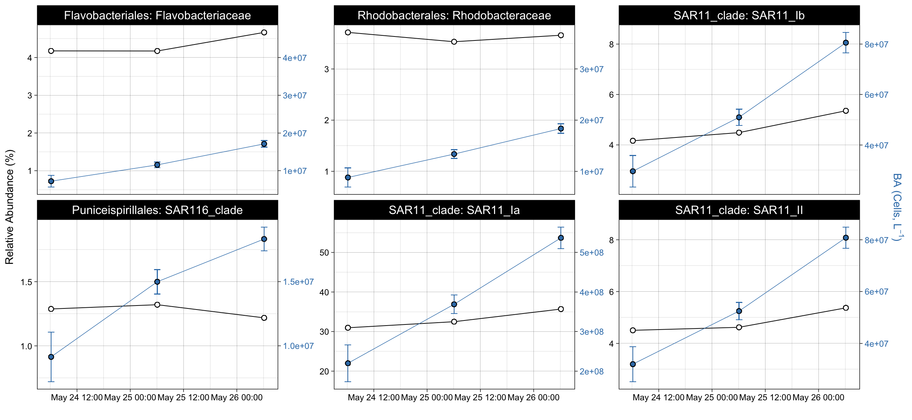

16S\_revised
================
Nicholas Baetge
12/28/2021

# Intro

``` r
library(tidyverse)
library(lubridate)
library(hms)
library(zoo) 
library(oce)  
library(ggpubr)
library(patchwork)
library(phyloseq)
library(rstatix)
```

# Import Data

``` r
floats <- read_rds("~/GITHUB/naames_multiday/Output/processed_floats.rds") 

floats %>% select(float:lon, ezd) %>% distinct() %>% drop_na(ezd) %>% 
  group_by(Cruise, Station) %>% 
  summarize(max_ezd = max(ezd))
```

    ## `summarise()` has grouped output by 'Cruise'. You can override using the
    ## `.groups` argument.

    ## # A tibble: 4 × 3
    ## # Groups:   Cruise [2]
    ##   Cruise Station max_ezd
    ##   <chr>    <dbl>   <dbl>
    ## 1 AT34         4    77.0
    ## 2 AT38         3    57.4
    ## 3 AT38         4    49.3
    ## 4 AT38         6    44.9

Euphotic zone for N2S4 = 75 m, for N3 is \< 75 m (don’t know for station
3.5, but likely similar to station 3 and
4)

``` r
count.tab <- read.table("~/GITHUB/naames_multiday/Input/16s/HetV1OTU.txt", header = T, row.names = 1, check.names = F) 

tax.tab <- as.matrix(read.table("~/GITHUB/naames_multiday/Input/16s/HetV1TUtax.txt", header = T, row.names = 1, check.names = F, na.strings = "", sep = "\t"))

sample.tab <- read_rds("~/GITHUB/naames_multiday/Input/bottle_data.rds") %>% 
  drop_na(DNA_ID) %>% 
  filter(Cruise == "AT34" & Station == 4 | Cruise == "AT38" & Station %in% c(3, 3.5, 4, 6))   %>% 
    filter(!plot_date %in% c("May 24 02:30", "May 27 06:07", "Sep 14 15:33", "Sep 15 03:04", "Sep 15 15:20", "Sep 16 03:04", "Sep 16 04:50", "Sep 16 07:26", "Sep 8 03:08", "Sep 8 03:08",  "Sep 8 15:30", "Sep 11 03:07"), z <= 200) %>% #FILTER OUT CASTS THAT HAVE DIFFERENT T-S PROPERTIES IN UPPER MESO
  mutate(dh = ifelse(Cruise == "AT34" & z < 100, "Euphotic", "Upper Mesopelagic"),
         dh = ifelse(Cruise == "AT38" & z < 75, "Euphotic", dh),
         Cruise = ifelse(Cruise == "AT34", "NAAMES 2", "NAAMES 3"),
         cruise_station = paste(Cruise, "Station", Station)) %>% 
  column_to_rownames(var = "DNA_ID") %>% 
  select(Cruise:mld, dh, everything())


gene_copies <- readxl::read_xlsx("~/GITHUB/naames_multiday/Input/16s/gene_copies.xlsx") %>% 
  mutate(copy_num = ave_order, 
         copy_num = ifelse(is.na(copy_num), ave_class, copy_num),
         copy_num = ifelse(is.na(copy_num), ave_phylum, copy_num),
         copy_num = ifelse(is.na(copy_num), ave_kingdom, copy_num))
```

# Phyloseq Object

We need to create a phyloseq object that merges all three datasets.
Sometimes this doesn’t work beacuse of the format of the data files.
Make sure all the sample names between the sampleinfo.txt and
seqtab-nochimtaxa.txt are the same

``` r
OTU = otu_table(count.tab, taxa_are_rows = TRUE) 
TAX = tax_table(tax.tab)
SAM = sample_data(sample.tab)
ps = phyloseq(OTU,TAX,SAM) 
```

# Filter sequences

We will filter out chloroplasts and mitochondria, because we only
intended to amplify bacterial sequences. It’s good to check you don’t
have anything lurking in the taxonomy table.

``` r
sub_ps <- ps %>%
  subset_taxa(
    Family  != "mitochondria" &
    Order   != "Chloroplast")
```

# Sample Summary

As a first analysis, we will look at the distribution of read counts
from our
samples


``` r
# mean, max and min of sample read counts
smin <- min(sample_sums(sub_ps)) 
smean <- mean(sample_sums(sub_ps)) 
smax <- max(sample_sums(sub_ps)) 
```

# Beta Diversity

Beta diversity involves calculating metrics such as distances or
dissimilarities based on pairwise comparisons of samples – they don’t
exist for a single sample, but rather only as metrics that relate
samples to each other. i.e. beta diversity = patterns in community
structure between samples

Since differences in sampling depths between samples can influence
distance/dissimilarity metrics, we first need to somehow normalize the
read depth across our samples.

## Subsample

We will rarefy (random subsample with replacement) the min read depth of
the samples first (scale to the smallest library size) according to
Bolaños et al 2021.

A strong reason to subsample is to standardize effort. The bottom line
is that in all experimental design you should not be comparing things to
which you devote different effort in resolution. For instance, you don’t
sample one site once a week and another once a month if you want to
compare the dynamics between the sites. You standardize
effort.

``` r
ps_min <-  rarefy_even_depth(sub_ps, sample.size = smin, rngseed = 532898)
```

    ## `set.seed(532898)` was used to initialize repeatable random subsampling.

    ## Please record this for your records so others can reproduce.

    ## Try `set.seed(532898); .Random.seed` for the full vector

    ## ...

    ## 7378OTUs were removed because they are no longer 
    ## present in any sample after random subsampling

    ## ...

We can also subset the N2 and the N2S4 data here

``` r
s4n3 <- ps_min %>% 
  subset_samples(Cruise == "NAAMES 3" & z %in% c(5, 25, 100, 150, 200) | Cruise == "NAAMES 2" )
```

``` r
s4 <- ps_min %>% 
  subset_samples(Cruise == "NAAMES 2" & Station == 4)
```

``` r
s4_meso <- s4 %>% 
  subset_samples(dh == "Upper Mesopelagic" )
```

``` r
n3 <- ps_min %>% 
  subset_samples(Cruise == "NAAMES 3" & z %in% c(5, 25, 100, 150, 200) & !Cruise == "NAAMES 2" )
```

## Unconstrained Ordination

One of the best exploratory analyses for amplicon data is unconstrained
ordinations. Here we will look at ordinations of our subsampled dataset

### NMDS

Let’s try an NMDS. For NMDS plots it’s important to set a seed since the
starting positions of samples in the alogrithm is random.

``` r
set.seed(8)
# Ordinate
nmds <- ordinate(s4n3, method = "NMDS",  distance = "bray") # stress = 0.05
```

    ## Square root transformation
    ## Wisconsin double standardization
    ## Run 0 stress 0.04794218 
    ## Run 1 stress 0.2253945 
    ## Run 2 stress 0.04770254 
    ## ... New best solution
    ## ... Procrustes: rmse 0.005554127  max resid 0.02785282 
    ## Run 3 stress 0.04770254 
    ## ... Procrustes: rmse 1.57293e-06  max resid 6.055682e-06 
    ## ... Similar to previous best
    ## Run 4 stress 0.04794218 
    ## ... Procrustes: rmse 0.00555353  max resid 0.02792731 
    ## Run 5 stress 0.04794218 
    ## ... Procrustes: rmse 0.005552265  max resid 0.02791789 
    ## Run 6 stress 0.04794218 
    ## ... Procrustes: rmse 0.005551875  max resid 0.02791536 
    ## Run 7 stress 0.2346769 
    ## Run 8 stress 0.04770254 
    ## ... New best solution
    ## ... Procrustes: rmse 4.221448e-06  max resid 1.370858e-05 
    ## ... Similar to previous best
    ## Run 9 stress 0.04794218 
    ## ... Procrustes: rmse 0.005553068  max resid 0.02792427 
    ## Run 10 stress 0.1570516 
    ## Run 11 stress 0.04794218 
    ## ... Procrustes: rmse 0.005553386  max resid 0.02792666 
    ## Run 12 stress 0.04770254 
    ## ... Procrustes: rmse 1.179855e-06  max resid 4.19091e-06 
    ## ... Similar to previous best
    ## Run 13 stress 0.04770254 
    ## ... Procrustes: rmse 5.007979e-06  max resid 1.588646e-05 
    ## ... Similar to previous best
    ## Run 14 stress 0.04770254 
    ## ... Procrustes: rmse 4.84863e-06  max resid 1.223331e-05 
    ## ... Similar to previous best
    ## Run 15 stress 0.04794218 
    ## ... Procrustes: rmse 0.005551858  max resid 0.02791558 
    ## Run 16 stress 0.04794218 
    ## ... Procrustes: rmse 0.005553353  max resid 0.02792684 
    ## Run 17 stress 0.1395345 
    ## Run 18 stress 0.04770254 
    ## ... Procrustes: rmse 2.921744e-06  max resid 7.84295e-06 
    ## ... Similar to previous best
    ## Run 19 stress 0.1614722 
    ## Run 20 stress 0.04794218 
    ## ... Procrustes: rmse 0.005551606  max resid 0.02791354 
    ## *** Solution reached

``` r
set.seed(7)
# Ordinate
nmds_s4 <- ordinate(s4, method = "NMDS",  distance = "bray") # stress = 0.09
```

    ## Square root transformation
    ## Wisconsin double standardization
    ## Run 0 stress 0.08763807 
    ## Run 1 stress 0.3789439 
    ## Run 2 stress 0.09551312 
    ## Run 3 stress 0.09887487 
    ## Run 4 stress 0.08983489 
    ## Run 5 stress 0.09493637 
    ## Run 6 stress 0.1029261 
    ## Run 7 stress 0.08900643 
    ## Run 8 stress 0.09677245 
    ## Run 9 stress 0.1029261 
    ## Run 10 stress 0.08900656 
    ## Run 11 stress 0.08995316 
    ## Run 12 stress 0.09551264 
    ## Run 13 stress 0.08900654 
    ## Run 14 stress 0.1034377 
    ## Run 15 stress 0.08763824 
    ## ... Procrustes: rmse 9.591818e-05  max resid 0.0003474707 
    ## ... Similar to previous best
    ## Run 16 stress 0.08662108 
    ## ... New best solution
    ## ... Procrustes: rmse 0.07222615  max resid 0.2774339 
    ## Run 17 stress 0.1015351 
    ## Run 18 stress 0.08763827 
    ## Run 19 stress 0.09912518 
    ## Run 20 stress 0.08763794 
    ## *** No convergence -- monoMDS stopping criteria:
    ##     20: stress ratio > sratmax

``` r
set.seed(7)
# Ordinate
nmds_n3 <- ordinate(n3, method = "NMDS",  distance = "bray") # stress = 0.05
```

    ## Square root transformation
    ## Wisconsin double standardization
    ## Run 0 stress 0.04631479 
    ## Run 1 stress 0.0463147 
    ## ... New best solution
    ## ... Procrustes: rmse 7.566689e-05  max resid 0.0002041815 
    ## ... Similar to previous best
    ## Run 2 stress 0.04631478 
    ## ... Procrustes: rmse 7.166777e-05  max resid 0.0001958597 
    ## ... Similar to previous best
    ## Run 3 stress 0.04631465 
    ## ... New best solution
    ## ... Procrustes: rmse 0.0001344509  max resid 0.0003616062 
    ## ... Similar to previous best
    ## Run 4 stress 0.1764532 
    ## Run 5 stress 0.04631472 
    ## ... Procrustes: rmse 0.0001436614  max resid 0.0003905697 
    ## ... Similar to previous best
    ## Run 6 stress 0.1764532 
    ## Run 7 stress 0.1907817 
    ## Run 8 stress 0.04631469 
    ## ... Procrustes: rmse 0.0001165458  max resid 0.0003146987 
    ## ... Similar to previous best
    ## Run 9 stress 0.04631475 
    ## ... Procrustes: rmse 0.0001803109  max resid 0.0004875831 
    ## ... Similar to previous best
    ## Run 10 stress 0.04631469 
    ## ... Procrustes: rmse 4.534901e-05  max resid 0.0001196273 
    ## ... Similar to previous best
    ## Run 11 stress 0.04631466 
    ## ... Procrustes: rmse 6.454815e-05  max resid 0.0001752133 
    ## ... Similar to previous best
    ## Run 12 stress 0.2052355 
    ## Run 13 stress 0.04631468 
    ## ... Procrustes: rmse 3.418669e-05  max resid 8.957789e-05 
    ## ... Similar to previous best
    ## Run 14 stress 0.04631478 
    ## ... Procrustes: rmse 0.0001899186  max resid 0.0005158884 
    ## ... Similar to previous best
    ## Run 15 stress 0.04631475 
    ## ... Procrustes: rmse 0.0001812531  max resid 0.0004882325 
    ## ... Similar to previous best
    ## Run 16 stress 0.2051069 
    ## Run 17 stress 0.04631466 
    ## ... Procrustes: rmse 6.46289e-05  max resid 0.0001749478 
    ## ... Similar to previous best
    ## Run 18 stress 0.04631466 
    ## ... Procrustes: rmse 7.369678e-05  max resid 0.0001997115 
    ## ... Similar to previous best
    ## Run 19 stress 0.2052355 
    ## Run 20 stress 0.04631476 
    ## ... Procrustes: rmse 0.0001850903  max resid 0.0005008306 
    ## ... Similar to previous best
    ## *** Solution reached

NMDS plots attempt to show ordinal distances between samples as
accurately as possible in two dimensions. It is important to report the
stress of these plots, because a high stress value means that the
algorithm had a hard time representing the distances between samples in
2 dimensions. The stress of these plots were good - it was .1 (generally
anything below .2 is considered acceptable).

``` r
nmds.plot2 + nmds.plot +  nmds_s4.plot +
  plot_annotation(tag_levels = "a") &
  theme(plot.tag = element_text(size = 22),
        plot.title = element_text(size = 18)) 
```

<!-- -->

95% confidence interval ellipse for the mean (group centroid) tells us
something about the sampling distribution of the mean (centroid) we
might see if we repeated your data collection a lot of times. In other
words we are looking at the uncertainty in the estimate of the
population mean (centroid) given the sample of data we collected.

# Permutational ANOVA

Above, we performed beta diversity analyses on Bray-Curtis distances on
rarefied datasets that were then visualized using NMDS. We can test if
there are statistically significant differences between sample groups
using the adonis function of the vegan package.

## Phyloseq to DESeq, distance matrix

To be able to run the stats, we first have to create a distance matrix
from our data. We’ll use the DESeq package to do so.

``` r
library(DESeq2)
library(vegan)
```

``` r
deseq_counts <- phyloseq_to_deseq2(s4n3, design = ~datetime ) #the design argument is required but doesn't matter here
```

    ## converting counts to integer mode

``` r
deseq_count_tab <- assay(deseq_counts) #extract the read count matrix
```

\`\`

We’ll calculate bray-curtis distances, which reflect the NMDS
ordinations
above

``` r
#We can subset our data if we want to and calculate distances/run stats for only a subset of the group. The code below shows how

sample.tab2 <- sample.tab %>%
  rownames_to_column() %>% 
  column_to_rownames(var = "rowname") %>% 
  select(Cruise:z)


####

subset_sample_IDs_s4n3 <-  row.names(sample.tab2)[sample.tab2$Cruise == "NAAMES 3" & sample.tab2$z %in% c(5, 25, 100, 150, 200) |  sample.tab2$Cruise == "NAAMES 2" ]

dist <- vegdist(t(deseq_count_tab[ , colnames(deseq_count_tab) %in% subset_sample_IDs_s4n3]), method = "bray", na.rm = T)

sample_info_tab_s4n3 <- sample.tab2[row.names(sample.tab2) %in% subset_sample_IDs_s4n3, ]

####

subset_sample_IDs_n2s4 <-  row.names(sample.tab2)[sample.tab2$Cruise == "NAAMES 2" & sample.tab2$Station == 4]

dist_n2s4 <- vegdist(t(deseq_count_tab[ , colnames(deseq_count_tab) %in% subset_sample_IDs_n2s4]), method = "bray", na.rm = T)

sample_info_tab_n2s4 <- sample.tab2[row.names(sample.tab2) %in% subset_sample_IDs_n2s4, ]

####

subset_sample_IDs_n2s4_ez <-  row.names(sample.tab2)[sample.tab2$Cruise == "NAAMES 2" & sample.tab2$Station == 4 & sample.tab2$dh == "Euphotic"]

dist_n2s4_ez <- vegdist(t(deseq_count_tab[ , colnames(deseq_count_tab) %in% subset_sample_IDs_n2s4_ez]), method = "bray", na.rm = T)

sample_info_tab_n2s4_ez <- sample.tab2[row.names(sample.tab2) %in% subset_sample_IDs_n2s4_ez, ]

####


subset_sample_IDs_n2s4_mz <-  row.names(sample.tab2)[sample.tab2$Cruise == "NAAMES 2" & sample.tab2$Station == 4 & sample.tab2$dh == "Upper Mesopelagic"]

dist_n2s4_mz <- vegdist(t(deseq_count_tab[ , colnames(deseq_count_tab) %in% subset_sample_IDs_n2s4_mz]), method = "bray", na.rm = T)

sample_info_tab_n2s4_mz <- sample.tab2[row.names(sample.tab2) %in% subset_sample_IDs_n2s4_mz, ]


####

# subset_sample_IDs_n3 <-  row.names(sample.tab2)[sample.tab2$Cruise == "NAAMES 3" & sample.tab2$z %in% c(5, 25, 150, 200) & !sample.tab2$Cruise == "NAAMES 2"]

subset_sample_IDs_n3 <-  row.names(sample.tab2)[sample.tab2$Cruise == "NAAMES 3"]

dist_n3 <- vegdist(t(deseq_count_tab[ , colnames(deseq_count_tab) %in% subset_sample_IDs_n3]), method = "bray", na.rm = T)

sample_info_tab_n3 <- sample.tab2[row.names(sample.tab2) %in% subset_sample_IDs_n3, ]
```

Adonis analyzes and partitions sums of squares using distance matrices.
It can be seen as an ANOVA using distance matrices (analogous to MANOVA
– multivariate analysis of variance). Therefore, it is used to test if
two or more groups have similar compositions.

A one-way permutational multivariate ANOVA (PERMANOVA) test was used to
assess whether there were statistically significant differences between
groups (e.g., stations, depth horizons, or time) using the function
adonis in the R package vegan (v 2.5-6) (Anderson, 2001). To be a
reliable statistical test, the PERMANOVA test requires that there be a
sufficient level of homogeneity of dispersion within the groups, that
is, that the distances between samples to their group centroid should be
similar. Thus, the homogeneity of dispersion within the groups was
assessed using the vegan function betadisper prior to performing
PERMANOVAs (Anderson, 2006).

``` r
adonis(dist~dh:Cruise , data = sample_info_tab_s4n3)
```

    ## 
    ## Call:
    ## adonis(formula = dist ~ dh:Cruise, data = sample_info_tab_s4n3) 
    ## 
    ## Permutation: free
    ## Number of permutations: 999
    ## 
    ## Terms added sequentially (first to last)
    ## 
    ##           Df SumsOfSqs MeanSqs F.Model      R2 Pr(>F)    
    ## dh:Cruise  3    3.6007 1.20022  9.5502 0.44316  0.001 ***
    ## Residuals 36    4.5243 0.12567         0.55684           
    ## Total     39    8.1249                 1.00000           
    ## ---
    ## Signif. codes:  0 '***' 0.001 '**' 0.01 '*' 0.05 '.' 0.1 ' ' 1

``` r
adonis(dist~dh*Cruise , data = sample_info_tab_s4n3)
```

    ## 
    ## Call:
    ## adonis(formula = dist ~ dh * Cruise, data = sample_info_tab_s4n3) 
    ## 
    ## Permutation: free
    ## Number of permutations: 999
    ## 
    ## Terms added sequentially (first to last)
    ## 
    ##           Df SumsOfSqs MeanSqs F.Model      R2 Pr(>F)    
    ## dh         1    0.3511 0.35113   2.794 0.04322  0.028 *  
    ## Cruise     1    3.0511 3.05109  24.278 0.37552  0.001 ***
    ## dh:Cruise  1    0.1984 0.19844   1.579 0.02442  0.178    
    ## Residuals 36    4.5243 0.12567         0.55684           
    ## Total     39    8.1249                 1.00000           
    ## ---
    ## Signif. codes:  0 '***' 0.001 '**' 0.01 '*' 0.05 '.' 0.1 ' ' 1

``` r
adonis(dist_n2s4~plot_date:dh, data = sample_info_tab_n2s4)
```

    ## 
    ## Call:
    ## adonis(formula = dist_n2s4 ~ plot_date:dh, data = sample_info_tab_n2s4) 
    ## 
    ## Permutation: free
    ## Number of permutations: 999
    ## 
    ## Terms added sequentially (first to last)
    ## 
    ##              Df SumsOfSqs  MeanSqs F.Model      R2 Pr(>F)    
    ## plot_date:dh  5  0.095923 0.019185  1.9004 0.38781  0.001 ***
    ## Residuals    15  0.151421 0.010095         0.61219           
    ## Total        20  0.247344                  1.00000           
    ## ---
    ## Signif. codes:  0 '***' 0.001 '**' 0.01 '*' 0.05 '.' 0.1 ' ' 1

``` r
adonis(dist_n2s4~plot_date*dh, data = sample_info_tab_n2s4)
```

    ## 
    ## Call:
    ## adonis(formula = dist_n2s4 ~ plot_date * dh, data = sample_info_tab_n2s4) 
    ## 
    ## Permutation: free
    ## Number of permutations: 999
    ## 
    ## Terms added sequentially (first to last)
    ## 
    ##              Df SumsOfSqs   MeanSqs F.Model      R2 Pr(>F)   
    ## plot_date     2  0.041410 0.0207051 2.05108 0.16742  0.004 **
    ## dh            1  0.009839 0.0098391 0.97468 0.03978  0.397   
    ## plot_date:dh  2  0.044673 0.0223366 2.21270 0.18061  0.002 **
    ## Residuals    15  0.151421 0.0100947         0.61219          
    ## Total        20  0.247344                   1.00000          
    ## ---
    ## Signif. codes:  0 '***' 0.001 '**' 0.01 '*' 0.05 '.' 0.1 ' ' 1

# Alpha Diversity

We are going to calculate the the Chao1 diversity index.

**it is important to note that the alpha diversity values are not
interpretable as “real” numbers of anything (due to the nature of
amplicon data), but they can still be useful as relative metrics of
comparison.**

[Chao1: nonparametric estimation of minimum community
richness](https://www.jstor.org/stable/4615964?seq=1#metadata_info_tab_contents)

``` r
richness <- estimate_richness(s4n3, measures = c("Chao1", "Shannon", "Observed")) %>% 
  rownames_to_column(., var = "DNA_ID") %>% 
   separate(DNA_ID, into = c("a", "b"), sep = "_") %>% 
  separate(a, into = c("x", "y", "z")) %>% 
  mutate(z = ifelse(is.na(z), y, z),
         y = ifelse(y == z, y, NA), 
         x = ifelse(is.na(y), paste(x, "-5", sep = ""), x)) %>% 
  mutate(DNA_ID = paste(x, "-", z, "_", b, sep = "")) %>% 
  select(-c(x,y,z,b)) %>% 
  mutate(DNA_ID = ifelse(DNA_ID == "N3S3-5_S56", "N3S3-5-5_S56", DNA_ID)) %>% 
  mutate(shan_eveness = Shannon/(log(Observed)) )
```

``` r
alphadiv <- left_join(richness, sample.tab %>% rownames_to_column(., var = "DNA_ID")) 
```

    ## Joining, by = "DNA_ID"

``` r
alphadiv %>% filter(Cruise == "NAAMES 2") %>% select(Chao1, Shannon, shan_eveness) %>% summary()
```

    ##      Chao1          Shannon       shan_eveness   
    ##  Min.   :401.7   Min.   :4.532   Min.   :0.7147  
    ##  1st Qu.:588.5   1st Qu.:4.650   1st Qu.:0.7304  
    ##  Median :670.8   Median :4.696   Median :0.7319  
    ##  Mean   :678.6   Mean   :4.700   Mean   :0.7349  
    ##  3rd Qu.:782.2   3rd Qu.:4.758   3rd Qu.:0.7382  
    ##  Max.   :926.3   Max.   :4.862   Max.   :0.7615

``` r
alphadiv %>% filter(Cruise == "NAAMES 2") %>% select(Chao1, Shannon, shan_eveness) %>% mutate(sd_Chao = sd(Chao1, na.rm = T), sd_Shannon = sd(Shannon, na.rm = T), sd_shan_eveness = sd(shan_eveness, na.rm = T)) %>%
  select(contains("sd")) %>% unique()
```

    ##    sd_Chao sd_Shannon sd_shan_eveness
    ## 1 134.6127 0.08403076      0.01191955

``` r
alphadiv %>% filter(Cruise == "NAAMES 3", z >= 100) %>% select(Chao1, Shannon, shan_eveness) %>% summary()
```

    ##      Chao1          Shannon       shan_eveness   
    ##  Min.   :398.0   Min.   :4.924   Min.   :0.7908  
    ##  1st Qu.:524.9   1st Qu.:5.135   1st Qu.:0.8158  
    ##  Median :578.5   Median :5.217   Median :0.8232  
    ##  Mean   :585.2   Mean   :5.253   Mean   :0.8324  
    ##  3rd Qu.:658.0   3rd Qu.:5.434   3rd Qu.:0.8514  
    ##  Max.   :729.6   Max.   :5.608   Max.   :0.8772

``` r
alphadiv %>% filter(Cruise == "NAAMES 3", z >= 100) %>% select(Chao1, Shannon, shan_eveness) %>% mutate(sd_Chao = sd(Chao1, na.rm = T), sd_Shannon = sd(Shannon, na.rm = T), sd_shan_eveness = sd(shan_eveness, na.rm = T)) %>%
  select(contains("sd")) %>% unique()
```

    ##    sd_Chao sd_Shannon sd_shan_eveness
    ## 1 101.9052  0.2092339      0.02604154

``` r
alphadiv.plot / chao.plot  +
  plot_layout(guides = "collect") +
  plot_annotation(tag_levels = "a") &
  theme(plot.tag = element_text(size = 22),
        plot.title = element_text(size = 18)) 
```

<!-- -->

``` r
n2s4_alphadiv.plot / n2s4_chao.plot  +
  plot_layout(guides = "collect") +
  plot_annotation(tag_levels = "a") &
  theme(plot.tag = element_text(size = 22),
        plot.title = element_text(size = 18)) 
```

<!-- -->

Boxes represent the 1.5 interquartile range, with the internal solid
line representing the median. Circles represent data points. Difference
in the alpha diversity indexes among conditions were tested using
pairwise t-tests; p \< 0.05 was considered the threshold significance
for a difference between conditions.

# Who??

Which taxa were important? Which taxa were contributing to differences
in community compositon?

**Note: Recovered 16S rRNA gene copy numbers do not equal organism
abundance.**

That said, we can generate a heat map of our samples showing us how the
relative abundance of different taxonomic groups change…potentially
giving us a visual of which taxa are most important to the alpha and
beta diversity patterns we observed. First, we’re going to generate a
custom table that will be easier to work with than a phyloseq object.

## Generate relative abundances

Our data currently shows number gene copies recovered, so we’ll convert
to percentages (relative abundances)

``` r
data <- s4n3 %>% 
  # subset_samples(Cruise == "NAAMES 3" & z %in% c(5, 25,  200) | Cruise == "NAAMES 2" ) %>% 
  psmelt() %>% 
  select(-c(doc:sd_bp, sd_ba:bcd)) %>% 
  left_join(., gene_copies %>% 
              select(Phylum, Class, Order, copy_num)) %>% 
  arrange(Cruise, Station, datetime, dh) %>% 
  # mutate(interval = ifelse(Cruise == "NAAMES2" & dh == "Euphotic", 75, 100),
  #        interval = ifelse(Cruise == "NAAMES 3" & dh == "Euphotic", 50, interval)) %>% 
  group_by(Cruise, Station, datetime, dh) %>% 
  dplyr::rename(copies = Abundance) %>% 
  mutate(total_copies_dh = sum(copies, na.rm = T),
         mean_ba_dh = mean(ba, na.rm = T),
         sd_ba_dh = sd(ba, na.rm = T)) %>% 
  ungroup() %>% 
  group_by(Cruise, Station, datetime, dh, Family) %>% 
  mutate(fam_copies_dh = sum(copies, na.rm = T),
         fam_relabund_dh = fam_copies_dh/total_copies_dh, 
         fam_relacount_dh = fam_relabund_dh * mean_ba_dh,
         sd_fam_relacount_dh = fam_relabund_dh * sd_ba_dh,
         fam_normcount_dh = fam_relacount_dh/copy_num,
         sd_fam_normcount_dh = sd_fam_relacount_dh/copy_num) %>% 
  ungroup() %>% 
  group_by(Cruise, Station, datetime, dh, Family, Genus) %>% 
  mutate(gen_copies_dh = sum(copies, na.rm = T),
         gen_relabund_dh = fam_copies_dh/total_copies_dh) %>% 
  ungroup() %>% 
  mutate(plot_tax = paste(Order, Family, sep = ": ")) %>% 
  select(Cruise:z, Sample, OTU, Kingdom:Genus, plot_tax, copies, total_copies_dh:gen_relabund_dh,  everything())
```

    ## Joining, by = c("Phylum", "Class", "Order")

``` r
data2 <- s4n3 %>% 
  # subset_samples(Cruise == "NAAMES 3" & z %in% c(5, 25,  200) | Cruise == "NAAMES 2" ) %>% 
  psmelt() %>% 
  select(-c(doc:sd_bp, sd_ba:bcd)) %>% 
  left_join(., gene_copies %>% 
              select(Phylum, Class, Order, copy_num)) %>% 
  arrange(Cruise, Station, datetime, dh) %>% 
  # mutate(interval = ifelse(Cruise == "NAAMES2" & dh == "Euphotic", 75, 100),
  #        interval = ifelse(Cruise == "NAAMES 3" & dh == "Euphotic", 50, interval)) %>% 
  group_by(Cruise, Station, datetime, dh) %>% 
  dplyr::rename(copies = Abundance) %>% 
  mutate(total_copies_dh = sum(copies, na.rm = T),
         mean_ba_dh = mean(ba, na.rm = T),
         sd_ba_dh = sd(ba, na.rm = T)) %>% 
  ungroup() %>% 
  group_by(Cruise, Station, datetime, dh, Order) %>% 
  mutate(ord_copies_dh = sum(copies, na.rm = T),
         ord_relabund_dh = ord_copies_dh/total_copies_dh, 
         ord_relacount_dh = ord_relabund_dh * mean_ba_dh,
         sd_ord_relacount_dh = ord_relabund_dh * sd_ba_dh,
         ord_normcount_dh = ord_relacount_dh/copy_num,
         sd_ord_normcount_dh = sd_ord_relacount_dh/copy_num) %>% 
  ungroup() 
```

    ## Joining, by = c("Phylum", "Class", "Order")

``` r
data2 %>% 
  filter(Cruise == "NAAMES 2") %>% 
  filter(ord_relabund_dh >= 0.001) %>% 
  filter(ord_normcount_dh > 0) %>% 
  select(dh, plot_date, Order,  ord_relabund_dh, ord_normcount_dh) %>% 
  distinct() %>% 
  ggplot(aes(x = plot_date, y = reorder(Order, ord_relabund_dh))) +
  geom_tile(aes(fill = ord_normcount_dh), color = "white") +
  scale_fill_viridis_c(trans = 'log10') +
  # scale_fill_viridis_b(option = "D",  trans = 'log10') +
  geom_label(aes(label = paste(round(ord_relabund_dh * 100, 1), "%")),  color = "black", fill = "white", size = 4, fontface = "bold", alpha = 0.4, label.size = NA ) +
  # geom_text(aes(label = paste(round(fam_relabund_dh * 100, 1), "%"), color = "white"), size = 4) +
  # geom_text(aes(label = formatC(fam_normcount_dh, format = "e", digits = 1), color = "black"), size = 4) +
  scale_color_manual(values = c("white" = "white", "black" = "black")) +
  labs(x = "", y = "Order: Family", fill = expression(paste("Cells L"^-1))) +
  facet_grid(~factor(dh, levels = c("Euphotic", "Upper Mesopelagic"))) +
  theme_linedraw(base_size = 16) +
  theme(axis.text.y = element_text(size = 12), legend.position = "top") +
   guides(fill = guide_colourbar(barheight = 2, barwidth = 20, frame.colour = "black", frame.linewidth = 2,ticks.colour = "black", ticks.linewidth = 1), color = "none") 
```

<!-- -->

``` r
data %>% 
  filter(Cruise == "NAAMES 2") %>% 
  filter(fam_relabund_dh >= 0.001) %>% 
  filter(fam_normcount_dh > 0) %>% 
  select(dh, plot_date, Family, plot_tax, fam_relabund_dh, fam_normcount_dh) %>% 
  mutate(Family = ifelse(Family == "NA", "Unassigned", Family)) %>% 
  filter(!Family == "Unassigned") %>% #don't know what good copy numbers would be
  distinct() %>% 
  ggplot(aes(x = plot_date, y = reorder(plot_tax, fam_relabund_dh))) +
  geom_tile(aes(fill = fam_normcount_dh), color = "white") +
  scale_fill_viridis_c(trans = 'log10') +
  # scale_fill_viridis_b(option = "D",  trans = 'log10') +
  geom_label(aes(label = paste(round(fam_relabund_dh * 100, 1), "%")),  color = "black", fill = "white", size = 4, fontface = "bold", alpha = 0.4, label.size = NA ) +
  # geom_text(aes(label = paste(round(fam_relabund_dh * 100, 1), "%"), color = "white"), size = 4) +
  # geom_text(aes(label = formatC(fam_normcount_dh, format = "e", digits = 1), color = "black"), size = 4) +
  scale_color_manual(values = c("white" = "white", "black" = "black")) +
  labs(x = "", y = "Order: Family", fill = expression(paste("Cells L"^-1))) +
  facet_grid(~factor(dh, levels = c("Euphotic", "Upper Mesopelagic"))) +
  theme_linedraw(base_size = 16) +
  theme(axis.text.y = element_text(size = 12), legend.position = "top") +
   guides(fill = guide_colourbar(barheight = 2, barwidth = 20, frame.colour = "black", frame.linewidth = 2,ticks.colour = "black", ticks.linewidth = 1), color = "none") 
```

<!-- -->

``` r
data %>% 
  filter(Cruise == "NAAMES 3") %>% 
   filter(fam_relabund_dh > 0.01) %>%
  # filter(gen_relabund_dh >= 0.001) %>% 
  select(dh, Station, plot_date, Family, fam_relabund_dh, Genus, gen_relabund_dh) %>% 
  mutate_at(vars(Station), as.character) %>% 
  distinct() %>% 
  mutate(Family = ifelse(Family == "NA", "Unassigned", Family),
         Genus = ifelse(Genus == "NA", "Unassigned", Genus),
         plot_tax = paste(Family, Genus, sep = ": ")) %>% 
  ggplot(aes(x = Station, y = reorder(plot_tax, gen_relabund_dh))) +
  geom_tile(aes(fill = gen_relabund_dh), color = "white") +
  scale_fill_viridis_c(trans = 'log10') +
  # scale_fill_viridis_b(option = "D",  trans = 'log10') +
   geom_label(aes(label = paste(round(fam_relabund_dh * 100, 1), "%")),  color = "black", fill = "white", size = 4, fontface = "bold", alpha = 0.4, label.size = NA ) +
  scale_color_manual(values = c("white" = "white", "black" = "black")) +
  labs(x = "Station", y = "Family: Genus", fill = "Relative Abundance") +
  facet_grid(~factor(dh, levels = c("Euphotic", "Upper Mesopelagic"))) +
  theme_linedraw(base_size = 16) +
  theme(axis.text.y = element_text(size = 12), legend.position = "top") +
   guides(fill = guide_colourbar(barheight = 2, barwidth = 20, frame.colour = "black", frame.linewidth = 2,ticks.colour = "black", ticks.linewidth = 1), color = "none") +
  ggtitle("")
```

<!-- -->

``` r
## Simper analysis, extract abundance matrix from a phyloseq object
s4_meso_OTUs = as(otu_table(s4_meso), "matrix")

# transpose so we have the OTUs as columns
if(taxa_are_rows(s4_meso)){s4_meso_OTUs <- t(s4_meso_OTUs)}

# Coerce the object to a data.frame
OTUs_scaled = as.data.frame(s4_meso_OTUs)

# running the simper analysis on the dataframe and the variable of interest "time"
simper <- vegan::simper(OTUs_scaled, sample_info_tab_n2s4_mz$plot_date, permutations = 100)

# summary(simper)
```

``` r
simper_res <- summary(simper)

simper_tax <- simper_res[[2]] %>% filter(p < 0.05) %>% 
  # rownames_to_column(var = "tax") %>% 
  # select(tax, p) %>% 
  cbind(., as(tax_table(tax.tab)[row.names(.), ], "matrix"))
```

# Taxa changes over time

``` r
bugs <- simper_tax %>% 
  select(Kingdom, Phylum, Class, Order, Family, Genus) %>% 
  mutate(bug = paste(Phylum, Class, Order, Family, Genus, sep = ": ")) %>% 
  select(bug)
  

s4_meso_bugs <- data %>% 
  filter(Cruise == "NAAMES 2") %>% 
  filter(dh == "Upper Mesopelagic") %>% 
  mutate(bug = paste(Phylum, Class, Order, Family, Genus, sep = ": ")) %>% 
  filter(bug %in% c(bugs$bug))
```

taxa that showd \>= 1 fold change in cell abundance

``` r
pruned <- s4_meso_bugs %>% 
  filter(!Date == "2016-05-25") %>% 
  select(Date, Kingdom:plot_tax, fam_relabund_dh, fam_normcount_dh, -Genus) %>% 
  distinct() %>% 
  group_by(Kingdom, Phylum, Class, Order, Family,  plot_tax) %>% 
  arrange(Kingdom, Phylum, Class, Order, Family, plot_tax, Date) %>% 
  mutate(relabund_change = ((dplyr::last(fam_relabund_dh) - dplyr::first(fam_relabund_dh))/dplyr::first(fam_relabund_dh) ) * 100,
           fold_change = (dplyr::last(fam_normcount_dh) - dplyr::first(fam_normcount_dh))/dplyr::first(fam_normcount_dh)) %>% 
  filter(fold_change >= 1)
```

``` r
mesobug.data <- s4_meso_bugs %>% 
  filter(plot_tax %in% c(pruned$plot_tax) )

mesobugs.plot <- mesobug.data %>% 
  ggplot(aes(x = datetime, y = fam_relabund_dh * 100)) +
  facet_wrap(~plot_tax, dir = "v", scales = "free_y", ncol = 3) +
  geom_line(size = 0.7) +
  geom_point(shape = 21, size = 4, fill = "white", color = "black", stroke = 1) + 
  geom_errorbar(data = mesobug.data, aes(x = datetime, ymin = (fam_normcount_dh - sd_fam_normcount_dh)/10^7, ymax = (fam_normcount_dh + sd_fam_normcount_dh)/10^7), color = "#377EB8", width = 5000) +
  geom_line(data = mesobug.data, aes(x = datetime, y = fam_normcount_dh/10^7), color = "#377EB8") +
  geom_point(data = mesobug.data, aes(x = datetime, y = fam_normcount_dh/10^7), shape = 21, size = 4, fill = "#377EB8", color = "black", stroke = 1) + 
  scale_y_continuous(
    # Add a second axis and specify its features
    sec.axis = sec_axis(~.*10^7, name = expression(paste("Cell Abundance, L"^-1)), labels = function(x) format(x, scientific = TRUE))
  ) + 
  labs(x = "", y = expression(paste("Relative Abundance, %")), colour = "", fill = "") +
  theme_linedraw(base_size = 16) +
  theme(axis.title.y.right = element_text(color = "#377EB8"),
        axis.text.y.right = element_text(color = "#377EB8"),
        strip.text.x = element_text(size = 16)) ; mesobugs.plot
```

<!-- -->

``` r
write_rds(data, "~/GITHUB/naames_multiday/Output/processed_16S.rds")
write_csv(simper_tax, "~/GITHUB/naames_multiday/Output/simper_results.csv")
```
