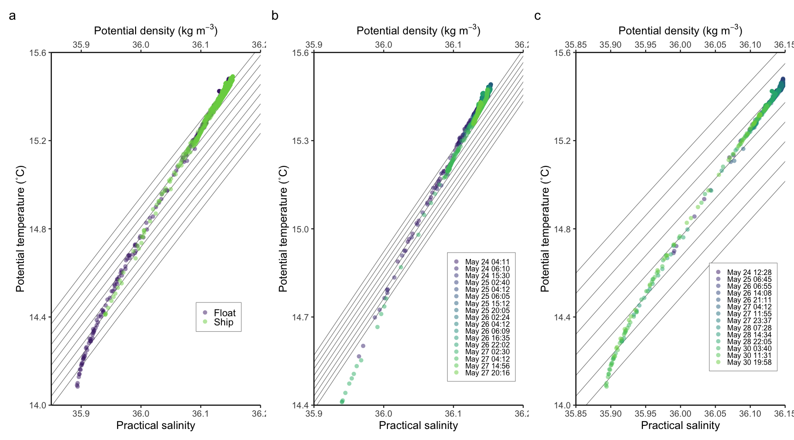
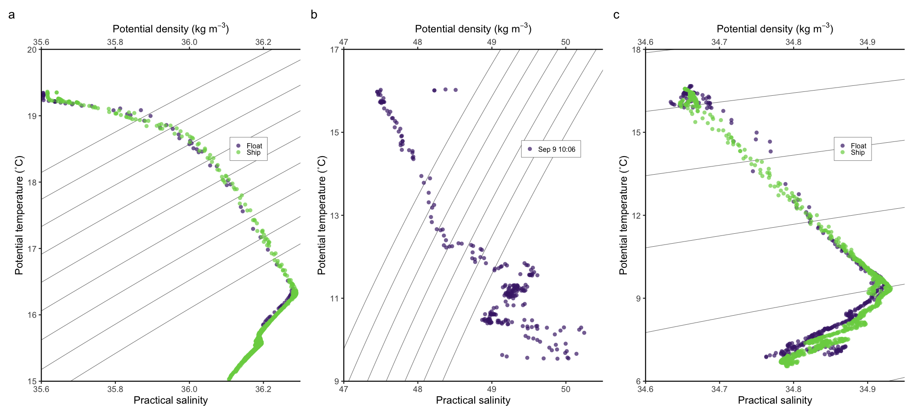
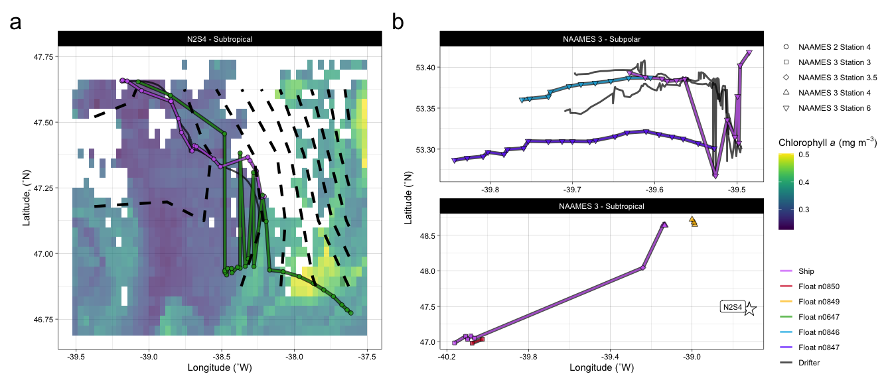

Floats
================
Nicholas Baetge
12/23/2021

# Intro

Analysis of [floats
deployed](http://misclab.umeoce.maine.edu/floats/float/n0647) at
N2S4-anticyclonic eddy (n0647) and N3S6-no eddy (n0847, n0846), at
N3S3-mode water eddy (n0850), and at N3S4-cyclonic eddy (n0849). Also
include ship data for N3S3.5-no eddy, which has no float data
associated.

  - Input data, which were the level 2 processed data, were pulled from
    the [NAAMES data page](https://naames.larc.nasa.gov/data2018.html)
  - MLDs were calculated using the N<sup>2</sup> buoyancy frequency and
    are defined as the depth below 5 m at which N<sup>2</sup> \>
    |stdev(N<sup>2</sup>)|

# Import and Wrangle Data

``` r
#pass all the filenames of everything in a float folder into a variable
# filenames <- list.files("~/GITHUB/naames_multiday/Input/n0849/",pattern = "*.csv", full.names = T)
# profile.names <- list.files("~/GITHUB/naames_multiday/Input/n0849/",pattern = "*.csv", full.names = F)
# profile.number <- gsub('.csv', '', profile.names) %>%
#   gsub('n0849.', '', .) %>%
#   as.numeric(.)

#now go through all the files in the folder, pick out the filenames, and pass them into the variable 'filenames'. use the file names to interate through the files, extracting the data from each csv, and combining it into one list
# master <-  lapply(filenames, function(i){
#   read_csv(i)
# })
# names(master) <- profile.number

#convert to data frame
# profiles <- bind_rows(master, .id = "profile")

#save csv
# write_csv(profiles, "~/GITHUB/naames_multiday/Input/n0849_profiles.csv")
```

## drifter

``` r
drifters <- read_csv("~/GITHUB/naames_multiday/Input/drifters/N2S4.csv") %>%
  mutate(Cruise = "AT34", name = "NAAMES 2", Station = 4, drifter = 1, plot_sep = "Subtropical") %>% 
  bind_rows(., read_csv("~/GITHUB/naames_multiday/Input/drifters/N3S6_01.csv") %>%
  mutate(Cruise = "AT38", name = "NAAMES 3", Station = 6, drifter = 1, plot_sep = "Subpolar")) %>% 
  bind_rows(., read_csv("~/GITHUB/naames_multiday/Input/drifters/N3S6_02.csv") %>%
  mutate(Cruise = "AT38", name = "NAAMES 3", Station = 6, drifter = 2, plot_sep = "Subpolar")) %>% 
  mutate(plot_name = paste(name, "Station", Station), 
         type = "Drifter") %>% 
  rename(lat = latitude_deg_,
         lon = longitude_deg_,
         Date = timestamp_utc_) %>% 
  select(Cruise, name, Station, plot_name, plot_sep, type, drifter, lat, lon, Date)
```

## floats

``` r
n0647 <- read_csv("~/GITHUB/naames_multiday/Input/n0647_profiles.csv") %>%  
  mutate(float = "n0647", Cruise = "AT34", Station = 4) %>% select(float:Station, profile, datetime:s, par, o2_c, chla_adj, fchl, fdom, cphyto, poc) %>%
  rename(o2 = o2_c, chla = chla_adj) %>% 
  filter(datetime < ymd_hms("2016-06-03 06:35:00"))

n0846 <- read_csv("~/GITHUB/naames_multiday/Input/n0846_profiles.csv") %>%  
  mutate(float = "n0846", Cruise = "AT38", Station = 6) %>% select(float:Station, profile, datetime:s, par, o2_c, chla_adj, fchl, fdom, cphyto, poc) %>%
  rename(o2 = o2_c, chla = chla_adj) %>% 
  filter(datetime < ymd_hms("2017-09-21 00:00:00"))

n0847 <- read_csv("~/GITHUB/naames_multiday/Input/n0847_profiles.csv") %>%  
  mutate(float = "n0847", Cruise = "AT38", Station = 6) %>% select(float:Station, profile, datetime:s, par, o2_c, chla_adj, fchl, fdom, cphyto, poc) %>%
  rename(o2 = o2_c, chla = chla_adj) %>% 
  filter(datetime < ymd_hms("2017-09-21 00:00:00"))

n0850 <- read_csv("~/GITHUB/naames_multiday/Input/n0850_profiles.csv") %>%  
  mutate(float = "n0850", Cruise = "AT38", Station = 3) %>% select(float:Station, profile, datetime:s, par, o2_c, chla_adj, fchl, fdom, cphyto, poc) %>%
  rename(o2 = o2_c, chla = chla_adj) %>% 
  filter(datetime < ymd_hms("2017-09-08 20:00:00"))

n0849 <- read_csv("~/GITHUB/naames_multiday/Input/n0849_profiles.csv") %>%  
  mutate(float = "n0849", Cruise = "AT38", Station = 4) %>% select(float:Station, profile, datetime:s, par, o2_c, chla_adj, fchl, fdom, cphyto, poc) %>%
  rename(o2 = o2_c, chla = chla_adj) %>% 
  filter(datetime < ymd_hms("2017-09-11 01:00:00"))
```

# Calculations

## MLDs and EZD

Euphotic zone depth calculated as depth at which PAR is 1% surface PAR.

``` r
#combine all the float data
naames_floats <- rbind(n0647, n0846, n0847, n0850, n0849) 

floatsNmlds <-  naames_floats %>% 
  group_by(float, profile, datetime) %>% 
  mutate(sigT = oce::swSigmaTheta(salinity = s, temperature = t, pressure = p, referencePressure = 0),
         potT = swTheta(salinity = s, temperature = t, pressure = p),
         N2 = oce::swN2(pressure = p, sigmaTheta = sigT)) %>% 
  filter(p > 5 & N2 > abs(sd(N2))) %>% 
  filter(p == min(p)) %>% #report the shallowest depth at which the above condition is met
  rename(MLD = p) %>% 
  ungroup() %>% 
  select(float:MLD) %>% 
  distinct() %>% 
  left_join(naames_floats, .) 
  
  # filter(datetime == ymd_hms("2016-05-24 12:28:04")) %>%
  
floatsNmldsNezds <- floatsNmlds %>% 
  group_by(float, profile, datetime) %>% 
  mutate(onePercSurfPAR = 0.01 * first(par)) %>% 
  group_modify(~ add_row(., par = max(.$onePercSurfPAR))) %>% 
  fill(c(Cruise, Station, lat, lon, MLD, onePercSurfPAR)) %>% 
  arrange(Cruise, Station, lat, lon, MLD, par) %>% 
  mutate(p = zoo::na.approx(p, par, na.rm = F),
         ezd = ifelse(par == onePercSurfPAR, p, NA)) %>% 
  fill(ezd, .direction = "downup") %>% 
  select(-onePercSurfPAR) %>% 
  drop_na(s) %>% 
  ungroup() %>% 
  select(float, profile, datetime, ezd) %>% 
  distinct() %>% 
  left_join(floatsNmlds, .)  %>% 
  mutate( potT = swTheta(salinity = s, temperature = t, pressure = p),
          date = ymd(as_date(datetime)), 
          time = as_hms(datetime),
          plot_date = paste(month(date, label = T), day(date), format(parse_date_time(time, c('HMS', 'HM')), '%H:%M'))) %>% 
  select(float:datetime, date, time, plot_date, Cruise:t, potT, everything())


summary(floatsNmldsNezds$ezd)  
```

    ##    Min. 1st Qu.  Median    Mean 3rd Qu.    Max.    NA's 
    ##   11.19   39.08   48.76   49.63   61.11   76.98    6562

``` r
test <- floatsNmldsNezds %>% 
  filter(Cruise == "AT38") 

summary(test$ezd)
```

    ##    Min. 1st Qu.  Median    Mean 3rd Qu.    Max.    NA's 
    ##   11.19   35.66   39.42   36.71   44.60   57.42    4385

# T-S plots

We’ll make T-S plots from the floats and overlay the data from the ship
collected data.

``` r
ship_ctd <- read_rds("~/GITHUB/naames_multiday/Input/ctd_data.rds") %>% 
  filter(Cruise == "AT34" & Station == 4 | Cruise == "AT38" & Station %in% c(3,3.5,4,6)) %>% 
  mutate(ave_temp_c = ifelse(Station == 3.5, temp0_c, ave_temp_c)) %>% 
  select(CampCN:Station, `Longitude [degrees_east]`, lat, mld, pres_db, ave_temp_c, ave_sal_psu, fl_mg_m3) %>% 
  rename(datetime = Date, lon = `Longitude [degrees_east]`, p = pres_db, s = ave_sal_psu, t = ave_temp_c, MLD = mld, fchl = fl_mg_m3) %>% 
  mutate( potT = swTheta(salinity = s, temperature = t, pressure = p),
          date = ymd(as_date(datetime)), 
          time = as_hms(datetime),
          plot_date = paste(month(date, label = T), day(date), format(parse_date_time(time, c('HMS', 'HM')), '%H:%M'))) %>% 
  select(CampCN:datetime, date, time, plot_date, Cruise:t, potT, everything())
```

## Station 4

The float data for N2S4 shows different T-S at depth for May 29, so
we’ll exclude that date from further analysis. Also May 27 6:07 cast
has different salinity at
depth.

``` r
s4_subset <- floatsNmldsNezds %>% filter(Cruise == "AT34", p >= 50, p <= 250,  datetime < ymd_hms("2016-05-31 00:00:00")) %>% mutate(type = "Float") %>% select(-c(o2:poc)) %>% distinct() %>% 
  bind_rows(., ship_ctd %>% filter(Cruise == "AT34", p >= 50, p <= 250) %>% mutate(type = "Ship")) %>% 
  filter(!plot_date %in% c("May 24 02:30", "May 27 06:07", "May 29 05:41", "May 29 20:41", "May 29 13:27"))

s4_subset$plot_date <- reorder(s4_subset$plot_date, s4_subset$datetime)

s4.ts <- PlotSvalbard::ts_plot(s4_subset, temp_col = "potT", sal_col = "s", color = "type", symbol_size = 3, symbol_shape = 16, symbol_alpha = 0.5, color_isopyc = "black", WM = NULL) +
  scale_color_viridis_d(begin = 0.1, end = 0.8) +
  theme_classic2(18) +
  scale_x_continuous(name = "Practical salinity", sec.axis = sec_axis(~.,name = expression(paste("Potential density (kg m"^-3, ")")))) +
  scale_y_continuous(name = "Potential temperature (˚C)") +
   theme(panel.spacing.x = unit(1, "cm"),
        axis.text.x = element_text(angle = 0),
        legend.title = element_blank(),
        legend.key.size = unit(0.4, "cm"),
        legend.position = c(0.8, 0.25),
        legend.text = element_text(size = 16),
        legend.background = element_rect(size = 0.2, linetype = "solid", color = "black"),
        legend.spacing.y = unit(0, "pt")) 

s4_subset_ship <- s4_subset %>% filter(type == "Ship")

s4.ts2 <- PlotSvalbard::ts_plot(s4_subset_ship, temp_col = "potT", sal_col = "s", color = "plot_date", symbol_size = 3, symbol_shape = 16, symbol_alpha = 0.5, color_isopyc = "black", WM = NULL) +
  scale_color_viridis_d(begin = 0.1, end = 0.8) +
  theme_classic2(18) +
   scale_x_continuous(name = "Practical salinity", sec.axis = sec_axis(~.,name = expression(paste("Potential density (kg m"^-3, ")")))) +
  scale_y_continuous(name = "Potential temperature (˚C)") +
   theme(panel.spacing.x = unit(1, "cm"),
        axis.text.x = element_text(angle = 0),
        legend.title = element_blank(),
        legend.key.size = unit(0.4, "cm"),
        legend.position = c(0.8, 0.25),
        legend.text = element_text(size = 12),
        legend.background = element_rect(size = 0.2, linetype = "solid", color = "black"),
        legend.spacing.y = unit(0, "pt")) 

s4_subset_float <- s4_subset %>% filter(type == "Float")

s4.ts3 <- PlotSvalbard::ts_plot(s4_subset_float, temp_col = "potT", sal_col = "s", color = "plot_date", symbol_size = 3, symbol_shape = 16, symbol_alpha = 0.5, color_isopyc = "black", WM = NULL) +
  scale_color_viridis_d(begin = 0.1, end = 0.8) +
  theme_classic2(18) +
    scale_x_continuous(name = "Practical salinity", sec.axis = sec_axis(~.,name = expression(paste("Potential density (kg m"^-3, ")")))) +
  scale_y_continuous(name = "Potential temperature (˚C)") +
   theme(panel.spacing.x = unit(1, "cm"),
        axis.text.x = element_text(angle = 0),
        legend.title = element_blank(),
        legend.key.size = unit(0.4, "cm"),
        legend.position = c(0.8, 0.25),
        legend.text = element_text(size = 12),
        legend.background = element_rect(size = 0.2, linetype = "solid", color = "black"),
        legend.spacing.y = unit(0, "pt")) 
```

``` r
s4.ts + s4.ts2 + s4.ts3 + plot_annotation(tag_levels = "a") 
```

<!-- -->

## Station 6

These casts have different T-S plots than all the float profiles and 7
of the ship profiles: plot\_date %in% c(“Sep 14 15:33”, “Sep 15 03:04”,
“Sep 15 15:20”, “Sep 16 03:04”, “Sep 16 04:50”, “Sep 16 07:26”. We’ll
exclude these from further
analysis.

``` r
s6_subset <- floatsNmldsNezds %>% filter(Cruise == "AT38" & Station == 6, p <= 250,  datetime < ymd_hms("2017-09-18 00:00:00")) %>%  mutate(type = "Float") %>% select(-c(o2:poc)) %>% distinct() %>% 
  bind_rows(., ship_ctd %>% filter(Cruise == "AT38", Station == 6, p <= 250) %>% mutate(type = "Ship")) %>% 
  filter(!plot_date %in% c("Sep 14 15:33", "Sep 15 03:04", "Sep 15 15:20", "Sep 16 03:04", "Sep 16 04:50", "Sep 16 07:26"))

s6_subset$plot_date <- reorder(s6_subset$plot_date, s6_subset$datetime)

s6.ts <- PlotSvalbard::ts_plot(s6_subset, temp_col = "potT", sal_col = "s", color = "type", symbol_size = 3, symbol_shape = 16, symbol_alpha = 0.7, color_isopyc = "black", WM = NULL) +
  scale_color_viridis_d(begin = 0.1, end = 0.8) +
  theme_classic2(18) +
    scale_x_continuous(name = "Practical salinity", sec.axis = sec_axis(~.,name = expression(paste("Potential density (kg m"^-3, ")")))) +
  scale_y_continuous(name = "Potential temperature (˚C)") +
   theme(panel.spacing.x = unit(1, "cm"),
        axis.text.x = element_text(angle = 0),
        legend.title = element_blank(),
        legend.key.size = unit(0.4, "cm"),
        legend.position = c(0.8, 0.7),
        legend.text = element_text(size = 12),
        legend.background = element_rect(size = 0.2, linetype = "solid", color = "black"),
        legend.spacing.y = unit(0, "pt")) 

s6_subset_ship <- s6_subset %>% filter(type == "Ship")

s6.ts2 <- PlotSvalbard::ts_plot(s6_subset_ship, temp_col = "potT", sal_col = "s", color = "plot_date", symbol_size = 3, symbol_shape = 16, symbol_alpha = 0.7, color_isopyc = "black", WM = NULL) +
  scale_color_viridis_d(begin = 0.1, end = 0.8) +
  theme_classic2(18) +
 scale_x_continuous(name = "Practical salinity", sec.axis = sec_axis(~.,name = expression(paste("Potential density (kg m"^-3, ")")))) +
  scale_y_continuous(name = "Potential temperature (˚C)") +
   theme(panel.spacing.x = unit(1, "cm"),
        axis.text.x = element_text(angle = 0),
        legend.title = element_blank(),
        legend.key.size = unit(0.4, "cm"),
        legend.position = c(0.8, 0.7),
        legend.text = element_text(size = 12),
        legend.background = element_rect(size = 0.2, linetype = "solid", color = "black"),
        legend.spacing.y = unit(0, "pt"))


s6_subset_float <- s6_subset %>% filter(type == "Float")

s6.ts3 <- PlotSvalbard::ts_plot(s6_subset_float, temp_col = "potT", sal_col = "s", color = "plot_date", symbol_size = 3, symbol_shape = 16, symbol_alpha = 0.7, color_isopyc = "black", WM = NULL) +
  scale_color_viridis_d(begin = 0.1, end = 0.8) +
  theme_classic2(18) +
 scale_x_continuous(name = "Practical salinity", sec.axis = sec_axis(~.,name = expression(paste("Potential density (kg m"^-3, ")")))) +
  scale_y_continuous(name = "Potential temperature (˚C)") +
   theme(panel.spacing.x = unit(1, "cm"),
        axis.text.x = element_text(angle = 0),
        legend.title = element_blank(),
        legend.key.size = unit(0.4, "cm"),
        legend.position = c(0.8, 0.7),
        legend.text = element_text(size = 12),
        legend.background = element_rect(size = 0.2, linetype = "solid", color = "black"),
        legend.spacing.y = unit(0, "pt")) 
```

``` r
s6.ts + s6.ts2 + s6.ts3 + plot_annotation(tag_levels = "a") 
```

<!-- -->

## N3 Station 3 and 4

This T-S profile is different from the rest: filter(\!plot\_date %in%
c(“Sep 8
03:08”)))

``` r
s3_subset <- floatsNmldsNezds %>% filter(Cruise == "AT38" & Station == 3, p <= 250) %>%  mutate(type = "Float") %>% select(-c(o2:poc)) %>% distinct() %>% 
  bind_rows(., ship_ctd %>% filter(Cruise == "AT38", Station == 3, p <= 250) %>% mutate(type = "Ship") %>% filter(!plot_date %in% c("Sep 8 03:08")))

s3_subset$plot_date <- reorder(s3_subset$plot_date, s3_subset$datetime)

s3.ts <- PlotSvalbard::ts_plot(s3_subset, temp_col = "potT", sal_col = "s", color = "type", symbol_size = 3, symbol_shape = 16, symbol_alpha = 0.7, color_isopyc = "black", WM = NULL) +
  scale_color_viridis_d(begin = 0.1, end = 0.8) +
  theme_classic2(18) +
  scale_x_continuous(name = "Practical salinity", sec.axis = sec_axis(~.,name = expression(paste("Potential density (kg m"^-3, ")")))) +
  scale_y_continuous(name = "Potential temperature (˚C)") +
   theme(panel.spacing.x = unit(1, "cm"),
        axis.text.x = element_text(angle = 0),
        legend.title = element_blank(),
        legend.key.size = unit(0.4, "cm"),
        legend.position = c(0.8, 0.7),
        legend.text = element_text(size = 12),
        legend.background = element_rect(size = 0.2, linetype = "solid", color = "black"),
        legend.spacing.y = unit(0, "pt")) 

n3s4_subset <- floatsNmldsNezds %>% filter(Cruise == "AT38" & Station == 4, p <= 250) %>%  mutate(type = "Float") %>% select(-c(o2:poc)) %>% distinct() %>% 
  bind_rows(., ship_ctd %>% filter(Cruise == "AT38", Station == 4, p <= 250) %>% mutate(type = "Ship") %>% filter(!plot_date %in% c("Sep 11 03:07")))

n3s4_subset$plot_date <- reorder(n3s4_subset$plot_date, n3s4_subset$datetime)

n3s4.ts <- PlotSvalbard::ts_plot(n3s4_subset, temp_col = "potT", sal_col = "s", color = "type", symbol_size = 3, symbol_shape = 16, symbol_alpha = 0.7, color_isopyc = "black", WM = NULL) +
  scale_color_viridis_d(begin = 0.1, end = 0.8) +
  theme_classic2(18) +
   scale_x_continuous(name = "Practical salinity", sec.axis = sec_axis(~.,name = expression(paste("Potential density (kg m"^-3, ")")))) +
  scale_y_continuous(name = "Potential temperature (˚C)") +
   theme(panel.spacing.x = unit(1, "cm"),
        axis.text.x = element_text(angle = 0),
        legend.title = element_blank(),
        legend.key.size = unit(0.4, "cm"),
        legend.position = c(0.8, 0.7),
        legend.text = element_text(size = 12),
        legend.background = element_rect(size = 0.2, linetype = "solid", color = "black"),
        legend.spacing.y = unit(0, "pt")) 


s35_subset <- ship_ctd %>% filter(Cruise == "AT38", Station == 3.5, p <= 250) %>% mutate(type = "Ship")

s35_subset$plot_date <- reorder(s35_subset$plot_date, s35_subset$datetime)

s35.ts <- PlotSvalbard::ts_plot(s35_subset, temp_col = "potT", sal_col = "s", color = "plot_date", symbol_size = 3, symbol_shape = 16, symbol_alpha = 0.7, color_isopyc = "black", WM = NULL) +
  scale_color_viridis_d(begin = 0.1, end = 0.8) +
  theme_classic2(18) +
   scale_x_continuous(name = "Practical salinity", sec.axis = sec_axis(~.,name = expression(paste("Potential density (kg m"^-3, ")")))) +
  scale_y_continuous(name = "Potential temperature (˚C)") +
   theme(panel.spacing.x = unit(1, "cm"),
        axis.text.x = element_text(angle = 0),
        legend.title = element_blank(),
        legend.key.size = unit(0.4, "cm"),
        legend.position = c(0.8, 0.7),
        legend.text = element_text(size = 12),
        legend.background = element_rect(size = 0.2, linetype = "solid", color = "black"),
        legend.spacing.y = unit(0, "pt"))
```

``` r
s3.ts + s35.ts + n3s4.ts + plot_annotation(tag_levels = "a") 
```

<!-- -->

# Map

``` r
# chlaInfo <- info("erdMH1chla1day")
# n2_chl <- griddap(chlaInfo, latitude = c(46.5, 48.), longitude = c(-40.5, -37), time = c('2016-05-23','2016-05-27'), fields = 'chlorophyll')
# n3_chl <- griddap(chlaInfo, latitude = c(53.2, 53.5), longitude = c(-40, -39.4), time = c('2017-09-13', '2017-09-17'), fields = 'chlorophyll')


chlaInfo2 <- info("nesdisVHNSQchlaDaily")
n2_chl <- griddap(chlaInfo2, latitude = c(46.7, 47.7), longitude = c(-39.5, -37.5), time = c('2016-05-23','2016-05-27'), fields = 'chlor_a')
n3_chl <- griddap(chlaInfo2, latitude = c(53.2, 53.5), longitude = c(-40, -39.4), time = c('2017-09-13', '2017-09-17'), fields = 'chlor_a')


sstInfo <- info("jplMURSST41")

n2_sst <- griddap(sstInfo, latitude = c(46.5, 48.), longitude = c(-40.5, -37), time = c('2016-05-24','2016-05-24'), fields = 'analysed_sst')
n3_sst <- griddap(sstInfo, latitude = c(53.2, 53.5), longitude = c(-40, -39.4), time = c('2017-09-13', '2017-09-13'), fields = 'analysed_sst')
```

``` r
library(ggnewscale)

custom.shapes <- c("NAAMES 2 Station 4" = 21, "NAAMES 3 Station 3" = 22, "NAAMES 3 Station 3.5" = 23, "NAAMES 3 Station 4" = 24, "NAAMES 3 Station 6" = 25)
custom.colors <- c("Ship" = "#d16cfa", "Float n0850" = "#d31f2a", "Float n0849" = "#ffc000", "Float n0647" = "#27ab19", "Float n0846" = "#0db5e6",  "Float n0847"  = "#7139fe", "Drifter" = "black")

custom.lines <- c("Ship" = 1, "Float n0847" = 2, "Float n0846" = 2, "Float n0647" = 2, "Float n0849" = 2 , "Float n0850" = 2, "Drifter" = 3)
mycolor <- colors$viridis
w <- map_data("worldHires", ylim = c(35., 60.), xlim = c(-60, -30))

sla <- readxl::read_excel("~/GITHUB/naames_multiday/Input/sla/combined_sla.xlsx")


stations <- read_rds("~/GITHUB/naames_multiday/Input/ctd_data.rds") %>% 
  select(CampCN:lat) %>% 
  distinct() %>% 
  group_by(CampCN) %>% 
  filter(row_number() == 1) %>% 
  rename(datetime = `yyyy-mm-ddThh:mm:ss.sss`,
         lon = `Longitude [degrees_east]`) %>% 
  ungroup() 

map_data <- stations %>% select(Cruise, Station, Date, lon, lat) %>% mutate(type = "Ship") %>% 
  bind_rows(., floatsNmlds %>% select(Cruise, Station, float, datetime, lon, lat) %>% distinct() %>% rename(Date = datetime) %>%  mutate(type = paste("Float", float))) %>% 
  mutate(name = ifelse(Cruise == "AT34", "NAAMES 2", "NAAMES 3"), 
         plot_name = paste(name, "Station", Station),
         plot_sep = ifelse(Station == "6", "Subpolar", "Subtropical")) %>% 
  bind_rows(., drifters %>% mutate_at(vars(drifter), as.character) %>%  rename(float = drifter)) %>% 
  mutate(type = fct_relevel(type, 
            "Drifter", "Float n0647", "Float n0850", "Float n0849", "Float n0847", "Float n0846", "Ship"))

map1_data <- map_data %>% 
  filter(Cruise == "AT34") %>% 
  mutate(plot_sep = "N2S4 - Subtropical")

map1 <- ggplot(data = map1_data, aes(x = lon, y = lat)) + 
  facet_wrap(~plot_sep, dir = "v", scales = "free") +
  # geom_tile(data = n2_sst$data, aes(x = lon, y = lat, fill = analysed_sst)) +
  geom_tile(data = n2_chl$data, aes(x = lon, y = lat, fill = chlor_a), alpha = 0.7) +
  scale_fill_gradientn(colors = mycolor, na.value = NA) +
  labs(fill = expression(paste("Chlorophyll", italic(" a"), " (mg m"^-3, ")"))) +
  new_scale_fill() +  
   geom_line(data = . %>% filter(!type == "Drifter"), aes(color = type, group = interaction(type, plot_name, float)), color = "black", size = 2, alpha = 0.7) +
  geom_line(aes(color = type, group = interaction(type, plot_name, float)), size = 1, alpha = 0.7) +
  geom_point(data = . %>% filter(!type == "Drifter"), aes(fill = type, shape = plot_name,  group = interaction(type, plot_name, float)),  size = 2, alpha = 0.7) +
  theme_linedraw() + 
  labs(x = "Longitude (˚W)", y = "Latitude, (˚N)", color = "", fill = "", linetype = "", shape = "") +
  # scale_linetype_manual(values = custom.lines) +
  scale_fill_manual(values = custom.colors) +
  scale_color_manual(values = custom.colors) +
  scale_shape_manual(values = custom.shapes) +
  guides(fill = guide_legend(override.aes = list(shape = 21))) +
  geom_contour(data = sla, aes(x = lon, y = lat, z = sla), linetype = 2, size = 1.5, color = "black") +
  theme(plot.tag = element_text(size = 26)) 

map2_data <- map_data %>% 
  filter(Cruise == "AT38") %>% 
  mutate(plot_sep = ifelse(plot_sep == "Subpolar", "NAAMES 3 - Subpolar", "NAAMES 3 - Subtropical")) 
  

s4_map2 <- tibble(lon = c(-38.72, -38.8), lat = c(47.46, 47.5), plot_sep = "NAAMES 3 - Subtropical", name = "N2S4", type = c("star", "label"))

library(ggstar)

map2 <- ggplot(data = map2_data, aes(x = lon, y = lat)) + 
  facet_wrap(~plot_sep, dir = "v", scales = "free") +
  geom_line(data = . %>% filter(!type == "Drifter", !name == "N2S4"), aes(color = type, group = interaction(type, plot_name, float)), color = "black", size = 2, alpha = 0.7) +
  geom_line(aes(color = type, group = interaction(type, plot_name, float)), size = 1, alpha = 0.7) +
  geom_point(data = . %>% filter(!type == "Drifter", !name == "N2S4"), aes(fill = type, shape = plot_name,  group = interaction(type, plot_name, float)),  size = 2, alpha = 0.7) +
  geom_star(data = s4_map2 %>% filter(type == "star"), aes(x = lon, y = lat), size = 5) +
  geom_label(data = s4_map2 %>% filter(type == "label"), aes(x = lon, y = lat, label = name), size = 3) +
  theme_linedraw() + 
  labs(x = "Longitude (˚W)", y = "Latitude (˚N)", color = "", fill = "", linetype = "", shape = "") +
   # scale_linetype_manual(values = custom.lines) +
  scale_fill_manual(values = custom.colors) +
  scale_color_manual(values = custom.colors) + 
  scale_shape_manual(values = custom.shapes) +
  guides(fill = guide_legend(override.aes = list(shape = 21))) +
  theme(plot.tag = element_text(size = 26)) 
```

``` r
(map1 + guides(fill = "none", color = "none", linetype = "none")) + (map2 + guides(fill = "none", shape = "none")) + plot_layout(guides = "collect") + plot_annotation(tag_levels = "a") 
```

<!-- -->

\#Station 4

## Temp profiles

``` r
new_colors <- colors$freesurface
```

``` r
temp <- floatsNmldsNezds %>% 
  filter(!plot_date %in% c("May 29 05:41", "May 29 20:41", "May 29 13:27")) %>%  
   filter(Cruise == "AT34", p <= 300,  datetime < ymd_hms("2016-05-31 00:00:00")) %>%
  select(profile, datetime, p, t) %>% 
  bind_rows(., ship_ctd %>% 
              filter(!plot_date %in% c("May 24 02:30", "May 27 06:07")) %>% 
              filter(Cruise == "AT34" & Station == 4, p <= 300) %>% 
              select(datetime, p, t)) %>% 
  mutate(decimaldate = decimal_date(datetime)) %>% 
  select(decimaldate, p, t) 

mba <- MBA::mba.surf(temp, no.X = 300, no.Y = 300, extend = T)
dimnames(mba$xyz.est$z) <- list(mba$xyz.est$x, mba$xyz.est$y)
mba <- reshape2::melt(mba$xyz.est$z, varnames = c('decimal_date', 'p'), value.name = 'temp')
```

### Plot


## Sal profiles

``` r
sal <- floatsNmldsNezds %>% 
  filter(!plot_date %in% c("May 29 05:41", "May 29 20:41", "May 29 13:27")) %>%  
   filter(Cruise == "AT34", p <= 300,  datetime < ymd_hms("2016-05-31 00:00:00")) %>%
  select(profile, datetime, p, s) %>% 
  bind_rows(., ship_ctd %>% 
              filter(!plot_date %in% c("May 24 02:30", "May 27 06:07")) %>% 
              filter(Cruise == "AT34" & Station == 4, p <= 300) %>% 
              select(datetime, p, s)) %>% 
  mutate(decimaldate = decimal_date(datetime)) %>% 
  select(decimaldate, p, s) 

mba <- MBA::mba.surf(sal, no.X = 300, no.Y = 300, extend = T)
dimnames(mba$xyz.est$z) <- list(mba$xyz.est$x, mba$xyz.est$y)
mba <- reshape2::melt(mba$xyz.est$z, varnames = c('decimal_date', 'p'), value.name = 's')
```

### Plot

## Fluorescence profiles

``` r
fl <- floatsNmldsNezds %>% 
  filter(!plot_date %in% c("May 29 05:41", "May 29 20:41", "May 29 13:27")) %>%  
  filter(Cruise == "AT34", p <= 300,  datetime < ymd_hms("2016-05-31 00:00:00")) %>%
  select(profile, datetime, p, fchl) %>% 
  bind_rows(., ship_ctd %>% 
              filter(!plot_date %in% c("May 24 02:30","May 27 06:07")) %>% 
              filter(Cruise == "AT34" & Station == 4, p <= 300) %>% 
              select(datetime, p, fchl)) %>% 
  mutate(decimaldate = decimal_date(datetime)) %>% 
  select(decimaldate, p, fchl) 

mba <- MBA::mba.surf(fl, no.X = 300, no.Y = 300, extend = T)
dimnames(mba$xyz.est$z) <- list(mba$xyz.est$x, mba$xyz.est$y)
mba <- reshape2::melt(mba$xyz.est$z, varnames = c('decimal_date', 'p'), value.name = 'fchl')
```

### Plot

``` r
t.plot / s.plot / fl.plot + plot_annotation(tag_levels = "a") 
```

    ## Warning: Raster pixels are placed at uneven horizontal intervals and will be shifted. Consider using geom_tile() instead.
    ## Raster pixels are placed at uneven horizontal intervals and will be shifted. Consider using geom_tile() instead.
    ## Raster pixels are placed at uneven horizontal intervals and will be shifted. Consider using geom_tile() instead.

<!-- -->

# Station 6

These plots represent data from two separate floats. The T-S plots shoow
good agreement between the water masses sampled by the floats.

## Temp profiles

``` r
temp <- floatsNmldsNezds %>% 
   filter(Cruise == "AT38", Station == 6, p <= 300,  datetime < ymd_hms("2017-09-18 00:00:00")) %>%
  select(profile, datetime, p, t) %>% 
  bind_rows(., ship_ctd %>% 
               filter(!plot_date %in% c("Sep 14 15:33", "Sep 15 03:04", "Sep 15 15:20", "Sep 16 03:04", "Sep 16 04:50", "Sep 16 07:26")) %>% 
              filter(Cruise == "AT38" & Station == 6, p <= 300) %>% 
              select(datetime, p, t)) %>% 
  mutate(decimaldate = decimal_date(datetime)) %>% 
  select(decimaldate, p, t) 

mba <- MBA::mba.surf(temp, no.X = 300, no.Y = 300, extend = T)
dimnames(mba$xyz.est$z) <- list(mba$xyz.est$x, mba$xyz.est$y)
mba <- reshape2::melt(mba$xyz.est$z, varnames = c('decimal_date', 'p'), value.name = 'temp')
```

### Plot

## Sal profiles

``` r
sal <- floatsNmldsNezds %>% 
   filter(Cruise == "AT38", Station == 6, p <= 300,  datetime < ymd_hms("2017-09-18 00:00:00")) %>%
  select(profile, datetime, p, s) %>% 
  bind_rows(., ship_ctd %>% 
              filter(!plot_date %in% c("Sep 14 15:33", "Sep 15 03:04", "Sep 15 15:20", "Sep 16 03:04", "Sep 16 04:50", "Sep 16 07:26")) %>% 
              filter(Cruise == "AT38" & Station == 6, p <= 300) %>% 
              select(datetime, p, s)) %>% 
  mutate(decimaldate = decimal_date(datetime)) %>% 
  select(decimaldate, p, s) 

mba <- MBA::mba.surf(sal, no.X = 300, no.Y = 300, extend = T)
dimnames(mba$xyz.est$z) <- list(mba$xyz.est$x, mba$xyz.est$y)
mba <- reshape2::melt(mba$xyz.est$z, varnames = c('decimal_date', 'p'), value.name = 's')
```

### Plot

## Fluorescence profiles

``` r
fl <- floatsNmldsNezds %>% 
  filter(Cruise == "AT38", Station == 6, p <= 300,  datetime < ymd_hms("2017-09-18 00:00:00")) %>%
  select(profile, datetime, p, fchl) %>% 
  bind_rows(., ship_ctd %>% 
              filter(!plot_date %in% c("Sep 14 15:33", "Sep 15 03:04", "Sep 15 15:20", "Sep 16 03:04", "Sep 16 04:50", "Sep 16 07:26")) %>% 
              filter(Cruise == "AT38" & Station == 6, p <= 300) %>% 
              select(datetime, p, fchl)) %>% 
  mutate(decimaldate = decimal_date(datetime)) %>% 
  select(decimaldate, p, fchl) 

mba <- MBA::mba.surf(fl, no.X = 300, no.Y = 300, extend = T)
dimnames(mba$xyz.est$z) <- list(mba$xyz.est$x, mba$xyz.est$y)
mba <- reshape2::melt(mba$xyz.est$z, varnames = c('decimal_date', 'p'), value.name = 'fchl')
```

### Plot

``` r
t.plot / s.plot / fl.plot + plot_annotation(tag_levels = "a") 
```

    ## Warning: Raster pixels are placed at uneven horizontal intervals and will be shifted. Consider using geom_tile() instead.
    ## Raster pixels are placed at uneven horizontal intervals and will be shifted. Consider using geom_tile() instead.
    ## Raster pixels are placed at uneven horizontal intervals and will be shifted. Consider using geom_tile() instead.

<!-- -->

# Save data

``` r
write_rds(floatsNmldsNezds, "~/GITHUB/naames_multiday/Output/processed_floats.rds")
```
