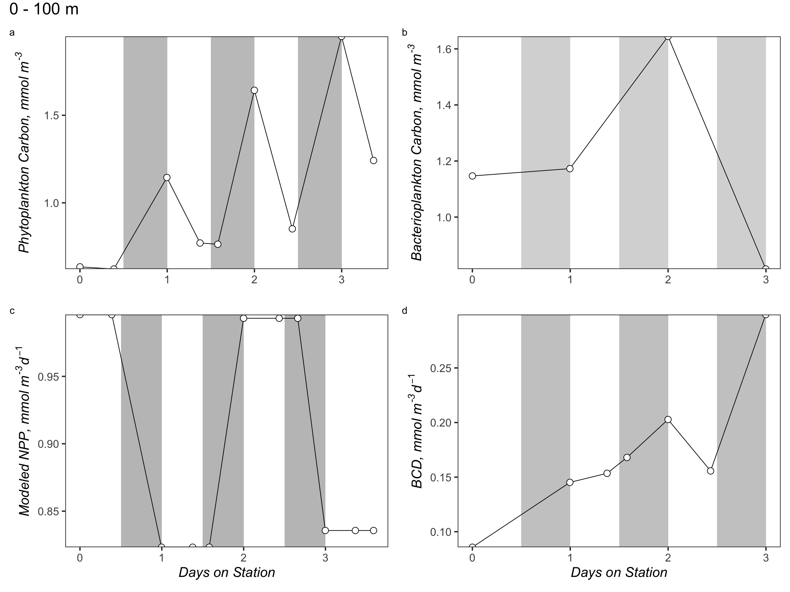

Integration\_Plots
================
Nicholas Baetge
8/12/2020

# Intro

Here, we plot the integrated from the multiday NAAMES station, N2S4.

``` r
library(tidyverse) 
library(rmarkdown)
library(knitr)
library(readxl)
library(data.table) 
library(scales)
library(zoo)
library(oce)
library(patchwork)
#rmarkdown tables
library(stargazer)
library(pander)
#stat tests
library(lmtest)
library(lmodel2)
library(rstatix)
library(ggpubr)
#for odv type plots
library(lubridate)
library(reshape2)
library(MBA)
library(mgcv)

custom_theme <- function() {
  theme_test(base_size = 30) %+replace%
    theme(legend.position = "right",
          legend.spacing.x = unit(0.5,"cm"),
          legend.title = element_text(size = 14),
          legend.text = element_text(size = 14),
          legend.background = element_rect(fill = "transparent",colour = NA),
          legend.key = element_rect(fill = "transparent",colour = NA),
          panel.background = element_rect(fill = "transparent",colour = NA),
          plot.background = element_rect(fill = "transparent",colour = NA)) 
}

custom.colors <- c("AT39" = "#377EB8", "AT34" = "#4DAF4A", "AT38" = "#E41A1C", "AT32" = "#FF7F00", "Temperate" = "#A6CEE3", "Subpolar" = "#377EB8", "Subtropical" = "#FB9A99", "GS/Sargasso" = "#E41A1C", "Early Spring" = "#377EB8", "Late Spring" = "#4DAF4A","Early Autumn" = "#E41A1C", "Summer" = "#E41A1C", "Late Autumn" = "#FF7F00", "Gv2_2019" = "#377EB8", "WOA18_MN" = "#4DAF4A", "WOA18_AN" = "#E41A1C")

levels = c("GS/Sargasso", "Subtropical", "Temperate", "Subpolar",  "AT39-6", "AT34", "AT38", "AT32","South", "North", "Early Spring", "Late Spring","Early Autumn",  "Summer", "Late Autumn", "Gv2_2019", "WOA18_MN", "WOA18_AN","Nov", "Nov sd", "Dec", "Dec sd", "Jan", "Jan sd", "Feb", "Feb sd", "Mar", "Mar sd", "Apr", "Apr sd",  "Cruise", "ARGO")

bar.colors <- c("100 m" = "white", "CM" = "#4DAF4A",  "PAM" = "#377EB8")

odv.colors <- c("#feb483", "#d31f2a", "#ffc000", "#27ab19", "#0db5e6", "#7139fe", "#d16cfa")
```

# Import Data

``` r
data <- read_rds("~/GITHUB/naames_multiday/Output/processed_data.rds") %>% 
  filter(Cruise == "AT34" & Station == 4 | Cruise == "AT38" & Station == 6) %>% 
  filter(Cruise == "AT34") %>% 
  mutate(time = ymd_hms(datetime),
         interv = interval(first(time), time),
         dur = as.duration(interv),
         days = as.numeric(dur, "days"),
         hour = hour(time),
         night_day = ifelse(between(hour, 6, 18), "day", "night")) %>% 
  select(Cruise, Station, Date, time:night_day, bcd.100:npp.300) %>% 
  distinct() %>% 
  mutate_at(vars(contains(c("phyc", "npp", "bc"))), function(x) (x / 1000)) 
```

# 0 - 100m

### Phyto Carbon

### NPP

### Bact Carbon

### BCD


