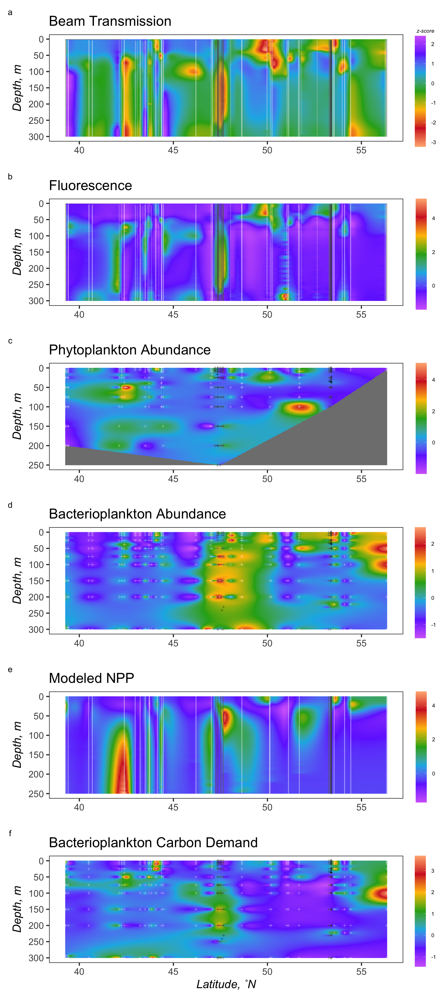
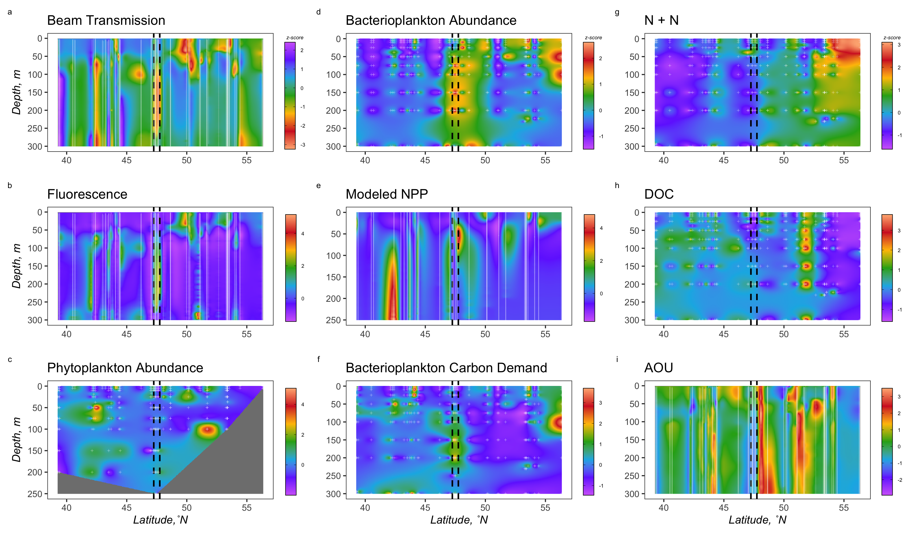

ODV Plots
================
Nicholas Baetge
8/6/2020

# Intro

Here, ODV-style section plots are made from data. Data are first
transformed to represent z-scores (i.e. plots display anomalies for each
depth)

``` r
library(tidyverse) 
library(rmarkdown)
library(knitr)
library(readxl)
library(data.table) 
library(scales)
library(zoo)
library(oce)
library(patchwork)
#rmarkdown tables
library(stargazer)
library(pander)
#stat tests
library(lmtest)
library(lmodel2)
library(rstatix)
library(ggpubr)
#for odv type plots
library(lubridate)
library(reshape2)
library(MBA)
library(mgcv)

custom_theme <- function() {
  theme_test(base_size = 30) %+replace%
    theme(legend.position = "right",
          legend.spacing.x = unit(0.5,"cm"),
          legend.title = element_text(size = 14),
          legend.text = element_text(size = 14),
          legend.background = element_rect(fill = "transparent",colour = NA),
          legend.key = element_rect(fill = "transparent",colour = NA),
          panel.background = element_rect(fill = "transparent",colour = NA),
          plot.background = element_rect(fill = "transparent",colour = NA)) 
}

custom.colors <- c("AT39" = "#377EB8", "AT34" = "#4DAF4A", "AT38" = "#E41A1C", "AT32" = "#FF7F00", "Temperate" = "#A6CEE3", "Subpolar" = "#377EB8", "Subtropical" = "#FB9A99", "GS/Sargasso" = "#E41A1C", "Early Spring" = "#377EB8", "Late Spring" = "#4DAF4A","Early Autumn" = "#E41A1C", "Summer" = "#E41A1C", "Late Autumn" = "#FF7F00", "Gv2_2019" = "#377EB8", "WOA18_MN" = "#4DAF4A", "WOA18_AN" = "#E41A1C")

levels = c("GS/Sargasso", "Subtropical", "Temperate", "Subpolar",  "AT39-6", "AT34", "AT38", "AT32","South", "North", "Early Spring", "Late Spring","Early Autumn",  "Summer", "Late Autumn", "Gv2_2019", "WOA18_MN", "WOA18_AN","Nov", "Nov sd", "Dec", "Dec sd", "Jan", "Jan sd", "Feb", "Feb sd", "Mar", "Mar sd", "Apr", "Apr sd",  "Cruise", "ARGO")

bar.colors <- c("100 m" = "white", "CM" = "#4DAF4A",  "PAM" = "#377EB8")

odv.colors <- c("#feb483", "#d31f2a", "#ffc000", "#27ab19", "#0db5e6", "#7139fe", "#d16cfa")
```

# Import Data

``` r
data <- read_rds("~/GITHUB/naames_multiday/Output/processed_data.rds") %>% 
  rename(lat = Latitude)

ctd <- read_rds("~/GITHUB/naames_multiday/Input/ctd/deriv_naames_ctd.rds") %>% 
  rename(lat = "Latitude [degrees_north]",
         z = bin_depth) %>% 
  mutate(bin = round(lat, 1))


#units for npp are mg C / d, we'll convert to µmol C / d
npp <- read_rds("~/GITHUB/naames_multiday/Input/Z_resolved_model_NPP.rds") %>% 
  rename(z = depth,
         npp = NPP) %>% 
  mutate(npp = round((npp * 10^3)/12)) %>% 
  left_join(., data %>% 
              select(Cruise, Station, Date, lat) %>% 
              distinct() %>% 
              group_by(Cruise, Station, Date) %>% 
              mutate(mean_lat = mean(lat)) %>% 
              ungroup() %>% 
              select(Cruise, Station, Date, mean_lat) %>% 
              distinct() %>% 
              rename(lat = mean_lat)) 
```

    ## Joining, by = c("Cruise", "Station", "Date")

``` r
#markers for multiday stations
s4_ctd_mark <- ctd %>% 
  filter(between(z, 0, 300)) %>% 
  filter(Cruise == "AT34", Station == 4) %>% 
  select(lat, z) %>% 
  distinct()

s6_ctd_mark <- ctd %>% 
  filter(between(z, 0, 300)) %>% 
  filter(Cruise == "AT38", Station == 6) %>% 
  select(lat, z) %>% 
  distinct()

s4_data_mark <- data %>% 
  filter(between(z, 0, 300)) %>% 
  filter(Cruise == "AT34", Station == 4) %>% 
  distinct()

s6_data_mark <- data %>% 
  filter(between(z, 0, 300)) %>% 
  filter(Cruise == "AT38", Station == 6) %>% 
  distinct()
```

# Plot ODV-style composites

## BeamT

``` r
subset <- ctd %>% 
  filter(between(z, 0, 300)) %>% 
  select(lat, z, beamT_perc) %>% 
  group_by(z) %>% 
  mutate(mean = mean(beamT_perc),
         sd = sd(beamT_perc),
         zscore = (beamT_perc - mean)/sd) %>% 
  ungroup() %>% 
  select(lat, z, zscore) %>% 
  mutate(zscore = round(zscore, 2)) %>% 
  filter(z > 0)

mba <- mba.surf(subset, no.X = 300, no.Y = 300, extend = F)
dimnames(mba$xyz.est$z) <- list(mba$xyz.est$x, mba$xyz.est$y)
mba <- melt(mba$xyz.est$z, varnames = c('lat', 'z'), value.name = 'zscore') %>%
  filter(z >= 0) 
```

## Fluoresence

``` r
subset <- ctd %>% 
  filter(between(z, 0, 300)) %>% 
  select(lat, z, fl_mg_m3) %>% 
  group_by(z) %>% 
  mutate(mean = mean(fl_mg_m3),
         sd = sd(fl_mg_m3),
         zscore = (fl_mg_m3 - mean)/sd) %>% 
  ungroup() %>% 
  select(lat, z, zscore) %>% 
  mutate(zscore = round(zscore, 2)) %>% 
  filter(z > 0)

mba <- mba.surf(subset, no.X = 300, no.Y = 300, extend = F)
dimnames(mba$xyz.est$z) <- list(mba$xyz.est$x, mba$xyz.est$y)
mba <- melt(mba$xyz.est$z, varnames = c('lat', 'z'), value.name = 'zscore') %>%
  filter(z > 0) 
```

## Phytoplankton Abundance

``` r
subset <- data %>% 
  filter(between(z, 0, 300)) %>% 
  select(lat, z, phyto) %>% 
  group_by(z) %>% 
  mutate(mean = mean(phyto, na.rm = T),
         sd = sd(phyto, na.rm = T),
         zscore = (phyto - mean)/sd) %>% 
  ungroup() %>% 
  select(lat, z, zscore) %>% 
  mutate(zscore = round(zscore, 2)) %>% 
  filter(z >= 0) %>% 
  drop_na(zscore)

s4_mark <- s4_data_mark %>% 
  drop_na(phyto)

s6_mark <- s6_data_mark %>% 
  drop_na(phyto)

mba <- mba.surf(subset, no.X = 300, no.Y = 300, extend = F)
dimnames(mba$xyz.est$z) <- list(mba$xyz.est$x, mba$xyz.est$y)
mba <- melt(mba$xyz.est$z, varnames = c('lat', 'z'), value.name = 'zscore') %>%
  filter(z >= 0) 
```

## NPP

``` r
subset <- npp %>% 
  filter(between(z, 0, 300)) %>% 
  select(lat, z, npp) %>% 
  group_by(z) %>% 
  mutate(mean = mean(npp, na.rm = T),
         sd = sd(npp, na.rm = T),
         zscore = (npp - mean)/sd) %>% 
  ungroup() %>% 
  select(lat, z, zscore) %>% 
  mutate(zscore = round(zscore, 2)) %>% 
  filter(z >= 0) %>% 
  drop_na(zscore)

s4_mark <- npp %>% 
  filter(between(z, 0, 300)) %>% 
  filter(Cruise == "AT34", Station == 4) %>% 
  select(lat, z) %>% 
  distinct() 

s6_mark <- npp %>% 
  filter(between(z, 0, 300)) %>% 
  filter(Cruise == "AT38", Station == 6) %>% 
  select(lat, z) %>% 
  distinct() 

mba <- mba.surf(subset, no.X = 300, no.Y = 300, extend = F)
dimnames(mba$xyz.est$z) <- list(mba$xyz.est$x, mba$xyz.est$y)
mba <- melt(mba$xyz.est$z, varnames = c('lat', 'z'), value.name = 'zscore') %>%
  filter(z >= 0) 
```

## Bacterial Abundance

``` r
subset <- data %>% 
  filter(between(z, 0, 300)) %>% 
  select(lat, z, ba) %>% 
  group_by(z) %>% 
  mutate(mean = mean(ba, na.rm = T),
         sd = sd(ba, na.rm = T),
         zscore = (ba - mean)/sd) %>% 
  ungroup() %>% 
  select(lat, z, zscore) %>% 
  mutate(zscore = round(zscore, 2)) %>% 
  filter(z >= 0) %>% 
  drop_na(zscore)

s4_mark <- s4_data_mark %>% 
  drop_na(ba)

s6_mark <- s6_data_mark %>% 
  drop_na(ba)

mba <- mba.surf(subset, no.X = 300, no.Y = 300, extend = F)
dimnames(mba$xyz.est$z) <- list(mba$xyz.est$x, mba$xyz.est$y)
mba <- melt(mba$xyz.est$z, varnames = c('lat', 'z'), value.name = 'zscore') %>%
  filter(z >= 0) 
```

## BCD

``` r
subset <- data %>% 
  filter(between(z, 0, 300)) %>% 
  select(lat, z, bcd) %>% 
  group_by(z) %>% 
  mutate(mean = mean(bcd, na.rm = T),
         sd = sd(bcd, na.rm = T),
         zscore = (bcd - mean)/sd) %>% 
  ungroup() %>% 
  select(lat, z, zscore) %>% 
  mutate(zscore = round(zscore, 2)) %>% 
  filter(z >= 0) %>% 
  drop_na(zscore)

s4_mark <- s4_data_mark %>% 
  drop_na(bcd)

s6_mark <- s6_data_mark %>% 
  drop_na(bcd)

mba <- mba.surf(subset, no.X = 300, no.Y = 300, extend = F)
dimnames(mba$xyz.est$z) <- list(mba$xyz.est$x, mba$xyz.est$y)
mba <- melt(mba$xyz.est$z, varnames = c('lat', 'z'), value.name = 'zscore') %>%
  filter(z >= 0) 
```

### Set 1



## N + N

``` r
subset <- data %>% 
  filter(between(z, 0, 300)) %>% 
  select(lat, z, n) %>% 
  group_by(z) %>% 
  mutate(mean = mean(n, na.rm = T),
         sd = sd(n, na.rm = T),
         zscore = (n - mean)/sd) %>% 
  ungroup() %>% 
  select(lat, z, zscore) %>% 
  mutate(zscore = round(zscore, 2)) %>% 
  filter(z >= 0) %>% 
  drop_na(zscore)

s4_mark <- s4_data_mark %>% 
  drop_na(n)

s6_mark <- s6_data_mark %>% 
  drop_na(n)

mba <- mba.surf(subset, no.X = 300, no.Y = 300, extend = F)
dimnames(mba$xyz.est$z) <- list(mba$xyz.est$x, mba$xyz.est$y)
mba <- melt(mba$xyz.est$z, varnames = c('lat', 'z'), value.name = 'zscore') %>%
  filter(z >= 0) 
```

## DOC

``` r
subset <- data %>% 
  filter(between(z, 0, 300)) %>% 
  select(lat, z, doc) %>% 
  group_by(z) %>% 
  mutate(mean = mean(doc, na.rm = T),
         sd = sd(doc, na.rm = T),
         zscore = (doc - mean)/sd) %>% 
  ungroup() %>% 
  select(lat, z, zscore) %>% 
  mutate(zscore = round(zscore, 2)) %>% 
  filter(z >= 0) %>% 
  drop_na(zscore)

s4_mark <- s4_data_mark %>% 
  drop_na(doc)

s6_mark <- s6_data_mark %>% 
  drop_na(doc)

mba <- mba.surf(subset, no.X = 300, no.Y = 300, extend = F)
dimnames(mba$xyz.est$z) <- list(mba$xyz.est$x, mba$xyz.est$y)
mba <- melt(mba$xyz.est$z, varnames = c('lat', 'z'), value.name = 'zscore') %>%
  filter(z >= 0) 
```

## AOU

``` r
subset <- ctd %>% 
  filter(between(z, 0, 300)) %>% 
  select(lat, z, deriv_aou_umol_kg) %>% 
  rename(aou = deriv_aou_umol_kg) %>% 
  group_by(z) %>% 
  mutate(mean = mean(aou, na.rm = T),
         sd = sd(aou, na.rm = T),
         zscore = (aou - mean)/sd) %>% 
  ungroup() %>% 
  select(lat, z, zscore) %>% 
  mutate(zscore = round(zscore, 2)) %>% 
  filter(z >= 0) %>% 
  drop_na(zscore)

mba <- mba.surf(subset, no.X = 300, no.Y = 300, extend = F)
dimnames(mba$xyz.est$z) <- list(mba$xyz.est$x, mba$xyz.est$y)
mba <- melt(mba$xyz.est$z, varnames = c('lat', 'z'), value.name = 'zscore') %>%
  filter(z >= 0) 
```

### Set 2


