Process Data
================
Nicholas Baetge
8/4/2020

# Intro

Here, data are processed such that depth-resolved bacterial carbon and
specific growth rates are estimated. Integrated and depth-normalized
values are also calculated for the 0-100, 100-200, and 200-300 m bins.

``` r
library(tidyverse) 
library(lubridate)
library(zoo)
library(oce)
```

    ## Error in get(genname, envir = envir) : object 'testthat_print' not found

``` r
library(readxl)
library(hms)
library(ggpmisc)
```

# Import and Tidy Data

We’ll estimate BCD for each cast of each station using bacterial
production and the station averages of BGE. Not calculated if no
BGE.

``` r
s4_stations <- read_rds("~/GITHUB/naames_multiday/Input/master/processed_bf.8.2020.rds") %>% filter(Cruise == "AT34", Station == 4) %>% select(CampCN) %>% distinct() %>% as_vector()

#mld for N2S4 based on density threshold
# sigt_mld <- read_rds("~/GITHUB/naames_multiday/Input/master/deriv_naames_ctd.rds") %>% 
#   filter(CampCN %in% c(s4_stations), bin_depth < 500) %>% 
#   select(Cruise, Station, CampCN, bin_depth, deriv_sigT_kg_m3) %>% 
#   mutate_at(vars(deriv_sigT_kg_m3), round, 3) %>% 
#   group_by(Cruise, Station, CampCN) %>% 
#   filter(bin_depth >= 5) %>% 
#   mutate(surf_sigt = ifelse(bin_depth == 5, deriv_sigT_kg_m3, NA)) %>% 
#   fill(surf_sigt, .direction = "downup") %>% 
#   mutate(mld_sigt =  surf_sigt + 0.03) %>% 
#   group_modify(~ add_row(.))  %>% 
#   fill(mld_sigt, .direction = "downup") %>% 
#   mutate(mld = ifelse(mld_sigt == deriv_sigT_kg_m3, bin_depth, NA), 
#          mld = mean(mld, na.rm = T)) %>% 
#    mutate(deriv_sigT_kg_m3 = ifelse(is.na(deriv_sigT_kg_m3), mld_sigt, deriv_sigT_kg_m3)) %>% 
#   arrange(CampCN, deriv_sigT_kg_m3) %>% 
#   mutate(mld = ifelse(is.na(bin_depth), na.approx(bin_depth), mld)) %>% 
#   drop_na(mld) %>% 
#   select(Cruise, Station, CampCN, mld) %>% 
#   distinct() %>% 
#   ungroup() %>% 
#   group_by(CampCN) %>% 
#   mutate(mld = mean(mld)) %>% 
#   distinct() %>% 
#   rename(sigt_mld = mld)

#mld for N2S4 based on temp threshold
# temp_mld <- read_rds("~/GITHUB/naames_multiday/Input/master/deriv_naames_ctd.rds") %>% 
#   filter(CampCN %in% c(s4_stations), bin_depth < 500) %>% 
#   select(Cruise, Station, CampCN, bin_depth, ave_temp_c) %>% 
#   mutate_at(vars(ave_temp_c), round, 2) %>% 
#   group_by(Cruise, Station, CampCN) %>% 
#   filter(bin_depth >= 5) %>% 
#   mutate(surf_temp = ifelse(bin_depth == 5, ave_temp_c, NA)) %>% 
#   fill(surf_temp, .direction = "downup") %>% 
#   mutate(mld_temp =  surf_temp - 0.2) %>% 
#   group_modify(~ add_row(.))  %>% 
#   fill(mld_temp, .direction = "downup") %>% 
#   mutate(mld = ifelse(mld_temp == ave_temp_c, bin_depth, NA), 
#          mld = mean(mld, na.rm = T)) %>% 
#    mutate(ave_temp_c = ifelse(is.na(ave_temp_c), mld_temp, ave_temp_c)) %>% 
#   arrange(CampCN, ave_temp_c) %>% 
#   mutate(mld = ifelse(is.na(bin_depth), na.approx(bin_depth), mld)) %>% 
#   drop_na(mld) %>% 
#   select(Cruise, Station, CampCN, mld) %>% 
#   distinct() %>% 
#   ungroup() %>% 
#   group_by(CampCN) %>% 
#   mutate(mld = mean(mld)) %>% 
#   distinct() %>% 
#   rename(t_mld = mld)
```

``` r
ctd <- read_rds("~/GITHUB/naames_multiday/Input/master/deriv_naames_ctd.rds") %>% 
    rename(lat = "Latitude [degrees_north]",
         z = bin_depth) %>% 
  mutate(bin = round(lat, 1),
         Date = ymd_hm(`yyyy-mm-ddThh:mm:ss.sss`),
         aou_c = deriv_aou_umol_l * 0.72) %>% 
  rename(aou = deriv_aou_umol_l) %>% 
  select(Cruise:`yyyy-mm-ddThh:mm:ss.sss`, `Longitude [degrees_east]`, lat, bin, Date, everything()) %>% 
  group_by(CampCN, Date) %>% 
  group_modify(~ add_row(., z = 0, pres_db = 0, z_m_lgrav_corr = 0)) %>% 
  fill(Cruise:id, .direction = "updown") %>% 
  arrange(CampCN, Date, z) %>% 
  fill(temp0_c:aou_c, .direction = "up") %>% 
  ungroup() 
 
mlds <- ctd %>% 
  group_by(CampCN, Date) %>% 
  select(CampCN, Date, pres_db, deriv_sigT_kg_m3) %>% 
  mutate(N2 = swN2(pressure = pres_db, sigmaTheta = deriv_sigT_kg_m3)) %>% 
  #include only depths below 5 m and where  N2 is > abs(stdev(N2))
  filter(pres_db > 5 & N2 > abs(sd(N2))) %>%  
  filter(pres_db == min(pres_db)) %>% #report the shallowest depth at which the above condition is met
  rename(mld = pres_db) %>% 
  ungroup() %>% 
  select(CampCN, Date, mld)
  
ctdNmld <- left_join(ctd, mlds) %>% 
  select(CampCN:id, mld, z, everything()) %>% 
  filter(Cruise == "AT34" & Station == 4 | Cruise == "AT38" & Station %in% c(3,6)) 
#lol, measured surface par but not par from ctd


bge <- read_rds("~/GITHUB/naames_multiday/Input/master/processed_BCD.rds") %>% 
  select(Season, Station, station_bge, cruise_bge) %>% 
  filter(Season %in% c("Late Spring", "Early Autumn")) %>% 
  distinct() %>% 
  filter(Season == "Late Spring" & Station == 4 | Season == "Early Autumn" & Station %in% c(3,6)) %>%
  mutate_at(vars(Station), as.numeric)

bf <- read_rds("~/GITHUB/naames_multiday/Input/master/processed_bf.8.2020.rds") %>%  
  select(Cruise:degree_bin, CampCN, Target_Z, interp_DOC, DOC_sd, interp_TDAA, interp_tdaa_c, TDAA_sd, Asp:Lys, interp_O2_Winkler, O2_Winkler_sd, interp_N_N, N_N_sd,  interp_Chl_a_Fluor, interp_BactProd, BactProd_sd, interp_BactProd_C, BactProd_C_sd, interp_BactAbund, BactAbund_sd) %>% 
  group_by(CampCN) %>% 
  mutate(surf_bala = ifelse(Target_Z == 5, Bala, NA),
         surf_gaba = ifelse(Target_Z == 5, GABA, NA),
         surf_Val = ifelse(Target_Z == 5, Val, NA),
         surf_Lys = ifelse(Target_Z == 5, Lys, NA),
         surf_Ser = ifelse(Target_Z == 5, Ser, NA),
         surf_Leu = ifelse(Target_Z == 5, Leu, NA),
         surf_Arg = ifelse(Target_Z == 5, Arg, NA),
         surf_Tyr = ifelse(Target_Z == 5, Tyr, NA)) %>% 
  fill(c(surf_bala:surf_Tyr), .direction = "updown") %>% 
  ungroup() %>%
  mutate(Bala = ifelse(Target_Z == 0, surf_bala, Bala),
         GABA = ifelse(Target_Z == 0, surf_gaba, GABA),
         Val = ifelse(Target_Z == 0, surf_Val, Val),
         Lys = ifelse(Target_Z == 0, surf_Lys, Lys),
         Ser = ifelse(Target_Z == 0, surf_Ser, Ser),
         Leu = ifelse(Target_Z == 0, surf_Leu, Leu),
         Arg = ifelse(Target_Z == 0, surf_Arg, Arg),
         Tyr = ifelse(Target_Z == 0, surf_Tyr, Tyr)) %>% 
  select(-c(surf_bala:surf_Tyr)) %>% 
  rename(bp = interp_BactProd_C, 
         sd_bp = BactProd_C_sd, 
         leu_incorp = interp_BactProd,
         sd_leu_incorp = BactProd_sd,
         ba = interp_BactAbund,
         sd_ba = BactAbund_sd,
         o2 = interp_O2_Winkler,
         sd_o2 = O2_Winkler_sd,
         n = interp_N_N,
         sd_n = N_N_sd,
         doc = interp_DOC,
         sd_doc = DOC_sd, 
         tdaa = interp_TDAA,
         tdaa_c = interp_tdaa_c,
         sd_tdaa = TDAA_sd,
         chl = interp_Chl_a_Fluor) %>% 
  mutate(degree_bin = ifelse(Cruise == "AT34" & Station == 4, 48, degree_bin),
         Station = ifelse(Station == "1A", 0, Station),
         rel.bala = Bala/tdaa,
         rel.gaba = GABA/tdaa,
         rel.balagaba = (Bala + GABA)/tdaa,
         rel.fresh.amino = (Val + Lys + Ser + Arg + Leu + Tyr)/tdaa) %>% 
  mutate_all(~ replace(., is.nan(.), NA)) %>% 
  mutate_at(vars(Station), as.numeric) %>% 
  left_join(., mlds %>% select(CampCN, mld)) %>% 
  select(Cruise:CampCN, mld, everything()) %>% 
  left_join(., bge) %>%
  mutate(###########BCD##################
         #units are  µmol C / m3 / d 
         #bp in nmol C / L / d is equivalent to  µmol C / m3 / d 
         bcd = bp/station_bge,
         # bc = ba * (5/12) / (10^12),
         # bc = ifelse(Cruise == "AT34" & Station == 4, bc, NA)
          # bc = ifelse(Cruise == "AT38" & Station == 6, ba * (43/12) / (10^12), bc)) 
         ) %>% 
    rename(z = Target_Z)

phyto <- read_excel("~/GITHUB/naames_multiday/Input/Behrenfeld_Flow_Cytometry_NAAMES2.xlsx", sheet = "data") %>% 
  filter(station == "S4", profile == "T", depth <= 200) %>% 
  full_join(., read_excel("~/GITHUB/naames_multiday/Input/Behrenfeld_Flow_Cytometry_NAAMES3.xlsx", sheet = "data") %>% filter(station %in% c("S3", "S6"), profile == "T") %>% mutate_at(vars(depth), as.numeric) ) %>% 
  select(-profile) %>% 
  mutate(phyto = prochlorococcus_abun + synechococcus_abun + picoeukaryote_abun + nanoeukaryote_abun) %>% 
  mutate(time = as_hms(time), date = ymd(date)) %>% 
  group_by(date, time, station, lat, lon) %>% 
  group_modify(~ add_row(., depth = c(0, 5, 10))) %>% 
  fill(date, time) %>% 
  arrange(date, time, depth) %>% 
  ungroup() %>% 
  group_by(date, time, depth) %>% 
  fill(prochlorococcus_abun:phyto) %>% 
  ungroup() %>% 
  distinct() %>% 
  mutate(upper10 = ifelse(depth <= 10, T, F)) %>% 
  group_by(date, time, upper10) %>% 
  fill(prochlorococcus_abun:phyto, .direction = "up") %>% 
  ungroup() %>% 
  group_by(date, time) %>%
  mutate(phyto = zoo::na.approx(phyto, na.rm = F)) %>%
  fill(phyto, .direction = "up") %>% 
  ungroup() %>% 
  drop_na(phyto) %>% 
  mutate(Cruise = ifelse(year(date) == 2016, "AT34", "AT38"),
         plot_date = paste(month(date, label = T), day(date), format(parse_date_time(time, c('HMS', 'HM')), '%H:%M'))) %>% 
  select(Cruise, date, time, plot_date, everything(), -upper10) %>% 
  mutate(time = round_hms(time,  60)) %>% 
  left_join(., mlds %>% 
              mutate(date = ymd(as_date(Date)), time = as_hms(Date)) %>% 
              select(date, time, mld)
            )


#units for npp are  mg C / m3 / d...conv to to mmol C / m3 / d 
npp <- read_rds("~/GITHUB/naames_multiday/Input/master/Z_resolved_model_NPP.rds") %>% 
  rename(z = depth,
         npp = NPP) %>% 
  mutate(npp = (npp)/12) %>% 
   left_join(., mlds %>% 
               mutate(date = ymd(as_date(Date)), time = as_hms(Date)) %>% 
               select(date, time, mld) %>% 
               filter(time < as_hms("08:00:00"), time > as_hms("03:00:00")) %>% #npp measurements were
               #taken around dawn for N2 and 3 so we'll use the ~mlds from the dawn casts
               group_by(date) %>% 
               mutate(ave_mld = mean(mld)) %>% 
               select(date, ave_mld) %>% 
               distinct() %>% 
               ungroup() %>% 
               rename(Date = date, 
                      mld = ave_mld)
            )
```

## Save Data

``` r
saveRDS(bf, "~/GITHUB/naames_multiday/Input/bottle_data.rds")
saveRDS(phyto, "~/GITHUB/naames_multiday/Input/phyto_data.rds")
saveRDS(npp, "~/GITHUB/naames_multiday/Input/npp_data.rds")
saveRDS(bge, "~/GITHUB/naames_multiday/Input/bge_data.rds") #no BGE for N3S4
saveRDS(ctdNmld, "~/GITHUB/naames_multiday/Input/ctd_data.rds")
```

``` r
# compare_mld <- bf %>% filter(Cruise == "AT34", Station == 4) %>% select(Cruise, Station, CampCN, Z_MLD) %>% distinct() %>% 
#   left_join(., sigt_mld) %>% 
#   left_join(., temp_mld)
```

## note on C-OPS PAR

not enough PAR data to estimate the depth corresponding to the 0.1%
light level for NAAMES 2 Station 4….for instance, on May 24, surf par
was on average 1977.154:

\-0.1% \* 1977.154 = 1.977154 -PAR at the deepest depth of the C-OPS
cast was 4.582724 at 93 meters

so in the absence of the necessary amount of data, i’ll call upper mz
100-200
m

``` r
# par_s4_24 <- read_csv("~/GITHUB/naames_multiday/Input/master/PAR/NAAMES2_20160524_142911_C-OPS_PAR.csv") %>% 
#   mutate(bin = round(Depth)) %>% 
#   group_by(bin) %>% 
#   mutate(ave_par = mean(PAR)) %>% 
#   ungroup() %>% 
#   mutate(surf_par = ifelse(bin == 0, ave_par, NA)) %>% 
#   fill(surf_par) %>% 
#   mutate(perc1 = 0.01*surf_par,
#          perc01 = 0.001*surf_par) %>% 
#   add_row() %>% 
#   fill(surf_par:perc01) %>% 
#   mutate(PAR = ifelse(is.na(PAR), perc1, PAR)) %>% 
#   add_row() %>% 
#   fill(surf_par:perc01) %>% 
#   mutate(PAR = ifelse(is.na(PAR), perc01, PAR)) %>% 
#   arrange(-PAR) %>% 
#   mutate(bin = ifelse(is.na(bin), na.approx(bin), bin)) %>% 
#   filter(PAR == perc1 | PAR == perc01)
```

``` r
# bf %>%
#   select(Cruise, Station, Date, ez) %>%
#   distinct() %>%
#   summary(ez)
```

where PAR data were available for all cruises, ez depths \< 75 m

# Integrations

Integrations for EZ (0-75 m), MZ (100 - 200 m)

``` r
int_bf <- bf %>% 
  filter(Cruise == "AT34" & Station == 4 | Cruise == "AT38" & Station %in% c(3,6)) %>% 
  select(Cruise, Station, datetime, CampCN, mld, z, bcd, ba, doc, n, chl, tdaa, tdaa_c) %>% 
  filter(z <= 75) %>% 
  group_by(datetime, CampCN) %>% 
  mutate_at(vars(bcd, ba, doc, n, chl, tdaa, tdaa_c), list(ez = ~integrateTrapezoid(z, ., type = "A"))) %>% 
   mutate_at(vars(contains("_ez")), round) %>% 
  # depth normalize 
  mutate_at(vars(contains("_ez")), funs(./75)) %>% 
  select(Cruise:mld, contains("_ez")) %>% 
  # mutate(
  # ######### Estimate BCD:NPP #########
  #        bcd.npp = int.bcd/int.NPP * 100) %>%
  distinct() %>% 
  ungroup() %>% 
  left_join(., bf %>% 
              filter(Cruise == "AT34" & Station == 4 | Cruise == "AT38" & Station %in% c(3,6)) %>%
              select(Cruise, Station, datetime, CampCN, mld, z,  bcd, ba, doc, n, chl, tdaa,
                     tdaa_c) %>% 
              filter(z > 75 & z <= 200) %>% 
              group_by(datetime, CampCN) %>% 
              mutate_at(vars(bcd, ba, doc, n, chl, tdaa, tdaa_c), list(mz = ~integrateTrapezoid(z, ., type = "A"))) %>% 
              mutate_at(vars(contains("_mz")), round) %>% 
              # depth normalize 
              mutate_at(vars(contains("_mz")), funs(./100)) %>% 
              select(Cruise:mld, contains("_mz")) %>% 
              distinct() %>% 
              ungroup() 
            )   

int_phyto <- phyto %>% 
  filter(depth <= 75) %>% 
  group_by(date, time) %>% 
  mutate(phyto_ez = integrateTrapezoid(depth, phyto, type = "A")) %>% 
  mutate_at(vars(contains("_ez")), funs(./75)) %>% 
  select(date:lon, phyto_ez) %>% 
  distinct() %>% 
  ungroup() %>% 
  left_join(., phyto %>% 
              filter(depth > 75) %>% 
              group_by(date, time) %>% 
              mutate(phyto_mz = integrateTrapezoid(depth, phyto, type = "A")) %>% 
              mutate_at(vars(contains("_mz")), funs(./100)) %>% 
              select(date:lon, phyto_mz) %>% 
              distinct() %>% 
              ungroup()) 

# int_npp <- npp %>%
#   filter(Cruise == "AT34" & Station == 4 | Cruise == "AT38" & Station %in% c(3,4,6)) %>% 
#   filter(z <= 75) %>% 
#   group_by(Cruise, Station, Date) %>% 
#   mutate(npp_ez = integrateTrapezoid(z, npp, type = "A")) %>% 
#   mutate_at(vars(contains("_ez")), round) %>% 
#   # depth normalize 
#   mutate_at(vars(contains("_ez")), funs(./75)) %>% 
#   select(Cruise, Station, Date, contains("_ez"))  %>%
#   distinct() %>% 
#   ungroup() %>% 
#   left_join(., npp %>%
#               filter(Cruise == "AT34" & Station == 4 | Cruise == "AT38" & Station %in% c(3,4,6)) %>% 
#               filter(z <= 200, z >= 100) %>%  
#               group_by(Cruise, Station, Date) %>% 
#               mutate(npp.mz = integrateTrapezoid(z, npp, type = "A")) %>%
#               mutate_at(vars(contains("_mz")), round) %>% 
#               # depth normalize 
#               mutate_at(vars(contains("_mz")), funs(./100)) %>% 
#               select(Cruise, Station, Date, contains("_mz"))  %>%
#               distinct() %>% 
#               ungroup()) 

int_aou <- ctdNmld %>% 
  filter(Cruise == "AT34" & Station == 4 | Cruise == "AT38" & Station == 6) %>% 
  group_by(Cruise, Station, Date, CampCN) %>% 
  filter(z <= 75) %>% 
  mutate(aou_ez = integrateTrapezoid(z, aou , type = "A")) %>% 
  mutate_at(vars(contains("_ez")), round) %>% 
  # depth normalize 
  mutate_at(vars(contains("_ez")), funs(./75)) %>% 
  select(Cruise, Station, Date, CampCN, contains("_ez"))  %>%
  distinct() %>% 
  ungroup() %>% 
  left_join(., ctdNmld %>% 
              filter(Cruise == "AT34" & Station == 4 | Cruise == "AT38" & Station == 6) %>% 
              group_by(Cruise, Station, Date, CampCN) %>% 
              filter(z <= 200, z >= 100) %>% 
              mutate(aou_mz = integrateTrapezoid(z, aou , type = "A")) %>% 
              mutate_at(vars(contains("_mz")), round) %>% 
              # depth normalize 
              mutate_at(vars(contains("_mz")), funs(./100)) %>% 
              select(Cruise, Station, Date, CampCN, contains("_mz"))  %>%
              distinct() %>% 
              ungroup() ) 
```

# Error for integrations

assess best fits for profiles of phytoplankton cells, chl a,
bacterioplankton, bcd, n, aou, doc, and tdaa

## look at fits for all data

we’ll want to do the ez and mz separately

### phyto

#### ez

``` r
formula <- y ~ poly(x, 3, raw = TRUE)

phyto_ez <- phyto %>% 
  filter(depth <= 75)


for (var in unique(phyto_ez$plot_date)) {
    print( 
  ggplot(phyto_ez[phyto_ez$plot_date == var,], aes(x = depth, y = phyto)) + 
  # facet_grid(~plot_date, scales = "free") +
  geom_point() +
  stat_smooth(method = "lm", formula = formula) +
  stat_poly_eq(formula = formula, aes(label = paste(..eq.label.., ..rr.label.., sep = "~~~")),
                     parse = TRUE,label.x.npc = "right", angle = 0, hjust = 1) 
      )
}
```

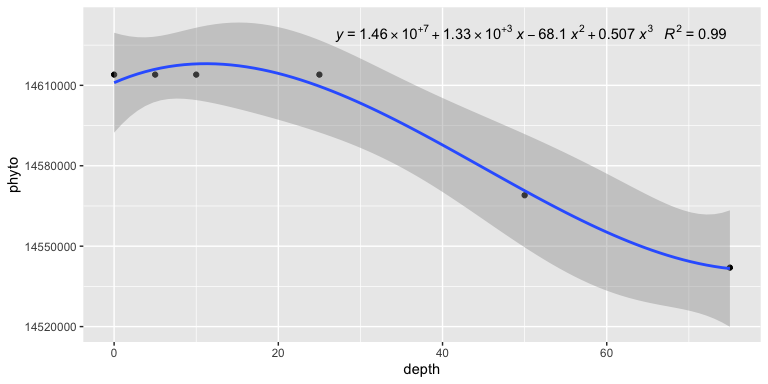<!-- -->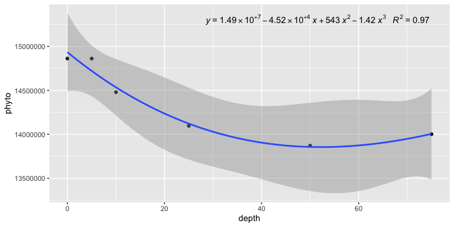<!-- -->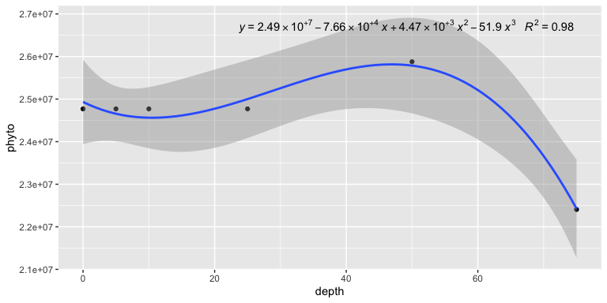<!-- -->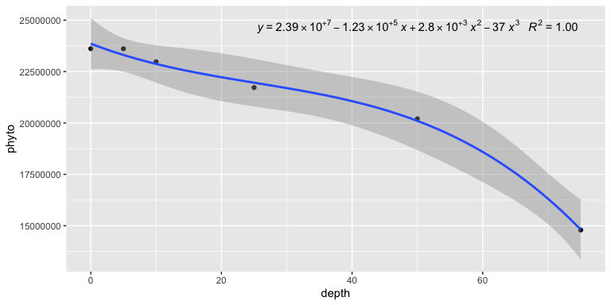<!-- --><!-- -->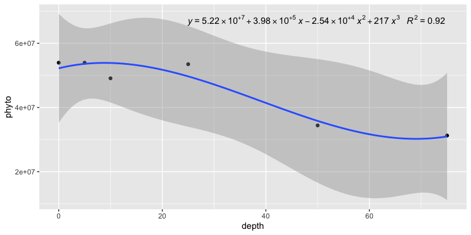<!-- -->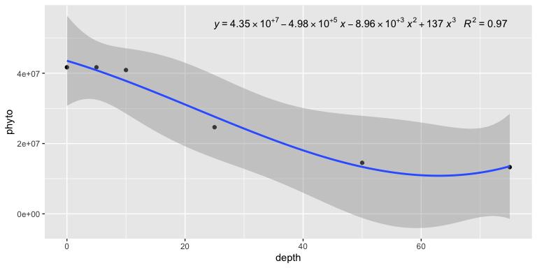<!-- -->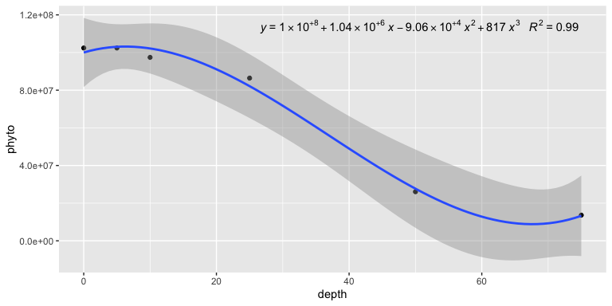<!-- -->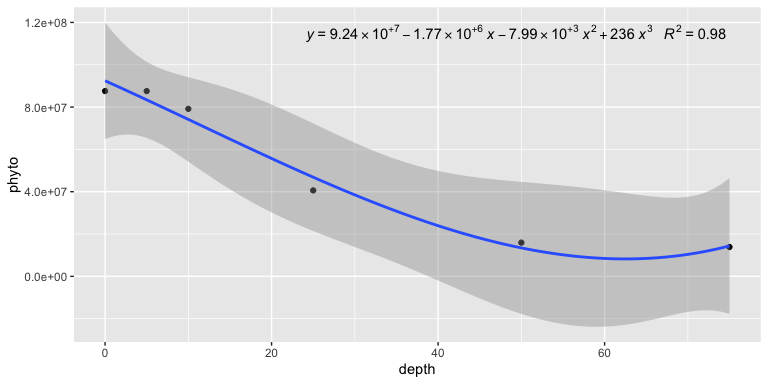<!-- -->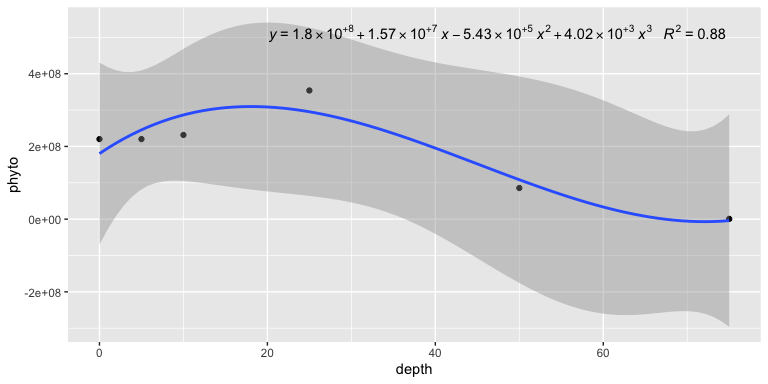<!-- -->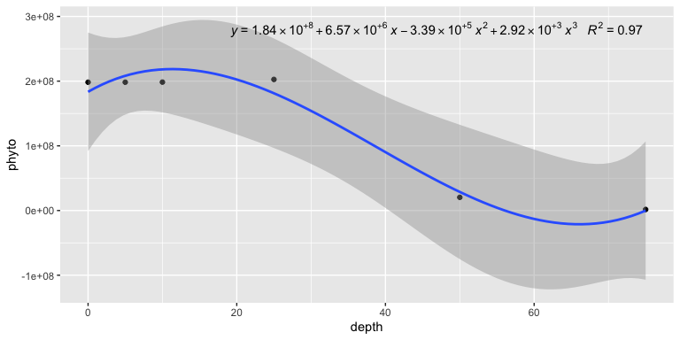<!-- -->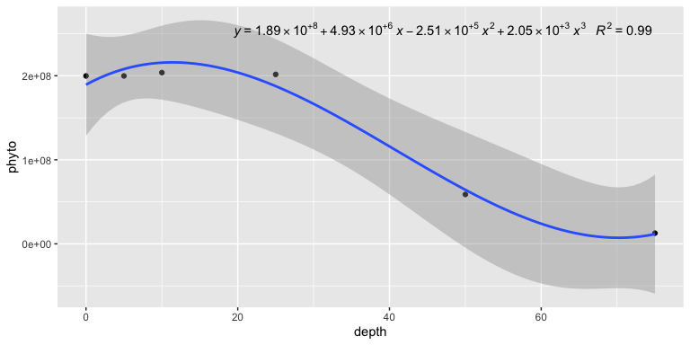<!-- -->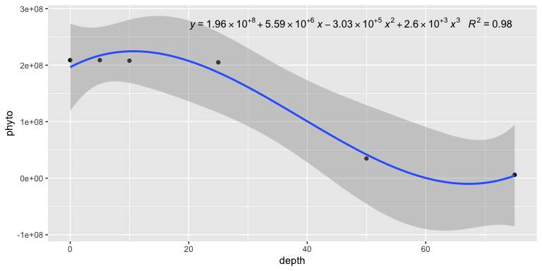<!-- -->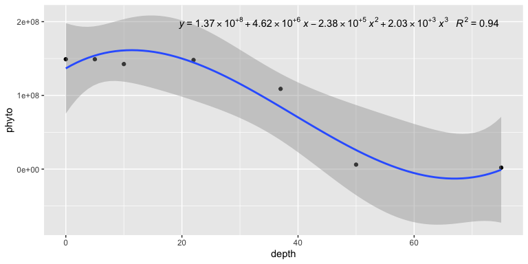<!-- -->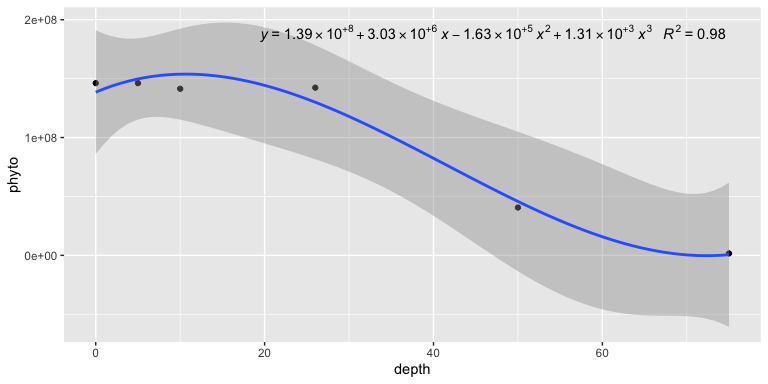<!-- -->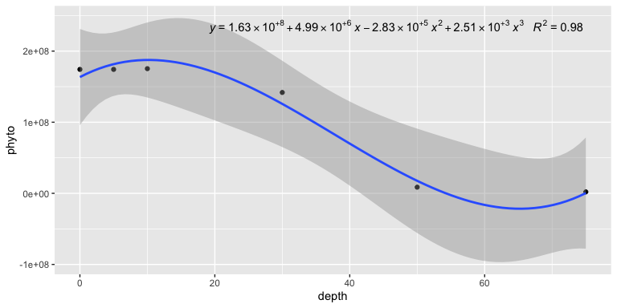<!-- -->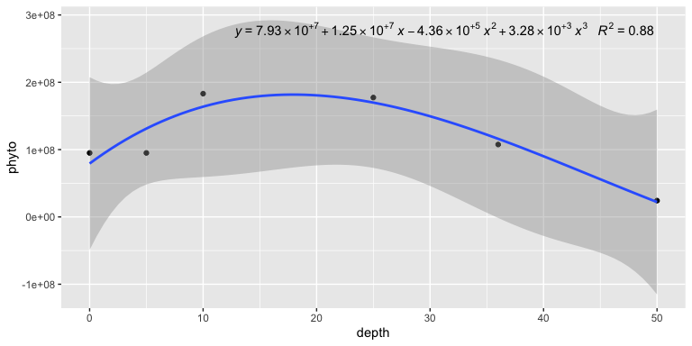<!-- -->

#### mz

``` r
formula <- y ~ poly(x, 2, raw = TRUE)

phyto_mz <- phyto %>% 
  filter(depth > 75 & depth <= 200)


for (var in unique(phyto_mz$plot_date)) {
    print( 
  ggplot(phyto_mz[phyto_mz$plot_date == var,], aes(x = depth, y = phyto)) + 
  facet_grid(~plot_date, scales = "free") +
  geom_point() +
  stat_smooth(method = "lm", formula = formula) +
  stat_poly_eq(formula = formula, aes(label = paste(..eq.label.., ..rr.label.., sep = "~~~")),
                     parse = TRUE,label.x.npc = "right", angle = 0, hjust = 1) 
      )
}
```

    ## Warning in qt((1 - level)/2, df): NaNs produced

    ## Warning in max(ids, na.rm = TRUE): no non-missing arguments to max; returning -
    ## Inf

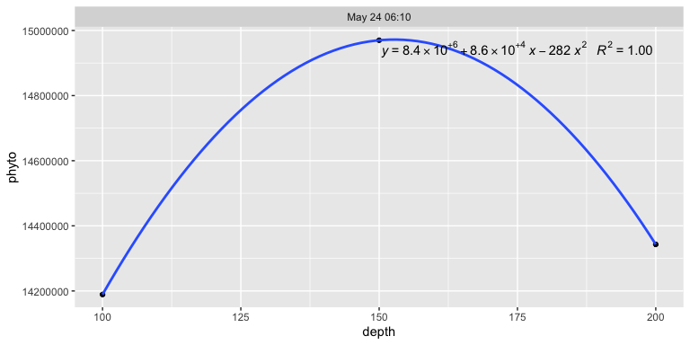<!-- -->

    ## Warning in qt((1 - level)/2, df): NaNs produced
    
    ## Warning in qt((1 - level)/2, df): no non-missing arguments to max; returning -
    ## Inf

<!-- -->

    ## Warning in qt((1 - level)/2, df): NaNs produced
    
    ## Warning in qt((1 - level)/2, df): no non-missing arguments to max; returning -
    ## Inf

<!-- -->

    ## Warning in qt((1 - level)/2, df): NaNs produced
    
    ## Warning in qt((1 - level)/2, df): no non-missing arguments to max; returning -
    ## Inf

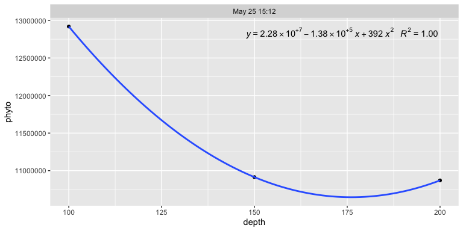<!-- -->

    ## Warning in qt((1 - level)/2, df): NaNs produced
    
    ## Warning in qt((1 - level)/2, df): no non-missing arguments to max; returning -
    ## Inf

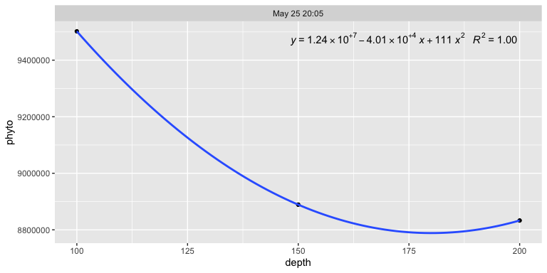<!-- -->

    ## Warning in qt((1 - level)/2, df): NaNs produced
    
    ## Warning in qt((1 - level)/2, df): no non-missing arguments to max; returning -
    ## Inf

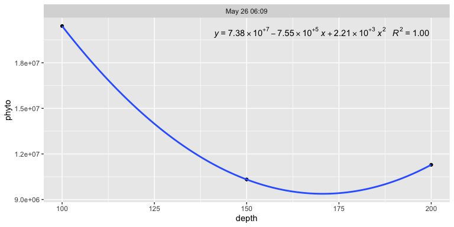<!-- -->

    ## Warning in qt((1 - level)/2, df): NaNs produced
    
    ## Warning in qt((1 - level)/2, df): no non-missing arguments to max; returning -
    ## Inf

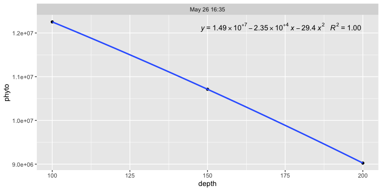<!-- -->

    ## Warning in qt((1 - level)/2, df): NaNs produced
    
    ## Warning in qt((1 - level)/2, df): no non-missing arguments to max; returning -
    ## Inf

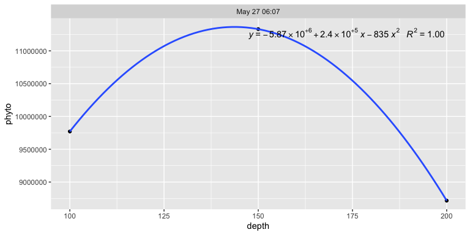<!-- -->

    ## Warning in qt((1 - level)/2, df): NaNs produced
    
    ## Warning in qt((1 - level)/2, df): no non-missing arguments to max; returning -
    ## Inf

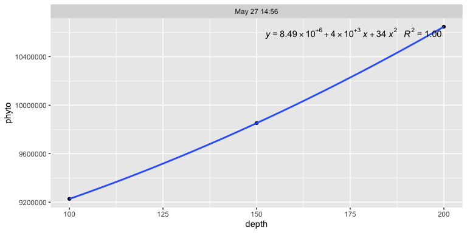<!-- -->

    ## Warning in predict.lm(model, newdata = new_data_frame(list(x = xseq)), se.fit =
    ## se, : prediction from a rank-deficient fit may be misleading

    ## Warning in qt((1 - level)/2, df): NaNs produced

    ## Warning: Computation failed in `stat_poly_eq()`:
    ## missing value where TRUE/FALSE needed

    ## Warning in max(ids, na.rm = TRUE): no non-missing arguments to max; returning -
    ## Inf

<!-- -->

    ## Warning: Not enough data to perform fit for group 1; computing mean instead.

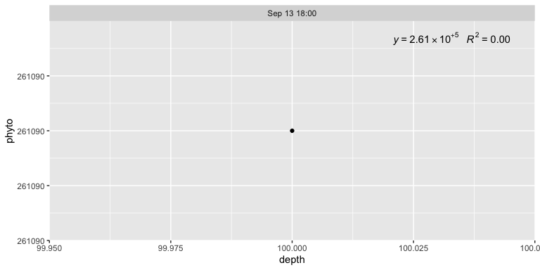<!-- -->

    ## Warning: Not enough data to perform fit for group 1; computing mean instead.

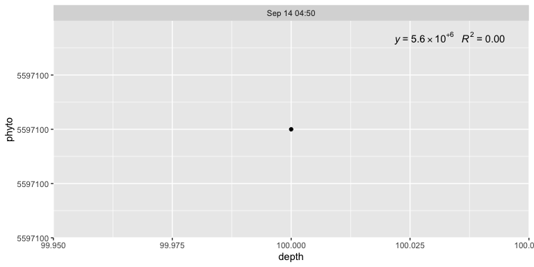<!-- -->

    ## Warning: Not enough data to perform fit for group 1; computing mean instead.

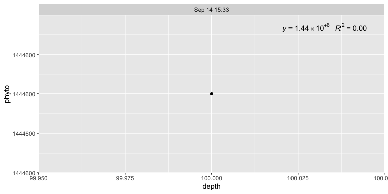<!-- -->

#### calculate error

based on 3rd polynomial fit for ez and 2nd polynomial fit for mz

error = (k(b-a)<sup>2)/12n</sup>2 where: k is found by finding f’’(x) of
the polynomial fit and applying a and/or b for x a = minimum depth in
group b = maximum depth in group n = number of trapezoids

``` r
lm_data_ez <- phyto %>% 
  select(depth, plot_date, phyto) %>% 
  filter(depth < 75)

poly3_coef_ez <- lm_data_ez %>%
  group_by(plot_date) %>%
  do({
    fit = lm(phyto ~ poly(depth, 3, raw = T), .)
    int = fit$coefficients[[1]]
    coef1 = fit$coefficients[[2]]
    coef2 = fit$coefficients[[3]]
    coef3 = fit$coefficients[[4]]
    data.frame(., int, coef1, coef2, coef3)
  }) %>% 
  mutate(coef1_2D = coef2 * 2,
         coef2_2D = (coef3 * 3) * 2) %>% 
  select(plot_date, depth, phyto, contains("2D")) %>% 
  mutate(k = abs(coef1_2D + (coef2_2D * max(depth)) ),
         n = length(depth) - 1,
         err = (k * (max(depth) - min(depth))^3) / (12 * n^2),
         depthNerr = err / (max(depth) - min(depth))) %>% 
  ungroup() %>% 
  select(plot_date, err, depthNerr) %>% 
  rename(err_ez = err, 
         depthNerr_ez = depthNerr) %>% 
  distinct() 
```

``` r
lm_data_mz <- phyto %>% 
  select(depth, plot_date, phyto) %>% 
  filter(depth > 75 & depth <= 200)

poly2_coef_mz <- lm_data_mz %>%
  group_by(plot_date) %>%
  do({
    fit = lm(phyto ~ poly(depth, 2, raw = T), .)
    int = fit$coefficients[[1]]
    coef1 = fit$coefficients[[2]]
    coef2 = fit$coefficients[[3]]
    data.frame(., int, coef1, coef2)
  }) %>% 
  mutate(coef1_2D = coef2 * 2) %>% 
  select(plot_date, depth, phyto, contains("2D")) %>% 
  mutate(k = abs(coef1_2D) ,
         n = length(depth) - 1,
         err = (k * (max(depth) - min(depth))^3) / (12 * n^2),
         depthNerr = err / (max(depth) - min(depth))) %>% 
  ungroup() %>% 
  select(plot_date, err, depthNerr) %>% 
  rename(err_mz = err, 
         depthNerr_mz = depthNerr) %>% 
  distinct() 
```

``` r
int_err_phyto <- int_phyto %>% 
  left_join(., poly3_coef_ez) %>% 
  left_join(., poly2_coef_mz) 
```

    ## Joining, by = "plot_date"
    ## Joining, by = "plot_date"

### chl a, ba, bcd, n, doc, and tdaa

#### ez

``` r
formula <- y ~ poly(x, 3, raw = TRUE)

bf_ez <- bf %>% 
  filter(z <= 75) 

chl_ez <- bf_ez %>% 
  drop_na(chl)
for (var in unique(chl_ez$datetime)) {
    print( 
  ggplot(chl_ez[chl_ez$datetime == var,], aes(x = z, y = chl)) + 
  # facet_grid(~plot_date, scales = "free") +
  geom_point() +
  stat_smooth(method = "lm", formula = formula) +
  stat_poly_eq(formula = formula, aes(label = paste(..eq.label.., ..rr.label.., sep = "~~~")),
                     parse = TRUE,label.x.npc = "right", angle = 0, hjust = 1) 
      )
}
```

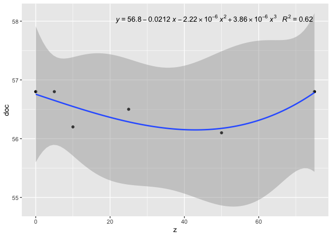<!-- -->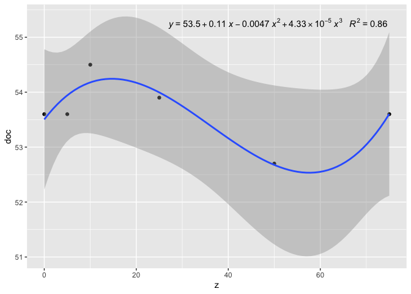<!-- -->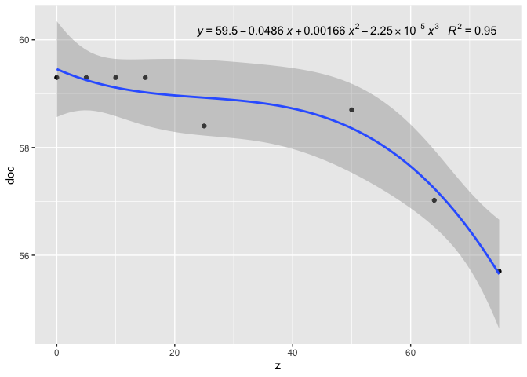<!-- -->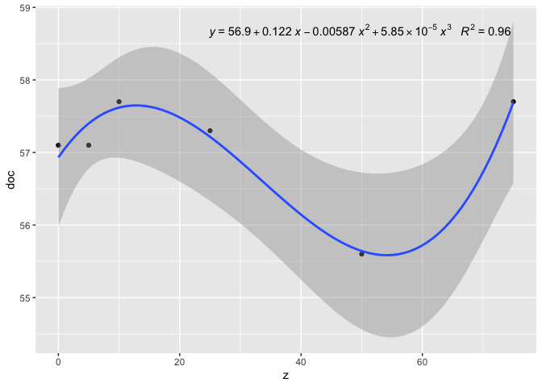<!-- -->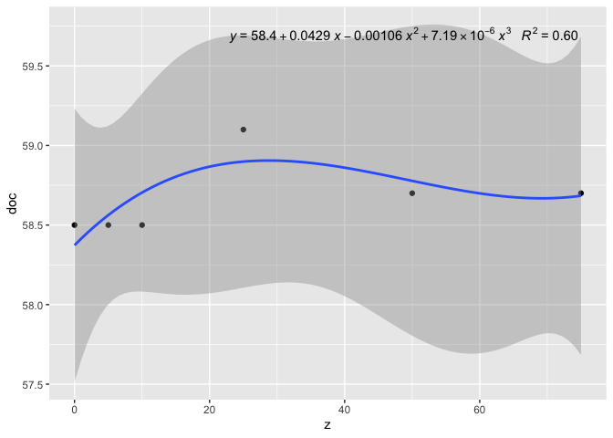<!-- -->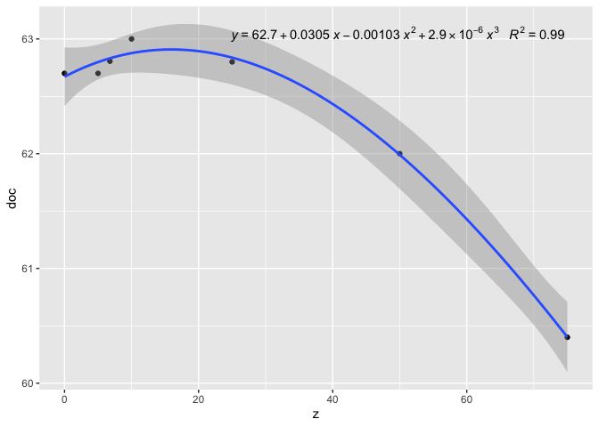<!-- -->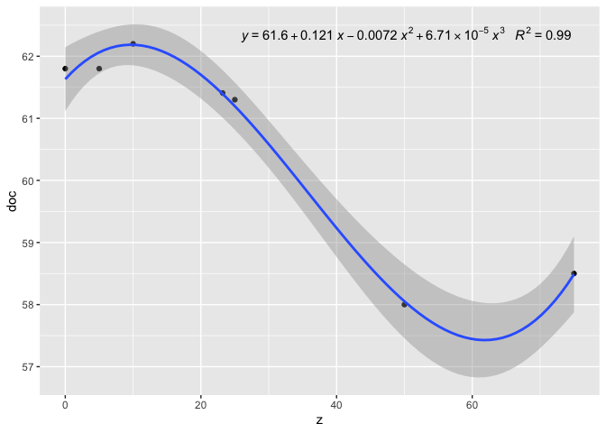<!-- -->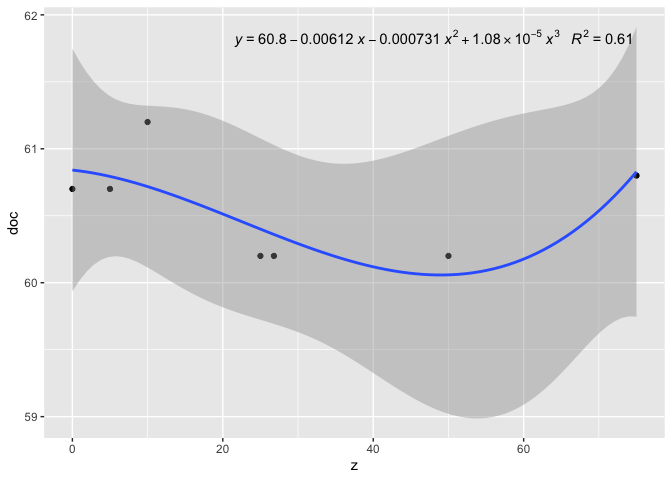<!-- -->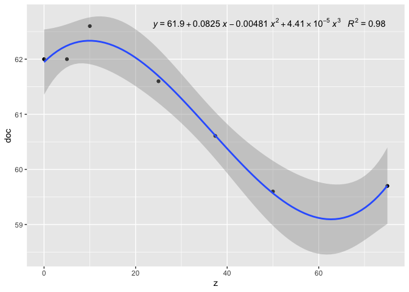<!-- -->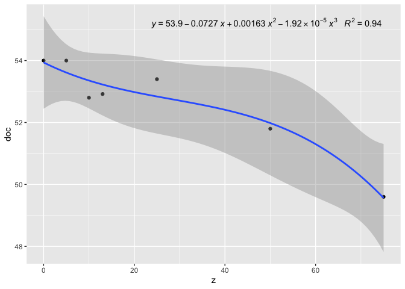<!-- -->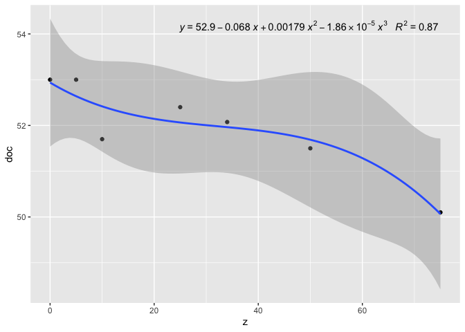<!-- -->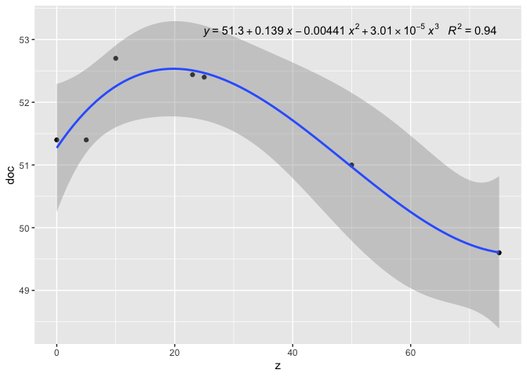<!-- -->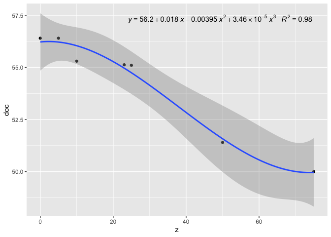<!-- -->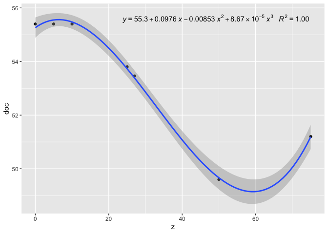<!-- -->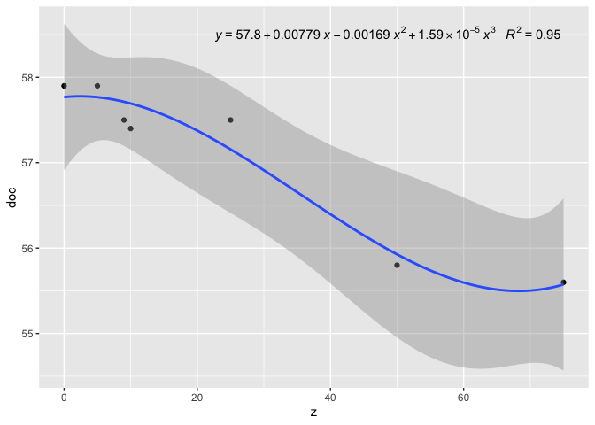<!-- -->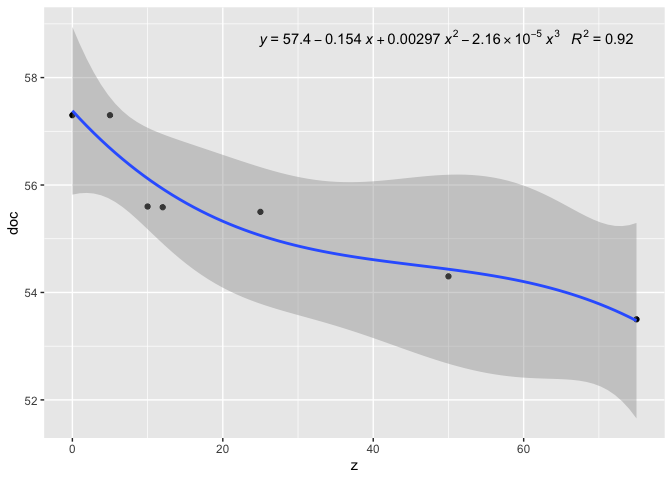<!-- --><!-- -->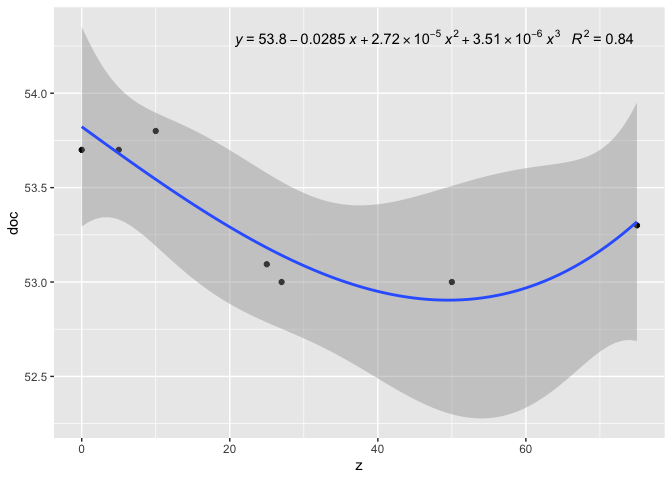<!-- -->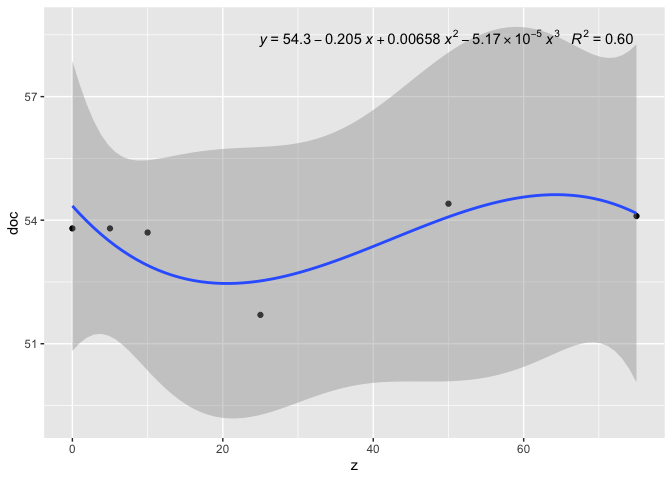<!-- -->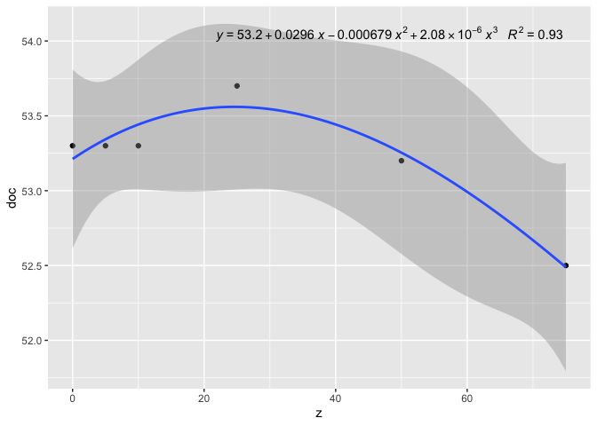<!-- -->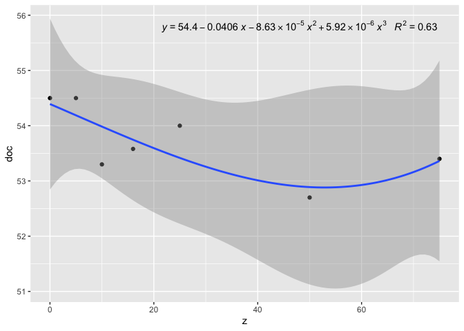<!-- -->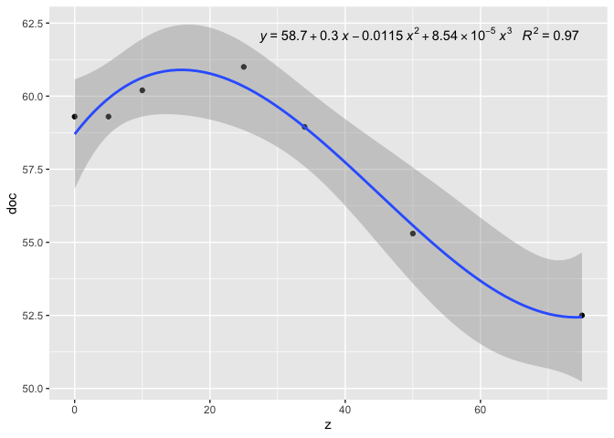<!-- -->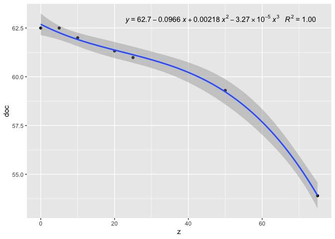<!-- -->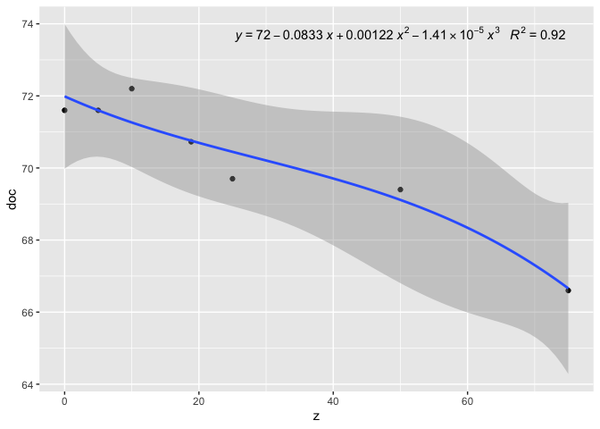<!-- -->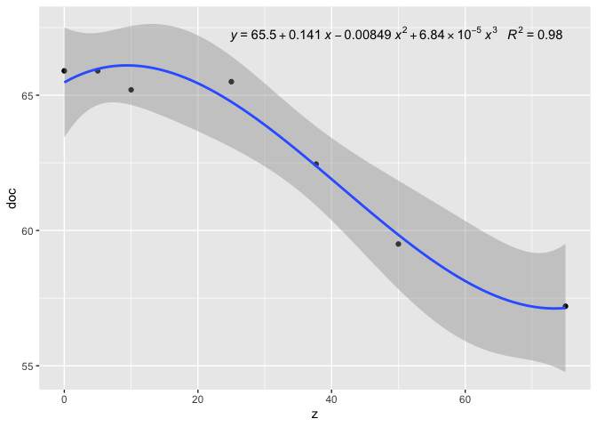<!-- --><!-- --><!-- --><!-- --><!-- -->

``` r
ba_ez <- bf_ez %>% 
  drop_na(ba)
for (var in unique(ba_ez$datetime)) {
    print( 
  ggplot(ba_ez[ba_ez$datetime == var,], aes(x = z, y = ba)) + 
  # facet_grid(~plot_date, scales = "free") +
  geom_point() +
  stat_smooth(method = "lm", formula = formula) +
  stat_poly_eq(formula = formula, aes(label = paste(..eq.label.., ..rr.label.., sep = "~~~")),
                     parse = TRUE,label.x.npc = "right", angle = 0, hjust = 1) 
      )
}
```

<!-- --><!-- --><!-- --><!-- --><!-- --><!-- --><!-- --><!-- --><!-- --><!-- --><!-- --><!-- --><!-- --><!-- --><!-- --><!-- --><!-- --><!-- --><!-- --><!-- --><!-- --><!-- --><!-- --><!-- --><!-- --><!-- --><!-- --><!-- --><!-- --><!-- --><!-- --><!-- --><!-- --><!-- --><!-- --><!-- --><!-- --><!-- --><!-- --><!-- --><!-- -->

``` r
bcd_ez <- bf_ez %>% 
  drop_na(bcd)
for (var in unique(bcd_ez$datetime)) {
    print( 
  ggplot(bcd_ez[bcd_ez$datetime == var,], aes(x = z, y = bcd)) + 
  # facet_grid(~plot_date, scales = "free") +
  geom_point() +
  stat_smooth(method = "lm", formula = formula) +
  stat_poly_eq(formula = formula, aes(label = paste(..eq.label.., ..rr.label.., sep = "~~~")),
                     parse = TRUE,label.x.npc = "right", angle = 0, hjust = 1) 
      )
}
```

<!-- --><!-- --><!-- --><!-- --><!-- --><!-- --><!-- --><!-- --><!-- --><!-- --><!-- --><!-- --><!-- --><!-- -->

``` r
doc_ez <- bf_ez %>% 
  drop_na(doc)
for (var in unique(doc_ez$datetime)) {
    print( 
  ggplot(doc_ez[doc_ez$datetime == var,], aes(x = z, y = doc)) + 
  # facet_grid(~plot_date, scales = "free") +
  geom_point() +
  stat_smooth(method = "lm", formula = formula) +
  stat_poly_eq(formula = formula, aes(label = paste(..eq.label.., ..rr.label.., sep = "~~~")),
                     parse = TRUE,label.x.npc = "right", angle = 0, hjust = 1) 
      )
}
```

<!-- --><!-- --><!-- --><!-- --><!-- --><!-- --><!-- --><!-- --><!-- --><!-- --><!-- --><!-- --><!-- --><!-- --><!-- --><!-- --><!-- --><!-- --><!-- --><!-- --><!-- --><!-- --><!-- --><!-- --><!-- --><!-- --><!-- --><!-- --><!-- --><!-- --><!-- --><!-- --><!-- --><!-- --><!-- --><!-- --><!-- --><!-- --><!-- --><!-- --><!-- --><!-- --><!-- --><!-- --><!-- --><!-- --><!-- --><!-- --><!-- -->

``` r
n_ez <- bf_ez %>% 
  drop_na(n)
for (var in unique(n_ez$datetime)) {
    print( 
  ggplot(n_ez[n_ez$datetime == var,], aes(x = z, y = n)) + 
  # facet_grid(~plot_date, scales = "free") +
  geom_point() +
  stat_smooth(method = "lm", formula = formula) +
  stat_poly_eq(formula = formula, aes(label = paste(..eq.label.., ..rr.label.., sep = "~~~")),
                     parse = TRUE,label.x.npc = "right", angle = 0, hjust = 1) 
      )
}
```

<!-- --><!-- --><!-- --><!-- --><!-- --><!-- --><!-- --><!-- --><!-- --><!-- --><!-- --><!-- --><!-- --><!-- --><!-- --><!-- --><!-- --><!-- --><!-- --><!-- --><!-- --><!-- --><!-- --><!-- --><!-- --><!-- --><!-- --><!-- --><!-- --><!-- --><!-- --><!-- --><!-- --><!-- --><!-- --><!-- --><!-- --><!-- --><!-- --><!-- --><!-- --><!-- --><!-- -->

``` r
tdaa_ez <- bf_ez %>% 
  drop_na(tdaa)
for (var in unique(tdaa_ez$datetime)) {
    print( 
  ggplot(tdaa_ez[tdaa_ez$datetime == var,], aes(x = z, y = tdaa)) + 
  # facet_grid(~plot_date, scales = "free") +
  geom_point() +
  stat_smooth(method = "lm", formula = formula) +
  stat_poly_eq(formula = formula, aes(label = paste(..eq.label.., ..rr.label.., sep = "~~~")),
                     parse = TRUE,label.x.npc = "right", angle = 0, hjust = 1) 
      )
}
```

<!-- --><!-- --><!-- -->

    ## Warning in predict.lm(model, newdata = new_data_frame(list(x = xseq)), se.fit =
    ## se, : prediction from a rank-deficient fit may be misleading

    ## Warning in qt((1 - level)/2, df): NaNs produced

    ## Warning: Computation failed in `stat_poly_eq()`:
    ## missing value where TRUE/FALSE needed

    ## Warning in max(ids, na.rm = TRUE): no non-missing arguments to max; returning -
    ## Inf

<!-- -->

    ## Warning in predict.lm(model, newdata = new_data_frame(list(x = xseq)), se.fit =
    ## se, : prediction from a rank-deficient fit may be misleading

    ## Warning in qt((1 - level)/2, df): NaNs produced

    ## Warning: Computation failed in `stat_poly_eq()`:
    ## missing value where TRUE/FALSE needed

    ## Warning in max(ids, na.rm = TRUE): no non-missing arguments to max; returning -
    ## Inf

<!-- -->

    ## Warning in predict.lm(model, newdata = new_data_frame(list(x = xseq)), se.fit =
    ## se, : prediction from a rank-deficient fit may be misleading

    ## Warning in qt((1 - level)/2, df): NaNs produced

    ## Warning: Computation failed in `stat_poly_eq()`:
    ## missing value where TRUE/FALSE needed

    ## Warning in max(ids, na.rm = TRUE): no non-missing arguments to max; returning -
    ## Inf

<!-- -->

    ## Warning in predict.lm(model, newdata = new_data_frame(list(x = xseq)), se.fit =
    ## se, : prediction from a rank-deficient fit may be misleading

    ## Warning in qt((1 - level)/2, df): NaNs produced

    ## Warning: Computation failed in `stat_poly_eq()`:
    ## missing value where TRUE/FALSE needed

    ## Warning in max(ids, na.rm = TRUE): no non-missing arguments to max; returning -
    ## Inf

<!-- -->

    ## Warning in predict.lm(model, newdata = new_data_frame(list(x = xseq)), se.fit =
    ## se, : prediction from a rank-deficient fit may be misleading

    ## Warning in qt((1 - level)/2, df): NaNs produced

    ## Warning: Computation failed in `stat_poly_eq()`:
    ## missing value where TRUE/FALSE needed

    ## Warning in max(ids, na.rm = TRUE): no non-missing arguments to max; returning -
    ## Inf

<!-- -->

    ## Warning in predict.lm(model, newdata = new_data_frame(list(x = xseq)), se.fit =
    ## se, : prediction from a rank-deficient fit may be misleading

    ## Warning in qt((1 - level)/2, df): NaNs produced

    ## Warning: Computation failed in `stat_poly_eq()`:
    ## missing value where TRUE/FALSE needed

    ## Warning in max(ids, na.rm = TRUE): no non-missing arguments to max; returning -
    ## Inf

<!-- -->

    ## Warning in predict.lm(model, newdata = new_data_frame(list(x = xseq)), se.fit =
    ## se, : prediction from a rank-deficient fit may be misleading

    ## Warning in qt((1 - level)/2, df): NaNs produced

    ## Warning: Computation failed in `stat_poly_eq()`:
    ## missing value where TRUE/FALSE needed

    ## Warning in max(ids, na.rm = TRUE): no non-missing arguments to max; returning -
    ## Inf

<!-- -->

    ## Warning in predict.lm(model, newdata = new_data_frame(list(x = xseq)), se.fit =
    ## se, : prediction from a rank-deficient fit may be misleading

    ## Warning in qt((1 - level)/2, df): NaNs produced

    ## Warning: Computation failed in `stat_poly_eq()`:
    ## missing value where TRUE/FALSE needed

    ## Warning in max(ids, na.rm = TRUE): no non-missing arguments to max; returning -
    ## Inf

<!-- -->

    ## Warning in predict.lm(model, newdata = new_data_frame(list(x = xseq)), se.fit =
    ## se, : prediction from a rank-deficient fit may be misleading

    ## Warning in qt((1 - level)/2, df): NaNs produced

    ## Warning: Computation failed in `stat_poly_eq()`:
    ## missing value where TRUE/FALSE needed

    ## Warning in max(ids, na.rm = TRUE): no non-missing arguments to max; returning -
    ## Inf

<!-- -->

    ## Warning in predict.lm(model, newdata = new_data_frame(list(x = xseq)), se.fit =
    ## se, : prediction from a rank-deficient fit may be misleading

    ## Warning in qt((1 - level)/2, df): NaNs produced

    ## Warning: Computation failed in `stat_poly_eq()`:
    ## missing value where TRUE/FALSE needed

    ## Warning in max(ids, na.rm = TRUE): no non-missing arguments to max; returning -
    ## Inf

<!-- -->

#### mz

``` r
formula <- y ~ poly(x, 2, raw = TRUE)

bf_mz <- bf %>% 
  filter(z > 75 & z <= 200)

chl_mz <- bf_mz %>% 
  drop_na(chl)
for (var in unique(chl_mz$datetime)) {
    print( 
  ggplot(chl_mz[chl_mz$datetime == var,], aes(x = z, y = chl)) + 
  # facet_grid(~plot_date, scales = "free") +
  geom_point() +
  stat_smooth(method = "lm", formula = formula) +
  stat_poly_eq(formula = formula, aes(label = paste(..eq.label.., ..rr.label.., sep = "~~~")),
                     parse = TRUE,label.x.npc = "right", angle = 0, hjust = 1) 
      )
}
```

<!-- --><!-- -->

    ## Warning in qt((1 - level)/2, df): NaNs produced

    ## Warning in max(ids, na.rm = TRUE): no non-missing arguments to max; returning -
    ## Inf

<!-- --><!-- --><!-- -->

    ## Warning in qt((1 - level)/2, df): NaNs produced
    
    ## Warning in qt((1 - level)/2, df): no non-missing arguments to max; returning -
    ## Inf

<!-- -->

    ## Warning in qt((1 - level)/2, df): NaNs produced
    
    ## Warning in qt((1 - level)/2, df): no non-missing arguments to max; returning -
    ## Inf

<!-- -->

    ## Warning in qt((1 - level)/2, df): NaNs produced
    
    ## Warning in qt((1 - level)/2, df): no non-missing arguments to max; returning -
    ## Inf

<!-- -->

    ## Warning in qt((1 - level)/2, df): NaNs produced
    
    ## Warning in qt((1 - level)/2, df): no non-missing arguments to max; returning -
    ## Inf

<!-- -->

    ## Warning in qt((1 - level)/2, df): NaNs produced
    
    ## Warning in qt((1 - level)/2, df): no non-missing arguments to max; returning -
    ## Inf

<!-- --><!-- -->

    ## Warning in qt((1 - level)/2, df): NaNs produced
    
    ## Warning in qt((1 - level)/2, df): no non-missing arguments to max; returning -
    ## Inf

<!-- -->

    ## Warning in qt((1 - level)/2, df): NaNs produced
    
    ## Warning in qt((1 - level)/2, df): no non-missing arguments to max; returning -
    ## Inf

<!-- -->

    ## Warning in qt((1 - level)/2, df): NaNs produced
    
    ## Warning in qt((1 - level)/2, df): no non-missing arguments to max; returning -
    ## Inf

<!-- -->

    ## Warning in qt((1 - level)/2, df): NaNs produced
    
    ## Warning in qt((1 - level)/2, df): no non-missing arguments to max; returning -
    ## Inf

<!-- -->

    ## Warning in qt((1 - level)/2, df): NaNs produced
    
    ## Warning in qt((1 - level)/2, df): no non-missing arguments to max; returning -
    ## Inf

<!-- -->

    ## Warning in qt((1 - level)/2, df): NaNs produced
    
    ## Warning in qt((1 - level)/2, df): no non-missing arguments to max; returning -
    ## Inf

<!-- -->

    ## Warning in qt((1 - level)/2, df): NaNs produced
    
    ## Warning in qt((1 - level)/2, df): no non-missing arguments to max; returning -
    ## Inf

<!-- -->

    ## Warning in qt((1 - level)/2, df): NaNs produced
    
    ## Warning in qt((1 - level)/2, df): no non-missing arguments to max; returning -
    ## Inf

<!-- -->

    ## Warning in qt((1 - level)/2, df): NaNs produced
    
    ## Warning in qt((1 - level)/2, df): no non-missing arguments to max; returning -
    ## Inf

<!-- -->

    ## Warning in qt((1 - level)/2, df): NaNs produced
    
    ## Warning in qt((1 - level)/2, df): no non-missing arguments to max; returning -
    ## Inf

<!-- -->

    ## Warning in qt((1 - level)/2, df): NaNs produced
    
    ## Warning in qt((1 - level)/2, df): no non-missing arguments to max; returning -
    ## Inf

<!-- -->

    ## Warning in qt((1 - level)/2, df): NaNs produced
    
    ## Warning in qt((1 - level)/2, df): no non-missing arguments to max; returning -
    ## Inf

<!-- -->

    ## Warning in qt((1 - level)/2, df): NaNs produced
    
    ## Warning in qt((1 - level)/2, df): no non-missing arguments to max; returning -
    ## Inf

<!-- -->

    ## Warning in qt((1 - level)/2, df): NaNs produced
    
    ## Warning in qt((1 - level)/2, df): no non-missing arguments to max; returning -
    ## Inf

<!-- -->

    ## Warning in qt((1 - level)/2, df): NaNs produced
    
    ## Warning in qt((1 - level)/2, df): no non-missing arguments to max; returning -
    ## Inf

<!-- -->

    ## Warning in qt((1 - level)/2, df): NaNs produced
    
    ## Warning in qt((1 - level)/2, df): no non-missing arguments to max; returning -
    ## Inf

<!-- --><!-- -->

    ## Warning in qt((1 - level)/2, df): NaNs produced
    
    ## Warning in qt((1 - level)/2, df): no non-missing arguments to max; returning -
    ## Inf

<!-- -->

``` r
ba_mz <- bf_mz %>% 
  drop_na(ba)
for (var in unique(ba_mz$datetime)) {
    print( 
  ggplot(ba_mz[ba_mz$datetime == var,], aes(x = z, y = ba)) + 
  # facet_grid(~plot_date, scales = "free") +
  geom_point() +
  stat_smooth(method = "lm", formula = formula) +
  stat_poly_eq(formula = formula, aes(label = paste(..eq.label.., ..rr.label.., sep = "~~~")),
                     parse = TRUE,label.x.npc = "right", angle = 0, hjust = 1) 
      )
}
```

<!-- --><!-- -->

    ## Warning in qt((1 - level)/2, df): NaNs produced

    ## Warning in max(ids, na.rm = TRUE): no non-missing arguments to max; returning -
    ## Inf

<!-- --><!-- --><!-- -->

    ## Warning in qt((1 - level)/2, df): NaNs produced
    
    ## Warning in qt((1 - level)/2, df): no non-missing arguments to max; returning -
    ## Inf

<!-- -->

    ## Warning in qt((1 - level)/2, df): NaNs produced
    
    ## Warning in qt((1 - level)/2, df): no non-missing arguments to max; returning -
    ## Inf

<!-- -->

    ## Warning in qt((1 - level)/2, df): NaNs produced
    
    ## Warning in qt((1 - level)/2, df): no non-missing arguments to max; returning -
    ## Inf

<!-- -->

    ## Warning in qt((1 - level)/2, df): NaNs produced
    
    ## Warning in qt((1 - level)/2, df): no non-missing arguments to max; returning -
    ## Inf

<!-- -->

    ## Warning in qt((1 - level)/2, df): NaNs produced
    
    ## Warning in qt((1 - level)/2, df): no non-missing arguments to max; returning -
    ## Inf

<!-- --><!-- -->

    ## Warning in qt((1 - level)/2, df): NaNs produced
    
    ## Warning in qt((1 - level)/2, df): no non-missing arguments to max; returning -
    ## Inf

<!-- -->

    ## Warning in qt((1 - level)/2, df): NaNs produced
    
    ## Warning in qt((1 - level)/2, df): no non-missing arguments to max; returning -
    ## Inf

<!-- -->

    ## Warning in qt((1 - level)/2, df): NaNs produced
    
    ## Warning in qt((1 - level)/2, df): no non-missing arguments to max; returning -
    ## Inf

<!-- -->

    ## Warning in qt((1 - level)/2, df): NaNs produced
    
    ## Warning in qt((1 - level)/2, df): no non-missing arguments to max; returning -
    ## Inf

<!-- -->

    ## Warning in qt((1 - level)/2, df): NaNs produced
    
    ## Warning in qt((1 - level)/2, df): no non-missing arguments to max; returning -
    ## Inf

<!-- -->

    ## Warning in qt((1 - level)/2, df): NaNs produced
    
    ## Warning in qt((1 - level)/2, df): no non-missing arguments to max; returning -
    ## Inf

<!-- -->

    ## Warning in qt((1 - level)/2, df): NaNs produced
    
    ## Warning in qt((1 - level)/2, df): no non-missing arguments to max; returning -
    ## Inf

<!-- -->

    ## Warning in qt((1 - level)/2, df): NaNs produced
    
    ## Warning in qt((1 - level)/2, df): no non-missing arguments to max; returning -
    ## Inf

<!-- -->

    ## Warning in qt((1 - level)/2, df): NaNs produced
    
    ## Warning in qt((1 - level)/2, df): no non-missing arguments to max; returning -
    ## Inf

<!-- -->

    ## Warning in qt((1 - level)/2, df): NaNs produced
    
    ## Warning in qt((1 - level)/2, df): no non-missing arguments to max; returning -
    ## Inf

<!-- -->

    ## Warning in qt((1 - level)/2, df): NaNs produced
    
    ## Warning in qt((1 - level)/2, df): no non-missing arguments to max; returning -
    ## Inf

<!-- -->

    ## Warning in qt((1 - level)/2, df): NaNs produced
    
    ## Warning in qt((1 - level)/2, df): no non-missing arguments to max; returning -
    ## Inf

<!-- -->

    ## Warning in qt((1 - level)/2, df): NaNs produced
    
    ## Warning in qt((1 - level)/2, df): no non-missing arguments to max; returning -
    ## Inf

<!-- -->

    ## Warning in qt((1 - level)/2, df): NaNs produced
    
    ## Warning in qt((1 - level)/2, df): no non-missing arguments to max; returning -
    ## Inf

<!-- -->

    ## Warning in qt((1 - level)/2, df): NaNs produced
    
    ## Warning in qt((1 - level)/2, df): no non-missing arguments to max; returning -
    ## Inf

<!-- -->

    ## Warning in qt((1 - level)/2, df): NaNs produced
    
    ## Warning in qt((1 - level)/2, df): no non-missing arguments to max; returning -
    ## Inf

<!-- -->

    ## Warning in qt((1 - level)/2, df): NaNs produced
    
    ## Warning in qt((1 - level)/2, df): no non-missing arguments to max; returning -
    ## Inf

<!-- -->

    ## Warning in qt((1 - level)/2, df): NaNs produced
    
    ## Warning in qt((1 - level)/2, df): no non-missing arguments to max; returning -
    ## Inf

<!-- -->

    ## Warning in qt((1 - level)/2, df): NaNs produced
    
    ## Warning in qt((1 - level)/2, df): no non-missing arguments to max; returning -
    ## Inf

<!-- -->

    ## Warning in qt((1 - level)/2, df): NaNs produced
    
    ## Warning in qt((1 - level)/2, df): no non-missing arguments to max; returning -
    ## Inf

<!-- -->

    ## Warning in predict.lm(model, newdata = new_data_frame(list(x = xseq)), se.fit =
    ## se, : prediction from a rank-deficient fit may be misleading

    ## Warning in qt((1 - level)/2, df): NaNs produced

    ## Warning: Computation failed in `stat_poly_eq()`:
    ## missing value where TRUE/FALSE needed

    ## Warning in max(ids, na.rm = TRUE): no non-missing arguments to max; returning -
    ## Inf

<!-- -->

    ## Warning in qt((1 - level)/2, df): NaNs produced
    
    ## Warning in qt((1 - level)/2, df): no non-missing arguments to max; returning -
    ## Inf

<!-- --><!-- --><!-- -->

    ## Warning in qt((1 - level)/2, df): NaNs produced
    
    ## Warning in qt((1 - level)/2, df): no non-missing arguments to max; returning -
    ## Inf

<!-- -->

    ## Warning in qt((1 - level)/2, df): NaNs produced
    
    ## Warning in qt((1 - level)/2, df): no non-missing arguments to max; returning -
    ## Inf

<!-- -->

    ## Warning in qt((1 - level)/2, df): NaNs produced
    
    ## Warning in qt((1 - level)/2, df): no non-missing arguments to max; returning -
    ## Inf

<!-- --><!-- -->

``` r
bcd_mz <- bf_mz %>% 
  drop_na(bcd)
for (var in unique(bcd_mz$datetime)) {
    print( 
  ggplot(bcd_mz[bcd_mz$datetime == var,], aes(x = z, y = bcd)) + 
  # facet_grid(~plot_date, scales = "free") +
  geom_point() +
  stat_smooth(method = "lm", formula = formula) +
  stat_poly_eq(formula = formula, aes(label = paste(..eq.label.., ..rr.label.., sep = "~~~")),
                     parse = TRUE,label.x.npc = "right", angle = 0, hjust = 1) 
      )
}
```

    ## Warning in qt((1 - level)/2, df): NaNs produced

    ## Warning in max(ids, na.rm = TRUE): no non-missing arguments to max; returning -
    ## Inf

<!-- -->

    ## Warning in qt((1 - level)/2, df): NaNs produced
    
    ## Warning in qt((1 - level)/2, df): no non-missing arguments to max; returning -
    ## Inf

<!-- -->

    ## Warning in qt((1 - level)/2, df): NaNs produced
    
    ## Warning in qt((1 - level)/2, df): no non-missing arguments to max; returning -
    ## Inf

<!-- -->

    ## Warning in qt((1 - level)/2, df): NaNs produced
    
    ## Warning in qt((1 - level)/2, df): no non-missing arguments to max; returning -
    ## Inf

<!-- -->

    ## Warning in qt((1 - level)/2, df): NaNs produced
    
    ## Warning in qt((1 - level)/2, df): no non-missing arguments to max; returning -
    ## Inf

<!-- -->

    ## Warning in qt((1 - level)/2, df): NaNs produced
    
    ## Warning in qt((1 - level)/2, df): no non-missing arguments to max; returning -
    ## Inf

<!-- -->

    ## Warning in qt((1 - level)/2, df): NaNs produced
    
    ## Warning in qt((1 - level)/2, df): no non-missing arguments to max; returning -
    ## Inf

<!-- -->

    ## Warning in qt((1 - level)/2, df): NaNs produced
    
    ## Warning in qt((1 - level)/2, df): no non-missing arguments to max; returning -
    ## Inf

<!-- -->

    ## Warning in qt((1 - level)/2, df): NaNs produced
    
    ## Warning in qt((1 - level)/2, df): no non-missing arguments to max; returning -
    ## Inf

<!-- -->

    ## Warning in qt((1 - level)/2, df): NaNs produced
    
    ## Warning in qt((1 - level)/2, df): no non-missing arguments to max; returning -
    ## Inf

<!-- -->

    ## Warning in qt((1 - level)/2, df): NaNs produced
    
    ## Warning in qt((1 - level)/2, df): no non-missing arguments to max; returning -
    ## Inf

<!-- -->

    ## Warning in qt((1 - level)/2, df): NaNs produced
    
    ## Warning in qt((1 - level)/2, df): no non-missing arguments to max; returning -
    ## Inf

<!-- -->

    ## Warning in qt((1 - level)/2, df): NaNs produced
    
    ## Warning in qt((1 - level)/2, df): no non-missing arguments to max; returning -
    ## Inf

<!-- -->

    ## Warning in qt((1 - level)/2, df): NaNs produced
    
    ## Warning in qt((1 - level)/2, df): no non-missing arguments to max; returning -
    ## Inf

<!-- -->

``` r
doc_mz <- bf_mz %>% 
  drop_na(doc)
for (var in unique(doc_mz$datetime)) {
    print( 
  ggplot(doc_mz[doc_mz$datetime == var,], aes(x = z, y = doc)) + 
  # facet_grid(~plot_date, scales = "free") +
  geom_point() +
  stat_smooth(method = "lm", formula = formula) +
  stat_poly_eq(formula = formula, aes(label = paste(..eq.label.., ..rr.label.., sep = "~~~")),
                     parse = TRUE,label.x.npc = "right", angle = 0, hjust = 1) 
      )
}
```

<!-- --><!-- -->

    ## Warning in qt((1 - level)/2, df): NaNs produced

    ## Warning in max(ids, na.rm = TRUE): no non-missing arguments to max; returning -
    ## Inf

<!-- --><!-- --><!-- -->

    ## Warning in qt((1 - level)/2, df): NaNs produced
    
    ## Warning in qt((1 - level)/2, df): no non-missing arguments to max; returning -
    ## Inf

<!-- -->

    ## Warning in qt((1 - level)/2, df): NaNs produced
    
    ## Warning in qt((1 - level)/2, df): no non-missing arguments to max; returning -
    ## Inf

<!-- -->

    ## Warning in qt((1 - level)/2, df): NaNs produced
    
    ## Warning in qt((1 - level)/2, df): no non-missing arguments to max; returning -
    ## Inf

<!-- -->

    ## Warning in qt((1 - level)/2, df): NaNs produced
    
    ## Warning in qt((1 - level)/2, df): no non-missing arguments to max; returning -
    ## Inf

<!-- -->

    ## Warning in qt((1 - level)/2, df): NaNs produced
    
    ## Warning in qt((1 - level)/2, df): no non-missing arguments to max; returning -
    ## Inf

<!-- --><!-- --><!-- -->

    ## Warning in qt((1 - level)/2, df): NaNs produced
    
    ## Warning in qt((1 - level)/2, df): no non-missing arguments to max; returning -
    ## Inf

<!-- -->

    ## Warning in qt((1 - level)/2, df): NaNs produced
    
    ## Warning in qt((1 - level)/2, df): no non-missing arguments to max; returning -
    ## Inf

<!-- -->

    ## Warning in qt((1 - level)/2, df): NaNs produced
    
    ## Warning in qt((1 - level)/2, df): no non-missing arguments to max; returning -
    ## Inf

<!-- -->

    ## Warning in qt((1 - level)/2, df): NaNs produced
    
    ## Warning in qt((1 - level)/2, df): no non-missing arguments to max; returning -
    ## Inf

<!-- -->

    ## Warning in qt((1 - level)/2, df): NaNs produced
    
    ## Warning in qt((1 - level)/2, df): no non-missing arguments to max; returning -
    ## Inf

<!-- -->

    ## Warning in qt((1 - level)/2, df): NaNs produced
    
    ## Warning in qt((1 - level)/2, df): no non-missing arguments to max; returning -
    ## Inf

<!-- -->

    ## Warning in qt((1 - level)/2, df): NaNs produced
    
    ## Warning in qt((1 - level)/2, df): no non-missing arguments to max; returning -
    ## Inf

<!-- -->

    ## Warning in qt((1 - level)/2, df): NaNs produced
    
    ## Warning in qt((1 - level)/2, df): no non-missing arguments to max; returning -
    ## Inf

<!-- -->

    ## Warning in qt((1 - level)/2, df): NaNs produced
    
    ## Warning in qt((1 - level)/2, df): no non-missing arguments to max; returning -
    ## Inf

<!-- -->

    ## Warning in qt((1 - level)/2, df): NaNs produced
    
    ## Warning in qt((1 - level)/2, df): no non-missing arguments to max; returning -
    ## Inf

<!-- -->

    ## Warning in qt((1 - level)/2, df): NaNs produced
    
    ## Warning in qt((1 - level)/2, df): no non-missing arguments to max; returning -
    ## Inf

<!-- -->

    ## Warning in qt((1 - level)/2, df): NaNs produced
    
    ## Warning in qt((1 - level)/2, df): no non-missing arguments to max; returning -
    ## Inf

<!-- -->

    ## Warning in qt((1 - level)/2, df): NaNs produced
    
    ## Warning in qt((1 - level)/2, df): no non-missing arguments to max; returning -
    ## Inf

<!-- -->

    ## Warning in qt((1 - level)/2, df): NaNs produced
    
    ## Warning in qt((1 - level)/2, df): no non-missing arguments to max; returning -
    ## Inf

<!-- -->

    ## Warning in qt((1 - level)/2, df): NaNs produced
    
    ## Warning in qt((1 - level)/2, df): no non-missing arguments to max; returning -
    ## Inf

<!-- -->

    ## Warning in qt((1 - level)/2, df): NaNs produced
    
    ## Warning in qt((1 - level)/2, df): no non-missing arguments to max; returning -
    ## Inf

<!-- -->

    ## Warning in qt((1 - level)/2, df): NaNs produced
    
    ## Warning in qt((1 - level)/2, df): no non-missing arguments to max; returning -
    ## Inf

<!-- -->

    ## Warning in qt((1 - level)/2, df): NaNs produced
    
    ## Warning in qt((1 - level)/2, df): no non-missing arguments to max; returning -
    ## Inf

<!-- -->

    ## Warning in qt((1 - level)/2, df): NaNs produced
    
    ## Warning in qt((1 - level)/2, df): no non-missing arguments to max; returning -
    ## Inf

<!-- -->

    ## Warning in qt((1 - level)/2, df): NaNs produced
    
    ## Warning in qt((1 - level)/2, df): no non-missing arguments to max; returning -
    ## Inf

<!-- -->

    ## Warning in qt((1 - level)/2, df): NaNs produced
    
    ## Warning in qt((1 - level)/2, df): no non-missing arguments to max; returning -
    ## Inf

<!-- -->

    ## Warning in qt((1 - level)/2, df): NaNs produced
    
    ## Warning in qt((1 - level)/2, df): no non-missing arguments to max; returning -
    ## Inf

<!-- -->

    ## Warning in qt((1 - level)/2, df): NaNs produced
    
    ## Warning in qt((1 - level)/2, df): no non-missing arguments to max; returning -
    ## Inf

<!-- -->

    ## Warning in qt((1 - level)/2, df): NaNs produced
    
    ## Warning in qt((1 - level)/2, df): no non-missing arguments to max; returning -
    ## Inf

<!-- -->

    ## Warning in qt((1 - level)/2, df): NaNs produced
    
    ## Warning in qt((1 - level)/2, df): no non-missing arguments to max; returning -
    ## Inf

<!-- -->

    ## Warning in qt((1 - level)/2, df): NaNs produced
    
    ## Warning in qt((1 - level)/2, df): no non-missing arguments to max; returning -
    ## Inf

<!-- -->

    ## Warning in qt((1 - level)/2, df): NaNs produced
    
    ## Warning in qt((1 - level)/2, df): no non-missing arguments to max; returning -
    ## Inf

<!-- -->

    ## Warning in qt((1 - level)/2, df): NaNs produced
    
    ## Warning in qt((1 - level)/2, df): no non-missing arguments to max; returning -
    ## Inf

<!-- -->

    ## Warning in qt((1 - level)/2, df): NaNs produced
    
    ## Warning in qt((1 - level)/2, df): no non-missing arguments to max; returning -
    ## Inf

<!-- -->

    ## Warning in qt((1 - level)/2, df): NaNs produced
    
    ## Warning in qt((1 - level)/2, df): no non-missing arguments to max; returning -
    ## Inf

<!-- --><!-- --><!-- -->

    ## Warning in qt((1 - level)/2, df): NaNs produced
    
    ## Warning in qt((1 - level)/2, df): no non-missing arguments to max; returning -
    ## Inf

<!-- -->

    ## Warning in qt((1 - level)/2, df): NaNs produced
    
    ## Warning in qt((1 - level)/2, df): no non-missing arguments to max; returning -
    ## Inf

<!-- -->

    ## Warning in qt((1 - level)/2, df): NaNs produced
    
    ## Warning in qt((1 - level)/2, df): no non-missing arguments to max; returning -
    ## Inf

<!-- -->

    ## Warning in qt((1 - level)/2, df): NaNs produced
    
    ## Warning in qt((1 - level)/2, df): no non-missing arguments to max; returning -
    ## Inf

<!-- --><!-- -->

``` r
n_mz <- bf_mz %>% 
  drop_na(n)
for (var in unique(n_mz$datetime)) {
    print( 
  ggplot(n_mz[n_mz$datetime == var,], aes(x = z, y = n)) + 
  # facet_grid(~plot_date, scales = "free") +
  geom_point() +
  stat_smooth(method = "lm", formula = formula) +
  stat_poly_eq(formula = formula, aes(label = paste(..eq.label.., ..rr.label.., sep = "~~~")),
                     parse = TRUE,label.x.npc = "right", angle = 0, hjust = 1) 
      )
}
```

<!-- --><!-- -->

    ## Warning in qt((1 - level)/2, df): NaNs produced

    ## Warning in max(ids, na.rm = TRUE): no non-missing arguments to max; returning -
    ## Inf

<!-- --><!-- --><!-- -->

    ## Warning in qt((1 - level)/2, df): NaNs produced
    
    ## Warning in qt((1 - level)/2, df): no non-missing arguments to max; returning -
    ## Inf

<!-- -->

    ## Warning in qt((1 - level)/2, df): NaNs produced
    
    ## Warning in qt((1 - level)/2, df): no non-missing arguments to max; returning -
    ## Inf

<!-- -->

    ## Warning in qt((1 - level)/2, df): NaNs produced
    
    ## Warning in qt((1 - level)/2, df): no non-missing arguments to max; returning -
    ## Inf

<!-- --><!-- -->

    ## Warning in qt((1 - level)/2, df): NaNs produced
    
    ## Warning in qt((1 - level)/2, df): no non-missing arguments to max; returning -
    ## Inf

<!-- -->

    ## Warning in qt((1 - level)/2, df): NaNs produced
    
    ## Warning in qt((1 - level)/2, df): no non-missing arguments to max; returning -
    ## Inf

<!-- -->

    ## Warning in qt((1 - level)/2, df): NaNs produced
    
    ## Warning in qt((1 - level)/2, df): no non-missing arguments to max; returning -
    ## Inf

<!-- -->

    ## Warning in qt((1 - level)/2, df): NaNs produced
    
    ## Warning in qt((1 - level)/2, df): no non-missing arguments to max; returning -
    ## Inf

<!-- -->

    ## Warning in qt((1 - level)/2, df): NaNs produced
    
    ## Warning in qt((1 - level)/2, df): no non-missing arguments to max; returning -
    ## Inf

<!-- -->

    ## Warning in qt((1 - level)/2, df): NaNs produced
    
    ## Warning in qt((1 - level)/2, df): no non-missing arguments to max; returning -
    ## Inf

<!-- -->

    ## Warning in qt((1 - level)/2, df): NaNs produced
    
    ## Warning in qt((1 - level)/2, df): no non-missing arguments to max; returning -
    ## Inf

<!-- -->

    ## Warning in qt((1 - level)/2, df): NaNs produced
    
    ## Warning in qt((1 - level)/2, df): no non-missing arguments to max; returning -
    ## Inf

<!-- -->

    ## Warning in qt((1 - level)/2, df): NaNs produced
    
    ## Warning in qt((1 - level)/2, df): no non-missing arguments to max; returning -
    ## Inf

<!-- -->

    ## Warning in qt((1 - level)/2, df): NaNs produced
    
    ## Warning in qt((1 - level)/2, df): no non-missing arguments to max; returning -
    ## Inf

<!-- -->

    ## Warning in qt((1 - level)/2, df): NaNs produced
    
    ## Warning in qt((1 - level)/2, df): no non-missing arguments to max; returning -
    ## Inf

<!-- -->

    ## Warning in predict.lm(model, newdata = new_data_frame(list(x = xseq)), se.fit =
    ## se, : prediction from a rank-deficient fit may be misleading

    ## Warning in qt((1 - level)/2, df): NaNs produced

    ## Warning: Computation failed in `stat_poly_eq()`:
    ## missing value where TRUE/FALSE needed

    ## Warning in max(ids, na.rm = TRUE): no non-missing arguments to max; returning -
    ## Inf

<!-- -->

    ## Warning in qt((1 - level)/2, df): NaNs produced
    
    ## Warning in qt((1 - level)/2, df): no non-missing arguments to max; returning -
    ## Inf

<!-- -->

    ## Warning in qt((1 - level)/2, df): NaNs produced
    
    ## Warning in qt((1 - level)/2, df): no non-missing arguments to max; returning -
    ## Inf

<!-- -->

    ## Warning in qt((1 - level)/2, df): NaNs produced
    
    ## Warning in qt((1 - level)/2, df): no non-missing arguments to max; returning -
    ## Inf

<!-- -->

    ## Warning in qt((1 - level)/2, df): NaNs produced
    
    ## Warning in qt((1 - level)/2, df): no non-missing arguments to max; returning -
    ## Inf

<!-- -->

    ## Warning in qt((1 - level)/2, df): NaNs produced
    
    ## Warning in qt((1 - level)/2, df): no non-missing arguments to max; returning -
    ## Inf

<!-- -->

    ## Warning in qt((1 - level)/2, df): NaNs produced
    
    ## Warning in qt((1 - level)/2, df): no non-missing arguments to max; returning -
    ## Inf

<!-- -->

    ## Warning in qt((1 - level)/2, df): NaNs produced
    
    ## Warning in qt((1 - level)/2, df): no non-missing arguments to max; returning -
    ## Inf

<!-- -->

    ## Warning in qt((1 - level)/2, df): NaNs produced
    
    ## Warning in qt((1 - level)/2, df): no non-missing arguments to max; returning -
    ## Inf

<!-- -->

    ## Warning in qt((1 - level)/2, df): NaNs produced
    
    ## Warning in qt((1 - level)/2, df): no non-missing arguments to max; returning -
    ## Inf

<!-- -->

    ## Warning in qt((1 - level)/2, df): NaNs produced
    
    ## Warning in qt((1 - level)/2, df): no non-missing arguments to max; returning -
    ## Inf

<!-- -->

    ## Warning in qt((1 - level)/2, df): NaNs produced
    
    ## Warning in qt((1 - level)/2, df): no non-missing arguments to max; returning -
    ## Inf

<!-- -->

    ## Warning in qt((1 - level)/2, df): NaNs produced
    
    ## Warning in qt((1 - level)/2, df): no non-missing arguments to max; returning -
    ## Inf

<!-- -->

    ## Warning in qt((1 - level)/2, df): NaNs produced
    
    ## Warning in qt((1 - level)/2, df): no non-missing arguments to max; returning -
    ## Inf

<!-- -->

    ## Warning in qt((1 - level)/2, df): NaNs produced
    
    ## Warning in qt((1 - level)/2, df): no non-missing arguments to max; returning -
    ## Inf

<!-- -->

    ## Warning in qt((1 - level)/2, df): NaNs produced
    
    ## Warning in qt((1 - level)/2, df): no non-missing arguments to max; returning -
    ## Inf

<!-- --><!-- --><!-- -->

    ## Warning in qt((1 - level)/2, df): NaNs produced
    
    ## Warning in qt((1 - level)/2, df): no non-missing arguments to max; returning -
    ## Inf

<!-- -->

    ## Warning in qt((1 - level)/2, df): NaNs produced
    
    ## Warning in qt((1 - level)/2, df): no non-missing arguments to max; returning -
    ## Inf

<!-- -->

    ## Warning in qt((1 - level)/2, df): NaNs produced
    
    ## Warning in qt((1 - level)/2, df): no non-missing arguments to max; returning -
    ## Inf

<!-- -->

    ## Warning in qt((1 - level)/2, df): NaNs produced
    
    ## Warning in qt((1 - level)/2, df): no non-missing arguments to max; returning -
    ## Inf

<!-- --><!-- -->

``` r
tdaa_mz <- bf_mz %>% 
  drop_na(tdaa)
for (var in unique(tdaa_mz$datetime)) {
    print( 
  ggplot(tdaa_mz[tdaa_mz$datetime == var,], aes(x = z, y = tdaa)) + 
  # facet_grid(~plot_date, scales = "free") +
  geom_point() +
  stat_smooth(method = "lm", formula = formula) +
  stat_poly_eq(formula = formula, aes(label = paste(..eq.label.., ..rr.label.., sep = "~~~")),
                     parse = TRUE,label.x.npc = "right", angle = 0, hjust = 1) 
      )
}
```

    ## Warning in qt((1 - level)/2, df): NaNs produced

    ## Warning in max(ids, na.rm = TRUE): no non-missing arguments to max; returning -
    ## Inf

<!-- -->

    ## Warning in qt((1 - level)/2, df): NaNs produced
    
    ## Warning in qt((1 - level)/2, df): no non-missing arguments to max; returning -
    ## Inf

<!-- -->

    ## Warning in qt((1 - level)/2, df): NaNs produced
    
    ## Warning in qt((1 - level)/2, df): no non-missing arguments to max; returning -
    ## Inf

<!-- -->

#### calculate error

based on 3rd polynomial fit for ez and 2nd polynomial fit for mz

``` r
lm_bf_ez <-  bf_ez %>% 
  select(z, datetime, doc, tdaa, n, chl, ba, bcd) %>% 
  filter(z < 75)

bf_coef_ez <- 
  
  #doc
  
  lm_bf_ez %>%
  drop_na(doc) %>% 
  group_by(datetime) %>%
  do({
    fit = lm(doc ~ poly(z, 3, raw = T), .)
    coef2 = fit$coefficients[[3]]
    coef3 = fit$coefficients[[4]]
    data.frame(., coef2, coef3)
  }) %>% 
  mutate(coef1_2D = coef2 * 2,
         coef2_2D = (coef3 * 3) * 2) %>% 
  select(datetime, z, contains("2D")) %>% 
  mutate(k = abs(coef1_2D + (coef2_2D * max(z)) ),
         n = length(z) - 1,
         err = (k * (max(z) - min(z))^3) / (12 * n^2),
         depthNerr = err / (max(z) - min(z))) %>% 
  ungroup() %>% 
  select(datetime, err, depthNerr) %>% 
  rename(doc_err_ez = err, 
         doc_depthNerr_ez = depthNerr) %>% 
  distinct() %>% 
  
  left_join(., 
  
  lm_bf_ez %>%
  drop_na(tdaa) %>% 
  group_by(datetime) %>%
  do({
    fit = lm(tdaa ~ poly(z, 3, raw = T), .)
    coef2 = fit$coefficients[[3]]
    coef3 = fit$coefficients[[4]]
    data.frame(., coef2, coef3)
  }) %>% 
  mutate(coef1_2D = coef2 * 2,
         coef2_2D = (coef3 * 3) * 2) %>% 
  select(datetime, z, contains("2D")) %>% 
  mutate(k = abs(coef1_2D + (coef2_2D * max(z)) ),
         n = length(z) - 1,
         err = (k * (max(z) - min(z))^3) / (12 * n^2),
         depthNerr = err / (max(z) - min(z))) %>% 
  ungroup() %>% 
  select(datetime, err, depthNerr) %>% 
  rename(tdaa_err_ez = err, 
         tdaa_depthNerr_ez = depthNerr) %>% 
  distinct() 
) %>% 
  
left_join(.,   lm_bf_ez %>%
  drop_na(n) %>% 
  group_by(datetime) %>%
  do({
    fit = lm(n ~ poly(z, 3, raw = T), .)
    coef2 = fit$coefficients[[3]]
    coef3 = fit$coefficients[[4]]
    data.frame(., coef2, coef3)
  }) %>% 
  mutate(coef1_2D = coef2 * 2,
         coef2_2D = (coef3 * 3) * 2) %>% 
  select(datetime, z, contains("2D")) %>% 
  mutate(k = abs(coef1_2D + (coef2_2D * max(z)) ),
         n = length(z) - 1,
         err = (k * (max(z) - min(z))^3) / (12 * n^2),
         depthNerr = err / (max(z) - min(z))) %>% 
  ungroup() %>% 
  select(datetime, err, depthNerr) %>% 
  rename(n_err_ez = err, 
         n_depthNerr_ez = depthNerr) %>% 
  distinct() 
) %>% 
  
  left_join(.,  lm_bf_ez %>%
  drop_na(ba) %>% 
  group_by(datetime) %>%
  do({
    fit = lm(ba ~ poly(z, 3, raw = T), .)
    coef2 = fit$coefficients[[3]]
    coef3 = fit$coefficients[[4]]
    data.frame(., coef2, coef3)
  }) %>% 
  mutate(coef1_2D = coef2 * 2,
         coef2_2D = (coef3 * 3) * 2) %>% 
  select(datetime, z, contains("2D")) %>% 
  mutate(k = abs(coef1_2D + (coef2_2D * max(z)) ),
         n = length(z) - 1,
         err = (k * (max(z) - min(z))^3) / (12 * n^2),
         depthNerr = err / (max(z) - min(z))) %>% 
  ungroup() %>% 
  select(datetime, err, depthNerr) %>% 
  rename(ba_err_ez = err, 
         ba_depthNerr_ez = depthNerr) %>% 
  distinct() 
) %>% 
  
 left_join(., lm_bf_ez %>%
  drop_na(bcd) %>% 
  group_by(datetime) %>%
  do({
    fit = lm(bcd ~ poly(z, 3, raw = T), .)
    coef2 = fit$coefficients[[3]]
    coef3 = fit$coefficients[[4]]
    data.frame(., coef2, coef3)
  }) %>% 
  mutate(coef1_2D = coef2 * 2,
         coef2_2D = (coef3 * 3) * 2) %>% 
  select(datetime, z, contains("2D")) %>% 
  mutate(k = abs(coef1_2D + (coef2_2D * max(z)) ),
         n = length(z) - 1,
         err = (k * (max(z) - min(z))^3) / (12 * n^2),
         depthNerr = err / (max(z) - min(z))) %>% 
  ungroup() %>% 
  select(datetime, err, depthNerr) %>% 
  rename(bcd_err_ez = err, 
         bcd_depthNerr_ez = depthNerr) %>% 
  distinct() 
) %>% 
  
  left_join(., lm_bf_ez %>%
  drop_na(chl) %>% 
  group_by(datetime) %>%
  do({
    fit = lm(chl ~ poly(z, 3, raw = T), .)
    coef2 = fit$coefficients[[3]]
    coef3 = fit$coefficients[[4]]
    data.frame(., coef2, coef3)
  }) %>% 
  mutate(coef1_2D = coef2 * 2,
         coef2_2D = (coef3 * 3) * 2) %>% 
  select(datetime, z, contains("2D")) %>% 
  mutate(k = abs(coef1_2D + (coef2_2D * max(z)) ),
         n = length(z) - 1,
         err = (k * (max(z) - min(z))^3) / (12 * n^2),
         depthNerr = err / (max(z) - min(z))) %>% 
  ungroup() %>% 
  select(datetime, err, depthNerr) %>% 
  rename(chl_err_ez = err, 
         chl_depthNerr_ez = depthNerr) %>% 
  distinct() 
)
```

    ## Joining, by = "datetime"
    ## Joining, by = "datetime"
    ## Joining, by = "datetime"
    ## Joining, by = "datetime"
    ## Joining, by = "datetime"

``` r
lm_bf_mz <-  bf_mz %>% 
  select(z, datetime, doc, tdaa, n, chl, ba, bcd) %>% 
  filter(z > 75 & z <= 200)

bf_coef_mz <- 
  
  #doc
  
  lm_bf_mz %>%
  drop_na(doc) %>% 
  group_by(datetime) %>%
  do({
    fit = lm(doc ~ poly(z, 2, raw = T), .)
    coef2 = fit$coefficients[[3]]
    data.frame(., coef2)
  }) %>% 
  mutate(coef1_2D = coef2 * 2) %>% 
  select(datetime, z, contains("2D")) %>% 
  mutate(k = abs(coef1_2D),
         n = length(z) - 1,
         err = (k * (max(z) - min(z))^3) / (12 * n^2),
         depthNerr = err / (max(z) - min(z))) %>% 
  ungroup() %>% 
  select(datetime, err, depthNerr) %>% 
  rename(doc_err_mz = err, 
         doc_depthNerr_mz = depthNerr) %>% 
  distinct() %>% 
  
  left_join(., 
  
  lm_bf_mz %>%
  drop_na(tdaa) %>% 
  group_by(datetime) %>%
  do({
    fit = lm(tdaa ~ poly(z, 2, raw = T), .)
    coef2 = fit$coefficients[[3]]
    data.frame(., coef2)
  }) %>% 
  mutate(coef1_2D = coef2 * 2) %>% 
  select(datetime, z, contains("2D")) %>% 
  mutate(k = abs(coef1_2D),
         n = length(z) - 1,
         err = (k * (max(z) - min(z))^3) / (12 * n^2),
         depthNerr = err / (max(z) - min(z))) %>% 
  ungroup() %>% 
  select(datetime, err, depthNerr) %>% 
  rename(tdaa_err_mz = err, 
         tdaa_depthNerr_mz = depthNerr) %>% 
  distinct() 
) %>% 
  
left_join(.,   lm_bf_mz %>%
  drop_na(n) %>% 
  group_by(datetime) %>%
  do({
    fit = lm(n ~ poly(z, 2, raw = T), .)
    coef2 = fit$coefficients[[3]]
    data.frame(., coef2)
  }) %>% 
  mutate(coef1_2D = coef2 * 2) %>% 
  select(datetime, z, contains("2D")) %>% 
  mutate(k = abs(coef1_2D),
         n = length(z) - 1,
         err = (k * (max(z) - min(z))^3) / (12 * n^2),
         depthNerr = err / (max(z) - min(z))) %>% 
  ungroup() %>% 
  select(datetime, err, depthNerr) %>% 
  rename(n_err_mz = err, 
         n_depthNerr_mz = depthNerr) %>% 
  distinct() 
) %>% 
  
  left_join(.,  lm_bf_mz %>%
  drop_na(ba) %>% 
  group_by(datetime) %>%
  do({
    fit = lm(ba ~ poly(z, 2, raw = T), .)
    coef2 = fit$coefficients[[3]]
    data.frame(., coef2)
  }) %>% 
  mutate(coef1_2D = coef2 * 2) %>% 
  select(datetime, z, contains("2D")) %>% 
  mutate(k = abs(coef1_2D),
         n = length(z) - 1,
         err = (k * (max(z) - min(z))^3) / (12 * n^2),
         depthNerr = err / (max(z) - min(z))) %>% 
  ungroup() %>% 
  select(datetime, err, depthNerr) %>% 
  rename(ba_err_mz = err, 
         ba_depthNerr_mz = depthNerr) %>% 
  distinct() 
) %>% 
  
 left_join(., lm_bf_mz %>%
  drop_na(bcd) %>% 
  group_by(datetime) %>%
  do({
    fit = lm(bcd ~ poly(z, 2, raw = T), .)
    coef2 = fit$coefficients[[3]]
    data.frame(., coef2)
  }) %>% 
  mutate(coef1_2D = coef2 * 2) %>% 
  select(datetime, z, contains("2D")) %>% 
  mutate(k = abs(coef1_2D),
         n = length(z) - 1,
         err = (k * (max(z) - min(z))^3) / (12 * n^2),
         depthNerr = err / (max(z) - min(z))) %>% 
  ungroup() %>% 
  select(datetime, err, depthNerr) %>% 
  rename(bcd_err_mz = err, 
         bcd_depthNerr_mz = depthNerr) %>% 
  distinct() 
) %>% 
  
  left_join(., lm_bf_mz %>%
  drop_na(chl) %>% 
  group_by(datetime) %>%
  do({
    fit = lm(chl ~ poly(z, 2, raw = T), .)
    coef2 = fit$coefficients[[3]]
    data.frame(., coef2)
  }) %>% 
  mutate(coef1_2D = coef2 * 2) %>% 
  select(datetime, z, contains("2D")) %>% 
  mutate(k = abs(coef1_2D),
         n = length(z) - 1,
         err = (k * (max(z) - min(z))^3) / (12 * n^2),
         depthNerr = err / (max(z) - min(z))) %>% 
  ungroup() %>% 
  select(datetime, err, depthNerr) %>% 
  rename(chl_err_mz = err, 
         chl_depthNerr_mz = depthNerr) %>% 
  distinct() 
)
```

    ## Joining, by = "datetime"
    ## Joining, by = "datetime"
    ## Joining, by = "datetime"
    ## Joining, by = "datetime"
    ## Joining, by = "datetime"

``` r
int_err_bf <- int_bf %>% 
  left_join(., bf_coef_ez) %>% 
  left_join(., bf_coef_mz) 
```

    ## Joining, by = "datetime"
    ## Joining, by = "datetime"

### aou

#### ez

``` r
formula <- y ~ poly(x, 5, raw = TRUE)

aou_ez <- ctdNmld %>% 
  filter(z <= 75)


for (var in unique(aou_ez$CampCN)) {
    print( 
  ggplot(aou_ez[aou_ez$CampCN == var,], aes(x = z, y = aou)) + 
  # facet_grid(~plot_date, scales = "free") +
  geom_point() +
  stat_smooth(method = "lm", formula = formula) +
  stat_poly_eq(formula = formula, aes(label = paste(..eq.label.., ..rr.label.., sep = "~~~")),
                     parse = TRUE,label.x.npc = "right", angle = 0, hjust = 1) 
      )
}
```

<!-- --><!-- --><!-- --><!-- --><!-- --><!-- --><!-- --><!-- --><!-- --><!-- --><!-- --><!-- --><!-- --><!-- --><!-- --><!-- --><!-- --><!-- --><!-- --><!-- --><!-- --><!-- --><!-- --><!-- --><!-- --><!-- --><!-- --><!-- --><!-- --><!-- --><!-- --><!-- --><!-- --><!-- --><!-- --><!-- --><!-- -->

#### mz

``` r
formula <- y ~ poly(x, 5, raw = TRUE)

aou_mz <- ctdNmld %>% 
  filter(z > 75 & z <= 200)


for (var in unique(aou_mz$CampCN)) {
    print( 
  ggplot(aou_mz[aou_mz$CampCN == var,], aes(x = z, y = aou)) + 
  # facet_grid(~plot_date, scales = "free") +
  geom_point() +
  stat_smooth(method = "lm", formula = formula) +
  stat_poly_eq(formula = formula, aes(label = paste(..eq.label.., ..rr.label.., sep = "~~~")),
                     parse = TRUE,label.x.npc = "right", angle = 0, hjust = 1) 
      )
}
```

<!-- --><!-- --><!-- --><!-- --><!-- --><!-- --><!-- --><!-- --><!-- --><!-- --><!-- --><!-- --><!-- --><!-- --><!-- --><!-- --><!-- --><!-- --><!-- --><!-- --><!-- --><!-- --><!-- --><!-- --><!-- --><!-- --><!-- --><!-- --><!-- --><!-- --><!-- --><!-- --><!-- --><!-- --><!-- --><!-- --><!-- -->

#### calculate error

based on 5th polynomial fit for ez and mz

``` r
lm_aou_ez <- ctdNmld %>% 
  select(CampCN, z, aou) %>% 
  filter(z < 75)


aou_coef_ez <- lm_aou_ez %>%
  group_by(CampCN) %>%
  do({
    fit = lm(aou ~ poly(z, 5, raw = T), .)
    int = fit$coefficients[[1]]
    coef1 = fit$coefficients[[2]]
    coef2 = fit$coefficients[[3]]
    coef3 = fit$coefficients[[4]]
    coef4 = fit$coefficients[[5]]
    coef5 = fit$coefficients[[6]]
    data.frame(., int, coef1, coef2, coef3, coef4, coef5)
  }) %>% 
  mutate(coef1_2D = coef2 * 2,
         coef2_2D = (coef3 * 3) * 2,
         coef3_2D = (coef4 * 4) * 3,
         coef4_2D = (coef5 * 5) * 4) %>% 
  select(CampCN, z, aou, contains("2D")) %>% 
  mutate(k = abs(coef1_2D + (coef2_2D * max(z)) + (coef3_2D * max(z)^2) + (coef4_2D * max(z)^3)) ,
         n = length(z) - 1,
         err = (k * (max(z) - min(z))^3) / (12 * n^2),
         depthNerr = err / (max(z) - min(z))) %>% 
  ungroup() %>% 
  select(CampCN, err, depthNerr) %>% 
  rename(err_ez = err, 
         depthNerr_ez = depthNerr) %>% 
  distinct() 
```

``` r
lm_aou_mz <- ctdNmld %>% 
  filter(z > 75 & z <= 200)

aou_coef_mz <- lm_aou_mz %>%
  group_by(CampCN) %>%
  do({
    fit = lm(aou ~ poly(z, 5, raw = T), .)
    int = fit$coefficients[[1]]
    coef1 = fit$coefficients[[2]]
    coef2 = fit$coefficients[[3]]
    coef3 = fit$coefficients[[4]]
    coef4 = fit$coefficients[[5]]
    coef5 = fit$coefficients[[6]]
    data.frame(., int, coef1, coef2, coef3, coef4, coef5)
  }) %>% 
  mutate(coef1_2D = coef2 * 2,
         coef2_2D = (coef3 * 3) * 2,
         coef3_2D = (coef4 * 4) * 3,
         coef4_2D = (coef5 * 5) * 4) %>% 
  select(CampCN, z, aou, contains("2D")) %>% 
  mutate(k = abs(coef1_2D + (coef2_2D * max(z)) + (coef3_2D * max(z)^2) + (coef4_2D * max(z)^3)) ,
         n = length(z) - 1,
         err = (k * (max(z) - min(z))^3) / (12 * n^2),
         depthNerr = err / (max(z) - min(z))) %>% 
  ungroup() %>% 
  select(CampCN, err, depthNerr) %>% 
  rename(err_mz = err, 
         depthNerr_mz = depthNerr) %>% 
  distinct() 
```

``` r
int_err_aou <- int_aou %>% 
  left_join(., aou_coef_ez) %>% 
  left_join(., aou_coef_mz) 
```

    ## Joining, by = "CampCN"
    ## Joining, by = "CampCN"

## Save Data

``` r
saveRDS(int_err_bf, "~/GITHUB/naames_multiday/Output/integrated_bf.rds")
saveRDS(int_err_aou, "~/GITHUB/naames_multiday/Output/integrated_aou.rds")
saveRDS(int_err_phyto, "~/GITHUB/naames_multiday/Output/integrated_phyto.rds")
```
