S4\_16S
================
Nicholas Baetge
8/14/2020

# Intro

Here, the NAAMES cast 16S sequences from N2S4 are analyzed

``` r
library(tidyverse) 
library(rmarkdown)
library(knitr)
library(readxl)
library(data.table) 
library(scales)
library(patchwork)
library(lubridate)
#stat tests
library(lmtest)
library(lmodel2)
library(rstatix)
library(ggpubr)
#phyloseq
library(phyloseq)
library(RColorBrewer)
library(calecopal)
```

``` r
custom_theme <- function() {
  theme_test(base_size = 24) %+replace%
    theme(legend.position = "right",
          legend.spacing.x = unit(0.5,"cm"),
          legend.title = element_text(size = 14),
          legend.text = element_text(size = 14),
          legend.background = element_rect(fill = "transparent",colour = NA),
          legend.key = element_rect(fill = "transparent",colour = NA),
          panel.background = element_rect(fill = "transparent",colour = NA),
          plot.background = element_rect(fill = "transparent",colour = NA)) 
}

custom.colors <- c("AT39" = "#377EB8", "AT34" = "#4DAF4A", "AT38" = "#E41A1C", "AT32" = "#FF7F00", "Temperate" = "#A6CEE3", "Subpolar" = "#377EB8", "Subtropical" = "#FB9A99", "GS/Sargasso" = "#E41A1C", "Early Spring" = "#377EB8", "Late Spring" = "#4DAF4A","Early Autumn" = "#E41A1C", "Late Autumn" = "#FF7F00")

levels = c("GS/Sargasso", "Subtropical", "Temperate", "Subpolar",  "AT39-6", "AT34", "AT38", "AT32", "Early Spring", "Late Spring","Early Autumn",   "Late Autumn", "5-75 m", "100-200 m", "300 m", "> 300 m", "0", "1", "2", "3", "5 m", "25 m", "50 m", "75 m", "100 m", "150 m", "200 m" )

odv.colors <- c("#feb483", "#d31f2a", "#ffc000", "#27ab19", "#0db5e6", "#7139fe", "#d16cfa")
```

# Import Data

``` r
custom.tab <- readRDS("~/GITHUB/naames_multiday/Output/Custom_ASV_Table.rds") %>% 
  filter(Cruise == "AT34" & Station == 4 & z <= 200) %>% 
  mutate(time = ymd_hms(datetime),
         interv = interval(first(time), time),
         dur = as.duration(interv),
         days = as.numeric(dur, "days")) %>% 
  select(Cruise:bcd, time:days, everything())

sub_ps <- readRDS("~/GITHUB/naames_multiday/Output/phyloseq_obj.rds") %>% 
  subset_samples(Cruise == "AT34" & Station == 4 & z <= 200)
```

## Add new sample data to phyloseq object

``` r
ctd <-  readRDS("~/GITHUB/naames_multiday/Input/ctd/deriv_naames_ctd.rds") %>%
              select(Cruise, Station, CampCN,  bin_depth, deriv_aou_umol_l, fl_mg_m3, ave_temp_c, ave_sal_psu, beamT_perc, ave_dens_kg_m3) %>% 
              mutate(Cruise = ifelse(Cruise == "AT39", "AT39-6", Cruise)) %>% 
              rename(z = bin_depth,
                     aou = deriv_aou_umol_l,
                     fl = fl_mg_m3,
                     temp = ave_temp_c,
                     sal = ave_sal_psu,
                     density = ave_dens_kg_m3,
                     beamT = beamT_perc) 


npp <- read_rds("~/GITHUB/naames_multiday/Input/Z_resolved_model_NPP.rds") %>% 
  rename(z = depth,
         npp = NPP)

new.sample.tab <- read_rds("~/GITHUB/naames_multiday/Input/export_ms/processed_bf.8.2020.rds") %>% 
  mutate(Station = ifelse(Station == "1A", 0, Station)) %>% 
  mutate_at(vars(Station), as.numeric) %>% 
  select(Cruise:CampCN, Target_Z, DNA_ID) %>% 
  drop_na(DNA_ID) %>% 
  rename(z = Target_Z) %>% 
  left_join(., read_rds("~/GITHUB/naames_multiday/Output/processed_data.rds") %>%
              select(Cruise, Station, Date,  CampCN, mld, z,  doc, n, phyc, bc, bcd, tdaa, Asp:Lys ) %>% 
              distinct() %>% 
              mutate_at(vars(phyc:bcd, tdaa:Lys), function(x)(x/10^3))) %>% 
  mutate(`Depth Interval` = ifelse(z < 100, "5-75 m", "100-200 m"),
         `Depth Interval` = ifelse(z == 300, "300 m", `Depth Interval`),
         `Depth Interval` = ifelse(z > 300, "> 300 m", `Depth Interval`)) %>% 
  select(Cruise:z, `Depth Interval`, everything()) %>% 
  left_join(., ctd) %>% 
  left_join(., npp) %>% 
  filter(Cruise == "AT34" & Station == 4 & z <= 200) %>% 
  mutate(time = ymd_hms(datetime),
         interv = interval(first(time), time),
         dur = as.duration(interv),
         days = as.numeric(dur, "days")) %>% 
  select(Cruise:npp, time:days) %>% 
  column_to_rownames(var = "DNA_ID") 
```

    ## Joining, by = c("Cruise", "Station", "Date", "CampCN", "z")

    ## Joining, by = c("Cruise", "Station", "CampCN", "z")

    ## Joining, by = c("Cruise", "Station", "Date", "z")

``` r
sample_data(sub_ps) <- new.sample.tab
```

# Beta Diversity

Beta diversity involves calculating metrics such as distances or
dissimilarities based on pairwise comparisons of samples – they don’t
exist for a single sample, but rather only as metrics that relate
samples to each other. i.e. beta diversity = patterns in community
structure between samples

Since differences in sampling depths between samples can influence
distance/dissimilarity metrics, we first need to somehow normalize the
read depth across our samples.

### Subsample

We will rarefy (random subsample with replacement) the read depth of the
samples first (scale to the smallest library size). This is consistent
with the analysis done by Bolanos et al, in prep.

[Case for not
subsampling](https://journals.plos.org/ploscompbiol/article?id=10.1371/journal.pcbi.1003531)

[Response blog for
subsampling](https://www.polarmicrobes.org/how-i-learned-to-stop-worrying-and-love-subsampling-rarifying/)

Read depth is an artifact of a machine made by a company in San Diego,
not anything about your samples or their biology. It is totally
artifactual, and controlling for artifacts is critical in science.
Subsampling randomly is the simplest way to control for this, and the
question is whether this is the “best” way of controlling for it. See
links above for alternative arguments about what the best way of
controlling for this artifact is.

A strong reason to subsample is to standardize effort. The bottom line
is that in all experimental design you should not be comparing things to
which you devote different effort in resolution. For instance, you don’t
sample one site once a week and another once a month if you want to
compare the dynamics between the sites. You standardize effort.

With that said, the bigger your differential in mean (or median) read
depth (reads/sample) between pre- and post-subsampling, the greater the
“effect” on beta diversity.

Examples:

  - means reads before = 40k, mean reads after = 1k, big effect.
  - mean reads before = 40k, mean reads after = 20k, small effect.
  - mean reads before = 2k, mean reads after = 1k, small effect.

We will subsample three ways (depths of 5000, minimum read depth of all
samples, and no subsampling) and compare resulting patterns, inluding:

  - How environmental patterns in alpha diversity change
  - How absolute alpha diversity changes
  - How patterns among samples change (compare distance matrices, or
    compare PERMANOVA results)

## Sample Summary

We will first look at the distribution of read counts from our
samples


``` r
#mean read depth before and after random subsampling, larger differential = greater "effect" on beta diversity
mean(sample_sums(sub_ps)) #120,301
```

    ## [1] 120302.4

``` r
ps_min <- rarefy_even_depth(sub_ps, sample.size = min(sample_sums(sub_ps)), rngseed = 532898)
```

    ## `set.seed(532898)` was used to initialize repeatable random subsampling.

    ## Please record this for your records so others can reproduce.

    ## Try `set.seed(532898); .Random.seed` for the full vector

    ## ...

    ## 9401OTUs were removed because they are no longer 
    ## present in any sample after random subsampling

    ## ...

``` r
min(sample_sums(ps_min)) #30,887
```

    ## [1] 30887

``` r
ps_10k = rarefy_even_depth(sub_ps, sample.size = 10000, rngseed = 532898)
```

    ## `set.seed(532898)` was used to initialize repeatable random subsampling.

    ## Please record this for your records so others can reproduce.

    ## Try `set.seed(532898); .Random.seed` for the full vector

    ## ...

    ## 9734OTUs were removed because they are no longer 
    ## present in any sample after random subsampling

    ## ...

## Unconstrained Ordination

One of the best exploratory analyses for amplicon data is unconstrained
ordinations. Here we will look at ordinations of our full community
samples.

### PCoA

``` r
pcoa_all <- ordinate(sub_ps, method = "PCoA", distance = "bray")
pcoa_min <- ordinate(ps_min, method = "PCoA", distance = "bray")
pcoa_10k <- ordinate(ps_10k, method = "PCoA", distance = "bray")
```


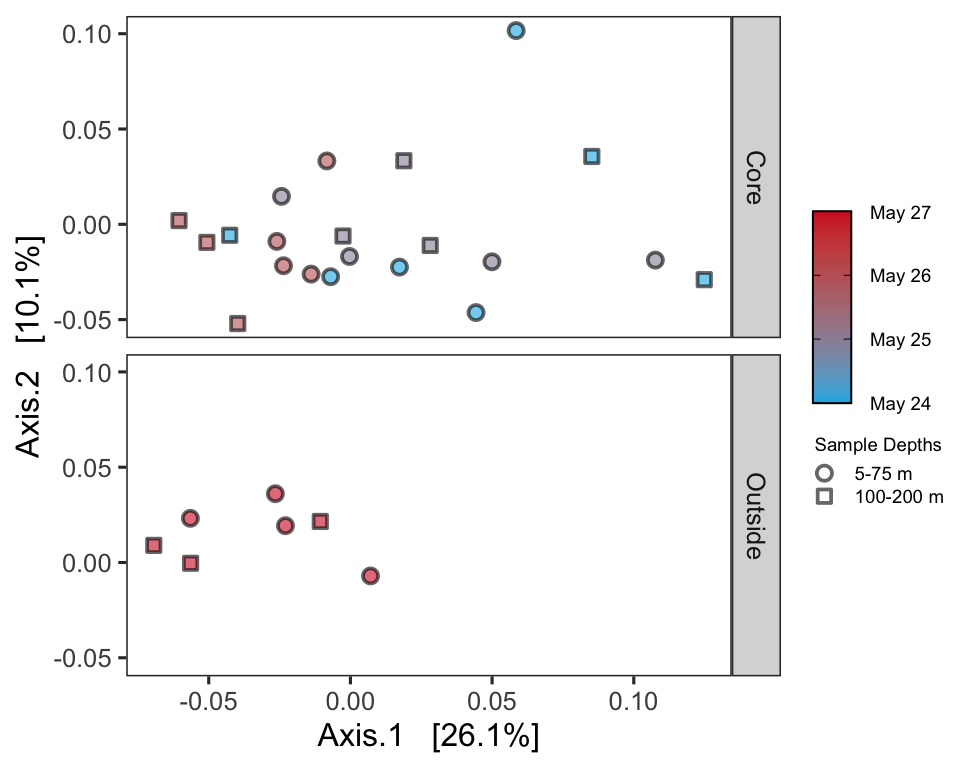


### NMDS

Let’s try an NMDS instead. For NMDS plots it’s important to set a seed
since the starting positions of samples in the alogrithm is random.

Important: if you calculate your bray-curtis distance metric “in-line”
it will perform a square root transformation and Wisconsin double
standardization. If you don’t want this, you can calculate your
bray-curtis distance separately

``` r
set.seed(1)

# Ordinate
nmds_all <- ordinate(sub_ps, method = "NMDS",  distance = "bray") # stress = 0.10
```

    ## Square root transformation
    ## Wisconsin double standardization
    ## Run 0 stress 0.08587739 
    ## Run 1 stress 0.09365946 
    ## Run 2 stress 0.08585637 
    ## ... New best solution
    ## ... Procrustes: rmse 0.06687282  max resid 0.2238382 
    ## Run 3 stress 0.08441245 
    ## ... New best solution
    ## ... Procrustes: rmse 0.02049939  max resid 0.1028506 
    ## Run 4 stress 0.09748563 
    ## Run 5 stress 0.09487471 
    ## Run 6 stress 0.08587482 
    ## Run 7 stress 0.10228 
    ## Run 8 stress 0.09955912 
    ## Run 9 stress 0.08704408 
    ## Run 10 stress 0.0842598 
    ## ... New best solution
    ## ... Procrustes: rmse 0.0251504  max resid 0.09026776 
    ## Run 11 stress 0.08745301 
    ## Run 12 stress 0.08482158 
    ## Run 13 stress 0.1020127 
    ## Run 14 stress 0.3893336 
    ## Run 15 stress 0.0963034 
    ## Run 16 stress 0.08536051 
    ## Run 17 stress 0.1024618 
    ## Run 18 stress 0.09425531 
    ## Run 19 stress 0.08529377 
    ## Run 20 stress 0.09278251 
    ## *** No convergence -- monoMDS stopping criteria:
    ##     20: stress ratio > sratmax

``` r
nmds_min <- ordinate(ps_min, method = "NMDS",  distance = "bray") # stress = 0.08
```

    ## Square root transformation
    ## Wisconsin double standardization
    ## Run 0 stress 0.0821507 
    ## Run 1 stress 0.0815133 
    ## ... New best solution
    ## ... Procrustes: rmse 0.03809494  max resid 0.1540296 
    ## Run 2 stress 0.09391189 
    ## Run 3 stress 0.08107226 
    ## ... New best solution
    ## ... Procrustes: rmse 0.01405819  max resid 0.06192805 
    ## Run 4 stress 0.09495052 
    ## Run 5 stress 0.09876809 
    ## Run 6 stress 0.08285909 
    ## Run 7 stress 0.09679045 
    ## Run 8 stress 0.09951639 
    ## Run 9 stress 0.08749057 
    ## Run 10 stress 0.08267631 
    ## Run 11 stress 0.08286204 
    ## Run 12 stress 0.09527011 
    ## Run 13 stress 0.09959265 
    ## Run 14 stress 0.0811742 
    ## ... Procrustes: rmse 0.007520281  max resid 0.02260834 
    ## Run 15 stress 0.08286335 
    ## Run 16 stress 0.09522367 
    ## Run 17 stress 0.09871374 
    ## Run 18 stress 0.08347457 
    ## Run 19 stress 0.08267176 
    ## Run 20 stress 0.08285796 
    ## *** No convergence -- monoMDS stopping criteria:
    ##     20: stress ratio > sratmax

``` r
nmds_10k <- ordinate(ps_10k, method = "NMDS",  distance = "bray") # stress = 0.09
```

    ## Square root transformation
    ## Wisconsin double standardization
    ## Run 0 stress 0.09541011 
    ## Run 1 stress 0.09681514 
    ## Run 2 stress 0.09500316 
    ## ... New best solution
    ## ... Procrustes: rmse 0.03264104  max resid 0.1311551 
    ## Run 3 stress 0.101433 
    ## Run 4 stress 0.0989107 
    ## Run 5 stress 0.0966574 
    ## Run 6 stress 0.09723143 
    ## Run 7 stress 0.1065501 
    ## Run 8 stress 0.0988806 
    ## Run 9 stress 0.1141325 
    ## Run 10 stress 0.1029455 
    ## Run 11 stress 0.1140497 
    ## Run 12 stress 0.09500572 
    ## ... Procrustes: rmse 0.0002815066  max resid 0.001162358 
    ## ... Similar to previous best
    ## Run 13 stress 0.1062222 
    ## Run 14 stress 0.104337 
    ## Run 15 stress 0.09888662 
    ## Run 16 stress 0.09891074 
    ## Run 17 stress 0.09681943 
    ## Run 18 stress 0.09499901 
    ## ... New best solution
    ## ... Procrustes: rmse 0.002526811  max resid 0.0107239 
    ## Run 19 stress 0.09681612 
    ## Run 20 stress 0.09666478 
    ## *** No convergence -- monoMDS stopping criteria:
    ##     20: stress ratio > sratmax


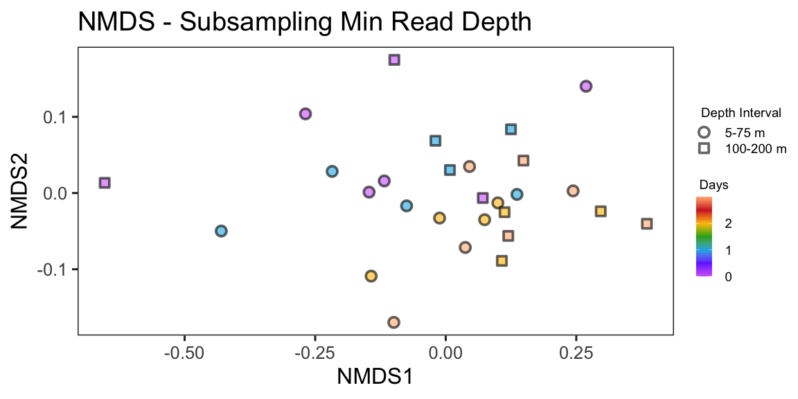

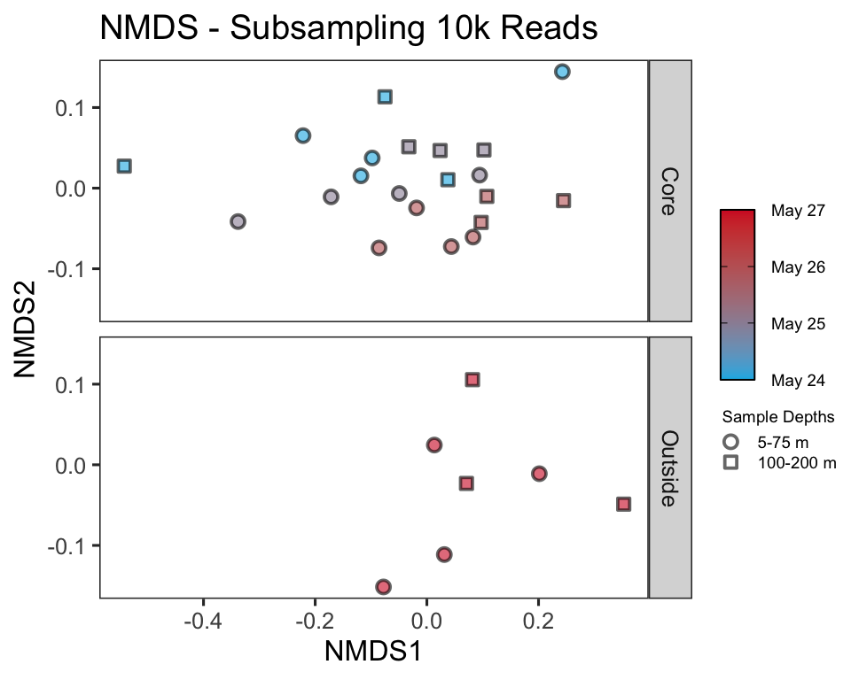

NMDS plots attempt to show ordinal distances between samples as
accurately as possible in two dimensions. It is important to report the
stress of these plots, because a high stress value means that the
algorithm had a hard time representing the distances between samples in
2 dimensions. The stress of this plot was good (generally anything below
0.2 is considered acceptable).

## Constrained Ordination

Above we used unconstrained ordinations (PCoA, NMDS) to show
relationships between samples in low dimensions. We can use a
constrained ordination to see how environmental variables are associated
with these changes in community composition. We constrain the ordination
axes to linear combinations of environmental variables. We then plot the
environmental scores onto the ordination

``` r
# Remove data points with missing metadata
ps_all_na.rm <- sub_ps %>%
  subset_samples(!is.na(mld) & !is.na(npp) & !is.na(doc) & !is.na(n) & !is.na(bc) & !is.na(bcd) & !is.na(aou) & !is.na(fl) & !is.na(sal) & !is.na(temp) & !is.na(density) & !is.na(beamT) )

ps_min_na.rm <- ps_min %>%
  subset_samples(!is.na(mld) & !is.na(npp) & !is.na(doc) & !is.na(n) & !is.na(bc) & !is.na(bcd) & !is.na(aou) & !is.na(fl) & !is.na(sal) & !is.na(temp) & !is.na(density) & !is.na(beamT) )

ps_10k_na.rm <- ps_10k %>%
  subset_samples(!is.na(mld) & !is.na(npp) & !is.na(doc) & !is.na(n) & !is.na(bc) & !is.na(bcd) & !is.na(aou) & !is.na(fl) & !is.na(sal) & !is.na(temp) & !is.na(density) & !is.na(beamT) )


bray_all <- phyloseq::distance(ps_all_na.rm, method = "bray")
bray_min <- phyloseq::distance(ps_min_na.rm, method = "bray")
bray_10k <- phyloseq::distance(ps_10k_na.rm, method = "bray")

# CAP ordinate
cap_ord_all <- ordinate(ps_all_na.rm, method = "CAP", distance = bray_all, formula = ~ mld + doc + n  + bcd + aou + fl + sal + bc + beamT +  npp + temp + days + z + density )
cap_ord_min <- ordinate(ps_min_na.rm, method = "CAP", distance = bray_min, formula = ~ mld + doc + n  + bcd + aou + fl + sal + bc + beamT +  npp + temp + days + z + density )
cap_ord_10k <- ordinate(ps_10k_na.rm, method = "CAP", distance = bray_10k, formula = ~ mld + doc + n  + bcd + aou + fl + sal + bc + beamT +  npp + temp + days + z + density )
```

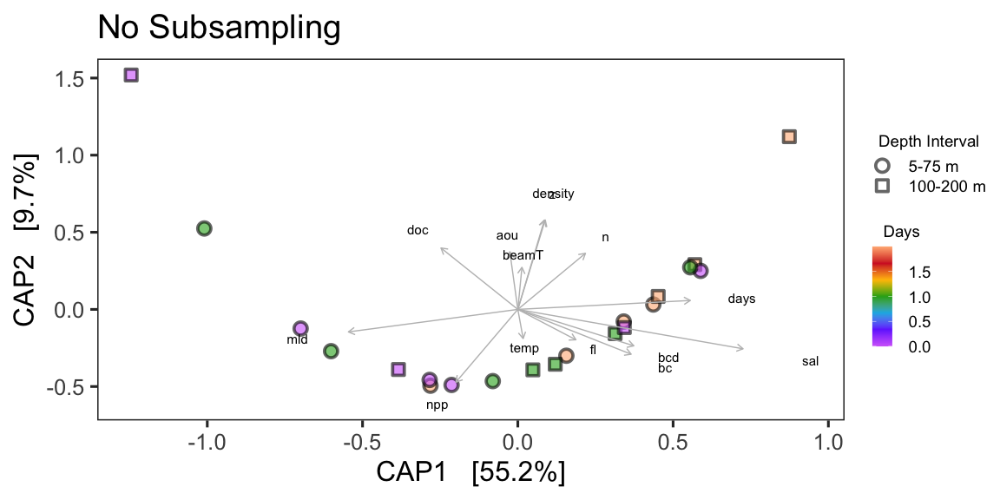

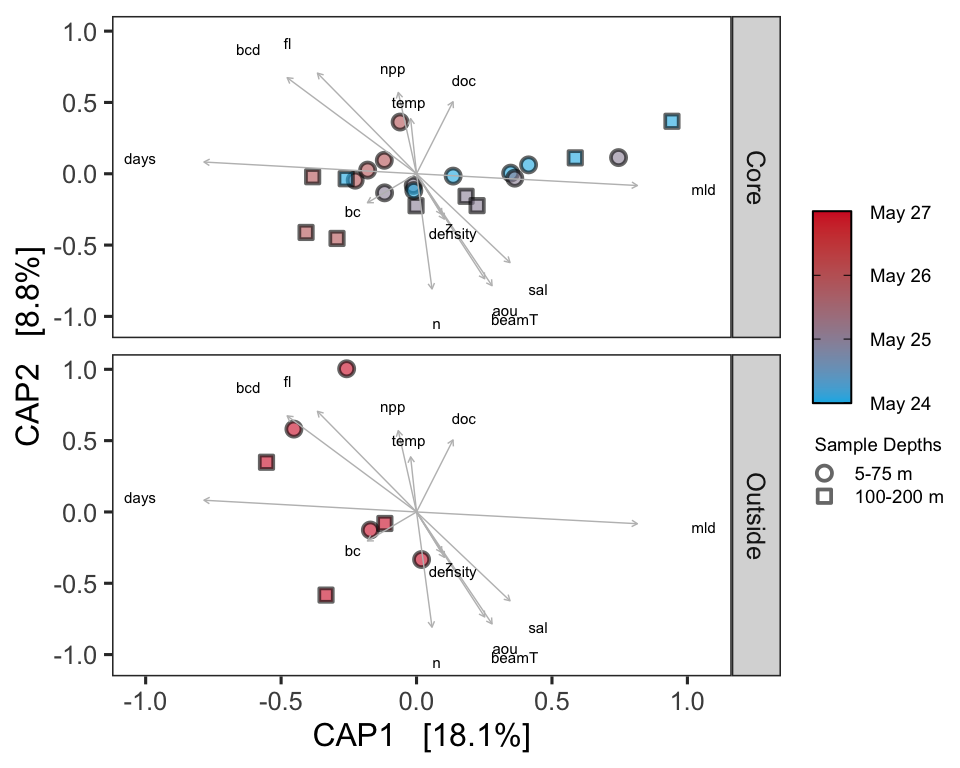

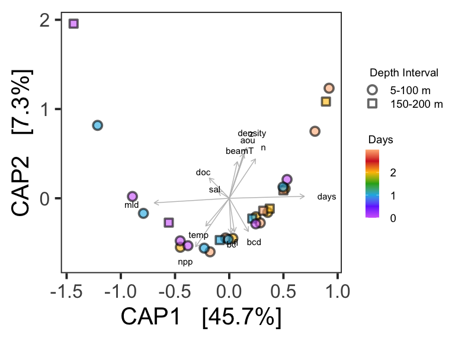

Do a permutational ANOVA on constrained axes used in ordination

``` r
anova(cap_ord_all) 
```

    ## Permutation test for capscale under reduced model
    ## Permutation: free
    ## Number of permutations: 999
    ## 
    ## Model: capscale(formula = distance ~ mld + doc + n + bcd + aou + fl + sal + bc + beamT + npp + temp + days + z + density, data = data)
    ##          Df SumOfSqs      F Pr(>F)
    ## Model    14  0.81877 1.3746  0.214
    ## Residual 13  0.55309

``` r
anova(cap_ord_min) 
```

    ## Permutation test for capscale under reduced model
    ## Permutation: free
    ## Number of permutations: 999
    ## 
    ## Model: capscale(formula = distance ~ mld + doc + n + bcd + aou + fl + sal + bc + beamT + npp + temp + days + z + density, data = data)
    ##          Df SumOfSqs      F Pr(>F)  
    ## Model    14  0.15206 1.3007  0.028 *
    ## Residual 13  0.10855                
    ## ---
    ## Signif. codes:  0 '***' 0.001 '**' 0.01 '*' 0.05 '.' 0.1 ' ' 1

``` r
anova(cap_ord_10k) 
```

    ## Permutation test for capscale under reduced model
    ## Permutation: free
    ## Number of permutations: 999
    ## 
    ## Model: capscale(formula = distance ~ mld + doc + n + bcd + aou + fl + sal + bc + beamT + npp + temp + days + z + density, data = data)
    ##          Df SumOfSqs      F Pr(>F)  
    ## Model    14  0.20088 1.1878  0.059 .
    ## Residual 13  0.15704                
    ## ---
    ## Signif. codes:  0 '***' 0.001 '**' 0.01 '*' 0.05 '.' 0.1 ' ' 1

# Betadisper and permutational ANOVA

Above, we performed beta diversity analyses on Bray-Curtis distances on
rarefied datasets that were then visualized using PCoA, NMDS, and CAP.
We can test if there are statistically significant differences between
sample groups using the betadisper and adonis functions of the vegan
package. Betadisper tests whether two or more groups are homogeneously
dispersed in relation to their species in studied samples. This test can
be done to see if one group has more compositional variance than
another. Moreover, homogeneity of dispersion among groups is very
advisable to have if you want to test if two or more groups have
different compositions, which is tested by adonis.

## Phyloseq to DESeq, distance matrix

To be able to run the stats, we first have to create a distance matrix
from our data. We’ll use the DESeq package to do so.

``` r
library(DESeq2)
library(vegan)
```

``` r
deseq_counts <- phyloseq_to_deseq2(ps_min, design = ~days) #the design argument is required but doesn't matter here
```

    ## converting counts to integer mode

``` r
deseq_count_tab <- assay(deseq_counts) #extract the read count matrix
```

We’ll calculate euclidean
distances

``` r
#We can subset our data if we want to and calculate distances/run stats for only a subset of the group. The code below shows how, but we're not actually going to subset anything
subset_sample_IDs <-  row.names(new.sample.tab)[between(new.sample.tab$z, 0, 200)]

euc_dist <- dist(t(deseq_count_tab[ , colnames(deseq_count_tab) %in% subset_sample_IDs]))

sample_info_tab <- new.sample.tab[row.names(new.sample.tab) %in% subset_sample_IDs, ]
```

Betadisper first calculates the average distance of group members to the
group centroid in multivariate space (generated by a distance matrix).

Our first question is: Is the community composition from 5-200 m
different between each day of the station occupation?

In the function below: we are using the distance matrix to calculate the
multivariate dispersions (variances; average distance to centroids). We
then use group dispersions to perform an ANOVA test.

``` r
anova(betadisper(euc_dist, sample_info_tab$days)) 
```

    ## Analysis of Variance Table
    ## 
    ## Response: Distances
    ##           Df Sum Sq Mean Sq F value Pr(>F)
    ## Groups     3 222201   74067  1.9437 0.1495
    ## Residuals 24 914566   38107

The ANOVA’s p-value is not significant meaning that group dispersions
are homogenous (“Null hypothesis of no difference in dispersion between
groups”)

Adonis analyzes and partitions sums of squares using distance matrices.
It can be seen as an ANOVA using distance matrices (analogous to MANOVA
– multivariate analysis of variance). Therefore, it is used to test if
two or more groups have similar compositions.

``` r
adonis(euc_dist~sample_info_tab$days)
```

    ## 
    ## Call:
    ## adonis(formula = euc_dist ~ sample_info_tab$days) 
    ## 
    ## Permutation: free
    ## Number of permutations: 999
    ## 
    ## Terms added sequentially (first to last)
    ## 
    ##                      Df SumsOfSqs MeanSqs F.Model      R2 Pr(>F)   
    ## sample_info_tab$days  1   2124934 2124934  6.5251 0.20062  0.008 **
    ## Residuals            26   8467085  325657         0.79938          
    ## Total                27  10592019                 1.00000          
    ## ---
    ## Signif. codes:  0 '***' 0.001 '**' 0.01 '*' 0.05 '.' 0.1 ' ' 1

Our results indicate that the community between each day has a highly
significantly different composition (p \< 0.01).

**So our groups (days) present homogeneity among group dispersions
(compositions vary similarly) while having significantly different
compositions.**

What about at each depth horizon (5-100 m, 150 - 200
m)?

### Surface 75 m

``` r
#We can subset our data if we want to and calculate distances/run stats for only a subset of the group. The code below shows how, but we're not actually going to subset anything
surf_sample_IDs <-  row.names(new.sample.tab)[between(new.sample.tab$z, 0, 75)]

surf_euc_dist <- dist(t(deseq_count_tab[ , colnames(deseq_count_tab) %in% surf_sample_IDs]))

surf_sample_info_tab <- new.sample.tab[row.names(new.sample.tab) %in% surf_sample_IDs, ]
```

``` r
anova(betadisper(surf_euc_dist, surf_sample_info_tab$days)) 
```

    ## Analysis of Variance Table
    ## 
    ## Response: Distances
    ##           Df Sum Sq Mean Sq F value Pr(>F)
    ## Groups     3  37929   12643  0.2037 0.8919
    ## Residuals 12 744841   62070

``` r
adonis(surf_euc_dist~surf_sample_info_tab$days)
```

    ## 
    ## Call:
    ## adonis(formula = surf_euc_dist ~ surf_sample_info_tab$days) 
    ## 
    ## Permutation: free
    ## Number of permutations: 999
    ## 
    ## Terms added sequentially (first to last)
    ## 
    ##                           Df SumsOfSqs MeanSqs F.Model      R2 Pr(>F)
    ## surf_sample_info_tab$days  1    486493  486493  1.6723 0.10671  0.173
    ## Residuals                 14   4072718  290908         0.89329       
    ## Total                     15   4559211                 1.00000

**Our groups (days) in the surface 75 m present homogeneity among group
dispersions (compositions vary similarly) and do not have significantly
different
compositions.**

### 150 - 200 m

``` r
#We can subset our data if we want to and calculate distances/run stats for only a subset of the group. The code below shows how, but we're not actually going to subset anything
deep_sample_IDs <-  row.names(new.sample.tab)[between(new.sample.tab$z, 100, 200)]

deep_euc_dist <- dist(t(deseq_count_tab[ , colnames(deseq_count_tab) %in% deep_sample_IDs]))

deep_sample_info_tab <- new.sample.tab[row.names(new.sample.tab) %in% deep_sample_IDs, ]
```

``` r
anova(betadisper(deep_euc_dist, deep_sample_info_tab$days)) 
```

    ## Analysis of Variance Table
    ## 
    ## Response: Distances
    ##           Df Sum Sq Mean Sq F value Pr(>F)
    ## Groups     3 380695  126898  1.1597 0.3832
    ## Residuals  8 875393  109424

``` r
adonis(deep_euc_dist~deep_sample_info_tab$days)
```

    ## 
    ## Call:
    ## adonis(formula = deep_euc_dist ~ deep_sample_info_tab$days) 
    ## 
    ## Permutation: free
    ## Number of permutations: 999
    ## 
    ## Terms added sequentially (first to last)
    ## 
    ##                           Df SumsOfSqs MeanSqs F.Model      R2 Pr(>F)  
    ## deep_sample_info_tab$days  1   2168831 2168831  5.9013 0.37112  0.018 *
    ## Residuals                 10   3675169  367517         0.62888         
    ## Total                     11   5843999                 1.00000         
    ## ---
    ## Signif. codes:  0 '***' 0.001 '**' 0.01 '*' 0.05 '.' 0.1 ' ' 1

**Our groups (days) in the 100-200 m depth horizon present homogeneity
among group dispersions (compositions vary similarly) and have
significantly different compositions.**

# Alpha Diversity

Generating estimates of alpha diversity for microbial communities isn’t
hard, but generating *trustworthy* estimates is hard
[problematic](https://www.ncbi.nlm.nih.gov/pmc/articles/PMC93182/) no
matter what you do.

We will use the subsampled library, which retains estimates of the
species abundance of the real population while standardizing sampling
effort.

[subsampling and alpha diversity
paper](https://www.frontiersin.org/articles/10.3389/fmicb.2019.02407/full)

[Chao1: nonparametric estimation of minimum community
richness](https://www.jstor.org/stable/4615964?seq=1#metadata_info_tab_contents)

Difference in the alpha diversity indexes among conditions were tested
using Kruskal-Wallis test followed by pairwise Wilcoxon tests; p \< 0.05
was considered the threshold significance for a difference between
conditions.

``` r
richness <- estimate_richness(ps_min, measures = c("Chao1", "Shannon")) %>% 
  rownames_to_column(., var = "DNA_ID") %>% 
  mutate_at(vars(DNA_ID), str_replace_all, pattern = "NAAMES2.", "NAAMES2-")
```

Let’s add the sample metadata into this
dataframe

``` r
alphadiv <- left_join(richness, new.sample.tab %>% rownames_to_column(., var = "DNA_ID")) 
```

    ## Joining, by = "DNA_ID"

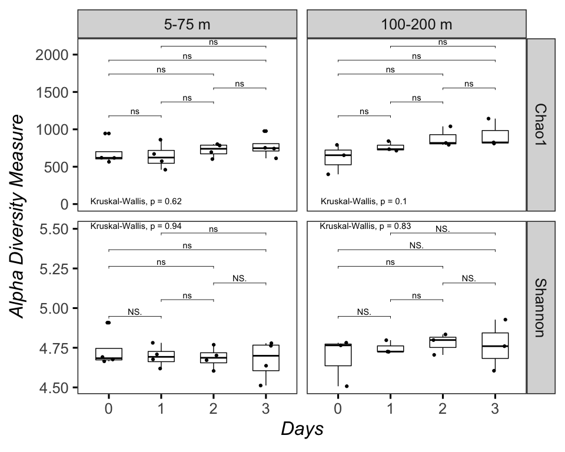

These are not interpretable as “real” numbers of anything (due to the
nature of amplicon data), but they can still be useful as relative
metrics of comparison. If Chao1 richness goes up, but Shannon diversity
goes down, it indicates that the sample may have more ASVs but is
dominated by a few of them.

**In this case, though our groups (days) showed significantly different
compositions, there weren’t significant changes in overall diversity or
richness. So it seems like the community shift wasn’t driven by the
emergence or disappearance of new ASVs, but rather the change in
relative proportion of existing ASVs **

# DESeq2

Which taxa were important? Which taxa were contributing to thechange in
community compositon?

**Note: Recovered 16S rRNA gene copy numbers do not equal organism
abundance.**

That said, we can perform differential abundance testing to test for
which representative sequences have significantly different copy-number
counts between samples using the DESeq1 package, which allows testing
for differential abundance using negative binomial generalized linear
models.

``` r
# if (!requireNamespace("BiocManager", quietly = TRUE))
#     install.packages("BiocManager")
# 
# BiocManager::install("DESeq2")
```

``` r
deseq <-  DESeq(deseq_counts, test = "Wald", fitType = "local")
```

    ## estimating size factors

    ## estimating dispersions

    ## gene-wise dispersion estimates

    ## mean-dispersion relationship

    ## final dispersion estimates

    ## fitting model and testing

    ## -- replacing outliers and refitting for 28 genes
    ## -- DESeq argument 'minReplicatesForReplace' = 7 
    ## -- original counts are preserved in counts(dds)

    ## estimating dispersions

    ## fitting model and testing

We can save the results to a table with the DESeq results command,
retaining all results for further exploration (i.e., cooksCutoff = F).
Significant shifts are identified as those with a Benjamini–Hochberg
adjusted p-value \< 0.05

``` r
res <- results(deseq, cooksCutoff = FALSE)
alpha <- 0.05
sigtab <-  res[which(res$padj < alpha), ]
sigtab <-  cbind(as(sigtab, "data.frame"), as(tax_table(ps_min)[rownames(sigtab), ], "matrix"))
head(sigtab)
```

    ##      baseMean log2FoldChange      lfcSE     stat       pvalue         padj
    ## N1  5220.7704     0.10525921 0.02367594 4.445830 8.755320e-06 0.0004645438
    ## N5  1082.7810     0.10030819 0.02016325 4.974802 6.531436e-07 0.0001495699
    ## N7   599.5069     0.10412415 0.02406123 4.327465 1.508354e-05 0.0005756883
    ## N11  489.0538     0.08716703 0.02374961 3.670251 2.423128e-04 0.0061655142
    ## N13  468.0839     0.13787444 0.03006710 4.585558 4.527763e-06 0.0003456193
    ## N15  374.8822     0.07508862 0.02567577 2.924494 3.450169e-03 0.0464758021
    ##      Kingdom         Phylum               Class       Order   Family Genus
    ## N1  Bacteria Proteobacteria Alphaproteobacteria SAR11_clade SAR11_Ia    NA
    ## N5  Bacteria Proteobacteria Alphaproteobacteria SAR11_clade SAR11_Ia    NA
    ## N7  Bacteria Proteobacteria Alphaproteobacteria SAR11_clade SAR11_Ia    NA
    ## N11 Bacteria Proteobacteria Alphaproteobacteria SAR11_clade SAR11_Ia    NA
    ## N13 Bacteria Proteobacteria Alphaproteobacteria SAR11_clade SAR11_Ia    NA
    ## N15 Bacteria Proteobacteria Alphaproteobacteria SAR11_clade SAR11_Ia    NA

``` r
dim(sigtab)
```

    ## [1] 17 12

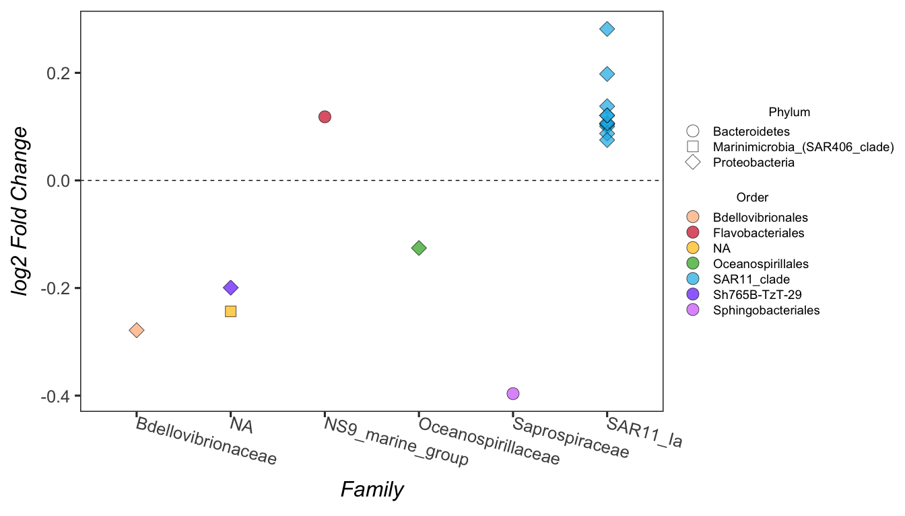

### Surface 75 m

``` r
surf_ps_min <- subset_samples(ps_min, between(z, 0, 75))
surf_deseq_counts <- phyloseq_to_deseq2(surf_ps_min, design = ~days) 
```

    ## converting counts to integer mode

``` r
surf_deseq <-  DESeq(surf_deseq_counts, test = "Wald", fitType = "local")
```

    ## estimating size factors

    ## estimating dispersions

    ## gene-wise dispersion estimates

    ## mean-dispersion relationship

    ## final dispersion estimates

    ## fitting model and testing

``` r
surf_res <- results(surf_deseq, cooksCutoff = FALSE)
alpha <- 0.05
surf_sigtab <-  surf_res[which(surf_res$padj < alpha), ]
surf_sigtab <-  cbind(as(surf_sigtab, "data.frame"), as(tax_table(surf_ps_min)[rownames(surf_sigtab), ], "matrix"))
head(surf_sigtab)
```

    ##      baseMean log2FoldChange      lfcSE      stat       pvalue         padj
    ## N5  1080.4377     0.08812935 0.02741709  3.214395 1.307196e-03 0.0334969080
    ## N7   596.1324     0.10178435 0.02874736  3.540650 3.991432e-04 0.0185800321
    ## N13  456.3986     0.12848637 0.03663701  3.507010 4.531715e-04 0.0185800321
    ## N27  409.8172     0.11477312 0.03510777  3.269166 1.078651e-03 0.0315890505
    ## N31  517.0236    -0.13742295 0.04062191 -3.382976 7.170496e-04 0.0244991938
    ## N79  251.4713     0.18238049 0.03756331  4.855283 1.202149e-06 0.0001232203
    ##      Kingdom         Phylum               Class             Order
    ## N5  Bacteria Proteobacteria Alphaproteobacteria       SAR11_clade
    ## N7  Bacteria Proteobacteria Alphaproteobacteria       SAR11_clade
    ## N13 Bacteria Proteobacteria Alphaproteobacteria       SAR11_clade
    ## N27 Bacteria Proteobacteria Alphaproteobacteria   Rhodobacterales
    ## N31 Bacteria Proteobacteria Gammaproteobacteria Oceanospirillales
    ## N79 Bacteria  Bacteroidetes      Flavobacteriia  Flavobacteriales
    ##                 Family           Genus
    ## N5            SAR11_Ia              NA
    ## N7            SAR11_Ia              NA
    ## N13           SAR11_Ia              NA
    ## N27   Rhodobacteraceae              NA
    ## N31 Oceanospirillaceae Pseudospirillum
    ## N79   NS9_marine_group              NA

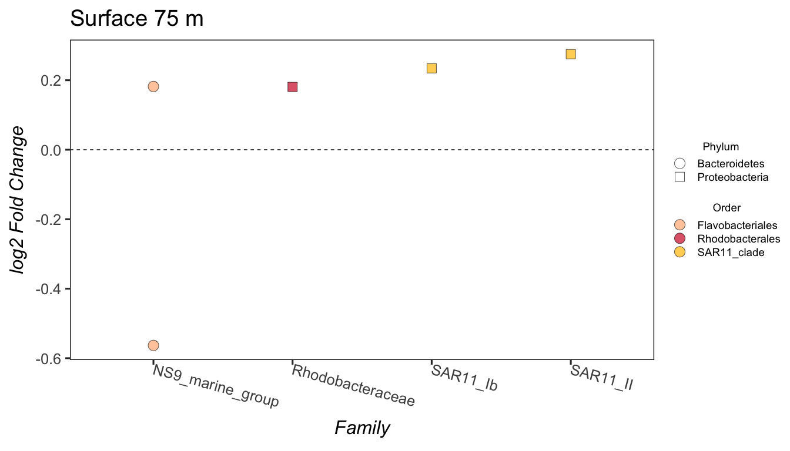

### 100 - 200 m

``` r
deep_ps_min <- subset_samples(ps_min, between(z, 100, 200))
deep_deseq_counts <- phyloseq_to_deseq2(deep_ps_min, design = ~days) 
```

    ## converting counts to integer mode

``` r
deep_deseq <-  DESeq(deep_deseq_counts, test = "Wald", fitType = "local")
```

    ## estimating size factors

    ## estimating dispersions

    ## gene-wise dispersion estimates

    ## mean-dispersion relationship

    ## final dispersion estimates

    ## fitting model and testing

``` r
deep_res <- results(deep_deseq, cooksCutoff = FALSE)
alpha <- 0.05
deep_sigtab <-  deep_res[which(deep_res$padj < alpha), ]
deep_sigtab <-  cbind(as(deep_sigtab, "data.frame"), as(tax_table(deep_ps_min)[rownames(deep_sigtab), ], "matrix"))
head(deep_sigtab)
```

    ##         baseMean log2FoldChange      lfcSE      stat       pvalue       padj
    ## N5   1074.375588      0.1269146 0.03414184  3.717275 2.013834e-04 0.02735938
    ## N11   485.863100      0.1484785 0.03948420  3.760452 1.696063e-04 0.02688260
    ## N61   195.753345      0.2087199 0.05524633  3.777987 1.581011e-04 0.02688260
    ## N130   39.711693      0.4352889 0.10996626  3.958386 7.545805e-05 0.02392020
    ## N225   82.883092     -0.3393550 0.07864375 -4.315092 1.595368e-05 0.01395155
    ## N661    8.425747      1.5853993 0.37941617  4.178523 2.934080e-05 0.01395155
    ##       Kingdom         Phylum               Class           Order
    ## N5   Bacteria Proteobacteria Alphaproteobacteria     SAR11_clade
    ## N11  Bacteria Proteobacteria Alphaproteobacteria     SAR11_clade
    ## N61  Bacteria Proteobacteria Alphaproteobacteria     SAR11_clade
    ## N130 Bacteria Proteobacteria Alphaproteobacteria     SAR11_clade
    ## N225 Bacteria Proteobacteria Gammaproteobacteria Cellvibrionales
    ## N661 Bacteria Proteobacteria Gammaproteobacteria Alteromonadales
    ##                      Family             Genus
    ## N5                 SAR11_Ia                NA
    ## N11                SAR11_Ia                NA
    ## N61                SAR11_Ia                NA
    ## N130               SAR11_Ia                NA
    ## N225         Porticoccaceae       SAR92_clade
    ## N661 Pseudoalteromonadaceae Pseudoalteromonas

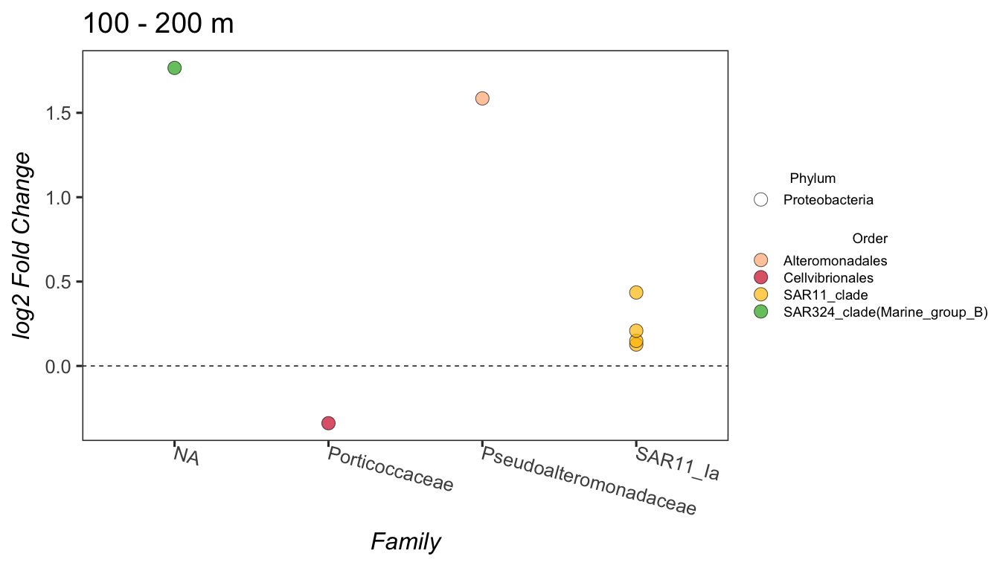

# Stacked Barplots

Let’s make a stacked barplot of Phyla to get a sense of the community
composition in these samples.

Since this is not a quantitative analysis, and since we have more Phyla
in this dataset than we can reasonably distinguish colors, we will prune
out low abundance taxa and only include Orders that contribute more than
0.5% of the relative abundance of each sample. Depending on your dataset
and the taxonomic level you are depicting, you can adjust this prune
parameter. In later analyses, we will of course included these taxa, but
for now they will just clutter our plot.

``` r
# melt to long format (for ggploting) 
# prune out orders below 0.5% in each sample

stack_sub_ps <- sub_ps %>%
  tax_glom(taxrank = "Order") %>%                     # agglomerate at phylum level
  transform_sample_counts(function(x) {x/sum(x)} ) %>% # Transform to rel. abundance
  psmelt() %>%                                         # Melt to long format
  filter(Abundance >= 0.005) %>%                         # Filter out low abundance taxa
  arrange(Order)                                      # Sort data frame alphabetically by Order
```

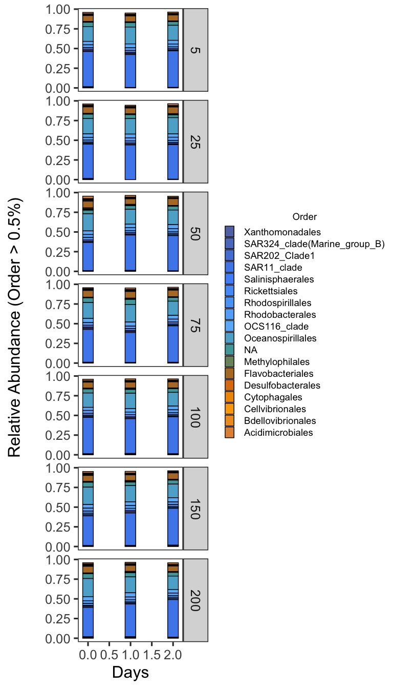
