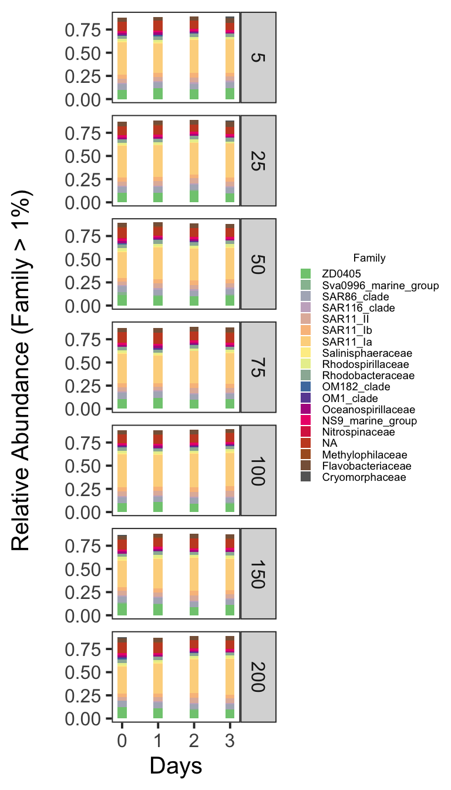
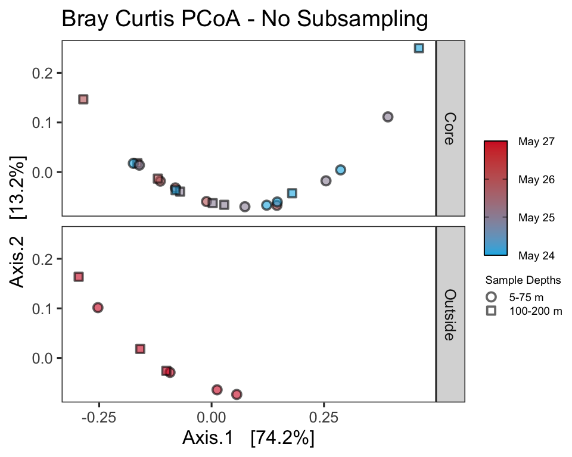
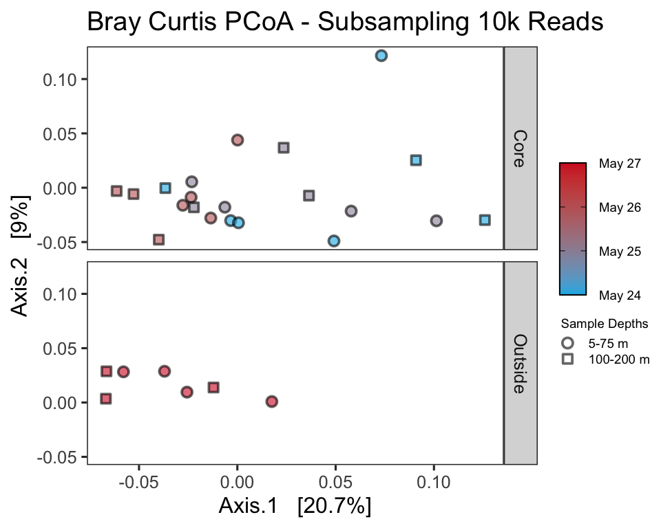
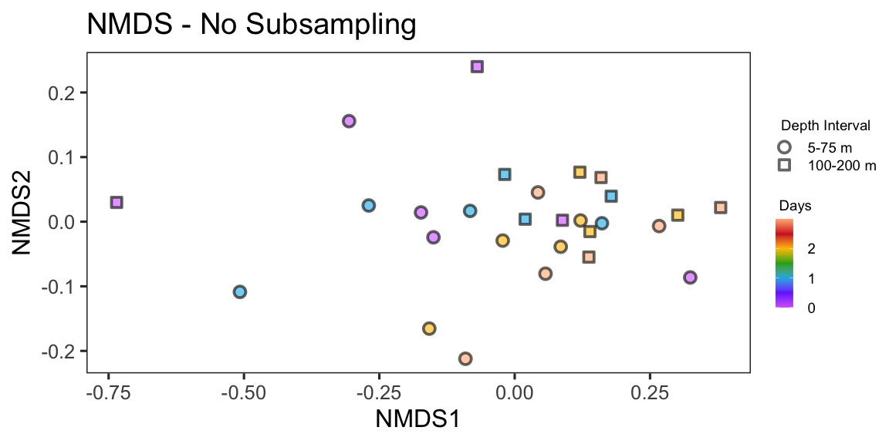

S4\_16S
================
Nicholas Baetge
8/14/2020

# Intro

Here, the NAAMES cast 16S sequences from N2S4 are analyzed

``` r
library(tidyverse) 
library(rmarkdown)
library(knitr)
library(readxl)
library(data.table) 
library(scales)
library(zoo)
library(oce)
library(patchwork)
#rmarkdown tables
library(stargazer)
library(pander)
#stat tests
library(lmtest)
library(lmodel2)
library(rstatix)
library(ggpubr)
#for odv type plots
library(lubridate)
library(reshape2)
library(MBA)
library(mgcv)
#phyloseq
library(phyloseq)
library(RColorBrewer)

custom_theme <- function() {
  theme_test(base_size = 30) %+replace%
    theme(legend.position = "right",
          legend.spacing.x = unit(0.5,"cm"),
          legend.title = element_text(size = 14),
          legend.text = element_text(size = 14),
          legend.background = element_rect(fill = "transparent",colour = NA),
          legend.key = element_rect(fill = "transparent",colour = NA),
          panel.background = element_rect(fill = "transparent",colour = NA),
          plot.background = element_rect(fill = "transparent",colour = NA)) 
}

custom.colors <- c("AT39" = "#377EB8", "AT34" = "#4DAF4A", "AT38" = "#E41A1C", "AT32" = "#FF7F00", "Temperate" = "#A6CEE3", "Subpolar" = "#377EB8", "Subtropical" = "#FB9A99", "GS/Sargasso" = "#E41A1C", "Early Spring" = "#377EB8", "Late Spring" = "#4DAF4A","Early Autumn" = "#E41A1C", "Summer" = "#E41A1C", "Late Autumn" = "#FF7F00", "Gv2_2019" = "#377EB8", "WOA18_MN" = "#4DAF4A", "WOA18_AN" = "#E41A1C")

levels = c("GS/Sargasso", "Subtropical", "Temperate", "Subpolar",  "AT39-6", "AT34", "AT38", "AT32","South", "North", "Early Spring", "Late Spring","Early Autumn",  "Summer", "Late Autumn", "Gv2_2019", "WOA18_MN", "WOA18_AN","Nov", "Nov sd", "Dec", "Dec sd", "Jan", "Jan sd", "Feb", "Feb sd", "Mar", "Mar sd", "Apr", "Apr sd",  "Cruise", "ARGO", "5-100 m", "150-200 m", "300 m", "> 300 m")


bar.colors <- c("100 m" = "white", "CM" = "#4DAF4A",  "PAM" = "#377EB8")

odv.colors <- c("#feb483", "#d31f2a", "#ffc000", "#27ab19", "#0db5e6", "#7139fe", "#d16cfa")
```

# Import Data

``` r
custom.tab <- readRDS("~/GITHUB/naames_multiday/Output/Custom_ASV_Table.rds") %>% 
  filter(Cruise == "AT34" & Station == 4 & z <= 200) %>% 
  mutate(time = ymd_hms(datetime),
         interv = interval(first(time), time),
         dur = as.duration(interv),
         days = as.numeric(dur, "days")) %>% 
  select(Cruise:bcd, time:days)

sub_ps <- readRDS("~/GITHUB/naames_multiday/Output/phyloseq_obj.rds") %>% 
  subset_samples(Cruise == "AT34" & Station == 4 & z <= 200)


alphadiv <- readRDS("~/GITHUB/naames_multiday/Output/alphadiv.rds") %>% 
  filter(Cruise == "AT34" & Station == 4 & z <= 200) %>% 
  mutate(time = ymd_hms(datetime),
         interv = interval(first(time), time),
         dur = as.duration(interv),
         days = as.numeric(dur, "days"))
```

## Add new sample data to phyloseq object

``` r
ctd <-  readRDS("~/GITHUB/naames_multiday/Input/ctd/deriv_naames_ctd.rds") %>%
              select(Cruise, Station, CampCN,  bin_depth, deriv_o2_umol_l, fl_mg_m3, ave_temp_c, ave_sal_psu) %>% 
              mutate(Cruise = ifelse(Cruise == "AT39", "AT39-6", Cruise)) %>% 
              rename(z = bin_depth,
                     o2 = deriv_o2_umol_l,
                     fl = fl_mg_m3,
                     temp = ave_temp_c,
                     sal = ave_sal_psu) 


npp <- read_rds("~/GITHUB/naames_multiday/Input/Z_resolved_model_NPP.rds") %>% 
  rename(z = depth,
         npp = NPP)

new.sample.tab <- read_rds("~/GITHUB/naames_multiday/Input/export_ms/processed_bf.2.2020.rds") %>% 
  select(Cruise:CampCN, Target_Z, DNA_ID) %>% 
  drop_na(DNA_ID) %>% 
  rename(z = Target_Z) %>% 
  left_join(., read_rds("~/GITHUB/naames_multiday/Output/processed_data.rds") %>%
              select(Cruise, Station, Date,  CampCN, mld, z,  doc, n, phyc, bc, bcd ) %>% 
              distinct() %>% 
              mutate_at(vars(phyc:bcd), function(x)(x/10^3))) %>% 
  mutate(`Depth Interval` = ifelse(z <= 100, "5-100 m", "150-200 m"),
         `Depth Interval` = ifelse(z == 300, "300 m", `Depth Interval`),
         `Depth Interval` = ifelse(z > 300, "> 300 m", `Depth Interval`)) %>% 
  select(Cruise:z, `Depth Interval`, everything()) %>% 
  left_join(., ctd) %>% 
  left_join(., npp) %>% 
  filter(Cruise == "AT34" & Station == 4 & z <= 200) %>% 
  mutate(time = ymd_hms(datetime),
         interv = interval(first(time), time),
         dur = as.duration(interv),
         days = as.numeric(dur, "days")) %>% 
  select(Cruise:npp, time:days) %>% 
  column_to_rownames(var = "DNA_ID") 
```

    ## Joining, by = c("Cruise", "Station", "Date", "CampCN", "z")

    ## Joining, by = c("Cruise", "Station", "CampCN", "z")

    ## Joining, by = c("Cruise", "Station", "Date", "z")

``` r
sample_data(sub_ps) <- new.sample.tab
```

# Stacked Barplots

Let’s make a stacked barplot of Phyla to get a sense of the community
composition in these samples.

Since this is not a quantitative analysis, and since we have more Phyla
in this dataset than we can reasonably distinguish colors, we will prune
out low abundance taxa and only include Families that contribute more
than 1% of the relative abundance of each sample. Depending on your
dataset and the taxonomic level you are depicting, you can adjust this
prune parameter. In later analyses, we will of course included these
taxa, but for now they will just clutter our plot.

``` r
# melt to long format (for ggploting) 
# prune out phyla below 1% in each sample

sub_ps_family <- sub_ps %>%
  tax_glom(taxrank = "Family") %>%                     # agglomerate at phylum level
  transform_sample_counts(function(x) {x/sum(x)} ) %>% # Transform to rel. abundance
  psmelt() %>%                                         # Melt to long format
  filter(Abundance > 0.01) %>%                         # Filter out low abundance taxa
  arrange(Family)                                      # Sort data frame alphabetically by family
```



# Unconstrained Ordination

One of the best exploratory analyses for amplicon data is unconstrained
ordinations. Here we will look at ordinations of our full community
samples. We will rarefy the samples first (scale to the smallest library
size).

## Rarefy

``` r
rarefy_ps = rarefy_even_depth(sub_ps, sample.size = min(sample_sums(sub_ps)), rngseed = 532898)
```

    ## `set.seed(532898)` was used to initialize repeatable random subsampling.

    ## Please record this for your records so others can reproduce.

    ## Try `set.seed(532898); .Random.seed` for the full vector

    ## ...

    ## 9379OTUs were removed because they are no longer 
    ## present in any sample after random subsampling

    ## ...

``` r
sample_data(rarefy_ps)$`Depth.Interval` <- factor(sample_data(rarefy_ps)$`Depth.Interval`, levels = levels)
sample_data(rarefy_ps)$Season <- factor(sample_data(rarefy_ps)$Season, levels = levels)
```

## PCoA

``` r
pcoa <- ordinate(rarefy_ps, method = "PCoA", distance = "bray")
```



## NMDS

Let’s try an NMDS instead. For NMDS plots it’s important to set a seed
since the starting positions of samples in the alogrithm is random.

Important: if you calculate your bray-curtis distance metric “in-line”
it will perform a square root transformation and Wisconsin double
standardization. If you don’t want this, you can calculate your
bray-curtis distance separately

``` r
set.seed(1)

# Ordinate
nmds <- ordinate(rarefy_ps, method = "NMDS",  distance = "bray") # stress = 0.08
```

    ## Square root transformation
    ## Wisconsin double standardization
    ## Run 0 stress 0.08436005 
    ## Run 1 stress 0.09032935 
    ## Run 2 stress 0.1007445 
    ## Run 3 stress 0.09342142 
    ## Run 4 stress 0.1015393 
    ## Run 5 stress 0.0919695 
    ## Run 6 stress 0.08435657 
    ## ... New best solution
    ## ... Procrustes: rmse 0.0004619948  max resid 0.001977793 
    ## ... Similar to previous best
    ## Run 7 stress 0.09417214 
    ## Run 8 stress 0.10192 
    ## Run 9 stress 0.08621655 
    ## Run 10 stress 0.08795346 
    ## Run 11 stress 0.08874785 
    ## Run 12 stress 0.08791385 
    ## Run 13 stress 0.1025052 
    ## Run 14 stress 0.08579026 
    ## Run 15 stress 0.09591592 
    ## Run 16 stress 0.08578905 
    ## Run 17 stress 0.09961081 
    ## Run 18 stress 0.1010137 
    ## Run 19 stress 0.090633 
    ## Run 20 stress 0.08578697 
    ## *** Solution reached



NMDS plots attempt to show ordinal distances between samples as
accurately as possible in two dimensions. It is important to report the
stress of these plots, because a high stress value means that the
algorithm had a hard time representing the distances between samples in
2 dimensions. The stress of this plot was good - it was .09 (generally
anything below .2 is considered acceptable). The PCoA for this data was
able to show ~36.2% variation in just two dimensions, so we may want to
stick with that plot.

# Constrained Ordination

Above we used unconstrained ordinations (PCoA, NMDS) to show
relationships between samples in low dimensions. We can use a
constrained ordination to see how environmental variables are associated
with these changes in community composition. We constrain the ordination
axes to linear combinations of environmental variables. We then plot the
environmental scores onto the ordination

``` r
# Remove data points with missing metadata
ps_not_na <- rarefy_ps %>%
  subset_samples(
    !is.na(mld) &
      !is.na(npp) & 
      !is.na(doc) &
      !is.na(n) & 
      !is.na(bc) & 
      !is.na(bcd) & 
      !is.na(o2) & 
      !is.na(fl) & 
      !is.na(sal) & 
      !is.na(temp)
  )

bray <- phyloseq::distance(ps_not_na, method = "bray")

# CAP ordinate
cap_ord <- ordinate(ps_not_na, method = "CAP", distance = bray, formula = ~ mld + doc + n  + bcd + o2 + fl + sal + bc + z +  npp + temp + days
)
```



Do a permutational ANOVA on constrained axes used in ordination

``` r
anova(cap_ord) 
```

    ## Permutation test for capscale under reduced model
    ## Permutation: free
    ## Number of permutations: 999
    ## 
    ## Model: capscale(formula = distance ~ mld + doc + n + bcd + o2 + fl + sal + bc + z + npp + temp + days, data = data)
    ##          Df SumOfSqs      F Pr(>F)   
    ## Model    12  0.13942 1.4413  0.007 **
    ## Residual 15  0.12092                 
    ## ---
    ## Signif. codes:  0 '***' 0.001 '**' 0.01 '*' 0.05 '.' 0.1 ' ' 1
