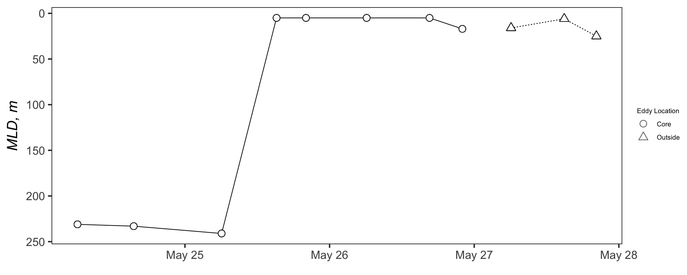
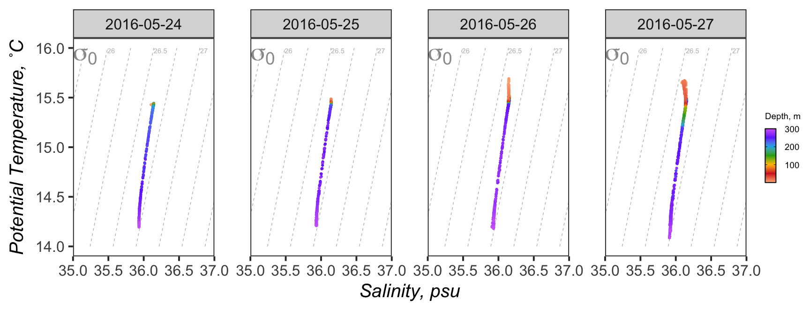
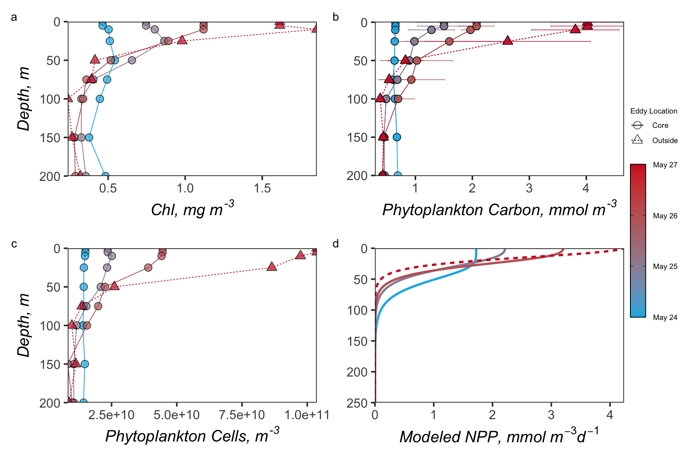
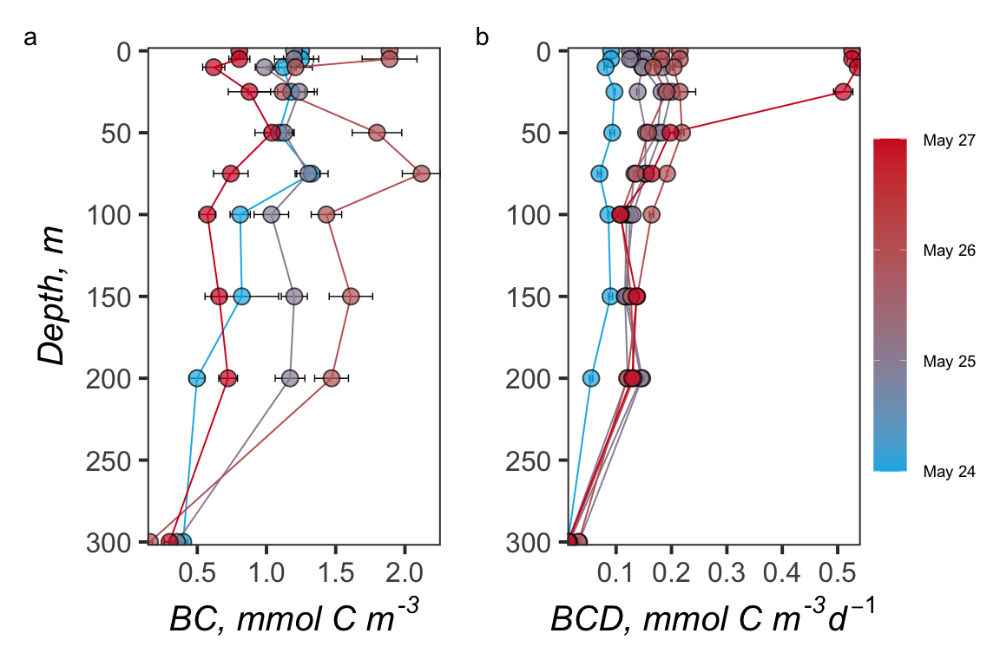
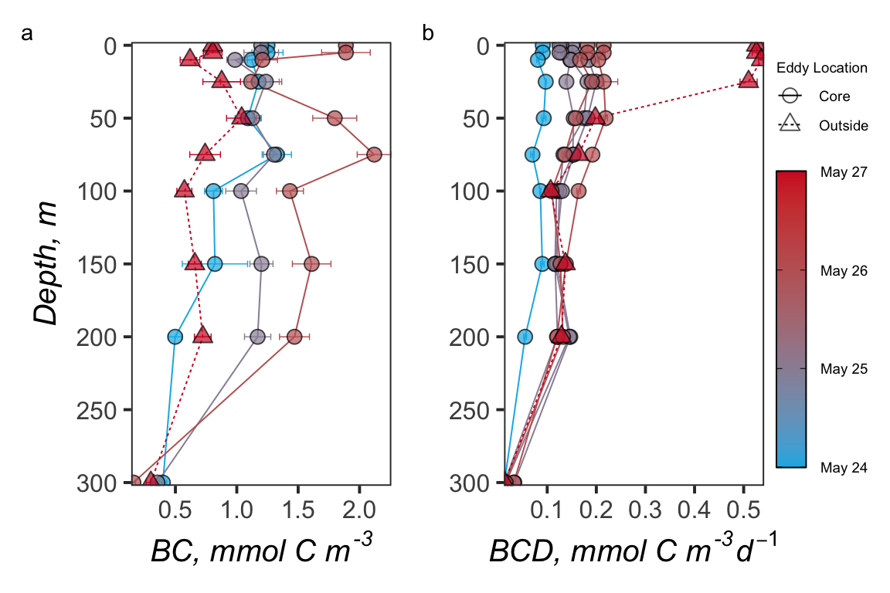

Depth\_Profiles
================
Nicholas Baetge
8/6/2020

# Intro

Here, we plot the profiles from the multiday NAAMES station, N2S4.

``` r
library(tidyverse) 
library(rmarkdown)
library(knitr)
library(readxl)
library(data.table) 
library(scales)
library(zoo)
library(oce)
library(patchwork)
#rmarkdown tables
library(stargazer)
library(pander)
#stat tests
library(lmtest)
library(lmodel2)
library(rstatix)
library(ggpubr)
#for odv type plots
library(lubridate)
library(reshape2)
library(MBA)
library(mgcv)
```

``` r
custom_theme <- function() {
  theme_test(base_size = 30) %+replace%
    theme(legend.position = "right",
          legend.spacing.x = unit(0.5,"cm"),
          legend.title = element_text(size = 14),
          legend.text = element_text(size = 14),
          legend.background = element_rect(fill = "transparent",colour = NA),
          legend.key = element_rect(fill = "transparent",colour = NA),
          panel.background = element_rect(fill = "transparent",colour = NA),
          plot.background = element_rect(fill = "transparent",colour = NA)) 
}

custom.colors <- c("AT39" = "#377EB8", "AT34" = "#4DAF4A", "AT38" = "#E41A1C", "AT32" = "#FF7F00", "Temperate" = "#A6CEE3", "Subpolar" = "#377EB8", "Subtropical" = "#FB9A99", "GS/Sargasso" = "#E41A1C", "Early Spring" = "#377EB8", "Late Spring" = "#4DAF4A","Early Autumn" = "#E41A1C", "Late Autumn" = "#FF7F00")

levels = c("GS/Sargasso", "Subtropical", "Temperate", "Subpolar",  "AT39-6", "AT34", "AT38", "AT32","South", "North", "Early Spring", "Late Spring","Early Autumn",  "Late Autumn")

odv.colors <- c("#feb483", "#d31f2a", "#ffc000", "#27ab19", "#0db5e6", "#7139fe", "#d16cfa")
```

# Import Data

``` r
data <- read_rds("~/GITHUB/naames_multiday/Output/processed_data.rds") %>% 
  filter(Cruise == "AT34" & Station == 4 | Cruise == "AT38" & Station == 6) %>% 
  mutate_at(vars(contains("tdaa"), Asp:Lys), funs(. / 10^3)) %>% #nM to mmol/m3
  mutate(tdaa_yield = round((tdaa_c/doc)*100, 2),
         eddy = ifelse(Date != "2016-05-27" & Station != 6, "Core", "Outside")) 

npp <- read_rds("~/GITHUB/naames_multiday/Input/Z_resolved_model_NPP.rds") %>% 
  rename(z = depth,
         npp = NPP) %>% 
  mutate(npp = round((npp * 10^3)/12),
         eddy = ifelse(Date != "2016-05-27" & Station != 6, "Core", "Outside")) %>% 
  filter(Cruise == "AT34" & Station == 4 | Cruise == "AT38" & Station == 6)  

ctd <-  read_rds("~/GITHUB/naames_multiday/Input/ctd/deriv_naames_ctd.rds") %>% 
  rename(lat = "Latitude [degrees_north]",
         z = bin_depth) %>% 
  mutate(bin = round(lat, 1),
         Date = ymd_hm(`yyyy-mm-ddThh:mm:ss.sss`),
         Date = as_date(round_date(Date, unit = "day")),
         eddy = ifelse(Date != "2016-05-27" & Station != 6, "Core", "Outside")) %>% 
  filter(Cruise == "AT34" & Station == 4 | Cruise == "AT38" & Station == 6)

casts <- data %>% 
  filter(Cruise == "AT34", Date != "2016-05-27") %>% 
  distinct(CampCN) %>% 
  as_vector()
```

# Station 4

## Plot MLDs



## Plot T/S



## Plot Profiles

### Chl

### Phyto Cells

### PhytoC

### NPP

#### Set 1



### N

### DOC

### TDAA

### TDAA Yield

### AOU

#### Set 2



### BactC

### BCD

### µ

#### Set 3


