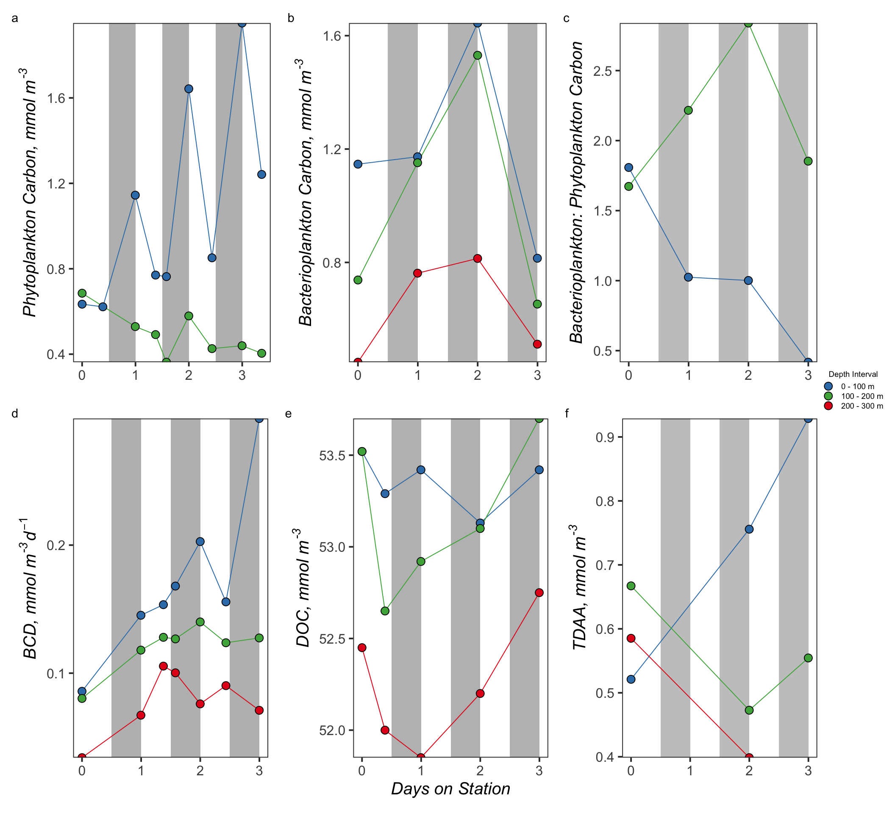

S4 Integration Plots
================
Nicholas Baetge
8/12/2020

# Intro

Here, we plot the integrated from the multiday NAAMES station, N2S4.

``` r
library(tidyverse) 
library(rmarkdown)
library(knitr)
library(readxl)
library(data.table) 
library(scales)
library(zoo)
library(oce)
library(patchwork)
#rmarkdown tables
library(stargazer)
library(pander)
#stat tests
library(lmtest)
library(lmodel2)
library(rstatix)
library(ggpubr)
library(lubridate)
```

``` r
custom_theme <- function() {
  theme_test(base_size = 30) %+replace%
    theme(legend.position = "right",
          legend.spacing.x = unit(0.5,"cm"),
          legend.title = element_text(size = 14),
          legend.text = element_text(size = 14),
          legend.background = element_rect(fill = "transparent",colour = NA),
          legend.key = element_rect(fill = "transparent",colour = NA),
          panel.background = element_rect(fill = "transparent",colour = NA),
          plot.background = element_rect(fill = "transparent",colour = NA)) 
}

custom.colors <- c("AT39" = "#377EB8", "AT34" = "#4DAF4A", "AT38" = "#E41A1C", "AT32" = "#FF7F00", "Temperate" = "#A6CEE3", "Subpolar" = "#377EB8", "Subtropical" = "#FB9A99", "GS/Sargasso" = "#E41A1C", "Early Spring" = "#377EB8", "Late Spring" = "#4DAF4A","Early Autumn" = "#E41A1C", "Late Autumn" = "#FF7F00",  "0 - 75 m" = "#27ab19", "75 - 100 m" = "#feb483", "100 - 300 m" = "#d16cfa")

levels = c("GS/Sargasso", "Subtropical", "Temperate", "Subpolar",  "AT39-6", "AT34", "AT38", "AT32","South", "North", "Early Spring", "Late Spring","Early Autumn",  "Late Autumn", "0 - 75 m", "75 - 100 m", "100 - 300 m")

odv.colors <- c("#feb483", "#d31f2a", "#ffc000", "#27ab19", "#0db5e6", "#7139fe", "#d16cfa")
```

# Import Data

``` r
data <- read_rds("~/GITHUB/naames_multiday/Output/processed_data.rds") %>% 
  filter(Cruise == "AT34" & Station == 4 | Cruise == "AT38" & Station == 6) %>% 
  filter(Cruise == "AT34") %>% 
  mutate(time = ymd_hms(datetime),
         interv = interval(first(time), time),
         dur = as.duration(interv),
         days = as.numeric(dur, "days"),
         eddy = ifelse(Date != "2016-05-27" & Station != 6, "Core", "Outside")) %>% 
  select(Cruise, Station, Date, eddy, time:days, bcd.75:npp.300) %>% 
  distinct() %>% 
  mutate_at(vars(contains(c("phyc", "npp", "bc"))), function(x) (x / 1000)) %>%
  mutate(bc_phyc.75 = bc.75/phyc.75,
         bc_phyc.100 = bc.100/phyc.100,
         bc_phyc.300 = bc.300/phyc.300,
         bcd_phyc.75 = bcd.75/phyc.75,
         bcd_phyc.100 = bcd.100/phyc.100,
         bcd_phyc.300 = bcd.300/phyc.300
         ) %>% 
   mutate_at(vars(contains("tdaa")), funs(. / 10^3)) #nM to mmol/m3
```

    ## Warning: funs() is soft deprecated as of dplyr 0.8.0
    ## Please use a list of either functions or lambdas: 
    ## 
    ##   # Simple named list: 
    ##   list(mean = mean, median = median)
    ## 
    ##   # Auto named with `tibble::lst()`: 
    ##   tibble::lst(mean, median)
    ## 
    ##   # Using lambdas
    ##   list(~ mean(., trim = .2), ~ median(., na.rm = TRUE))
    ## This warning is displayed once per session.

# Pivot data

``` r
pivot_phyc_data <- data %>% 
  select(Cruise:days,  phyc.75, phyc.100, phyc.300) %>% 
  pivot_longer(phyc.75:phyc.300, names_to = "depth_interval", names_prefix = "phyc.", values_to = "phyc") %>% 
  mutate(depth_interval = ifelse(depth_interval == 75, "0 - 75 m", depth_interval),
         depth_interval = ifelse(depth_interval == 100, "75 - 100 m", depth_interval),
         depth_interval = ifelse(depth_interval == 300, "100 - 300 m", depth_interval))


pivot_npp_data <- data %>% 
  select(Cruise:days, contains("npp")) %>% 
  pivot_longer(npp.75:npp.300, names_to = "depth_interval", names_prefix = "npp.", values_to = "npp") %>% 
  mutate(depth_interval = ifelse(depth_interval == 75, "0 - 75 m", depth_interval),
         depth_interval = ifelse(depth_interval == 100, "75 - 100 m", depth_interval),
         depth_interval = ifelse(depth_interval == 300, "100 - 300 m", depth_interval))


pivot_bc_data <- data %>% 
  select(Cruise:days, contains("bc.")) %>% 
  pivot_longer(bc.75:bc.300, names_to = "depth_interval", names_prefix = "bc.", values_to = "bc") %>% 
  mutate(depth_interval = ifelse(depth_interval == 75, "0 - 75 m", depth_interval),
         depth_interval = ifelse(depth_interval == 100, "75 - 100 m", depth_interval),
         depth_interval = ifelse(depth_interval == 300, "100 - 300 m", depth_interval))


pivot_bcd_data <- data %>% 
  select(Cruise:days, bcd.75, bcd.100, bcd.300) %>% 
  pivot_longer(bcd.75:bcd.300, names_to = "depth_interval", names_prefix = "bcd.", values_to = "bcd") %>% 
  mutate(depth_interval = ifelse(depth_interval == 75, "0 - 75 m", depth_interval),
         depth_interval = ifelse(depth_interval == 100, "75 - 100 m", depth_interval),
         depth_interval = ifelse(depth_interval == 300, "100 - 300 m", depth_interval))


pivot_bc_phyc_data <- data %>% 
  select(Cruise:days, contains("bc_phyc")) %>% 
  pivot_longer(bc_phyc.75:bc_phyc.300, names_to = "depth_interval", names_prefix = "bc_phyc.", values_to = "bc.phyc") %>% 
  mutate(depth_interval = ifelse(depth_interval == 75, "0 - 75 m", depth_interval),
         depth_interval = ifelse(depth_interval == 100, "75 - 100 m", depth_interval),
         depth_interval = ifelse(depth_interval == 300, "100 - 300 m", depth_interval))

pivot_doc_data <- data %>% 
  select(Cruise:days, contains("doc")) %>% 
  pivot_longer(doc.75:doc.300, names_to = "depth_interval", names_prefix = "doc.", values_to = "doc") %>% 
  mutate(depth_interval = ifelse(depth_interval == 75, "0 - 75 m", depth_interval),
         depth_interval = ifelse(depth_interval == 100, "75 - 100 m", depth_interval),
         depth_interval = ifelse(depth_interval == 300, "100 - 300 m", depth_interval))

pivot_tdaa_data <- data %>% 
  select(Cruise:days, contains("tdaa")) %>% 
  pivot_longer(tdaa.75:tdaa.300, names_to = "depth_interval", names_prefix = "tdaa.", values_to = "tdaa") %>% 
  mutate(depth_interval = ifelse(depth_interval == 75, "0 - 75 m", depth_interval),
         depth_interval = ifelse(depth_interval == 100, "75 - 100 m", depth_interval),
         depth_interval = ifelse(depth_interval == 300, "100 - 300 m", depth_interval))

pivoted <- left_join(pivot_phyc_data, pivot_npp_data) %>% 
  left_join(., pivot_bc_data) %>% 
  left_join(., pivot_bcd_data) %>% 
  left_join(., pivot_bc_phyc_data) %>% 
  left_join(., pivot_doc_data) %>% 
  left_join(., pivot_tdaa_data) 
```

# Plot Data

### Phyto Carbon

### Bact Carbon

### BCD

### BC : PhyC

### DOC

### TDAA


