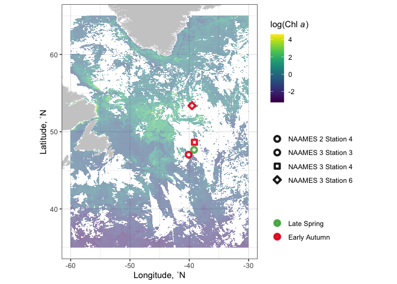
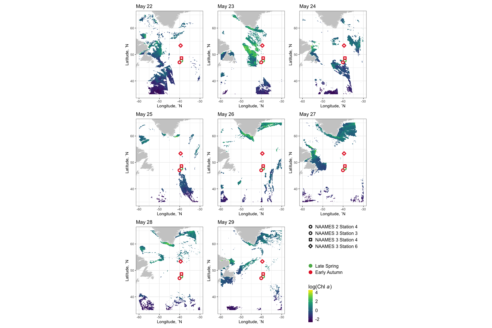

remote\_sensing\_map
================
Nicholas Baetge
12/13/2021

## Map

``` r
library(tidyverse) 
library(lubridate)
library(patchwork)
library(ggpubr)
library(viridis)
library(oce)
```

    ## Error in get(genname, envir = envir) : object 'testthat_print' not found

``` r
library(hms)
library(readxl)

library(akima)
library(mapdata)
library(maps)
library(rerddap)
```

## Chl climatology

[tutorial](https://rmendels.github.io/pices2017.nb.html)  
[tutorial2](https://rpubs.com/eqmh/sat-data-plotter-mapper)

``` r
custom.colors <- c("AT39" = "#377EB8", "AT34" = "#4DAF4A", "AT38" = "#E41A1C", "AT32" = "#FF7F00", "Temperate" = "#A6CEE3", "Subpolar" = "#377EB8", "Subtropical" = "#FB9A99", "GS/Sargasso" = "#E41A1C", "Early Spring" = "#377EB8", "Late Spring" = "#4DAF4A","Early Autumn" = "#E41A1C", "Late Autumn" = "#FF7F00",  "0-75 m" = "#A50026", "75-200 m" = "#313695", "Euphotic" = "#A50026", "Upper Mesopelagic" = "#313695", "Mesopelagic" = "#d16cfa", "NAAMES 2 Station 4" = "#4DAF4A", "NAAMES 3 Station 3" = "#E41A1C", "NAAMES 3 Station 4" = "#E41A1C", "NAAMES 3 Station 6" = "#E41A1C")

custom.shapes <- c("NAAMES 2 Station 4" = 21, "NAAMES 3 Station 3" = 21, "NAAMES 3 Station 4" = 22, "NAAMES 3 Station 6" = 23)

levels = c( "Late Spring","Early Autumn")
```

``` r
# chlaInfo <- info("erdMH1chla8day")
chlaInfo <- info("erdMH1chla1day")

CHLA <- griddap(chlaInfo, latitude = c(35., 65.), longitude = c(-60, -30), time = c('2016-05-20','2016-05-31'), fields = 'chlorophyll')

CHLA_1 <- griddap(chlaInfo, latitude = c(35., 65.), longitude = c(-60, -30), time = c('2016-05-22', '2016-05-22'), fields = 'chlorophyll')

CHLA_2 <- griddap(chlaInfo, latitude = c(35., 65.), longitude = c(-60, -30), time = c('2016-05-23', '2016-05-23'), fields = 'chlorophyll')

CHLA_3 <- griddap(chlaInfo, latitude = c(35., 65.), longitude = c(-60, -30), time = c('2016-05-24', '2016-05-24'), fields = 'chlorophyll')

CHLA_4 <- griddap(chlaInfo, latitude = c(35., 65.), longitude = c(-60, -30), time = c('2016-05-25', '2016-05-25'), fields = 'chlorophyll')


CHLA_5 <- griddap(chlaInfo, latitude = c(35., 65.), longitude = c(-60, -30), time = c('2016-05-26', '2016-05-26'), fields = 'chlorophyll')

CHLA_6 <- griddap(chlaInfo, latitude = c(35., 65.), longitude = c(-60, -30), time = c('2016-05-27', '2016-05-27'), fields = 'chlorophyll')

CHLA_7 <- griddap(chlaInfo, latitude = c(35., 65.), longitude = c(-60, -30), time = c('2016-05-28', '2016-05-28'), fields = 'chlorophyll')

CHLA_8 <- griddap(chlaInfo, latitude = c(35., 65.), longitude = c(-60, -30), time = c('2016-05-29', '2016-05-29'), fields = 'chlorophyll')


stations <- read_xlsx("~/GITHUB/naames_bioav_ms/Input/stations.xlsx") %>% 
  select(Cruise, Station, Latitude, Longitude) %>% 
  mutate(Season = ifelse(Cruise == "AT32", "Early Winter", NA),
         Season = ifelse(Cruise == "AT34", "Late Spring", Season),
         Season = ifelse(Cruise == "AT38", "Early Autumn", Season),
         Season = ifelse(Cruise == "AT39", "Early Spring", Season)) %>% 
  filter(Cruise %in% c("AT34", "AT38")) %>% 
  filter(Cruise == "AT34" & Station == 4 | Cruise == "AT38" & Station %in% c(3,4,6)) %>% 
  mutate(name = ifelse(Cruise == "AT34", "NAAMES 2", "NAAMES 3"), 
         plot_name = paste(name, "Station", Station))
```

## 11 day composite

``` r
mycolor <- colors$viridis
w <- map_data("worldHires", ylim = c(35., 65.), xlim = c(-60, -30))

map <- ggplot() + 
  geom_polygon(data = w, aes(x = long, y = lat, group = group), fill = "grey80") +
  geom_raster(data = CHLA$data, aes(x = lon, y = lat, fill = log(chlorophyll)), interpolate = FALSE, alpha = 0.55) +
  scale_fill_gradientn(colors = mycolor, na.value = NA) +
  theme_bw() + 
  labs(x = "Longitude, ˚N", y = "Latitude, ˚N", fill = expression(paste("log(Chl ", italic("a"), ")")), color = "", shape = "") +
  coord_fixed(1.3, xlim = c(-60, -30),  ylim = c(35., 65.)) +
  geom_point(data = stations, aes(x = Longitude, y = Latitude, color = factor(Season, levels = levels), shape = plot_name), fill = "white", size = 2, alpha = 0.9, stroke = 2) +
  scale_color_manual(values = custom.colors) + 
  scale_shape_manual(values = custom.shapes); map
```

<!-- -->

\#1 day composite

``` r
map1 <- ggplot() + 
  geom_polygon(data = w, aes(x = long, y = lat, group = group), fill = "grey80") +
  geom_tile(data = CHLA_1$data, aes(x = lon, y = lat, fill = log(chlorophyll))) +
  scale_fill_gradientn(colors = mycolor, na.value = NA) +
  theme_bw() + 
  labs(x = "Longitude, ˚N", y = "Latitude, ˚N", fill = expression(paste("log(Chl ", italic("a"), ")")), color = "", shape = "") +
  coord_fixed(1.3, xlim = c(-60, -30),  ylim = c(35., 65.)) +
  geom_point(data = stations, aes(x = Longitude, y = Latitude, color = factor(Season, levels = levels), shape = plot_name), fill = "white", size = 2, alpha = 0.9, stroke = 2) +
  scale_color_manual(values = custom.colors) + 
  scale_shape_manual(values = custom.shapes) +
  ggtitle("May 22") +
   theme(panel.spacing.x = unit(1, "cm"),
         legend.title = element_text(size = 14),
        legend.key.size = unit(0.4, "cm"),
        legend.key.width = unit(0.4, "cm"),
        legend.key.height = unit(0.6, "cm"),
        legend.position = "right",
        legend.text = element_text(size = 12),
        legend.spacing.y = unit(0, "pt")) 
```

``` r
map2 <- ggplot() + 
  geom_polygon(data = w, aes(x = long, y = lat, group = group), fill = "grey80") +
  geom_tile(data = CHLA_2$data, aes(x = lon, y = lat, fill = log(chlorophyll))) +
  scale_fill_gradientn(colors = mycolor, na.value = NA) +
  theme_bw() + 
  labs(x = "Longitude, ˚N", y = "Latitude, ˚N", fill = expression(paste("log(Chl ", italic("a"), ")")), color = "") +
  coord_fixed(1.3, xlim = c(-60, -30),  ylim = c(35., 65.)) +
  geom_point(data = stations, aes(x = Longitude, y = Latitude, color = factor(Season, levels = levels), shape = plot_name), fill = "white", size = 2, alpha = 0.9, stroke = 2) +
  guides(fill = F, shape = F, color = F) +
  scale_color_manual(values = custom.colors) + 
  scale_shape_manual(values = custom.shapes) +
  ggtitle("May 23") 
```

``` r
map3 <-ggplot() + 
  geom_polygon(data = w, aes(x = long, y = lat, group = group), fill = "grey80") +
  geom_tile(data = CHLA_3$data, aes(x = lon, y = lat, fill = log(chlorophyll))) +
  scale_fill_gradientn(colors = mycolor, na.value = NA) +
  theme_bw() + 
  labs(x = "Longitude, ˚N", y = "Latitude, ˚N", fill = expression(paste("log(Chl ", italic("a"), ")")), color = "") +
  coord_fixed(1.3, xlim = c(-60, -30),  ylim = c(35., 65.)) +
  geom_point(data = stations, aes(x = Longitude, y = Latitude, color = factor(Season, levels = levels), shape = plot_name), fill = "white", size = 2, alpha = 0.9, stroke = 2) +
  guides(fill = F, shape = F, color = F) +
  scale_color_manual(values = custom.colors) + 
  scale_shape_manual(values = custom.shapes) + 
  ggtitle("May 24")
```

``` r
map4 <- ggplot() + 
  geom_polygon(data = w, aes(x = long, y = lat, group = group), fill = "grey80") +
  geom_tile(data = CHLA_4$data, aes(x = lon, y = lat, fill = log(chlorophyll))) +
  scale_fill_gradientn(colors = mycolor, na.value = NA) +
  theme_bw() + 
  labs(x = "Longitude, ˚N", y = "Latitude, ˚N", fill = expression(paste("log(Chl ", italic("a"), ")")), color = "") +
  coord_fixed(1.3, xlim = c(-60, -30),  ylim = c(35., 65.)) +
  geom_point(data = stations, aes(x = Longitude, y = Latitude, color = factor(Season, levels = levels), shape = plot_name), fill = "white", size = 2, alpha = 0.9, stroke = 2) +
  guides(fill = F, shape = F, color = F) +
  scale_color_manual(values = custom.colors) + 
  scale_shape_manual(values = custom.shapes) +
  ggtitle("May 25") 
```

``` r
map5 <- ggplot() + 
  geom_polygon(data = w, aes(x = long, y = lat, group = group), fill = "grey80") +
  geom_tile(data = CHLA_5$data, aes(x = lon, y = lat, fill = log(chlorophyll))) +
  scale_fill_gradientn(colors = mycolor, na.value = NA) +
  theme_bw() + 
  labs(x = "Longitude, ˚N", y = "Latitude, ˚N", fill = expression(paste("log(Chl ", italic("a"), ")")), color = "") +
  coord_fixed(1.3, xlim = c(-60, -30),  ylim = c(35., 65.)) +
  geom_point(data = stations, aes(x = Longitude, y = Latitude, color = factor(Season, levels = levels), shape = plot_name), fill = "white", size = 2, alpha = 0.9, stroke = 2) +
  guides(fill = F, shape = F, color = F) +
  scale_color_manual(values = custom.colors) + 
  scale_shape_manual(values = custom.shapes) +
  ggtitle("May 26")
```

``` r
map6 <- ggplot() + 
  geom_polygon(data = w, aes(x = long, y = lat, group = group), fill = "grey80") +
  geom_tile(data = CHLA_6$data, aes(x = lon, y = lat, fill = log(chlorophyll))) +
  scale_fill_gradientn(colors = mycolor, na.value = NA) +
  theme_bw() + 
  labs(x = "Longitude, ˚N", y = "Latitude, ˚N", fill = expression(paste("log(Chl ", italic("a"), ")")), color = "") +
  coord_fixed(1.3, xlim = c(-60, -30),  ylim = c(35., 65.)) +
  geom_point(data = stations, aes(x = Longitude, y = Latitude, color = factor(Season, levels = levels), shape = plot_name), fill = "white", size = 2, alpha = 0.9, stroke = 2) +
  guides(fill = F, shape = F, color = F) +
  scale_color_manual(values = custom.colors) + 
  scale_shape_manual(values = custom.shapes) +
  ggtitle("May 27")
```

``` r
map7 <- ggplot() + 
  geom_polygon(data = w, aes(x = long, y = lat, group = group), fill = "grey80") +
  geom_tile(data = CHLA_7$data, aes(x = lon, y = lat, fill = log(chlorophyll))) +
  scale_fill_gradientn(colors = mycolor, na.value = NA) +
  theme_bw() + 
  labs(x = "Longitude, ˚N", y = "Latitude, ˚N", fill = expression(paste("log(Chl ", italic("a"), ")")), color = "") +
  coord_fixed(1.3, xlim = c(-60, -30),  ylim = c(35., 65.)) +
  geom_point(data = stations, aes(x = Longitude, y = Latitude, color = factor(Season, levels = levels), shape = plot_name), fill = "white", size = 2, alpha = 0.9, stroke = 2) +
  guides(fill = F, shape = F, color = F) +
  scale_color_manual(values = custom.colors) + 
  scale_shape_manual(values = custom.shapes) +
  ggtitle("May 28")
```

``` r
map8 <- ggplot() + 
  geom_polygon(data = w, aes(x = long, y = lat, group = group), fill = "grey80") +
  geom_tile(data = CHLA_8$data, aes(x = lon, y = lat, fill = log(chlorophyll))) +
  scale_fill_gradientn(colors = mycolor, na.value = NA) +
  theme_bw() + 
  labs(x = "Longitude, ˚N", y = "Latitude, ˚N", fill = expression(paste("log(Chl ", italic("a"), ")")), color = "") +
  coord_fixed(1.3, xlim = c(-60, -30),  ylim = c(35., 65.)) +
  geom_point(data = stations, aes(x = Longitude, y = Latitude, color = factor(Season, levels = levels), shape = plot_name), fill = "white", size = 2, alpha = 0.9, stroke = 2) +
  guides(fill = F, shape = F, color = F) +
  scale_color_manual(values = custom.colors) + 
  scale_shape_manual(values = custom.shapes) + 
  ggtitle("May 29")
```

``` r
map1 + map2 + map3 + map4 + map5 + map6 + map7 + map8 + guide_area() + plot_layout(guides = "collect")
```

<!-- -->
